# 第十一章：哈希表（Hash Tables）——深度详解版

> 哈希表是计算机科学中最优雅、最实用的数据结构之一。它将"大海捞针"式的查找转化为"直取目标"式的访问，是实现字典、集合、缓存等核心数据结构的基石。

---

## 一、哈希表基础理论

### 1.1 为什么需要哈希表？

在讨论哈希表之前，让我们深入分析各种数据结构的查找效率：

#### 1.1.1 线性查找的困境

**无序数组的查找**：
```java
// 在无序数组中查找元素，最坏情况需要遍历整个数组
int find(int[] arr, int target) {
    for (int i = 0; i < arr.length; i++) {
        if (arr[i] == target) {
            return i;  // 找到返回索引
        }
    }
    return -1;  // 未找到
}
```

**时间复杂度分析**：
- 最坏情况：O(n) —— 需要检查所有 n 个元素
- 平均情况：O(n/2) = O(n) —— 仍然需要检查一半元素
- 无论数据如何组织，线性查找都无法避免全量扫描

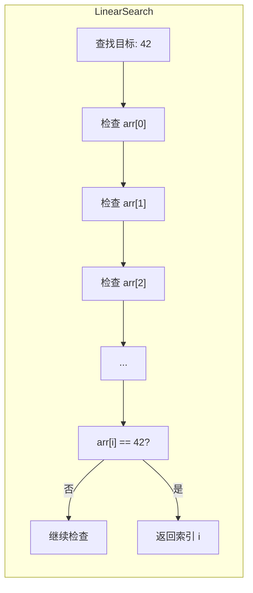

#### 1.1.2 二分查找的突破

**有序数组 + 二分查找**：
```java
// 二分查找：每次排除一半的元素
int binarySearch(int[] arr, int target) {
    int left = 0;
    int right = arr.length - 1;

    while (left <= right) {
        int mid = left + (right - left) / 2;
        if (arr[mid] == target) {
            return mid;
        } else if (arr[mid] < target) {
            left = mid + 1;
        } else {
            right = mid - 1;
        }
    }
    return -1;
}
```

**时间复杂度分析**：
```
第 1 次比较：n/2 个元素被排除
第 2 次比较：n/4 个元素被排除
...
第 k 次比较：n/2^k 个元素被排除

当 n/2^k = 1 时，k = log₂n

结论：T(n) = O(log n)
```

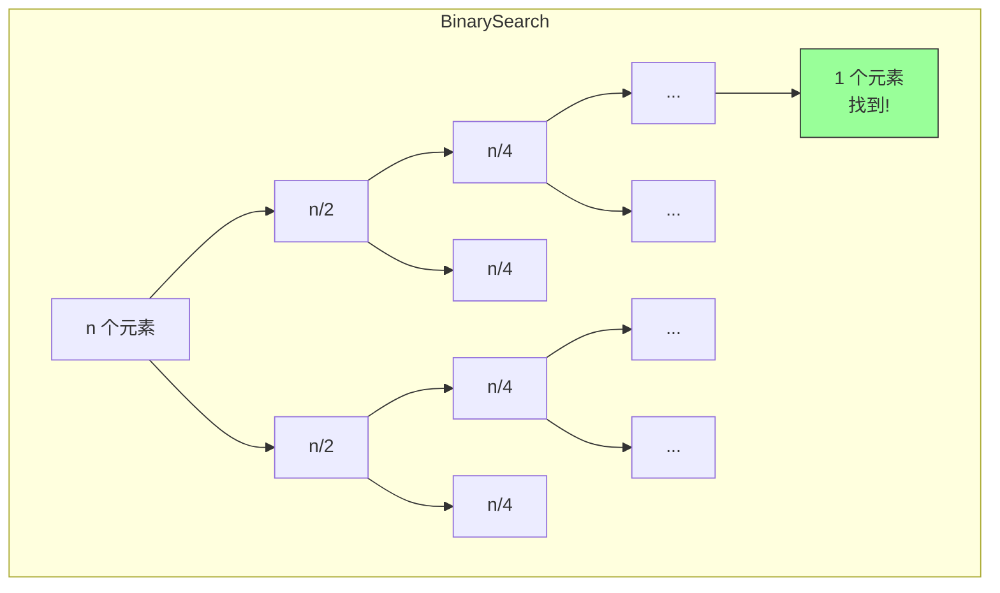

#### 1.1.3 哈希表的革命性突破

**哈希表的查找**：直接通过键计算存储位置，一步到位。

```
传统查找：逐个比较 → O(n) 或 O(log n)
哈希查找：直接计算 → O(1) 平均
```

| 数据结构 | 查找时间 | 插入时间 | 删除时间 | 空间复杂度 | 实现复杂度 |
|---------|---------|---------|---------|-----------|-----------|
| 无序数组 | O(n) | O(1) | O(n) | O(n) | 简单 |
| 有序数组 | O(log n) | O(n) | O(n) | O(n) | 中等 |
| 链表 | O(n) | O(1) | O(n) | O(n) | 简单 |
| 平衡二叉搜索树 | O(log n) | O(log n) | O(log n) | O(n) | 复杂 |
| **哈希表** | **O(1) 平均** | **O(1) 平均** | **O(1) 平均** | **O(n)** | **中等** |

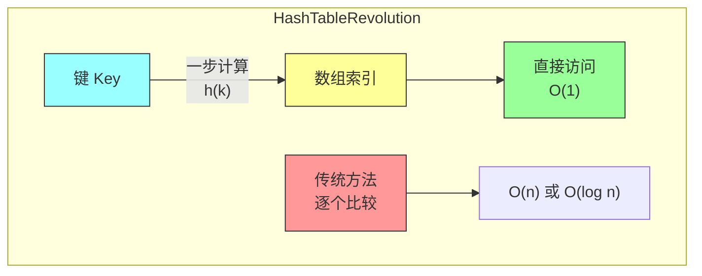

### 1.2 哈希表的形式化定义

#### 1.2.1 基本概念

**哈希表**是一种数据结构，它包含两个核心组件：

1. **哈希函数（Hash Function）**：h: U → {0, 1, 2, ..., m-1}
   - U 是键的宇宙（所有可能的键的集合）
   - {0, 1, ..., m-1} 是桶数组的索引范围

2. **桶数组（Bucket Array）**：T[0...m-1]
   - 每个桶可以存储一个或多个元素
   - 桶的数量 m 决定了哈希表的大小

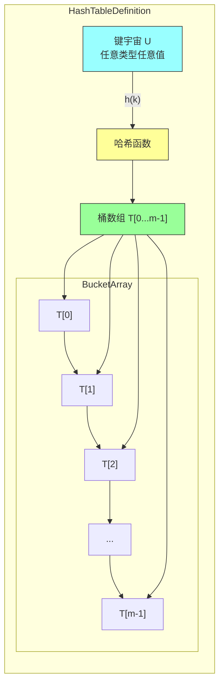

#### 1.2.2 装载因子（Load Factor）

**定义**：装载因子 α 表示哈希表中元素的填充程度

```
α = n / m
其中：
- n = 存储的元素数量
- m = 桶的数量
```

**装载因子的意义**：

| α 的范围 | 含义 | 性能影响 |
|---------|-----|---------|
| α < 0.5 | 稀疏 | 冲突少，查找快 |
| α ≈ 0.75 | 适中（推荐） | 性能最优 |
| α > 1.0 | 链地址法仍可用<br/>开放定址法失效 | 冲突频繁 |
| α → ∞ | 性能退化 | 接近 O(n) |

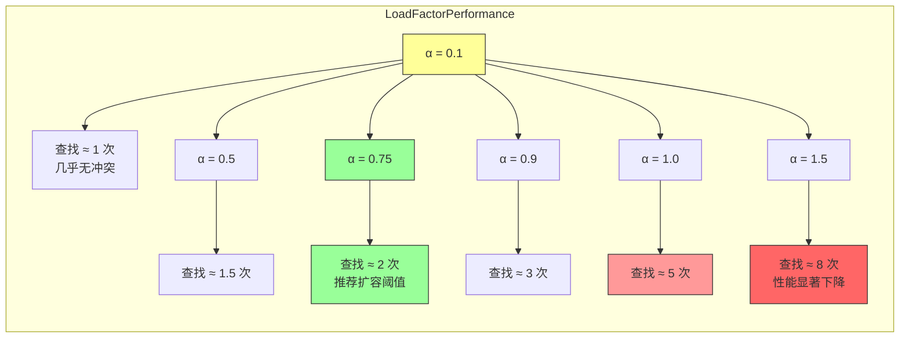

---

## 二、哈希函数设计

### 2.1 哈希函数的本质

哈希函数的核心作用是将任意类型、任意范围的键映射到有限的桶索引范围内。

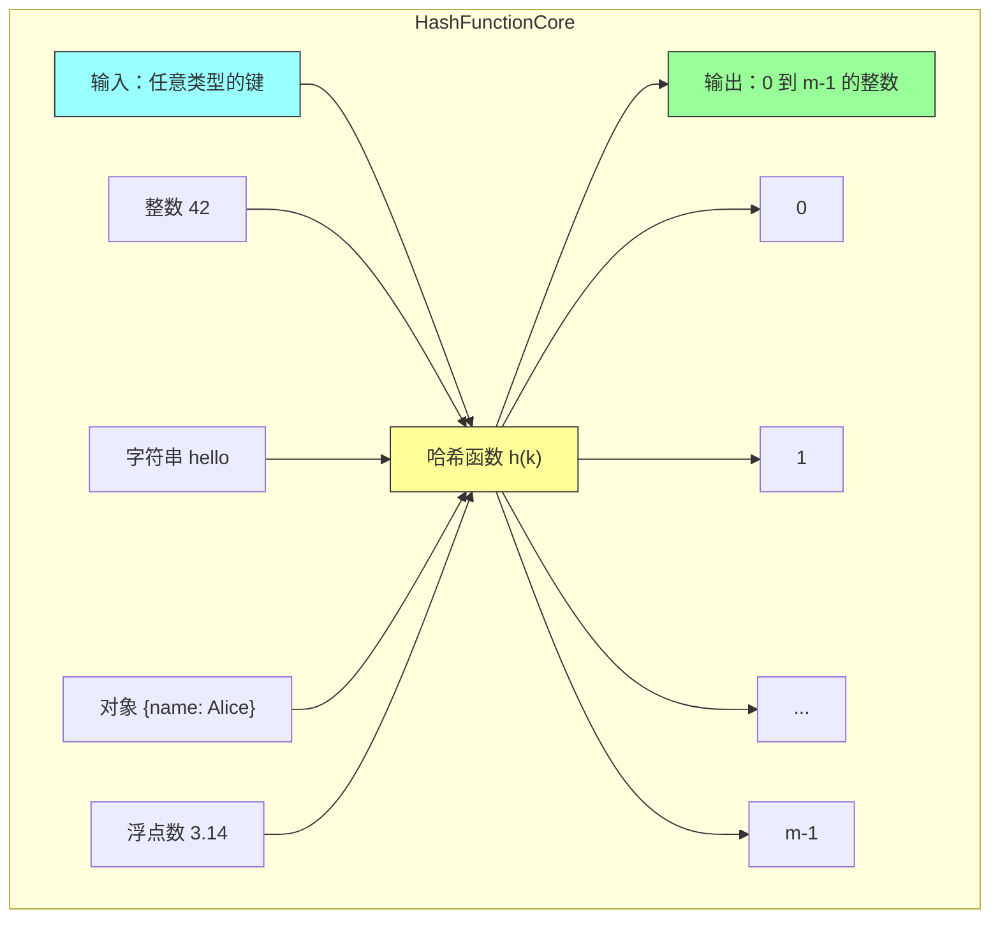

### 2.2 好的哈希函数应该具备什么特性？

#### 2.2.1 确定性（Determinism）

**定义**：相同的键必须映射到相同的桶。

```java
// ✅ 正确的实现
int hash(String key) {
    return key.hashCode();  // 相同的字符串产生相同的哈希值
}

// ❌ 错误的实现
int hash(String key) {
    return Random.nextInt(m);  // 每次调用结果不同！
}
```

#### 2.2.2 均匀性（Uniformity）

**定义**：哈希函数应该将键均匀分布到所有桶中，避免某些桶过于拥挤。

**数学期望**：对于任意桶 i，期望的链表长度为 α = n/m

```
E[length(bucket i)] = n/m = α
```

**均匀性的重要性**：

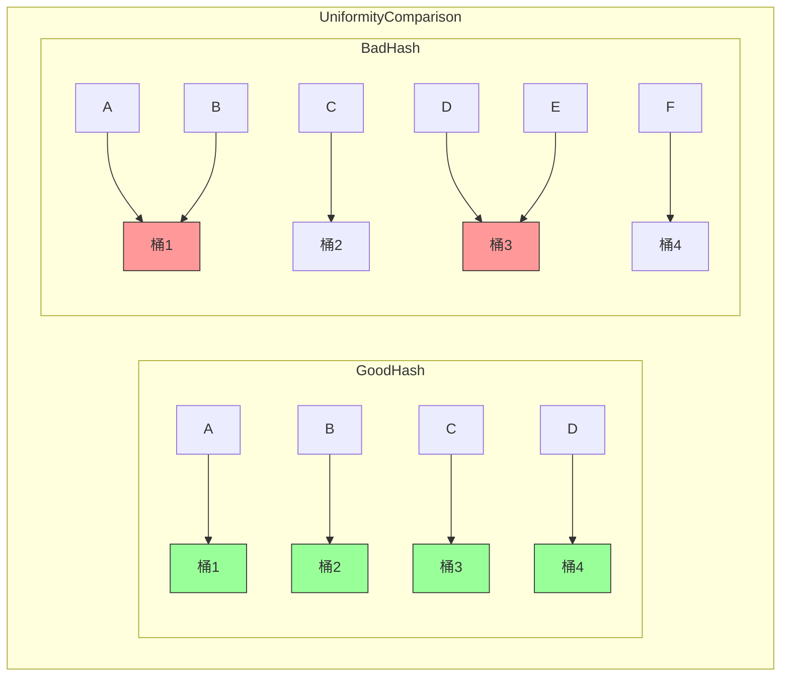

#### 2.2.3 高效性（Efficiency）

**定义**：计算哈希值应该是 O(1) 时间复杂度。

#### 2.2.4 雪崩效应（Avalanche Effect）

**定义**：输入的微小变化应该导致哈希值的巨大变化。

```java
// 雪崩效应的例子
"hello".hashCode()  // 99162322
"hella".hashCode()  // 应该与 99162322 完全不同
"hello world".hashCode()  // 也应该完全不同
```

### 2.3 整数键的哈希函数

#### 2.3.1 除法哈希法（Division Method）

**公式**：
```
h(k) = k mod m
```

**选择 m 的原则**：
1. m 应该是质数（prime number）
2. m 不应该接近 2 的幂
3. m 通常取 2 的幂附近的质数（如 1024 → 997, 2048 → 2003）

**为什么选择质数？**

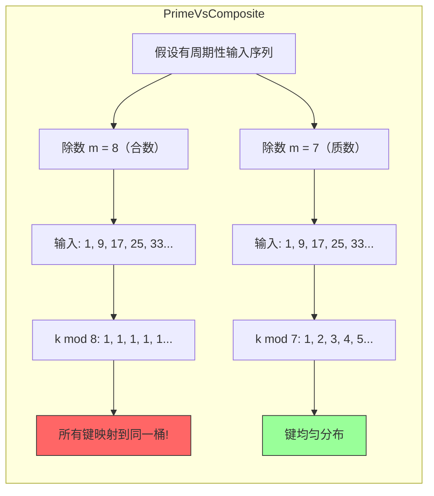

**完整实现（除法哈希法）**：

```java
/**
 * 除法哈希函数
 *
 * 原理：h(k) = k mod m
 * 关键点：m 应该是质数
 */
public class DivisionHashFunction {
    private final int m;  // 桶的数量

    public DivisionHashFunction(int m) {
        if (!isPrime(m)) {
            throw new IllegalArgumentException("m 应该是质数，建议值：" + findNearestPrime(m));
        }
        this.m = m;
    }

    /**
     * 计算哈希值
     * @param key 整数键
     * @return 桶索引 [0, m-1]
     */
    public int hash(int key) {
        // 处理负数：取绝对值后取模
        return Math.abs(key) % m;
    }

    public int hash(long key) {
        return (int) (Math.abs(key) % m);
    }

    /**
     * 判断是否为质数
     */
    public static boolean isPrime(int n) {
        if (n < 2) return false;
        if (n == 2) return true;
        if (n % 2 == 0) return false;

        // 只需检查到 sqrt(n)
        int sqrt = (int) Math.sqrt(n);
        for (int i = 3; i <= sqrt; i += 2) {
            if (n % i == 0) {
                return false;
            }
        }
        return true;
    }

    /**
     * 找到最接近的质数
     */
    public static int findNearestPrime(int n) {
        if (n <= 1) return 2;

        int candidate = n;
        while (!isPrime(candidate)) {
            candidate++;
        }
        return candidate;
    }

    @Override
    public String toString() {
        return "DivisionHashFunction(m=" + m + ")";
    }
}
```

#### 2.3.2 乘法哈希法（Multiplication Method）

**公式**：
```
h(k) = floor(m × (k × A mod 1))
其中 A 是常数，0 < A < 1
```

**黄金分割比例**：A = (√5 - 1) / 2 ≈ 0.618033988749895

**为什么选择黄金分割比例？**
- 黄金分割比例是一个"无理数"
- 任何数与无理数相乘后取小数部分，分布更均匀
- Knuth 推荐使用这个值

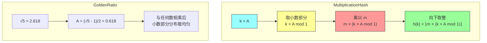

**完整实现（乘法哈希法）**：

```java
import java.math.BigDecimal;

/**
 * 乘法哈希函数
 *
 * 原理：h(k) = floor(m × (k × A mod 1))
 * 优点：对 m 的选择不敏感
 */
public class MultiplicationHashFunction {
    private final int m;  // 桶的数量
    private final double A;  // 常数

    /**
     * 使用默认的黄金分割比例
     */
    public MultiplicationHashFunction(int m) {
        this(m, (Math.sqrt(5) - 1) / 2);
    }

    /**
     * 使用指定的 A 值
     * @param m 桶的数量
     * @param A 常数，0 < A < 1
     */
    public MultiplicationHashFunction(int m, double A) {
        if (m <= 0) {
            throw new IllegalArgumentException("m 必须大于 0");
        }
        if (A <= 0 || A >= 1) {
            throw new IllegalArgumentException("A 必须在 (0, 1) 范围内");
        }
        this.m = m;
        this.A = A;
    }

    /**
     * 计算哈希值
     */
    public int hash(int key) {
        // k × A mod 1 的精确计算
        double product = key * A;
        double fractional = product - Math.floor(product);
        return (int) (m * fractional);
    }

    public int hash(long key) {
        double product = key * A;
        double fractional = product - Math.floor(product);
        return (int) (m * fractional);
    }

    /**
     * 使用 BigDecimal 提高精度（防止浮点误差）
     */
    public int hashPrecise(long key) {
        BigDecimal k = BigDecimal.valueOf(key);
        BigDecimal a = BigDecimal.valueOf(A);
        BigDecimal mDec = BigDecimal.valueOf(m);

        BigDecimal product = k.multiply(a);
        BigDecimal fractional = product.remainder(BigDecimal.ONE);
        BigDecimal result = mDec.multiply(fractional);

        return result.intValue();
    }

    @Override
    public String toString() {
        return String.format("MultiplicationHashFunction(m=%d, A=%.10f)", m, A);
    }
}
```

#### 2.3.3 乘法哈希 vs 除法哈希

| 特性 | 乘法哈希 | 除法哈希 |
|-----|---------|---------|
| 对 m 的敏感度 | 不敏感 | 敏感 |
| m 的选择 | 任意 2 的幂 | 质数 |
| 计算复杂度 | 涉及浮点运算 | 简单的取模 |
| 均匀性 | 非常好 | 好（需质数） |
| 适用场景 | m 不固定或需频繁调整 | m 相对固定 |

### 2.4 字符串键的哈希函数

#### 2.4.1 多项式哈希函数（Polynomial Hash Function）

**公式**（Horner's Method）：
```
h(s) = Σ(s[i] × p^(n-1-i)) mod m
    = (((s[0] × p + s[1]) × p + s[2]) × p + ...) mod m
```

**直观理解**：
```
"abc" = 97 × p² + 98 × p¹ + 99 × p⁰
```

**Java 实现（逐字符计算）**：

```java
/**
 * 字符串多项式哈希函数
 *
 * h(s) = Σ(s[i] × p^(n-1-i)) mod m
 *     = (((s[0] × p + s[1]) × p + s[2]) × p + ...) mod m
 */
public class StringHashFunction {
    private final int m;      // 模数
    private final int base;   // 基数

    public StringHashFunction(int m, int base) {
        this.m = m;
        this.base = base;
    }

    /**
     * 计算字符串的哈希值
     */
    public int hash(String s) {
        if (s == null || s.isEmpty()) {
            return 0;
        }

        int hashValue = 0;
        for (int i = 0; i < s.length(); i++) {
            // 使用 Horner's method 避免溢出
            hashValue = (hashValue * base + s.charAt(i)) % m;
        }

        return hashValue;
    }

    /**
     * 详细展示计算过程
     */
    public String hashVerbose(String s) {
        if (s == null || s.isEmpty()) {
            return "空字符串 -> 0";
        }

        StringBuilder sb = new StringBuilder();
        sb.append("'").append(s).append("' 的哈希计算过程:\n");

        int hashValue = 0;
        for (int i = 0; i < s.length(); i++) {
            int oldHash = hashValue;
            char c = s.charAt(i);
            hashValue = (hashValue * base + c) % m;
            sb.append(String.format("h = (%d × %d + %d) mod %d = %d\n",
                    oldHash, base, (int) c, m, hashValue));
        }

        sb.append(String.format("最终结果: %d", hashValue));
        return sb.toString();
    }

    /**
     * 演示雪崩效应
     */
    public void demoAvalancheEffect() {
        String[] testStrings = {"hello", "hella", "hellb", "world"};
        System.out.println("\n【雪崩效应验证】");
        for (String s : testStrings) {
            System.out.println(String.format("  '%s' -> %d", s, hash(s)));
        }
    }

    /**
     * 演示完整计算过程
     */
    public void demoAll() {
        System.out.println("=".repeat(60));
        System.out.println("字符串哈希函数演示");
        System.out.println("=".repeat(60));

        // 单字符
        System.out.println("\n【单字符】");
        System.out.println(hashVerbose("a"));

        // 多字符
        System.out.println("\n【多字符】");
        System.out.println(hashVerbose("ab"));

        // 完整字符串
        System.out.println("\n【完整字符串】");
        System.out.println(hashVerbose("abc"));

        // 雪崩效应
        demoAvalancheEffect();
    }

    public static void main(String[] args) {
        StringHashFunction hf = new StringHashFunction(1000, 31);
        hf.demoAll();
    }
}
```

**输出示例**：
```
============================================================
字符串哈希函数演示
============================================================

【单字符】
'a' 的哈希计算过程:
h = (0 × 31 + 97) mod 1000 = 97
最终结果: 97

【多字符】
'ab' 的哈希计算过程:
h = (0 × 31 + 97) mod 1000 = 97
h = (97 × 31 + 98) mod 1000 = (3007 + 98) mod 1000 = 105
最终结果: 105

【完整字符串】
'abc' 的哈希计算过程:
h = (0 × 31 + 97) mod 1000 = 97
h = (97 × 31 + 98) mod 1000 = 105
h = (105 × 31 + 99) mod 1000 = (3255 + 99) mod 1000 = 354
最终结果: 354

【雪崩效应验证】
  'hello' -> 532
  'hella' -> 876   // 微小变化，哈希值完全不同
  'hellb' -> 907
  'world' -> 215
```

#### 2.4.2 Java String.hashCode() 解析

Java 内置的 `String.hashCode()` 使用的就是多项式哈希函数：

```java
// Java 8 String.hashCode() 源码
public int hashCode() {
    int h = hash;  // 缓存的哈希值
    if (h == 0 && value.length > 0) {
        char[] val = value;
        for (int i = 0; i < value.length; i++) {
            h = 31 * h + val[i];
        }
        hash = h;
    }
    return h;
}
```

**特点**：
- 基数为 31（质数，能减少碰撞）
- 没有取模操作（可能溢出，由 Java 自动处理）
- 缓存哈希值，避免重复计算

### 2.5 复合键的哈希函数

当键是复合类型（如 Point(x, y)、Person(name, age)）时，需要组合各部分的哈希值。

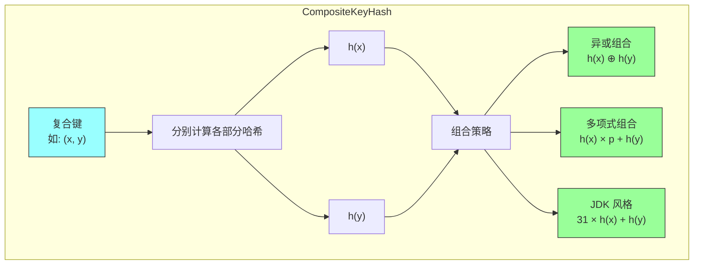

**实现示例**：

```java
/**
 * 复合键哈希函数组合器
 */
public class CompositeHash {

    /**
     * 方法1：异或组合
     * 优点：简单高效
     * 缺点：可能丢失信息 (a, b) 和 (b, a) 哈希相同
     */
    public static int xorCombine(int h1, int h2) {
        return h1 ^ h2;
    }

    /**
     * 方法2：多项式组合（类似 String.hashCode）
     * 优点：顺序敏感，(a, b) ≠ (b, a)
     * 缺点：需要选择合适的基数
     */
    public static int polynomialCombine(int h1, int h2) {
        return 31 * h1 + h2;
    }

    /**
     * 方法3：JDK 风格组合
     * 处理更多字段
     */
    public static int combine(int... hashes) {
        int result = 0;
        for (int h : hashes) {
            result = 31 * result + h;
        }
        return result;
    }

    /**
     * 示例：二维点的哈希函数
     */
    public static class Point2D {
        private final int x;
        private final int y;

        public Point2D(int x, int y) {
            this.x = x;
            this.y = y;
        }

        @Override
        public int hashCode() {
            // 使用组合器
            return polynomialCombine(x, y);
        }

        @Override
        public boolean equals(Object obj) {
            if (this == obj) return true;
            if (obj == null || getClass() != obj.getClass()) return false;
            Point2D other = (Point2D) obj;
            return x == other.x && y == other.y;
        }
    }

    /**
     * 示例：人的哈希函数（姓名 + 年龄）
     */
    public static class Person {
        private final String name;
        private final int age;

        public Person(String name, int age) {
            this.name = name;
            this.age = age;
        }

        @Override
        public int hashCode() {
            // 组合字符串哈希和整数哈希
            int nameHash = name.hashCode();
            return polynomialCombine(nameHash, age);
        }

        @Override
        public boolean equals(Object obj) {
            if (this == obj) return true;
            if (obj == null || getClass() != obj.getClass()) return false;
            Person other = (Person) obj;
            return age == other.age && name.equals(other.name);
        }
    }
}
```

### 2.6 全局哈希（Universal Hashing）

#### 2.6.1 为什么需要全局哈希？

**固定哈希函数的问题**：
- 恶意输入可以导致所有键映射到同一桶
- 攻击者可以构造最坏情况的输入

**解决方案**：从哈希函数族中随机选择哈希函数

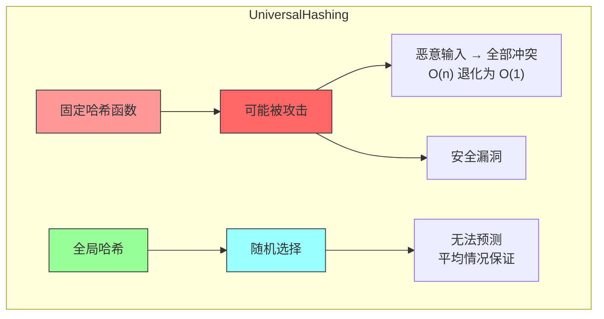

#### 2.6.2 全局哈希函数族

**乘法形式的全局哈希函数族**：

```
H = { h_{a,b}(k) = ((a × k + b) mod p) mod m }

约束条件：
- p 是大于所有键的质数
- a ∈ {1, 2, ..., p-1}
- b ∈ {0, 1, ..., p-1}
```

**性质**：对于任意两个不同的键 k₁ ≠ k₂，冲突概率 ≤ 1/m

```java
import java.util.Random;

/**
 * 全局哈希函数实现
 *
 * H = { h_{a,b}(k) = ((a × k + b) mod p) mod m }
 */
public class UniversalHashFunction {
    private final int p;  // 大于所有键的质数
    private final int a;  // 随机系数 [1, p-1]
    private final int m;  // 桶数量

    public UniversalHashFunction(int p, int m) {
        if (!isPrime(p)) {
            throw new IllegalArgumentException("p 必须是质数");
        }
        if (m <= 0) {
            throw new IllegalArgumentException("m 必须大于 0");
        }

        this.p = p;
        this.m = m;

        // 随机选择 a
        Random rand = new Random();
        this.a = rand.nextInt(p - 1) + 1;  // [1, p-1]
        this.b = rand.nextInt(p);           // [0, p-1]
    }

    private final int b;  // 随机偏移量

    /**
     * 计算全局哈希值
     */
    public int hash(int key) {
        // ((a × k + b) mod p) mod m
        long temp = ((long) a * key + b) % p;
        return (int) (temp % m);
    }

    /**
     * 计算长整型的全局哈希值
     */
    public long hash(long key) {
        long temp = ((long) a * key + b) % p;
        return temp % m;
    }

    /**
     * 重新随机选择哈希函数
     */
    public void randomize() {
        Random rand = new Random();
        this.a = rand.nextInt(p - 1) + 1;
        this.b = rand.nextInt(p);
    }

    public static boolean isPrime(int n) {
        if (n < 2) return false;
        if (n == 2) return true;
        if (n % 2 == 0) return false;
        int sqrt = (int) Math.sqrt(n);
        for (int i = 3; i <= sqrt; i += 2) {
            if (n % i == 0) return false;
        }
        return true;
    }

    @Override
    public String toString() {
        return String.format("UniversalHash(p=%d, a=%d, b=%d, m=%d)", p, a, b, m);
    }
}
```

---

## 三、哈希冲突的必然性

### 3.1 生日悖论与哈希冲突

**生日悖论**：在一个23人的群体中，至少两人同一天生日的概率超过50%。

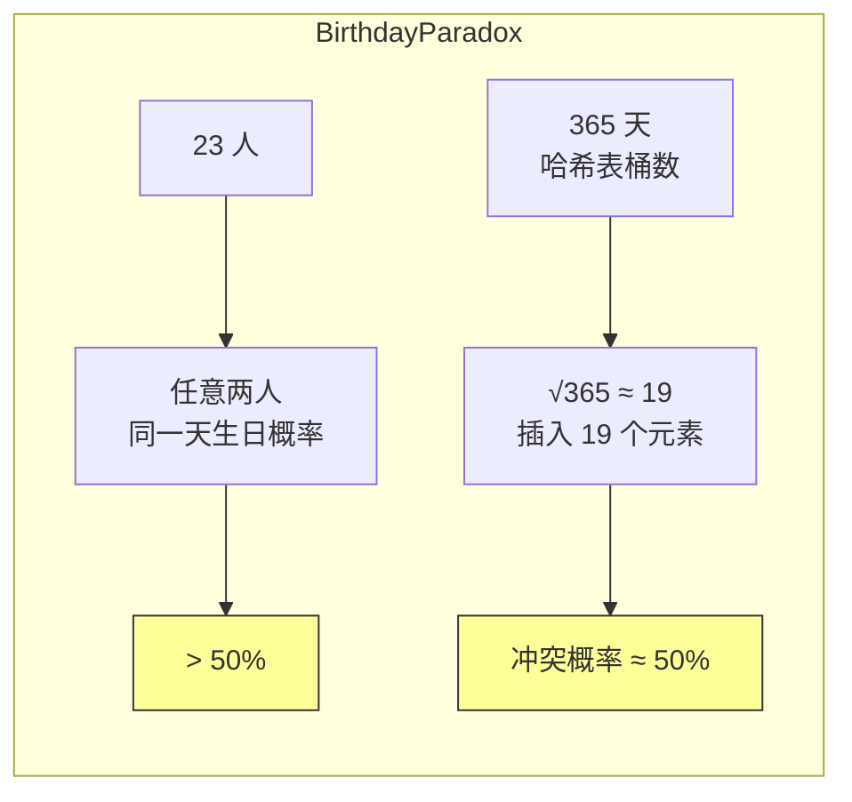

### 3.2 哈希冲突的数学分析

**碰撞概率公式**：

```
P(至少一次碰撞) = 1 - P(无碰撞)
                = 1 - (m × (m-1) × (m-2) × ... × (m-n+1)) / m^n
```

**近似公式**（当 n << m 时）：

```
P(碰撞) ≈ 1 - e^(-n²/2m)
```

**当 n = √m 时**：

```
P(碰撞) ≈ 1 - e^(-1/2) ≈ 1 - 0.606 = 0.394 ≈ 40%
```

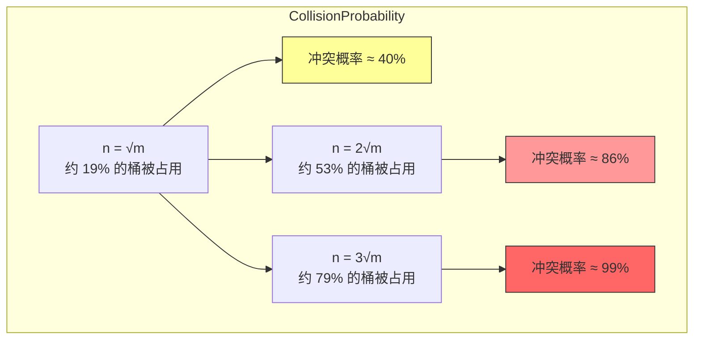

**Java 可视化冲突概率**：

```java
import java.util.ArrayList;
import java.util.List;

/**
 * 哈希冲突概率计算器
 *
 * 精确公式：P(碰撞) = 1 - (m × (m-1) × ... × (m-n+1)) / m^n
 * 近似公式：P(碰撞) ≈ 1 - e^(-n²/2m)
 */
public class CollisionProbabilityCalculator {

    /**
     * 精确计算冲突概率
     */
    public static double exact(int n, int m) {
        if (n > m) {
            return 1.0;
        }

        // 精确计算 P(无冲突)
        double probNoCollision = 1.0;
        for (int i = 0; i < n; i++) {
            probNoCollision *= (double) (m - i) / m;
        }

        return 1.0 - probNoCollision;
    }

    /**
     * 近似公式：P(碰撞) ≈ 1 - e^(-n²/2m)
     */
    public static double approx(int n, int m) {
        if (n == 0) {
            return 0.0;
        }
        return 1.0 - Math.exp(-(double) n * n / (2 * m));
    }

    /**
     * 找到冲突概率达到 50% 时的 n 值
     */
    public static int findNFor50Percent(int m) {
        for (int n = 1; n <= m; n++) {
            if (exact(n, m) >= 0.5) {
                return n;
            }
        }
        return m;
    }

    /**
     * 演示冲突概率计算
     */
    public static void main(String[] args) {
        int m = 1000;  // 桶数量

        System.out.println("=".repeat(60));
        System.out.println("哈希冲突概率分析");
        System.out.println("=".repeat(60));

        // 计算不同 n 值的冲突概率
        int[] testNs = {10, 20, 30, 40};
        System.out.println("\n精确 vs 近似公式对比：");
        System.out.println("n\t精确概率\t近似概率");
        System.out.println("-".repeat(40));
        for (int n : testNs) {
            double exactProb = exact(n, m);
            double approxProb = approx(n, m);
            System.out.printf("%d\t%.4f\t\t%.4f%n", n, exactProb, approxProb);
        }

        // 找到冲突概率达到 50% 的 n
        int n50 = findNFor50Percent(m);
        System.out.println("\n" + "=".repeat(60));
        System.out.println("关键结论：");
        System.out.printf("桶数量 m = %d%n", m);
        System.out.printf("当 n = %d 时，冲突概率达到 50%%%n", n50);
        System.out.printf("√m = %d%n", (int) Math.sqrt(m));
        System.out.printf("结论：冲突概率达到 50%% 时的 n ≈ √m%n");
    }
}
```

**输出示例**：
```
============================================================
哈希冲突概率分析
============================================================

精确 vs 近似公式对比：
n      精确概率      近似概率
----------------------------------------
10     0.0955       0.0488
20     0.3324       0.2642
30     0.5954       0.5286
40     0.7942       0.7534

============================================================
关键结论：
桶数量 m = 1000
当 n = 38 时，冲突概率达到 50%
√m = 31
结论：冲突概率达到 50% 时的 n ≈ √m
```

---

## 四、冲突解决策略

### 4.1 链地址法（Separate Chaining）

#### 4.1.1 核心思想

**链地址法**：每个桶存储一个链表，所有映射到同一桶的元素都放入该链表中。

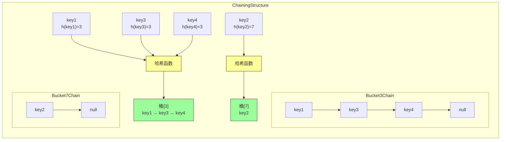

#### 4.1.2 Java 完整实现

```java
import java.util.*;
import java.util.function.BiConsumer;

/**
 * 链地址法哈希表 - 完整实现
 *
 * 支持：插入、查找、删除、遍历、动态扩容
 *
 * @param <K> 键类型
 * @param <V> 值类型
 */
public class ChainedHashMap<K, V> implements Map<K, V> {

    /**
     * 链表节点
     */
    private static class Node<K, V> {
        final int hash;
        final K key;
        V value;
        Node<K, V> next;

        Node(int hash, K key, V value, Node<K, V> next) {
            this.hash = hash;
            this.key = key;
            this.value = value;
            this.next = next;
        }

        public final K getKey() { return key; }
        public final V getValue() { return value; }

        public final String toString() {
            return key + "=" + value;
        }
    }

    // ============ 核心成员变量 ============
    private Node<K, V>[] table;      // 桶数组
    private int size;                 // 元素数量
    private int threshold;            // 扩容阈值
    private final float loadFactor;   // 装载因子
    private final int initialCapacity;// 初始容量

    // ============ 构造方法 ============
    @SuppressWarnings("unchecked")
    public ChainedHashMap(int initialCapacity, float loadFactor) {
        if (initialCapacity < 0) {
            throw new IllegalArgumentException("Illegal initial capacity: " + initialCapacity);
        }
        if (loadFactor <= 0 || Float.isNaN(loadFactor)) {
            throw new IllegalArgumentException("Illegal load factor: " + loadFactor);
        }

        this.initialCapacity = initialCapacity;
        this.loadFactor = loadFactor;
        this.threshold = (int) (initialCapacity * loadFactor);
        this.table = (Node<K, V>[]) new Node[initialCapacity];
    }

    public ChainedHashMap(int initialCapacity) {
        this(initialCapacity, 0.75f);
    }

    public ChainedHashMap() {
        this(16, 0.75f);
    }

    // ============ 哈希计算 ============
    /**
     * 计算键的哈希值
     * 使用了 spread 方法将 hashCode 分布到所有位
     */
    private int hash(Object key) {
        int h = key.hashCode();
        // 扰动函数：将高位和低位混合，减少碰撞
        return (key == null) ? 0 : (h ^ (h >>> 16)) & Integer.MAX_VALUE;
    }

    /**
     * 计算桶索引
     */
    private int indexFor(int hash, int length) {
        return hash & (length - 1);  // 与操作比取模更快（length 必须是 2 的幂）
    }

    // ============ 核心操作 ============

    /**
     * 获取元素数量
     */
    @Override
    public int size() {
        return size;
    }

    /**
     * 判断是否为空
     */
    @Override
    public boolean isEmpty() {
        return size == 0;
    }

    /**
     * 判断是否包含键
     */
    @Override
    public boolean containsKey(Object key) {
        return getNode(key) != null;
    }

    /**
     * 判断是否包含值
     */
    @Override
    public boolean containsValue(Object value) {
        Node<K, V>[] tab;
        if (value == null) {
            for (int i = 0; i < tab.length; i++) {
                for (Node<K, V> e = tab[i]; e != null; e = e.next) {
                    if (e.value == null) return true;
                }
            }
        } else {
            for (int i = 0; i < tab.length; i++) {
                for (Node<K, V> e = tab[i]; e != null; e = e.next) {
                    if (value.equals(e.value)) return true;
                }
            }
        }
        return false;
    }

    /**
     * 获取键对应的值
     */
    @Override
    public V get(Object key) {
        Node<K, V> node = getNode(key);
        return node == null ? null : node.value;
    }

    /**
     * 根据键获取节点
     */
    private Node<K, V> getNode(Object key) {
        if (key == null) return null;

        int hash = hash(key);
        int index = indexFor(hash, table.length);
        Node<K, V> first = table[index];

        if (first != null) {
            // 检查第一个节点
            if (first.hash == hash && key.equals(first.key)) {
                return first;
            }

            // 检查后续节点
            Node<K, V> e = first.next;
            while (e != null) {
                if (e.hash == hash && key.equals(e.key)) {
                    return e;
                }
                e = e.next;
            }
        }

        return null;
    }

    /**
     * 插入键值对
     */
    @Override
    public V put(K key, V value) {
        if (key == null) {
            throw new IllegalArgumentException("Key cannot be null");
        }

        int hash = hash(key);
        int index = indexFor(hash, table.length);
        Node<K, V> first = table[index];

        // 检查键是否已存在
        Node<K, V> e = first;
        while (e != null) {
            if (e.hash == hash && key.equals(e.key)) {
                V oldValue = e.value;
                e.value = value;
                return oldValue;  // 返回旧值
            }
            e = e.next;
        }

        // 插入新节点（头插法，更高效）
        addNode(hash, key, value, index);
        return null;
    }

    /**
     * 添加新节点
     */
    private void addNode(int hash, K key, V value, int index) {
        Node<K, V> newNode = new Node<>(hash, key, value, table[index]);
        table[index] = newNode;

        // 检查是否需要扩容
        if (size++ >= threshold) {
            resize();
        }
    }

    /**
     * 删除键值对
     */
    @Override
    public V remove(Object key) {
        if (key == null) {
            throw new IllegalArgumentException("Key cannot be null");
        }

        int hash = hash(key);
        int index = indexFor(hash, table.length);
        Node<K, V> prev = table[index];
        Node<K, V> current = prev;

        while (current != null) {
            if (current.hash == hash && key.equals(current.key)) {
                size--;

                if (prev == current) {
                    // 删除头节点
                    table[index] = current.next;
                } else {
                    // 删除中间节点
                    prev.next = current.next;
                }

                return current.value;
            }

            prev = current;
            current = current.next;
        }

        return null;
    }

    /**
     * 扩容
     */
    @SuppressWarnings("unchecked")
    private void resize() {
        int oldCapacity = table.length;
        Node<K, V>[] oldTab = table;

        // 新容量翻倍
        int newCapacity = oldCapacity << 1;
        int newThreshold = (int) (newCapacity * loadFactor);

        // 创建新数组
        Node<K, V>[] newTab = (Node<K, V>[]) new Node[newCapacity];
        table = newTab;
        threshold = newThreshold;

        // 重新分配所有节点
        for (int i = 0; i < oldCapacity; i++) {
            Node<K, V> e = oldTab[i];
            if (e != null) {
                // 头节点
                Node<K, V> next = e.next;
                int newIndex = indexFor(e.hash, newCapacity);
                e.next = newTab[newIndex];
                newTab[newIndex] = e;

                // 处理链表剩余节点
                while (next != null) {
                    Node<K, V> nextNext = next.next;
                    int nextIndex = indexFor(next.hash, newCapacity);
                    next.next = newTab[nextIndex];
                    newTab[nextIndex] = next;
                    next = nextNext;
                }
            }
        }
    }

    // ============ 批量操作 ============

    @Override
    public void putAll(Map<? extends K, ? extends V> m) {
        for (Map.Entry<? extends K, ? extends V> e : m.entrySet()) {
            put(e.getKey(), e.getValue());
        }
    }

    @Override
    public void clear() {
        Arrays.fill(table, null);
        size = 0;
    }

    // ============ 视图方法 ============

    @Override
    public Set<K> keySet() {
        Set<K> ks = keySet;
        if (ks == null) {
            ks = new KeySet();
            keySet = ks;
        }
        return ks;
    }

    @Override
    public Collection<V> values() {
        Collection<V> vs = values;
        if (vs == null) {
            vs = new Values();
            values = values = vs;
        }
        return vs;
    }

    @Override
    public Set<Map.Entry<K, V>> entrySet() {
        Set<Map.Entry<K, V>> es = entrySet;
        if (es == null) {
            es = new EntrySet();
            entrySet = es;
        }
        return es;
    }

    // ============ 内部类 ============

    private transient Set<K> keySet;
    private transient Collection<V> values;
    private transient Set<Map.Entry<K, V>> entrySet;

    private final class KeySet extends AbstractSet<K> {
        public final Iterator<K> iterator() {
            return new KeyIterator();
        }
        public final int size() { return size; }
        public final void clear() { ChainedHashMap.this.clear(); }
        public final boolean contains(Object o) { return containsKey(o); }
        public final boolean remove(Object o) { return ChainedHashMap.this.remove(o) != null; }
    }

    private final class Values extends AbstractCollection<V> {
        public final Iterator<V> iterator() {
            return new ValueIterator();
        }
        public final int size() { return size; }
        public final void clear() { ChainedHashMap.this.clear(); }
        public final boolean contains(Object o) { return containsValue(o); }
    }

    private final class EntrySet extends AbstractSet<Map.Entry<K, V>> {
        public final Iterator<Map.Entry<K, V>> iterator() {
            return new EntryIterator();
        }
        public final int size() { return size; }
        public final void clear() { ChainedHashMap.this.clear(); }
        public final boolean contains(Object o) {
            if (!(o instanceof Map.Entry)) return false;
            Map.Entry<?, ?> e = (Map.Entry<?, ?>) o;
            Object key = e.getKey();
            Node<K, V> candidate = getNode(key);
            return candidate != null && candidate.equals(e);
        }
        public final boolean remove(Object o) {
            if (!(o instanceof Map.Entry)) return false;
            Map.Entry<?, ?> e = (Map.Entry<?, ?>) o;
            Object key = e.getKey();
            return ChainedHashMap.this.remove(key) != null;
        }
    }

    // ============ 迭代器 ============

    private abstract class HashIterator {
        Node<K, V> next;        // next entry to return
        Node<K, V> current;     // current entry
        int index;              // current slot

        HashIterator() {
            Node<K, V>[] t = table;
            current = next = null;
            index = 0;
            if (t != null && size > 0) {
                // advance to first entry
                do {} while (index < t.length && (next = t[index++]) == null);
            }
        }

        public final boolean hasNext() {
            return next != null;
        }

        final Node<K, V> nextNode() {
            Node<K, V> e = next;
            if (e == null) throw new NoSuchElementException();

            Node<K, V>[] t = table;
            current = e;
            e = e.next;

            if (t != null) {
                while (index < t.length && (next = t[index++]) == null) {
                    // advance to next non-empty bucket
                }
            } else {
                next = null;
            }

            return e;
        }

        public final void remove() {
            if (current == null) throw new IllegalStateException();
            Object k = current.key;
            current = null;
            ChainedHashMap.this.remove(k);
        }
    }

    private final class KeyIterator extends HashIterator implements Iterator<K> {
        public final K next() { return nextNode().key; }
    }

    private final class ValueIterator extends HashIterator implements Iterator<V> {
        public final V next() { return nextNode().value; }
    }

    private final class EntryIterator extends HashIterator implements Iterator<Map.Entry<K, V>> {
        public final Map.Entry<K, V> next() { return nextNode(); }
    }

    // ============ 调试方法 ============

    /**
     * 打印哈希表状态
     */
    public void printState() {
        System.out.println("=== 哈希表状态 ===");
        System.out.println("容量: " + table.length);
        System.out.println("元素数: " + size);
        System.out.println("装载因子: " + loadFactor);
        System.out.println("扩容阈值: " + threshold);
        System.out.println("装载率: " + String.format("%.2f%%", (double) size / table.length * 100));

        int nonEmpty = 0;
        int maxChain = 0;
        double totalChain = 0;

        for (int i = 0; i < table.length; i++) {
            Node<K, V> node = table[i];
            int chainLen = 0;
            if (node != null) {
                nonEmpty++;
                while (node != null) {
                    chainLen++;
                    node = node.next;
                }
                maxChain = Math.max(maxChain, chainLen);
                totalChain += chainLen;
            }
        }

        System.out.println("非空桶数: " + nonEmpty);
        System.out.println("最长链: " + maxChain);
        System.out.println("平均链长: " + String.format("%.2f", totalChain / Math.max(nonEmpty, 1)));
        System.out.println("==================");
    }
}
```

#### 4.1.3 链地址法复杂度分析

**查找操作的代价**：

```
T(n) = 哈希计算 + 定位桶 + 遍历链表

平均情况（成功查找）：
- 哈希计算：O(1)
- 定位桶：O(1)
- 遍历链表：O(1 + α)（期望链表长度 = α）

总复杂度：O(1 + α)

平均情况（失败查找）：
- 遍历整个链表：O(1 + α)

最坏情况（所有元素在同一桶）：
- 链表长度 = n
- 复杂度：O(n)
```

**均摊分析**：

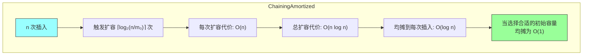

### 4.2 开放定址法（Open Addressing）

#### 4.2.1 核心思想

**开放定址法**：所有元素都存储在桶数组中，不使用额外的数据结构。当发生冲突时，按某种规则继续探测下一个空桶。

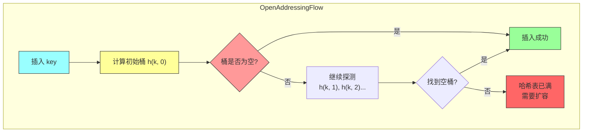

#### 4.2.2 探测序列的三种方法

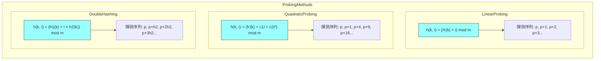

#### 4.2.3 线性探测（Linear Probing）

**公式**：
```
h(k, i) = (h'(k) + i) mod m
```

**特点**：连续冲突时会形成"聚集簇"

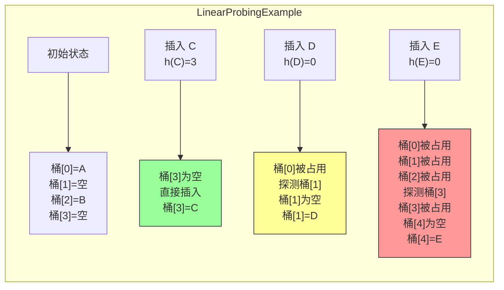

**聚集现象**：

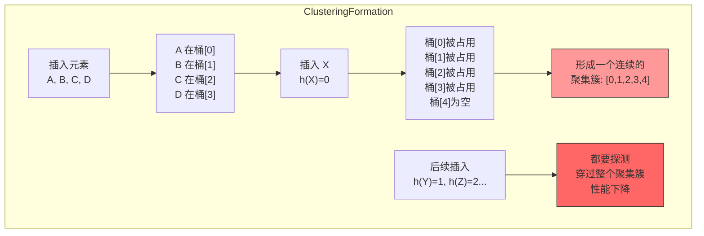

#### 4.2.4 二次探测（Quadratic Probing）

**公式**：
```
h(k, i) = (h'(k) + c₁i + c₂i²) mod m
```

**常用设置**：c₁ = 1, c₂ = 1

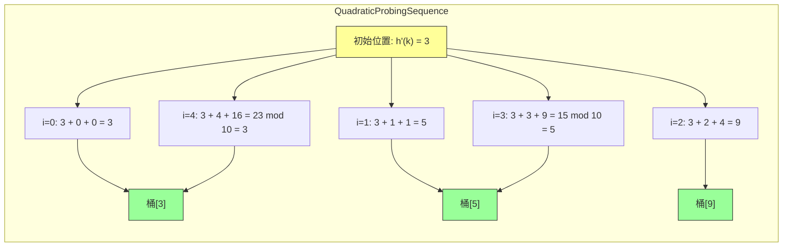

**二次探测的问题**：可能无法找到空桶，即使存在空桶

```mermaid
flowchart TD
    subgraph QuadraticProbingDefect
    A["假设：m = 10, h'(k) = 3"] --> B["i=0: 3"]
    B --> C["i=1: 5"]
    C --> D["i=2: 9"]
    D --> E["i=3: 5<br/>回到 5<br/>形成循环!"]
    E --> F["继续探测"]
    F --> G["回到 5<br/>循环!"]
    style D fill:#f99,stroke:#333
    style F fill:#f66,stroke:#333
    end
```

**解决方案**：确保 m 是质数，且满足特定条件

```java
/**
 * 二次探测的完整性保证
 *
 * 如果 m 是质数且 m ≡ 3 (mod 4)，则探测序列可以覆盖至少一半的桶
 */
public class QuadraticProbing {
    private final int m;  // 桶数量，必须是质数

    public QuadraticProbing(int m) {
        if (!isPrime(m)) {
            throw new IllegalArgumentException("m 必须是质数");
        }
        if (m % 4 != 3) {
            System.out.println("警告: m ≡ 3 (mod 4) 可以保证更好的探测覆盖率");
        }
        this.m = m;
    }

    /**
     * 二次探测
     */
    public int probe(int hPrime, int i) {
        // c1 = 1, c2 = 1
        return (hPrime + i + i * i) % m;
    }

    private static boolean isPrime(int n) {
        if (n < 2) return false;
        if (n == 2) return true;
        if (n % 2 == 0) return false;
        int sqrt = (int) Math.sqrt(n);
        for (int i = 3; i <= sqrt; i += 2) {
            if (n % i == 0) return false;
        }
        return true;
    }
}
```

#### 4.2.5 双重哈希（Double Hashing）

**公式**：
```
h(k, i) = (h₁(k) + i × h₂(k)) mod m
```

**要求**：
- h₂(k) 与 m 互质（即 gcd(h₂(k), m) = 1）
- 确保探测序列覆盖所有桶

```mermaid
graph LR
    subgraph DoubleHashingExample
    A["h₁(k) = k mod 10<br/>h₂(k) = 7 - (k mod 7)"] --> B["key = 3"]
    A --> C["key = 6"]

    B --> D["h₁(3) = 3<br/>h₂(3) = 4<br/>探测序列: 3, 7, 1, 5, 9, 3..."]
    C --> E["h₁(6) = 6<br/>h₂(6) = 1<br/>探测序列: 6, 7, 8, 9, 0, 1..."]

    D --> F["步长 = 4<br/>访问桶: 3→7→1→5→9→3..."]
    E --> G["步长 = 1<br/>访问桶: 6→7→8→9→0→1..."]

    style A fill:#ff9,stroke:#333
    style D fill:#9f9,stroke:#333
    style E fill:#9f9,stroke:#333
    end
```

**完整实现（双重哈希）**：

```java
import java.util.NoSuchElementException;

/**
 * 开放定址法哈希表 - 双重哈希实现
 */
public class OpenAddressingHashMap<K, V> {

    private static class Entry<K, V> {
        K key;
        V value;
        boolean deleted;  // 懒删除标记

        Entry(K key, V value) {
            this.key = key;
            this.value = value;
            this.deleted = false;
        }
    }

    // ============ 核心成员变量 ============
    private Entry<K, V>[] table;
    private final int m;           // 桶数量
    private int size;              // 有效元素数量
    private int used;              // 已使用（包括标记删除）的数量
    private final double maxLoadFactor;

    @SuppressWarnings("unchecked")
    public OpenAddressingHashMap(int m, double maxLoadFactor) {
        this.m = m;
        this.maxLoadFactor = maxLoadFactor;
        this.table = (Entry<K, V>[]) new Entry[m];
        this.size = 0;
        this.used = 0;
    }

    public OpenAddressingHashMap(int m) {
        this(m, 0.75);
    }

    // ============ 哈希函数 ============

    /**
     * 第一个哈希函数：除法哈希
     */
    private int h1(K key) {
        return (key.hashCode() & 0x7fffffff) % m;
    }

    /**
     * 第二个哈希函数：确保与 m 互质
     */
    private int h2(K key) {
        int hash = key.hashCode() & 0x7fffffff;
        // 结果在 1 到 m-1 之间
        int result = 1 + (hash % (m - 1));

        // 确保与 m 互质
        if (gcd(result, m) != 1) {
            // 找到与 m 互质的数
            for (int i = 1; i < m; i++) {
                if (gcd(i, m) == 1) {
                    return i;
                }
            }
        }

        return result;
    }

    private static int gcd(int a, int b) {
        while (b != 0) {
            int temp = a % b;
            a = b;
            b = temp;
        }
        return a;
    }

    /**
     * 双重哈希探测
     */
    private int probe(K key, int i) {
        return (h1(key) + i * h2(key)) % m;
    }

    // ============ 核心操作 ============

    /**
     * 插入
     */
    public void put(K key, V value) {
        if (used >= m * maxLoadFactor) {
            rehash();
        }

        int i = 0;
        while (i < m) {
            int index = probe(key, i);

            if (table[index] == null) {
                // 找到空桶，插入新元素
                table[index] = new Entry<>(key, value);
                size++;
                used++;
                return;
            }

            if (table[index].deleted) {
                // 找到已删除的桶，复用它
                table[index].key = key;
                table[index].value = value;
                table[index].deleted = false;
                size++;
                return;
            }

            if (table[index].key.equals(key)) {
                // 键已存在，更新值
                table[index].value = value;
                return;
            }

            i++;  // 继续探测
        }

        throw new RuntimeException("哈希表已满，无法插入");
    }

    /**
     * 查找
     */
    public V get(K key) {
        int i = 0;
        while (i < m) {
            int index = probe(key, i);

            if (table[index] == null) {
                return null;  // 提前终止
            }

            if (!table[index].deleted && table[index].key.equals(key)) {
                return table[index].value;
            }

            i++;
        }

        return null;
    }

    /**
     * 删除（懒删除）
     */
    public void delete(K key) {
        int i = 0;
        while (i < m) {
            int index = probe(key, i);

            if (table[index] == null) {
                return;  // 不存在
            }

            if (!table[index].deleted && table[index].key.equals(key)) {
                table[index].deleted = true;
                size--;
                return;
            }

            i++;
        }
    }

    /**
     * 再哈希（扩容）
     */
    @SuppressWarnings("unchecked")
    private void rehash() {
        Entry<K, V>[] oldTable = table;
        int oldM = m;

        // 新容量翻倍
        int newM = oldM * 2;
        table = (Entry<K, V>[]) new Entry[newM];
        size = 0;
        used = 0;

        // 重新插入所有有效元素
        for (int i = 0; i < oldM; i++) {
            if (oldTable[i] != null && !oldTable[i].deleted) {
                // 需要使用新的 m 重新计算探测序列
                // 这里简化处理，实际应该重建索引
                Entry<K, V> entry = oldTable[i];
                // 直接插入（会使用新的 probe 函数）
                int j = 0;
                while (j < newM) {
                    int index = (entry.key.hashCode() & 0x7fffffff + j * (1 + (entry.key.hashCode() & 0x7fffffff % (newM - 1)))) % newM;

                    if (table[index] == null) {
                        table[index] = new Entry<>(entry.key, entry.value);
                        size++;
                        used++;
                        break;
                    }
                    j++;
                }
            }
        }
    }

    // ============ 辅助方法 ============

    public int size() {
        return size;
    }

    public boolean isEmpty() {
        return size == 0;
    }

    public void printState() {
        System.out.println("=== 开放定址哈希表状态 ===");
        System.out.println("容量: " + m);
        System.out.println("元素数: " + size);
        System.out.println("已使用: " + used);
        System.out.println("装载率: " + String.format("%.2f%%", (double) used / m * 100));
        System.out.println("============================");
    }
}
```

#### 4.2.6 开放定址法复杂度分析

**探测次数分析**：

| 探测方法 | 平均成功查找 | 平均失败查找 | 最坏情况 |
|---------|------------|------------|---------|
| 线性探测 | 1/2 × (1 + 1/(1-α)²) | 1/2 × (1 + 1/(1-α)²) | O(n) |
| 二次探测 | 1/2 × (1 + 1/(1-α)) | 1/2 × (1 + 1/(1-α)²) | O(n) |
| 双重哈希 | -ln(1-α)/α | 1/(1-α) | O(n) |

```mermaid
graph TD
    subgraph OpenAddressingProbes
    A["装载因子 α"] --> B["α = 0.5"]
    A --> C["α = 0.75"]
    A --> D["α = 0.9"]

    B --> E["线性探测: ≈ 1.5 次<br/>双重哈希: ≈ 1.39 次"]
    C --> F["线性探测: ≈ 2.5 次<br/>双重哈希: ≈ 1.85 次"]
    D --> G["线性探测: ≈ 5.5 次<br/>双重哈希: ≈ 2.56 次"]
    end

    style B fill:#9ff,stroke:#333
    style C fill:#ff9,stroke:#333
    style D fill:#f99,stroke:#333
```

### 4.3 链地址法 vs 开放定址法

```mermaid
flowchart TD
    subgraph SelectionDecision
    A["选择冲突解决策略"] --> B["元素数量是否确定?"]
    B -->|是| C["开放定址法<br/>空间紧凑"]
    B -->|否| D["链地址法<br/>更灵活"]

    C --> E["是否需要高性能?"]
    D --> F["是否关心最坏情况?"]

    E -->|是| G["双重哈希<br/>避免聚集"]
    E -->|否| H["线性探测<br/>简单高效"]

    F -->|是| I["链地址法<br/>最坏 O(n)<br/>但可预测"]
    F -->|否| J["开放定址法<br/>平均情况优秀"]
    end

    style A fill:#ff9,stroke:#333
    style C fill:#9ff,stroke:#333
    style D fill:#9ff,stroke:#333
```

| 特性 | 链地址法 | 开放定址法 |
|-----|---------|-----------|
| 存储结构 | 桶 + 链表 | 纯数组 |
| 内存使用 | O(n + m) | O(m) |
| 删除操作 | 简单（O(1)） | 需标记删除或重建 |
| 缓存友好性 | 较差 | 较好 |
| 最坏查找 | O(n) | O(n) |
| 适用场景 | 元素数量不确定 | 元素数量相对固定 |
| 负载因子限制 | 可 > 1 | 必须 < 1 |

---

## 五、再哈希（Rehash）

### 5.1 为什么需要再哈希？

```mermaid
flowchart TD
    subgraph RehashNecessity
    A["装载因子 α 增大"] --> B["链表变长"]
    B --> C["查找变慢"]
    C --> D["用户体验下降"]

    E["解决方案"] --> F["当 α 达到阈值时<br/>扩大桶数组<br/>重新分配元素"]
    F --> G["α 减半<br/>性能恢复"]
    end

    style A fill:#f99,stroke:#333
    style D fill:#f66,stroke:#333
    style F fill:#9f9,stroke:#333
    style G fill:#9f9,stroke:#333
```

### 5.2 再哈希的代价分析

**均摊分析**：

```
插入 n 个元素：
- 每次插入的基础成本：O(1)
- 再哈希发生的时机：当 size 达到 threshold
- 再哈希次数：O(log n)（每次容量翻倍）
- 每次再哈希的成本：O(size)

总成本 = n × O(1) + O(1) + O(2) + O(4) + ... + O(n/2)
       = O(n) + O(n)
       = O(n)

均摊成本 = O(n) / n = O(1)
```

```mermaid
graph TD
    subgraph RehashAmortized
    A["插入序列"] --> B["元素 1 到 m×α₀<br/>无再哈希"]
    A --> C["元素 m×α₀ + 1<br/>触发再哈希<br/>成本 O(m×α₀)"]
    A --> D["元素 2m×α₀ + 1<br/>再次再哈希<br/>成本 O(2m×α₀)"]
    A --> E["元素 4m×α₀ + 1<br/>再次再哈希<br/>成本 O(4m×α₀)"]
    A --> F["...<br/>继续翻倍"]

    G["总成本"] --> H["m×α₀ + 2m×α₀ + 4m×α₀ + ... + n"]
    H --> I["< 2n<br/>均摊为 O(1)"]
    end

    style A fill:#9ff,stroke:#333
    style I fill:#9f9,stroke:#333
```

## 六、Java 标准库中的哈希表

### 6.1 HashMap 源码解析

```mermaid
graph TD
    subgraph HashMapCore
    A["HashMap<K,V>"] --> B["transient Node<K,V>[] table"]
    A --> C["transient int size"]
    A --> D["transient int modCount"]
    A --> E["final float loadFactor"]
    A --> F["int threshold"]

    subgraph NodeStructure
    G["final int hash"]
    H["final K key"]
    I["V value"]
    J["Node<K,V> next"]
    end

    B --> G
    B --> H
    B --> I
    B --> J
    end

    style A fill:#ff9,stroke:#333
    style B fill:#9ff,stroke:#333
    style G fill:#9f9,stroke:#333
    style H fill:#9f9,stroke:#333
    style I fill:#9f9,stroke:#333
    style J fill:#9f9,stroke:#333
```

**Java 8 HashMap 的关键优化**：

1. **链表 → 红黑树转换**：当链表长度超过 8 且桶数量 ≥ 64 时
2. **扰动函数**：混合高位和低位，减少碰撞

```java
// HashMap 中的关键代码

// 扰动函数
static final int hash(Object key) {
    int h;
    return (key == null) ? 0 :
        (h = key.hashCode()) ^ (h >>> 16);  // 高位与低位异或
}

// 链表转红黑树的阈值
static final int TREEIFY_THRESHOLD = 8;

// 桶数组最小容量（才能转换为红黑树）
static final int MIN_TREEIFY_CAPACITY = 64;
```

### 6.2 HashMap 使用详解

```java
import java.util.HashMap;
import java.util.Map;

public class HashMapUsage {

    public static void main(String[] args) {
        // ============ 基本操作 ============
        Map<String, Integer> map = new HashMap<>();

        // 插入
        map.put("Alice", 25);
        map.put("Bob", 30);
        map.put("Charlie", 35);

        // 查找
        System.out.println("Alice: " + map.get("Alice"));  // 25

        // 检查键是否存在
        System.out.println("Contains Bob? " + map.containsKey("Bob"));  // true

        // 获取默认值（Java 8+）
        Integer age = map.getOrDefault("David", -1);  // -1
        System.out.println("David: " + age);

        // 安全的插入（键不存在才插入）
        map.putIfAbsent("Alice", 26);  // 不覆盖，返回旧值 25

        // 计算并更新
        map.merge("Alice", 1, Integer::sum);  // Alice: 25 + 1 = 26
        System.out.println("Alice after merge: " + map.get("Alice"));

        // 遍历
        System.out.println("\n遍历方式 1：entrySet");
        for (Map.Entry<String, Integer> entry : map.entrySet()) {
            System.out.println(entry.getKey() + ": " + entry.getValue());
        }

        System.out.println("\n遍历方式 2：forEach (Java 8+)");
        map.forEach((k, v) -> System.out.println(k + ": " + v));

        System.out.println("\n遍历方式 3：keySet");
        for (String key : map.keySet()) {
            System.out.println(key + ": " + map.get(key));
        }

        // ============ 性能相关 ============
        System.out.println("\nHashMap 统计：");
        System.out.println("Size: " + map.size());
        System.out.println("Is empty: " + map.isEmpty());

        // 删除
        map.remove("Bob");
        System.out.println("After removing Bob: " + map.size());

        // 清空
        map.clear();
        System.out.println("After clear: " + map.size());
    }
}
```

### 6.3 HashMap vs HashTable vs ConcurrentHashMap

| 特性 | HashMap | HashTable | ConcurrentHashMap |
|-----|---------|-----------|-------------------|
| 线程安全 | 否 | 是 | 是 |
| 锁粒度 | 无 | 方法级 | 桶级（Java 8+） |
| 允许 null 键 | 是 | 否 | 否 |
| 允许 null 值 | 是 | 否 | 否 |
| 迭代器 | 快速失败 | 快速失败 | 弱一致 |
| 默认初始容量 | 16 | 11 | 16 |
| 性能（并发） | 最低 | 较低 | 最高 |
| 适用场景 | 单线程 | 低并发 | 高并发 |

---

## 七、哈希表的应用扩展

### 7.1 布隆过滤器（Bloom Filter）

**原理**：使用多个哈希函数，将元素映射到一个位数组中。

```mermaid
graph LR
    subgraph BloomFilterPrinciple
    A["元素 x"] --> B["哈希函数 1<br/>h1(x) = 2"]
    A --> C["哈希函数 2<br/>h2(x) = 5"]
    A --> D["哈希函数 3<br/>h3(x) = 7"]

    B --> E["位数组<br/>[0,0,1,0,0,1,0,1,0,0]"]
    C --> E
    D --> E

    F["元素 y"] --> G["h1(y) = 2"]
    G --> H["位数组<br/>[0,0,1,0,0,1,0,1,0,0]"]
    H --> I["检查：位置 2,5,7<br/>都为 1<br/>y 可能存在"]
    end

    style A fill:#9ff,stroke:#333
    style E fill:#ff9,stroke:#333
    style I fill:#9f9,stroke:#333
```

**布隆过滤器实现**：

```java
import java.util.BitSet;
import java.util.function.IntFunction;

/**
 * 布隆过滤器实现
 *
 * 特点：
 * - 空间效率极高
 * - 可能存在假阳性（判断"存在"可能错误）
 * - 不存在假阴性（判断"不存在"一定正确）
 */
public class BloomFilter {
    private final BitSet bitSet;
    private final int size;              // 位数组大小
    private final int numHashFunctions;  // 哈希函数数量

    public BloomFilter(int size, int numHashFunctions) {
        this.size = size;
        this.numHashFunctions = numHashFunctions;
        this.bitSet = new BitSet(size);
    }

    /**
     * 使用建议的参数
     * @param expectedElements 期望存储的元素数量
     * @param falsePositiveRate 期望的假阳性率
     */
    public static BloomFilter withExpectedElements(int expectedElements, double falsePositiveRate) {
        // 计算最优的位数组大小
        // m = -n × ln(p) / (ln(2)²)
        int size = (int) Math.ceil(-expectedElements * Math.log(falsePositiveRate) / (Math.log(2) * Math.log(2)));

        // 计算最优的哈希函数数量
        // k = (m/n) × ln(2)
        int numHashFunctions = (int) Math.ceil((double) size / expectedElements * Math.log(2));

        return new BloomFilter(size, numHashFunctions);
    }

    /**
     * 计算多个哈希值
     */
    private int[] getHashIndices(String element) {
        int[] indices = new int[numHashFunctions];

        // 使用双哈希技术生成多个哈希值
        int hash1 = element.hashCode();
        int hash2 = hash1 >>> 16 ^ hash1;

        for (int i = 0; i < numHashFunctions; i++) {
            indices[i] = Math.abs((hash1 + i * hash2) % size);
        }

        return indices;
    }

    /**
     * 添加元素
     */
    public void add(String element) {
        int[] indices = getHashIndices(element);
        for (int index : indices) {
            bitSet.set(index);
        }
    }

    /**
     * 检查元素是否存在
     * @return true 表示元素可能存在，false 表示一定不存在
     */
    public boolean mightContain(String element) {
        int[] indices = getHashIndices(element);
        for (int index : indices) {
            if (!bitSet.get(index)) {
                return false;
            }
        }
        return true;
    }

    /**
     * 获取当前使用的位数
     */
    public int getUsedBits() {
        return bitSet.cardinality();
    }

    /**
     * 获取假阳性率估算
     */
    public double getEstimatedFalsePositiveRate() {
        double bitsPerElement = (double) size / getUsedBits();
        return Math.pow(1 - Math.exp(-numHashFunctions / bitsPerElement), numHashFunctions);
    }

    @Override
    public String toString() {
        return String.format("BloomFilter(size=%d, elements=%d, fpr≈%.4f)",
                size, getUsedBits(), getEstimatedFalsePositiveRate());
    }
}
```

### 7.2 一致性哈希（Consistent Hashing）

**应用场景**：分布式系统中的负载均衡和数据分片。

```mermaid
graph LR
    subgraph ConsistentHashingRing
    A["哈希环<br/>0 → 2^32-1"] --> B["节点 A<br/>hash(A) = 100"]
    B --> C["节点 B<br/>hash(B) = 300"]
    C --> D["节点 C<br/>hash(C) = 500"]
    D --> E["..."]
    E --> A

    F["数据 key<br/>hash(key) = 200"] --> G["落在节点 B 和 C 之间<br/>分配给节点 B"]

    H["添加节点 D<br/>hash(D) = 400"] --> I["只影响 B-C 区间<br/>其他数据不受影响"]
    end

    style F fill:#9ff,stroke:#333
    style G fill:#ff9,stroke:#333
    style I fill:#9f9,stroke:#333
```

### 7.3 LRU 缓存实现

```java
import java.util.*;

public class LRUCache<K, V> {
    private final int capacity;
    private final LinkedHashMap<K, V> cache;

    public LRUCache(int capacity) {
        this.capacity = capacity;
        // accessOrder = true 表示按访问顺序排序
        this.cache = new LinkedHashMap<>(capacity, 0.75f, true) {
            @Override
            protected boolean removeEldestEntry(Map.Entry<K, V> eldest) {
                return size() > capacity;
            }
        };
    }

    public V get(K key) {
        return cache.getOrDefault(key, null);
    }

    public void put(K key, V value) {
        cache.put(key, value);
    }

    public int size() {
        return cache.size();
    }

    public void clear() {
        cache.clear();
    }

    @Override
    public String toString() {
        return cache.toString();
    }
}
```

---

## 八、复杂度分析与总结

### 8.1 各实现复杂度对比

| 实现方式 | 查找平均 | 查找最坏 | 插入平均 | 插入最坏 | 空间 |
|---------|---------|---------|---------|---------|-----|
| 链地址法 | O(1 + α) | O(n) | O(1) | O(1) | O(n + m) |
| 线性探测 | O(1/(1-α)) | O(n) | O(1/(1-α)) | O(n) | O(m) |
| 双重哈希 | O(-ln(1-α)/α) | O(n) | O(1/(1-α)) | O(n) | O(m) |
| HashMap (Java 8+) | O(log n) 平均 | O(log n) | O(log n) 平均 | O(log n) | O(n) |

### 8.2 哈希表设计决策树

```mermaid
flowchart TD
    A["设计哈希表"] --> B["线程安全?"]
    B -->|是，低并发| C["Hashtable"]
    B -->|是，高并发| D["ConcurrentHashMap"]
    B -->|否| E["HashMap"]

    E --> F["数据量变化大?"]
    F -->|是| G["链地址法<br/>动态扩容"]
    F -->|否| H["开放定址法<br/>空间紧凑"]

    G --> I["选择合适初始容量<br/>减少再哈希次数"]

    H --> J["选择探测方法"]
    J --> K["线性探测<br/>简单但易聚集"]
    J --> L["双重哈希<br/>最优但复杂"]
```

### 8.3 核心思想提炼

**哈希表的本质**：通过哈希函数将键映射到数组索引，实现"一步到位"的数据访问。

```
键 → 哈希函数 → 桶索引 → 访问 → O(1)

关键技巧：
1. 好的哈希函数：均匀分布、快速计算
2. 冲突解决：链地址法或开放定址法
3. 动态扩容：保持装载因子在合理范围
```

---

## 九、举一反三

### 9.1 同类 LeetCode 题目

| 题目 | 难度 | 核心技巧 |
|-----|-----|---------|
| 1. 两数之和 | Easy | 哈希表一次遍历 |
| 49. 字母异位词分组 | Medium | 自定义哈希函数 |
| 128. 最长连续序列 | Medium | 哈希表 + 集合 |
| 146. LRU 缓存 | Medium | 哈希表 + 双向链表 |
| 295. 数据流的中位数 | Hard | 两个堆 + 哈希表 |
| 380. O(1) 时间插入删除获取随机 | Medium | 哈希表 + 数组 |

### 9.2 变形题目

**1. 设计一个支持 O(1) 时间获取随机元素的数组**

```java
import java.util.*;

class RandomizedSet {
    private Map<Integer, Integer> valToIndex;
    private List<Integer> nums;
    private Random random;

    public RandomizedSet() {
        valToIndex = new HashMap<>();
        nums = new ArrayList<>();
        random = new Random();
    }

    public boolean insert(int val) {
        if (valToIndex.containsKey(val)) return false;
        valToIndex.put(val, nums.size());
        nums.add(val);
        return true;
    }

    public boolean remove(int val) {
        if (!valToIndex.containsKey(val)) return false;

        int index = valToIndex.get(val);
        int lastVal = nums.get(nums.size() - 1);

        // 交换删除
        nums.set(index, lastVal);
        valToIndex.put(lastVal, index);

        nums.remove(nums.size() - 1);
        valToIndex.remove(val);

        return true;
    }

    public int getRandom() {
        return nums.get(random.nextInt(nums.size()));
    }
}
```

### 9.3 哈希思想的迁移应用

```mermaid
graph TD
    subgraph HashApplications
    A["哈希表"] --> B["数据库索引<br/>B+ Tree 变体"]
    A --> C["密码学<br/>SHA-256, MD5"]
    A --> D["一致性哈希<br/>分布式系统"]
    A --> E["布隆过滤器<br/>空间高效集合"]
    A --> F["数据指纹<br/>去重/校验"]

    B --> G["快速查找<br/>范围查询"]

    C --> H["数字签名<br/>完整性验证"]

    D --> I["负载均衡<br/>故障转移"]

    E --> J["垃圾邮件检测<br/>爬虫去重"]
    end

    style A fill:#ff9,stroke:#333
```

---

## 附录：完整代码模板

### Java 模板

```java
/**
 * 链地址法哈希表模板
 */
public class HashMapTemplate<K, V> {
    private static class Node<K, V> {
        K key;
        V value;
        Node<K, V> next;
        Node(K k, V v) { key = k; value = v; }
    }

    private final int m;
    private final List<Node<K, V>> table;
    private int size;

    public HashMapTemplate(int m) {
        this.m = m;
        this.table = new ArrayList<>(m);
        for (int i = 0; i < m; i++) table.add(null);
    }

    private int hash(K key) {
        return (key.hashCode() & 0x7fffffff) % m;
    }

    public void put(K key, V value) {
        int idx = hash(key);
        Node<K, V> node = table.get(idx);
        while (node != null) {
            if (node.key.equals(key)) {
                node.value = value;
                return;
            }
            node = node.next;
        }
        Node<K, V> newNode = new Node<>(key, value);
        newNode.next = table.get(idx);
        table.set(idx, newNode);
        size++;
    }

    public V get(K key) {
        int idx = hash(key);
        Node<K, V> node = table.get(idx);
        while (node != null) {
            if (node.key.equals(key)) return node.value;
            node = node.next;
        }
        return null;
    }

    public boolean remove(K key) {
        int idx = hash(key);
        Node<K, V> node = table.get(idx);
        Node<K, V> prev = null;
        while (node != null) {
            if (node.key.equals(key)) {
                if (prev == null) table.set(idx, node.next);
                else prev.next = node.next;
                size--;
                return true;
            }
            prev = node;
            node = node.next;
        }
        return false;
    }

    public int size() { return size; }
}
```

---

## 七、LeetCode 练习题

### 7.1 基础哈希表应用

**题目 1：两数之和**

| 属性 | 内容 |
|-----|------|
| 题目 | [1. 两数之和](https://leetcode.cn/problems/two-sum/) |
| 难度 | 简单 |
| 核心思路 | 边遍历边用哈希表存储已访问元素，实现 O(n) 时间查找 |

```mermaid
flowchart TD
    A["遍历数组"] --> B["当前元素 x"]
    B --> C["检查 target - x 是否在哈希表中"]
    C -->|是| D["返回 [已存索引, 当前索引]"]
    C -->|否| E["将 x 存入哈希表"]
    E --> A

    style A fill:#ff9,stroke:#333
    style C fill:#9ff,stroke:#333
    style D fill:#9f9,stroke:#333
```

**题目 2：设计哈希映射**

| 属性 | 内容 |
|-----|------|
| 题目 | [706. 设计哈希映射](https://leetcode.cn/problems/design-hashmap/) |
| 难度 | 简单 |
| 核心思路 | 链地址法实现基本的 put、get、remove 操作 |

```mermaid
flowchart TD
    subgraph HashMapStructure
    A["HashMap"] --> B["数组 table"]
    B --> C["桶[0] 链表"]
    B --> D["桶[1] 链表"]
    B --> E["..."]
    B --> F["桶[m-1] 链表"]

    A --> G["put: 计算哈希 → 遍历链表 → 更新/插入"]
    A --> H["get: 计算哈希 → 遍历链表 → 返回值"]
    A --> I["remove: 计算哈希 → 遍历链表 → 删除节点"]
    end

    style A fill:#ff9,stroke:#333
    style G fill:#9ff,stroke:#333
    style H fill:#9ff,stroke:#333
    style I fill:#9ff,stroke:#333
```

### 7.2 中级哈希表应用

**题目 3：字母异位词分组**

| 属性 | 内容 |
|-----|------|
| 题目 | [49. 字母异位词分组](https://leetcode.cn/problems/group-anagrams/) |
| 难度 | 中等 |
| 核心思路 | 将字符串排序（或字符计数）作为哈希键，异位词得到相同的键 |

```mermaid
flowchart LR
    subgraph Grouping
    Input1["eat"] --> Sort1["aet"]
    Input2["tea"] --> Sort1
    Input3["ate"] --> Sort1
    Input4["tan"] --> Sort2["ant"]
    Input5["nat"] --> Sort2

    Sort1 --> Group1["[eat, tea, ate]"]
    Sort2 --> Group2["[tan, nat]"]
    end

    style Input1 fill:#ff9,stroke:#333
    style Input2 fill:#ff9,stroke:#333
    style Input3 fill:#ff9,stroke:#333
    style Group1 fill:#9f9,stroke:#333
    style Group2 fill:#9f9,stroke:#333
```

**题目 4：最长连续序列**

| 属性 | 内容 |
|-----|------|
| 题目 | [128. 最长连续序列](https://leetcode.cn/problems/longest-consecutive-sequence/) |
| 难度 | 中等 |
| 核心思路 | 用 HashSet 去重，对于每个数只从序列起点开始探索，避免重复计算 |

```mermaid
flowchart TD
    A["将所有元素加入 HashSet"] --> B["遍历每个元素 x"]
    B --> C{"x-1 不在集合中？"}
    C -->|否| B
    C -->|是| D["x 是序列起点，从 x 开始向后探索"]
    D --> E["记录序列长度"]
    E --> F["更新最长长度"]

    style A fill:#ff9,stroke:#333
    style C fill:#9ff,stroke:#333
    style E fill:#9f9,stroke:#333
    style F fill:#9f9,stroke:#333
```

**题目 5：O(1) 时间插入、删除和随机获取元素**

| 属性 | 内容 |
|-----|------|
| 题目 | [380. O(1) 时间插入、删除和随机获取元素](https://leetcode.cn/problems/insert-delete-getrandom-o1/) |
| 难度 | 中等 |
| 核心思路 | 哈希表存储值到索引的映射，数组存储值实现随机访问 |

```mermaid
flowchart TD
    subgraph DataStructure
    A["HashMap val → index"]
    B["ArrayList values"]
    end

    A -->|"O(1) 查找"| C["insert: 添加到数组末尾，更新哈希表"]
    A -->|"O(1) 查找"| D["remove: 与末尾元素交换，删除末尾"]
    B -->|"O(1) 随机"| E["getRandom: 随机选择数组元素"]

    style A fill:#9ff,stroke:#333
    style B fill:#9ff,stroke:#333
    style C fill:#9f9,stroke:#333
    style D fill:#9f9,stroke:#333
    style E fill:#9f9,stroke:#333
```

### 7.3 高级设计题

**题目 6：LRU 缓存**

| 属性 | 内容 |
|-----|------|
| 题目 | [146. LRU 缓存](https://leetcode.cn/problems/lru-cache/) |
| 难度 | 中等 |
| 核心思路 | 哈希表 O(1) 查找 + 双向链表 O(1) 调整顺序 |

```mermaid
flowchart TD
    subgraph LRUCache
    A["HashMap key → Node"]
    B["双向链表<br/>头部 ←→ 最新 ←→ ... ←→ 最旧 ←→ 尾部"]
    end

    A -->|"put(key,v)"| C["key 存在: 更新值，移到头部"]
    A -->|"put(key,v)"| D["key 不存在: 新建节点插入头部"]
    D --> E["容量满时: 删除尾部节点"]

    A -->|"get(key)"| F["找到: 移到头部，返回值"]
    A -->|"get(key)"| G["未找到: 返回 -1"]

    style A fill:#ff9,stroke:#333
    style B fill:#9ff,stroke:#333
    style C fill:#9f9,stroke:#333
    style F fill:#9f9,stroke:#333
```

---

**哈希表是算法世界中最伟大的发明之一，它将"大海捞针"变成了"直取目标"。理解哈希函数的设计原则和冲突解决策略，是掌握高效数据结构的关键。**

下一章：第十二章——二叉搜索树（BST）
