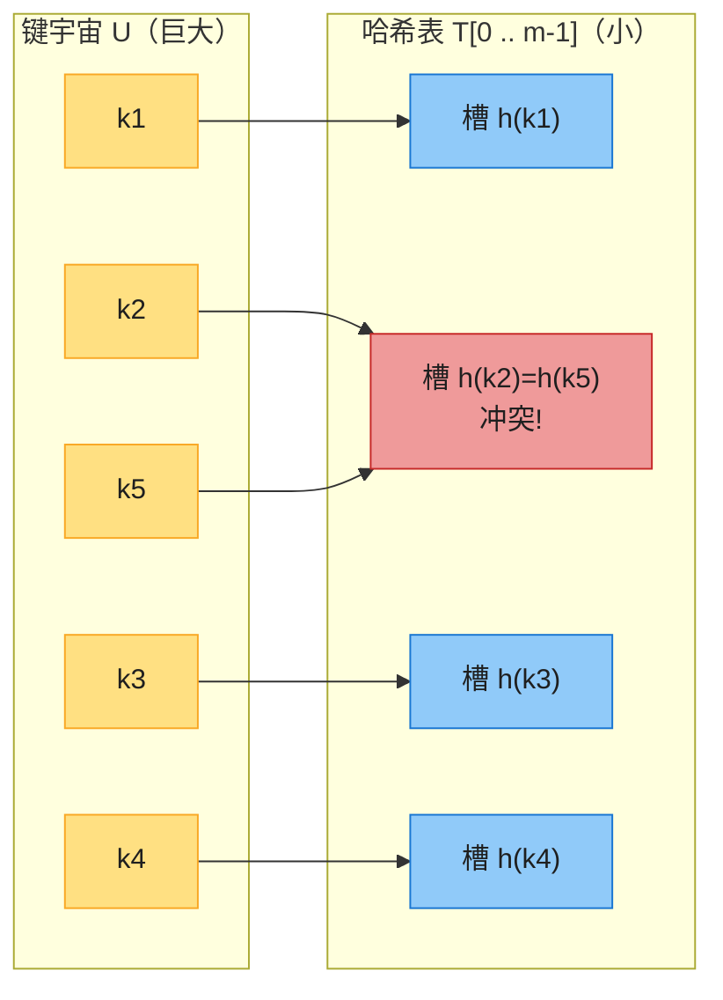
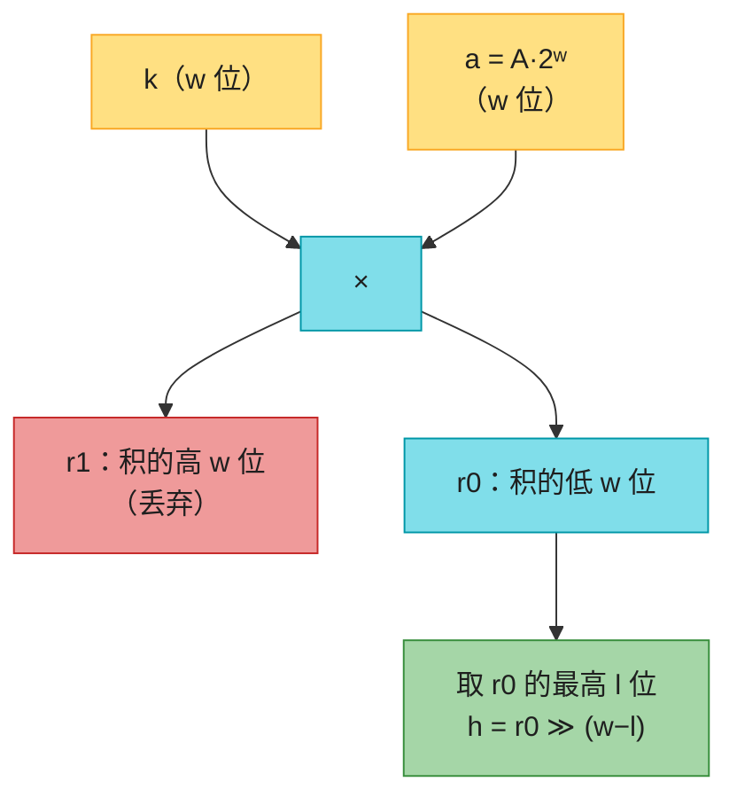
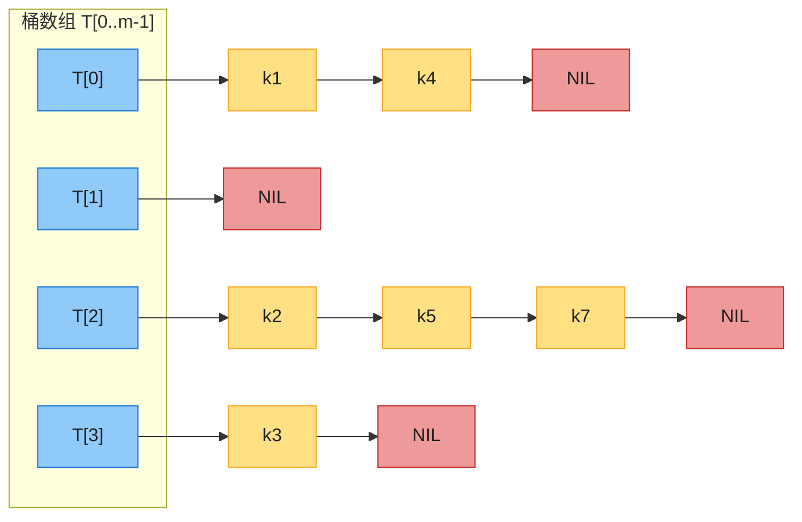
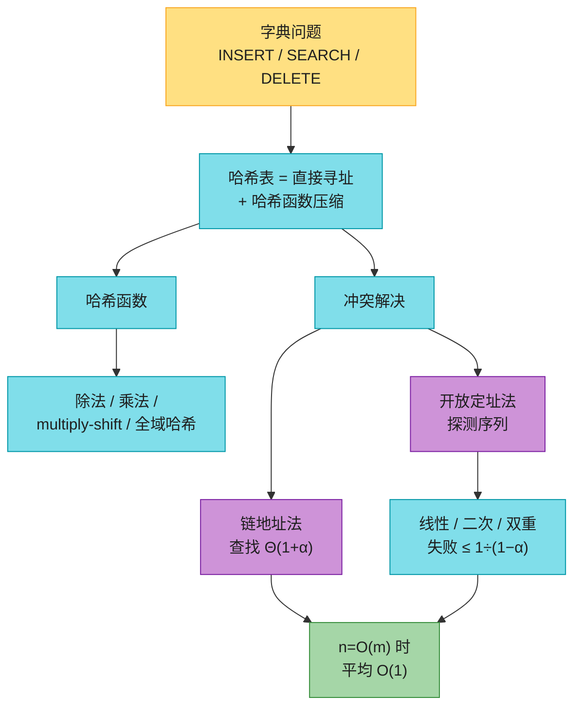

# 第十一章：哈希表

> **本章定位**：很多应用只需要一个支持「插入、查找、删除」三种操作的动态集合（字典）——编译器的符号表、Python 的 `dict`、Java 的 `HashMap` 都是。哈希表是解决字典问题最实用的结构：**最坏情况查找要 Θ(n)（不如链表好），但在合理假设下平均只要 O(1)**。
>
> 与前后章节的关系：本章是第 10 章基本数据结构的直接应用（链地址法用的就是第 10 章的链表）；第 12、13 章的 BST / 红黑树也能实现字典，且是有序的（支持 MIN / SUCCESSOR 等），代价是 O(lg n)——**哈希表牺牲顺序，换来平均 O(1)**。需要有序就回头看红黑树，不需要顺序就用哈希表。

---

## 一、核心思想：把「比较查找」变成「计算定位」

普通数组下标访问是 O(1) 的——因为位置是**算出来**的，不是**找出来**的。哈希表把这个思想推广：不拿键直接当下标（键的宇宙太大），而是用一个**哈希函数** `h` 把键 `k` 算成槽位号 `h(k)`：

```
h: U → {0, 1, ..., m-1}
```

- `U`：键的宇宙（可能巨大甚至无限，如所有字符串）
- `m`：哈希表的槽数（通常远小于 |U|）
- `h(k)`：键 `k` 的哈希值，元素就存放在槽 `h(k)` 里

因为 |U| > m，必然有两个不同的键映射到同一槽——这叫**冲突（collision）**。设计再好的哈希函数也不可能完全避免冲突，所以本章一半内容在讲**冲突解决**：链地址法（§五）与开放定址法（§六）。



图中 k2 与 k5 映射到同一槽（红色 = 发生冲突，对应 CLRS 图 11.2），其余键各占各的槽。

---

## 二、直接寻址表：哈希表的起点（§11.1）

**思想**：当键宇宙 U = {0, 1, ..., m-1} 很小（比如员工工号只有 4 位）时，直接用键当数组下标，槽 `k` 存键为 `k` 的元素（或指向它的指针），没有就存 NIL。

```
DIRECT-ADDRESS-SEARCH(T, k)   return T[k]
DIRECT-ADDRESS-INSERT(T, x)   T[x.key] = x
DIRECT-ADDRESS-DELETE(T, x)   T[x.key] = NIL
```

三个操作都是 **O(1) 最坏时间**。例：U = {0..9}，实际键集 K = {2, 3, 5, 8}：

| 槽 | 0 | 1 | 2 | 3 | 4 | 5 | 6 | 7 | 8 | 9 |
|----|---|---|---|---|---|---|---|---|---|---|
| 内容 | NIL | NIL | →x(2) | →x(3) | NIL | →x(5) | NIL | NIL | →x(8) | NIL |

**致命局限**：U 一大就完了——存 32 位整数键要 2³² 个槽（16 GB 指针），字符串键更是无限宇宙。而且实际存的键集 K 往往远小于 U，绝大部分槽浪费。

> **哈希表 = 直接寻址 + 哈希函数压缩**：存储开销从 Θ(|U|) 降到 Θ(|K|)，代价是 O(1) 从「最坏保证」降级为「平均保证」，且必须处理冲突。

> 工程技巧（习题 11.1-2/11.1-4）：若无卫星数据，可用 **m 位的位向量**代替指针数组；若数组巨大无法初始化，可用「栈数组 + 双向指针对拍」实现 O(1) 初始化的直接寻址。

---

## 三、哈希函数（§11.3）

### 3.1 好哈希函数的标准

1. **确定性**：同一键每次算出同一哈希值（否则存进去就找不回来）。
2. **快**：O(1) 时间可算。
3. **近似均匀**：尽量把键均匀撒到 m 个槽里。

理论上的理想模型叫**独立均匀哈希（independent uniform hashing）**：每个键独立地等概率落到任一槽（又称**随机预言机** random oracle）。它不可实现，但它是分析性能的假设基准——后文所有「平均 O(1)」结论都在这个假设下成立。

### 3.2 除法哈希：`h(k) = k mod m`

最简单、最快（一次取余）。**m 的选择是关键**：

- **选质数，且不太接近 2 的幂**（CLRS 的建议）。例如存约 2000 个键、α 目标 3 左右，取 m = 701（质数，离 512 和 1024 都不近）。
- **反例**：m = 2ᵖ 时 `k mod m` 只取 k 的最低 p 位——若键是「高位相同、低位规律」的数据（如内存地址的低几位总有对齐模式），大量键挤进少数槽。

### 3.3 乘法哈希：`h(k) = ⌊m · (kA mod 1)⌋`

两步：用常数 A（0 < A < 1）乘 k 取小数部分，再乘 m 向下取整。**优点：对 m 不敏感**，m 取多少都行。Knuth 推荐黄金分割的分数部分：

```
A ≈ (√5 − 1)/2 ≈ 0.6180339887
```

例（习题 11.3-4，已用代码核对）：m = 1000，A = (√5−1)/2，h(61)=700，h(62)=318，h(63)=936，h(64)=554，h(65)=172——连续的键被打散到不相邻的槽。

### 3.4 multiply-shift：乘法哈希的工程版（第四版重点）

浮点运算慢且精度有坑。实际用整数实现：取 m = 2ˡ（l ≤ 机器字长 w），选 w 位整数 a = A·2ʷ，则

```
h_a(k) = (k·a mod 2ʷ) ≫ (w − l)
```

即：w 位乘 w 位得 2w 位积，**丢掉高 w 位 r1，取低 w 位 r0 的最高 l 位**。只要乘法、取模（溢出自动完成）、逻辑右移三条机器指令。



原书例子（已用代码核对）：k = 123456，w = 32，l = 14（m = 16384），a = 2654435769（Knuth 建议值）→ ka = 76300·2³² + 17612864，r0 = 17612864 的高 14 位是 **67**。

```java
int multiplyShift(int k, int a, int l) {
    return (k * a) >>> (32 - l);   // Java int 溢出即自动 mod 2^32
}
```

```python
def multiply_shift(k, a, l, w=32):
    return ((k * a) % (1 << w)) >> (w - l)
```

### 3.5 字符串与长键：多项式滚动哈希

把字符串看成「p 进制数」，用 Horner 法则边乘边取模，O(长度) 且不溢出：

```
h(s) = (((s[0]·p + s[1])·p + s[2])·p + ... ) mod m
```

Java 的 `String.hashCode()` 就是这个公式：**p = 31，且不取模**（int 溢出自然回绕，效果等同于 mod 2³²）。选 31 因为它是质数且 `31*x = (x<<5) - x` 能被编译器优化。

> **hashCode / equals 契约**（写 Java 必考）：`equals` 相等 ⇒ `hashCode` 必须相等；哈希冲突时靠 `equals` 在链上逐个确认。两个方法要么都重写，要么都不重写。复合键用 `Objects.hash(f1, f2, ...)`（内部就是 `31·h1 + h2` 的组合）。

### 3.6 全域哈希（universal hashing）：防恶意输入

固定哈希函数的死穴：**对手若知道 h，可以故意构造 n 个全部同槽的键**，把查找拖回 Θ(n)（哈希洪水攻击）。

对策（类比快速排序的随机化）：**程序启动时从一族哈希函数里随机挑一个**，对手无法预判。函数族 H 称为**全域（universal）**，若任取两个不同的键 k1 ≠ k2，随机选 h ∈ H 时

```
Pr[h(k1) = h(k2)] ≤ 1/m
```

**数论构造**（CLRS 式 11.3）：取质数 p 大于所有键，随机取 a ∈ {1..p−1}、b ∈ {0..p−1}，

```
h_ab(k) = ((a·k + b) mod p) mod m
```

这个族是全域的（定理 11.4），且 m 任意（不必是质数）。例：p = 17, m = 6，h₃,₄(8) = (28 mod 17) mod 6 = 11 mod 6 = **5**。

**实践推荐**：multiply-shift 族（a 为随机奇数）是 **2/m-全域**的（定理 11.5）——冲突率上界放宽一倍，但算得快得多，多数场景划算。

> **结论（推论 11.3）**：链地址 + 全域哈希，任意 s 个操作（含 n = O(m) 次插入）的期望总时间 Θ(s)——对手选什么键都没用。

---

## 四、冲突为什么不可避免：生日悖论

著名反直觉事实：**23 个人的群体，至少两人同天生日的概率超过 50%**。翻译成哈希语言：365 个槽、随机插入 23 个键，冲突概率已经过半。

```
P(至少一次冲突) ≈ 1 − e^(−n²/2m)
P = 50% 时  n ≈ √(2m·ln2) ≈ 1.18·√m
```

| m（槽数） | n = √m 时冲突概率 | 冲突率达 50% 的 n |
|-----------|------------------|-------------------|
| 365 | ≈ 39% | 23（生日悖论本尊） |
| 1 000 | ≈ 39% | 38 |
| 1 000 000 | ≈ 39% | 1 178 |

（已用精确公式 `1 − Π(m−i)/m` 数值核对。）**记住量级：插入约 √m 个键就很可能有冲突**。所以「冲突解决」不是边角料，而是哈希表的核心设计。

---

## 五、链地址法（chaining，§11.2）

### 5.1 结构与操作

**思想**：同槽的元素串成一条链表，槽里只存链表头指针。可以把它看成「非递归版分治」：哈希函数把 n 个元素随机分成 m 组，每组近似 n/m 个，各组独立用链表管理。



伪代码（复用第 10 章的链表操作）：

```
CHAINED-HASH-INSERT(T, x)   LIST-PREPEND(T[h(x.key)], x)      // 头插
CHAINED-HASH-SEARCH(T, k)   return LIST-SEARCH(T[h(k)], k)
CHAINED-HASH-DELETE(T, x)   LIST-DELETE(T[h(x.key)], x)       // 给的是元素指针
```

- **插入 O(1)** 最坏（头插；若要求「键已存在则不插」，需先查找）。
- **删除 O(1)** 最坏——前提是**双向链表**且已知元素指针；只有单链表时删除退化为查找同款 O(链长)。
- **查找**正比于链长，是分析的重点。

### 5.2 装载因子与平均性能

**装载因子 α = n/m**（平均每条链的长度；α 可以小于、等于或大于 1）。

| 操作 | 最坏 | 平均（独立均匀哈希假设） |
|------|------|--------------------------|
| 插入 | O(1) | O(1) |
| 删除（双向链 + 元素指针） | O(1) | O(1) |
| 查找（成功或失败） | Θ(n)（全部同槽） | **Θ(1 + α)** |

结论的含义（定理 11.1 / 11.2）：只要 **n = O(m)**（α 是常数），所有字典操作平均 O(1)。成功查找的精确期望是 `1 + α/2 − α/(2n)`——比失败查找略省，因为目标元素必然在某个非空链上。

> 习题 11.2-3（Marley 教授）：把每条链改成**有序**——成功/失败查找、删除的渐进复杂度不变（失败查找可提前停但只是常数收益），插入却从 O(1) 变 Θ(1+α)。**不划算**。

### 5.3 一次完整插入示例（习题 11.2-2，已用代码核对）

m = 9，h(k) = k mod 9，依次插入 5, 28, 19, 15, 20, 33, 12, 17, 10（头插法，新元素在链首）：

| 槽 | 0 | 1 | 2 | 3 | 4 | 5 | 6 | 7 | 8 |
|----|---|---|---|---|---|---|---|---|---|
| 链 | NIL | 10→19→28 | 20 | 12 | NIL | 5 | 33→15 | NIL | 17 |

---

## 六、开放定址法（open addressing，§11.4）

### 6.1 核心思想

所有元素都躺在表本身里：**没有链表、没有指针**。冲突了，就按某个由键决定的**探测序列**挨个找下一个槽。省下的指针空间让同样的内存能开更多槽、冲突更少；而且连续探测对 CPU 缓存友好（§6.6）。

哈希函数升级为带探测序号：`h: U × {0,1,...,m−1} → {0,1,...,m−1}`，要求对每个键，探测序列 `⟨h(k,0), h(k,1), ..., h(k,m−1)⟩` 是 {0..m−1} 的一个**排列**（保证表满之前总能找到空槽）。注意开放定址的 **α ≤ 1**。

```
HASH-INSERT(T, k)                HASH-SEARCH(T, k)
  i = 0                            i = 0
  repeat                           repeat
    q = h(k, i)                      q = h(k, i)
    if T[q] == NIL                   if T[q] == k
      T[q] = k                         return q
      return q                       i = i + 1
    else i = i + 1                 until T[q] == NIL or i == m
  until i == m                     return NIL
  error "hash table overflow"
```

查找能提前终止的原理：k 的查找路径与当初插入路径完全相同，**遇到空槽说明 k 当初就该放这里——它不在表里**。

### 6.2 三种探测方式

| 方式 | 公式 | 探测序列（起点 p = h₁(k)） | 不同序列数 | 问题 |
|------|------|---------------------------|-----------|------|
| 线性探测 | h(k,i) = (h₁(k) + i) mod m | p, p+1, p+2, ... | 仅 m 种 | **一次聚集**：连续占用段像滚雪球 |
| 二次探测 | h(k,i) = (h₁(k) + c₁i + c₂i²) mod m | p, p+c₁+c₂, p+2c₁+4c₂, ... | m 种 | 常数选不好会漏探槽（不能覆盖全表） |
| 双重哈希 | h(k,i) = (h₁(k) + i·h₂(k)) mod m | p, p+h₂, p+2h₂, ... | Θ(m²) 种 | 要求 **h₂(k) 与 m 互质** |

- 线性探测就是 h₂(k) ≡ 1 的双重哈希。
- 保证互质的两种实用方案：**m 取 2 的幂 + h₂(k) 恒为奇数**；或 **m 取质数 + h₂(k) ∈ [1, m−1]**，例如 `h₁(k) = k mod m`，`h₂(k) = 1 + (k mod (m−1))`。
- 双重哈希的 Θ(m²) 个序列最接近理想的「均匀排列哈希」（m! 个），实践表现最好。

### 6.3 双重哈希示例（CLRS 图 11.5，已用代码核对）

m = 13，h₁(k) = k mod 13，h₂(k) = 1 + (k mod 11)。依次插入 79, 69, 72, 98, 50：

| 槽 | 0 | 1 | 2 | 3 | 4 | 5 | 6 | 7 | 8 | 9 | 10 | 11 | 12 |
|----|---|---|---|---|---|---|---|---|---|---|----|----|----|
| 键 | — | 79 | — | — | 69 | 98 | — | 72 | — | — | — | 50 | — |

（98：h₁ = 7 被 72 占，步长 h₂ = 11，(7+11) mod 13 = 5，落槽 5。）

再插入 **14**：h₁(14) = 1（被 79 占），h₂(14) = 4 → 槽 5（被 98 占）→ 槽 **9**（空，落位）。探测路径 1 → 5 → 9。

### 6.4 删除：开放定址的阿喀琉斯之踵

**不能直接置 NIL**——那会切断别人的查找链（见 §6.1 的终止原理）。

**方案一：DELETED 墓碑**。删除时置特殊标记；查找跳过它继续探测，插入遇到它可以复用。代价：查找时间不再只取决于 α（墓碑也挡路），墓碑多了要整体重哈希清理。**需要频繁删除时，书上建议直接用链地址法。**

**方案二：线性探测专属的无墓碑删除**（§11.5.1，第四版新增）。线性探测的所有键沿同一方向循环探测，删除后可以**把后面的键往前挪**填补空缺。判据：槽 q 空出来后，后续槽 q′ 里的键 k′ 需要前移，当且仅当 `g(k′, q) < g(k′, q′)`（其中 `g(k, q) = (q − h₁(k)) mod m` 是「到达槽 q 的探测序号」——即插入 k′ 时槽 q 曾被探测过）。

```
LINEAR-PROBING-HASH-DELETE(T, q)
  while TRUE
    T[q] = NIL                       // 腾出槽 q
    q′ = q
    repeat
      q′ = (q′ + 1) mod m            // 线性探测找下一个键
      k′ = T[q′]
      if k′ == NIL
        return                       // 遇到空槽结束
    until g(k′, q) < g(k′, q′)       // k′ 插入时曾路过槽 q？
    T[q] = k′                        // 前移填补
    q = q′                           // q′ 成为新的空缺
```

示例（CLRS 图 11.6，已用代码核对）：m = 10，h₁(k) = k mod 10，插入 74, 43, 93, 18, 82, 38, 92 后删除槽 3 的 43——**93 从槽 5 前移到 3，92 从槽 6 前移到 5**，其余不动：

| 槽 | 0 | 1 | 2 | 3 | 4 | 5 | 6 | 7 | 8 | 9 |
|----|---|---|---|---|---|---|---|---|---|---|
| 删除前 | — | — | 82 | **43** | 74 | 93 | 92 | — | 18 | 38 |
| 删除后 | — | — | 82 | **93** | 74 | **92** | — | — | 18 | 38 |

（验证：93 原本 mod 10 = 3，槽 3 空出后若不挪它就再也找不到它。）

### 6.5 开放定址的平均性能

理想假设升级为**独立均匀排列哈希**：每个键的探测序列等概率是 m! 个排列之一。且假设无删除、α < 1。

| 操作 | 期望探测次数上界 | α = 0.5 | α = 0.75 | α = 0.9 |
|------|------------------|---------|----------|---------|
| 失败查找 / 插入（定理 11.6、推论 11.7） | **1/(1−α)** | 2 | 4 | 10 |
| 成功查找（定理 11.8） | **(1/α)·ln(1/(1−α))** | 1.387 | 1.848 | 2.559 |

直觉（把证明浓缩成一句话）：第一次探测必发生；以概率 ≈ α 撞上占用槽才有第二次；以概率 ≈ α² 才有第三次……期望 ≈ 1 + α + α² + ⋯ = 1/(1−α)。

> α 越接近 1，失败查找爆炸得越快（0.9 → 10 次，0.99 → 100 次）。**这就是开放定址实现里 α 上限常取 0.7~0.75 的原因。**

### 6.6 一次聚集与缓存：理论 vs 实践的反转

线性探测的软肋是**一次聚集（primary clustering）**：长占用段越长越容易变长（空槽前面有 i 个占用槽时，它被下一个元素占中的概率是 (i+1)/m），平均查找被拖长。理论上双重哈希更优。

但第四版 §11.5 指出实践反转：**线性探测的连续探测基本落在同一缓存块里**，而双重哈希每次探测都可能换缓存行。配一个足够随机的哈希函数（定理 11.9：h₁ 为 5-独立且 α ≤ 2/3 时，线性探测期望常数时间，操作时间 O(1/ε²)，α = 1−ε），线性探测在现代分层内存机器上反而常是最快的选择。这也是 Python dict、许多高性能哈希表采用开放定址的原因。

---

## 七、再哈希与动态扩容

装载因子超过阈值（链地址常取 0.75，开放定址常取 0.7~0.75）时，开一张约 2 倍大的新表，把所有键**重新计算槽位**搬过去（键的哈希值随 m 变化，无法整体平移）。

**均摊 O(1)**：容量翻倍意味着两次扩容之间至少又插入了 Θ(m) 个元素；把扩容的 O(m) 平摊到它们头上，每次插入只多出 O(1)。几何级数 1 + 2 + 4 + ⋯ + n < 2n 一句话说清。

### 链地址 vs 开放定址

| 特性 | 链地址法 | 开放定址法 |
|------|----------|------------|
| 存储 | 槽数组 + 链表节点（额外指针） | 纯数组 |
| α 限制 | 可 > 1 | 必须 < 1 |
| 删除 | 简单 O(1)（双向链 + 指针） | 墓碑污染 / 仅线性探测可无墓碑删除 |
| 缓存友好 | 差（指针跳转） | **好**（线性探测最佳） |
| 最坏查找 | Θ(n) | Θ(n)（全表探测） |
| 适用 | 删除频繁、键数波动大（Java `HashMap`） | 内存敏感、删除少（Python `dict`） |

---

## 八、代码实现（Java + Python）

约定：可运行代码用 0-indexed（实战惯例）；哈希函数用「扰动 + 取模」（Java 风格），开放定址的 m 取质数使 h₂ ∈ [1, m−1] 自动互质。两个实现均已通过 **50 轮 × 20 000 次随机增删查、逐操作与 `HashMap` / `dict` 对拍**。

### 8.1 Java：链地址法

```java
/**
 * 链地址法哈希表（简化教学版）
 * 桶数组 + 单链表，头插法；装载因子超过 0.75 时容量翻倍并重哈希。
 */
public class ChainedHashMap<K, V> {

    private static class Node<K, V> {
        final K key;
        V value;
        Node<K, V> next;

        Node(K key, V value, Node<K, V> next) {
            this.key = key;
            this.value = value;
            this.next = next;
        }
    }

    private static final int INIT_CAPACITY = 8;
    private static final double MAX_LOAD = 0.75;

    private Node<K, V>[] table;
    private int size;

    @SuppressWarnings("unchecked")
    public ChainedHashMap() {
        table = (Node<K, V>[]) new Node[INIT_CAPACITY];
    }

    /** 扰动函数：混合 hashCode 的高低位，再取模定位桶 */
    private int indexFor(Object key) {
        int h = key.hashCode();
        h ^= (h >>> 16);
        return (h & 0x7fffffff) % table.length;
    }

    public V get(Object key) {
        for (Node<K, V> e = table[indexFor(key)]; e != null; e = e.next) {
            if (e.key.equals(key)) {
                return e.value;
            }
        }
        return null;
    }

    public void put(K key, V value) {
        int idx = indexFor(key);
        for (Node<K, V> e = table[idx]; e != null; e = e.next) {
            if (e.key.equals(key)) {   // 键已存在：更新
                e.value = value;
                return;
            }
        }
        table[idx] = new Node<>(key, value, table[idx]);  // 头插法
        size++;
        if (size > table.length * MAX_LOAD) {
            resize();
        }
    }

    public V remove(Object key) {
        int idx = indexFor(key);
        Node<K, V> prev = null;
        for (Node<K, V> e = table[idx]; e != null; e = e.next) {
            if (e.key.equals(key)) {
                if (prev == null) {
                    table[idx] = e.next;
                } else {
                    prev.next = e.next;
                }
                size--;
                return e.value;
            }
            prev = e;
        }
        return null;
    }

    public int size() {
        return size;
    }

    @SuppressWarnings("unchecked")
    private void resize() {
        Node<K, V>[] old = table;
        table = (Node<K, V>[]) new Node[old.length * 2];
        size = 0;
        for (Node<K, V> head : old) {
            for (Node<K, V> e = head; e != null; e = e.next) {
                put(e.key, e.value);   // 用新容量重新定位
            }
        }
    }
}
```

### 8.2 Java：开放定址法（双重哈希 + 墓碑）

```java
/**
 * 开放定址法哈希表（双重哈希 + DELETED 墓碑标记）
 * m 取质数，h2(k) 落在 [1, m-1] 自动与 m 互质；
 * 已用槽（含墓碑）达到 0.75m 时扩容到下一个约 2 倍的质数。
 */
public class OpenAddressingHashMap<K, V> {

    private static final Object DELETED = new Object();  // 墓碑标记
    private static final double MAX_LOAD = 0.75;

    private Object[] keys;     // null=空槽, DELETED=墓碑, 其余=键
    private Object[] values;
    private int m;             // 桶数（质数）
    private int size;          // 有效元素数
    private int used;          // 非空槽数（含墓碑）

    public OpenAddressingHashMap() {
        m = 11;
        keys = new Object[m];
        values = new Object[m];
    }

    private int h1(Object key) {
        return (key.hashCode() & 0x7fffffff) % m;
    }

    private int h2(Object key) {
        return 1 + (key.hashCode() & 0x7fffffff) % (m - 1);
    }

    @SuppressWarnings("unchecked")
    public V get(Object key) {
        int h1 = h1(key), h2 = h2(key);
        for (int i = 0; i < m; i++) {
            int q = (h1 + i * h2) % m;
            if (keys[q] == null) {
                return null;                       // 遇到空槽：提前终止
            }
            if (keys[q] != DELETED && keys[q].equals(key)) {
                return (V) values[q];
            }
        }
        return null;
    }

    public void put(K key, V value) {
        if (used >= m * MAX_LOAD) {
            resize();
        }
        int h1 = h1(key), h2 = h2(key);
        int firstDeleted = -1;
        for (int i = 0; i < m; i++) {
            int q = (h1 + i * h2) % m;
            if (keys[q] == null) {                 // 空槽：插入（优先用墓碑位）
                int pos = (firstDeleted >= 0) ? firstDeleted : q;
                keys[pos] = key;
                values[pos] = value;
                size++;
                used++;
                return;
            }
            if (keys[q] == DELETED) {
                if (firstDeleted < 0) {
                    firstDeleted = q;              // 记录第一个墓碑，继续找键
                }
            } else if (keys[q].equals(key)) {      // 键已存在：更新
                values[q] = value;
                return;
            }
        }
        if (firstDeleted >= 0) {                   // 表满但有墓碑可用
            keys[firstDeleted] = key;
            values[firstDeleted] = value;
            size++;
            return;
        }
        throw new IllegalStateException("hash table overflow");
    }

    @SuppressWarnings("unchecked")
    public V remove(Object key) {
        int h1 = h1(key), h2 = h2(key);
        for (int i = 0; i < m; i++) {
            int q = (h1 + i * h2) % m;
            if (keys[q] == null) {
                return null;
            }
            if (keys[q] != DELETED && keys[q].equals(key)) {
                V old = (V) values[q];
                keys[q] = DELETED;                 // 置墓碑而非 null
                values[q] = null;
                size--;
                return old;
            }
        }
        return null;
    }

    public int size() {
        return size;
    }

    /** 扩容到下一个约 2 倍的质数；重插时顺带清掉所有墓碑 */
    private void resize() {
        Object[] oldKeys = keys, oldValues = values;
        int oldM = m;
        m = nextPrime(2 * oldM);
        keys = new Object[m];
        values = new Object[m];
        size = 0;
        used = 0;
        for (int i = 0; i < oldM; i++) {
            if (oldKeys[i] != null && oldKeys[i] != DELETED) {
                @SuppressWarnings("unchecked")
                K k = (K) oldKeys[i];
                @SuppressWarnings("unchecked")
                V v = (V) oldValues[i];
                put(k, v);
            }
        }
    }

    private static int nextPrime(int n) {
        while (!isPrime(n)) {
            n++;
        }
        return n;
    }

    private static boolean isPrime(int n) {
        if (n < 2) return false;
        for (int i = 2; (long) i * i <= n; i++) {
            if (n % i == 0) return false;
        }
        return true;
    }
}
```

### 8.3 Python：双实现

```python
"""链地址法哈希表（教学版）：桶数组 + 单链表头插，装载因子 > 0.75 时翻倍扩容。"""


class ChainedHashMap:
    class _Node:
        __slots__ = ("key", "value", "next")

        def __init__(self, key, value, nxt):
            self.key = key
            self.value = value
            self.next = nxt

    INIT_CAPACITY = 8
    MAX_LOAD = 0.75

    def __init__(self):
        self._table = [None] * self.INIT_CAPACITY
        self._size = 0

    def _index(self, key):
        return hash(key) % len(self._table)

    def get(self, key, default=None):
        node = self._table[self._index(key)]
        while node is not None:
            if node.key == key:
                return node.value
            node = node.next
        return default

    def put(self, key, value):
        idx = self._index(key)
        node = self._table[idx]
        while node is not None:
            if node.key == key:          # 键已存在：更新
                node.value = value
                return
            node = node.next
        self._table[idx] = self._Node(key, value, self._table[idx])  # 头插法
        self._size += 1
        if self._size > len(self._table) * self.MAX_LOAD:
            self._resize()

    def remove(self, key):
        idx = self._index(key)
        prev, node = None, self._table[idx]
        while node is not None:
            if node.key == key:
                if prev is None:
                    self._table[idx] = node.next
                else:
                    prev.next = node.next
                self._size -= 1
                return node.value
            prev, node = node, node.next
        return None

    def size(self):
        return self._size

    def _resize(self):
        old = self._table
        self._table = [None] * (len(old) * 2)
        self._size = 0
        for head in old:
            while head is not None:
                self.put(head.key, head.value)   # 用新容量重新定位
                head = head.next


class OpenAddressingHashMap:
    """开放定址法哈希表：双重哈希 + DELETED 墓碑；m 为质数，h2 ∈ [1, m-1]。"""

    _DELETED = object()      # 墓碑标记
    MAX_LOAD = 0.75

    def __init__(self):
        self._m = 11
        self._keys = [None] * self._m
        self._values = [None] * self._m
        self._size = 0
        self._used = 0       # 非空槽数（含墓碑）

    def _h1(self, key):
        return hash(key) % self._m

    def _h2(self, key):
        return 1 + hash(key) % (self._m - 1)

    def get(self, key, default=None):
        h1, h2 = self._h1(key), self._h2(key)
        for i in range(self._m):
            q = (h1 + i * h2) % self._m
            if self._keys[q] is None:
                return default             # 遇到空槽：提前终止
            if self._keys[q] is not self._DELETED and self._keys[q] == key:
                return self._values[q]
        return default

    def put(self, key, value):
        if self._used >= self._m * self.MAX_LOAD:
            self._resize()
        h1, h2 = self._h1(key), self._h2(key)
        first_deleted = -1
        for i in range(self._m):
            q = (h1 + i * h2) % self._m
            if self._keys[q] is None:
                pos = first_deleted if first_deleted >= 0 else q
                self._keys[pos] = key
                self._values[pos] = value
                self._size += 1
                self._used += 1
                return
            if self._keys[q] is self._DELETED:
                if first_deleted < 0:
                    first_deleted = q      # 记录第一个墓碑，继续找键
            elif self._keys[q] == key:     # 键已存在：更新
                self._values[q] = value
                return
        if first_deleted >= 0:
            self._keys[first_deleted] = key
            self._values[first_deleted] = value
            self._size += 1
            return
        raise RuntimeError("hash table overflow")

    def remove(self, key):
        h1, h2 = self._h1(key), self._h2(key)
        for i in range(self._m):
            q = (h1 + i * h2) % self._m
            if self._keys[q] is None:
                return None
            if self._keys[q] is not self._DELETED and self._keys[q] == key:
                old = self._values[q]
                self._keys[q] = self._DELETED   # 置墓碑而非 None
                self._values[q] = None
                self._size -= 1
                return old
        return None

    def size(self):
        return self._size

    def _resize(self):
        old_keys, old_values = self._keys, self._values
        self._m = self._next_prime(2 * self._m)
        self._keys = [None] * self._m
        self._values = [None] * self._m
        self._size = 0
        self._used = 0
        for k, v in zip(old_keys, old_values):
            if k is not None and k is not self._DELETED:
                self.put(k, v)             # 顺带清掉所有墓碑

    @staticmethod
    def _next_prime(n):
        def is_prime(x):
            if x < 2:
                return False
            i = 2
            while i * i <= x:
                if x % i == 0:
                    return False
                i += 1
            return True
        while not is_prime(n):
            n += 1
        return n
```

---

## 九、复杂度速查与易混点

### 9.1 速查表

| 项目 | 链地址法 | 开放定址法（理想假设） |
|------|----------|------------------------|
| 装载因子 α | n/m，可 > 1 | n/m，必须 < 1 |
| 查找（平均） | Θ(1 + α)（成功/失败同阶） | 失败 ≤ 1/(1−α)；成功 ≤ (1/α)·ln(1/(1−α)) |
| 插入（平均） | O(1)（头插） | ≤ 1/(1−α) 次探测 |
| 删除 | O(1)（双向链 + 元素指针） | 墓碑法近似同查找；线性探测可前移填补 |
| 最坏情况 | 全部同槽 Θ(n) | 探遍全表 Θ(m) |
| 扩容 | 翻倍 + 重哈希，均摊 O(1) | 同左 |

### 9.2 易混点对比

| 易混点 | 辨析 |
|--------|------|
| 「平均 O(1)」的前提 | 不是免费的：要求哈希函数近似均匀（理论上用独立均匀哈希或全域哈希），且 n = O(m) |
| 哈希表 vs 红黑树 | 哈希表：无序字典，平均 O(1)；红黑树：有序字典（MIN/SUCCESSOR/范围查），最坏 O(lg n)。要排序/范围查询只能用后者 |
| 除法 vs 乘法 vs multiply-shift | 除法：快但 m 要选好质数；乘法：对 m 不敏感但有浮点；multiply-shift：乘法的整数实现，m = 2ˡ，三条指令，工程首选 |
| 全域哈希 ≠ 好的固定哈希 | 全域是「随机选函数」的分布性质（对任意键对冲突率 ≤ 1/m），防的是恶意输入，不是让某一次运行更均匀 |
| 开放定址的删除 | 置 NIL 会断链（别人的查找提前终止）；墓碑法会污染性能；只有线性探测能无墓碑删除（前移填补） |
| 二次探测的坑 | c₁、c₂ 与 m 搭配不当会导致探测序列覆盖不满 m 个槽——插不进不等于表满 |
| h₂(k) 为什么要与 m 互质 | 若 gcd(h₂(k), m) = d > 1，探测序列只走 m/d 个槽就绕回起点（习题 11.4-5） |
| 生日悖论的启示 | 冲突是常态（√m 个键即约 40% 冲突率），冲突解决策略才是主战场 |

### 9.3 工程实践：标准库是怎么做的

| 实现 | 冲突策略 | 要点 |
|------|----------|------|
| Java `HashMap` | 链地址 | 容量恒为 2 的幂（`hash & (n−1)` 代替取模）；扰动函数 `h ^ (h >>> 16)` 混合高低位；**链表长 ≥ 8 且容量 ≥ 64 时转红黑树**（第 13 章），把该桶最坏查找降到 O(lg n)；装载因子阈值 0.75 |
| Java `Hashtable` | 链地址 | 遗留类，方法级 synchronized，不许 null 键值——新代码别用 |
| Python `dict` | 开放定址（扰动探测） | 3.7+ 起按键插入顺序迭代；小整数、短字符串有缓存优化 |
| C++ `unordered_map` | 链地址 | 标准只保证平均 O(1) |

> LeetCode 实战直接用 `HashMap` / `HashSet` / `dict` / `set`；需要有序时再换 `TreeMap` / `SortedDict`（那是第 13 章的地盘）。

> 哈希思想的其他应用（了解即可）：**布隆过滤器**——位数组 + k 个哈希函数，「可能存在 / 一定不存在」，空间极省的集合成员判定（缓存穿透防护、爬虫去重）；**一致性哈希**——把键和机器映射到同一哈希环上，加减机器只影响相邻弧段，是分布式负载均衡的标配。

---

## 十、精选习题与题单

### 10.1 LeetCode 题单（哈希表实战）

| 题号 | 题目 | 难度 | 考点 |
|------|------|------|------|
| 1 | 两数之和 | 简单 | 边遍历边存「已见值 → 下标」，O(n) 替代双重循环 |
| 217 | 存在重复元素 | 简单 | HashSet 判重 |
| 242 | 有效的字母异位词 | 简单 | 计数数组当哈希表（键宇宙小 → 直接寻址思想） |
| 49 | 字母异位词分组 | 中等 | 自定义哈希键：排序串 / 计数签名 |
| 36 | 有效的数独 | 中等 | 行、列、宫三组哈希集合并行判重 |
| 128 | 最长连续序列 | 中等 | HashSet + 「只从序列起点扩张」剪枝，O(n) |
| 380 | O(1) 时间插入、删除和随机获取元素 | 中等 | 哈希表（值→下标）+ 动态数组（下标→值），删除用「与末尾交换」 |
| 146 | LRU 缓存 | 中等 | 哈希表 O(1) 定位 + 双向链表 O(1) 调序（第 10 章链表的组合应用） |
| 705 / 706 | 设计哈希集合 / 哈希映射 | 简单 | 本章 §八 的直接考场版 |

### 10.2 CLRS 习题快问快答（第四版题号）

| 习题 | 要点 |
|------|------|
| 11.1-2 | 位向量做直接寻址：槽 k = 1 位表示「键 k 在集合中」，三操作全 O(1)，空间仅 m 位 |
| 11.1-4 | 巨大数组免初始化：附加「栈数组 S + 双向指针对拍」——T[k] 里的值 j 合法当且仅当 1 ≤ j ≤ top 且 S[j] = k |
| 11.2-1 | n 个键、m 个槽、独立均匀哈希：期望冲突对数 = C(n,2)·(1/m) = n(n−1)/(2m) |
| 11.2-2 | m = 9 头插 5,28,19,15,20,33,12,17,10 → 见 §5.3 表 |
| 11.2-3 | 链改有序：查找删除不变、插入变 Θ(1+α)，无渐进收益（见 §5.2） |
| 11.2-5 | \|U\| > (n−1)m ⇒ 鸽巢原理：U 中必有 n 个键全部同槽 ⇒ 最坏查找 Θ(n) 不可避免 |
| 11.3-3 | m = 2ᵖ−1、按 2ᵖ 进制读字符串：因 2ᵖ ≡ 1 (mod 2ᵖ−1)，字符贡献与位置无关 ⇒ **变位词必同哈希**——做拼写检查表就是灾难 |
| 11.3-4 | m = 1000、A = (√5−1)/2：61→700, 62→318, 63→936, 64→554, 65→172（§3.3） |
| 11.4-1 | m = 11 插入 10,22,31,4,15,28,17,88,59：线性探测 [22,88,—,—,4,15,28,17,59,31,10]；双重哈希 h₂=1+(k mod 10)：[22,—,59,17,4,15,28,88,—,31,10] |
| 11.4-3 | α = 3/4：失败 ≤ 4、成功 ≤ 1.85；α = 7/8：失败 ≤ 8、成功 ≤ 2.38 |
| 11.4-4 | α = 1（满表）时成功查找期望探测 = 调和数 H_m ≈ ln m |
| 11.4-5 | 双重哈希中 gcd(h₂(k), m) = d ⇒ 探测序列只覆盖 1/d 的表就回到 h₁(k)；d = 1 才能搜遍全表 |

### 10.3 思考题与章末注记（第四版）

**思考题 11-1 最长探测界**：开放定址、n ≤ m/2、理想假设下，任意一次插入超过 2 lg n 次探测的概率 O(1/n²)；所有插入中的最长探测序列期望 O(lg n)。

**思考题 11-2 静态集合搜索**：n 个键只查不增删——排序 + 二分是 O(lg n) 最坏、零额外空间；若改用开放定址想让**失败**查找平均也达到 O(lg n)，由 1/(1−α) ≤ lg n 解出需要 m − n = Ω(n / lg n) 的额外槽。

**思考题 11-3 链地址的最长链**：n 槽 n 键，最长链的期望 E[M] = O(lg n / lg lg n)（Stirling 放缩 + 联合界）——这就是 Java 树化阈值 8 背后的量级直觉（α ≈ 1 时最长链远超 8 的概率极小）。

**思考题 11-4 哈希与认证**：2-独立族必为全域族；族 `h_a(x) = Σ aⱼxⱼ mod p` 全域但不 2-独立（全零键恒映射到 0）；加偏移 b 后即 2-独立；由此得消息认证码：对手伪造 (m′, t′) 骗过 Bob 的概率 ≤ 1/p，与算力无关。

**章末注记（历史）**：哈希表与链地址法由 **Luhn**（1953）发明，**Amdahl** 同期提出开放定址；随机预言机概念来自 Bellare 等；**Carter & Wegman**（1979）提出全域哈希族；multiply-shift 由 **Dietzfelbinger** 等发明；**Thorup** 证明 5-独立下线性探测期望常数时间并给出线性探测删除法；**Fredman-Komlós-Szemerédi** 的静态**完美哈希**（无冲突，第三版正文内容，第四版移入注记）；第四版新增的 wee 哈希函数基于 RC6 加密算法，专为分层内存设计——一次函数求值比随机探一个槽还快 2~10 倍。

---

## 十一、本章要点回顾



**一句话记忆**：
- 哈希表用哈希函数把键**算成**下标，字典操作平均 O(1)；冲突不可避免（生日悖论：√m 个键就约 40% 冲突率），所以核心设计是**冲突解决**；
- **链地址**：同槽串链表，α = n/m，查找 Θ(1+α)，删除友好；**开放定址**：元素全在表里按探测序列找空位，α < 1，失败探测 ≤ 1/(1−α)，缓存友好但删除麻烦；
- 防恶意输入用**全域哈希**（随机选函数，任意键对冲突率 ≤ 1/m）；装载因子超阈值就翻倍重哈希，均摊仍是 O(1)。
