# 第十二章：二叉搜索树（Binary Search Trees）——深度详解版

> 二叉搜索树是计算机科学中最优雅、最重要的数据结构之一。它将数据的组织与高效的查找完美结合，支持有序数据的存储与检索，是平衡二叉搜索树、AVL树、红黑树等高级数据结构的基础。

---

## 一、为什么需要二叉搜索树？

### 1.1 数组查找的局限性

在讨论二叉搜索树之前，让我们回顾一下各种数据结构的查找效率：

| 数据结构 | 查找时间 | 插入时间 | 删除时间 | 有序支持 |
|---------|---------|---------|---------|---------|
| 无序数组 | O(n) | O(1) | O(n) | 否 |
| 有序数组 | O(log n) | O(n) | O(n) | 是 |
| 链表 | O(n) | O(1) | O(n) | 否 |
| 哈希表 | O(1) 平均 | O(1) 平均 | O(1) 平均 | 否 |
| **二叉搜索树** | **O(log n)** | **O(log n)** | **O(log n)** | **是** |

**问题**：有序数组支持二分查找，但插入和删除需要移动大量元素（O(n)）。

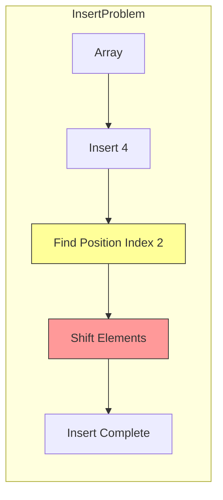

**插入 4 的代价**：
- 查找位置：O(log n)
- 移动元素：O(n)
- **总代价：O(n)**

### 1.2 链表的局限

**链表的查找**：必须从头到尾遍历

```java
// 链表查找
Node current = head;
while (current != null && current.value != target) {
    current = current.next;
}
// 最坏情况：O(n)
```

### 1.3 二叉搜索树的突破

**二叉搜索树的设计目标**：
- 查找：O(log n)
- 插入：O(log n)
- 删除：O(log n)
- 支持有序数据：范围查询、前驱后继

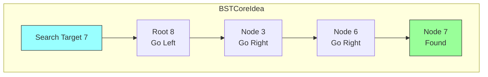

**查找过程**：每次比较都排除一半的节点！

```
n 个节点的树 → 第一次排除一半 → 剩余 n/2
            → 第二次排除一半 → 剩余 n/4
            → ...
            → 第 k 次：剩余 n/2^k

当 n/2^k = 1 时，k = log₂n
```

---

## 二、二叉搜索树的定义与性质

### 2.1 二叉搜索树的定义

**二叉搜索树（Binary Search Tree，BST）** 是一种二叉树，其中每个节点都满足以下性质：

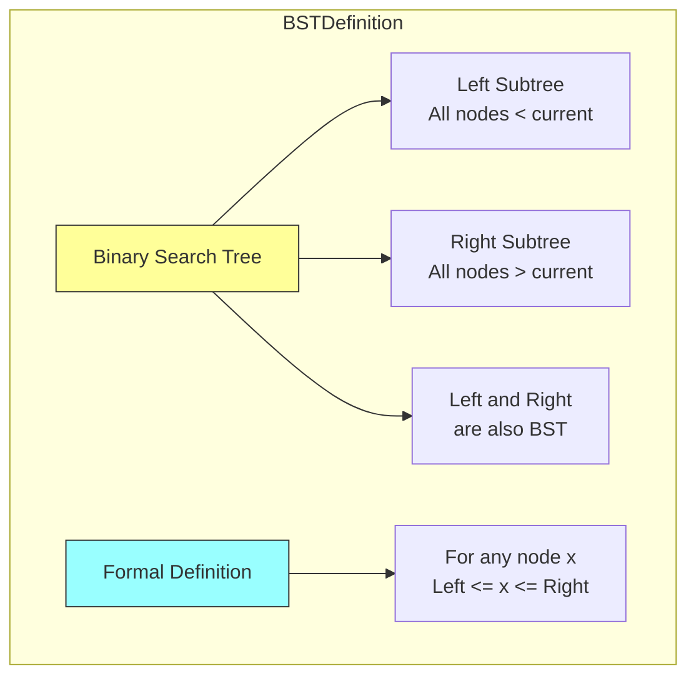

**数学定义**：

对于二叉搜索树中的任意节点 x：

```
∀y ∈ left_subtree(x): y.key < x.key
∀y ∈ right_subtree(x): y.key > x.key
```

### 2.2 BST 的性质

#### 2.2.1 中序遍历的有序性

**性质**：对二叉搜索树进行中序遍历，得到的节点序列是有序的。

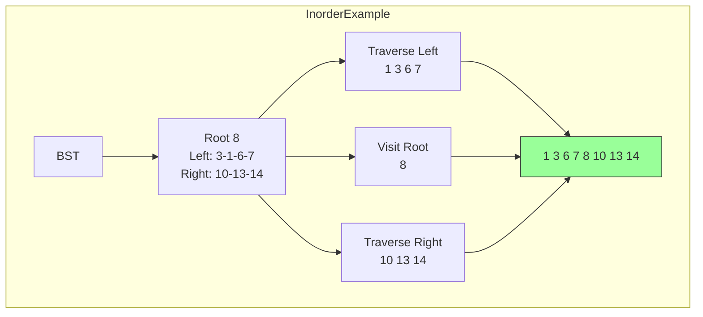

**代码验证**：

```java
// 中序遍历验证有序性
void inorderTraversal(TreeNode root, List<Integer> result) {
    if (root == null) return;
    inorderTraversal(root.left, result);
    result.add(root.val);  // 结果自然有序
    inorderTraversal(root.right, result);
}
```

#### 2.2.2 查找路径的唯一性

**性质**：在二叉搜索树中，查找任意节点的路径是唯一的。

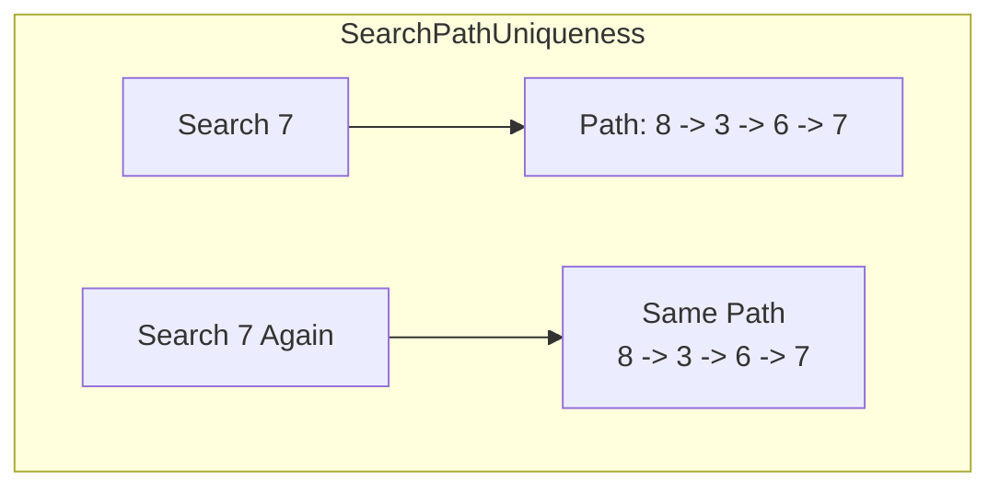

#### 2.2.3 最小值和最大值的位置

**性质**：
- 最小值：最左边的节点
- 最大值：最右边的节点

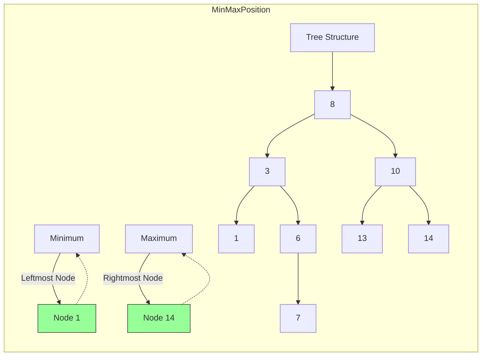

### 2.3 BST 的结构特点

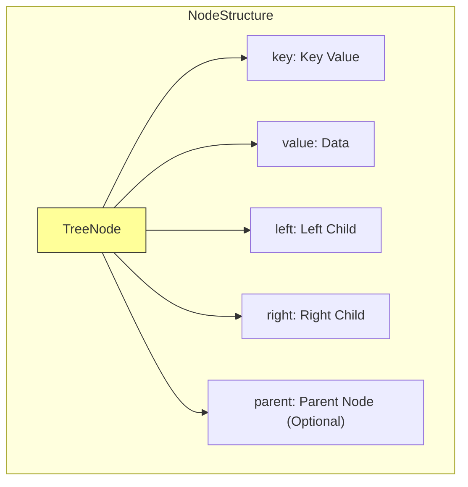

**Java 实现节点类**：

```java
/**
 * 二叉搜索树节点
 */
public class TreeNode {
    public int key;           // 键（用于比较和定位）
    public Object value;      // 值（存储的数据）
    public TreeNode left;     // 左子节点
    public TreeNode right;    // 右子节点
    public TreeNode parent;   // 父节点（可选，用于某些操作）

    public TreeNode(int key, Object value) {
        this(key, value, null, null, null);
    }

    public TreeNode(int key, Object value, TreeNode left, TreeNode right) {
        this(key, value, left, right, null);
    }

    public TreeNode(int key, Object value, TreeNode left, TreeNode right, TreeNode parent) {
        this.key = key;
        this.value = value;
        this.left = left;
        this.right = right;
        this.parent = parent;
    }

    /**
     * 判断是否为叶子节点
     */
    public boolean isLeaf() {
        return left == null && right == null;
    }

    /**
     * 判断是否有两个子节点
     */
    public boolean hasTwoChildren() {
        return left != null && right != null;
    }

    /**
     * 判断是否为左子节点
     */
    public boolean isLeftChild() {
        return parent != null && parent.left == this;
    }

    /**
     * 判断是否为右子节点
     */
    public boolean isRightChild() {
        return parent != null && parent.right == this;
    }

    @Override
    public String toString() {
        return "TreeNode{key=" + key + ", value=" + value + "}";
    }
}
```

---

## 三、BST 的核心操作

### 3.1 查找操作（Search）

#### 3.1.1 查找的思路

从根节点开始，将目标值与当前节点比较：
- 相等：找到，返回节点
- 小于：递归查找左子树
- 大于：递归查找右子树

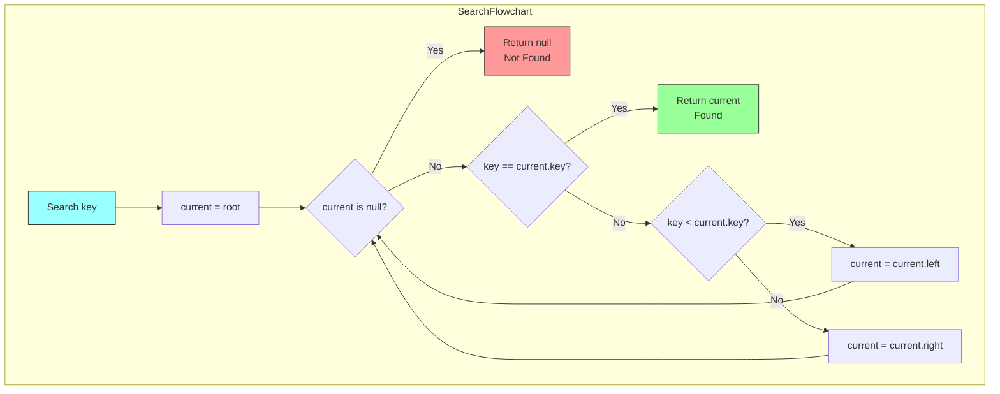

#### 3.1.2 递归实现

```java
/**
 * 递归查找
 * @param root 树的根节点
 * @param key 要查找的键
 * @return 找到返回节点，否则返回 null
 */
public TreeNode searchRecursive(TreeNode root, int key) {
    // 基础情况 1：空树或找到节点
    if (root == null || root.key == key) {
        return root;
    }

    // 递归情况：根据比较结果选择子树
    if (key < root.key) {
        return searchRecursive(root.left, key);  // 在左子树查找
    } else {
        return searchRecursive(root.right, key); // 在右子树查找
    }
}
```

#### 3.1.3 迭代实现

```java
/**
 * 迭代查找（更推荐，避免栈溢出）
 * @param root 树的根节点
 * @param key 要查找的键
 * @return 找到返回节点，否则返回 null
 */
public TreeNode searchIterative(TreeNode root, int key) {
    TreeNode current = root;

    while (current != null) {
        if (key == current.key) {
            return current;  // 找到
        } else if (key < current.key) {
            current = current.left;  // 向左
        } else {
            current = current.right; // 向右
        }
    }

    return null;  // 未找到
}
```

#### 3.1.4 查找示例

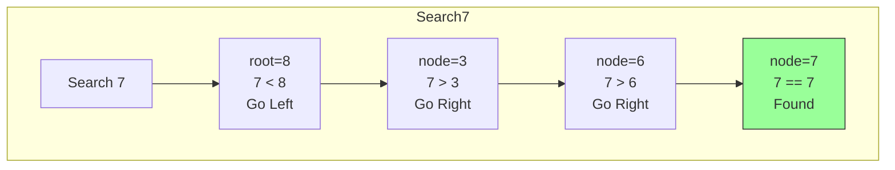

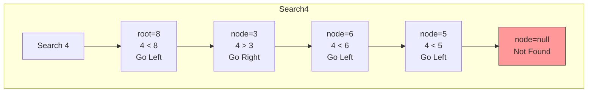

### 3.2 插入操作（Insert）

#### 3.2.1 插入的思路

1. 查找插入位置（与查找操作类似）
2. 将新节点作为叶子节点插入

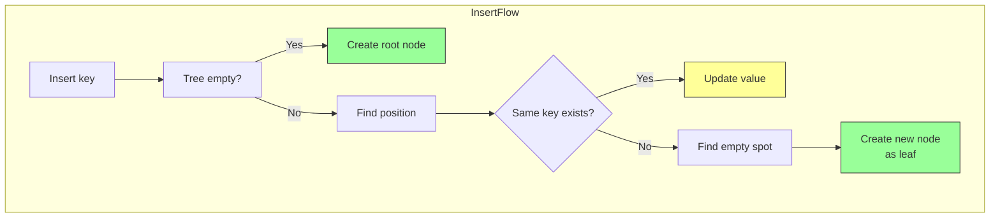

#### 3.2.2 完整实现

```java
/**
 * 二叉搜索树实现
 */
public class BinarySearchTree {
    private TreeNode root;  // 根节点
    private int size;       // 节点数量

    public BinarySearchTree() {
        this.root = null;
        this.size = 0;
    }

    /**
     * 插入节点
     * @param key 键
     * @param value 值
     * @return 如果 key 已存在返回旧值，否则返回 null
     */
    public Object insert(int key, Object value) {
        // 空树：直接作为根节点
        if (root == null) {
            root = new TreeNode(key, value);
            size++;
            return null;
        }

        TreeNode current = root;
        TreeNode parent = null;

        // 查找插入位置
        while (current != null) {
            parent = current;
            if (key == current.key) {
                // 键已存在，更新值
                Object oldValue = current.value;
                current.value = value;
                return oldValue;
            } else if (key < current.key) {
                current = current.left;
            } else {
                current = current.right;
            }
        }

        // 创建新节点
        TreeNode newNode = new TreeNode(key, value);

        // 连接父节点
        if (key < parent.key) {
            parent.left = newNode;
        } else {
            parent.right = newNode;
        }
        newNode.parent = parent;

        size++;
        return null;
    }

    /**
     * 插入节点的递归版本
     */
    public void insertRecursive(int key, Object value) {
        root = insertRecursive(root, key, value);
    }

    private TreeNode insertRecursive(TreeNode node, int key, Object value) {
        if (node == null) {
            size++;
            return new TreeNode(key, value);
        }

        if (key == node.key) {
            node.value = value;  // 更新
        } else if (key < node.key) {
            node.left = insertRecursive(node.left, key, value);
        } else {
            node.right = insertRecursive(node.right, key, value);
        }

        return node;
    }
}
```

#### 3.2.3 插入示例

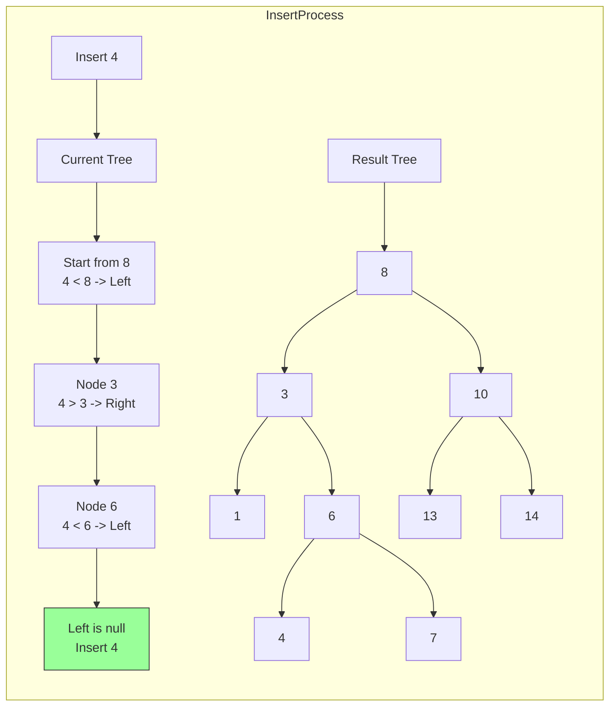

### 3.3 删除操作（Delete）

#### 3.3.1 删除的三种情况

删除操作是最复杂的，需要处理三种情况：

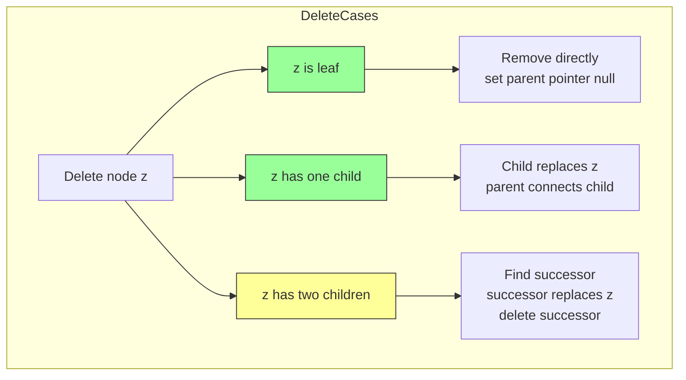

#### 3.3.2 情况一：删除叶子节点

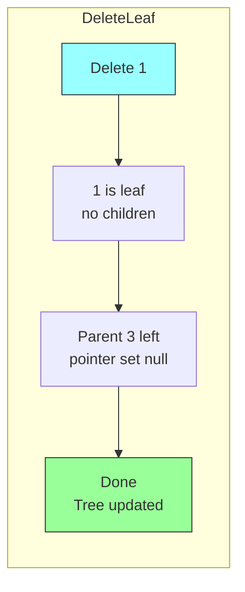

**代码实现**：

```java
/**
 * 删除叶子节点
 */
private void deleteLeaf(TreeNode z) {
    if (z.parent == null) {
        // 删除的是根节点且根是叶子
        root = null;
    } else if (z.isLeftChild()) {
        z.parent.left = null;
    } else {
        z.parent.right = null;
    }
}
```

#### 3.3.3 情况二：删除有一个子节点的节点

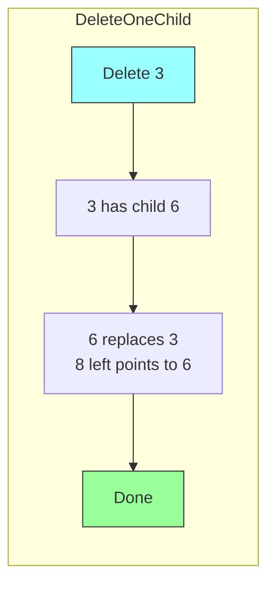

**代码实现**：

```java
/**
 * 删除有一个子节点的节点
 */
private void deleteNodeWithOneChild(TreeNode z) {
    TreeNode child = (z.left != null) ? z.left : z.right;

    if (z.parent == null) {
        // z 是根节点
        root = child;
        child.parent = null;
    } else if (z.isLeftChild()) {
        z.parent.left = child;
        child.parent = z.parent;
    } else {
        z.parent.right = child;
        child.parent = z.parent;
    }
}
```

#### 3.3.4 情况三：删除有两个子节点的节点

**策略**：找到后继节点，用后继节点的值替代被删除节点，然后删除后继节点。

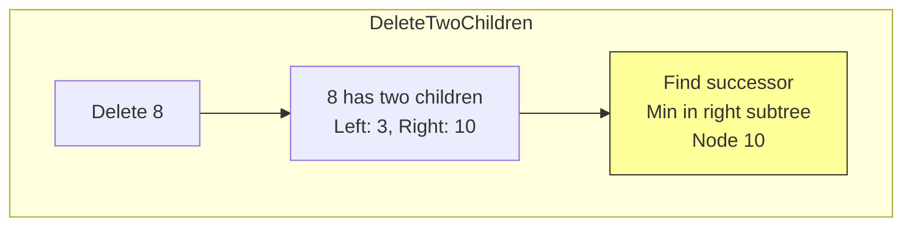

**正确做法**：

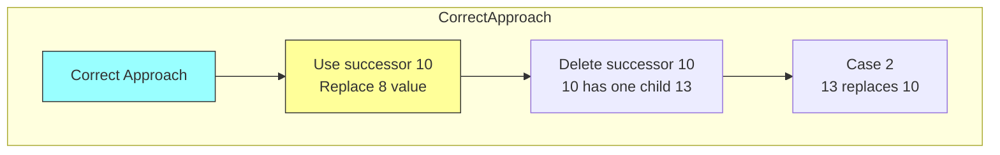

**后继节点的定义**：

```
中序遍历中，z 后面紧跟的节点称为 z 的后继

情况 1：z 有右子树 → 后继是右子树的最小值
情况 2：z 无右子树，但有父节点 → 后继是最近的祖先（该祖先的左子树包含 z）
```

**代码实现**：

```java
/**
 * 删除有两个子节点的节点
 * 策略：用后继节点替代，然后删除后继
 */
private void deleteNodeWithTwoChildren(TreeNode z) {
    // 找到后继节点（右子树的最小值）
    TreeNode successor = findMin(z.right);
    TreeNode successorParent = successor.parent;

    // 用后继的值替代 z
    z.key = successor.key;
    z.value = successor.value;

    // 删除后继节点
    if (successor.hasTwoChildren()) {
        // 理论上后继不可能有两个子节点（因为它是子树最小值）
        throw new IllegalStateException("后继节点不应该有两个子节点");
    } else if (successorParent.left == successor) {
        successorParent.left = successor.right;
        if (successor.right != null) {
            successor.right.parent = successorParent;
        }
    } else {
        successorParent.right = successor.right;
        if (successor.right != null) {
            successor.right.parent = successorParent;
        }
    }
}
```

#### 3.3.5 完整的删除方法

```java
/**
 * 删除节点
 * @param key 要删除的键
 * @return 如果找到并删除返回 true，否则返回 false
 */
public boolean delete(int key) {
    TreeNode z = searchIterative(root, key);
    if (z == null) {
        return false;  // 未找到
    }

    deleteNode(z);
    size--;
    return true;
}

/**
 * 删除指定节点
 */
private void deleteNode(TreeNode z) {
    if (z.left == null && z.right == null) {
        // 情况 1：叶子节点
        deleteLeaf(z);
    } else if (z.left == null || z.right == null) {
        // 情况 2：有一个子节点
        deleteNodeWithOneChild(z);
    } else {
        // 情况 3：有两个子节点
        deleteNodeWithTwoChildren(z);
    }
}

/**
 * 查找最小节点
 */
private TreeNode findMin(TreeNode node) {
    while (node.left != null) {
        node = node.left;
    }
    return node;
}

/**
 * 查找最大节点
 */
private TreeNode findMax(TreeNode node) {
    while (node.right != null) {
        node = node.right;
    }
    return node;
}
```

---

## 四、树的遍历

### 4.1 四种遍历方式

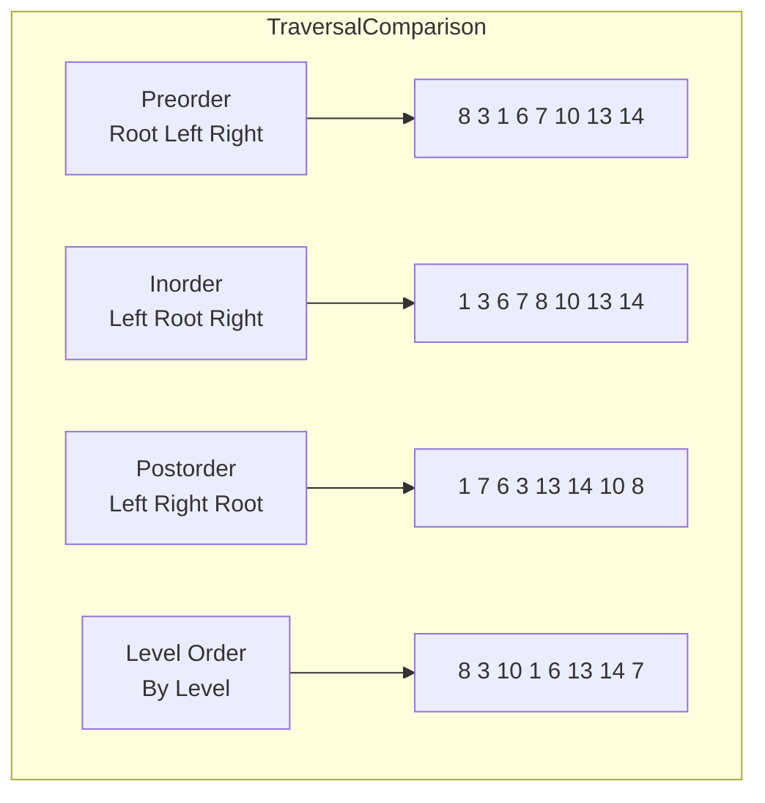

### 4.2 前序遍历（Preorder Traversal）

**顺序**：根 → 左 → 右

```java
/**
 * 前序遍历：根 → 左 → 右
 */
public void preorderTraversal(TreeNode root) {
    if (root == null) return;

    System.out.print(root.key + " ");  // 访问根
    preorderTraversal(root.left);      // 遍历左子树
    preorderTraversal(root.right);     // 遍历右子树
}

/**
 * 前序遍历：非递归实现
 */
public List<Integer> preorderIterative(TreeNode root) {
    List<Integer> result = new ArrayList<>();
    if (root == null) return result;

    Stack<TreeNode> stack = new Stack<>();
    stack.push(root);

    while (!stack.isEmpty()) {
        TreeNode node = stack.pop();
        result.add(node.key);  // 访问

        // 右子节点先入栈，保证左子节点先访问
        if (node.right != null) stack.push(node.right);
        if (node.left != null) stack.push(node.left);
    }

    return result;
}
```

### 4.3 中序遍历（Inorder Traversal）

**顺序**：左 → 根 → 右

```java
/**
 * 中序遍历：左 → 根 → 右
 * 结果是有序的！
 */
public void inorderTraversal(TreeNode root) {
    if (root == null) return;

    inorderTraversal(root.left);       // 遍历左子树
    System.out.print(root.key + " ");  // 访问根
    inorderTraversal(root.right);      // 遍历右子树
}

/**
 * 中序遍历：非递归实现
 */
public List<Integer> inorderIterative(TreeNode root) {
    List<Integer> result = new ArrayList<>();
    Stack<TreeNode> stack = new Stack<>();
    TreeNode current = root;

    while (current != null || !stack.isEmpty()) {
        // 到达最左节点
        while (current != null) {
            stack.push(current);
            current = current.left;
        }

        // 访问节点
        current = stack.pop();
        result.add(current.key);

        // 转向右子树
        current = current.right;
    }

    return result;
}
```

### 4.4 后序遍历（Postorder Traversal）

**顺序**：左 → 右 → 根

```java
/**
 * 后序遍历：左 → 右 → 根
 */
public void postorderTraversal(TreeNode root) {
    if (root == null) return;

    postorderTraversal(root.left);     // 遍历左子树
    postorderTraversal(root.right);    // 遍历右子树
    System.out.print(root.key + " ");  // 访问根
}

/**
 * 后序遍历：非递归实现
 */
public List<Integer> postorderIterative(TreeNode root) {
    List<Integer> result = new ArrayList<>();
    if (root == null) return result;

    Stack<TreeNode> stack = new Stack<>();
    stack.push(root);
    TreeNode prev = null;

    while (!stack.isEmpty()) {
        TreeNode current = stack.peek();

        // 如果是从父节点下来的，或者是从子节点上来的
        if (prev == null || prev.left == current || prev.right == current) {
            if (current.left != null) {
                stack.push(current.left);
            } else if (current.right != null) {
                stack.push(current.right);
            } else {
                result.add(current.key);
                stack.pop();
            }
        } else if (current.left == prev) {
            if (current.right != null) {
                stack.push(current.right);
            } else {
                result.add(current.key);
                stack.pop();
            }
        } else {
            result.add(current.key);
            stack.pop();
        }

        prev = current;
    }

    return result;
}
```

### 4.5 层序遍历（Level-order Traversal）

**顺序**：按层从上到下，每层从左到右

```java
/**
 * 层序遍历：BFS
 */
public List<Integer> levelOrderTraversal(TreeNode root) {
    List<Integer> result = new ArrayList<>();
    if (root == null) return result;

    Queue<TreeNode> queue = new LinkedList<>();
    queue.offer(root);

    while (!queue.isEmpty()) {
        TreeNode node = queue.poll();
        result.add(node.key);  // 访问

        if (node.left != null) queue.offer(node.left);
        if (node.right != null) queue.offer(node.right);
    }

    return result;
}
```

### 4.6 遍历可视化

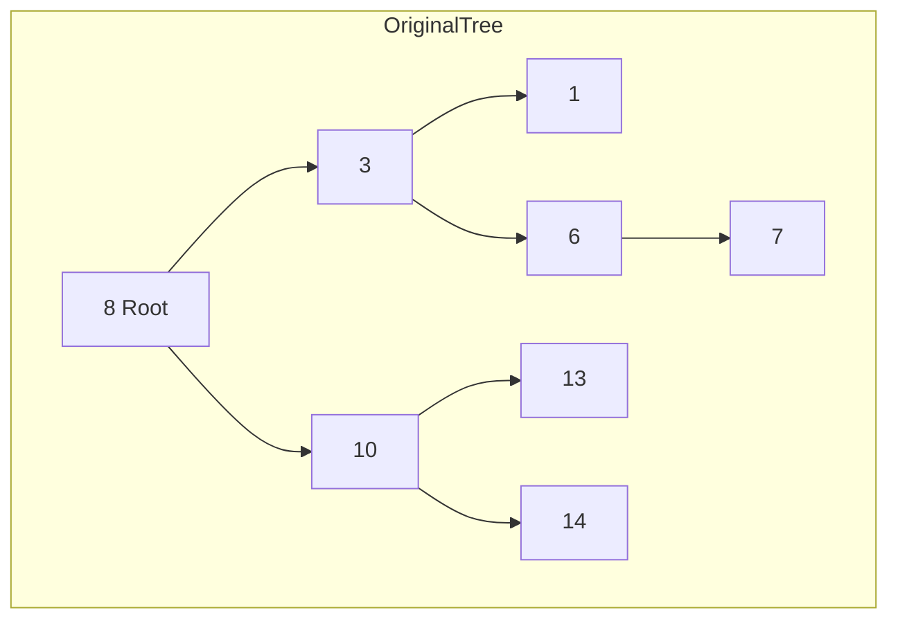

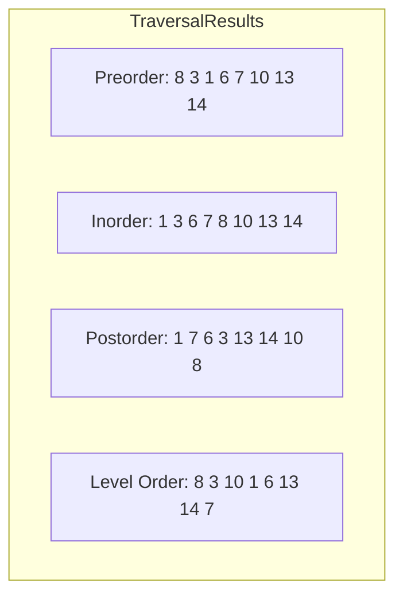

---

## 五、最小值、最大值与排名

### 5.1 查找最小值

```java
/**
 * 查找最小值
 * @return 最小值对应的节点，如果树为空返回 null
 */
public TreeNode findMin() {
    if (root == null) return null;

    TreeNode current = root;
    while (current.left != null) {
        current = current.left;
    }
    return current;
}

/**
 * 递归版本
 */
public TreeNode findMinRecursive(TreeNode node) {
    if (node == null) return null;
    if (node.left == null) return node;
    return findMinRecursive(node.left);
}
```

### 5.2 查找最大值

```java
/**
 * 查找最大值
 * @return 最大值对应的节点，如果树为空返回 null
 */
public TreeNode findMax() {
    if (root == null) return null;

    TreeNode current = root;
    while (current.right != null) {
        current = current.right;
    }
    return current;
}
```

### 5.3 前驱与后继

**前驱（Predecessor）**：中序遍历中，当前节点的前一个节点

**后继（Successor）**：中序遍历中，当前节点的后一个节点

```mermaid
flowchart TD
    subgraph Node8PredecessorSuccessor
    A["Node 8"] --> B["Predecessor: 7<br/>Max in left subtree"]
    A --> C["Successor: 10<br/>Min in right subtree"]
    end
```

```mermaid
flowchart TD
    subgraph Node3PredecessorSuccessor
    A["Node 3"] --> B["Predecessor: 1<br/>Max in left subtree"]
    A --> C["Successor: 6<br/>Min in right subtree"]
    end
```

```mermaid
flowchart TD
    subgraph Node13PredecessorSuccessor
    A["Node 13"] --> B["Predecessor: 10<br/>Nearest ancestor where 13 is in right subtree"]
    A --> C["Successor: 14<br/>Min in right subtree"]
    end
```

**前驱查找代码**：

```java
/**
 * 查找前驱节点
 */
public TreeNode predecessor(TreeNode x) {
    if (x == null) return null;

    // 情况 1：有左子树 → 前驱是左子树的最大值
    if (x.left != null) {
        TreeNode current = x.left;
        while (current.right != null) {
            current = current.right;
        }
        return current;
    }

    // 情况 2：无左子树 → 前驱是最近的祖先（该祖先的右子树包含 x）
    TreeNode current = x;
    TreeNode parent = x.parent;

    while (parent != null && current == parent.left) {
        current = parent;
        parent = parent.parent;
    }

    return parent;
}
```

**后继查找代码**：

```java
/**
 * 查找后继节点
 */
public TreeNode successor(TreeNode x) {
    if (x == null) return null;

    // 情况 1：有右子树 → 后继是右子树的最小值
    if (x.right != null) {
        TreeNode current = x.right;
        while (current.left != null) {
            current = current.left;
        }
        return current;
    }

    // 情况 2：无右子树 → 后继是最近的祖先（该祖先的左子树包含 x）
    TreeNode current = x;
    TreeNode parent = x.parent;

    while (parent != null && current == parent.right) {
        current = parent;
        parent = parent.parent;
    }

    return parent;
}
```

### 5.4 排名操作（Rank）

**查找第 k 小的元素**：

```java
/**
 * 查找第 k 小的元素
 * @param k 排名（从 1 开始）
 * @return 第 k 小的节点，如果 k 无效返回 null
 */
public TreeNode kthSmallest(int k) {
    if (k < 1 || k > size) return null;

    // 需要在节点中维护子树大小
    return kthSmallest(root, k);
}

private TreeNode kthSmallest(TreeNode node, int k) {
    int leftSize = (node.left != null) ? ((NodeWithSize) node.left).size : 0;

    if (k <= leftSize) {
        return kthSmallest(node.left, k);
    } else if (k == leftSize + 1) {
        return node;
    } else {
        return kthSmallest(node.right, k - leftSize - 1);
    }
}
```

---

## 六、BST 的时间复杂度分析

### 6.1 各种操作的时间复杂度

| 操作 | 平均情况 | 最坏情况 |
|-----|---------|---------|
| 查找 | O(log n) | O(n) |
| 插入 | O(log n) | O(n) |
| 删除 | O(log n) | O(n) |
| 最小值 | O(log n) | O(n) |
| 最大值 | O(log n) | O(n) |
| 前驱/后继 | O(log n) | O(n) |
| 遍历 | O(n) | O(n) |

### 6.2 树高度与时间复杂度的关系

```
树高度 h = log₂n（平衡树）
树高度 h = n（退化为链表）
```

```mermaid
flowchart TD
    subgraph HeightComplexity
    A["Tree Shape"] --> B["Balanced Tree"]
    A --> C["Completely Unbalanced"]

    B --> D["Height h = log n<br/>All operations O(log n)"]
    C --> E["Height h = n<br/>Degenerates to linked list<br/>All operations O(n)"]

    style D fill:#99ff99,stroke:#333
    style E fill:#ff9999,stroke:#333
    end
```

```mermaid
flowchart TD
    subgraph BalanceFactors
    A["Insertion Order"] --> B["Ordered insert -> Degenerates"]
    A --> C["Random insert -> Good balance"]
    end
```

### 6.3 均摊分析

**动态操作下的均摊复杂度**：

```
n 次随机插入的平均高度 ≈ 1.39 × log₂n

这意味着随机插入的情况下，
BST 的性能接近 O(log n)
```

```mermaid
flowchart TD
    subgraph RandomBSTHeight
    A["n nodes"] --> B["Average height<br/>≈ 1.39 log n"]
    B --> C["Standard deviation<br/>≈ 0.65 log n"]

    style A fill:#99ffff,stroke:#333
    end
```

```mermaid
flowchart TD
    subgraph HeightDistribution
    A["99% of trees"] --> B["Height < 3 log n"]
    A --> C["Almost all trees<br/>Height < 5 log n"]

    style B fill:#99ff99,stroke:#333
    end
```

---

## 七、完整代码实现

### 7.1 Java 实现

```java
import java.util.*;

/**
 * 二叉搜索树完整实现
 */
public class BinarySearchTree<K extends Comparable<K>, V> {

    private static class Node<K, V> {
        K key;
        V value;
        Node<K, V> left;
        Node<K, V> right;
        Node<K, V> parent;

        Node(K key, V value) {
            this.key = key;
            this.value = value;
        }

        Node(K key, V value, Node<K, V> parent) {
            this(key, value);
            this.parent = parent;
        }
    }

    private Node<K, V> root;
    private int size;

    public BinarySearchTree() {
        this.root = null;
        this.size = 0;
    }

    // ============ 基本操作 ============

    /**
     * 插入键值对
     */
    public V put(K key, V value) {
        if (root == null) {
            root = new Node<>(key, value);
            size++;
            return null;
        }

        Node<K, V> current = root;
        Node<K, V> parent = null;
        int cmp = 0;

        while (current != null) {
            parent = current;
            cmp = key.compareTo(current.key);
            if (cmp < 0) {
                current = current.left;
            } else if (cmp > 0) {
                current = current.right;
            } else {
                // 键已存在，更新值
                V oldValue = current.value;
                current.value = value;
                return oldValue;
            }
        }

        Node<K, V> newNode = new Node<>(key, value, parent);
        if (cmp < 0) {
            parent.left = newNode;
        } else {
            parent.right = newNode;
        }

        size++;
        return null;
    }

    /**
     * 获取键对应的值
     */
    public V get(K key) {
        Node<K, V> node = search(root, key);
        return node == null ? null : node.value;
    }

    /**
     * 查找节点
     */
    private Node<K, V> search(Node<K, V> node, K key) {
        while (node != null) {
            int cmp = key.compareTo(node.key);
            if (cmp == 0) {
                return node;
            } else if (cmp < 0) {
                node = node.left;
            } else {
                node = node.right;
            }
        }
        return null;
    }

    /**
     * 判断是否包含键
     */
    public boolean containsKey(K key) {
        return search(root, key) != null;
    }

    /**
     * 删除键对应的节点
     */
    public V remove(K key) {
        Node<K, V> node = search(root, key);
        if (node == null) {
            return null;
        }

        V oldValue = node.value;
        deleteNode(node);
        size--;
        return oldValue;
    }

    /**
     * 删除节点
     */
    private void deleteNode(Node<K, V> z) {
        if (z.left == null && z.right == null) {
            // 情况 1：叶子节点
            transplant(z, null);
        } else if (z.left == null) {
            // 情况 2：只有右子节点
            transplant(z, z.right);
        } else if (z.right == null) {
            // 情况 2：只有左子节点
            transplant(z, z.left);
        } else {
            // 情况 3：有两个子节点
            Node<K, V> y = findMin(z.right);  // 后继
            if (y.parent != z) {
                transplant(y, y.right);
                y.right = z.right;
                y.right.parent = y;
            }
            transplant(z, y);
            y.left = z.left;
            y.left.parent = y;
        }
    }

    /**
     * 用子树 v 替换子树 u
     */
    private void transplant(Node<K, V> u, Node<K, V> v) {
        if (u.parent == null) {
            root = v;
        } else if (u == u.parent.left) {
            u.parent.left = v;
        } else {
            u.parent.right = v;
        }
        if (v != null) {
            v.parent = u.parent;
        }
    }

    /**
     * 查找最小节点
     */
    private Node<K, V> findMin(Node<K, V> node) {
        while (node.left != null) {
            node = node.left;
        }
        return node;
    }

    // ============ 遍历操作 ============

    /**
     * 中序遍历（递归）
     */
    public void inorderTraversal(Consumer<Node<K, V>> action) {
        inorderTraversal(root, action);
    }

    private void inorderTraversal(Node<K, V> node, Consumer<Node<K, V>> action) {
        if (node == null) return;
        inorderTraversal(node.left, action);
        action.accept(node);
        inorderTraversal(node.right, action);
    }

    /**
     * 前序遍历
     */
    public void preorderTraversal(Consumer<Node<K, V>> action) {
        preorderTraversal(root, action);
    }

    private void preorderTraversal(Node<K, V> node, Consumer<Node<K, V>> action) {
        if (node == null) return;
        action.accept(node);
        preorderTraversal(node.left, action);
        preorderTraversal(node.right, action);
    }

    /**
     * 后序遍历
     */
    public void postorderTraversal(Consumer<Node<K, V>> action) {
        postorderTraversal(root, action);
    }

    private void postorderTraversal(Node<K, V> node, Consumer<Node<K, V>> action) {
        if (node == null) return;
        postorderTraversal(node.left, action);
        postorderTraversal(node.right, action);
        action.accept(node);
    }

    /**
     * 层序遍历
     */
    public void levelOrderTraversal(Consumer<Node<K, V>> action) {
        if (root == null) return;

        Queue<Node<K, V>> queue = new LinkedList<>();
        queue.offer(root);

        while (!queue.isEmpty()) {
            Node<K, V> node = queue.poll();
            action.accept(node);
            if (node.left != null) queue.offer(node.left);
            if (node.right != null) queue.offer(node.right);
        }
    }

    /**
     * 获取中序遍历结果（返回排序后的列表）
     */
    public List<K> inorderKeys() {
        List<K> result = new ArrayList<>();
        inorderTraversal(node -> result.add(node.key));
        return result;
    }

    // ============ 辅助方法 ============

    public int size() {
        return size;
    }

    public boolean isEmpty() {
        return size == 0;
    }

    public K minKey() {
        if (root == null) return null;
        Node<K, V> node = findMin(root);
        return node.key;
    }

    public K maxKey() {
        if (root == null) return null;
        Node<K, V> node = root;
        while (node.right != null) {
            node = node.right;
        }
        return node.key;
    }

    /**
     * 查找前驱
     */
    public Node<K, V> predecessor(K key) {
        Node<K, V> x = search(root, key);
        if (x == null) return null;
        return predecessor(x);
    }

    private Node<K, V> predecessor(Node<K, V> x) {
        if (x.left != null) {
            return findMax(x.left);
        }
        Node<K, V> y = x.parent;
        while (y != null && x == y.left) {
            x = y;
            y = y.parent;
        }
        return y;
    }

    /**
     * 查找后继
     */
    public Node<K, V> successor(K key) {
        Node<K, V> x = search(root, key);
        if (x == null) return null;
        return successor(x);
    }

    private Node<K, V> successor(Node<K, V> x) {
        if (x.right != null) {
            return findMin(x.right);
        }
        Node<K, V> y = x.parent;
        while (y != null && x == y.right) {
            x = y;
            y = y.parent;
        }
        return y;
    }

    private Node<K, V> findMax(Node<K, V> node) {
        while (node.right != null) {
            node = node.right;
        }
        return node;
    }

    /**
     * 计算树的高度
     */
    public int height() {
        return height(root);
    }

    private int height(Node<K, V> node) {
        if (node == null) return -1;
        return Math.max(height(node.left), height(node.right)) + 1;
    }

    @Override
    public String toString() {
        StringBuilder sb = new StringBuilder();
        inorderTraversal(node -> sb.append(node.key).append(":").append(node.value).append(" "));
        return sb.toString().trim();
    }
}
```

### 7.2 完整代码说明

上述 Java 实现了二叉搜索树的完整功能，包括：查找、插入、删除、遍历等核心操作。

---

## 八、BST vs 哈希表

### 8.1 对比分析

| 特性 | 二叉搜索树 | 哈希表 |
|-----|-----------|--------|
| 查找时间 | O(log n) 平均 | O(1) 平均 |
| 插入时间 | O(log n) 平均 | O(1) 平均 |
| 删除时间 | O(log n) 平均 | O(1) 平均 |
| 空间复杂度 | O(n) | O(n) |
| 有序数据支持 | 是（天然支持） | 否 |
| 范围查询 | 高效（O(log n + k)） | 低效（O(n)） |
| 前驱/后继 | O(log n) | 不支持 |
| 最坏情况 | O(n)（退化为链表） | O(n) |

```mermaid
flowchart TD
    subgraph SelectionDecision
    A["Choose Data Structure"] --> B["Need ordered data?"]
    B -->|Yes| C["BST or variants<br/>AVL, Red-Black Tree"]
    B -->|No| D["Need range query?"]
    D -->|Yes| C
    D -->|No| E["Hash Table"]

    C --> F["Need balance guarantee?"]
    F -->|Yes| G["Red-Black Tree<br/>TreeMap"]
    F -->|No| H["Regular BST"]

    E --> I["High concurrency?"]
    I -->|Yes| J["ConcurrentHashMap"]
    I -->|No| K["HashMap"]

    style C fill:#99ffff,stroke:#333
    style G fill:#99ff99,stroke:#333
    style H fill:#99ff99,stroke:#333
    style K fill:#99ff99,stroke:#333
    end
```

### 8.2 应用场景对比

**适合使用 BST 的场景**：
- 需要按顺序遍历数据
- 需要范围查询（如查找 10 到 100 之间的所有值）
- 需要找到第 k 大的元素
- 需要找到前驱/后继

**适合使用哈希表的场景**：
- 只需要快速查找（键值对存储）
- 不关心数据的顺序
- 只需要判断元素是否存在

---

## 九、BST 的变体与扩展

### 9.1 平衡二叉搜索树

普通 BST 的问题是可能退化为链表，导致性能下降。

**解决方案**：保持树的平衡

```mermaid
flowchart TD
    subgraph BalancedBST
    A["AVL Tree"] --> B["Strict balance<br/>Height diff <= 1"]
    A --> C["Rotation operations<br/>Maintain balance"]
    A --> D["Search O(log n)<br/>Worst case guaranteed"]

    E["Red-Black Tree"] --> F["Approximate balance<br/>Path length diff <= 2x"]
    E --> G["Color rules<br/>Rotation operations"]
    E --> H["Java TreeMap<br/>C++ map"]

    I["B-Tree"] --> J["Multi-way search tree<br/>Disk friendly"]
    I --> K["Database index<br/>File system"]

    style A fill:#99ffff,stroke:#333
    style E fill:#99ffff,stroke:#333
    end
```

### 9.2 线程安全的 BST

```java
/**
 * 线程安全的二叉搜索树（使用 synchronized）
 */
public class ThreadSafeBST {
    private TreeNode root;
    private int size;
    private final Object lock = new Object();

    public synchronized V put(K key, V value) {
        // 实现
    }

    public synchronized V get(K key) {
        // 实现
    }

    public synchronized boolean remove(K key) {
        // 实现
    }
}
```

---

## 十、举一反三

### 10.1 LeetCode 相关题目

| 题目 | 难度 | 核心技巧 |
|-----|-----|---------|
| [98. 验证二叉搜索树](https://leetcode.cn/problems/validate-binary-search-tree/) | Medium | 中序遍历有序性 |
| [100. 相同的树](https://leetcode.cn/problems/same-tree/) | Easy | 递归遍历 |
| [101. 对称二叉树](https://leetcode.cn/problems/symmetric-tree/) | Easy | 递归比较 |
| [104. 二叉树的最大深度](https://leetcode.cn/problems/maximum-depth-of-binary-tree/) | Easy | 递归/迭代 |
| [108. 将有序数组转换为二叉搜索树](https://leetcode.cn/problems/convert-sorted-array-to-binary-search-tree/) | Easy | 中点为根 |
| [110. 平衡二叉树](https://leetcode.cn/problems/balanced-binary-tree/) | Easy | 后序遍历 |
| [236. 二叉树的最近公共祖先](https://leetcode.cn/problems/lowest-common-ancestor-of-a-binary-tree/) | Medium | 递归查找 |
| [450. 删除二叉搜索树中的节点](https://leetcode.cn/problems/delete-node-in-a-bst/) | Medium | BST 删除 |
| [701. 二叉搜索树中的插入操作](https://leetcode.cn/problems/insert-into-a-binary-search-tree/) | Easy | 递归/迭代 |

### 10.2 变体题目

**1. 验证二叉搜索树**

```java
/**
 * 验证二叉搜索树
 * 使用中序遍历检查是否有序
 */
public boolean isValidBST(TreeNode root) {
    List<Integer> inorder = new ArrayList<>();
    inorderTraversal(root, inorder);

    for (int i = 1; i < inorder.size(); i++) {
        if (inorder.get(i) <= inorder.get(i - 1)) {
            return false;
        }
    }
    return true;
}

private void inorderTraversal(TreeNode node, List<Integer> result) {
    if (node == null) return;
    inorderTraversal(node.left, result);
    result.add(node.val);
    inorderTraversal(node.right, result);
}
```

**2. 将有序数组转换为 BST**

```java
/**
 * 将有序数组转换为高度平衡的 BST
 */
public TreeNode sortedArrayToBST(int[] nums) {
    return sortedArrayToBST(nums, 0, nums.length - 1);
}

private TreeNode sortedArrayToBST(int[] nums, int left, int right) {
    if (left > right) return null;

    int mid = left + (right - left) / 2;
    TreeNode root = new TreeNode(nums[mid]);

    root.left = sortedArrayToBST(nums, left, mid - 1);
    root.right = sortedArrayToBST(nums, mid + 1, right);

    return root;
}
```

### 10.3 实际应用

```mermaid
flowchart TD
    subgraph BSTApplications
    A["BST Applications"] --> B["Database index<br/>B+ Tree"]
    A --> C["Compiler symbol table<br/>Variable lookup"]
    A --> D["File system directory"]
    A --> E["Game spatial partition"]
    A --> F["Priority queue"]

    B --> G["Range query<br/>Multi-way balance"]
    C --> H["Fast variable lookup"]
    D --> I["Hierarchical management"]
    E --> J["Timeline management"]
    F --> K["Event priority sorting"]
    end
```

---

## 十一、完整代码模板

### 11.1 Java 模板

```java
/**
 * 二叉搜索树模板
 */
public class BSTTemplate<K extends Comparable<K>, V> {

    private static class Node<K, V> {
        K key;
        V value;
        Node<K, V> left, right, parent;

        Node(K key, V value, Node<K, V> parent) {
            this.key = key;
            this.value = value;
            this.parent = parent;
        }
    }

    private Node<K, V> root;
    private int size;

    public BSTTemplate() {
        this.root = null;
        this.size = 0;
    }

    public void put(K key, V value) {
        if (root == null) {
            root = new Node<>(key, value, null);
            size++;
            return;
        }

        Node<K, V> current = root;
        while (true) {
            int cmp = key.compareTo(current.key);
            if (cmp < 0) {
                if (current.left == null) {
                    current.left = new Node<>(key, value, current);
                    size++;
                    return;
                }
                current = current.left;
            } else if (cmp > 0) {
                if (current.right == null) {
                    current.right = new Node<>(key, value, current);
                    size++;
                    return;
                }
                current = current.right;
            } else {
                current.value = value;
                return;
            }
        }
    }

    public V get(K key) {
        Node<K, V> node = search(key);
        return node == null ? null : node.value;
    }

    private Node<K, V> search(K key) {
        Node<K, V> current = root;
        while (current != null) {
            int cmp = key.compareTo(current.key);
            if (cmp == 0) return current;
            current = cmp < 0 ? current.left : current.right;
        }
        return null;
    }

    public boolean contains(K key) {
        return search(key) != null;
    }

    public boolean remove(K key) {
        Node<K, V> node = search(key);
        if (node == null) return false;
        deleteNode(node);
        size--;
        return true;
    }

    private void deleteNode(Node<K, V> z) {
        if (z.left == null && z.right == null) {
            replace(z, null);
        } else if (z.left == null) {
            replace(z, z.right);
        } else if (z.right == null) {
            replace(z, z.left);
        } else {
            Node<K, V> y = findMin(z.right);
            if (y.parent != z) {
                replace(y, y.right);
                y.right = z.right;
                y.right.parent = y;
            }
            replace(z, y);
            y.left = z.left;
            y.left.parent = y;
        }
    }

    private void replace(Node<K, V> u, Node<K, V> v) {
        if (u.parent == null) root = v;
        else if (u == u.parent.left) u.parent.left = v;
        else u.parent.right = v;
        if (v != null) v.parent = u.parent;
    }

    private Node<K, V> findMin(Node<K, V> node) {
        while (node.left != null) node = node.left;
        return node;
    }

    public int size() { return size; }
    public boolean isEmpty() { return size == 0; }

    public List<K> inorder() {
        List<K> result = new ArrayList<>();
        inorder(root, result);
        return result;
    }

    private void inorder(Node<K, V> node, List<K> result) {
        if (node == null) return;
        inorder(node.left, result);
        result.add(node.key);
        inorder(node.right, result);
    }
}
```

### 11.2 模板使用说明

上述 Java 模板可以直接复制使用，只需根据实际需求调整泛型参数即可。

---

**二叉搜索树是理解更高级数据结构（如 AVL 树、红黑树、B 树）的基础。它的核心思想——利用数据的比较关系来组织数据，以达到高效的查找、插入和删除——在算法设计中具有广泛的应用。**

下一章：第十三章——红黑树（Red-Black Trees）
