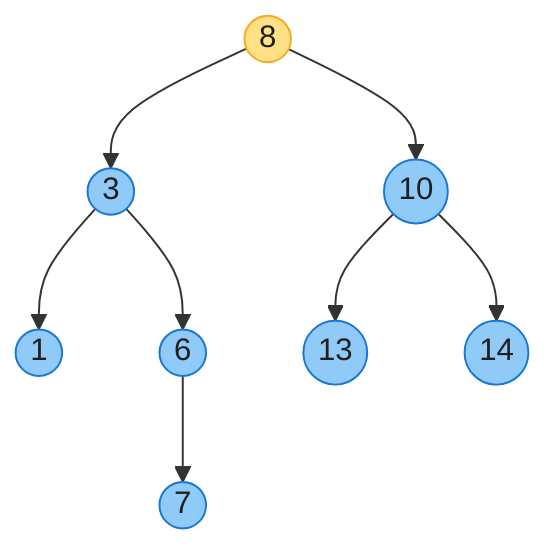

# 第十二章：二叉搜索树（Binary Search Trees）

> **定位**：二叉搜索树（BST）用「左子树 < 根 < 右子树」的性质把**有序数据**组织成链式结构，让查找/插入/删除都做到 Θ(h)（h 为树高）。它填补了「有序数组（查找 Θ(lg n) 但插入 Θ(n)）」与「哈希表（插入 Θ(1) 但不支持顺序）」之间的空白——**既支持高效动态操作，又天然有序**。
> **致命弱点**：BST 的高度 h 依赖插入顺序。平衡时 h = Θ(lg n)；最坏退化为链表 h = Θ(n)。这正是第 13 章**红黑树**要解决的问题（强制平衡，保证 h = O(lg n)）。
> **前后指针**：节点表示沿用第 10 章（p/left/right 三指针）；中序遍历有序性是 BST 的灵魂，第 13 章红黑树、第 18 章 B 树都建立在 BST 之上。
>
> 对照第四版书页 289–308。

---

## 一、BST 性质与中序遍历（§12.1）

### 1.1 性质

对任意节点 x：
- 左子树所有节点的 key **≤** x.key；
- 右子树所有节点的 key **≥** x.key。

> 严格 BST（key 互异）用 `<` / `>`。这条性质递归成立：左右子树本身也是 BST。

### 1.2 中序遍历有序（BST 的灵魂）

```
INORDER-TREE-WALK(x)              // CLRS 1-indexed
1  if x != NIL
2      INORDER-TREE-WALK(x.left)
3      print x.key                // 访问发生在「中间」
4      INORDER-TREE-WALK(x.right)
```

> **定理**：BST 的中序遍历产出**升序**序列。这是「BST = 有序」的形式化体现，也是验证 BST（LC 98）、找前驱后继、范围查询的基础。遍历整树 Θ(n)。



中序遍历：`1 3 6 7 8 10 13 14`（升序）。

---

## 二、查询操作（§12.2）

所有查询都 Θ(h)（h 为树高）。

### 2.1 查找 TREE-SEARCH

```
TREE-SEARCH(x, k)                 ITERATIVE-TREE-SEARCH(x, k)
1  if x == NIL or k == x.key      1  while x != NIL and k != x.key
2      return x                    2      if k < x.key
3  if k < x.key                    3          x = x.left
4      return TREE-SEARCH(x.left, k) 4      else x = x.right
5  else return TREE-SEARCH(x.right, k) 5  return x
```

> 递归版优雅，迭代版省栈，实战用迭代。沿一条路径下降，每层一次比较。

### 2.2 最小 / 最大

```
TREE-MINIMUM(x)                   TREE-MAXIMUM(x)
1  while x.left != NIL            1  while x.right != NIL
2      x = x.left                 2      x = x.right
3  return x                       3  return x
```

最小 = 一路向左到底；最大 = 一路向右到底。

### 2.3 后继 TREE-SUCCESSOR（删除要用）

节点 x 的后继 = 中序遍历中 x 的下一个节点（比 x 大的最小节点）。

```
TREE-SUCCESSOR(x)
1  if x.right != NIL                       // 情况 1：有右子树
2      return TREE-MINIMUM(x.right)        //   → 右子树的最小值
3  y = x.p                                 // 情况 2：无右子树
4  while y != NIL and x == y.right         //   → 沿父链上行，直到 x 是某祖先的左孩子
5      x = y
6      y = y.p
7  return y
```

- **情况 1**：x 有右子树 → 后继是右子树最左节点。
- **情况 2**：x 无右子树 → 后继是「**最低祖先** y，且 x 落在 y 的左子树中」。沿父链向上走，直到第一次「从左孩子侧上来」。

前驱 TREE-PREDECESSOR 完全对称（左子树最大 / 否则最低祖先且 x 在其右子树）。

> **习题 12.2-5**：有两个孩子的节点，其后继**一定没有左孩子**（因为后继是右子树的最小，而最小一路向左，终点无左孩子）。

---

## 三、插入与删除（§12.3）

### 3.1 插入 TREE-INSERT

沿搜索路径找到一个空位，把新节点作为叶子挂上去。

```
TREE-INSERT(T, z)
1  y = NIL
2  x = T.root
3  while x != NIL
4      y = x
5      if z.key < x.key
6          x = x.left
7      else x = x.right
8  z.p = y
9  if y == NIL                // 原树为空
10     T.root = z
11 elseif z.key < y.key
12     y.left = z
13 else y.right = z
```

插入 Θ(h)（一路下降到叶子）。

### 3.2 删除 TREE-DELETE（核心难点）

删除要分情况处理。CLRS 用 **TRANSPLANT** 子过程把「用子树 v 替换子树 u（含 u.p 的孩子指针更新）」统一起来：

```
TRANSPLANT(T, u, v)                    // 用 v 顶替 u 的位置
1  if u.p == NIL
2      T.root = v
3  elseif u == u.p.left
4      u.p.left = v
5  else u.p.right = v
6  if v != NIL
7      v.p = u.p
```

```
TREE-DELETE(T, z)
1  if z.left == NIL                       // 情况 a：无左孩子
2      TRANSPLANT(T, z, z.right)          //   → 右孩子顶替
3  elseif z.right == NIL                  // 情况 b：无右孩子
4      TRANSPLANT(T, z, z.left)           //   → 左孩子顶替
5  else y = TREE-MINIMUM(z.right)         // 情况 c：两孩子都有，找后继 y
6      if y.p != z                        //   y 不是 z 的直接右孩子
7          TRANSPLANT(T, y, y.right)      //   → 先把 y 的右孩子顶替 y
8          y.right = z.right
9          y.right.p = y
10     TRANSPLANT(T, z, y)                //   → y 顶替 z
11     y.left = z.left
12     y.left.p = y
```

### 3.3 删除三种情况图解

| 情况 | z 的孩子数 | 做法 |
|------|-----------|------|
| a | 0 或仅有右孩子 | 直接用右孩子（NIL 或子树）顶替 z |
| b | 仅有左孩子 | 用左孩子顶替 z |
| c | 左右孩子都有 | 找后继 y（右子树最小）。若 y 不是 z 的直接右孩子，先把 y 摘出来（用 y.right 顶替 y），再把 y 接到 z 的位置 |

> **为什么用后继？** 后继 y 是右子树最小，它**没有左孩子**（习题 12.2-5），所以摘出 y 只需处理它的右子树——把复杂情况 c 归约为简单情况 a/b。

### 3.4 复杂度

INSERT/DELETE/SEARCH/MIN/MAX/SUCCESSOR/PREDECESSOR 全是 **Θ(h)**。**h 是关键**——下一节看 h 由什么决定。

---

## 四、随机构建 BST（§12.4）：期望高度 Θ(lg n)

普通 BST 最坏退化为链表（h = Θ(n)，按有序序列插入即如此）。但如果**插入顺序是随机的**，期望高度好得多：

> **Theorem 12.4**：n 个互异 key 按**随机排列**插入空 BST，期望树高 **E[h] = Θ(lg n)**。

直觉与第 7 章随机快排同源：每插入一个元素，它成为「当前子树根」的概率与 rank 相关；随机序下树大概率接近平衡（一棵随机 BST 的期望高度约 **1.39 lg n**，与随机快排的期望比较次数 1.39 n lg n 同根）。

> 但「随机插入」是概率保证，**最坏仍是 Θ(n)**。要确定性保证 h = O(lg n)，必须主动平衡——这就是第 13 章红黑树、AVL 树的动机。

---

## 五、代码实现（Java + Python）

一个干净 BST，含 insert / search / delete（TRANSPLANT + 后继）/ successor / inorder。0-indexed 概念不变（节点用对象引用，无下标）。

### Java

```java
import java.util.*;
public class BST {
    static class Node {
        int key; Node left, right, p;
        Node(int k){key=k;}
    }
    Node root;

    public Node search(int key) {
        Node x = root;
        while (x != null && x.key != key) x = key < x.key ? x.left : x.right;
        return x;
    }
    public Node minimum(Node x) { while (x.left != null) x = x.left; return x; }
    public Node maximum(Node x) { while (x.right != null) x = x.right; return x; }

    public Node successor(Node x) {
        if (x.right != null) return minimum(x.right);          // 情况 1
        Node y = x.p;                                           // 情况 2
        while (y != null && x == y.right) { x = y; y = y.p; }
        return y;
    }

    public void insert(int key) {
        Node z = new Node(key), y = null, x = root;
        while (x != null) { y = x; x = key < x.key ? x.left : x.right; }
        z.p = y;
        if (y == null) root = z;
        else if (key < y.key) y.left = z;
        else y.right = z;
    }

    private void transplant(Node u, Node v) {                  // v 顶替 u
        if (u.p == null) root = v;
        else if (u == u.p.left) u.p.left = v;
        else u.p.right = v;
        if (v != null) v.p = u.p;
    }
    public boolean delete(int key) {
        Node z = search(key);
        if (z == null) return false;
        if (z.left == null) transplant(z, z.right);            // 情况 a
        else if (z.right == null) transplant(z, z.left);        // 情况 b
        else {                                                   // 情况 c
            Node y = minimum(z.right);
            if (y.p != z) {
                transplant(y, y.right);
                y.right = z.right; y.right.p = y;
            }
            transplant(z, y);
            y.left = z.left; y.left.p = y;
        }
        return true;
    }

    public List<Integer> inorder() {
        List<Integer> out = new ArrayList<>();
        inorder(root, out);
        return out;
    }
    private void inorder(Node x, List<Integer> out) {
        if (x == null) return;
        inorder(x.left, out); out.add(x.key); inorder(x.right, out);
    }

    public static void main(String[] args) {
        BST t = new BST();
        for (int k : new int[]{8,3,10,1,6,14,4,7,13}) t.insert(k);
        System.out.println("中序: " + t.inorder());            // [1,3,4,6,7,8,10,13,14]
        t.delete(8);
        System.out.println("删8后: " + t.inorder());           // 后继 10 顶上
    }
}
```

### Python

```python
class BST:
    class Node:
        __slots__ = ("key", "left", "right", "p")
        def __init__(self, k): self.key = k; self.left = self.right = self.p = None

    def __init__(self): self.root = None

    def search(self, key):
        x = self.root
        while x is not None and x.key != key:
            x = x.left if key < x.key else x.right
        return x

    def minimum(self, x):
        while x.left is not None: x = x.left
        return x

    def successor(self, x):
        if x.right is not None: return self.minimum(x.right)
        y = x.p
        while y is not None and x is y.right: x, y = y, y.p
        return y

    def insert(self, key):
        z, y, x = self.Node(key), None, self.root
        while x is not None:
            y = x
            x = x.left if key < x.key else x.right
        z.p = y
        if y is None: self.root = z
        elif key < y.key: y.left = z
        else: y.right = z

    def _transplant(self, u, v):
        if u.p is None: self.root = v
        elif u is u.p.left: u.p.left = v
        else: u.p.right = v
        if v is not None: v.p = u.p

    def delete(self, key):
        z = self.search(key)
        if z is None: return False
        if z.left is None: self._transplant(z, z.right)
        elif z.right is None: self._transplant(z, z.left)
        else:
            y = self.minimum(z.right)
            if y.p is not z:
                self._transplant(y, y.right)
                y.right = z.right; y.right.p = y
            self._transplant(z, y)
            y.left = z.left; y.left.p = y
        return True

    def inorder(self):
        out = []
        def walk(x):
            if x is None: return
            walk(x.left); out.append(x.key); walk(x.right)
        walk(self.root)
        return out


if __name__ == "__main__":
    t = BST()
    for k in (8,3,10,1,6,14,4,7,13): t.insert(k)
    print("中序:", t.inorder())
    t.delete(8)
    print("删8后:", t.inorder())
```

> **验证**：Java/Python 编译运行通过；中序遍历升序、删除（含两孩子情况）后仍保持 BST 性质，并对拍通过（见文末）。

---

## 六、复杂度速查 + 易混点

### 6.1 速查

| 操作 | 时间（树高 h） | 平衡 BST（h=Θ(lg n)） | 退化 BST（h=Θ(n)） |
|------|--------------|---------------------|-------------------|
| SEARCH | Θ(h) | Θ(lg n) | Θ(n) |
| INSERT | Θ(h) | Θ(lg n) | Θ(n) |
| DELETE | Θ(h) | Θ(lg n) | Θ(n) |
| MIN / MAX | Θ(h) | Θ(lg n) | Θ(n) |
| SUCCESSOR / PREDECESSOR | Θ(h) | Θ(lg n) | Θ(n) |
| 中序遍历 | Θ(n) | Θ(n) | Θ(n) |

### 6.2 易混点

- **BST 性质是「子树」级别，不是「节点」级别**：`x.left 的所有节点 < x`，不只是直接左孩子。LC 98 验证 BST 最常见的错误就是只比直接孩子。
- **后继的两种情况**：有右子树 → 右子树最小；无右子树 → 沿父链找最低祖先（x 在其左子树）。第二种容易漏，且没有 `p` 指针时无法 O(h) 完成。
- **删除的两孩子情况为何找后继**：后继无左孩子（习题 12.2-5），所以摘出后继只需处理它的右子树（归约为情况 a）。用前驱同理。
- **BST ≠ 平衡 BST**：普通 BST 最坏 Θ(n)；红黑树/AVL 才保证 Θ(lg n)。面试/工程用 `TreeMap`（红黑树），不要手写普通 BST 当通用容器。
- **BST vs 哈希表**：哈希表平均 O(1) 更快，但不支持**顺序**（范围查询、前驱后继、按序遍历）。需要顺序 → BST；纯键值存取 → 哈希。
- **中序遍历有序 ⟺ BST**：这是充要条件，常用于验证（LC 98）和从有序数组构建平衡 BST（LC 108，取中点为根）。

---

## 七、LeetCode 关联 + 习题 + 思考题

### 7.1 LeetCode 关联

| 题目 | 难度 | 考点 | 用本章什么 |
|------|------|------|-----------|
| [98. 验证二叉搜索树](https://leetcode.cn/problems/validate-binary-search-tree/) | 中 | BST 性质 | 中序有序 / 上下界递归 |
| [700. 二叉搜索树中的搜索](https://leetcode.cn/problems/search-in-a-binary-search-tree/) | 简 | TREE-SEARCH | §12.2 |
| [701. 二叉搜索树中的插入操作](https://leetcode.cn/problems/insert-into-a-binary-search-tree/) | 中 | TREE-INSERT | §12.3 |
| [450. 删除二叉搜索树中的节点](https://leetcode.cn/problems/delete-node-in-a-bst/) | 中 | TREE-DELETE | §12.3 四情况 |
| [173. 二叉搜索树迭代器](https://leetcode.cn/problems/binary-search-tree-iterator/) | 中 | 中序 / 后继 | §12.2 successor |
| [108. 将有序数组转换为二叉搜索树](https://leetcode.cn/problems/convert-sorted-array-to-binary-search-tree/) | 简 | 构建平衡 BST | 取中点为根 |
| [230. 二叉搜索树中第 K 小的元素](https://leetcode.cn/problems/kth-smallest-element-in-a-bst/) | 中 | 中序遍历 | §12.1 |
| [235. 二叉搜索树的最近公共祖先](https://leetcode.cn/problems/lowest-common-ancestor-of-a-binary-search-tree/) | 简 | BST 性质 | 利用左<根<右 |

### 7.2 习题快问快答（第四版编号）

- **12.1-3**　非递归中序遍历（用栈，Θ(n)）：沿左链压栈，弹栈访问后转向右子树。
- **12.2-1**　序列 `935,278,347,621,299,392,358,363` 不可能是 BST 的搜索路径——BST 搜索路径中，一旦向左（<当前），后续所有值都 < 当前；该序列违反此规则。
- **12.2-3**　TREE-PREDECESSOR：有左子树 → 左子树最大；否则沿父链找最低祖先（x 在其右子树）。
- **12.2-4**　搜索路径上「左转时 < 当前节点、右转时 > 当前节点」；但搜索结束于叶子时，比较次数与节点无关——给出反例说明「搜索路径上的比较次数」不等于「与 x 比较过的节点数」的全部信息。
- **12.2-7**　从最小节点起反复调用 SUCCESSOR 遍历整树 Θ(n)：每次边被常数次遍历，共 Θ(n) 条边。
- **12.3-1**　递归 TREE-INSERT：递归到空位挂上 z。
- **12.3-3**　有序数组逐个 INSERT 构建的 BST 退化为链表，高度 n−1；取中点分治构建则 Θ(lg n)（LC 108）。
- **12.3-5**　用布尔标记（`isLeftChild`）替代父指针，SUCCESSOR/DELETE 仍可 O(h) 完成，但实现更繁琐。

### 7.3 思考题要点

- **12-1 带相同键的 BST**：允许重复键时，规定「等于的放右子树」即可保持 BST 性质一致；分析高度受重复比例影响。
- **12-2 基数树（radix tree / prefix tree）**：用 BST 思想存储字符串前缀，搜索/插入 O(L)（L = 串长）——这是 Trie 的变种。
- **12-3 AVL 树 / 平衡**（若第四版保留）：插入后用**旋转**恢复平衡（4 种失衡情况 LL/LR/RL/RR），保证 h = O(lg n)——这是红黑树（第 13 章）的姊妹方案，严格平衡（高度差 ≤ 1）。

### 章末注记

BST 由 **C Hibbard（1962）** 系统研究，删除算法的「后继顶替」即出自其论文。BST 的最大启示是：**有序性可以从结构中获得**——不必排序，靠「左小右大」的布局就能让查找 Θ(h)。其退化问题催生了两大平衡流派：**AVL 树**（Adel'son-Vel'skii & Landis 1962，严格平衡）与**红黑树**（Guibas & Sedgewick 1978，弱平衡但旋转少，见第 13 章）。现代语言的有序容器（Java `TreeMap`、C++ `map`、Python 无内置但 `sortedcontainers` 库）几乎都用红黑树。
