# 第十三章：红黑树（Red-Black Trees）——深度详解版

> 红黑树是一种自平衡的二叉搜索树，它通过在每个节点上增加一个存储位来表示节点的颜色（红色或黑色），从而保证树的高度近似于 O(log n)，使得查找、插入、删除等操作都能在 O(log n) 时间内完成。红黑树是平衡二叉搜索树中最常用的一种，Java 中的 TreeMap 和 TreeSet 就是基于红黑树实现的。

---

## 一、为什么需要红黑树？

### 1.1 二叉搜索树的退化问题

在第十二章中，我们学习了二叉搜索树（BST）。但是，普通 BST 有一个严重的问题：如果插入顺序不当，树可能退化成链表。

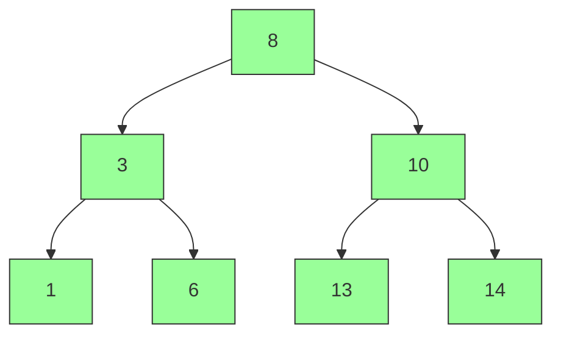

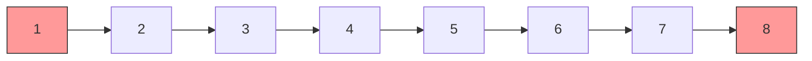

**退化后的性能**：

| 操作 | 平衡树 | 退化为链表 |
|-----|-------|-----------|
| 查找 | O(log n) | O(n) |
| 插入 | O(log n) | O(n) |
| 删除 | O(log n) | O(n) |

### 1.2 平衡树的要求

**平衡的定义**：任意节点的左右子树高度差不超过某个常数。

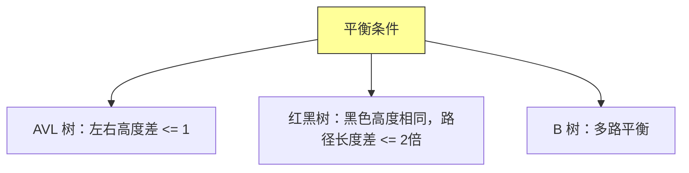

### 1.3 红黑树的解决方案

红黑树通过以下性质保证近似平衡：

**红黑树五大性质**：

1. **颜色属性**：节点是红色或黑色
2. **根节点属性**：根节点是黑色
3. **叶子节点属性**：所有叶子节点 NIL 是黑色
4. **红色节点属性**：红色节点的子节点必须是黑色（不能有连续红色）
5. **黑色高度属性**：从任意节点到其所有叶子节点的路径上，黑色节点数量相同

**性质 5 的含义**：

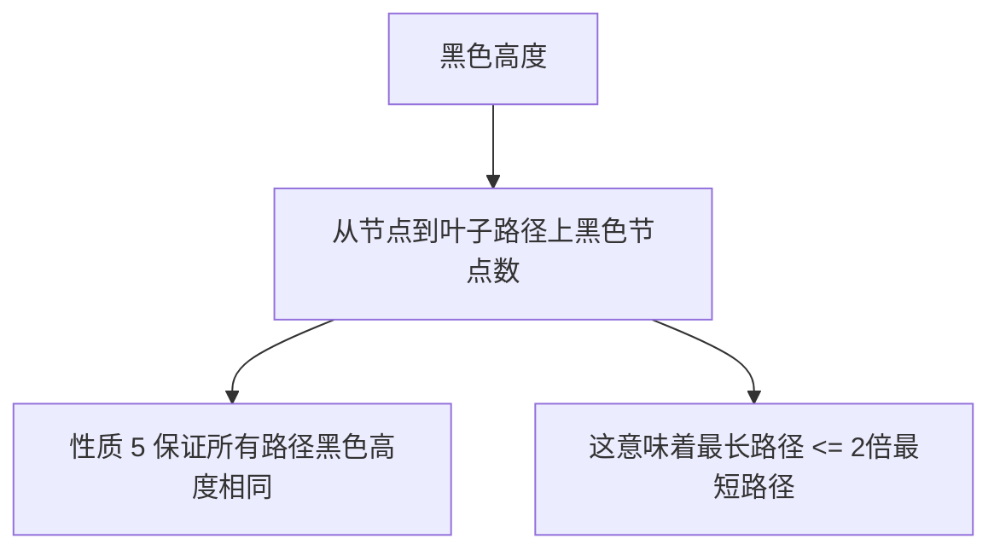

**推论**：红黑树的高度最多是最短路径的 2 倍，因此高度为 O(log n)。

---

## 二、红黑树的定义与性质

### 2.1 红黑树的定义

```java
/**
 * 红黑树节点
 */
class RBTreeNode {
    int key;           // 键
    Object value;      // 值
    RBTreeNode left;   // 左子节点
    RBTreeNode right;  // 右子节点
    RBTreeNode parent; // 父节点
    boolean color;     // 颜色：RED 或 BLACK

    RBTreeNode(int key, Object value, boolean color) {
        this.key = key;
        this.value = value;
        this.color = color;
        this.left = NIL;
        this.right = NIL;
        this.parent = NIL;
    }
}
```

### 2.2 红黑树的完整结构

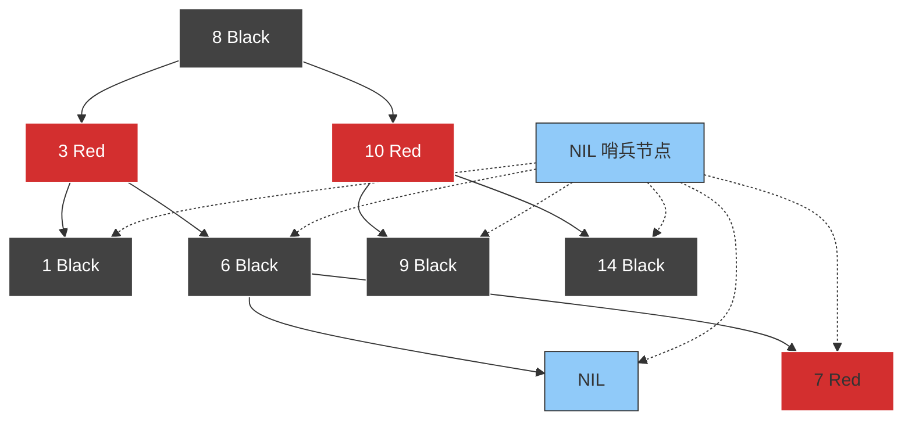

**哨兵节点（NIL）的设计**：

```java
/**
 * 红黑树实现
 */
public class RedBlackTree {
    private RBTreeNode NIL;  // 哨兵节点
    private RBTreeNode root; // 根节点

    public RedBlackTree() {
        NIL = new RBTreeNode(0, null, BLACK);
        NIL.left = NIL;
        NIL.right = NIL;
        NIL.parent = NIL;
        root = NIL;
    }
}
```

### 2.3 红黑树的性质证明

**引理 13.1**：红黑树的高度最多是 2*log(n+1)，其中 n 是内部节点数。

**证明**：

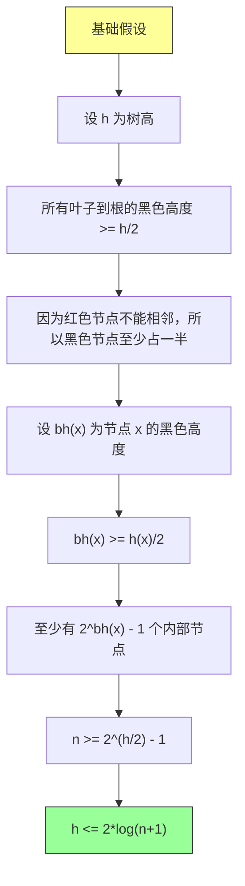

**数学推导**：

```
n >= 2^(h/2) - 1
n + 1 >= 2^(h/2)
log(n+1) >= h/2
h <= 2*log(n+1)
```

这证明了红黑树的高度是对数级别的。

---

## 三、旋转操作（Rotation）

### 3.1 左旋（Left Rotate）

左旋以 x 为支点，将 y（x 的右子节点）提升到 x 的位置。

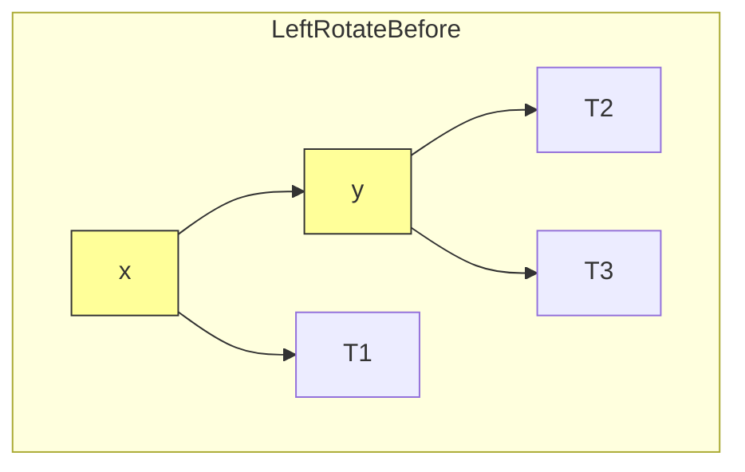

**旋转后**：

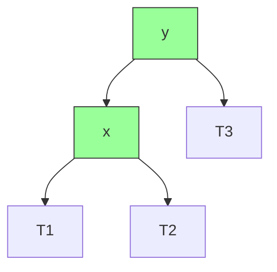

**Java 实现**：

```java
/**
 * 左旋
 * @param x 旋转的支点
 */
private void leftRotate(RBTreeNode x) {
    RBTreeNode y = x.right;       // y 是 x 的右子节点
    x.right = y.left;             // y 的左子节点变为 x 的右子节点

    if (y.left != NIL) {
        y.left.parent = x;        // 更新 y.left 的父指针
    }

    y.parent = x.parent;          // y 的父节点变为 x 的父节点

    if (x.parent == NIL) {
        root = y;                  // x 是根节点
    } else if (x == x.parent.left) {
        x.parent.left = y;         // x 是左子节点
    } else {
        x.parent.right = y;        // x 是右子节点
    }

    y.left = x;                    // x 变为 y 的左子节点
    x.parent = y;                  // 更新 x 的父指针
}
```

### 3.2 右旋（Right Rotate）

右旋以 y 为支点，将 x（y 的左子节点）提升到 y 的位置。

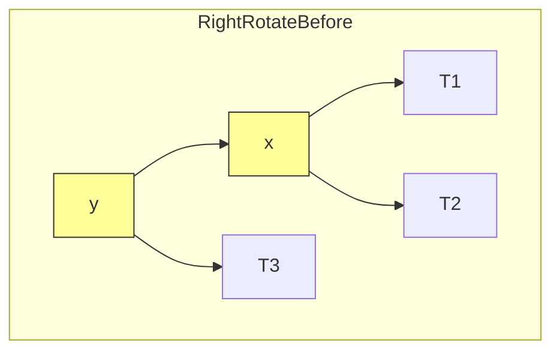

**旋转后**：

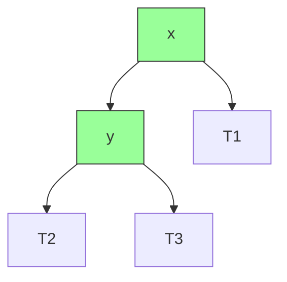

**Java 实现**：

```java
/**
 * 右旋
 * @param y 旋转的支点
 */
private void rightRotate(RBTreeNode y) {
    RBTreeNode x = y.left;        // x 是 y 的左子节点
    y.left = x.right;             // x 的右子节点变为 y 的左子节点

    if (x.right != NIL) {
        x.right.parent = y;       // 更新 x.right 的父指针
    }

    x.parent = y.parent;          // x 的父节点变为 y 的父节点

    if (y.parent == NIL) {
        root = x;                  // y 是根节点
    } else if (y == y.parent.right) {
        y.parent.right = x;        // y 是右子节点
    } else {
        y.parent.left = x;         // y 是左子节点
    }

    x.right = y;                   // y 变为 x 的右子节点
    y.parent = x;                  // 更新 y 的父指针
}
```

### 3.3 旋转的正确性证明

**引理 13.2**：旋转操作保持二叉搜索树的性质。

**证明**：

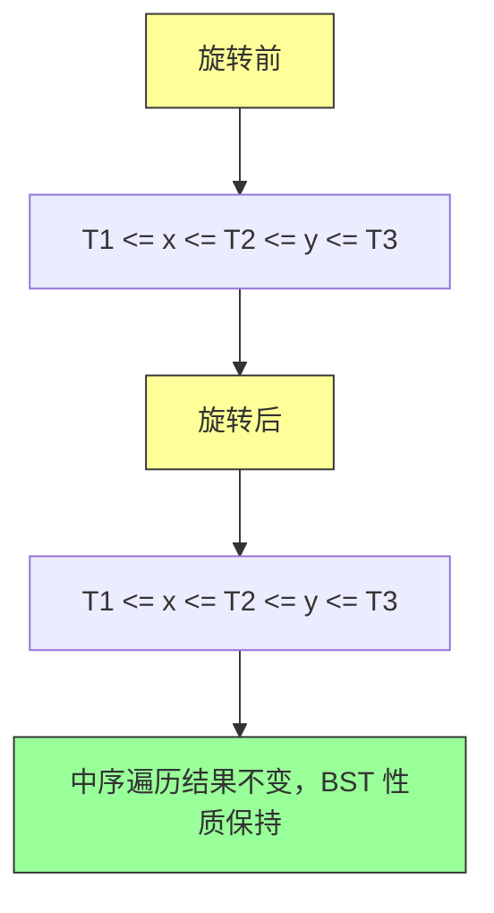

旋转前的中序遍历：T1, x, T2, y, T3

旋转后的中序遍历：T1, x, T2, y, T3

中序遍历结果完全相同，因此 BST 性质被保持。

---

## 四、插入操作（Insert）

### 4.1 插入的基本思路

红黑树的插入分为两个步骤：

1. **先将节点作为普通 BST 插入**（着色为红色）
2. **修复红黑性质**

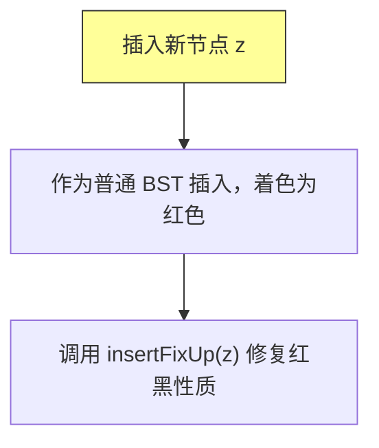

### 4.2 插入代码实现

```java
/**
 * 插入键值对
 * @param key 键
 * @param value 值
 */
public void insert(int key, Object value) {
    RBTreeNode z = new RBTreeNode(key, value, RED);
    z.left = NIL;
    z.right = NIL;

    RBTreeNode y = NIL;
    RBTreeNode x = root;

    // 查找插入位置
    while (x != NIL) {
        y = x;
        if (z.key < x.key) {
            x = x.left;
        } else if (z.key > x.key) {
            x = x.right;
        } else {
            // 键已存在，更新值
            x.value = value;
            return;
        }
    }

    z.parent = y;
    if (y == NIL) {
        root = z;                   // 树为空，z 成为根节点
    } else if (z.key < y.key) {
        y.left = z;                 // 插入为左子节点
    } else {
        y.right = z;                // 插入为右子节点
    }

    insertFixUp(z);                 // 修复红黑性质
}
```

### 4.3 插入修复（insertFixUp）

**为什么需要修复**：新插入的红色节点可能违反红黑性质。

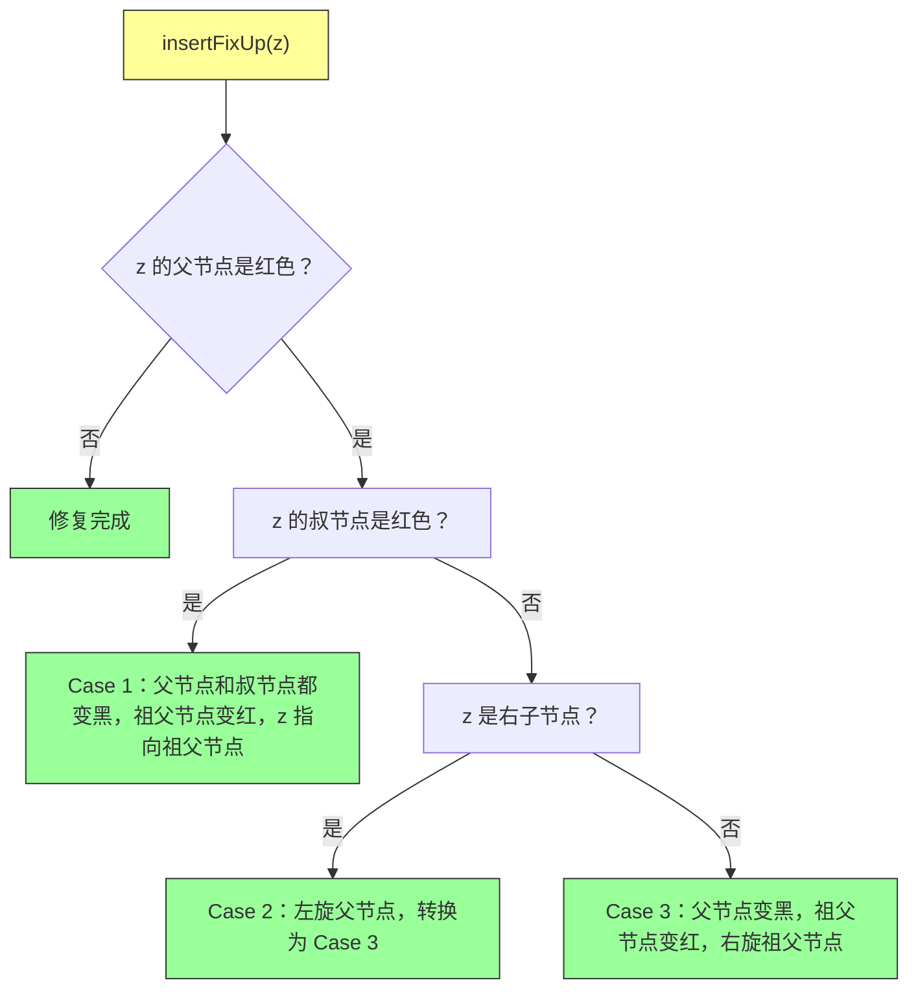

**插入修复的代码实现**：

```java
/**
 * 插入修复
 * @param z 新插入的节点
 */
private void insertFixUp(RBTreeNode z) {
    while (z.parent.color == RED) {
        if (z.parent == z.parent.parent.left) {
            // z 的父节点是祖父节点的左子节点
            RBTreeNode y = z.parent.parent.right;  // y 是叔节点

            if (y.color == RED) {
                // Case 1：叔节点是红色
                z.parent.color = BLACK;            // 父节点变黑
                y.color = BLACK;                    // 叔节点变黑
                z.parent.parent.color = RED;        // 祖父节点变红
                z = z.parent.parent;                // z 指向祖父节点
            } else {
                // Case 2：叔节点是黑色，z 是右子节点
                if (z == z.parent.right) {
                    z = z.parent;                   // z 指向父节点
                    leftRotate(z);                   // 左旋父节点
                }
                // Case 3：叔节点是黑色，z 是左子节点
                z.parent.color = BLACK;            // 父节点变黑
                z.parent.parent.color = RED;        // 祖父节点变红
                rightRotate(z.parent.parent);       // 右旋祖父节点
            }
        } else {
            // z 的父节点是祖父节点的右子节点（对称情况）
            RBTreeNode y = z.parent.parent.left;   // y 是叔节点

            if (y.color == RED) {
                // Case 1：叔节点是红色
                z.parent.color = BLACK;
                y.color = BLACK;
                z.parent.parent.color = RED;
                z = z.parent.parent;
            } else {
                // Case 2：叔节点是黑色，z 是左子节点
                if (z == z.parent.left) {
                    z = z.parent;
                    rightRotate(z);
                }
                // Case 3：叔节点是黑色，z 是右子节点
                z.parent.color = BLACK;
                z.parent.parent.color = RED;
                leftRotate(z.parent.parent);
            }
        }
    }
    root.color = BLACK;  // 确保根节点是黑色
}
```

### 4.4 插入案例详解

#### Case 1：叔节点是红色

**处理前**：

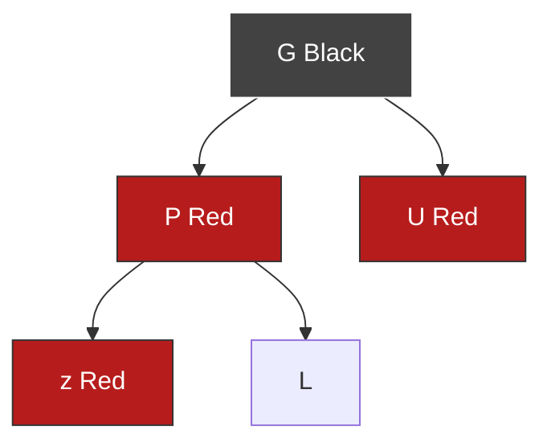

**处理后**：

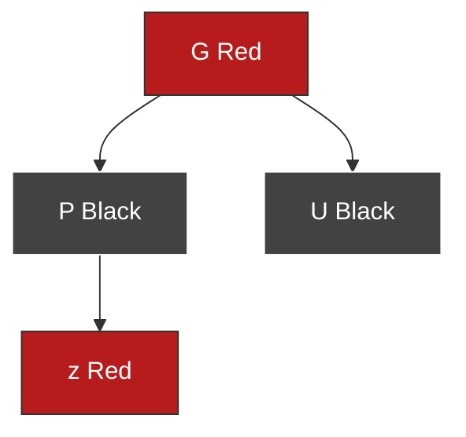

**处理**：父节点和叔节点变黑，祖父节点变红，z 指向祖父节点。

#### Case 2：叔节点是黑色，z 是右子节点

**处理前**：

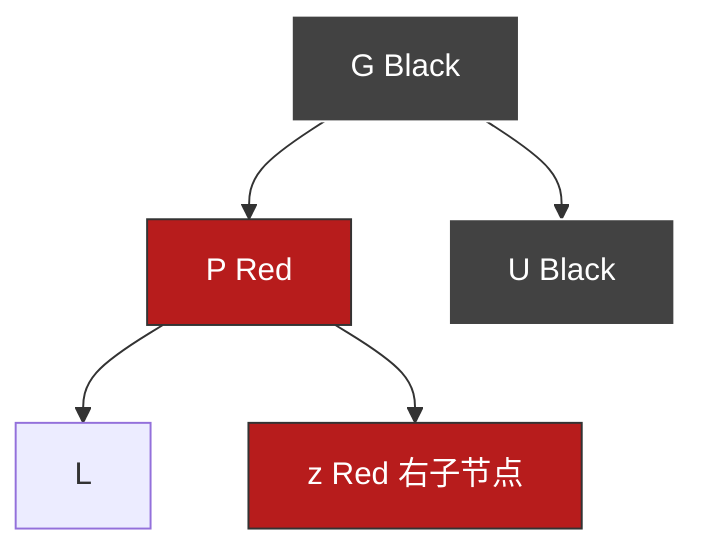

**处理**：先对父节点左旋，转换为 Case 3。

#### Case 3：叔节点是黑色，z 是左子节点

**处理前**：

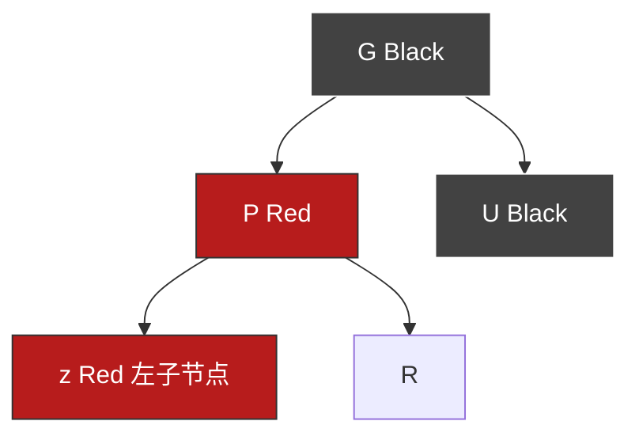

**处理后**：

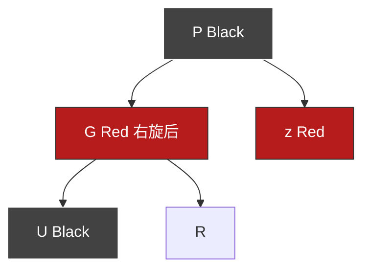

**处理**：父节点变黑，祖父节点变红，右旋祖父节点。

### 4.5 插入操作时间复杂度分析

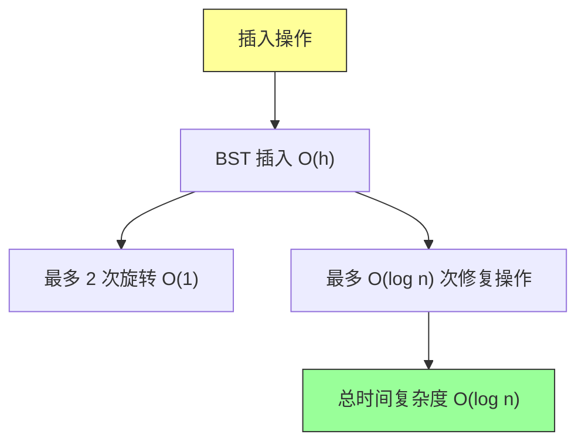

---

## 五、删除操作（Delete）

### 5.1 删除的基本思路

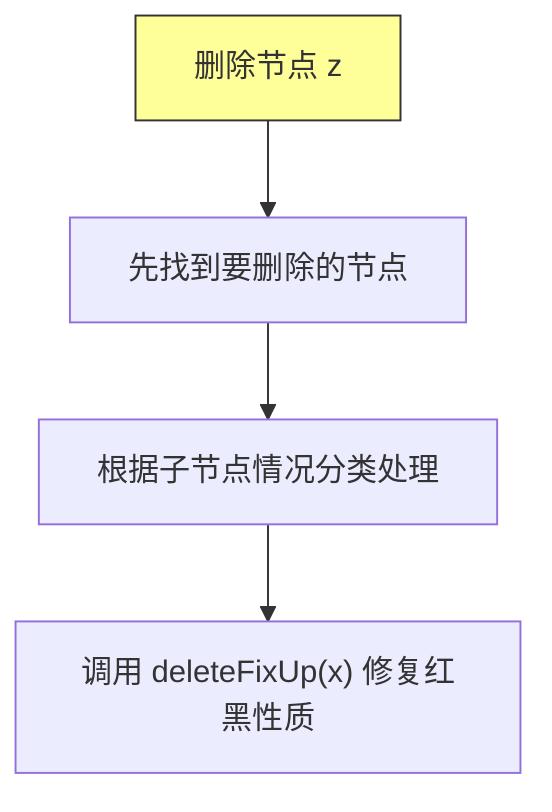

### 5.2 删除的分类

```mermaid
flowchart TD
    A["删除节点 z"] --> B["z 没有子节点"]
    A --> C["z 有一个子节点"]
    A --> D["z 有两个子节点"]

    B --> E["直接删除 z"]
    C --> F["用子节点替代"]
    D --> G["后继替代 z，删除后继"]

    style B fill:#99ff99,stroke:#333
    style C fill:#99ff99,stroke:#333
    style D fill:#ffff99,stroke:#333
```

### 5.3 删除代码实现

```java
/**
 * 删除键
 * @param key 要删除的键
 * @return 如果找到并删除返回 true，否则返回 false
 */
public boolean delete(int key) {
    RBTreeNode z = search(root, key);
    if (z == NIL) {
        return false;  // 未找到
    }
    deleteNode(z);
    return true;
}

/**
 * 删除节点
 */
private void deleteNode(RBTreeNode z) {
    RBTreeNode y = z;
    boolean yOriginalColor = y.color;
    RBTreeNode x;

    if (z.left == NIL) {
        // z 没有左子节点
        x = z.right;
        transplant(z, z.right);
    } else if (z.right == NIL) {
        // z 没有右子节点
        x = z.left;
        transplant(z, z.left);
    } else {
        // z 有两个子节点，找到后继
        y = minimum(z.right);
        yOriginalColor = y.color;
        x = y.right;

        if (y.parent == z) {
            x.parent = y;
        } else {
            transplant(y, y.right);
            y.right = z.right;
            y.right.parent = y;
        }
        transplant(z, y);
        y.left = z.left;
        y.left.parent = y;
        y.color = z.color;
    }

    // 如果删除的是黑色节点，需要修复
    if (yOriginalColor == BLACK) {
        deleteFixUp(x);
    }
}

/**
 * 用子树 v 替换子树 u
 */
private void transplant(RBTreeNode u, RBTreeNode v) {
    if (u.parent == NIL) {
        root = v;
    } else if (u == u.parent.left) {
        u.parent.left = v;
    } else {
        u.parent.right = v;
    }
    v.parent = u.parent;
}

/**
 * 查找最小节点
 */
private RBTreeNode minimum(RBTreeNode node) {
    while (node.left != NIL) {
        node = node.left;
    }
    return node;
}
```

### 5.4 删除修复（deleteFixUp）

**为什么需要修复**：删除黑色节点会减少路径上的黑色高度，违反性质 5。

```mermaid
flowchart TD
    A["deleteFixUp(x)"] --> B{"x 是红色？或 x 是根节点？"}
    B -->|是| C["Case 0：x 直接变黑，问题解决"]
    B -->|否| D["判断 x 是左还是右子节点"]
    D --> E["Case 1：w 是红色"]
    D --> F["Case 2：w 黑色子节点都黑"]
    D --> G["Case 3：w 左子红右子黑"]
    D --> H["Case 4：w 右子红"]

    style A fill:#ffff99,stroke:#333
    style C fill:#99ff99,stroke:#333
```

**删除修复的代码实现**：

```java
/**
 * 删除修复
 * @param x 有额外黑色的节点
 */
private void deleteFixUp(RBTreeNode x) {
    while (x != root && x.color == BLACK) {
        if (x == x.parent.left) {
            // x 是左子节点
            RBTreeNode w = x.parent.right;  // w 是兄弟节点

            if (w.color == RED) {
                // Case 1：兄弟节点是红色
                w.color = BLACK;
                x.parent.color = RED;
                leftRotate(x.parent);
                w = x.parent.right;
            }

            if (w.left.color == BLACK && w.right.color == BLACK) {
                // Case 2：兄弟节点是黑色，两个子节点都是黑色
                w.color = RED;
                x = x.parent;
            } else {
                if (w.right.color == BLACK) {
                    // Case 3：兄弟节点是黑色，左子节点是红色
                    w.left.color = BLACK;
                    w.color = RED;
                    rightRotate(w);
                    w = x.parent.right;
                }
                // Case 4：兄弟节点是黑色，右子节点是红色
                w.color = x.parent.color;
                x.parent.color = BLACK;
                w.right.color = BLACK;
                leftRotate(x.parent);
                x = root;
            }
        } else {
            // x 是右子节点（对称情况）
            RBTreeNode w = x.parent.left;   // w 是兄弟节点

            if (w.color == RED) {
                // Case 1：兄弟节点是红色
                w.color = BLACK;
                x.parent.color = RED;
                rightRotate(x.parent);
                w = x.parent.left;
            }

            if (w.right.color == BLACK && w.left.color == BLACK) {
                // Case 2：兄弟节点是黑色，两个子节点都是黑色
                w.color = RED;
                x = x.parent;
            } else {
                if (w.left.color == BLACK) {
                    // Case 3：兄弟节点是黑色，右子节点是红色
                    w.right.color = BLACK;
                    w.color = RED;
                    leftRotate(w);
                    w = x.parent.left;
                }
                // Case 4：兄弟节点是黑色，左子节点是红色
                w.color = x.parent.color;
                x.parent.color = BLACK;
                w.left.color = BLACK;
                rightRotate(x.parent);
                x = root;
            }
        }
    }
    x.color = BLACK;  // Case 0：x 是红色，直接变黑
}
```

### 5.5 删除案例详解

#### Case 1：兄弟节点是红色

**处理前**：

```mermaid
flowchart TD
    P["P Black"] --> x["x 额外黑色"]
    P --> w["w Red"]
    w --> wL["wL Black"]
    w --> wR["wR Black"]

    style P fill:#424242,stroke:#fff,color:#fff
    style x fill:#99ff99,stroke:#333
    style w fill:#b71c1c,stroke:#333,color:#fff
```

**处理后**：

```mermaid
flowchart TD
    w2["w Black"] --> P2["P Red 左旋后"]
    w2 --> x2["x 额外黑色"]
    w2 --> wR2["wR Black"]
    P2 --> wL2["wL Black"]

    style w2 fill:#424242,stroke:#fff,color:#fff
    style P2 fill:#b71c1c,stroke:#333,color:#fff
    style x2 fill:#99ff99,stroke:#333
```

#### Case 2：兄弟节点是黑色，子节点都是黑色

**处理前**：

```mermaid
flowchart TD
    P["P Black"] --> x["x 额外黑色"]
    P --> w["w Black"]
    w --> wL["L Black"]
    w --> wR["R Black"]

    style P fill:#424242,stroke:#fff,color:#fff
    style x fill:#99ff99,stroke:#333
    style w fill:#424242,stroke:#fff,color:#fff
    style wL fill:#424242,stroke:#fff,color:#fff
    style wR fill:#424242,stroke:#fff,color:#fff
```

**处理后**：

```mermaid
flowchart TD
    P2["P Black"] --> x2["x 额外黑色转移"]
    P2 --> w2["w Red"]

    style P2 fill:#424242,stroke:#fff,color:#fff
    style x2 fill:#99ff99,stroke:#333
    style w2 fill:#b71c1c,stroke:#333,color:#fff
```

#### Case 4：兄弟节点是黑色，右子节点是红色

**处理前**：

```mermaid
flowchart TD
    P["P Black"] --> x["x 额外黑色"]
    P --> w["w Black"]
    w --> wL["L"]
    w --> wR["R Red"]

    style P fill:#424242,stroke:#fff,color:#fff
    style x fill:#99ff99,stroke:#333
    style w fill:#424242,stroke:#fff,color:#fff
    style wR fill:#b71c1c,stroke:#333,color:#fff
```

**处理后**：

```mermaid
flowchart TD
    w2["w 继承P颜色"] --> P2["P Black"]
    w2 --> x2["x Black"]
    w2 --> wR2["R Black"]

    style w2 fill:#424242,stroke:#fff,color:#fff
    style P2 fill:#424242,stroke:#fff,color:#fff
    style x2 fill:#424242,stroke:#fff,color:#fff
    style wR2 fill:#424242,stroke:#fff,color:#fff
```

### 5.6 删除操作时间复杂度分析

```mermaid
flowchart TD
    A["删除操作"] --> B["BST 删除 O(h)"]
    B --> C["最多 3 次旋转 O(1)"]
    B --> D["最多 O(log n) 次修复操作"]
    D --> E["总时间复杂度 O(log n)"]

    style A fill:#ffff99,stroke:#333
    style E fill:#99ff99,stroke:#333
```

---

## 六、完整的红黑树实现

```java
/**
 * 红黑树实现
 */
public class RedBlackTree {
    private static final boolean RED = true;
    private static final boolean BLACK = false;

    private RBTreeNode NIL;
    private RBTreeNode root;

    public RedBlackTree() {
        NIL = new RBTreeNode(0, null, BLACK);
        NIL.left = NIL;
        NIL.right = NIL;
        NIL.parent = NIL;
        root = NIL;
    }

    /**
     * 插入键值对
     */
    public void insert(int key, Object value) {
        RBTreeNode z = new RBTreeNode(key, value, RED);
        RBTreeNode y = NIL;
        RBTreeNode x = root;

        while (x != NIL) {
            y = x;
            if (z.key < x.key) {
                x = x.left;
            } else if (z.key > x.key) {
                x = x.right;
            } else {
                x.value = value;
                return;
            }
        }

        z.parent = y;
        if (y == NIL) {
            root = z;
        } else if (z.key < y.key) {
            y.left = z;
        } else {
            y.right = z;
        }

        insertFixUp(z);
    }

    /**
     * 删除键
     */
    public boolean delete(int key) {
        RBTreeNode z = search(root, key);
        if (z == NIL) {
            return false;
        }
        deleteNode(z);
        return true;
    }

    /**
     * 查找键
     */
    public Object search(int key) {
        RBTreeNode result = search(root, key);
        return result == NIL ? null : result.value;
    }

    private RBTreeNode search(RBTreeNode node, int key) {
        while (node != NIL && key != node.key) {
            if (key < node.key) {
                node = node.left;
            } else {
                node = node.right;
            }
        }
        return node;
    }

    private void insertFixUp(RBTreeNode z) {
        while (z.parent.color == RED) {
            if (z.parent == z.parent.parent.left) {
                RBTreeNode y = z.parent.parent.right;
                if (y.color == RED) {
                    z.parent.color = BLACK;
                    y.color = BLACK;
                    z.parent.parent.color = RED;
                    z = z.parent.parent;
                } else {
                    if (z == z.parent.right) {
                        z = z.parent;
                        leftRotate(z);
                    }
                    z.parent.color = BLACK;
                    z.parent.parent.color = RED;
                    rightRotate(z.parent.parent);
                }
            } else {
                RBTreeNode y = z.parent.parent.left;
                if (y.color == RED) {
                    z.parent.color = BLACK;
                    y.color = BLACK;
                    z.parent.parent.color = RED;
                    z = z.parent.parent;
                } else {
                    if (z == z.parent.left) {
                        z = z.parent;
                        rightRotate(z);
                    }
                    z.parent.color = BLACK;
                    z.parent.parent.color = RED;
                    leftRotate(z.parent.parent);
                }
            }
        }
        root.color = BLACK;
    }

    private void deleteNode(RBTreeNode z) {
        RBTreeNode y = z;
        boolean yOriginalColor = y.color;
        RBTreeNode x;

        if (z.left == NIL) {
            x = z.right;
            transplant(z, z.right);
        } else if (z.right == NIL) {
            x = z.left;
            transplant(z, z.left);
        } else {
            y = minimum(z.right);
            yOriginalColor = y.color;
            x = y.right;
            if (y.parent == z) {
                x.parent = y;
            } else {
                transplant(y, y.right);
                y.right = z.right;
                y.right.parent = y;
            }
            transplant(z, y);
            y.left = z.left;
            y.left.parent = y;
            y.color = z.color;
        }

        if (yOriginalColor == BLACK) {
            deleteFixUp(x);
        }
    }

    private void deleteFixUp(RBTreeNode x) {
        while (x != root && x.color == BLACK) {
            if (x == x.parent.left) {
                RBTreeNode w = x.parent.right;
                if (w.color == RED) {
                    w.color = BLACK;
                    x.parent.color = RED;
                    leftRotate(x.parent);
                    w = x.parent.right;
                }
                if (w.left.color == BLACK && w.right.color == BLACK) {
                    w.color = RED;
                    x = x.parent;
                } else {
                    if (w.right.color == BLACK) {
                        w.left.color = BLACK;
                        w.color = RED;
                        rightRotate(w);
                        w = x.parent.right;
                    }
                    w.color = x.parent.color;
                    x.parent.color = BLACK;
                    w.right.color = BLACK;
                    leftRotate(x.parent);
                    x = root;
                }
            } else {
                RBTreeNode w = x.parent.left;
                if (w.color == RED) {
                    w.color = BLACK;
                    x.parent.color = RED;
                    rightRotate(x.parent);
                    w = x.parent.left;
                }
                if (w.right.color == BLACK && w.left.color == BLACK) {
                    w.color = RED;
                    x = x.parent;
                } else {
                    if (w.left.color == BLACK) {
                        w.right.color = BLACK;
                        w.color = RED;
                        leftRotate(w);
                        w = x.parent.left;
                    }
                    w.color = x.parent.color;
                    x.parent.color = BLACK;
                    w.left.color = BLACK;
                    rightRotate(x.parent);
                    x = root;
                }
            }
        }
        x.color = BLACK;
    }

    private void leftRotate(RBTreeNode x) {
        RBTreeNode y = x.right;
        x.right = y.left;
        if (y.left != NIL) {
            y.left.parent = x;
        }
        y.parent = x.parent;
        if (x.parent == NIL) {
            root = y;
        } else if (x == x.parent.left) {
            x.parent.left = y;
        } else {
            x.parent.right = y;
        }
        y.left = x;
        x.parent = y;
    }

    private void rightRotate(RBTreeNode y) {
        RBTreeNode x = y.left;
        y.left = x.right;
        if (x.right != NIL) {
            x.right.parent = y;
        }
        x.parent = y.parent;
        if (y.parent == NIL) {
            root = x;
        } else if (y == y.parent.right) {
            y.parent.right = x;
        } else {
            y.parent.left = x;
        }
        x.right = y;
        y.parent = x;
    }

    private void transplant(RBTreeNode u, RBTreeNode v) {
        if (u.parent == NIL) {
            root = v;
        } else if (u == u.parent.left) {
            u.parent.left = v;
        } else {
            u.parent.right = v;
        }
        v.parent = u.parent;
    }

    private RBTreeNode minimum(RBTreeNode node) {
        while (node.left != NIL) {
            node = node.left;
        }
        return node;
    }

    /**
     * 红黑树节点
     */
    private class RBTreeNode {
        int key;
        Object value;
        boolean color;
        RBTreeNode left;
        RBTreeNode right;
        RBTreeNode parent;

        RBTreeNode(int key, Object value, boolean color) {
            this.key = key;
            this.value = value;
            this.color = color;
        }
    }
}
```

---

## 七、红黑树的应用场景

### 7.1 经典应用

| 应用 | 说明 |
|-----|------|
| Java TreeMap/TreeSet | 有序键值对集合 |
| C++ std::map/std::set | STL 有序容器 |
| Linux 内核 | 进程调度、内存管理 |
| 数据库索引 | B+ 树的基础结构 |

### 7.2 Java TreeMap 示例

```java
// 使用 TreeMap 实现有序映射
TreeMap<Integer, String> map = new TreeMap<>();
map.put(3, "C");
map.put(1, "A");
map.put(2, "B");

// 有序输出：A, B, C
map.forEach((k, v) -> System.out.println(v));

// 范围查询：获取 1 到 2 之间的键值对
System.out.println(map.subMap(1, 3));  // {1=A, 2=B}
```

---

## 八、红黑树与 AVL 树的对比

```mermaid
flowchart TD
    A["平衡树选择"] --> B["红黑树"]
    A --> C["AVL 树"]
    A --> D["B 树"]

    B --> B1["近似平衡：高度 <= 2*log n"]
    B --> B2["插入删除更快"]
    B --> B3["查询稍慢"]

    C --> C1["严格平衡：高度 <= 1.44*log n"]
    C --> C2["插入删除更慢"]
    C --> C3["查询更快"]

    style A fill:#ffff99,stroke:#333
```

| 特性 | 红黑树 | AVL 树 |
|-----|-------|-------|
| 平衡标准 | 近似平衡 | 严格平衡 |
| 高度 | <= 2*log(n+1) | <= 1.44*log(n+2) |
| 旋转次数 | 最多 2 次 | 最多 O(log n) 次 |
| 查询效率 | 稍低 | 更高 |
| 插入删除效率 | 更高 | 稍低 |
| 适用场景 | 数据库、缓存 | 搜索引擎、查询密集型 |

**选择建议**：
- 读多写少：AVL 树
- 写多读少：红黑树
- 数据库索引：B+ 树

---

## 九、红黑树的变体

### 9.1 常见的平衡树变体

```mermaid
flowchart TD
    A["平衡树"] --> B["红黑树"]
    A --> C["AVL 树"]
    A --> D["B 树"]
    A --> E["伸展树"]

    B --> F["近似平衡"]
    C --> G["严格平衡"]
    D --> H["多路平衡"]
    E --> I["自适应平衡"]

    style A fill:#ffff99,stroke:#333
```

### 9.2 红黑树的等价变换

红黑树与 2-3-4 树等价：

```mermaid
flowchart TD
    A["红黑树"] --> B["2-3-4 树"]
    B --> C["黑色节点 + 红色子节点 = 3 节点"]
    B --> D["黑色节点 + 无红色子节点 = 2 节点"]

    style A fill:#ffff99,stroke:#333
```

---

## 十、总结

### 10.1 红黑树的核心要点

```mermaid
flowchart TD
    subgraph Summary
    A["红黑树要点"] --> B["5 条红黑性质"]
    A --> C["旋转操作（左右旋）"]
    A --> D["插入修复（3 种情况）"]
    A --> E["删除修复（4 种情况）"]
    A --> F["时间复杂度 O(log n)"]

    style A fill:#ffff99,stroke:#333
    end
```

### 10.2 进一步学习

```mermaid
flowchart TD
    A["后续学习"] --> B["AVL 树：严格平衡的 BST"]
    A --> C["B 树/B+ 树：多路平衡搜索树"]
    A --> D["跳表 Skip List：概率平衡的数据结构"]
    A --> E["伸展树 Splay Tree：自适应平衡"]
```

---

**红黑树是平衡二叉搜索树中最经典、最实用的数据结构之一。它通过近似平衡的设计，在保持良好查询性能的同时，简化了插入和删除操作的复杂度。**

下一章：第十四章——动态规划（Dynamic Programming）
