# 第十三章：红黑树

> **本章定位**：第 12 章的 BST 在高度为 h 时各项操作是 O(h)；但如果插入顺序不好，BST 会退化成链表，高度变 O(n)。**红黑树是一种「自平衡」BST**——通过给每个节点加一个颜色位（红/黑）并约束颜色的分布，把树高限制在 **O(lg n)**，从而保证查找 / 插入 / 删除的最坏时间都是 **O(lg n)**。
>
> 它是工程中最常用的平衡 BST：Java 的 `TreeMap`/`TreeSet`、C++ 的 `std::map`/`std::set`、Linux 的 CFS 进程调度器都基于它。第 17 章「扩充数据结构」（顺序统计树、区间树）也是在红黑树上挂附加信息——那时「每次操作只旋转常数次」会很关键。

---

## 一、为什么需要红黑树

普通 BST 的致命问题：按顺序插入 `1,2,3,4,5` 会退化成一条向右的链，查找退化为 O(n)。AVL 树用「严格平衡」解决（左右子树高度差 ≤ 1），但插入/删除时调整频繁。红黑树用**「近似平衡」**——放松平衡条件，换取更少的调整次数，整体插入/删除更快。

| 数据结构 | 平衡策略 | 高度 | 查找 | 插入/删除调整 |
|----------|---------|------|------|--------------|
| 普通 BST | 无 | 最坏 O(n) | O(h) | 无 |
| AVL 树 | 严格（高度差 ≤ 1） | ≤ 1.44 lg n | 最快 | 频繁（插入最多 O(lg n) 次旋转，思考题 13-3） |
| **红黑树** | 近似（最长路径 ≤ 2× 最短） | ≤ 2 lg(n+1) | 略慢于 AVL | 少（插入 ≤ 2 旋、删除 ≤ 3 旋） |

---

## 二、红黑树的性质

### 2.1 五条红黑性质

红黑树是在 BST 上增加一个 `color` 属性（RED 或 BLACK），并满足以下五条性质：

1. 每个节点要么是红色，要么是黑色。
2. **根是黑色**。
3. 每个叶子（NIL 哨兵）是黑色。
4. **红节点的两个孩子必须是黑色**（即不能有两个连续的红节点）。
5. **从任一节点到其所有后代叶子的简单路径，包含相同数目的黑色节点**。

> 性质 4 + 5 合起来意味着：一条路径上红节点不能相邻，且各路径黑节点数相等 ⇒ **最长路径最多是最短路径的 2 倍** ⇒ 树高 O(lg n)（习题 13.1-5）。

### 图 A：一棵合法的红黑树

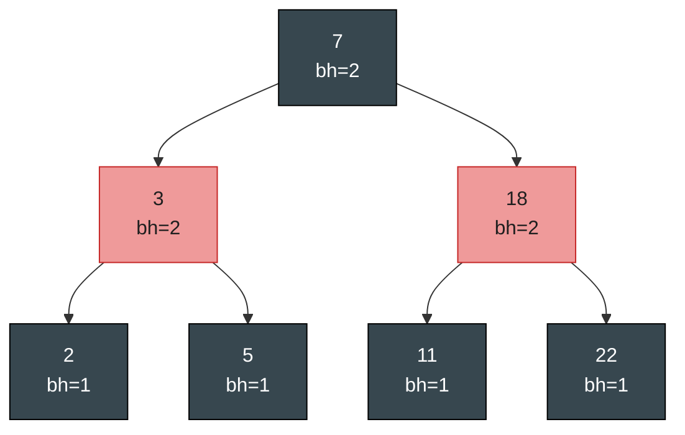

- 全章图例约定：**深色节点 = 黑，浅红色 = 红**，紫色 = 当前关注点（z / x），蓝色 = 颜色不定（可红可黑）。
- 根 7 黑（性质 2）；红节点 3、18 的孩子都是黑（性质 4）；
- 每条根到叶路径的黑节点数（不含根、含 NIL 叶）都 = 2（性质 5）。

> **NIL 哨兵**：书中用一个统一的哨兵 `T.nil`（黑色）表示所有空指针（所有叶子 + 根的父节点）。好处：可以把 NIL 当成普通节点处理，边界条件代码更简洁。本章图里省略 NIL 叶（与原书图 13.1(c) 的画法一致）。

### 2.2 黑高（black-height）与高度上界

**黑高 bh(x)**：从节点 x（不含 x）到叶子的任一简单路径上的黑节点数（NIL 叶算黑，bh(T.nil) = 0）。由性质 5，这个值对 x 是唯一确定的。**红黑树的黑高 = 根的黑高**。

**结论：n 个内部节点的红黑树，高度 h ≤ 2 lg(n+1)。** 一句话理由：

1. 黑高为 k 的子树至少含 2^k − 1 个内部节点（黑高每 +1，结点数至少翻倍——极端就是一棵全黑的完美二叉树）；
2. 由性质 4，根到叶路径上**至少一半**节点是黑的 ⇒ bh(root) ≥ h/2。

两式合并：`n ≥ 2^(h/2) − 1` ⇒ **h ≤ 2 lg(n+1)**。

> 推论：由于树高 O(lg n)，第 12 章的 SEARCH / MINIMUM / MAXIMUM / SUCCESSOR / PREDECESSOR 在红黑树上都是 **O(lg n)**。但 TREE-INSERT / TREE-DELETE 不能直接用——它们不维护颜色性质，需要本章的 RB-INSERT / RB-DELETE。

---

## 三、旋转（Rotation）：调整树形的局部操作

旋转是「在保持 BST 性质前提下改变树形」的局部操作，只动指针、O(1) 时间。所有平衡调整都靠它。

**左旋 LEFT-ROTATE(x)**（要求 x 有右孩子 y）：把 y 提到 x 的位置，x 下沉为 y 的左孩子，y 原来的左子树 β 变成 x 的右子树。右旋是左旋的逆。

### 图 B：旋转的结构变化（α β γ 是任意子树）

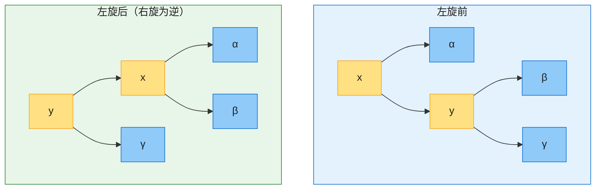

> **为什么保 BST 性质？** 旋转前后中序遍历都是 `α, x, β, y, γ`——关键字顺序不变，BST 性质自然保持。

**伪代码（左旋）**：

```
LEFT-ROTATE(T, x)
1  y = x.right            // y 是 x 的右孩子（须非 nil）
2  x.right = y.left       // β 挂到 x 右边
3  if y.left ≠ T.nil
4      y.left.p = x
5  y.p = x.p              // y 接管 x 在父节点中的位置
6  if x.p == T.nil
7      T.root = y
8  elseif x == x.p.left
9      x.p.left = y
10 else x.p.right = y
11 y.left = x             // x 成为 y 的左孩子
12 x.p = y
```

右旋 `RIGHT-ROTATE` 完全对称（把上面所有 left/right 互换，习题 13.2-1）。

---

## 四、插入 RB-INSERT

### 4.1 思路

1. 像普通 BST 那样把新节点 z 插入，**并染成红色**（染红最多违反性质 4「红红相邻」；染黑则必然违反性质 5「黑高相等」——红更安全，习题 13.3-1）。
2. 调用 `RB-INSERT-FIXUP(z)` 修复可能被破坏的性质。

插入后只有两条性质可能被破坏：**性质 2**（若 z 是根却为红）和**性质 4**（若 z 和 z.p 都是红）。修复的核心循环只处理「z 和 z.p 都红」这一违例。

### 4.2 三种情况（设 z.p 是左孩子；右孩子完全对称）

记 z 的父节点 P（红）、祖父 C（必黑）、叔节点 y（C 的另一个孩子）。

| 情况 | 条件 | 处理 | 之后 |
|------|------|------|------|
| **Case 1** | 叔叔 y 红 | P、y 变黑，C 变红，z 上移到 C | 可能继续循环 |
| **Case 2** | y 黑，且 z 是右孩子 | 左旋 P，z 下移成左孩子 | 化为 Case 3 |
| **Case 3** | y 黑，且 z 是左孩子 | P 变黑、C 变红，右旋 C | 循环结束 |

> Case 2 不独立修复，只是把「右孩子」旋转成「左孩子」以便套用 Case 3。**只有 Case 1 可能让循环重复**（z 上移两层）；Case 2/3 一定会终止循环。所以**整个插入最多 2 次旋转**。

### 4.3 伪代码（左孩子分支，右孩子分支把 left/right 互换）

```
RB-INSERT-FIXUP(T, z)
1  while z.p.color == RED
2    if z.p == z.p.p.left              // z.p 是左孩子
3      y = z.p.p.right                 // y 是叔叔
4      if y.color == RED               // ── Case 1
5        z.p.color = BLACK
6        y.color = BLACK
7        z.p.p.color = RED
8        z = z.p.p                     // z 上移两层
9      else
10       if z == z.p.right             // ── Case 2
11         z = z.p
12         LEFT-ROTATE(T, z)
13       z.p.color = BLACK             // ── Case 3
14       z.p.p.color = RED
15       RIGHT-ROTATE(T, z.p.p)
16   else (同上，left/right 互换)
17 T.root.color = BLACK                // 保证根为黑（性质 2）
```

### 图 C：完整插入示例（CLRS 图 13.4，依次触发三个 Case）

向已有的红黑树插入键 **4**。z 从 4 开始，经历 Case 1 → Case 2 → Case 3，最终成为合法红黑树：

**（a）插入 4**：4 与父 5 都红、叔叔 8 红 → **Case 1**

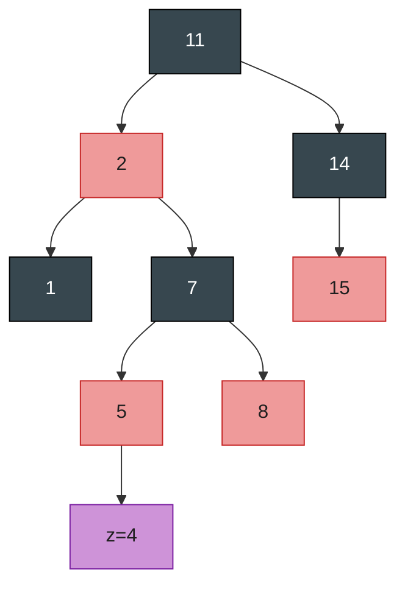

**Case 1 处理**：父 5、叔 8 变黑，祖父 7 变红，z 上移到 7 ↓

**（b）Case 1 后**：z=7 与父 2 都红、叔叔 14 黑 → **Case 2**（z 是右孩子）

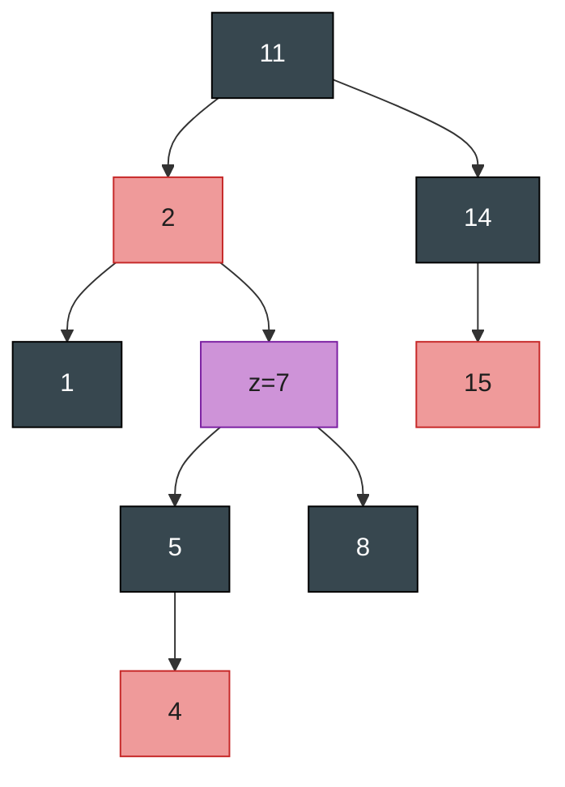

**Case 2 处理**：左旋父 2，z 下移成左孩子 ↓

**（c）Case 2 后**：z=2 是左孩子 → **Case 3**

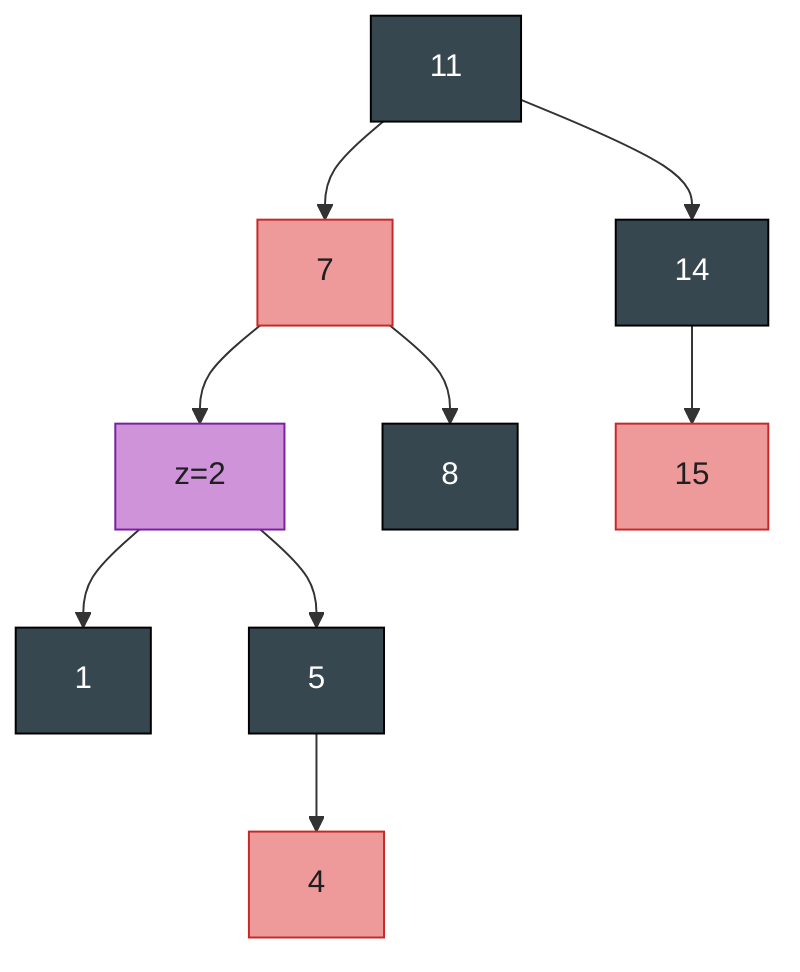

**Case 3 处理**：父 2 变黑、祖父 11 变红，右旋 11 ↓

**（d）Case 3 后**：得到合法红黑树，插入完成

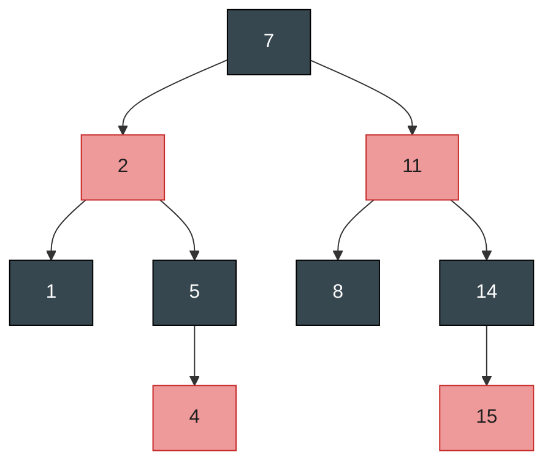

### 图 D / 图 E：三种情况的抽象变换

**Case 1（叔叔红）——纯改色，结构不变，z 上移：**

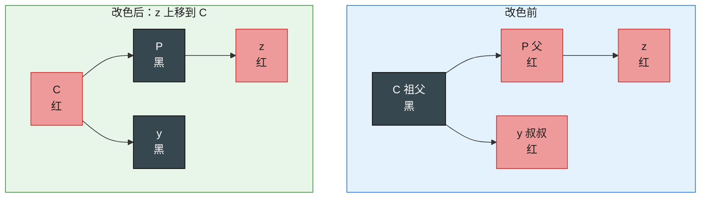

**Case 2 → Case 3（叔叔黑）——旋转改色后循环必结束。**（Case 2：z 是右孩子，先左旋 P 把 z 转成左孩子，即化为下图。）

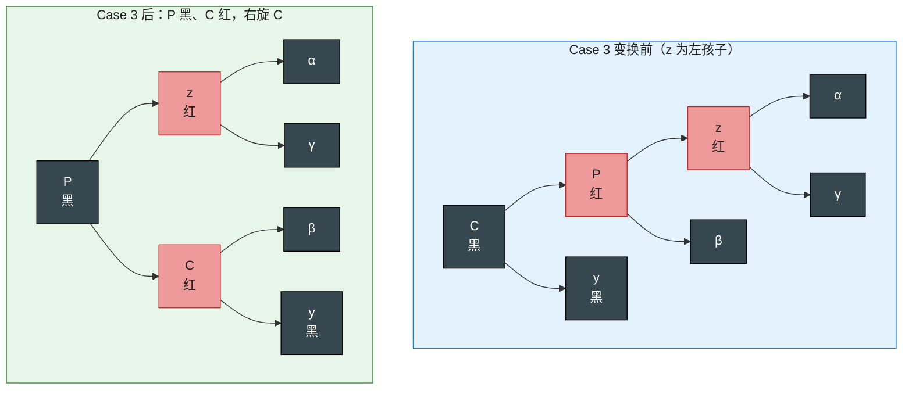

### 4.4 复杂度

- 插入的 BST 部分沿树下降：O(lg n)。
- FIXUP 中只有 Case 1 会重复，每次 z 上移两层，最多 O(lg n) 次。
- **旋转最多 2 次**（Case 2、3 各一次后必终止）。
- **总计 O(lg n)**。

---

## 五、删除 RB-DELETE

删除比插入复杂。先看一个辅助过程，再讲主流程和修复。

### 5.1 RB-TRANSPLANT：用子树 v 替换子树 u

```
RB-TRANSPLANT(T, u, v)
1  if u.p == T.nil      T.root = v
2  elseif u == u.p.left  u.p.left = v
3  else                  u.p.right = v
4  v.p = u.p            // 无条件赋值（即使 v 是 T.nil 也设，后续依赖它）
```

### 5.2 RB-DELETE 主流程（第四版伪代码）

和普通 TREE-DELETE 结构相同，额外跟踪「真正被删/被移走的节点 y」及其原色：

```
RB-DELETE(T, z)
1  y = z
2  y-original-color = y.color
3  if z.left == T.nil
4      x = z.right
5      RB-TRANSPLANT(T, z, z.right)     // 用 z 的右孩子替换 z
6  elseif z.right == T.nil
7      x = z.left
8      RB-TRANSPLANT(T, z, z.left)      // 用 z 的左孩子替换 z
9  else y = TREE-MINIMUM(z.right)       // y 是 z 的后继
10     y-original-color = y.color
11     x = y.right
12     if y ≠ z.right                   // y 在树的更深处？
13         RB-TRANSPLANT(T, y, y.right) // 用 y 的右孩子替换 y
14         y.right = z.right            // z 的右孩子变成
15         y.right.p = y                //   y 的右孩子
16     else x.p = y                     // 以防 x 是 T.nil
17     RB-TRANSPLANT(T, z, y)           // 用后继 y 替换 z
18     y.left = z.left                  // 把 z 的左孩子交给 y
19     y.left.p = y                     // （y 原本没有左孩子）
20     y.color = z.color
21 if y-original-color == BLACK         // 若 y 原为黑，性质可能被破坏
22     RB-DELETE-FIXUP(T, x)            //   修复之
```

> **关键**：x 是「顶替到 y 原位置」的节点。**只有当 y 原本是黑色时才需要修复**——删/移黑节点会让经过它的路径少一个黑节点，违反性质 5。删/移红节点则一切性质照旧：黑高不变（习题 13.4-1），也不会产生红红相邻，根仍黑（红节点不可能是根）。
>
> 第四版第 12/16 行的分工：`y == z.right` 时 y 直接上位，要显式设 `x.p = y`（即使 x 是哨兵也要设，FIXUP 会读 x.p）；`y ≠ z.right` 时 x.p 由 RB-TRANSPLANT 设好。

### 5.3「双黑」概念：修复的核心思想

删掉黑节点 y 后，顶替它的 x 所在路径少了一个黑。修复办法：**把 y 的「黑」转嫁给 x**，于是 x 成了「**双黑**」（本身黑 + 额外黑）或「红黑」。此时性质 5 形式上成立，但违反性质 1（颜色应是单色）。注意「双黑」不是颜色属性——额外黑体现在**指针 x 指向该节点**这件事上。修复循环的目标就是**把这个「额外黑」沿树上移，直到**：

1. x 指向红黑节点 → 把它染成（单）黑，结束；或
2. x 到达根 → 额外黑自然消失；或
3. 通过旋转+改色把额外黑消化掉，结束。

### 5.4 四种情况（x 是左孩子；右孩子对称）

记 x 的兄弟为 w。x 是双黑，故 w 不可能是 nil（否则两条路径黑数不等）。

| 情况 | 条件 | 处理 | 之后 |
|------|------|------|------|
| **Case 1** | w 红 | 互换 w 与 x.p 颜色，左旋 x.p；新 w 变黑 | 转入 2/3/4 |
| **Case 2** | w 黑，w 两子都黑 | w 变红，x 上移到 x.p（额外黑上移） | **唯一可能重复循环** |
| **Case 3** | w 黑，w 左子红、右子黑 | 互换 w 与 w.left 颜色，右旋 w；新 w 变成「黑+右子红」 | 转入 Case 4 |
| **Case 4** | w 黑，w 右子红 | w 取 x.p 颜色，x.p 变黑，w.right 变黑，左旋 x.p | 额外黑消失，**结束** |

> 和插入对称：**只有 Case 2 可能让循环重复**（额外黑上移一层，最多 O(lg n) 次）；Case 1/3/4 都在常数次旋转后终止。**整个删除最多 3 次旋转**。

### 图 F：四种情况的变换（前 → 后）

紫色 = 带额外黑的双黑节点 x；c / c′ 表示「颜色不定」的继承色；各子树（α、β、…）位置不动，只画关键节点。

**Case 1：w 红** —— w 红则其父与其两子必黑。互换 w 与 P 颜色、左旋 P，新 w 变黑，转入 Case 2/3/4。

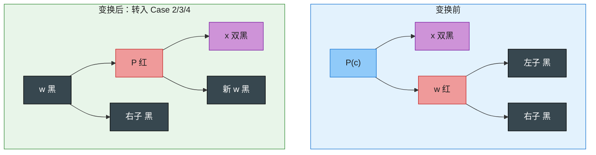

**Case 2：w 黑、两子都黑** —— w 变红，x 与 w 各「吐出」一个黑给 P：额外黑上移到 P（P 成为新 x）。若 P 本红（c=红）则它是「红黑」，出循环后染黑即结束；若 P 本黑则变双黑，继续循环。这是唯一可能重复的情况。

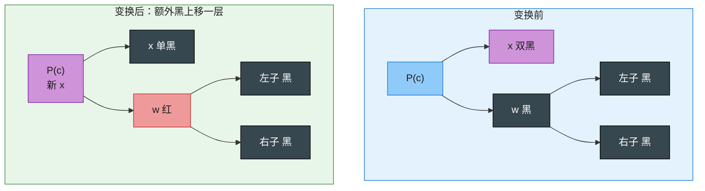

**Case 3：w 黑、左红右黑** —— 互换 w 与 w.left 颜色、右旋 w：c 上提变黑，w 下沉变红。新 w（= c）是「黑 + 右子红」，化为 Case 4。

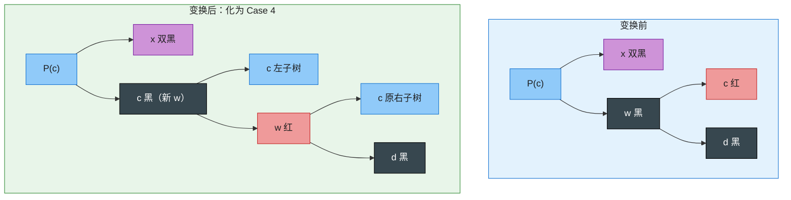

**Case 4：w 黑、右子红** —— w 取 P 的颜色，P 变黑，w.right 变黑，左旋 P。x 的额外黑消失，循环结束。

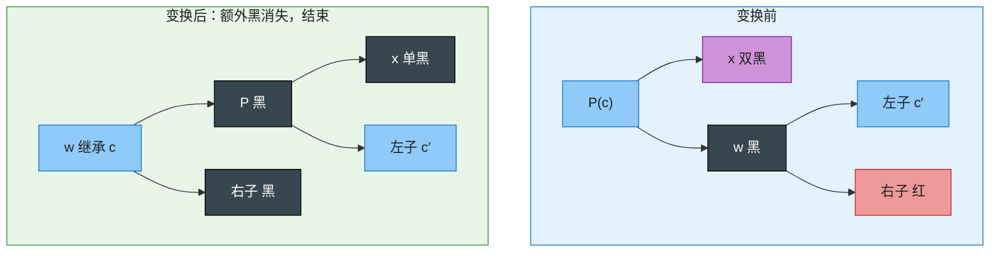

### 5.5 复杂度

- 删除下降 + 后继查找：O(lg n)。
- FIXUP 中仅 Case 2 重复，x 每次上移一层，最多 O(lg n) 次，且不旋转。
- **旋转最多 3 次**（Case 1/3/4 合计贡献，各为常数次）。
- **总计 O(lg n)**。

---

## 六、代码实现

Java + Python 双实现，均为「哨兵 NIL + 对象化节点」风格，与伪代码一一对应。两份代码都经过随机增删对拍 + 五性质自检验证。

### 6.1 Java

```java
/**
 * 红黑树（CLRS 第 13 章，第四版）。所有操作 O(lg n)。
 * 用单个哨兵 NIL 代替所有空指针；NIL 为黑。
 */
public class RedBlackTree {
    private static final boolean RED = true;
    private static final boolean BLACK = false;

    private final Node NIL;
    private Node root;

    private static class Node {
        int key; Object value; boolean color;
        Node left, right, parent;
        Node(int key, Object value, boolean color) {
            this.key = key; this.value = value; this.color = color;
        }
    }

    public RedBlackTree() {
        NIL = new Node(0, null, BLACK);
        NIL.left = NIL.right = NIL.parent = NIL;
        root = NIL;
    }

    // ---------- 公开操作 ----------
    public void insert(int key, Object value) {
        Node z = new Node(key, value, RED);
        z.left = z.right = NIL;
        Node y = NIL, x = root;
        while (x != NIL) {                 // BST 下沉找位置
            y = x;
            if (key < x.key) x = x.left;
            else if (key > x.key) x = x.right;
            else { x.value = value; return; }   // 已存在则更新
        }
        z.parent = y;
        if (y == NIL) root = z;
        else if (key < y.key) y.left = z;
        else y.right = z;
        insertFixup(z);
    }

    public boolean delete(int key) {
        Node z = find(key);
        if (z == NIL) return false;
        deleteNode(z);
        return true;
    }

    public Object get(int key) {
        Node n = find(key);
        return n == NIL ? null : n.value;
    }

    private Node find(int key) {
        Node x = root;
        while (x != NIL && key != x.key)
            x = key < x.key ? x.left : x.right;
        return x;
    }

    // ---------- 插入修复 ----------
    private void insertFixup(Node z) {
        while (z.parent.color == RED) {
            if (z.parent == z.parent.parent.left) {        // 父是左孩子
                Node y = z.parent.parent.right;            // 叔叔
                if (y.color == RED) {                      // Case 1
                    z.parent.color = BLACK;
                    y.color = BLACK;
                    z.parent.parent.color = RED;
                    z = z.parent.parent;
                } else {
                    if (z == z.parent.right) {             // Case 2
                        z = z.parent;
                        leftRotate(z);
                    }
                    z.parent.color = BLACK;                // Case 3
                    z.parent.parent.color = RED;
                    rightRotate(z.parent.parent);
                }
            } else {                                       // 父是右孩子，对称
                Node y = z.parent.parent.left;
                if (y.color == RED) {
                    z.parent.color = BLACK;
                    y.color = BLACK;
                    z.parent.parent.color = RED;
                    z = z.parent.parent;
                } else {
                    if (z == z.parent.left) {
                        z = z.parent;
                        rightRotate(z);
                    }
                    z.parent.color = BLACK;
                    z.parent.parent.color = RED;
                    leftRotate(z.parent.parent);
                }
            }
        }
        root.color = BLACK;
    }

    // ---------- 删除 ----------
    private void deleteNode(Node z) {
        Node y = z;
        boolean yOriginalColor = y.color;
        Node x;
        if (z.left == NIL) {                              // 无左子
            x = z.right;
            transplant(z, z.right);
        } else if (z.right == NIL) {                      // 无右子
            x = z.left;
            transplant(z, z.left);
        } else {                                          // 两子：后继顶替
            y = minimum(z.right);
            yOriginalColor = y.color;
            x = y.right;
            if (y != z.right) {                           // y 比 z.right 更深
                transplant(y, y.right);
                y.right = z.right;
                y.right.parent = y;
            } else {
                x.parent = y;                             // 即便 x 是 NIL 也要设
            }
            transplant(z, y);
            y.left = z.left;
            y.left.parent = y;
            y.color = z.color;
        }
        if (yOriginalColor == BLACK) deleteFixup(x);      // 删黑节点才修复
    }

    private void deleteFixup(Node x) {
        while (x != root && x.color == BLACK) {
            if (x == x.parent.left) {                     // x 是左孩子
                Node w = x.parent.right;                  // 兄弟
                if (w.color == RED) {                     // Case 1
                    w.color = BLACK;
                    x.parent.color = RED;
                    leftRotate(x.parent);
                    w = x.parent.right;
                }
                if (w.left.color == BLACK && w.right.color == BLACK) {   // Case 2
                    w.color = RED;
                    x = x.parent;
                } else {
                    if (w.right.color == BLACK) {         // Case 3
                        w.left.color = BLACK;
                        w.color = RED;
                        rightRotate(w);
                        w = x.parent.right;
                    }
                    w.color = x.parent.color;             // Case 4
                    x.parent.color = BLACK;
                    w.right.color = BLACK;
                    leftRotate(x.parent);
                    x = root;
                }
            } else {                                      // x 是右孩子，对称
                Node w = x.parent.left;
                if (w.color == RED) {
                    w.color = BLACK;
                    x.parent.color = RED;
                    rightRotate(x.parent);
                    w = x.parent.left;
                }
                if (w.right.color == BLACK && w.left.color == BLACK) {
                    w.color = RED;
                    x = x.parent;
                } else {
                    if (w.left.color == BLACK) {
                        w.right.color = BLACK;
                        w.color = RED;
                        leftRotate(w);
                        w = x.parent.left;
                    }
                    w.color = x.parent.color;
                    x.parent.color = BLACK;
                    w.left.color = BLACK;
                    rightRotate(x.parent);
                    x = root;
                }
            }
        }
        x.color = BLACK;
    }

    // ---------- 旋转与辅助 ----------
    private void leftRotate(Node x) {
        Node y = x.right;
        x.right = y.left;
        if (y.left != NIL) y.left.parent = x;
        y.parent = x.parent;
        if (x.parent == NIL) root = y;
        else if (x == x.parent.left) x.parent.left = y;
        else x.parent.right = y;
        y.left = x;
        x.parent = y;
    }

    private void rightRotate(Node y) {
        Node x = y.left;
        y.left = x.right;
        if (x.right != NIL) x.right.parent = y;
        x.parent = y.parent;
        if (y.parent == NIL) root = x;
        else if (y == y.parent.right) y.parent.right = x;
        else y.parent.left = x;
        x.right = y;
        y.parent = x;
    }

    private void transplant(Node u, Node v) {             // v 替换 u
        if (u.parent == NIL) root = v;
        else if (u == u.parent.left) u.parent.left = v;
        else u.parent.right = v;
        v.parent = u.parent;                              // 无条件（v 可能是 NIL）
    }

    private Node minimum(Node n) {
        while (n.left != NIL) n = n.left;
        return n;
    }

    public static void main(String[] args) {
        RedBlackTree t = new RedBlackTree();
        for (int k : new int[]{7, 3, 18, 10, 22, 8, 11, 26}) t.insert(k, k);
        t.delete(18);
        t.delete(11);
        System.out.println(t.get(10));   // 10
        System.out.println(t.get(18));   // null
    }
}
```

### 6.2 Python

```python
"""红黑树（CLRS 第 13 章，第四版）。所有操作 O(lg n)。
用单个哨兵 NIL 代替所有空指针；NIL 为黑。"""

RED, BLACK = True, False


class RedBlackTree:
    class Node:
        __slots__ = ("key", "value", "color", "left", "right", "parent")

        def __init__(self, key=None, value=None, color=BLACK):
            self.key, self.value, self.color = key, value, color

    def __init__(self):
        self.NIL = self.Node(color=BLACK)
        self.NIL.left = self.NIL.right = self.NIL.parent = self.NIL
        self.root = self.NIL

    # ---------- 公开操作 ----------
    def insert(self, key, value=None):
        z = self.Node(key, value, RED)
        z.left = z.right = self.NIL
        y, x = self.NIL, self.root
        while x is not self.NIL:              # BST 下沉找位置
            y = x
            if key < x.key:
                x = x.left
            elif key > x.key:
                x = x.right
            else:                             # 已存在则更新
                x.value = value
                return
        z.parent = y
        if y is self.NIL:
            self.root = z
        elif key < y.key:
            y.left = z
        else:
            y.right = z
        self._insert_fixup(z)

    def delete(self, key):
        z = self._find(key)
        if z is self.NIL:
            return False
        self._delete_node(z)
        return True

    def get(self, key, default=None):
        n = self._find(key)
        return default if n is self.NIL else n.value

    def _find(self, key):
        x = self.root
        while x is not self.NIL and key != x.key:
            x = x.left if key < x.key else x.right
        return x

    # ---------- 插入修复 ----------
    def _insert_fixup(self, z):
        while z.parent.color == RED:
            if z.parent is z.parent.parent.left:      # 父是左孩子
                y = z.parent.parent.right             # 叔叔
                if y.color == RED:                    # Case 1
                    z.parent.color = BLACK
                    y.color = BLACK
                    z.parent.parent.color = RED
                    z = z.parent.parent
                else:
                    if z is z.parent.right:           # Case 2
                        z = z.parent
                        self._left_rotate(z)
                    z.parent.color = BLACK            # Case 3
                    z.parent.parent.color = RED
                    self._right_rotate(z.parent.parent)
            else:                                     # 父是右孩子，对称
                y = z.parent.parent.left
                if y.color == RED:
                    z.parent.color = BLACK
                    y.color = BLACK
                    z.parent.parent.color = RED
                    z = z.parent.parent
                else:
                    if z is z.parent.left:
                        z = z.parent
                        self._right_rotate(z)
                    z.parent.color = BLACK
                    z.parent.parent.color = RED
                    self._left_rotate(z.parent.parent)
        self.root.color = BLACK

    # ---------- 删除 ----------
    def _delete_node(self, z):
        y = z
        y_original_color = y.color
        if z.left is self.NIL:                        # 无左子
            x = z.right
            self._transplant(z, z.right)
        elif z.right is self.NIL:                     # 无右子
            x = z.left
            self._transplant(z, z.left)
        else:                                         # 两子：后继顶替
            y = self._minimum(z.right)
            y_original_color = y.color
            x = y.right
            if y is not z.right:                      # y 比 z.right 更深
                self._transplant(y, y.right)
                y.right = z.right
                y.right.parent = y
            else:
                x.parent = y                          # 即便 x 是 NIL 也要设
            self._transplant(z, y)
            y.left = z.left
            y.left.parent = y
            y.color = z.color
        if y_original_color == BLACK:                 # 删黑节点才修复
            self._delete_fixup(x)

    def _delete_fixup(self, x):
        while x is not self.root and x.color == BLACK:
            if x is x.parent.left:                    # x 是左孩子
                w = x.parent.right                    # 兄弟
                if w.color == RED:                    # Case 1
                    w.color = BLACK
                    x.parent.color = RED
                    self._left_rotate(x.parent)
                    w = x.parent.right
                if w.left.color == BLACK and w.right.color == BLACK:   # Case 2
                    w.color = RED
                    x = x.parent
                else:
                    if w.right.color == BLACK:        # Case 3
                        w.left.color = BLACK
                        w.color = RED
                        self._right_rotate(w)
                        w = x.parent.right
                    w.color = x.parent.color          # Case 4
                    x.parent.color = BLACK
                    w.right.color = BLACK
                    self._left_rotate(x.parent)
                    x = self.root
            else:                                     # x 是右孩子，对称
                w = x.parent.left
                if w.color == RED:
                    w.color = BLACK
                    x.parent.color = RED
                    self._right_rotate(x.parent)
                    w = x.parent.left
                if w.right.color == BLACK and w.left.color == BLACK:
                    w.color = RED
                    x = x.parent
                else:
                    if w.left.color == BLACK:
                        w.right.color = BLACK
                        w.color = RED
                        self._left_rotate(w)
                        w = x.parent.left
                    w.color = x.parent.color
                    x.parent.color = BLACK
                    w.left.color = BLACK
                    self._right_rotate(x.parent)
                    x = self.root
        x.color = BLACK

    # ---------- 旋转与辅助 ----------
    def _left_rotate(self, x):
        y = x.right
        x.right = y.left
        if y.left is not self.NIL:
            y.left.parent = x
        y.parent = x.parent
        if x.parent is self.NIL:
            self.root = y
        elif x is x.parent.left:
            x.parent.left = y
        else:
            x.parent.right = y
        y.left = x
        x.parent = y

    def _right_rotate(self, y):
        x = y.left
        y.left = x.right
        if x.right is not self.NIL:
            x.right.parent = y
        x.parent = y.parent
        if y.parent is self.NIL:
            self.root = x
        elif y is y.parent.right:
            y.parent.right = x
        else:
            y.parent.left = x
        x.right = y
        y.parent = x

    def _transplant(self, u, v):                      # v 替换 u
        if u.parent is self.NIL:
            self.root = v
        elif u is u.parent.left:
            u.parent.left = v
        else:
            u.parent.right = v
        v.parent = u.parent                           # 无条件（v 可能是 NIL）

    def _minimum(self, n):
        while n.left is not self.NIL:
            n = n.left
        return n

    def inorder(self):
        out = []

        def walk(n):
            if n is self.NIL:
                return
            walk(n.left)
            out.append(n.key)
            walk(n.right)

        walk(self.root)
        return out


if __name__ == "__main__":
    t = RedBlackTree()
    for k in [7, 3, 18, 10, 22, 8, 11, 26]:
        t.insert(k, k)
    t.delete(18)
    t.delete(11)
    print(t.inorder())   # [3, 7, 8, 10, 22, 26]
    print(t.get(10))     # 10
```

> **实战提示**：工程里不要手写红黑树。Java 直接用 `java.util.TreeMap` / `TreeSet`（基于红黑树），支持 `put/get/remove` O(lg n)、有序遍历、范围查询（`subMap` / `headMap` / `tailMap`）与 `floorKey` / `ceilingKey`；Python 标准库没有红黑树，用第三方库 `sortedcontainers`（`SortedDict` / `SortedSet`）；C++ 用 `std::map` / `std::set`。

---

## 七、复杂度速查与易混点

### 7.1 速查表

| 项目 | 结论 | 说明 |
|------|------|------|
| 树高 | ≤ 2 lg(n+1) | 最长路径 ≤ 2× 最短路径 |
| SEARCH / MIN / MAX / SUCCESSOR / PREDECESSOR | O(lg n) | 继承第 12 章，不碰颜色 |
| INSERT / DELETE | O(lg n) | 含 FIXUP；循环只在 Case 1（插入）/ Case 2（删除）重复 |
| 旋转次数 | 插入 ≤ 2，删除 ≤ 3 | 其余情况只改色、不旋转 |
| 每节点额外空间 | 1 bit（颜色） | 对比 AVL 要存高度/平衡因子 |

### 7.2 易混点对比

| 易混点 | 辨析 |
|--------|------|
| 黑高 bh(x) ≠ 高度 h(x) | 黑高只数**黑节点**、不含 x、含 NIL 叶；高度数边。bh(root) ≥ h/2 |
| 「最长 ≤ 2× 最短」 | 是性质 4+5 的**推论**，不是定义本身（习题 13.1-5） |
| 插入的违例 | 只可能是性质 2（根变红）或性质 4（红红相邻）——因为新节点染红 |
| 删除的违例 | 仅当被删/被移的 **y 原色为黑**才需修复；删红节点无需任何处理 |
| 「双黑」 | 不是颜色属性，是「额外一黑挂在指针 x 上」的概念；x 的 color 仍是红或黑 |
| 插入看叔叔，删除看兄弟 | 插入：叔红 = Case 1 改色上移，叔黑 = Case 2/3 旋转收尾；删除：兄红 = Case 1 转换，兄黑再看两侄（双黑侄 = 2 上移，近红远黑 = 3 变形，远红 = 4 收尾） |

### 7.3 红黑树 vs AVL 树

| 特性 | 红黑树 | AVL 树 |
|------|--------|--------|
| 平衡严格度 | 近似（最长 ≤ 2× 最短） | 严格（高度差 ≤ 1） |
| 树高 | ≤ 2 lg(n+1) | ≤ 1.44 lg(n+2)（更矮） |
| 查找 | 略慢（树稍高） | **更快** |
| 插入/删除 | **更快**（旋转少：插入 ≤2、删除 ≤3） | 较慢（插入最多 O(lg n) 次旋转） |
| 每节点额外空间 | 1 bit（颜色） | int（高度差） |
| 适用场景 | **通用、读写均衡**（语言标准库首选） | 查找远多于修改 |

> **选择建议**：读写均衡或写多于读 → 红黑树（这也是为何主流标准库用它）；查找密集、几乎不改 → AVL 树；海量数据 / 磁盘索引 → B+ 树（第 18 章，不是红黑树）。

### 7.4 典型应用

| 应用 | 用法 |
|------|------|
| Java `TreeMap` / `TreeSet` | 有序映射 / 集合，O(lg n) 增删查 + 范围查询 |
| C++ `std::map` / `std::set` / `std::multimap` | STL 有序关联容器 |
| Linux CFS 调度器 | 以虚拟运行时间为 key，O(1) 取下一个进程 |
| Linux `epoll` / `nginx` 定时器 | 用红黑树管理定时事件，O(lg n) 插入、O(1) 取最早到期 |

LeetCode 上没有「手写红黑树」的题，考的是**会用有序容器**——见 8.1 题单。

---

## 八、精选习题与题单

### 8.1 LeetCode 题单（有序容器 TreeMap / TreeSet / SortedDict 实战）

| 题号 | 题目 | 难度 | 考点 |
|------|------|------|------|
| 110 | 平衡二叉树 | 简单 | 「平衡」的判定：高度差 ≤ 1（AVL 式严格平衡） |
| 1382 | 将二叉搜索树变平衡 | 中等 | BST 退化成链 → 中序取出有序数组 + 分治重建（本章动机的实战版） |
| 729 | 我的日程安排表 I | 中等 | TreeMap：`floorKey` / `ceilingKey` 查相邻区间是否冲突 |
| 731 | 我的日程安排表 II | 中等 | TreeMap：区间重叠计数 |
| 732 | 我的日程安排表 III | 困难 | TreeMap 差分：端点计数 + 有序扫描 |
| 715 | Range 模块 | 困难 | TreeMap：区间的增删查与合并 |
| 855 | 考场就座 | 中等 | TreeSet：维护有序空位、动态取最宽空档 |
| 220 | 存在重复元素 III | 困难 | TreeSet 滑动窗口：`ceiling` 找「≥ x 的最小值」 |
| 981 | 基于时间的键值存储 | 中等 | TreeMap：`floorKey` 取「≤ t 的最大时间戳」 |

### 8.2 CLRS 习题快问快答（第四版题号）

| 习题 | 要点 |
|------|------|
| 13.1-4 | 让每个黑节点「吸收」它的红孩子：黑节点的度变为 2/3/4，且所有叶子同深度——这正是红黑树与 **2-3-4 树**的对应关系 |
| 13.1-5 | 最长路径 ≤ 2× 最短：最短全黑（= bh），最长黑红交替（红 ≤ 黑），故 ≤ 2·bh |
| 13.1-6 | 黑高 k 的树：内部节点最多 2^(2k) − 1（高 2k 的完美树、红黑交替），最少 2^k − 1（全黑完美树） |
| 13.1-8 | 红节点不可能恰有一个非 NIL 孩子：该孩子必黑 ⇒ 经它的路径比 NIL 一侧多至少一个黑，违反性质 5 |
| 13.2-2 | n 节点 BST 恰有 n−1 个可旋转位置——每条「非根节点与其父」的边对应一个 |
| 13.3-2 | 依次插入 41, 38, 31, 12, 19, 8，最终树：`38B( 19R( 12B(8R, –), 31B ), 41B )` |
| 13.3-4 | FIXUP 不会把 T.nil 染红：改色只触及 z.p / z.p.p / y；z.p 红 ⇒ z.p 非根 ⇒ 祖父存在且非 NIL；y 为黑（含 NIL）时根本不进 Case 1 |
| 13.4-4 | 接上题，依次删 8, 12, 19, 31, 38, 41：删红叶子 8 直接删；删 12 走 Case 2（31 变红、额外黑移到 19 后染黑）；删 19 后顶替的 x 为红、直接染黑；删 31 走 Case 2（41 变红，额外黑到根消失）；删 38 由 41 顶替并染黑；删 41 得空树 |
| 13.4-8 | 插入 x 再立即删除，树**不一定还原**。反例：`2B(1R, 3R)` 插入 4 → Case 1 改色成 `2B(1B, 3B(–, 4R))`，再删 4 后 1、3 仍是黑 |

### 8.3 思考题与章末注记（第四版）

**思考题 13-1 持久动态集合**：保留树的每个历史版本。做法是不改旧节点，只复制「从根到修改点」路径上的节点（路径复制），新旧版本共享其余子树——每次插入 O(h) 时间与空间。若节点带父指针，则复制会传染整棵树，退化为 Ω(n)。

**思考题 13-2 红黑树的 join**：给定 `T1` 所有键 ≤ x ≤ `T2` 所有键，把三者拼成一棵红黑树。给树维护黑高属性 `T.bh`（可在节点访问过程中 O(1) 递推，不增加渐进开销）；在黑高大的那棵树里下降到黑高等于对方的黑节点 y，以 x（染红）为连接点拼接，再做一次插入式修复，总共 O(lg n)。

**思考题 13-3 AVL 树**：每节点维护高度，要求左右子树高差 ≤ 1。高 h 的 AVL 树节点数至少为斐波那契数 F_h ⇒ 高 O(lg n)。插入沿路径自底向上用 BALANCE（旋转）修复，时间 O(lg n)，但旋转可达 O(lg n) 次——对比红黑树插入最多 2 次旋转，这正是「严格平衡 vs 近似平衡」的取舍。

**章末注记（历史与变种）**：红黑树由 **Bayer**（1972）以「对称二叉 B 树」之名发明，**Guibas & Sedgewick**（1978）引入红/黑着色约定。简化变种：**Andersson 的 AA 树**、**Sedgewick-Wayne 的左倾红黑树**（借 2-3 树视角，只有左孩子可红）代码更短，但每次操作的旋转次数不再是常数——扩充数据结构（第 17 章）里旋转要顺带维护附加属性，常数旋转上界很关键。近亲还有 **treap**（BST + 堆的混合）、**splay 树**（自适应，摊还 O(lg n)，摊还分析见第 16 章）、**skip list**（期望 O(lg n) 的概率型结构）。

---

## 九、本章要点回顾

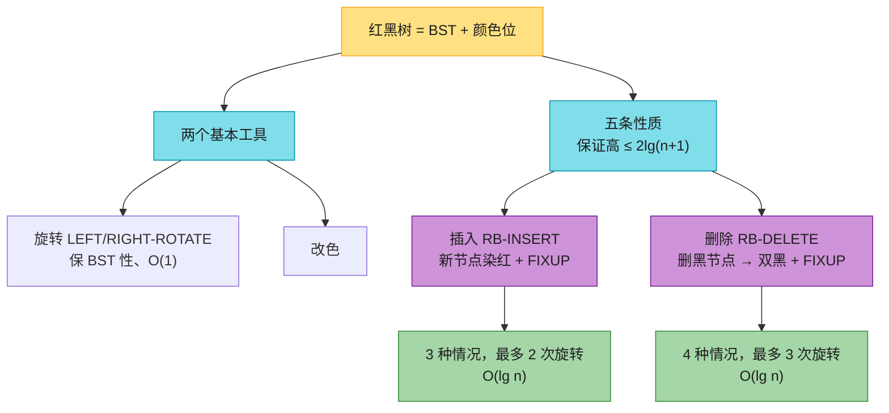

**一句话记忆**：
- 红黑树用**五条颜色性质**把 BST 高度压到 O(lg n)；
- 所有平衡修复只靠**旋转 + 改色**：插入染红最多违「红红相邻」，3 种情况最多 2 旋；删除黑节点产生「双黑」，4 种情况最多 3 旋；
- 两者最坏都是 **O(lg n)**，且旋转次数是常数——这是它适合做通用有序容器（`TreeMap`/`std::map`）的根本原因。
