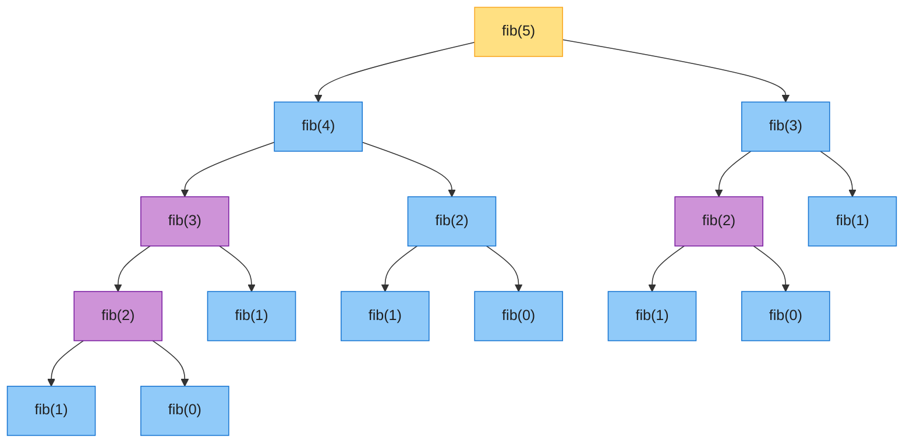
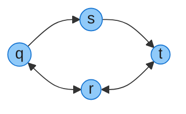
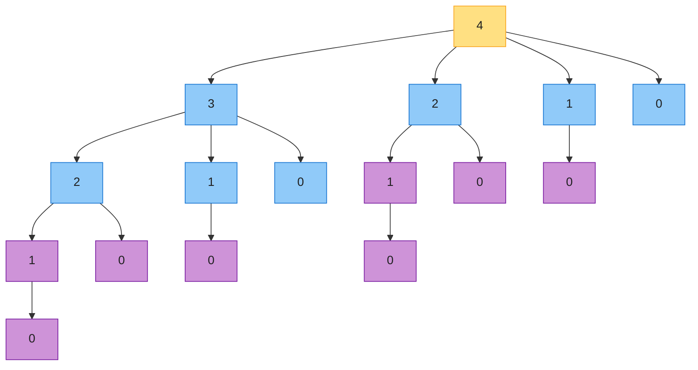
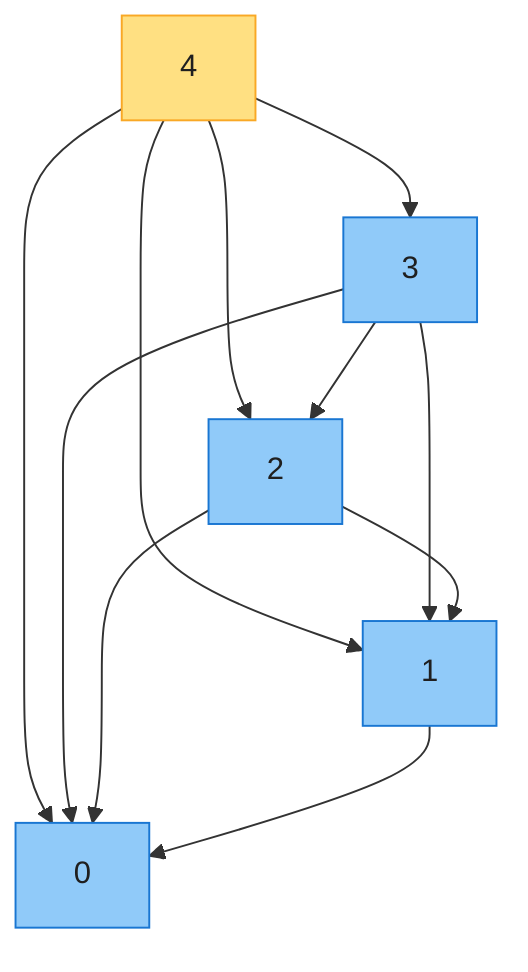
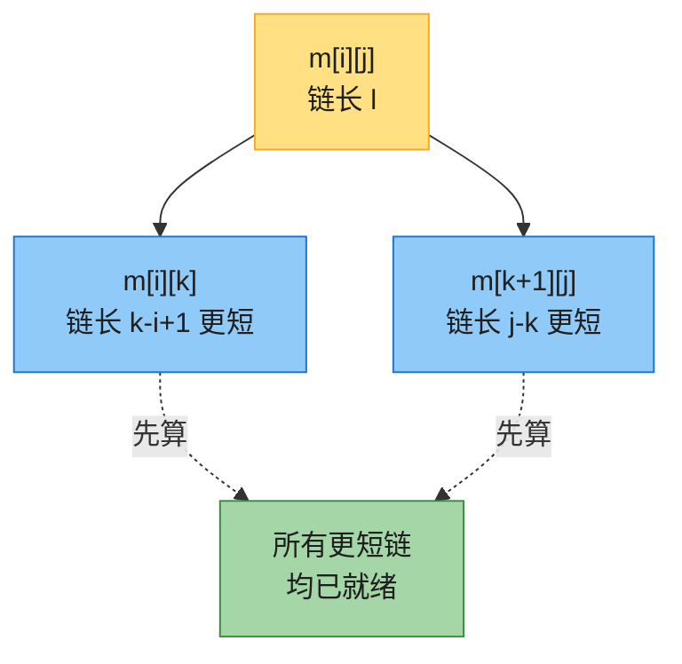
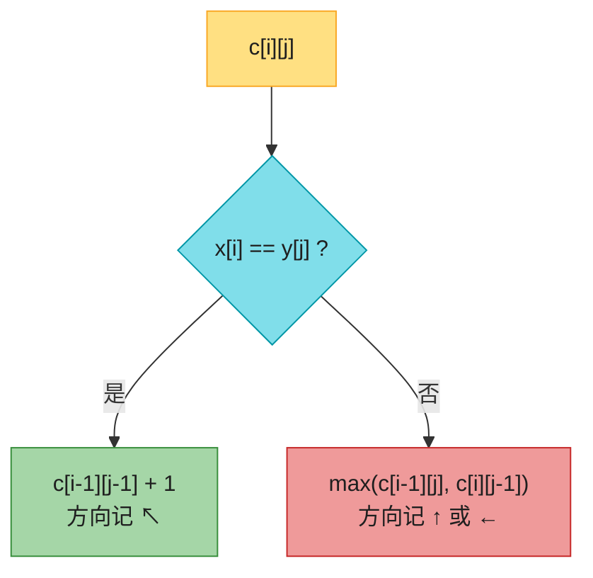
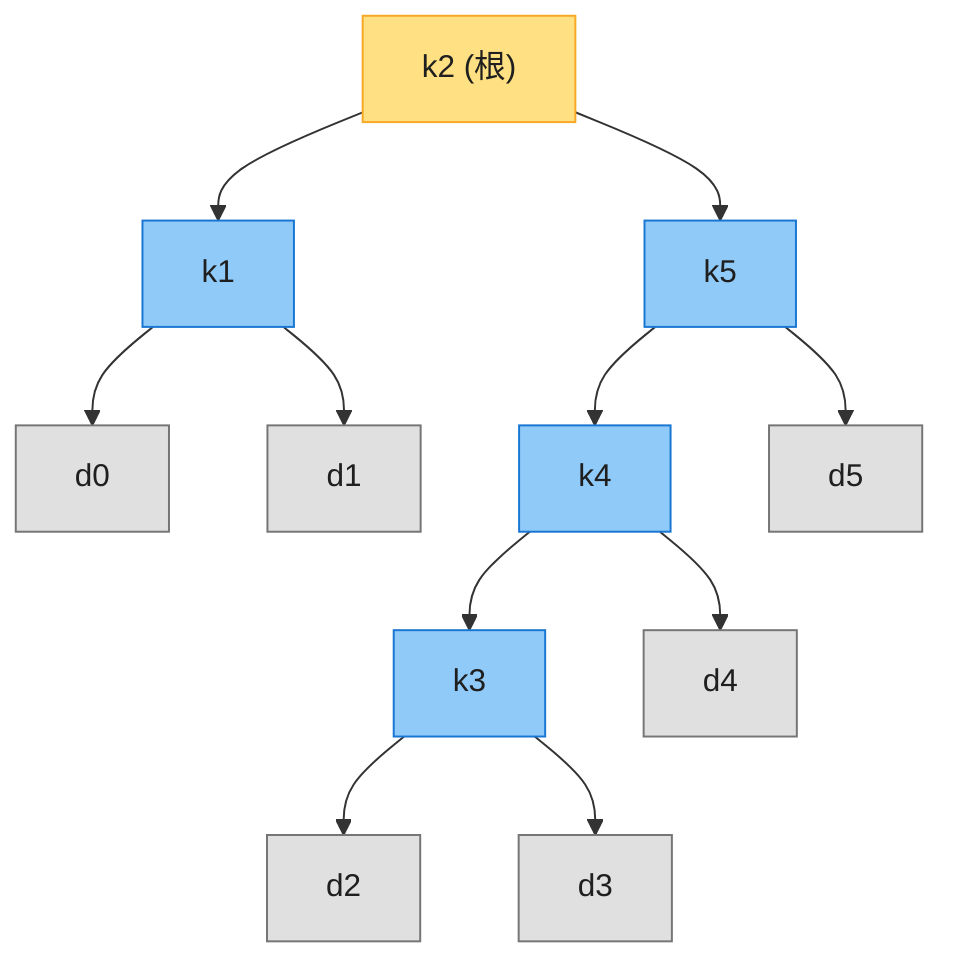
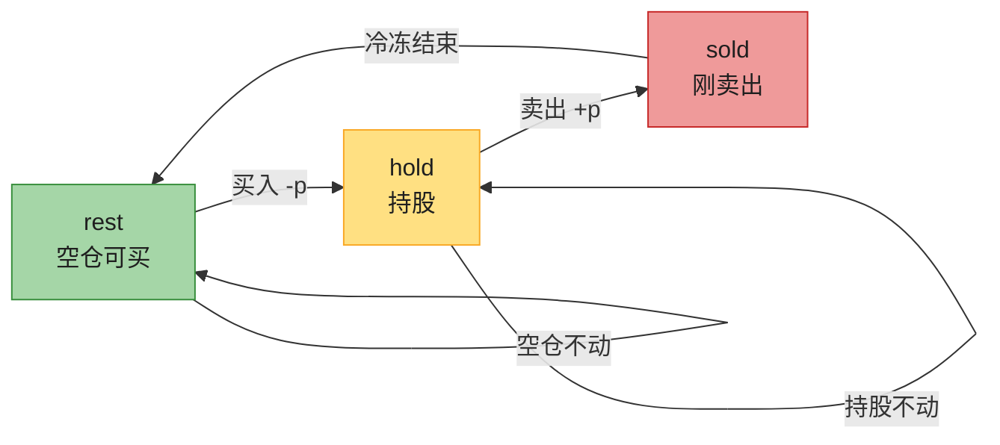
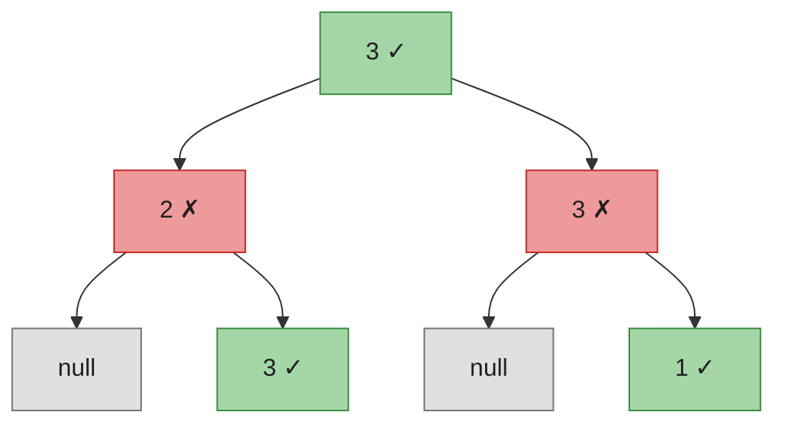
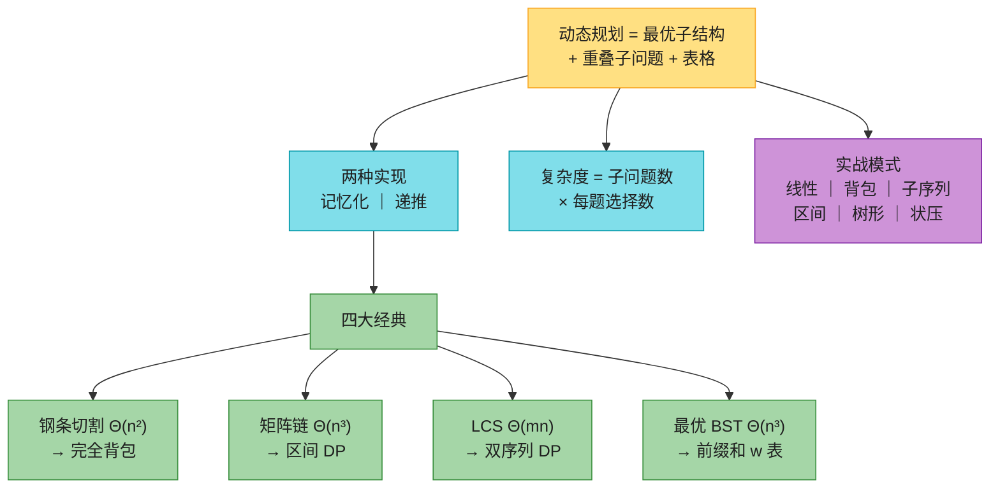

# 第十四章：动态规划（Dynamic Programming）——深度详解版

> **本章定位**：第 2、4 章的**分治**把问题拆成**互不重叠**的子问题（如归并排序，左右两半各算各的）；而现实中大量最优化问题的子问题是**重叠**的——同一个子问题会被反复求解。动态规划（DP）就是：**子问题重叠 + 最优解能由子问题最优解拼出**时，每个子问题只解一次、存表备查，把指数级递归压成多项式时间。这里的 "programming" 指**表格法**（tabular method），不是写代码。
>
> 这是**算法面试中区分度最高**的一章，没有之一。LeetCode 中等以上题目约四分之一带 DP 标签。本章先按 CLRS 第四版主线讲透四个经典（钢条切割 → 矩阵链 → LCS → 最优 BST），再系统整理 LeetCode 七大实战模式。
>
> 与后续章节的关系：第 15 章**贪心**处理的正是「有最优子结构、但不用枚举所有子问题」的特例（能贪心选择就不必 DP）；第 16 章**摊还分析**与本章的「子问题图计数」分析遥相呼应。

---

## 一、核心思想：从「重复计算」到「记忆化」

### 1.1 引子：斐波那契的递归灾难

斐波那契数列：F(0) = 0，F(1) = 1，F(n) = F(n−1) + F(n−2)。直接翻译递归式：

```java
public int fib(int n) {
    if (n <= 1) return n;
    return fib(n - 1) + fib(n - 2);   // 时间 O(2^n)：同一子问题反复重算
}
```

**递归树（n=5）**——紫色节点是被重复计算的子问题，fib(3) 算 2 次、fib(2) 算 3 次、fib(1) 算 5 次：



修复方法朴素到极致：**算过的就存下来，再遇到直接查表**。O(1) 空间的滚动写法（打家劫舍等线性 DP 的终极形态都长这样）：

```python
def fib(n):                    # 滚动变量：a=F(i-2), b=F(i-1)
    a, b = 0, 1
    for _ in range(n):
        a, b = b, a + b
    return a                   # F(10) = 55
```

两种等价做法：

| | 记忆化搜索（自顶向下） | 递推填表（自底向上） |
|---|---|---|
| 写法 | 递归 + 备忘录，先查表再算 | 按子问题规模从小到大循环填表 |
| 控制流 | 从大问题递归向下 | 从小问题迭代向上 |
| 时间 | Θ(n) | Θ(n)，**常数更小**（无递归开销） |
| 求解范围 | 只算**真正被需要**的子问题 | 一律全算 |
| 栈深度 | O(n) 递归栈（可能爆栈） | O(1)～O(n) 表 |

### 1.2 动态规划的两个标志（CLRS 14.3）

一个问题能用 DP，必须同时具备：

1. **最优子结构（optimal substructure）**：原问题的最优解**包含**子问题的最优解。论证套路是「**剪贴法**」（cut-and-paste）：假设最优解里某个子问题的解不是最优，那把更优的子问题解「剪贴」进来，原问题就能得到更优解——矛盾。
2. **重叠子问题（overlapping subproblems）**：朴素递归会**反复**遇到同一批子问题，且不同子问题总数是多项式级。对比：归并排序每层的子数组互不重叠 → 记忆化毫无用处（习题 14.3-2）。

> **「无后效性」**（面试常说的第三条）：一个状态的值只由它的前驱状态决定，与「如何到达这个状态」无关。它其实是状态定义是否干净的判据——若转移时需要知道历史路径，说明状态设计少了维度。

**反例（CLRS 14.3 Subtleties，极易踩坑）**：无权有向图的**最长简单路径**没有最优子结构。



- q→t 的最长简单路径是 `q→r→t`（2 条边）；
- 但子路径 q→r **不是** q 到 r 的最长简单路径（`q→s→t→r` 有 3 条边，更长）！
- 原因：两个子问题**不独立**——子路径共享顶点资源，一个子问题用掉了顶点 s、t，另一个就不能再用，拼起来可能不是简单路径。
- 对比：**最短路径**的子问题天然独立（若 w 在最短路径上，两段可随意拼接），所以最短路径有最优子结构（第 22/23 章的算法都建立在这点上）。最长简单路径是 NP-complete 问题，不存在已知的多项式算法。

### 1.3 设计 DP 的四步与复杂度速算

CLRS 给出的标准流程（§14.1、§14.2 两个例子都严格走这四步）：

1. **刻画最优解的结构**（找到最优子结构）；
2. **递归定义最优解的值**（写出状态转移方程）；
3. **自底向上算出最优值**（填表；也可用记忆化）；
4. **由计算出的信息重构最优解**（只要答案数值时可省略；通常额外维护一张「选择表」，如钢条的 s、矩阵链的 s、LCS 的 b）。

**复杂度速算公式**（CLRS 14.3）：

> **运行时间 ≈ 不同子问题的个数 × 每个子问题需要考察的选择数**

| 问题 | 子问题数 | 每题选择数 | 时间 |
|------|---------|-----------|------|
| 钢条切割 | Θ(n) | ≤ n | **Θ(n²)** |
| 矩阵链 | Θ(n²) | ≤ n−1 | **Θ(n³)** |
| LCS | Θ(mn) | O(1)（末尾相等与否） | **Θ(mn)** |
| 最优 BST | Θ(n²) | ≤ n | **Θ(n³)** |

---

## 二、钢条切割（CLRS 14.1）——一维 DP 与完全背包的原型

### 2.1 问题与直觉

**问题**：一根长 n 英寸的钢条，可切成若干整数长度小段出售。长度 i 的单价为 pᵢ。怎么切收益最大？（切割免费，也可以整根不卖切。）

示例价格表（CLRS 图 14.1）：

| 长度 i | 1 | 2 | 3 | 4 | 5 | 6 | 7 | 8 | 9 | 10 |
|--------|---|---|---|---|---|---|---|---|---|----|
| 价格 pᵢ | 1 | 5 | 8 | 9 | 10 | 17 | 17 | 20 | 24 | 30 |

n = 4 时共 2³ = 8 种切法（n−1 个可切位置，每个切/不切 → 共 2^(n−1) 种，暴力指数级）：

| 方案 | 切法 | 收益 |
|------|------|------|
| (a) | 4 | 9 |
| (b) | 1+3 | 1+8 = 9 |
| **(c)** | **2+2** | **5+5 = 10 ← 最优** |
| (d) | 3+1 | 8+1 = 9 |
| (e) | 1+1+2 | 1+1+5 = 7 |
| (f) | 1+2+1 | 1+5+1 = 7 |
| (g) | 2+1+1 | 5+1+1 = 7 |
| (h) | 1+1+1+1 | 4 |

### 2.2 递归式

**关键简化**（CLRS 的第二个视角）：把每种切法看成「先切下**左边一段**长度 i（这段不再切），剩余 n−i 递归处理」。于是只需考虑一个子问题：

```
r[n] = max{ p[i] + r[n-i] : 1 ≤ i ≤ n }，r[0] = 0
```

其中 i = n 对应「整根不切」。最优子结构：第一刀落下后，**余下部分的切法必须也是最优的**（剪贴法：否则换掉它能得到更高收益）。

### 2.3 朴素递归与它的递归树

```
CUT-ROD(p, n)
1  if n == 0
2      return 0
3  q = -1
4  for i = 1 to n            // i 是第一刀的位置
5      q = max{q, p[i] + CUT-ROD(p, n - i)}
6  return q
```

递归树（n = 4，节点标签 = 子问题规模，紫色 = 重复出现的子问题）。整棵树有 2ⁿ 个节点 → **T(n) = 2ⁿ**（习题 14.1-1）：



把相同标签的节点**合并**，就得到**子问题图**（CLRS 图 14.4）——只有 5 个顶点！边 x→y 表示「解 x 需要先知道 y」：



> **子问题图视角**：自底向上填表 = 按子问题图的**逆拓扑序**求解；记忆化递归 = 在子问题图上做**深度优先搜索**。运行时间关于「顶点数 + 边数」线性——这就是 1.3 节速算公式的图论解释。

### 2.4 自底向上实现与重构方案

```
BOTTOM-UP-CUT-ROD(p, n)
1  let r[0..n] be a new array
2  r[0] = 0
3  for j = 1 to n            // 子问题规模从小到大
4      q = -1
5      for i = 1 to j        // i 是第一刀的位置
6          q = max{q, p[i] + r[j - i]}
7      r[j] = q
8  return r[n]
```

只要最大值用上面的即可；若要**输出具体切法**，多维护一张表 s[j] = 「长度 j 时的最优第一段长度」：

```
EXTENDED-BOTTOM-UP-CUT-ROD(p, n)          PRINT-CUT-ROD-SOLUTION(p, n)
1  let r[0..n], s[1..n] be new arrays     1  (r, s) = EXTENDED-BOTTOM-UP-CUT-ROD(p, n)
2  r[0] = 0                               2  while n > 0
3  for j = 1 to n                         3      print s[n]
4      q = -1                             4      n = n - s[n]
5      for i = 1 to j
6          if q < p[i] + r[j - i]
7              q = p[i] + r[j - i]
8              s[j] = i
9      r[j] = q
10 return r and s
```

**实跑验证**（价格表同上，代码见 §2.5，已实际运行核对）：

| j | 0 | 1 | 2 | 3 | 4 | 5 | 6 | 7 | 8 | 9 | 10 |
|---|---|---|---|---|---|---|---|---|---|---|----|
| r[j] | 0 | 1 | 5 | 8 | 10 | 13 | 17 | 18 | 22 | 25 | 30 |
| s[j] | – | 1 | 2 | 3 | 2 | 2 | 6 | 1 | 2 | 3 | 10 |

- `PRINT-CUT-ROD-SOLUTION(p, 10)` 输出 `10`（整根不切）；`n = 7` 输出 `1 6`（r₇ = p₁ + p₆ = 1 + 17 = 18）。
- 与 CLRS 图 14.1 正文给出的 r₁…r₁₀ 完全一致。

### 2.5 代码实现（0-indexed 实战版；p 改为 p[0] 对应长度 1）

**Java**：

```java
public class RodCutting {
    /** 自底向上：r[j] = max(p[i] + r[j-i])，时间 Θ(n^2) */
    public static int bottomUpCutRod(int[] p, int n) {
        int[] r = new int[n + 1];            // r[0] = 0
        for (int j = 1; j <= n; j++) {
            int q = Integer.MIN_VALUE;
            for (int i = 1; i <= j; i++)     // i = 第一刀长度
                q = Math.max(q, p[i - 1] + r[j - i]);
            r[j] = q;
        }
        return r[n];
    }

    /** 记忆化（自顶向下），同为 Θ(n^2) */
    public static int memoizedCutRod(int[] p, int n) {
        int[] r = new int[n + 1];
        Arrays.fill(r, -1);                  // 收益非负，-1 表示未算
        return aux(p, n, r);
    }
    private static int aux(int[] p, int n, int[] r) {
        if (r[n] >= 0) return r[n];
        int q = (n == 0) ? 0 : Integer.MIN_VALUE;
        for (int i = 1; i <= n; i++)
            q = Math.max(q, p[i - 1] + aux(p, n - i, r));
        return r[n] = q;
    }

    /** 扩展版：返回最优收益的同时记录 s 表，重建切割方案 */
    public static List<Integer> cutRodSolution(int[] p, int n) {
        int[] r = new int[n + 1], s = new int[n + 1];
        for (int j = 1; j <= n; j++) {
            int q = -1;
            for (int i = 1; i <= j; i++)
                if (q < p[i - 1] + r[j - i]) { q = p[i - 1] + r[j - i]; s[j] = i; }
            r[j] = q;
        }
        List<Integer> pieces = new ArrayList<>();
        while (n > 0) { pieces.add(s[n]); n -= s[n]; }
        return pieces;                       // n=7 → [1, 6]
    }
}
```

**Python**：

```python
def bottom_up_cut_rod(p, n):
    """p[i] 是长度 i+1 的单价（0-indexed）"""
    r = [0] * (n + 1)
    for j in range(1, n + 1):
        r[j] = max(p[i - 1] + r[j - i] for i in range(1, j + 1))
    return r[n]

def memoized_cut_rod(p, n):
    memo = [-1] * (n + 1)
    def aux(n):
        if memo[n] >= 0:
            return memo[n]
        q = 0 if n == 0 else max(p[i - 1] + aux(n - i) for i in range(1, n + 1))
        memo[n] = q
        return q
    return aux(n)

def cut_rod_solution(p, n):
    r, s = [0] * (n + 1), [0] * (n + 1)
    for j in range(1, n + 1):
        q = -1
        for i in range(1, j + 1):
            if q < p[i - 1] + r[j - i]:
                q, s[j] = p[i - 1] + r[j - i], i
        r[j] = q
    pieces = []
    while n > 0:
        pieces.append(s[n])
        n -= s[n]
    return pieces                            # n=7 → [1, 6]
```

### 2.6 两个「想当然」的陷阱（CLRS 习题）

- **贪心不可行**（习题 14.1-2）：「每刀都切**单价密度** pᵢ/i 最大的一段」是错的。反例：p = (1, 20, 33, 36)，n = 4。密度最大是长度 3（11/英寸），贪心切出 3+1 得 33+1 = 34，而最优是 2+2 得 **40**（已用代码核对）。
- **带切割成本**（习题 14.1-3）：每切一刀收成本 c，则递归式改为 `r[n] = max( p[n], max{ p[i] + r[n-i] - c : 1 ≤ i < n } )`——注意「不切」那一项不减 c。

> **LeetCode 对应**：钢条切割就是**完全背包**的原型（长度 = 容量，方案可重复）。直接同构题：[343 整数拆分](https://leetcode.cn/problems/integer-break/)、[279 完全平方数](https://leetcode.cn/problems/perfect-squares/)、[322 零钱兑换](https://leetcode.cn/problems/coin-change/)（见 §6.2）。

---

## 三、矩阵链乘法（CLRS 14.2）——区间 DP 的原型

### 3.1 问题：加括号的位置为什么重要

**问题**：计算矩阵链 A₁A₂…Aₙ 的乘积（Aᵢ 的维度是 pᵢ₋₁ × pᵢ）。矩阵乘法满足结合律，但**不同的括号顺序，标量乘法次数天差地别**。

例：A₁(10×100)、A₂(100×5)、A₃(5×50)：

| 括号顺序 | 计算量 | 合计 |
|---------|--------|------|
| ((A₁A₂)A₃) | 10·100·5 = 5000，再 10·5·50 = 2500 | **7500** |
| (A₁(A₂A₃)) | 100·5·50 = 25000，再 10·100·50 = 50000 | **75000** |

同一结果，代价差 **10 倍**。穷举所有括号化？方案数是**卡特兰数**，增长为 Ω(4ⁿ/n^1.5)（习题 14.2-3 给 Ω(2ⁿ)）——不可行。

### 3.2 四步推导

**Step 1（结构）**：设 m[i][j] = 计算 Aᵢ…Aⱼ 的最小代价。任何最优括号化必在某处**最后断一刀**：(Aᵢ…Aₖ)(Aₖ₊₁…Aⱼ)。断点 k 两侧必须各自最优（剪贴法）。

**Step 2（递归式）**：两个子问题 + 合并代价 pᵢ₋₁·pₖ·pⱼ：

```
m[i][j] = 0                                          （i == j）
m[i][j] = min{ m[i][k] + m[k+1][j] + p[i-1]·p[k]·p[j] : i ≤ k < j }   （i < j）
```

注意子问题必须**两端都可变**（i、j 都动）——若只允许 A₁…Aⱼ 形式，断出来的右半截 Aₖ₊₁…Aⱼ 就不在状态空间里（CLRS 14.3 的「子问题空间先简后扩」原则）。

**Step 3（填表顺序）**：m[i][j] 依赖 m[i][k] 与 m[k+1][j]——两者都是**更短**的链。所以**按链长 l 从小到大**填表（区间 DP 的标志性顺序）：



```
MATRIX-CHAIN-ORDER(p, n)              // p = ⟨p0, p1, ..., pn⟩
1  let m[1..n, 1..n], s[1..n-1, 2..n] be new tables
2  for i = 1 to n
3      m[i, i] = 0                    // 链长 1：无需乘法
4  for l = 2 to n                     // l = 链长
5      for i = 1 to n - l + 1
6          j = i + l - 1
7          m[i, j] = ∞
8          for k = i to j - 1         // 试遍所有断点
9              q = m[i, k] + m[k+1, j] + p[i-1]·p[k]·p[j]
10             if q < m[i, j]
11                 m[i, j] = q
12                 s[i, j] = k        // 记住最优断点
13 return m and s
```

**Step 4（重构）**：s[i][j] 记录最优断点，递归打印括号：

```
PRINT-OPTIMAL-PARENS(s, i, j)
1  if i == j
2      print "A"i
3  else print "("
4       PRINT-OPTIMAL-PARENS(s, i, s[i, j])
5       PRINT-OPTIMAL-PARENS(s, s[i, j] + 1, j)
6       print ")"
```

### 3.3 完整 trace（CLRS 图 14.5，已实跑核对）

输入维度 p = ⟨30, 35, 15, 5, 10, 20, 25⟩（6 个矩阵：30×35、35×15、15×5、5×10、10×20、20×25）。

**m 表**（只用上三角；每条对角线 = 同一链长，按 l=2,3,… 逐对角线填写）：

| m | j=1 | j=2 | j=3 | j=4 | j=5 | j=6 |
|---|-----|-----|-----|-----|-----|-----|
| **i=1** | 0 | 15750 | 7875 | 9375 | 11875 | **15125** |
| **i=2** | | 0 | 2625 | 4375 | 7125 | 10500 |
| **i=3** | | | 0 | 750 | 2500 | 5375 |
| **i=4** | | | | 0 | 1000 | 3500 |
| **i=5** | | | | | 0 | 5000 |
| **i=6** | | | | | | 0 |

**s 表**（最优断点 k）：

| s | j=2 | j=3 | j=4 | j=5 | j=6 |
|---|-----|-----|-----|-----|-----|
| **i=1** | 1 | 1 | 3 | 3 | 3 |
| **i=2** | | 2 | 3 | 3 | 3 |
| **i=3** | | | 3 | 3 | 3 |
| **i=4** | | | | 4 | 5 |
| **i=5** | | | | | 5 |

原书演示 m[2][5] 的三选一（可以对照 m 表手动验证）：

```
k=2: m[2][2] + m[3][5] + p1·p2·p5 = 0    + 2500 + 35·15·20 = 13000
k=3: m[2][3] + m[4][5] + p1·p3·p5 = 2625 + 1000 + 35·5·20  = 7125  ← 最优
k=4: m[2][4] + m[5][5] + p1·p4·p5 = 4375 + 0    + 35·10·20 = 11375
```

从 s 表读重构路径：s[1][6] = 3 → ((A₁A₂A₃)(A₄A₅A₆))；s[1][3] = 1 → (A₁(A₂A₃))；s[4][6] = 5 → ((A₄A₅)A₆)。最终 **`((A1(A2A3))((A4A5)A6))`**，与原书一致。

**习题 14.2-1 答案**：维度 ⟨5, 10, 3, 12, 5, 50, 6⟩ → 最优代价 **2010**，括号化 `((A1A2)((A3A4)(A5A6)))`（代码实跑验证）。

### 3.4 代码实现

**Java**：

```java
public class MatrixChain {
    /** 返回 {m, s}；p 长度 n+1，矩阵 Ai 维度 p[i-1]×p[i]。时间 Θ(n^3)，空间 Θ(n^2) */
    public static int[][][] matrixChainOrder(int[] p) {
        int n = p.length - 1;
        int[][] m = new int[n + 1][n + 1];
        int[][] s = new int[n][n + 1];
        for (int l = 2; l <= n; l++)                 // 链长
            for (int i = 1; i <= n - l + 1; i++) {
                int j = i + l - 1;
                m[i][j] = Integer.MAX_VALUE;
                for (int k = i; k < j; k++) {
                    int q = m[i][k] + m[k + 1][j] + p[i - 1] * p[k] * p[j];
                    if (q < m[i][j]) { m[i][j] = q; s[i][j] = k; }
                }
            }
        return new int[][][]{m, s};
    }

    public static String printOptimalParens(int[][] s, int i, int j) {
        if (i == j) return "A" + i;
        return "(" + printOptimalParens(s, i, s[i][j])
                   + printOptimalParens(s, s[i][j] + 1, j) + ")";
    }
}
```

**Python**：

```python
def matrix_chain_order(p):
    n = len(p) - 1
    m = [[0] * (n + 1) for _ in range(n + 1)]
    s = [[0] * (n + 1) for _ in range(n + 1)]
    for l in range(2, n + 1):                        # 链长
        for i in range(1, n - l + 2):
            j = i + l - 1
            m[i][j] = float('inf')
            for k in range(i, j):
                q = m[i][k] + m[k + 1][j] + p[i - 1] * p[k] * p[j]
                if q < m[i][j]:
                    m[i][j], s[i][j] = q, k
    return m, s

def print_optimal_parens(s, i, j):
    if i == j:
        return f"A{i}"
    k = s[i][j]
    return "(" + print_optimal_parens(s, i, k) \
               + print_optimal_parens(s, k + 1, j) + ")"
```

> **LeetCode 对应**：矩阵链是**区间 DP** 模板（按长度枚举区间、枚举断点）的原型题，实战见 §6.4（[312 戳气球](https://leetcode.cn/problems/burst-balloons/) 等）。

---

## 四、最长公共子序列 LCS（CLRS 14.4）——双序列 DP 的原型

### 4.1 问题与最优子结构

**子序列**：从序列中删去 0 或多个元素（**不要求连续**——这是与「子串/子数组」的本质区别）。**LCS 问题**：求两个序列 X、Y 的最长公共子序列。应用：DNA 序列比对（CLRS 引例）、`diff` 工具、Git 合并。

**最优子结构**（定理 14.1 的大白话版）：设 Z 是 X、Y 的任一 LCS，看两者的**末尾字符**：

| 情形 | 结论 | 直觉 |
|------|------|------|
| xₘ == yₙ | zₖ 必等于它，且 Zₖ₋₁ 是 Xₘ₋₁ 与 Yₙ₋₁ 的 LCS | 末尾相同**一定**要配对（不配白不配，剪贴法可证） |
| xₘ ≠ yₙ 且 zₖ ≠ xₘ | Z 是 Xₘ₋₁ 与 Y 的 LCS | xₘ 用不上，砍掉 |
| xₘ ≠ yₙ 且 zₖ ≠ yₙ | Z 是 X 与 Yₙ₋₁ 的 LCS | yₙ 用不上，砍掉 |

### 4.2 递归式与状态转移

```
c[i][j] = 0                                    （i=0 或 j=0，空前缀）
c[i][j] = c[i-1][j-1] + 1                      （x[i] == y[j]）
c[i][j] = max{ c[i-1][j], c[i][j-1] }          （不等：两种砍法取优）
```



```
LCS-LENGTH(X, Y, m, n)
1  let b[1..m, 1..n] and c[0..m, 0..n] be new tables
2  for i = 1 to m:  c[i, 0] = 0
3  for j = 0 to n:  c[0, j] = 0
4  for i = 1 to m                  // 行优先填表
5      for j = 1 to n
6          if x[i] == y[j]
7              c[i, j] = c[i-1, j-1] + 1
8              b[i, j] = "↖"
9          elseif c[i-1, j] ≥ c[i, j-1]
10             c[i, j] = c[i-1, j]
11             b[i, j] = "↑"
12         else c[i, j] = c[i, j-1]
13             b[i, j] = "←"
14 return c and b
```

### 4.3 完整 trace（CLRS 图 14.8，已实跑核对）

X = ⟨A, B, C, B, D, A, B⟩（行，m=7），Y = ⟨B, D, C, A, B, A⟩（列，n=6）。表格内容为 `c值+方向`：

| i \ j | 0 | 1 B | 2 D | 3 C | 4 A | 5 B | 6 A |
|-------|---|-----|-----|-----|-----|-----|-----|
| 0 | 0 | 0 | 0 | 0 | 0 | 0 | 0 |
| 1 A | 0 | 0↑ | 0↑ | 0↑ | 1↖ | 1← | 1↖ |
| 2 B | 0 | 1↖ | 1← | 1← | 1↑ | 2↖ | 2← |
| 3 C | 0 | 1↑ | 1↑ | 2↖ | 2← | 2↑ | 2↑ |
| 4 B | 0 | 1↖ | 1↑ | 2↑ | 2↑ | 3↖ | 3← |
| 5 D | 0 | 1↑ | 2↖ | 2↑ | 2↑ | 3↑ | 3↑ |
| 6 A | 0 | 1↑ | 2↑ | 2↑ | 3↖ | 3↑ | 4↖ |
| 7 B | 0 | 1↖ | 2↑ | 2↑ | 3↑ | 4↖ | 4↑ |

**回溯路径**（从右下角 c[7][6] = 4 出发，遇 ↖ 则该字符入 LCS）：
(7,6)↑ → (6,6)**↖ 收 A** → (5,5)↑ → (4,5)**↖ 收 B** → (3,4)← → (3,3)**↖ 收 C** → (2,2)**↖ 收 B** → 结束。逆序读出 LCS = **⟨B, C, B, A⟩**，长度 4。

回溯伪代码（O(m+n)，每步至少缩一个下标）：

```
PRINT-LCS(b, X, i, j)              // 初始调用 PRINT-LCS(b, X, m, n)
1  if i == 0 or j == 0
2      return
3  if b[i, j] == "↖"
4      PRINT-LCS(b, X, i-1, j-1)
5      print x[i]
6  elseif b[i, j] == "↑"
7      PRINT-LCS(b, X, i-1, j)
8  else PRINT-LCS(b, X, i, j-1)
```

### 4.4 代码实现（含两个工程技巧）

- **技巧 1**（习题 14.4-2）：不要 b 表也能回溯——每到一格，用 c 值现推方向即可。
- **技巧 2**（习题 14.4-4）：只需求**长度**时，c 表只依赖上一行 → 滚动数组 O(min(m, n)) 空间；但要**输出 LCS 内容**就必须保留整张表（或改用 Hirschberg 分治，超出本章范围）。

**Java**：

```java
public class LCS {
    /** 只求长度。时间 Θ(mn)，空间 Θ(mn) */
    public static int lcsLength(String x, String y) {
        int m = x.length(), n = y.length();
        int[][] c = new int[m + 1][n + 1];
        for (int i = 1; i <= m; i++)
            for (int j = 1; j <= n; j++)
                if (x.charAt(i - 1) == y.charAt(j - 1))
                    c[i][j] = c[i - 1][j - 1] + 1;
                else
                    c[i][j] = Math.max(c[i - 1][j], c[i][j - 1]);
        return c[m][n];
    }

    /** 输出一个 LCS（不用 b 表，从 c 表现推方向） */
    public static String lcs(String x, String y) {
        int m = x.length(), n = y.length();
        int[][] c = new int[m + 1][n + 1];
        for (int i = 1; i <= m; i++)
            for (int j = 1; j <= n; j++)
                if (x.charAt(i - 1) == y.charAt(j - 1)) c[i][j] = c[i - 1][j - 1] + 1;
                else c[i][j] = Math.max(c[i - 1][j], c[i][j - 1]);
        StringBuilder sb = new StringBuilder();
        int i = m, j = n;
        while (i > 0 && j > 0) {
            if (x.charAt(i - 1) == y.charAt(j - 1)) { sb.append(x.charAt(i - 1)); i--; j--; }
            else if (c[i - 1][j] >= c[i][j - 1]) i--;
            else j--;
        }
        return sb.reverse().toString();      // → "BCBA"
    }
}
```

**Python**（附滚动数组空间优化版）：

```python
def lcs(x, y):
    """返回 (长度, 一个LCS)。时间 Θ(mn)"""
    m, n = len(x), len(y)
    c = [[0] * (n + 1) for _ in range(m + 1)]
    for i in range(1, m + 1):
        for j in range(1, n + 1):
            if x[i - 1] == y[j - 1]:
                c[i][j] = c[i - 1][j - 1] + 1
            else:
                c[i][j] = max(c[i - 1][j], c[i][j - 1])
    i, j, out = m, n, []
    while i > 0 and j > 0:
        if x[i - 1] == y[j - 1]:
            out.append(x[i - 1]); i -= 1; j -= 1
        elif c[i - 1][j] >= c[i][j - 1]:
            i -= 1
        else:
            j -= 1
    return c[m][n], "".join(reversed(out))   # → (4, 'BCBA')

def lcs_length_rolling(x, y):
    """只求长度：滚动数组，空间 O(min(m,n))"""
    if len(x) < len(y):
        x, y = y, x
    prev = [0] * (len(y) + 1)
    for i in range(1, len(x) + 1):
        cur = [0] * (len(y) + 1)
        for j in range(1, len(y) + 1):
            cur[j] = prev[j - 1] + 1 if x[i - 1] == y[j - 1] else max(prev[j], cur[j - 1])
        prev = cur
    return prev[-1]
```

> **LeetCode 对应**：[1143 最长公共子序列](https://leetcode.cn/problems/longest-common-subsequence/)、[1035 不相交的线](https://leetcode.cn/problems/uncrossed-lines/)（就是 LCS）、[1092 最短公共超序列](https://leetcode.cn/problems/shortest-common-supersequence/)（LCS + 回溯构造）、[583 两个字符串的删除操作](https://leetcode.cn/problems/delete-operation-for-two-strings/)（答案 = m+n−2·LCS）、[712 最小 ASCII 删除和](https://leetcode.cn/problems/minimum-ascii-delete-sum-for-two-strings/)。

---

## 五、最优二叉搜索树（CLRS 14.5）——带权重的区间 DP

### 5.1 问题与直觉

翻译软件要反复查单词：词频高的词应该离根近。已知每个关键字 kᵢ 的查找概率 pᵢ，以及落在关键字之间「空隙」的概率 qᵢ（虚拟键 d₀…dₙ 表示查找失败）。目标：建一棵 BST 使**期望查找代价** Σ(depth+1)·prob 最小。

两个反直觉点（CLRS 强调）：

- 最优 BST **不一定**是高度最小的树；
- 最优 BST **不一定**把概率最大的键放根（书例中 p₅ = 0.20 最大，但最优树的根是 k₂）。

### 5.2 递归式（w 表是关键技巧）

子问题：键 kᵢ…kⱼ（含虚拟键 dᵢ₋₁…dⱼ）构成子树。若选 kᵣ 为根，左右子树各下沉一层、深度 +1 ⇒ 整棵子树的期望代价增加「该子树所有概率之和」：

```
w[i][j] = pᵢ + … + pⱼ + qᵢ₋₁ + … + qⱼ      （概率和；递推 O(1)：w[i][j] = w[i][j-1] + pⱼ + qⱼ）
e[i][j] = min{ e[i][r-1] + e[r+1][j] + w[i][j] : i ≤ r ≤ j }
e[i][i-1] = qᵢ₋₁                              （只有虚拟键的“空”子树）
```

形式与矩阵链几乎一样（连续下标区间 + 枚举分割点），填表顺序同样是按区间长度。

```
OPTIMAL-BST(p, q, n)
1  let e[1..n+1, 0..n], w[1..n+1, 0..n], root[1..n, 1..n] be new tables
2  for i = 1 to n + 1
3      e[i, i-1] = q[i-1]
4      w[i, i-1] = q[i-1]
5  for l = 1 to n                    // 区间长度
6      for i = 1 to n - l + 1
7          j = i + l - 1
8          e[i, j] = ∞
9          w[i, j] = w[i, j-1] + p[j] + q[j]
10         for r = i to j            // 试遍所有根
11             t = e[i, r-1] + e[r+1, j] + w[i, j]
12             if t < e[i, j]
13                 e[i, j] = t
14                 root[i, j] = r
15 return e and root
```

时间 **Θ(n³)**，空间 Θ(n²)。Knuth 证明 root 表满足单调性 root[i][j−1] ≤ root[i][j] ≤ root[i+1][j]，据此可把内层枚举压缩到 **Θ(n²)**（习题 14.5-4）。

### 5.3 书例验证（CLRS 图 14.9/14.10，已实跑核对）

p = ⟨0.15, 0.10, 0.05, 0.10, 0.20⟩，q = ⟨0.05, 0.10, 0.05, 0.05, 0.05, 0.10⟩。

**e 表**（e[i][j]，i 行 j 列；对角线下方是 j = i−1 的基准行）：

| e | j=0 | j=1 | j=2 | j=3 | j=4 | j=5 |
|---|-----|-----|-----|-----|-----|-----|
| **i=1** | 0.05 | 0.45 | 0.90 | 1.25 | 1.75 | **2.75** |
| **i=2** | | 0.10 | 0.40 | 0.70 | 1.20 | 2.00 |
| **i=3** | | | 0.05 | 0.25 | 0.60 | 1.30 |
| **i=4** | | | | 0.05 | 0.30 | 0.90 |
| **i=5** | | | | | 0.05 | 0.50 |
| **i=6** | | | | | | 0.10 |

**root 表**：root[1][5] = **2**（k₂ 为根），root[1][1]=1、root[1][2]=1、root[2][5]=4、root[3][5]=5、root[4][5]=5。期望查找代价 **e[1][5] = 2.75**（朴素均匀树为 2.80；把 k₅ 硬放根最好也只能 2.85）。

最优树结构（习题 14.5-1 的输出对应的树）：



### 5.4 代码实现

**Java**：

```java
public class OptimalBST {
    /** p[1..n]、q[0..n] 为查找概率；返回 {e, root}。时间 Θ(n^3) */
    public static Object[] optimalBST(double[] p, double[] q, int n) {
        double[][] e = new double[n + 2][n + 1];
        double[][] w = new double[n + 2][n + 1];
        int[][] root = new int[n + 1][n + 1];
        for (int i = 1; i <= n + 1; i++) {
            e[i][i - 1] = q[i - 1];
            w[i][i - 1] = q[i - 1];
        }
        for (int l = 1; l <= n; l++)
            for (int i = 1; i <= n - l + 1; i++) {
                int j = i + l - 1;
                e[i][j] = Double.MAX_VALUE;
                w[i][j] = w[i][j - 1] + p[j] + q[j];
                for (int r = i; r <= j; r++) {
                    double t = e[i][r - 1] + e[r + 1][j] + w[i][j];
                    if (t < e[i][j]) { e[i][j] = t; root[i][j] = r; }
                }
            }
        return new Object[]{e, root};    // 书例：e[1][5]=2.75, root[1][5]=2
    }
}
```

**Python**：

```python
def optimal_bst(p, q, n):
    """p[1..n]、q[0..n]；返回 (e, root)。时间 Θ(n^3)"""
    e = [[0.0] * (n + 1) for _ in range(n + 2)]
    w = [[0.0] * (n + 1) for _ in range(n + 2)]
    root = [[0] * (n + 1) for _ in range(n + 1)]
    for i in range(1, n + 2):
        e[i][i - 1] = w[i][i - 1] = q[i - 1]
    for l in range(1, n + 1):
        for i in range(1, n - l + 2):
            j = i + l - 1
            e[i][j] = float('inf')
            w[i][j] = w[i][j - 1] + p[j] + q[j]
            for r in range(i, j + 1):
                t = e[i][r - 1] + e[r + 1][j] + w[i][j]
                if t < e[i][j]:
                    e[i][j], root[i][j] = t, r
    return e, root      # 书例：e[1][5]=2.75, root[1][5]=2
```

> 最优 BST 在 LeetCode 上没有直接对应题，但它是「区间 DP + 前缀和（w 表）」组合技巧的最佳示范——[1039 多边形三角剖分](https://leetcode.cn/problems/minimum-score-triangulation-of-polygon/) 用的就是同一骨架。

---

## 六、LeetCode 实战模式库

前面四个 CLRS 经典已经把 DP 的「方法论」讲透；这一节把面试真题按**模式**归类，每种模式给出：状态定义 → 转移方程 → 双语言代码 → 复杂度。**拿到新题时，先判断它像哪个经典，再套对应的状态设计。**

### 6.1 线性 DP：每个位置「选 / 不选」

**标志**：一维数组，dp[i] 只依赖左边有限个状态。

#### 6.1.1 爬楼梯家族

[70 爬楼梯](https://leetcode.cn/problems/climbing-stairs/)：每次走 1 或 2 级，到第 n 级的方案数 = `dp[i] = dp[i-1] + dp[i-2]`，即斐波那契（n=5 → 8 种）。[746 最小花费爬楼梯](https://leetcode.cn/problems/min-cost-climbing-stairs/)：`dp[i] = min(dp[i-1]+cost[i-1], dp[i-2]+cost[i-2])`（cost=[10,15,20] → 15）。两者都可滚动变量压到 O(1) 空间（§1.1 的滚动写法）。

#### 6.1.2 打家劫舍（198/213）

[198 打家劫舍](https://leetcode.cn/problems/house-robber/)：相邻两家不能同时偷。`dp[i] = max(dp[i-1], dp[i-2] + nums[i])`（不偷 i / 偷 i）。

nums = [2, 7, 9, 3, 1] 的填表 trace（已实跑核对，**答案 12 = 7+… 看表**）：

| i | 0 | 1 | 2 | 3 | 4 |
|---|---|---|---|---|---|
| nums[i] | 2 | 7 | 9 | 3 | 1 |
| dp[i] | 2 | 7 | max(7, 2+9)=**11** | max(11, 7+3)=**11** | max(11, 11+1)=**12** |

```java
public int rob(int[] nums) {
    int a = 0, b = 0;                    // a=dp[i-2], b=dp[i-1]
    for (int x : nums) {
        int c = Math.max(b, a + x);
        a = b; b = c;
    }
    return b;
}
```

```python
def rob(nums):
    a = b = 0                            # a = dp[i-2], b = dp[i-1]
    for x in nums:
        a, b = b, max(b, a + x)
    return b
```

[213 打家劫舍 II](https://leetcode.cn/problems/house-robber-ii/)（环形）：首尾相邻 ⇒ 拆成「不偷头」和「不偷尾」两次线性 DP 取大：`max(rob(nums[:-1]), rob(nums[1:]))`（[2,3,2] → 3）。

#### 6.1.3 股票买卖系列（状态机 DP 的模板）

统一建模：每天结束后处于三种状态之一——**hold**（持股）、**sold**（今天刚卖出/处于冷冻）、**rest**（空仓且可买）。



[121 一次交易](https://leetcode.cn/problems/best-time-to-buy-and-sell-stock/)：边扫边维护「历史最低价」（[7,1,5,3,6,4] → 5）：

```java
public int maxProfit(int[] prices) {
    int minPrice = Integer.MAX_VALUE, best = 0;
    for (int p : prices) {
        minPrice = Math.min(minPrice, p);
        best = Math.max(best, p - minPrice);
    }
    return best;
}
```

```python
def max_profit(prices):
    lo, best = float('inf'), 0
    for x in prices:
        lo = min(lo, x)
        best = max(best, x - lo)
    return best
```

[309 含冷冻期](https://leetcode.cn/problems/best-time-to-buy-and-sell-stock-with-cooldown/)：按上面状态机写转移（[1,2,3,0,2] → 3）：

```java
public int maxProfitCooldown(int[] prices) {
    int hold = Integer.MIN_VALUE, sold = 0, rest = 0;
    for (int p : prices) {
        int prevSold = sold;
        sold = hold + p;                     // 今天卖出
        hold = Math.max(hold, rest - p);     // 今天买入（只能从 rest 买）
        rest = Math.max(rest, prevSold);     // 今天休息
    }
    return Math.max(sold, rest);
}
```

```python
def max_profit_cooldown(prices):
    hold, sold, rest = float('-inf'), 0, 0
    for x in prices:
        hold, sold, rest = max(hold, rest - x), hold + x, max(rest, sold)
    return max(sold, rest)
```

其余变体全是同一状态机的参数化：[122 不限次数](https://leetcode.cn/problems/best-time-to-buy-and-sell-stock-ii/)（也可贪心：累加所有上涨段——这是第 15 章的引子）、[714 含手续费](https://leetcode.cn/problems/best-time-to-buy-and-sell-stock-with-transaction-fee/)、[123](https://leetcode.cn/problems/best-time-to-buy-and-sell-stock-iii/)/[188](https://leetcode.cn/problems/best-time-to-buy-and-sell-stock-iv/) 限 k 次（加一维「已交易次数」）。

#### 6.1.4 网格路径与解码

[62 不同路径](https://leetcode.cn/problems/unique-paths/)：`dp[j] += dp[j-1]`（滚动数组），3×7 → 28；[63](https://leetcode.cn/problems/unique-paths-ii/) 加障碍（障碍格置 0）；[64 最小路径和](https://leetcode.cn/problems/minimum-path-sum/) 把 `+` 换成 `min` 加权重。[91 解码方法](https://leetcode.cn/problems/decode-ways/)：爬楼梯变体，注意 `0` 不能单独解码的边界。

### 6.2 背包家族：外层物品、内层容量的学问

#### 6.2.1 0-1 背包与「为什么必须逆序」

**问题**：n 件物品（重量 wt、价值 val），容量 W，每件**最多选一次**，求最大价值。

```
dp[i][w] = max{ dp[i-1][w],  dp[i-1][w - wt[i]] + val[i] }
                不选第 i 件        选第 i 件
```

完整填表 trace（wt=[2,3,4,5]，val=[3,4,5,6]，W=5；已实跑核对，**答案 7 = 物品1+2**）：

| dp[i][w] | w=0 | w=1 | w=2 | w=3 | w=4 | w=5 |
|----------|-----|-----|-----|-----|-----|-----|
| i=0（无物品） | 0 | 0 | 0 | 0 | 0 | 0 |
| i=1（wt2 val3） | 0 | 0 | 3 | 3 | 3 | 3 |
| i=2（wt3 val4） | 0 | 0 | 3 | 4 | 4 | **7** |
| i=3（wt4 val5） | 0 | 0 | 3 | 4 | 5 | 7 |
| i=4（wt5 val6） | 0 | 0 | 3 | 4 | 5 | 7 |

**空间压缩到一维的关键**：转移要读 `dp[i-1][w-wt]`（**上一行、更小的 w**）。若用一行数组且 **w 从大到小（逆序）**遍历，则 `dp[w-wt]` 还没被本轮覆盖、仍是上一行的值——正确；若正序，`dp[w-wt]` 已是本轮新值，相当于同一件物品被选了多次（那就变成完全背包了）。

```java
public int knapsack01(int W, int[] wt, int[] val) {
    int[] dp = new int[W + 1];
    for (int i = 0; i < wt.length; i++)
        for (int w = W; w >= wt[i]; w--)     // 逆序：每件只能用一次
            dp[w] = Math.max(dp[w], dp[w - wt[i]] + val[i]);
    return dp[W];
}
```

```python
def knapsack_01(W, wt, val):
    dp = [0] * (W + 1)
    for i in range(len(wt)):
        for w in range(W, wt[i] - 1, -1):    # 逆序
            dp[w] = max(dp[w], dp[w - wt[i]] + val[i])
    return dp[W]
```

**LeetCode 里的 0-1 背包**：
- [416 分割等和子集](https://leetcode.cn/problems/partition-equal-subset-sum/)：和为 sum/2 的子集是否存在 → 布尔型 0-1 背包（`dp[t] |= dp[t-x]`），[1,5,11,5] → true。
- [1049 最后一块石头的重量 II](https://leetcode.cn/problems/last-stone-weight-ii/)：分成两堆最小差 = sum − 2·（不超过 sum/2 的最大装法）。
- [494 目标和](https://leetcode.cn/problems/target-sum/)：± 号分配 → 正集和 = (sum+target)/2 的**计数**背包（[1,1,1,1,1], target=3 → 5 种）。
- [474 一和零](https://leetcode.cn/problems/ones-and-zeroes/)：二维容量（0 和 1 的数量各一维）。

```python
def find_target_sum_ways(nums, target):
    s = sum(nums)
    if (s + target) % 2 or s < abs(target):
        return 0
    pos = (s + target) // 2                  # 正数子集的和
    dp = [0] * (pos + 1)
    dp[0] = 1
    for x in nums:
        for t in range(pos, x - 1, -1):      # 逆序（0-1）
            dp[t] += dp[t - x]
    return dp[pos]
```

#### 6.2.2 完全背包与「组合 vs 排列」

每件物品**可重复选**：一维数组 + **正序**遍历容量即可（本轮新值允许再用，正好表达「重复」）。

| 问法 | 循环顺序 | 含义 | 代表题 |
|------|---------|------|--------|
| 最大价值 / 最小数量 | 外层物品 or 外层容量均可（求 max/min） | 极值不关心顺序 | [322 零钱兑换](https://leetcode.cn/problems/coin-change/) |
| **方案数（组合）** | **外层物品**，内层容量正序 | 「1+2」与「2+1」算同一种 | [518 零钱兑换 II](https://leetcode.cn/problems/coin-change-2/) |
| **方案数（排列）** | **外层容量**，内层物品 | 「1+2」与「2+1」算两种 | [377 组合总和 IV](https://leetcode.cn/problems/combination-sum-iv/) |

```java
public int coinChange(int[] coins, int amount) {     // 最少硬币数，[1,2,5]&11 → 3
    int INF = amount + 1;
    int[] dp = new int[amount + 1];
    Arrays.fill(dp, INF);
    dp[0] = 0;
    for (int a = 1; a <= amount; a++)
        for (int c : coins)
            if (c <= a) dp[a] = Math.min(dp[a], dp[a - c] + 1);
    return dp[amount] > amount ? -1 : dp[amount];
}

public int changeCount(int amount, int[] coins) {    // 组合数，5&[1,2,5] → 4
    int[] dp = new int[amount + 1];
    dp[0] = 1;
    for (int c : coins)                              // 外层物品 → 组合
        for (int a = c; a <= amount; a++)
            dp[a] += dp[a - c];
    return dp[amount];
}
```

```python
def coin_change(coins, amount):
    dp = [amount + 1] * (amount + 1)
    dp[0] = 0
    for a in range(1, amount + 1):
        for c in coins:
            if c <= a:
                dp[a] = min(dp[a], dp[a - c] + 1)
    return -1 if dp[amount] > amount else dp[amount]

def change_count(amount, coins):
    dp = [0] * (amount + 1)
    dp[0] = 1
    for c in coins:                      # 外层物品 → 组合数
        for a in range(c, amount + 1):
            dp[a] += dp[a - c]
    return dp[amount]
```

> **「恰好装满」vs「不超过容量」的初始化**：求极值且要求恰好装满时，除 dp[0]=0 外全初始化 ±∞（不可达标记）；「不超过」则全 0（什么都不装总合法）。

### 6.3 子序列 DP：LIS 与编辑距离

#### 6.3.1 最长递增子序列 LIS（300）

`dp[i]` = **以 nums[i] 结尾**的 LIS 长度：`dp[i] = max{dp[j] + 1 : j < i 且 nums[j] < nums[i]}`。O(n²)：

nums = [10, 9, 2, 5, 3, 7, 101, 18] 的 trace（已实跑核对）：

| i | 0 | 1 | 2 | 3 | 4 | 5 | 6 | 7 |
|---|---|---|---|---|---|---|---|---|
| nums[i] | 10 | 9 | 2 | 5 | 3 | 7 | 101 | 18 |
| dp[i] | 1 | 1 | 1 | 2 | 2 | 3 | 4 | 4 |

**O(n log n) 优化**（习题 14.4-6）：维护 `tails[k]` = 所有长度为 k+1 的递增子序列中**最小的结尾值**。tails 天然单调递增（长度越长的子序列，结尾至少不小——否则能接出更长的）。每个新元素二分找「第一个 ≥ x」的位置替换；落在末尾则延长：

| 读到 x | tails 变化 | tails |
|--------|-----------|-------|
| 10 |  append | [10] |
| 9 | 替换 10 | [9] |
| 2 | 替换 9 | [2] |
| 5 | append | [2, 5] |
| 3 | 替换 5 | [2, 3] |
| 7 | append | [2, 3, 7] |
| 101 | append | [2, 3, 7, 101] |
| 18 | 替换 101 | [2, 3, 7, 18] |

最终 len(tails) = 4 即答案。注意 **tails 本身不一定是一个合法的 LIS**（如 [2,3,7,18] 恰是；若序列换成 [3,1,2]，tails 最终是 [1,2] 而非子序列原貌），但长度一定正确。

```java
public int lengthOfLIS(int[] nums) {                 // O(n log n)
    int len = 0;
    int[] tails = new int[nums.length];
    for (int x : nums) {
        int lo = 0, hi = len;                        // 找 tails[0..len) 中第一个 >= x
        while (lo < hi) {
            int mid = (lo + hi) >>> 1;
            if (tails[mid] < x) lo = mid + 1; else hi = mid;
        }
        tails[lo] = x;
        if (lo == len) len++;
    }
    return len;
}
```

```python
from bisect import bisect_left

def length_of_lis(nums):                             # O(n log n)
    tails = []
    for x in nums:
        i = bisect_left(tails, x)                    # 第一个 >= x
        if i == len(tails):
            tails.append(x)
        else:
            tails[i] = x
    return len(tails)
```

进阶：[354 俄罗斯套娃信封](https://leetcode.cn/problems/russian-doll-envelopes/)（宽度升序、同宽高度降序后对高度求 LIS）、[673 最长递增子序列的个数](https://leetcode.cn/problems/number-of-longest-increasing-subsequence/)。

#### 6.3.2 编辑距离（72）

`dp[i][j]` = word1 前 i 字符 → word2 前 j 字符的最少操作数。末尾字符相等则白嫖 `dp[i-1][j-1]`；否则三种操作取 min + 1：

- **删除** word1 的末尾 → `dp[i-1][j]`
- **插入** word2 的末尾 → `dp[i][j-1]`
- **替换** → `dp[i-1][j-1]`

horse → ros 的表（已实跑核对，答案 3：horse→rorse（替 h→r）→ rose（删 r）→ ros（删 e））：

| | ε | r | o | s |
|---|---|---|---|---|
| ε | 0 | 1 | 2 | 3 |
| h | 1 | 1 | 2 | 3 |
| o | 2 | 2 | 1 | 2 |
| r | 3 | 2 | 2 | 2 |
| s | 4 | 3 | 3 | 2 |
| e | 5 | 4 | 4 | **3** |

```java
public int minDistance(String a, String b) {
    int m = a.length(), n = b.length();
    int[][] dp = new int[m + 1][n + 1];
    for (int i = 0; i <= m; i++) dp[i][0] = i;       // 全删
    for (int j = 0; j <= n; j++) dp[0][j] = j;       // 全插
    for (int i = 1; i <= m; i++)
        for (int j = 1; j <= n; j++)
            if (a.charAt(i - 1) == b.charAt(j - 1))
                dp[i][j] = dp[i - 1][j - 1];
            else
                dp[i][j] = 1 + Math.min(dp[i - 1][j - 1],
                               Math.min(dp[i - 1][j], dp[i][j - 1]));
    return dp[m][n];
}
```

```python
def min_distance(a, b):
    m, n = len(a), len(b)
    dp = [[0] * (n + 1) for _ in range(m + 1)]
    for i in range(m + 1):
        dp[i][0] = i
    for j in range(n + 1):
        dp[0][j] = j
    for i in range(1, m + 1):
        for j in range(1, n + 1):
            if a[i - 1] == b[j - 1]:
                dp[i][j] = dp[i - 1][j - 1]
            else:
                dp[i][j] = 1 + min(dp[i - 1][j - 1], dp[i - 1][j], dp[i][j - 1])
    return dp[m][n]
```

同族题：[115 不同的子序列](https://leetcode.cn/problems/distinct-subsequences/)（计数版编辑距离）、[10 正则表达式匹配](https://leetcode.cn/problems/regular-expression-matching/)、[44 通配符匹配](https://leetcode.cn/problems/wildcard-matching/)、[97 交错字符串](https://leetcode.cn/problems/interleaving-string/)。

#### 6.3.3 回文子序列/子串

[516 最长回文子序列](https://leetcode.cn/problems/longest-palindromic-subsequence/)（= CLRS 思考题 14-2）：`dp[i][j]` = s[i..j] 内最长回文子序列；两端相等则 `dp[i+1][j-1] + 2`，否则 `max(dp[i+1][j], dp[i][j-1])`（**i 要倒序遍历**，因为依赖 i+1）。`"bbbab"` → 4（"bbbb"），`"character"` → 5（"carac"，与原书思考题示例一致）。也可以对 s 和 reverse(s) 求 LCS——两者等价。[5 最长回文子串](https://leetcode.cn/problems/longest-palindromic-substring/)、[647 回文子串](https://leetcode.cn/problems/palindromic-substrings/) 用同一区间骨架（或中心扩展法更简单）。

### 6.4 区间 DP：戳气球（312）与「最后一步」思维

[312 戳气球](https://leetcode.cn/problems/burst-balloons/)：戳破气球 i 得 coins[left]·coins[i]·coins[right]，左右邻居随戳破动态变化。

**正向想（先戳哪个）状态无法独立**——戳破中间的气球后，左右两段就「粘连」了，子问题不再独立。**逆向想：枚举区间 (i, j) 内最后一个被戳破的气球 k**。此时 i、j 还在（边界），左右开区间已被清空，收益 = dp[i][k] + dp[k][j] + a[i]·a[k]·a[j]，子问题天然独立：

```java
public int maxCoins(int[] nums) {
    int n = nums.length;
    int[] a = new int[n + 2];
    a[0] = a[n + 1] = 1;                             // 虚拟边界
    System.arraycopy(nums, 0, a, 1, n);
    int[][] dp = new int[n + 2][n + 2];              // dp[i][j]：开区间 (i,j) 内最大收益
    for (int len = 3; len <= n + 2; len++)           // 区间长度（含两端边界）
        for (int i = 0; i + len - 1 <= n + 1; i++) {
            int j = i + len - 1;
            for (int k = i + 1; k < j; k++)          // k = 区间内最后戳破的气球
                dp[i][j] = Math.max(dp[i][j],
                    dp[i][k] + dp[k][j] + a[i] * a[k] * a[j]);
        }
    return dp[0][n + 1];                             // [3,1,5,8] → 167
}
```

```python
def max_coins(nums):
    a = [1] + nums + [1]
    n = len(a)
    dp = [[0] * n for _ in range(n)]
    for length in range(3, n + 1):
        for i in range(n - length + 1):
            j = i + length - 1
            for k in range(i + 1, j):
                dp[i][j] = max(dp[i][j],
                               dp[i][k] + dp[k][j] + a[i] * a[k] * a[j])
    return dp[0][n - 1]                              # [3,1,5,8] → 167
```

同骨架：[1039 多边形三角剖分](https://leetcode.cn/problems/minimum-score-triangulation-of-polygon/)、[546 移除盒子](https://leetcode.cn/problems/remove-boxes/)、[1000 合并石头的最低成本](https://leetcode.cn/problems/minimum-cost-to-merge-stones/)、[1547 切棍子的最小成本](https://leetcode.cn/problems/minimum-cost-to-cut-a-stick/)（= CLRS 思考题 14-9「断字符串」）。

### 6.5 树形 DP：返回值设计

标志：在树的 DFS 里，每个节点返回「以它为根的子问题答案」的**结构体/元组**。

[337 打家劫舍 III](https://leetcode.cn/problems/house-robber-iii/)（= CLRS 思考题 14-6 公司晚会）：节点分「抢 / 不抢」两态：

```java
public int rob(TreeNode root) {
    int[] r = dfs(root);
    return Math.max(r[0], r[1]);
}
private int[] dfs(TreeNode node) {
    if (node == null) return new int[]{0, 0};        // {不抢, 抢}
    int[] l = dfs(node.left), rr = dfs(node.right);
    int notRob = Math.max(l[0], l[1]) + Math.max(rr[0], rr[1]);
    int rob = node.val + l[0] + rr[0];               // 抢本节点 ⇒ 孩子不能抢
    return new int[]{notRob, rob};
}
```

```python
def rob_tree(root):
    def dfs(node):
        if not node:
            return (0, 0)                            # (不抢, 抢)
        l, r = dfs(node.left), dfs(node.right)
        return (max(l) + max(r), node.val + l[0] + r[0])
    return max(dfs(root))
```

树 [3, 2, 3, null, 3, null, 1]（答案 7 = 根 3 + 左下 3 + 右下 1）：



[124 二叉树最大路径和](https://leetcode.cn/problems/binary-tree-maximum-path-sum/)：**返回值**（单边最大贡献，供父节点用）与**全局答案**（经过本点的完整路径）分离——路径不能「分叉」上行，所以返回 `val + max(左, 右)`，而答案用 `val + 左 + 右` 更新：

```python
def max_path_sum(root):
    best = float('-inf')
    def gain(node):
        nonlocal best
        if not node:
            return 0
        l = max(0, gain(node.left))                  # 负贡献直接丢弃
        r = max(0, gain(node.right))
        best = max(best, node.val + l + r)           # 完整路径：左右都要
        return node.val + max(l, r)                  # 贡献给父节点：只能选一边
    gain(root)
    return best                                      # [-10,9,20,null,null,15,7] → 42
```

### 6.6 状态压缩 DP：旅行商问题（TSP）

n 个城市，求访问所有城市并回到起点的最短回路。n 很小（≤ 20）时用**位掩码**表示「已访问集合」：

```
dp[mask][i] = 已访问集合为 mask、当前位于城市 i 的最短路径长
转移：dp[mask | (1<<j)][j] = min(dp[mask][i] + dist[i][j])   （j ∉ mask）
```

```java
public int tsp(int[][] dist) {
    int n = dist.length, INF = Integer.MAX_VALUE / 2;
    int[][] dp = new int[1 << n][n];
    for (int[] row : dp) Arrays.fill(row, INF);
    dp[1][0] = 0;                                    // 从城市 0 出发
    for (int mask = 1; mask < (1 << n); mask++)
        for (int i = 0; i < n; i++) {
            if (dp[mask][i] == INF) continue;
            for (int j = 0; j < n; j++) {
                if ((mask & (1 << j)) != 0) continue;
                int nm = mask | (1 << j);
                dp[nm][j] = Math.min(dp[nm][j], dp[mask][i] + dist[i][j]);
            }
        }
    int full = (1 << n) - 1, ans = INF;
    for (int i = 1; i < n; i++)
        ans = Math.min(ans, dp[full][i] + dist[i][0]);
    return ans;                                      // 时间 O(n^2·2^n)，空间 O(n·2^n)
}
```

```python
def tsp(dist):
    n = len(dist)
    INF = float('inf')
    dp = [[INF] * n for _ in range(1 << n)]
    dp[1][0] = 0
    for mask in range(1, 1 << n):
        for i in range(n):
            if dp[mask][i] == INF:
                continue
            for j in range(n):
                if mask & (1 << j):
                    continue
                nm = mask | (1 << j)
                dp[nm][j] = min(dp[nm][j], dp[mask][i] + dist[i][j])
    full = (1 << n) - 1
    return min(dp[full][i] + dist[i][0] for i in range(1, n))
```

> TSP 是 NP-hard 的，O(n²·2ⁿ) 已是精确算法中的好结果——注意这正是「子问题不独立 ⇒ 状态必须记录资源占用（访问集合）」的体现，呼应 §1.2 最长简单路径的教训。LeetCode 同型：[847 访问所有节点的最短路径](https://leetcode.cn/problems/shortest-path-visiting-all-nodes/)、[526 优美的排列](https://leetcode.cn/problems/beautiful-arrangement/)。

---

## 七、复杂度速查与易混点对比

### 7.1 速查表

| 问题 | 状态定义 | 转移 | 时间 | 空间（可优化到） |
|------|---------|------|------|-----------------|
| 斐波那契 / 爬楼梯 | dp[i] | dp[i−1]+dp[i−2] | O(n) | O(1) 滚动 |
| 钢条切割 | r[j]：长度 j 的最优值 | max(pᵢ+r[j−i]) | Θ(n²) | Θ(n) |
| 打家劫舍 | dp[i] | max(dp[i−1], dp[i−2]+aᵢ) | O(n) | O(1) |
| 0-1 背包 | dp[w] | max(dp[w], dp[w−wt]+val)，**逆序** | O(nW) | O(W) |
| 完全背包 | dp[w] | 同上但**正序** | O(nW) | O(W) |
| 矩阵链 | m[i][j] | 枚举断点 k | Θ(n³) | Θ(n²) |
| LCS / 编辑距离 | c[i][j] | 末尾相等走对角，否则取两邻 | Θ(mn) | O(min(m,n)) 只求长度 |
| LIS | dp[i] 以 i 结尾 | max(dp[j])+1 | O(n²) → **O(n log n)**（tails+二分） | O(n) |
| 区间 DP（戳气球等） | dp[i][j] 区间最优 | 枚举断点，按长度填 | O(n³) | O(n²) |
| 树形 DP | 节点返回 (选/不选) 等元组 | DFS 合并孩子 | O(n) | O(h) 栈 |
| 状态压缩 TSP | dp[mask][i] | 枚举下一城市 | O(n²·2ⁿ) | O(n·2ⁿ) |

> 背包类的 O(nW) 是**伪多项式**时间——W 是数值而非输入规模（W 的二进制编码只有 lg W 位）。子集和问题是 NP-complete 的，背包 DP 不算真正意义上的多项式解法。

### 7.2 易混点对比

| 易混点 | 辨析 |
|--------|------|
| DP vs 分治 | 分治的子问题**不重叠**（归并、快排）；DP 的子问题**重叠**，所以值得存表 |
| DP vs 贪心 | 两者都要求最优子结构；贪心**先选后算**（每步局部最优，只解一个子问题），DP **先算后选**（解出所有子问题再做有据选择）。能不能贪心需要证明（第 15 章） |
| 记忆化 vs 递推 | 渐进相同；递推常数小、无爆栈风险；记忆化只算必要的子问题、写法更贴合递归直觉 |
| 子序列 vs 子串/子数组 | 子序列**可不连续**（LCS、LIS）；子串/子数组**必须连续**（53 最大子数组和用 Kadane） |
| 0-1 vs 完全背包 | 一维压缩后：**0-1 逆序**（防重复用同一件），**完全背包正序**（允许重复） |
| 组合 vs 排列（518 vs 377） | 求组合数：**外层物品**；求排列数：**外层容量** |
| 恰好装满 vs 至多 W | 恰好：除 dp[0] 外初始化 ±∞；至多：全 0 |
| 「最优解的值」vs「最优解本身」 | 只要值 → 省掉 s/b 表（CLRS 四步的第 4 步可省）；要方案 → 多记一张选择表回溯 |
| 状态设计不够 | 转移需要的信息不在状态里（如 TSP 需要「访问过哪些城市」）→ 升维或状压，不是硬套一维 |

---

## 八、解题框架与调试

### 8.1 五步破题法


对应 CLRS 四步：1+2 = 刻画结构与递归定义；3+4 = 自底向上计算；重构方案时多一张选择表。

**状态定义的三个常见视角**：
- 「**以 i 结尾**」（LIS、最大子数组）——强制包含第 i 个元素，转移时向前找衔接点；
- 「**前 i 个**」（背包、LCS 前缀）——第 i 个可选可不选，转移是「选 / 不选」；
- 「**区间 [i, j]**」（矩阵链、戳气球、回文）——枚举断点或端点配对，按长度填表。

### 8.2 调试技巧

1. **打印 DP 表**：与本章的人工 trace 对照（所有正文表格都可用代码重算核对）。
2. **先写记忆化再改递推**：递归版更贴近直觉，拍脑袋写递推容易在初始化/顺序上翻车。
3. **对拍**：随机小数据下用「指数级暴力」验证 DP 结果（如背包对拍枚举所有子集）。
4. **边界三问**：n=0/1 时表怎么填？数组会不会越界（i−1、w−wt）？答案取表尾还是全表 max？

---

## 九、LeetCode 题单（按模式分组）

### 9.1 线性 DP

| 题号 | 题目 | 难度 | 考点 |
|------|------|------|------|
| 509 | 斐波那契数 | 简单 | DP 起点：递归 → 记忆化 → 递推 |
| 70 | 爬楼梯 | 简单 | 计数型转移 dp[i]=dp[i−1]+dp[i−2] |
| 746 | 最小花费爬楼梯 | 简单 | 代价挂在「离开」还是「到达」 |
| 198 | 打家劫舍 | 中等 | 选/不选二态 |
| 213 | 打家劫舍 II | 中等 | 环形 → 拆两次线性 |
| 740 | 删除并获得点数 | 中等 | 排序聚类后转化为打家劫舍 |
| 53 | 最大子数组和 | 中等 | Kadane：「以 i 结尾」视角 |
| 152 | 乘积最大子数组 | 中等 | 负数翻转 → 同时维护最大/最小 |
| 55 / 45 | 跳跃游戏 I / II | 中等 | 可达性 DP（也可贪心，第 15 章） |
| 62 / 63 / 64 | 网格路径系列 | 中等 | 二维网格填表 + 滚动数组 |
| 120 | 三角形最小路径和 | 中等 | 自底向上免去边界处理 |
| 91 | 解码方法 | 中等 | 计数 + 0 的边界 |
| 221 | 最大正方形 | 中等 | 二维状态 dp[i][j] 依赖三方 |

### 9.2 背包

| 题号 | 题目 | 难度 | 考点 |
|------|------|------|------|
| 416 | 分割等和子集 | 中等 | 0-1 背包可行性（布尔型） |
| 1049 | 最后一块石头的重量 II | 中等 | 转化为不超过 sum/2 的最大装法 |
| 494 | 目标和 | 中等 | 正负号 → 计数背包 (sum+target)/2 |
| 474 | 一和零 | 中等 | 二维容量背包 |
| 322 | 零钱兑换 | 中等 | 完全背包求**最少**个数（min 型） |
| 518 | 零钱兑换 II | 中等 | 完全背包求**组合**数（外层物品） |
| 377 | 组合总和 IV | 中等 | 完全背包求**排列**数（外层容量） |
| 279 | 完全平方数 | 中等 | 完全背包（物品 = 平方数） |
| 343 | 整数拆分 | 中等 | 钢条切割换皮 |
| 139 | 单词拆分 | 中等 | 完全背包排列型可行性 |

### 9.3 子序列与字符串

| 题号 | 题目 | 难度 | 考点 |
|------|------|------|------|
| 300 | 最长递增子序列 | 中等 | O(n²) 与 tails+二分 O(n log n) 都要会 |
| 354 | 俄罗斯套娃信封 | 困难 | 二维排序转一维 LIS（同宽降序是精髓） |
| 673 | 最长递增子序列的个数 | 中等 | LIS + 计数双数组 |
| 1143 | 最长公共子序列 | 中等 | 本章 §4 原题 |
| 1035 | 不相交的线 | 中等 | 就是 LCS |
| 583 / 712 | 删除操作 / 最小 ASCII 删除和 | 中等 | LCS 变体 |
| 1092 | 最短公共超序列 | 困难 | LCS + 回溯构造输出 |
| 72 | 编辑距离 | 中等 | 本章 §6.3.2 原题 |
| 115 | 不同的子序列 | 困难 | 计数版子序列 |
| 10 / 44 | 正则 / 通配符匹配 | 困难 | 双序列 DP 的硬骨头 |
| 516 | 最长回文子序列 | 中等 | 区间 DP 或 LCS(s, rev(s)) |
| 5 / 647 | 最长回文子串 / 回文子串 | 中等 | 区间 DP 或中心扩展 |

### 9.4 股票（状态机）

| 题号 | 题目 | 难度 | 考点 |
|------|------|------|------|
| 121 | 一次交易 | 简单 | 历史最低价 |
| 122 | 不限次数 | 中等 | hold/rest 两态（也可贪心） |
| 309 | 含冷冻期 | 中等 | 三态状态机（§6.1.3 完整代码） |
| 714 | 含手续费 | 中等 | 转移里扣费 |
| 123 / 188 | 至多 2 / k 次 | 困难 | 加「交易次数」维度 |

### 9.5 区间 DP

| 题号 | 题目 | 难度 | 考点 |
|------|------|------|------|
| 312 | 戳气球 | 困难 | 「最后戳破」逆向思维（§6.4 完整代码） |
| 1039 | 多边形三角剖分的最低分 | 中等 | 矩阵链换皮 |
| 1547 | 切棍子的最小成本 | 困难 | CLRS 思考题 14-9 换皮 |
| 546 | 移除盒子 | 困难 | 区间 + 附加状态（连续同色长度） |
| 664 | 奇怪的打印机 | 困难 | 区间合并 |
| 1000 | 合并石头的最低成本 | 困难 | 区间 + 前缀和 + k 堆合并 |

### 9.6 树形与状态压缩

| 题号 | 题目 | 难度 | 考点 |
|------|------|------|------|
| 337 | 打家劫舍 III | 中等 | 树形 DP（选/不选元组），CLRS 14-6 |
| 124 | 二叉树最大路径和 | 困难 | 返回值 vs 全局答案分离 |
| 543 / 687 | 直径 / 最长同值路径 | 简单 | 同上骨架的简化 |
| 979 | 分配硬币 | 中等 | 后序遍历统计盈亏 |
| 847 | 访问所有节点的最短路径 | 困难 | 状压 + BFS |
| 526 | 优美的排列 | 中等 | 状压计数 |
| 935 | 骑士拨号器 | 中等 | 按步数滚动 |
| 96 | 不同的二叉搜索树 | 中等 | 计数 = 卡特兰数（呼应 §3.1） |

---

## 十、CLRS 习题与章末注记（第四版）

### 10.1 习题快问快答

| 习题 | 要点 |
|------|------|
| 14.1-1 | 由 T(n) = 1 + ΣT(j) 归纳得 **T(n) = 2ⁿ**（代入：1 + (2⁰+…+2ⁿ⁻¹) = 1 + 2ⁿ−1 = 2ⁿ） |
| 14.1-2 | 「按密度贪心」反例：p = (1, 20, 33, 36)，n = 4。贪心切 3+1 得 34 < 最优 2+2 得 40 |
| 14.1-3 | 每刀成本 c：递归式对「有切」的分支减 c，「整根不切」不减；时间不变 |
| 14.1-4 | 循环只到 ⌊n/2⌋ 也行，但要额外与「不切 pₙ」比较（对称切法等价）；渐进不变 |
| 14.2-1 | ⟨5,10,3,12,5,50,6⟩ → **2010**，括号化 ((A₁A₂)((A₃A₄)(A₅A₆)))（代码实跑核对） |
| 14.2-6 | n 个元素的全括号化恰有 n−1 对括号（满二叉树：n 叶 ⇒ n−1 内部节点） |
| 14.3-1 | 枚举所有括号化（Catalan Ω(4ⁿ/n^1.5) 种、每种 O(n) 求值）反而比 RECURSIVE-MATRIX-CHAIN（Ω(2ⁿ)）更慢，但两者都是指数级——只有 DP 是 Θ(n³) |
| 14.3-3 | 「最大化」乘法次数的矩阵链**仍有**最优子结构：剪贴论证对 max 同样成立 |
| 14.3-4 | 「选当前乘法数最小的断点」贪心反例：p = ⟨8,11,7,13,4⟩，贪心 1204 > 最优 1024（代码实跑核对） |
| 14.3-5 | 钢条加「每种长度限量 lᵢ」后最优子结构**失效**：子问题共享「剩余额度」这一资源，不再独立 |
| 14.4-1 | ⟨1,0,0,1,0,1,0,1⟩ 与 ⟨0,1,0,1,1,0,1,1,0⟩ 的 LCS 长 6，如 ⟨1,0,0,1,1,0⟩（代码实跑核对） |
| 14.4-4 | 只求 LCS 长度可用 2·min(m,n) 空间（滚动数组）；进一步 min(m,n)+O(1) 需单数组倒序更新 |
| 14.4-5 / 14.4-6 | LIS 的 O(n²) 与 O(n lg n) 算法——见 §6.3.1 |
| 14.5-1 | 由 root 表递归输出最优树结构（§5.3 的树即本习题答案） |
| 14.5-4 | Knuth 优化：root[i][j−1] ≤ root[i][j] ≤ root[i+1][j] ⇒ 枚举范围收窄，总时间 Θ(n²) |

### 10.2 思考题（与 LeetCode 的对应关系）

- **14-1 DAG 最长简单路径**：无环 ⇒ 子问题独立，按拓扑序松弛即可，O(V+E)（拓扑排序见第 20 章）。**有环则 NP-hard**——环是「最长路径」问题的命门。
- **14-2 最长回文子序列**：区间 DP 或 LCS(s, reverse(s))，O(n²) = [LeetCode 516](https://leetcode.cn/problems/longest-palindromic-subsequence/)。
- **14-5 编辑距离（六操作版）**：copy/replace/delete/insert/twiddle/kill 各有代价 → 在 §6.3.2 的转移里加分支即可，仍是 Θ(mn)。
- **14-6 公司晚会**：树形 DP = [LeetCode 337](https://leetcode.cn/problems/house-robber-iii/)（§6.5）。
- **14-7 Viterbi 算法**：在状态图上沿观测序列推进的最可能路径，语音识别/HMM 的核心；转移取 max（概率积）。
- **14-8 图像压缩 seam carving**：每行删一个像素、相邻行位置差 ≤ 1 的「接缝」——经典二维路径 DP，O(mn)。
- **14-9 断字符串**：断点顺序影响代价 = 区间 DP = [LeetCode 1547](https://leetcode.cn/problems/minimum-cost-to-cut-a-stick/)。
- **14-12 棒球球员签约**：按位置分组的**分组背包**（每组最多选一件）。

### 10.3 章末注记

- **Bellman** 1955 年开始系统研究动态规划，1957 年出版专著；"programming" 与「线性规划」中同义，指**表格求解法**。
- Galil & Park 按「表规模 / 每格依赖数」给 DP 分类：矩阵链是 2D/1D（Θ(n²) 表、每格 O(n) 依赖），LCS 是 2D/0D（每格 O(1) 依赖）。
- 矩阵链乘法存在 **O(n lg n)** 算法（Hu & Shing）——§3 的 Θ(n³) 并非终点。
- LCS 的 Θ(mn) 算法是「民间算法」（无明确发明者）；是否存在**次二次**算法是 Knuth 提出的著名公开问题（后被证明在 SETH 假设下不存在）。

---

## 十一、本章要点回顾



**一句话记忆**：
- DP = 「**所有子问题先算好、存起来**」，用空间换时间，把指数递归压成多项式；
- 能否用 DP 看两点：**最优子结构**（剪贴法检验）+ **重叠子问题**（子问题总数多项式）；子问题必须**独立**（最长简单路径是反例）；
- 写 DP 五步走：**状态 → 转移 → 初始化 → 遍历顺序 → 答案位置**；要方案就加一张选择表回溯；
- 背包三问：**0-1 逆序 / 完全正序；组合外层物品 / 排列外层容量；恰好装满初始 ±∞**。

---

上一章：[第十三章：红黑树](Chapter13_红黑树_深度版.md) ｜ 下一章：[第十五章：贪心算法](Chapter15_贪心算法_深度版.md)


