# 第十四章：动态规划（Dynamic Programming）——深度详解版

> 动态规划是一种通过把原问题分解为相对简单的子问题来求解复杂问题的方法。它通过存储子问题的解来避免重复计算，从而将指数时间复杂度的问题优化为多项式时间复杂度。动态规划是算法面试中最常考的知识点，也是最能让面试官区分候选人能力的主题。

---

## 一、什么是动态规划？

### 1.1 从一个经典问题开始

**斐波那契数列**是学习动态规划的最佳入门问题。数列定义为：
- F(0) = 0
- F(1) = 1
- F(n) = F(n-1) + F(n-2)（当 n > 1 时）

**问题**：计算第 n 个斐波那契数。

### 1.2 递归解法（朴素解法）

```java
/**
 * 递归计算斐波那契数
 * 时间复杂度：O(2^n)，空间复杂度：O(n) 递归栈
 */
public int fibRecursive(int n) {
    if (n <= 1) {
        return n;
    }
    return fibRecursive(n - 1) + fibRecursive(n - 2);
}
```

**递归树展示重复计算问题**：

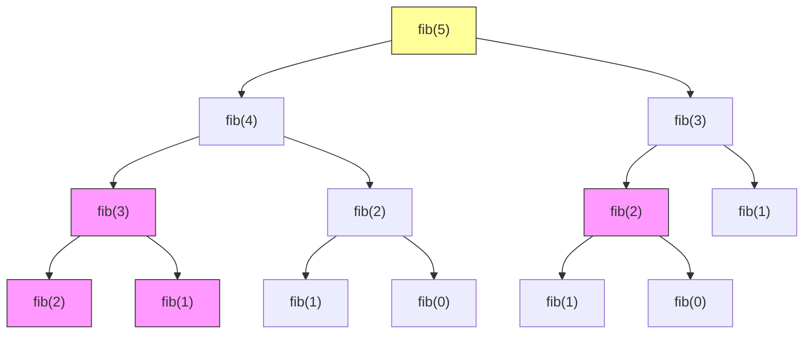

**观察**：图中粉色节点表示重复计算。fib(3) 被计算了 2 次，fib(2) 被计算了 3 次！

**复杂度分析**：

| 指标 | 数值 | 说明 |
|-----|------|------|
| 时间复杂度 | O(2^n) | 指数级爆炸 |
| 空间复杂度 | O(n) | 递归栈深度 |
| 重复计算 | 大量 | 同一子问题被计算多次 |

**瓶颈**：重复计算导致效率极低。当 n=50 时，计算量已经是天文数字。

### 1.3 动态规划解法

**核心思想**：用空间换时间，存储已计算的子问题结果。

```java
/**
 * 动态规划：自顶向下 + 记忆化
 * 时间复杂度：O(n)，空间复杂度：O(n)
 */
public int fibMemo(int n) {
    if (n <= 1) return n;

    // 记忆化数组，-1 表示未计算
    int[] memo = new int[n + 1];
    Arrays.fill(memo, -1);

    return fibMemoHelper(n, memo);
}

private int fibMemoHelper(int n, int[] memo) {
    if (memo[n] != -1) {
        return memo[n];  // 已计算，直接返回
    }

    if (n <= 1) {
        memo[n] = n;
    } else {
        memo[n] = fibMemoHelper(n - 1, memo) + fibMemoHelper(n - 2, memo);
    }

    return memo[n];
}
```

**记忆化后的递归树**：

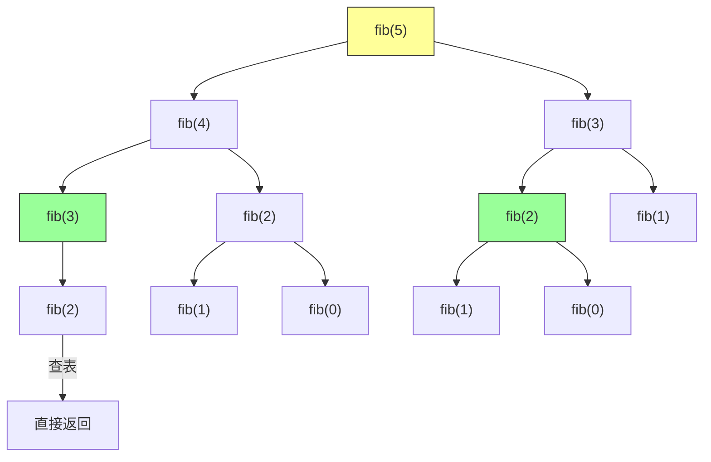

### 1.4 迭代解法（自底向上）

```java
/**
 * 动态规划：自底向上迭代
 * 时间复杂度：O(n)，空间复杂度：O(1)
 */
public int fibIterative(int n) {
    if (n <= 1) return n;

    int prev2 = 0;  // F(i-2)
    int prev1 = 1;  // F(i-1)
    int current = 0;

    for (int i = 2; i <= n; i++) {
        current = prev1 + prev2;  // F(i) = F(i-1) + F(i-2)
        prev2 = prev1;
        prev1 = current;
    }

    return current;
}
```

**DP 表填充过程（n=5）**：

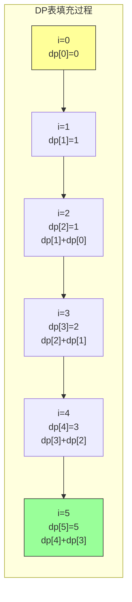

**三种解法对比**：

| 解法 | 时间复杂度 | 空间复杂度 | 优点 | 缺点 |
|-----|-----------|-----------|------|------|
| 递归 | O(2^n) | O(n) | 代码简洁 | 重复计算 |
| 记忆化 | O(n) | O(n) | 避免重复 | 需要额外空间 |
| 迭代 | O(n) | O(1) | 空间最优 | 需要正向思考 |

### 1.5 动态规划的核心要素

**动态规划适用的条件**：

1. **最优子结构**：问题的最优解包含子问题的最优解
2. **重叠子问题**：子问题被重复计算多次
3. **无后效性**：子问题的解一旦确定，不会受后续决策影响

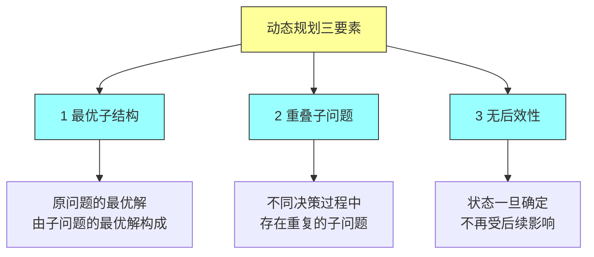

---

## 二、线性 DP：状态转移方程

### 2.1 什么是状态转移方程

**状态转移方程**是动态规划的核心，它描述了状态之间的关系。

**一般形式**：
```
dp[i] = f(dp[i-1], dp[i-2], ..., dp[0])
```

### 2.2 案例：爬楼梯问题

**问题**：有 n 级台阶，每次可以走 1 级或 2 级，到达顶部有多少种方式？

**分析**：
- 到达第 n 级，最后一步可以是 1 级或 2 级
- 如果最后一步是 1 级：前面有 dp[n-1] 种方式
- 如果最后一步是 2 级：前面有 dp[n-2] 种方式
- dp[n] = dp[n-1] + dp[n-2]

**状态转移方程**：
```
dp[i] = dp[i-1] + dp[i-2]
dp[1] = 1, dp[2] = 2
```

```java
/**
 * 爬楼梯问题
 * 时间复杂度：O(n)，空间复杂度：O(n)
 */
public int climbStairs(int n) {
    if (n <= 2) return n;

    int[] dp = new int[n + 1];
    dp[1] = 1;
    dp[2] = 2;

    for (int i = 3; i <= n; i++) {
        dp[i] = dp[i - 1] + dp[i - 2];
    }

    return dp[n];
}
```

**空间优化版本**：

```java
public int climbStairsOptimized(int n) {
    if (n <= 2) return n;

    int prev2 = 1;  // dp[i-2]
    int prev1 = 2;  // dp[i-1]
    int current = 0;

    for (int i = 3; i <= n; i++) {
        current = prev1 + prev2;
        prev2 = prev1;
        prev1 = current;
    }

    return current;
}
```

**n=5 时的所有路径**：

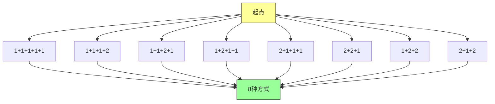

### 2.3 案例：打家劫舍问题

**问题**：给定一个数组，表示每家能偷到的金额。不能连续偷两家，求最大偷窃金额。

**示例**：nums = [2, 7, 9, 3, 1]，最大偷窃金额 = 12（偷 2 + 9 + 1）

**状态转移方程**：
```
dp[i] = max(dp[i-1], dp[i-2] + nums[i])
dp[0] = nums[0]
dp[1] = max(nums[0], nums[1])
```

**推导**：
- 对于第 i 家，可以选择偷或不偷
- 如果不偷：收益 = dp[i-1]
- 如果偷：收益 = dp[i-2] + nums[i]（因为不能偷 i-1）
- 取最大值

```java
/**
 * 打家劫舍问题
 * 时间复杂度：O(n)，空间复杂度：O(n)
 */
public int rob(int[] nums) {
    if (nums.length == 0) return 0;
    if (nums.length == 1) return nums[0];

    int n = nums.length;
    int[] dp = new int[n];
    dp[0] = nums[0];
    dp[1] = Math.max(nums[0], nums[1]);

    for (int i = 2; i < n; i++) {
        dp[i] = Math.max(dp[i - 1], dp[i - 2] + nums[i]);
    }

    return dp[n - 1];
}
```

**空间优化版本**：

```java
public int robOptimized(int[] nums) {
    if (nums.length == 0) return 0;
    if (nums.length == 1) return nums[0];

    int prev2 = nums[0];
    int prev1 = Math.max(nums[0], nums[1]);

    for (int i = 2; i < nums.length; i++) {
        int current = Math.max(prev1, prev2 + nums[i]);
        prev2 = prev1;
        prev1 = current;
    }

    return prev1;
}
```

**DP 表填充过程（nums = [2, 7, 9, 3, 1]）**：

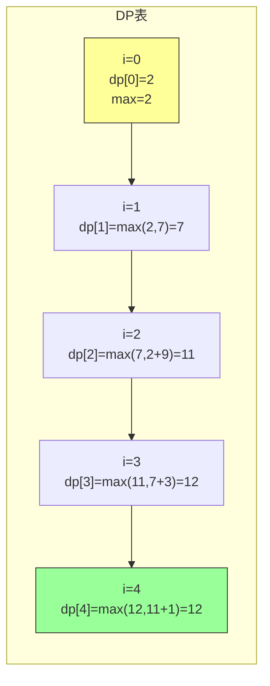

### 2.4 案例：股票买卖问题（一次交易）

**问题**：只允许交易一次（买入一次，卖出一次），求最大利润。

**示例**：prices = [7, 1, 5, 3, 6, 4]，最大利润 = 5（买入价 1，卖出价 6）

**状态转移方程**：
```
dp[i] = max(dp[i-1], prices[i] - minPrice)
minPrice = min(minPrice, prices[i])
```

```java
/**
 * 股票买卖：一次交易
 * 时间复杂度：O(n)，空间复杂度：O(1)
 */
public int maxProfit(int[] prices) {
    if (prices.length == 0) return 0;

    int minPrice = prices[0];
    int maxProfit = 0;

    for (int i = 1; i < prices.length; i++) {
        maxProfit = Math.max(maxProfit, prices[i] - minPrice);
        minPrice = Math.min(minPrice, prices[i]);
    }

    return maxProfit;
}
```

**利润计算过程（prices = [7, 1, 5, 3, 6, 4]）**：

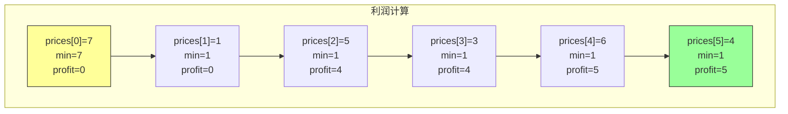

---

## 三、背包问题：二维 DP

### 3.1 0-1 背包问题

**问题**：给定一组物品，每件物品有重量和价值。在限定总重量内，求最大总价值。

**示例**：
- 物品：重量 [2, 3, 4, 5]，价值 [3, 4, 5, 6]
- 背包容量：5

**状态转移方程**：
```
dp[i][w] = max(dp[i-1][w], dp[i-1][w-weight[i-1]] + value[i-1])
```

其中：
- i：考虑前 i 件物品
- w：背包容量
- dp[i][w]：前 i 件物品在容量 w 下的最大价值

```java
/**
 * 0-1 背包问题
 * 时间复杂度：O(n*W)，空间复杂度：O(n*W)
 */
public int knapSack(int W, int[] wt, int[] val) {
    int n = wt.length;
    int[][] dp = new int[n + 1][W + 1];

    // 初始化：dp[0][w] = 0, dp[i][0] = 0
    for (int i = 1; i <= n; i++) {
        for (int w = 1; w <= W; w++) {
            if (wt[i - 1] <= w) {
                // 可选：放入或不放入
                dp[i][w] = Math.max(
                    dp[i - 1][w],
                    dp[i - 1][w - wt[i - 1]] + val[i - 1]
                );
            } else {
                // 不可选
                dp[i][w] = dp[i - 1][w];
            }
        }
    }

    return dp[n][W];
}
```

**DP 表填充过程**：

```
物品: wt=[2, 3, 4, 5], val=[3, 4, 5, 6], W=5

        w=0  w=1  w=2  w=3  w=4  w=5
i=0     0    0    0    0    0    0
i=1     0    0    3    3    3    3    (物品1: 重量2, 价值3)
i=2     0    0    3    4    4    7    (物品2: 重量3, 价值4)
i=3     0    0    3    4    5    7    (物品3: 重量4, 价值5)
i=4     0    0    3    4    6    7    (物品4: 重量5, 价值6)

最大价值 = 7 (物品1 + 物品2: 2+3=5重量, 3+4=7价值)
```

**空间优化版本**：

```java
public int knapSackOptimized(int W, int[] wt, int[] val) {
    int n = wt.length;
    int[] dp = new int[W + 1];

    for (int i = 0; i < n; i++) {
        // 逆序遍历，避免使用本轮刚更新的值
        for (int w = W; w >= wt[i]; w--) {
            dp[w] = Math.max(dp[w], dp[w - wt[i]] + val[i]);
        }
    }

    return dp[W];
}
```

**状态转移可视化**：

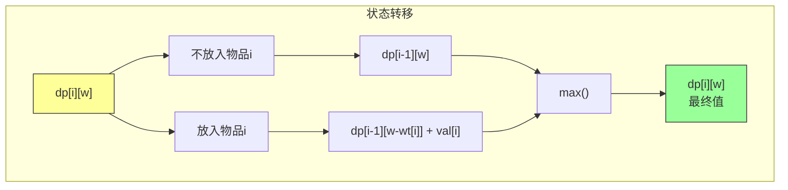

### 3.2 完全背包问题

**问题**：每种物品可以使用无限次，求最大总价值。

**与 0-1 背包的区别**：完全背包可以重复选择同一物品

**状态转移方程**：
```
dp[i][w] = max(dp[i][w-weight[i]] + value[i], dp[i-1][w])
```

```java
/**
 * 完全背包问题
 * 时间复杂度：O(n*W)，空间复杂度：O(n*W)
 */
public int completeKnapsack(int W, int[] wt, int[] val) {
    int n = wt.length;
    int[][] dp = new int[n + 1][W + 1];

    for (int i = 1; i <= n; i++) {
        for (int w = 1; w <= W; w++) {
            if (wt[i - 1] <= w) {
                // 正序遍历，允许重复使用
                dp[i][w] = Math.max(
                    dp[i][w - wt[i - 1]] + val[i - 1],
                    dp[i - 1][w]
                );
            } else {
                dp[i][w] = dp[i - 1][w];
            }
        }
    }

    return dp[n][W];
}
```

**0-1 背包 vs 完全背包**：

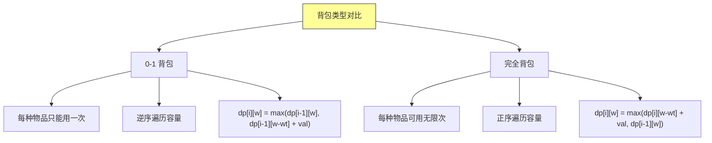

### 3.3 多重背包问题

**问题**：每种物品有固定数量限制，求最大总价值。

```java
/**
 * 多重背包问题
 * 时间复杂度：O(n*W*m)，其中 m 是每种物品的数量
 */
public int multipleKnapsack(int W, int[] wt, int[] val, int[] num) {
    int n = wt.length;
    int[] dp = new int[W + 1];

    for (int i = 0; i < n; i++) {
        // 二进制优化：将多重背包拆分为多个 0-1 背包
        int count = Math.min(num[i], W / wt[i]);
        int k = 1;
        while (count > 0) {
            int curWeight = k * wt[i];
            int curValue = k * val[i];
            for (int w = W; w >= curWeight; w--) {
                dp[w] = Math.max(dp[w], dp[w - curWeight] + curValue);
            }
            count -= k;
            k *= 2;
        }
    }

    return dp[W];
}
```

---

## 四、子序列问题

### 4.1 最长递增子序列（LIS）

**问题**：给定一个序列，找到最长的递增子序列长度。

**示例**：nums = [10, 9, 2, 5, 3, 7, 101, 18]，LIS = [2, 5, 7, 101]，长度 = 4

**状态定义**：
- dp[i]：以 nums[i] 结尾的最长递增子序列长度

**状态转移方程**：
```
dp[i] = max(dp[j]) + 1，其中 j < i 且 nums[j] < nums[i]
dp[i] = 1（没有比它更小的元素）
```

```java
/**
 * 最长递增子序列
 * 时间复杂度：O(n^2)，空间复杂度：O(n)
 */
public int lengthOfLIS(int[] nums) {
    if (nums.length == 0) return 0;

    int n = nums.length;
    int[] dp = new int[n];
    Arrays.fill(dp, 1);
    int maxLen = 1;

    for (int i = 1; i < n; i++) {
        for (int j = 0; j < i; j++) {
            if (nums[j] < nums[i]) {
                dp[i] = Math.max(dp[i], dp[j] + 1);
            }
        }
        maxLen = Math.max(maxLen, dp[i]);
    }

    return maxLen;
}
```

**二分查找优化版本**：

```java
/**
 * LIS 二分查找优化
 * 时间复杂度：O(n log n)，空间复杂度：O(n)
 */
public int lengthOfLISBinary(int[] nums) {
    if (nums.length == 0) return 0;

    int[] tail = new int[nums.length];
    int length = 0;

    for (int num : nums) {
        int pos = binarySearch(tail, length, num);
        if (pos == length) {
            tail[length++] = num;
        } else {
            tail[pos] = num;
        }
    }

    return length;
}

private int binarySearch(int[] tail, int length, int target) {
    int left = 0, right = length;
    while (left < right) {
        int mid = (left + right) / 2;
        if (tail[mid] < target) {
            left = mid + 1;
        } else {
            right = mid;
        }
    }
    return left;
}
```

**DP 表填充过程（nums = [10, 9, 2, 5, 3, 7, 101, 18]）**：

```
nums:    10   9    2    5    3    7    101   18
dp:      1    1    1    2    2    3    4     4
          ↓         ↓    ↓    ↓    ↓    ↓    ↓
        最长递增子序列: [2, 5, 7, 101] 长度 4
```

**可视化**：

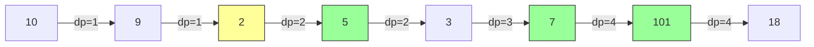

### 4.2 最长公共子序列（LCS）

**问题**：给定两个序列，找到最长的公共子序列长度。

**示例**：str1 = "abcde", str2 = "ace"，LCS = "ace"，长度 = 3

**状态定义**：
- dp[i][j]：str1 前 i 个字符和 str2 前 j 个字符的 LCS 长度

**状态转移方程**：
```
if str1[i-1] == str2[j-1]:
    dp[i][j] = dp[i-1][j-1] + 1
else:
    dp[i][j] = max(dp[i-1][j], dp[i][j-1])
```

```java
/**
 * 最长公共子序列
 * 时间复杂度：O(m*n)，空间复杂度：O(m*n)
 */
public int longestCommonSubsequence(String text1, String text2) {
    int m = text1.length();
    int n = text2.length();
    int[][] dp = new int[m + 1][n + 1];

    for (int i = 1; i <= m; i++) {
        for (int j = 1; j <= n; j++) {
            if (text1.charAt(i - 1) == text2.charAt(j - 1)) {
                dp[i][j] = dp[i - 1][j - 1] + 1;
            } else {
                dp[i][j] = Math.max(dp[i - 1][j], dp[i][j - 1]);
            }
        }
    }

    return dp[m][n];
}
```

**空间优化版本**：

```java
public int longestCommonSubsequenceOptimized(String text1, String text2) {
    int m = text1.length();
    int n = text2.length();
    int[] dp = new int[n + 1];

    for (int i = 1; i <= m; i++) {
        int prev = 0;  // dp[i-1][j-1]
        for (int j = 1; j <= n; j++) {
            int temp = dp[j];  // 保存本轮的 dp[i-1][j]
            if (text1.charAt(i - 1) == text2.charAt(j - 1)) {
                dp[j] = prev + 1;
            } else {
                dp[j] = Math.max(dp[j], dp[j - 1]);
            }
            prev = temp;
        }
    }

    return dp[n];
}
```

**DP 表填充过程（"abcde" 和 "ace"）**：

```
         ''  a  c  e
     ''  0  0  0  0
     a   0  1  1  1
     b   0  1  1  1
     c   0  1  2  2
     d   0  1  2  2
     e   0  1  2  3  ← LCS长度 = 3
```

**可视化**：

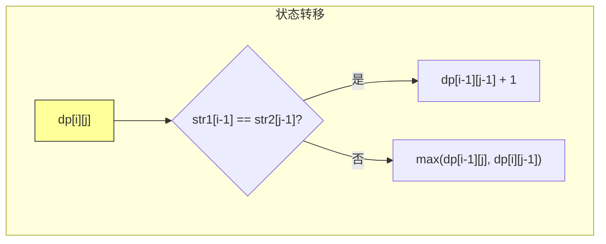

### 4.3 编辑距离

**问题**：给定两个字符串，求将一个字符串转换为另一个字符串的最少操作数（插入、删除、替换）。

**示例**："horse" → "ros"，编辑距离 = 3

**状态定义**：
- dp[i][j]：word1 前 i 个字符转换为 word2 前 j 个字符的最少操作数

**状态转移方程**：
```
if word1[i-1] == word2[j-1]:
    dp[i][j] = dp[i-1][j-1]
else:
    dp[i][j] = 1 + min(
        dp[i-1][j],      // 删除
        dp[i][j-1],      // 插入
        dp[i-1][j-1]     // 替换
    )
```

```java
/**
 * 编辑距离
 * 时间复杂度：O(m*n)，空间复杂度：O(m*n)
 */
public int minDistance(String word1, String word2) {
    int m = word1.length();
    int n = word2.length();
    int[][] dp = new int[m + 1][n + 1];

    // 初始化边界
    for (int i = 0; i <= m; i++) dp[i][0] = i;
    for (int j = 0; j <= n; j++) dp[0][j] = j;

    for (int i = 1; i <= m; i++) {
        for (int j = 1; j <= n; j++) {
            if (word1.charAt(i - 1) == word2.charAt(j - 1)) {
                dp[i][j] = dp[i - 1][j - 1];
            } else {
                dp[i][j] = 1 + Math.min(
                    Math.min(dp[i - 1][j], dp[i][j - 1]),
                    dp[i - 1][j - 1]
                );
            }
        }
    }

    return dp[m][n];
}
```

**DP 表填充过程（"horse" → "ros"）**：

```
         ''  r  o  s
     ''  0  1  2  3
     h   1  1  2  3
     o   2  2  1  2
     r   3  2  2  2
     s   4  3  3  2
     e   5  4  4  3  ← 编辑距离 = 3
```

---

## 五、区间 DP

### 5.1 矩阵链乘法

**问题**：给定 n 个矩阵，计算矩阵相乘的最小代价。

**示例**：A(10×30) × B(30×5) × C(5×60)，最小代价 = 10×30×5 + 10×5×60 = 4500

**状态定义**：
- dp[i][j]：计算矩阵 A[i] × A[i+1] × ... × A[j] 的最小代价

**状态转移方程**：
```
dp[i][j] = min(dp[i][k] + dp[k+1][j] + cost(i, k, j))
其中 cost(i, k, j) = A[i-1].row * A[k].col * A[j].col
```

```java
/**
 * 矩阵链乘法
 * 时间复杂度：O(n^3)，空间复杂度：O(n^2)
 */
public int matrixChainOrder(int[] p) {
    int n = p.length - 1;  // 矩阵数量
    int[][] dp = new int[n + 1][n + 1];
    int[][] split = new int[n + 1][n + 1];

    // 初始化：长度为1的矩阵链代价为0
    for (int i = 1; i <= n; i++) {
        dp[i][i] = 0;
    }

    // 遍历链长
    for (int len = 2; len <= n; len++) {
        for (int i = 1; i <= n - len + 1; i++) {
            int j = i + len - 1;
            dp[i][j] = Integer.MAX_VALUE;

            for (int k = i; k < j; k++) {
                int cost = dp[i][k] + dp[k + 1][j] + p[i - 1] * p[k] * p[j];
                if (cost < dp[i][j]) {
                    dp[i][j] = cost;
                    split[i][j] = k;
                }
            }
        }
    }

    return dp[1][n];
}
```

**DP 表填充顺序**：

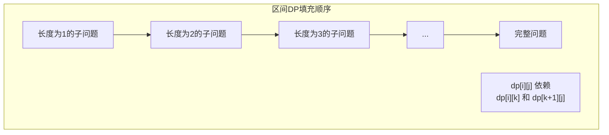

### 5.2 戳气球问题

**问题**：戳破气球获得金币，求获得的最大金币数。

**示例**：coins = [2, 5, 10]，最大金币 = 110

**状态定义**：
- dp[i][j]：戳破 i 和 j 之间所有气球获得的最大金币

**状态转移方程**：
```
dp[i][j] = max(dp[i][k] + dp[k][j] + coins[i]*coins[k]*coins[j])
```

```java
/**
 * 戳气球问题
 * 时间复杂度：O(n^3)，空间复杂度：O(n^2)
 */
public int maxCoins(int[] nums) {
    int n = nums.length;
    // 添加虚拟气球边界
    int[] coins = new int[n + 2];
    coins[0] = 1;
    coins[n + 1] = 1;
    for (int i = 0; i < n; i++) {
        coins[i + 1] = nums[i];
    }

    int[][] dp = new int[n + 2][n + 2];

    // 遍历区间长度
    for (int len = 2; len <= n + 1; len++) {
        for (int i = 0; i + len <= n + 2; i++) {
            int j = i + len;
            for (int k = i + 1; k < j; k++) {
                dp[i][j] = Math.max(
                    dp[i][j],
                    dp[i][k] + dp[k][j] + coins[i] * coins[k] * coins[j]
                );
            }
        }
    }

    return dp[0][n + 1];
}
```

---

## 六、状态压缩 DP

### 6.1 旅行商问题（TSP）

**问题**：访问 n 个城市一次并返回，求最短路径。

```java
/**
 * 旅行商问题
 * 时间复杂度：O(n^2 * 2^n)，空间复杂度：O(2^n)
 */
public int tsp(int[][] dist) {
    int n = dist.length;
    int INF = Integer.MAX_VALUE;

    // dp[mask][i]：从起点出发，经过 mask 中的城市，最后到达 i 的最短距离
    int[][] dp = new int[1 << n][n];
    for (int[] row : dp) {
        Arrays.fill(row, INF);
    }
    dp[1][0] = 0;  // 从城市0出发

    for (int mask = 1; mask < (1 << n); mask++) {
        for (int i = 0; i < n; i++) {
            if (dp[mask][i] == INF) continue;

            for (int j = 0; j < n; j++) {
                if ((mask & (1 << j)) == 0) {  // 城市j未被访问
                    int newMask = mask | (1 << j);
                    dp[newMask][j] = Math.min(
                        dp[newMask][j],
                        dp[mask][i] + dist[i][j]
                    );
                }
            }
        }
    }

    // 返回起点
    int fullMask = (1 << n) - 1;
    int minDist = INF;
    for (int i = 1; i < n; i++) {
        minDist = Math.min(minDist, dp[fullMask][i] + dist[i][0]);
    }

    return minDist;
}
```

**状态转移可视化**：

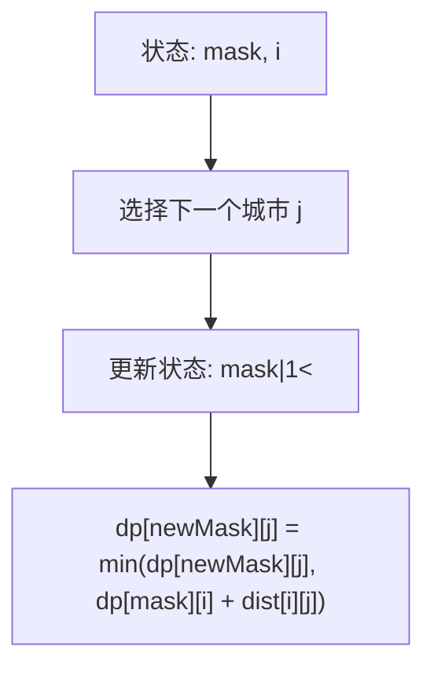

---

## 七、树形 DP

### 7.1 二叉树的最大路径和

**问题**：在二叉树中找一条路径，使路径和最大。

```java
/**
 * 二叉树最大路径和
 * 时间复杂度：O(n)，空间复杂度：O(h)
 */
public int maxPathSum(TreeNode root) {
    int[] maxSum = new int[]{Integer.MIN_VALUE};
    maxPathSumHelper(root, maxSum);
    return maxSum[0];
}

private int maxPathSumHelper(TreeNode node, int[] maxSum) {
    if (node == null) return 0;

    // 递归计算左右子树的最大贡献
    int leftMax = Math.max(0, maxPathSumHelper(node.left, maxSum));
    int rightMax = Math.max(0, maxPathSumHelper(node.right, maxSum));

    // 以当前节点为路径最高点的路径和
    int currentPathSum = node.val + leftMax + rightMax;

    // 更新全局最大路径和
    maxSum[0] = Math.max(maxSum[0], currentPathSum);

    // 返回当前节点作为子树贡献的最大值
    return node.val + Math.max(leftMax, rightMax);
}
```

### 7.2 打家劫舍 III

**问题**：在二叉树中打劫，不能同时打劫相邻的两栋房子。

```java
/**
 * 打家劫舍 III
 * 时间复杂度：O(n)，空间复杂度：O(h)
 */
public int robIII(TreeNode root) {
    int[] result = robHelper(root);
    return Math.max(result[0], result[1]);
}

private int[] robHelper(TreeNode node) {
    if (node == null) return new int[]{0, 0};

    int[] left = robHelper(node.left);
    int[] right = robHelper(node.right);

    // result[0]: 不打劫当前节点
    // result[1]: 打劫当前节点
    int notRob = Math.max(left[0], left[1]) + Math.max(right[0], right[1]);
    int rob = node.val + left[0] + right[0];

    return new int[]{notRob, rob};
}
```

---

## 八、动态规划解题框架

### 8.1 通用步骤

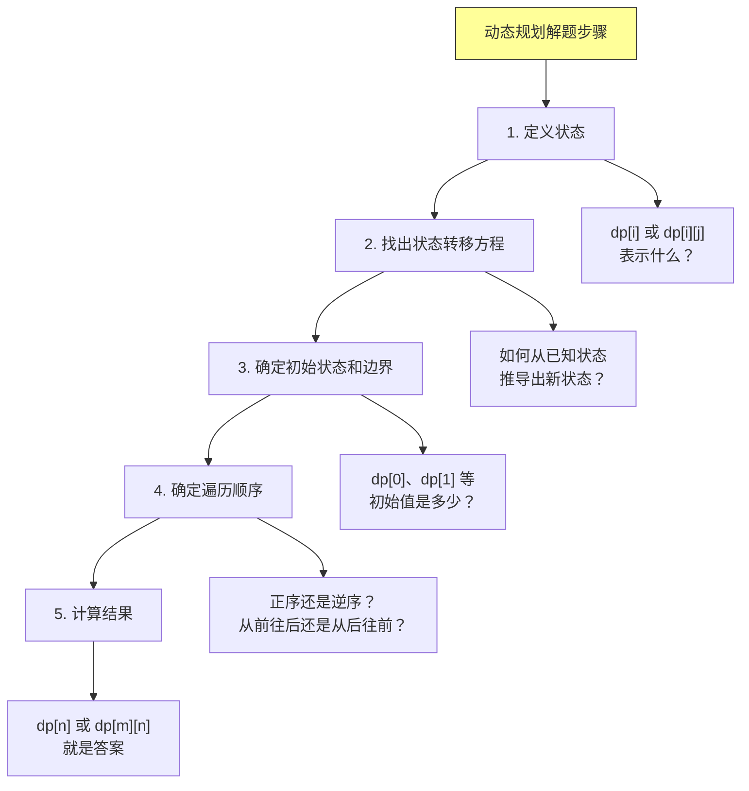

### 8.2 状态定义模式

| 问题类型 | 常见状态定义 |
|---------|-------------|
| 线性 DP | dp[i]：考虑前 i 个元素 |
| 背包问题 | dp[i][w]：前 i 件物品在容量 w 下的最优值 |
| 区间 DP | dp[i][j]：区间 [i, j] 的最优解 |
| 树形 DP | dp[node]：以 node 为根的子树最优解 |
| 状态压缩 | dp[mask]：状态 mask 下的最优解 |

### 8.3 常见的状态转移模式

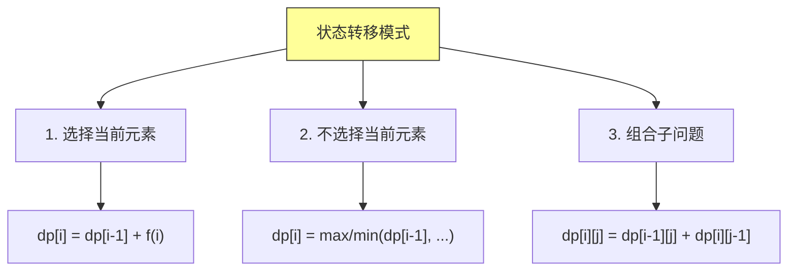

---

## 九、经典 LeetCode 题目分类

### 9.1 线性 DP（入门必刷）

| 题目 | 链接 | 难度 | 核心技巧 | 推荐指数 |
|-----|------|------|---------|---------|
| 70. 爬楼梯 | https://leetcode.cn/problems/climbing-stairs/ | Easy | 斐波那契数列 | ★★★★★ |
| 509. 斐波那契数 | https://leetcode.cn/problems/fibonacci-number/ | Easy | 基础 DP | ★★★★★ |
| 746. 使用最小花费爬楼梯 | https://leetcode.cn/problems/min-cost-climbing-stairs/ | Easy | 状态转移 | ★★★★★ |
| 198. 打家劫舍 | https://leetcode.cn/problems/house-robber/ | Medium | 状态压缩 | ★★★★★ |
| 213. 打家劫舍 II | https://leetcode.cn/problems/house-robber-ii/ | Medium | 环形处理 | ★★★★★ |
| 740. 删除并获得点数 | https://leetcode.cn/problems/delete-and-earn/ | Medium | 打家劫舍变体 | ★★★★☆ |
| 55. 跳跃游戏 | https://leetcode.cn/problems/jump-game/ | Medium | 贪心 + DP | ★★★★★ |
| 45. 跳跃游戏 II | https://leetcode.cn/problems/jump-game-ii/ | Medium | 最少跳跃 | ★★★★★ |
| 62. 不同路径 | https://leetcode.cn/problems/unique-paths/ | Medium | 路径计数 | ★★★★★ |
| 63. 不同路径 II | https://leetcode.cn/problems/unique-paths-ii/ | Medium | 障碍处理 | ★★★★☆ |
| 64. 最小路径和 | https://leetcode.cn/problems/minimum-path-sum/ | Medium | 路径最小和 | ★★★★★ |
| 120. 三角形最小路径和 | https://leetcode.cn/problems/triangle/ | Medium | 路径压缩 | ★★★★★ |
| 931. 下降路径最小和 | https://leetcode.cn/problems/falling-path-sum/ | Medium | 区间 DP | ★★★★☆ |
| 1289. 下降路径最小和 II | https://leetcode.cn/problems/minimum-falling-path-sum-ii/ | Hard | 状态优化 | ★★★☆☆ |

### 9.2 背包问题（经典系列）

| 题目 | 链接 | 难度 | 核心技巧 | 推荐指数 |
|-----|------|------|---------|---------|
| 416. 分割等和子集 | https://leetcode.cn/problems/partition-equal-subset-sum/ | Medium | 0-1 背包 | ★★★★★ |
| 1049. 最后一块石头的重量 II | https://leetcode.cn/problems/last-stone-weight-ii/ | Medium | 0-1 背包 | ★★★★★ |
| 494. 目标和 | https://leetcode.cn/problems/target-sum/ | Medium | 背包 + 符号 | ★★★★★ |
| 474. 一和零 | https://leetcode.cn/problems/ones-and-zeroes/ | Medium | 二维背包 | ★★★★★ |
| 518. 零钱兑换 II | https://leetcode.cn/problems/coin-change-2/ | Medium | 完全背包 | ★★★★★ |
| 377. 组合总和 IV | https://leetcode.cn/problems/combination-sum-iv/ | Medium | 排列组合 | ★★★★★ |
| 322. 零钱兑换 | https://leetcode.cn/problems/coin-change/ | Medium | 完全背包 | ★★★★★ |
| 279. 完全平方数 | https://leetcode.cn/problems/perfect-squares/ | Medium | 完全背包 | ★★★★★ |
| 343. 整数拆分 | https://leetcode.cn/problems/integer-break/ | Medium | 分割乘积 | ★★★★★ |
| 416. 分割等和子集 | https://leetcode.cn/problems/partition-equal-subset-sum/ | Medium | 0-1 背包 | ★★★★★ |
| 1449. 数位成本和为目标值的最大数字 | https://leetcode.cn/problems/form-largest-integer-with-digits-that-add-up-to-target/ | Hard | 背包 + 贪心 | ★★★☆☆ |

### 9.3 子序列问题（高频面试）

| 题目 | 链接 | 难度 | 核心技巧 | 推荐指数 |
|-----|------|------|---------|---------|
| 300. 最长递增子序列 | https://leetcode.cn/problems/longest-increasing-subsequence/ | Medium | LIS | ★★★★★ |
| 354. 俄罗斯套娃信封问题 | https://leetcode.cn/problems/russian-doll-envelopes/ | Hard | LIS 变体 | ★★★★★ |
| 1143. 最长公共子序列 | https://leetcode.cn/problems/longest-common-subsequence/ | Medium | LCS | ★★★★★ |
| 72. 编辑距离 | https://leetcode.cn/problems/edit-distance/ | Hard | 编辑距离 | ★★★★★ |
| 516. 最长回文子序列 | https://leetcode.cn/problems/longest-palindromic-subsequence/ | Medium | 区间 DP | ★★★★★ |
| 5. 最长回文子串 | https://leetcode.cn/problems/longest-palindromic-substring/ | Medium | 区间 DP | ★★★★★ |
| 647. 回文子串 | https://leetcode.cn/problems/palindromic-substrings/ | Medium | 区间 DP | ★★★★★ |
| 1092. 最短公共超序列 | https://leetcode.cn/problems/shortest-common-supersequence/ | Hard | LCS 扩展 | ★★★★☆ |
| 1035. 不相交的线 | https://leetcode.cn/problems/uncrossed-lines/ | Medium | LCS | ★★★★★ |
| 115. 不同的子序列 | https://leetcode.cn/problems/distinct-subsequences/ | Hard | 计数 DP | ★★★★☆ |
| 940. 不同的子序列 II | https://leetcode.cn/problems/distinct-subsequences-ii/ | Hard | 数学技巧 | ★★★☆☆ |
| 132. 分割回文串 II | https://leetcode.cn/problems/palindrome-partitioning-ii/ | Medium | 分割 + DP | ★★★★☆ |

### 9.4 股票买卖系列（状态机 DP）

| 题目 | 链接 | 难度 | 状态数 | 推荐指数 |
|-----|------|------|-------|---------|
| 121. 买卖股票的最佳时机 | https://leetcode.cn/problems/best-time-to-buy-and-sell-stock/ | Easy | 1 | ★★★★★ |
| 122. 买卖股票的最佳时机 II | https://leetcode.cn/problems/best-time-to-buy-and-sell-stock-ii/ | Easy | 2 | ★★★★★ |
| 123. 买卖股票的最佳时机 III | https://leetcode.cn/problems/best-time-to-buy-and-sell-stock-iii/ | Hard | 4 | ★★★★★ |
| 188. 买卖股票的最佳时机 IV | https://leetcode.cn/problems/best-time-to-buy-and-sell-stock-iv/ | Hard | 2k | ★★★★☆ |
| 309. 最佳买卖股票时机含冷冻期 | https://leetcode.cn/problems/best-time-to-buy-and-sell-stock-with-cooldown/ | Medium | 3 | ★★★★★ |
| 714. 买卖股票的最佳时机含手续费 | https://leetcode.cn/problems/best-time-to-buy-and-sell-stock-with-transaction-fee/ | Medium | 2 | ★★★★★ |

### 9.5 区间 DP（经典问题）

| 题目 | 链接 | 难度 | 核心技巧 | 推荐指数 |
|-----|------|------|---------|---------|
| 312. 戳气球 | https://leetcode.cn/problems/burst-balloons/ | Hard | 区间反转 | ★★★★★ |
| 516. 最长回文子序列 | https://leetcode.cn/problems/longest-palindromic-subsequence/ | Medium | 区间 DP | ★★★★★ |
| 664. 奇怪的打印机 | https://leetcode.cn/problems/strange-printer/ | Hard | 区间合并 | ★★★★☆ |
| 1000. 石子合并 | https://leetcode.cn/problems/minimum-cost-to-merge-stones/ | Hard | 区间合并 | ★★★★☆ |
| 1039. 多边形三角剖分的最低分 | https://leetcode.cn/problems/minimum-score-triangulation-of-polygon/ | Medium | 区间 DP | ★★★★☆ |
| 546. 移除盒子 | https://leetcode.cn/problems/remove-boxes/ | Hard | 区间 + 状态 | ★★★☆☆ |
| 1246. 删除回文子数组 | https://leetcode.cn/problems/palindrome-removal/ | Hard | 区间 DP | ★★★☆☆ |

### 9.6 树形 DP（进阶必刷）

| 题目 | 链接 | 难度 | 核心技巧 | 推荐指数 |
|-----|------|------|---------|---------|
| 124. 二叉树中的最大路径和 | https://leetcode.cn/problems/binary-tree-maximum-path-sum/ | Hard | 树形 DP | ★★★★★ |
| 687. 最长同值路径 | https://leetcode.cn/problems/longest-univalue-path/ | Easy | 树形 DP | ★★★★☆ |
| 543. 二叉树的直径 | https://leetcode.cn/problems/diameter-of-binary-tree/ | Easy | 树形 DP | ★★★★☆ |
| 337. 打家劫舍 III | https://leetcode.cn/problems/house-robber-iii/ | Medium | 树形 DP | ★★★★★ |
| 979. 在二叉树中分配硬币 | https://leetcode.cn/problems/distribute-coins-in-binary-tree/ | Medium | 树形 DP | ★★★★☆ |
| 124. 二叉树中的最大路径和 | https://leetcode.cn/problems/binary-tree-maximum-path-sum/ | Hard | 树形 DP | ★★★★★ |
| 663. 二叉树等于目标和的路径 | https://leetcode.cn/problems/equal-tree-partition/ | Medium | 前缀和 | ★★★★☆ |

### 9.7 位运算 DP（状态压缩）

| 题目 | 链接 | 难度 | 核心技巧 | 推荐指数 |
|-----|------|------|---------|---------|
| 78. 子集 | https://leetcode.cn/problems/subsets/ | Medium | 位运算枚举 | ★★★★★ |
| 90. 子集 II | https://leetcode.cn/problems/subsets-ii/ | Medium | 去重 | ★★★★☆ |
| 46. 全排列 | https://leetcode.cn/problems/permutations/ | Medium | 状态压缩 | ★★★★★ |
| 47. 全排列 II | https://leetcode.cn/problems/permutations-ii/ | Medium | 去重 | ★★★★☆ |
| 526. 优美的排列 | https://leetcode.cn/problems/beautiful-arrangement/ | Medium | 位运算 DP | ★★★★☆ |
| 935. 骑士拨号器 | https://leetcode.cn/problems/knight-dialer/ | Medium | 状态压缩 | ★★★★★ |
| 1349. 参加考试的最大学生数 | https://leetcode.cn/problems/maximum-students-taking-exam/ | Hard | 位运算 DP | ★★★☆☆ |

### 9.8 计数 DP（排列组合）

| 题目 | 链接 | 难度 | 核心技巧 | 推荐指数 |
|-----|------|------|---------|---------|
| 62. 不同路径 | https://leetcode.cn/problems/unique-paths/ | Medium | 排列组合 | ★★★★★ |
| 63. 不同路径 II | https://leetcode.cn/problems/unique-paths-ii/ | Medium | 障碍处理 | ★★★★☆ |
| 413. 等差数列划分 | https://leetcode.cn/problems/arithmetic-slices/ | Medium | 计数 DP | ★★★★★ |
| 91. 解码方法 | https://leetcode.cn/problems/decode-ways/ | Medium | 计数 | ★★★★★ |
| 639. 解码方法 II | https://leetcode.cn/problems/decode-ways-ii/ | Hard | 计数扩展 | ★★★★☆ |
| 1259. 不相交的握手 | https://leetcode.cn/problems/handshakes-that-dont-cross/ | Medium | 卡特兰数 | ★★★★☆ |
| 编程题 1：堆沙盒 | https://leetcode.cn/problems/sandbox-falling/ | Hard | 计数 | ★★★☆☆ |

---

## 十、复杂度分析方法总结

| 方法 | 时间复杂度 | 空间复杂度 | 适用场景 |
|-----|-----------|-----------|---------|
| 记忆化递归 | O(n) 或 O(n*W) | O(n) 或 O(n*W) | 子问题有依赖关系 |
| 自底向上迭代 | O(n) 或 O(n*W) | O(n) 或 O(1) | 正向推导简单 |
| 空间优化 | O(n) 或 O(n*W) | O(1) 或 O(W) | 只需前几个状态 |
| 状态压缩 | O(n * 2^n) | O(2^n) | 组合优化 |

---

## 十一、动态规划可视化总结

### 11.1 DP 表的两种遍历方向

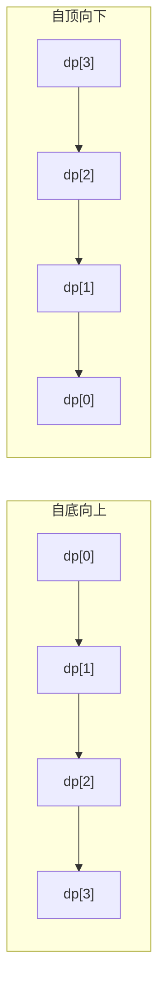

### 11.2 状态转移的决策树

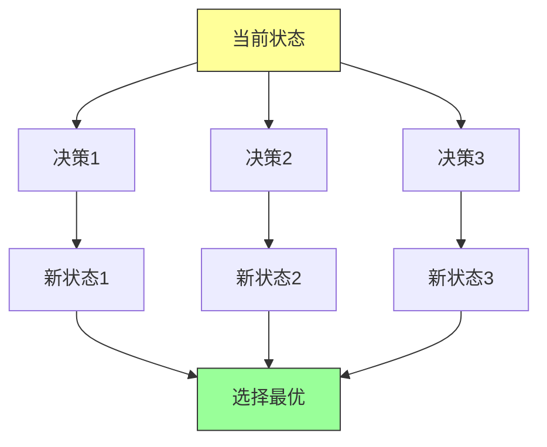

---

## 十二、常见错误与调试技巧

### 12.1 常见错误

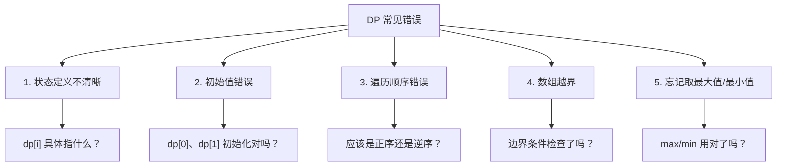

### 12.2 调试技巧

1. **打印 DP 表**：观察值的填充过程
2. **小规模测试**：先用小数据验证正确性
3. **边界测试**：测试 n=0, n=1 等边界情况
4. **手动模拟**：用纸笔模拟 DP 表填充

---

## 十三、总结

### 13.1 动态规划核心要点

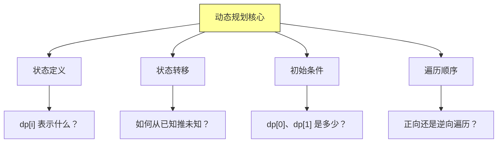

### 13.2 动态规划 vs 其他算法

| 特性 | 贪心 | 分治 | 动态规划 |
|-----|------|------|---------|
| 子问题 | 不一定重复 | 独立 | 重复 |
| 最优子结构 | 不需要 | 不需要 | 需要 |
| 记忆化 | 不需要 | 不需要 | 需要 |
| 决策方式 | 局部最优 | 递归分解 | 全局最优 |

### 13.3 学习建议

1. **从简单开始**：先掌握斐波那契、爬楼梯
2. **多画 DP 表**：理解状态如何转移
3. **分类练习**：线性 DP → 背包 → 子序列 → 区间
4. **总结模板**：每类问题有固定模式

---

**动态规划是算法面试中最能体现思维能力的题型。掌握它不仅能帮助你通过面试，更能培养解决复杂问题的思维能力。**

下一章：第十五章——贪心算法（Greedy Algorithms）

---

## 附录：完整代码模板

### 斐波那契数列（迭代）

```java
public long fib(int n) {
    if (n <= 1) return n;
    long a = 0, b = 1;
    for (int i = 2; i <= n; i++) {
        long c = a + b;
        a = b;
        b = c;
    }
    return b;
}
```

### 0-1 背包

```java
public int knapsack(int W, int[] wt, int[] val) {
    int[] dp = new int[W + 1];
    for (int i = 0; i < wt.length; i++) {
        for (int w = W; w >= wt[i]; w--) {
            dp[w] = Math.max(dp[w], dp[w - wt[i]] + val[i]);
        }
    }
    return dp[W];
}
```

### LIS（二分查找优化）

```java
public int lengthOfLIS(int[] nums) {
    int[] tail = new int[nums.length];
    int len = 0;
    for (int num : nums) {
        int pos = Arrays.binarySearch(tail, 0, len, num);
        if (pos < 0) pos = -pos - 1;
        tail[pos] = num;
        if (pos == len) len++;
    }
    return len;
}
```

### LCS

```java
public int lcs(String s1, String s2) {
    int m = s1.length(), n = s2.length();
    int[] dp = new int[n + 1];
    for (int i = 1; i <= m; i++) {
        int prev = 0;
        for (int j = 1; j <= n; j++) {
            int temp = dp[j];
            if (s1.charAt(i - 1) == s2.charAt(j - 1)) {
                dp[j] = prev + 1;
            } else {
                dp[j] = Math.max(dp[j], dp[j - 1]);
            }
            prev = temp;
        }
    }
    return dp[n];
}
```
