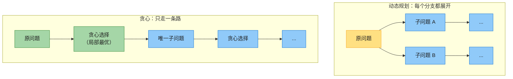
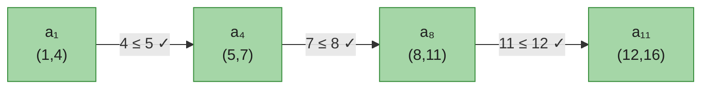
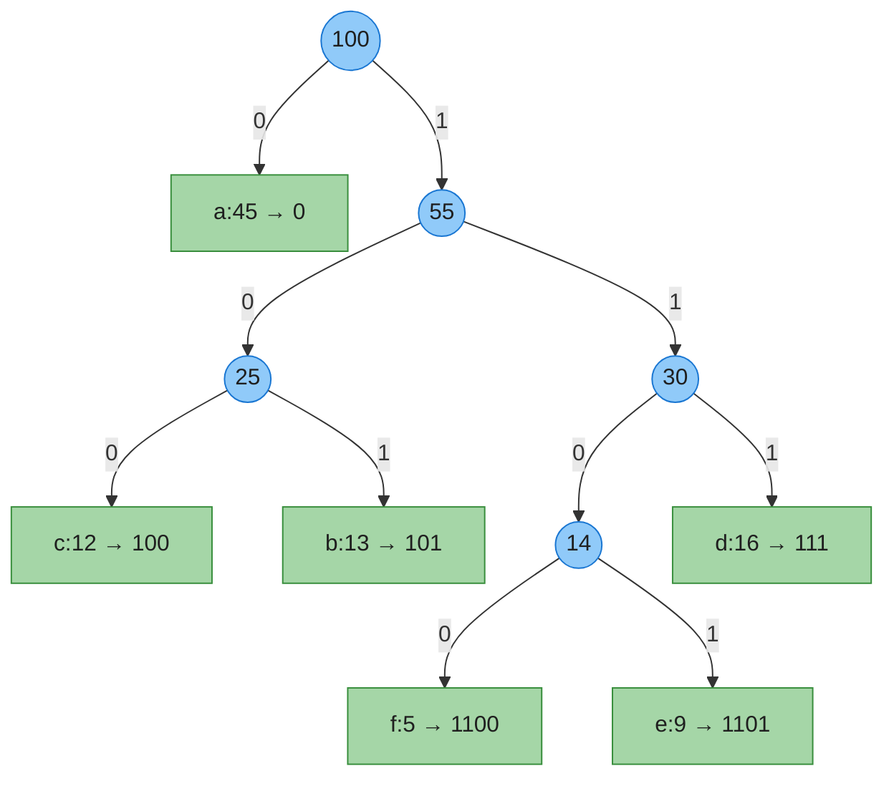

# 第十五章：贪心算法（Greedy Algorithms）

> **定位**：贪心是与动态规划（第 14 章）并列的两大算法设计策略，都依赖**最优子结构**。区别在于：DP 把所有子问题都展开、权衡后取最优；贪心**每一步只做一个局部最优选择、绝不回头**，用「贪心选择性质」保证局部最优能拼成全局最优。
> 换来的是效率：DP 通常 Θ(n²) 起，贪心常常 Θ(n) 或 Θ(n lg n)（排序开销）。
> 本章按第四版四节展开：**活动选择 → 贪心要素 → Huffman 编码 → 离线缓存**。
> **前后指针**：分数背包是贪心的成功案例，0-1 背包则必须 DP（第 14 章）；贪心的另两个经典应用 **MST（Kruskal/Prim）在第 21 章**、**Dijkstra 在第 22 章**，本章不展开。
>
> 对照第四版书页 408–446（**注意**：第四版用「离线缓存」替换了第三版的拟阵两节，结构差异很大）。

---

## 一、核心思想：贪心 vs 动态规划

两者都要求问题有**最优子结构**（最优解由子问题的最优解构成）。分水岭是**贪心选择性质**：

- **贪心选择性质**：存在一个「一眼看上去最好」的选择，做了它之后，剩下的子问题仍是同类问题，且最优解不会因此变差。
- 有这条性质 → 用**贪心**（自顶向下，做一个选择，递归一个子问题）。
- 没有 → 用 **DP**（自底向上，所有子问题都要算，再权衡）。



| 特征 | 贪心 | 动态规划 |
|------|------|---------|
| 子问题 | 每步只留一个 | 所有可能都算 |
| 回溯 | 不回退 | 隐式穷举 |
| 正确性保证 | 贪心选择性质 + 最优子结构 | 最优子结构 + 重叠子问题 |
| 典型时间 | Θ(n) 或 Θ(n lg n) | Θ(n²) 起步 |
| 难点 | **证明**贪心选择性质 | **列**状态转移方程 |

> **关键**：贪心的难点不在实现，而在**证明**「这样做确实最优」。常用两类证明：**贪心选择性质**（做交换不劣化）+ **最优子结构**（剩余子问题的最优解能拼回原问题最优解）。

---

## 二、活动选择问题（§15.1）——贪心的教科书案例

### 2.1 问题

`n` 个活动，每个有开始时间 `s[i]` 和结束时间 `f[i]`，一个场地同一时刻只能进行一个活动。求**能安排的最多活动数**。

### 2.2 直觉与贪心选择

直觉：**选最早结束的那个活动**——它给后面留出的时间最多。这就是贪心选择。

> **贪心选择性质**（活动选择）：存在一个最优解包含结束最早的活动 `a_m`。
> *证明思路（交换论证）*：设最优解的第一个活动是 `a_k`，而 `a_m` 结束最早（`f[m] ≤ f[k]`）。把 `a_k` 换成 `a_m`，由于 `a_m` 结束更早，原最优解里其余活动仍与 `a_m` 不冲突 → 得到另一个至少同样大的最优解，且包含 `a_m`。

剩下的问题变成：「在 `a_m` 结束之后开始的活动中，再选最多」。这是**同类子问题**（最优子结构）——于是可以一路贪心下去。

### 2.3 例子（CLRS Figure 15.1）

11 个活动**已按结束时间升序排好**：

| i | 1 | 2 | 3 | 4 | 5 | 6 | 7 | 8 | 9 | 10 | 11 |
|---|---|---|---|---|---|---|---|---|---|----|----|
| s | 1 | 3 | 0 | 5 | 3 | 5 | 6 | 8 | 8 | 2 | 12 |
| f | 4 | 5 | 6 | 7 | 9 | 9 | 10 | 11 | 12 | 14 | 16 |

选 **{a₁, a₄, a₈, a₁₁}**（(1,4)→(5,7)→(8,11)→(12,16)），共 4 个。



### 2.4 伪代码（CLRS 第四版，1-indexed，假设已按 f 排序）

```
GREEDY-ACTIVITY-SELECTOR(s, f, n)
1  A = {a1}
2  k = 1                       // 最近选中的活动下标
3  for m = 2 to n
4      if s[m] >= f[k]         // a_m 与已选活动不冲突？
5          A = A ∪ {am}        // 选它
6          k = m               // 从它继续
7  return A
```

> 已排序时 Θ(n)；未排序先按结束时间排序 Θ(n lg n)。递归版 `RECURSIVE-ACTIVITY-SELECTOR(s,f,k,n)` 是尾递归，可机械转成上面的迭代版（呼应第 7 章思考题 7-5 的尾递归消除）。

### 2.5 代码（0-indexed）

```java
// 输入：acts[i] = {start, end}，调用前需按 end 升序排序
public static List<int[]> selectActivities(int[][] acts) {
    List<int[]> res = new ArrayList<>();
    res.add(acts[0]);
    int k = 0;
    for (int m = 1; m < acts.length; m++) {
        if (acts[m][0] >= acts[k][1]) {   // s[m] >= f[k]
            res.add(acts[m]);
            k = m;
        }
    }
    return res;
}
```

> **LeetCode 关联**：[435. 无重叠区间](https://leetcode.cn/problems/non-overlapping-intervals/)（求最少删除几个 ↔ 保留最多不重叠的）、[452. 用最少数量的箭引爆气球](https://leetcode.cn/problems/minimum-number-of-arrows-to-burst-balloons/)、[621. 任务调度器](https://leetcode.cn/problems/task-scheduler/)。套路都是「按某端点排序 + 贪心」。

---

## 三、贪心策略的要素（§15.2）

一个贪心算法正确，当且仅当问题满足两条性质：

1. **贪心选择性质**：做出一次局部最优选择后，剩下的子问题仍有最优解能与之拼成全局最优（活动选择已演示）。
2. **最优子结构**：最优解包含子问题的最优解（与 DP 共用）。

### 贪心不是万能的：0-1 背包 vs 分数背包

同样的「按单位价值降序」贪心，在两种背包上命运截然不同：

| | 0-1 背包（整件取/不取） | 分数背包（可切一部分） |
|---|---|---|
| 贪心按单位价值 | ❌ **不一定最优** | ✅ **最优** |
| 正确解法 | 动态规划 Θ(nC) | 贪心 Θ(n lg n) |

**反例（0-1 背包）**：容量 50，物品 `A(10kg,60元)`、`B(20kg,100元)`、`C(30kg,120元)`。单位价值 A=6 > B=5 > C=4，贪心先取 A 再取 B，剩 20kg 装不下 C → 价值 160；但**最优是取 B+C = 220**。因为「装下整件 C」的要求让贪心的局部选择失误。分数背包则可切 C 的 2/3，贪心直接得 60+100+80=240（最优）。

> 这就是为什么**证明贪心选择性质必不可少**：背包问题的最优子结构两个变体都有，但只有分数背包满足贪心选择性质。

---

## 四、Huffman 编码（§15.3）——数据压缩

### 4.1 问题与直觉

给字符集 `C`，每个字符 `c` 有频率 `c.freq`。要给每个字符一个二进制码字，使**编码后总位数最少**：
- 约束：**前缀无关**（无码字是另一个码字的前缀）——这样才能无歧义解码。
- 直觉：**频率高的字符给短码，频率低的给长码**。

前缀无关码 ↔ 一棵**满二叉树**（每个非叶恰有两个孩子）：叶子 = 字符，根到叶子的路径 = 码字（左 0、右 1）。最优码的树恰有 `|C|` 个叶子、`|C|−1` 个内部节点。树的代价：

```
B(T) = Σ_{c∈C} c.freq · d_T(c)        // d_T(c) = 字符 c 在树中的深度 = 码字长度
```

### 4.2 Huffman 算法

贪心：**每次合并频率最低的两个节点**，合并 n−1 次得到完整树。

```
HUFFMAN(C)
1  n = |C|
2  Q = C                        // 以 freq 为键的最小优先队列
3  for i = 1 to n-1
4      allocate a new node z
5      x = EXTRACT-MIN(Q)
6      y = EXTRACT-MIN(Q)
7      z.left = x
8      z.right = y
9      z.freq = x.freq + y.freq
10     INSERT(Q, z)
11 return EXTRACT-MIN(Q)        // 树根，队列中仅剩此节点
```

### 4.3 例子（CLRS Figure 15.4 / 15.5）

频率 `a:45, b:13, c:12, d:16, e:9, f:5`（单位千）。定长 3-bit 码要 300000 位；Huffman 码只要 **224000 位**（省 25%）。

合并过程（每次取两个最小）：
```
初始    [5:f, 9:e, 12:c, 13:b, 16:d, 45:a]
5+9=14  [12:c, 13:b, 14, 16:d, 45:a]
12+13=25 [14, 16:d, 25, 45:a]
14+16=30 [25, 30, 45:a]
25+30=55 [45:a, 55]
45+55=100 → 根
```

最终树与码字：



### 4.4 正确性（两句话，不展开证明）

- **Lemma 15.2（贪心选择性质）**：频率最低的 `x`、`y`，在某棵最优树中可作为**最深处的兄弟叶子**（把任意最优树最深的两兄弟与 x、y 交换，代价不增）。
- **Lemma 15.3（最优子结构）**：把 `x`、`y` 合并成 `z`（freq = x.freq+y.freq）后，`C' = (C−{x,y})∪{z}` 的最优树 → 把 `z` 换回以 x、y 为孩子的内部节点，即得 `C` 的最优树。

两条合起来 ⇒ **Theorem 15.4：HUFFMAN 产生最优前缀码**。

### 4.5 复杂度

用二叉最小堆：`BUILD-MIN-HEAP` 建堆 Θ(n)，n−1 次合并每次 Θ(lg n) → **Θ(n lg n)**。

### 4.6 代码（0-indexed，叶子直接存字符）

```java
static class Node {
    Character ch;            // 叶子的字符；内部节点为 null
    int freq;
    Node left, right;
    Node(Character ch, int freq) { this.ch = ch; this.freq = freq; }
    boolean isLeaf() { return left == null && right == null; }
}

public static Node build(int[] freqs, char[] chars) {     // freqs[i] ↔ chars[i]
    PriorityQueue<Node> q = new PriorityQueue<>((x, y) -> x.freq - y.freq);
    for (int i = 0; i < chars.length; i++) q.offer(new Node(chars[i], freqs[i]));
    while (q.size() > 1) {
        Node x = q.poll(), y = q.poll();
        Node z = new Node(null, x.freq + y.freq);
        z.left = x; z.right = y;
        q.offer(z);
    }
    return q.poll();
}

public static void codes(Node node, String prefix, Map<Character, String> out) {
    if (node == null) return;
    if (node.isLeaf()) { out.put(node.ch, prefix.isEmpty() ? "0" : prefix); return; }
    codes(node.left, prefix + "0", out);
    codes(node.right, prefix + "1", out);
}
```

---

## 五、离线缓存（§15.4）——第四版新增

> 第四版用本节替换了第三版的「拟阵」。它是贪心又一个优雅的胜利，且直接关联操作系统的页面/缓存置换。

### 5.1 问题

缓存容量 `k`，**事先知道完整的访存请求序列** `b₁, b₂, …, bₙ`（离线）。缓存满时若发生 miss，必须驱逐一个块。目标：**最小化总 miss 数**。

### 5.2 贪心策略：furthest-in-future

发生 miss 且缓存满时，驱逐「**下一次访问离当前最远**」的块——甚至永不访问的块优先。直觉：反正暂时用不到，何必占着位置。

> **Theorem 15.5**：furthest-in-future 是**最优**的（具有贪心选择性质 + 最优子结构）。证明用「交换论证」：任何最优解若在此步驱逐了别的块，都可改成驱逐 furthest-in-future 那个，且后续 miss 数不增。

### 5.3 在线版：LRU

真实系统**不知道未来**，常用 **LRU**（least-recently-used，驱逐「最近最少访问」的块，即「furthest-in-past」）逼近。习题 15.4-2 给出了 LRU 比 furthest-in-future 多产生 miss 的反例。LRU 的摊还分析见第 16 章。

### 5.4 小结

| | 知道未来？ | 策略 | 最优？ |
|---|---|---|---|
| 离线缓存 | 是 | furthest-in-future | ✅ 最优 |
| LRU（在线） | 否 | furthest-in-past | ❌ 但实用，摊还 O(1) |

> **LeetCode 关联**：[146. LRU 缓存](https://leetcode.cn/problems/lru-cache/)、[460. LFU 缓存](https://leetcode.cn/problems/lfu-cache-design/)（在线缓存的数据结构实现）。

---

## 六、复杂度速查 + 易混点

### 6.1 速查

| 问题 | 贪心策略 | 时间 | 出处 |
|------|---------|------|------|
| 活动选择 | 按结束时间，选最早结束 | Θ(n)（已排序）/ Θ(n lg n) | §15.1 |
| 分数背包 | 按单位价值降序 | Θ(n lg n) | §15.2 |
| Huffman 编码 | 每次合并频率最低两个 | Θ(n lg n) | §15.3 |
| 离线缓存 | furthest-in-future | Θ(n·k) 朴素 / Θ(n lg k) 堆 | §15.4 |
| 0-1 背包 | **贪心失效** → DP | Θ(nC) | §15.2 |

### 6.2 易混点

- **贪心 vs DP 的分水岭是「贪心选择性质」**，不是「最优子结构」——两者都要最优子结构。判断时先问：「有没有一个一眼最优的选择，做完后子问题仍是同类且不劣化？」有→贪心；没有→DP。
- **活动选择按「结束时间」排序**，不是开始时间也不是时长。按开始时间也能最优（对称地选最早开始？其实选**最晚开始**同理），但教材约定按结束时间。**按时长排序是错的**（最短的活动未必最优）。
- **Huffman 树的叶子必须存字符本身**，不能用「频率值−1」当字符下标（频率值与字符序号无关，会越界）。
- **Huffman 不唯一**：合并时左右孩子顺序、频率相同的节点选取都可能不同，但**最优代价 B(T) 唯一**。
- **furthest-in-future 是离线下最优**；LRU 是在线启发式，不能保证最优——别把两者混为一谈。
- **贪心不回溯**：一旦选了就不改，这是它比 DP 快的根因，也是它可能失败（0-1 背包）的根因。

---

## 七、LeetCode 题单 + 习题 + 思考题

### 7.1 LeetCode 题单

| 题目 | 难度 | 考点 | 用本章什么 |
|------|------|------|-----------|
| [435. 无重叠区间](https://leetcode.cn/problems/non-overlapping-intervals/) | 中 | 活动选择 | 按结束时间排序 + 贪心 |
| [452. 用最少数量的箭引爆气球](https://leetcode.cn/problems/minimum-number-of-arrows-to-burst-balloons/) | 中 | 活动选择 | 按结束时间排序 + 贪心 |
| [621. 任务调度器](https://leetcode.cn/problems/task-scheduler/) | 中 | 调度贪心 | 贪心安排最高频任务 |
| [55. 跳跃游戏](https://leetcode.cn/problems/jump-game/) | 中 | 区间可达 | 维护最远可达（贪心） |
| [45. 跳跃游戏 II](https://leetcode.cn/problems/jump-game-ii/) | 中 | 区间覆盖 | 边界贪心 |
| [135. 分发糖果](https://leetcode.cn/problems/candy/) | 困 | 双向贪心 | 两次扫描取 max |
| [763. 划分字母区间](https://leetcode.cn/problems/partition-labels/) | 中 | 区间贪心 | 每个字母的最远边界 |
| [406. 根据身高重建队列](https://leetcode.cn/problems/queue-reconstruction-by-height/) | 中 | 排序贪心 | 按 h 降序、k 升序插入 |
| [860. 柠檬水找零](https://leetcode.cn/problems/lemonade-change/) | 简 | 找零贪心 | 优先用大面额（思考题 15-1） |
| [146. LRU 缓存](https://leetcode.cn/problems/lru-cache/) | 中 | 离线缓存的在线版 | §15.4 |

> 区间类（435/452/763）是活动选择的直接变体，最值得练；55/45/135/406 是经典贪心思维题，非 CLRS 内容但面试高频。

### 7.2 习题快问快答（第四版编号）

- **15.1-2**　改成每次选「与已选活动相容、**最晚开始**」的活动——与最早结束对称，仍最优（时间轴左右翻转）。
- **15.1-3**　「最短时长 / 冲突最少 / 最早开始」三种贪心都可能不是最优；必须按结束时间（或对称的最晚开始）。
- **15.1-4**　用尽量少的教室安排全部活动（区间图着色）：按开始时间扫描，每个活动分配一间当前空闲的教室，没有就新开一间。教室数 = 最大重叠数。
- **15.1-5**　每个活动带「权重」的变体（区间加权）→ **贪心失效，改用 DP**（按结束时间排序 + 二分找上一个不冲突的活动）。这是贪心与 DP 的经典分界。
- **15.2-1**　证明分数背包有贪心选择性质：存在一份最优解包含单位价值最高的物品（或其分数）。
- **15.2-4**　教授横穿北达科他州、两升水、沿途补给点——最少停靠次数。贪心：**每次开到能到达的最远补给点**（「没水前能到的最远站」）。
- **15.2-6**　分数背包可在 **Θ(n)** 完成（用线性时间选第 k 大的「单位价值」，类似第 9 章 quickselect 的分治）。
- **15.3-2**　非满二叉树（有单孩子节点）不可能对应最优前缀码——把单孩子收缩掉，码字变短，代价严格下降。
- **15.3-3**　频率为前 8 个斐波那契数时，Huffman 树退化为**一条链**（每次最小的两个合并后仍是最小的），码字长度 1..7。
- **15.4-2**　给一个 LRU 比 furthest-in-future 多 miss 的请求序列。

### 7.3 思考题要点

- **15-1 找零钱**：(a) 美元面额 {25,10,5,1} 贪心（大面额优先）最优；(b) 面额为 c 的幂 {1,c,c²,…} 时贪心也最优；(c) 给贪心失效的面额集（如 {1,3,4}，凑 6：贪心 4+1+1=3 枚，最优 3+3=2 枚）；(d) 任意 k 种面额用 **DP**，Θ(nk)。
- **15-2 调度最小化平均完成时间**：(a) 按**处理时间从短到长**依次执行（短作业优先 SJF），交换论证：相邻两任务若长的在前，交换后两者完成时间之和下降；(b) 带释放时间 + 可抢占 → **SRPT**（shortest remaining processing time），每次选剩余时间最短的抢占运行。

### 章末注记

贪心算法在组合优化领域由 **Edmonds（1971）** 系统提出；活动选择的证明基于 Gavril；**Huffman 编码**由 David Huffman 1952 年发明（当时还是 MIT 在读硕士）；离线缓存的 furthest-in-future 策略由 **Belady（1966）** 提出（也称 Bélády 最优算法），是衡量在线缓存算法（如 LRU）的黄金基准。
