# 第十五章 贪心算法（Greedy Algorithm）

---

**贪心算法是一种"只顾眼前、不顾长远"的算法策略。** 它在每一步选择中都做出在当前看来最好的选择，希望通过一系列局部最优的选择达到全局最优。

贪心算法的核心哲学：**"贪心"不是贬义词，而是一种"活在当下"的智慧。**

---

## 一、贪心算法的本质

### 1.1 什么是贪心

**生活中的贪心例子：**

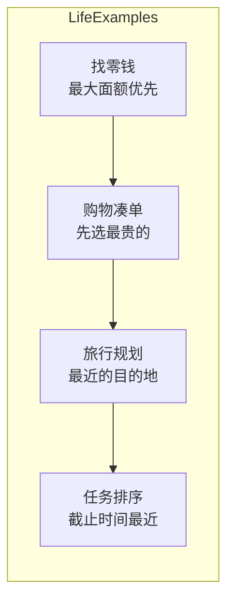

**贪心算法的定义：**

> 在每一步决策时，都选择当前状态下**最优**的选择，期望最终达到**全局最优**。

**关键特征：**
- **局部最优**：每一步都是当前最好的选择
- **不可回退**：一旦做出选择，就不后悔
- **期望全局最优**：希望局部最优能累积成全局最优

### 1.2 贪心 vs 动态规划

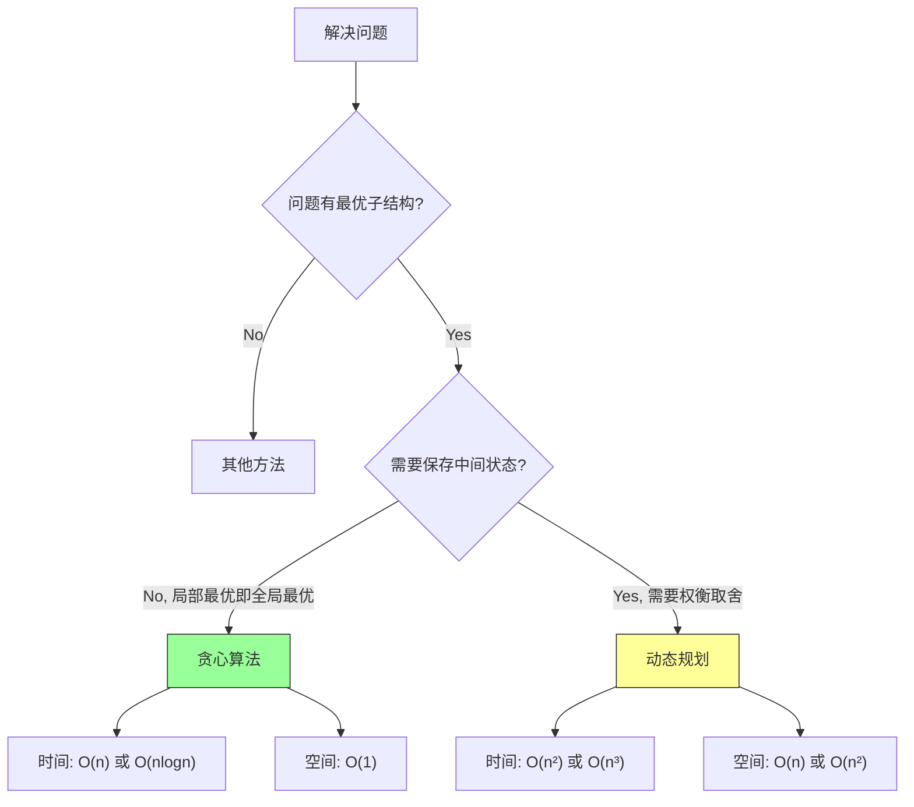

**贪心 vs 动态规划对比：**

| 特征 | 贪心算法 | 动态规划 |
|-----|---------|---------|
| 决策时机 | 每次选一个，不回溯 | 考虑所有可能 |
| 最优性 | 局部最优 → 全局最优 | 保证全局最优 |
| 时间复杂度 | 通常 O(n) 或 O(nlogn) | 通常 O(n²) 或更高 |
| 空间复杂度 | 通常 O(1) | 通常 O(n) 或 O(n²) |
| 证明难度 | 难（需要证明贪心选择性） | 相对容易（状态转移明确） |

### 1.3 贪心算法的适用条件

**要使用贪心算法，必须满足两个条件：**

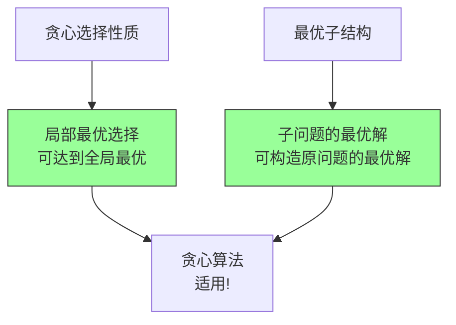

**贪心选择性质（Greedy Choice Property）：**
- 通过一系列局部最优选择，可以构造出全局最优解
- 不需要考虑子问题的解，只需要当前最优

**最优子结构（Optimal Substructure）：**
- 一个问题的最优解包含其子问题的最优解
- 动态规划和贪心都要求这个条件

### 1.4 贪心算法的设计步骤

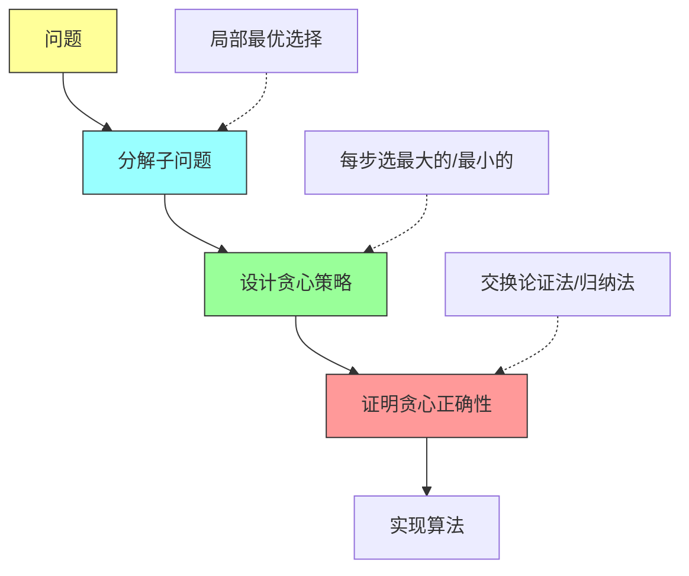

**证明贪心正确性的方法：**

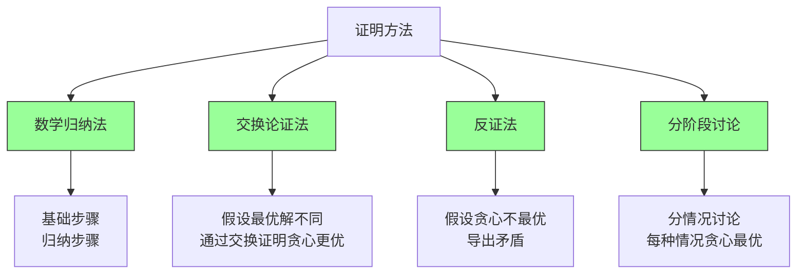

---

## 二、基础贪心问题

### 2.1 分发糖果（LeetCode 135）

#### 2.1.1 问题描述

**题目**：n 个孩子站成一排，每个孩子有一个评分 rating。要求：
- 每个孩子至少得到 1 个糖果
- 如果一个孩子的评分比相邻的孩子高，他必须得到更多糖果
- 求最少的糖果数量

**示例**：
```
Input: ratings = [1, 0, 2]
Output: 5
解释: [2, 1, 2] 或 [2, 1, 2] 最少需要 5 个糖果
```

#### 2.1.2 思路分析

**直观想法**：从左到右遍历，右边比左边大就加 1，右边比左边小就重置为 1。

**问题**：这种方法只考虑了左边，没有考虑右边。

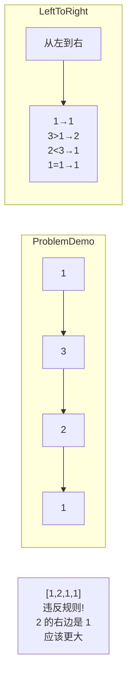

**贪心策略**：

1. **从左到右**：保证右边比左边大的关系
2. **从右到左**：保证左边比右边大的关系
3. **取最大值**：每个位置取两个方向的最大值

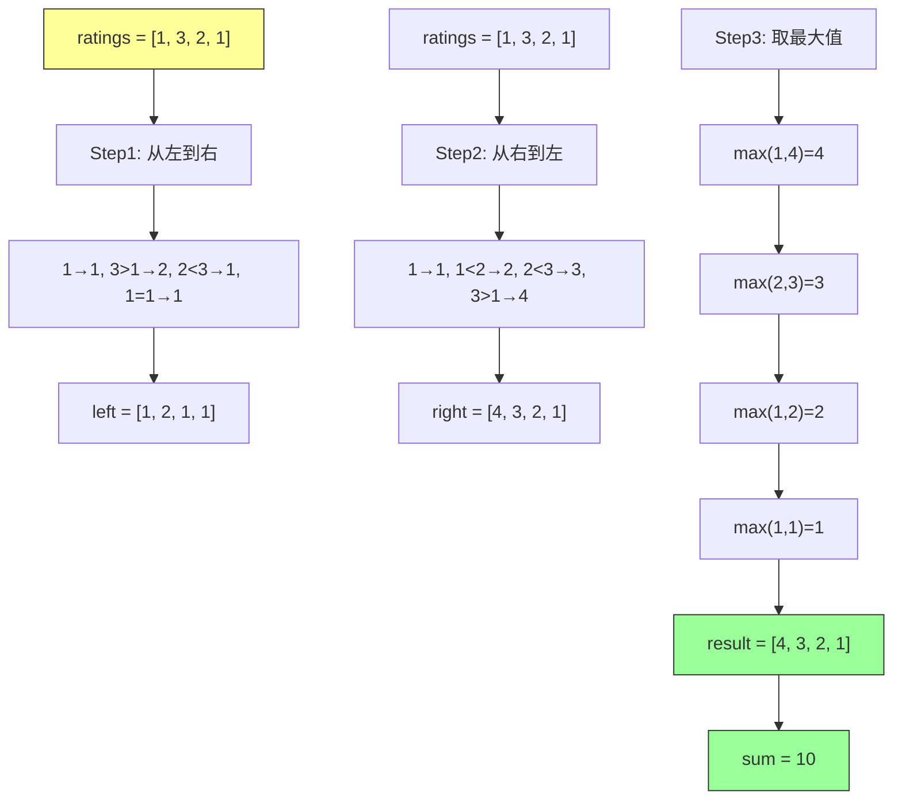

#### 2.1.3 正确性证明

**贪心选择性质证明**：

对于任意位置 i，糖果数量 `c[i]` 必须同时满足：
- `c[i] ≥ 1`（基础要求）
- `c[i] ≥ c[i-1] + 1` 如果 `rating[i] > rating[i-1]`（左约束）
- `c[i] ≥ c[i+1] + 1` 如果 `rating[i] > rating[i+1]`（右约束）

**贪心策略**：取满足所有约束的最小值 = `max(1, 左约束要求, 右约束要求)`

**为什么是最优**：
- 取更小的值会违反约束
- 取更大的值会增加总糖果数
- 因此 `max(左, 右)` 是该位置的最优解

#### 2.1.4 Java 实现

```java
/**
 * 135. 分发糖果
 * 贪心策略：两次遍历 + 取最大值
 * 时间复杂度: O(n)
 * 空间复杂度: O(n)
 */
class Solution {
    public int candy(int[] ratings) {
        if (ratings == null || ratings.length == 0) return 0;
        if (ratings.length == 1) return 1;

        int n = ratings.length;
        int[] left = new int[n];
        int[] right = new int[n];

        // 初始化
        Arrays.fill(left, 1);
        Arrays.fill(right, 1);

        // 从左到右遍历
        for (int i = 1; i < n; i++) {
            if (ratings[i] > ratings[i - 1]) {
                left[i] = left[i - 1] + 1;
            }
        }

        // 从右到左遍历
        for (int i = n - 2; i >= 0; i--) {
            if (ratings[i] > ratings[i + 1]) {
                right[i] = right[i + 1] + 1;
            }
        }

        // 取最大值
        int result = 0;
        for (int i = 0; i < n; i++) {
            result += Math.max(left[i], right[i]);
        }

        return result;
    }

    // 空间优化版本
    public int candyOptimized(int[] ratings) {
        if (ratings == null || ratings.length == 0) return 0;

        int n = ratings.length;
        int[] candies = new int[n];
        Arrays.fill(candies, 1);

        // 从左到右
        for (int i = 1; i < n; i++) {
            if (ratings[i] > ratings[i - 1]) {
                candies[i] = candies[i - 1] + 1;
            }
        }

        // 从右到左，检查是否需要增加
        for (int i = n - 2; i >= 0; i--) {
            if (ratings[i] > ratings[i + 1]) {
                candies[i] = Math.max(candies[i], candies[i + 1] + 1);
            }
        }

        return Arrays.stream(candies).sum();
    }
}
```

#### 2.1.5 具体例子演示

**例子 1**：`ratings = [1, 3, 2, 1]`

```
Step 1: 从左到右
        ratings: [1, 3, 2, 1]
        left:    [1, 2, 1, 1]  ← 3>1 所以 left[1]=2

Step 2: 从右到左
        ratings: [1, 3, 2, 1]
        right:   [4, 3, 2, 1]  ← 3>1 所以 right[0]=right[1]+1=3+1=4

Step 3: 取最大值
        result = max(1,4) + max(2,3) + max(1,2) + max(1,1)
               = 4 + 3 + 2 + 1 = 10
```

**例子 2**：`ratings = [1, 2, 2, 2, 1]`

```
Step 1: 从左到右
        ratings: [1, 2, 2, 2, 1]
        left:    [1, 2, 1, 1, 1]

Step 2: 从右到左
        ratings: [1, 2, 2, 2, 1]
        right:   [1, 2, 2, 2, 1]

Step 3: 取最大值
        result = max(1,1) + max(2,2) + max(1,2) + max(1,2) + max(1,1)
               = 1 + 2 + 2 + 2 + 1 = 8
```

---

### 2.2 跳跃游戏（LeetCode 55）

#### 2.2.1 问题描述

**题目**：给定一个非负整数数组 `nums`，每个元素表示在该位置可以跳跃的最大长度。判断是否能跳到最后一个位置。

**示例**：
```
Input: nums = [2, 3, 1, 1, 4]
Output: true
解释: 2→3→4 可以到达

Input: nums = [3, 2, 1, 0, 4]
Output: false
解释: 在位置 3 无法继续前进
```

#### 2.2.2 思路分析

**贪心策略**：维护当前能够到达的最远位置

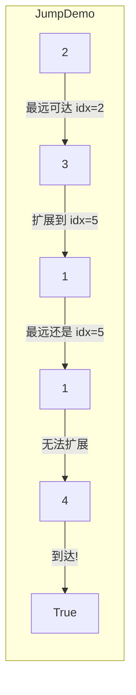

**算法流程**：

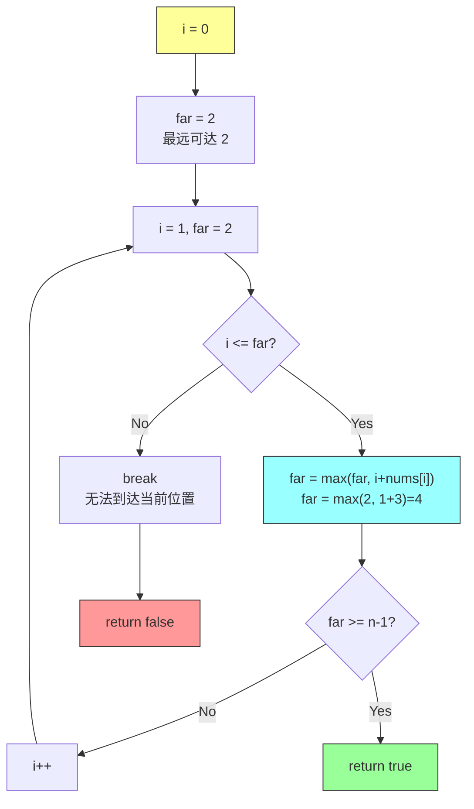

#### 2.2.3 正确性证明

**贪心选择性质证明**：

设 `reach` 为当前能够到达的最远位置。

**关键观察**：
- 如果位置 `i` 在 `[0, reach]` 范围内，那么 `i` 是可达的
- 从 `i` 可以扩展到 `[i+1, i+nums[i]]`
- 因此新的可达范围是 `[0, max(reach, i+nums[i])]`

**贪心策略**：每次选择能够扩展最远范围的 `i`

**为什么是最优**：
- 不需要记录所有可达位置
- 只需要维护最远可达位置
- 如果 `i` 超过 `reach`，说明没有路径能到达 `i`

**反证法**：
假设存在一个位置 `i`（`i ≤ reach`）使得 `i+nums[i]` 扩展更远，但我们没有选择它。
实际上，算法遍历所有 `i ≤ reach`，都会计算 `i+nums[i]`，所以不存在这种情况。

#### 2.2.4 Java 实现

```java
/**
 * 55. 跳跃游戏
 * 贪心策略：维护最远可达位置
 * 时间复杂度: O(n)
 * 空间复杂度: O(1)
 */
class Solution {
    public boolean canJump(int[] nums) {
        int n = nums.length;
        int far = 0;  // 当前能够到达的最远位置

        for (int i = 0; i < n; i++) {
            // 如果当前位置不可达，直接返回 false
            if (i > far) {
                return false;
            }

            // 更新最远可达位置
            far = Math.max(far, i + nums[i]);

            // 如果已经能够到达或超过最后一个位置
            if (far >= n - 1) {
                return true;
            }
        }

        return far >= n - 1;
    }

    // 简洁版本
    public boolean canJumpConcise(int[] nums) {
        int far = 0;
        for (int i = 0; i < nums.length; i++) {
            if (i > far) return false;
            far = Math.max(far, i + nums[i]);
        }
        return true;
    }
}
```

#### 2.2.5 具体例子演示

**例子 1**：`nums = [2, 3, 1, 1, 4]`

```
i = 0: far = max(0, 0+2) = 2    ← 可达 [0, 2]
i = 1: far = max(2, 1+3) = 4    ← 可达 [0, 4]
i = 2: far = max(4, 2+1) = 4    ← 可达 [0, 4]
i = 3: far = max(4, 3+1) = 4    ← 可达 [0, 4]
i = 4: far = max(4, 4+4) = 8    ← 可达 [0, 8]，>= 4 成功!

result = true
```

**例子 2**：`nums = [3, 2, 1, 0, 4]`

```
i = 0: far = max(0, 0+3) = 3    ← 可达 [0, 3]
i = 1: far = max(3, 1+2) = 3    ← 可达 [0, 3]
i = 2: far = max(3, 2+1) = 3    ← 可达 [0, 3]
i = 3: far = max(3, 3+0) = 3    ← 可达 [0, 3]
i = 4: i > far (4 > 3)          ← 不可达!

result = false
```

---

### 2.3 跳跃游戏 II（LeetCode 45）

#### 2.3.1 问题描述

**题目**：给定一个非负整数数组 `nums`，每个元素表示在该位置可以跳跃的最大长度。求到达最后一个位置的最少跳跃次数。

**示例**：
```
Input: nums = [2, 3, 1, 1, 4]
Output: 2
解释: 2→3→4，至少需要 2 次跳跃
```

#### 2.3.2 思路分析

**贪心策略**：在每一步的可达范围内，选择能跳得最远的位置

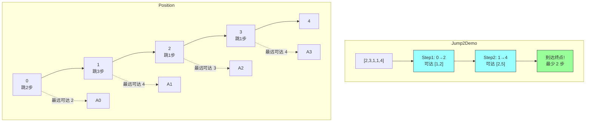

**算法流程**：

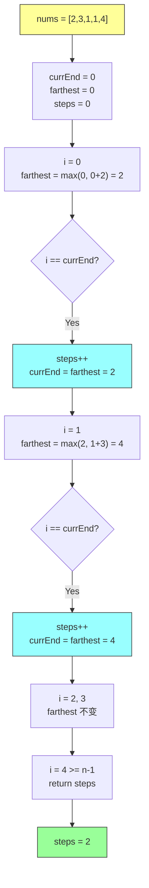

#### 2.3.3 正确性证明

**贪心选择性质证明**：

设 `currEnd` 为当前跳跃能够到达的边界，`farthest` 为在 `[0, currEnd]` 范围内能够跳到的最远位置。

**贪心选择**：在到达 `currEnd` 时进行下一次跳跃，选择能够跳到 `farthest` 的位置

**为什么是最优**：
- 在 `[0, currEnd]` 范围内的任何位置，都无法跳出 `currEnd` 的范围
- 为了到达更远的位置，必须在 `currEnd` 之前选择最优的起跳点
- 选择能跳到 `farthest` 的位置，使下一次跳跃的范围最大

**数学归纳法**：
- 基础：`steps = 0` 时，`farthest = nums[0]`，显然最优
- 归纳：假设第 `k` 步时选择的位置是最优的，那么第 `k+1` 步的选择也是最优的

#### 2.3.4 Java 实现

```java
/**
 * 45. 跳跃游戏 II
 * 贪心策略：在边界处选择最优起跳点
 * 时间复杂度: O(n)
 * 空间复杂度: O(1)
 */
class Solution {
    public int jump(int[] nums) {
        int n = nums.length;
        int steps = 0;      // 跳跃次数
        int currEnd = 0;    // 当前跳跃的边界
        int farthest = 0;   // 在当前边界内能跳到的最远位置

        for (int i = 0; i < n - 1; i++) {  // 最后一个位置不需要跳
            // 更新最远可达位置
            farthest = Math.max(farthest, i + nums[i]);

            // 到达当前边界，需要跳一次
            if (i == currEnd) {
                steps++;
                currEnd = farthest;

                // 提前结束：如果已经能到达终点
                if (currEnd >= n - 1) {
                    break;
                }
            }
        }

        return steps;
    }

    // 清晰版本（每一步都计算）
    public int jumpClear(int[] nums) {
        if (nums == null || nums.length < 2) return 0;

        int steps = 0;
        int currEnd = 0;
        int farthest = 0;

        for (int i = 0; i < nums.length - 1; i++) {
            farthest = Math.max(farthest, i + nums[i]);

            if (i == currEnd) {
                steps++;
                currEnd = farthest;
                if (currEnd >= nums.length - 1) break;
            }
        }

        return steps;
    }
}
```

#### 2.3.5 具体例子演示

**例子 1**：`nums = [2, 3, 1, 1, 4]`

```
初始: steps=0, currEnd=0, farthest=0

i=0: farthest = max(0, 0+2) = 2
     i == currEnd (0 == 0): steps=1, currEnd=2

i=1: farthest = max(2, 1+3) = 4
     i == currEnd (1 == 2): 继续

i=2: farthest = max(4, 2+1) = 4
     i == currEnd (2 == 2): steps=2, currEnd=4

i=3: farthest = max(4, 3+1) = 4
     i != currEnd (3 != 4): 继续

i=4: 循环结束（只到 n-1=3）

result: steps = 2
```

**例子 2**：`nums = [0]`

```
循环不执行（n-1 = -1 < 0）
result: steps = 0
```

---

### 2.4 无重叠区间（LeetCode 435）

#### 2.4.1 问题描述

**题目**：给定一个区间的集合，找到需要移除的最少区间数量，使得剩余区间互不重叠。

**示例**：
```
Input: intervals = [[1,2],[2,3],[3,4],[1,3]]
Output: 1
解释: 移除 [1,3]，剩下 [1,2],[2,3],[3,4] 互不重叠
```

#### 2.4.2 思路分析

**贪心策略**：按结束时间排序，选择结束最早的区间

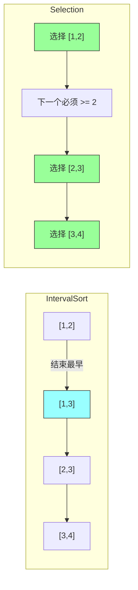

**为什么按结束时间排序？**

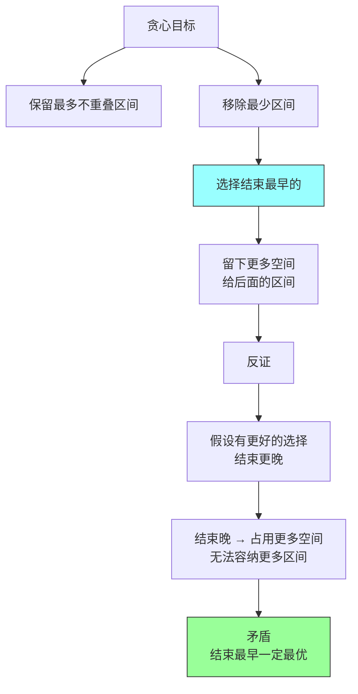

#### 2.4.3 正确性证明

**贪心选择性质证明**：

设 `I` 为所有区间，`S` 为按结束时间排序后的区间序列。

**贪心选择**：总是选择结束最早的、与前一个区间不重叠的区间。

**交换论证法**：
1. 假设最优解 `OPT` 的第一个区间是 `X`
2. 贪心解 `GREEDY` 的第一个区间是 `Y`（结束最早的区间）
3. 由于 `Y.end ≤ X.end`，用 `Y` 替换 `X` 不会影响后续区间的选择
4. 替换后的解与 `OPT` 有相同数量的区间，且不重叠
5. 因此 `GREEDY` 的第一个选择是最优的

**数学归纳法**：
- 基础：第一个区间的选择是最优的
- 归纳：假设前 `k` 个区间的选择是最优的，那么第 `k+1` 个区间的选择也是最优的

#### 2.4.4 Java 实现

```java
/**
 * 435. 无重叠区间
 * 贪心策略：按结束时间排序，选择不重叠的区间
 * 时间复杂度: O(n log n) 排序
 * 空间复杂度: O(n) 或 O(1)（原地排序）
 */
class Solution {
    public int eraseOverlapIntervals(int[][] intervals) {
        if (intervals == null || intervals.length == 0) return 0;

        // 按结束时间排序
        Arrays.sort(intervals, (a, b) -> {
            if (a[1] == b[1]) return a[0] - b[0];
            return a[1] - b[1];
        });

        int count = 0;          // 需要移除的区间数
        int prevEnd = intervals[0][1];  // 上一个选中的结束时间

        for (int i = 1; i < intervals.length; i++) {
            // 如果当前区间与上一个重叠，需要移除
            if (intervals[i][0] < prevEnd) {
                count++;
            } else {
                // 不重叠，更新 prevEnd
                prevEnd = intervals[i][1];
            }
        }

        return count;
    }

    // 计算最多不重叠区间数
    public int maxNonOverlappingIntervals(int[][] intervals) {
        if (intervals == null || intervals.length == 0) return 0;

        Arrays.sort(intervals, (a, b) -> {
            if (a[1] == b[1]) return a[0] - b[0];
            return a[1] - b[1];
        });

        int count = 1;
        int prevEnd = intervals[0][1];

        for (int i = 1; i < intervals.length; i++) {
            if (intervals[i][0] >= prevEnd) {
                count++;
                prevEnd = intervals[i][1];
            }
        }

        return count;
    }
}
```

#### 2.4.5 具体例子演示

**例子**：`intervals = [[1,2],[2,3],[3,4],[1,3]]`

```
排序后: [[1,2], [1,3], [2,3], [3,4]]
        按结束时间: 2 → 3 → 3 → 4

prevEnd = 2 (第一个区间 [1,2])
count = 0

i=1: [1,3], start=1 < prevEnd=2 → 重叠，count=1
i=2: [2,3], start=2 >= prevEnd=2 → 不重叠，prevEnd=3
i=3: [3,4], start=3 >= prevEnd=3 → 不重叠，prevEnd=4

result: count = 1
```

---

## 三、区间调度问题

### 3.1 区间调度概述

**区间调度问题模板：**

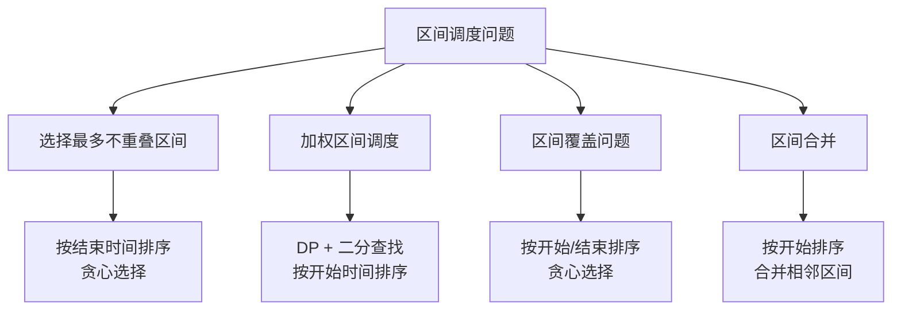

### 3.2 射箭引爆气球（LeetCode 452）

#### 3.2.1 问题描述

**题目**：在二维平面上有 `n` 个气球，水平放置。每个气球用一个区间 `[x_start, x_end]` 表示。一支箭垂直于 x 轴射出，如果箭的位置 `x` 满足 `x_start ≤ x ≤ x_end`，则气球被引爆。求引爆所有气球所需的最少箭数。

**示例**：
```
Input: points = [[10,16],[2,8],[1,6],[7,12]]
Output: 2
解释:
  - 箭在 x=6 或 x=7 引爆 [1,6] 和 [2,8]
  - 箭在 x=11 引爆 [10,16] 和 [7,12]
```

#### 3.2.2 思路分析

**贪心策略**：按结束时间排序，在气球的右边界射箭

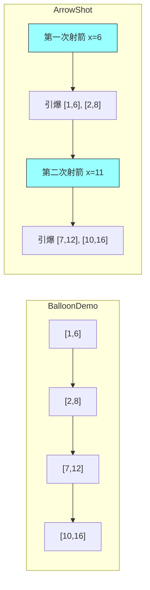

**为什么在右边界射箭？**

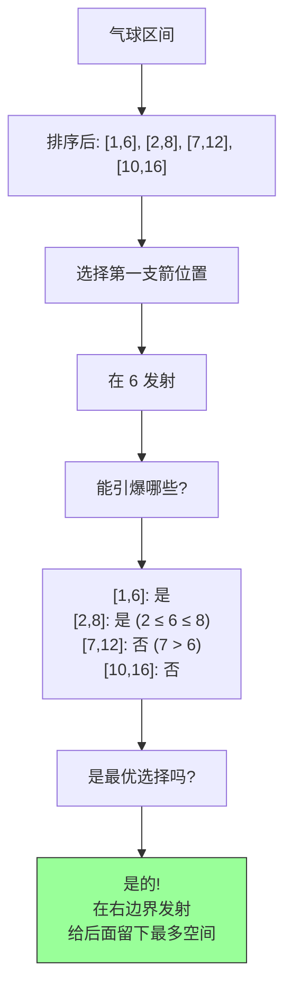

#### 3.2.3 Java 实现

```java
/**
 * 452. 用最少数量的箭引爆气球
 * 贪心策略：按结束时间排序，在右边界射箭
 * 时间复杂度: O(n log n) 排序
 * 空间复杂度: O(1)
 */
class Solution {
    public int findMinArrowShots(int[][] points) {
        if (points == null || points.length == 0) return 0;
        if (points.length == 1) return 1;

        // 按结束时间排序
        Arrays.sort(points, (a, b) -> {
            if (a[1] == b[1]) return a[0] - b[0];
            return a[1] - b[1];
        });

        int arrows = 1;
        int arrowPos = points[0][1];  // 第一支箭的位置

        for (int i = 1; i < points.length; i++) {
            // 如果当前气球的左边界 > 箭的位置，需要新的一支箭
            if (points[i][0] > arrowPos) {
                arrows++;
                arrowPos = points[i][1];  // 更新箭的位置
            }
            // else: 当前气球已被箭引爆，无需额外操作
        }

        return arrows;
    }

    // 另一种写法：明确处理等于的情况
    public int findMinArrowShots2(int[][] points) {
        if (points == null || points.length == 0) return 0;

        Arrays.sort(points, (a, b) -> a[1] - b[1]);

        int arrows = 1;
        int arrowPos = points[0][1];

        for (int i = 1; i < points.length; i++) {
            // 箭的位置必须在气球区间内才能引爆
            // points[i][0] <= arrowPos <= points[i][1]
            // 如果 points[i][0] > arrowPos，需要新箭
            if (points[i][0] > arrowPos) {
                arrows++;
                arrowPos = points[i][1];
            }
        }

        return arrows;
    }
}
```

#### 3.2.4 具体例子演示

**例子**：`points = [[10,16],[2,8],[1,6],[7,12]]`

```
排序后: [[1,6], [2,8], [7,12], [10,16]]
        按结束时间: 6 → 8 → 12 → 16

arrows = 1, arrowPos = 6

i=1: [2,8], start=2 <= arrowPos=6 → 已被引爆
i=2: [7,12], start=7 > arrowPos=6 → 需要新箭
      arrows = 2, arrowPos = 12
i=3: [10,16], start=10 <= arrowPos=12 → 已被引爆

result: arrows = 2
```

---

### 3.3 安排会议（LeetCode 会议室问题）

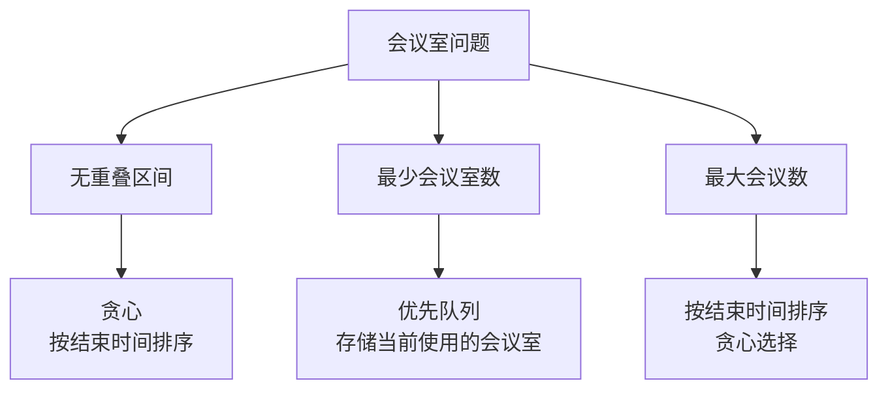

**最少会议室数问题：**

```java
/**
 * 最少会议室数
 * 贪心策略：使用优先队列，按结束时间排序
 * 时间复杂度: O(n log n)
 */
class Solution {
    public int minMeetingRooms(int[][] intervals) {
        if (intervals == null || intervals.length == 0) return 0;

        // 按开始时间排序
        Arrays.sort(intervals, (a, b) -> a[0] - b[0]);

        // 优先队列：按结束时间排序
        PriorityQueue<Integer> pq = new PriorityQueue<>();
        pq.offer(intervals[0][1]);

        for (int i = 1; i < intervals.length; i++) {
            // 如果下一个会议开始时间 >= 最早结束的会议
            if (intervals[i][0] >= pq.peek()) {
                pq.poll();  // 会议室可用
            }
            pq.offer(intervals[i][1]);  // 分配新会议室
        }

        return pq.size();
    }
}
```

---

## 四、背包问题中的贪心

### 4.1 分数背包问题（Fractional Knapsack）

#### 4.1.1 问题描述

**题目**：给定一组物品，每个物品有重量 `w` 和价值 `v`。有一个背包容量为 `C`。可以取物品的一部分，求能装入背包的最大价值。

**特点**：可以取分数

**示例**：
```
物品: {重量, 价值}
  A: {10, 60}
  B: {20, 100}
  C: {30, 120}

背包容量: 50

最优解:
  取全部 A (60) + 全部 B (100) = 160
  剩余容量 20，取 C 的 20/30 = 2/3，价值 80
  总价值: 60 + 100 + 80 = 240
```

#### 4.1.2 贪心策略

**策略**：按单位价值（价值/重量）排序，从高到低取

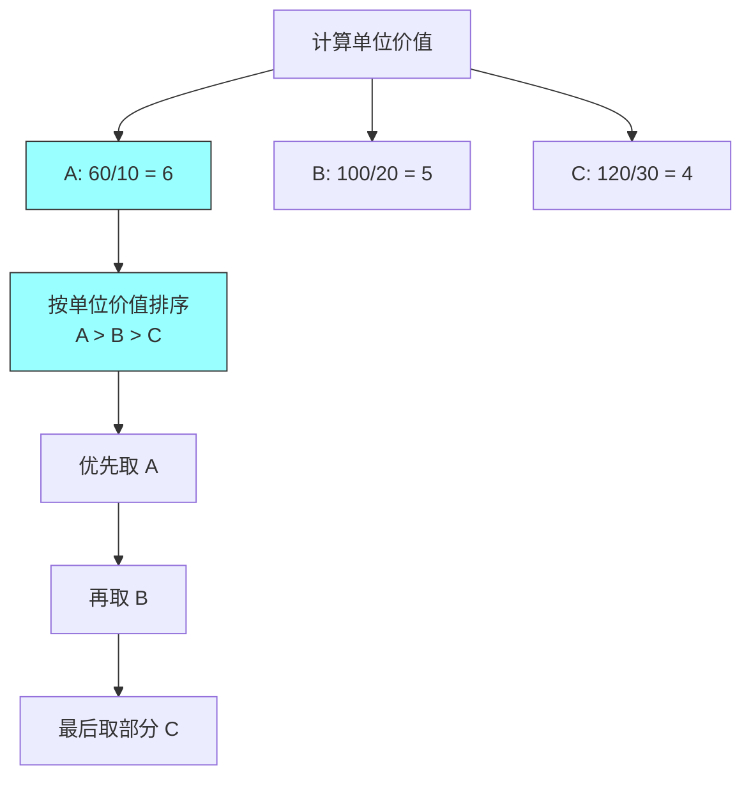

#### 4.1.3 正确性证明

**贪心选择性质证明**：

设 `S` 为所有物品，`x` 为选择的比例向量。

**贪心选择**：总是选择单位价值最高的物品。

**交换论证法**：
1. 假设最优解 `OPT` 中存在物品 `i`，其比例 `x_i < 1`，且存在物品 `j` 的单位价值更高
2. 在 `OPT` 中，用物品 `j` 替换物品 `i` 的一部分
3. 替换后的总重量不变，总价值增加（因为 `v_j/w_j > v_i/w_i`）
4. 这与 `OPT` 的最优性矛盾

因此，最优解必须包含尽可能多的高单位价值物品。

#### 4.1.4 Java 实现

```java
/**
 * 分数背包问题
 * 贪心策略：按单位价值排序
 * 时间复杂度: O(n log n) 排序
 * 空间复杂度: O(n)
 */
class Solution {
    static class Item {
        double value;
        double weight;
        double ratio;  // 单位价值

        Item(double value, double weight) {
            this.value = value;
            this.weight = weight;
            this.ratio = value / weight;
        }
    }

    public double fractionalKnapsack(double capacity, List<Item> items) {
        // 按单位价值降序排序
        items.sort((a, b) -> Double.compare(b.ratio, a.ratio));

        double totalValue = 0;
        double remaining = capacity;

        for (Item item : items) {
            if (remaining == 0) break;

            // 如果能装下整个物品
            if (item.weight <= remaining) {
                totalValue += item.value;
                remaining -= item.weight;
            } else {
                // 只能装一部分
                totalValue += item.ratio * remaining;
                remaining = 0;
            }
        }

        return totalValue;
    }

    public static void main(String[] args) {
        Solution s = new Solution();
        List<Item> items = Arrays.asList(
            new Item(60, 10),
            new Item(100, 20),
            new Item(120, 30)
        );

        double result = s.fractionalKnapsack(50, items);
        System.out.println("最大价值: " + result);  // 240.0
    }
}
```

#### 4.1.5 0-1 背包 vs 分数背包

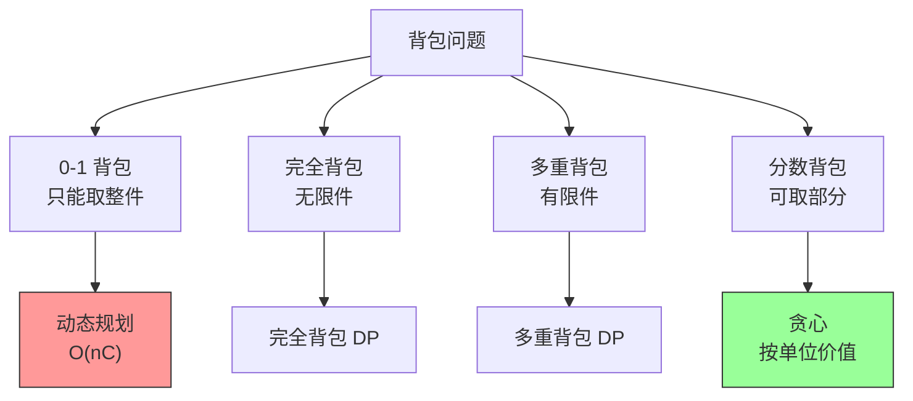

---

## 五、哈夫曼编码（Huffman Coding）

### 5.1 问题背景

**应用**：数据压缩

**目标**：用最短的编码表示字符，出现频率高的字符用短编码

**示例**：

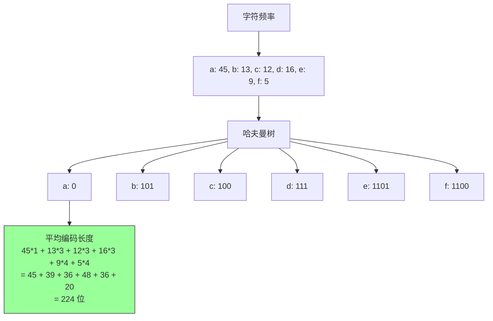

### 5.2 哈夫曼编码算法

**贪心策略**：每次选择频率最低的两个节点合并

```mermaid
flowchart TD
    A["构建哈夫曼树"] --> B["将所有字符作为叶子节点<br/>放入优先队列"]
    B --> C["每次取出两个频率最低的节点"]
    C --> D["合并成新节点<br/>频率 = 频率1 + 频率2"]
    D --> E["将新节点放回队列"]
    E --> F["重复直到只剩一个节点"]
    F --> G["哈夫曼树构建完成"]

    style B fill:#99ffff,stroke:#333
    style C fill:#99ffff,stroke:#333
    style G fill:#99ff99,stroke:#333
```

### 5.3 正确性证明

**贪心选择性质证明**：

**贪心选择**：每次选择频率最低的两个节点合并。

**为什么是最优**：
1. 设 `A` 和 `B` 是频率最低的两个节点
2. 在最优树 `T` 中，`A` 和 `B` 一定是深度最深的叶子（因为频率低，应该用短编码）
3. 如果 `A` 和 `B` 在 `T` 中不是兄弟，交换它们的位置
4. 交换不会增加任何节点的深度，反而可能减少
5. 因此，总加权深度不会增加

**数学归纳法**：
- 基础：两个节点时，显然最优
- 归纳：假设 `k` 个节点的哈夫曼树是最优的，那么 `k+1` 个节点时选择频率最低的两个合并后，递归构建的树也是最优的

### 5.4 Java 实现

```java
import java.util.*;

/**
 * 哈夫曼编码
 * 贪心策略：使用优先队列，每次合并频率最低的两个节点
 * 时间复杂度: O(n log n)
 * 空间复杂度: O(n)
 */
class HuffmanCoding {

    static class Node implements Comparable<Node> {
        int freq;
        Node left, right;

        Node(int freq) {
            this.freq = freq;
        }

        Node(int freq, Node left, Node right) {
            this.freq = freq;
            this.left = left;
            this.right = right;
        }

        @Override
        public int compareTo(Node other) {
            return this.freq - other.freq;
        }

        // 检查是否是叶子节点
        boolean isLeaf() {
            return left == null && right == null;
        }
    }

    /**
     * 构建哈夫曼树
     */
    public Node buildHuffmanTree(int[] frequencies) {
        PriorityQueue<Node> pq = new PriorityQueue<>();

        // 将所有频率作为叶子节点放入优先队列
        for (int freq : frequencies) {
            if (freq > 0) {
                pq.offer(new Node(freq));
            }
        }

        // 队列为空（没有字符）或只有一个节点
        if (pq.isEmpty()) return null;
        if (pq.size() == 1) return pq.poll();

        // 每次取出两个频率最低的节点合并
        while (pq.size() > 1) {
            Node left = pq.poll();
            Node right = pq.poll();
            Node parent = new Node(left.freq + right.freq, left, right);
            pq.offer(parent);
        }

        return pq.poll();
    }

    /**
     * 生成哈夫曼编码
     */
    public Map<Character, String> generateCodes(Node root, char[] chars) {
        Map<Character, String> codes = new HashMap<>();
        if (root == null) return codes;

        generateCodesHelper(root, "", codes, chars);
        return codes;
    }

    private void generateCodesHelper(Node node, String code,
                                     Map<Character, String> codes, char[] chars) {
        if (node.isLeaf()) {
            int index = node.freq - 1;  // 频率对应字符索引
            codes.put(chars[index], code);
            return;
        }

        // 左子树编码 + 0，右子树编码 + 1
        if (node.left != null) {
            generateCodesHelper(node.left, code + "0", codes, chars);
        }
        if (node.right != null) {
            generateCodesHelper(node.right, code + "1", codes, chars);
        }
    }

    /**
     * 计算加权路径长度（总编码长度）
     */
    public int calculateWeightedPathLength(Node root) {
        return calculateWeightedPathLengthHelper(root, 0);
    }

    private int calculateWeightedPathLengthHelper(Node node, int depth) {
        if (node == null) return 0;
        if (node.isLeaf()) {
            return node.freq * depth;
        }
        return calculateWeightedPathLengthHelper(node.left, depth + 1) +
               calculateWeightedPathLengthHelper(node.right, depth + 1);
    }

    public static void main(String[] args) {
        HuffmanCoding huffman = new HuffmanCoding();

        // 字符和频率
        char[] chars = {'a', 'b', 'c', 'd', 'e', 'f'};
        int[] frequencies = {45, 13, 12, 16, 9, 5};

        // 构建哈夫曼树
        Node root = huffman.buildHuffmanTree(frequencies);

        // 生成编码
        Map<Character, String> codes = huffman.generateCodes(root, chars);

        // 打印结果
        System.out.println("哈夫曼编码：");
        for (int i = 0; i < chars.length; i++) {
            System.out.println(chars[i] + ": " + codes.get(chars[i]));
        }

        // 计算总编码长度
        int wpl = huffman.calculateWeightedPathLength(root);
        System.out.println("\n加权路径长度: " + wpl);
    }
}
```

### 5.5 具体例子演示

**频率**：`{a:45, b:13, c:12, d:16, e:9, f:5}`

```
Step 1: 放入优先队列
        [5(f), 9(e), 12(c), 13(b), 16(d), 45(a)]

Step 2: 取出两个最小的 (5, 9)，合并成 14
        [12(c), 13(b), 14(f+e), 16(d), 45(a)]

Step 3: 取出两个最小的 (12, 13)，合并成 25
        [14(f+e), 16(d), 25(b+c), 45(a)]

Step 4: 取出两个最小的 (14, 16)，合并成 30
        [25(b+c), 30(d+f+e), 45(a)]

Step 5: 取出两个最小的 (25, 30)，合并成 55
        [45(a), 55(b+c+d+e+f)]

Step 6: 取出两个最小的 (45, 55)，合并成 100
        [100]

哈夫曼树构建完成！
```

---

## 六、最小生成树（MST）

### 6.1 Kruskal 算法

#### 6.1.1 算法描述

**贪心策略**：每次选择权值最小的、不形成环的边

```mermaid
flowchart TD
    A["Kruskal 算法"] --> B["将所有边按权重排序<br/>从小到大"]
    A --> C["依次考虑每条边"]
    A --> D["如果边不形成环<br/>则加入生成树"]
    A --> E["直到加入 n-1 条边"]

    style B fill:#99ffff,stroke:#333
    style C fill:#99ffff,stroke:#333
    style D fill:#99ffff,stroke:#333
    style E fill:#99ff99,stroke:#333
```

**使用并查集（Union-Find）检测环：**

```mermaid
flowchart TD
    A["并查集"] --> B["find(x)<br/>查找 x 的根节点"]
    A --> C["union(x, y)<br/>合并 x 和 y 的集合"]
    A --> D["connected(x, y)<br/>判断 x 和 y 是否连通"]

    B --> E["路径压缩优化"]
    C --> F["按秩合并优化"]

    style E fill:#99ffff,stroke:#333
    style F fill:#99ffff,stroke:#333
```

#### 6.1.2 正确性证明

**贪心选择性质证明**：

设 `T` 为 Kruskal 算法生成的树，`T*` 为最优 MST。

**关键观察**：Kruskal 算法每一步选择的边都是当前可选择的边中权重最小的。

**Cut Property（割性质）**：

> 对于图的任意割（将顶点分成两个非空集合），横跨该割的所有边中，权重最小的那条边一定属于某棵 MST。

**证明**：
1. 设 `C` 为任意割，`e` 为横跨 `C` 的最小权重边
2. 假设 `e` 不属于 MST `T*`
3. 在 `T*` 中存在一条连接 `C` 两边的路径 `P`
4. `P` 中至少有一条边 `f` 横跨 `C`
5. 由于 `e` 是最小边，`weight(e) ≤ weight(f)`
6. 用 `e` 替换 `f`，得到一棵新的生成树 `T'`
7. `weight(T') ≤ weight(T*)`，所以 `T'` 也是 MST
8. 因此 `e` 属于某棵 MST

Kruskal 算法正是不断应用 Cut Property，选择当前可选择的最小边。

#### 6.1.3 Java 实现

```java
import java.util.*;

/**
 * Kruskal 算法 - 最小生成树
 * 贪心策略：每次选择权值最小的、不形成环的边
 * 时间复杂度: O(E log E) 排序 + O(E α(V)) 并查集
 */
class KruskalMST {

    /**
     * 并查集（Union-Find）
     */
    static class UnionFind {
        private int[] parent;
        private int[] rank;

        UnionFind(int n) {
            parent = new int[n];
            rank = new int[n];
            for (int i = 0; i < n; i++) {
                parent[i] = i;
                rank[i] = 0;
            }
        }

        // 查找根节点（路径压缩）
        int find(int x) {
            if (parent[x] != x) {
                parent[x] = find(parent[x]);
            }
            return parent[x];
        }

        // 按秩合并
        void union(int x, int y) {
            int px = find(x);
            int py = find(y);

            if (px == py) return;

            if (rank[px] < rank[py]) {
                parent[px] = py;
            } else if (rank[px] > rank[py]) {
                parent[py] = px;
            } else {
                parent[py] = px;
                rank[px]++;
            }
        }

        boolean connected(int x, int y) {
            return find(x) == find(y);
        }
    }

    /**
     * 边的定义
     */
    static class Edge implements Comparable<Edge> {
        int u, v;
        int weight;

        Edge(int u, int v, int weight) {
            this.u = u;
            this.v = v;
            this.weight = weight;
        }

        @Override
        public int compareTo(Edge other) {
            return this.weight - other.weight;
        }
    }

    /**
     * Kruskal 算法主函数
     */
    public List<Edge> kruskal(int n, List<Edge> edges) {
        List<Edge> mst = new ArrayList<>();
        UnionFind uf = new UnionFind(n);

        // 按权重排序
        Collections.sort(edges);

        for (Edge edge : edges) {
            // 如果不形成环，则加入 MST
            if (!uf.connected(edge.u, edge.v)) {
                uf.union(edge.u, edge.v);
                mst.add(edge);

                // 已经有 n-1 条边，提前结束
                if (mst.size() == n - 1) {
                    break;
                }
            }
        }

        return mst;
    }

    /**
     * 计算 MST 总权重
     */
    public int mstWeight(List<Edge> mst) {
        return mst.stream().mapToInt(e -> e.weight).sum();
    }

    public static void main(String[] args) {
        KruskalMST mst = new KruskalMST();

        // 图：5 个顶点，8 条边
        int n = 5;
        List<Edge> edges = Arrays.asList(
            new Edge(0, 1, 10),
            new Edge(0, 2, 6),
            new Edge(0, 3, 5),
            new Edge(1, 3, 15),
            new Edge(2, 3, 4),
            new Edge(1, 4, 9),
            new Edge(3, 4, 12),
            new Edge(2, 4, 8)
        );

        List<Edge> result = mst.kruskal(n, edges);

        System.out.println("MST 边：");
        for (Edge e : result) {
            System.out.println(e.u + " -- " + e.v + " (weight=" + e.weight + ")");
        }
        System.out.println("总权重: " + mst.mstWeight(result));
    }
}
```

### 6.2 Prim 算法

#### 6.2.1 算法描述

**贪心策略**：从某个顶点开始，每次选择连接已选顶点和未选顶点的最小权重边

```mermaid
flowchart TD
    A["Prim 算法"] --> B["从顶点 0 开始"]
    A --> C["维护一个优先队列<br/>存储从树到未加入顶点的边"]
    A --> D["每次取出权重最小的边"]
    A --> E["将对应的未加入顶点加入树"]
    A --> F["重复直到所有顶点加入"]

    style B fill:#99ffff,stroke:#333
    style D fill:#99ffff,stroke:#333
    style E fill:#99ffff,stroke:#333
    style F fill:#99ff99,stroke:#333
```

#### 6.2.2 Java 实现

```java
import java.util.*;

/**
 * Prim 算法 - 最小生成树
 * 贪心策略：每次选择连接树和未加入顶点的最小权重边
 * 时间复杂度: O(E log V) 使用优先队列
 */
class PrimMST {

    static class Edge {
        int to;
        int weight;

        Edge(int to, int weight) {
            this.to = to;
            this.weight = weight;
        }
    }

    /**
     * Prim 算法主函数（邻接表）
     */
    public List<Edge> prim(int n, List<List<Edge>> graph) {
        boolean[] inMST = new boolean[n];
        PriorityQueue<Edge> pq = new PriorityQueue<>(
            Comparator.comparingInt(e -> e.weight)
        );
        List<Edge> mst = new ArrayList<>();

        // 从顶点 0 开始
        pq.offer(new Edge(0, 0));

        while (!pq.isEmpty() && mst.size() < n) {
            Edge edge = pq.poll();
            int v = edge.to;

            // 如果顶点已经在 MST 中，跳过
            if (inMST[v]) continue;

            // 加入 MST
            inMST[v] = true;
            if (edge.weight > 0) {  // 跳过初始的 0 权重边
                mst.add(edge);
            }

            // 将所有从 v 出发的边加入优先队列
            for (Edge e : graph.get(v)) {
                if (!inMST[e.to]) {
                    pq.offer(e);
                }
            }
        }

        return mst;
    }

    /**
     * 计算 MST 总权重
     */
    public int mstWeight(List<Edge> mst) {
        return mst.stream().mapToInt(e -> e.weight).sum();
    }

    public static void main(String[] args) {
        PrimMST mst = new PrimMST();

        int n = 5;
        List<List<Edge>> graph = new ArrayList<>();
        for (int i = 0; i < n; i++) {
            graph.add(new ArrayList<>());
        }

        // 添加边（无向图）
        addEdge(graph, 0, 1, 10);
        addEdge(graph, 0, 2, 6);
        addEdge(graph, 0, 3, 5);
        addEdge(graph, 1, 3, 15);
        addEdge(graph, 2, 3, 4);
        addEdge(graph, 1, 4, 9);
        addEdge(graph, 3, 4, 12);
        addEdge(graph, 2, 4, 8);

        List<Edge> result = mst.prim(n, graph);

        System.out.println("MST 边：");
        for (Edge e : result) {
            System.out.println(e.to + " (weight=" + e.weight + ")");
        }
        System.out.println("总权重: " + mst.mstWeight(result));
    }

    private static void addEdge(List<List<Edge>> graph, int u, int v, int w) {
        graph.get(u).add(new Edge(v, w));
        graph.get(v).add(new Edge(u, w));
    }
}
```

### 6.3 Kruskal vs Prim

```mermaid
flowchart TD
    A["最小生成树算法"] --> B["Kruskal"]
    A --> C["Prim"]

    B --> D["适合稀疏图<br/>E ≈ V"]
    C --> E["适合稠密图<br/>E ≈ V²"]

    B --> F["按边排序<br/>O(E log E)"]
    C --> G["按顶点扩展<br/>O(E log V)"]

    B --> H["并查集检测环"]
    C --> I["优先队列选边"]

    style D fill:#99ffff,stroke:#333
    style E fill:#99ffff,stroke:#333
```

---

## 七、最短路径问题

### 7.1 Dijkstra 算法

#### 7.1.1 算法描述

**贪心策略**：每次选择距离最短的未确定顶点

```mermaid
flowchart TD
    A["Dijkstra 算法"] --> B["初始化距离<br/>源点=0，其他=∞"]
    A --> C["选择未确定顶点中<br/>距离最小的 u"]
    A --> D["确定 u 的最短距离"]
    A --> E["更新 u 的邻居的距离"]
    A --> F["重复直到所有顶点确定"]

    style B fill:#99ffff,stroke:#333
    style C fill:#99ffff,stroke:#333
    style D fill:#99ffff,stroke:#333
    style E fill:#99ffff,stroke:#333
    style F fill:#99ff99,stroke:#333
```

#### 7.1.2 正确性证明

**贪心选择性质证明**：

**关键观察**：当选择一个未确定的顶点 `u` 时，如果 `dist[u]` 是最小的，那么 `dist[u]` 就是 `u` 的最短距离。

**反证法**：
1. 假设存在一条更短的路径到 `u`
2. 这条路径必须经过某个未确定的顶点 `x`（因为已确定的顶点距离都是最短的）
3. 由于 `dist[u]` 是未确定顶点中最小的，`dist[x] ≥ dist[u]`
4. 因此通过 `x` 的路径不可能比 `dist[u]` 更短
5. 矛盾！

#### 7.1.3 Java 实现

```java
import java.util.*;

/**
 * Dijkstra 算法 - 单源最短路径
 * 贪心策略：每次选择距离最短的未确定顶点
 * 时间复杂度: O(V²) 朴素实现 / O(E log V) 优先队列实现
 */
class Dijkstra {

    /**
     * 朴素实现（邻接矩阵）- O(V²)
     */
    public int[] dijkstra(int n, int[][] graph, int src) {
        int[] dist = new int[n];
        boolean[] visited = new boolean[n];

        // 初始化
        Arrays.fill(dist, Integer.MAX_VALUE);
        dist[src] = 0;

        for (int i = 0; i < n; i++) {
            // 选择未确定顶点中距离最小的
            int u = -1;
            int minDist = Integer.MAX_VALUE;
            for (int v = 0; v < n; v++) {
                if (!visited[v] && dist[v] < minDist) {
                    minDist = dist[v];
                    u = v;
                }
            }

            if (u == -1) break;  // 没有可达顶点
            visited[u] = true;

            // 更新邻居的距离
            for (int v = 0; v < n; v++) {
                if (!visited[v] && graph[u][v] != 0) {
                    int newDist = dist[u] + graph[u][v];
                    if (newDist < dist[v]) {
                        dist[v] = newDist;
                    }
                }
            }
        }

        return dist;
    }

    /**
     * 优先队列实现（邻接表）- O(E log V)
     */
    static class Edge {
        int to;
        int weight;

        Edge(int to, int weight) {
            this.to = to;
            this.weight = weight;
        }
    }

    public int[] dijkstraPQ(int n, List<List<Edge>> graph, int src) {
        int[] dist = new int[n];
        Arrays.fill(dist, Integer.MAX_VALUE);
        dist[src] = 0;

        PriorityQueue<int[]> pq = new PriorityQueue<>(
            Comparator.comparingInt(a -> a[1])
        );
        pq.offer(new int[]{src, 0});

        while (!pq.isEmpty()) {
            int[] cur = pq.poll();
            int u = cur[0];
            int d = cur[1];

            // 如果已经有更短的路径，跳过
            if (d > dist[u]) continue;

            for (Edge e : graph.get(u)) {
                int v = e.to;
                int newDist = dist[u] + e.weight;

                if (newDist < dist[v]) {
                    dist[v] = newDist;
                    pq.offer(new int[]{v, newDist});
                }
            }
        }

        return dist;
    }

    public static void main(String[] args) {
        Dijkstra dijkstra = new Dijkstra();

        // 图：5 个顶点
        int n = 5;
        int[][] graph = {
            {0, 10, 0, 30, 100},
            {10, 0, 50, 0, 0},
            {0, 50, 0, 20, 10},
            {30, 0, 20, 0, 60},
            {100, 0, 10, 60, 0}
        };

        int[] dist = dijkstra.dijkstra(n, graph, 0);

        System.out.println("从顶点 0 出发的最短距离：");
        for (int i = 0; i < n; i++) {
            System.out.println("到 " + i + ": " + dist[i]);
        }
    }
}
```

### 7.2 经典案例：活动选择问题

#### 7.2.1 问题描述

**题目**：有 n 个活动，每个活动有开始时间 `s[i]` 和结束时间 `f[i]`。一个场地一次只能进行一个活动。求能安排的最大活动数量。

**示例**：
```
活动: (1,4), (3,5), (0,6), (5,7), (3,9), (5,9), (6,10), (8,11), (8,12), (2,14), (12,16)

最优解: (1,4), (5,7), (8,11), (12,16) = 4 个活动
```

#### 7.2.2 贪心策略

**策略**：每次选择结束时间最早的活动

```mermaid
flowchart LR
    subgraph ActivitySort
    A["(1,4)"] -->|"最早结束"| B["(3,5)"]
    B --> C["(5,7)"]
    C --> D["(8,11)"]
    D --> E["(12,16)"]
    end

    style A fill:#99ffff,stroke:#333
    style B fill:#99ffff,stroke:#333
    style C fill:#99ffff,stroke:#333
    style D fill:#99ffff,stroke:#333
    style E fill:#99ffff,stroke:#333
```

#### 7.2.3 Java 实现

```java
import java.util.*;

/**
 * 活动选择问题
 * 贪心策略：按结束时间排序，选择不重叠的活动
 * 时间复杂度: O(n log n) 排序
 * 空间复杂度: O(1)
 */
class ActivitySelection {

    static class Activity {
        int start;
        int end;

        Activity(int start, int end) {
            this.start = start;
            this.end = end;
        }
    }

    public int maxActivities(List<Activity> activities) {
        if (activities == null || activities.isEmpty()) return 0;

        // 按结束时间排序
        activities.sort((a, b) -> {
            if (a.end == b.end) return a.start - b.start;
            return a.end - b.end;
        });

        int count = 1;
        int lastEnd = activities.get(0).end;

        for (int i = 1; i < activities.size(); i++) {
            // 如果当前活动的开始时间 >= 上一个的结束时间
            if (activities.get(i).start >= lastEnd) {
                count++;
                lastEnd = activities.get(i).end;
            }
        }

        return count;
    }

    /**
     * 返回具体选择了哪些活动
     */
    public List<Activity> selectedActivities(List<Activity> activities) {
        if (activities == null || activities.isEmpty()) return new ArrayList<>();

        activities.sort((a, b) -> {
            if (a.end == b.end) return a.start - b.start;
            return a.end - b.end;
        });

        List<Activity> selected = new ArrayList<>();
        int lastEnd = activities.get(0).end;
        selected.add(activities.get(0));

        for (int i = 1; i < activities.size(); i++) {
            Activity curr = activities.get(i);
            if (curr.start >= lastEnd) {
                selected.add(curr);
                lastEnd = curr.end;
            }
        }

        return selected;
    }

    public static void main(String[] args) {
        ActivitySelection as = new ActivitySelection();

        List<Activity> activities = Arrays.asList(
            new Activity(1, 4),
            new Activity(3, 5),
            new Activity(0, 6),
            new Activity(5, 7),
            new Activity(3, 9),
            new Activity(5, 9),
            new Activity(6, 10),
            new Activity(8, 11),
            new Activity(8, 12),
            new Activity(2, 14),
            new Activity(12, 16)
        );

        int max = as.maxActivities(activities);
        System.out.println("最大活动数量: " + max);  // 4

        List<Activity> selected = as.selectedActivities(activities);
        System.out.println("选择的活动: ");
        for (Activity a : selected) {
            System.out.println("  (" + a.start + ", " + a.end + ")");
        }
    }
}
```

---

## 八、柠檬水找零（LeetCode 860）

### 8.1 问题描述

**题目**：在柠檬水摊，每杯柠檬水售价 5 美元。客户按照账单顺序付款：
- 5 美元：不需要找零
- 10 美元：找零 5 美元
- 20 美元：找零 15 美元（可以是 1 张 10 + 1 张 5，或 3 张 5）

判断能否正确找零。

### 8.2 贪心策略

**策略**：优先使用大面额钞票找零（给后面留下更多灵活性）

```mermaid
flowchart TD
    A["客户付款"] --> B{"金额?"}
    B -->|5| C["收下 $5<br/>five++"]
    B -->|10| D["找零 $5<br/>five--, ten++"]
    B -->|20| E["找零 $15"]

    E --> F{"five >= 3?"}
    F -->|Yes| G["找零 3 张 $5<br/>five -= 3"]
    F -->|No| H["five >= 1 && ten >= 1?"]
    H -->|Yes| I["找零 1 张 $10 + 1 张 $5<br/>five--, ten--"]
    H -->|No| J["无法找零<br/>return false"]

    I --> K["twenty++"]
    G --> K

    style C fill:#99ffff,stroke:#333
    style D fill:#99ffff,stroke:#333
    style G fill:#99ffff,stroke:#333
    style I fill:#99ffff,stroke:#333
    style J fill:#ff9999,stroke:#333
```

### 8.3 正确性证明

**贪心选择性质证明**：

当收到 20 美元时，有两种找零方式：
1. 1 张 10 + 1 张 5
2. 3 张 5

**贪心选择**：优先使用方式 1（10 + 5）

**为什么是最优**：
- 10 美元钞票只能用于给 20 美元找零
- 5 美元钞票可以给 10 美元或 20 美元找零
- 如果使用 3 张 5，会消耗更多的 5 美元钞票
- 如果后面有 10 美元客户，可能无法找零
- 因此保留 5 美元钞票更有利于后续找零

### 8.4 Java 实现

```java
/**
 * 860. 柠檬水找零
 * 贪心策略：优先使用大面额钞票
 * 时间复杂度: O(n)
 * 空间复杂度: O(1)
 */
class Solution {
    public boolean lemonadeChange(int[] bills) {
        int five = 0;   // $5 数量
        int ten = 0;    // $10 数量

        for (int bill : bills) {
            if (bill == 5) {
                five++;
            } else if (bill == 10) {
                // 找零 $5
                if (five == 0) return false;
                five--;
                ten++;
            } else if (bill == 20) {
                // 优先使用 $10 + $5
                if (ten > 0 && five > 0) {
                    ten--;
                    five--;
                } else if (five >= 3) {
                    five -= 3;
                } else {
                    return false;
                }
            }
        }

        return true;
    }

    public static void main(String[] args) {
        Solution s = new Solution();

        int[] bills1 = {5, 5, 5, 10, 20};
        System.out.println(s.lemonadeChange(bills1));  // true

        int[] bills2 = {5, 5, 10, 10, 20};
        System.out.println(s.lemonadeChange(bills2));  // false
    }
}
```

---

## 九、总结与模板

### 9.1 贪心算法模板

```mermaid
flowchart TD
    A["贪心算法通用模板"] --> B["Step 1: 分析问题<br/>判断是否满足贪心条件"]
    A --> C["Step 2: 设计贪心策略<br/>确定选择标准"]
    A --> D["Step 3: 证明正确性<br/>贪心选择性质+最优子结构"]
    A --> E["Step 4: 实现算法<br/>选择合适的数据结构"]
    A --> F["Step 5: 测试验证<br/>边界情况"]

    style A fill:#ffff99,stroke:#333
    style B fill:#99ffff,stroke:#333
    style C fill:#99ffff,stroke:#333
    style D fill:#99ffff,stroke:#333
    style E fill:#99ffff,stroke:#333
    style F fill:#99ffff,stroke:#333
```

### 9.2 常见贪心策略

```mermaid
flowchart TD
    A["常见贪心策略"] --> B["按结束时间排序<br/>区间问题"]
    A --> C["按单位价值排序<br/>背包问题"]
    A --> D["最小/最大单位优先<br/>调度问题"]
    A --> E["优先队列扩展<br/>最短路/MST"]
    A --> F["从两端向中间<br/>双指针问题"]

    B --> B1["活动选择、无重叠区间"]
    C --> C1["分数背包"]
    D --> D1["任务调度、优先级队列"]
    E --> E1["Dijkstra、Prim、Kruskal"]
    F --> F1["两数之和、盛最多水"]

    style B fill:#99ffff,stroke:#333
    style C fill:#99ffff,stroke:#333
    style D fill:#99ffff,stroke:#333
    style E fill:#99ffff,stroke:#333
    style F fill:#99ffff,stroke:#333
```

### 9.3 时间复杂度汇总

| 问题类型 | 贪心策略 | 时间复杂度 | 空间复杂度 |
|---------|---------|-----------|-----------|
| 区间调度 | 按结束时间排序 | O(n log n) | O(1) |
| 分数背包 | 按单位价值排序 | O(n log n) | O(n) |
| 哈夫曼编码 | 最小堆合并 | O(n log n) | O(n) |
| Kruskal | 排序 + 并查集 | O(E log E) | O(V) |
| Prim | 优先队列 | O(E log V) | O(V) |
| Dijkstra | 优先队列 | O(E log V) | O(V) |
| 活动选择 | 按结束时间排序 | O(n log n) | O(1) |

### 9.4 LeetCode 贪心问题分类

```mermaid
flowchart TD
    A["LeetCode 贪心问题"] --> B["区间问题"]
    A --> C["排序问题"]
    A --> D["选择问题"]
    A --> E["图算法"]

    B --> B1["435 无重叠区间"]
    B --> B2["452 射箭气球"]
    B --> B3["763 分区标签"]

    C --> C1["56 合并区间"]
    C --> C2["179 最大数"]
    C --> C3["881 救生艇"]

    D --> D1["55 跳跃游戏"]
    D --> D2["45 跳跃游戏 II"]
    D --> D3["135 分发糖果"]

    E --> E1["1584 最小生成树"]
    E --> E2["787 Dijkstra"]

    style B fill:#99ffff,stroke:#333
    style C fill:#99ffff,stroke:#333
    style D fill:#99ffff,stroke:#333
    style E fill:#99ffff,stroke:#333
```

---

## 十、举一反三

### 10.1 同类题目推荐

| 题目 | 链接 | 贪心策略 |
|-----|------|---------|
| 435. 无重叠区间 | https://leetcode.com/problems/non-overlapping-intervals/ | 按结束时间排序 |
| 452. 用最少数量的箭引爆气球 | https://leetcode.com/problems/minimum-number-of-arrows-to-burst-balloons/ | 按结束时间排序 |
| 406. 根据身高重建队列 | https://leetcode.com/problems/queue-reconstruction-by-height/ | 按身高排序 |
| 621. 任务调度器 | https://leetcode.com/problems/task-scheduler/ | 优先队列 |
| 881. 救生艇 | https://leetcode.com/problems/boats-to-save-people/ | 双指针 + 贪心 |
| 55. 跳跃游戏 | https://leetcode.com/problems/jump-game/ | 维护最远可达 |
| 45. 跳跃游戏 II | https://leetcode.com/problems/jump-game-ii/ | 边界贪心 |
| 738. 单调递增的数字 | https://leetcode.com/problems/monotone-increasing-digits/ | 从后向前贪心 |

### 10.2 变形题目

**变形 1：加权区间调度**
- 原问题：每个区间权重相同，选择最多区间
- 变形：每个区间有权重，求权重和最大的不重叠区间集合
- 解法：动态规划 + 二分查找

**变形 2：带截止时间的任务调度**
- 原问题：无截止时间
- 变形：每个任务有截止时间和惩罚，求最小惩罚
- 解法：贪心 + 并查集

### 10.3 核心思想迁移

**贪心的核心思想**：
1. **局部最优** = 全局最优
2. **排序** + **选择** = 贪心框架
3. **证明**比**实现**更重要

**迁移到其他问题**：
- 遇到"最大化/最小化"问题，先想贪心
- 先尝试简单的贪心策略
- 用反证法或交换论证法验证

---

**贪心算法是一种"简单但强大"的算法思想。** 它不保证总是最优，但在满足条件的问题上，它能在 O(n) 或 O(n log n) 时间内给出最优解。

下一章：第十六章——摊还分析（Amortized Analysis）
