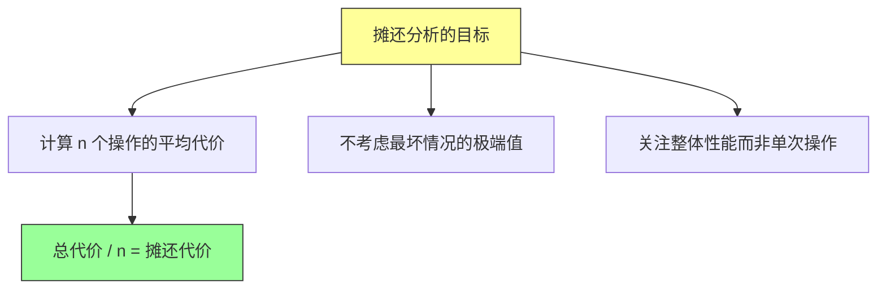
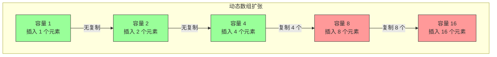
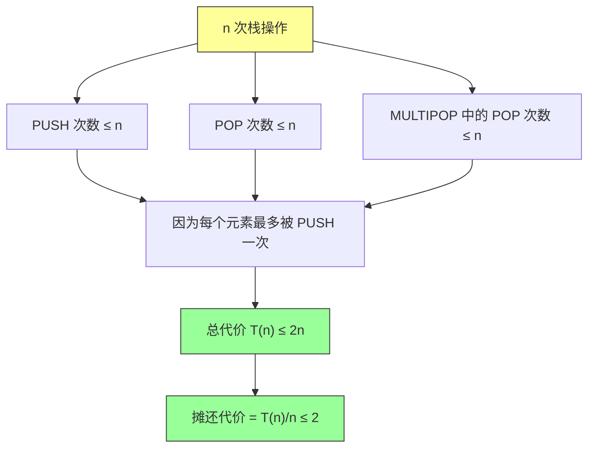
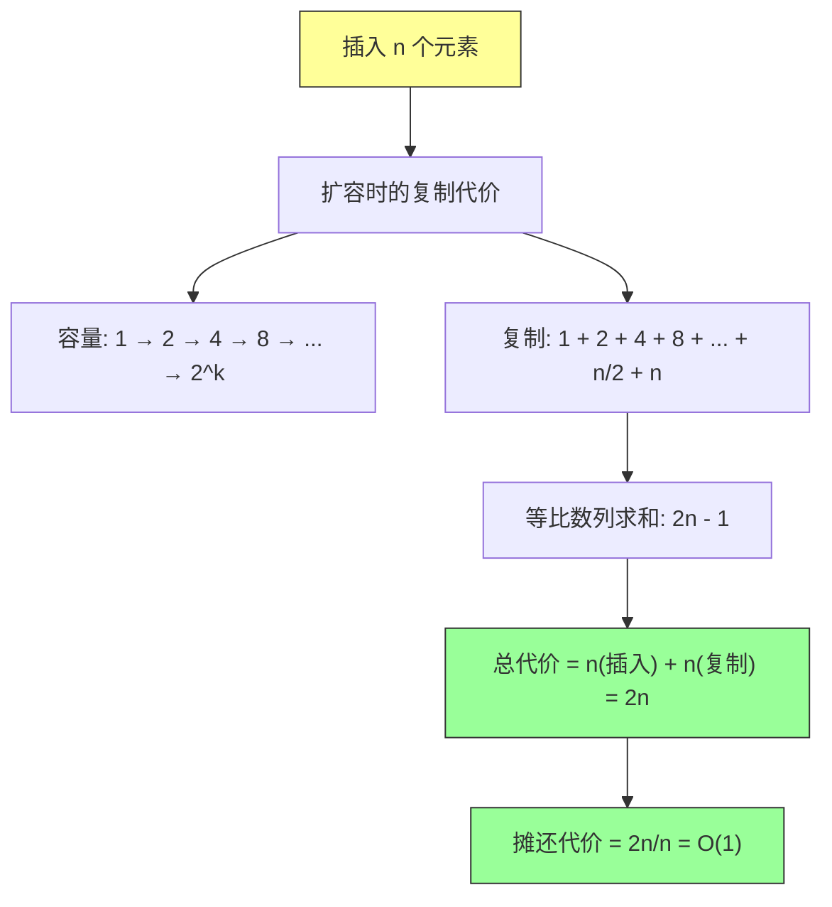
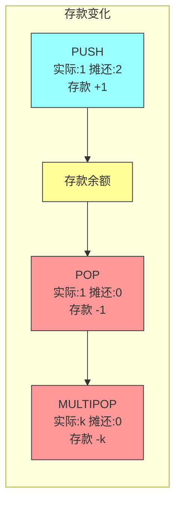
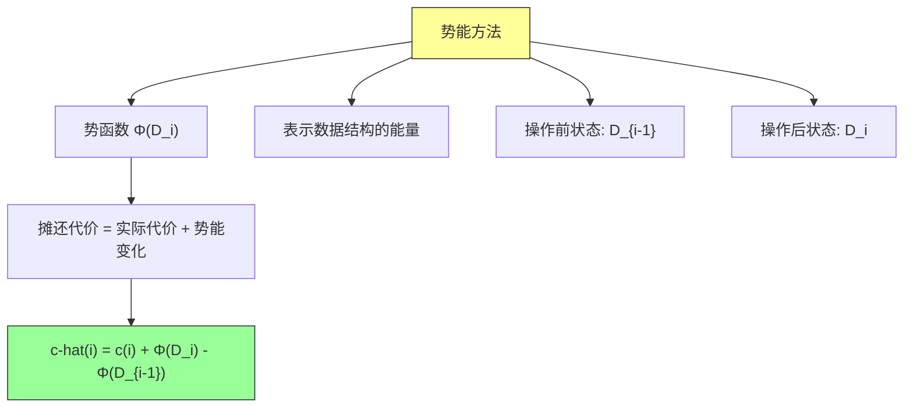
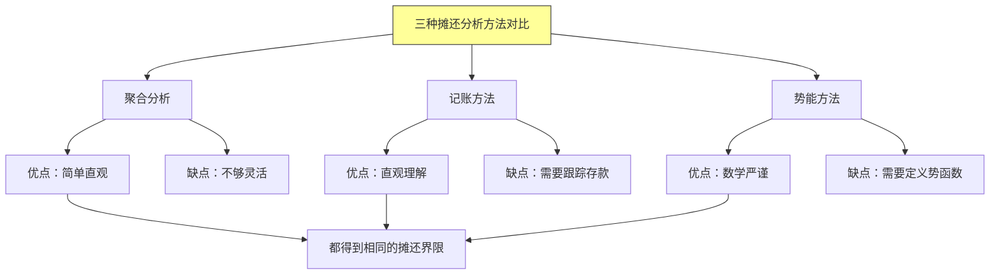
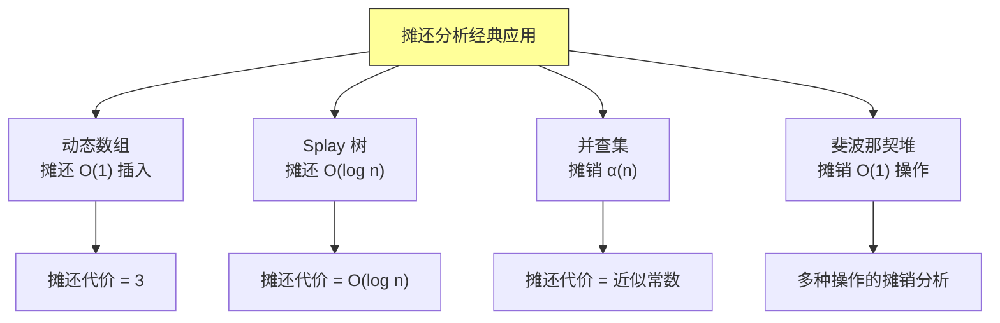

# 第十六章：摊还分析（Amortized Analysis）

## 一、什么是摊还分析

### 1.1 问题的引入

**为什么需要摊还分析？**

在分析算法复杂度时，我们通常关注**最坏情况**或**平均情况**。但有一类数据结构，单个操作可能很昂贵（如动态数组扩容），不过这种昂贵操作发生的频率很低。摊还分析就是用来分析这类"偶尔昂贵、经常便宜"操作的平均代价。



**经典例子：动态数组扩容**



**直观分析**：
- 前 7 次插入：O(1) 每次
- 第 8 次插入：O(8) 复制 + 插入
- 如果只看最坏情况：O(n)
- 但摊还到每次插入：远小于 O(n)

### 1.2 摊还分析的三种方法

```mermaid
flowchart TD
    A["摊还分析方法"] --> B["聚合分析<br/>Aggregate Analysis"]
    A --> C["记账方法<br/>Accounting Method"]
    A --> D["势能方法<br/>Potential Method"]

    B --> B1["计算 n 个操作的总代价<br/>T(n)/n 得到摊还代价"]
    C --> C1["为每个操作分配"credit"<br/>存款多于实际花费"]
    D --> D1["定义势函数<br/>用势能变化衡量代价"]

    style A fill:#ffff99,stroke:#333
    style B fill:#99ffff,stroke:#333
    style C fill:#99ffff,stroke:#333
    style D fill:#99ffff,stroke:#333
```

---

## 二、聚合分析（Aggregate Analysis）

### 2.1 栈操作的摊还分析

**栈的基本操作**：
- `PUSH(S, x)`: O(1)
- `POP(S)`: O(1)
- `MULTIPOP(S, k)`: 弹出 k 个元素或栈空为止

```java
/**
 * 多重弹出操作
 * 每次调用可能弹出多个元素
 */
void multiPop(Stack S, int k) {
    while (!isEmpty(S) && k > 0) {
        POP(S);
        k--;
    }
}
```

**分析 n 次栈操作的总代价**：



**关键洞察**：每个元素最多被弹出一次，所以所有 POP 操作的总数不超过 n 次。

### 2.2 二进制计数器递增

**问题**：从 0 递增到 n，需要多少次比特翻转？

```java
/**
 * 二进制计数器递增
 * 每次操作可能翻转多个比特
 */
void increment(Counter A, int n) {
    int i = 0;
    while (i < n && A[i] == 1) {
        A[i] = 0;  // 翻转 1 -> 0
        i++;
    }
    if (i < n) {
        A[i] = 1;  // 翻转 0 -> 1
    }
}
```

**可视化分析**：

```
初始: 0000
+1:   0001  (翻转 1 位)
+2:   0010  (翻转 2 位: 1->0, 0->1)
+3:   0011  (翻转 1 位)
+4:   0100  (翻转 3 位)
+5:   0101  (翻转 1 位)
+6:   0110  (翻转 2 位)
+7:   0111  (翻转 1 位)
+8:   1000  (翻转 4 位)
```

```mermaid
flowchart TD
    A["n 次递增操作"] --> B["统计每个比特的翻转次数"]

    B --> C["最低位: 每次操作都可能翻转<br/>n 次"]
    B --> D["第 2 位: 每 2 次操作翻转 1 次<br/>n/2 次"]
    B --> E["第 3 位: 每 4 次操作翻转 1 次<br/>n/4 次"]
    B --> F["第 k 位: 每 2^k 次操作翻转 1 次<br/>n/2^k 次"]

    C --> G["总翻转次数 = n + n/2 + n/4 + ... + 1"]
    D --> G
    E --> G
    F --> G

    G --> H["总和 < 2n"]
    H --> I["摊还代价 = 2n/n = O(1)"

    style A fill:#ffff99,stroke:#333
    style H fill:#99ff99,stroke:#333
    style I fill:#99ff99,stroke:#333
```

**几何级数求和**：
```
∑(n/2^k) = n(1 + 1/2 + 1/4 + ...) < n * 2 = 2n
```

### 2.3 动态数组扩张

**核心操作**：
1. 当数组满时，创建新数组（容量翻倍）
2. 将所有元素复制到新数组

```java
/**
 * 动态数组插入（摊还 O(1)）
 */
class DynamicArray {
    private int[] array;
    private int size;
    private int capacity;

    void insert(int x) {
        if (size == capacity) {
            // 扩容：创建新数组，复制元素
            int[] newArray = new int[2 * capacity];
            for (int i = 0; i < size; i++) {
                newArray[i] = array[i];
            }
            array = newArray;
            capacity *= 2;
        }
        array[size++] = x;
    }
}
```

**摊还分析**：



---

## 三、记账方法（Accounting Method）

### 3.1 基本思想

**记账方法的核心**：
- 为每个操作分配一个"摊还代价"（可能高于实际代价）
- 多余的"存款"存储在数据结构中
- 昂贵操作时使用之前存储的存款

```mermaid
flowchart TD
    A["记账方法"] --> B["设定摊还代价 c-hat(i)"]
    A --> C["实际代价 c(i)"]
    A --> D["存款变化 = c-hat(i) - c(i)"]

    B --> E["存款必须非负"]
    C --> F["总摊还代价 ≥ 总实际代价"]

    E --> G["credit_i ≥ 0 对于所有 i"]
    F --> H["∑c-hat(i) ≥ ∑c(i)"

    style A fill:#ffff99,stroke:#333
```

### 3.2 栈操作的记账分析

**设定摊还代价**：
| 操作 | 实际代价 | 摊还代价 | 存款变化 |
|-----|---------|---------|---------|
| PUSH | 1 | 2 | +1 |
| POP | 1 | 0 | -1 |
| MULTIPOP | k | 0 | -k |

**为什么这样设定**：
- PUSH 时多收 1 元，存起来
- POP/PULTIPOP 时不收费，用之前的存款



**验证**：
- 每个元素 PUSH 时存入 1 元
- POP 时取出 1 元
- 存款始终非负（因为每个 POP/PULTIPOP 弹出的元素都曾被 PUSH）

### 3.3 二进制计数器的记账分析

**设定摊还代价**：
- 每次置位（0→1）：收 2 元
- 每次清位（1→0）：收 0 元

```mermaid
flowchart TD
    A["递增操作"] --> B["翻转 1→0 的位<br/>不收费"]
    A --> C["翻转 0→1 的位<br/>收 2 元"]

    B --> D["每个 1→0 翻转<br/>为未来的 0→1 存 1 元"]
    C --> E["0→1 时花费 2 元<br/>1 元用于当前翻转<br/>1 元存入"]

    E --> F["总摊还代价 = 2n"
    F --> G["实际总代价 < 2n"
    G --> H["摊还 = 2 = O(1)"

    style A fill:#ffff99,stroke:#333
    style H fill:#99ff99,stroke:#333
```

### 3.4 动态数组的记账分析

**设定摊还代价**：
- 插入：收 3 元（2 元用于复制，1 元存入）

```mermaid
flowchart TD
    A["插入操作"] --> B["正常插入<br/>实际代价: 1<br/>摊还代价: 3<br/>存款 +2"]
    A --> C["扩容时复制<br/>实际代价: k<br/>摊还代价: 0<br/>使用存款: -2k"]

    B --> D["每次插入存入 2 元"]
    C --> E["复制 k 个元素<br/>消耗 2k 元存款"]

    D --> F["扩容前已有 k 次插入<br/>存款 = 2k 元"]
    E --> F
    F --> G["刚好够用！"
    G --> H["总摊还代价 = 3n"

    style A fill:#ffff99,stroke:#333
    style G fill:#99ff99,stroke:#333
    style H fill:#99ff99,stroke:#333
```

---

## 四、势能方法（Potential Method）

### 4.1 基本思想

势能方法使用一个**势函数** Φ 来衡量数据结构的"状态"。



**关键条件**：
- Φ(D_i) ≥ 0 对于所有 i
- Φ(D_0) = 0

**摊还代价总和**：
```
∑c-hat(i) = ∑c(i) + Φ(D_n) - Φ(D_0) = ∑c(i) + Φ(D_n) ≥ ∑c(i)
```

### 4.2 栈操作的势能分析

**势函数定义**：
```
Φ(栈中元素数)
```

```mermaid
flowchart TD
    A["栈操作"] --> B["PUSH<br/>实际代价: 1<br/>势能变化: +1<br/>摊还代价: 2"]
    A --> C["POP<br/>实际代价: 1<br/>势能变化: -1<br/>摊还代价: 0"]
    A --> D["MULTIPOP(k)<br/>实际代价: k<br/>势能变化: -k<br/>摊还代价: 0"]

    B --> E["栈大小增加 1<br/>势能 +1"]
    C --> E
    D --> E

    E --> F["摊还总和 = 2 × PUSH 次数"

    style A fill:#ffff99,stroke:#333
```

### 4.3 二进制计数器的势能分析

**势函数定义**：
```
Φ(i) = 计数器中 1 的个数
```

```mermaid
flowchart TD
    A["递增操作"] --> B["统计变化"]

    B --> C["设翻转了 t 个比特"]
    B --> D["其中 t-1 个 1→0"]
    B --> E["1 个 0→1"]

    C --> F["实际代价: t"]
    D --> G["势能变化: - (t-1) + 1 = 2 - t"]
    E --> G

    F --> H["摊还代价 = t + (2 - t) = 2"]
    G --> H

    H --> I["每次递增的摊还代价恒为 2"

    style A fill:#ffff99,stroke:#333
    style I fill:#99ff99,stroke:#333
```

### 4.4 动态数组的势能分析

**势函数定义**：
```
Φ(i) = 2 × size - capacity
```

当 size = capacity 时（即将扩容），Φ 达到最大值。

```mermaid
flowchart TD
    A["插入操作"] --> B["情况 1：不需要扩容<br/>size < capacity"]

    A --> C["情况 2：需要扩容<br/>size = capacity"]

    B --> D["实际代价: 1"]
    B --> E["size++, capacity 不变"]
    B --> F["势能变化: +2"]
    B --> G["摊还代价: 1 + 2 = 3"]

    C --> H["实际代价: size (复制)"]
    C --> I["capacity 翻倍"]
    C --> J["size = old_size + 1"]
    C --> K["势能变化: 2(size) - 2(2×old_size) = 2 - 2×old_size"]

    H --> L["摊还代价: size + (2 - 2×old_size) = 2"]
    K --> L

    L --> M["扩容时的摊还代价也是 2！

    style A fill:#ffff99,stroke:#333
    style M fill:#99ff99,stroke:#333
```

**验证势能非负**：
- 初始化：size = 0, capacity = 1, Φ = 0
- 正常插入：size < capacity, Φ = 2×size - capacity ≥ 0（因为 size ≤ capacity-1）
- 扩容时：Φ = 2×size - 2×size = 0

---

## 三种方法对比



| 方法 | 核心思想 | 适用场景 | 优点 | 缺点 |
|-----|---------|---------|------|------|
| 聚合分析 | 计算总代价求平均 | 多个操作的总量分析 | 简单 | 不够灵活 |
| 记账方法 | 为操作"存款" | 需要直观解释 | 易于理解 | 需要维护存款 |
| 势能方法 | 定义势函数 | 复杂数据结构 | 数学严谨 | 需要构造势函数 |

---

## 五、摊还分析的应用场景

### 5.1 经典应用案例



### 5.2 摊还分析与均摊复杂度

```mermaid
flowchart TD
    A["时间复杂度分类"] --> B["最坏情况<br/>T(n) = max{cost of any sequence of n ops}"]
    A --> C["平均情况<br/>T(n) = E[cost of any sequence of n ops]"]
    A --> D["摊还情况<br/>T(n) = total cost / n"]

    B --> E["例如：快速排序 O(n²) 最坏"]
    C --> F["例如：随机快速排序 O(n log n) 平均"]
    D --> G["例如：动态数组 O(1) 摊还"

    style D fill:#99ffff,stroke:#333
    style G fill:#99ff99,stroke:#333
```

**摊还分析 vs 平均情况分析**：
- 摊还分析不涉及概率，是确定性的
- 摊还分析关注最坏情况下的平均性能
- 平均情况分析涉及输入的概率分布

### 5.3 摊还分析与复杂度下界

```mermaid
flowchart TD
    A["摊还分析的价值"] --> B["证明整体复杂度低于最坏情况"]
    A --> C["指导数据结构设计"]
    A --> D["理解数据结构的"均摊"行为"]

    B --> E["动态数组插入：最坏 O(n)，摊还 O(1)"]
    C --> F["设计"cheap + rare expensive"的结构"]
    D --> G["为什么某些结构在实际中表现良好"

    style A fill:#ffff99,stroke:#333
```

---

## 六、复杂度对比总结

| 数据结构/操作 | 最坏情况 | 摊还情况 | 说明 |
|--------------|---------|---------|------|
| 动态数组插入 | O(n) | O(1) | 扩容时复制所有元素 |
| 二进制计数器递增 | O(log n) | O(1) | 一次可能翻转多位 |
| 栈的 MULTIPOP | O(n) | O(1) | 单次可能弹出多个 |
| Splay 树操作 | O(n) | O(log n) | 摊还复杂度优秀 |

---

## 七、代码实现

### 7.1 动态数组（摊还 O(1) 插入）

```java
/**
 * 动态数组 - 摊还分析示例
 * 摊还复杂度：O(1) 插入
 */
public class DynamicArray<T> {
    private Object[] array;
    private int size;
    private int capacity;

    public DynamicArray() {
        array = new Object[1];
        capacity = 1;
        size = 0;
    }

    /**
     * 摊还分析：
     * - 正常插入：摊还代价 3
     * - 扩容时：摊还代价 2
     * 总摊还代价 ≤ 3n
     */
    public void add(T element) {
        if (size == capacity) {
            resize(2 * capacity);  // 扩容
        }
        array[size++] = element;
    }

    private void resize(int newCapacity) {
        Object[] newArray = new Object[newCapacity];
        for (int i = 0; i < size; i++) {
            newArray[i] = array[i];
        }
        array = newArray;
        capacity = newCapacity;
    }

    public int size() {
        return size;
    }

    public int capacity() {
        return capacity;
    }
}
```

### 7.2 二进制计数器（摊还 O(1) 递增）

```java
/**
 * 二进制计数器 - 摊还分析示例
 * 摊还复杂度：O(1) 递增
 */
public class BinaryCounter {
    private boolean[] bits;
    private int n;

    public BinaryCounter(int size) {
        bits = new boolean[size];
        n = size;
    }

    /**
     * 摊还分析：
     * - 每次递增的摊还代价为 2
     * - 总代价 ≤ 2n
     */
    public void increment() {
        int i = 0;
        while (i < n && bits[i]) {
            bits[i] = false;  // 翻转 1 -> 0
            i++;
        }
        if (i < n) {
            bits[i] = true;   // 翻转 0 -> 1
        }
    }

    public boolean[] getBits() {
        return bits.clone();
    }
}
```

### 7.3 摊还分析主程序

```java
/**
 * 摊还分析演示程序
 */
public class AmortizedAnalysisDemo {

    public static void main(String[] args) {
        // 1. 动态数组测试
        System.out.println("=== 动态数组摊还分析 ===");
        DynamicArray<Integer> arr = new DynamicArray<>();
        long startTime = System.currentTimeMillis();
        for (int i = 0; i < 1000000; i++) {
            arr.add(i);
        }
        long endTime = System.currentTimeMillis();
        System.out.println("插入 100 万元素耗时: " + (endTime - startTime) + "ms");
        System.out.println("最终容量: " + arr.capacity());

        // 2. 二进制计数器测试
        System.out.println("\n=== 二进制计数器摊还分析 ===");
        BinaryCounter counter = new BinaryCounter(32);
        int totalFlips = 0;
        for (int i = 0; i < 1000000; i++) {
            int flips = countAndIncrement(counter);
            totalFlips += flips;
        }
        System.out.println("总翻转次数: " + totalFlips);
        System.out.println("平均每次递增翻转次数: " + (double) totalFlips / 1000000);
    }

    /**
     * 递增并返回翻转次数
     */
    private static int countAndIncrement(BinaryCounter counter) {
        boolean[] bits = counter.getBits();
        int flips = 0;
        int i = 0;
        while (i < bits.length && bits[i]) {
            bits[i] = false;
            flips++;
            i++;
        }
        if (i < bits.length) {
            bits[i] = true;
            flips++;
        }
        return flips;
    }
}
```

---

## 八、总结

### 8.1 核心概念回顾

```mermaid
flowchart TD
    A["摊还分析核心"] --> B["不是为了找出最坏情况"]
    A --> C["而是分析整体平均性能"]
    A --> D["关键：总代价 / 操作数"]

    B --> E["单次操作可能很昂贵"]
    C --> F["但频繁操作的代价很低"]
    D --> G["摊还代价代表平均性能"

    style A fill:#ffff99,stroke:#333
```

### 8.2 何时使用摊还分析

```mermaid
flowchart TD
    A["适用摊还分析的情况"] --> B["存在"昂贵但稀有"的操作"]
    A --> C["数据结构有"扩容"或"重构"机制"]
    A --> D["需要证明整体复杂度优于最坏情况"]

    B --> E["动态数组、栈、计数器等"]
    C --> F["摊还分析能揭示真实性能"]
    D --> G["如：O(1) 摊还而非 O(n) 最坏"

    style A fill:#ffff99,stroke:#333
```

### 8.3 三种方法的选择

| 场景 | 推荐方法 |
|-----|---------|
| 简单分析，总代价易计算 | 聚合分析 |
| 需要直观解释 | 记账方法 |
| 需要数学证明 | 势能方法 |

---

**摊还分析是一种强大的分析工具**，它帮助我们理解数据结构的真实性能，而不仅仅是最坏情况。通过将昂贵操作的成本分摊到大量廉价操作上，我们可以证明许多看似低效的数据结构实际上具有优秀的整体性能。

下一章：第十七章——基本图算法（Graph Algorithms）
