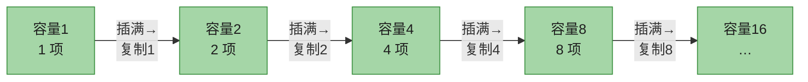

# 第十六章：摊还分析（Amortized Analysis）

> **定位**：想象你加入 Buff 健身房——月费 \$60，每次去再付 \$3。十一月你每天都去，于是这个月总共花了 \$60 + \$90 = \$150，**摊到 30 天每天 \$5**（其中 \$2 是把月费摊还到每天，\$3 是每天的实际开销）。摊还分析对算法做同样的事：**把一串操作的总代价平均到每次操作上**，证明「平均每次都很便宜」，哪怕其中某几次可能很贵。
>
> 关键区别：摊还分析**不涉及概率**——它是对**任意**操作序列的最坏情况做平均，给出确定性保证；而「平均情况分析」要假设输入服从某种概率分布。本章用同一个例子（栈、二进制计数器）展示**三种等价方法**：聚合分析、记账法、势能法，再用势能法分析**动态表**（即 `ArrayList`/`vector` 的扩容原理）。
>
> **前后指针**：栈见**§10.1.3**；习题 16.3-3（堆的摊还）用到**第 6 章**；16.3-6（删掉较大一半）用到**第 9 章 SELECT**；§16.4 的 load factor 借自**第 11 章哈希**。摊还分析的两大明星应用——**不相交集合（Ch 19，α(n)）**和动态表——都靠这套方法证明其「看似最坏很贵、实则摊还廉价」。斐波那契堆第四版已删，不展开。
>
> 对照第四版书页 448–470。

---

## 一、为什么要摊还分析

单看最坏情况常常**高估**真实性能。动态数组扩容时一次插入要复制全部 n 个元素（最坏 O(n)），但这种「灾难」极少发生；绝大多数插入只是 O(1)。摊还分析正是要把偶尔的昂贵操作**摊平**到大量廉价操作上。

| 分析角度 | 看什么 | 是否涉及概率 | 动态数组插入的结论 |
|---------|--------|-------------|--------------------|
| 最坏情况 | 单次操作最坏 | 否 | O(n)（扩容那一次） |
| 平均情况 | 输入按某分布的期望 | **是** | — |
| 摊还 | **任意** n 次操作的总代价 / n | **否** | **O(1)** |

> **一句话**：摊还分析保证「对任意操作序列，平均每次的操作代价很小」——这是确定性的，不是「期望」。

三种方法只是同一个摊还上界的不同证法，**结论一致**：

| 方法 | 怎么算 | 形象 |
|------|--------|------|
| 聚合分析 | 直接算 n 次操作的总代价 T(n)，摊还代价 = T(n)/n | 算总账再除 |
| 记账法 | 给每次操作定一个「摊还收费」，多收的存进数据结构当存款 | 预付费储值卡 |
| 势能法 | 定义势函数 Φ，摊还代价 = 实际代价 + ΔΦ | 把存款看作「势能」 |

---

## 二、聚合分析（§16.1）

对任意 n 次操作，先证总代价上界 T(n)，再令每次操作的摊还代价 = T(n)/n。**所有操作共享同一个摊还代价**。

### 2.1 栈与 MULTIPOP

普通栈 PUSH、POP 各 O(1)。加一个 `MULTIPOP(S, k)`：弹出栈顶 k 个（不足则全弹出）。

```
MULTIPOP(S, k)
1  while not STACK-EMPTY(S) and k > 0
2      POP(S)
3      k = k - 1
```

**粗略分析（不紧）**：一次 MULTIPOP 最坏 O(n)（k 很大、栈很满），n 次操作最坏 O(n²)。

**聚合分析（紧）**：每个元素**最多被 PUSH 一次、被 POP 一次**。所以 n 次操作里，所有 POP（含 MULTIPOP 内部的 POP）总次数 ≤ PUSH 次数 ≤ n。总代价 ≤ n（PUSH）+ n（POP）= **2n** → 摊还代价 = 2n/n = **O(1)**。

> **关键洞察**：贵的操作（大 MULTIPOP）会「消耗」之前 PUSH 攒下的元素；元素总数守恒，于是贵的操作不可能频繁发生。

### 2.2 二进制计数器递增

k 位计数器从 0 开始反复 `INCREMENT`（加 1）。代价 = 翻转的位数。

```
INCREMENT(A, k)
1  i = 0
2  while i < k and A[i] == 1
3      A[i] = 0        // 1→0（进位）
4      i = i + 1
5  if i < k
6      A[i] = 1        // 0→1
```

4 位计数器前 8 次递增的 trace（**深色**为本轮翻转的位）：

| 递增后值 | b₃ b₂ b₁ b₀ | 本轮翻转数 |
|---------|-------------|-----------|
| 0 | 0 0 0 0 | — |
| 1 | 0 0 0 **1** | 1 |
| 2 | 0 0 **1 0** | 2 |
| 3 | 0 0 1 **1** | 1 |
| 4 | 0 **1 0 0** | 3 |
| 5 | 0 1 0 **1** | 1 |
| 6 | 0 1 **1 0** | 2 |
| 7 | 0 1 1 **1** | 1 |
| 8 | **1 0 0 0** | 4 |

前 8 次共翻转 1+2+1+3+1+2+1+4 = **15 次 < 2·8 = 16**。

**一般证明**：第 i 位每 2ⁱ 次递增才翻转一次，n 次递增中第 i 位翻转 ⌊n/2ⁱ⌋ 次。总翻转数：

```
Σ_{i≥0} ⌊n/2ⁱ⌋ < n · Σ_{i≥0} (1/2ⁱ) = n · 2 = 2n   →   摊还代价 = 2n/n = O(1)
```

> **LeetCode 关联**：[232. 用栈实现队列](https://leetcode.cn/problems/implement-queue-using-stacks/)——两个栈来回倒，每个元素最多被搬运 4 次，摊还 O(1)（习题 16.3-5）。

---

## 三、记账法（§16.2）

给**每种操作**定一个摊还收费 ĉᵢ。当 ĉᵢ > 实际代价 cᵢ 时，差额作为**信用（credit）**存在数据结构里；当 ĉᵢ < cᵢ 时，用存款补足。只要**总信用始终 ≥ 0**，总摊还代价就是总实际代价的上界：

```
Σ ĉᵢ ≥ Σ cᵢ    （对所有 n、所有操作序列成立）
```

### 3.1 栈：PUSH 收 2、POP/MULTIPOP 免费

| 操作 | 实际代价 cᵢ | 摊还收费 ĉᵢ |
|------|------------|------------|
| PUSH | 1 | **2** |
| POP | 1 | 0 |
| MULTIPOP(k) | min(s,k) | 0 |

**故事**：PUSH 一只盘子时收 \$2，\$1 付当下的 push，剩 \$1 **放在这只盘子上**当存款。任何时候栈里每只盘子都压着 \$1。POP（或 MULTIPOP 里的每次 POP）免费——直接拿走盘子上那 \$1 付账。因为栈中盘子数 ≥ 0，总信用永远 ≥ 0 ✓。于是 n 次操作总摊还 ≤ 2n → 摊还 O(1)。

### 3.2 二进制计数器：置位收 \$2

把一个 0 位翻成 1，收 \$2：\$1 付本次翻转，另 \$1 **存在这个 1 位上**。把 1 翻回 0 时免费——用位上那 \$1 付账。任何时刻每个 1 位都挂着 \$1，故信用 ≥ 0。一次 INCREMENT 最多把**一个** 0 翻成 1，所以摊还收费 ≤ \$2 → 摊还 O(1)。

> 记账法把「未来要付的账」具象成存在具体对象上的存款，直觉强；缺点是**得手动跟踪存款落在哪**。

---

## 四、势能法（§16.3）

把存款看作整个数据结构的**势能 Φ**，不再绑定到具体对象。

设第 i 次操作前结构为 Dᵢ₋₁、操作后为 Dᵢ，实际代价 cᵢ。定义势函数 Φ 把每个结构映成一个实数，**第 i 次操作的摊还代价**为：

```
ĉᵢ = cᵢ + Φ(Dᵢ) − Φ(Dᵢ₋₁)        // 实际代价 + 势能变化
```

把 n 次摊还代价求和，势能项**望远镜求和**抵消，只剩首尾：

```
Σ ĉᵢ = Σ cᵢ + Φ(Dₙ) − Φ(D₀)
```

**只要 Φ(D₀) = 0 且 Φ(Dᵢ) ≥ 0 对所有 i 成立**，则 Σ ģᵢ ≥ Σ cᵢ——总摊还代价是总实际代价的上界。势能法最强大之处：选不同的 Φ 可以**把代价在操作间重新分配**。

### 4.1 栈：Φ = 栈中元素数

- **PUSH**（s→s+1）：cᵢ=1，ΔΦ=+1 → ĉᵢ = 1+1 = **2**。
- **POP**（s→s−1）：cᵢ=1，ΔΦ=−1 → ĉᵢ = 1−1 = **0**。
- **MULTIPOP(k')**（s→s−k'）：cᵢ=k'，ΔΦ=−k' → ģᵢ = k'−k' = **0**。

Φ(D₀)=0（空栈），Φ=元素数 ≥ 0 恒成立 ✓。三种操作摊还代价都是常数 → 总 O(n)。

### 4.2 二进制计数器：Φ = 1 的个数

设第 i 次递增把 tᵢ 个 1 翻成 0、最多把 1 个 0 翻成 1。实际代价 cᵢ ≤ tᵢ + 1。1 的个数变化 ΔΦ ≤ −tᵢ + 1。于是：

```
ĉᵢ ≤ (tᵢ+1) + (−tᵢ+1) = 2          // 与 tᵢ 无关！每次恒为 2
```

摊还代价与翻转多少位**无关**，恒为 2。势能法的妙处在此显露：昂贵操作（tᵢ 大）势能骤降、正好抵消；廉价操作（tᵢ 小）势能缓升、为未来攒钱。

> **习题 16.3-3 的妙用**：对二叉小根堆取 Φ = Σ（节点深度），可证 INSERT 摊还 O(lg n)、**EXTRACT-MIN 摊还 O(1)**（删叶子释放其深度势能、sift-down 每次交换势能净变化为 0）。

---

## 五、动态表（§16.4）—— `ArrayList` 的原理

表满了就**翻倍扩容**、把旧元素全复制过去。单次插入最坏 O(n)（触发扩容），但摊还 O(1)。用三种方法都证一遍——这是本章的压轴。

### 5.1 只插入：翻倍扩容

```
TABLE-INSERT(T, x)
1  if T.size == 0        // 首次分配 1 个槽
2      T.table = allocate(1); T.size = 1
3  if T.num == T.size    // 满了 → 翻倍
4      new = allocate(2 · T.size)
5      把 T.table 的项全复制进 new        // 代价 = T.num
6      free T.table; T.table = new; T.size = 2·T.size
7  把 x 插入 T.table; T.num++
```

记「基本插入」（含复制一个元素、插入新元素）代价各为 1。第 i 次操作只在 **i−1 是 2 的幂**时触发扩容：

```
cᵢ = i   若 i−1 是 2 的幂（1 次插入 + i−1 次复制）
    = 1   否则
```

**聚合**：Σcᵢ ≤ n（每次至少 1）+ (1+2+4+…+2^⌊lg n⌋)（扩容复制，等比级数 < 2n）< **3n** → 摊还 ≤ 3。



> 复制总代价是等比级数 1+2+4+… ≈ n，加上 n 次插入 ≈ **2n**（实测：插 65536 项共 131071 = 2n−1 次基本操作，与 3n 的上界吻合且更紧）。

**记账（为什么是 \$3）**：每次 TABLE-INSERT 收 \$3——\$1 付当下插入、\$1 存在**新元素**上（预付它下次扩容时被复制）、\$1 存在**一个已存在元素**上。下次扩容前恰好又插了 size/2 个元素，每个都带 \$1，加上原本 size/2 个元素各 \$1，正好够把 size 个元素全复制一遍。存款始终 ≥ 0 ✓。

**势能**：令 Φ = 2·(T.num − T.size/2)（半满时 Φ=0，满了 Φ=T.size）。
- 不扩容的插入：cᵢ=1，ΔΦ=+2 → ĉᵢ = 1+2 = **3**。
- 触发扩容的插入：cᵢ = (i−1 次复制)+1 = i；扩容后 num=i、size=2(i−1)，Φ 从 i−1 掉到 2·i − 2(i−1) = 2，ΔΦ = 2−(i−1) = 3−i → ĉᵢ = i + (3−i) = **3**。

两种情况摊还都恰好 3 ✓。

### 5.2 加删除：缩容的陷阱

照搬「满翻倍」的对称策略——「不足半满就缩半」——**会崩**。考虑在半满表上反复 `插、删、删、插、插、删、删、…`：第一次插入触发扩容（size 翻倍）、紧跟两次删除触发缩容（size 减半）、再两次插入又扩容……每次扩缩都 Θ(n)，共 Θ(n) 次 → 总 Θ(n²)，摊还 Θ(n)。

**病根**：扩容后还没攒够势能就被删除逼着缩容，反之亦然——阈值卡在 1/2，操作序列在阈值附近反复横跳。

**正确做法**：把缩容阈值放宽到 **α < 1/4**——即「满（α=1）翻倍、不足 1/4 缩半」。这样缩容后 α=1/2，离两个阈值都有距离，无法被一两步操作反复触发。势能取分段函数（α≥1/2 时 Φ=2·(num−size/2)；α<1/2 时 Φ=size/2−num），保证扩张/收缩那一刻 Φ 恰好耗尽为 0，每种操作摊还都是常数。

| 操作 | 最坏 | 摊还 |
|------|------|------|
| TABLE-INSERT（含扩容） | O(n) | **O(1)** |
| TABLE-DELETE（含缩容） | O(n) | **O(1)** |

> 这是 Java `ArrayList`、C++ `vector`、Python `list` 的底层逻辑：扩容因子 2（或 1.5）、load factor 始终 ≥ 1/2，故 `append` 摊还 O(1)。

---

## 六、代码实现（Java + Python）

> 三段独立小程序，**用实测验证摊还上界**：① 计数器总翻转 < 2n；② 动态表总操作 ≤ 3n；③ 双栈队列（习题 16.3-5）正确且总操作 ≤ 4m。

### 6.1 二进制计数器 + 动态表（Java）

```java
import java.util.*;
public class Amortized {
    // 计数器：n 次递增的总翻转数 < 2n
    static int counterFlips(int n, int[] bits) {
        int total = 0;
        for (int op = 0; op < n; op++) {
            int i = 0;
            while (i < bits.length && bits[i] == 1) { bits[i] = 0; total++; i++; }
            if (i < bits.length) { bits[i] = 1; total++; }
        }
        return total;
    }
    // 动态表：n 次插入的总基本操作数 ≤ 3n（ops 统计每次插入 + 每次复制）
    static class DynTable {
        int[] table; int num = 0, size = 0; long ops = 0;
        void insert(int x) {
            if (size == 0) { table = new int[1]; size = 1; }
            else if (num == size) {
                int[] nt = new int[2 * size];
                for (int i = 0; i < num; i++) { nt[i] = table[i]; ops++; }   // 复制
                table = nt; size *= 2;
            }
            table[num++] = x; ops++;                                         // 插入
        }
    }
    public static void main(String[] args) {
        Random r = new Random(2024);
        for (int t = 0; t < 50; t++) {                                      // 计数器：flips < 2n
            int k = 4 + r.nextInt(20), n = r.nextInt(10000);
            if (counterFlips(n, new int[k]) >= 2 * n) throw new RuntimeException("flips ≥ 2n");
        }
        DynTable dt = new DynTable(); int n = 1 << 16;                       // 动态表：ops ≤ 3n
        for (int i = 0; i < n; i++) dt.insert(i);
        System.out.println("n=" + n + " 总操作=" + dt.ops + " (2n=" + 2L*n + ", 3n=" + 3L*n + ")");
        if (dt.ops > 3L * n) throw new RuntimeException("ops > 3n");
        System.out.println("OK");
    }
}
```

实测：`n=65536 总操作=131071`（= 2n−1，紧贴聚合分析给出的 ≈2n，远低于 3n 上界）。

### 6.2 双栈队列（习题 16.3-5 / LeetCode 232，Java）

```java
class TwoStackQueue {                       // 入队压 in 栈；出队从 out 栈弹，空了就把 in 全倒过来
    Deque<Integer> in = new ArrayDeque<>(), out = new ArrayDeque<>();
    void enqueue(int x) { in.push(x); }
    int dequeue() {
        if (out.isEmpty()) while (!in.isEmpty()) out.push(in.pop());   // 摊还关键：每个元素最多被搬运一次
        return out.pop();
    }
}
```

**为什么摊还 O(1)**：每个元素从入队到出队，至多经历 4 次栈操作（push in → pop in → push out → pop out）。n 次 enqueue/dequeue 的总栈操作 ≤ 4n，故每次摊还 O(1)。最坏某次 dequeue（out 空且 in 很大）要 O(n)，但「贵的一次之后是长期廉价」。

### 6.3 Python 版

```python
def counter_flips(n, bits):                 # 总翻转 < 2n
    total = 0
    for _ in range(n):
        i = 0
        while i < len(bits) and bits[i] == 1:
            bits[i] = 0; total += 1; i += 1
        if i < len(bits):
            bits[i] = 1; total += 1
    return total

class DynTable:                             # 总操作 ≤ 3n
    def __init__(self): self.table=[]; self.num=0; self.size=0; self.ops=0
    def insert(self, x):
        if self.size == 0: self.table=[0]; self.size=1
        elif self.num == self.size:
            nt=[0]*(2*self.size)
            for i in range(self.num): nt[i]=self.table[i]; self.ops+=1
            self.table=nt; self.size*=2
        self.table[self.num]=x; self.num+=1; self.ops+=1

class TwoStackQueue:                        # 双栈队列，摊还 O(1)
    def __init__(self): self.in_=[]; self.out=[]
    def enqueue(self, x): self.in_.append(x)
    def dequeue(self):
        if not self.out:
            while self.in_: self.out.append(self.in_.pop())
        return self.out.pop()
```

Java 与 Python 两版均通过随机对拍：计数器 50 轮 flips < 2n、动态表 20 轮 ops ≤ 3n、双栈队列 100 轮 FIFO 正确且总操作 ≤ 4m。

---

## 七、复杂度速查 + 易混点

### 7.1 速查

| 结构 / 操作 | 单次最坏 | 摊还 | 方法 | 出处 |
|------------|---------|------|------|------|
| 栈 PUSH/POP/MULTIPOP | O(n) | O(1) | 任一 | §16.1–16.3 |
| 二进制计数器 INCREMENT | O(k) | O(1) | 任一 | §16.1–16.3 |
| 动态表 INSERT（扩容） | O(n) | O(1)（≤3） | 任一 | §16.4 |
| 动态表 DELETE（缩容） | O(n) | O(1) | 势能 | §16.4 |
| 双栈队列 enqueue/dequeue | O(n) | O(1) | 记账/势能 | 习题 16.3-5 |
| 不相交集合（Ch 19） | O(lg n) | **α(n)** | 势能 | Ch 19 |

### 7.2 易混点

- **摊还 ≠ 平均情况**：摊还**不涉及概率**，对**任意**序列成立；平均情况要假设输入分布。这是最常考的概念题。
- **三种方法对同一问题给出的摊还上界一致**，区别只在证法；势能法最通用、能证记账法不好证的（如动态表带删除）。
- **势能法要求 Φ(D₀)=0 且 Φ(Dᵢ)≥0 恒成立**——否则 Σĉᵢ ≥ Σcᵢ 不成立，上界失效。验证 Φ≥0 是必经一步。
- **记账法的存款必须落在具体对象上**且总数 ≥ 0；势能法的「存款」是整体函数值，不绑对象。两者等价但势能法更灵活。
- **缩容阈值不能卡在 1/2**（与扩容对称），否则 `插删删插…` 序列在阈值处反复横跳，摊还退化到 Θ(n)。必须放宽到 **1/4**，留出缓冲。
- **摊还分析不改变代码**——那些「收费」「存款」只是分析工具，绝不该写进程序（如别真给节点加个 `credit` 字段）。
- **二进制计数器加 DECREMENT 就不再是 O(1) 摊还**（习题 16.1-2）：可在高位反复增减，每次 O(k)，总 Θ(nk)。对称操作未必保持摊还界。

---

## 八、LeetCode 题单 + 习题 + 思考题

### 8.1 LeetCode 题单

| 题目 | 难度 | 考点 | 用本章什么 |
|------|------|------|-----------|
| [232. 用栈实现队列](https://leetcode.cn/problems/implement-queue-using-stacks/) | 简 | 双栈队列 | 习题 16.3-5，摊还 O(1) |
| [225. 用队列实现栈](https://leetcode.cn/problems/implement-stack-using-queues/) | 简 | 对偶问题 | 摊还分析 |
| [341. 扁平化嵌套列表迭代器](https://leetcode.cn/problems/flatten-nested-list-iterator/) | 中 | 摊还 next() | 偶尔展开、均摊 O(1) |
| [284. 顶端迭代器](https://leetcode.cn/problems/peeking-iterator/) | 中 | 摊还 peek | 缓存下一次 |
| [251. 展开二维向量](https://leetcode.cn/problems/flatten-2d-vector/) | 中 | 摊还迭代 | 惰性推进内层指针 |

> 摊还分析在 LC 上主要表现为「**迭代器/队列的惰性搬运**」：把昂贵的整理工作推迟、分摊到后续廉价调用。232 是教科书级；341/284/251 是同一思想的变体。动态数组扩容则是 `ArrayList`/`vector`/`list` 的内建行为，不会单独命题。

### 8.2 习题快问快答（第四版编号）

- **16.1-1**　加 `MULTIPUSH(S, k)`（一次压 k 个）后摊还界 **不再是 O(1)**：一次就可以压 Θ(n) 个，n 次操作总代价可达 Θ(n²)。原来的聚合论证依赖「n 次操作至多插入 n 个元素」，MULTIPUSH 打破这条。
- **16.1-2**　计数器加 `DECREMENT` 后 n 次操作可达 Θ(nk)：在第 k−1 位附近反复增减，每次翻转 Θ(k) 个高位。
- **16.1-3**　第 i 次操作代价为 i（i 是 2 的幂）否则 1。总代价 = n + Σⱼ 2ʲ ≤ n + 2n = 3n → 摊还 O(1)。
- **16.2-3**　支持 `RESET`（全清 0）的计数器：维护一个指向**最高位 1** 的指针，RESET 只清到它即可。每个位至多被置 1 一次、清 0 一次 → 总 O(n)。
- **16.3-3**　二叉小根堆取 Φ = Σ（节点深度）：INSERT 加一片深度 ≤ lg n 的叶子，ΔΦ ≤ lg n，摊还 O(lg n)；EXTRACT-MIN 删去深度 ⌊lg n⌋ 的末叶（释放势能）、sift-down 每次交换势能净变化 0，ΔΦ ≤ −lg n，摊还 **O(1)**。
- **16.3-4**　栈从 s₀ 个开始、sₙ 个结束：Σcᵢ = Σĉᵢ − (Φₙ − Φ₀) ≤ 2n − sₙ + s₀。
- **16.3-5**　双栈队列（见 §6.2）：每个元素至多搬运 4 次，摊还 O(1)。
- **16.3-6**　支持 INSERT 与 DELETE-LARGER-HALF：用无序数组，INSERT O(1)；DELETE-LARGER-HALF 用 **SELECT（第 9 章）**找中位数再线性划分删除 ⌈|S|/2⌉ 个，O(|S|)。m 次操作总 O(m)（每次删除把常数比例的元素扫掉，势能可证）。

### 8.3 思考题要点

- **16-2 动态二分查找**：维护 k = ⌈lg(n+1)⌉ 个有序数组 A₀..Aₖ₋₁，Aᵢ 长度 2ⁱ，是否占用由 n 的二进制第 i 位决定。INSERT 像**二进制计数器进位**——A₀ 满就与 A₁ 合并、进位……每次合并代价等于合并后的数组长，摊还 O(lg n)（与计数器摊还 O(1) 同构，只是单位变成「数组长度」）。SEARCH 在每个数组二分，最坏 O(lg²n)。**这是「摊还分析 + 数据结构设计」的典范**。
- **16-4 重构红黑树的代价**：RB-INSERT/DELETE 单次最坏可有 Θ(lg n) 次**改色**，但用势能 Φ =（红节点数）可证 m 次操作的结构修改总次数 O(m)——即**摊还 O(1) 次结构修改**（呼应第 13 章「常数次旋转」之外的另一面）。Case 1 改色让 Φ 减 1，正好付账。

### 章末注记

摊还分析由 **Tarjan** 系统化（见其 1985 年专著 *Amortized Computational Complexity*，与 Sleator 合作提出的 **splay 树**是摊还分析的旗舰应用——摊还 O(lg n) 每次操作）。聚合分析、记账法、势能法三件套是 CLRS 的标准组织；动态表的「翻倍扩容 / 四分之一缩容」是工程中 `ArrayList`/`vector`/`list` 的通用实现策略。
