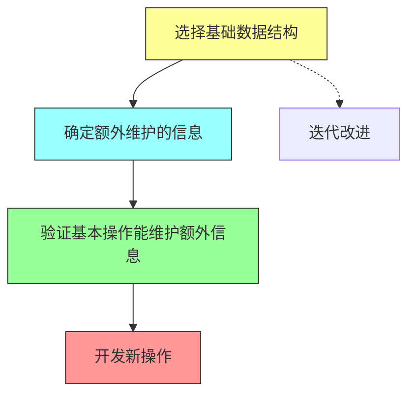
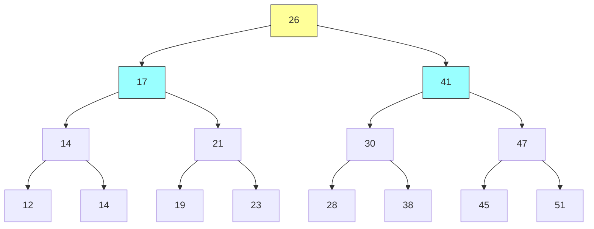
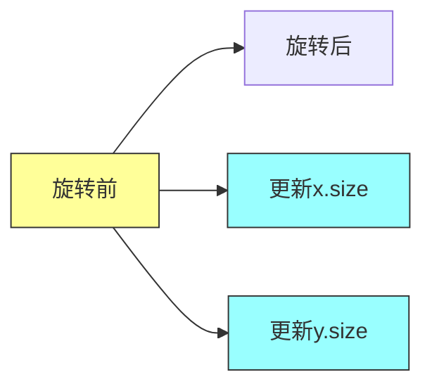
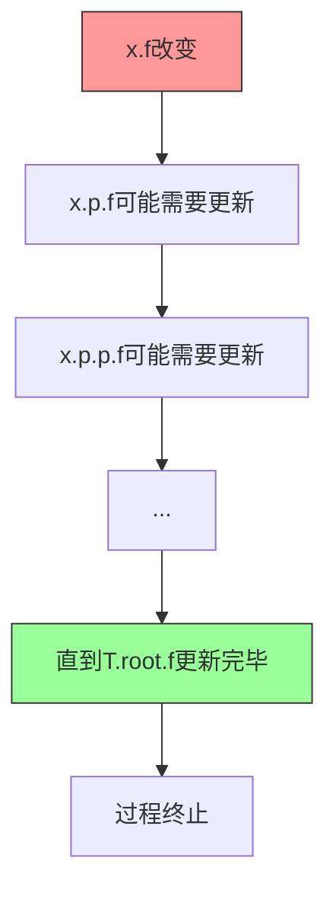
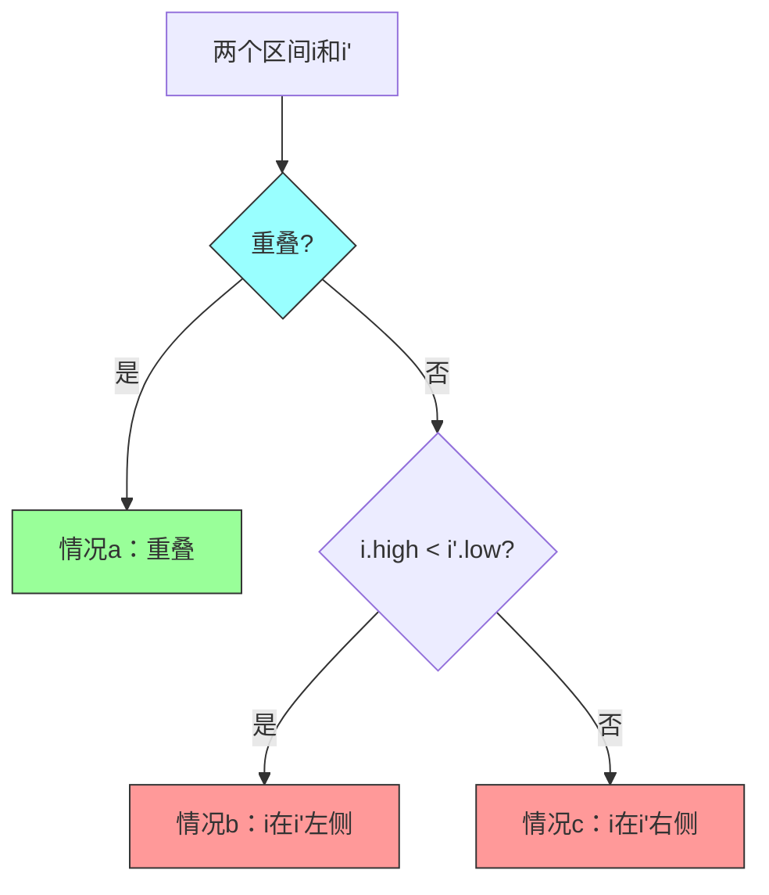
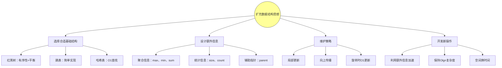
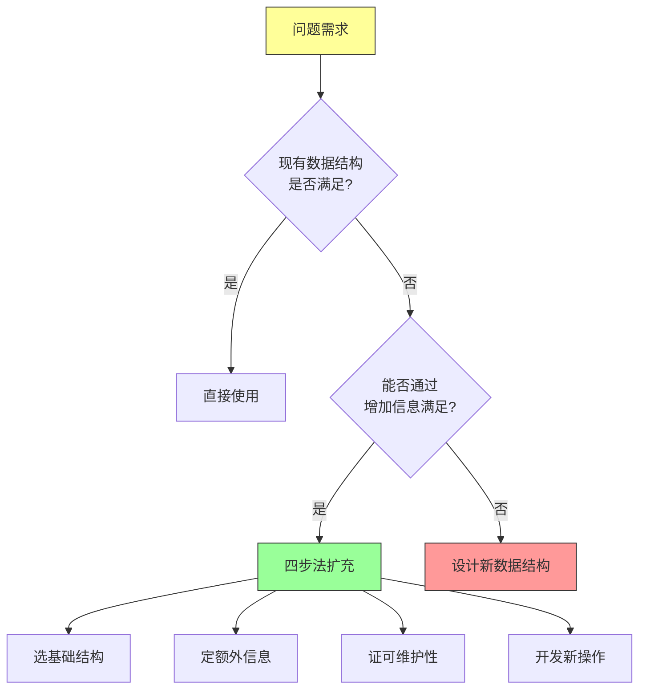

# 第十七章：扩充数据结构（Augmenting Data Structures）——深度版

## 一、问题描述

### 1.1 本章主题

本章讨论如何通过**扩充基础数据结构**来支持应用程序的特殊需求。核心思想是：不需要创建全新的数据结构，而是在现有数据结构（如红黑树）中存储额外信息，并编程新的操作来支持特定应用。

### 1.2 扩充数据结构的挑战

扩充数据结构并不总是 straightforward，因为**额外信息必须由普通操作来更新和维护**。这是本章要解决的核心问题。

### 1.3 三节内容概览

| 章节 | 主题 | 核心问题 |
|-----|------|---------|
| 17.1 | 动态顺序统计 | 如何快速找到第i小的元素？ |
| 17.2 | 扩充方法论 | 如何系统地扩充红黑树？ |
| 17.3 | 区间树 | 如何快速查找重叠区间？ |

---

## 二、扩充数据结构的四步法

### 2.1 核心流程



### 2.2 四步详解

**步骤1：选择基础数据结构**
- 选择能够高效支持相关操作的数据结构
- 例如：红黑树支持MINIMUM、MAXIMUM、SUCCESSOR、PREDECESSOR等

**步骤2：确定额外维护的信息**
- 根据应用需求确定需要存储的额外属性
- 例如：顺序统计树存储每个节点的子树大小

**步骤3：验证维护开销**
- 确保基本修改操作（插入、删除）能在O(lg n)时间内维护额外信息
- 理想情况：每次更新只影响O(lg n)个节点

**步骤4：开发新操作**
- 利用额外信息实现新的高效操作
- 例如：OS-SELECT、OS-RANK、INTERVAL-SEARCH

---

## 三、动态顺序统计（17.1）

### 3.1 问题定义

**顺序统计**：集合中第i小的元素，其中i ∈ {1, 2, ..., n}。

**两个核心操作**：
- `OS-SELECT(T, i)`：找到第i小的元素
- `OS-RANK(T, x)`：计算元素x的秩（排名）

### 3.2 顺序统计树的结构



**关键属性**：每个节点x存储`x.size` = 子树中节点数（不包括哨兵）

**基本恒等式**：
```
x.size = x.left.size + x.right.size + 1
```

### 3.3 OS-SELECT算法

```java
OS-SELECT(x, i)
1  r = x.left.size + 1           // x在子树中的秩
2  if i == r
3      return x                  // 找到第i小元素
4  elseif i < r
5      return OS-SELECT(x.left, i)
6  else
7      return OS-SELECT(x.right, i - r)
```

**搜索过程示例**：在图17.1中搜索第17小元素

```
Step 1: x = 26, 左子树大小 = 12, r = 13
        i = 17 > 13, 递归右子树, 新i = 4

Step 2: x = 41, 左子树大小 = 5, r = 6
        i = 4 < 6, 递归左子树

Step 3: x = 30, 左子树大小 = 1, r = 2
        i = 4 > 2, 递归右子树, 新i = 2

Step 4: x = 38, 左子树大小 = 1, r = 2
        i = 2 == r, 返回38
```

### 3.4 OS-RANK算法

```java
OS-RANK(T, x)
1  r = x.left.size + 1           // x在子树中的秩
2  y = x
3  while y != T.root
4      if y == y.p.right         // 如果y是右子节点
5          r = r + y.p.left.size + 1
6      y = y.p
7  return r
```

**执行示例**：查找节点38的秩

| 迭代 | y.key | r |
|-----|-------|---|
| 1 | 38 | 2 |
| 2 | 30 | 4 |
| 3 | 41 | 4 |
| 4 | 26 | 17 |

**结果**：节点38的秩为17

### 3.5 维护子树大小

**插入操作**：
- 第一阶段：从根到叶的路径上，所有节点的size加1
- 第二阶段：最多2次旋转，每次旋转更新2个节点的size
- 总开销：O(lg n)

**删除操作**：
- 第一阶段：从移动节点的路径向上到根，所有节点的size减1
- 第二阶段：最多3次旋转
- 总开销：O(lg n)



### 3.6 复杂度分析

| 操作 | 时间复杂度 | 说明 |
|-----|-----------|------|
| OS-SELECT | O(lg n) | 每次递归下降一层 |
| OS-RANK | O(lg n) | 沿父节点链向上遍历 |
| INSERT | O(lg n) | 与普通红黑树相同 |
| DELETE | O(lg n) | 与普通红黑树相同 |

---

## 四、红黑树扩充定理（17.2）

### 4.1 定理17.1：红黑树扩充定理

**定理内容**：
设f是扩充红黑树T中n个节点的属性，假设：
- x.f的值仅依赖于x、x.left、x.right中的信息
- x.f可以在O(1)时间内计算

那么，插入和删除操作可以在不改变O(lg n)时间复杂度的情况下维护f的值。

### 4.2 定理证明的核心思想



**关键观察**：
- f属性的改变只会影响祖先节点
- 红黑树高度为O(lg n)，因此更新代价为O(lg n)

### 4.3 插入过程分析

**第一阶段**：
- 沿路径从根到叶插入新节点
- 新节点的f值在O(1)时间内计算
- 变化向上传播，总时间为O(lg n)

**第二阶段**：
- 最多2次旋转
- 每次旋转只影响2个节点
- 每次旋转后f值传播时间为O(lg n)
- 总时间为O(lg n)

### 4.4 删除过程分析

**第一阶段**：
- 节点删除，最多2个节点移动
- 变化沿简单路径向上传播
- 时间为O(lg n)

**第二阶段**：
- 最多3次旋转
- 分析同插入过程
- 总时间为O(lg n)

### 4.5 扩充设计要点

**选择合适的额外信息**：
- 存储子树大小优于存储节点排名
- 因为插入新最小元素时，只需更新O(lg n)个节点，而非全部节点

**考虑更新的局部性**：
- 旋转后的局部更新优于全局传播
- 理想的额外信息：可以在O(1)时间内更新

---

## 五、区间树（17.3）

### 5.1 问题背景

**区间表示**：用[i.low, i.high]表示连续时间段的事件。

**区间重叠定义**：
```
i 和 i' 重叠 当且仅当 i.low ≤ i'.high 且 i'.low ≤ i.high
```

### 5.2 区间三歧性



**三歧性**：任意两个区间必满足以下之一：
- a. 重叠
- b. i在i'左侧（i.high < i'.low）
- c. i在i'右侧（i'.high < i.low）

### 5.3 区间树的结构

**基础数据结构**：红黑树
- 关键字：区间的左端点i.low
- 中序遍历按左端点排序

**额外信息**：每个节点x存储x.max = 子树中所有区间右端点的最大值

```java
x.max = max(x.int.high, x.left.max, x.right.max)
```

### 5.4 区间查找算法

```java
INTERVAL-SEARCH(T, i)
1  x = T.root
2  while x != T.nil and i不重叠x.int
3      if x.left != T.nil and x.left.max ≥ i.low
4          x = x.left          // 左子树可能有重叠
5      else
6          x = x.right         // 左子树无重叠，去右子树
7  return x
```

### 5.5 查找过程示例

**示例1**：查找与[22, 25]重叠的区间

```
Step 1: x = 26, [16,21]不与[22,25]重叠
        x.left.max = 23 ≥ 22, 去左子树

Step 2: x = 17, [8,9]不与[22,25]重叠
        x.left.max = 10 < 22, 去右子树

Step 3: x = 30, [15,23]与[22,25]重叠
        返回30
```

**示例2**：查找与[11,14]重叠的区间（无结果）

```
Step 1: x = 26, [16,21]不重叠, x.left.max=23≥11, 去左
Step 2: x = 17, [8,9]不重叠, x.left.max=10<11, 去右
Step 3: x = 30, [15,23]不重叠, 左孩子为空, 去右
Step 4: x = T.nil, 返回T.nil
```

### 5.6 正确性证明（定理17.2）

**定理**：INTERVAL-SEARCH要么返回重叠的节点，要么返回T.nil（表示无重叠区间）。

**核心不变式**：
- 如果向左走：左子树有重叠区间，或右子树无重叠区间
- 如果向右走：左子树无重叠区间

**向右走的情况**（更简单）：
- 条件：x.left = T.nil 或 x.left.max < i.low
- 若x.left = T.nil：左子树为空，无重叠
- 若x.left.max < i.low：左子树中任意区间i'满足i'.high ≤ x.left.max < i.low
- 由区间三歧性，i和i'不重叠

**向左走的情况**：
- 条件：x.left.max ≥ i.low
- 左子树中存在区间i'使得i'.high = x.left.max ≥ i.low
- 由于i'不与i重叠（否则已返回），有i.high < i'.low
- i'.low ≤ x.int.low（i'在左子树）
- x.int.low ≤ i''.low（i''在右子树，右端点更大）
- 因此i.high < i''.low，i与右子树任意区间不重叠

### 5.7 复杂度分析

| 操作 | 时间复杂度 | 说明 |
|-----|-----------|------|
| INTERVAL-SEARCH | O(lg n) | 每次循环O(1)，树高O(lg n) |
| INTERVAL-INSERT | O(lg n) | 维护max属性 |
| INTERVAL-DELETE | O(lg n) | 维护max属性 |

---

## 六、算法模板

### 6.1 顺序统计树Java实现

```java
public class OrderStatisticTree {
    private static class Node {
        int key;
        Node left, right, parent;
        boolean color;
        int size;  // 子树节点数
    }

    private Node root;
    private Node NIL;

    // OS-SELECT: 找第i小的元素
    public Node osSelect(Node x, int i) {
        int r = size(x.left) + 1;  // x在子树中的秩
        if (i == r) {
            return x;
        } else if (i < r) {
            return osSelect(x.left, i);
        } else {
            return osSelect(x.right, i - r);
        }
    }

    // OS-RANK: 计算x的秩
    public int osRank(Node x) {
        int r = size(x.left) + 1;
        Node y = x;
        while (y != root) {
            if (y == y.parent.right) {
                r = r + size(y.parent.left) + 1;
            }
            y = y.parent;
        }
        return r;
    }

    // LEFT-ROTATE时更新size
    private void leftRotate(Node x) {
        Node y = x.right;
        x.right = y.left;
        y.left.parent = x.parent;
        y.size = x.size;
        x.size = size(x.left) + size(x.right) + 1;
    }
}
```

### 6.2 区间树Java实现

```java
public class IntervalTree {
    private static class Interval {
        int low, high;
    }

    private static class Node {
        Interval int;     // 区间
        int max;          // 子树中最大右端点
        Node left, right, parent;
        boolean color;
    }

    private Node root;

    // 查找与i重叠的区间
    public Node intervalSearch(Interval i) {
        Node x = root;
        while (x != NIL && !overlaps(i, x.int)) {
            if (x.left != NIL && x.left.max >= i.low) {
                x = x.left;
            } else {
                x = x.right;
            }
        }
        return x;
    }

    private boolean overlaps(Interval a, Interval b) {
        return a.low <= b.high && b.low <= a.high;
    }

    // 更新max属性
    private void updateMax(Node x) {
        x.max = Math.max(x.int.high,
                Math.max(size(x.left), size(x.right)));
    }
}
```

### 6.3 Python实现

```python
class OrderStatisticTreeNode:
    def __init__(self, key):
        self.key = key
        self.left = None
        self.right = None
        self.parent = None
        self.color = 'red'  # 红黑树节点
        self.size = 1       # 子树大小

def os_select(x, i):
    """找到第i小的元素"""
    r = x.left.size + 1 if x.left else 1
    if i == r:
        return x
    elif i < r:
        return os_select(x.left, i)
    else:
        return os_select(x.right, i - r)

def os_rank(root, x):
    """计算x的秩"""
    r = x.left.size + 1 if x.left else 1
    y = x
    while y != root:
        if y == y.parent.right:
            left_size = y.parent.left.size if y.parent.left else 0
            r += left_size + 1
        y = y.parent
    return r

class IntervalTreeNode:
    def __init__(self, low, high):
        self.low = low
        self.high = high
        self.max = high
        self.left = None
        self.right = None

def interval_search(root, interval):
    """查找与interval重叠的区间"""
    x = root
    while x:
        if overlaps(interval, (x.low, x.high)):
            return x
        left_max = x.left.max if x.left else float('-inf')
        if left_max >= interval[0]:
            x = x.left
        else:
            x = x.right
    return None

def overlaps(a, b):
    """检查两个区间是否重叠"""
    return a[0] <= b[1] and b[0] <= a[1]
```

---

## 七、举一反三

### 7.1 同类LeetCode题目

| 题目 | 链接 | 核心思想 |
|-----|------|---------|
| 315. 计算右侧小于当前元素的个数 | https://leetcode.cn/problems/count-of-smaller-numbers-after-self/ | 顺序统计树/树状数组 |
| 327. 区间和的个数 | https://leetcode.cn/problems/count-of-range-sum/ | 平衡BST/前缀和 |
| 352. 将数据流变为每个不相交区间 | https://leetcode.cn/problems/data-stream-as-disjoint-intervals/ | 区间树 |
| 715. Range模块 | https://leetcode.cn/problems/range-module/ | 区间管理 |

### 7.2 变形题目

**区间树的扩展**：
- 查找所有重叠区间（而非仅一个）
- 支持区间删除和修改
- 在高维空间推广（如矩形树）

**顺序统计树的扩展**：
- 支持重复键的顺序统计
- 求第i小和第j大之间的元素
- 支持动态区间查询

### 7.3 核心思想的迁移应用



### 7.4 实际应用场景

| 应用 | 数据结构 | 额外信息 | 操作 |
|-----|---------|---------|------|
| 航班预订系统 | 区间树 | max | 查找可用时段 |
| 成绩排名系统 | 顺序统计树 | size | 第k名、排名查询 |
| 内存管理 | 区间树 | max | 查找空闲块 |
| 股票行情 | 区间树 | max | 查找价格区间 |

---

## 八、总结

### 8.1 核心收获

1. **四步法**：选择基础结构 → 确定额外信息 → 验证可维护性 → 开发新操作

2. **红黑树扩充定理**：满足特定条件的额外信息可在O(lg n)时间内维护

3. **两个经典案例**：
   - 顺序统计树：存储size属性，支持O(lg n)顺序统计
   - 区间树：存储max属性，支持O(lg n)区间查询

4. **设计原则**：
   - 优先选择局部可更新的信息
   - 旋转时更新代价应为O(1)
   - 利用额外信息加速查询操作

### 8.2 方法论总结



---

## 参考资料

- Cormen, T. H., Leiserson, C. E., Rivest, R. L., & Stein, C. (2009). *Introduction to Algorithms* (3rd ed.). MIT Press.
- Chapter 17: Augmenting Data Structures, pp. 633-654
