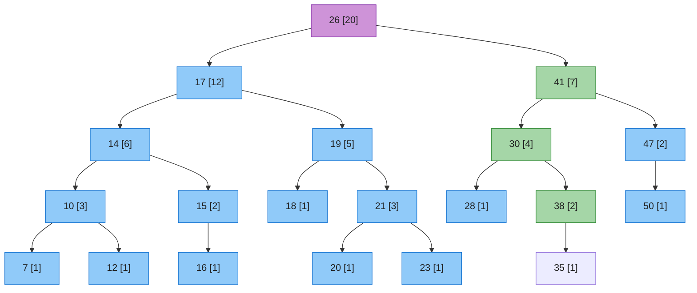
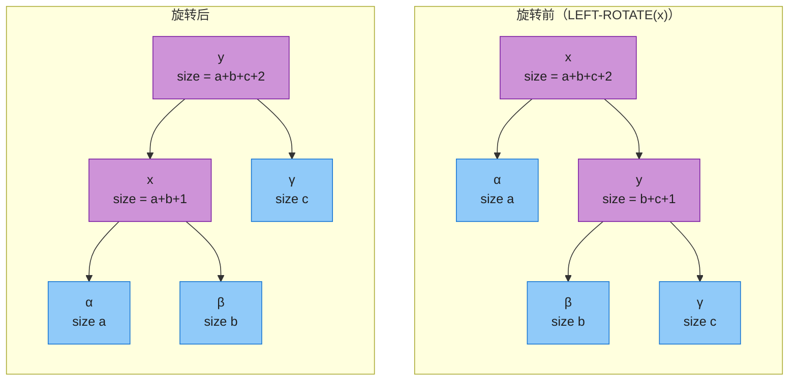
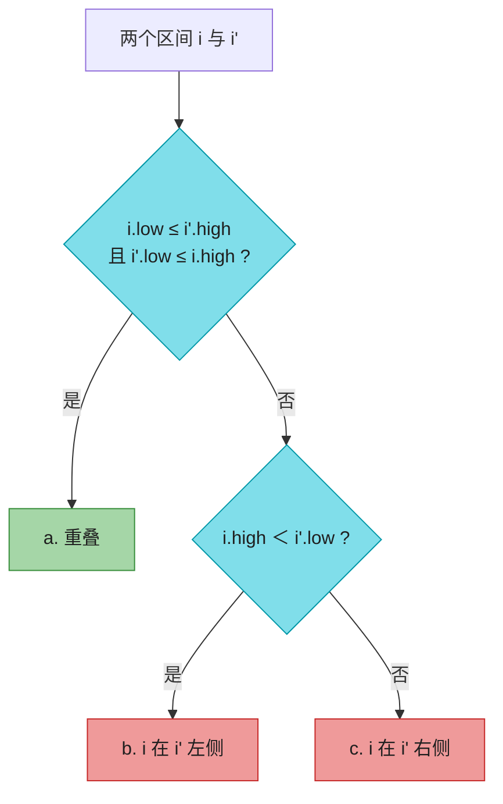
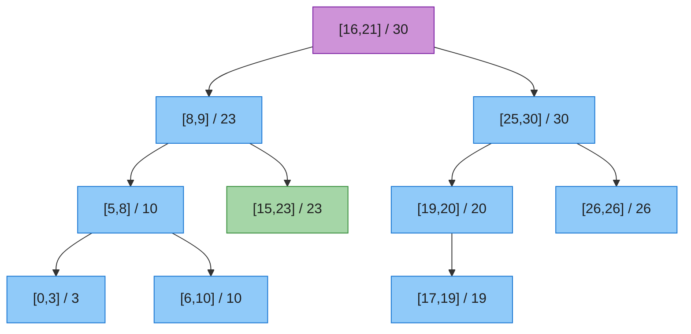

# 第十七章：扩充数据结构（Augmenting Data Structures）

> **定位**：大多数题目用「教科书数据结构」（链表、哈希表、二叉搜索树）就够了；少数题目需要一点创造力——但**很少需要发明全新的结构**，更常见的做法是**在现有结构里多存一点信息**，再为它写几个新操作。本章就用红黑树演示这套「扩充」手艺。
> **一句话**：不造轮子，给轮子加仪表盘。
>
> 两个经典案例：①**顺序统计树**——给红黑树每个节点记一个 `size`，就能在 O(lg n) 内「找第 i 小 / 求某元素排名」（把第 9 章的 O(n) quickselect 升级成动态 O(lg n)）；②**区间树**——给每个节点记一个 `max`，就能 O(lg n) 找出一个与查询区间重叠的区间（航班/会议室/内存块调度）。
>
> **前后指针**：底座是**第 13 章的红黑树**——本章所有 O(lg n) 结论都依赖它的两个性质：树高 O(lg n)、**每次插入/删除最多常数次旋转**（这点是定理 17.1 成立的关键，第 13 章已埋伏笔）。前接**第 9 章（顺序统计量）**、**第 10 章（基本数据结构）**；后启**第 18 章（B 树，同样的扩充思路）**。
>
> 对照第四版书页 480–496。

---

## 一、扩充数据结构的四步法（§17.2）

任何「扩充」都可以拆成四步（次序不必死守，常并行迭代）：


1. **选底座**：挑一个本身就高效支持相关操作的结构。红黑树是个好起点——它对全序集支持 MINIMUM/MAXIMUM/SUCCESSOR/PREDECESSOR，且树高 O(lg n)。
2. **加属性**：确定每个节点额外存什么。例如顺序统计树存 `x.size`（子树节点数）。
3. **验维护**：确认插入/删除在维护新属性的同时仍是 O(lg n)。**理想是更新只波及 O(lg n) 个节点**——这是成败关键。
4. **写新操作**：用新属性实现高效查询。

> **第 2 步的反面教材**：如果每个节点存「自己在整棵树里的排名」而不是 `size`，那么插入一个新最小值会**改变全树所有节点的排名**（Ω(n) 个），维护不起。存 `size` 则只改根到叶路径上 O(lg n) 个节点。**存聚合信息（size/max/sum）远胜存派生信息（rank）**——这是本章最重要的设计直觉。

---

## 二、动态顺序统计（§17.1）

### 2.1 问题

第 9 章在**无序**集合上求第 i 小要 O(n)。给红黑树扩充后，**动态集合**（边插边删）也能做到：

- `OS-SELECT(T, i)`：返回第 i 小的节点。
- `OS-RANK(T, x)`：返回节点 x 的秩（中序遍历里的位置）。

两者都是 **O(lg n)**。

### 2.2 顺序统计树的结构

给红黑树每个节点 x 加一个属性 `x.size` = 子树中（不含哨兵的）节点数，满足恒等式：

```
x.size = x.left.size + x.right.size + 1     （哨兵 T.nil.size = 0）
```

下面这棵就是 CLRS Figure 17.1（20 个节点，根 26）。节点标注为 `key [size]`：



> 上图绿色路径 `26 → 41 → 30 → 38` 就是下文 OS-SELECT 找第 17 小、以及 OS-RANK 求节点 38 秩时所走的路线。底座是一棵红黑树（颜色省略，聚焦 size）。

> **键可重复**：图中允许重复键。此时「秩」定义为**中序遍历打印到它的位置**，消除歧义。

### 2.3 OS-SELECT：找第 i 小

```
OS-SELECT(x, i)
1  r = x.left.size + 1          // x 在以 x 为根的子树里的秩
2  if i == r  return x
3  elseif i < r  return OS-SELECT(x.left, i)
4  else  return OS-SELECT(x.right, i - r)   // 注意 i 要减 r
```

`x.left.size` 是中序排在 x 之前的节点数，所以 `x.left.size + 1` 是 x 在本子树的秩。`i < r` 去左子树；`i > r` 去右子树找第 `i - r` 小（左子树 + 根已占掉前 r 个）。

**走查（求第 17 小，沿绿色路径）**：

| 步 | 当前节点 x | x.left.size | r = 左+1 | 比较 | 动作 |
|----|-----------|-------------|----------|------|------|
| 1 | 26 | 12 | 13 | i=17 > 13 | 走右，新 i = 17−13 = **4** |
| 2 | 41 | 4  | 5  | i=4 < 5   | 走左 |
| 3 | 30 | 1  | 2  | i=4 > 2   | 走右，新 i = 4−2 = **2** |
| 4 | 38 | 1  | 2  | i=2 == 2  | **返回 38** ✓ |

每次下降一层 → **O(lg n)**。

### 2.4 OS-RANK：求节点 x 的秩

```
OS-RANK(T, x)
1  r = x.left.size + 1
2  y = x
3  while y != T.root
4      if y == y.p.right              // y 是右孩子：把「父亲 + 父亲左子树」都算进来
5          r = r + y.p.left.size + 1
6      y = y.p                       // 上移一层
7  return r
```

直觉：x 的秩 = 中序排在 x 之前的节点数 + 1。从 x 向上爬，**只有当 y 是右孩子时**，父亲及其左子树才排在 x 之前，要加上；若 y 是左孩子，父亲和父亲的右子树都排在 x 之后，不加。

**走查（求节点 38 的秩，沿绿色路径反向回溯）**：

| 迭代 | y.key | y 是右孩子？ | r |
|------|-------|------------|---|
| 初值 | 38 | —（起点 r=38.left.size+1=2） | 2 |
| 1 | 38 → 上移到 30 | 38 是 30 的右孩子 ✓，r += 30.left.size+1 = 2 | 4 |
| 2 | 30 → 上移到 41 | 30 是 41 的**左**孩子 ✗ | 4 |
| 3 | 41 → 上移到 26 | 41 是 26 的右孩子 ✓，r += 26.left.size+1 = 13 | **17** |
| 4 | y = root，停止 | | **返回 17** ✓ |

每次上移一层 → **O(lg n)**。

### 2.5 维护 size：插入与删除（核心难点）

新属性能不能被普通操作高效维护，是扩充成败的关键。红黑树的插入/删除都分两阶段（见 §13.3、§13.4），size 在两阶段都好维护：

**插入**：
- **阶段一（自顶向下找位置）**：从根到新叶路径上每个节点 `size++`。新叶 size=1。路径长 O(lg n) → O(lg n)。
- **阶段二（上溯调色 + 旋转）**：调色不改 size；**每次旋转只破坏 2 个节点的 size**，O(1) 补回（见下图）。插入最多 2 次旋转 → O(1)。

**删除**：阶段一从「最低移动节点」上溯到根，路径上每个节点 `size−−`（O(lg n)）；阶段二最多 3 次旋转，每次 O(1) 补 size。



对应代码（加在 §13.2 的 `LEFT-ROTATE` 末尾两行）：

```
y.size = x.size                          // y 顶上来，接管 x 原来的整棵子树
x.size = x.left.size + x.right.size + 1  // x 降下去，按新孩子重算
```

> **顺序很重要**：先用旧 `x.size` 给 `y.size` 赋值，再重算 `x.size`；反了会用到已更新的值。`RIGHT-ROTATE` 对称。

| 操作 | 时间 | 说明 |
|------|------|------|
| OS-SELECT / OS-RANK | O(lg n) | 沿一条路径走 |
| INSERT（含 size 维护） | O(lg n) | 与普通红黑树同阶 |
| DELETE（含 size 维护） | O(lg n) | 与普通红黑树同阶 |

> **LeetCode 关联**：[315. 计算右侧小于当前元素的个数](https://leetcode.cn/problems/count-of-smaller-numbers-after-self/)、[493. 翻转对](https://leetcode.cn/problems/reverse-pairs/)——本质都是「边插入边问排名」，顺序统计树或树状数组都能做。

---

## 三、红黑树扩充定理（§17.2 / Theorem 17.1）

把 §17.1 的 size 推广成任意属性，就得到一条非常好用的定理：

> **定理 17.1（红黑树扩充定理）**：设 f 是红黑树 T 每个节点的属性。若 `x.f` 的值**只依赖 x、x.left、x.right 的信息**（可以含 `x.left.f`、`x.right.f`），且能在 **O(1)** 时间内算出，那么插入和删除可以在**不改变 O(lg n) 渐进复杂度**的前提下维护所有节点的 f。

**为什么成立（一句话）**：改一个节点的 f 只会**沿祖先链向上传播**（父依赖子，子改了父可能改……直到根）；红黑树高 O(lg n)，所以传播代价 O(lg n)。而旋转只碰 2 个节点，每次旋转后的修复也是 O(lg n)（很多情况其实 O(1)，见习题 17.2-3）；插入/删除只有**常数次旋转**，故总体仍 O(lg n)。

> **注意「常数次旋转」的前提**：并非所有平衡搜索树都满足「每次操作最多常数次旋转」。若某结构一次操作要 Θ(lg n) 次旋转、每次修复又上溯到根，单次操作就退化到 Θ(lg²n)。这正是第 13 章强调红黑树「旋转次数常数上界」的意义。

**套用 checklist**：想给红黑树加属性 f 时，先问两个问题——
1. `x.f` 能否**只看自己和两个孩子**就算出来？（能 → 满足依赖条件）
2. 算一次是不是 **O(1)**？

两条都满足，直接套定理，插入/删除自动 O(lg n) 维护，不必每次重证。`size`（= 左.size + 右.size + 1）和区间树的 `max`（= max(自身, 左.max, 右.max)）都满足。

---

## 四、区间树（§17.3）

### 4.1 区间与重叠

闭区间用 `i = [i.low, i.high]` 表示（如一段时间）。两个区间 i、i' **重叠**当且仅当：

```
i.low ≤ i'.high  且  i'.low ≤ i.high      （注意是「交叉」不等式，别写成 ≤ ≤）
```

**区间三分性（trichotomy）**：任意两个区间 i、i' 必居其一是：



### 4.2 结构与 max 属性

按四步法设计：

1. **底座**：红黑树，**键 = 区间左端点 `int.low`**（中序遍历即按左端点排序）。
2. **加属性**：每个节点 x 存 `x.max` = 子树中所有区间**右端点**的最大值。
3. **验维护**：`x.max = max(x.int.high, x.left.max, x.right.max)`，O(1) 可算 → 由定理 17.1，插入/删除 O(lg n)。
4. **新操作**：`INTERVAL-SEARCH`。

```
INTERVAL-SEARCH(T, i)
1  x = T.root
2  while x != T.nil and i 与 x.int 不重叠
3      if x.left != T.nil and x.left.max >= i.low
4          x = x.left        // 左子树可能有重叠（或右子树必无重叠）
5      else x = x.right      // 左子树铁定无重叠，去右
6  return x                  // 返回一个重叠节点，或 T.nil
```

**直觉**：`x.left.max` 是左子树里所有区间右端点的天花板。若它 `< i.low`，左子树任一区间 i' 都满足 `i'.high ≤ x.left.max < i.low`，由三分性必不与 i 重叠——放心去右。否则去左（哪怕左没找到，右也必定没有，见正确性证明）。

### 4.3 走查（CLRS Figure 17.4，10 个区间）

区间按左端点排序：`[0,3] [5,8] [6,10] [8,9] [15,23] [16,21] [17,19] [19,20] [25,30] [26,26]`。区间树（节点标 `[lo,hi] / max`）：



**查询 [22,25]**（命中 `[15,23]`，绿色节点）：

| 步 | x | 重叠？ | x.left.max ≥ 22 ? | 动作 |
|----|---|--------|-------------------|------|
| 1 | [16,21] | ✗ | 23 ≥ 22 ✓ | 走左 |
| 2 | [8,9]   | ✗ | 10 < 22 ✗ | 走右 |
| 3 | [15,23] | ✓（15≤25 且 22≤23） | — | **返回 [15,23]** ✓ |

**查询 [11,14]**（无重叠，返回 nil）：

| 步 | x | 重叠？ | x.left.max ≥ 11 ? | 动作 |
|----|---|--------|-------------------|------|
| 1 | [16,21] | ✗ | 23 ≥ 11 ✓ | 走左 |
| 2 | [8,9]   | ✗ | 10 < 11 ✗ | 走右 |
| 3 | [15,23] | ✗ | 左是 nil | 走右（nil） |
| 4 | x = nil | — | — | **返回 nil** ✓ |

### 4.4 正确性（定理 17.2，直觉版）

只需说明：**每一步走的方向都是「安全」的**——若树里有重叠区间，绝不会走错方向错过它。

- **走右**（line 5）：触发条件是 `x.left = nil` 或 `x.left.max < i.low`。后者意味着左子树任一区间 i' 都有 `i'.high ≤ x.left.max < i.low`，由三分性不与 i 重叠。所以左子树本就无重叠，去右不丢。
- **走左**（line 4）：触发条件 `x.left.max ≥ i.low`。若左子树真有重叠，已得解；若左子树其实没重叠，要证明右子树也没有。此时左子树存在某区间 i' 使 `i'.high = x.left.max ≥ i.low`；又 i' 不与 i 重叠（否则 line 2 早返回了），由三分性得 `i.high < i'.low`。而区间树按左端点排序，i' 在左子树 ⇒ `i'.low ≤ x.int.low ≤ 任意右子树区间 i''` 的 `.low`。串起来：`i.high < i'.low ≤ i''.low` ⇒ i 与 i'' 不重叠。右子树同样无重叠，走左也不丢。

每次循环 O(1)，树高 O(lg n) → **INTERVAL-SEARCH 是 O(lg n)**。

> INTERVAL-SEARCH 只返回**一个**重叠区间。要列出全部 k 个重叠区间，用习题 17.3-3 的递归版，O(min(n, k lg n))。

| 操作 | 时间 |
|------|------|
| INTERVAL-SEARCH / INSERT / DELETE | O(lg n)（含 max 维护） |

> **LeetCode 关联**：[729. 我的日程安排 I](https://leetcode.cn/problems/my-calendar-i/)、[731. 我的日程安排 II](https://leetcode.cn/problems/my-calendar-ii/)、[732. 我的日程安排 III](https://leetcode.cn/problems/my-schedule-iii/)（区间重叠检测全家桶）、[352. 将数据流变为不相交区间](https://leetcode.cn/problems/data-stream-as-disjoint-intervals/)、[715. Range 模块](https://leetcode.cn/problems/range-module/)（区间维护）。面试里通常用 `TreeMap`/`TreeSet` 的 `floor`/`ceiling` 即可，不必手写红黑树。

---

## 五、代码实现

> 伪代码贴 CLRS 1-indexed 风格；可运行代码统一 **0-indexed / 对象化**。红黑树的 `INSERT` + `INSERT-FIXUP` 是第 13 章的标准件，这里只标注**与扩充相关的两处差异**：(1) 旋转末尾更新 `size`/`max`；(2) `INSERT` 下行时给路径上的节点 `size++`（顺序统计树）。区间树的 fixup 与顺序统计树完全一致。

### 5.1 顺序统计树（Java）

```java
import java.util.*;

public class OSTree {
    static final boolean RED = true, BLACK = false;
    static class Node {
        int key, size; boolean color;
        Node left, right, parent;
        Node(int k, Node nil) { key = k; size = 1; color = RED; left = right = parent = nil; }
    }
    final Node nil;                       // 哨兵：size=0，便于 x.left.size 直接取值
    Node root;
    OSTree() {
        nil = new Node(0, null); nil.size = 0; nil.color = BLACK;
        nil.left = nil.right = nil.parent = nil; root = nil;
    }

    // 左旋：结构部分同 §13.2，末尾 2 行是 size 扩充
    void leftRotate(Node x) {
        Node y = x.right;
        x.right = y.left;
        if (y.left != nil) y.left.parent = x;
        y.parent = x.parent;
        if (x.parent == nil) root = y;
        else if (x == x.parent.left) x.parent.left = y; else x.parent.right = y;
        y.left = x; x.parent = y;
        y.size = x.size;                            // ★ y 接管 x 原整棵子树
        x.size = x.left.size + x.right.size + 1;    // ★ x 按新孩子重算
    }
    // rightRotate 对称（略）

    void insert(int key) {
        Node z = new Node(key, nil);
        Node y = nil, x = root;
        while (x != nil) {                          // ★ 阶段一：路径上 size++
            x.size++; y = x;
            x = key < x.key ? x.left : x.right;
        }
        z.parent = y;
        if (y == nil) root = z;
        else if (key < y.key) y.left = z; else y.right = z;
        insertFixup(z);                             // 阶段二：调色 + ≤2 次旋转（旋转自带 size 更新）
    }
    void insertFixup(Node z) { /* 标准 RB-FIXUP（§13.3），调色不动 size，旋转调 leftRotate */ }

    // ★ 新操作：找第 i 小
    Node osSelect(Node x, int i) {
        int r = x.left.size + 1;
        if (i == r) return x;
        return i < r ? osSelect(x.left, i) : osSelect(x.right, i - r);
    }
    // ★ 新操作：求 x 的秩
    int osRank(Node x) {
        int r = x.left.size + 1;
        for (Node y = x; y != root; y = y.parent)
            if (y == y.parent.right) r += y.parent.left.size + 1;
        return r;
    }
    Node find(int key) {                            // 普通 BST 查找
        Node x = root;
        while (x != nil) { if (key == x.key) return x; x = key < x.key ? x.left : x.right; }
        return null;
    }
}
```

`insertFixup` 与第 13 章一字不差（颜色修复不碰 size；遇旋转调 `leftRotate`/`rightRotate`，size 在里面自动维护）。完整可运行版（含 fixup 与对拍测试）已通过 200 轮随机 fuzz：构建 Figure 17.1 的 20 个键，`osSelect(root,17).key == 38`、`osRank(find(38)) == 17`、`osRank(find(35)) == 16` 全部成立，且每个节点 `size == left.size + right.size + 1`。

### 5.2 顺序统计树（Python）

```python
RED, BLACK = True, False

class OSTNode:
    __slots__ = ('key','size','color','left','right','parent')
    def __init__(self, key, nil):
        self.key, self.size, self.color = key, 1, RED
        self.left = self.right = self.parent = nil

class OSTree:
    def __init__(self):
        self.nil = OSTNode(0, None); self.nil.size = 0; self.nil.color = BLACK
        self.nil.left = self.nil.right = self.nil.parent = self.nil
        self.root = self.nil

    def _lrot(self, x):
        y = x.right
        x.right = y.left
        if y.left is not self.nil: y.left.parent = x
        y.parent = x.parent
        if x.parent is self.nil: self.root = y
        elif x is x.parent.left: x.parent.left = y
        else: x.parent.right = y
        y.left = x; x.parent = y
        y.size = x.size                              # ★
        x.size = x.left.size + x.right.size + 1      # ★
    # _rrot 对称

    def insert(self, key):
        nil, z = self.nil, OSTNode(key, self.nil)
        y, x = nil, self.root
        while x is not nil:                          # ★ 路径 size++
            x.size += 1; y = x; x = x.left if key < x.key else x.right
        z.parent = y
        if y is nil: self.root = z
        elif key < y.key: y.left = z
        else: y.right = z
        self._fixup(z)                               # 标准 RB fixup

    def os_select(self, x, i):
        r = x.left.size + 1
        if i == r: return x
        return self.os_select(x.left, i) if i < r else self.os_select(x.right, i - r)

    def os_rank(self, x):
        r = x.left.size + 1
        y = x
        while y is not self.root:
            if y is y.parent.right: r += y.parent.left.size + 1
            y = y.parent
        return r
```

### 5.3 区间树（Java，只列与顺序统计树不同处）

```java
public class IntervalTree {
    static class Node {
        int low, high, max; boolean color;           // ★ max 取代 size
        Node left, right, parent;
        Node(int lo, int hi, Node nil) { low=lo; high=hi; max=hi; color=RED; left=right=parent=nil; }
    }
    final Node nil; Node root;
    IntervalTree() { nil=new Node(0,0,null); nil.max=0; nil.color=BLACK; nil.left=nil.right=nil.parent=nil; root=nil; }

    void pull(Node x) { x.max = Math.max(x.high, Math.max(x.left.max, x.right.max)); }  // ★ O(1) 重算

    void leftRotate(Node x) {
        /* ...结构同 OSTree.leftRotate... */
        y.max = x.max;                               // ★ y 接管 x 原子树（max 不变）
        pull(x);                                     // ★ x 按新孩子重算 max
    }
    void insert(int lo, int hi) {
        /* ...BST 下行定位（同 OSTree，但无需 size++）... 放入 z ... */
        for (Node p = z.parent; p != nil; p = p.parent) {            // ★ max 向上传播
            int nm = Math.max(p.high, Math.max(p.left.max, p.right.max));
            if (nm == p.max) break;                  // 不再变化则祖先也不变，提前停
            p.max = nm;
        }
        insertFixup(z);                              // 同 OSTree
    }
    // ★ 新操作
    Node intervalSearch(int lo, int hi) {
        Node x = root;
        while (x != nil && !(x.low <= hi && lo <= x.high))           // 不重叠
            x = (x.left != nil && x.left.max >= lo) ? x.left : x.right;
        return x;                                    // 重叠节点 或 nil
    }
}
```

区间树与顺序统计树共享同一套红黑树骨架，**唯一区别是属性从 `size` 换成 `max`、旋转末尾的更新换一行、`insert` 下行无需 `size++`**。Python 版结构完全对应（`pull`/`max` 替换 `size`），此处从略。完整 Java + Python 实现均通过 300 轮随机对拍（对照暴力枚举校验重叠正确性 + 每节点 max 不变式），并精确复现 Figure 17.4：`intervalSearch(22,25) → [15,23]`、`intervalSearch(11,14) → nil`。

---

## 六、复杂度速查 + 易混点

### 6.1 速查

| 结构 | 额外属性 | 关键操作 | 时间 | 出处 |
|------|---------|----------|------|------|
| 顺序统计树 | `size` | OS-SELECT / OS-RANK | O(lg n) | §17.1 |
| 顺序统计树 | `size` | INSERT / DELETE（含维护） | O(lg n) | §17.1 |
| 区间树 | `max` | INTERVAL-SEARCH | O(lg n) | §17.3 |
| 区间树 | `max` | INSERT / DELETE（含维护） | O(lg n) | §17.3 |
| 任意 f（定理 17.1） | f | INSERT / DELETE 维护 f | O(lg n) | §17.2 |

### 6.2 易混点

- **存 `size` 不存「全局 rank」**：全局 rank 在插入新最小值时要改全树 Ω(n) 个节点；`size` 只改根到叶路径上 O(lg n) 个。设计扩充属性时，**优先聚合量（size/max/sum），回避派生量（rank）**。
- **OS-RANK 的累加方向**：只有当 y 是**右孩子**时才 `+= 父 + 父的左子树`；y 是左孩子时**什么都不加**（父和父的右子树都排在 x 之后）。别加反。
- **OS-SELECT 递归进右子树时 `i` 要减 `r`**（`i - r`），因为左子树 + 根已占掉前 r 个位置；忘减会错位。
- **旋转更新顺序**：先 `y.attr = x.attr`（用旧值），再重算 `x.attr`。区间树是 `max`、顺序统计树是 `size`，**套路一致**。
- **区间树 `max` ≠ 区间长度**：`max` 是子树中所有区间**右端点**的最大值，不是长度最大值，也不是左端点。
- **重叠判定是「交叉不等式」**：`i.low ≤ i'.high 且 i'.low ≤ i.high`，不是 `i.low ≤ i'.low ≤ i.high`（那是包含）。
- **定理 17.1 要求 f 只依赖 x 和它的两个孩子**。依赖**父节点**的属性（如 `depth = parent.depth + 1`）**不满足**，不能直接套定理——这是习题 17.2-2 的考点。
- **INTERVAL-SEARCH 只返回一个重叠区间**，且不保证是「左端点最小」的那个；要全部用 17.3-3，要最小左端点用 17.3-2。
- **O(lg n) 维护依赖红黑树「常数次旋转」**：不是所有平衡树都有此性质；换成型树（splay）等结构，单次操作可能 Θ(lg n) 次旋转，定理 17.1 的界就保不住了。

---

## 七、LeetCode 题单 + 习题 + 思考题

### 7.1 LeetCode 题单

| 题目 | 难度 | 考点 | 用本章什么 |
|------|------|------|-----------|
| [729. 我的日程安排 I](https://leetcode.cn/problems/my-calendar-i/) | 中 | 区间重叠检测 | 区间树思想（TreeMap 即可） |
| [731. 我的日程安排 II](https://leetcode.cn/problems/my-calendar-ii/) | 中 | 三重重叠 | 区间计数 + 差分 |
| [732. 我的日程安排 III](https://leetcode.cn/problems/my-calendar-iii/) | 困 | 最大重叠数 | 差分 / 思考题 17-1 |
| [315. 计算右侧小于当前元素的个数](https://leetcode.cn/problems/count-of-smaller-numbers-after-self/) | 困 | 边插边问排名 | 顺序统计树 / 树状数组 |
| [493. 翻转对](https://leetcode.cn/problems/reverse-pairs/) | 困 | 计数 | 顺序统计树 / 归并 |
| [327. 区间和的个数](https://leetcode.cn/problems/count-of-range-sum/) | 困 | 离散化 + 计数 | 平衡 BST / 树状数组 |
| [352. 将数据流变为不相交区间](https://leetcode.cn/problems/data-stream-as-disjoint-intervals/) | 困 | 区间合并 | TreeSet 维护端点 |
| [715. Range 模块](https://leetcode.cn/problems/range-module/) | 困 | 区间增删查 | 区间树 / 动态开点线段树 |

> 面试不考手写红黑树，考的是**有序容器（TreeMap/TreeSet）+ 区间/排名思维**。315/493/327 是「顺序统计」的计数变体；729/731/732/352/715 是区间维护。树状数组（BIT）往往是顺序统计树的最简替代。

### 7.2 习题快问快答（第四版编号）

- **17.1-1**　`OS-SELECT(root, 10)`：26(r=13→左) → 17(r=7，i=10>7→右，新 i=3) → 19(r=2，i=3>2→右，新 i=1) → 21(r=2→左) → **20**。
- **17.1-2**　`OS-RANK(节点 35)`：35 是 38 的左孩子（不加）→ 38 是 30 的右孩子（+2，r=3）→ 30 是 41 的左孩子（不加）→ 41 是 26 的右孩子（+13）→ **16**。
- **17.1-3**　非递归 OS-SELECT：把递归改成 `while`——`while (i != r) { if (i<r) x=x.left; else { i-=r; x=x.right; } r=x.left.size+1; } return x;`
- **17.1-4**　`OS-KEY-RANK(T, k)`：先 BST 查找定位到节点 x，再 `OS-RANK(T, x)`。两次 O(lg n)。
- **17.1-5**　求 x 的第 i 个后继：`r = OS-RANK(T,x)`，返回 `OS-SELECT(T.root, r+i)`。两次 O(lg n) = O(lg n)。
- **17.1-7**　用顺序统计树数逆序对：**从右往左**插入元素；插入 a[i] 后其秩 r = 已插入中 ≤ a[i] 的个数，则比 a[i] 大的有 `(已插入数) - r` 个，累加即逆序对数。O(n lg n)。对应 LeetCode 315/493。
- **17.2-1**　O(1) 支持 MIN/MAX/SUCCESSOR/PREDECESSOR：根节点额外维护 `min`/`max` 指针（插入/删除时 O(lg n) 更新，查询 O(1)）；后继/前驱加线索指针或在每个节点记「子树最左/最右节点」。
- **17.2-2**　黑高可作属性维护（只依赖两个孩子颜色 + 自身，O(1) 可算）→ **可以**。深度 `= parent.depth + 1` **依赖父节点**，违反定理 17.1 的依赖条件 → **不行**（除非走另一套机制）。
- **17.2-3**　f = 子树中序的 a 属性用结合律 ⊗ 折叠（`f(x) = x.left.f ⊗ x.a ⊗ x.right.f`）。旋转后 O(1) 更新：`y.f = x.f`（旧），`x.f = x.left.f ⊗ x.a ⊗ x.right.f`。size 就是 ⊗=+、a=1 的特例。
- **17.3-1**　区间树左旋更新 max：`y.max = x.max; x.max = max(x.int.high, x.left.max, x.right.max);`（见 5.3）。
- **17.3-3**　列出全部 k 个重叠区间 O(min(n, k lg n))：递归版 INTERVAL-SEARCH——当前节点重叠就加入结果；只要左/右子树的 `max ≥ i.low` 就递归进去。

### 7.3 思考题要点

- **17-1 最大重叠点**：(a) 重叠数最多的点必是某区间的端点（重叠数只在端点处变化）；(b) 把所有端点建红黑树（左端点 +1、右端点 −1），每个节点扩充「子树端点和」与「子树内最大前缀和」，`FIND-POM` 即取全局最大前缀和对应的端点，O(lg n)。
- **17-2 约瑟夫问题**（n 人围圈、每数到第 m 个出列）：(b) 用顺序统计树存 1..n；每次 `OS-SELECT` 找当前第 `(当前起点 + m − 1) mod 剩余人数` 个，输出后删除。每次 O(lg n)，共 n 次 → **O(n lg n)**。(a) m 为常数时用专门的递推可到 O(n)，但 OST 的 O(n lg n) 已是通解。

### 章末注记

顺序统计树与「红黑树扩充定理」是 CLRS 的经典组织；区间树由 **Edelsbrunner（1980）** 和 **McCreight（1981）** 提出，Preparata 与 Shamos 的著作给出了多种区间结构——其中**静态**区间树可在 O(k + lg n) 时间内枚举与查询区间重叠的全部 k 个区间（优于本章动态版的 O(k lg n)）。约瑟夫问题是经典组合问题，其 O(n lg n) 解正是顺序统计树的招牌应用之一。
