# 第十八章：B树（Balanced Search Trees for Disk）——深度版

## 一、问题描述

### 1.1 核心挑战：磁盘存储的低效访问

在深入B树之前，我们必须理解一个关键问题：**为什么针对磁盘存储的数据结构评估方式与内存数据结构不同？**

**内存 vs 磁盘的性能鸿沟：**

| 存储类型 | 访问时间 | 容量成本 | 特点 |
|---------|---------|---------|------|
| 主存（内存） | ~50纳秒 | 高昂 | 电子访问，零机械延迟 |
| 磁盘（HDD） | 4-10毫秒 | 便宜 | 机械运动，包含旋转和寻道 |
| 固态硬盘（SSD） | ~0.1毫秒 | 中等 | 电子访问但按块读写 |

**性能差距的具体数字：**
- 7200 RPM磁盘：单次旋转需要8.33毫秒
- 一次完整旋转期间，内存可以访问超过**100,000次**
- 磁盘平均访问时间约4毫秒（包含机械寻道）

**磁盘访问的核心特点：**
1. **按块读写**：不能只读取一个字节，必须读写整个数据块（512-4096字节）
2. **批量访问**：为摊销机械延迟，磁盘一次访问多个数据项
3. **块是基本单位**：每次磁盘读写的代价与读写的数据量无关，只与访问的块数有关

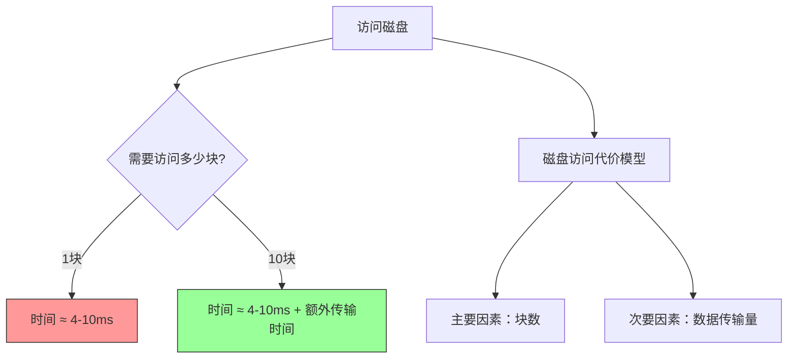

### 1.2 B树的诞生背景

**核心问题**：当数据量大到无法全部装入内存时，如何设计一种数据结构，使得：
- 最小化磁盘访问次数
- 支持高效的搜索、插入、删除操作
- 保持平衡，保证操作的时间复杂度

**B树的解决方案**：
- 使用**多路搜索**替代二叉搜索
- 每个节点可以拥有**数十到数千个子节点**
- 节点大小与**磁盘块大小对齐**
- 所有叶子节点在同一深度，保证平衡

### 1.3 B树与红黑树的对比

| 特性 | 红黑树 | B树 |
|-----|-------|-----|
| 分支因子 | 最多2 | t到2t（通常50-2000） |
| 树高 | O(lg n)，底数为2 | O(log_t n)，底数为t |
| 磁盘访问次数 | O(lg n) | O(log_t n) |
| 节点存储 | 单个键 | 多个键 |
| 适用场景 | 内存数据 | 磁盘存储 |

**高度对比示例**（10亿条记录）：
- 红黑树高度：约30层（2^30 ≈ 10亿）
- B树（t=1000）：高度仅3层（1000^3 = 10亿）

## 二、为什么需要B树——从磁盘访问的角度思考

### 2.1 传统二叉搜索树在磁盘上的问题

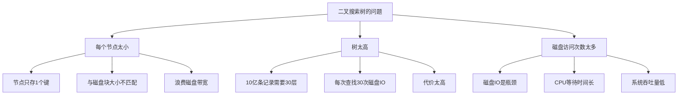

### 2.2 B树的设计哲学

**核心思想**：让每个节点尽可能大，大到填满一个磁盘块。

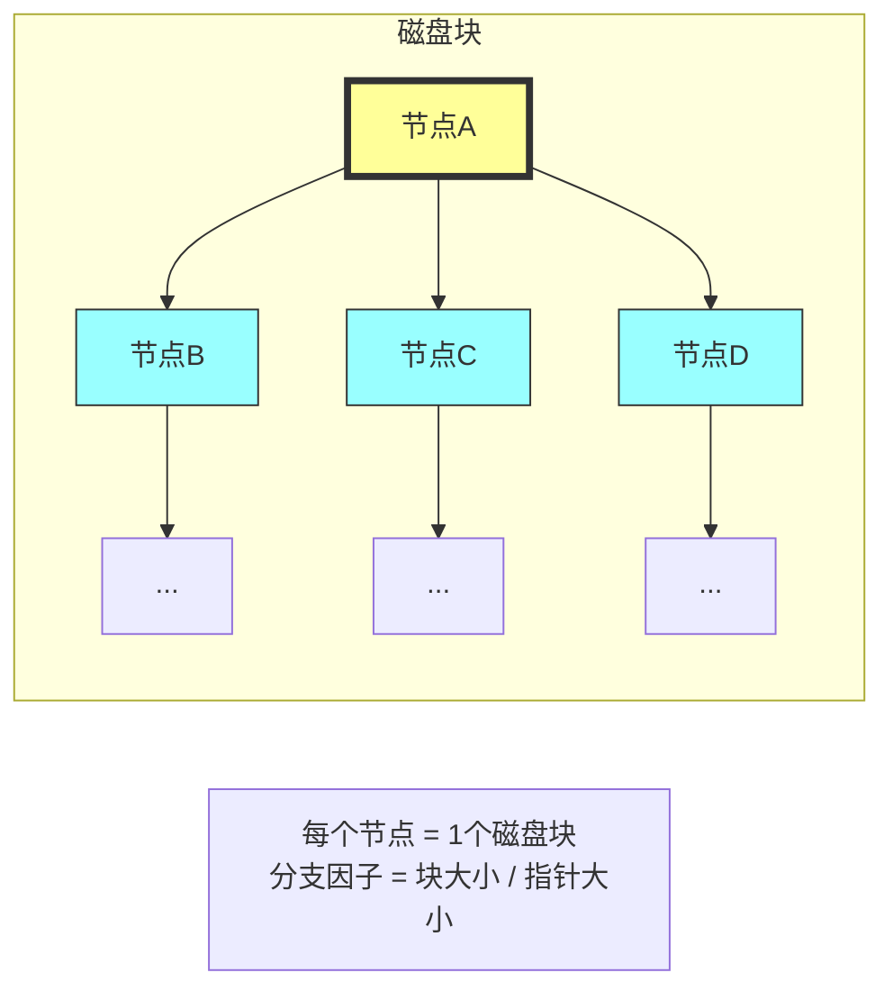

**B树的优势：**
1. **减少树高**：分支因子大导致树高小
2. **磁盘局部性**：访问一个节点时，整个块被加载
3. **批量操作**：一个节点内的多个键同时可用

## 三、B树的定义与性质

### 3.1 形式化定义

**最小度数 t（Minimum Degree）**：
- 每个节点（除根外）至少有 t-1 个键
- 每个节点（除根外）至少有 t 个子节点
- 每个节点最多有 2t-1 个键
- 每个节点最多有 2t 个子节点

**B树T的5条性质：**

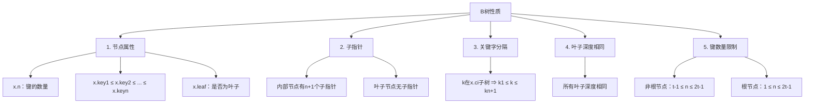

### 3.2 特殊情况的B树

**当 t = 2 时（B树的最小配置）：**
- 每个内部节点有2、3或4个子节点
- 这就是著名的 **2-3-4树**

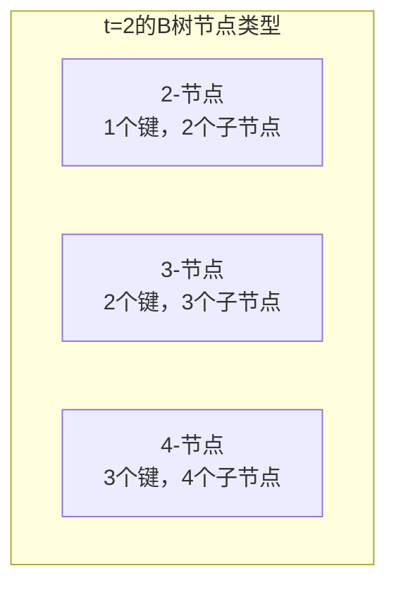

### 3.3 B树的高度分析

**定理18.1**：对于包含 n 个键、高度为 h、最小度数为 t ≥ 2 的B树：

```
h ≤ log_t((n+1)/2)
```

**证明的核心思路：**

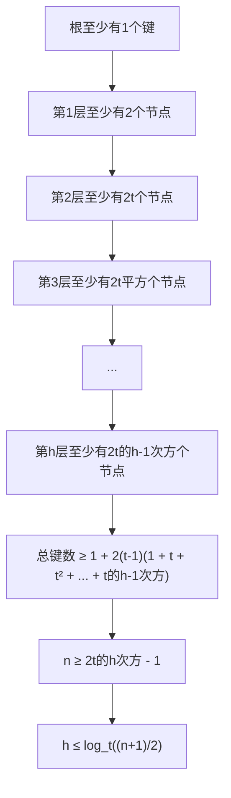

**高度对比示例：**

| n（键数量） | 红黑树高度 | B树高度（t=100） | B树高度（t=1000） |
|------------|-----------|-----------------|------------------|
| 1,000 | ~10 | 2 | 1 |
| 1,000,000 | ~20 | 3 | 2 |
| 1,000,000,000 | ~30 | 4 | 3 |
| 1,000,000,000,000 | ~40 | 5 | 4 |

## 四、B树的基本操作

### 4.1 搜索操作 B-TREE-SEARCH

**算法思路**：从根开始，在每个节点内进行线性搜索，决定向哪个子树递归。

```java
B-TREE-SEARCH(x, k)
1  i = 1
2  while i ≤ x.n and k > x.keyi
3      i = i + 1
4  if i ≤ x.n and k == x.keyi
5      return (x, i)          // 找到，返回节点和位置
6  elseif x.leaf
7      return NIL             // 到达叶子，未找到
8  else
9      DISK-READ(x.ci)        // 读取子节点
10     return B-TREE-SEARCH(x.ci, k)
```

**搜索过程示例**（在图18.1中搜索字母'R'）：

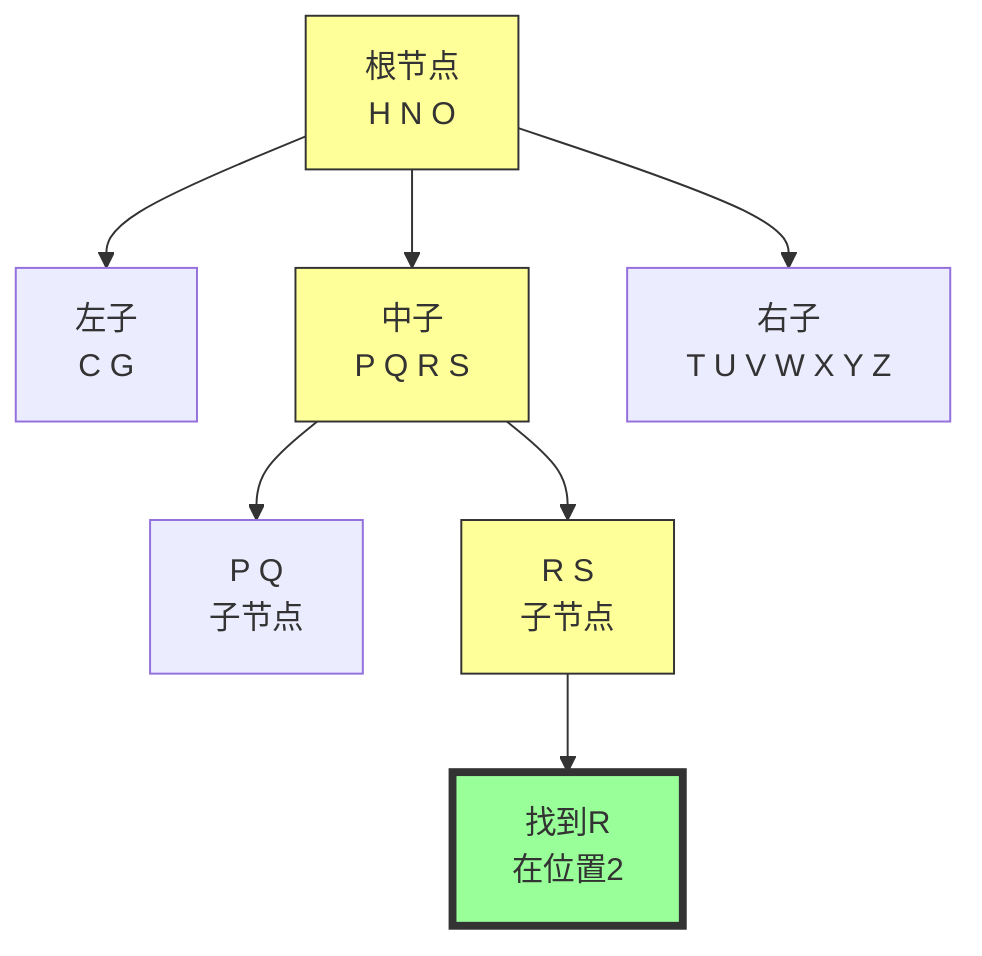

**复杂度分析：**
- **磁盘访问**：O(h) = O(log_t n)
- **CPU时间**：O(t × h) = O(t log_t n)

### 4.2 创建空B树 B-TREE-CREATE

```java
B-TREE-CREATE(T)
1  x = ALLOCATE-NODE()      // 分配一个磁盘块
2  x.leaf = TRUE            // 初始时是叶子
3  x.n = 0                  // 无键
4  DISK-WRITE(x)            // 写回磁盘
5  T.root = x               // 设置根节点
```

**特点**：O(1)时间，仅需一次磁盘写操作。

### 4.3 分裂节点 B-TREE-SPLIT-CHILD

**核心操作**：将满节点（2t-1个键）分裂成两个节点，各有t-1个键，中间键上升到父节点。

```java
B-TREE-SPLIT-CHILD(x, i)
1  y = x.ci                 // 满节点
2  z = ALLOCATE-NODE()      // 新节点
3  z.leaf = y.leaf
4  z.n = t - 1              // 新节点有t-1个键

5  // z获取y的最大的t-1个键
6  for j = 1 to t - 1
7      z.keyj = y.key(j+t)

8  // 如果不是叶子，z获取y的最大的t个子节点
9  if not y.leaf
10     for j = 1 to t
11         z.cj = y.c(j+t)

12 y.n = t - 1              // y现在有t-1个键

13 // 在x中为新节点z腾出位置
14 for j = x.n + 1 downto i + 1
15     x.c(j+1) = x.cj
16 x.c(i+1) = z

17 // 将y的中间键上移到x
18 for j = x.n downto i
19     x.key(j+1) = x.keyj
20 x.keyi = y.keyt

21 x.n = x.n + 1           // x多了一个键

22 // 写回磁盘
23 DISK-WRITE(y)
24 DISK-WRITE(z)
25 DISK-WRITE(x)
```

**分裂过程图解**（t = 4）：

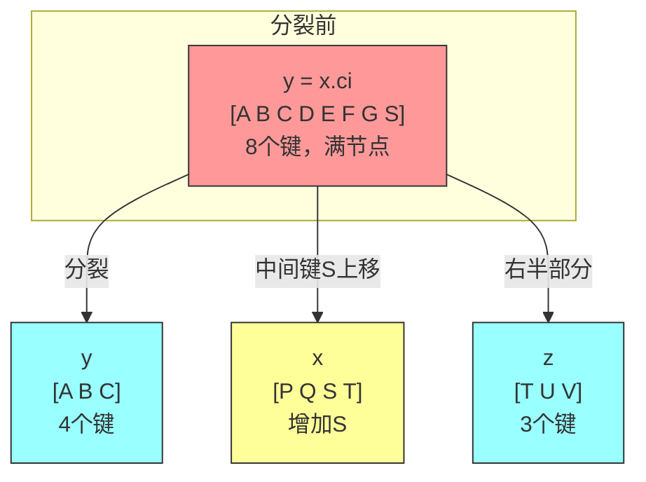

**分裂的关键性质：**
- 父节点x必须是非满的
- 分裂是唯一使B树长高的方式（根节点分裂）

### 4.4 插入操作 B-TREE-INSERT

**核心策略**：自顶向下，单次遍历，在向下过程中预分裂所有满节点。

```java
B-TREE-INSERT(T, k)
1  r = T.root
2  if r.n == 2t - 1         // 根节点满
3      s = B-TREE-SPLIT-ROOT(T)  // 分裂根节点
4      B-TREE-INSERT-NONFULL(s, k)
5  else
6      B-TREE-INSERT-NONFULL(r, k)
```

**B-TREE-SPLIT-ROOT**：

```java
B-TREE-SPLIT-ROOT(T)
1  s = ALLOCATE-NODE()
2  s.leaf = FALSE
3  s.n = 0
4  s.c1 = T.root
5  T.root = s
6  B-TREE-SPLIT-CHILD(s, 1)
7  return s
```

**根分裂图解**（t = 4）：

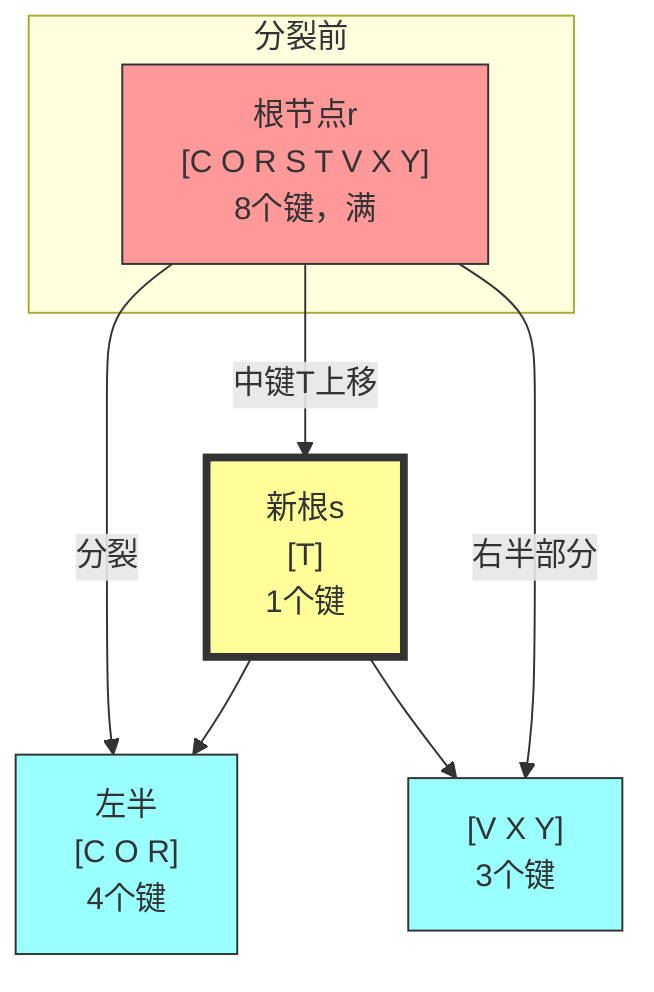

**B-TREE-INSERT-NONFULL**：

```java
B-TREE-INSERT-NONFULL(x, k)
1  i = x.n

2  if x.leaf                    // 情况1：x是叶子
3      // 向右移动比k大的键
4      while i ≥ 1 and k < x.keyi
5          x.key(i+1) = x.keyi
6          i = i - 1
7      x.key(i+1) = k           // 插入k
8      x.n = x.n + 1
9      DISK-WRITE(x)
10 else                         // 情况2：x是内部节点
11     // 找到应该进入的子节点
12     while i ≥ 1 and k < x.keyi
13         i = i - 1
14     i = i + 1
15     DISK-READ(x.ci)
16
17     // 预分裂：如果子节点已满
18     if x.ci.n == 2t - 1
19         B-TREE-SPLIT-CHILD(x, i)
20         // 分裂后决定进入哪个子节点
21         if k > x.keyi
22             i = i + 1
23
24     // 递归插入
25     B-TREE-INSERT-NONFULL(x.ci, k)
```

### 4.5 插入过程示例

**初始状态**（t = 3，最多5个键）：

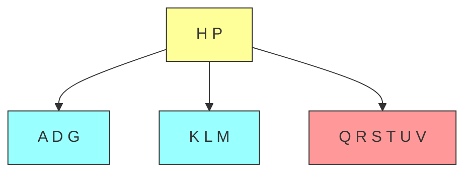

**步骤1：插入B → 简单插入叶子**

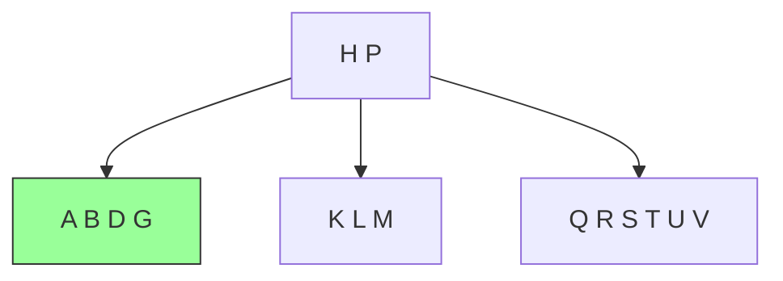

**步骤2：插入Q → 右叶子分裂**

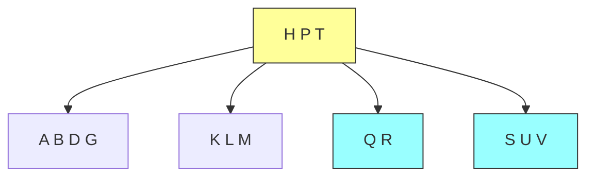

**步骤3：插入L → 根节点满，分裂**

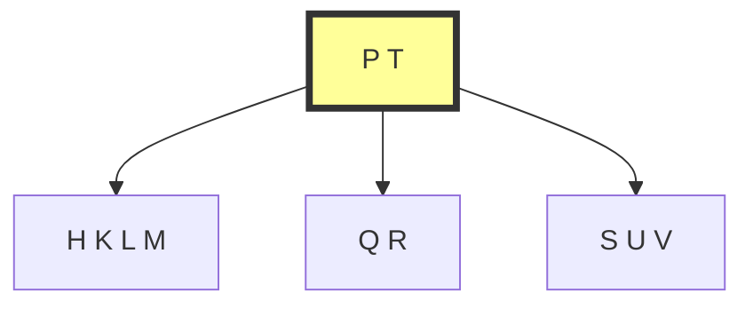

### 4.6 删除操作 B-TREE-DELETE

**核心挑战**：删除可能导致节点键数少于t-1（欠载），需要合并或借位。

**三种主要情况：**

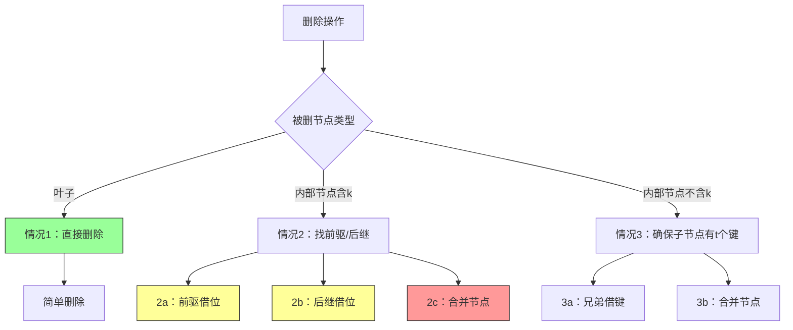

**情况1：删除叶子节点**
- 直接删除，不破坏B树性质

**情况2a：前驱借位**
- 用前驱k'替代k，递归删除k'

**情况2b：后继借位**
- 用后继k'替代k，递归删除k'

**情况2c：合并节点**
- 前驱和后继合并，中间键下移

**情况3a：从兄弟借键**
- 父键下移，兄弟键上移

**情况3b：合并子节点**
- 父键下移，与兄弟合并

**删除示例**（t=3）：

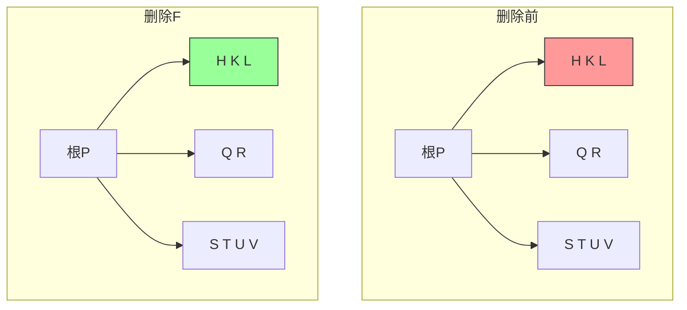

**复杂度分析**：
- **磁盘访问**：O(h) = O(log_t n)
- **CPU时间**：O(t × h) = O(t log_t n)

## 五、Java代码实现详解

### 5.1 B树Java实现

```java
public class BTree {
    private BTreeNode root;
    private final int t;  // 最小度数

    public BTree(int t) {
        this.t = t;
        this.root = new BTreeNode(true);
    }

    public static class BTreeNode {
        boolean leaf;
        int n;  // 键数量
        int[] keys;
        BTreeNode[] children;

        public BTreeNode(boolean leaf) {
            this.leaf = leaf;
            this.n = 0;
            this.keys = new int[2 * t - 1];
            this.children = new BTreeNode[2 * t];
        }
    }

    // 搜索操作
    public Pair<Integer, Integer> search(int k) {
        return search(root, k);
    }

    private Pair<Integer, Integer> search(BTreeNode x, int k) {
        int i = 0;
        while (i < x.n && k > x.keys[i]) {
            i++;
        }

        if (i < x.n && k == x.keys[i]) {
            return new Pair<>(x, i);
        } else if (x.leaf) {
            return null;
        } else {
            return search(x.children[i], k);
        }
    }

    // 插入操作
    public void insert(int k) {
        if (root.n == 2 * t - 1) {
            BTreeNode s = new BTreeNode(false);
            s.children[0] = root;
            root = s;
            splitChild(s, 0);
            insertNonFull(s, k);
        } else {
            insertNonFull(root, k);
        }
    }

    private void splitChild(BTreeNode x, int i) {
        BTreeNode y = x.children[i];
        BTreeNode z = new BTreeNode(y.leaf);
        z.n = t - 1;

        // 复制y的后半部分键到z
        for (int j = 0; j < t - 1; j++) {
            z.keys[j] = y.keys[j + t];
        }

        // 复制y的后半部分子节点到z
        if (!y.leaf) {
            for (int j = 0; j < t; j++) {
                z.children[j] = y.children[j + t];
            }
        }

        y.n = t - 1;

        // 将z插入为x的子节点
        for (int j = x.n; j >= i + 1; j--) {
            x.children[j + 1] = x.children[j];
        }
        x.children[i + 1] = z;

        // 将y的中间键上移到x
        for (int j = x.n - 1; j >= i; j--) {
            x.keys[j + 1] = x.keys[j];
        }
        x.keys[i] = y.keys[t - 1];
        x.n++;
    }

    private void insertNonFull(BTreeNode x, int k) {
        int i = x.n - 1;

        if (x.leaf) {
            // 在适当位置插入k
            while (i >= 0 && k < x.keys[i]) {
                x.keys[i + 1] = x.keys[i];
                i--;
            }
            x.keys[i + 1] = k;
            x.n++;
        } else {
            // 找到应该进入的子节点
            while (i >= 0 && k < x.keys[i]) {
                i--;
            }
            i++;

            // 如果子节点已满，先分裂
            if (x.children[i].n == 2 * t - 1) {
                splitChild(x, i);
                if (k > x.keys[i]) {
                    i++;
                }
            }

            insertNonFull(x.children[i], k);
        }
    }
}
```

## 六、具体例子演示

### 6.1 搜索过程演示

**场景**：在B树中搜索键38（t=3）

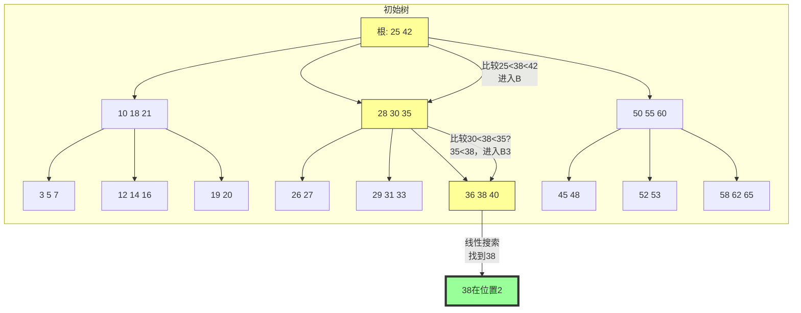

**搜索步骤表：**

| 步骤 | 当前节点 | 比较 | 动作 |
|-----|---------|-----|-----|
| 1 | [25, 42] | 38 > 25 且 38 < 42 | 进入右子节点B |
| 2 | [28, 30, 35] | 38 > 35 | 进入右子节点B3 |
| 3 | [36, 38, 40] | 38 == 38 | 找到，返回 |

### 6.2 插入过程演示

**场景**：按顺序插入 F, S, Q, K, C, L, H（t=3）

**初始状态**（空树）：

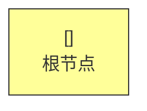

**步骤1：插入F → 简单插入**

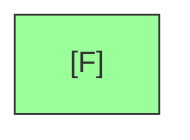

**步骤2：插入S → 简单插入**


**步骤3：插入Q → 简单插入（3个键，未满）**


**步骤4：插入K → 叶子分裂**

```mermaid
graph TD
    NewRoot["[Q]"]
    NewRoot --> L["[F K]"]
    NewRoot --> R["[S]"]

    style NewRoot fill:#ff9,stroke:#333,stroke-width:4px
    style L fill:#9ff,stroke:#333
    style R fill:#9ff,stroke:#333
```

**步骤5：插入C → 简单插入**

```mermaid
graph TD
    NewRoot["[Q]"]
    NewRoot --> L["[C F K]"]
    NewRoot --> R["[S]"]

    style L fill:#9ff,stroke:#333
```

**步骤6：插入L → 简单插入**

```mermaid
graph TD
    NewRoot["[Q]"]
    NewRoot --> L["[C F K L]"]
    NewRoot --> R["[S]"]

    style L fill:#9ff,stroke:#333
```

**步骤7：插入H → 叶子分裂，树长高**

```mermaid
graph TD
    FinalRoot["[K Q]"]
    FinalRoot --> L1["[C F H]"]
    FinalRoot --> M["[L]"]
    FinalRoot --> R1["[S]"]

    style FinalRoot fill:#ff9,stroke:#333,stroke-width:4px
    style L1 fill:#9ff,stroke:#333
    style M fill:#9ff,stroke:#333
    style R1 fill:#9ff,stroke:#333
```

### 6.3 删除过程演示

**场景**：从B树中删除G（t=3）

**删除前**：

```mermaid
graph TD
    R["[P T]"]
    R --> A["[H K L M]"]
    R --> B["[Q R]"]
    R --> C["[S U V]"]

    A --> A1["[D E F]"]
    A --> A2["[G]"] --> |要删除G| Target
    A --> A3["[J N]"]

    style Target fill:#f99,stroke:#333
```

**删除G（情况1：叶子直接删除）**：

```mermaid
graph TD
    R["[P T]"]
    R --> A["[H K L M]"]
    R --> B["[Q R]"]
    R --> C["[S U V]"]

    A --> A1["[D E F]"]
    A --> A2["[已删除G]"]
    A --> A3["[J N]"]
```

**修复欠载节点**（合并F和J）：

```mermaid
graph TD
    R["[P T]"]
    R --> A["[H K L M]"]
    R --> B["[Q R]"]
    R --> C["[S U V]"]

    A --> A1["[D E F J N]"]

    style A fill:#ff9,stroke:#333
    style A1 fill:#9f9,stroke:#333
```

## 七、复杂度分析

### 7.1 操作复杂度对比表

| 操作 | 时间复杂度 | 空间复杂度 | 磁盘访问次数 |
|-----|-----------|-----------|-------------|
| 搜索 | O(t log_t n) | O(n) | O(log_t n) |
| 插入 | O(t log_t n) | O(n) | O(log_t n) |
| 删除 | O(t log_t n) | O(n) | O(log_t n) |
| 创建 | O(1) | O(1) | O(1) |
| 遍历 | O(n) | O(n) | O(n/t + h) |

### 7.2 B树 vs 红黑树

| 指标 | 红黑树 | B树（t=100） | B树（t=1000） |
|-----|-------|-------------|---------------|
| 分支因子 | 2 | 100-200 | 1000-2000 |
| 10亿条记录高度 | ~30 | 3 | 2 |
| 单次查找磁盘访问 | 30 | 3 | 2 |
| 插入磁盘访问 | 30 | 3 | 2 |

### 7.3 t值的选择

**t的理论最优值**：基于磁盘访问时间模型 a + bt

- a：固定访问延迟（~5ms）
- b：每字节传输时间（~10μs）
- 块大小由t决定

**优化目标**：最小化搜索时间

```
搜索时间 ≈ a × log_t n + b × t × log_t n
```

**求导找最优解**：
- 对t求导并设为0
- 实际应用中t通常在50-2000之间

## 八、B树变种

### 8.1 B+树

```mermaid
graph TD
    subgraph "B+树结构"
    Root["根<br/>[30 60 90]"]
    Root --> L["[10 20]<br/>叶"] & M["[30 40 50]<br/>叶"] & R["[60 70 80 90]<br/>叶"]

    L --> Data1["数据1"] & Data2["数据2"]
    M --> Data3["数据3"] & Data4["数据4"] & Data5["数据5"]
    R --> Data6["数据6"] & Data7["数据7"]

    Leaf["所有数据都在叶子<br/>内部节点只存键"]
    end

    style Root fill:#ff9,stroke:#333
    style L fill:#9ff,stroke:#333
    style M fill:#9ff,stroke:#333
    style R fill:#9ff,stroke:#333
```

**B+树 vs B树**：

| 特性 | B树 | B+树 |
|-----|-----|-----|
| 数据存储位置 | 内部节点和叶子 | 仅叶子 |
| 内部节点存储 | 键+数据指针 | 仅键 |
| 叶子节点 | 不一定有序 | 通过链表连接 |
| 范围查询 | 效率较低 | 效率高 |
| 空间利用率 | 较低 | 更高 |
| 分支因子 | 较小 | 更大 |

### 8.2 B*树

- 要求节点至少2/3满（而非1/2）
- 分裂时将两个满节点合并成三个节点
- 更高的空间利用率

### 8.3 B#树

- 支持多属性索引
- 适用于空间数据库

## 九、数据库应用深入分析

### 9.1 关系型数据库中的索引

```mermaid
flowchart TD
    subgraph 数据库存储
    A[数据页] --> B[索引结构]
    B --> C[B+树索引]
    B --> D[哈希索引]
    B --> E[全文索引]
    end

    subgraph B+树索引
    F["内部节点<br/>索引页"] --> G["叶节点<br/>数据页指针"]
    G --> H["row_id → 数据位置"]
    end

    style C fill:#9f9,stroke:#333
    style F fill:#ff9,stroke:#333
    style G fill:#9ff,stroke:#333
```

**MySQL InnoDB的B+树索引**：

```mermaid
graph TD
    subgraph "InnoDB聚簇索引"
    Root["根页面<br/>(Page 1)"] --> Level1_1["Page 2<br/>索引: id=100,500,1000"] & Level1_2["Page 3<br/>索引: id=1500,2000"]

    Level1_1 --> Leaf1["Page 10<br/>id=1-100的完整行数据"] & Leaf2["Page 11<br/>id=101-500的完整行数据"]
    Level1_2 --> Leaf3["Page 20<br/>id=501-1000的完整行数据"] & Leaf4["Page 21<br/>id=1001-2000的完整行数据"]
    end

    style Root fill:#ff9,stroke:#333,stroke-width:4px
    style Leaf1 fill:#9f9,stroke:#333
    style Leaf2 fill:#9f9,stroke:#333
    style Leaf3 fill:#9f9,stroke:#333
    style Leaf4 fill:#9f9,stroke:#333
```

**二级索引（辅助索引）**：

```mermaid
graph TD
    subgraph 二级索引结构
    IRoot["根: age=25,35,50"] --> I1["age=10,15,20"] & I2["age=25,30"] & I3["age=35,40"]

    I1 --> D1["row_id=5"] & D2["row_id=12"]
    I2 --> D3["row_id=3"] & D4["row_id=8"]
    I3 --> D5["row_id=1"] & D6["row_id=15"]
    end

    subgraph 数据回表
    D3 --> |回表查询| ActualRow["聚簇索引中的完整行"]
    end

    style IRoot fill:#ff9,stroke:#333
    style ActualRow fill:#9f9,stroke:#333
```

### 9.2 实际应用场景

```mermaid
graph LR
    subgraph 应用领域
    A[关系数据库] --> B[InnoDB, MyISAM]
    C[文件系统] --> D[NTFS, HFS+]
    E[键值存储] --> F[LMDB, RocksDB]
    G[搜索引擎] --> H[Elasticsearch]
    end

    B --> I[B+树]
    D --> I
    F --> I
    H --> I

    style I fill:#9f9,stroke:#333,stroke-width:4px
```

### 9.3 各数据库系统的索引实现

**MySQL (InnoDB)**：
- 聚簇索引：数据直接存在B+树叶节点
- 二级索引：叶节点存储主键值
- 所有索引都是B+树

**PostgreSQL**：
- 默认使用B+树
- 支持多种索引类型（B+树、哈希、GIN、GiST）
- B+树支持部分索引和表达式索引

**Oracle**：
- 使用B树索引
- 支持索引组织表（Index-Organized Tables）
- 支持位图索引（Bitmap Index）

**SQLite**：
- 默认B树实现
- 默认为B+树

### 9.4 大规模数据示例

**场景**：10亿用户表的索引

```mermaid
graph TD
    subgraph "10亿用户表的B+树索引（t=1000）"
    Root["根节点<br/>1个键"]
    Root --> Level1["1000个节点<br/>每节点1000个键"]
    Level1 --> Level2["1,000,000个节点<br/>每节点1000个键"]
    Level2 --> Leaves["1,000,000,000个叶子<br/>每节点1000个用户"]
    end

    Root --> |1次IO| Level1
    Level1 --> |1次IO| Level2
    Level2 --> |1次IO| Leaves

    Total["总共3次IO找到用户"]

    style Root fill:#ff9,stroke:#333,stroke-width:4px
    style Total fill:#9f9,stroke:#333
```

### 9.5 范围查询优化

```mermaid
graph TD
    subgraph B+树范围查询
    Root["[30 60 90]"]
    Root --> L["[10 20]"] & M["[30 40 50 60]"] & R["[70 80 90 100]"]

    M --> ML1["[30 31 32...39]"] & ML2["[40 41 42...49]"] & ML3["[50 51 52...59]"]
    ML1 --> |命中| Result1["数据1"]
    ML2 --> |命中| Result2["数据2"]
    ML3 --> |命中| Result3["数据3"]
    end

    subgraph "查找50-55"
    Start["定位到30"] --> |向右遍历| End["定位到60"]
    End --> |返回区间内数据| RangeResult["返回所有50-55的数据"]
    end

    style Root fill:#ff9,stroke:#333
    style M fill:#ff9,stroke:#333
```

**B+树范围查询优势**：
1. 只需定位起始点
2. 叶子节点通过链表连接，支持顺序访问
3. 无需回溯

## 十、举一反三

### 10.1 同类LeetCode题目

| 题目 | 链接 | 核心思想 |
|-----|------|---------|
| 23. 合并K个升序链表 | https://leetcode.cn/problems/merge-k-sorted-lists/ | B树多路归并思想 |
| 378. 有序矩阵中第K小的元素 | https://leetcode.cn/problems/kth-smallest-element-in-a-sorted-matrix/ | 多路归并/堆 |
| 703. 数据流中的第K大元素 | https://leetcode.cn/problems/kth-largest-element-in-a-stream/ | 树/堆结构 |
| 315. 计算右侧小于当前元素的个数 | https://leetcode.cn/problems/count-of-smaller-numbers-after-self/ | BST变种 |

### 10.2 变形题目

**B树的扩展应用**：
- 支持并发访问的B树（锁粒度设计）
- 持久化B树（写入日志）
- 压缩B树（存储压缩后的键）
- 前缀B树（仅存储键前缀）

### 10.3 核心思想的迁移

```mermaid
flowchart TD
    A((B树核心思想)) --> B[多路分叉减少高度]
    A --> C[节点与块大小对齐]
    A --> D[预分裂保证单次遍历]
    A --> E[平衡保证最坏情况性能]

    B --> B1[跳表：多级索引]
    B --> B2[LSM树：分层合并]
    B --> B3[Trie树：字符串多路]

    C --> C1[LSM树：SSTable]
    C --> C2[列式存储：列块压缩]

    D --> D1[2PC：两阶段提交]
    D --> D2[乐观并发控制]

    E --> E1[红黑树：颜色平衡]
    E --> E2[AVL树：高度平衡]

    style A fill:#ff9,stroke:#333,stroke-width:4px
```

### 10.4 B树与LSM树的对比

| 特性 | B树/B+树 | LSM树 |
|-----|---------|-------|
| 写入策略 | 原地更新 | 顺序写入 |
| 空间放大 | 低 | 较高（压缩） |
| 读取性能 | O(log n) | O(log n)但有放大 |
| 写入放大 | 无 | 有 |
| 适用场景 | 读多写少 | 写多读少 |
| 典型系统 | MySQL, PostgreSQL | LevelDB, RocksDB |

## 十一、总结

### 11.1 核心要点回顾

```mermaid
flowchart TD
    A[B树核心要点] --> B[1. 设计动机]
    A --> C[2. 数据结构定义]
    A --> D[3. 基本操作]
    A --> E[4. 复杂度分析]
    A --> F[5. 实际应用]

    B --> B1[磁盘访问优化]
    B --> B2[多路搜索]

    C --> C1[最小度数t]
    C --> C2[节点键数：t-1到2t-1]
    C --> C3[所有叶子深度相同]

    D --> D1["搜索：O(log t n)"]
    D --> D2[插入：预分裂]
    D --> D3[删除：合并/借位]

    E --> E1["树高：O(log t n)"]
    E --> E2["磁盘访问：O(log t n)"]
    E --> E3["CPU时间：O(t log t n)"]

    F --> F1[B+树主导数据库索引]
    F --> F2[文件系统广泛使用]
    F --> F3[NoSQL存储引擎]

    style A fill:#ff9,stroke:#333,stroke-width:4px
```

### 11.2 为什么B树如此重要

1. **数据库基石**：几乎所有关系型数据库都使用B+树作为默认索引
2. **理论优美**：O(log n)时间复杂度保证最坏情况性能
3. **实践高效**：最小化磁盘IO，适应磁盘特性
4. **扩展性强**：分支因子可调，适应不同硬件

### 11.3 未来展望

- **持久化内存**：B树如何适应新型存储介质
- **并发优化**：更细粒度的锁和乐观并发控制
- **压缩集成**：与列式存储和压缩算法的深度集成

---

## 参考资料

- Cormen, T. H., Leiserson, C. E., Rivest, R. L., & Stein, C. (2009). *Introduction to Algorithms* (3rd ed.). MIT Press.
- Chapter 18: B-Trees, pp. 655-682
- Comer, D. (1979). "The Ubiquitous B-Tree". ACM Computing Surveys.
- Bayer, R., & McCreight, E. (1972). "Organization and Maintenance of Large Indexed Files". Acta Informatica.
