# 第十八章：B 树 —— 深度版

## 一、开篇定位

前面第 12、13 章的二叉搜索树、红黑树都假设数据全在**内存**里，比较和旋转的代价就是全部代价。本章换场景：**数据量大到内存装不下，必须存在磁盘上**，每访问一个节点就是一次磁盘 I/O。这时瓶颈从「CPU 比较次数」变成「磁盘访问次数」，数据结构的设计目标也随之改变。

B 树就是为此而生的平衡搜索树：把节点做得**和磁盘块一样大**（一个节点存几百上千个键），树高从红黑树的约 30 层压到 2~4 层，查找任何键只需 2~3 次磁盘访问。它是几乎所有关系型数据库索引（B+ 树变体）和许多文件系统的基石。

- **前向依赖**：红黑树（第 13 章）是它的「内存版」对照物；t=2 的 B 树就是 2-3-4 树，和红黑树存在精确对应（习题 18.1-5）。
- **后向指针**：这是「高级数据结构」部分的最后一课树结构，下一章（第 19 章）转向不相交集合。

## 二、核心思想：为什么磁盘场景要换一套玩法

### 2.1 内存 vs 磁盘的性能鸿沟

| 存储 | 典型访问时间 | 特点 |
|------|------------|------|
| 主存 | ~50 ns | 电子访问 |
| 磁盘（HDD） | ~4 ms（7200 RPM 转一圈 8.33 ms） | 机械寻道 + 旋转，比内存慢 5 个数量级 |
| SSD | 介于其间 | 电子访问，但同样**按块读写** |

一次磁盘旋转的时间里，内存可以访问超过 10 万次。所以评估磁盘上的数据结构，要分开算两笔账：

- **磁盘访问次数**（读写了多少个块）——主要矛盾；
- **CPU 时间**——次要矛盾。

磁盘按**块**（512~4096 字节）读写：读 1 字节和读 1 整块代价几乎相同。既然读一个块和读一个字节一样贵，那就**让每个节点 = 一个磁盘块**，一次 I/O 把几百个键全捞进内存。

### 2.2 多路搜索：用「胖节点」换「矮树」

二叉搜索树每个节点做 2 路分支决策；B 树节点存 t-1 ~ 2t-1 个键，做 **(n+1) 路分支决策**。分支因子从 2 提到 1000，树高的对数底数就从 2 变成 1000。

**直觉数字**（CLRS 图 18.3）：每节点存 1000 个键、分支因子 1001 的 B 树，**高度 2 就能存下 10 亿个键**；若根常驻内存，找到任意键最多 2 次磁盘访问。换成红黑树要约 30 次。

## 三、定义与性质

### 3.1 B 树的 5 条性质

一棵 B 树 T 以 T.root 为根，满足：

1. 每个节点 x 有属性：x.n（键数）；x.key₁ ≤ x.key₂ ≤ … ≤ x.keyₙ（键有序）；x.leaf（是否叶子）。
2. 内部节点 x 有 x.n + 1 个子指针 x.c₁ … x.c_{n+1}；叶子没有孩子。
3. **键分隔子树范围**：子树 x.cᵢ 中的键 kᵢ 满足 k₁ ≤ x.key₁ ≤ k₂ ≤ x.key₂ ≤ … ≤ x.keyₙ ≤ k_{n+1}。
4. **所有叶子深度相同**，都等于树高 h。
5. 键数上下界由**最小度数 t（t ≥ 2）**决定：
   - 非根节点至少 **t-1** 个键（内部节点至少 t 个孩子）；
   - 所有节点至多 **2t-1** 个键（内部节点至多 2t 个孩子），恰有 2t-1 个键的节点称为**满**；
   - 非空树的根至少 1 个键（根是唯一允许「欠载」的节点）。

> **t=2 时就是 2-3-4 树**：每个内部节点有 2、3 或 4 个孩子。习题 18.1-5 指出它与红黑树的对应：把红黑树中每个黑节点连同它的红孩子「吸收」成一个节点，得到的正是一棵 2-3-4 树。

图 18.1 是一棵键为英文字母辅音的 B 树（其节点最少 2 键、最多 3 键，故 t=2 或 t=3 都合法——习题 18.1-2）：

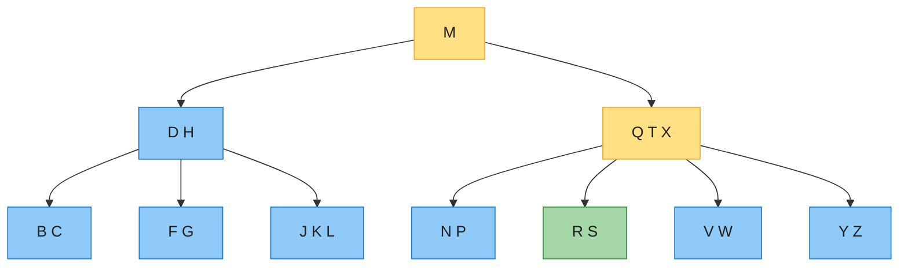

高亮节点是查找 R 时检查的路径：根 M（R > M，右转）→ 节点 QTX（Q < R < T，进中间孩子）→ 叶子 RS（找到）。

### 3.2 高度速查

**定理 18.1**：n 个键、高度 h、最小度数 t 的 B 树满足

```
h ≤ log_t((n+1)/2)     （等价地 n ≥ 2t^h − 1）
```

一句话直觉：根至少 1 键，第 1 层至少 2 节点，之后每层节点数至少乘 t，所以深度 i 处至少 2t^{i-1} 个节点、每节点 t-1 个键，求和即 n ≥ 2t^h − 1。

| n（键数） | 红黑树高度 ≈lg n | B 树 t=100 | B 树 t=1000 |
|----------|----------------|-----------|-------------|
| 10⁶ | ~20 | ≤3 | ≤2 |
| 10⁹ | ~30 | ≤4 | ≤3 |
| 10¹² | ~40 | ≤5 | ≤4 |

实际中节点按磁盘块装满（如每节点 1000 键），10 亿键只要高度 2（图 18.3），比理论最坏上界还低。

另一个方向的界（习题 18.1-4）：高度 h 的 B 树**最多**装 (2t)^(h+1) − 1 个键（每层全满求和）。

## 四、基本操作

所有操作都是**单趟下行**：从根到叶不回溯。两个约定：根常驻内存；传入的参数节点必须先 DISK-READ。

### 4.1 搜索 B-TREE-SEARCH

```text
B-TREE-SEARCH(x, k)
1  i = 1
2  while i ≤ x.n and k > x.keyᵢ
3      i = i + 1
4  if i ≤ x.n and k == x.keyᵢ
5      return (x, i)            // 找到：节点 + 下标
6  elseif x.leaf
7      return NIL               // 到达叶子，未找到
8  else DISK-READ(x.cᵢ)
9      return B-TREE-SEARCH(x.cᵢ, k)
```

与二叉搜索唯一的区别：节点内从「2 选 1」变成「n+1 选 1」。磁盘访问 O(h) = O(log_t n)；节点内线性扫描每层 O(t)，CPU 共 O(t·h) = O(t·log_t n)。（节点内改用二分可把 CPU 降到 O(lg n)，与 t 无关——习题 18.2-6。）

### 4.2 分裂 B-TREE-SPLIT-CHILD：插入的发动机

**直觉**：节点塞满（2t-1 键）就装不下了。把它从正中间剪开：左半留在原节点 y，右半搬进新节点 z，**中位数键上移到父节点**成为新的分隔键。

```text
B-TREE-SPLIT-CHILD(x, i)          // x 非满，x.cᵢ 是满孩子
1  y = x.cᵢ                        // 待分裂的满节点
2  z = ALLOCATE-NODE()             // z 拿走 y 的右半
3  z.leaf = y.leaf
4  z.n = t - 1
5  for j = 1 to t - 1
6      z.keyⱼ = y.keyⱼ₊ₜ           // z 获得 y 最大的 t-1 个键
7  if not y.leaf
8      for j = 1 to t
9          z.cⱼ = y.cⱼ₊ₜ           // …及对应的 t 个孩子
10 y.n = t - 1                     // y 只留左半
11 for j = x.n + 1 downto i + 1
12     x.cⱼ₊₁ = x.cⱼ               // x 的子指针右移，给 z 腾位
13 x.cᵢ₊₁ = z
14 for j = x.n downto i
15     x.keyⱼ₊₁ = x.keyⱼ           // x 的键右移
16 x.keyᵢ = y.keyₜ                 // y 的中位数键上移
17 x.n = x.n + 1
18 DISK-WRITE(y)
19 DISK-WRITE(z)
20 DISK-WRITE(x)
```

t=4 的分裂（CLRS 图 18.5）：满节点 y = [P Q R S T U V]（2t-1 = 7 键）以中位数 S 为界劈开，S 上移进父节点 x：

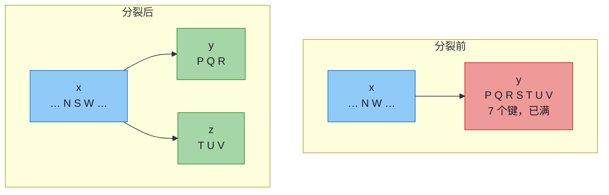

CPU 时间 Θ(t)（几个 for 循环），磁盘访问 O(1)（3 次写）。

**前提条件**：父节点 x 必须非满，否则「中位数上移」会把它撑爆。怎么保证？看插入。

### 4.3 插入 B-TREE-INSERT：预分裂的单趟下行

**核心策略**：下降途中**见满就分裂**（预分裂）。这样需要分裂时父节点一定非满，永远不用回头向上补裂。

根满是个特例——它没有父节点，所以先造一个新空根，让老根变成它的孩子再分裂。**根分裂是 B 树长高的唯一方式**（与二叉搜索树「在底部长叶」相反，B 树「在顶部长根」）。

```text
B-TREE-INSERT(T, k)
1  r = T.root
2  if r.n == 2t - 1               // 根满
3      s = B-TREE-SPLIT-ROOT(T)
4      B-TREE-INSERT-NONFULL(s, k)
5  else B-TREE-INSERT-NONFULL(r, k)

B-TREE-SPLIT-ROOT(T)
1  s = ALLOCATE-NODE()
2  s.leaf = FALSE
3  s.n = 0
4  s.c₁ = T.root
5  T.root = s
6  B-TREE-SPLIT-CHILD(s, 1)
7  return s
```

根分裂（t=4，CLRS 图 18.6）：老根 r = [A D F H L N P] 已满，造新根 s，H 上移：

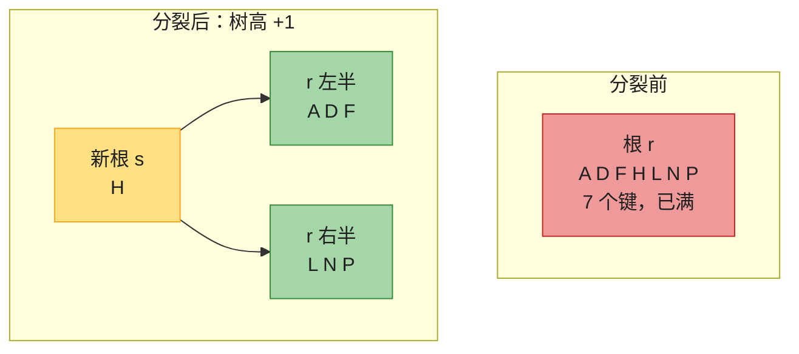

INSERT-NONFULL 向非满节点 x 插入 k：

```text
B-TREE-INSERT-NONFULL(x, k)
1  i = x.n
2  if x.leaf                              // 情况 1：叶子，直接插入
3      while i ≥ 1 and k < x.keyᵢ         // 比 k 大的键右移
4          x.keyᵢ₊₁ = x.keyᵢ
5          i = i - 1
6      x.keyᵢ₊₁ = k
7      x.n = x.n + 1
8      DISK-WRITE(x)
9  else while i ≥ 1 and k < x.keyᵢ        // 情况 2：内部节点，找下降的孩子
10         i = i - 1
11     i = i + 1
12     DISK-READ(x.cᵢ)
13     if x.cᵢ.n == 2t - 1                // 孩子是满的？先预分裂
14         B-TREE-SPLIT-CHILD(x, i)
15         if k > x.keyᵢ                  // 分裂后决定进哪一半
16             i = i + 1
17     B-TREE-INSERT-NONFULL(x.cᵢ, k)
```

#### 插入完整示例（t=3，CLRS 图 18.7）

初始树（节点最多 5 键；满节点 [R S T U V] 已标红）：

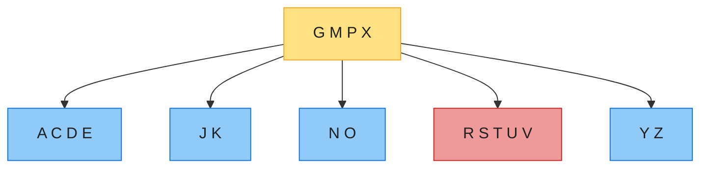

**(b) 插入 B**：叶子 [A C D E] 未满，简单插入 → [A B C D E]（其余不变）。

**(c) 插入 Q**：下降途中发现 [R S T U V] 已满，预分裂为 [R S]、[U V]，中位数 T 上移进根；Q < T 进左半 → [Q R S]：

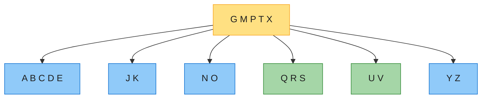

**(d) 插入 L**：根 [G M P T X] 已满，先分裂根——新根 [P]，树高 +1；L 落入叶子 [J K] → [J K L]：

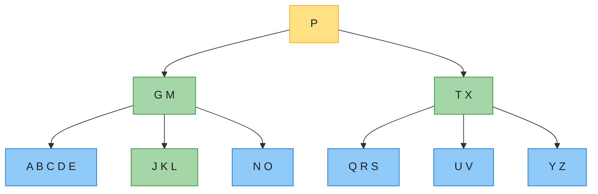

**(e) 插入 F**：叶子 [A B C D E] 已满，下降时预分裂——C 上移进父节点（[G M] → [C G M]），F > C 进右半 → [D E F]。这就是删除示例（4.4 节）的出发树：

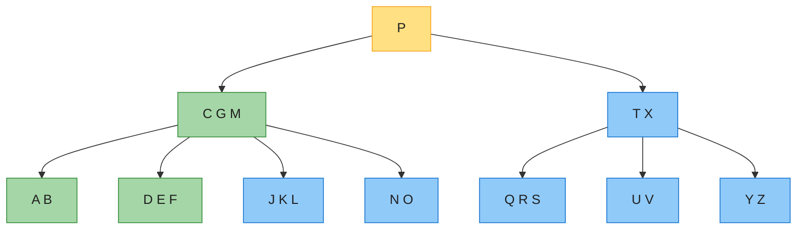

插入的总代价：O(h) 次磁盘访问，O(t·h) = O(t·log_t n) CPU 时间。INSERT-NONFULL 是尾递归，可改写为 while 循环，内存中同时只需 O(1) 个块。

### 4.4 删除 B-TREE-DELETE：最复杂的一战

第四版**没有给出删除的伪代码**（习题 18.3-2 让读者自己写），只描述情况分类；下文代码节给出完整实现。

删除比插入麻烦在两点：可从**任意节点**（不只叶子）删键；删内部节点的键要重排孩子。策略与插入对称——**保证递归下降到的节点至少有 t 个键**（比最低要求 t-1 多 1 个余量），这样删除后不会欠载，单趟下行完成。

设当前搜索到节点 x（x 必有 ≥ t 键，根除外）：

**情况 1：x 是叶子。** 若 k 在 x 中，直接删；不在则 k 本就不在树中，结束。

**情况 2：x 是内部节点且含 k = x.keyᵢ。** 看 k 两侧的孩子 x.cᵢ、x.c_{i+1}：
- **2a**：x.cᵢ 有 ≥ t 键 → 在 x.cᵢ 中找 k 的**前驱 k′**，递归删 k′，用 k′ 顶替 k 的位置。
- **2b**：x.cᵢ 只有 t-1 键但 x.c_{i+1} 有 ≥ t 键 → 对称地用**后继 k′**。
- **2c**：两侧都只有 t-1 键 → 把 k 和 x.c_{i+1} 整体**合并**进 x.cᵢ（得 2t-1 键），再从合并节点里递归删 k。

**情况 3：x 是内部节点且不含 k。** 确定 k 应在的孩子 x.cᵢ；若它只有 t-1 键，先补足再下降：
- **3a**：x.cᵢ 的某个紧邻兄弟有 ≥ t 键 → **借位**：x 的一个键下移进 x.cᵢ，兄弟的一个键上移进 x（连带搬一个子指针）。
- **3b**：兄弟也都只有 t-1 键 → **合并**：x.cᵢ 与一个兄弟合并，x 下移一个键作为合并节点的中位数。

合并若掏空根（2c/3b 中 x 是根且只剩 0 键），删掉空根、唯一孩子顶上——**树变矮的唯一方式**。

#### 删除完整示例（t=3，CLRS 图 18.8）

出发树即 4.3 节 (e)。**(b) 删 F —— 情况 1**：搜索路径上的节点都有 ≥ t 键，叶子 [D E F] 直接删 → [D E]：

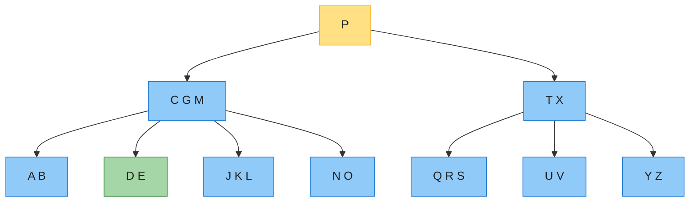

**(c) 删 M —— 情况 2a**：M 在内部节点 [C G M] 中，其左孩子 [J K L] 有 3 ≥ t 键 → 前驱 L 上移动顶替 M，叶子变 [J K]：

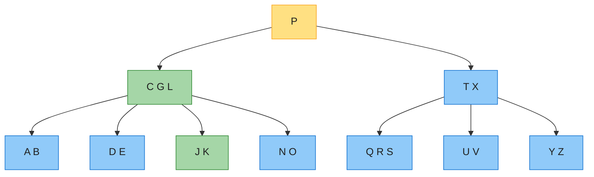

**(d) 删 G —— 情况 2c**：G 在 [C G L] 中，两侧孩子 [D E]、[J K] 都只有 2 = t-1 键 → G 下移合并出 [D E G J K]，再从中删 G → [D E J K]；父节点剩 [C L]：

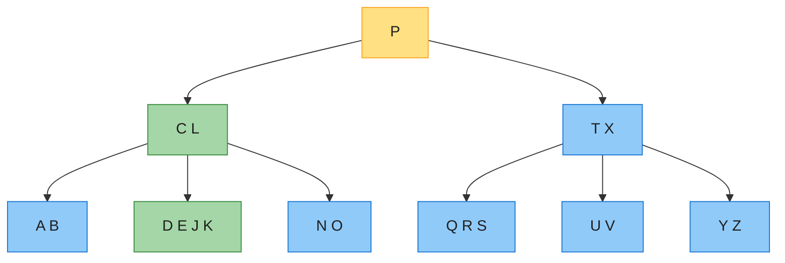

**(e) 删 D —— 情况 3b，树变矮**：下降目标是根的左孩子 [C L]，只有 2 键，兄弟 [T X] 也只有 2 键 → 根键 P 下移，三者合并成 [C L P T X]；根被掏空，合并节点成为**新根，树高 −1**。随后 D 落入叶子 [D E J K]（≥ t 键，可直接下降）删成 [E J K]：

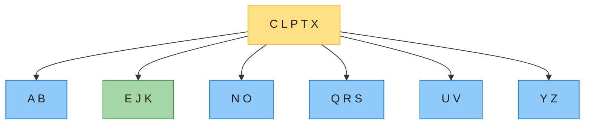

**(f) 删 B —— 情况 3a**：B 在叶子 [A B]（2 键）中，下降前先补足：右兄弟 [E J K] 有 3 ≥ t 键，借位——父键 C 下移、兄弟键 E 上移，叶子变 [A C]，再删 B。最终结果：根 [E L P T X]，叶子 [A]、[J K]、其余不变：

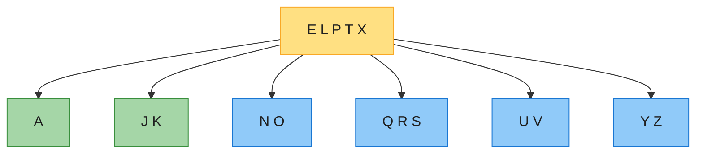

删除同样是 O(h) 磁盘访问、O(t·h) CPU 时间。删内部节点的键时（2a/2b）看似「先下行找前驱再回头替换」，实则只需记住 x 的指针和键位，把前驱/后继直接写回，不用重新走一遍。

## 五、代码实现（Java + Python）

伪代码是 1-indexed，下面实现统一 **0-indexed**：`keyᵢ → keys[i-1]`，`cᵢ → c[i-1]`。与 CLRS 一致，**假设键互不相同**（插入前查重，重复键直接忽略）。两个实现均已通过：图 18.8 删除序列逐步断言 + 50 轮 × 2000 次随机增删与 `TreeSet`/`set` 对拍（每步校验键数界、键有序、叶子同深、子树范围）。

### 5.1 Java

```java
import java.util.ArrayList;
import java.util.List;

/** B树（最小度数 t >= 2），键为 int，0-indexed。对应 CLRS 第 18 章。 */
public class BTree {
    static class Node {
        int n;
        int[] keys;
        Node[] c;
        boolean leaf;

        Node(int t, boolean leaf) {
            this.n = 0;
            this.keys = new int[2 * t - 1];
            this.c = new Node[2 * t];
            this.leaf = leaf;
        }
    }

    private final int t;
    private Node root;

    public BTree(int t) {
        if (t < 2) throw new IllegalArgumentException("t >= 2");
        this.t = t;
        this.root = new Node(t, true);
    }

    // ---------- 搜索：B-TREE-SEARCH ----------
    public boolean contains(int k) {
        return search(root, k) != null;
    }

    private Node search(Node x, int k) {
        int i = 0;
        while (i < x.n && k > x.keys[i]) i++;
        if (i < x.n && k == x.keys[i]) return x;
        if (x.leaf) return null;
        return search(x.c[i], k);
    }

    // ---------- 分裂：B-TREE-SPLIT-CHILD ----------
    private void splitChild(Node x, int i) {
        Node y = x.c[i];               // 满节点（2t-1 个键）
        Node z = new Node(t, y.leaf);  // z 拿走 y 的右半部分
        z.n = t - 1;
        for (int j = 0; j < t - 1; j++) z.keys[j] = y.keys[j + t];
        if (!y.leaf) {
            for (int j = 0; j < t; j++) z.c[j] = y.c[j + t];
        }
        y.n = t - 1;                   // y 只留左半部分
        for (int j = x.n; j > i; j--) x.c[j + 1] = x.c[j];   // 子指针右移
        x.c[i + 1] = z;
        for (int j = x.n - 1; j >= i; j--) x.keys[j + 1] = x.keys[j]; // 键右移
        x.keys[i] = y.keys[t - 1];     // y 的中位数键上移
        x.n++;
    }

    // ---------- 插入：B-TREE-INSERT / -INSERT-NONFULL ----------
    public void insert(int k) {
        if (contains(k)) return;       // 与 CLRS 一致：假设键互不相同
        Node r = root;
        if (r.n == 2 * t - 1) {        // 根满：先分裂根（树长高的唯一方式）
            Node s = new Node(t, false);
            s.c[0] = r;
            root = s;
            splitChild(s, 0);
        }
        insertNonfull(root, k);
    }

    private void insertNonfull(Node x, int k) {
        int i = x.n - 1;
        if (x.leaf) {
            while (i >= 0 && k < x.keys[i]) {
                x.keys[i + 1] = x.keys[i];
                i--;
            }
            x.keys[i + 1] = k;
            x.n++;
        } else {
            while (i >= 0 && k < x.keys[i]) i--;
            i++;
            if (x.c[i].n == 2 * t - 1) {   // 下降前预分裂满孩子
                splitChild(x, i);
                if (k > x.keys[i]) i++;
            }
            insertNonfull(x.c[i], k);
        }
    }

    // ---------- 删除：B-TREE-DELETE（习题 18.3-2）----------
    public void delete(int k) {
        delete(root, k);
        if (root.n == 0 && !root.leaf) root = root.c[0];  // 根被掏空：树变矮
    }

    private void delete(Node x, int k) {
        int i = 0;
        while (i < x.n && x.keys[i] < k) i++;
        if (i < x.n && x.keys[i] == k) {
            if (x.leaf) {                      // 情况 1：叶子，直接删
                for (int j = i; j < x.n - 1; j++) x.keys[j] = x.keys[j + 1];
                x.n--;
            } else {                           // 情况 2：内部节点含 k
                Node y = x.c[i], z = x.c[i + 1];
                if (y.n >= t) {                // 2a：前驱借位
                    int pred = maxKey(y);
                    delete(y, pred);
                    x.keys[i] = pred;
                } else if (z.n >= t) {         // 2b：后继借位
                    int succ = minKey(z);
                    delete(z, succ);
                    x.keys[i] = succ;
                } else {                       // 2c：合并后递归删
                    merge(x, i);
                    delete(x.c[i], k);
                }
            }
        } else {
            if (x.leaf) return;                // k 不在树中
            Node child = x.c[i];
            if (child.n == t - 1) {            // 情况 3：保证下降的孩子 >= t 键
                Node left = i > 0 ? x.c[i - 1] : null;
                Node right = i < x.n ? x.c[i + 1] : null;
                if (left != null && left.n >= t) {         // 3a：左兄弟借
                    for (int j = child.n; j > 0; j--) child.keys[j] = child.keys[j - 1];
                    if (!child.leaf) {
                        for (int j = child.n + 1; j > 0; j--) child.c[j] = child.c[j - 1];
                        child.c[0] = left.c[left.n];
                    }
                    child.keys[0] = x.keys[i - 1];
                    child.n++;
                    x.keys[i - 1] = left.keys[left.n - 1];
                    left.n--;
                } else if (right != null && right.n >= t) { // 3a：右兄弟借
                    child.keys[child.n] = x.keys[i];
                    child.n++;
                    if (!child.leaf) child.c[child.n] = right.c[0];
                    x.keys[i] = right.keys[0];
                    for (int j = 0; j < right.n - 1; j++) right.keys[j] = right.keys[j + 1];
                    if (!right.leaf) {
                        for (int j = 0; j < right.n; j++) right.c[j] = right.c[j + 1];
                    }
                    right.n--;
                } else if (left != null) {                  // 3b：与左兄弟合并
                    merge(x, i - 1);
                    child = left;
                } else {                                    // 3b：与右兄弟合并
                    merge(x, i);
                }
            }
            delete(child, k);
        }
    }

    /** 把 x.keys[i] 下移，x.c[i+1] 合并进 x.c[i]（得 2t-1 个键）。 */
    private void merge(Node x, int i) {
        Node y = x.c[i], z = x.c[i + 1];
        y.keys[t - 1] = x.keys[i];
        for (int j = 0; j < z.n; j++) y.keys[t + j] = z.keys[j];
        if (!y.leaf) {
            for (int j = 0; j <= z.n; j++) y.c[t + j] = z.c[j];
        }
        y.n = 2 * t - 1;
        for (int j = i; j < x.n - 1; j++) x.keys[j] = x.keys[j + 1];
        for (int j = i + 1; j < x.n; j++) x.c[j] = x.c[j + 1];
        x.n--;
    }

    private int maxKey(Node x) {
        while (!x.leaf) x = x.c[x.n];
        return x.keys[x.n - 1];
    }

    private int minKey(Node x) {
        while (!x.leaf) x = x.c[0];
        return x.keys[0];
    }

    // ---------- 中序遍历（调试用）----------
    public List<Integer> inorder() {
        List<Integer> out = new ArrayList<>();
        inorder(root, out);
        return out;
    }

    private void inorder(Node x, List<Integer> out) {
        for (int i = 0; i < x.n; i++) {
            if (!x.leaf) inorder(x.c[i], out);
            out.add(x.keys[i]);
        }
        if (!x.leaf) inorder(x.c[x.n], out);
    }
}
```

### 5.2 Python

```python
class BTree:
    """B树（最小度数 t >= 2），键为 int，0-indexed。对应 CLRS 第 18 章。"""

    class Node:
        __slots__ = ("n", "keys", "c", "leaf")

        def __init__(self, t, leaf):
            self.n = 0
            self.keys = [0] * (2 * t - 1)
            self.c = [None] * (2 * t)
            self.leaf = leaf

    def __init__(self, t):
        assert t >= 2
        self.t = t
        self.root = self.Node(t, True)

    # ---------- 搜索：B-TREE-SEARCH ----------
    def search(self, k, x=None):
        x = self.root if x is None else x
        i = 0
        while i < x.n and k > x.keys[i]:
            i += 1
        if i < x.n and k == x.keys[i]:
            return (x, i)
        if x.leaf:
            return None
        return self.search(k, x.c[i])

    # ---------- 分裂：B-TREE-SPLIT-CHILD ----------
    def _split_child(self, x, i):
        t = self.t
        y = x.c[i]                # 满节点（2t-1 个键）
        z = self.Node(t, y.leaf)  # z 拿走 y 的右半部分
        z.n = t - 1
        for j in range(t - 1):
            z.keys[j] = y.keys[j + t]
        if not y.leaf:
            for j in range(t):
                z.c[j] = y.c[j + t]
        y.n = t - 1               # y 只留左半部分
        for j in range(x.n, i, -1):          # x 的子指针右移，腾出 i+1
            x.c[j + 1] = x.c[j]
        x.c[i + 1] = z
        for j in range(x.n - 1, i - 1, -1):  # x 的键右移
            x.keys[j + 1] = x.keys[j]
        x.keys[i] = y.keys[t - 1]            # y 的中位数键上移
        x.n += 1

    # ---------- 插入：B-TREE-INSERT / -INSERT-NONFULL ----------
    def insert(self, k):
        if self.search(k) is not None:   # 与 CLRS 一致：假设键互不相同
            return
        t = self.t
        r = self.root
        if r.n == 2 * t - 1:      # 根满：先分裂根（树长高的唯一方式）
            s = self.Node(t, False)
            s.c[0] = r
            self.root = s
            self._split_child(s, 0)
        self._insert_nonfull(self.root, k)

    def _insert_nonfull(self, x, k):
        i = x.n - 1
        if x.leaf:
            while i >= 0 and k < x.keys[i]:
                x.keys[i + 1] = x.keys[i]
                i -= 1
            x.keys[i + 1] = k
            x.n += 1
        else:
            while i >= 0 and k < x.keys[i]:
                i -= 1
            i += 1
            if x.c[i].n == 2 * self.t - 1:   # 下降前预分裂满孩子
                self._split_child(x, i)
                if k > x.keys[i]:
                    i += 1
            self._insert_nonfull(x.c[i], k)

    # ---------- 删除：B-TREE-DELETE（习题 18.3-2）----------
    def delete(self, k):
        self._delete(self.root, k)
        if self.root.n == 0 and not self.root.leaf:  # 根被掏空：树变矮
            self.root = self.root.c[0]

    def _delete(self, x, k):
        t = self.t
        i = 0
        while i < x.n and x.keys[i] < k:
            i += 1
        if i < x.n and x.keys[i] == k:
            if x.leaf:                       # 情况 1：叶子，直接删
                for j in range(i, x.n - 1):
                    x.keys[j] = x.keys[j + 1]
                x.n -= 1
            else:                            # 情况 2：内部节点含 k
                y, z = x.c[i], x.c[i + 1]
                if y.n >= t:                 # 2a：前驱借位
                    pred = self._max_key(y)
                    self._delete(y, pred)
                    x.keys[i] = pred
                elif z.n >= t:               # 2b：后继借位
                    succ = self._min_key(z)
                    self._delete(z, succ)
                    x.keys[i] = succ
                else:                        # 2c：合并后递归删
                    self._merge(x, i)
                    self._delete(x.c[i], k)
        else:
            if x.leaf:
                return                       # k 不在树中
            child = x.c[i]
            if child.n == t - 1:             # 情况 3：保证下降的孩子 >= t 键
                left = x.c[i - 1] if i > 0 else None
                right = x.c[i + 1] if i < x.n else None
                if left is not None and left.n >= t:       # 3a：左兄弟借
                    for j in range(child.n, 0, -1):
                        child.keys[j] = child.keys[j - 1]
                    if not child.leaf:
                        for j in range(child.n + 1, 0, -1):
                            child.c[j] = child.c[j - 1]
                        child.c[0] = left.c[left.n]
                    child.keys[0] = x.keys[i - 1]
                    child.n += 1
                    x.keys[i - 1] = left.keys[left.n - 1]
                    left.n -= 1
                elif right is not None and right.n >= t:   # 3a：右兄弟借
                    child.keys[child.n] = x.keys[i]
                    child.n += 1
                    if not child.leaf:
                        child.c[child.n] = right.c[0]
                    x.keys[i] = right.keys[0]
                    for j in range(right.n - 1):
                        right.keys[j] = right.keys[j + 1]
                    if not right.leaf:
                        for j in range(right.n):
                            right.c[j] = right.c[j + 1]
                    right.n -= 1
                elif left is not None:                     # 3b：与左兄弟合并
                    self._merge(x, i - 1)
                    child = left
                else:                                      # 3b：与右兄弟合并
                    self._merge(x, i)
            self._delete(child, k)

    def _merge(self, x, i):
        """把 x.keys[i] 下移，x.c[i+1] 合并进 x.c[i]（得 2t-1 个键）。"""
        t = self.t
        y, z = x.c[i], x.c[i + 1]
        y.keys[t - 1] = x.keys[i]
        for j in range(z.n):
            y.keys[t + j] = z.keys[j]
        if not y.leaf:
            for j in range(z.n + 1):
                y.c[t + j] = z.c[j]
        y.n = 2 * t - 1
        for j in range(i, x.n - 1):
            x.keys[j] = x.keys[j + 1]
        for j in range(i + 1, x.n):
            x.c[j] = x.c[j + 1]
        x.n -= 1

    def _max_key(self, x):
        while not x.leaf:
            x = x.c[x.n]
        return x.keys[x.n - 1]

    def _min_key(self, x):
        while not x.leaf:
            x = x.c[0]
        return x.keys[0]

    # ---------- 中序遍历（调试用）----------
    def inorder(self, x=None, out=None):
        if out is None:
            out = []
        if x is None:
            x = self.root
        for i in range(x.n):
            if not x.leaf:
                self.inorder(x.c[i], out)
            out.append(x.keys[i])
        if not x.leaf:
            self.inorder(x.c[x.n], out)
        return out
```

## 六、复杂度速查 + 易混点

### 6.1 速查表

| 操作 | 磁盘访问 | CPU 时间 |
|------|---------|---------|
| 搜索 | O(h) = O(log_t n) | O(t·h) = O(t·log_t n)（节点内二分可降到 O(lg n)，习题 18.2-6） |
| 插入 | O(h) | O(t·h) |
| 删除 | O(h) | O(t·h) |
| 建空树 | O(1) | O(1) |

**t 怎么选**（习题 18.2-7）：设读一个块耗时 a + bt（a 固定延迟，b 每键传输），搜索时间 ≈ (a + bt)·log_t n，最小化得 **bt(ln t − 1) = a**。a = 5 ms、b = 10 μs 时 t ≈ 130。工程惯例分支因子 50~2000，直接让节点填满一个磁盘块即可。

### 6.2 易混点对比

| 易混点 | 辨析 |
|--------|------|
| 键数界 vs 孩子数界 | 非根节点：键 ∈ [t-1, 2t-1]，孩子 ∈ [t, 2t]；**根唯一例外**：可以只有 1 个键 |
| 「满」与「最少」 | 满 = 2t-1 键（插入时分裂的对象）；最少 = t-1 键（删除时借位/合并的警戒线） |
| 长高 vs 变矮 | 长高只在**根分裂**；变矮只在**根被掏空**（2c/3b 合并后删除空根）——都发生在顶部 |
| 预分裂 vs 预借/预合 | 插入下降时分裂满孩子（防过满）；删除下降时给 t-1 键的孩子补足到 t 键（防欠载）——都为保证**单趟下行不回溯** |
| 磁盘访问 vs CPU | 磁盘看树高 h，CPU 还要乘节点内扫描的 O(t)；两笔账分开算 |
| 2-3-4 树 vs 红黑树 | t=2 的 B 树就是 2-3-4 树；红黑树黑节点吸收红孩子 = 2-3-4 树节点（习题 18.1-5），插入的「分裂」对应红黑树的「变色/旋转」 |
| B 树 vs B+ 树 | B+ 树把数据全放叶子、内部节点只存键（分支因子更大），叶子用链表串起来 → 范围查询只定位起点后顺序扫。数据库索引普遍用 B+ 树 |
| B* 树 | 变体：要求节点至少 2/3 满（而非一半），空间利用率更高（CLRS 脚注） |

## 七、LeetCode 题单 + 习题

**定位**：面试不考手写 B 树，考的是「多路平衡 + 按块读写」的思想和 B+ 树索引的概念（为什么数据库索引用 B+ 树而不用二叉树/哈希表：树矮 → I/O 少；叶子有序链表 → 范围查询快）。做题方面对应的是**分块 / 有序容器范围操作**：

| 题号 | 题目 | 难度 | 考点 |
|------|------|------|------|
| 352 | 将数据流变为多个不相交区间 | 困难 | TreeMap 范围操作 ≈ B+ 树叶子链表上的区间扫描 |
| 2296 | 设计一个文本编辑器 | 困难 | 块状链表 / 分块——「节点 = 一块」思想的内存版 |
| 307 | 区域和检索 - 数组可修改 | 中等 | 分块思想入门（对比树状数组/线段树） |

**习题快问快答**（第四版编号）：

- **18.1-1** t=1 为何不行？节点最少 t-1 = 0 个键，空节点毫无意义；且满节点只有 1 个键，分裂时中位数上移后两边都是空的，树无法正常工作。
- **18.1-2** 图 18.1 对哪些 t 合法？t ∈ {2, 3}：节点最多 3 键 ⇒ 2t-1 ≥ 3 ⇒ t ≥ 2；非根最少 2 键 ⇒ t-1 ≤ 2 ⇒ t ≤ 3。
- **18.1-4** 高度 h 最多装多少键？每层全满求和：(2t)^(h+1) − 1。
- **18.2-3** Bunyan 教授断言 B-TREE-INSERT 总产生最小高度的树——错：t=2 时 {1,…,15} 的任何插入序列都得不到高度 2（最小）的树。
- **18.2-6** 节点内改二分查找：每层 CPU O(lg t)，总 O(h·lg t) = O(lg n)，与 t 无关。
- **18.2-7** 选 t 最小化 (a+bt)·log_t n ⇒ bt(ln t − 1) = a；a=5 ms、b=10 μs 时 t ≈ 130。
- **18.3-2** 写 B-TREE-DELETE 伪代码 → 见第五节，Java/Python 实现与情况 1/2a/2b/2c/3a/3b 一一对应。

**思考题**：

- **18-1 磁盘上的栈**：朴素实现每次操作一次 I/O；内存缓存 1 块最坏仍 O(n)；缓存 **2 块**（当前块 + 相邻块，写回滞后）可得摊还 O(1/m) 次磁盘访问、O(1) CPU。
- **18-2 2-3-4 树的 join 与 split**：给每个节点维护子树高度属性；join 沿高树边缘下行 O(|h′ − h″|)；split 沿搜索路径把两侧拆成若干子树再逐个 join，代价伸缩相消（telescoping）共 O(lg n)。

**章末注记**：2-3 树由 Hopcroft 于 1970 年发明；B 树由 Bayer 和 McCreight 于 1972 年提出，名字含义从未解释；Comer 的《The Ubiquitous B-Tree》是经典综述；Bender、Demaine、Farach-Colton 的 cache-oblivious 算法在不知道块大小的情况下也能达到类似性能。

---

## 参考资料

- Cormen, T. H., Leiserson, C. E., Rivest, R. L., & Stein, C. (2022). *Introduction to Algorithms* (4th ed.). MIT Press. Chapter 18: B-Trees, pp. 497–519.
- Comer, D. (1979). "The Ubiquitous B-Tree". *ACM Computing Surveys*.
- Bayer, R., & McCreight, E. (1972). "Organization and Maintenance of Large Ordered Indices". *Acta Informatica*.
