# 第十九章：不相交集合的数据结构（Disjoint Sets）——深度版

## 一、问题描述

### 1.1 本章主题

本章讨论**不相交集合**（Disjoint Sets）的数据结构维护问题。不相交集合是指一组没有公共元素的集合，这种数据结构也称为**并查集**（Union-Find）。

**核心操作**：
- **FIND-SET(x)**：查找元素x所在集合的代表元素
- **UNION(x, y)**：合并包含x和y的两个集合

**为什么重要**：
- 理论意义：实现了近乎线性的时间复杂度 O(m α(n))
- 实际应用：无向图连通分量、最小生成树（Kruskal算法）、图像处理

### 1.2 应用场景：无向图连通分量

**问题**：给定一个无向图 G = (V, E)，找出所有连通分量。

**算法流程**：
1. 初始化：每个顶点自成一个集合
2. 遍历所有边 (u, v)，如果 u 和 v 不在同一个集合，则合并它们
3. 遍历结束后，同一集合的顶点属于同一连通分量

```java
CONNECTED-COMPONENTS(G)
1  for each vertex v ∈ G.V
2      MAKE-SET(v)
3  for each edge (u, v) ∈ G.E
4      if FIND-SET(u) ≠ FIND-SET(v)
5          UNION(u, v)

SAME-COMPONENT(u, v)
1  if FIND-SET(u) == FIND-SET(v)
2      return TRUE
3  else return FALSE
```

### 1.3 复杂度参数定义

| 参数 | 含义 |
|-----|------|
| n | MAKE-SET 操作的数量 |
| m | 总操作数（MAKE-SET + UNION + FIND-SET） |
| 约束 | m ≥ n（因为总操作数包含所有MAKE-SET） |

**关键观察**：
- 最多有 n-1 次 UNION 操作（每次减少一个集合）
- 第一次 n 次操作总是 MAKE-SET

---

## 二、链表实现（简单版本）

### 2.1 数据结构设计

**每个集合用链表表示**：
- 集合对象：包含 head（指向第一个节点）和 tail（指向最后一个节点）
- 节点对象：包含集合元素、指向下一个节点的指针、指向集合对象的指针
- 代表元素：链表的第一个节点

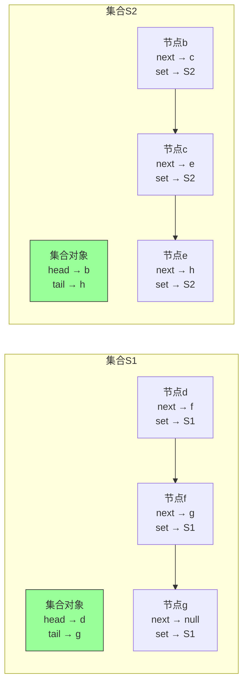

**代表元素**：
- S1 的代表元素是 d
- S2 的代表元素是 b

### 2.2 基本操作实现

**MAKE-SET(x)**：O(1)
```java
// 创建一个只包含x的新链表
x.set = new SetObject()
x.set.head = x
x.set.tail = x
x.next = null
```

**FIND-SET(x)**：O(1)
```java
// 通过x指向集合对象的指针，直接返回head指向的元素
return x.set.head
```

### 2.3 UNION操作与性能问题

**简单实现**：将一个链表接到另一个链表末尾

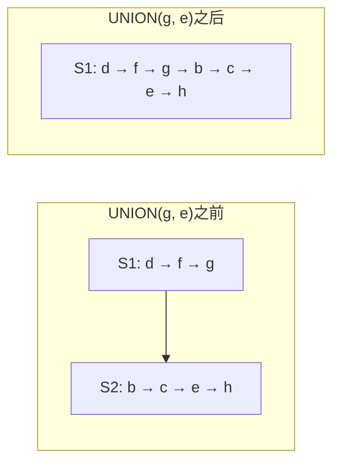

**性能瓶颈**：
- 必须更新被合并链表中**所有节点**指向集合对象的指针
- 时间复杂度：O(被合并链表的长度)

**反例**：Θ(n²) 的操作序列
```
MAKE-SET(x1), MAKE-SET(x2), ..., MAKE-SET(xn)  // Θ(n)
UNION(x1, x2), UNION(x1, x3), ..., UNION(x1, xn)  // Θ(n²)
```

| 操作 | 更新的节点数 |
|-----|------------|
| UNION(x1, x2) | 1 |
| UNION(x1, x3) | 2 |
| UNION(x1, x4) | 3 |
| ... | ... |
| UNION(x1, xn) | n-1 |
| **总计** | **1 + 2 + ... + (n-1) = Θ(n²)** |

### 2.4 加权合并启发式

**核心思想**：总是将**较短的链表**合并到**较长的链表**

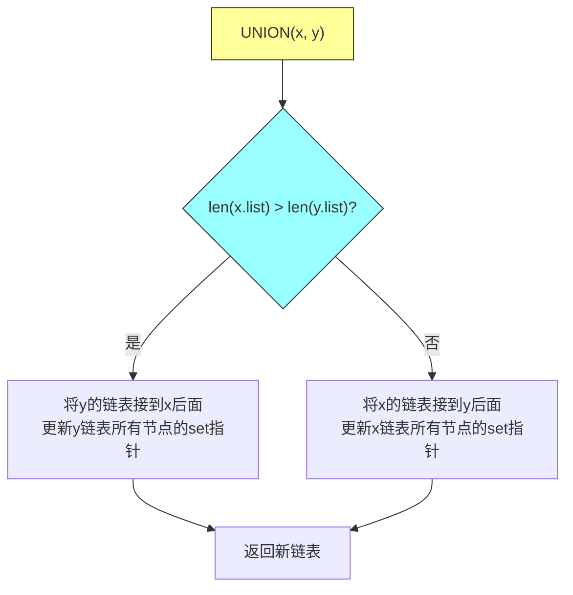

**定理 19.1**：使用加权合并启发式，m 次操作的总时间为 O(m + n lg n)

**证明思路**：
- 每个节点的指针最多被更新 ⌈lg n⌉ 次
- 因为每次更新时，节点所在集合大小至少翻倍
- n 个节点 × ⌈lg n⌉ 次 = O(n lg n)

---

## 三、并查集森林（优化版本）

### 3.1 数据结构设计

**用树表示集合**：
- 每个节点包含一个元素
- 每棵树代表一个集合
- 树根是代表元素

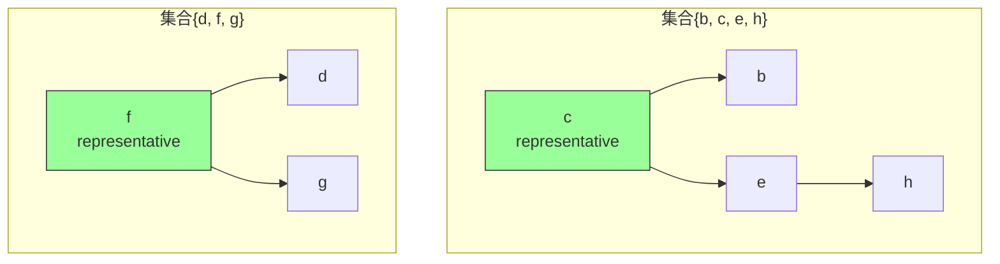

**节点属性**：
- x.parent：指向父节点
- x.rank：高度的近似值（按秩合并使用）

### 3.2 核心启发式

**启发式1：按秩合并（Union by Rank）**

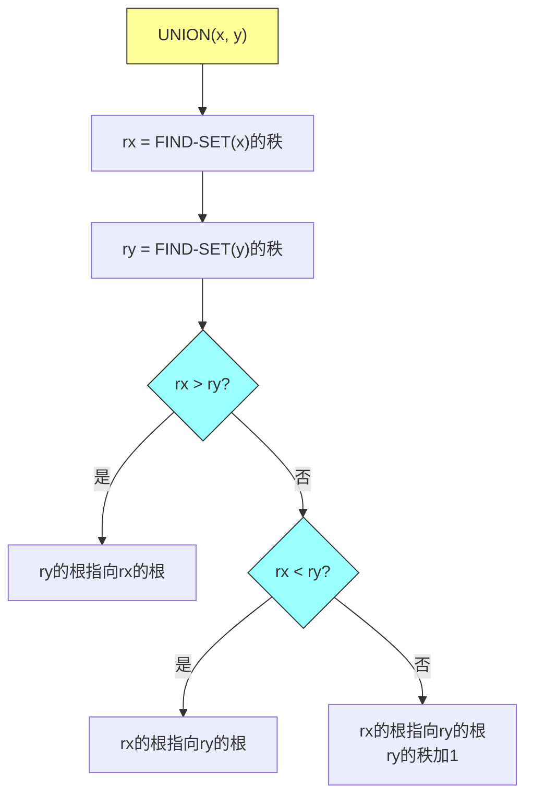

**启发式2：路径压缩（Path Compression）**

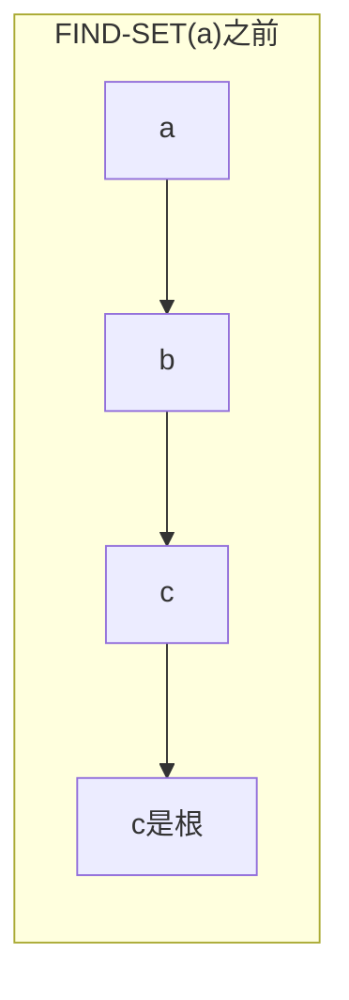

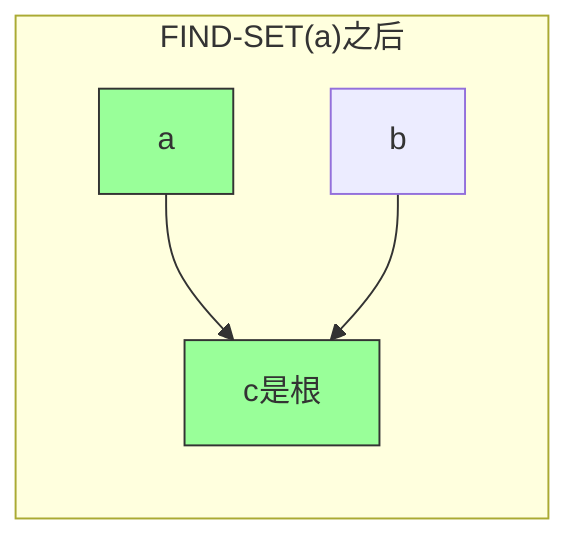

**关键观察**：
- 路径压缩不改变秩
- 按秩合并保证树不会太高

### 3.3 Java实现

```java
public class DisjointSet {
    private static class Node {
        int data;
        Node parent;
        int rank;

        Node(int data) {
            this.data = data;
            this.parent = this;
            this.rank = 0;
        }
    }

    private Map<Integer, Node> nodes = new HashMap<>();

    // 创建只包含x的集合
    public void makeSet(int x) {
        if (!nodes.containsKey(x)) {
            nodes.put(x, new Node(x));
        }
    }

    // 查找x所在集合的代表（路径压缩）
    public int findSet(int x) {
        Node node = nodes.get(x);
        if (node.parent != node) {
            // 路径压缩：让节点直接指向根
            node.parent = findSet(node.parent);
        }
        return node.parent.data;
    }

    // 按秩合并两个集合
    public void union(int x, int y) {
        Node rx = findSetNode(x);
        Node ry = findSetNode(y);

        if (rx == ry) return; // 已经在同一集合

        // 按秩合并：小秩挂到大秩
        if (rx.rank < ry.rank) {
            rx.parent = ry;
        } else if (rx.rank > ry.rank) {
            ry.parent = rx;
        } else {
            ry.parent = rx;
            rx.rank++; // 秩相同时任选一个，秩加1
        }
    }

    private Node findSetNode(int x) {
        Node node = nodes.get(x);
        if (node.parent != node) {
            node.parent = findSetNode(node.parent);
        }
        return node.parent;
    }

    // 判断x和y是否在同一集合
    public boolean sameComponent(int x, int y) {
        return findSet(x) == findSet(y);
    }
}
```

### 3.4 操作分析

| 操作 | 时间复杂度 |
|-----|-----------|
| MAKE-SET | O(1) |
| FIND-SET（无启发式） | O(树高) |
| UNION（无启发式） | O(树高) |
| FIND-SET（仅路径压缩） | O(log n) |
| UNION（仅按秩合并） | O(log n) |
| **两者结合** | **O(α(n))** |

---

## 四、反阿克曼函数 α(n)

### 4.1 阿克曼函数定义

**阿克曼函数** Ackermann 函数是**增长极快**的函数：

```
A(0, j) = j + 1
A(i, 0) = A(i-1, 1)  (i ≥ 1)
A(i, j) = A(i-1, A(i, j-1))  (i, j ≥ 1)
```

### 4.2 函数增长有多快

| 函数值 | 计算结果 | 含义 |
|-------|---------|------|
| A(0, 1) | 2 | 很小 |
| A(1, 1) | 3 | 很小 |
| A(2, 1) | 5 | 很小 |
| A(3, 1) | 2047 | 十亿级别 |
| A(4, 1) | 约 10^(80次方) | **超过可观测宇宙原子数** |

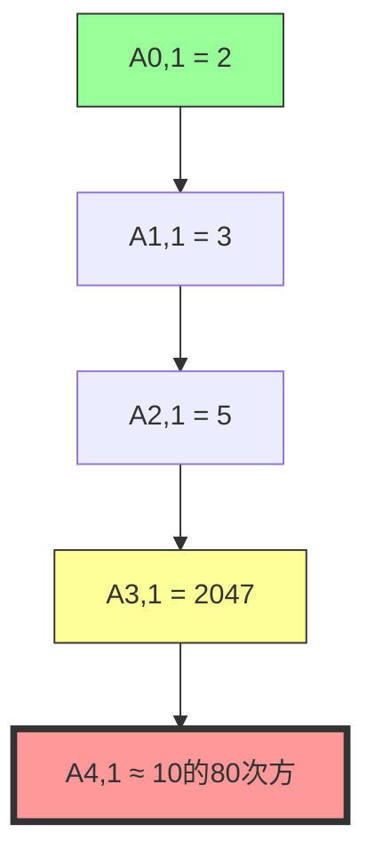

### 4.3 反阿克曼函数

**定义**：α(n) = 最小的 k，使得 A(k, 1) ≥ n

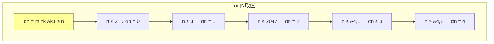

**实际意义**：
- 对于任何实际问题，α(n) ≤ 4
- O(m α(n)) **几乎等于 O(m)**，是实际意义上的线性时间

### 4.4 复杂度对比

| 数据结构 | 时间复杂度 | 实际效果 |
|---------|-----------|---------|
| 加权合并链表 | O(m + n lg n) | 略好于线性 |
| 仅按秩合并 | O(m lg n) | 对数因子 |
| 仅路径压缩 | O(m log* n) | 略好于对数 |
| **按秩 + 路径压缩** | **O(m α(n))** | **实际线性** |

**α(n)与其他函数增长对比**：

| n | log n | log log n | α(n) |
|---|-------|-----------|------|
| 10^6 | 20 | 3 | ≤ 3 |
| 10^9 | 30 | 4 | ≤ 3 |
| 10^80 | 266 | 6 | ≤ 4 |

---

## 五、具体例子演示

### 5.1 连通分量计算示例

**图结构**：
```
顶点: {a, b, c, d, e, f, g, h, i, j}
边: (d,i), (f,k), (g,i), (b,g), (a,h), (i,j), (d,k), (b,j), (d,f), (g,j), (a,e)
```

**初始状态**：每个顶点自成一个集合

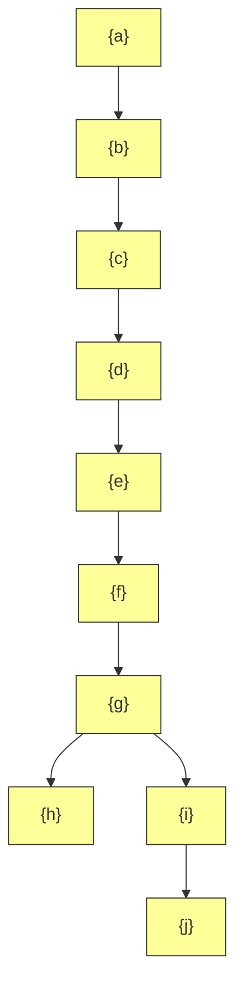

**处理过程**：

| 边 | 操作 | 集合变化 |
|---|------|---------|
| (d, i) | UNION(d, i) | {d, i}, {a}, {b}, {c}, {e}, {f}, {g}, {h}, {j} |
| (f, k) | UNION(f, k) | {d, i}, {f, k}, {a}, {b}, {c}, {e}, {g}, {h}, {j} |
| (g, i) | UNION(g, i) | {d, g, i}, {f, k}, {a}, {b}, {c}, {e}, {h}, {j} |
| (b, g) | UNION(b, g) | {b, d, g, i}, {f, k}, {a}, {c}, {e}, {h}, {j} |
| ... | ... | ... |

**最终结果**：
- 连通分量1: {a, b, d, e, g, i, j}
- 连通分量2: {f, k}

### 5.2 路径压缩演示

**初始树结构**：
```
        g
       / \
      d   h
     / \
    b   f
   /
  a
```

**FIND-SET(a) 的执行过程**：

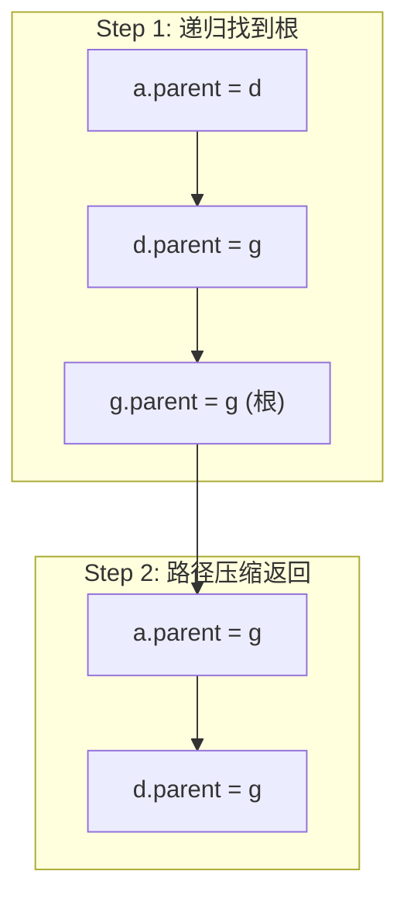

**压缩后的树结构**：
```
        g
       /|\
      d h a
     /      \
    b        f
```

**秩的变化**：注意秩不改变！

| 节点 | 初始秩 | 最终秩 |
|-----|-------|-------|
| g | 2 | 2 |
| d | 1 | 1 |
| h | 0 | 0 |
| a | 0 | 0 |
| b | 0 | 0 |
| f | 0 | 0 |

---

## 六、复杂度分析

### 6.1 各方法对比表

| 方法 | 时间复杂度 | 说明 |
|-----|-----------|------|
| 链表简单实现 | O(m + n²) | 最坏情况 |
| 链表加权合并 | O(m + n lg n) | 启发式优化 |
| 仅按秩合并 | O(m lg n) | 理论保证 |
| 仅路径压缩 | O(m log* n) | 略好 |
| **按秩 + 路径压缩** | **O(m α(n))** | **渐进最优** |

### 6.2 为什么 α(n) 如此重要

**数学上的严谨**：
- 并查集操作的时间复杂度**不能低于 O(m)**
- O(m α(n)) 是已知的**渐进最优解**
- 任何更快的算法都是不可能的

**实际意义**：
- α(n) ≤ 4 对所有实际问题成立
- O(m α(n)) = O(m) 对所有实际问题
- 这是算法设计中**理论最优与实际最优完美统一**的例子

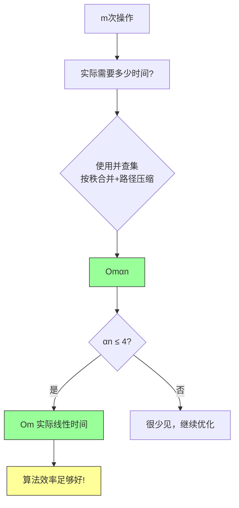

---

## 七、算法模板

### 7.1 Java实现（完整版）

```java
import java.util.HashMap;
import java.util.Map;

/**
 * 并查集（不相交集合）数据结构
 * 支持按秩合并和路径压缩
 */
public class DisjointSetForest {

    private static class Node {
        int data;
        Node parent;
        int rank;  // 近似高度

        Node(int data) {
            this.data = data;
            this.parent = this;
            this.rank = 0;
        }
    }

    private final Map<Integer, Node> nodeMap;

    public DisjointSetForest() {
        this.nodeMap = new HashMap<>();
    }

    /**
     * MAKE-SET: 创建只包含x的集合
     */
    public void makeSet(int x) {
        if (!nodeMap.containsKey(x)) {
            nodeMap.put(x, new Node(x));
        }
    }

    /**
     * FIND-SET: 查找x所在集合的代表（路径压缩版本）
     */
    public int findSet(int x) {
        Node node = nodeMap.get(x);
        if (node == null) {
            throw new IllegalArgumentException("Element not found: " + x);
        }
        return findSetWithPathCompression(node).data;
    }

    private Node findSetWithPathCompression(Node node) {
        if (node.parent != node) {
            // 路径压缩：让节点直接指向根
            node.parent = findSetWithPathCompression(node.parent);
        }
        return node.parent;
    }

    /**
     * UNION: 合并两个集合（按秩合并版本）
     */
    public void union(int x, int y) {
        Node rx = findSetWithPathCompression(nodeMap.get(x));
        Node ry = findSetWithPathCompression(nodeMap.get(y));

        if (rx == ry) {
            // 已经在同一集合，无需合并
            return;
        }

        // 按秩合并：小秩挂到大秩
        if (rx.rank < ry.rank) {
            rx.parent = ry;
        } else if (rx.rank > ry.rank) {
            ry.parent = rx;
        } else {
            // 秩相等时，任选一个作为父节点
            ry.parent = rx;
            rx.rank++;  // 高度增加
        }
    }

    /**
     * SAME-COMPONENT: 判断x和y是否在同一集合
     */
    public boolean sameComponent(int x, int y) {
        return findSet(x) == findSet(y);
    }

    /**
     * 获取集合大小（辅助功能）
     */
    public int sizeOf(int x) {
        Node root = findSetWithPathCompression(nodeMap.get(x));
        int count = 0;
        for (Node node : nodeMap.values()) {
            if (findSetWithPathCompression(node) == root) {
                count++;
            }
        }
        return count;
    }

    /**
     * 获取集合数量
     */
    public int numberOfSets() {
        int count = 0;
        for (Node node : nodeMap.values()) {
            if (node.parent == node) {
                count++;
            }
        }
        return count;
    }
}
```

### 7.2 Kruskal算法应用

```java
import java.util.*;

/**
 * Kruskal最小生成树算法使用并查集
 */
public class KruskalMST {

    private static class Edge implements Comparable<Edge> {
        int u, v, weight;

        Edge(int u, int v, int weight) {
            this.u = u;
            this.v = v;
            this.weight = weight;
        }

        @Override
        public int compareTo(Edge other) {
            return Integer.compare(this.weight, other.weight);
        }
    }

    /**
     * Kruskal算法
     * @param n 顶点数
     * @param edges 边列表
     * @return 最小生成树的总权重
     */
    public static int kruskal(int n, List<Edge> edges) {
        // 1. 初始化：每个顶点自成一个集合
        DisjointSetForest dsu = new DisjointSetForest();
        for (int i = 0; i < n; i++) {
            dsu.makeSet(i);
        }

        // 2. 按权重排序
        Collections.sort(edges);

        // 3. 遍历边，尝试合并
        int mstWeight = 0;
        int edgesUsed = 0;

        for (Edge edge : edges) {
            // 如果u和v不在同一集合，添加这条边
            if (!dsu.sameComponent(edge.u, edge.v)) {
                dsu.union(edge.u, edge.v);
                mstWeight += edge.weight;
                edgesUsed++;

                // n个顶点的MST有n-1条边
                if (edgesUsed == n - 1) {
                    break;
                }
            }
        }

        return mstWeight;
    }

    // 测试
    public static void main(String[] args) {
        List<Edge> edges = Arrays.asList(
            new Edge(0, 1, 10),
            new Edge(0, 2, 6),
            new Edge(0, 3, 5),
            new Edge(1, 3, 15),
            new Edge(2, 3, 4)
        );

        int mst = kruskal(4, edges);
        System.out.println("MST weight: " + mst);  // 输出: 15
    }
}
```

---

## 八、举一反三

### 8.1 同类LeetCode题目

| 题目 | 链接 | 核心思想 |
|-----|------|---------|
| 547. 省份数量 | https://leetcode.cn/problems/number-of-provinces/ | 并查集求连通分量 |
| 200. 岛屿数量 | https://leetcode.cn/problems/number-of-islands/ | 并查集/BFS/DFS |
| 305. 岛屿数量II | https://leetcode.cn/problems/number-of-islands-ii/ | 动态添加岛屿 |
| 684. 冗余连接 | https://leetcode.cn/problems/redundant-connection/ | 检测环 |
| 685. 冗余连接II | https://leetcode.cn/problems/redundant-connection-ii/ | 有向树检测 |
| 721. 账户合并 | https://leetcode.cn/problems/accounts-merge/ | 并查集应用 |
| 737. 句子相似性II | https://leetcode.cn/problems/sentence-similarity-ii/ | 词汇相似性 |
| 924. 尽量减少恶意软件的传播 | https://leetcode.cn/problems/minimize-malware-spread/ | 并查集+计数 |

### 8.2 变形题目

**离线最小值问题（Problem 19-1）**：
- 输入：n个INSERT和m个EXTRACT-MIN操作序列
- 要求：确定每个EXTRACT-MIN返回的值
- 解法：使用并查集倒序处理

**深度确定问题（Problem 19-2）**：
- 扩展并查集支持FIND-DEPTH操作
- 维护伪距离记录路径长度

### 8.3 核心思想的迁移应用

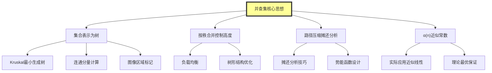

### 8.4 实际应用场景

| 应用领域 | 使用场景 | 并查集的作用 |
|---------|---------|-------------|
| 编译器 | 等价类分析 | 变量等价性判断 |
| 网络 | 网络连通性 | 动态网络连接状态 |
| 游戏 | 区域连通 | 地图区域划分 |
| 数据库 | 外键约束 | 循环依赖检测 |
| 图像处理 | 连通域标记 | 前景/背景分割 |

---

## 九、总结

### 9.1 核心收获

1. **并查集三操作**：
   - MAKE-SET：O(1)
   - UNION：按秩合并
   - FIND-SET：路径压缩

2. **两个启发式的结合**：
   - 按秩合并：控制树高
   - 路径压缩：摊还优化
   - 共同作用：O(m α(n))

3. **α(n)的含义**：
   - 反阿克曼函数
   - 增长极其缓慢
   - 实际应用中小于等于4

### 9.2 为什么并查集如此优雅

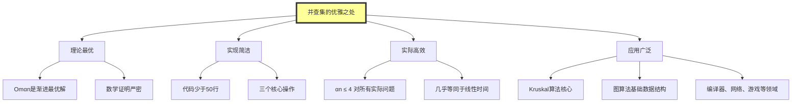

### 9.3 与其他数据结构的对比

| 数据结构 | 查找 | 插入/合并 | 适用场景 |
|---------|-----|----------|---------|
| 并查集 | O(α(n)) | O(α(n)) | 元素分组、合并查询 |
| 平衡二叉搜索树 | O(log n) | O(log n) | 有序数据、范围查询 |
| 哈希表 | O(1) | O(1) | 快速查找 |
| 链表 | O(1) | O(1) | 顺序访问 |

---

## 参考资料

- Cormen, T. H., Leiserson, C. E., Rivest, R. L., & Stein, C. (2009). *Introduction to Algorithms* (3rd ed.). MIT Press.
- Chapter 19: Data Structures for Disjoint Sets, pp. 683-714
- Tarjan, R. E. (1975). "Efficiency of a Good But Not Linear Set Union Algorithm". Journal of the ACM.
