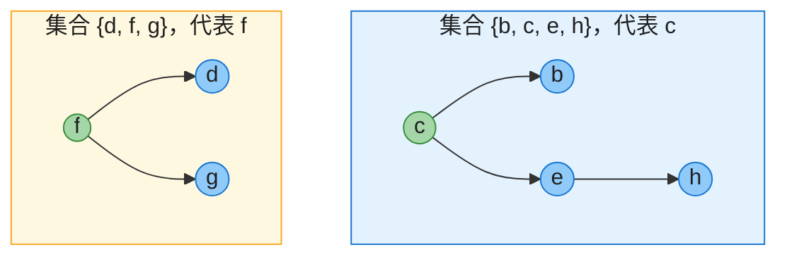
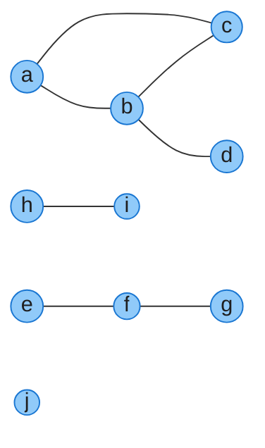
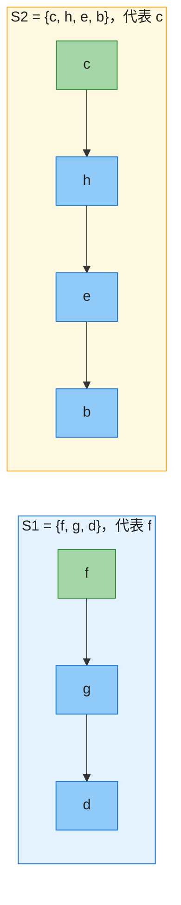
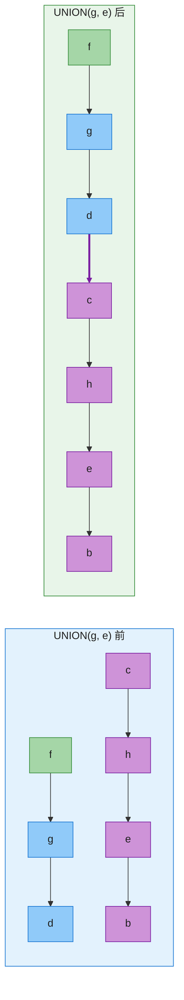
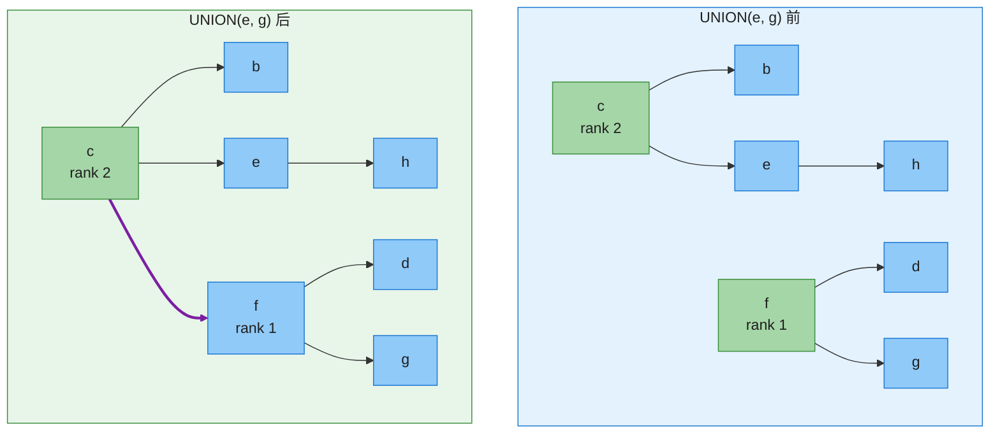
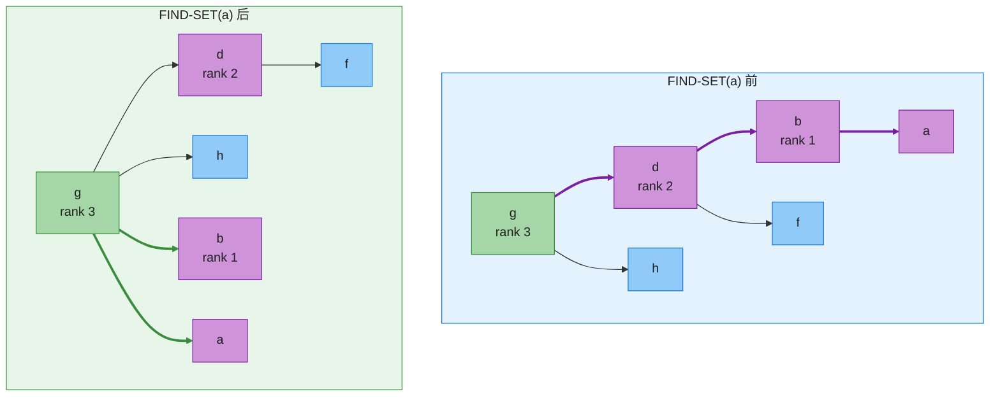

# 第 19 章：不相交集合（Disjoint Sets，并查集）——深度版

## 一、开篇定位

本章回答一个问题：**如何维护一族动态变化的「分组」，支持快速查询「两个元素是否同组」和「合并两组」？** 这就是不相交集合（disjoint sets），竞赛与工程界更熟悉的名字是**并查集**（union-find）。

应用遍地都是：无向图连通分量、Kruskal 最小生成树的环检测、图像连通域标记、编译器等价类分析、网络动态连通性。

与前后章节的关系：

- 分析工具来自**第 16 章摊还分析**（19.4 用的是势能法）；
- **第 20 章**的 DFS 也能求连通分量，静态图上 $O(V+E)$ 更快——并查集的主场是**边动态加入、在线查询**的场景；
- **第 21 章 Kruskal** 是并查集的头号客户：每考察一条边就是一次「查同集 + 合并」。

做题定位：识别信号 = 「分组 / 连通 / 合并 + 查询是否同组」。模板题 547（省份数量）、684（冗余连接）；变体见第六节题单（带权并查集 399、逆向并查集 803）。

**本章主线**：三个操作与连通分量应用（19.1）→ 链表实现及加权合并（19.2）→ 并查集森林：按秩合并 + 路径压缩（19.3）→ 反阿克曼函数与 $O(m\,\alpha(n))$ 的含义（19.4）→ Java + Python 双实现 → 速查/易混 → 题单与习题。

---

## 二、核心思想：每个集合一棵树，树根是「代表」

大白话：把每个集合看成一个「帮派」，帮里每人只认自己的直接上级，帮主（树根）就是集合的**代表**（representative）。

- **MAKE-SET(x)**：x 自立门户，自成一帮；
- **FIND-SET(x)**：x 顺上级一路问到帮主——返回帮主；
- **UNION(x, y)**：两个帮主见面，一个认另一个当总帮主。

判断 x、y 是否同组 = 看帮主是不是同一个人。两个启发式让这套结构快到近乎常数：

- **按秩合并**（union by rank）：合并时让「矮」树的根挂到「高」树的根下，树长不高；
- **路径压缩**（path compression）：每做一次 FIND-SET，顺手把沿途所有人直接挂到帮主名下，下次再问一步到位。



**图 A**（对应 Figure 19.4a）：并查集森林。每个节点只存指向父节点的指针（图示为树形方向，实际指针由孩子指向父），根的父节点是自己。FIND-SET(h) 沿 h → e → c 上溯，返回 c。

**复杂度参数约定**（全章通用）：$n$ = MAKE-SET 次数，$m$ = 三种操作的总次数（$m \ge n$）。每次 UNION 使集合数减 1 ⇒ 至多 $n-1$ 次 UNION。

---

## 三、应用与两种实现

### 3.1 应用：无向图的连通分量（19.1）

**问题**：给定无向图，求连通分量；之后在线回答「u、v 是否连通」。

```
CONNECTED-COMPONENTS(G)
1  for each vertex v ∈ G.V
2      MAKE-SET(v)
3  for each edge (u, v) ∈ G.E
4      if FIND-SET(u) ≠ FIND-SET(v)
5          UNION(u, v)

SAME-COMPONENT(u, v)
1  if FIND-SET(u) == FIND-SET(v)
2      return TRUE
3  else return FALSE
```



**图 B**（对应 Figure 19.1a）：10 个顶点、7 条边。按 (b,d) → (e,f) → (a,c) → (h,i) → (a,b) → (f,g) → (b,c) 的顺序处理边，集合族演变如下（已用代码实跑核对）：

| 处理的边 | 处理后的集合族 |
|---------|---------------|
| （初始） | {a} {b} {c} {d} {e} {f} {g} {h} {i} {j} |
| (b, d) | {a} {b,d} {c} {e} {f} {g} {h} {i} {j} |
| (e, f) | {a} {b,d} {c} {e,f} {g} {h} {i} {j} |
| (a, c) | {a,c} {b,d} {e,f} {g} {h} {i} {j} |
| (h, i) | {a,c} {b,d} {e,f} {g} {h,i} {j} |
| (a, b) | {a,b,c,d} {e,f} {g} {h,i} {j} |
| (f, g) | {a,b,c,d} {e,f,g} {h,i} {j} |
| (b, c) | 两端已同集，跳过 UNION |

最终 4 个连通分量：{a,b,c,d}、{e,f,g}、{h,i}、{j}。

**什么时候不用并查集**：边集静态不变时，第 20 章的 DFS 一次 $O(V+E)$ 即可（习题 20.3-12）；并查集赢在**边动态加入、随加随问**（每加一条边只需一次 UNION）。

LeetCode 标注：547（省份数量）、200（岛屿数量）就是本节的模板题。

### 3.2 链表实现：FIND O(1)，UNION 是痛点（19.2）

**设计**：每个集合一条链表；集合对象存 head / tail 指针；每个节点除 next 外还存一个**回指集合对象的指针**；代表 = 首节点。



**图 C**（对应 Figure 19.2a）：每个节点还有一个回指 S1 / S2 集合对象的指针（图中省略）。MAKE-SET 建单节点链表 $O(1)$；FIND-SET(x) 沿回指指针拿到集合对象、返回 head 首元素，也是 $O(1)$——如 FIND-SET(g) 返回 f。

**UNION(x, y)**：约定把 **y 的链表**接到 **x 的链表**尾（tail 指针让拼接本身 $O(1)$），但必须把 y 链上**每个节点**的回指指针改到 x 的集合对象 ⇒ 代价 $O$（y 的链表长度）。



**图 D**（对应 Figure 19.2b）：UNION(g, e) 把 e 所在的 S2 整条接到 S1 尾（紫粗边为拼接点），紫色节点（c、h、e、b 共 4 个）的回指指针全部要更新，S2 对象销毁，新集合代表为 f。

**最坏序列**（Figure 19.3）：从 n 个单元素集合出发，按上述约定依次执行 UNION(x2, x1)、UNION(x3, x2)、…——每次都把已有长链接到单元素后面：

| 操作 | 更新的对象数 |
|------|-------------|
| MAKE-SET(x1) … MAKE-SET(xn) | 各 1，共 n |
| UNION(x2, x1) | 1 |
| UNION(x3, x2) | 2 |
| UNION(x4, x3) | 3 |
| ⋮ | ⋮ |
| UNION(xn, xn−1) | n−1 |
| **合计** | $\Theta(n^2)$ |

$m = 2n-1$ 次操作总耗时 $\Theta(n^2)$，**平均每次 $\Theta(n)$**——无法接受。

**加权合并启发式**（weighted-union）：集合对象额外记录长度，UNION 总把**短**链表接到**长**链表。单次 UNION 仍可能 $\Omega(n)$，但摊还下来很便宜：

> **结论**：加权合并下 m 次操作总时间 $O(m + n \lg n)$。
> 直觉：x 的回指指针每被更新一次，x 必在较短的一边 ⇒ 新集合至少是原集合两倍大 ⇒ 每个对象最多更新 $\lceil \lg n \rceil$ 次，全体 UNION 的总更新量 $O(n \lg n)$。

### 3.3 并查集森林：按秩合并 + 路径压缩（19.3）

链表表示 FIND 快、UNION 贵；森林表示反过来：UNION 只是根挂根 $O(1)$，FIND 要爬树。两个启发式负责把树压矮。

**按秩合并**：每个节点维护 **rank = 高度的上界**；合并时**秩小的根挂到秩大的根下**；秩相等则任选一个当父、其 rank +1。



**图 E**（对应 Figure 19.4）：UNION(e, g) 先 FIND-SET 找到两棵树的根 c（rank 2）与 f（rank 1），秩小的 f 挂到 c 下（紫粗边），rank 均不变。只有两秩相等时新根的 rank 才 +1。

**路径压缩**：FIND-SET 是**两趟**过程——递归上行找根，回程时把沿途每个节点直接挂到根下。不改变任何 rank。



**图 F**（对应 Figure 19.5）：FIND-SET(a) 的查找路径 a → b → d → g（紫）。压缩后 a、b、d 全部直指 g（绿粗边），树明显变矮——但 **rank 一个都不改**：d 的实际高度从 2 降到 1，rank 仍是 2。所以 rank 只是「曾经达到过」的高度上界，不是实时高度。

**CLRS 伪代码**（第四版 p.530）：

```
MAKE-SET(x)
1  x.p = x
2  x.rank = 0

UNION(x, y)
1  LINK(FIND-SET(x), FIND-SET(y))

LINK(x, y)
1  if x.rank > y.rank
2      y.p = x
3  else x.p = y
4      if x.rank == y.rank
5          y.rank = y.rank + 1

FIND-SET(x)
1  if x ≠ x.p                  // 不是根？
2      x.p = FIND-SET(x.p)     // 根变成父节点（路径压缩）
3  return x.p                  // 返回根
```

**复杂度结论**（m 次操作，n 个元素）：

| 启发式 | 总时间 | 一句话理由 |
|--------|--------|-----------|
| 仅按秩合并 | $O(m \lg n)$，且是紧的（习题 19.3-3） | rank ≤ $\lfloor \lg n \rfloor$：rank k 的根子树至少 $2^k$ 个节点（两棵 rank k−1 才并得出 rank k），故树高 $O(\lg n)$ |
| 仅路径压缩 | $\Theta(n + f\,(1 + \log_{2+f/n}\, n))$，f = FIND 次数 | 约「摊还对数」级，但不如两者结合 |
| **按秩 + 路径压缩** | $O(m\,\alpha(n))$ | 19.4 势能法证明；$\alpha$ 见下一节 |

### 3.4 反阿克曼函数 α(n)（19.4）

$O(m\,\alpha(n))$ 里的 $\alpha(n)$ 到底是什么？先看一个**增长极快**的函数族（CLRS 定义）：$A_0(j) = j + 1$；$k \ge 1$ 时，$A_k(j)$ = 把 $A_{k-1}$ 对 $j$ **迭代** $j+1$ 次。

| k | $A_k(1)$ | 备注 |
|---|----------|------|
| 0 | 2 | |
| 1 | 3 | 闭式 $A_1(j) = 2j + 1$ |
| 2 | 7 | 闭式 $A_2(j) = 2^{j+1}(j+1) - 1$ |
| 3 | 2047 | $A_3(1) = A_2(A_2(1)) = A_2(7)$ |
| 4 | $\gg 10^{80}$ | 超过可观测宇宙的原子数 |

**反阿克曼函数**：$\alpha(n) = \min\{k : A_k(1) \ge n\}$——「要到第几层才能盖住 n」。

| n 的范围 | $\alpha(n)$ |
|---------|-------------|
| $0 \le n \le 2$ | 0 |
| $n = 3$ | 1 |
| $4 \le n \le 7$ | 2 |
| $8 \le n \le 2047$ | 3 |
| $2048 \le n \le A_4(1)$ | 4 |

| n | $\lg n$ | $\lg \lg n$ | $\alpha(n)$ |
|---|---------|-------------|-------------|
| $10^6$ | ≈ 20 | ≈ 4.3 | 4 |
| $10^9$ | ≈ 30 | ≈ 4.9 | 4 |
| $10^{80}$ | ≈ 266 | ≈ 8.1 | 4 |

**要点**：对任何写得下的 n，$\alpha(n) \le 4$。所以 $O(m\,\alpha(n))$ 在一切实际场合就是 $O(m)$（线性）；但数学上它**严格超线性**——这正是并查集的迷人之处。$O(m\,\alpha(n))$ 的证明用第 16 章的势能法做摊还分析（为每个节点设计随「父子秩差距」变化的势能），本笔记从略，记住结论与直觉即可：**按秩合并让树高不过 $\lg n$，路径压缩让重复查询越来越便宜，两者叠加，摊还每次操作 $O(\alpha(n))$。**

---

## 四、代码实现（Java + Python）

实战一律用 **0-indexed 数组**：`parent[i]` = i 的父节点（根指向自己），`rank[i]` = 秩；构造时 `parent[i] = i` 即完成 n 次 MAKE-SET，与 CLRS 对象指针伪代码一一对应。以下代码均已实际编译 / 运行，并与「显式集合」朴素实现随机对拍 200 轮 × 2000 操作验证一致。

### 4.1 Java

```java
import java.util.*;

/**
 * 并查集（不相交集合）：按秩合并 + 路径压缩
 * 0-indexed 数组实现（LeetCode 实战惯例）
 */
public class DisjointSet {
    private final int[] parent; // parent[i] = i 的父节点，根的父节点是自己
    private final int[] rank;   // rank[i] = i 的秩（高度上界，仅根有意义）
    private int count;          // 当前集合个数

    /** n 个元素各自成集合（相当于 n 次 MAKE-SET） */
    public DisjointSet(int n) {
        parent = new int[n];
        rank = new int[n];
        for (int i = 0; i < n; i++) parent[i] = i;
        count = n;
    }

    /** FIND-SET：返回 x 所在集合的代表（树根），顺带路径压缩 */
    public int findSet(int x) {
        if (parent[x] != x) {
            parent[x] = findSet(parent[x]); // 回程时让 x 直接指向根
        }
        return parent[x];
    }

    /** UNION：合并 x、y 所在集合（按秩合并）；已同集则无事发生 */
    public void union(int x, int y) {
        int rx = findSet(x), ry = findSet(y);
        if (rx == ry) return;
        if (rank[rx] < rank[ry]) { // 让 rx 始终是秩较大的根
            int t = rx; rx = ry; ry = t;
        }
        parent[ry] = rx;
        if (rank[rx] == rank[ry]) rank[rx]++;
        count--;
    }

    public boolean sameComponent(int x, int y) {
        return findSet(x) == findSet(y);
    }

    public int count() {
        return count;
    }

    public static void main(String[] args) {
        // 演示 1：CLRS Figure 19.1 的连通分量（顶点 a..j = 0..9）
        int[][] edges = {{1, 3}, {4, 5}, {0, 2}, {7, 8}, {0, 1}, {5, 6}, {1, 2}};
        DisjointSet ds = new DisjointSet(10);
        for (int[] e : edges) {
            if (!ds.sameComponent(e[0], e[1])) ds.union(e[0], e[1]);
        }
        Map<Integer, List<Integer>> comp = new TreeMap<>();
        for (int v = 0; v < 10; v++) {
            comp.computeIfAbsent(ds.findSet(v), k -> new ArrayList<>()).add(v);
        }
        System.out.println("连通分量数 = " + ds.count());
        for (List<Integer> members : comp.values()) {
            StringBuilder sb = new StringBuilder("{");
            for (int v : members) sb.append((char) ('a' + v)).append(' ');
            System.out.println(sb.append("}"));
        }

        // 演示 2：Kruskal 最小生成树（第 21 章，并查集的头号应用）
        int[][] weighted = {{0, 1, 10}, {0, 2, 6}, {0, 3, 5}, {1, 3, 15}, {2, 3, 4}};
        Arrays.sort(weighted, Comparator.comparingInt(e -> e[2]));
        DisjointSet ds2 = new DisjointSet(4);
        int total = 0, used = 0;
        for (int[] e : weighted) {
            if (!ds2.sameComponent(e[0], e[1])) {
                ds2.union(e[0], e[1]);
                total += e[2];
                if (++used == 3) break;
            }
        }
        System.out.println("MST weight = " + total);
    }
}
```

### 4.2 Python

```python
"""并查集（不相交集合）：按秩合并 + 路径压缩，0-indexed 数组实现"""


class DisjointSet:
    def __init__(self, n: int):
        self.parent = list(range(n))  # parent[i] = i 的父节点，根的父节点是自己
        self.rank = [0] * n           # 秩：高度上界，仅根有意义
        self.count = n                # 当前集合个数

    def find_set(self, x: int) -> int:
        """FIND-SET：返回 x 所在集合的代表（树根），顺带路径压缩"""
        if self.parent[x] != x:
            self.parent[x] = self.find_set(self.parent[x])  # 回程时让 x 直接指向根
        return self.parent[x]

    def union(self, x: int, y: int) -> None:
        """UNION：合并 x、y 所在集合（按秩合并）；已同集则无事发生"""
        rx, ry = self.find_set(x), self.find_set(y)
        if rx == ry:
            return
        if self.rank[rx] < self.rank[ry]:  # 让 rx 始终是秩较大的根
            rx, ry = ry, rx
        self.parent[ry] = rx
        if self.rank[rx] == self.rank[ry]:
            self.rank[rx] += 1
        self.count -= 1

    def same_component(self, x: int, y: int) -> bool:
        return self.find_set(x) == self.find_set(y)


if __name__ == "__main__":
    # 演示 1：CLRS Figure 19.1 的连通分量（顶点 a..j = 0..9）
    edges = [(1, 3), (4, 5), (0, 2), (7, 8), (0, 1), (5, 6), (1, 2)]
    ds = DisjointSet(10)
    for u, v in edges:
        if not ds.same_component(u, v):
            ds.union(u, v)
    comp = {}
    for v in range(10):
        comp.setdefault(ds.find_set(v), []).append(v)
    print("连通分量数 =", ds.count)
    for members in comp.values():
        print("{" + " ".join(chr(ord('a') + v) for v in members) + " }")

    # 演示 2：Kruskal 最小生成树（第 21 章，并查集的头号应用）
    weighted = [(0, 1, 10), (0, 2, 6), (0, 3, 5), (1, 3, 15), (2, 3, 4)]
    ds2 = DisjointSet(4)
    total, used = 0, 0
    for u, v, w in sorted(weighted, key=lambda e: e[2]):
        if not ds2.same_component(u, v):
            ds2.union(u, v)
            total += w
            used += 1
            if used == 3:
                break
    print("MST weight =", total)
```

运行输出（Java / Python 一致）：

```
连通分量数 = 4
{a b c d }
{e f g }
{h i }
{j }
MST weight = 19
```

---

## 五、复杂度速查 + 易混点对比

### 5.1 速查表

| 实现 | MAKE-SET | FIND-SET | UNION | m 次操作总时间 |
|------|----------|----------|-------|----------------|
| 链表（朴素） | $O(1)$ | $O(1)$ | $O$（被接链表长） | 最坏 $\Theta(n^2)$（Figure 19.3） |
| 链表（加权合并） | $O(1)$ | $O(1)$ | 摊还 $O(\lg n)$ | $O(m + n \lg n)$ |
| 森林（仅按秩合并） | $O(1)$ | $O(\lg n)$ | $O(\lg n)$ | $O(m \lg n)$，紧 |
| 森林（仅路径压缩） | $O(1)$ | 摊还约对数级 | — | $\Theta(n + f\,(1 + \log_{2+f/n}\, n))$ |
| **森林（按秩 + 压缩）** | $O(1)$ | 摊还 $O(\alpha(n))$ | 摊还 $O(\alpha(n))$ | $O(m\,\alpha(n))$，渐近最优 |

空间均为 $O(n)$。

### 5.2 易混点对比

| 易混点 | 辨析 |
|--------|------|
| rank ≠ height | rank 是**高度上界**；路径压缩降低实际高度但不改 rank ⇒ 压缩后一般 rank > height（图 F 的 d） |
| 按秩合并 vs 按大小合并 | 渐近效果相同；rank 更好分析（只增不减、与高度挂钩）。甚至随机把一个根挂到另一个根下，渐近也一样好（章末注记） |
| 链表 vs 森林 | 链表 FIND $O(1)$ 但 UNION 贵；森林 UNION 是根挂根 $O(1)$、FIND 靠两启发式摊还到近 $O(1)$。实战只用森林 |
| 路径压缩不改秩 | 秩只在「两等秩根相并」时 +1；FIND-SET 不动任何秩（图 F） |
| $\alpha(n) \le 4$ ≠ 常数 | 一切实际 n 都 $\le 4$，实际即线性；但数学上 $\alpha$ 无界，$O(m\,\alpha(n))$ 严格超线性 |
| 只用一种启发式 | 单按秩合并 $O(m \lg n)$、单路径压缩约对数级，都到不了 $\alpha(n)$——**必须结合** |
| 静态图连通分量 | 边不变化时 DFS 一次 $O(V+E)$ 更快（第 20 章）；并查集赢在**动态加边 + 在线查询** |
| UNION 的环检测用法 | 先 FIND-SET 判同集，同集则不加边——Kruskal（第 21 章）与 684 冗余连接就靠这一句 |

---

## 六、LeetCode 题单 + 习题快问快答

### 6.1 LeetCode 题单

| 题号 | 题目 | 难度 | 考点 |
|-----|------|-----|------|
| 547 | 省份数量 | 中 | **连通分量计数模板** |
| 200 | 岛屿数量 | 中 | 网格上的连通分量（DFS/BFS 亦可，并查集要会） |
| 684 | 冗余连接 | 中 | **环检测**：两端同集 ⇒ 当前边即答案 |
| 721 | 账户合并 | 中 | 邮箱 → 账户下标映射后合并，再按根聚合 |
| 1319 | 连通网络的操作次数 | 中 | 边数 ≥ n−1 时答案 = 分量数 − 1 |
| 990 | 等式方程的可满足性 | 中 | 先并所有 ==，再查每个 != 是否同集 |
| 1202 | 交换字符串中的元素 | 中 | 同集下标归组，组内排序重组字符串 |
| 399 | 除法求值 | 中 | **带权并查集**：维护到根的比值，压缩时同步更新 |
| 1579 | 保证图可完全遍历的最优移除边数 | 难 | 公共边先并；Alice / Bob 各一个并查集 |
| 952 | 按公因数计算最大组件大小 | 难 | 质因子 → 首次出现的数合并，按根计数 |
| 803 | 打砖块 | 难 | **逆向并查集**：删除倒序变添加，维护与「天花板」的连通 |
| 765 | 情侣牵手 | 难 | 情侣对先并集，交换次数 = 对数 − 环数（分量思想） |

定位语：并查集是「动态连通性」的标准答案。两个常见变体：**带权并查集**（399，parent 边上带权值，压缩时累乘 / 累加）与**逆向并查集**（803，删点 / 删边题倒序做变加点）。MST 方向的并查集题（1584、1697、1631）见第 21 章题单。

### 6.2 习题快问快答（第四版编号）

- **19.1-1** 按序处理 11 条边后（代码核对）：{a,e,h}、{b,d,f,g,i,j,k}、{c}。其中 (b,j)、(d,f)、(g,j) 处理时两端已同集，不触发 UNION。
- **19.1-3** FIND-SET 恰被调用 $2|E|$ 次（每条边两次）；UNION 恰为 $|V| - k$ 次（k = 连通分量数）：每次有效 UNION 使集合数减 1，从 |V| 降到 k。
- **19.2-2** 16 元素加权合并链表程序（代码核对）：FIND-SET(x2) = FIND-SET(x9) = x1；最终一条链 x1…x16。
- **19.2-4** Figure 19.3 的序列改用加权合并：每次 UNION 只更新 1 个对象（被接的总是单元素链）⇒ 总时间 $\Theta(n)$（代码核对 n = 100 时共更新 99 次）。
- **19.3-2** 非递归 FIND-SET：第一趟 while 循环沿 parent 走到根；第二趟从 x 再走一遍，沿途全部改指根。
- **19.3-3** 仅按秩合并的 $\Omega(m \lg n)$ 序列：先用 $2^k$ 个元素并出 rank k 的树（两两等秩相并，形如二项树），再对最深节点反复 FIND-SET，每次 $\Theta(k) = \Theta(\lg n)$。
- **19.4-2** rank ≤ $\lfloor \lg n \rfloor$：归纳——rank k 的根子树至少 $2^k$ 个节点（只有两棵 rank k−1 相并才产生 rank k，节点数翻倍）。
- **19.4-3** 存 rank 需要 $\Theta(\lg \lg n)$ 位（rank 本身只有 $\lfloor \lg n \rfloor$ 量级）。

### 6.3 思考题选

- **19-1 离线最小值**：已知完整操作序列，求每次 EXTRACT-MIN 的返回值。实例 4, 8, E, 3, E, 9, 2, 6, E, E, E, 1, 7, E, 5 的答案 extracted = [4, 3, 2, 6, 8, 1]（堆模拟核对）。高效做法：按 E 把插入分段为 $K_1, \dots, K_{m+1}$，从 1 到 n 扫，i 属于哪个 $K_j$ 就是第 j 次 E 的答案，随后把 $K_j$ 并入下一个还存在的集合——用并查集维护「下一个集合」⇒ $O(m\,\alpha(n))$。
- **19-2 深度确定**：给并查集加「伪距离」v.d（到父节点的距离），使根路径上 d 之和 = 树中真实深度。FIND-DEPTH 即带权路径压缩（压缩时把 v.d 累加成到根的距离）；GRAFT(r, v) 把 r 所在树的根挂到 v 下并设好根的 d ⇒ 依旧 $O(m\,\alpha(n))$。这是**带权并查集**的原型（对应 LeetCode 399）。
- **19-3 Tarjan 离线 LCA**：对树做一趟 DFS，u 的子树处理完后染黑 u；对每个查询对 {u, v}，当 u 染黑且 v 已黑时，答案 = FIND-SET(v).ancestor（每个集合的 ancestor 维护「已访问部分与未访问部分的分界点」）⇒ $O((n + |P|)\,\alpha(n))$。所有查询离线已知时优于逐对在线求 LCA。

### 6.4 章末注记

并查集分析史就是摊还分析的进化史：Hopcroft–Ullman 最早证出 $O(m \lg^* n)$；Tarjan 给出紧界 $O(m\,\alpha(m,n))$，并证明在一定技术条件下 $\Omega(m\,\alpha(m,n))$ 是**下界**——按秩 + 路径压缩渐近最优；Fredman–Saks 把下界推广到更一般的模型（每次最坏需访问 $\Omega(m\,\alpha(m,n))$ 个 $(\lg n)$ 位字）。Tarjan–van Leeuwen 讨论过一趟完成的路径压缩变体（常数更优）；Goel 等证明**随机**把一个根挂到另一个根下，渐近与按秩合并相同；Gabow–Tarjan 证明特定应用（离线场景）可做到真 $O(m)$。

---

## 参考资料

- Cormen, T. H., Leiserson, C. E., Rivest, R. L., & Stein, C. (2022). *Introduction to Algorithms* (4th ed.). MIT Press. Chapter 19: Data Structures for Disjoint Sets, pp. 520–545.
- Tarjan, R. E. (1975). "Efficiency of a Good But Not Linear Set Union Algorithm". *Journal of the ACM*, 22(2), 215–225.
