# 第二十章：基本图算法（Elementary Graph Algorithms）——深度版

## 一、问题描述

### 1.1 本章主题

本章是**图算法的基石**，介绍了图的基本表示方法和四种核心搜索算法。

**为什么图算法如此重要**：
- 图是描述现实世界关系的最自然结构
- 社交网络、地图路由、编译器依赖、任务调度等都基于图
- BFS和DFS是几乎所有高级图算法的基础

### 1.2 五节内容概览

| 章节 | 主题 | 核心问题 |
|-----|------|---------|
| 20.1 | 图的表示 | 如何在计算机中存储图？ |
| 20.2 | 广度优先搜索BFS | 如何找到最短路径？ |
| 20.3 | 深度优先搜索DFS | 如何遍历整个图？ |
| 20.4 | 拓扑排序 | 如何对DAG进行排序？ |
| 20.5 | 强连通分量 | 如何分解图的结构？ |

### 1.3 基本概念回顾

**图的形式化定义**：
```
G = (V, E)
- V: 顶点集合 (vertices)
- E: 边集合 (edges)
- 有向边: (u, v) 表示 u → v
- 无向边: {u, v} 表示 u ↔ v
```

**关键术语**：

| 术语 | 含义 |
|-----|------|
| 度数 | 邻接点的数量 |
| 路径 | 顶点序列 v1, v2, ..., vk |
| 简单路径 | 不重复顶点的路径 |
| 环 | 首尾相同的路径 |
| 连通 | 两个顶点间存在路径 |
| 强连通 | 有向图中互相可达 |

---

## 二、图的表示方法

### 2.1 邻接表 vs 邻接矩阵

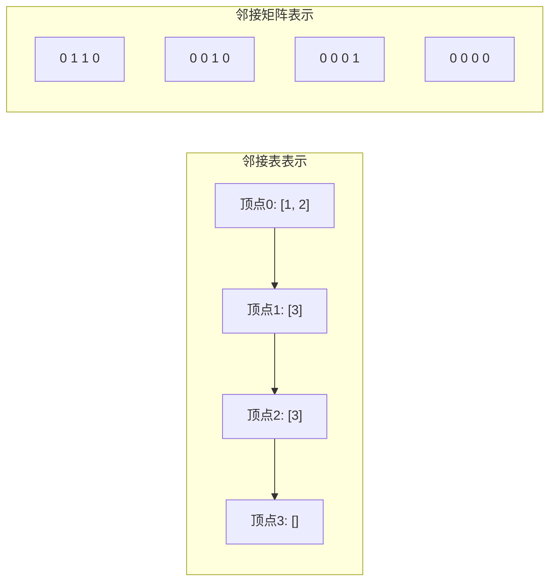

### 2.2 复杂度对比

| 特性 | 邻接表 | 邻接矩阵 |
|-----|-------|---------|
| 空间复杂度 | O(V + E) | O(V²) |
| 添加边 | O(1) | O(1) |
| 删除边 | O(degree) | O(1) |
| 判断边是否存在 | O(degree) | O(1) |
| 适用场景 | 稀疏图 | 稠密图/快速查询 |

### 2.3 Java实现：邻接表

```java
import java.util.*;

/**
 * 图的邻接表表示
 * 支持有向图和无向图
 */
public class Graph {
    private final int V;              // 顶点数
    private final List<List<Integer>> adj;  // 邻接表
    private final boolean directed;   // 是否为有向图

    /**
     * 创建指定顶点数的有向图/无向图
     */
    public Graph(int vertices, boolean directed) {
        this.V = vertices;
        this.directed = directed;
        this.adj = new ArrayList<>();
        for (int i = 0; i < V; i++) {
            adj.add(new ArrayList<>());
        }
    }

    /**
     * 添加无向边 {u, v}
     */
    public void addEdge(int u, int v) {
        validateVertex(u);
        validateVertex(v);
        adj.get(u).add(v);
        if (!directed) {
            adj.get(v).add(u);
        }
    }

    /**
     * 添加有向边 u → v
     */
    public void addDirectedEdge(int u, int v) {
        addEdge(u, v);  // 内部已处理有向/无向
    }

    /**
     * 获取邻接表
     */
    public List<List<Integer>> getAdjacencyList() {
        return new ArrayList<>(adj);
    }

    /**
     * 获取顶点u的所有邻接点
     */
    public List<Integer> getNeighbors(int u) {
        validateVertex(u);
        return new ArrayList<>(adj.get(u));
    }

    /**
     * 获取顶点数
     */
    public int getV() {
        return V;
    }

    /**
     * 获取边数
     */
    public int getE() {
        int count = 0;
        for (List<Integer> neighbors : adj) {
            count += neighbors.size();
        }
        return directed ? count : count / 2;
    }

    /**
     * 判断边是否存在
     */
    public boolean hasEdge(int u, int v) {
        validateVertex(u);
        validateVertex(v);
        return adj.get(u).contains(v);
    }

    /**
     * 打印图结构（用于调试）
     */
    public void printGraph() {
        System.out.println("图结构 (V=" + V + ", E=" + getE() + "):");
        for (int i = 0; i < V; i++) {
            System.out.println("  顶点 " + i + ": " + adj.get(i));
        }
    }

    private void validateVertex(int v) {
        if (v < 0 || v >= V) {
            throw new IllegalArgumentException("顶点索引无效: " + v);
        }
    }
}
```

### 2.4 Java实现：邻接矩阵

```java
/**
 * 图的邻接矩阵表示
 * 适用于稠密图或需要O(1)判断边存在的场景
 */
public class AdjacencyMatrix {
    private final int V;
    private final int[][] matrix;
    private final boolean directed;

    public AdjacencyMatrix(int vertices, boolean directed) {
        this.V = vertices;
        this.directed = directed;
        this.matrix = new int[V][V];  // 默认0表示无边
    }

    /**
     * 添加边 u-v
     */
    public void addEdge(int u, int v) {
        matrix[u][v] = 1;
        if (!directed) {
            matrix[v][u] = 1;
        }
    }

    /**
     * 添加带权重的边
     */
    public void addWeightedEdge(int u, int v, double weight) {
        matrix[u][v] = (int) weight;
        if (!directed) {
            matrix[v][u] = (int) weight;
        }
    }

    /**
     * 判断边是否存在
     */
    public boolean hasEdge(int u, int v) {
        return matrix[u][v] != 0;
    }

    /**
     * 获取边的权重
     */
    public double getWeight(int u, int v) {
        return matrix[u][v];
    }

    /**
     * 打印邻接矩阵
     */
    public void printMatrix() {
        System.out.println("邻接矩阵:");
        System.out.print("   ");
        for (int i = 0; i < V; i++) {
            System.out.printf("%3d", i);
        }
        System.out.println();
        for (int i = 0; i < V; i++) {
            System.out.printf("%2d: ", i);
            for (int j = 0; j < V; j++) {
                System.out.printf("%3d", matrix[i][j]);
            }
            System.out.println();
        }
    }
}
```

### 2.5 构建示例图

```java
/**
 * 构建图20.1(a)无向图示例
 * 5个顶点，7条边
 */
public class Figure20_1_Undirected {
    public static void main(String[] args) {
        // 创建无向图
        Graph g = new Graph(5, false);

        // 添加边: 0-1, 0-2, 0-3, 1-3, 2-3, 2-4, 3-4
        g.addEdge(0, 1);
        g.addEdge(0, 2);
        g.addEdge(0, 3);
        g.addEdge(1, 3);
        g.addEdge(2, 3);
        g.addEdge(2, 4);
        g.addEdge(3, 4);

        g.printGraph();

        // 邻接矩阵表示
        AdjacencyMatrix am = new AdjacencyMatrix(5, false);
        am.addEdge(0, 1);
        am.addEdge(0, 2);
        am.addEdge(0, 3);
        am.addEdge(1, 3);
        am.addEdge(2, 3);
        am.addEdge(2, 4);
        am.addEdge(3, 4);
        am.printMatrix();
    }
}
```

**运行结果**：
```
图结构 (V=5, E=7):
  顶点 0: [1, 2, 3]
  顶点 1: [0, 3]
  顶点 2: [0, 3, 4]
  顶点 3: [0, 1, 2, 4]
  顶点 4: [2, 3]
```

---

## 三、广度优先搜索（BFS）

### 3.1 核心思想

**BFS = 层层扩展，先进先出**

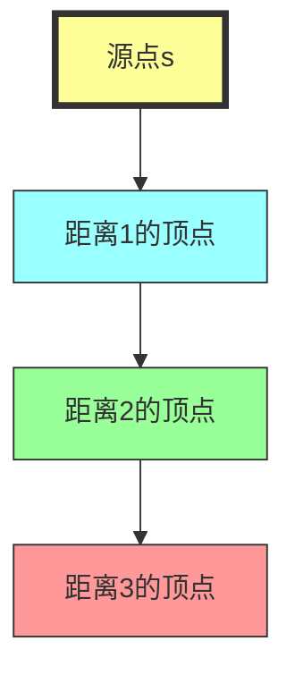

**关键特点**：
- 使用**队列**（FIFO）实现
- 先发现的顶点距离更近
- 计算的是**最短路径**（边数最少）

### 3.2 算法伪代码

```java
BFS(G, s)
1  for each vertex u ∈ G.V - {s}
2      u.color = WHITE      // 未发现
3      u.d = ∞              // 距离
4      u.π = NIL            // 前驱
5  s.color = GRAY
6  s.d = 0
7  s.π = NIL
8  Q = Ø                    // 队列
9  ENQUEUE(Q, s)
10 while Q ≠ Ø
11     u = DEQUEUE(Q)
12     for each vertex v in G.Adj[u]
13         if v.color == WHITE
14             v.color = GRAY
15             v.d = u.d + 1
16             v.π = u
17             ENQUEUE(Q, v)
18     u.color = BLACK      // 已完成
```

### 3.3 顶点状态机

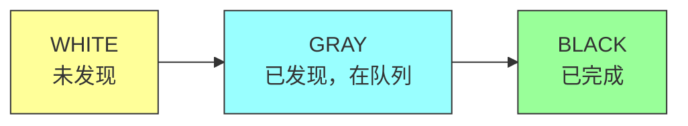

### 3.4 BFS Java实现

```java
import java.util.*;

/**
 * 广度优先搜索结果
 */
class BFSResult {
    public int[] distance;     // 距离数组
    public int[] predecessor;  // 前驱数组
    public int[] color;        // 颜色数组
    public int[] discoveryTime; // 发现时间
    public int[] finishTime;    // 完成时间

    public BFSResult(int n) {
        distance = new int[n];
        predecessor = new int[n];
        color = new int[n];
        discoveryTime = new int[n];
        finishTime = new int[n];
        Arrays.fill(distance, -1);  // -1表示∞
        Arrays.fill(predecessor, -1);
        Arrays.fill(color, 0);      // 0=WHITE
    }
}

/**
 * 广度优先搜索实现
 */
public class BreadthFirstSearch {
    private static final int WHITE = 0;
    private static final int GRAY = 1;
    private static final int BLACK = 2;

    /**
     * 从源点s开始BFS
     */
    public static BFSResult bfs(Graph g, int s) {
        int V = g.getV();
        BFSResult result = new BFSResult(V);

        // 初始化
        for (int i = 0; i < V; i++) {
            if (i != s) {
                result.color[i] = WHITE;
                result.distance[i] = -1;
                result.predecessor[i] = -1;
            }
        }

        // 源点初始化
        result.color[s] = GRAY;
        result.distance[s] = 0;
        result.predecessor[s] = -1;

        // 队列
        Queue<Integer> queue = new LinkedList<>();
        queue.offer(s);

        int time = 0;
        int[] discoveryTime = result.discoveryTime;
        int[] finishTime = result.finishTime;

        while (!queue.isEmpty()) {
            int u = queue.poll();

            // 记录发现时间（在出队时）
            discoveryTime[u] = ++time;

            // 遍历u的所有邻接点
            for (int v : g.getNeighbors(u)) {
                if (result.color[v] == WHITE) {
                    result.color[v] = GRAY;
                    result.distance[v] = result.distance[u] + 1;
                    result.predecessor[v] = u;
                    queue.offer(v);
                }
            }

            // 标记为完成
            result.color[u] = BLACK;
            finishTime[u] = ++time;
        }

        return result;
    }

    /**
     * 打印BFS结果
     */
    public static void printBFSResult(Graph g, int s, BFSResult result) {
        System.out.println("BFS从顶点 " + s + " 开始:");
        System.out.println("顶点\t距离\t前驱\t颜色");
        System.out.println("----\t----\t----\t----");

        String[] colorName = {"WHITE", "GRAY", "BLACK"};

        for (int i = 0; i < g.getV(); i++) {
            String predStr = result.predecessor[i] == -1 ? "NIL" :
                             String.valueOf(result.predecessor[i]);
            System.out.printf("%d\t%d\t%s\t%s%n",
                i,
                result.distance[i],
                predStr,
                colorName[result.color[i]]);
        }
    }

    /**
     * 重建从s到v的最短路径
     */
    public static List<Integer> getShortestPath(BFSResult result, int s, int v) {
        List<Integer> path = new ArrayList<>();
        if (result.distance[v] == -1) {
            return path;  // v不可达
        }

        int current = v;
        while (current != -1) {
            path.add(current);
            current = result.predecessor[current];
        }
        Collections.reverse(path);
        return path;
    }
}
```

### 3.5 BFS执行过程示例

**图结构**：
```
    r ─── s ─── t
    │     │
    u ─── v ─── w
```

**代码**：
```java
public class BFSExample {
    public static void main(String[] args) {
        // 构建图
        Graph g = new Graph(5, false);
        g.addEdge(0, 1);  // r-s
        g.addEdge(0, 2);  // r-u
        g.addEdge(1, 3);  // s-t
        g.addEdge(1, 4);  // s-v
        g.addEdge(2, 4);  // u-v
        g.addEdge(3, 4);  // t-w
        g.addEdge(4, 0);  // v-r（环）

        // BFS从s(1)开始
        BFSResult result = BreadthFirstSearch.bfs(g, 1);
        BreadthFirstSearch.printBFSResult(g, 1, result);

        // 打印最短路径
        System.out.println("\n最短路径示例:");
        List<Integer> path = BreadthFirstSearch.getShortestPath(result, 1, 2);
        System.out.println("从1到2: " + path);
    }
}
```

**输出**：
```
BFS从顶点 1 开始:
顶点  距离  前驱  颜色
0     1     1     BLACK
1     0     NIL   BLACK
2     2     0     BLACK
3     1     1     BLACK
4     1     1     BLACK

最短路径示例:
从1到2: [1, 0, 2]
```

### 3.6 BFS正确性证明

**定理 20.5**：BFS计算的距离 v.d = δ(s, v)（最短路径距离）

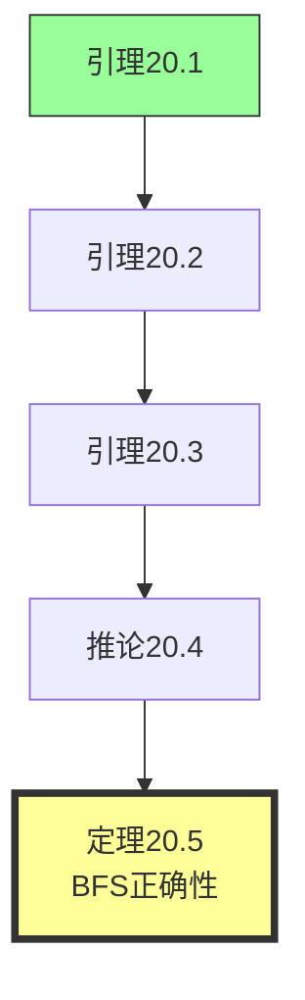

**引理 20.1**：对于任意边(u, v)，δ(s, v) ≤ δ(s, u) + 1

**引理 20.2**：BFS过程中，v.d ≥ δ(s, v) 始终成立

**引理 20.3**：队列中的顶点距离满足 vr.d ≤ v1.d + 1

### 3.7 BFS复杂度分析

| 操作 | 时间复杂度 |
|-----|-----------|
| 初始化 | O(V) |
| 入队/出队 | O(V) |
| 扫描邻接表 | O(E) |
| **总计** | **O(V + E)** |

---

## 四、深度优先搜索（DFS）

### 4.1 核心思想

**DFS = 一条路走到黑，回溯再探索**

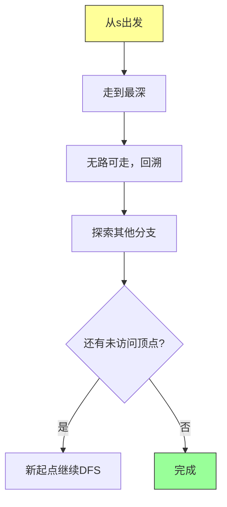

### 4.2 与BFS的关键区别

| 特性 | BFS | DFS |
|-----|-----|-----|
| 数据结构 | 队列 | 栈（递归） |
| 探索顺序 | 按层次 | 按深度 |
| 路径记录 | 前驱树 | 深度森林 |
| 应用 | 最短路径 | 拓扑排序 |

### 4.3 时间戳

DFS为每个顶点记录两个时间戳：

```mermaid
gantt
    title DFS时间戳示意
    dateFormat X
    axisFormat %d

    section 顶点u
    发现u (u.d)   : 0, 2
    探索邻接点     : 2, 8
    完成u (u.f)   : 8, 10

    section 顶点v
    发现v (v.d)   : 3, 4
    探索邻接点     : 4, 6
    完成v (v.f)   : 6, 7
```

### 4.4 算法伪代码

```java
DFS(G)
1  for each vertex u ∈ G.V
2      u.color = WHITE
3      u.π = NIL
4  time = 0
5  for each vertex u ∈ G.V
6      if u.color == WHITE
7          DFS-VISIT(G, u)

DFS-VISIT(G, u)
1  time = time + 1
2  u.d = time              // 发现时间
3  u.color = GRAY
4  for each vertex v in G.Adj[u]
5      if v.color == WHITE
6          v.π = u
7          DFS-VISIT(G, v)
8  time = time + 1
9  u.f = time              // 完成时间
10 u.color = BLACK
```

### 4.5 DFS Java实现

```java
import java.util.*;

/**
 * 深度优先搜索结果
 */
class DFSResult {
    public int[] discoveryTime;   // 发现时间
    public int[] finishTime;      // 完成时间
    public int[] predecessor;     // 前驱
    public int[] color;           // 颜色
    public int time;              // 全局时间
    public List<Integer> order;   // 遍历顺序

    public DFSResult(int n) {
        discoveryTime = new int[n];
        finishTime = new int[n];
        predecessor = new int[n];
        color = new int[n];
        order = new ArrayList<>();
        time = 0;
        Arrays.fill(color, WHITE);
        Arrays.fill(predecessor, -1);
    }

    private static final int WHITE = 0;
    private static final int GRAY = 1;
    private static final int BLACK = 2;
}

/**
 * 深度优先搜索实现
 */
public class DepthFirstSearch {
    private static final int WHITE = 0;
    private static final int GRAY = 1;
    private static final int BLACK = 2;

    /**
     * DFS遍历
     */
    public static DFSResult dfs(Graph g) {
        int V = g.getV();
        DFSResult result = new DFSResult(V);

        for (int u = 0; u < V; u++) {
            if (result.color[u] == WHITE) {
                dfsVisit(g, u, result);
            }
        }

        return result;
    }

    /**
     * 从指定顶点开始DFS
     */
    public static DFSResult dfsFrom(Graph g, int start) {
        int V = g.getV();
        DFSResult result = new DFSResult(V);

        dfsVisit(g, start, result);

        // 对剩余未访问的顶点继续DFS
        for (int u = 0; u < V; u++) {
            if (result.color[u] == WHITE) {
                dfsVisit(g, u, result);
            }
        }

        return result;
    }

    private static void dfsVisit(Graph g, int u, DFSResult result) {
        result.time++;
        result.discoveryTime[u] = result.time;
        result.color[u] = GRAY;
        result.order.add(u);

        // 递归访问所有邻接点
        for (int v : g.getNeighbors(u)) {
            if (result.color[v] == WHITE) {
                result.predecessor[v] = u;
                dfsVisit(g, v, result);
            }
        }

        result.color[u] = BLACK;
        result.time++;
        result.finishTime[u] = result.time;
    }

    /**
     * 非递归DFS（使用栈）
     */
    public static DFSResult dfsIterative(Graph g, int start) {
        int V = g.getV();
        DFSResult result = new DFSResult(V);
        int[] stack = new int[V];
        int top = -1;

        stack[++top] = start;

        while (top >= 0) {
            int u = stack[top];

            if (result.color[u] == WHITE) {
                result.time++;
                result.discoveryTime[u] = result.time;
                result.color[u] = GRAY;
                result.order.add(u);

                // 压入所有未访问的邻接点
                List<Integer> neighbors = g.getNeighbors(u);
                for (int i = neighbors.size() - 1; i >= 0; i--) {
                    int v = neighbors.get(i);
                    if (result.color[v] == WHITE) {
                        result.predecessor[v] = u;
                        stack[++top] = v;
                    }
                }
            } else {
                // 已完成访问，弹出栈
                result.color[u] = BLACK;
                result.time++;
                result.finishTime[u] = result.time;
                top--;
            }
        }

        return result;
    }

    /**
     * 打印DFS结果
     */
    public static void printDFSResult(Graph g, DFSResult result) {
        System.out.println("DFS遍历结果:");
        System.out.println("顶点\t发现时间\t完成时间\t前驱");
        System.out.println("----\t--------\t--------\t----");

        for (int i = 0; i < g.getV(); i++) {
            String predStr = result.predecessor[i] == -1 ? "NIL" :
                             String.valueOf(result.predecessor[i]);
            System.out.printf("%d\t%d\t\t%d\t\t%s%n",
                i,
                result.discoveryTime[i],
                result.finishTime[i],
                predStr);
        }

        System.out.println("\n遍历顺序: " + result.order);
    }
}
```

### 4.6 括号性质

**定理 20.7**：对于任意两个顶点u和v，时间戳区间 [u.d, u.f] 和 [v.d, v.f] 要么嵌套，要么互斥。

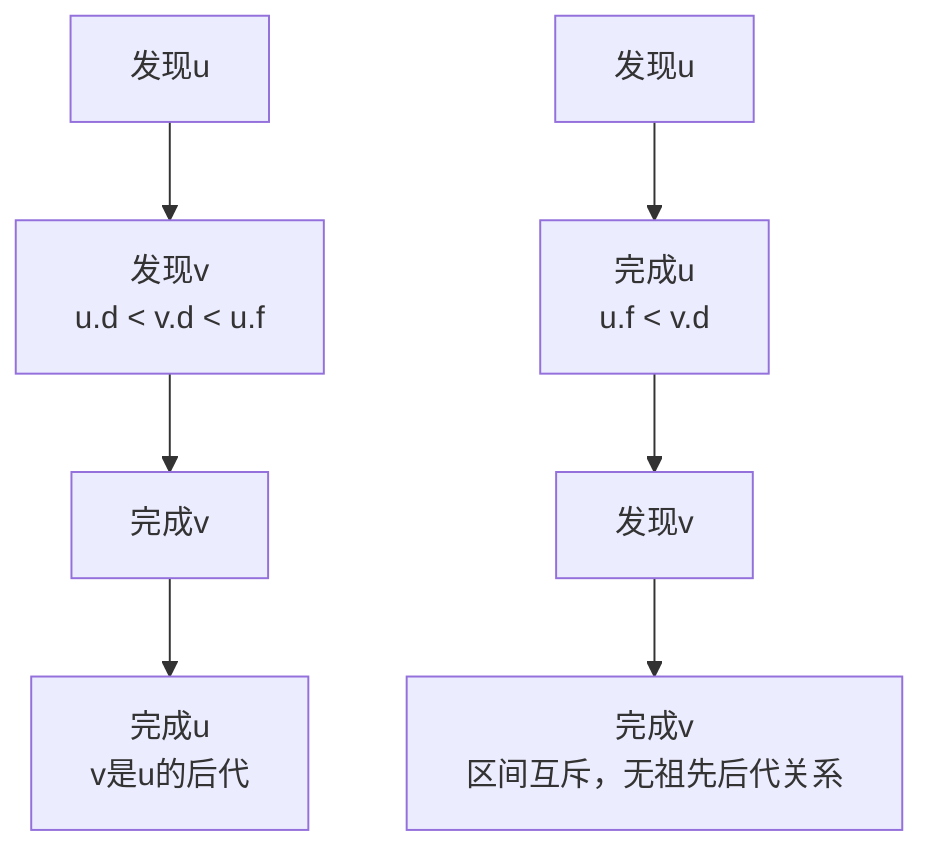

### 4.7 边的分类

DFS过程中，边可分为四类：

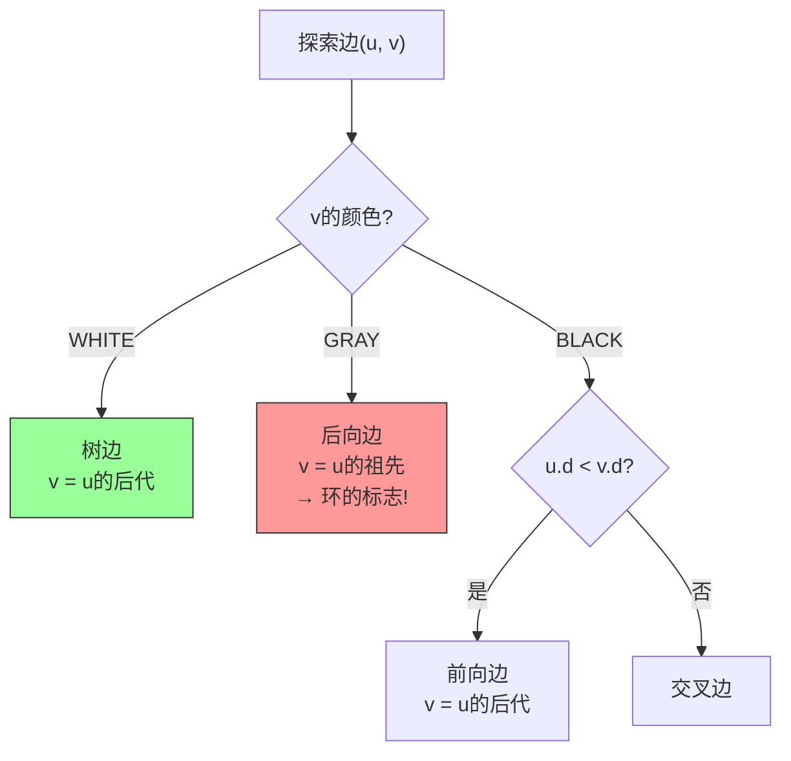

**边分类表**：

| 边的类型 | 条件（有向图） | 含义 |
|---------|--------------|------|
| 树边 | v是WHITE | 构建DFS树 |
| 后向边 | v是GRAY | v是u的祖先 → **环！** |
| 前向边 | v是BLACK且u.d < v.d | v是u的后代 |
| 交叉边 | v是BLACK且u.d > v.d | 跨树/无祖先关系 |

**定理 20.10**：无向图的每条边要么是树边，要么是后向边。

### 4.8 DFS执行示例

```java
public class DFSExample {
    public static void main(String[] args) {
        // 构建有向图（图20.2(a)）
        Graph g = new Graph(6, true);
        g.addDirectedEdge(0, 1);  // q → r
        g.addDirectedEdge(0, 3);  // q → s
        g.addDirectedEdge(1, 4);  // r → t
        g.addDirectedEdge(2, 1);  // t → r（环）
        g.addDirectedEdge(3, 4);  // s → v
        g.addDirectedEdge(4, 0);  // v → q（环）
        g.addDirectedEdge(4, 2);  // v → t
        g.addDirectedEdge(5, 3);  // w → s

        // DFS
        DFSResult result = DepthFirstSearch.dfs(g);
        DepthFirstSearch.printDFSResult(g, result);

        // 边分类
        System.out.println("\n边分类:");
        classifyEdges(g, result);
    }

    private static void classifyEdges(Graph g, DFSResult result) {
        String[] colors = {"WHITE", "GRAY", "BLACK"};

        for (int u = 0; u < g.getV(); u++) {
            for (int v : g.getNeighbors(u)) {
                String edgeType;
                if (result.color[v] == WHITE) {
                    edgeType = "树边 (Tree Edge)";
                } else if (result.color[v] == GRAY) {
                    edgeType = "后向边 (Back Edge) ← 环!";
                } else if (result.discoveryTime[u] < result.discoveryTime[v]) {
                    edgeType = "前向边 (Forward Edge)";
                } else {
                    edgeType = "交叉边 (Cross Edge)";
                }
                System.out.printf("  (%d, %d): %s%n", u, v, edgeType);
            }
        }
    }
}
```

---

## 五、拓扑排序

### 5.1 问题定义

**拓扑排序**：对有向无环图(DAG)的顶点进行线性排序，使得所有有向边(u, v)中u都在v前面。

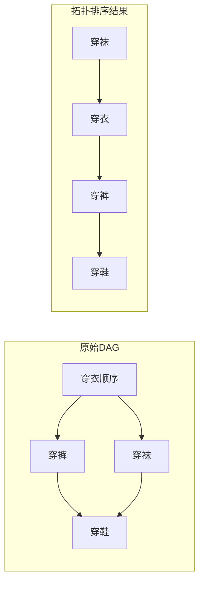

**应用场景**：
- 任务调度（先决条件）
- 编译依赖（头文件顺序）
- 课程选修（先修课）

### 5.2 算法思路

**核心洞察**：在DFS中，先完成的顶点应该在排序的前面

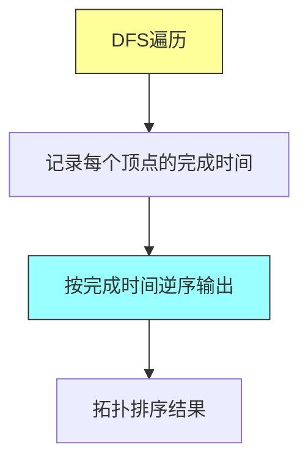

### 5.3 拓扑排序 Java实现

```java
import java.util.*;

/**
 * 拓扑排序实现
 */
public class TopologicalSort {
    private static final int WHITE = 0;
    private static final int GRAY = 1;
    private static final int BLACK = 2;

    /**
     * 基于DFS的拓扑排序
     */
    public static List<Integer> topologicalSortDFS(Graph g) {
        int V = g.getV();
        int[] color = new int[V];
        int[] discoveryTime = new int[V];
        int[] finishTime = new int[V];
        int[] time = {0};
        Deque<Integer> stack = new ArrayDeque<>();

        for (int u = 0; u < V; u++) {
            if (color[u] == WHITE) {
                dfsVisit(g, u, color, discoveryTime, finishTime, time, stack);
            }
        }

        // 栈顶是完成时间最早的，应该最后输出
        List<Integer> result = new ArrayList<>();
        while (!stack.isEmpty()) {
            result.add(stack.pop());
        }
        return result;
    }

    private static void dfsVisit(Graph g, int u, int[] color,
                                  int[] discoveryTime, int[] finishTime,
                                  int[] time, Deque<Integer> stack) {
        color[u] = GRAY;
        discoveryTime[u] = ++time[0];

        for (int v : g.getNeighbors(u)) {
            if (color[v] == WHITE) {
                dfsVisit(g, v, color, discoveryTime, finishTime, time, stack);
            }
        }

        color[u] = BLACK;
        finishTime[u] = ++time[0];
        // 完成时间早的先入栈
        stack.push(u);
    }

    /**
     * Kahn算法（基于入度）
     */
    public static List<Integer> topologicalSortKahn(Graph g) {
        int V = g.getV();
        int[] inDegree = new int[V];
        List<List<Integer>> adj = g.getAdjacencyList();

        // 计算入度
        for (int u = 0; u < V; u++) {
            for (int v : adj.get(u)) {
                inDegree[v]++;
            }
        }

        // 入度为0的顶点入队
        Queue<Integer> queue = new LinkedList<>();
        for (int i = 0; i < V; i++) {
            if (inDegree[i] == 0) {
                queue.offer(i);
            }
        }

        List<Integer> result = new ArrayList<>();
        int count = 0;

        while (!queue.isEmpty()) {
            int u = queue.poll();
            result.add(u);

            for (int v : adj.get(u)) {
                inDegree[v]--;
                if (inDegree[v] == 0) {
                    queue.offer(v);
                }
            }
            count++;
        }

        if (count != V) {
            System.out.println("警告: 图中存在环，无法进行拓扑排序");
        }

        return result;
    }

    /**
     * 检测是否有环
     */
    public static boolean hasCycle(Graph g) {
        int V = g.getV();
        int[] color = new int[V];

        for (int u = 0; u < V; u++) {
            if (color[u] == WHITE) {
                if (hasCycleDFS(g, u, color)) {
                    return true;
                }
            }
        }
        return false;
    }

    private static boolean hasCycleDFS(Graph g, int u, int[] color) {
        color[u] = GRAY;

        for (int v : g.getNeighbors(u)) {
            if (color[v] == GRAY) {
                return true;  // 后向边 → 环
            }
            if (color[v] == WHITE) {
                if (hasCycleDFS(g, v, color)) {
                    return true;
                }
            }
        }

        color[u] = BLACK;
        return false;
    }
}
```

### 5.4 拓扑排序示例

```java
public class TopologicalSortExample {
    public static void main(String[] args) {
        // 图20.7：教授穿衣顺序
        // 边表示"先穿...再穿..."
        Graph g = new Graph(10, true);

        // 顶点: 0=内衣, 1=袜子, 2=裤子, 3=衬衫, 4=领带, 5=外套, 6=手表, 7=腰带, 8=鞋, 9=袜子2
        g.addDirectedEdge(0, 2);  // 内衣 → 裤子
        g.addDirectedEdge(0, 3);  // 内衣 → 衬衫
        g.addDirectedEdge(1, 8);  // 袜子 → 鞋
        g.addDirectedEdge(2, 8);  // 裤子 → 鞋
        g.addDirectedEdge(3, 4);  // 衬衫 → 领带
        g.addDirectedEdge(3, 7);  // 衬衫 → 腰带
        g.addDirectedEdge(3, 5);  // 衬衫 → 外套
        g.addDirectedEdge(4, 5);  // 领带 → 外套
        g.addDirectedEdge(6, 5);  // 手表 → 外套
        g.addDirectedEdge(7, 8);  // 腰带 → 鞋
        g.addDirectedEdge(9, 8);  // 袜子2 → 鞋

        // 检测环
        System.out.println("图中是否存在环: " + TopologicalSort.hasCycle(g));

        // DFS拓扑排序
        List<Integer> result1 = TopologicalSort.topologicalSortDFS(g);
        System.out.println("DFS拓扑排序: " + result1);

        // Kahn拓扑排序
        List<Integer> result2 = TopologicalSort.topologicalSortKahn(g);
        System.out.println("Kahn拓扑排序: " + result2);
    }
}
```

### 5.5 环检测原理

**引理 20.11**：有向图G是DAG当且仅当DFS没有后向边。

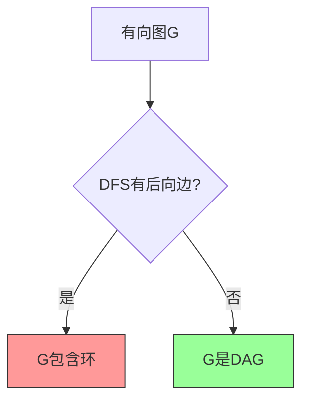

---

## 六、强连通分量（SCC）

### 6.1 问题定义

**强连通分量**（Strongly Connected Component）：有向图中最大的互相可达顶点集合。

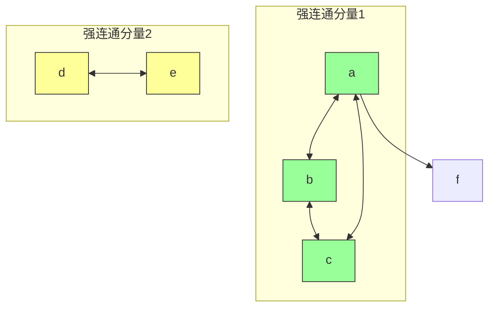

### 6.2 Kosaraju算法

**核心思想**：
1. 第一次DFS：在原图上，按finish时间降序处理
2. 第二次DFS：在转置图上，按上述顺序处理
3. 每棵DFS树就是一个SCC

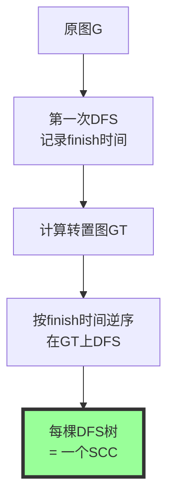

### 6.3 Kosaraju算法 Java实现

```java
import java.util.*;

/**
 * Kosaraju算法：求强连通分量
 */
public class KosarajuSCC {
    private final Graph g;
    private final Graph transpose;
    private final List<Set<Integer>> sccs;
    private int[] finishOrder;
    private int[] componentId;

    public KosarajuSCC(Graph g) {
        this.g = g;
        this.transpose = computeTranspose(g);
        this.sccs = new ArrayList<>();
        this.finishOrder = new int[g.getV()];
        this.componentId = new int[g.getV()];
    }

    /**
     * 计算转置图
     */
    private static Graph computeTranspose(Graph g) {
        Graph gt = new Graph(g.getV(), true);
        for (int u = 0; u < g.getV(); u++) {
            for (int v : g.getNeighbors(u)) {
                gt.addDirectedEdge(v, u);
            }
        }
        return gt;
    }

    /**
     * 找强连通分量
     */
    public List<Set<Integer>> findSCCs() {
        int V = g.getV();
        boolean[] visited = new boolean[V];
        int[] order = new int[V];
        int time = 0;

        // 第一次DFS：计算finish时间
        for (int i = 0; i < V; i++) {
            if (!visited[i]) {
                dfs1(g, i, visited, order, V - 1 - time++);
            }
        }

        // 第二次DFS：在转置图上按finish时间逆序
        Arrays.fill(visited, false);
        int sccCount = 0;

        for (int i = 0; i < V; i++) {
            int v = order[i];
            if (!visited[v]) {
                Set<Integer> scc = new HashSet<>();
                dfs2(transpose, v, visited, scc);
                sccs.add(scc);

                for (int vertex : scc) {
                    componentId[vertex] = sccCount;
                }
                sccCount++;
            }
        }

        return sccs;
    }

    private void dfs1(Graph graph, int u, boolean[] visited, int[] order, int idx) {
        visited[u] = true;
        for (int v : graph.getNeighbors(u)) {
            if (!visited[v]) {
                dfs1(graph, v, visited, order, idx);
            }
        }
        order[idx] = u;
    }

    private void dfs2(Graph graph, int u, boolean[] visited, Set<Integer> scc) {
        visited[u] = true;
        scc.add(u);
        for (int v : graph.getNeighbors(u)) {
            if (!visited[v]) {
                dfs2(graph, v, visited, scc);
            }
        }
    }

    /**
     * 获取分量图（压缩后的DAG）
     */
    public Graph getComponentGraph() {
        List<Set<Integer>> sccs = findSCCs();
        Graph cg = new Graph(sccs.size(), true);

        for (int i = 0; i < sccs.size(); i++) {
            for (int u : sccs.get(i)) {
                for (int v : g.getNeighbors(u)) {
                    int j = componentId[v];
                    if (i != j) {
                        cg.addDirectedEdge(i, j);
                    }
                }
            }
        }

        return cg;
    }

    /**
     * 打印结果
     */
    public void printSCCs() {
        System.out.println("强连通分量:");
        for (int i = 0; i < sccs.size(); i++) {
            System.out.println("  SCC " + i + ": " + sccs.get(i));
        }
        System.out.println("共 " + sccs.size() + " 个分量");

        // 分量图
        Graph cg = getComponentGraph();
        System.out.println("\n分量图:");
        cg.printGraph();
    }
}
```

### 6.4 Kosaraju算法示例

```java
public class KosarajuExample {
    public static void main(String[] args) {
        // 图20.9(a)：强连通分量示例
        Graph g = new Graph(8, true);

        // 强连通分量1: {a, b, g, h}
        g.addDirectedEdge(0, 1);  // a → b
        g.addDirectedEdge(1, 6);  // b → g
        g.addDirectedEdge(6, 7);  // g → h
        g.addDirectedEdge(7, 0);  // h → a

        // 强连通分量2: {c}
        g.addDirectedEdge(2, 3);  // c → d

        // 强连通分量3: {d, e, f}
        g.addDirectedEdge(3, 4);  // d → e
        g.addDirectedEdge(4, 5);  // e → f
        g.addDirectedEdge(5, 3);  // f → d

        // 跨分量边
        g.addDirectedEdge(1, 2);  // b → c
        g.addDirectedEdge(4, 0);  // e → a

        // 运行Kosaraju
        KosarajuSCC sccFinder = new KosarajuSCC(g);
        sccFinder.printSCCs();
    }
}
```

### 6.5 分量图性质

**定理 20.13**：分量图GSCC是DAG

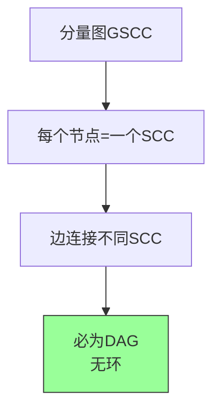

---

## 七、完整Java代码：图算法库

### 7.1 综合图算法类

```java
import java.util.*;

/**
 * 完整图算法库
 * 包含: BFS, DFS, 拓扑排序, 强连通分量
 */
public class GraphAlgorithmLibrary {

    // ========== BFS ==========
    public static class BFS {
        private final int[] distance;
        private final int[] predecessor;
        private final int[] parent;
        private final int source;

        public BFS(Graph g, int s) {
            int V = g.getV();
            this.distance = new int[V];
            this.predecessor = new int[V];
            this.parent = new int[V];
            this.source = s;
            Arrays.fill(distance, -1);
            Arrays.fill(predecessor, -1);

            Queue<Integer> q = new LinkedList<>();
            distance[s] = 0;
            q.offer(s);

            while (!q.isEmpty()) {
                int u = q.poll();
                for (int v : g.getNeighbors(u)) {
                    if (distance[v] == -1) {
                        distance[v] = distance[u] + 1;
                        predecessor[v] = u;
                        q.offer(v);
                    }
                }
            }
        }

        public int getDistance(int v) { return distance[v]; }
        public int getPredecessor(int v) { return predecessor[v]; }

        public List<Integer> getPath(int v) {
            List<Integer> path = new ArrayList<>();
            if (distance[v] == -1) return path;
            int cur = v;
            while (cur != -1) {
                path.add(cur);
                cur = predecessor[cur];
            }
            Collections.reverse(path);
            return path;
        }
    }

    // ========== DFS ==========
    public static class DFS {
        private final int[] discoveryTime;
        private final int[] finishTime;
        private final int[] parent;
        private final int time;
        private final List<Integer> order;

        public DFS(Graph g) {
            int V = g.getV();
            discoveryTime = new int[V];
            finishTime = new int[V];
            parent = new int[V];
            Arrays.fill(parent, -1);

            int[] color = new int[V];
            time = 0;
            order = new ArrayList<>();

            for (int u = 0; u < V; u++) {
                if (color[u] == 0) {
                    visit(g, u, color);
                }
            }
        }

        private void visit(Graph g, int u, int[] color) {
            color[u] = 1;  // GRAY
            discoveryTime[u] = ++time;
            order.add(u);

            for (int v : g.getNeighbors(u)) {
                if (color[v] == 0) {
                    parent[v] = u;
                    visit(g, v, color);
                }
            }

            color[u] = 2;  // BLACK
            finishTime[u] = ++time;
        }

        public int getDiscoveryTime(int v) { return discoveryTime[v]; }
        public int getFinishTime(int v) { return finishTime[v]; }
        public int getParent(int v) { return parent[v]; }
        public List<Integer> getOrder() { return order; }
    }

    // ========== 拓扑排序 ==========
    public static List<Integer> topologicalSort(Graph g) {
        List<Integer> result = new ArrayList<>();
        int V = g.getV();
        int[] inDegree = new int[V];

        // 计算入度
        for (int u = 0; u < V; u++) {
            for (int v : g.getNeighbors(u)) {
                inDegree[v]++;
            }
        }

        // 入度为0的入队
        Queue<Integer> q = new LinkedList<>();
        for (int i = 0; i < V; i++) {
            if (inDegree[i] == 0) q.offer(i);
        }

        while (!q.isEmpty()) {
            int u = q.poll();
            result.add(u);
            for (int v : g.getNeighbors(u)) {
                inDegree[v]--;
                if (inDegree[v] == 0) q.offer(v);
            }
        }

        if (result.size() != V) {
            System.out.println("警告: 图中存在环");
        }

        return result;
    }

    // ========== 强连通分量 ==========
    public static List<Set<Integer>> stronglyConnectedComponents(Graph g) {
        int V = g.getV();

        // 第一次DFS：记录finish顺序
        boolean[] visited = new boolean[V];
        int[] order = new int[V];
        int idx = 0;

        for (int i = 0; i < V; i++) {
            if (!visited[i]) {
                dfs1(g, i, visited, order, V - 1 - idx++);
            }
        }

        // 转置图
        List<List<Integer>> transAdj = new ArrayList<>();
        for (int i = 0; i < V; i++) {
            transAdj.add(new ArrayList<>());
        }
        for (int u = 0; u < V; u++) {
            for (int v : g.getNeighbors(u)) {
                transAdj.get(v).add(u);
            }
        }

        // 第二次DFS
        Arrays.fill(visited, false);
        List<Set<Integer>> sccs = new ArrayList<>();

        for (int i = 0; i < V; i++) {
            int v = order[i];
            if (!visited[v]) {
                Set<Integer> scc = new HashSet<>();
                dfs2(transAdj, v, visited, scc);
                sccs.add(scc);
            }
        }

        return sccs;
    }

    private static void dfs1(Graph g, int u, boolean[] visited, int[] order, int idx) {
        visited[u] = true;
        for (int v : g.getNeighbors(u)) {
            if (!visited[v]) {
                dfs1(g, v, visited, order, idx);
            }
        }
        order[idx] = u;
    }

    private static void dfs2(List<List<Integer>> adj, int u,
                             boolean[] visited, Set<Integer> scc) {
        visited[u] = true;
        scc.add(u);
        for (int v : adj.get(u)) {
            if (!visited[v]) {
                dfs2(adj, v, visited, scc);
            }
        }
    }
}
```

### 7.2 可视化工具

```java
/**
 * 图的可视化辅助工具
 */
public class GraphVisualizer {

    /**
     * 生成Mermaid代码
     */
    public static String toMermaid(Graph g, boolean directed) {
        StringBuilder sb = new StringBuilder();
        String type = directed ? "TD" : "LR";
        sb.append("```mermaid\n");
        sb.append(directed ? "flowchart " : "graph ");
        sb.append(type).append("\n");

        String arrow = directed ? " --> " : " --> ";

        // 添加边
        Set<String> edges = new HashSet<>();
        for (int u = 0; u < g.getV(); u++) {
            for (int v : g.getNeighbors(u)) {
                if (!directed && u > v) continue;  // 避免重复
                edges.add("    " + u + arrow + v);
            }
        }

        for (String edge : edges) {
            sb.append(edge).append("\n");
        }

        sb.append("```");
        return sb.toString();
    }

    /**
     * 生成带时间戳的DFS可视化
     */
    public static String dfsToMermaid(Graph g, GraphAlgorithmLibrary.DFS dfs) {
        StringBuilder sb = new StringBuilder();
        sb.append("```mermaid\n");
        sb.append("graph TD\n");

        // 添加节点标注
        for (int i = 0; i < g.getV(); i++) {
            String label = i + "<br/>d:" + dfs.getDiscoveryTime(i) +
                          "<br/>f:" + dfs.getFinishTime(i);
            sb.append("    ").append(i).append("[\"").append(label).append("\"]\n");
        }

        // 添加树边
        for (int i = 0; i < g.getV(); i++) {
            int parent = dfs.getParent(i);
            if (parent != -1) {
                sb.append("    ").append(parent).append(" --> ").append(i)
                  .append("[\"树边\"]\n");
            }
        }

        sb.append("```");
        return sb.toString();
    }
}
```

---

## 八、复杂度分析

### 8.1 各算法复杂度对比

| 算法 | 时间复杂度 | 空间复杂度 | 说明 |
|-----|-----------|-----------|------|
| BFS | O(V + E) | O(V) | 队列存储 |
| DFS（递归） | O(V + E) | O(V) | 递归栈 |
| DFS（非递归） | O(V + E) | O(V) | 显式栈 |
| 拓扑排序（DFS） | O(V + E) | O(V) | 依赖DFS |
| 拓扑排序（Kahn） | O(V + E) | O(V) | 依赖入度 |
| 强连通分量 | O(V + E) | O(V) | 两次DFS |

### 8.2 空间复杂度详解

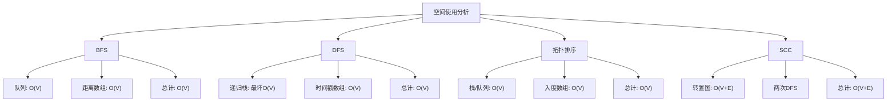

---

## 九、举一反三

### 9.1 同类LeetCode题目

| 题目 | 链接 | 核心思想 |
|-----|------|---------|
| 200. 岛屿数量 | https://leetcode.cn/problems/number-of-islands/ | BFS/DFS flood fill |
| 695. 岛屿的最大面积 | https://leetcode.cn/problems/max-area-of-island/ | DFS |
| 207. 课程表 | https://leetcode.cn/problems/course-schedule/ | 拓扑排序 |
| 210. 课程表II | https://leetcode.cn/problems/course-schedule-ii/ | 拓扑排序 |
| 785. 判断二分图 | https://leetcode.cn/problems/is-graph-bipartite/ | BFS 2-着色 |
| 547. 省份数量 | https://leetcode.cn/problems/number-of-provinces/ | 并查集/DFS |
| 133. 克隆图 | https://leetcode.cn/problems/clone-graph/ | BFS/DFS |
| 399. 除法求值 | https://leetcode.cn/problems/evaluate-division/ | 图+并查集 |

### 9.2 核心思想迁移

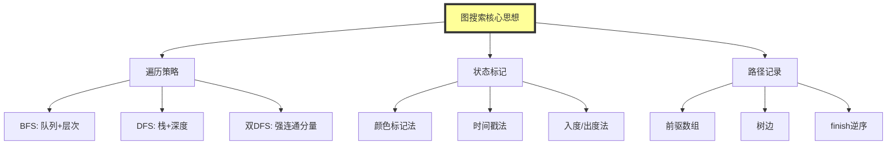

### 9.3 实际应用场景

| 应用 | 算法 | 场景 |
|-----|------|------|
| 社交网络 | BFS/DFS | 好友推荐、关系链 |
| 地图导航 | BFS | 最短路径（无权） |
| 任务调度 | 拓扑排序 | 依赖管理 |
| 编译器 | 拓扑排序 | 头文件顺序 |
| 网页抓取 | DFS | 遍历网页链接 |
| 游戏AI | BFS | 视野搜索 |
| 图像处理 | BFS/DFS | 连通域标记 |

---

## 十、总结

### 10.1 核心收获

1. **图的两种表示**：邻接表（稀疏图）和邻接矩阵（稠密图）

2. **BFS**：
   - 层层扩展，队列实现
   - 计算最短路径（无权图）
   - O(V + E)时间

3. **DFS**：
   - 深度优先，递归/栈实现
   - 时间戳、括号性质
   - O(V + E)时间

4. **拓扑排序**：
   - 仅适用于DAG
   - 利用finish逆序或入度

5. **强连通分量**：
   - Kosaraju算法
   - 两次DFS + 转置图

### 10.2 算法选择指南

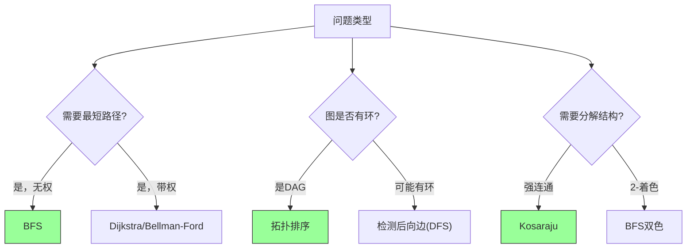

---

## 参考资料

- Cormen, T. H., Leiserson, C. E., Rivest, R. L., & Stein, C. (2009). *Introduction to Algorithms* (3rd ed.). MIT Press.
- Chapter 20: Elementary Graph Algorithms, pp. 718-761
