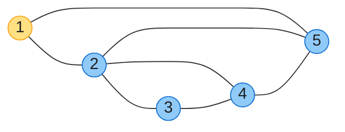
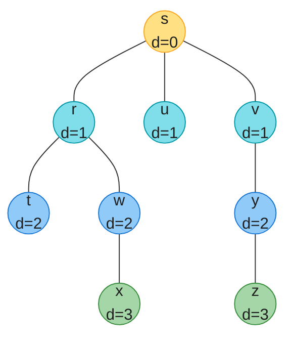
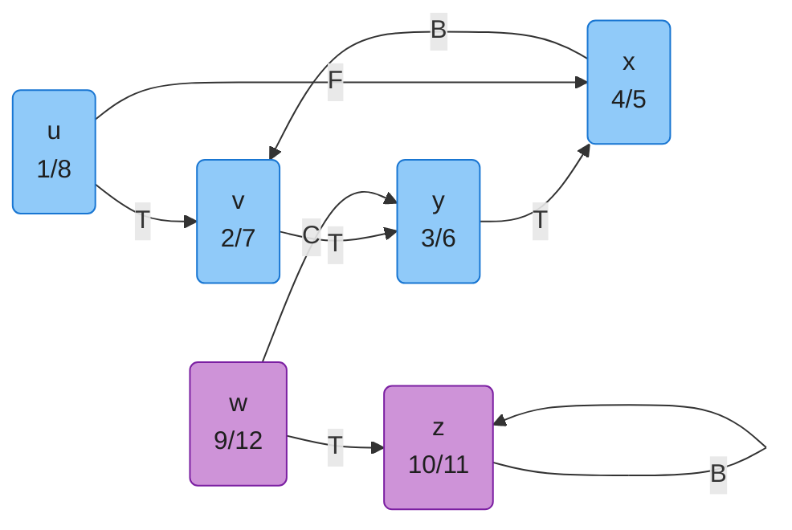
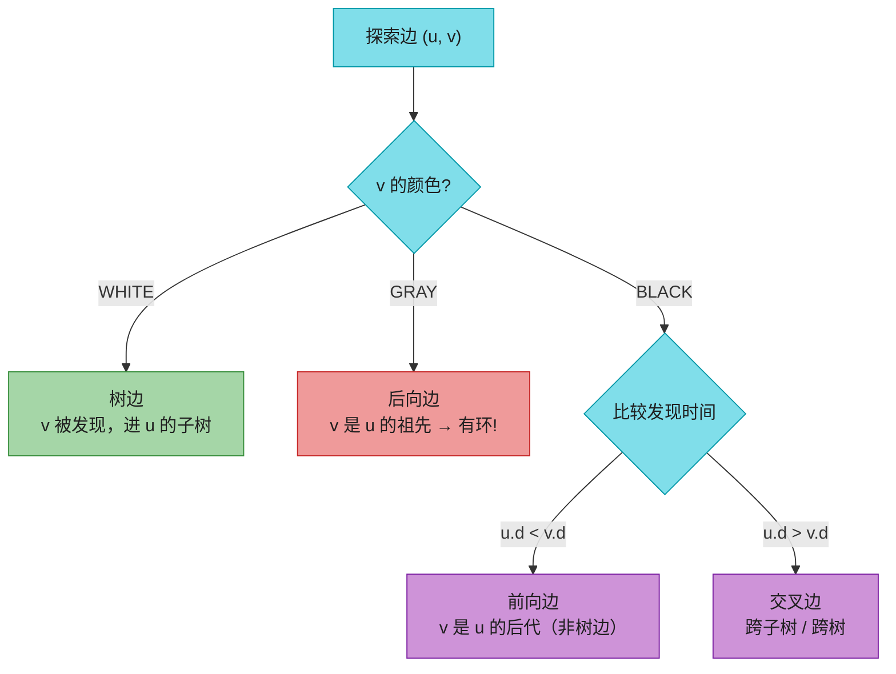
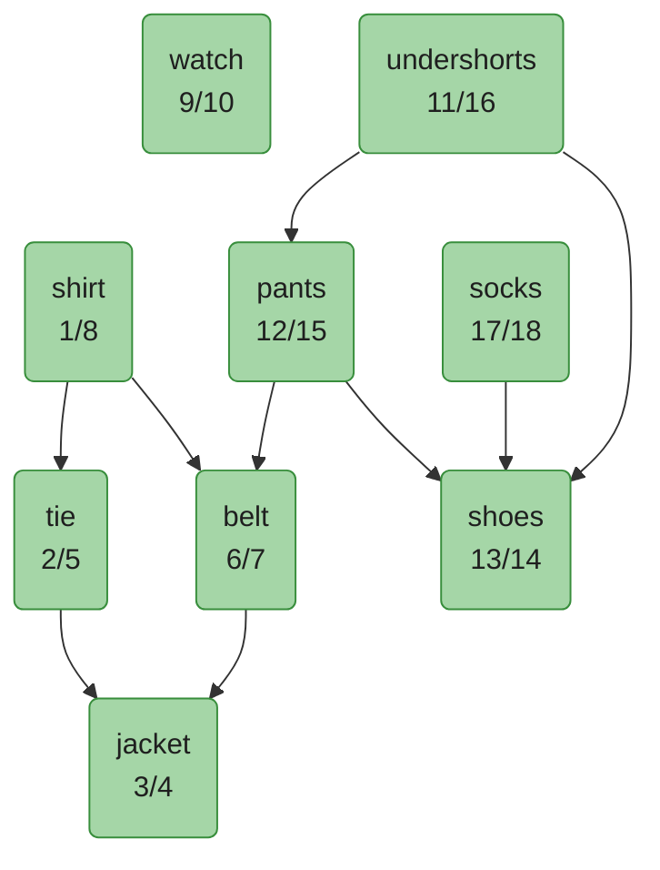
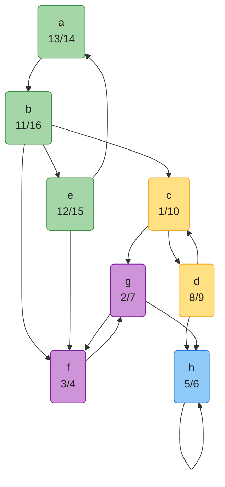
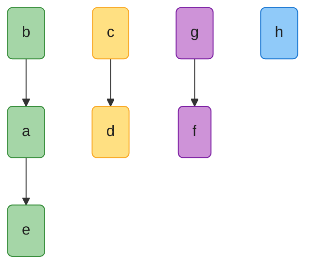
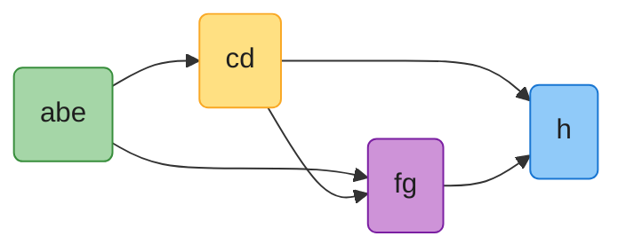

# 第 20 章：基本图算法（Elementary Graph Algorithms）——深度版

## 一、开篇定位

本章是**整个 Part VI（图算法）的基石**，回答两个问题：图怎么存（邻接表 / 邻接矩阵），图怎么搜（BFS / DFS）。后面五章全部建立在本章之上：

- **第 21 章最小生成树**（Prim）与**第 22 章单源最短路**（Dijkstra）的「波前扩展」思想直接来自 BFS，只是把队列换成优先队列；
- **拓扑排序**（20.4）与**强连通分量**（20.5）是 DFS 时间戳与边分类的两大经典应用；
- 第 19 章的不相交集合（并查集）能判无向图连通性，但涉及**方向**（可达、环、SCC）就必须靠本章的搜索。

做题定位：BFS/DFS 是 LeetCode 图题的绝对主力（200 岛屿、994 腐烂橘子、785 二分图），拓扑排序对应 207/210 课程表系列，SCC 直接题少但「缩点成 DAG」是难题常用手段。

**本章主线**：表示法 → BFS（按层搜，顺便拿到无权最短路径）→ DFS（按深搜，顺便拿到时间戳和边分类）→ 用 DFS 的两个成果分别解决拓扑排序与 SCC。

---

## 二、图的表示（20.1）

### 2.1 邻接表 vs 邻接矩阵

以原书 Figure 20.1(a) 的无向图为例（5 顶点 7 边）：



同一图的两种存法：

| 顶点 | 邻接表 Adj |  | 邻接矩阵第 u 行 |
|-----|-----------|---|----------------|
| 1 | 2, 5 |  | 0 1 0 0 1 |
| 2 | 1, 3, 4, 5 |  | 1 0 1 1 1 |
| 3 | 2, 4 |  | 0 1 0 1 0 |
| 4 | 2, 3, 5 |  | 0 1 1 0 1 |
| 5 | 1, 2, 4 |  | 1 1 0 1 0 |

| 特性 | 邻接表 | 邻接矩阵 |
|-----|-------|---------|
| 空间 | **Θ(V + E)** | **Θ(V²)** |
| 判断边 (u,v) 是否存在 | O(degree(u)) | **O(1)** |
| 遍历 u 的所有邻居 | O(degree(u)) | O(V) |
| 适用 | **稀疏图**（绝大多数算法默认） | 稠密图 / 频繁查边 |

要点：

- 有向图邻接表长度之和 = |E|；无向图 = 2|E|（边存两次）。
- 无向图的邻接矩阵**沿主对角线对称**（A = Aᵀ），可只存上三角省一半空间。
- 两种表示都能扩展带权图：邻接表在邻居旁存权重，矩阵直接存 w(u,v)。
- 顶点的属性（颜色、d、π）用**平行数组**存即可：`color[u]`、`d[u]`、`pi[u]`，不需要真的给顶点建对象。
- BFS/DFS 若改用邻接矩阵输入，时间从 Θ(V+E) 退化为 **Θ(V²)**（习题 20.2-4）。

> **转置图** G^T：把所有边 (u,v) 反向成 (v,u)。邻接表版 Θ(V+E)，矩阵版 = Aᵀ（习题 20.1-3）。20.5 节 SCC 要用它。

---

## 三、广度优先搜索 BFS（20.2）

### 3.1 直觉：一圈一圈扩散的波纹

从源点 s 出发，先发现距离 1 的所有顶点，再发现距离 2 的……像水面波纹。实现上只用**一个 FIFO 队列**：任意时刻队列里装着「一段距离 k 的顶点 + 一段距离 k+1 的顶点」，分界处就是搜索的**波前（frontier）**。

顶点三色（和 DFS 通用）：


### 3.2 伪代码（CLRS 1-indexed）

```
BFS(G, s)
1  for each vertex u ∈ G.V - {s}
2      u.color = WHITE
3      u.d = ∞                // 到 s 的距离
4      u.π = NIL              // 前驱
5  s.color = GRAY
6  s.d = 0
7  s.π = NIL
8  Q = ∅                      // FIFO 队列
9  ENQUEUE(Q, s)
10 while Q ≠ ∅
11     u = DEQUEUE(Q)
12     for each vertex v in G.Adj[u]    // 搜索 u 的邻居
13         if v.color == WHITE          // v 正被发现
14             v.color = GRAY
15             v.d = u.d + 1
16             v.π = u
17             ENQUEUE(Q, v)            // v 进入波前
18     u.color = BLACK                  // u 退出波前
```

### 3.3 一次完整 trace（对应 Figure 20.3 的搜索过程）

9 顶点的无向图，源点 s。分层着色（颜色 = 距离 s 的层数）：



队列演变（读法：每行是「出队一个顶点」后队列的样子）：

| 出队 | 队列（队头 → 队尾） | 本轮新发现（d 值） |
|-----|--------------------|-------------------|
| —   | **s** | s(0) |
| s   | r, u, v | r(1), u(1), v(1) |
| r   | u, v, t, w | t(2), w(2) |
| u   | v, t, w | — |
| v   | t, w, y | y(2) |
| t   | w, y | — |
| w   | y, x | x(3) |
| y   | x, z | z(3) |
| x   | z | — |
| z   | （空，结束） | — |

**观察**：队列里的 d 值永远形如 `1,1,1,2,2`——**一段 k 紧跟一段 k+1**（引理 20.3）。这正是 BFS 按距离分层的确证。

### 3.4 为什么 BFS 算的是最短路径

记 δ(s, v) 为 s 到 v 的最少边数（不可达为 ∞）。两个事实拼出正确性（定理 20.5：**v.d = δ(s, v)**）：

1. 沿任何边 (u, v) 都有 δ(s, v) ≤ δ(s, u) + 1（先最短路到 u 再多走一步），而 BFS 赋的正是 v.d = u.d + 1，所以 v.d 永远不会**小于**真实距离；
2. 队列中 d 值单调（上面的 k,…,k,k+1,…,k+1 形态），先出队的顶点距离不比后出队的大，所以没有任何顶点能拿到比「先到先服务」更小的 d。

前驱属性 π 构成**广度优先树**：从 s 到 v 沿 π 回溯，就是一条最短路径。打印路径一行递归：

```
PRINT-PATH(G, s, v)
1  if v == s
2      print s
3  elseif v.π == NIL
4      print "no path from s to v"
5  else PRINT-PATH(G, s, v.π)
6      print v
```

> BFS 树可能随邻接表顺序不同而不同，但 **d 值与顺序无关**（习题 20.2-5）。

### 3.5 复杂度

每个顶点最多入队/出队一次（WHITE 检查保证），队列操作共 O(V)；每条邻接表只在顶点出队时扫一遍，合计 O(E)。**总计 Θ(V + E)**——对邻接表表示是线性的。

LeetCode 标注：994 腐烂的橘子（多源 BFS：把所有初始腐烂橘子一起入队）、1091 二进制矩阵中的最短路径、127 单词接龙、785 判断二分图（BFS 二染色，即习题 20.2-7 摔跤手分组）。

---

## 四、深度优先搜索 DFS（20.3）

### 4.1 直觉：一条路走到黑，碰壁再回溯

DFS 总是从**最新发现**且还有未探索边的顶点继续深挖，走不动了才回退。与 BFS 的两点关键区别：

| | BFS | DFS |
|---|-----|-----|
| 数据源 | 单个源点 s | 主循环逐个顶点起搜 → 产出**森林**（多棵树） |
| 记录 | d（距离）、π | **d（发现时间）、f（完成时间）**、π |
| 数据结构 | 队列 | 递归（隐式栈） |
| 典型用途 | 无权最短路 | 结构分析：环、拓扑序、SCC |

时间戳是 DFS 的灵魂：全局时钟 time 从 0 起，每发现或完成一个顶点就 +1，所以 d、f 都是 1 到 2|V| 的整数，且 **u.d < u.f**。

### 4.2 伪代码（CLRS 1-indexed）

```
DFS(G)
1  for each vertex u ∈ G.V
2      u.color = WHITE
3      u.π = NIL
4  time = 0
5  for each vertex u ∈ G.V
6      if u.color == WHITE
7          DFS-VISIT(G, u)        // u 成为一棵新树的根

DFS-VISIT(G, u)
1  time = time + 1                // 刚发现 u
2  u.d = time
3  u.color = GRAY
4  for each vertex v in G.Adj[u]  // 逐条探索边 (u, v)
5      if v.color == WHITE
6          v.π = u
7          DFS-VISIT(G, v)
8  time = time + 1
9  u.f = time                     // u 完成
10 u.color = BLACK
```

### 4.3 一次完整 trace（Figure 20.4）

有向图，顶点 u,v,w,x,y,z，按字母序起搜。边上的字母是边分类（下一小节讲）：T=树边，B=后向边，F=前向边，C=交叉边。



（u~x 是一棵深度优先树，w~z 是另一棵。顶点标签为 d/f。）

### 4.4 括号定理：时间戳里藏着祖孙关系

**括号定理（定理 20.7）**：任意两个顶点 u、v，区间 [u.d, u.f] 与 [v.d, v.f] 只有三种关系：

1. **完全分离** —— 互不为祖先后代（在不同子树/树）；
2. **[u.d, u.f] 包含 [v.d, v.f]** —— v 是 u 的后代；
3. 反之亦然。

把「发现 u」想成打印 `(u`、「完成 u」想成打印 `u)`，整个 DFS 输出一个合法括号串。Figure 20.5 的例子（8 顶点）：

```
(s (z (y (x x) y) (w w) z) s) (t (v v) (u u) t)
 1  2  3  4   5 6  7   8 9 10  11 12  13 14  15 16
```

一行对应：s 的后代恰好是区间落在 (1,10) 内的 z、y、x、w；t 的子树是另一对括号。**嵌套 ⟺ 祖孙**（推论 20.8），判断「v 是不是 u 的后代」只需查 u.d < v.d < v.f < u.f。

**白路径定理（定理 20.9）**：v 成为 u 的后代 ⟺ 发现 u 的那一刻，存在一条从 u 到 v 的全白顶点路径。直觉：u 变灰时那条路上全是没碰过的顶点，DFS 顺藤摸瓜必把它们全收进 u 的子树。这条定理是后面 SCC 正确性的支点。

### 4.5 边的四分类

DFS 探索边 (u, v) 的瞬间，看 **v 当时的颜色**即可分类：



为什么 GRAY 就是祖先：灰色顶点始终是递归栈上从根到当前点的一条链，指向灰色顶点 = 指向栈上的祖先。

两个做题常用的推论：

- **有向图有环 ⟺ DFS 产生后向边**（引理 20.11）——环检测的理论基础（LeetCode 207）。
- **无向图的每条边非树边即后向边**（定理 20.10），没有前向/交叉边：无向边两个方向都在邻接表里，先扫到它的那个方向时另一端必然白（树边）或灰（后向边）。

> 时间戳判据（习题 20.3-5）：树边/前向边 ⟺ u.d < v.d < v.f < u.f；后向边 ⟺ v.d ≤ u.d < u.f ≤ v.f；交叉边 ⟺ v.d < v.f < u.d < u.f。**注意边分类必须在 DFS 过程中按当时颜色判定**——DFS 跑完全员 BLACK，事后看颜色什么也得不到。

---

## 五、拓扑排序（20.4）

### 5.1 问题与算法

**拓扑排序**：把 DAG（有向无环图）的顶点排成一行，使每条边 (u, v) 都满足 u 在 v 左边。任务调度、编译依赖、课程先修（LeetCode 207/210）都是它。

算法简单到出人意料：

```
TOPOLOGICAL-SORT(G)
1  call DFS(G) 计算每个顶点的完成时间 v.f
2  每个顶点完成时，插到链表头部
3  return 链表                // 即 finish 时间的降序
```

**正确性一句话**（定理 20.12）：对任意边 (u, v)，探索它时 v 不可能是灰色（否则 (u,v) 是后向边 → 有环，与 DAG 矛盾）；v 白则成为 u 的后代，v.f < u.f；v 黑则 v.f 已定而 u.f 尚未赋值，也有 v.f < u.f。所以**按 f 降序排，所有边都从左指向右**。

### 5.2 原书穿衣例（Figure 20.7）

Bumstead 教授穿衣：边 (u, v) 表示「u 必须先于 v」。顶点标注为 d/f。



按 f 降序排开（即 Figure 20.7(b)）——所有边一律从左到右：


（`~~~` 处表示两个顶点间无边，仅为排版连续。watch 与谁都不冲突，位置由 f 决定。）

### 5.3 Kahn 入度法（习题 20.4-5，实战更常用）

DFS 法假定输入是 DAG；**Kahn 算法**顺手就能判环，写业务代码时更稳：

1. 统计每个顶点入度，入度 0 者入队；
2. 反复：出队 u 并输出，u 的每个出边邻居入度减 1，减到 0 即入队；
3. 若输出顶点数 < |V|，说明剩下的顶点都卡在环上 → **图有环**。

LeetCode 标注：207 课程表（判环即可）、210 课程表 II（要输出序）、802 找到最终的安全状态（反向图 + 拓扑）、2192 节点的所有祖先、2050 并行课程 III（拓扑 + DP）。

---

## 六、强连通分量 SCC（20.5）

### 6.1 定义与分量图

**强连通分量**（SCC）：有向图中极大的顶点集 C，其中任意两点 u、v 互相可达（u⇝v 且 v⇝u）。

**转置图** G^T：所有边反向。G 与 G^T 的 SCC 完全相同（互达关系对称）。

把所有 SCC 各缩成一个点，得到**分量图 G^SCC**——它**必为 DAG**（引理 20.13：若分量间有环，环上的分量就合并成一个更大的 SCC 了，与极大性矛盾）。

### 6.2 Kosaraju-Sharir 算法：两遍 DFS

```
STRONGLY-CONNECTED-COMPONENTS(G)
1  call DFS(G) 计算每个顶点的完成时间 u.f
2  创建 G^T
3  call DFS(G^T)，但主循环按 u.f 降序选择根
4  第 3 步得到的每棵深度优先树 = 一个 SCC
```

**为什么对**（直觉版）：把每个 SCC 看成一个超级点，f(C) = 该分量里最大的 f。可以证明（引理 20.14 + 推论 20.15）：**f 最大的分量，在 G^T 中没有通向任何未访问分量的边**。于是第二遍 DFS 从 f 最大的顶点出发，在 G^T 里只能转遍自己那个分量，一步都「漏」不出去；每棵树恰好一个 SCC。换个角度：第二遍 DFS 相当于按**拓扑序**逐个收割分量图里的分量。

### 6.3 完整示例（Figure 20.9）

原图 G，顶点标注第一遍 DFS 的 d/f；同色区域为一个 SCC（{a,b,e} / {c,d} / {f,g} / {h}）：



第二遍：在 G^T 上按 f 降序（b, e, a, c, d, g, h, f）起搜，得到 4 棵树（树根即原书的橙色顶点 b、c、g、h）：



每棵树正好是一个 SCC。收缩后得分量图 G^SCC——一个 DAG：



> 注意：第一遍 DFS 的时间戳取决于主循环的顶点顺序，不同顺序得到不同的合法 d/f，但 **SCC 分组不变**。上面标注的是原书插图的时间戳。

SCC 的用途：把任意有向图「缩点」成 DAG 后，就能在 DAG 上做拓扑排序、DP 等。LeetCode 直接考 SCC 的题很少，近亲是 2360 图中的最长环（SCC 内找环）和 1192 查找关键连接（桥，即思考题 20-2 的 Tarjan 割点/桥算法思想）。

---

## 七、代码实现（Java + Python）

约定：伪代码是 1-indexed 的 CLRS 风格；实战代码统一 **0-indexed**，图直接用邻接表 `List<List<Integer>>` / `list[list[int]]`。**颜色可以用 d 值代替**（d=-1 即 WHITE，习题 20.2-3），代码里 BFS 就这么简化。以下代码已全部实际编译运行，并用原书 Figure 20.1/20.2/20.4/20.5/20.7/20.8/20.9 的 trace 逐一核对，另加 300 轮随机对拍（SCC vs 暴力互达、拓扑序逐边校验、BFS 距离 vs Floyd）。

### 7.1 Java

```java
import java.util.*;

// 邻接表表示；directed 决定加边是否双向
class Graph {
    final int V;
    final List<List<Integer>> adj;
    final boolean directed;

    Graph(int v, boolean directed) {
        this.V = v;
        this.directed = directed;
        adj = new ArrayList<>();
        for (int i = 0; i < v; i++) adj.add(new ArrayList<>());
    }

    void addEdge(int u, int w) {
        adj.get(u).add(w);
        if (!directed) adj.get(w).add(u);
    }

    List<Integer> neighbors(int u) { return adj.get(u); }

    // 转置图（习题 20.1-3），Θ(V+E)
    Graph transpose() {
        Graph gt = new Graph(V, true);
        for (int u = 0; u < V; u++)
            for (int w : adj.get(u)) gt.addEdge(w, u);
        return gt;
    }
}

public class GraphAlgos {
    static final int WHITE = 0, GRAY = 1, BLACK = 2;

    // ---------- BFS：返回 {d, pi}，不可达 d = -1 ----------
    static int[][] bfs(Graph g, int s) {
        int[] d = new int[g.V], pi = new int[g.V], color = new int[g.V];
        Arrays.fill(d, -1);
        Arrays.fill(pi, -1);
        color[s] = GRAY;
        d[s] = 0;
        Queue<Integer> q = new ArrayDeque<>();
        q.offer(s);
        while (!q.isEmpty()) {
            int u = q.poll();
            for (int v : g.neighbors(u)) {
                if (color[v] == WHITE) {
                    color[v] = GRAY;
                    d[v] = d[u] + 1;
                    pi[v] = u;
                    q.offer(v);
                }
            }
            color[u] = BLACK;
        }
        return new int[][]{d, pi};
    }

    // PRINT-PATH：沿 pi 还原 s 到 v 的最短路径；无路径返回空表
    static List<Integer> printPath(int[] pi, int s, int v) {
        List<Integer> path = new ArrayList<>();
        if (v == s) { path.add(s); return path; }
        if (pi[v] == -1) return path;
        path.addAll(printPath(pi, s, pi[v]));
        path.add(v);
        return path;
    }

    // ---------- DFS：返回 {d, f, pi} ----------
    static int time;
    static int[][] dfs(Graph g) {
        int[] d = new int[g.V], f = new int[g.V], pi = new int[g.V], color = new int[g.V];
        Arrays.fill(pi, -1);
        time = 0;
        for (int u = 0; u < g.V; u++)
            if (color[u] == WHITE) dfsVisit(g, u, color, d, f, pi);
        return new int[][]{d, f, pi};
    }

    static void dfsVisit(Graph g, int u, int[] color, int[] d, int[] f, int[] pi) {
        d[u] = ++time;
        color[u] = GRAY;
        for (int v : g.neighbors(u)) {
            if (color[v] == WHITE) {
                pi[v] = u;
                dfsVisit(g, v, color, d, f, pi);
            }
        }
        color[u] = BLACK;
        f[u] = ++time;
    }

    // ---------- 拓扑排序：DFS 法（finish 降序），假定输入为 DAG ----------
    static List<Integer> topoSortDfs(Graph g) {
        int[] color = new int[g.V];
        Deque<Integer> stack = new ArrayDeque<>();   // 完成即压栈
        for (int u = 0; u < g.V; u++)
            if (color[u] == WHITE) topoVisit(g, u, color, stack);
        return new ArrayList<>(stack);               // 迭代序 = 栈顶→栈底
    }

    static void topoVisit(Graph g, int u, int[] color, Deque<Integer> stack) {
        color[u] = GRAY;
        for (int v : g.neighbors(u))
            if (color[v] == WHITE) topoVisit(g, v, color, stack);
            // color[v] == GRAY ⇒ 后向边 ⇒ 有环（引理 20.11），本实现假定 DAG
        color[u] = BLACK;
        stack.push(u);
    }

    // ---------- 拓扑排序：Kahn 入度法（习题 20.4-5），顺便判环 ----------
    static List<Integer> topoSortKahn(Graph g) {
        int[] inDeg = new int[g.V];
        for (int u = 0; u < g.V; u++)
            for (int v : g.neighbors(u)) inDeg[v]++;
        Queue<Integer> q = new ArrayDeque<>();
        for (int i = 0; i < g.V; i++) if (inDeg[i] == 0) q.offer(i);
        List<Integer> order = new ArrayList<>();
        while (!q.isEmpty()) {
            int u = q.poll();
            order.add(u);
            for (int v : g.neighbors(u))
                if (--inDeg[v] == 0) q.offer(v);
        }
        if (order.size() != g.V) throw new IllegalStateException("图中有环");
        return order;
    }

    // ---------- SCC：Kosaraju-Sharir 两遍 DFS ----------
    static List<List<Integer>> scc(Graph g) {
        List<Integer> order = topoSortDfs(g);        // 第一遍：finish 降序
        Graph gt = g.transpose();
        int[] color = new int[g.V];
        List<List<Integer>> comps = new ArrayList<>();
        for (int u : order) {
            if (color[u] == WHITE) {
                List<Integer> comp = new ArrayList<>();
                collect(gt, u, color, comp);
                comps.add(comp);
            }
        }
        return comps;
    }

    static void collect(Graph g, int u, int[] color, List<Integer> comp) {
        color[u] = GRAY;
        comp.add(u);
        for (int v : g.neighbors(u))
            if (color[v] == WHITE) collect(g, v, color, comp);
    }
}
```

跑一遍原书图例的输出：

```
Fig20.1 BFS(源1)  d=[0, 1, 2, 2, 1]  路径1→3=[0, 1, 2]
Fig20.2 BFS(源3)  d=[-1, 3, 0, 2, 1, 1]  路径3→2=[2, 4, 3, 1]
Fig20.4 DFS  d=[1, 2, 9, 4, 3, 10]  f=[8, 7, 12, 5, 6, 11]   ← u1/8 v2/7 w9/12 x4/5 y3/6 z10/11
Fig20.5 DFS  d=[1, 11, 14, 12, 7, 4, 3, 2]  f=[10, 16, 15, 13, 8, 5, 6, 9]  ← s1/10 z2/9 y3/6 x4/5 w7/8 t11/16 …
Fig20.7 拓扑  [socks, undershorts, pants, shoes, watch, shirt, belt, tie, jacket]
Fig20.8 拓扑  [p, n, o, s, m, r, y, v, x, w, z, u, q, t]     ← 与习题 20.4-1 答案一致
Fig20.9 SCC   [[0,4,1], [2,3], [6,5], [7]]                   ← {a,b,e} {c,d} {f,g} {h}
随机对拍 300 轮全部通过（SCC vs 暴力 / 拓扑校验 / BFS vs Floyd）
```

### 7.2 Python

```python
from collections import deque
import sys

sys.setrecursionlimit(1000000)
WHITE, GRAY, BLACK = 0, 1, 2


def make_graph(n, edges, directed=True):
    g = [[] for _ in range(n)]
    for u, v in edges:
        g[u].append(v)
        if not directed:
            g[v].append(u)
    return g


def transpose(g):
    """转置图（习题 20.1-3），Θ(V+E)"""
    gt = [[] for _ in range(len(g))]
    for u in range(len(g)):
        for v in g[u]:
            gt[v].append(u)
    return gt


def bfs(g, s):
    """返回 (d, pi)；d[v] = 最短边数，不可达为 -1。d 兼作颜色（习题 20.2-3）"""
    n = len(g)
    d = [-1] * n
    pi = [-1] * n
    d[s] = 0
    q = deque([s])
    while q:
        u = q.popleft()
        for v in g[u]:
            if d[v] == -1:
                d[v] = d[u] + 1
                pi[v] = u
                q.append(v)
    return d, pi


def print_path(pi, s, v):
    """PRINT-PATH：沿 pi 还原最短路径；无路径返回 []"""
    if v == s:
        return [s]
    if pi[v] == -1:
        return []
    return print_path(pi, s, pi[v]) + [v]


def dfs(g):
    """返回 (d, f, pi)：发现/完成时间戳与前驱森林"""
    n = len(g)
    color = [WHITE] * n
    d, f, pi = [0] * n, [0] * n, [-1] * n
    time = 0

    def visit(u):
        nonlocal time
        time += 1
        d[u] = time
        color[u] = GRAY
        for v in g[u]:
            if color[v] == WHITE:
                pi[v] = u
                visit(v)
        color[u] = BLACK
        time += 1
        f[u] = time

    for u in range(n):
        if color[u] == WHITE:
            visit(u)
    return d, f, pi


def topo_sort_dfs(g):
    """DFS 法：完成时入栈，输出 finish 降序。假定 DAG。"""
    n = len(g)
    color = [WHITE] * n
    stack = []

    def visit(u):
        color[u] = GRAY
        for v in g[u]:
            if color[v] == WHITE:
                visit(v)
        color[u] = BLACK
        stack.append(u)

    for u in range(n):
        if color[u] == WHITE:
            visit(u)
    return stack[::-1]


def topo_sort_kahn(g):
    """Kahn 入度法（习题 20.4-5）；有环时抛异常"""
    n = len(g)
    in_deg = [0] * n
    for u in range(n):
        for v in g[u]:
            in_deg[v] += 1
    q = deque([u for u in range(n) if in_deg[u] == 0])
    order = []
    while q:
        u = q.popleft()
        order.append(u)
        for v in g[u]:
            in_deg[v] -= 1
            if in_deg[v] == 0:
                q.append(v)
    if len(order) != n:
        raise ValueError("图中有环，不存在拓扑序")
    return order


def scc(g):
    """Kosaraju-Sharir：G 上 DFS 得 finish 降序，再按该序在 G^T 上 DFS"""
    order = topo_sort_dfs(g)
    gt = transpose(g)
    color = [WHITE] * len(g)
    comps = []

    def collect(u, comp):
        color[u] = GRAY
        comp.append(u)
        for v in gt[u]:
            if color[v] == WHITE:
                collect(v, comp)

    for u in order:
        if color[u] == WHITE:
            comp = []
            collect(u, comp)
            comps.append(comp)
    return comps
```

Python 跑同一组图例，输出与 Java 完全一致（含 Figure 20.8 的 `p n o s m r y v x w z u q t` 和 Figure 20.9 的 `abe / cd / fg / h`）。

---

## 八、复杂度速查 + 易混点对比

### 8.1 速查表

| 算法 | 时间 | 额外空间 | 关键机制 |
|-----|------|---------|---------|
| 邻接表存储 | — | Θ(V + E) | 数组 + 链表/动态数组 |
| 邻接矩阵存储 | — | Θ(V²) | 无向图对称可存一半 |
| BFS | Θ(V + E) | Θ(V) | FIFO 队列；矩阵版退化为 Θ(V²) |
| DFS | Θ(V + E) | Θ(V) | 递归栈最深 Θ(V) |
| 拓扑排序（DFS 法） | Θ(V + E) | Θ(V) | finish 逆序 |
| 拓扑排序（Kahn） | Θ(V + E) | Θ(V) | 入度表 + 队列，顺便判环 |
| SCC（Kosaraju-Sharir） | Θ(V + E) | Θ(V + E) | 两遍 DFS + 转置图 |

### 8.2 易混点对比

| 易混点 | 辨析 |
|-------|-----|
| BFS 树 vs DFS 森林 | BFS 从单源出发只长一棵树；DFS 主循环可能起多个源 → 森林 |
| d 的两种含义 | BFS 的 `d` 是**距离**（最短边数）；DFS 的 `d` 是**发现时间戳**。同名不同义，别混 |
| 颜色的作用 | BFS 里灰色=「在队列中」；DFS 里灰色=「在递归栈上」。边分类的「GRAY ⇒ 后向边」只在 DFS 成立 |
| 边分类前提 | 四分（树/后向/前向/交叉）是**有向图**的；无向图只有树边和后向边（定理 20.10） |
| 拓扑序唯一吗 | 不唯一。DFS 法和 Kahn 法给出的一般不同，但都合法；穿衣例里 watch 与谁都无关，位置随 f 浮动 |
| SCC vs 连通分量 | 无向图谈「连通分量」（DFS/BFS/并查集一遍即可）；有向图才谈 SCC，必须两遍 DFS（或 Tarjan 一遍） |
| 判环的两条路 | 有向图：后向边（DFS）或 Kahn 输出数 < V；无向图：见到非父节点的已访问点即环（注意排除父边） |
| 邻接表顺序 | 影响 BFS 树形、DFS 时间戳和拓扑序的具体结果，但**不影响** BFS 的 d 值与 SCC 分组 |

---

## 九、LeetCode 题单 + 习题快问快答

### 9.1 LeetCode 题单

| 题号 | 题目 | 难度 | 考点 |
|-----|------|-----|------|
| 200 | 岛屿数量 | 中 | 网格 DFS/BFS flood fill |
| 695 | 岛屿的最大面积 | 中 | DFS 统计连通块大小 |
| 733 | 图像渲染 | 易 | flood fill 入门 |
| 547 | 省份数量 | 中 | 无向图连通分量（也可并查集，第 19 章） |
| 130 | 被围绕的区域 | 中 | 从边界反向 BFS/DFS |
| 994 | 腐烂的橘子 | 中 | **多源 BFS**：所有源头同时入队 |
| 1091 | 二进制矩阵中的最短路径 | 中 | BFS 求无权最短路 |
| 127 | 单词接龙 | 难 | 隐式图上 BFS |
| 133 | 克隆图 | 中 | 遍历 + 哈希表映射旧新节点 |
| 785 | 判断二分图 | 中 | BFS/DFS 二染色（= 习题 20.2-7） |
| 886 | 可能的二分法 | 中 | 同上 |
| 207 | 课程表 | 中 | 拓扑判环（后向边 or Kahn） |
| 210 | 课程表 II | 中 | 输出拓扑序 |
| 802 | 找到最终的安全状态 | 中 | 反向图 + 拓扑剥离 |
| 2192 | 有向无环图中节点的所有祖先 | 中 | 拓扑序上集合并 |
| 2050 | 并行课程 III | 难 | 拓扑 + DP 求最长链 |
| 2360 | 图中的最长环 | 难 | DFS 染色 / SCC 思想 |
| 1192 | 查找集群内的关键连接 | 难 | Tarjan 桥算法（思考题 20-2 的延伸） |

### 9.2 习题快问快答（第四版编号）

- **20.1-1** 邻接表算出度：读各表长度 Θ(V)；算入度：全表扫一遍统计出现次数 Θ(V + E)。
- **20.1-6** 全能汇点（in-degree |V|−1、out-degree 0）：矩阵上从 A[1][1] 出发，A[i][j]=1 则 i 排除、否则 j 排除，O(V) 缩到候选再验证一行一列。
- **20.2-3** BFS 的颜色其实一位就够，甚至可以删掉——`d ≠ ∞` 本身就标记了「已发现」。
- **20.2-4** 邻接矩阵版 BFS：每次扫一行 O(V)，总 O(V²)。
- **20.2-7** 摔跤手分好人/坏人 = 二分图判定：BFS 二染色，发现同色冲突即不可行（LeetCode 785）。
- **20.3-5** 边分类的时间戳判据：树/前向 ⟺ u.d < v.d < v.f < u.f；后向 ⟺ v.d ≤ u.d < u.f ≤ v.f；交叉 ⟺ v.d < v.f < u.d < u.f。
- **20.4-5** 「反复摘入度 0 的顶点」就是 Kahn 算法；若图有环，环上顶点入度永远 ≥ 1，算法提前清空队列、输出不足 |V| 个。
- **20.5-1** 加一条边后 SCC 数量：不变或减少（可能把多个分量连成一个大分量），永不增加。
- **20.5-3** Bacon 教授的改法（第二遍用**原图**、按 finish **升序**）是错的——反例：两顶点单边 a→b，finish 升序先从 a 出发会把 b 一起吃掉，误报一个 SCC。

### 9.3 思考题选

- **20-1 BFS 边分类**：无向图 BFS 无后向/前向边，树边满足 v.d = u.d + 1，交叉边满足 v.d = u.d 或 u.d + 1。
- **20-3 欧拉回路**：强连通有向图有欧拉回路 ⟺ 每个顶点入度 = 出度；构造用「边不相交环合并」，O(E)。
- **20-4 可达最小标号**：按 SCC 缩点后，在分量 DAG 上逆拓扑序 DP：`min(u) = min(L(u), 所有后继的 min)`。

### 9.4 章末注记

BFS 由 Moore（1959，迷宫寻路）发现，Lee（1961，电路板布线）独立再发现；DFS 自 1950 年代末就在 AI 程序里广泛使用，Hopcroft 与 Tarjan 倡导邻接表并挖掘了 DFS 的算法价值；本章的 SCC 算法归功 Kosaraju（未发表）与 Sharir，Tarjan 另有一个一遍 DFS 的版本；拓扑排序的第一个线性算法出自 Knuth。

---

## 参考资料

- Cormen, T. H., Leiserson, C. E., Rivest, R. L., & Stein, C. (2022). *Introduction to Algorithms* (4th ed.). MIT Press. Chapter 20: Elementary Graph Algorithms, pp. 549–584.
