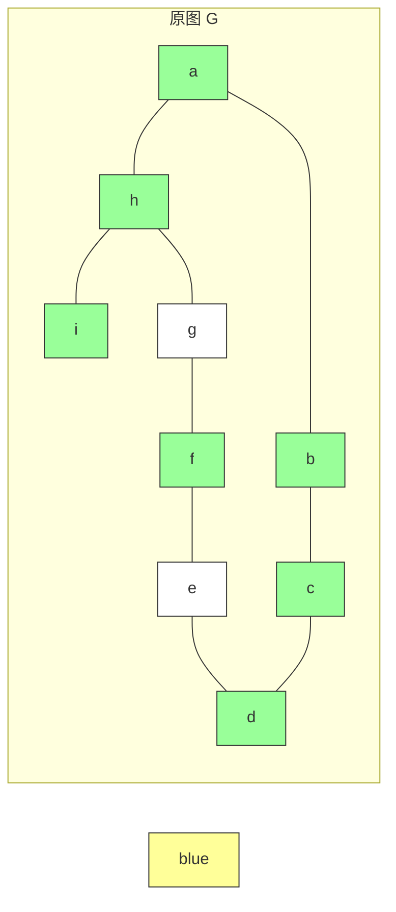
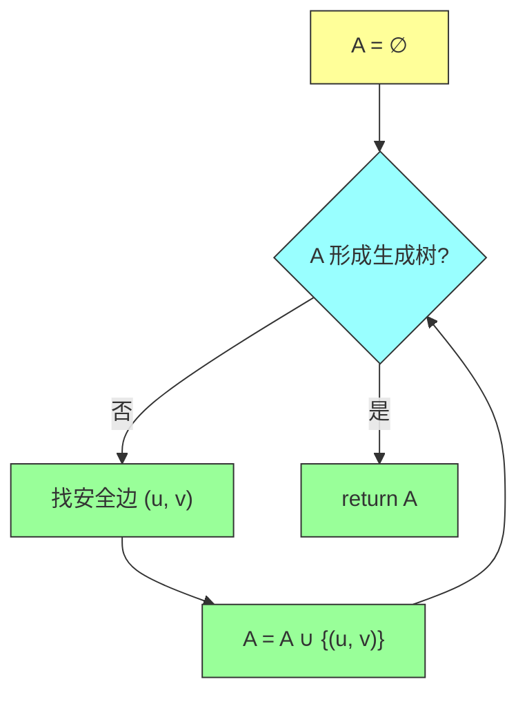
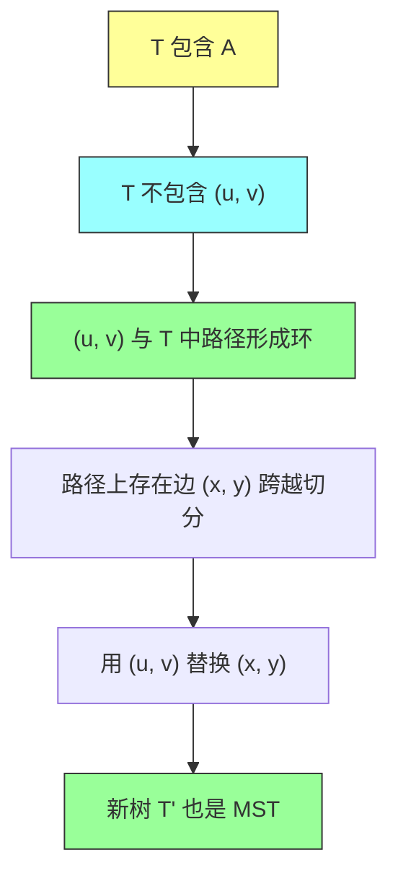
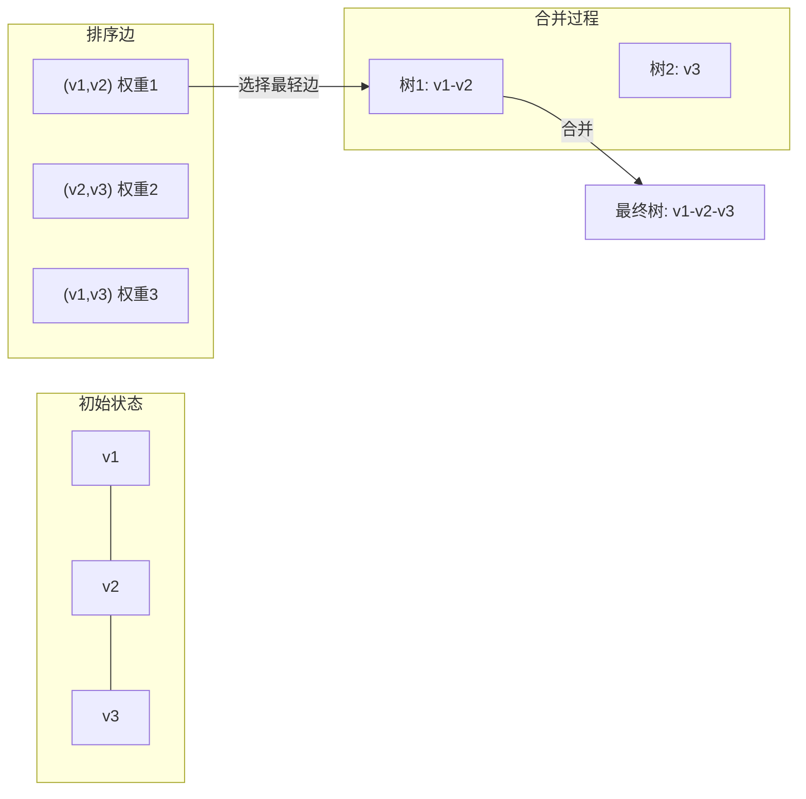
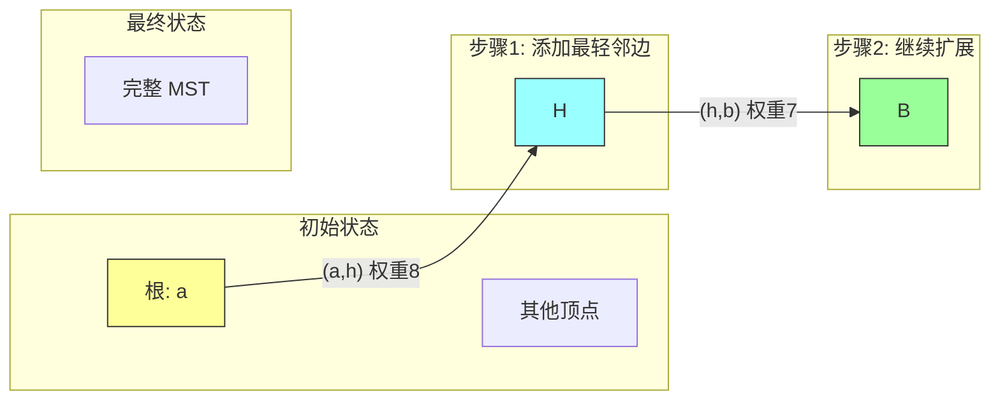

# 第二十一章：最小生成树（Minimum Spanning Trees）

## 一、问题描述

### 1.1 实际背景

电子电路设计中经常需要将多个组件的引脚通过导线连接起来使其等电位。为了连接 n 个引脚，设计者可以使用 n-1 根导线，每根导线连接两个引脚。在所有这些连接方案中，使用导线长度最短的方案通常是最理想的。

### 1.2 问题形式化

给定一个连通无向图 $G = (V, E)$，每条边 $(u, v) \in E$ 有一个权重 $w(u, v)$ 表示连接 u 和 v 所需的成本。目标是找到一个无环子集 $T \subseteq E$，使得：
- $T$ 连接 V 中的所有顶点
- $T$ 的总权重最小

由于 $T$ 无环且连接所有顶点，它必须是一棵树，我们称之为**生成树**（spanning tree），因为它"跨越"了整个图 $G$。我们称这个问题为**最小生成树问题**。

### 1.3 本章算法概览

| 算法 | 时间复杂度 | 数据结构 |
|-----|-----------|---------|
| Kruskal | $O(E \log E) = O(E \log V)$ | 并查集 |
| Prim（二叉堆） | $O(E \log V)$ | 优先队列 |
| Prim（斐波那契堆） | $O(E + V \log V)$ | 斐波那契堆 |

### 1.4 图示说明



**图 21.1** 连通图的最小生成树。边上的权重已显示，蓝色边构成最小生成树，总权重为 37。

---

## 二、通用 MST 方法

### 2.1 GENERIC-MST 框架

所有最小生成树算法都可以抽象为以下通用框架：



**伪代码**：

```
GENERIC-MST(G, w)
1  A = ∅
2  while A does not form a spanning tree
3      find an edge (u, v) that is safe for A
4      A = A ∪ {(u, v)}
5  return A
```

### 2.2 循环不变量

**初始化**：第 1 行后，A 显然满足循环不变量。

**维护**：第 2-4 行的循环通过只添加安全边来维护不变量。

**终止**：当 A 形成生成树时，循环终止。此时 A 包含 |V|-1 条边，且所有边都属于某棵最小生成树。

### 2.3 核心概念

**切分（Cut）**：图 $G = (V, E)$ 的一个切分 $(S, V-S)$ 是对 V 的一个划分。

**跨越切分**：边 $(u, v) \in E$ 跨越切分 $(S, V-S)$ 如果它的一个端点在 S，另一个在 V-S。

**尊重切分**：如果集合 A 中没有边跨越切分 $(S, V-S)$，则该切分尊重 A。

**轻边（Light Edge）**：跨越切分的边中权重最小的边称为轻边。

---

## 三、切分性质与安全边判定

### 3.1 核心定理

**定理 21.1（切分性质）**：

设 $G = (V, E)$ 是连通无向图，权重函数 $w: E \to \mathbb{R}$。设 A 是某棵最小生成树的子集，$(S, V-S)$ 是任意尊重 A 的切分，$(u, v)$ 是跨越该切分的轻边。则边 $(u, v)$ 对 A 是安全的。

### 3.2 定理证明

**证明思路**：用"切割-粘贴"技术构造新的最小生成树。



**详细步骤**：

1. 设 T 是包含 A 的最小生成树，且 T 不包含 $(u, v)$
2. 边 $(u, v)$ 与 T 中从 u 到 v 的简单路径 p 形成环
3. 由于 u 和 v 在切分 $(S, V-S)$ 的两侧，路径 p 上至少有一条边 $(x, y)$ 跨越该切分
4. 边 $(x, y) \notin A$（因为切分尊重 A）
5. 移除 $(x, y)$ 并添加 $(u, v)$ 得到新树 $T' = (T - \{(x, y)\}) \cup \{(u, v)\}$
6. 因为 $(u, v)$ 是轻边，$w(u, v) \leq w(x, y)$，所以 $w(T') \leq w(T)$
7. T 是最小生成树，所以 $w(T) \leq w(T')$，故 $T'$ 也是 MST
8. 因此 $(u, v)$ 对 A 安全

### 3.3 推论 21.2

设 C 是森林 $G_A = (V, A)$ 中的连通分量（树）。如果 $(u, v)$ 是连接 C 到另一分量的轻边，则 $(u, v)$ 对 A 安全。

**应用**：这个推论直接指导了 Kruskal 和 Prim 算法的具体实现。

---

## 四、Kruskal 算法

### 4.1 算法思想

Kruskal 算法维护一个**森林**，初始时有 |V| 棵单顶点树。每次选择连接**两棵不同树**的最小权重边，将其加入森林。



### 4.2 关键性质

**为什么贪心选择有效？**

1. 初始时每棵树是一个分量
2. 每次选择连接两个不同分量的最小边 $(u, v)$
3. 根据推论 21.2，这条边是安全边
4. 加入后减少一个分量，重复 |V|-1 次

### 4.3 伪代码

```
MST-KRUSKAL(G, w)
1  A = ∅
2  for each vertex v ∈ G.V
3      MAKE-SET(v)
4  sort the edges of G.E into monotonically increasing order by weight w
5  for each edge (u, v) taken from the sorted list in order
6      if FIND-SET(u) ≠ FIND-SET(v)
7          A = A ∪ {(u, v)}
8          UNION(u, v)
9  return A
```

### 4.4 详细步骤说明

| 步骤 | 操作 | 说明 |
|-----|------|------|
| 1-3 | 初始化 | 创建 |V| 个单元素集合 |
| 4 | 排序 | 按权重升序排列所有边 |
| 5-8 | 遍历边 | 对于每条边，如果两端不在同一集合，则合并 |

### 4.5 Java 实现

```java
import java.util.*;

/**
 * Kruskal 算法实现
 * 使用并查集（Disjoint Set Union）
 */
public class KruskalMST {
    // 并查集实现
    static class DisjointSet {
        private final int[] parent;
        private final int[] rank;

        public DisjointSet(int n) {
            parent = new int[n];
            rank = new int[n];
            for (int i = 0; i < n; i++) {
                parent[i] = i;
                rank[i] = 0;
            }
        }

        public int find(int x) {
            if (parent[x] != x) {
                parent[x] = find(parent[x]);  // 路径压缩
            }
            return parent[x];
        }

        public boolean union(int x, int y) {
            int px = find(x);
            int py = find(y);
            if (px == py) return false;

            // 按秩合并
            if (rank[px] < rank[py]) {
                parent[px] = py;
            } else if (rank[px] > rank[py]) {
                parent[py] = px;
            } else {
                parent[py] = px;
                rank[px]++;
            }
            return true;
        }
    }

    // 边类
    static class Edge implements Comparable<Edge> {
        int u, v, weight;

        public Edge(int u, int v, int weight) {
            this.u = u;
            this.v = v;
            this.weight = weight;
        }

        @Override
        public int compareTo(Edge other) {
            return Integer.compare(this.weight, other.weight);
        }
    }

    /**
     * Kruskal 算法主方法
     * @param n 顶点数
     * @param edges 边列表
     * @return 最小生成树的总权重
     */
    public static int kruskal(int n, List<Edge> edges) {
        // 1. 按权重排序
        Collections.sort(edges);

        // 2. 初始化并查集
        DisjointSet ds = new DisjointSet(n);

        // 3. 遍历边
        int mstWeight = 0;
        int edgeCount = 0;

        for (Edge edge : edges) {
            if (ds.union(edge.u, edge.v)) {
                mstWeight += edge.weight;
                edgeCount++;
                // MST 有 n-1 条边即可停止
                if (edgeCount == n - 1) break;
            }
        }

        return mstWeight;
    }

    // 测试
    public static void main(String[] args) {
        int n = 9;  // 顶点数
        List<Edge> edges = Arrays.asList(
            new Edge(0, 1, 4), new Edge(0, 7, 8),
            new Edge(1, 7, 11), new Edge(1, 2, 8),
            new Edge(7, 8, 7), new Edge(7, 6, 1),
            new Edge(6, 5, 2), new Edge(5, 4, 10),
            new Edge(4, 3, 9), new Edge(4, 2, 2),
            new Edge(2, 3, 7), new Edge(3, 5, 14)
        );

        int mstWeight = kruskal(n, edges);
        System.out.println("MST total weight: " + mstWeight);  // 输出: 37
    }
}
```

### 4.6 Python 实现

```python
"""
Kruskal 算法实现
使用并查集（Disjoint Set Union）
"""

class DisjointSet:
    """并查集（带路径压缩和按秩合并）"""
    def __init__(self, n):
        self.parent = list(range(n))
        self.rank = [0] * n

    def find(self, x):
        """查找根节点（路径压缩）"""
        if self.parent[x] != x:
            self.parent[x] = self.find(self.parent[x])
        return self.parent[x]

    def union(self, x, y):
        """合并集合（按秩合并）"""
        px, py = self.find(x), self.find(y)
        if px == py:
            return False

        if self.rank[px] < self.rank[py]:
            self.parent[px] = py
        elif self.rank[px] > self.rank[py]:
            self.parent[py] = px
        else:
            self.parent[py] = px
            self.rank[px] += 1
        return True


def kruskal(n, edges):
    """
    Kruskal 算法

    参数:
        n: int, 顶点数
        edges: List[Tuple], 边列表，格式为 (u, v, weight)

    返回:
        int: 最小生成树的总权重
    """
    # 1. 按权重排序
    edges_sorted = sorted(edges, key=lambda x: x[2])

    # 2. 初始化并查集
    ds = DisjointSet(n)

    # 3. 遍历边
    mst_weight = 0
    edge_count = 0

    for u, v, w in edges_sorted:
        if ds.union(u, v):
            mst_weight += w
            edge_count += 1
            if edge_count == n - 1:
                break

    return mst_weight


# 测试
if __name__ == "__main__":
    n = 9
    edges = [
        (0, 1, 4), (0, 7, 8),
        (1, 7, 11), (1, 2, 8),
        (7, 8, 7), (7, 6, 1),
        (6, 5, 2), (5, 4, 10),
        (4, 3, 9), (4, 2, 2),
        (2, 3, 7), (3, 5, 14)
    ]

    print(f"MST total weight: {kruskal(n, edges)}")  # 输出: 37
```

### 4.7 复杂度分析

| 操作 | 复杂度 | 说明 |
|-----|-------|------|
| 初始化并查集 | $O(V)$ | 创建 V 个单元素集合 |
| 边排序 | $O(E \log E)$ | 主流排序算法 |
| FIND/UNION | $O(\alpha(V))$ | 反 Ackermann 函数，几乎为常数 |
| 总时间 | $O(E \log E) = O(E \log V)$ | 因为 $E < V^2$，$\log E = O(\log V)$ |
| 空间 | $O(V + E)$ | 存储图和并查集 |

---

## 五、Prim 算法

### 5.1 算法思想

Prim 算法从任意根节点开始，**逐步生长一棵单树**。每次选择连接树内顶点到树外顶点的最小权重边。



### 5.2 关键性质

**为什么贪心选择有效？**

1. 每次将一个顶点加入树 A
2. 新顶点 v 的 key 是连接 v 到树 A 的最小边权重
3. 选择 key 最小的顶点加入树
4. 根据推论 21.2，这条边是安全边

### 5.3 伪代码

```
MST-PRIM(G, w, r)
1  for each vertex u ∈ G.V
2      u.key = ∞
3      u.π = NIL
4  r.key = 0
5  Q = ∅
6  for each vertex u ∈ G.V
7      INSERT(Q, u)
8  while Q ≠ ∅
9      u = EXTRACT-MIN(Q)
10     for each vertex v ∈ G.Adj[u]
11         if v ∈ Q and w(u, v) < v.key
12             v.π = u
13             v.key = w(u, v)
14             DECREASE-KEY(Q, v, w(u, v))
```

### 5.4 循环不变量

在 while 循环的每次迭代前：

1. $A = \{(v, v.\pi) : v \in V - \{r\} - Q\}$
2. 已加入最小生成树的顶点是 $V - Q$
3. 对于所有 $v \in Q$，如果 $v.\pi \neq NIL$，则 $v.key$ 是连接 v 到树的轻边权重

### 5.5 Java 实现（二叉堆）

```java
import java.util.*;

/**
 * Prim 算法实现
 * 使用二叉最小堆作为优先队列
 */
public class PrimMST {
    // 边类
    static class Edge {
        int to;
        int weight;

        public Edge(int to, int weight) {
            this.to = to;
            this.weight = weight;
        }
    }

    // 堆节点
    static class HeapNode {
        int vertex;
        int key;
        int heapIndex;

        public HeapNode(int vertex, int key) {
            this.vertex = vertex;
            this.key = key;
        }
    }

    /**
     * Prim 算法主方法
     * @param graph 邻接表表示的图
     * @param n 顶点数
     * @param start 起始顶点
     * @return 最小生成树的总权重
     */
    public static int prim(List<List<Edge>> graph, int n, int start) {
        // 初始化
        HeapNode[] heap = new HeapNode[n];
        boolean[] in MST = new boolean[n];
        int[] parent = new int[n];
        int[] key = new int[n];

        for (int i = 0; i < n; i++) {
            key[i] = Integer.MAX_VALUE;
            parent[i] = -1;
            heap[i] = new HeapNode(i, key[i]);
            heap[i].heapIndex = i;
            inMST[i] = false;
        }

        key[start] = 0;

        // 建堆 O(V)
        buildMinHeap(heap, key);

        int mstWeight = 0;

        // 主循环：V 次 EXTRACT-MIN
        for (int i = 0; i < n; i++) {
            // 取出最小 key 的顶点
            int u = extractMin(heap, key, inMST);
            inMST[u] = true;
            mstWeight += key[u];

            // 更新邻接顶点的 key
            for (Edge edge : graph.get(u)) {
                int v = edge.to;
                if (!inMST[v] && edge.weight < key[v]) {
                    key[v] = edge.weight;
                    parent[v] = u;
                    decreaseKey(heap, v, key[v]);
                }
            }
        }

        return mstWeight;
    }

    private static void buildMinHeap(HeapNode[] heap, int[] key) {
        for (int i = heap.length / 2 - 1; i >= 0; i--) {
            heapify(heap, key, i, heap.length);
        }
    }

    private static void heapify(HeapNode[] heap, int[] key, int i, int n) {
        int smallest = i;
        int left = 2 * i + 1;
        int right = 2 * i + 2;

        if (left < n && heap[left].key < heap[smallest].key) {
            smallest = left;
        }
        if (right < n && heap[right].key < heap[smallest].key) {
            smallest = right;
        }
        if (smallest != i) {
            swap(heap, key, i, smallest);
            heapify(heap, key, smallest, n);
        }
    }

    private static void swap(HeapNode[] heap, int[] key, int i, int j) {
        HeapNode temp = heap[i];
        heap[i] = heap[j];
        heap[j] = temp;
        key[heap[i].vertex] = heap[i].key;
        key[heap[j].vertex] = heap[j].key;
    }

    private static int extractMin(HeapNode[] heap, int[] key, boolean[] inMST) {
        int min = heap[0].vertex;
        swap(heap, key, 0, heap.length - 1);
        inMST[min] = true;
        heapify(heap, key, 0, heap.length - 1);
        return min;
    }

    private static void decreaseKey(HeapNode[] heap, int vertex, int newKey) {
        // 向上调整
        int i = heap[vertex].heapIndex;
        while (i > 0) {
            int parent = (i - 1) / 2;
            if (heap[i].key < heap[parent].key) {
                swap(heap, key, i, parent);
                i = parent;
            } else {
                break;
            }
        }
    }

    // 测试
    public static void main(String[] args) {
        int n = 9;
        List<List<Edge>> graph = new ArrayList<>();
        for (int i = 0; i < n; i++) {
            graph.add(new ArrayList<>());
        }

        // 添加边（无向图）
        addEdge(graph, 0, 1, 4);
        addEdge(graph, 0, 7, 8);
        addEdge(graph, 1, 7, 11);
        addEdge(graph, 1, 2, 8);
        addEdge(graph, 7, 8, 7);
        addEdge(graph, 7, 6, 1);
        addEdge(graph, 6, 5, 2);
        addEdge(graph, 5, 4, 10);
        addEdge(graph, 4, 3, 9);
        addEdge(graph, 4, 2, 2);
        addEdge(graph, 2, 3, 7);
        addEdge(graph, 3, 5, 14);

        System.out.println("MST total weight: " + prim(graph, n, 0));  // 输出: 37
    }

    private static void addEdge(List<List<Edge>> graph, int u, int v, int w) {
        graph.get(u).add(new Edge(v, w));
        graph.get(v).add(new Edge(u, w));
    }
}
```

### 5.6 Python 实现（二叉堆）

```python
"""
Prim 算法实现
使用二叉最小堆作为优先队列
"""
import heapq
from typing import List, Tuple


def prim(n: int, edges: List[Tuple[int, int, int]], start: int = 0) -> int:
    """
    Prim 算法

    参数:
        n: int, 顶点数
        edges: List[Tuple], 边列表，格式为 (u, v, weight)
        start: int, 起始顶点

    返回:
        int: 最小生成树的总权重
    """
    # 构建邻接表
    graph = [[] for _ in range(n)]
    for u, v, w in edges:
        graph[u].append((v, w))
        graph[v].append((u, w))

    # 初始化
    key = [float('inf')] * n
    in_mst = [False] * n
    parent = [-1] * n

    key[start] = 0

    # 优先队列: (key, vertex)
    pq = [(0, start)]

    mst_weight = 0

    while pq:
        # 取出最小 key 的顶点
        k, u = heapq.heappop(pq)
        if in_mst[u]:
            continue

        in_mst[u] = True
        mst_weight += k

        # 更新邻接顶点
        for v, w in graph[u]:
            if not in_mst[v] and w < key[v]:
                key[v] = w
                parent[v] = u
                heapq.heappush(pq, (w, v))

    return mst_weight


# 测试
if __name__ == "__main__":
    n = 9
    edges = [
        (0, 1, 4), (0, 7, 8),
        (1, 7, 11), (1, 2, 8),
        (7, 8, 7), (7, 6, 1),
        (6, 5, 2), (5, 4, 10),
        (4, 3, 9), (4, 2, 2),
        (2, 3, 7), (3, 5, 14)
    ]

    print(f"MST total weight: {prim(n, edges)}")  # 输出: 37
```

### 5.7 复杂度分析

| 实现方式 | EXTRACT-MIN | DECREASE-KEY | 总时间 |
|---------|-------------|--------------|--------|
| 二叉堆 | $O(\log V)$ | $O(\log V)$ | $O(E \log V)$ |
| 斐波那契堆 | $O(\log V)$ 摊还 | $O(1)$ 摊还 | $O(E + V \log V)$ |

### 5.8 斐波那契堆优化

使用斐波那契堆可以获得更好的摊还时间复杂度：
- **INSERT**: $O(1)$ 摊还
- **EXTRACT-MIN**: $O(\log V)$ 摊还
- **DECREASE-KEY**: $O(1)$ 摊还

适用于边数 $E$ 远大于 $V$ 的稠密图。

---

## 六、具体例子演示

### 6.1 示例图

```
        8          7         9
    a ------- b ------- c ------- d
    |         |                  |
 8 |      11 |                  |
    h ----- g                  e
    |   \   |   1               |
  7 |    2\ |                  2|
    |      \|                  |
    i ----- f -----------------
            10
```

顶点: a, b, c, d, e, f, g, h, i

### 6.2 Kruskal 算法执行过程

**步骤 1**: 按权重排序所有边

| 序号 | 边 | 权重 | 是否选择 |
|-----|-----|-----|---------|
| 1 | (g, h) | 1 | ✓ |
| 2 | (f, e) | 2 | ✓ |
| 3 | (a, b) | 4 | ✓ |
| 4 | (h, i) | 7 | ✓ |
| 5 | (g, h) 已在 MST | 7 | - |
| 6 | (a, h) | 8 | ✓ |
| 7 | (f, g) | 10 | - |
| 8 | (b, g) | 11 | - |
| 9 | (b, c) | 8 | ✓ |
| 10 | (c, d) | 9 | ✓ |
| 11 | (d, e) | 14 | - |
| 12 | (b, c) 已在 MST | 8 | - |

**步骤 2**: 逐步合并

```
初始: {a}, {b}, {c}, {d}, {e}, {f}, {g}, {h}, {i}
1. 加 (g, h): {a}, {b}, {c}, {d}, {e}, {f}, {g,h}, {i}
2. 加 (f, e): {a}, {b}, {c}, {d}, {e,f}, {g,h}, {i}
3. 加 (a, b): {a,b}, {c}, {d}, {e,f}, {g,h}, {i}
4. 加 (h, i): {a,b}, {c}, {d}, {e,f}, {g,h,i}
5. 加 (a, h): {a,b,g,h,i}, {c}, {d}, {e,f}
6. 加 (b, c): {a,b,c,g,h,i}, {d}, {e,f}
7. 加 (c, d): {a,b,c,d,g,h,i}, {e,f}
8. 加 (d, e): {a,b,c,d,e,f,g,h,i}  完成！
```

**最终 MST**: 边 {(g,h), (f,e), (a,b), (h,i), (a,h), (b,c), (c,d)}，总权重 = 37

### 6.3 Prim 算法执行过程

从顶点 a 开始：

| 步骤 | 加入顶点 | 边 | 树中顶点 | 当前 MST 权重 |
|-----|---------|-----|---------|--------------|
| 0 | a | - | {a} | 0 |
| 1 | h | (a,h) | {a,h} | 8 |
| 2 | g | (h,g) 或 (a,h) 间接 | {a,h,g} | 8+1=9 |
| 3 | i | (h,i) | {a,h,g,i} | 9+7=16 |
| 4 | b | (a,b) 或 (g,b) 间接 | {a,h,g,i,b} | 16+4=20 |
| 5 | c | (b,c) | {a,h,g,i,b,c} | 20+8=28 |
| 6 | f | (g,f) | {a,h,g,i,b,c,f} | 28+2=30 |
| 7 | e | (f,e) | {a,h,g,i,b,c,f,e} | 30+2=32 |
| 8 | d | (c,d) | {a,b,c,d,e,f,g,h,i} | 32+5=37 |

---

## 七、复杂度分析

### 7.1 时间复杂度对比

| 算法 | 时间复杂度 | 适用场景 |
|-----|-----------|---------|
| Kruskal | $O(E \log E)$ | 稀疏图，边的排序开销主导 |
| Prim（二叉堆） | $O(E \log V)$ | 一般情况 |
| Prim（斐波那契堆） | $O(E + V \log V)$ | 稠密图，E 接近 V² |

### 7.2 何时使用斐波那契堆

斐波那契堆实现更优当且仅当：

$$E = \Omega(V \log V)$$

即当边数至少与 $V \log V$ 成正比时。

| 图类型 | E 与 V 的关系 | 推荐算法 |
|-------|--------------|---------|
| 稀疏图 | $E = O(V)$ | Kruskal 或 Prim（二叉堆） |
| 中等密度 | $E = O(V^{1.5})$ | Prim（二叉堆） |
| 稠密图 | $E = \Theta(V^2)$ | Prim（斐波那契堆） |

### 7.3 空间复杂度

| 算法 | 空间复杂度 |
|-----|-----------|
| Kruskal | $O(V + E)$ |
| Prim | $O(V + E)$ |

---

## 八、方法对比与总结

### 8.1 两种算法的核心区别

| 方面 | Kruskal | Prim |
|-----|--------|------|
| 数据结构 | 并查集 | 优先队列 |
| 结构 | 森林（多棵树） | 单棵树 |
| 增长方式 | 并行扩展所有树 | 从一点向外扩展 |
| 边的选择 | 全局最小边 | 连接树与外部的最小边 |

### 8.2 核心思想提炼

**Kruskal**：每次选择全局最小且不形成环的边（"选全局最轻的"）

**Prim**：每次选择连接树与外部的最小边（"选树边最轻的"）

### 8.3 代码模板

**Kruskal 模板**：
```python
def kruskal(n, edges):
    edges.sort(key=lambda x: x[2])  # 按权重排序
    ds = DisjointSet(n)
    mst = []
    for u, v, w in edges:
        if ds.union(u, v):
            mst.append((u, v, w))
    return mst
```

**Prim 模板**：
```python
def prim(n, graph, start):
    key = [inf] * n
    key[start] = 0
    pq = [(0, start)]
    while pq:
        u = heapq.heappop(pq)[1]
        for v, w in graph[u]:
            if w < key[v]:
                key[v] = w
                heapq.heappush(pq, (w, v))
    return sum(key)
```

### 8.4 正确性保证

两种算法都基于**切分性质**（定理 21.1）：

1. 每一步选择的是"安全边"
2. 安全边加入后仍可扩展为 MST
3. 经过 |V|-1 步后得到完整的 MST

---

## 九、举一反三

### 9.1 相关 LeetCode 题目

| 题目 | 难度 | 链接 |
|-----|------|------|
| 1584. Min Cost to Connect All Points | 中等 | https://leetcode.cn/problems/min-cost-to-connect-all-points/ |
| 1639. Number of Ways to Build House in Grid | 困难 | https://leetcode.cn/problems/number-of-ways-to-build-house-in-grid/ |
| 1697. Checking Existence of Edge Length Limited Paths | 困难 | https://leetcode.cn/problems/checking-existence-of-edge-length-limited-paths/ |

### 9.2 变形题目

1. **次小生成树**：求权重第二小的生成树
2. **最小生成树计数**：统计最小生成树的数量
3. **有向最小生成树**（最小分支生成树）：Edmonds 算法
4. **MST 变种**：带约束的 MST（如限制某条边必须使用）

### 9.3 核心思想迁移

MST 的切分性质可以迁移到其他问题：

1. **最短路径**：Dijkstra 本质也是贪心选择
2. **最大生成树**：将权重取负，用相同算法
3. **聚类**：将 MST 的最大边作为簇间距离

---

## 十、章节练习题解答

### 练习 21.1-1

**题目**：设 $(u, v)$ 是连通图 G 中权重最小的边。证明 $(u, v)$ 属于某棵最小生成树。

**解答**：设 $G' = (V, E - \{(u, v)\})$。考虑包含 $(u, v)$ 的 MST T。设 $(u, v)$ 是 G 的最小边。

根据切分性质，考虑切分 $(\{u\}, V - \{u\})$：
- $(u, v)$ 是跨越该切分的轻边
- 因此 $(u, v)$ 是安全边
- 可以加入任意 MST

### 练习 21.1-2

**题目**：证明教授 Sabatier 的猜想不正确。教授猜想：如果 $(u, v)$ 是跨越尊重 A 的切分的安全边，则 $(u, v)$ 是轻边。

**反例**：考虑三条边的三角形，权重分别为 1, 1, 2。设 A = {(权重1的边)}。切分使得该边不是轻边（存在权重相等的边），但它仍是安全边。

### 练习 21.1-6

**题目**：证明当且仅当每个切分都有唯一轻边时，MST 唯一。

**解答**：
- 充分性：如果每个切分有唯一轻边，则每次选择唯一，MST 唯一。
- 必要性：反证法。如果某切分有多个轻边，选择不同轻边会得到不同 MST。

---

## 十一、算法历史

| 算法 | 时间 | 作者 |
|-----|------|------|
| Borůvka 算法 | 1926 | O. Borůvka |
| Kruskal 算法 | 1956 | Joseph Kruskal |
| Prim 算法 | 1957 | Robert Prim（1930 年 Jarník 已独立发明） |
| 斐波那契堆优化 | 1984 | Fredman, Tarjan |

### 进阶算法

| 算法 | 时间复杂度 | 作者 |
|-----|-----------|------|
| 线性时间随机 MST | $O(V + E)$ 期望 | Karger, Klein, Tarjan |
| 比较模型下最优 | $O(E \cdot \alpha(E,V))$ | Chazelle |

---

*Generated by Algorithm Tutor - 基于《算法导论》第21章*
