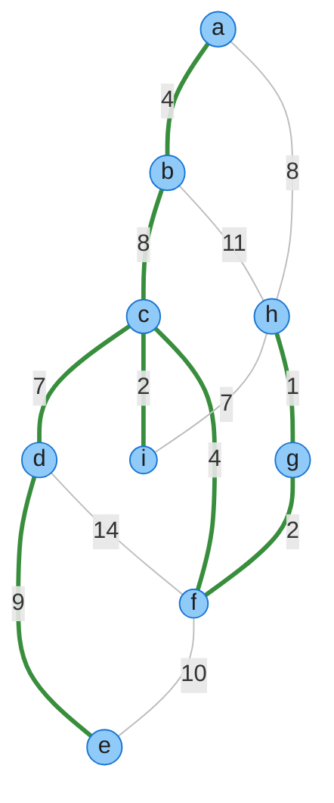
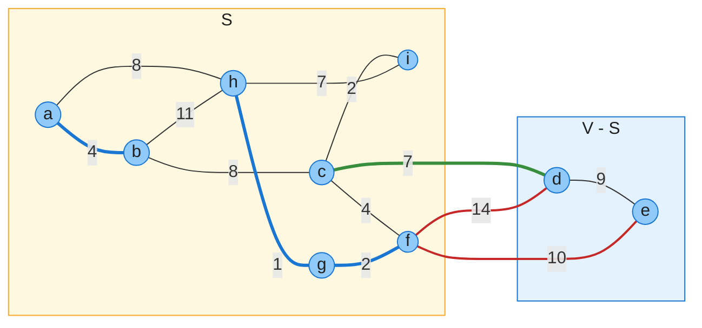
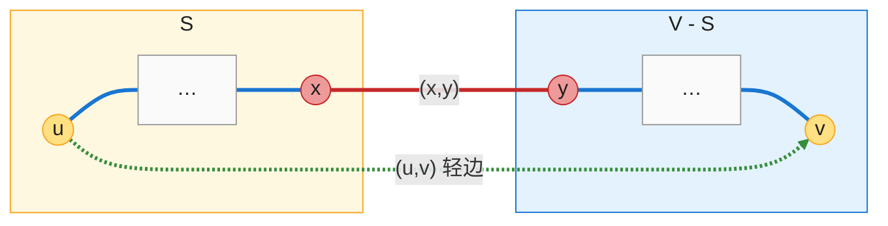
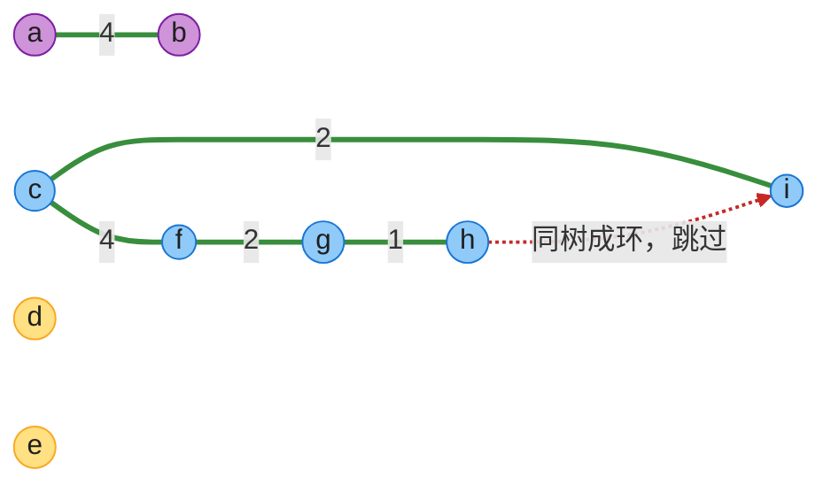
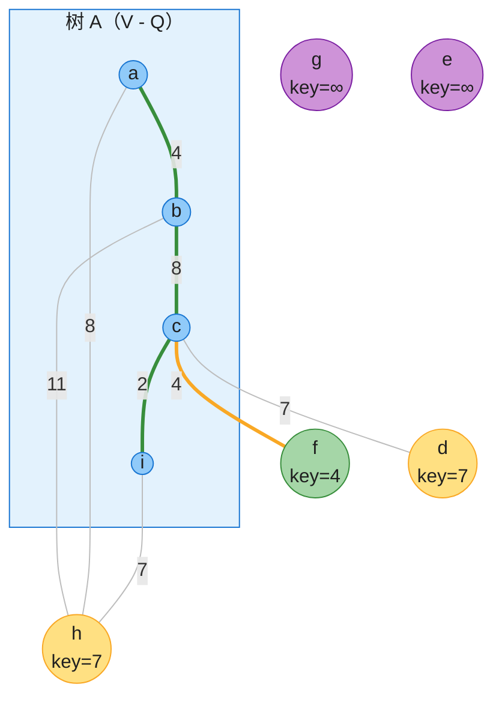

# 第 21 章：最小生成树（Minimum Spanning Trees）——深度版

## 一、开篇定位

本章回答一个问题：**给定连通无向加权图，如何选出总权重最小的 |V|−1 条边，把所有顶点连通起来？**这就是最小生成树（MST）问题。原书引子是电路布线：n 个引脚要互联互通，用 n−1 根导线两两连接，总线长最短的方案最省料；同类应用还有光缆/管网铺设、单连接聚类（删掉 MST 中最大的 k−1 条边即得 k 个簇）。

两个经典算法 **Kruskal** 与 **Prim** 都是贪心算法，也是第 15 章贪心框架「能严格证明最优」的范例：它们共用一个判定规则——**切分性质**（定理 21.1），区别只在找「安全边」的方式不同。

与前后章节的关系：

- Kruskal 是**第 19 章并查集**的头号应用：环检测就是一次 FIND-SET；
- Prim 是**第 6 章优先队列**的实战：key 管理 + DECREASE-KEY；其「key + 波前扩展」骨架与**第 22 章 Dijkstra** 几乎同构，学会 Prim 等于预习了 Dijkstra；
- 图一律用**第 20 章**的邻接表存储。

做题定位：MST 模板题 1584；进阶 1489（关键边/伪关键边）、1697（离线查询 + Kruskal）；「最小化路径最大边」一族（1631、778）是 MST 瓶颈性质（思考题 21-4）的直接迁移。

**本章主线**：问题定义与切分性质（21.1）→ Kruskal（21.2）→ Prim（21.2）→ Java + Python 双实现 → 速查/易混 → 题单与习题。

---

## 二、问题与通用框架（21.1）

### 2.1 问题定义

给定连通无向图 $G = (V, E)$，每条边 $(u, v)$ 有权重 $w(u, v)$。求无环子集 $T \subseteq E$：连接所有顶点，且总权重 $w(T) = \sum_{(u,v) \in T} w(u, v)$ 最小。无环 + 连通 ⇒ T 是一棵**生成树**，恰有 |V|−1 条边——所以「最小」无从指边数，只能指**总权重**（原书脚注 1）。



**图 A**：原书 Figure 21.1 的示例图（9 顶点 13 边），全章的 trace 都跑在它上面。绿粗边 = 一棵 MST，总权重 37。MST **不唯一**：把 (b,c) 换成 (a,h)（同为 8）得到另一棵权重 37 的 MST。

### 2.2 GENERIC-MST 与安全边

两个算法都是如下通用框架的实例：每次往边集 A 里加一条「安全边」，直到 A 成为生成树。

```
GENERIC-MST(G, w)
1  A = ∅
2  while A does not form a spanning tree
3      find an edge (u, v) that is safe for A
4      A = A ∪ {(u, v)}
5  return A
```

**循环不变量**：每次迭代前，**A 都是某棵 MST 的子集**。能加入 A 而不破坏该不变量的边，称为 A 的**安全边（safe edge）**。框架的正确性一目了然：初始 A = ∅ 平凡成立；只加安全边 ⇒ 不变量保持；终止时 A 是生成树且含于某棵 MST ⇒ A 就是 MST。难点全在第 3 行「怎么找安全边」——定理 21.1 给出判定规则。

执行过程中 $G_A = (V, A)$ 始终是**森林**（A 无环）：初始 |V| 棵孤点树，每加一条安全边合并两棵，循环恰好执行 |V|−1 次。

### 2.3 切分性质（定理 21.1）

四个定义：

- **切分** $(S, V-S)$：把顶点集 V 划分成两半。
- **跨越**（cross）：边 $(u, v)$ 一端在 S、另一端在 V−S。
- **尊重**（respect）：A 中没有任何边跨越该切分。
- **轻边**（light edge）：跨越边中权重最小者（可并列多条）。

**定理 21.1（切分性质）**：设 A 含于某棵 MST，切分 $(S, V-S)$ 尊重 A，$(u, v)$ 是跨越该切分的轻边，则 $(u, v)$ 对 A 安全。



**图 B**（对应 Figure 21.2）：切分 $S = \{a,b,c,f,g,h,i\}$、$V-S = \{d,e\}$。粗蓝边 = 边集 A（示例取 {(a,b), (g,h), (g,f)}，含于图 A 那棵 MST），A 没有边跨越切分 ⇒ 切分**尊重** A。跨越边共 3 条：(c,d)=7 是唯一**轻边**（绿粗），(d,f)=14、(f,e)=10（红）。定理 21.1 ⇒ (c,d) 对 A 安全，可以放心加入。

**证明**（切割-粘贴，cut-and-paste）：设 MST $T \supseteq A$ 不含 $(u, v)$（含则已证毕）。T 中 u 到 v 的唯一路径 p 与 $(u, v)$ 构成环；u、v 分居切分两侧 ⇒ p 上必有一条边 $(x, y)$ 也跨越切分，且 $(x, y) \notin A$（切分尊重 A）。删 $(x, y)$、加 $(u, v)$ 得新树 $T'$：$w(T') = w(T) - w(x, y) + w(u, v) \le w(T)$（轻边 $\Rightarrow w(u,v) \le w(x,y)$）⇒ $T'$ 也是 MST，且 $T' \supseteq A \cup \{(u,v)\}$。



**图 C**（对应 Figure 21.3）：蓝粗线 = T 中路径 p（u⇝x 在 S 内，y⇝v 在 V−S 内），红粗边 (x,y) 是 p 上跨越切分的边（将被换下），绿虚边 (u,v) 是轻边（换入）。一删一增，树仍连通无环，权重不增。

### 2.4 推论 21.2：两个算法的共同依据

设 C 是森林 $G_A$ 的一个连通分量（一棵树），$(u, v)$ 是连接 C 到**其他分量**的轻边，则 $(u, v)$ 对 A 安全。（取切分 $(V_C, V - V_C)$，它尊重 A，$(u,v)$ 是其轻边，套用定理 21.1。）

这句推论就是 21.2 节两个算法的全部依据：**Kruskal** 取「连接两棵树的全局最轻边」，**Prim** 取「连接单树与外部的最轻边」——都是它的特例。

---

## 三、Kruskal 算法（21.2）

### 3.1 直觉：全局最便宜的连接先拿下

把边按权重升序排好，从轻到重扫，**两端不在同一棵树就加，否则跳过**。环检测就是一次 FIND-SET：两端同树 ⇒ 加了必成环。维护的是一片森林——|V| 棵孤点树逐渐合并，直到只剩一棵。

### 3.2 伪代码（CLRS 1-indexed，第四版）

```
MST-KRUSKAL(G, w)
1  A = ∅
2  for each vertex v ∈ G.V
3      MAKE-SET(v)
4  create a single list of the edges in G.E
5  sort the list of edges into monotonically increasing order by weight w
6  for each edge (u, v) taken from the sorted list in order
7      if FIND-SET(u) ≠ FIND-SET(v)
8          A = A ∪ {(u, v)}
9          UNION(u, v)
10 return A
```

### 3.3 完整 trace（对应 Figure 21.4）

在图 A 上跑，13 条边按权重升序逐一考察（同权边按稳定排序的原顺序）：

| # | 边（权） | 决策 | 合并后的分量 / 跳过原因 |
|---|---------|------|------------------------|
| 1 | (g,h) 1 | ✓ 加入 | {g,h} |
| 2 | (c,i) 2 | ✓ 加入 | {c,i} |
| 3 | (f,g) 2 | ✓ 加入 | {f,g,h} |
| 4 | (a,b) 4 | ✓ 加入 | {a,b} |
| 5 | (c,f) 4 | ✓ 加入 | {c,f,g,h,i} |
| 6 | (c,d) 7 | ✓ 加入 | {c,d,f,g,h,i} |
| 7 | (h,i) 7 | ✗ 跳过 | 同树（环 h-g-f-c-i-h） |
| 8 | (a,h) 8 | ✓ 加入 | {a,b,c,d,f,g,h,i} |
| 9 | (b,c) 8 | ✗ 跳过 | 同树（环 b-a-h-g-f-c-b） |
| 10 | (d,e) 9 | ✓ 加入 | 全连通：8 条边集齐，**提前结束** |
| 11–13 | (e,f) 10、(b,h) 11、(d,f) 14 | — | 不再考察 |

总权重 = 1+2+2+4+4+7+8+9 = **37**。加入 5 条边后的森林快照（{a,b}、{c,f,g,h,i} 两棵非平凡树 + 孤点 d、e）：



**图 D**：绿粗边 = 已在森林 A 中的边；红虚边 = 第 7 条考察的 (h,i)=7，两端同树 ⇒ 成环跳过。Kruskal 的「环检测」本质就是一次 FIND-SET 比较。

> 本 trace 中同权边按 (c,d) 先于 (h,i)、(a,h) 先于 (b,c) 处理，所得 MST 含 **(a,h)** 而非 (b,c)——与图 A 的蓝树不同但同为 37。习题 21.2-1：任意 MST 都对应某种同权边排序下的 Kruskal 产出。

### 3.4 正确性与复杂度

**正确性**：每次加入的 (u,v) 是连接两棵不同树的最轻边 ⇒ 推论 21.2 ⇒ 安全边 ⇒ 不变量保持 ⇒ 终态即 MST。

**复杂度**：排序 $O(E \lg E)$ 主导；|V| 次 MAKE-SET + O(E) 次 FIND-SET/UNION 共 $O((V+E)\,\alpha(V))$（第 19 章，α 近乎常数）。合计 $O(E \lg E) = O(E \lg V)$（因 $E < V^2$，$\lg E = O(\lg V)$）。空间 $O(V)$（并查集）。

LeetCode 标注：1584（模板题）、1489（关键边 = 枚举 + Kruskal）、1697（查询与边一起排序，离线版 Kruskal）。

---

## 四、Prim 算法（21.2）

### 4.1 直觉：从一点向外生长的单树

从任意根 r 出发长**一棵树**，每步把「树到非树的最轻边」连同那个新顶点吸进树里。为快速找到这条边，给每个树外顶点 v 维护：

- `v.key` = v 连到树的**最轻边**的权重（暂无则 ∞）；
- `v.π` = 该边在树内的端点；
- 最小优先队列 Q 按 key 组织所有树外顶点。

每轮 EXTRACT-MIN 取出 key 最小的顶点 u（边 (u, u.π) 入树），再用 u 的邻边刷新其非树邻居的 key（DECREASE-KEY）。骨架与 Dijkstra（22.3）同构，只是 key 的语义不同（见易混点表）。

### 4.2 伪代码（CLRS 1-indexed，第四版）

```
MST-PRIM(G, w, r)
1  for each vertex u ∈ G.V
2      u.key = ∞
3      u.π = NIL
4  r.key = 0
5  Q = ∅
6  for each vertex u ∈ G.V
7      INSERT(Q, u)
8  while Q ≠ ∅
9      u = EXTRACT-MIN(Q)              // 把 u 加入树
10     for each vertex v in G.Adj[u]   // 更新 u 的非树邻居的 key
11         if v ∈ Q and w(u, v) < v.key
12             v.π = u
13             v.key = w(u, v)
14             DECREASE-KEY(Q, v, w(u, v))
```

**循环不变量**（每次 while 迭代前，三部分）：① $A = \{(v, v.\pi) : v \in V - \{r\} - Q\}$；② 已在树中的顶点恰好是 $V - Q$；③ 对 $v \in Q$，若 $v.\pi \neq NIL$，则 $v.key < \infty$ 且是连接 v 到树的轻边 $(v, v.\pi)$ 的权重。终止时 Q 空，$A = \{(v, v.\pi) : v \in V - \{r\}\}$ 即 MST。

### 4.3 完整 trace（对应 Figure 21.5）

在图 A 上从 a 起跑。「取出后 Q 中的 key」一列只写 key < ∞ 的顶点，括号内为 π：

| 步骤 | 取出 (key) | 加入边（权） | 取出后 Q 中的 key（π） |
|------|-----------|-------------|------------------------|
| 0 | — | — | a=0，其余 ∞ |
| 1 | a (0) | —（根） | b=4(a), h=8(a) |
| 2 | b (4) | (a,b) 4 | c=8(b), h=8(a) |
| 3 | c (8) | (b,c) 8 | i=2(c), f=4(c), d=7(c), h=8(a) |
| 4 | i (2) | (c,i) 2 | f=4(c), d=7(c), h=7(i) |
| 5 | f (4) | (c,f) 4 | g=2(f), d=7(c), h=7(i), e=10(f) |
| 6 | g (2) | (f,g) 2 | h=1(g), d=7(c), e=10(f) |
| 7 | h (1) | (g,h) 1 | d=7(c), e=10(f) |
| 8 | d (7) | (c,d) 7 | e=9(d) |
| 9 | e (9) | (d,e) 9 | 空，结束 |

总权重 = 4+8+2+4+2+1+7+9 = **37**。步骤 3 时 c、h 的 key 同为 8，取谁都行——原书图 21.5 取 c（即加入 (b,c)）；若取 h 则得含 (a,h) 的另一棵 MST（正是 Kruskal trace 得到的那棵）。

步骤 4（加入 (c,i)）后的快照：



**图 E**：蓝点 = 已在树中（V−Q = {a,b,c,i}），黄点 = Q 中 key < ∞ 的候选，紫点 = 尚未触及（key = ∞），绿点 f 是下一个 EXTRACT-MIN。跨越切分 (V−Q, Q) 的边中 (c,f)=4 是轻边（黄粗线）⇒ 下一步加入。注意 h 的 key=7 来自 (i,h) 而非 (a,h)=8——**key 永远记「连到树的最轻边」**，随树的生长不断被刷新（h：8→7→1）。

### 4.4 正确性与复杂度

**正确性**：每步加入的 (u, u.π) 是跨越切分 (V−Q, Q) 的轻边 ⇒ 定理 21.1（或推论 21.2 取 C = 当前树）⇒ 安全边。

**复杂度**（取决于优先队列实现）：

| 实现 | EXTRACT-MIN | DECREASE-KEY | 总时间 |
|------|------------|--------------|--------|
| 二叉堆（第 6 章） | $O(\lg V)$ × V 次 | $O(\lg V)$ × E 次 | $O(E \lg V)$ |
| 斐波那契堆（第 16 章摊还） | $O(\lg V)$ 摊还 | $O(1)$ 摊还 | $O(E + V \lg V)$ |
| 邻接矩阵 + 朴素数组（习题 21.2-2） | $O(V)$ 扫数组 | $O(1)$ | $O(V^2)$ |

- 二叉堆版有个省常数的细节：不必调 BUILD-MIN-HEAP——r.key=0 放堆顶，其余 key=∞ 随便放。
- 斐波那契堆版当且仅当 $E = \omega(V)$ 时渐近更优（习题 21.2-3）：稀疏图 $E = \Theta(V)$ 时两版同为 $O(V \lg V)$；稠密图 $E = \Theta(V^2)$ 时 $O(V^2)$ vs $O(V^2 \lg V)$。
- **实战要点**：Java `PriorityQueue` / Python `heapq` 都没有高效 DECREASE-KEY ⇒ **懒删除**（重复入堆 + `inMST` 跳过，与第 6 章结论一致）。堆中条目增至 O(E)，复杂度仍为 $O(E \lg E) = O(E \lg V)$。
- 邻接矩阵朴素版 $O(V^2)$ 与边数无关，稠密图（完全图点集，如 1584 的曼哈顿距离）反而常写它。

LeetCode 标注：1584（Prim/Kruskal 均可练）。

---

## 五、代码实现（Java + Python）

约定：伪代码是 1-indexed 的 CLRS 风格；实战代码统一 **0-indexed**（顶点 a…i 映射为 0…8）。Kruskal 输入边列表 `(u, v, w)`，Prim 内部转邻接表。并查集（路径压缩 + 按秩合并）来自第 19 章，此处直接用。以下代码已实际编译运行：CLRS 图 21.1 上两算法均输出 37 及下方 trace；另做随机对拍——Java 500 轮（Kruskal vs Prim）、Python 2000 轮（再对照暴力枚举所有生成树），全部一致。

### 5.1 Java

```java
import java.util.*;

public class MST {
    // ---------- 并查集（第 19 章）：路径压缩 + 按秩合并 ----------
    static class DSU {
        private final int[] parent, rank;

        DSU(int n) {
            parent = new int[n];
            rank = new int[n];
            for (int i = 0; i < n; i++) parent[i] = i;
        }

        int find(int x) {
            if (parent[x] != x) parent[x] = find(parent[x]); // 路径压缩
            return parent[x];
        }

        boolean union(int x, int y) {
            int px = find(x), py = find(y);
            if (px == py) return false;                      // 同树 ⇒ 成环
            if (rank[px] < rank[py]) parent[px] = py;
            else if (rank[px] > rank[py]) parent[py] = px;
            else { parent[py] = px; rank[px]++; }
            return true;
        }
    }

    // ---------- Kruskal：边列表排序 + 并查集，O(E lg E) ----------
    // 边用 int[]{u, v, w} 表示；返回 MST 的边
    static List<int[]> kruskal(int n, List<int[]> edges) {
        List<int[]> sorted = new ArrayList<>(edges);
        sorted.sort(Comparator.comparingInt(e -> e[2]));
        DSU dsu = new DSU(n);
        List<int[]> mst = new ArrayList<>();
        for (int[] e : sorted) {
            if (dsu.union(e[0], e[1])) {
                mst.add(e);
                if (mst.size() == n - 1) break;              // 集齐 |V|-1 条边提前结束
            }
        }
        return mst;
    }

    // ---------- Prim：邻接表 + 二叉堆（懒删除），O(E lg V) ----------
    static List<int[]> prim(int n, List<int[]> edges, int r) {
        List<List<int[]>> adj = new ArrayList<>();           // adj[u] = {{v, w}, ...}
        for (int i = 0; i < n; i++) adj.add(new ArrayList<>());
        for (int[] e : edges) {
            adj.get(e[0]).add(new int[]{e[1], e[2]});
            adj.get(e[1]).add(new int[]{e[0], e[2]});
        }
        int[] key = new int[n], pi = new int[n];
        boolean[] inMST = new boolean[n];
        Arrays.fill(key, Integer.MAX_VALUE);
        Arrays.fill(pi, -1);
        key[r] = 0;
        // Java PriorityQueue 无高效 DECREASE-KEY ⇒ 懒删除：重复入堆，过期条目取出时跳过
        PriorityQueue<int[]> pq = new PriorityQueue<>(
                Comparator.comparingInt((int[] x) -> x[0]).thenComparingInt(x -> x[1]));
        pq.offer(new int[]{0, r});                           // {key, vertex}
        List<int[]> mst = new ArrayList<>();
        while (!pq.isEmpty()) {
            int u = pq.poll()[1];
            if (inMST[u]) continue;                          // 过期条目
            inMST[u] = true;
            if (u != r) mst.add(new int[]{pi[u], u, key[u]});
            for (int[] e : adj.get(u)) {
                int v = e[0], w = e[1];
                if (!inMST[v] && w < key[v]) {
                    key[v] = w;
                    pi[v] = u;
                    pq.offer(new int[]{w, v});               // 旧条目留在堆里自然失效
                }
            }
        }
        return mst;
    }

    static int totalWeight(List<int[]> mst) {
        int sum = 0;
        for (int[] e : mst) sum += e[2];
        return sum;
    }

    // CLRS 第四版 Figure 21.1 的图：a=0, b=1, …, i=8（9 顶点 13 边）
    static List<int[]> clrsGraph() {
        return Arrays.asList(
            new int[]{0, 1, 4},  new int[]{0, 7, 8},  new int[]{1, 2, 8},
            new int[]{1, 7, 11}, new int[]{2, 3, 7},  new int[]{2, 5, 4},
            new int[]{2, 8, 2},  new int[]{3, 4, 9},  new int[]{3, 5, 14},
            new int[]{4, 5, 10}, new int[]{5, 6, 2},  new int[]{6, 7, 1},
            new int[]{7, 8, 7});
    }

    static String name(int v) { return String.valueOf((char) ('a' + v)); }

    public static void main(String[] args) {
        int n = 9;
        List<int[]> edges = clrsGraph();

        // Kruskal 全过程 trace（与正文表格一致）
        List<int[]> sorted = new ArrayList<>(edges);
        sorted.sort(Comparator.comparingInt(e -> e[2]));
        DSU dsu = new DSU(n);
        List<int[]> kMst = new ArrayList<>();
        System.out.println("Kruskal trace:");
        for (int[] e : sorted) {
            boolean added = dsu.union(e[0], e[1]);
            if (added) kMst.add(e);
            System.out.printf("  (%s,%s) %2d  %s%n", name(e[0]), name(e[1]), e[2],
                    added ? "加入" : "跳过(同树成环)");
            if (kMst.size() == n - 1) { System.out.println("  集齐 8 条边，提前结束"); break; }
        }
        System.out.println("Kruskal 总权重 = " + totalWeight(kMst));

        // Prim 全过程 trace（与正文表格一致）
        List<int[]> pMst = prim(n, edges, 0);
        System.out.println("Prim 取出顺序与加入边:");
        for (int[] e : pMst)
            System.out.printf("  (%s,%s) %d%n", name(e[0]), name(e[1]), e[2]);
        System.out.println("Prim 总权重 = " + totalWeight(pMst));

        // 随机对拍：500 个随机连通图，两算法权重必须一致
        Random rnd = new Random(42);
        for (int t = 0; t < 500; t++) {
            int V = 2 + rnd.nextInt(15);
            List<int[]> g = randomConnectedGraph(V, rnd);
            int wk = totalWeight(kruskal(V, g));
            int wp = totalWeight(prim(V, g, 0));
            if (wk != wp) throw new AssertionError("不一致: " + wk + " vs " + wp);
        }
        System.out.println("随机对拍 500 轮通过（Kruskal == Prim）");
    }

    static List<int[]> randomConnectedGraph(int n, Random rnd) {
        List<int[]> edges = new ArrayList<>();
        List<Integer> perm = new ArrayList<>();
        for (int i = 0; i < n; i++) perm.add(i);
        Collections.shuffle(perm, rnd);
        for (int i = 1; i < n; i++) {                        // 先生成一棵随机树保证连通
            int v = perm.get(i), u = perm.get(rnd.nextInt(i));
            edges.add(new int[]{u, v, 1 + rnd.nextInt(100)});
        }
        for (int i = 0; i < n; i++)                          // 再随机加边（允许重边，两算法均兼容）
            for (int j = i + 1; j < n; j++)
                if (rnd.nextDouble() < 0.3)
                    edges.add(new int[]{i, j, 1 + rnd.nextInt(100)});
        return edges;
    }
}
```

### 5.2 Python

```python
import heapq
import itertools
import random


class DSU:
    """并查集（第 19 章）：路径压缩 + 按秩合并"""

    def __init__(self, n):
        self.parent = list(range(n))
        self.rank = [0] * n

    def find(self, x):
        if self.parent[x] != x:
            self.parent[x] = self.find(self.parent[x])  # 路径压缩
        return self.parent[x]

    def union(self, x, y):
        px, py = self.find(x), self.find(y)
        if px == py:
            return False                                # 同树 ⇒ 成环
        if self.rank[px] < self.rank[py]:
            self.parent[px] = py
        elif self.rank[px] > self.rank[py]:
            self.parent[py] = px
        else:
            self.parent[py] = px
            self.rank[px] += 1
        return True


def kruskal(n, edges):
    """Kruskal：边列表排序 + 并查集，O(E lg E)。edges = [(u, v, w)]，返回 MST 边列表"""
    dsu = DSU(n)
    mst = []
    for u, v, w in sorted(edges, key=lambda e: e[2]):
        if dsu.union(u, v):
            mst.append((u, v, w))
            if len(mst) == n - 1:                       # 集齐 |V|-1 条边提前结束
                break
    return mst


def prim(n, edges, r=0):
    """Prim：邻接表 + 二叉堆（懒删除），O(E lg V)。返回 MST 边列表"""
    adj = [[] for _ in range(n)]
    for u, v, w in edges:
        adj[u].append((v, w))
        adj[v].append((u, w))
    INF = float("inf")
    key = [INF] * n
    pi = [-1] * n
    in_mst = [False] * n
    key[r] = 0
    pq = [(0, r)]                                       # (key, vertex)；heapq 无 DECREASE-KEY ⇒ 懒删除
    mst = []
    while pq:
        _, u = heapq.heappop(pq)
        if in_mst[u]:                                   # 过期条目
            continue
        in_mst[u] = True
        if u != r:
            mst.append((pi[u], u, key[u]))
        for v, w in adj[u]:
            if not in_mst[v] and w < key[v]:
                key[v] = w
                pi[v] = u
                heapq.heappush(pq, (w, v))
    return mst


# CLRS 第四版 Figure 21.1 的图：a=0, b=1, …, i=8（9 顶点 13 边）
CLRS = [(0, 1, 4), (0, 7, 8), (1, 2, 8), (1, 7, 11), (2, 3, 7), (2, 5, 4),
        (2, 8, 2), (3, 4, 9), (3, 5, 14), (4, 5, 10), (5, 6, 2), (6, 7, 1),
        (7, 8, 7)]


def weight(mst):
    return sum(w for _, _, w in mst)


def brute_force(n, edges):
    """小图暴力：枚举所有 |V|-1 条边的子集，无环即生成树，取最小权重"""
    best = float("inf")
    for combo in itertools.combinations(edges, n - 1):
        dsu = DSU(n)
        if all(dsu.union(u, v) for u, v, _ in combo):
            best = min(best, sum(w for _, _, w in combo))
    return best


def name(v):
    return chr(ord("a") + v)


if __name__ == "__main__":
    n = 9
    # Kruskal 全过程 trace（与正文表格一致）
    dsu = DSU(n)
    mst = []
    print("Kruskal trace:")
    for u, v, w in sorted(CLRS, key=lambda e: e[2]):
        added = dsu.union(u, v)
        if added:
            mst.append((u, v, w))
        print(f"  ({name(u)},{name(v)}) {w:2d}  {'加入' if added else '跳过(同树成环)'}")
        if len(mst) == n - 1:
            print("  集齐 8 条边，提前结束")
            break
    print("Kruskal 总权重 =", weight(mst))

    # Prim 全过程 trace（与正文表格一致）
    p_mst = prim(n, CLRS)
    print("Prim 加入边顺序:", [(name(u), name(v), w) for u, v, w in p_mst])
    print("Prim 总权重 =", weight(p_mst))

    # 随机对拍：2000 个小图，Kruskal / Prim / 暴力枚举三者对照
    rnd = random.Random(42)
    for _ in range(2000):
        V = rnd.randint(2, 6)
        edges = []
        perm = list(range(V))
        rnd.shuffle(perm)
        for i in range(1, V):                           # 先生成一棵随机树保证连通
            edges.append((perm[rnd.randrange(i)], perm[i], rnd.randint(1, 50)))
        for i in range(V):                              # 再随机加边（允许重边，三算法均兼容）
            for j in range(i + 1, V):
                if rnd.random() < 0.35:
                    edges.append((i, j, rnd.randint(1, 50)))
        wk, wp, wb = weight(kruskal(V, edges)), weight(prim(V, edges)), brute_force(V, edges)
        assert wk == wp == wb, (wk, wp, wb)
    print("随机对拍 2000 轮通过（Kruskal == Prim == 暴力枚举）")
```

两种语言跑出的结果一致：

```
Kruskal trace: (g,h)1✓ (c,i)2✓ (f,g)2✓ (a,b)4✓ (c,f)4✓ (c,d)7✓ (h,i)7✗ (a,h)8✓ (b,c)8✗ (d,e)9✓ → 总权重 37
Prim 加入边顺序: (a,b)4 (b,c)8 (c,i)2 (c,f)4 (f,g)2 (g,h)1 (c,d)7 (d,e)9 → 总权重 37
Java 随机对拍 500 轮通过；Python 随机对拍 2000 轮通过（含暴力枚举对照）
```

---

## 六、复杂度速查 + 易混点对比

### 6.1 速查表

| 算法 | 数据结构 | 时间 | 空间 | 备注 |
|------|---------|------|------|------|
| Kruskal | 并查集 | $O(E \lg V)$ | $O(V)$ | 排序 $O(E \lg E)$ 主导；并查集部分 $O(E\,\alpha(V))$ |
| Prim | 二叉堆 | $O(E \lg V)$ | $O(V)$ | V 次 EXTRACT-MIN + E 次 DECREASE-KEY |
| Prim | 斐波那契堆 | $O(E + V \lg V)$ | $O(V)$ | $E = \omega(V)$ 时更优（习题 21.2-3） |
| Prim | 邻接矩阵 + 数组 | $O(V^2)$ | $O(V)$ | 稠密图实战写法（习题 21.2-2） |

两算法渐近相同（$O(E \lg V)$）；实战选择：边列表天然有序/稀疏图用 Kruskal（代码最短），稠密图/需要逐点生长用 Prim。

### 6.2 易混点对比

| 易混点 | 辨析 |
|-------|------|
| Kruskal 森林 vs Prim 单树 | Kruskal 的 A 始终是**森林**（多棵树并行合并）；Prim 的 A 始终是**一棵**树 |
| 轻边 vs 安全边 | 轻边 ⇒ 安全（定理 21.1）；安全 ⇏ 轻（习题 21.1-2 反例） |
| MST 唯一吗 | 不一定（图 A：(b,c)↔(a,h)）；但**总权重唯一**，且各 MST 的边权排序列表相同（习题 21.1-8） |
| 「最小」指什么 | 生成树恒有 \|V\|−1 条边，无从最小化边数；最小的是**总权重** |
| Prim 的 key ≠ Dijkstra 的 d | key = 到**树**的最轻边权；d = 到**源点**的最短距离。骨架同构、语义不同 |
| 切分「尊重」A | A 中**没有边跨越**该切分；不是「A 跨越切分」 |
| 斐波那契堆何时值 | $E = \omega(V)$ 才渐近更优；稀疏图 $E=\Theta(V)$ 时与二叉堆同为 $O(V \lg V)$ |
| 提前退出 | Kruskal 集齐 \|V\|−1 条边即可停，剩下的边不必考察 |

---

## 七、LeetCode 题单 + 习题快问快答

### 7.1 LeetCode 题单

| 题号 | 题目 | 难度 | 考点 |
|-----|------|-----|------|
| 1584 | 连接所有点的最小费用 | 中 | **MST 模板**：曼哈顿距离隐式完全图，Kruskal/Prim 均可 |
| 1135 | 最低成本联通所有城市 | 中（会员） | Kruskal 裸题 |
| 1168 | 水资源分配优化 | 难（会员） | 虚拟源点 0 连「打井费」边，再跑 MST |
| 1489 | 找到最小生成树里的关键边和伪关键边 | 难 | 枚举每条边：强制加入/禁用后重跑 Kruskal 比权重 |
| 1697 | 检查边长度限制的路径是否存在 | 难 | 离线：查询与边同按权排序 + 并查集（Kruskal 思想） |
| 1631 | 最小体力消耗路径 | 中 | **瓶颈路**：MST 上路径最大边最小（思考题 21-4 迁移）；按边权升序加边到并查集 |
| 778 | 水位上升的泳池中游泳 | 难 | 同瓶颈模型，并查集/二分 + BFS |
| 1579 | 保证图可完全遍历的最优移除边数 | 难 | 并查集贪心保留必要边（「生成树 = 保连通的最省边集」） |

定位语：MST 直接题不多，但「最小化路径上的最大边」（瓶颈路）一族本质是 MST 性质；并查集题（第 19 章题单）与 Kruskal 同源，可一起刷。

### 7.2 习题快问快答（第四版编号）

- **21.1-1** 全局最小权边必属某棵 MST：它是切分 $(\{u\}, V-\{u\})$ 的轻边，定理 21.1 ⇒ 安全。
- **21.1-2** Sabatier 猜想（安全 ⇒ 轻）不成立。反例：三角形 w(a,b)=1、w(b,c)=2、w(a,c)=2，A = ∅，切分 $(\{b\}, \{a,c\})$：(b,c) 在某棵 MST {(a,b),(b,c)} 中 ⇒ 安全，但轻边是 (a,b)=1，(b,c) 不是轻边。
- **21.1-5** 环上最大权边 e 可删：若 e ∈ T，删 e 得切分，环上必有另一边 e′ 跨越，w(e′) ≤ w(e)，换入不增 ⇒ 有不含 e 的 MST。
- **21.1-6** 「每个切分轻边唯一 ⇒ MST 唯一」成立（两棵不同 MST 取对称差构造切分即矛盾）；**反之不然**：三角形 1,1,2 的 MST 唯一（两条 1 边），但切分 $(\{b\},\{a,c\})$ 有两条轻边。
- **21.1-7** 权重全正 ⇒ 最小总权连接子图必是树（有环则删环上一边仍连通、总权更小）；允许非正权则不然：三条边权均为 −1 的三角形，最优是把三条全拿（总权 −3）。
- **21.1-10** T 中边 (x,y) 权减 k：对含 (x,y) 的树 T′，w′(T′) = w(T′)−k ≥ w(T)−k = w′(T)；不含的更大 ⇒ T 仍是 MST。
- **21.1-11** 非 T 边 (u,v) 权减：把 (u,v) 加入 T 成环，删环上最大权边（可能就是 (u,v) 自己）⇒ O(V+E)（树内 DFS 找路径）。
- **21.2-1** 任意 MST T 都能被 Kruskal 产出：同权边中把 T 的边排在前面，交换论证可知贪心选择恰好复现 T。
- **21.2-2** 邻接矩阵朴素 Prim：EXTRACT-MIN 扫 key 数组 O(V)，更新扫矩阵行 O(V) ⇒ 总 $O(V^2)$。
- **21.2-3** 稀疏 $E=\Theta(V)$：斐堆 $O(V \lg V)$ 与二叉堆持平；稠密 $E=\Theta(V^2)$：斐堆 $O(V^2)$ 胜二叉堆 $O(V^2 \lg V)$；渐近更优 ⟺ $E = \omega(V)$。
- **21.2-4** 边权为 1…|V| 的整数：计数排序代替比较排序 ⇒ Kruskal $O(E\,\alpha(V))$；边权 1…W（W 常数）同理 $O(E\,\alpha(V))$。
- **21.2-5** 边权整数 ⇒ Prim 用桶数组 + 单调扫描指针（Dial 式队列）：DECREASE-KEY 移桶 O(1)，EXTRACT-MIN 摊还 O(1)（指针只前进，全程扫一遍桶）⇒ 1…|V| 时 $O(E+V)$，1…W 时 $O(E+V+W) = O(E+V)$。
- **21.2-6** Borden 分治（对半分点、各自求 MST、用最轻跨越边连接）**错误**。反例：4 点图 (a,b)=4、(c,d)=5、(a,c)=1、(b,d)=2，划分 {a,b}|{c,d}：子 MST 4+5 加最轻跨越边 1 = 10，而真 MST = (a,c)+(b,d)+(a,b) = 7。
- **21.2-7** 边权 [0,1) 均匀分布：Kruskal 的排序可用桶排序期望线性 ⇒ 总 $O(E\,\alpha(V))$ 期望，优于 Prim 二叉堆。
- **21.2-8** 已算好 MST 再加一个顶点（带 k 条关联边）：只需在「旧 MST 的 |V|−1 条边 + k 条新边」上重跑 MST ⇒ $O(V \lg V)$。

### 7.3 思考题选

- **21-1 次小生成树**：边权互异 ⇒ MST 唯一但次小可不唯一；次小 = MST 删一条加一条 ⇒ 先 $O(V^2)$ 预处理 T 上任意两点路径的最大边 max[u,v]（每点做一次 DFS），再枚举非树边 (u,v)：候选权重 w(T) − w(max[u,v]) + w(u,v)，取最小 ⇒ $O(V^2 + E)$。
- **21-2 稀疏图 MST（Borůvka 一步 = MST-REDUCE）**：每点选最轻关联边入 T 后收缩 ⇒ 顶点数至少减半；k 轮 O(kE)；取 k = lg lg V 得总 $O(E \lg\lg V)$，稀疏图下优于纯 Prim。
- **21-3 三个「似是而非」算法**：A（按权**降序**删边，删后仍连通就删）✓ 对——Kruskal 的反向对偶；B（任意序加边，不成环就加）✗ 只是某棵生成树，权重可任意差；C（任意序加边，成环则删环上最大边）✓ 对——环性质的反复应用。
- **21-4 瓶颈生成树**（最大边最小的生成树）：MST 必为瓶颈生成树；判定「瓶颈值 ≤ b」只需保留权 ≤ b 的边看连通性 O(V+E)；配合收缩可做到线性。LeetCode 1631/778 即此模型。

### 7.4 章末注记

MST 最早算法归 Borůvka（1926，即思考题 21-2 的 MST-REDUCE 迭代 O(lg V) 轮）；Kruskal（1956）、Prim（1957，Jarník 1930 已独立发明）。后续：Fredman–Tarjan $O(E \lg^* V)$，Gabow–Galil–Spencer–Tarjan $O(E \lg\lg^* V)$；Chazelle $O(E\,\alpha(E,V))$（非贪心）；Karger–Klein–Tarjan 随机期望 $O(V+E)$；Fredman–Willard 整数权重确定性 $O(V+E)$；King 给出线性时间 MST 验证算法。

---

## 参考资料

- Cormen, T. H., Leiserson, C. E., Rivest, R. L., & Stein, C. (2022). *Introduction to Algorithms* (4th ed.). MIT Press. Chapter 21: Minimum Spanning Trees, pp. 585–603.
