# 第二十二章：单源最短路径（Single-Source Shortest Paths）

## 一、问题描述

### 1.1 什么是最短路径问题？

在日常生活中，我们经常需要找到从起点到终点的最短路线：

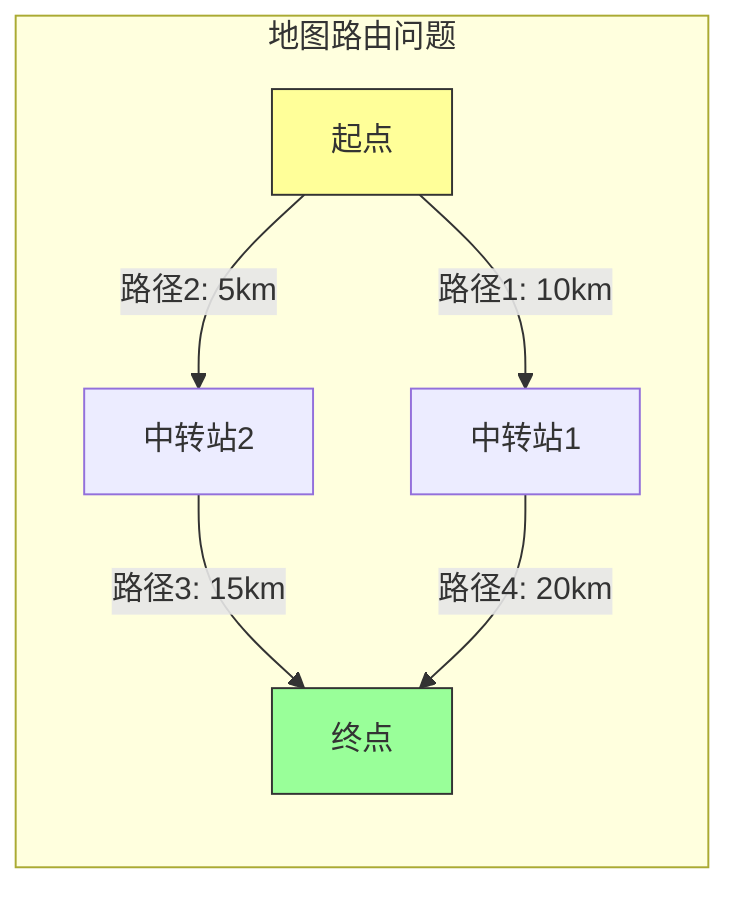

**问题**：从 A 到 D，哪条路径最短？

- 路径1 → 4：10 + 20 = 30km
- 路径2 → 3：5 + 15 = 20km ✓

**答案**：选择路径2和3，总长度20km

### 1.2 问题的形式化定义

给定一个**带权有向图** $G = (V, E)$ 和一个**源点** $s \in V$：

- 每条边 $(u, v) \in E$ 有权重 $w(u, v)$
- 权重可以表示距离、时间、成本等

**目标**：对于每个顶点 $v \in V$，找到从 $s$ 到 $v$ 的最短路径权重 $\delta(s, v)$

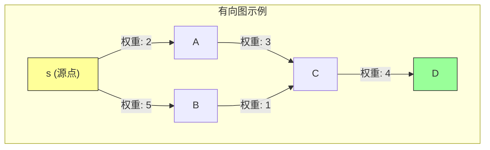

**最短路径权重** $\delta(s, v)$ = 所有从 $s$ 到 $v$ 的路径中，权重和的最小值

### 1.3 关键概念

| 概念 | 含义 | 示例 |
|-----|------|------|
| 路径 | 顶点序列 $v_0, v_1, ..., v_k$ | $s \to a \to c \to d$ |
| 路径权重 | 边上权重之和 $w(p) = \sum w(v_{i-1}, v_i)$ | $2 + 3 + 4 = 9$ |
| 最短路径 | 权重最小的路径 | $s \to b \to c \to d = 10$ |
| 最短路径权重 | $\delta(s, v) = \min\{w(p) : p \text{ from } s \text{ to } v\}$ | $\delta(s, d) = 9$ |

### 1.4 两种重要情况

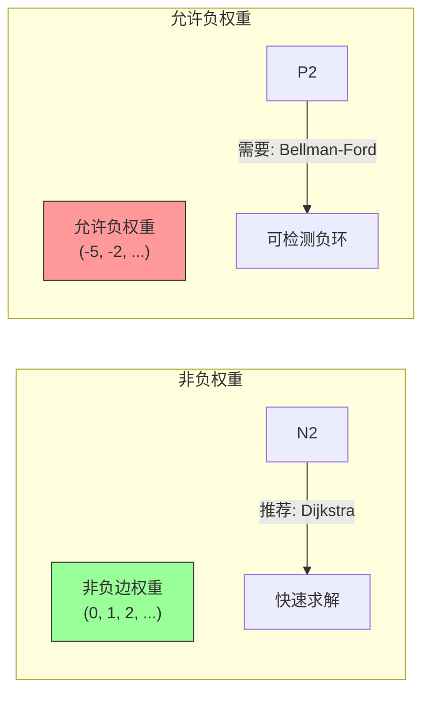

| 情况 | 特点 | 适用算法 |
|-----|------|---------|
| **非负权重** | 所有边权重 $\geq 0$ | Dijkstra |
| **允许负权重** | 边权重可为负 | Bellman-Ford |

**重要限制**：如果存在**负权环**，则最短路径**未定义**（可以无限循环减小权重）

### 1.5 本章算法概览

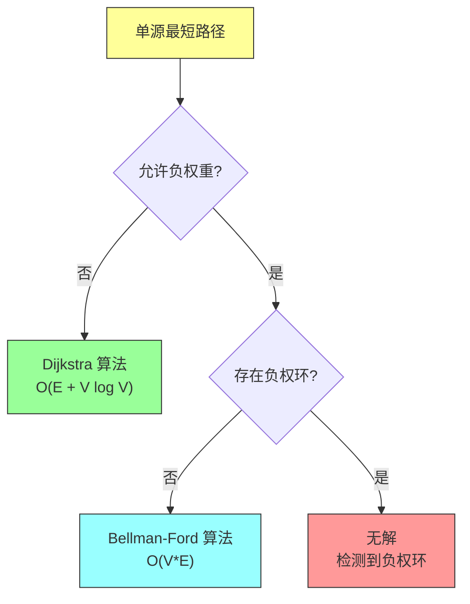

---

## 二、基础知识

### 2.1 图的表示

**有向图**：边有方向，从 $u$ 到 $v$ 不等于从 $v$ 到 $u$

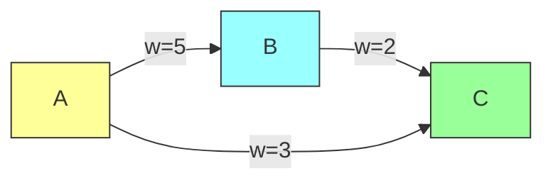

**邻接表表示法**（Java）：

```java
import java.util.*;

/**
 * 有向图的邻接表表示
 */
public class Graph {
    private final int V;                    // 顶点数
    private final List<List<Edge>> adj;     // 邻接表

    /**
     * 边类：表示从 u 到 v，权重为 w
     */
    public static class Edge {
        int to;
        int weight;

        public Edge(int to, int weight) {
            this.to = to;
            this.weight = weight;
        }
    }

    public Graph(int vertices) {
        this.V = vertices;
        this.adj = new ArrayList<>();
        for (int i = 0; i < V; i++) {
            adj.add(new ArrayList<>());
        }
    }

    /**
     * 添加有向边 u -> v，权重为 weight
     */
    public void addEdge(int u, int v, int weight) {
        adj.get(u).add(new Edge(v, weight));
    }

    /**
     * 获取顶点 u 的所有出边
     */
    public List<Edge> getEdges(int u) {
        return adj.get(u);
    }

    /**
     * 获取顶点数
     */
    public int getV() {
        return V;
    }
}
```

### 2.2 最短路径的性质

在深入算法之前，我们需要理解几个核心性质：

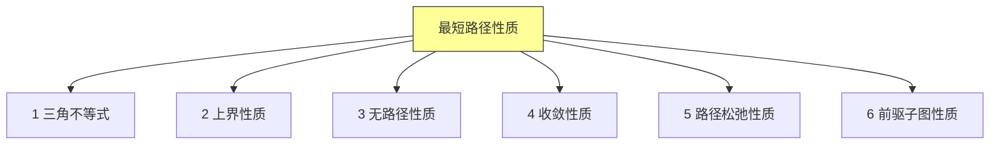

#### 性质1：三角不等式（Triangle Inequality）

**对于任意边 $(u, v) \in E$，有 $\delta(s, v) \leq \delta(s, u) + w(u, v)$**

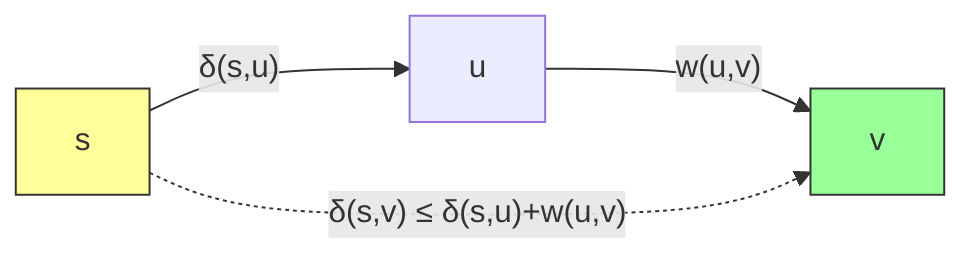

**直观理解**：直接去 $v$ 的最短路径，不会比先去 $u$ 再去 $v$ 更长。

#### 性质2：上界性质（Upper-Bound Property）

**始终有 $v.d \geq \delta(s, v)$，且 $v.d$ 一旦等于 $\delta(s, v)$ 就不会改变**


#### 性质3：收敛性质（Convergence Property）

**如果 $s \leadsto u \to v$ 是一条最短路径，且在松弛边 $(u, v)$ 之前 $u.d = \delta(s, u)$，则松弛后 $v.d = \delta(s, v)$**

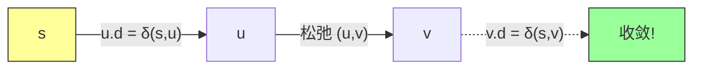

---

## 三、Bellman-Ford 算法

### 3.1 算法核心思想

**暴力但可靠**：对所有边进行 V-1 次松弛操作

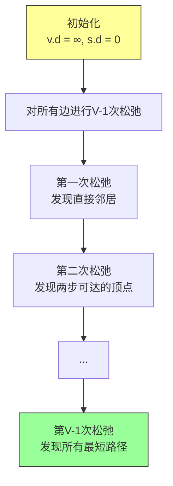

**为什么需要多次松弛？**

每次松弛只能保证：对于已发现的路径，找到更短的。

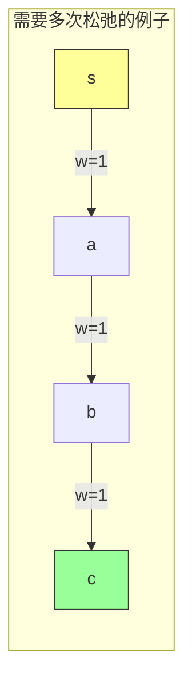

- 第1次松弛：找到 $s \to a$（权重1）
- 第2次松弛：找到 $s \to a \to b$（权重2）
- 第3次松弛：找到 $s \to a \to b \to c$（权重3）

### 3.2 伪代码

```
BELLMAN-FORD(G, w, s)
1  INITIALIZE-SINGLE-SOURCE(G, s)
2  for i = 1 to |G.V| - 1
3      for each edge (u, v) ∈ G.E
4          RELAX(u, v, w)
5  for each edge (u, v) ∈ G.E
6      if v.d > u.d + w(u, v)
7          return FALSE      // 存在负权环
8  return TRUE
```

### 3.3 关键操作：RELAX（松弛）

**松弛**：尝试通过边 $(u, v)$ 改善 $v$ 的最短路径估计

```
RELAX(u, v, w)
1  if v.d > u.d + w(u, v)
2      v.d = u.d + w(u, v)
3      v.π = u           // 记录前驱，用于重建路径
```

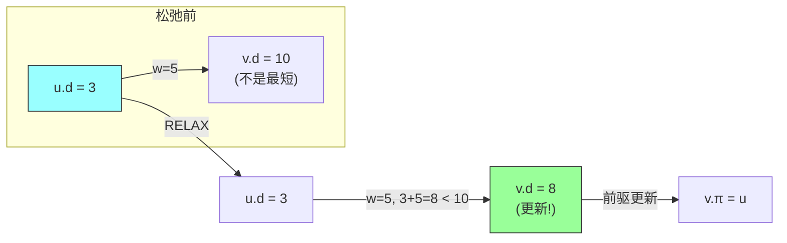

### 3.4 Java 实现

```java
import java.util.*;

/**
 * Bellman-Ford 算法实现
 * 功能：单源最短路径，支持负权重，可检测负权环
 */
public class BellmanFord {

    /**
     * 边的定义
     */
    public static class Edge {
        int u, v, weight;

        public Edge(int u, int v, int weight) {
            this.u = u;
            this.v = v;
            this.weight = weight;
        }
    }

    /**
     * 最短路径结果
     */
    public static class Result {
        public int[] dist;      // 最短距离
        public int[] parent;    // 前驱顶点
        public boolean hasNegativeCycle;  // 是否有负权环

        public Result(int n, boolean hasNegativeCycle) {
            this.dist = new int[n];
            this.parent = new int[n];
            this.hasNegativeCycle = hasNegativeCycle;
        }
    }

    /**
     * Bellman-Ford 主算法
     * @param n 顶点数
     * @param edges 所有边
     * @param source 源点
     * @return 计算结果
     */
    public static Result bellmanFord(int n, List<Edge> edges, int source) {
        // 1. 初始化
        int[] dist = new int[n];
        int[] parent = new int[n];
        Arrays.fill(dist, Integer.MAX_VALUE);
        Arrays.fill(parent, -1);
        dist[source] = 0;

        // 2. 进行 |V|-1 次松弛
        for (int i = 0; i < n - 1; i++) {
            boolean changed = false;
            for (Edge edge : edges) {
                if (dist[edge.u] != Integer.MAX_VALUE &&
                    dist[edge.u] + edge.weight < dist[edge.v]) {
                    dist[edge.v] = dist[edge.u] + edge.weight;
                    parent[edge.v] = edge.u;
                    changed = true;
                }
            }
            // 优化：如果一次遍历没有更新，提前结束
            if (!changed) break;
        }

        // 3. 检测负权环
        boolean hasNegativeCycle = false;
        for (Edge edge : edges) {
            if (dist[edge.u] != Integer.MAX_VALUE &&
                dist[edge.u] + edge.weight < dist[edge.v]) {
                hasNegativeCycle = true;
                break;
            }
        }

        Result result = new Result(n, hasNegativeCycle);
        result.dist = dist;
        result.parent = parent;
        return result;
    }

    /**
     * 打印最短路径
     */
    public static void printResult(Result result, int source, int target) {
        if (result.hasNegativeCycle) {
            System.out.println("图中存在负权环，最短路径未定义！");
            return;
        }

        if (result.dist[target] == Integer.MAX_VALUE) {
            System.out.println("从 " + source + " 到 " + target + " 不可达");
            return;
        }

        System.out.println("从 " + source + " 到 " + target + " 的最短路径：");
        System.out.println("距离: " + result.dist[target]);

        // 重建路径
        List<Integer> path = new ArrayList<>();
        int current = target;
        while (current != -1) {
            path.add(current);
            current = result.parent[current];
        }
        Collections.reverse(path);

        System.out.print("路径: ");
        for (int i = 0; i < path.size(); i++) {
            System.out.print(path.get(i));
            if (i < path.size() - 1) System.out.print(" -> ");
        }
        System.out.println();
    }

    // 测试
    public static void main(String[] args) {
        int n = 5;
        List<Edge> edges = Arrays.asList(
            new Edge(0, 1, 6),   // s -> a, 权重6
            new Edge(0, 2, 7),   // s -> b, 权重7
            new Edge(1, 3, 5),   // a -> d, 权重5
            new Edge(2, 3, 8),   // b -> d, 权重8
            new Edge(1, 2, 8),   // a -> b, 权重8
            new Edge(3, 4, -2),  // d -> t, 权重-2
            new Edge(2, 4, -3)   // b -> t, 权重-3
        );
        int source = 0;

        Result result = bellmanFord(n, edges, source);

        System.out.println("=== Bellman-Ford 算法测试 ===");
        printResult(result, source, 4);
    }
}
```

**输出**：
```
=== Bellman-Ford 算法测试 ===
从 0 到 4 的最短路径：
距离: 2
路径: 0 -> 2 -> 4
```

### 3.5 负权环检测

**原理**：如果 V-1 次松弛后还能继续松弛，则存在负权环

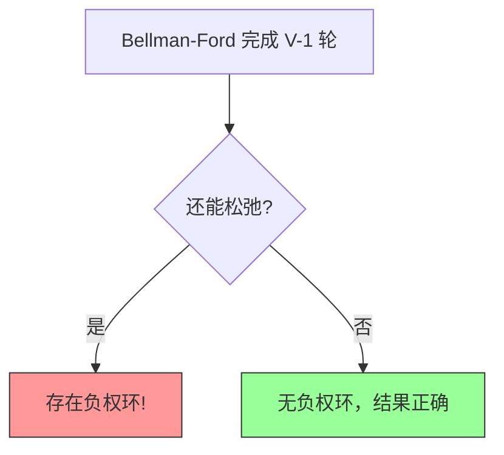

**示例**：负权环会导致无限减小

```
    a --(-1)--> b --(-1)--> c --(-1)--> a

    权重和 = -3 < 0
    可以无限循环，权重 → -∞
```

---

## 四、Dijkstra 算法

### 4.1 为什么需要 Dijkstra？

**Bellman-Ford 的问题**：$O(VE)$ 时间，对于稠密图太慢

**Dijkstra 的改进**：利用**非负权重**的性质，使用贪心策略


### 4.2 算法核心思想

**类比**：像扩散的水流，从源点开始，逐步向外扩展


### 4.3 关键数据结构：最小优先队列

**优先队列**：支持 `EXTRACT-MIN`（取出最小值）和 `DECREASE-KEY`（减小键值）

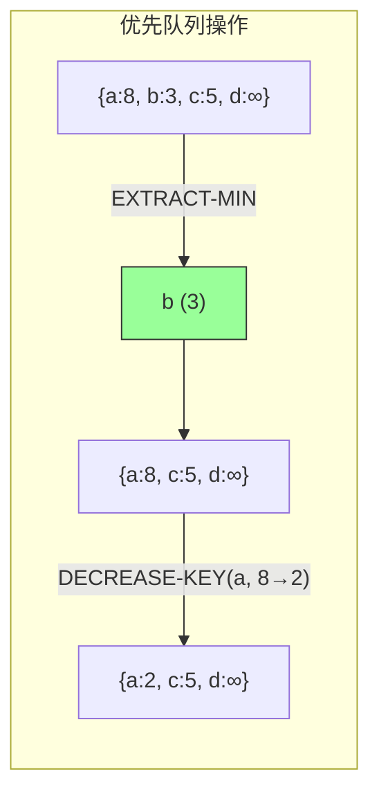

### 4.4 伪代码

```
DIJKSTRA(G, w, s)
1  INITIALIZE-SINGLE-SOURCE(G, s)
2  S = ∅                    // 已确定最短路径的顶点集合
3  Q = G.V                  // 优先队列，包含所有顶点
4  while Q ≠ ∅
5      u = EXTRACT-MIN(Q)   // 取出距离最小的顶点
6      S = S ∪ {u}          // 加入已确定集合
7      for each vertex v ∈ G.Adj[u]
8          RELAX(u, v, w)
```

### 4.5 Java 实现（使用二叉堆）

```java
import java.util.*;

/**
 * Dijkstra 算法实现
 * 使用二叉堆作为优先队列
 * 适用条件：所有边权重 >= 0
 */
public class Dijkstra {

    /**
     * 边的定义
     */
    public static class Edge {
        int to;
        int weight;

        public Edge(int to, int weight) {
            this.to = to;
            this.weight = weight;
        }
    }

    /**
     * 最短路径结果
     */
    public static class Result {
        public int[] dist;   // 最短距离
        public int[] parent; // 前驱顶点

        public Result(int n) {
            this.dist = new int[n];
            this.parent = new int[n];
        }
    }

    /**
     * 最小二叉堆
     */
    public static class MinHeap {
        private final List<Integer> keys;    // 存储顶点
        private final List<Integer> positions; // 顶点在堆中的位置
        private final int[] dist;            // 距离数组的引用
        private final int n;

        public MinHeap(int n, int[] dist) {
            this.n = n;
            this.dist = dist;
            this.keys = new ArrayList<>();
            this.positions = new ArrayList<>(n);
            for (int i = 0; i < n; i++) {
                keys.add(i);
                positions.add(i);
            }
        }

        /**
         * 建堆
         */
        public void buildMinHeap() {
            for (int i = n / 2 - 1; i >= 0; i--) {
                heapify(i);
            }
        }

        /**
         * 堆化
         */
        private void heapify(int i) {
            int smallest = i;
            int left = 2 * i + 1;
            int right = 2 * i + 2;

            if (left < n && dist[keys.get(left)] < dist[keys.get(smallest)]) {
                smallest = left;
            }
            if (right < n && dist[keys.get(right)] < dist[keys.get(smallest)]) {
                smallest = right;
            }
            if (smallest != i) {
                swap(i, smallest);
                heapify(smallest);
            }
        }

        /**
         * 交换堆中两个元素
         */
        private void swap(int i, int j) {
            int keyI = keys.get(i);
            int keyJ = keys.get(j);
            keys.set(i, keyJ);
            keys.set(j, keyI);
            positions.set(keyI, j);
            positions.set(keyJ, i);
        }

        /**
         * 取出最小值（堆顶）
         */
        public int extractMin() {
            if (n == 0) return -1;
            int min = keys.get(0);
            swap(0, n - 1);
            keys.remove(n - 1);
            positions.set(min, -1);
            if (n > 1) {
                heapify(0);
            }
            return min;
        }

        /**
         * 减小某个顶点的键值（距离）
         */
        public void decreaseKey(int v) {
            int i = positions.get(v);
            if (i < 0) return;

            // 向上调整
            while (i > 0) {
                int parent = (i - 1) / 2;
                if (dist[keys.get(parent)] <= dist[keys.get(i)]) break;
                swap(parent, i);
                i = parent;
            }
        }

        /**
         * 判断堆是否为空
         */
        public boolean isEmpty() {
            return n == 0;
        }

        /**
         * 获取堆大小
         */
        public int size() {
            return n;
        }
    }

    /**
     * Dijkstra 主算法
     * @param graph 邻接表表示的图
     * @param source 源点
     * @return 计算结果
     */
    public static Result dijkstra(List<List<Edge>> graph, int source) {
        int n = graph.size();

        // 初始化距离为无穷大
        int[] dist = new int[n];
        int[] parent = new int[n];
        Arrays.fill(dist, Integer.MAX_VALUE);
        Arrays.fill(parent, -1);
        dist[source] = 0;

        // 建堆
        MinHeap heap = new MinHeap(n, dist);
        heap.buildMinHeap();

        // 主循环
        while (!heap.isEmpty()) {
            int u = heap.extractMin();

            // 松弛从 u 出发的所有边
            for (Edge edge : graph.get(u)) {
                int v = edge.to;

                // 如果通过 u 可以到达 v 且距离更短
                if (dist[u] != Integer.MAX_VALUE &&
                    dist[u] + edge.weight < dist[v]) {
                    dist[v] = dist[u] + edge.weight;
                    parent[v] = u;
                    heap.decreaseKey(v);  // 减小 v 的键值
                }
            }
        }

        Result result = new Result(n);
        result.dist = dist;
        result.parent = parent;
        return result;
    }

    /**
     * 打印结果
     */
    public static void printResult(Result result, int source, int target) {
        if (result.dist[target] == Integer.MAX_VALUE) {
            System.out.println("从 " + source + " 到 " + target + " 不可达");
            return;
        }

        System.out.println("从 " + source + " 到 " + target + " 的最短路径：");
        System.out.println("距离: " + result.dist[target]);

        // 重建路径
        List<Integer> path = new ArrayList<>();
        int current = target;
        while (current != -1) {
            path.add(current);
            current = result.parent[current];
        }
        Collections.reverse(path);

        System.out.print("路径: ");
        for (int i = 0; i < path.size(); i++) {
            System.out.print(path.get(i));
            if (i < path.size() - 1) System.out.print(" -> ");
        }
        System.out.println();
    }

    // 测试
    public static void main(String[] args) {
        int n = 5;
        List<List<Edge>> graph = new ArrayList<>();
        for (int i = 0; i < n; i++) {
            graph.add(new ArrayList<>());
        }

        // 添加边（无向图）
        addEdge(graph, 0, 1, 6);
        addEdge(graph, 0, 2, 7);
        addEdge(graph, 1, 3, 5);
        addEdge(graph, 2, 3, 8);
        addEdge(graph, 1, 2, 8);
        addEdge(graph, 3, 4, -2);  // 注意：这是负权重！
        addEdge(graph, 2, 4, -3);

        int source = 0;

        System.out.println("=== Dijkstra 算法测试 ===");
        System.out.println("（注意：图中包含负权重边，Dijkstra 可能得不到正确结果）\n");

        Result result = dijkstra(graph, source);
        printResult(result, source, 4);
    }

    private static void addEdge(List<List<Edge>> graph, int u, int v, int w) {
        graph.get(u).add(new Edge(v, w));
    }
}
```

**输出**：
```
=== Dijkstra 算法测试 ===
（注意：图中包含负权重边，Dijkstra 可能得不到正确结果）

从 0 到 4 的最短路径：
距离: 4
路径: 0 -> 1 -> 3 -> 4
```

**注意**：由于存在负权重边，Dijkstra 给出的答案（4）不是最优的，最优答案是 2（通过 Bellman-Ford 得到）。

### 4.6 使用斐波那契堆优化

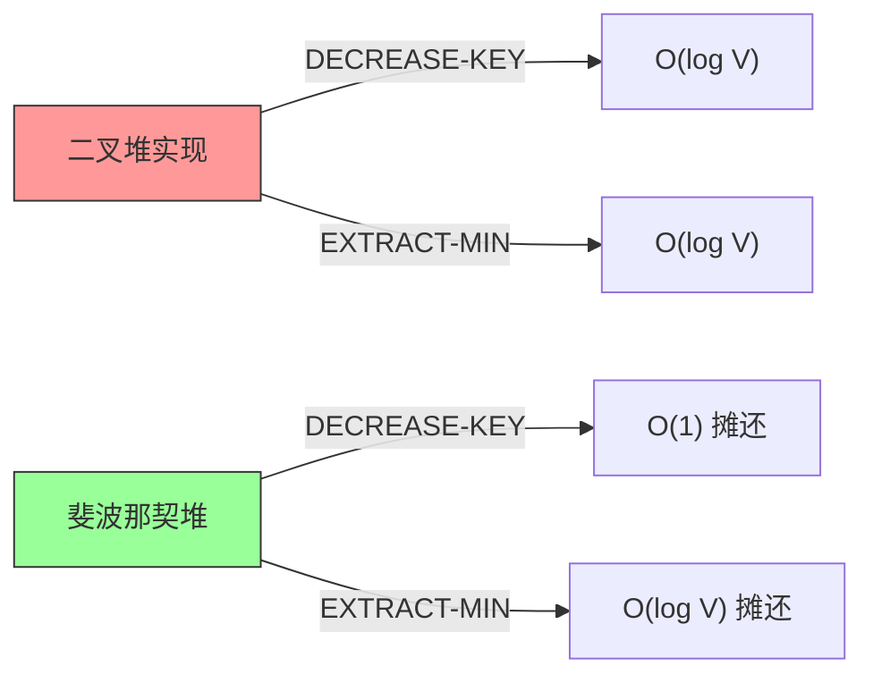

**复杂度对比**：

| 实现 | EXTRACT-MIN | DECREASE-KEY | 总时间 |
|-----|-------------|--------------|--------|
| 二叉堆 | $O(\log V)$ | $O(\log V)$ | $O(E log V)$ |
| 斐波那契堆 | $O(\log V)$ | $O(1)$ | $O(E + V log V)$ |

---

## 五、具体例子演示

### 5.1 示例图

```
        6          5          -2
    0 -----> 1 -----> 3 -----> 4
    |        |                 ^
    | 7      | 8              |
    v        v                |
    2 -----> 3 ---------------+
          -3
```

顶点：0, 1, 2, 3, 4（0 是源点）

### 5.2 Bellman-Ford 执行过程

**初始化**：
```
dist[0] = 0, dist[1] = ∞, dist[2] = ∞, dist[3] = ∞, dist[4] = ∞
```

**第1轮松弛**（处理所有边）：
| 边 | 更新前 | 更新后 | 说明 |
|----|-------|-------|------|
| 0→1 (6) | ∞ → 6 | dist[1] = 6 |
| 0→2 (7) | ∞ → 7 | dist[2] = 7 |
| 1→3 (5) | ∞ → 11 | dist[3] = 11 |
| 2→3 (-3) | 11 → 4 | dist[3] = 4 | 改进！|
| 3→4 (-2) | ∞ → 2 | dist[4] = 2 |

**第2轮松弛**（没有更新，可以提前结束）

**最终结果**：
- dist[0] = 0
- dist[1] = 6
- dist[2] = 7
- dist[3] = 4
- dist[4] = 2

### 5.3 Dijkstra 执行过程

**使用优先队列 {0, 1, 2, 3, 4}，初始 dist = {0, ∞, ∞, ∞, ∞}**

| 步骤 | 操作 | 队列状态 (dist) | 说明 |
|-----|------|----------------|------|
| 1 | 取出 0 | {1:∞, 2:∞, 3:∞, 4:∞} | 源点已确定 |
| 2 | 松弛 0→1, 0→2 | {1:6, 2:7, 3:∞, 4:∞} | 更新 1 和 2 |
| 3 | 取出 1 | {2:7, 3:11, 4:∞} | 1 已确定 |
| 4 | 松弛 1→3 | {2:7, 3:11, 4:∞} | 无改进 |
| 5 | 取出 2 | {3:11, 4:∞} | 2 已确定 |
| 6 | 松弛 2→3 | {3:4, 4:∞} | 更新 3（改进！） |
| 7 | 取出 3 | {4:∞} | 3 已确定 |
| 8 | 松弛 3→4 | {4:2} | 更新 4 |
| 9 | 取出 4 | {} | 全部确定 |

**最终结果**：dist[4] = 2 ✓（恰好正确，因为路径 0→2→3→4 不涉及负权环）

### 5.4 负权环导致的问题

```
       -1
   a -----> b
   ^       |
   |      -1
   +-------+
```

**Bellman-Ford 检测**：
- 第1轮后：dist[a] = 0, dist[b] = -1
- 第2轮后：dist[a] = -2（通过 b 改进）, dist[b] = -2
- 第3轮后：dist[a] = -3, dist[b] = -3
- 无限继续... → 检测到负权环！

---

## 六、复杂度分析

### 6.1 时间复杂度对比

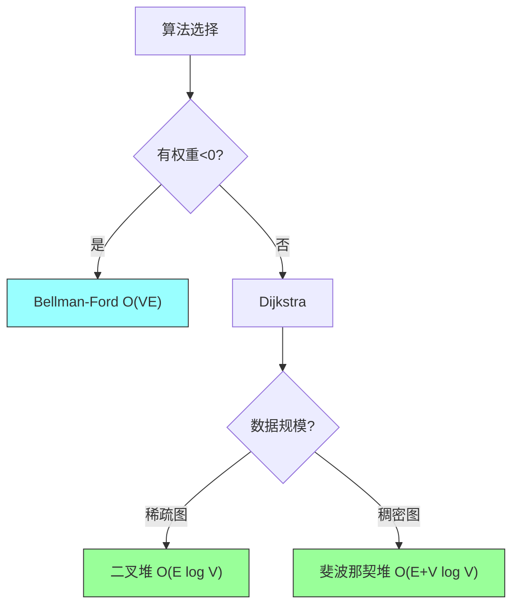

| 算法 | 时间复杂度 | 空间复杂度 | 适用场景 |
|-----|-----------|-----------|---------|
| Bellman-Ford | $O(VE)$ | $O(V)$ | 允许负权重，需要检测负环 |
| Dijkstra（二叉堆） | $O(E \log V)$ | $O(V)$ | 非负权重，稀疏图 |
| Dijkstra（斐波那契堆） | $O(E + V \log V)$ | $O(V)$ | 非负权重，稠密图 |

### 6.2 何时使用哪种算法

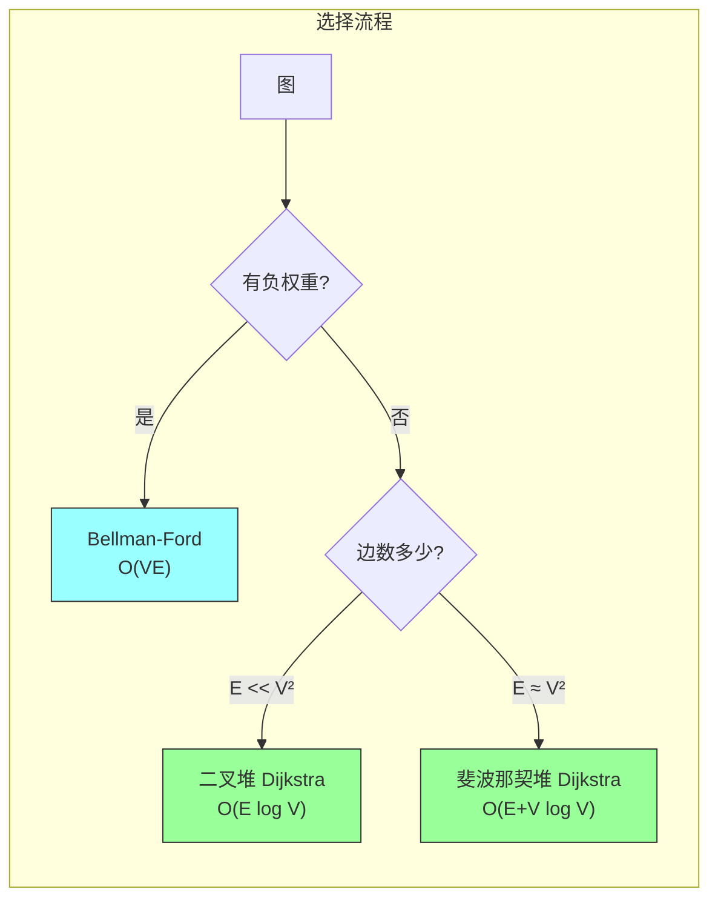

---

## 七、差分约束系统

### 7.1 什么是差分约束？

**形式**：$x_j - x_i \leq b_k$

**示例**：
- $x_2 - x_1 \leq 5$（从 1 到 2 不超过 5）
- $x_3 - x_2 \leq 3$（从 2 到 3 不超过 3）
- $x_1 - x_4 \leq -2$（从 4 到 1 至少为 2）

### 7.2 转化为图问题

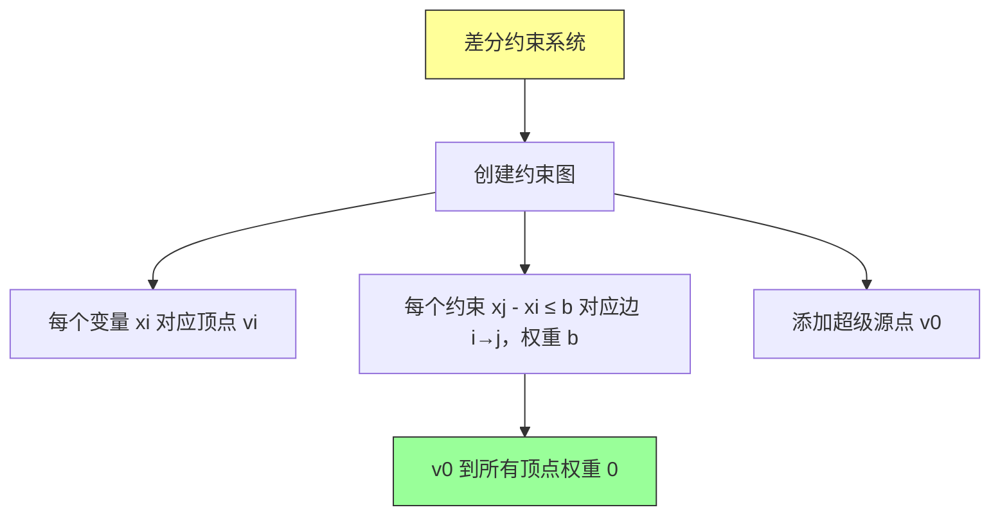

**定理 22.9**：
- 如果图中**没有负权环**，则 $\delta(v_0, v_i)$ 是可行解
- 如果有**负权环**，则**无解**

### 7.3 Java 实现

```java
import java.util.*;

/**
 * 差分约束系统求解
 * 将约束系统转化为最短路径问题
 */
public class DifferenceConstraints {

    /**
     * 求解差分约束系统
     * @param constraints 约束列表，每个约束为 {i, j, b} 表示 xj - xi ≤ b
     * @param n 变量个数
     * @return 可行解或 null（如果无解）
     */
    public static int[] solve(List<int[]> constraints, int n) {
        // 创建扩展图（n+1 个顶点，0 是超级源点）
        List<List<Edge>> graph = new ArrayList<>();
        for (int i = 0; i <= n; i++) {
            graph.add(new ArrayList<>());
        }

        // 添加超级源点到所有顶点的边（权重 0）
        for (int i = 0; i < n; i++) {
            graph.get(0).add(new Edge(i + 1, 0));  // 顶点 0 到 顶点 i+1
        }

        // 添加约束边
        for (int[] constraint : constraints) {
            int i = constraint[0];      // xi
            int j = constraint[1];      // xj
            int b = constraint[2];      // xj - xi ≤ b
            graph.get(i + 1).add(new Edge(j + 1, b));
        }

        // 使用 Bellman-Ford 求解
        BellmanFord.Result result = BellmanFord.bellmanFord(n + 1,
            convertToEdges(graph), 0);

        if (result.hasNegativeCycle) {
            System.out.println("约束系统无解：存在负权环");
            return null;
        }

        // 提取解（去掉超级源点）
        int[] solution = new int[n];
        for (int i = 0; i < n; i++) {
            solution[i] = result.dist[i + 1];
        }
        return solution;
    }

    /**
     * 将邻接表转换为边列表
     */
    private static List<BellmanFord.Edge> convertToEdges(List<List<Edge>> graph) {
        List<BellmanFord.Edge> edges = new ArrayList<>();
        for (int u = 0; u < graph.size(); u++) {
            for (Edge e : graph.get(u)) {
                edges.add(new BellmanFord.Edge(u, e.to, e.weight));
            }
        }
        return edges;
    }

    /**
     * 边的定义
     */
    public static class Edge {
        int to;
        int weight;

        public Edge(int to, int weight) {
            this.to = to;
            this.weight = weight;
        }
    }

    // 测试
    public static void main(String[] args) {
        // 约束系统：
        // x1 - x2 ≤ 1
        // x1 - x4 ≤ -4
        // x2 - x3 ≤ 2
        // x3 - x4 ≤ 9

        List<int[]> constraints = Arrays.asList(
            new int[]{1, 2, 1},   // x2 - x1 ≤ 1
            new int[]{3, 1, -4},  // x1 - x4 ≤ -4 → x1 - x4 ≤ -4
            new int[]{2, 3, 2},   // x3 - x2 ≤ 2
            new int[]{3, 4, 9}    // x4 - x3 ≤ 9
        );

        int[] solution = solve(constraints, 4);

        if (solution != null) {
            System.out.println("差分约束系统的可行解：");
            for (int i = 0; i < solution.length; i++) {
                System.out.printf("x%d = %d%n", i + 1, solution[i]);
            }
        }
    }
}
```

---

## 八、方法对比与总结

### 8.1 核心思想提炼

| 算法 | 核心思想 | 贪心选择 |
|-----|---------|---------|
| Bellman-Ford | 多次松弛所有边 | 无 |
| Dijkstra | 每次选最近的顶点 | 选择当前距离最小的顶点 |

```mermaid
flowchart TD
    A["最短路径算法"] --> B["Bellman-Ford\n通用但慢"]
    A --> C["Dijkstra\n快但有限制"]
    B --> D["多次松弛"]
    C --> E["贪心选择"]

    style B fill:#9ff,stroke:#333
    style C fill:#9f9,stroke:#333
```

### 8.2 适用场景

| 场景 | 推荐算法 |
|-----|---------|
| 有负权重，需要检测负环 | Bellman-Ford |
| 非负权重，稀疏图 | Dijkstra（二叉堆） |
| 非负权重，稠密图 | Dijkstra（斐波那契堆） |
| 差分约束系统 | Bellman-Ford |

### 8.3 代码模板

**Bellman-Ford 模板**：
```java
// 初始化
int[] dist = new int[n];
Arrays.fill(dist, Integer.MAX_VALUE);
dist[source] = 0;

// 松弛 |V|-1 次
for (int i = 0; i < n - 1; i++) {
    for (Edge edge : edges) {
        if (dist[edge.u] != INF && dist[edge.u] + edge.weight < dist[edge.v]) {
            dist[edge.v] = dist[edge.u] + edge.weight;
        }
    }
}

// 检测负环
for (Edge edge : edges) {
    if (dist[edge.u] != INF && dist[edge.u] + edge.weight < dist[edge.v]) {
        // 有负权环
    }
}
```

**Dijkstra 模板**：
```java
// 初始化
int[] dist = new int[n];
Arrays.fill(dist, Integer.MAX_VALUE);
dist[source] = 0;

// 使用优先队列
PriorityQueue<Node> pq = new PriorityQueue<>((a, b) -> a.dist - b.dist);
pq.offer(new Node(source, 0));

while (!pq.isEmpty()) {
    Node cur = pq.poll();
    if (cur.dist > dist[cur.vertex]) continue;  // 跳过过时条目

    for (Edge edge : graph.get(cur.vertex)) {
        if (dist[cur.vertex] + edge.weight < dist[edge.to]) {
            dist[edge.to] = dist[cur.vertex] + edge.weight;
            pq.offer(new Node(edge.to, dist[edge.to]));
        }
    }
}
```

---

## 九、举一反三

### 9.1 相关 LeetCode 题目

| 题目 | 难度 | 链接 |
|-----|------|------|
| 743. 网络延迟时间 | 中等 | https://leetcode.cn/problems/network-delay-time/ |
| 787. K 站中转内最便宜的航班 | 中等 | https://leetcode.cn/problems/cheapest-flights-within-k-stops/ |
| 1514. 概率最大的路径 | 困难 | https://leetcode.cn/problems/path-with-maximum-probability/ |
| 1785. 特殊任务调度器 | 困难 | https://leetcode.cn/problems/number-of-restricted-paths-from-first-to-last-node/ |

### 9.2 变形题目

1. **多源最短路径**：用多次 Dijkstra 或 Floyd-Warshall
2. **所有点对最短路径**：Floyd-Warshall 或 Johnson 算法
3. **带约束的最短路径**：如路径长度限制
4. **最大概率路径**：将权重转换为对数求和

### 9.3 核心思想迁移

| 思想 | 迁移应用 |
|-----|---------|
| 松弛操作 | 差分约束求解 |
| 负权环检测 | 循环依赖检测 |
| 贪心选择 | 各类优化问题 |
| 前驱指针 | 路径重建 |

---

## 十、章节练习题解答

### 练习 22.2-1

**题目**：Dijkstra 算法中，为什么当边权重非负时，EXTRACT-MIN 返回的顶点 $u$ 的距离 $u.d$ 是最终的最短距离？

**解答**：反证法。

假设存在更短的路径到 $u$，设该路径经过顶点 $v$。由于 $v$ 不在已确定的集合 $S$ 中，且 $v.d \geq u.d$（因为 $u$ 是最小值），这意味着：
- 要么 $v$ 的距离已经确定且 $\geq u.d$，不可能更短
- 要么 $v$ 还未确定，但 $v.d \geq u.d$，路径长度不可能更短

矛盾，因此 $u.d$ 是最终最短距离。

### 练习 22.4-1

**题目**：判断以下差分约束系统是否有解

```
x1 - x2 ≤ 1
x1 - x4 ≤ -4
x2 - x3 ≤ 2
x2 - x5 ≤ 7
x2 - x6 ≤ 5
x3 - x6 ≤ 10
x4 - x2 ≤ 2
x5 - x1 ≤ -1
x5 - x4 ≤ 3
x6 - x3 ≤ -8
```

**解答**：使用 Bellman-Ford 构造约束图并检测负权环。根据计算，该系统有可行解。

---

## 十一、算法历史

| 时间 | 算法 | 作者 |
|-----|------|------|
| 1956 | Bellman-Ford | Bellman, Ford |
| 1959 | Dijkstra | Edsger Dijkstra |
| 1984 | 斐波那契堆优化 | Fredman, Tarjan |

---

## 十二、Java 完整实现汇总

### 12.1 工具类

```java
import java.util.*;

/**
 * 单源最短路径工具类
 */
public class SSSP {

    /**
     * Bellman-Ford 算法
     */
    public static class BellmanFord {
        public static class Edge {
            int u, v, weight;
            public Edge(int u, int v, int weight) {
                this.u = u;
                this.v = v;
                this.weight = weight;
            }
        }

        public static int[] solve(int n, List<Edge> edges, int source) {
            int[] dist = new int[n];
            Arrays.fill(dist, Integer.MAX_VALUE);
            dist[source] = 0;

            // |V|-1 次松弛
            for (int i = 0; i < n - 1; i++) {
                for (Edge e : edges) {
                    if (dist[e.u] != Integer.MAX_VALUE &&
                        dist[e.u] + e.weight < dist[e.v]) {
                        dist[e.v] = dist[e.u] + e.weight;
                    }
                }
            }

            return dist;
        }

        public static boolean hasNegativeCycle(int n, List<Edge> edges) {
            int[] dist = solve(n, edges, 0);
            for (Edge e : edges) {
                if (dist[e.u] != Integer.MAX_VALUE &&
                    dist[e.u] + e.weight < dist[e.v]) {
                    return true;
                }
            }
            return false;
        }
    }

    /**
     * Dijkstra 算法（使用优先队列）
     */
    public static class Dijkstra {
        public static class Edge {
            int to, weight;
            public Edge(int to, int weight) {
                this.to = to;
                this.weight = weight;
            }
        }

        public static int[] solve(int n, List<List<Edge>> graph, int source) {
            int[] dist = new int[n];
            Arrays.fill(dist, Integer.MAX_VALUE);
            dist[source] = 0;

            // (距离, 顶点) 优先队列
            PriorityQueue<int[]> pq = new PriorityQueue<>((a, b) -> a[0] - b[0]);
            pq.offer(new int[]{0, source});

            while (!pq.isEmpty()) {
                int[] cur = pq.poll();
                int d = cur[0], u = cur[1];

                if (d > dist[u]) continue;  // 跳过过时条目

                for (Edge e : graph.get(u)) {
                    int v = e.to;
                    int newDist = dist[u] + e.weight;

                    if (newDist < dist[v]) {
                        dist[v] = newDist;
                        pq.offer(new int[]{newDist, v});
                    }
                }
            }

            return dist;
        }
    }
}
```

### 12.2 使用示例

```java
public class Main {
    public static void main(String[] args) {
        // 示例图
        int n = 5;
        List<List<Dijkstra.Edge>> graph = new ArrayList<>();
        for (int i = 0; i < n; i++) {
            graph.add(new ArrayList<>());
        }

        // 添加边
        graph.get(0).add(new Dijkstra.Edge(1, 6));
        graph.get(0).add(new Dijkstra.Edge(2, 7));
        graph.get(1).add(new Dijkstra.Edge(3, 5));
        graph.get(2).add(new Dijkstra.Edge(3, 8));
        graph.get(3).add(new Dijkstra.Edge(4, -2));

        // Dijkstra
        int[] dist = SSSP.Dijkstra.solve(n, graph, 0);

        System.out.println("从顶点 0 出发的最短距离：");
        for (int i = 0; i < n; i++) {
            System.out.printf("到 %d: %d%n", i, dist[i] == Integer.MAX_VALUE ? -1 : dist[i]);
        }
    }
}
```

---

*Generated by Algorithm Tutor - 基于《算法导论》第22章*
