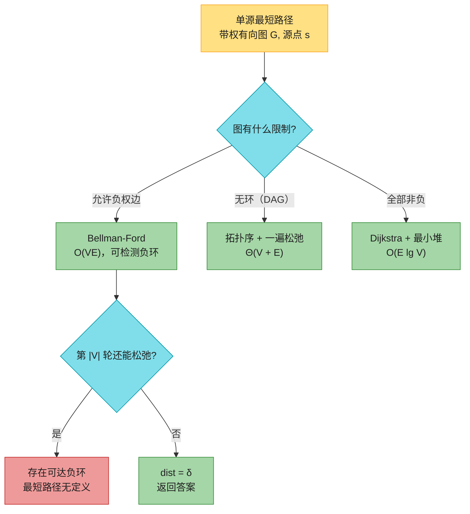
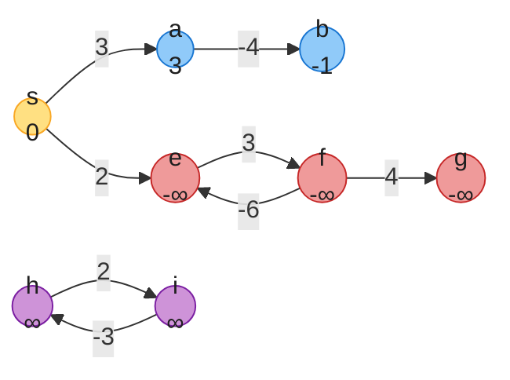
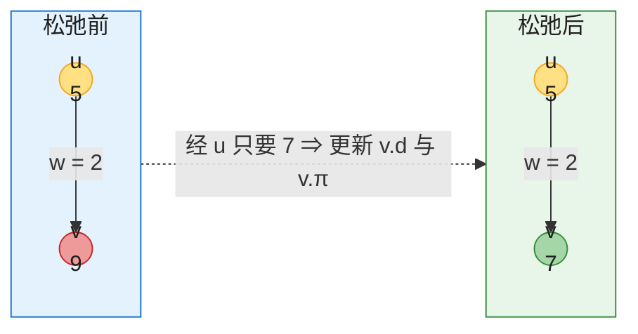
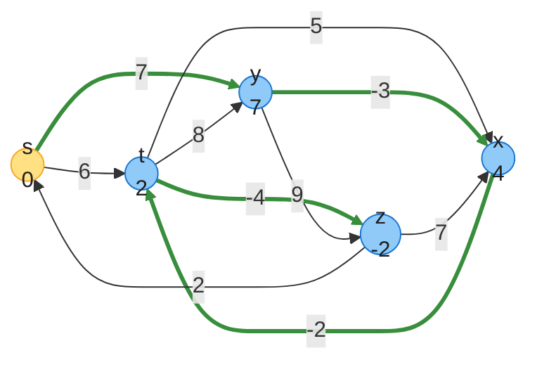
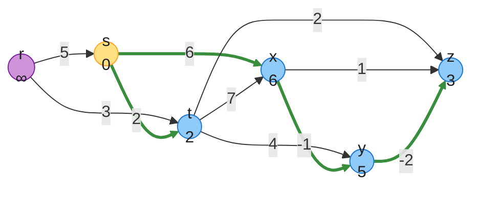
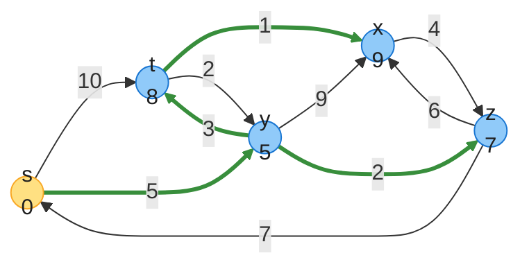
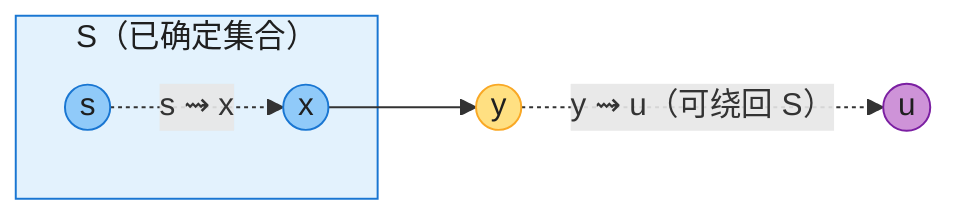
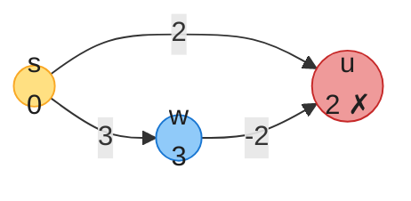
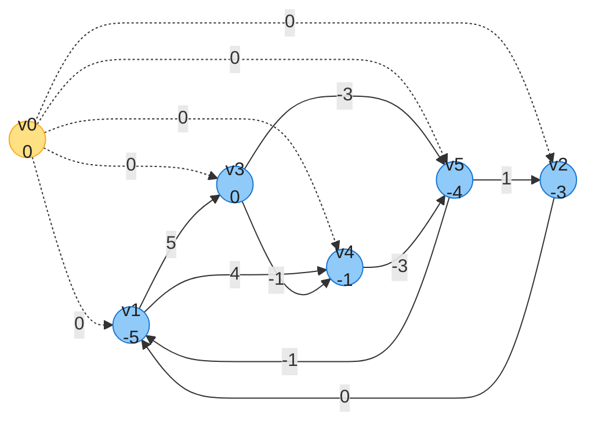

# 第 22 章：单源最短路径（Single-Source Shortest Paths）——深度版

## 一、开篇定位

本章回答一个问题：**给定带权有向图和源点 s，如何求出 s 到每个顶点的最短路径？**原书引子是导航：从纽约州 Oceanside 开到加州 Oceanside，GPS 里存着整张路网（路口 = 顶点，路段 = 边，里程 = 权重）。枚举所有路线再取最小？即使不允许绕圈，路线数量也是天文数字——而且大多数明显不值一看（绕去迈阿密的路线可以直接排除）。本章就是要在 $O(VE)$ 甚至 $O(E \lg V)$ 内解决它。

边权可以表示距离、时间、费用等任何「沿路径线性累加、希望最小化」的量。几个变体都能化归到单源问题：单目的地（把所有边反向即变单源）、单点对（已知算法最坏情况不比单源更快）、所有点对（第 23 章专门讨论，其 Johnson 算法 = 1 次 Bellman-Ford + |V| 次 Dijkstra）。

与前后章节的关系：

- **第 20 章 BFS** 就是「每条边权都是 1」的最短路算法，本章的 d 值、π 前驱、前驱子图等概念全是 BFS 的推广；22.2 节还要用到 **20.4 的拓扑排序**；
- Dijkstra 与 **第 21 章 Prim** 骨架同构（最小优先队列 + 波前生长），区别只在键值的语义；
- 优先队列（**第 6 章**）是 Dijkstra 的性能关键；**第 24 章** Edmonds-Karp 最大流也依赖最短路。

本章三个算法按「图的限制」分工，外加一个应用：



做题定位：单源最短路是图论题的主力工具——743 是 Dijkstra 裸模板；787（限 k 次中转）是 Bellman-Ford 的主场；2050（并行课程）是 DAG 最长路；1514/1786/1976 是 Dijkstra 的变形与计数。

**本章主线**：松弛框架与六条性质（本章导言）→ Bellman-Ford（22.1）→ DAG 最短路（22.2）→ Dijkstra（22.3）→ 差分约束（22.4）→ Java + Python 双实现 → 速查/易混 → 题单与习题。

---

## 二、核心思想：一切都是「松弛」

### 2.1 问题定义与三个前提事实

给定带权有向图 $G = (V, E)$，权重函数 $w: E \to \mathbb{R}$。路径 $p = \langle v_0, v_1, \dots, v_k \rangle$ 的权重是边权之和 $w(p) = \sum_{i=1}^{k} w(v_{i-1}, v_i)$。**最短路径权重**：

$$\delta(s, v) = \begin{cases} \min\{w(p) : s \leadsto v\} & \text{存在 } s \text{ 到 } v \text{ 的路径} \\ \infty & \text{不可达} \end{cases}$$

动手写算法之前，先确立三个前提事实——后面所有算法都站在它们上面：

**事实 1：最优子结构（引理 22.1）**。最短路径的任意一段子路径，本身也是其端点间的最短路径（反证：若子路径有更短的走法，换掉它整条路径就更短，矛盾）。这正是贪心（Dijkstra）与动态规划（第 23 章 Floyd-Warshall）能用的原因。

**事实 2：最短路径可以假设是简单路径**。正权环删掉更短，0 权环删掉一样短，所以最短路径里绝不需要环；而**从 s 可达的负权环会让 $\delta(s, v) = -\infty$**——绕环一圈权重就小一点，「最短」无定义。无环路径至多 $|V|-1$ 条边，这是 Bellman-Ford 轮次上界的来历。

**事实 3：最短路径用前驱指针 π 表示**。和 BFS 一样，每个顶点记一个前驱 $v.\pi$，从 v 沿 π 链回溯即得路径。所有 π 构成的**前驱子图**在算法收敛后是一棵**最短路径树**（rooted at s，树上路径即最短路）。树不唯一：同一源点可以有多棵最短路径树（原书 Figure 22.2 给了两棵）。

负权边、负权环、不可达，三种情形一张图说清：



**图 A**（对应 Figure 22.1，顶点内为 δ 值）：① 有负权**边**没关系——δ(s,b) = −1 依然定义良好；② 环 ⟨e, f⟩ 权 3 + (−6) = −3 < 0 且从 s 可达 ⇒ δ(s,e) = δ(s,f) = −∞，下游的 g 跟着变成 −∞；③ 环 ⟨h, i⟩ 也是负环，但从 s **不可达** ⇒ δ = ∞ 而非 −∞。Dijkstra 假设所有边非负；Bellman-Ford 允许负权边，并能检测情形②。

### 2.2 初始化与松弛：本章唯一原语

每个顶点维护最短路径估计 $v.d$（δ 的上界）与前驱 $v.\pi$。初始化 Θ(V)：

```
INITIALIZE-SINGLE-SOURCE(G, s)
1  for each vertex v ∈ G.V
2      v.d = ∞
3      v.π = NIL
4  s.d = 0
```

**松弛**边 (u, v)：试试「经过 u 去 v」会不会更短，会就更新，O(1)：

```
RELAX(u, v, w)
1  if v.d > u.d + w(u, v)
2      v.d = u.d + w(u, v)
3      v.π = u
```



**图 B**（对应 Figure 22.3(a)）：v.d = 9 不是最短的，经 u 只要 5 + 2 = 7 ⇒ 更新。若松弛前 v.d = 6 ≤ 5 + 2，则什么都不发生（Figure 22.3(b)）。

本章三个算法是同一骨架：**初始化后反复松弛，区别只在每条边松弛几次、按什么顺序**——Dijkstra 与 DAG 算法每条边恰好松弛一次，Bellman-Ford 每条边松弛 $|V|-1$ 次。

### 2.3 六条性质速查（22.5 的结论）

原书 22.5 节是这六条性质的形式证明（归纳 + 三角不等式来回套），按数学克制原则只留结论与一句直觉——它们是三个算法正确性的全部依据：

| 性质 | 内容 | 一句话直觉 |
|------|------|-----------|
| 三角不等式 | 对任意边 (u,v)：$\delta(s,v) \le \delta(s,u) + w(u,v)$ | 直达最短路不会比「绕经 u」更长 |
| 上界性质 | 恒有 $v.d \ge \delta(s,v)$；一旦相等永不再变 | 估计只降不升，且不会降过头 |
| 无路径性质 | v 不可达 ⇒ 恒有 $v.d = \delta(s,v) = \infty$ | 没有边能把估计值带过去 |
| 收敛性质 | $s \leadsto u \to v$ 是最短路且松弛前 $u.d = \delta(s,u)$ ⇒ 松弛后 $v.d = \delta(s,v)$ | 前驱对了，松弛一次后继就对 |
| 路径松弛性质 | 沿最短路 $p = \langle v_0, \dots, v_k \rangle$ **按序**松弛各边 ⇒ $v_k.d = \delta(s,v_k)$，无论中间夹杂什么别的松弛 | Bellman-Ford 与 DAG 算法的正确性核心 |
| 前驱子图性质 | 全部收敛后，π 诱导的子图是一棵最短路径树 | 路径重建的依据 |

---

## 三、Bellman-Ford 算法（22.1）

### 3.1 直觉：第 i 轮搞定「≤ i 条边的最短路」

最朴素的想法：每一轮把**所有边**都松弛一遍。第 1 轮后，「1 条边能到的最短路」全部确定；第 2 轮后，「≤ 2 条边的最短路」全部确定（路径松弛性质：最短路的边被按序覆盖到）；依此类推。简单路径至多 $|V|-1$ 条边 ⇒ **|V|−1 轮后所有最短路收敛**。之后再多扫一遍：若还有边能松弛，说明存在可达负权环（否则三角不等式已让所有边「松弛不动」）。

暴力但可靠：允许负权边，还能顺便检测负环。

### 3.2 伪代码（CLRS 1-indexed，第四版）

```
BELLMAN-FORD(G, w, s)
1  INITIALIZE-SINGLE-SOURCE(G, s)
2  for i = 1 to |G.V| - 1
3      for each edge (u, v) ∈ G.E
4          RELAX(u, v, w)
5  for each edge (u, v) ∈ G.E
6      if v.d > u.d + w(u, v)
7          return FALSE      // 存在从 s 可达的负权环
8  return TRUE
```

### 3.3 完整 trace（对应 Figure 22.4）

示例图（顶点内为**最终** δ 值，绿粗边 = 收敛后的最短路径树）：



**图 C**：5 顶点 10 边的图（含负权边，无负环）。每轮按固定边序 (t,x), (t,y), (t,z), (x,t), (y,x), (y,z), (z,x), (z,s), (s,t), (s,y) 松弛；绿粗边 (s,y), (y,x), (x,t), (t,z) 是最终的前驱边。

| 轮次 | s | t | x | y | z | 本轮发生更新的边 |
|------|---|---|---|---|---|------------------|
| 初始 | 0 | ∞ | ∞ | ∞ | ∞ | — |
| 第 1 轮 | 0 | **6** | ∞ | **7** | ∞ | (s,t)、(s,y) |
| 第 2 轮 | 0 | 6 | **4** | 7 | **2** | (t,x) 先得 11，随后 (y,x) 改为 4；(t,z) |
| 第 3 轮 | 0 | **2** | 4 | 7 | 2 | (x,t)：4 + (−2) = 2 |
| 第 4 轮 | 0 | 2 | 4 | 7 | **−2** | (t,z)：2 + (−4) = −2 |

最终 (s, t, x, y, z) = (0, 2, 4, 7, −2)，第 5 轮检查全部边都松弛不动 ⇒ 返回 TRUE。注意第 2 轮里 x 先被 (t,x) 设为 11、又被同轮的 (y,x) 改成 4——**轮内串联更新是允许的**（只会加速收敛，不影响正确性）；LeetCode 787 那种「限 k 条边」的语义才需要禁用串联（用上一轮快照）。

### 3.4 负环检测与两个实用优化

**检测原理**：若无可达负环，|V|−1 轮后所有边满足 $v.d \le u.d + w(u,v)$（三角不等式），第 5–8 行的检查全过 ⇒ TRUE；若有可达负环，环上各不等式求和会得「$0 \le$ 负环权」的矛盾 ⇒ 环上必有边还能松弛 ⇒ FALSE。

**提前退出**（习题 22.1-3）：一轮下来没有任何更新 ⇒ 已收敛，直接停。设 m 为「各顶点最短路的最少边数」的最大值，则 m+1 轮必收敛。

**找出负环本身**（习题 22.1-7）：第 |V| 轮仍被更新的顶点，沿 π 链走 |V| 步必重复 ⇒ 那个环就是负权环。

**复杂度**：邻接表下 |V|−1 轮、每轮扫 |V| 个邻接表共 |E| 条边 ⇒ $O(V^2 + VE)$；常见的 $E = \Omega(V)$ 情形即 $O(VE)$。输入若是边列表则天然 $O(VE)$（习题 22.1-5）。空间 $O(V)$。

LeetCode 标注：787（K 站中转内最便宜的航班——只跑 k+1 轮、且每轮用上一轮的快照，正是「≤ k+1 条边的最短路」语义）。

---

## 四、DAG 上的单源最短路径（22.2）

### 4.1 直觉：拓扑序就是「正确的松弛顺序」

路径松弛性质说：沿最短路径**按序**松弛各边即收敛。DAG 的拓扑序恰好保证：对任意路径，路径上的边在拓扑序中必然先后出现。所以**按拓扑序扫一遍顶点、松弛各自的所有出边**，每条边只松弛一次，全部收敛——还允许负权边（DAG 无环，负权环天然不存在，δ 总有定义）。

### 4.2 伪代码（CLRS 1-indexed，第四版）

```
DAG-SHORTEST-PATHS(G, w, s)
1  topologically sort the vertices of G
2  INITIALIZE-SINGLE-SOURCE(G, s)
3  for each vertex u ∈ G.V, taken in topologically sorted order
4      for each vertex v in G.Adj[u]
5          RELAX(u, v, w)
```

### 4.3 完整 trace（对应 Figure 22.5）



**图 D**：顶点已按拓扑序 r, s, t, x, y, z 从左到右排开（所有边朝右）。源点 s；r 在 s 之前但不可达 s 之后的世界——从 s 出发 r 的 δ = ∞。绿粗边 = 最短路径树 (s,t), (s,x), (x,y), (y,z)。

| 处理顶点 | r | s | t | x | y | z | 本轮松弛效果 |
|---------|---|---|---|---|---|---|--------------|
| 初始 | ∞ | 0 | ∞ | ∞ | ∞ | ∞ | — |
| r | ∞ | 0 | ∞ | ∞ | ∞ | ∞ | r.d = ∞，出边松弛全部无效 |
| s | ∞ | 0 | **2** | **6** | ∞ | ∞ | t ← 2，x ← 6 |
| t | ∞ | 0 | 2 | 6 | **6** | **4** | x：2 + 7 = 9 > 6 不变 |
| x | ∞ | 0 | 2 | 6 | **5** | 4 | y：6 + (−1) = 5 |
| y | ∞ | 0 | 2 | 6 | 5 | **3** | z：5 + (−2) = 3 |

最终 (r, s, t, x, y, z) = (∞, 0, 2, 6, 5, 3)。拓扑排序 Θ(V+E) + 每条边松弛一次 Θ(V+E) ⇒ **总 Θ(V+E)，线性**。

### 4.4 应用：PERT 图的关键路径

PERT 分析里，边 = 任务（权重 = 耗时），顶点 = 里程碑（所有入边任务完成才算达成）。**关键路径 = DAG 上的最长路径**，它给出整个工程耗时的下界。求法二选一：边权取反跑 DAG-SHORTEST-PATHS；或把初始化的 ∞ 换成 −∞、RELAX 的 > 换成 < 直接求最长路。LeetCode 2050（并行课程 III）就是这个模型。

LeetCode 标注：2050（DAG 最长路）；802（拓扑排序找安全节点，同源）。

---

## 五、Dijkstra 算法（22.3）

### 5.1 直觉：BFS 的带权推广

把 BFS 的「波」推广到带权图：波从源点发出，边 (u,v) 要耗时 w(u,v) 才能走完。BFS 用 FIFO 队列决定下一个发波的顶点就够了（每条边耗时相同），带权图则必须用**最小优先队列**——下一刻最先被波到达的，是当前估计值最小的顶点。

算法维护集合 S（最短路已确定的顶点）。每轮从 V−S 中取出 d 最小的 u 加入 S（**贪心选择**），再松弛 u 的所有出边。非负权是贪心的前提：u 一旦进 S，$u.d = \delta(s,u)$ 永不再变。

### 5.2 伪代码（CLRS 1-indexed，第四版）

```
DIJKSTRA(G, w, s)
1  INITIALIZE-SINGLE-SOURCE(G, s)
2  S = ∅
3  Q = ∅
4  for each vertex u ∈ G.V
5      INSERT(Q, u)
6  while Q ≠ ∅
7      u = EXTRACT-MIN(Q)
8      S = S ∪ {u}
9      for each vertex v in G.Adj[u]
10         RELAX(u, v, w)
11         if the call of RELAX decreased v.d
12             DECREASE-KEY(Q, v, v.d)
```

第四版相对第三版把优先队列操作写全了：第 4–5 行显式 INSERT 全部顶点，第 11–12 行显式 DECREASE-KEY（第三版把它隐含在 RELAX 里）。while 循环恰好执行 |V| 次（每顶点进 S 恰好一次），DECREASE-KEY 至多 |E| 次。

### 5.3 完整 trace（对应 Figure 22.6）



**图 E**：全部边权非负。绿粗边 = 最短路径树 (s,y), (y,t), (y,z), (t,x)。

| 步骤 | EXTRACT-MIN | t | x | y | z | 松弛效果 |
|------|-------------|---|---|---|---|----------|
| 初始 | — | ∞ | ∞ | ∞ | ∞ | — |
| 1 | s (0) | **10** | ∞ | **5** | ∞ | 更新 t、y |
| 2 | y (5) | **8** | **14** | 已定 | **7** | 更新 t、x、z |
| 3 | z (7) | 8 | **13** | 已定 | 已定 | x：7 + 6 = 13 < 14 |
| 4 | t (8) | 已定 | **9** | 已定 | 已定 | x：8 + 1 = 9 |
| 5 | x (9) | 已定 | 已定 | 已定 | 已定 | 无更新，结束 |

最终 (s, t, x, y, z) = (0, 8, 9, 5, 7)。注意 x 的估计值经历了 14 → 13 → 9 三次 DECREASE-KEY——**进 S 之前 d 可以一直变，进 S 那一刻才钉死**。

### 5.4 正确性一句话 + 负权为什么挂

**定理 22.6 的夹逼**（图 F）：设 u 即将进 S，取 s⇝u 的最短路，y 是这条路上第一个不在 S 的顶点，x ∈ S 是 y 的前驱。x 进 S 时已松弛过 (x,y) ⇒ $y.d = \delta(s,y)$（收敛性质）；y 不晚于 u 且边权非负 ⇒ $\delta(s,y) \le \delta(s,u)$；EXTRACT-MIN 选了 u ⇒ $u.d \le y.d$；上界性质 ⇒ $\delta(s,u) \le u.d$。串起来：

$$\delta(s,y) \le \delta(s,u) \le u.d \le y.d = \delta(s,y) \;\Rightarrow\; \text{全等} \;\Rightarrow\; u.d = \delta(s,u)$$



**图 F**（对应 Figure 22.7）：y 是 s⇝u 最短路上第一个 S 外的顶点。证明里**唯一用到非负权的是 $\delta(s,y) \le \delta(s,u)$**（y 到 u 那段不拖后腿）——负权边恰恰能打破它：



**图 G**（习题 22.3-2 的反例）：Dijkstra 第 2 步就取出 u(2) 钉死，但真正的最短路是 s→w→u = 3 + (−2) = **1**——更短的路线藏在「当前估计更大」的 w 后面。此时 $\delta(s,w) = 3 > \delta(s,u) = 1$，夹逼断裂。特例：若负权边**只从 s 发出**，证明依然成立（y ≠ s 时 y⇝u 段非负），Dijkstra 仍正确（习题 22.3-11）。

### 5.5 复杂度与实战写法

| 优先队列实现 | EXTRACT-MIN（×V） | DECREASE-KEY（×E） | 总时间 |
|-------------|------------------|--------------------|--------|
| 朴素数组 | $O(V)$ | $O(1)$ | $O(V^2)$ |
| 二叉堆（第 6 章） | $O(\lg V)$ | $O(\lg V)$ | $O(E \lg V)$ |
| 斐波那契堆（第 16 章摊还） | $O(\lg V)$ 摊还 | $O(1)$ 摊还 | $O(E + V \lg V)$ |

- 稀疏图（$E = o(V^2 / \lg V)$）二叉堆优于数组；稠密图数组版 $O(V^2)$ 反而简单够用。
- **实战要点**：Java `PriorityQueue` / Python `heapq` 都没有高效 DECREASE-KEY ⇒ **懒删除**（重复入堆 + 取出时比对 dist 跳过过期条目，与第 6、21 章结论一致）。堆中条目增至 O(E)，复杂度仍为 $O(E \lg E) = O(E \lg V)$。
- 与 Prim 对照：骨架一模一样，**Prim 的 key = 到「树」的最轻边权，Dijkstra 的 d = 到「源点」的最短距离**（易混点见第八节）。

LeetCode 标注：743（模板题）、1514（概率最大 = 松弛方向取反，习题 22.3-7）、1786、1976（最短路计数）。

---

## 六、差分约束（22.4）

### 6.1 从线性规划到差分约束

一般线性规划：$\max c^Tx$ s.t. $Ax \le b$（第 29 章）。**差分约束**是它的特例：A 的每行只有一个 1 和一个 −1，即每条约束形如

$$x_j - x_i \le b_k$$

应用场景：$x_i$ 是事件 i 的发生时刻，约束表示两个事件之间「至少/至多间隔多久」（如「涂胶后 2 小时内必须安装」$x_2 - x_1 \le 2$）。注意：若所有 $b_k \ge 0$，令所有 $x_i$ 相等即得平凡解——问题有趣的场合必有负的 $b_k$。

### 6.2 约束图与定理 22.9

把约束系统翻译成图：每个未知数 $x_i$ 对应顶点 $v_i$；每条约束 $x_j - x_i \le b_k$ 对应**边 $v_i \to v_j$，权重 $b_k$**（方向和不等号里的下标顺序相反，极易写反）；再加一个**超级源点 $v_0$**，向每个 $v_i$ 连权重 0 的边（保证存在能到达所有顶点的源点）。

**定理 22.9**：约束图无负权环 ⇒ $x = (\delta(v_0,v_1), \dots, \delta(v_0,v_n))$ 是一组可行解（三角不等式直接给出每条约束）；有负权环 ⇒ 把环上约束求和得「$0 \le$ 负环权」的矛盾 ⇒ **无解**。于是问题化为一次 Bellman-Ford。

原书系统 (22.2)–(22.9)（5 个未知数、8 条约束）的约束图：



**图 H**（对应 Figure 22.8）：实线 = 8 条约束边，虚线 = 超级源点的 0 权边，顶点内为 $\delta(v_0, v_i)$。读出解 $x = (-5, -3, 0, -1, -4)$。

**引理 22.8**：解加上任意常数 d 仍是解（差值不变）——所以 $(0, 2, 5, 4, 1)$ 也是解。另外 $\delta(v_0, v_i)$ 必 ≤ 0（0 权边直接可达，习题 22.4-3）。

**复杂度**：n 个未知数 m 条约束 ⇒ n+1 个顶点、n+m 条边 ⇒ Bellman-Ford $O((n+1)(n+m)) = O(n^2 + nm)$。习题 22.4-5 的改进：不显式加 $v_0$，改为初始化时把所有顶点 d 置 0（等价于 $v_0$ 的 0 权边效果）⇒ $O(nm)$。

LeetCode 标注：差分约束在 LeetCode 上没有直接模板题，思想见于「课程表 + 时间约束」类设计与调度问题；竞赛中常用于判约束系统可行性。

---

## 七、代码实现（Java + Python）

约定：伪代码是 1-indexed 的 CLRS 风格；实战代码统一 **0-indexed**。Bellman-Ford 输入边列表 `(u, v, w)`，DAG 与 Dijkstra 用邻接表 `adj[u] = [(v, w)]`；差分约束内部加超级源点。以下代码已实际编译运行：CLRS 图 22.4 / 22.5 / 22.6 的逐轮 trace 与终值全部对上（正文表格即取自运行输出）；差分约束跑出原书答案 $(-5,-3,0,-1,-4)$ 与习题 22.4-1 的解 $(-5,-3,0,-1,-6,-8)$；另做随机对拍——非负图 Dijkstra vs Bellman-Ford 2000 轮、含负权无负环图 500 轮（校验全部三角不等式 + 前驱链权重自洽）、随机 DAG 1000 轮，全部一致。

### 7.1 Java

```java
import java.util.*;

public class SSSP {
    static final long INF = Long.MAX_VALUE / 4; // 防加法溢出

    // ================= Bellman-Ford：边列表，O(VE)，可检测负环 =================
    static class BF {
        long[] dist;   // 最短距离估计
        int[] pi;      // 前驱
        boolean hasNegCycle;
    }

    // edges: int[]{u, v, w}
    static BF bellmanFord(int n, List<int[]> edges, int s) {
        long[] dist = new long[n];
        int[] pi = new int[n];
        Arrays.fill(dist, INF);
        Arrays.fill(pi, -1);
        dist[s] = 0;
        // |V|-1 轮全边松弛；一轮无更新即可提前结束（习题 22.1-3）
        for (int i = 0; i < n - 1; i++) {
            boolean changed = false;
            for (int[] e : edges) {
                int u = e[0], v = e[1], w = e[2];
                if (dist[u] != INF && dist[u] + w < dist[v]) {
                    dist[v] = dist[u] + w;
                    pi[v] = u;
                    changed = true;
                }
            }
            if (!changed) break;
        }
        // 第 |V| 轮仍能松弛 ⇔ 存在从 s 可达的负权环
        BF res = new BF();
        for (int[] e : edges) {
            if (dist[e[0]] != INF && dist[e[0]] + e[2] < dist[e[1]]) {
                res.hasNegCycle = true;
                break;
            }
        }
        res.dist = dist;
        res.pi = pi;
        return res;
    }

    // ================= DAG 最短路径：拓扑序一遍松弛，Θ(V+E)，允许负权 =================
    // adj[u] = {{v, w}, ...}
    static long[] dagShortest(int n, List<List<int[]>> adj, int s) {
        // Kahn 拓扑排序（第 20 章）
        int[] indeg = new int[n];
        for (int u = 0; u < n; u++)
            for (int[] e : adj.get(u)) indeg[e[0]]++;
        Deque<Integer> dq = new ArrayDeque<>();
        for (int i = 0; i < n; i++) if (indeg[i] == 0) dq.offer(i);
        List<Integer> topo = new ArrayList<>();
        while (!dq.isEmpty()) {
            int u = dq.poll();
            topo.add(u);
            for (int[] e : adj.get(u))
                if (--indeg[e[0]] == 0) dq.offer(e[0]);
        }
        // 按拓扑序松弛每个顶点的所有出边
        long[] dist = new long[n];
        Arrays.fill(dist, INF);
        dist[s] = 0;
        for (int u : topo) {
            if (dist[u] == INF) continue;
            for (int[] e : adj.get(u))
                if (dist[u] + e[1] < dist[e[0]])
                    dist[e[0]] = dist[u] + e[1];
        }
        return dist;
    }

    // ================= Dijkstra：二叉堆懒删除，O(E lg V)，要求非负权 =================
    static long[] dijkstra(int n, List<List<int[]>> adj, int s) {
        long[] dist = new long[n];
        Arrays.fill(dist, INF);
        dist[s] = 0;
        // Java PriorityQueue 无高效 DECREASE-KEY ⇒ 懒删除：重复入堆，过期条目取出时跳过
        PriorityQueue<long[]> pq = new PriorityQueue<>(Comparator.comparingLong(a -> a[0]));
        pq.offer(new long[]{0, s});                 // {距离, 顶点}
        while (!pq.isEmpty()) {
            long[] cur = pq.poll();
            long d = cur[0];
            int u = (int) cur[1];
            if (d > dist[u]) continue;              // 过期条目
            for (int[] e : adj.get(u)) {
                int v = e[0], w = e[1];
                if (dist[u] + w < dist[v]) {
                    dist[v] = dist[u] + w;
                    pq.offer(new long[]{dist[v], v});
                }
            }
        }
        return dist;
    }

    // ================= 差分约束：xj - xi <= b ⇔ 边 vi->vj 权 b =================
    // cons: int[]{i, j, b}（0-indexed 变量）；返回一组可行解，无解返回 null
    static long[] differenceConstraints(int n, List<int[]> cons) {
        List<int[]> edges = new ArrayList<>();
        for (int[] c : cons) edges.add(new int[]{c[0] + 1, c[1] + 1, c[2]}); // 变量 xi ↦ 顶点 i+1
        for (int i = 1; i <= n; i++) edges.add(new int[]{0, i, 0});          // 超级源点 v0
        BF bf = bellmanFord(n + 1, edges, 0);
        if (bf.hasNegCycle) return null;                                     // 负环 ⇔ 无解
        long[] x = new long[n];
        for (int i = 0; i < n; i++) x[i] = bf.dist[i + 1];                   // xi = δ(v0, vi)
        return x;
    }

    // ---------- 工具：边列表转邻接表 ----------
    static List<List<int[]>> toAdj(int n, List<int[]> edges) {
        List<List<int[]>> adj = new ArrayList<>();
        for (int i = 0; i < n; i++) adj.add(new ArrayList<>());
        for (int[] e : edges) adj.get(e[0]).add(new int[]{e[1], e[2]});
        return adj;
    }

    static String fmt(long d) { return d >= INF ? "∞" : String.valueOf(d); }

    public static void main(String[] args) {
        // ---- 1. Bellman-Ford：CLRS 图 22.4（s=0, t=1, x=2, y=3, z=4），逐轮 trace ----
        String[] names = {"s", "t", "x", "y", "z"};
        List<int[]> bfEdges = Arrays.asList(
            new int[]{1, 2, 5},   // (t,x)
            new int[]{1, 3, 8},   // (t,y)
            new int[]{1, 4, -4},  // (t,z)
            new int[]{2, 1, -2},  // (x,t)
            new int[]{3, 2, -3},  // (y,x)
            new int[]{3, 4, 9},   // (y,z)
            new int[]{4, 2, 7},   // (z,x)
            new int[]{4, 0, 2},   // (z,s)
            new int[]{0, 1, 6},   // (s,t)
            new int[]{0, 3, 7});  // (s,y)
        {
            int n = 5;
            long[] dist = new long[n];
            Arrays.fill(dist, INF);
            dist[0] = 0;
            System.out.println("Bellman-Ford trace（图 22.4，源点 s）:");
            System.out.println("  初始: s=0, t=∞, x=∞, y=∞, z=∞");
            for (int i = 1; i <= n - 1; i++) {
                boolean changed = false;
                for (int[] e : bfEdges) {
                    if (dist[e[0]] != INF && dist[e[0]] + e[2] < dist[e[1]]) {
                        dist[e[1]] = dist[e[0]] + e[2];
                        changed = true;
                    }
                }
                StringBuilder sb = new StringBuilder("  第 " + i + " 轮后: ");
                for (int v = 0; v < n; v++)
                    sb.append(names[v]).append('=').append(fmt(dist[v])).append(' ');
                System.out.println(sb.append(changed ? "" : "（无更新）"));
            }
            BF bf = bellmanFord(n, bfEdges, 0);
            System.out.println("  最终: " + Arrays.toString(Arrays.stream(bf.dist).mapToObj(SSSP::fmt).toArray())
                + ", 负环=" + bf.hasNegCycle);
            long[] expect = {0, 2, 4, 7, -2};
            if (!Arrays.equals(bf.dist, expect)) throw new AssertionError("图 22.4 结果不符");
        }

        // ---- 2. 负环检测：三角形 0->1->2->0，环权和 = -1 ----
        {
            List<int[]> neg = Arrays.asList(
                new int[]{0, 1, 1}, new int[]{1, 2, -3}, new int[]{2, 0, 1});
            BF bf = bellmanFord(3, neg, 0);
            System.out.println("负环检测: hasNegCycle=" + bf.hasNegCycle + "（应为 true）");
            if (!bf.hasNegCycle) throw new AssertionError();
        }

        // ---- 3. DAG 最短路：CLRS 图 22.5（r=0, s=1, t=2, x=3, y=4, z=5），源点 s ----
        {
            List<int[]> dagEdges = Arrays.asList(
                new int[]{0, 1, 5},  // r->s
                new int[]{0, 2, 3},  // r->t
                new int[]{1, 2, 2},  // s->t
                new int[]{1, 3, 6},  // s->x
                new int[]{2, 3, 7},  // t->x
                new int[]{2, 4, 4},  // t->y
                new int[]{2, 5, 2},  // t->z
                new int[]{3, 4, -1}, // x->y
                new int[]{3, 5, 1},  // x->z
                new int[]{4, 5, -2});// y->z
            long[] dist = dagShortest(6, toAdj(6, dagEdges), 1);
            System.out.println("DAG（图 22.5，源点 s）: r=" + fmt(dist[0]) + " s=" + fmt(dist[1])
                + " t=" + fmt(dist[2]) + " x=" + fmt(dist[3]) + " y=" + fmt(dist[4]) + " z=" + fmt(dist[5]));
            long[] expect = {INF, 0, 2, 6, 5, 3};
            if (!Arrays.equals(dist, expect)) throw new AssertionError("图 22.5 结果不符");
        }

        // ---- 4. Dijkstra：CLRS 图 22.6（s=0, t=1, x=2, y=3, z=4），源点 s ----
        {
            List<int[]> dijEdges = Arrays.asList(
                new int[]{0, 1, 10}, // s->t
                new int[]{0, 3, 5},  // s->y
                new int[]{1, 2, 1},  // t->x
                new int[]{1, 3, 2},  // t->y
                new int[]{2, 4, 4},  // x->z
                new int[]{3, 1, 3},  // y->t
                new int[]{3, 2, 9},  // y->x
                new int[]{3, 4, 2},  // y->z
                new int[]{4, 2, 6},  // z->x
                new int[]{4, 0, 7}); // z->s
            long[] dist = dijkstra(5, toAdj(5, dijEdges), 0);
            System.out.println("Dijkstra（图 22.6，源点 s）: s=" + fmt(dist[0]) + " t=" + fmt(dist[1])
                + " x=" + fmt(dist[2]) + " y=" + fmt(dist[3]) + " z=" + fmt(dist[4]));
            long[] expect = {0, 8, 9, 5, 7};
            if (!Arrays.equals(dist, expect)) throw new AssertionError("图 22.6 结果不符");
        }

        // ---- 5. 差分约束：原书系统 (22.2)-(22.9)，5 个未知数 ----
        {
            List<int[]> cons = Arrays.asList(
                new int[]{1, 0, 0},   // x0 - x1 <= 0
                new int[]{4, 0, -1},  // x0 - x4 <= -1
                new int[]{4, 1, 1},   // x1 - x4 <= 1
                new int[]{0, 2, 5},   // x2 - x0 <= 5
                new int[]{0, 3, 4},   // x3 - x0 <= 4
                new int[]{2, 3, -1},  // x3 - x2 <= -1
                new int[]{2, 4, -3},  // x4 - x2 <= -3
                new int[]{3, 4, -3}); // x4 - x3 <= -3
            long[] x = differenceConstraints(5, cons);
            System.out.println("差分约束 (22.2)-(22.9) 的解: " + Arrays.toString(x)
                + "（原书答案 (-5,-3,0,-1,-4)）");
            if (x == null || !Arrays.equals(x, new long[]{-5, -3, 0, -1, -4}))
                throw new AssertionError();
        }

        // ---- 6. 差分约束：习题 22.4-1（6 个未知数，10 条约束）----
        {
            List<int[]> cons = Arrays.asList(
                new int[]{1, 0, 1},   // x0 - x1 <= 1
                new int[]{3, 0, -4},  // x0 - x3 <= -4
                new int[]{2, 1, 2},   // x1 - x2 <= 2
                new int[]{4, 1, 7},   // x1 - x4 <= 7
                new int[]{5, 1, 5},   // x1 - x5 <= 5
                new int[]{5, 2, 10},  // x2 - x5 <= 10
                new int[]{1, 3, 2},   // x3 - x1 <= 2
                new int[]{0, 4, -1},  // x4 - x0 <= -1
                new int[]{3, 4, 3},   // x4 - x3 <= 3
                new int[]{2, 5, -8}); // x5 - x2 <= -8
            long[] x = differenceConstraints(6, cons);
            System.out.println("习题 22.4-1 的解: " + (x == null ? "无解" : Arrays.toString(x)));
            if (x != null) {
                for (int[] c : cons)
                    if (x[c[1]] - x[c[0]] > c[2]) throw new AssertionError("约束被违反");
            }
        }

        // ---- 7. 差分约束无解：x1 - x0 <= -1 且 x0 - x1 <= -1 ----
        {
            List<int[]> cons = Arrays.asList(
                new int[]{0, 1, -1},  // x1 - x0 <= -1
                new int[]{1, 0, -1}); // x0 - x1 <= -1
            long[] x = differenceConstraints(2, cons);
            System.out.println("矛盾系统的解: " + (x == null ? "无解（正确）" : "错误！"));
            if (x != null) throw new AssertionError();
        }

        // ---- 8. 随机对拍 ----
        Random rnd = new Random(42);
        for (int t = 0; t < 2000; t++) {
            int n = 2 + rnd.nextInt(10);
            List<int[]> edges = new ArrayList<>();
            for (int u = 0; u < n; u++)
                for (int v = 0; v < n; v++)
                    if (u != v && rnd.nextDouble() < 0.25)
                        edges.add(new int[]{u, v, 1 + rnd.nextInt(20)}); // 非负权
            List<List<int[]>> adj = toAdj(n, edges);
            int s = rnd.nextInt(n);
            long[] d1 = dijkstra(n, adj, s);
            long[] d2 = bellmanFord(n, edges, s).dist;
            if (!Arrays.equals(d1, d2)) throw new AssertionError("Dijkstra != Bellman-Ford");
        }
        System.out.println("随机对拍 2000 轮通过（非负图：Dijkstra == Bellman-Ford）");

        // 含负权（无负环）图：Bellman-Ford 结果须满足全部三角不等式 + 前驱链权重自洽
        int checked = 0;
        while (checked < 500) {
            int n = 2 + rnd.nextInt(8);
            List<int[]> edges = new ArrayList<>();
            Map<Long, Integer> wmap = new HashMap<>();
            for (int u = 0; u < n; u++)
                for (int v = 0; v < n; v++)
                    if (u != v && rnd.nextDouble() < 0.3) {
                        int w = -5 + rnd.nextInt(15);
                        edges.add(new int[]{u, v, w});
                        wmap.put(((long) u << 32) | v, w);
                    }
            int s = rnd.nextInt(n);
            BF bf = bellmanFord(n, edges, s);
            if (bf.hasNegCycle) continue;           // 丢弃含负环的用例
            // 全部边满足三角不等式
            for (int[] e : edges)
                if (bf.dist[e[0]] != INF && bf.dist[e[1]] > bf.dist[e[0]] + e[2])
                    throw new AssertionError("三角不等式被违反");
            // 前驱链自洽：dist[v] == 沿 π 链回 s 的路径权重
            for (int v = 0; v < n; v++) {
                if (bf.dist[v] == INF) continue;
                long sum = 0;
                int cur = v;
                while (cur != s) {
                    int p = bf.pi[cur];
                    if (p < 0) throw new AssertionError("前驱链断裂");
                    sum += wmap.get(((long) p << 32) | cur);
                    cur = p;
                }
                if (sum != bf.dist[v]) throw new AssertionError("前驱链权重不等于 dist");
            }
            checked++;
        }
        System.out.println("随机对拍 500 轮通过（含负权无负环：三角不等式 + 前驱链自洽）");

        // 随机 DAG（允许负权）：dagShortest == bellmanFord
        for (int t = 0; t < 1000; t++) {
            int n = 2 + rnd.nextInt(10);
            List<Integer> perm = new ArrayList<>();
            for (int i = 0; i < n; i++) perm.add(i);
            Collections.shuffle(perm, rnd);
            List<int[]> edges = new ArrayList<>();
            for (int i = 0; i < n; i++)
                for (int j = i + 1; j < n; j++)
                    if (rnd.nextDouble() < 0.3)
                        edges.add(new int[]{perm.get(i), perm.get(j), -5 + rnd.nextInt(15)});
            int s = rnd.nextInt(n);
            long[] d1 = dagShortest(n, toAdj(n, edges), s);
            long[] d2 = bellmanFord(n, edges, s).dist;
            if (!Arrays.equals(d1, d2)) throw new AssertionError("DAG != Bellman-Ford");
        }
        System.out.println("随机对拍 1000 轮通过（随机 DAG 含负权：dagShortest == Bellman-Ford）");
    }
}
```

### 7.2 Python

```python
import heapq
import random

INF = float("inf")


def bellman_ford(n, edges, s):
    """Bellman-Ford：边列表，O(VE)，可检测负环。
    edges = [(u, v, w)]；返回 (dist, pi, has_neg_cycle)"""
    dist = [INF] * n
    pi = [-1] * n
    dist[s] = 0
    # |V|-1 轮全边松弛；一轮无更新即可提前结束（习题 22.1-3）
    for _ in range(n - 1):
        changed = False
        for u, v, w in edges:
            if dist[u] != INF and dist[u] + w < dist[v]:
                dist[v] = dist[u] + w
                pi[v] = u
                changed = True
        if not changed:
            break
    # 第 |V| 轮仍能松弛 ⇔ 存在从 s 可达的负权环
    has_neg_cycle = any(
        dist[u] != INF and dist[u] + w < dist[v] for u, v, w in edges
    )
    return dist, pi, has_neg_cycle


def dag_shortest(n, adj, s):
    """DAG 最短路径：拓扑序一遍松弛，Θ(V+E)，允许负权。
    adj[u] = [(v, w), ...]"""
    # Kahn 拓扑排序（第 20 章）
    indeg = [0] * n
    for u in range(n):
        for v, _ in adj[u]:
            indeg[v] += 1
    queue = [u for u in range(n) if indeg[u] == 0]
    topo = []
    head = 0
    while head < len(queue):
        u = queue[head]
        head += 1
        topo.append(u)
        for v, _ in adj[u]:
            indeg[v] -= 1
            if indeg[v] == 0:
                queue.append(v)
    # 按拓扑序松弛每个顶点的所有出边
    dist = [INF] * n
    dist[s] = 0
    for u in topo:
        if dist[u] == INF:
            continue
        for v, w in adj[u]:
            if dist[u] + w < dist[v]:
                dist[v] = dist[u] + w
    return dist


def dijkstra(n, adj, s):
    """Dijkstra：二叉堆懒删除，O(E lg V)，要求非负权"""
    dist = [INF] * n
    dist[s] = 0
    # heapq 无高效 DECREASE-KEY ⇒ 懒删除：重复入堆，过期条目取出时跳过
    pq = [(0, s)]  # (距离, 顶点)
    while pq:
        d, u = heapq.heappop(pq)
        if d > dist[u]:  # 过期条目
            continue
        for v, w in adj[u]:
            if dist[u] + w < dist[v]:
                dist[v] = dist[u] + w
                heapq.heappush(pq, (dist[v], v))
    return dist


def difference_constraints(n, cons):
    """差分约束：xj - xi <= b ⇔ 边 vi->vj 权 b。
    cons = [(i, j, b)]（0-indexed 变量）；返回一组可行解，无解返回 None"""
    edges = [(i + 1, j + 1, b) for i, j, b in cons]  # 变量 xi ↦ 顶点 i+1
    edges += [(0, i, 0) for i in range(1, n + 1)]    # 超级源点 v0
    dist, _, has_neg_cycle = bellman_ford(n + 1, edges, 0)
    if has_neg_cycle:                                # 负环 ⇔ 无解
        return None
    return [dist[i + 1] for i in range(n)]           # xi = δ(v0, vi)


def to_adj(n, edges):
    adj = [[] for _ in range(n)]
    for u, v, w in edges:
        adj[u].append((v, w))
    return adj


if __name__ == "__main__":
    # ---- 1. Bellman-Ford：CLRS 图 22.4（s=0, t=1, x=2, y=3, z=4），逐轮 trace ----
    names = ["s", "t", "x", "y", "z"]
    bf_edges = [
        (1, 2, 5),   # (t,x)
        (1, 3, 8),   # (t,y)
        (1, 4, -4),  # (t,z)
        (2, 1, -2),  # (x,t)
        (3, 2, -3),  # (y,x)
        (3, 4, 9),   # (y,z)
        (4, 2, 7),   # (z,x)
        (4, 0, 2),   # (z,s)
        (0, 1, 6),   # (s,t)
        (0, 3, 7),   # (s,y)
    ]
    n = 5
    dist = [INF] * n
    dist[0] = 0
    print("Bellman-Ford trace（图 22.4，源点 s）:")
    print("  初始: s=0, t=∞, x=∞, y=∞, z=∞")
    for i in range(1, n):
        changed = False
        for u, v, w in bf_edges:
            if dist[u] != INF and dist[u] + w < dist[v]:
                dist[v] = dist[u] + w
                changed = True
        row = " ".join(f"{names[v]}={dist[v]}" for v in range(n))
        print(f"  第 {i} 轮后: {row}" + ("" if changed else "（无更新）"))
    dist, pi, has_neg = bellman_ford(n, bf_edges, 0)
    print(f"  最终: {dist}, 负环={has_neg}")
    assert dist == [0, 2, 4, 7, -2]

    # ---- 2. 负环检测：三角形 0->1->2->0，环权和 = -1 ----
    _, _, has_neg = bellman_ford(3, [(0, 1, 1), (1, 2, -3), (2, 0, 1)], 0)
    print(f"负环检测: has_neg_cycle={has_neg}（应为 True）")
    assert has_neg

    # ---- 3. DAG 最短路：CLRS 图 22.5（r=0, s=1, t=2, x=3, y=4, z=5），源点 s ----
    dag_edges = [
        (0, 1, 5),   # r->s
        (0, 2, 3),   # r->t
        (1, 2, 2),   # s->t
        (1, 3, 6),   # s->x
        (2, 3, 7),   # t->x
        (2, 4, 4),   # t->y
        (2, 5, 2),   # t->z
        (3, 4, -1),  # x->y
        (3, 5, 1),   # x->z
        (4, 5, -2),  # y->z
    ]
    dist = dag_shortest(6, to_adj(6, dag_edges), 1)
    print(f"DAG（图 22.5，源点 s）: r=∞ s={dist[1]} t={dist[2]} x={dist[3]} y={dist[4]} z={dist[5]}")
    assert dist == [INF, 0, 2, 6, 5, 3]

    # ---- 4. Dijkstra：CLRS 图 22.6（s=0, t=1, x=2, y=3, z=4），源点 s ----
    dij_edges = [
        (0, 1, 10),  # s->t
        (0, 3, 5),   # s->y
        (1, 2, 1),   # t->x
        (1, 3, 2),   # t->y
        (2, 4, 4),   # x->z
        (3, 1, 3),   # y->t
        (3, 2, 9),   # y->x
        (3, 4, 2),   # y->z
        (4, 2, 6),   # z->x
        (4, 0, 7),   # z->s
    ]
    dist = dijkstra(5, to_adj(5, dij_edges), 0)
    print(f"Dijkstra（图 22.6，源点 s）: {dist}")
    assert dist == [0, 8, 9, 5, 7]

    # ---- 5. 差分约束：原书系统 (22.2)-(22.9)，5 个未知数 ----
    cons = [
        (1, 0, 0),    # x0 - x1 <= 0
        (4, 0, -1),   # x0 - x4 <= -1
        (4, 1, 1),    # x1 - x4 <= 1
        (0, 2, 5),    # x2 - x0 <= 5
        (0, 3, 4),    # x3 - x0 <= 4
        (2, 3, -1),   # x3 - x2 <= -1
        (2, 4, -3),   # x4 - x2 <= -3
        (3, 4, -3),   # x4 - x3 <= -3
    ]
    x = difference_constraints(5, cons)
    print(f"差分约束 (22.2)-(22.9) 的解: {x}（原书答案 (-5,-3,0,-1,-4)）")
    assert x == [-5, -3, 0, -1, -4]

    # ---- 6. 差分约束：习题 22.4-1（6 个未知数，10 条约束）----
    cons = [
        (1, 0, 1),    # x0 - x1 <= 1
        (3, 0, -4),   # x0 - x3 <= -4
        (2, 1, 2),    # x1 - x2 <= 2
        (4, 1, 7),    # x1 - x4 <= 7
        (5, 1, 5),    # x1 - x5 <= 5
        (5, 2, 10),   # x2 - x5 <= 10
        (1, 3, 2),    # x3 - x1 <= 2
        (0, 4, -1),   # x4 - x0 <= -1
        (3, 4, 3),    # x4 - x3 <= 3
        (2, 5, -8),   # x5 - x2 <= -8
    ]
    x = difference_constraints(6, cons)
    print(f"习题 22.4-1 的解: {x}")
    assert x is not None
    for i, j, b in cons:
        assert x[j] - x[i] <= b, "约束被违反"

    # ---- 7. 差分约束无解：x1 - x0 <= -1 且 x0 - x1 <= -1 ----
    x = difference_constraints(2, [(0, 1, -1), (1, 0, -1)])
    print(f"矛盾系统的解: {'无解（正确）' if x is None else '错误！'}")
    assert x is None

    # ---- 8. 随机对拍 ----
    rnd = random.Random(42)
    for _ in range(2000):
        n = rnd.randint(2, 11)
        edges = [(u, v, rnd.randint(1, 20))
                 for u in range(n) for v in range(n)
                 if u != v and rnd.random() < 0.25]
        adj = to_adj(n, edges)
        s = rnd.randrange(n)
        assert dijkstra(n, adj, s) == bellman_ford(n, edges, s)[0]
    print("随机对拍 2000 轮通过（非负图：Dijkstra == Bellman-Ford）")

    # 含负权（无负环）图：三角不等式 + 前驱链自洽
    checked = 0
    while checked < 500:
        n = rnd.randint(2, 9)
        edges = []
        wmap = {}
        for u in range(n):
            for v in range(n):
                if u != v and rnd.random() < 0.3:
                    w = rnd.randint(-5, 9)
                    edges.append((u, v, w))
                    wmap[(u, v)] = w
        s = rnd.randrange(n)
        dist, pi, has_neg = bellman_ford(n, edges, s)
        if has_neg:
            continue  # 丢弃含负环的用例
        for u, v, w in edges:
            assert dist[u] == INF or dist[v] <= dist[u] + w, "三角不等式被违反"
        for v in range(n):
            if dist[v] == INF:
                continue
            total, cur = 0, v
            while cur != s:  # 前驱链权重应等于 dist[v]
                p = pi[cur]
                assert p >= 0, "前驱链断裂"
                total += wmap[(p, cur)]
                cur = p
            assert total == dist[v], "前驱链权重不等于 dist"
        checked += 1
    print("随机对拍 500 轮通过（含负权无负环：三角不等式 + 前驱链自洽）")

    # 随机 DAG（允许负权）：dag_shortest == bellman_ford
    for _ in range(1000):
        n = rnd.randint(2, 11)
        perm = list(range(n))
        rnd.shuffle(perm)
        edges = [(perm[i], perm[j], rnd.randint(-5, 9))
                 for i in range(n) for j in range(i + 1, n)
                 if rnd.random() < 0.3]
        s = rnd.randrange(n)
        assert dag_shortest(n, to_adj(n, edges), s) == bellman_ford(n, edges, s)[0]
    print("随机对拍 1000 轮通过（随机 DAG 含负权：dag_shortest == bellman_ford）")
```

两种语言跑出的结果一致：

```
图 22.4 Bellman-Ford：第 1~4 轮 (t,x,y,z) = (6,∞,7,∞) → (6,4,7,2) → (2,4,7,2) → (2,4,7,-2)，无负环
图 22.5 DAG：(r,s,t,x,y,z) = (∞,0,2,6,5,3)；图 22.6 Dijkstra：(0,8,9,5,7)
差分约束 (22.2)-(22.9)：x = (-5,-3,0,-1,-4)；习题 22.4-1：x = (-5,-3,0,-1,-6,-8)
随机对拍：非负图 2000 轮、含负权无负环 500 轮、随机 DAG 1000 轮，全部通过
```

---

## 八、复杂度速查 + 易混点对比

### 8.1 速查表

| 算法 | 限制 | 时间 | 空间 | 每条边松弛次数 | 备注 |
|------|------|------|------|---------------|------|
| Bellman-Ford | 允许负权边 | $O(VE)$（邻接表精确为 $O(V^2+VE)$） | $O(V)$ | $\|V\|-1$ 次 | 可检测可达负环；一轮无更新可提前停 |
| DAG 最短路 | 无环（允许负权） | $\Theta(V + E)$ | $O(V)$ | 恰好 1 次 | 拓扑序保证松弛顺序正确 |
| Dijkstra（二叉堆） | 全部非负 | $O(E \lg V)$ | $O(V)$ | 恰好 1 次 | 实战懒删除；数组版 $O(V^2)$ |
| Dijkstra（斐波那契堆） | 全部非负 | $O(E + V \lg V)$ | $O(V)$ | 恰好 1 次 | DECREASE-KEY 摊还 $O(1)$ |
| 差分约束 | — | $O(n^2 + nm)$，可优化到 $O(nm)$ | $O(n + m)$ | — | 化为 Bellman-Ford |

选型一句话：**有负权用 Bellman-Ford，是 DAG 用拓扑序，非负用 Dijkstra**；无权图直接用第 20 章 BFS（$\Theta(V+E)$）。

### 8.2 易混点对比

| 易混点 | 辨析 |
|-------|------|
| 负权边 vs 负权环 | 有负权**边**没问题（Bellman-Ford 照跑）；从 s 可达的负权**环**才让 δ = −∞ |
| δ = −∞ vs δ = ∞ | −∞ = 可达且途经负环（无最短路）；∞ = 根本不可达（图 A 的 h、i 是负环上的点，但不可达 ⇒ ∞） |
| Bellman-Ford「第 i 轮」的含义 | 第 i 轮后，**边数 ≤ i** 的最短路全部收敛（路径松弛性质）；787 限 k 站 ⇒ 只跑 k+1 轮且用上一轮快照 |
| 轮内串联更新 | 同一轮里刚更新的 d 立刻被后面的边使用，合法且加速收敛；只有「限边数」语义才需要禁 |
| Dijkstra 的 d ≠ Prim 的 key | d = 到**源点**的最短距离；key = 到**树**的最轻边权。骨架同构、语义不同（第 21 章） |
| Dijkstra 进 S 才钉死 | 顶点在 Q 里时 d 可以多次 DECREASE-KEY（trace 里 x：14→13→9）；EXTRACT-MIN 出来才等于 δ |
| 懒删除的代价 | 堆里同一顶点可能有多个条目，总量 O(E)；取出时 `d > dist[u]` 即过期跳过，复杂度不变 |
| 差分约束的边方向 | $x_j - x_i \le b$ ⇔ 边 $v_i \to v_j$ 权 b——**从被减数指向减数**，方向写反全错 |
| 最短路径树不唯一 | 同一源点可有多棵（原书 Figure 22.2 给了两棵）；但 δ 值唯一。图 C 这棵恰好唯一——每点只有一条「紧边」(v.d = u.d + w) 可选 |
| 「Dijkstra 是贪心」 | 贪心选择 = 每轮取 d 最小者进 S；非负权保证该选择不后悔（定理 22.6） |

---

## 九、LeetCode 题单 + 习题快问快答

### 9.1 LeetCode 题单

| 题号 | 题目 | 难度 | 考点 |
|-----|------|-----|------|
| 743 | 网络延迟时间 | 中 | **Dijkstra 模板**：邻接表 + 懒删除堆，答案是 max(dist) |
| 787 | K 站中转内最便宜的航班 | 中 | **限步 Bellman-Ford**：只跑 k+1 轮，每轮用上一轮快照（禁轮内串联） |
| 1514 | 概率最大的路径 | 中 | 最大化**乘积**：松弛方向取反（习题 22.3-7）；概率 ≤ 1 故可用 Dijkstra |
| 1786 | 从第一个节点出发到最后一个节点的受限路径数 | 中 | Dijkstra 求 dist 后，在「dist 严格递减」的 DAG 上 DP 计数 |
| 1976 | 到达目的地的方案数 | 中 | Dijkstra + 最短路条数计数（松弛时维护 count） |
| 2050 | 并行课程 III | 难 | **DAG 最长路** = 关键路径（22.2 节 PERT 应用） |
| 1368 | 使网格图至少有一条有效路径的最小代价 | 难 | 边权 0/1 的最短路：Dijkstra 或 0-1 BFS（双端队列） |
| 882 | 细分图中的可到达节点 | 难 | Dijkstra + 细分边上的剩余步数统计 |
| 2699 | 修改图中的边权 | 难 | 两遍 Dijkstra：先占位 1，再按需调大边权凑目标 |
| 1334 | 阈值距离内邻居最少的城市 | 中 | 每个点跑一次 Dijkstra（为第 23 章 Floyd-Warshall 铺垫） |

定位语：非负权最短路一律 Dijkstra（743 起手）；「限边数/有负权」才上 Bellman-Ford（787）；DAG 上求最长路想关键路径（2050）；乘积最大化取对数或直接反松弛（1514）。

### 9.2 习题快问快答（第四版编号）

- **22.1-3** 提前退出：一轮松弛没有任何更新 ⇒ 已收敛可停；m = 各顶点最短路最少边数的最大值 ⇒ m+1 轮必够。
- **22.1-4** 标记 −∞：|V|−1 轮后再做 |V| 轮，凡仍被更新的顶点置 −∞，并沿出边传播（−∞ 松弛任何邻居都得 −∞）。
- **22.1-7** 输出负环：第 |V| 轮仍被更新的顶点沿 π 链走 |V| 步必重复，重复段即负权环（环上至少一条边是严格改进 ⇒ 求和得环权 < 0）。
- **22.2-2** 只处理前 |V|−1 个顶点也对：拓扑序最后一个顶点没有出边，松弛它毫无作用。
- **22.2-4** DAG 路径计数：拓扑序 DP，paths[v] = Σ paths[u]（u 为入边邻居），Θ(V+E)。
- **22.3-2** 负权反例：图 G（s→u 权 2、s→w 权 3、w→u 权 −2），Dijkstra 把 u 钉成 2，真值 1；证明失效于 $\delta(s,y) \le \delta(s,u)$ 这一步。
- **22.3-3** `while |Q| > 1` 仍正确：最后一个顶点不进 S 也无妨——其前驱 x 进 S 时已把 (x,v) 松弛到位（收敛性质）。
- **22.3-7** 最可靠路径：可靠性 = 概率乘积，取 −lg 变非负权和 ⇒ Dijkstra（LeetCode 1514 直接反松弛亦可）。
- **22.3-11** 负权边只从 s 发出 ⇒ Dijkstra 仍正确：证明中 y ≠ s 时 y⇝u 段全非负，$\delta(s,y) \le \delta(s,u)$ 依然成立。
- **22.4-1** 有可行解：$x = (-5, -3, 0, -1, -6, -8)$（代码验证 10 条约束全满足）。
- **22.4-3** $\delta(v_0, v_i)$ 不可能为正：$v_0$ 有 0 权边直达每个 $v_i$。
- **22.4-6** 等式约束 $x_i = x_j + b_k$：拆成 $x_i - x_j \le b_k$ 与 $x_j - x_i \le -b_k$ 两条。

### 9.3 思考题选

- **22-1 Yen 的改进**：给顶点任意编号，边分「前向边」（小编号→大编号）与「后向边」两类；每轮先按编号升序松弛前向边、再按降序松弛后向边 ⇒ 最短路的边按「前向段/后向段」交替计数，**⌈|V|/2⌉ 轮即收敛**。常数减半，渐近仍是 O(VE)。
- **22-3 套利**：汇率表 R，找环使汇率乘积 > 1。边权取 $-\lg R[i,j]$ ⇒ 乘积 > 1 ⟺ 权和 < 0 ⟺ **负权环** ⇒ Bellman-Ford 检测；输出环本身用习题 22.1-7 的 π 链技巧。
- **22-5 Karp 最小平均权环**：$\mu^* = \min_v \max_{0 \le k \le n-1} \frac{\delta_n(s,v) - \delta_k(s,v)}{n - k}$，其中 $\delta_k$ 是**恰好 k 条边**的最短路（Bellman-Ford 逐轮记录即可），O(VE)。

### 9.4 章末注记

松弛思想归 Ford（1956）；Dijkstra 算法 1959 年发表（原文未提优先队列）；Bellman-Ford 由 Bellman 与 Ford 分别独立提出，也归 Moore；Bellman 本人指出了最短路 与差分约束的关系；DAG 线性算法由 Lawler 记述，属「民间常识」。后续进展：整数权重下 Ahuja–Mehlhorn–Orlin–Tarjan $O(E + V\sqrt{\lg W})$，Thorup $O(E \lg\lg V)$；无向整数权重 Thorup 给出线性 $O(V+E)$（不是 Dijkstra 型）；负权情形 Gabow–Tarjan $O(\sqrt{V}\,E\lg(VW))$、Goldberg $O(\sqrt{V}\,E\lg W)$，以及基于连续优化/电流的 Cohen et al. $\tilde{O}(E^{10/7}\lg W)$；2022 年 Bernstein–Nanongkai–Wulff-Nilsen 给出负权单源最短路的近线性时间随机算法（FOCS 2022）。工程上，导航与路径规划大多基于 Dijkstra 加大量启发式优化（Bast et al. 有综述）。

---

## 参考资料

- Cormen, T. H., Leiserson, C. E., Rivest, R. L., & Stein, C. (2022). *Introduction to Algorithms* (4th ed.). MIT Press. Chapter 22: Single-Source Shortest Paths, pp. 604–645.
