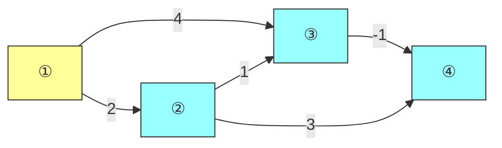
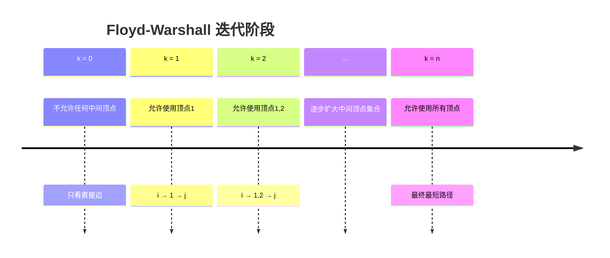
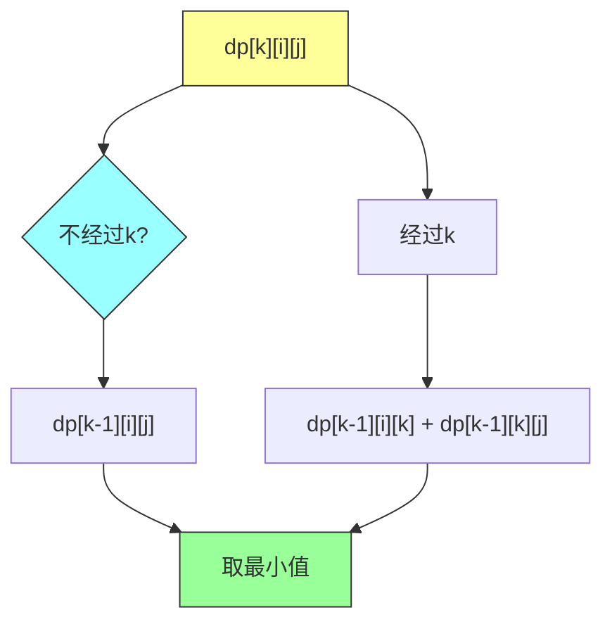
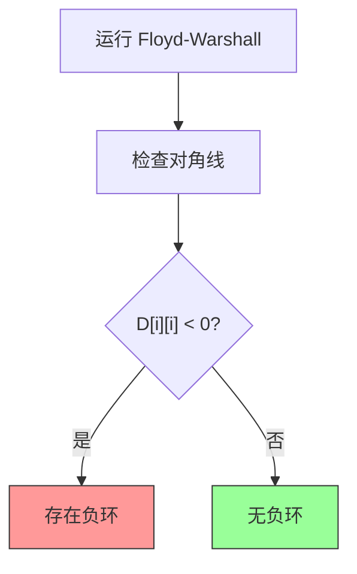
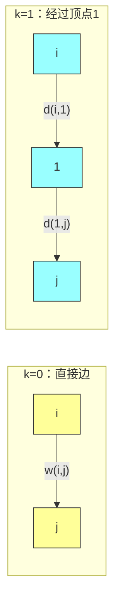
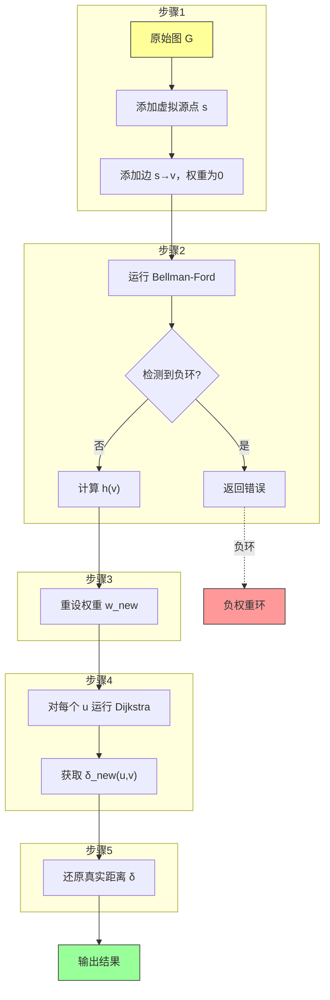
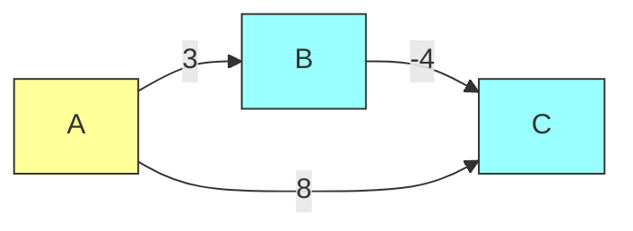
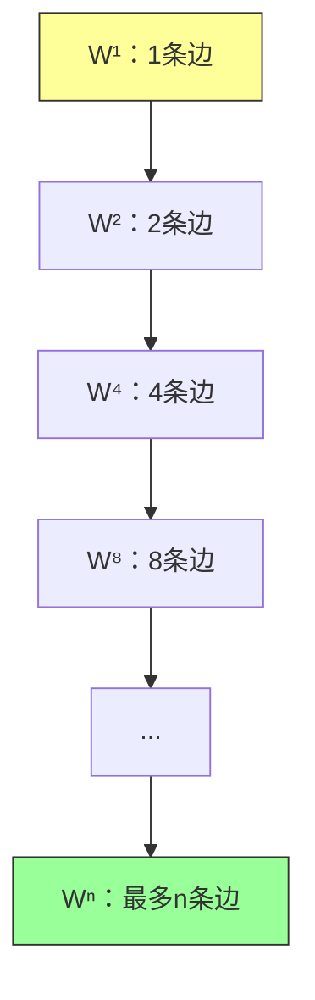
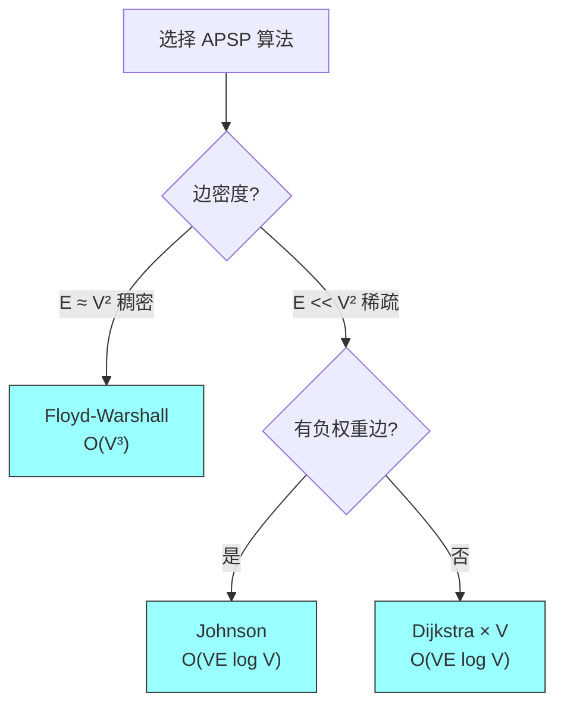

# 《算法导论》第23章：所有结点对最短路径

## 一、问题描述

### 1.1 什么是所有结点对最短路径问题

所有结点对最短路径（All-Pairs Shortest Paths，简称 APSP）问题是图论中的一个经典问题：给定一个带权有向图 G=(V, E)，对于每一对顶点 (u, v)，找出从 u 到 v 的最短路径权重。

### 1.2 与单源最短路径的关系

我们可以对每个顶点运行一次单源最短路径算法来解决 APSP 问题：

| 方法 | 时间复杂度 |
|-----|-----------|
| Bellman-Ford（对每个顶点） | O(V²E) |
| Dijkstra（对每个顶点，使用二叉堆） | O(VE log V) |
| Dijkstra（对每个顶点，使用斐波那契堆） | O(V² log V + VE) |

本章介绍的专门算法可以直接解决 APSP 问题，往往效率更高。

### 1.3 示例

**示例 1：简单有向图**



- ① → ②：直接边，权重 2
- ① → ③：①→②→③，权重 3
- ① → ④：①→③→④，权重 3
- ② → ④：②→③→④，权重 0

---

## 二、问题分类与方法概览

### 2.1 输入图的类型

| 图的类型 | 特点 | 适用算法 |
|---------|------|---------|
| 无负权重边 | 所有边权重 ≥ 0 | Dijkstra × V |
| 有负权重边但无负环 | 需要检测负环 | Floyd-Warshall、Johnson |
| 稠密图（E ≈ V²） | | Floyd-Warshall |
| 稀疏图（E ≈ V） | | Johnson、Dijkstra × V |

### 2.2 本章核心算法

1. **矩阵乘法方法**：O(V³ log V)，理论意义大
2. **Floyd-Warshall 算法**：O(V³)，动态规划
3. **Johnson 算法**：O(VE log V)，重设权重 + Dijkstra

---

## 三、Floyd-Warshall 算法

### 3.1 核心思想

**逐步允许中间顶点**：对于任意两个顶点 i 和 j，如果存在一条从 i 到 j 的最短路径，那么这条路径上的所有中间顶点都来自集合 {1, 2, ..., k}。

**递推公式**：

```
d_ij^(k) = min{ d_ij^(k-1), d_ik^(k-1) + d_kj^(k-1) }
```

### 3.2 动态规划详解

**阶段划分**：



**状态转移**：



### 3.3 伪代码

**Floyd-Warshall 基本版**：

```
FLOYD-WARSHALL(W)
    n = W.rows
    D = W

    for k = 1 to n
        for i = 1 to n
            for j = 1 to n
                D[i][j] = min(D[i][j], D[i][k] + D[k][j])

    return D
```

**Floyd-Warshall 路径重建版**：

```
FLOYD-WARSHALL-WITH-PATH(W)
    n = W.rows
    D = W
    P = new n×n matrix  // 前驱矩阵

    for i = 1 to n
        for j = 1 to n
            if i != j and W[i][j] != ∞
                P[i][j] = j
            else
                P[i][j] = NIL

    for k = 1 to n
        for i = 1 to n
            for j = 1 to n
                if D[i][k] + D[k][j] < D[i][j]
                    D[i][j] = D[i][k] + D[k][j]
                    P[i][j] = P[k][j]

    return D, P

PRINT-PATH(P, i, j)
    if i == j
        print i
    else if P[i][j] == NIL
        print "no path"
    else
        PRINT-PATH(P, i, P[i][j])
        print j
```

### 3.4 负权重环检测

如果 `D[i][i] < 0`，则存在负权重环。



### 3.5 具体例子



---

## 四、Johnson 算法

### 4.1 算法动机

适用于稀疏图，结合 Bellman-Ford + Dijkstra。

**核心思想**：
1. 重设权重消除负边
2. 对每个顶点运行 Dijkstra

### 4.2 重设权重原理

```
w'(u, v) = w(u, v) + h(u) - h(v)
```

其中 `h(v) = δ(s, v)` 是虚拟源点 s 到 v 的最短距离。

**性质**：
- `w'(u, v) ≥ 0`（消除负权重）
- 最短路径不变

### 4.3 伪代码

```
JOHNSON(G)
    // 步骤1：添加虚拟源点
    G' = G ∪ {s}
    for each v in G'.V
        G'.w(s, v) = 0

    // 步骤2：Bellman-Ford 检测负环并计算 h(v)
    if BELLMAN-FORD(G', G'.w) == FALSE
        return "图中存在负权重环"

    for each v in G'.V
        h(v) = δ(s, v)

    // 步骤3：重设权重
    for each edge (u, v) in G'.E
        w'(u, v) = w(u, v) + h(u) - h(v)

    // 步骤4：对每个顶点运行 Dijkstra
    for each u in G.V
        D[u] = DIJKSTRA(G, w', u)

    // 步骤5：还原真实距离
    for each v in G.V
        δ(u, v) = D[u][v] + h(v) - h(u)

    return D
```

### 4.4 算法流程图



### 4.5 具体例子

**输入图**：



**步骤 1-2：Bellman-Ford 计算 h(v)**

```
h(S) = 0, h(A) = 0, h(B) = 0, h(C) = -4
```

**步骤 3：重设权重**

```
w'(A→B) = 3 + 0 - 0 = 3
w'(B→C) = -4 + 0 - (-4) = 0
w'(A→C) = 8 + 0 - (-4) = 12
```

**重设后的图**：


**步骤 4-5：从 A 出发的结果**

```
δ'(A→B) = 3, δ(A→B) = 3 + 0 - 0 = 3
δ'(A→C) = 3, δ(A→C) = 3 + (-4) - 0 = -1
```

---

## 五、矩阵乘法方法

### 5.1 核心思想

将 APSP 视为矩阵乘法的推广（min-plus 乘法）。

**定义**：

```
(L ⊗ W)[i][j] = min_k(L[i][k] + W[k][j])
```

### 5.2 伪代码

```
EXTENDED-SHORTEST-PATHS(L, W)
    n = L.rows
    L' = new n×n matrix filled with ∞

    for i = 1 to n
        for j = 1 to n
            for k = 1 to n
                L'[i][j] = min(L'[i][j], L[i][k] + W[k][j])

    return L'

REPEATED-SQUARED-APSP(W)
    n = W.rows
    L = W
    m = 1

    while m < n
        L = EXTENDED-SHORTEST-PATHS(L, L)
        m = 2m

    return L
```

**迭代过程**：



---

## 六、代码实现

### 6.1 Floyd-Warshall 算法（Java）

```java
import java.util.*;

public class FloydWarshall {

    private static final double INF = Double.POSITIVE_INFINITY;

    /**
     * Floyd-Warshall 主算法
     */
    public static double[][] floydWarshall(double[][] weightMatrix) {
        int n = weightMatrix.length;
        double[][] dist = new double[n][n];

        // 初始化距离矩阵
        for (int i = 0; i < n; i++) {
            for (int j = 0; j < n; j++) {
                dist[i][j] = weightMatrix[i][j];
            }
        }

        // 三重循环
        for (int k = 0; k < n; k++) {
            for (int i = 0; i < n; i++) {
                for (int j = 0; j < n; j++) {
                    if (dist[i][k] + dist[k][j] < dist[i][j]) {
                        dist[i][j] = dist[i][k] + dist[k][j];
                    }
                }
            }
        }

        return dist;
    }

    /**
     * Floyd-Warshall - 带路径重建
     */
    public static double[][] floydWarshallWithPath(double[][] weightMatrix, int[][] next) {
        int n = weightMatrix.length;
        double[][] dist = new double[n][n];

        // 初始化
        for (int i = 0; i < n; i++) {
            for (int j = 0; j < n; j++) {
                dist[i][j] = weightMatrix[i][j];
                if (i != j && weightMatrix[i][j] != INF) {
                    next[i][j] = j;  // 直接前驱
                } else {
                    next[i][j] = -1;
                }
            }
        }

        // Floyd-Warshall 主循环
        for (int k = 0; k < n; k++) {
            for (int i = 0; i < n; i++) {
                for (int j = 0; j < n; j++) {
                    if (dist[i][k] + dist[k][j] < dist[i][j]) {
                        dist[i][j] = dist[i][k] + dist[k][j];
                        next[i][j] = next[k][j];
                    }
                }
            }
        }

        return dist;
    }

    /**
     * 重建路径
     */
    public static List<Integer> reconstructPath(int[][] next, int i, int j) {
        List<Integer> path = new ArrayList<>();
        if (next[i][j] == -1) return path;

        path.add(i);
        while (i != j) {
            i = next[i][j];
            path.add(i);
        }
        return path;
    }

    /**
     * 检测负权重环
     */
    public static boolean hasNegativeCycle(double[][] dist) {
        for (int i = 0; i < dist.length; i++) {
            if (dist[i][i] < 0) return true;
        }
        return false;
    }

    public static void main(String[] args) {
        double[][] weightMatrix = {
            {0, 8, 1, INF},
            {INF, 0, INF, 1},
            {INF, 4, 0, INF},
            {2, INF, INF, 0}
        };

        int n = weightMatrix.length;
        int[][] next = new int[n][n];
        double[][] dist = floydWarshallWithPath(weightMatrix, next);

        System.out.println("最短路径距离矩阵：");
        for (double[] row : dist) {
            for (double d : row) {
                System.out.print(d == INF ? "  ∞  " : String.format("%6.1f", d));
            }
            System.out.println();
        }

        // 路径重建示例
        System.out.print("0 → 3: ");
        List<Integer> path = reconstructPath(next, 0, 3);
        for (int i = 0; i < path.size(); i++) {
            System.out.print(path.get(i) + (i < path.size() - 1 ? " → " : ""));
        }
        System.out.println();

        if (hasNegativeCycle(dist)) {
            System.out.println("警告：检测到负权重环！");
        }
    }
}
```

### 6.2 Johnson 算法（Java）

```java
import java.util.*;

public class Johnson {

    private static final double INF = Double.POSITIVE_INFINITY;

    static class Edge {
        String u, v;
        double w;
        Edge(String u, String v, double w) {
            this.u = u; this.v = v; this.w = w;
        }
    }

    static class Node {
        String v;
        double dist;
        Node(String v, double dist) { this.v = v; this.dist = dist; }
    }

    /**
     * Johnson 主算法
     */
    public static Map<String, Map<String, Double>> johnson(
            List<String> vertices, List<Edge> edges) {

        // 步骤1：添加虚拟源点
        List<String> allVertices = new ArrayList<>(vertices);
        allVertices.add("s");
        List<Edge> allEdges = new ArrayList<>(edges);
        for (String v : vertices) {
            allEdges.add(new Edge("s", v, 0));
        }

        // 步骤2：Bellman-Ford 计算 h(v)
        Map<String, Double> h = bellmanFord(allVertices, allEdges, "s");
        if (h == null) return null;  // 存在负环

        // 步骤3：重设权重
        List<Edge> newEdges = new ArrayList<>();
        for (Edge e : edges) {
            double newW = e.w + h.get(e.u) - h.get(e.v);
            newEdges.add(new Edge(e.u, e.v, newW));
        }

        // 步骤4：Dijkstra for each vertex
        Map<String, Map<String, Double>> result = new HashMap<>();
        for (String u : vertices) {
            Map<String, Double> dist = dijkstra(vertices, newEdges, u);
            Map<String, Double> realDist = new HashMap<>();
            for (String v : vertices) {
                if (dist.get(v) != INF) {
                    realDist.put(v, dist.get(v) + h.get(v) - h.get(u));
                } else {
                    realDist.put(v, INF);
                }
            }
            result.put(u, realDist);
        }

        return result;
    }

    /**
     * Bellman-Ford 算法
     */
    public static Map<String, Double> bellmanFord(
            List<String> vertices, List<Edge> edges, String source) {

        Map<String, Double> h = new HashMap<>();
        for (String v : vertices) h.put(v, INF);
        h.put(source, 0.0);

        // V-1 次松弛
        for (int i = 0; i < vertices.size() - 1; i++) {
            boolean updated = false;
            for (Edge e : edges) {
                if (h.get(e.u) != INF && h.get(e.u) + e.w < h.get(e.v)) {
                    h.put(e.v, h.get(e.u) + e.w);
                    updated = true;
                }
            }
            if (!updated) break;
        }

        // 检测负环
        for (Edge e : edges) {
            if (h.get(e.u) != INF && h.get(e.u) + e.w < h.get(e.v)) {
                return null;
            }
        }

        return h;
    }

    /**
     * Dijkstra 算法
     */
    public static Map<String, Double> dijkstra(
            List<String> vertices, List<Edge> edges, String source) {

        Map<String, Double> dist = new HashMap<>();
        for (String v : vertices) dist.put(v, INF);
        dist.put(source, 0.0);

        // 构建邻接表
        Map<String, List<Edge>> adj = new HashMap<>();
        for (String v : vertices) adj.put(v, new ArrayList<>());
        for (Edge e : edges) adj.get(e.u).add(e);

        // 优先队列
        PriorityQueue<Node> pq = new PriorityQueue<>(Comparator.comparingDouble(n -> n.dist));
        pq.add(new Node(source, 0.0));
        Set<String> visited = new HashSet<>();

        while (!pq.isEmpty()) {
            Node curr = pq.poll();
            if (visited.contains(curr.v)) continue;
            visited.add(curr.v);

            for (Edge e : adj.get(curr.v)) {
                if (dist.get(curr.v) + e.w < dist.get(e.v)) {
                    dist.put(e.v, dist.get(curr.v) + e.w);
                    pq.add(new Node(e.v, dist.get(e.v)));
                }
            }
        }

        return dist;
    }

    public static void main(String[] args) {
        List<String> vertices = Arrays.asList("A", "B", "C");
        List<Edge> edges = Arrays.asList(
            new Edge("A", "B", 3),
            new Edge("B", "C", -4),
            new Edge("A", "C", 8)
        );

        Map<String, Map<String, Double>> result = johnson(vertices, edges);

        if (result == null) {
            System.out.println("图中存在负权重环！");
        } else {
            System.out.println("Johnson 算法结果：");
            for (String u : vertices) {
                for (String v : vertices) {
                    double d = result.get(u).get(v);
                    System.out.printf("%s → %s: %s%n", u, v, d == INF ? "∞" : d);
                }
            }
        }
    }
}
```

### 6.3 矩阵乘法算法（Java）

```java
import java.util.*;

public class MatrixAPSP {

    private static final double INF = Double.POSITIVE_INFINITY;

    /**
     * 扩展最短路径矩阵乘法 (min-plus)
     */
    public static double[][] extendedShortestPaths(double[][] L, double[][] W) {
        int n = L.length;
        double[][] L_new = new double[n][n];

        for (int i = 0; i < n; i++) {
            for (int j = 0; j < n; j++) {
                L_new[i][j] = INF;
            }
        }

        for (int i = 0; i < n; i++) {
            for (int j = 0; j < n; j++) {
                for (int k = 0; k < n; k++) {
                    if (L[i][k] != INF && W[k][j] != INF) {
                        double newDist = L[i][k] + W[k][j];
                        if (newDist < L_new[i][j]) {
                            L_new[i][j] = newDist;
                        }
                    }
                }
            }
        }

        return L_new;
    }

    /**
     * 重复平方方法
     */
    public static double[][] repeatedSquaredAPSP(double[][] W) {
        int n = W.length;
        double[][] L = new double[n][n];

        for (int i = 0; i < n; i++) {
            for (int j = 0; j < n; j++) {
                L[i][j] = W[i][j];
            }
        }

        int m = 1;
        while (m < n) {
            L = extendedShortestPaths(L, L);
            m *= 2;
        }

        return L;
    }

    public static void main(String[] args) {
        double[][] W = {
            {0, 3, 8, INF},
            {INF, 0, 1, 7},
            {INF, 4, 0, INF},
            {2, INF, INF, 0}
        };

        double[][] result = repeatedSquaredAPSP(W);

        System.out.println("最短路径矩阵（矩阵乘法方法）：");
        for (double[] row : result) {
            for (double d : row) {
                System.out.print(d == INF ? "  ∞  " : String.format("%6.1f", d));
            }
            System.out.println();
        }
    }
}
```

---

## 七、复杂度分析

### 7.1 算法对比

| 算法 | 时间复杂度 | 空间复杂度 | 适用场景 |
|-----|-----------|-----------|---------|
| Floyd-Warshall | O(V³) | O(V²) | 稠密图 |
| Johnson | O(VE log V) | O(V²) | 稀疏图，有负权重 |
| 矩阵乘法 | O(V³ log V) | O(V²) | 理论分析 |

### 7.2 算法选择指南



### 7.3 空间优化

Floyd-Warshall 支持原地更新，空间复杂度 O(V²)。

---

## 八、传递闭包

### 8.1 问题定义

传递闭包：对于每对顶点 (i, j)，判断是否存在路径。

### 8.2 伪代码

```
TRANSCITIVE-CLOSURE(W)
    n = W.rows
    T = new n×n boolean matrix

    for i = 1 to n
        for j = 1 to n
            if i == j or W[i][j] != ∞
                T[i][j] = true
            else
                T[i][j] = false

    for k = 1 to n
        for i = 1 to n
            for j = 1 to n
                T[i][j] = T[i][j] or (T[i][k] and T[k][j])

    return T
```

### 8.3 Java 实现

```java
import java.util.*;

public class TransitiveClosure {

    public static boolean[][] transitiveClosure(int n, List<int[]> edges) {
        boolean[][] T = new boolean[n][n];

        // 初始化
        for (int i = 0; i < n; i++) {
            T[i][i] = true;
        }
        for (int[] edge : edges) {
            T[edge[0]][edge[1]] = true;
        }

        // Floyd-Warshall 风格迭代
        for (int k = 0; k < n; k++) {
            for (int i = 0; i < n; i++) {
                for (int j = 0; j < n; j++) {
                    T[i][j] = T[i][j] || (T[i][k] && T[k][j]);
                }
            }
        }

        return T;
    }

    public static void main(String[] args) {
        int n = 4;
        List<int[]> edges = Arrays.asList(
            new int[]{0, 1}, new int[]{1, 2}, new int[]{2, 3}
        );

        boolean[][] T = transitiveClosure(n, edges);

        System.out.println("传递闭包矩阵：");
        for (int i = 0; i < n; i++) {
            for (int j = 0; j < n; j++) {
                System.out.print(T[i][j] ? "1 " : "0 ");
            }
            System.out.println();
        }
    }
}
```

---

## 九、面试题整理

### 9.1 基础题

**Q1：Floyd-Warshall 的时间复杂度？**

A：O(V³)，三重循环遍历 k、i、j。

**Q2：Floyd-Warshall 和 Dijkstra × V 的区别？**

| 方面 | Floyd-Warshall | Dijkstra × V |
|-----|---------------|--------------|
| 时间复杂度 | O(V³) | O(VE log V) |
| 负权重边 | 支持 | 不支持 |
| 适用场景 | 稠密图 | 稀疏图 |

**Q3：如何检测负权重环？**

A：Floyd-Warshall 检查 `dist[i][i] < 0`。

### 9.2 中等题

**Q4：Johnson 算法为什么需要虚拟源点？**

A：
1. 确保所有顶点可达
2. Bellman-Ford 计算 h(v) 满足三角不等式
3. 利用 h(v) 重设权重使所有边非负

**Q5：重设权重为什么保持最短路径不变？**

A：对于任意路径 P，w'(P) = w(P) + h(start) - h(end)，常数差与路径无关。

### 9.3 困难题

**Q6：证明 Floyd-Warshall 的正确性**

A：数学归纳法。k=0 时显然；假设 k-1 时正确，考虑路径是否经过 k，最小值即为 k 时的最短路径。

---

## 十、举一反三

### 10.1 同类 LeetCode 题目

| 题目 | 难度 | 说明 |
|-----|------|------|
| 1334. 阈值距离内邻居最少的城市 | 中等 | Floyd-Warshall 变体 |
| 399. 除法求值 | 中等 | 带权传递闭包 |
| 743. 网络延迟时间 | 中等 | 单源最短路径 |

### 10.2 核心思想迁移

| 场景 | 应用 |
|-----|------|
| 社交网络好友推荐 | 传递闭包 |
| 地图导航 | Dijkstra |
| 网络路由 | Bellman-Ford |
| 项目关键路径 | 拓扑排序 + DP |

---

## 参考资料

- Cormen, T. H., et al. (2009). *Introduction to Algorithms* (3rd ed.). MIT Press. Chapter 25
- CLRS 官方代码：https://github.com/pl3onasm/clrs
