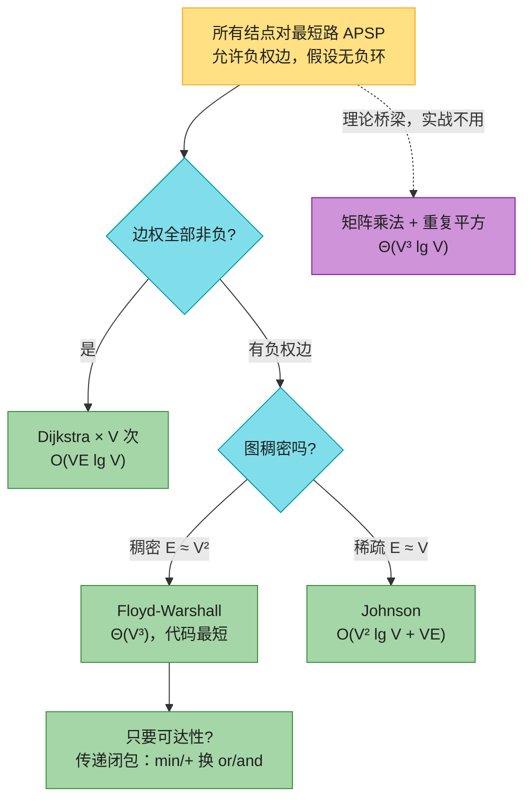
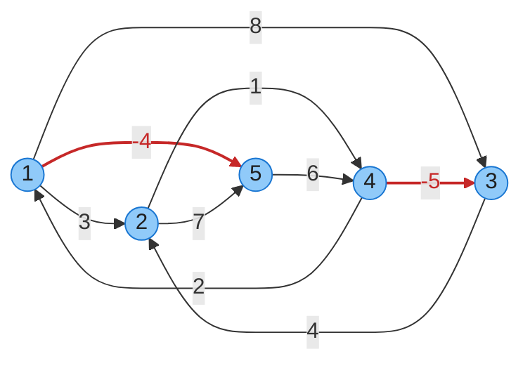
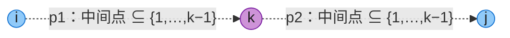
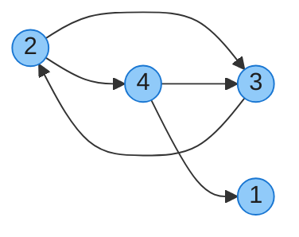
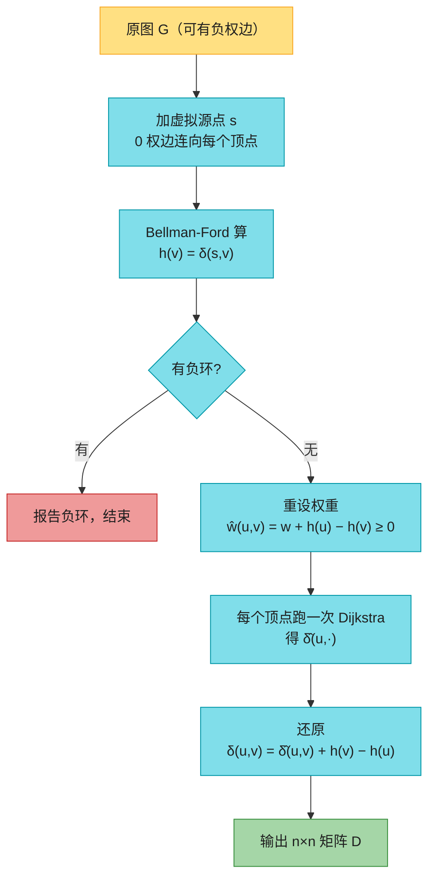
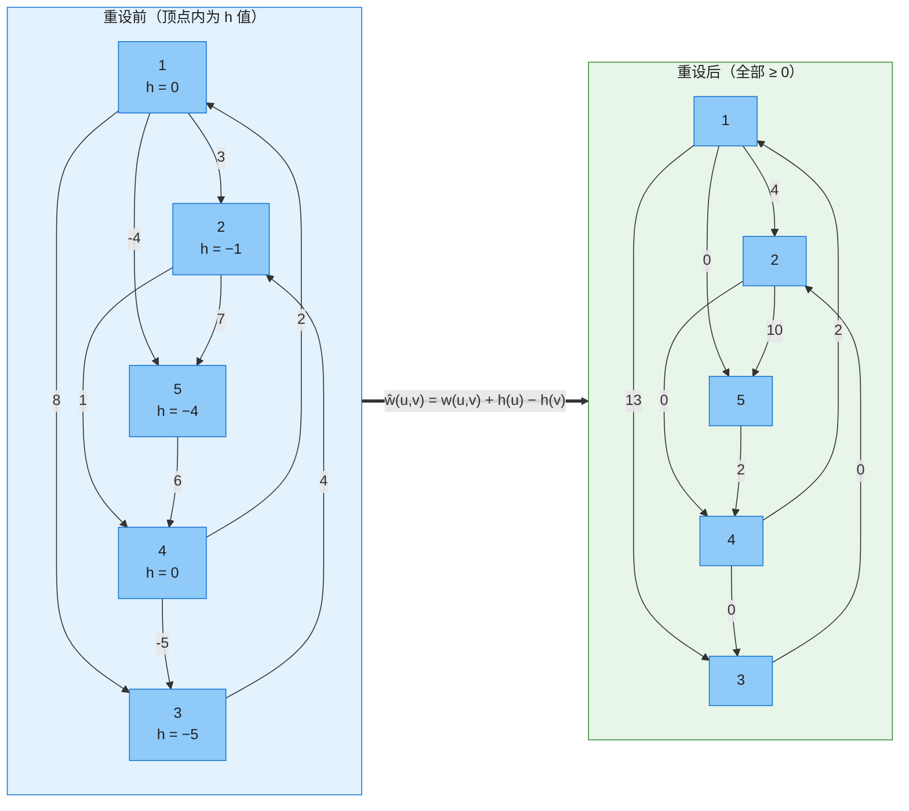

# 第 23 章：所有结点对最短路径（All-Pairs Shortest Paths）——深度版

## 一、开篇定位

本章回答一个问题：**给定带权有向图，如何求出每一对顶点之间的最短路径？**原书的引子是公路图册末尾那张「城市间距离表」——但随即自我吐槽：这不算真应用（图册只有百来个城市，美国却有约 30 万个红绿灯路口，没人真算全路口距离表）。真正的应用是求**网络直径**（diameter）= 所有最短路中最长的那条：若有向图是通信网络、边权是链路传输时间，直径就是一条消息在网络中的最长传输时间。

最朴素的解法是把第 22 章的单源算法跑 $|V|$ 次（每个顶点当一次源点），原书导言给出的这笔账：

| 基线方法 | 时间复杂度 | 限制 |
|---------|-----------|------|
| Dijkstra × V（数组版队列） | $O(V^3 + VE) = O(V^3)$ | 边权非负 |
| Dijkstra × V（二叉堆） | $O(V(V+E)\lg V)$，稀疏图即 $O(VE\lg V)$ | 边权非负 |
| Dijkstra × V（斐波那契堆） | $O(V^2\lg V + VE)$ | 边权非负 |
| Bellman-Ford × V | $O(V^2E)$，稠密图上 $O(V^4)$ | 允许负权边 |

本章的专门算法把「允许负权边」也压进立方级：Floyd-Warshall $\Theta(V^3)$，Johnson 在稀疏图上 $O(V^2\lg V + VE)$。

与前后章节的关系：

- **第 22 章**是本章的「子程序库」：Johnson = 1 次 Bellman-Ford + $|V|$ 次 Dijkstra；松弛、$\delta$、最短路径树等概念全部沿用；
- **第 20 章**的两种图表示在本章分家：Floyd-Warshall 与矩阵法用**邻接矩阵**，Johnson 用**邻接表**（它是稀疏图算法）；
- 本章前两个算法都是**动态规划**（第 14 章）：矩阵法按「路径边数」分阶段，Floyd 按「允许的中间点集合」分阶段；
- **第 24 章**最大流不再直接使用本章算法，但「在残余网络上找增广路」仍是最短路思想。

做题定位：点数 ≤ 几百、要所有点对距离 ⇒ Floyd 三重循环直接写（1334、2976）；问「可达不可达」⇒ 传递闭包（1462、2192）；稀疏大图且有负权 ⇒ Johnson；动态加边的全源最短路 ⇒ 增量更新（2642，正好呼应思考题 23-1）。

**本章主线**：输入约定与前驱矩阵 → 矩阵乘法思路（23.1，理论桥梁）→ Floyd-Warshall（23.2，本章主角）→ 传递闭包 → Johnson（23.3）→ Java + Python 双实现 → 速查/易混 → 题单与习题。



---

## 二、输入约定：邻接矩阵 + 前驱矩阵

本章（除 Johnson 外）的输入是 $n \times n$ **邻接矩阵** $W$，顶点编号 $1, 2, \dots, n$：

$$w_{ij} = \begin{cases} 0 & \text{若 } i = j \\ \text{有向边 } (i,j) \text{ 的权重} & \text{若 } i \neq j \text{ 且 } (i,j) \in E \\ \infty & \text{若 } i \neq j \text{ 且 } (i,j) \notin E \end{cases}$$

允许负权边，但先**假设无负权环**（检测方法见 4.5 节）。输出同样是 $n \times n$ 矩阵，第 $(i, j)$ 项为 $\delta(i, j)$。

**前驱矩阵** $\Pi = (\pi_{ij})$：$\pi_{ij}$ 是 $j$ 在「$i \to j$ 最短路」上的前驱；$i = j$ 或不可达时为 NIL。第 $i$ 行的所有 $\pi$ 值构成一棵以 $i$ 为根的最短路径树——就是第 22 章前驱子图对每个源点各来一份。打印路径沿 $\pi$ 链回溯：

```
PRINT-ALL-PAIRS-SHORTEST-PATH(Π, i, j)
1  if i == j
2      print i
3  elseif πij == NIL
4      print "no path from i to j exists"
5  else PRINT-ALL-PAIRS-SHORTEST-PATH(Π, i, πij)
6      print j
```

全章共用同一个示例（原书 Figure 23.1，5 个顶点 9 条边，两条负权边但无负环）：



**图 B**（对应 Figure 23.1，红色为负权边）：注意负边 1→5（−4）与 4→3（−5）会反复「拉低」距离，但环 ⟨1,5,4⟩ 权 −4+6+2 = 4 > 0、环 ⟨3,2,4⟩ 权 4+1−5 = 0（0 权环不危害最短路，习题 23.3-5 还会用到它），没有负环，$\delta$ 全部定义良好。

---

## 三、矩阵乘法思路（23.1）：理论桥梁

### 3.1 直觉：按「路径边数」分阶段

设 $l_{ij}^{(r)}$ = $i \to j$、**边数至多 r** 的最短路权重。$r = 0$ 时只有自己到自己：

$$l_{ij}^{(0)} = \begin{cases} 0 & i = j \\ \infty & i \neq j \end{cases}$$

每多允许一条边，就枚举 $j$ 的上家 $k$ 试一遍（$k = j$ 时 $w_{jj} = 0$，自动涵盖「不延长」情形，这就是习题 23.1-2 问「$w_{ii}=0$ 为何方便」的答案）：

$$l_{ij}^{(r)} = \min_{1 \le k \le n} \left\{ l_{ik}^{(r-1)} + w_{kj} \right\}$$

无负环 ⇒ 最短路可取简单路径（至多 $n-1$ 条边）⇒ $L^{(n-1)}$ 就是答案，且 $r \ge n-1$ 后矩阵不再变化。

### 3.2 一次扩展 = 一次 min-plus「矩阵乘」

把上式与普通矩阵乘 $c_{ij} = \sum_k a_{ik} \cdot b_{kj}$ 对照：min 扮演 $\sum$、+ 扮演 $\times$、$\infty$ 扮演 0、0 扮演 1（$L^{(0)}$ 正是这个运算体系下的「单位矩阵」，习题 23.1-3）。这套 $(\min, +)$ 体系叫**热带半环**（tropical semiring）。一次「扩展一条边」就是一次矩阵乘：

```
EXTEND-SHORTEST-PATHS(L(r-1), W, L(r), n)
1  // 假设 L(r) 的元素已初始化为 ∞
2  for i = 1 to n
3      for j = 1 to n
4          for k = 1 to n
5              lij(r) = min{lij(r), lik(r-1) + wkj}
```

$\Theta(n^3)$。从 $L^{(0)}$ 起连乘 $n-1$ 次 $W$ 即得答案——SLOW-APSP，$\Theta(n^4)$：

```
SLOW-APSP(W, L(0), n)
1  let L = (lij) and M = (mij) be new n × n matrices
2  L = L(0)
3  for r = 1 to n - 1
4      M = ∞                       // 初始化 M
5      EXTEND-SHORTEST-PATHS(L, W, M, n)     // 计算 M = L·W
6      L = M
7  return L
```

### 3.3 重复平方：Θ(n³ lg n)

加速关键：min-plus 矩阵乘同样满足**结合律**（习题 23.1-4），而目标只是 $L^{(n-1)}$、不需要中间的每个幂。于是**重复平方**：$W, W^2, W^4, W^8, \dots$，$\lceil \lg(n-1) \rceil$ 次乘法即覆盖 $n-1$：

```
FASTER-APSP(W, n)
1  let L and M be new n × n matrices
2  L = W
3  r = 1
4  while r < n - 1
5      M = ∞                       // 初始化 M
6      EXTEND-SHORTEST-PATHS(L, L, M, n)     // 计算 M = L²
7      r = 2r
8      L = M
9  return L
```

$\Theta(n^3 \lg n)$，代码紧凑、无花哨数据结构，常数很小。**点评**：实战仍输给 Floyd 的 $\Theta(n^3)$，它的价值在思想——把「最短路」与「矩阵乘」接通（习题 23.1-5：单源最短路 = 行向量反复乘 $W$，正好就是 Bellman-Ford 的逐轮松弛），也是第 4 章快速矩阵乘研究延伸到路径问题的桥梁（章末注记）。

---

## 四、Floyd-Warshall 算法（23.2）：本章主角

### 4.1 直觉：逐个「放开」中间点

换一套分阶段方式：不按边数，按**允许使用哪些中间点**。设 $d_{ij}^{(k)}$ = $i \to j$、且中间点全部取自集合 $\{1, 2, \dots, k\}$ 的最短路权重。

- $k = 0$：不许任何中间点 ⇒ $D^{(0)} = W$；
- $k = n$：所有点都可用 ⇒ $D^{(n)}$ 即答案。

第 $k$ 个点「加入候选」时，考察 $i \to j$ 的最短路 $p$（中间点 $\subseteq \{1..k\}$）：

- **$k$ 不在 $p$ 上**：中间点其实 $\subseteq \{1..k-1\}$，答案不变；
- **$k$ 在 $p$ 上**：把 $p$ 在 $k$ 处断开成 $i \leadsto k$ 与 $k \leadsto j$ 两段。$k$ 是两段的端点、不算中间点，所以两段的中间点都 $\subseteq \{1..k-1\}$，且各自也是最短的（最优子结构，引理 22.1）。



**图 C**（对应 Figure 23.3）：紫色是本轮新放开的顶点 $k$。两种情况取最小，得递推式（23.6）：

$$d_{ij}^{(k)} = \min\left\{ d_{ij}^{(k-1)},\ d_{ik}^{(k-1)} + d_{kj}^{(k-1)} \right\}$$

### 4.2 伪代码：三层循环，k 必须在最外层

```
FLOYD-WARSHALL(W, n)
1  D(0) = W
2  for k = 1 to n
3      let D(k) = (dij(k)) be a new n × n matrix
4      for i = 1 to n
5          for j = 1 to n
6              dij(k) = min{dij(k-1), dik(k-1) + dkj(k-1)}
7  return D(n)
```

$\Theta(n^3)$，内层一次比较一次加法，常数极小，中等规模的图完全实用。**k 在最外层是状态定义的要求**：第 $k$ 轮需要「中间点 ⊆ {1..k−1}」的完整结果作前提；$i$、$j$ 在内层乱序无所谓，$k$ 一旦挪进内层，等于没分阶段，答案必错。

实战都写成**原地版**（习题 23.2-4，空间降到 $\Theta(n^2)$）：直接删掉上标。为什么安全？第 $k$ 轮里第 $k$ 行、第 $k$ 列不会变（$d_{kk} = 0$，经自己不更短），所以读到的 $d_{ik}$、$d_{kj}$ 是旧值还是新值毫无区别。

```
FLOYD-WARSHALL'(W, n)
1  D = W
2  for k = 1 to n
3      for i = 1 to n
4          for j = 1 to n
5              dij = min{dij, dik + dkj}
6  return D
```

### 4.3 完整 trace（Figure 23.1 的图，加粗 = 本轮变小的格子）

$k = 0$（就是 $W$，尚不允许任何中间点）：

| D⁽⁰⁾ | 1 | 2 | 3 | 4 | 5 |
|------|---|---|---|---|---|
| **1** | 0 | 3 | 8 | ∞ | −4 |
| **2** | ∞ | 0 | ∞ | 1 | 7 |
| **3** | ∞ | 4 | 0 | ∞ | ∞ |
| **4** | 2 | ∞ | −5 | 0 | ∞ |
| **5** | ∞ | ∞ | ∞ | 6 | 0 |

$k = 1$（放开 1：只有顶点 4 有边进 1，于是 4→1→2、4→1→5 打通）：

| D⁽¹⁾ | 1 | 2 | 3 | 4 | 5 |
|------|---|---|---|---|---|
| **1** | 0 | 3 | 8 | ∞ | −4 |
| **2** | ∞ | 0 | ∞ | 1 | 7 |
| **3** | ∞ | 4 | 0 | ∞ | ∞ |
| **4** | 2 | **5** | −5 | 0 | **−2** |
| **5** | ∞ | ∞ | ∞ | 6 | 0 |

$k = 2$（放开 2：1、3 经 2 到 4、5）：

| D⁽²⁾ | 1 | 2 | 3 | 4 | 5 |
|------|---|---|---|---|---|
| **1** | 0 | 3 | 8 | **4** | −4 |
| **2** | ∞ | 0 | ∞ | 1 | 7 |
| **3** | ∞ | 4 | 0 | **5** | **11** |
| **4** | 2 | 5 | −5 | 0 | −2 |
| **5** | ∞ | ∞ | ∞ | 6 | 0 |

$k = 3$（放开 3：4→3→2 打通，$d_{42}$ 从 5 降到 −1）：

| D⁽³⁾ | 1 | 2 | 3 | 4 | 5 |
|------|---|---|---|---|---|
| **1** | 0 | 3 | 8 | 4 | −4 |
| **2** | ∞ | 0 | ∞ | 1 | 7 |
| **3** | ∞ | 4 | 0 | 5 | 11 |
| **4** | 2 | **−1** | −5 | 0 | −2 |
| **5** | ∞ | ∞ | ∞ | 6 | 0 |

$k = 4$（放开枢纽 4，全网大更新：2、3、5 纷纷经 4 接入，$d_{13}$ 降到 −1）：

| D⁽⁴⁾ | 1 | 2 | 3 | 4 | 5 |
|------|---|---|---|---|---|
| **1** | 0 | 3 | **−1** | 4 | −4 |
| **2** | **3** | 0 | **−4** | 1 | **−1** |
| **3** | **7** | 4 | 0 | 5 | **3** |
| **4** | 2 | −1 | −5 | 0 | −2 |
| **5** | **8** | **5** | **1** | 6 | 0 |

$k = 5$（放开 5：1 经 5→4→3 再降，收敛）：

| D⁽⁵⁾ | 1 | 2 | 3 | 4 | 5 |
|------|---|---|---|---|---|
| **1** | 0 | **1** | **−3** | **2** | −4 |
| **2** | 3 | 0 | −4 | 1 | −1 |
| **3** | 7 | 4 | 0 | 5 | 3 |
| **4** | 2 | −1 | −5 | 0 | −2 |
| **5** | 8 | 5 | 1 | 6 | 0 |

以上 6 张表与原书 Figure 23.4 逐格一致（已用代码核对）。

### 4.4 路径重建：前驱矩阵 Π

随算法同步维护 $\pi_{ij}^{(k)}$ = 当前最短路上 $j$ 的前驱。初值（式 23.7）：有边 $(i,j)$ 则 $\pi_{ij}^{(0)} = i$，否则 NIL。更新规则（式 23.8）：**经 $k$ 更短时，$j$ 的前驱改成「$k \to j$ 最短路上 $j$ 的前驱」**，即 $\pi_{ij} \leftarrow \pi_{kj}$。本例最终：

| Π⁽⁵⁾ | 1 | 2 | 3 | 4 | 5 |
|------|---|---|---|---|---|
| **1** | NIL | 3 | 4 | 5 | 1 |
| **2** | 4 | NIL | 4 | 2 | 1 |
| **3** | 4 | 3 | NIL | 2 | 1 |
| **4** | 4 | 3 | 4 | NIL | 1 |
| **5** | 4 | 3 | 4 | 5 | NIL |

例：查 1→3 的路径。$\pi_{13} = 4$（先到 4），$\pi_{14} = 5$（先到 5），$\pi_{15} = 1$（到源）⇒ 回溯得 1→5→4→3，权重 −4+6−5 = −3 ✓。

工程与 LeetCode 里常见另一种存法——**后继矩阵** next：记录「$i$ 的下一站」而非「$j$ 的前驱」。两者都能重建路径，但更新方向相反，**别混用**（很多资料把 next 误称为「前驱矩阵」）：

| | 前驱矩阵 π（CLRS） | 后继矩阵 next（工程常用） |
|---|---|---|
| 含义 | $j$ 的前驱 | $i$ 的下一站 |
| 初值（有边 $i \to j$） | $i$ | $j$ |
| 经 $k$ 松弛时 | `pi[i][j] = pi[k][j]` | `next[i][j] = next[i][k]` |
| 重建方向 | 从 $j$ 回溯到 $i$ | 从 $i$ 顺走到 $j$ |

### 4.5 负环检测（习题 23.2-6）

跑完看对角线：**某 $d_{ii} < 0$ ⟺ 存在负权环**。直觉：$d_{ii}$ 是「$i$ 出发绕回 $i$」的最短权重，为负说明路上绕了负环。无需额外代码；也可每轮结束扫一眼对角线提前退出。

---

## 五、传递闭包（23.2 后半）：只要可达性

问题降级：不管权重，只问 $i$ 能否到达 $j$。定义 $G$ 的**传递闭包** $G^* = (V, E^*)$：$(i,j) \in E^*$ ⟺ $G$ 中存在 $i \leadsto j$ 的路径。把 Floyd 的 min/+ 换成 or/and 即可（式 23.9）：

$$t_{ij}^{(k)} = t_{ij}^{(k-1)} \lor \left( t_{ik}^{(k-1)} \land t_{kj}^{(k-1)} \right)$$

```
TRANSITIVE-CLOSURE(G, n)
1  let T(0) = (tij(0)) be a new n × n matrix
2  for i = 1 to n
3      for j = 1 to n
4          if i == j or (i, j) ∈ G.E
5              tij(0) = 1
6          else tij(0) = 0
7  for k = 1 to n
8      let T(k) = (tij(k)) be a new n × n matrix
9      for i = 1 to n
10         for j = 1 to n
11             tij(k) = tij(k-1) ∨ (tik(k-1) ∧ tkj(k-1))
12 return T(n)
```

同为 $\Theta(n^3)$，但全是单比特逻辑运算：实践中比算术版快，空间还省一个「机器字长」因子（可用位集合一行压成一个整数，内层变位运算）。

例（原书 Figure 23.5，4 个顶点）：



**图 D**（对应 Figure 23.5）。迭代结果：

| T⁽⁴⁾ | 1 | 2 | 3 | 4 |
|------|---|---|---|---|
| **1** | 1 | 0 | 0 | 0 |
| **2** | 1 | 1 | 1 | 1 |
| **3** | 1 | 1 | 1 | 1 |
| **4** | 1 | 1 | 1 | 1 |

读法：第 $i$ 行 = $i$ 能到达的点集（含自己）。1 没有入边 ⇒ 谁也到不了 1（除自己），所以第 1 列只有对角线是 1；2、3、4 互相可达，且都能经 4→1 到达 1。

LeetCode：**1462**（课程表 IV：先修关系 = 传递闭包）、**2192**（DAG 所有祖先 = 闭包矩阵的列）、**841**（钥匙和房间：可达性入门，DFS 也行）。

---

## 六、Johnson 算法（23.3）：稀疏图的最优选择

### 6.1 动机：把负权「平移」掉，再 Dijkstra × V

稀疏图（$E \approx V$）上 Floyd 的 $\Theta(V^3)$ 吃亏——Dijkstra × V 只要 $O(VE\lg V)$，可惜怕负权边。Johnson 的思路：**先把边权整体「平移」成非负，再对每个顶点跑 Dijkstra**。新权重 $\hat{w}$ 必须满足两条：

1. **最短路不变**：$p$ 是 $u \to v$ 在 $w$ 下的最短路 ⟺ 也是 $\hat{w}$ 下的最短路；
2. **全部非负**：$\hat{w}(u,v) \ge 0$，Dijkstra 才能用。

### 6.2 重设权重：ŵ(u,v) = w(u,v) + h(u) − h(v)

任给顶点函数 $h: V \to \mathbb{R}$，按上式重设。关键事实（引理 23.1）：任意路径 $p = \langle v_0, v_1, \dots, v_k \rangle$ 有

$$\hat{w}(p) = w(p) + h(v_0) - h(v_k)$$

沿路径**伸缩相消**，中间的 $h$ 全部抵消——同起讫的所有路径只差同一个常数 ⇒ 相对大小不变 ⇒ 最短路不变（性质 1 ✓）。环上 $v_0 = v_k$ ⇒ 环权重不变 ⇒ **负环在 $\hat{w}$ 下仍是负环**。

要让性质 2 成立，取 $h(v) = \delta(s, v)$（某源点到各点的真实最短距离）：三角不等式 $h(v) \le h(u) + w(u,v)$ 移项即 $\hat{w}(u,v) = w(u,v) + h(u) - h(v) \ge 0$ ✓。

### 6.3 虚拟源点 s：为什么不能随便选（习题 23.3-2/6）

$h$ 必须对**每个**顶点有限。随便选源点，不可达点 $h = \infty$，$\hat{w}$ 无定义（习题 23.3-6 给了具体反例）。于是新加顶点 $s$，以 0 权边连向每个顶点：无负环时 $\delta(s,v) \le 0$ 且有限，一次 Bellman-Ford 全部算出。强连通图里随便选也对——但实现上没人赌这个。

### 6.4 流程与伪代码



**图 E**：Johnson 五步流水线。

```
JOHNSON(G, w)
1  compute G′, where G′.V = G.V ∪ {s},
   G′.E = G.E ∪ {(s,v) : v ∈ G.V}, and w(s,v) = 0 for all v ∈ G.V
2  if BELLMAN-FORD(G′, w, s) == FALSE
3      print "the input graph contains a negative-weight cycle"
4  else for each vertex v ∈ G′.V
5           set h(v) to the value of δ(s,v) computed by Bellman-Ford
6       for each edge (u,v) ∈ G′.E
7           ŵ(u,v) = w(u,v) + h(u) - h(v)
8       let D = (duv) be a new n × n matrix
9       for each vertex u ∈ G.V
10          run DIJKSTRA(G, ŵ, u) to compute δ̂(u,v) for all v ∈ G.V
11          for each vertex v ∈ G.V
12              duv = δ̂(u,v) + h(v) - h(u)
13  return D
```

### 6.5 完整例子（Figure 23.1 的图）

对图 B 跑 Bellman-Ford，得 $h = (0,\ -1,\ -5,\ 0,\ -4)$（顶点 1..5，已用代码核对，与原书 Figure 23.6(a) 一致）。重设前后对照：



**图 F**（对应 Figure 23.6(a)(b)）：9 条边全部非负。注意 4 条边变成 0——$\hat{w}(u,v) = 0$ ⟺ 边 $(u,v)$ 在某条从 $s$ 出发的最短路上「绷紧」（$h(v) = h(u) + w(u,v)$ 取等）。

之后每个顶点跑 Dijkstra、按 $d_{uv} = \hat\delta(u,v) + h(v) - h(u)$ 还原，得到：

| D | 1 | 2 | 3 | 4 | 5 |
|---|---|---|---|---|---|
| **1** | 0 | 1 | −3 | 2 | −4 |
| **2** | 3 | 0 | −4 | 1 | −1 |
| **3** | 7 | 4 | 0 | 5 | 3 |
| **4** | 2 | −1 | −5 | 0 | −2 |
| **5** | 8 | 5 | 1 | 6 | 0 |

与 4.3 节 Floyd 的 $D^{(5)}$ **逐格一致**——两种算法互相验证。

### 6.6 复杂度与实现要点

- Dijkstra 用斐波那契堆：$O(V^2\lg V + VE)$；二叉堆：$O(VE\lg V)$——稀疏图都渐近优于 Floyd。
- **实现技巧：不必真加顶点 $s$**。Bellman-Ford 初始化时令所有 $h(v) = 0$，效果等同于「$s$ 以 0 权边连到每个点」，还顺带让负环检测覆盖全图（即使图不连通）。下面的 Java/Python 实现都用这一招。
- 若 $w$ 本身全非负 ⇒ $h \equiv 0$ ⇒ $\hat{w} = w$，Johnson 退化为 Dijkstra × V（习题 23.3-3）。

---

## 七、代码实现（Java + Python）

索引约定：伪代码 1-indexed（顶点 1..n），代码 0-indexed（下标 0..n−1），矩阵与邻接表语义不变。三段代码均从本文原样编译/运行通过，并与原书 Figure 23.4/23.6 的数据逐格核对。

### 7.1 Java：Floyd-Warshall（含路径重建 + 负环检测）

```java
import java.util.*;

public class FloydWarshall {
    static final int INF = Integer.MAX_VALUE / 2;   // 防加法溢出

    /** Floyd-Warshall：返回距离矩阵；pi 为前驱矩阵（-1 表示 NIL） */
    public static int[][] floydWarshall(int[][] W, int[][] pi) {
        int n = W.length;
        int[][] d = new int[n][n];
        for (int i = 0; i < n; i++)
            for (int j = 0; j < n; j++) {
                d[i][j] = W[i][j];
                pi[i][j] = (i != j && W[i][j] < INF) ? i : -1;
            }
        for (int k = 0; k < n; k++)                 // k 必须在最外层
            for (int i = 0; i < n; i++)
                for (int j = 0; j < n; j++)
                    if (d[i][k] + d[k][j] < d[i][j]) {
                        d[i][j] = d[i][k] + d[k][j];
                        pi[i][j] = pi[k][j];        // 经 k 中转 ⇒ j 的前驱与「k→j」相同
                    }
        return d;
    }

    /** 由前驱矩阵重建 i→j 的最短路径（0-indexed 顶点列表；不可达返回空表） */
    public static List<Integer> path(int[][] pi, int i, int j) {
        if (i == j) return new ArrayList<>(List.of(i));
        if (pi[i][j] < 0) return new ArrayList<>();
        List<Integer> p = path(pi, i, pi[i][j]);
        p.add(j);
        return p;
    }

    /** 负环检测：对角线出现负数即有负环 */
    public static boolean hasNegativeCycle(int[][] d) {
        for (int i = 0; i < d.length; i++)
            if (d[i][i] < 0) return true;
        return false;
    }

    public static void main(String[] args) {
        // 原书 Figure 23.1 的图（顶点 1..5 对应下标 0..4）
        int[][] W = {
            {0,   3,   8,   INF, -4},
            {INF, 0,   INF, 1,   7},
            {INF, 4,   0,   INF, INF},
            {2,   INF, -5,  0,   INF},
            {INF, INF, INF, 6,   0}
        };
        int n = W.length;
        int[][] pi = new int[n][n];
        int[][] d = floydWarshall(W, pi);

        System.out.println("最短路径权重矩阵 D：");
        for (int[] row : d) {
            for (int x : row)
                System.out.print(x >= INF ? "  ∞" : String.format("%4d", x));
            System.out.println();
        }
        List<Integer> p = path(pi, 0, 2);
        System.out.print("1 → 3 的最短路径: ");
        for (int i = 0; i < p.size(); i++)
            System.out.print((p.get(i) + 1) + (i < p.size() - 1 ? " → " : ""));
        System.out.println("（权重 " + d[0][2] + "）");
        System.out.println("存在负环? " + hasNegativeCycle(d));
    }
}
```

### 7.2 Java：Johnson（Bellman-Ford + Dijkstra × V）

```java
import java.util.*;

public class Johnson {
    static final int INF = Integer.MAX_VALUE / 2;

    /** Johnson：返回所有点对最短路径权重矩阵；有负环返回 null。edges 元素为 {u, v, w} */
    @SuppressWarnings({"unchecked", "rawtypes"})
    public static int[][] johnson(int n, List<int[]> edges) {
        // 1. Bellman-Ford 求 h(v) = δ(s,v)。h 初始全 0 ⟺ 加了虚拟源点 s（0 权边到每个点）
        int[] h = new int[n];
        for (int i = 0; i < n - 1; i++)
            for (int[] e : edges)
                if (h[e[0]] + e[2] < h[e[1]])
                    h[e[1]] = h[e[0]] + e[2];
        for (int[] e : edges)                       // 第 n 轮仍能松弛 ⇒ 负环
            if (h[e[0]] + e[2] < h[e[1]])
                return null;

        // 2. 重设权重 w'(u,v) = w(u,v) + h(u) - h(v) ≥ 0
        List<int[]>[] adj = new List[n];
        for (int i = 0; i < n; i++) adj[i] = new ArrayList<>();
        for (int[] e : edges)
            adj[e[0]].add(new int[]{e[1], e[2] + h[e[0]] - h[e[1]]});

        // 3. 每个顶点跑一次 Dijkstra，再还原真实距离
        int[][] d = new int[n][n];
        for (int u = 0; u < n; u++) {
            int[] du = dijkstra(adj, u);
            for (int v = 0; v < n; v++)
                d[u][v] = du[v] >= INF ? INF : du[v] + h[v] - h[u];
        }
        return d;
    }

    static int[] dijkstra(List<int[]>[] adj, int s) {
        int n = adj.length;
        int[] dist = new int[n];
        Arrays.fill(dist, INF);
        dist[s] = 0;
        PriorityQueue<int[]> pq = new PriorityQueue<>(Comparator.comparingInt(a -> a[1]));
        pq.add(new int[]{s, 0});
        while (!pq.isEmpty()) {
            int[] cur = pq.poll();
            int u = cur[0];
            if (cur[1] > dist[u]) continue;         // 懒删除：过期条目直接丢
            for (int[] e : adj[u])
                if (dist[u] + e[1] < dist[e[0]]) {
                    dist[e[0]] = dist[u] + e[1];
                    pq.add(new int[]{e[0], dist[e[0]]});
                }
        }
        return dist;
    }

    public static void main(String[] args) {
        // 同 Figure 23.1：{u, v, w}，顶点 1..5 对应下标 0..4
        List<int[]> edges = List.of(
            new int[]{0, 1, 3}, new int[]{0, 2, 8}, new int[]{0, 4, -4},
            new int[]{1, 3, 1}, new int[]{1, 4, 7}, new int[]{2, 1, 4},
            new int[]{3, 0, 2}, new int[]{3, 2, -5}, new int[]{4, 3, 6});
        int[][] d = johnson(5, edges);
        if (d == null) {
            System.out.println("图中存在负环");
            return;
        }
        System.out.println("Johnson 最短路径权重矩阵：");
        for (int[] row : d) {
            for (int x : row)
                System.out.print(x >= INF ? "  ∞" : String.format("%4d", x));
            System.out.println();
        }
    }
}
```

### 7.3 Python：Floyd + Johnson + 传递闭包 + 重复平方（含随机对拍）

```python
"""第 23 章：所有结点对最短路径 —— Floyd-Warshall / Johnson / 传递闭包 / 重复平方"""
import heapq
import random

INF = float('inf')


def floyd_warshall(W):
    """返回 (dist, pi)；pi[i][j] = j 在「i→j 最短路」上的前驱，None 表示 NIL"""
    n = len(W)
    d = [row[:] for row in W]
    pi = [[None if (i == j or W[i][j] == INF) else i for j in range(n)] for i in range(n)]
    for k in range(n):                      # k 必须在最外层
        for i in range(n):
            if d[i][k] == INF:
                continue
            for j in range(n):
                if d[i][k] + d[k][j] < d[i][j]:
                    d[i][j] = d[i][k] + d[k][j]
                    pi[i][j] = pi[k][j]     # 经 k 中转 ⇒ j 的前驱与「k→j」相同
    return d, pi


def get_path(pi, i, j):
    """由前驱矩阵重建 i→j 的最短路径；不可达返回 None"""
    if i == j:
        return [i]
    if pi[i][j] is None:
        return None
    return get_path(pi, i, pi[i][j]) + [j]


def has_negative_cycle(d):
    """负环检测：对角线出现负数即有负环"""
    return any(d[i][i] < 0 for i in range(len(d)))


def transitive_closure(reach):
    """逻辑版 Floyd：reach[i][j] 为真表示有边 i→j，返回传递闭包矩阵"""
    n = len(reach)
    t = [[reach[i][j] or i == j for j in range(n)] for i in range(n)]
    for k in range(n):
        for i in range(n):
            for j in range(n):
                t[i][j] = t[i][j] or (t[i][k] and t[k][j])
    return t


def johnson(n, edges):
    """edges 为 (u, v, w) 列表；返回所有点对最短路径权重矩阵，有负环返回 None"""
    # 1. Bellman-Ford 求 h(v) = δ(s,v)。h 初始全 0 ⟺ 加了虚拟源点 s
    h = [0] * n
    for _ in range(n - 1):
        for u, v, w in edges:
            if h[u] + w < h[v]:
                h[v] = h[u] + w
    if any(h[u] + w < h[v] for u, v, w in edges):
        return None                         # 负环
    # 2. 重设权重 w' = w + h(u) - h(v) ≥ 0
    adj = [[] for _ in range(n)]
    for u, v, w in edges:
        adj[u].append((v, w + h[u] - h[v]))

    # 3. 每个顶点跑一次 Dijkstra，再还原真实距离
    def dijkstra(s):
        dist = [INF] * n
        dist[s] = 0
        pq = [(0, s)]
        while pq:
            du, u = heapq.heappop(pq)
            if du > dist[u]:
                continue                    # 懒删除
            for v, w in adj[u]:
                if dist[u] + w < dist[v]:
                    dist[v] = dist[u] + w
                    heapq.heappush(pq, (dist[v], v))
        return dist

    D = []
    for u in range(n):
        du = dijkstra(u)
        D.append([du[v] + h[v] - h[u] if du[v] < INF else INF for v in range(n)])
    return D


def extend(L, W):
    """min-plus「矩阵乘」：M[i][j] = min_k(L[i][k] + W[k][j])"""
    n = len(L)
    M = [[INF] * n for _ in range(n)]
    for i in range(n):
        for k in range(n):
            if L[i][k] == INF:
                continue
            for j in range(n):
                if L[i][k] + W[k][j] < M[i][j]:
                    M[i][j] = L[i][k] + W[k][j]
    return M


def faster_apsp(W):
    """重复平方：L = W^(2^t)，直到 2^t ≥ n-1，Θ(n^3 lg n)"""
    n = len(W)
    L = [row[:] for row in W]
    r = 1
    while r < n - 1:
        L = extend(L, L)
        r *= 2
    return L


if __name__ == '__main__':
    # 原书 Figure 23.1 的图（顶点 1..5 对应下标 0..4）
    W = [
        [0,   3,   8, INF,  -4],
        [INF, 0, INF,   1,   7],
        [INF, 4,   0, INF, INF],
        [2, INF,  -5,   0, INF],
        [INF, INF, INF, 6,   0],
    ]
    d, pi = floyd_warshall(W)
    print('最短路径权重矩阵 D：')
    for row in d:
        print('  [' + ', '.join('∞' if x == INF else f'{x:3d}' for x in row) + ']')
    print('1 → 3 的最短路径:', ' → '.join(str(x + 1) for x in get_path(pi, 0, 2)),
          f'（权重 {d[0][2]}）')
    print('存在负环?', has_negative_cycle(d))

    edges = [(0, 1, 3), (0, 2, 8), (0, 4, -4), (1, 3, 1), (1, 4, 7),
             (2, 1, 4), (3, 0, 2), (3, 2, -5), (4, 3, 6)]
    assert johnson(5, edges) == d
    assert faster_apsp(W) == d
    print('同一图：Johnson == Floyd-Warshall == FASTER-APSP ✓')

    # 传递闭包（原书 Figure 23.5 的 4 顶点图）
    reach = [[False, False, False, False],
             [False, False, True,  True],
             [False, True,  False, False],
             [True,  False, True,  False]]
    T = transitive_closure(reach)
    print('传递闭包 T：')
    for row in T:
        print(' ', [int(x) for x in row])

    # 随机对拍：Floyd == Johnson == FASTER-APSP，且重建路径权重自洽
    rnd = random.Random(23)
    checked = 0
    for _ in range(2000):
        n = rnd.randint(2, 8)
        W = [[0 if i == j else (INF if rnd.random() < 0.4 else rnd.randint(-9, 20))
              for j in range(n)] for i in range(n)]
        edges = [(i, j, W[i][j]) for i in range(n) for j in range(n)
                 if i != j and W[i][j] < INF]
        d1, pi1 = floyd_warshall(W)
        if has_negative_cycle(d1):
            continue                        # 含负环的用例丢弃
        assert johnson(n, edges) == d1
        assert faster_apsp(W) == d1
        for i in range(n):
            for j in range(n):
                p = get_path(pi1, i, j)
                if d1[i][j] == INF:
                    assert p is None
                else:
                    assert p[0] == i and p[-1] == j
                    assert sum(W[p[t]][p[t + 1]] for t in range(len(p) - 1)) == d1[i][j]
        checked += 1
    print(f'随机对拍 {checked} 轮通过（Floyd == Johnson == FASTER-APSP，路径权重自洽）')
```

三种实现跑出的结果一致（与原书 Figure 23.4/23.5/23.6 逐格相符）：

```
最短路径权重矩阵 D：
   0   1  -3   2  -4
   3   0  -4   1  -1
   7   4   0   5   3
   2  -1  -5   0  -2
   8   5   1   6   0
1 → 3 的最短路径: 1 → 5 → 4 → 3（权重 -3）
存在负环? false
Johnson 最短路径权重矩阵：同上，逐格一致
传递闭包 T： [1,0,0,0] [1,1,1,1] [1,1,1,1] [1,1,1,1]
随机对拍 812 轮通过（Floyd == Johnson == FASTER-APSP，路径权重自洽）
```

---

## 八、复杂度速查 + 易混点对比

### 8.1 速查表

| 算法 | 时间 | 空间 | 适用场景 |
|------|------|------|---------|
| 基线：Dijkstra × V（二叉堆） | $O(VE\lg V)$ | $O(V^2)$ 输出 | 边权非负 |
| 基线：Bellman-Ford × V | $O(V^2E)$，稠密 $O(V^4)$ | $O(V^2)$ | 有负权边 |
| SLOW-APSP | $\Theta(V^4)$ | $\Theta(V^2)$ | 教学过渡 |
| FASTER-APSP（重复平方） | $\Theta(V^3\lg V)$ | $\Theta(V^2)$ | 理论桥梁 |
| **Floyd-Warshall** | $\Theta(V^3)$ | $\Theta(V^2)$ | 稠密图 / 点数 ≤ 几百，代码最短 |
| **Johnson** | $O(V^2\lg V + VE)$（斐堆）/ $O(VE\lg V)$（二叉堆） | $O(V^2)$ | 稀疏图、有负权边 |
| 传递闭包（逻辑版 Floyd） | $\Theta(V^3)$，位运算常数小 | $\Theta(V^2)$ 比特 | 只要可达性 |

选型一句话：**非负权 Dijkstra×V；有负权、图稠密 Floyd；有负权、图稀疏 Johnson；只问可达性传递闭包**。

### 8.2 易混点对比

| 易混点 | 辨析 |
|-------|------|
| Floyd 的 k 必须在最外层 | 状态 $d^{(k)}$ 依赖「中间点 ⊆ {1..k−1}」的完整结果；k 进内层等于没分阶段，答案必错 |
| 原地更新为什么安全 | 第 k 轮第 k 行、第 k 列不变（$d_{kk}=0$），提前读到新值也无所谓（习题 23.2-4） |
| 前驱矩阵 π vs 后继矩阵 next | CLRS 存「j 的前驱」（初值 i，更新 `pi[i][j]=pi[k][j]`，回溯）；工程常存「i 的下一站」（初值 j，更新 `next[i][j]=next[i][k]`，顺走）。更新方向相反，别混用 |
| Floyd 允许负权边 ≠ 允许负环 | 有负环时 $\delta$ 无定义；对角线 $d_{ii}<0$ 即检测（习题 23.2-6） |
| Johnson 的 h 不是任意的 | 必须满足三角不等式 $h(v) \le h(u)+w(u,v)$ 才有 $\hat{w} \ge 0$；取 $h = \delta(s,\cdot)$ 自动满足 |
| 虚拟源点 vs 随便选源点 | 随便选可能有不可达点 ⇒ $h=\infty$ 失效；$s$ 用 0 权边连所有点 ⇒ $h$ 有限且 $\le 0$（习题 23.3-2/6） |
| ŵ 改了权重，最短路为何不变 | 同起讫的所有路径只差常数 $h(起)-h(讫)$（伸缩相消），相对大小不变；环权重不变 ⇒ 负环保持 |
| $\hat{w}(u,v)=0$ 的含义 | 边 $(u,v)$ 在某条 $s$ 出发的最短路上「绷紧」（三角不等式取等） |
| Floyd vs Johnson 怎么选 | 点数小/要矩阵/图稠密 ⇒ Floyd；稀疏大图 ⇒ Johnson；$E \approx V^2$ 时 Johnson 退化为 $O(V^3\lg V)$ 反而亏 |
| 矩阵乘法法的定位 | 理论桥梁（最短路 ↔ 矩阵乘 ↔ 半环），实战不用；重复平方 $\Theta(V^3\lg V)$ 仍输 Floyd 一个 lg |
| 邻接矩阵 vs 邻接表 | Floyd / 矩阵法用矩阵（要随机访问 $d_{ik}$）；Johnson 用邻接表（稀疏图省空间） |

---

## 九、LeetCode 题单 + 习题快问快答

### 9.1 LeetCode 题单

| 题号 | 题目 | 难度 | 考点 |
|-----|------|-----|------|
| 1334 | 阈值距离内邻居最少的城市 | 中 | **Floyd 模板**：跑完扫每行统计 ≤ threshold 的城市数 |
| 2976 | 转换字符串的最小代价 I | 中 | 26 个字母的小图上 Floyd，再逐字符累加代价 |
| 1462 | 课程表 IV | 中 | **传递闭包模板**：逻辑版 Floyd（or/and） |
| 2192 | 有向无环图中节点的所有祖先 | 中 | 传递闭包的「第 j 列」= j 的祖先集 |
| 841 | 钥匙和房间 | 中 | 可达性入门：传递闭包或 DFS |
| 399 | 除法求值 | 中 | Floyd 变体：min/+ 换成 ×/÷（比值沿路径传播） |
| 2642 | 设计可以求最短路径的图类 | 难 | **动态加边**：加边 (u,v) 后用 `d[i][j]=min(d[i][j], d[i][u]+w+d[v][j])` 以 $O(V^2)$ 增量更新（呼应思考题 23-1） |
| 2959 | 关闭分部的可行集合数目 | 难 | 枚举保留子集（$2^{10}$）+ Floyd 判每对距离 ≤ maxDistance |

定位语：点数 ≤ 几百、要所有点对距离 ⇒ 无脑 Floyd（三重循环好写不翻车）；稀疏大图或还要路径本身 ⇒ Johnson / Dijkstra×V；问「可达不可达」⇒ 传递闭包；边会动态增加 ⇒ 学 2642 的增量更新。

### 9.2 习题快问快答（第四版编号）

- **23.1-2** $w_{ii}=0$ 为何方便：递推（23.3）里 $k=j$ 的项自动涵盖「不延长路径」情形，两个 min 合并为一式。
- **23.1-3** $L^{(0)}$ 对应普通矩阵乘的**单位矩阵** $I$（min-plus 半环的乘法单位元：对角 0、其余 ∞）。
- **23.1-5** 单源最短路 = 行向量反复「乘」$W$：$d^{(r)} = d^{(r-1)} \cdot W$（min-plus），初始 $d^{(0)} = (0, \infty, \dots, \infty)$，每轮正好对应 Bellman-Ford 的一轮松弛。
- **23.1-9** FASTER-APSP 判负环：结果矩阵对角线出现负数即有负环（与 Floyd 同一招）。
- **23.1-10** 最短负环的边数：逐个算 $L^{(1)}, L^{(2)}, \dots$，首个使对角线出现负数的 $r$ 即答案，$\Theta(n^4)$；缓存重复平方的矩阵再二分可加速。
- **23.2-4** 原地版正确性：第 $k$ 轮第 $k$ 行/列不变（$d_{kk}=0$），读到新旧值无差别 ⇒ 空间 $\Theta(n^2)$。
- **23.2-6** 负环检测：跑完查对角线 $d_{ii} < 0$ 即可。
- **23.3-2** 加 $s$ 的目的：保证每个 $h(v) = \delta(s,v)$ **有限**（0 权边直达 ⇒ $h(v) \le 0$）；否则不可达点 $h = \infty$，重设权重无定义。
- **23.3-3** 若 $w$ 全非负：$h \equiv 0$（$\delta(s,v) = 0$），$\hat{w} = w$，Johnson 退化为 Dijkstra × V。
- **23.3-4** Greenstreet 教授的错误（$\hat{w} = w - w^*$，$w^*$ 为最小边权）：路径新权重 $= w(p) - |p| \cdot w^*$，**边数不同的路径扣减量不同** ⇒ 最短路可能改变。反例：路径 A 一条边权 2，路径 B 五条边各权 1；原来 A(2) < B(5)，减 $w^*=1$ 后 A′(1) > B′(0)，翻转。
- **23.3-5** 0 权环 ⇒ 环上每条边 $\hat{w}=0$：绕环求和 $\sum \hat{w} = \sum w = 0$ 且每项 $\ge 0$ ⇒ 全为 0。
- **23.3-6** Michener 教授（不加 $s$、随便选源点）的反例：$G = (\{a,b\}, \{(a,b,-1)\})$，选 $s=b$ ⇒ $h(a)=\infty$，$\hat{w}(a,b)$ 无定义；强连通图里 $h$ 全有限 ⇒ 改法正确。

### 9.3 思考题选

- **23-1 动态图的传递闭包**（边只增不减）：a) 插入 $(u,v)$ 时对所有 $i,j$ 执行 `T[i][j] |= T[i][u] && T[v][j]`，$O(V^2)$；b) 两个各 $|V|/2$ 顶点的「内部闭包已满」的子图之间加一条桥边 ⇒ $|V|^2/4$ 对从 0 变 1，$\Omega(V^2)$ 不可避免；c) 均摊 $O(V^3)$：仅当 $T[i][v]$ 由 0 变 1 时才用 $v$ 的行去「或」$i$ 的行（$O(V)$），每个 $(i,v)$ 至多发生一次 ⇒ 任意插入序列总时间 $O(V^3)$。LeetCode 2642 的最短路版本用的是同一思想。
- **23-2 ε-稠密图**（$|E| = \Theta(V^{1+\varepsilon})$）：用 $d = \Theta(V^\varepsilon)$ 的 $d$ 叉堆（思考题 6-2），EXTRACT-MIN $O(d\log_d V) = O(V^\varepsilon/\varepsilon)$、DECREASE-KEY $O(\log_d V) = O(1/\varepsilon)$ ⇒ 单源最短路 $O(E/\varepsilon) = O(E)$（$\varepsilon$ 为常数）；APSP 随之 $O(VE)$；有负权边时 Johnson 里的 Bellman-Ford 本来就是 $O(VE)$ ⇒ 全程 $O(VE)$，无需斐波那契堆。

### 9.4 章末注记

矩阵乘法算法属「民间传说」（Lawler 记述）。Floyd-Warshall 算法归 Floyd [144]，他基于 Warshall [450] 的布尔矩阵传递闭包定理；Johnson 算法出自 [238]。后续进展：Fredman 用 $O(V^{5/2})$ 次比较给出 $O(V^3(\lg\lg V/\lg V)^{1/3})$；目前最快是 Williams 的 $O(V^3 / 2^{\Omega(\sqrt{\lg V})})$。无向、无权图可借快速矩阵乘（Galil–Margalit、Seidel，$\tilde{O}(V^\omega)$）；无向整数权 $\{1..W\}$ 最快为 Shoshan–Zwick 的 $O(W V^\omega \, p(VW))$；有向图目前最快是 Zwick 的 $O(W^{1/(4-\omega)} V^{2+1/(4-\omega)})$。Aho–Hopcroft–Ullman 提出的**闭半环**（closed semiring）是统一框架——Floyd-Warshall 与传递闭包都是其实例，Maggs–Plotkin 还用它求最小生成树。

---

## 参考资料

- Cormen, T. H., Leiserson, C. E., Rivest, R. L., & Stein, C. (2022). *Introduction to Algorithms* (4th ed.). MIT Press. Chapter 23: All-Pairs Shortest Paths, pp. 646–669.
