# 《算法导论》- 第24章：最大流

## 一、本章概述

本章介绍了**最大流问题**（Maximum Flow Problem），这是网络流理论的核心问题之一。最大流问题在实际中有广泛的应用，包括：
- 液体在管道中的流动
- 零件在生产线上的传输
- 电流在电路中的传输
- 信息在通信网络中的传递

本章主要内容：
1. **24.1** 流网络的定义和基本性质
2. **24.2** Ford-Fulkerson 方法（残量网络、增广路径、割）
3. **24.3** 最大二分匹配的应用

---

## 二、流网络基础

### 2.1 问题定义

**流网络**是一个有向图 G = (V, E)，满足：
- 每条边 (u, v) ∈ E 有一个**非负容量** c(u, v) ≥ 0
- 如果 (u, v) ∈ E，则 (v, u) ∉ E（不允许反向平行边）
- 包含两个特殊顶点：**源点 s**（生产材料）和**汇点 t**（消费材料）

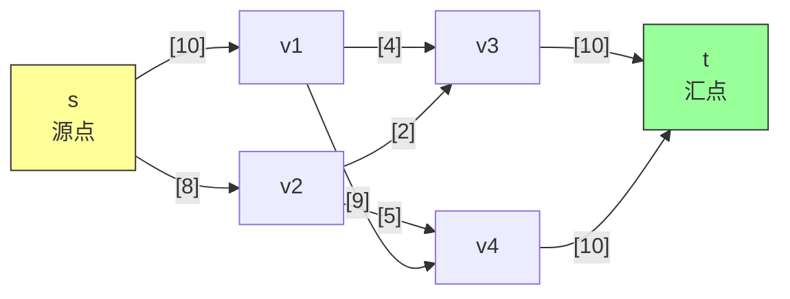

### 2.2 流的定义

**流** f 是定义在 V × V → ℝ 上的函数，满足：

**容量约束**：对所有 u, v ∈ V
```
0 ≤ f(u, v) ≤ c(u, v)
```
流不能为负，也不能超过容量。

**流守恒**：对所有 u ∈ V − {s, t}
```
Σ(v∈V) f(v, u) = Σ(v∈V) f(u, v)
```
中间节点的流入量 = 流出量（不积累也不消耗材料）。

**流的值** |f|：
```
|f| = Σ(v∈V) f(s, v) − Σ(v∈V) f(v, s)
```
即源点的净流出量。

### 2.3 反向平行边的处理

如果网络中存在反向平行边 (v1, v2) 和 (v2, v1)，需要转换为等价网络：

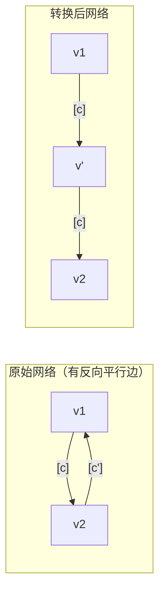

解决方案：添加中间顶点 v'，将 (v1, v2) 拆分为 (v1, v') 和 (v', v2)

### 2.4 多源点多汇点的处理

对于多源点 {s₁, s₂, ..., sₘ} 和多汇点 {t₁, t₂, ..., tₙ}，添加**超源点** s 和**超汇点** t：

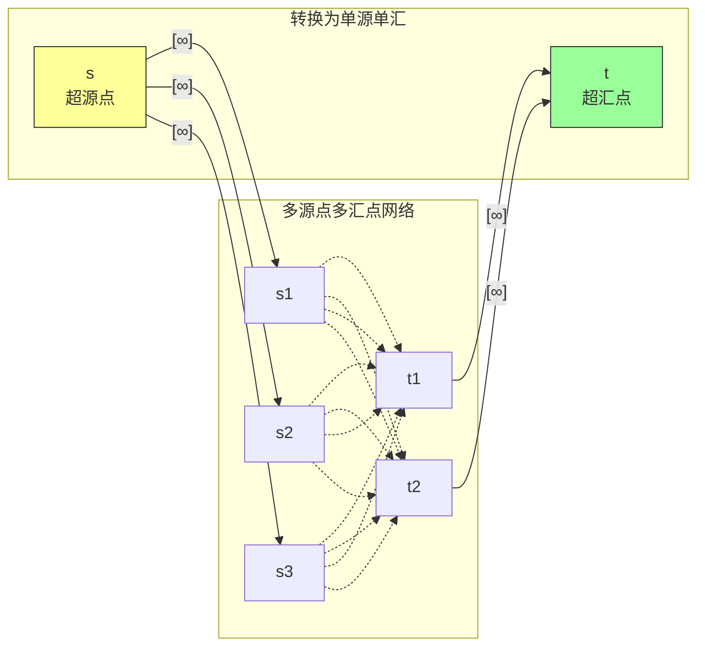

---

## 三、Ford-Fulkerson 方法

### 3.1 方法概述

Ford-Fulkerson 不是具体算法，而是一种**通用方法**：

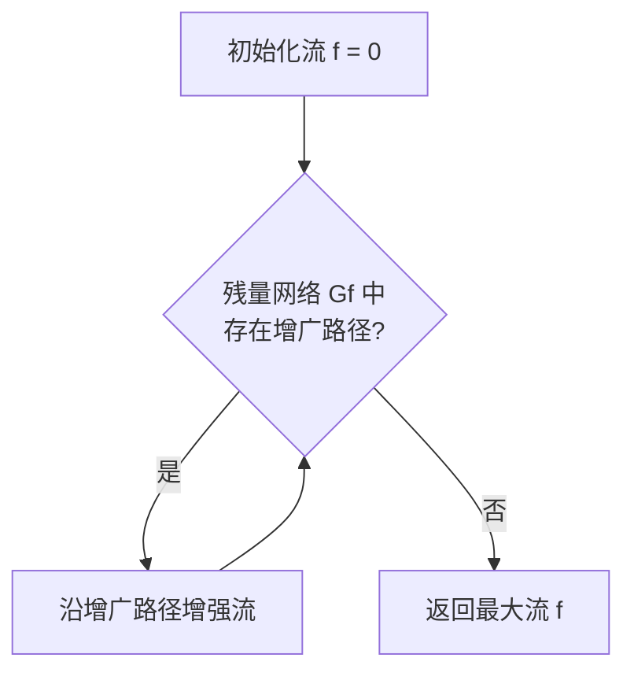

**核心思想**：通过不断寻找增广路径来增加流值，直到找不到增广路径为止。

### 3.2 残量网络（Residual Network）

**残量网络 Gf** 表示在当前流 f 的基础上，还可以如何调整流量。

对于每对顶点 (u, v)，**残量容量** c_f(u, v) 定义为：

```
c_f(u, v) = { c(u, v) − f(u, v)    如果 (u, v) ∈ E
           { f(v, u)              如果 (v, u) ∈ E
           { 0                    其他情况
```

**残量网络的性质**：
- 残量容量可能为正（允许增加流量）
- 可能存在原始网络中不存在的边（允许"撤回"已发送的流量）

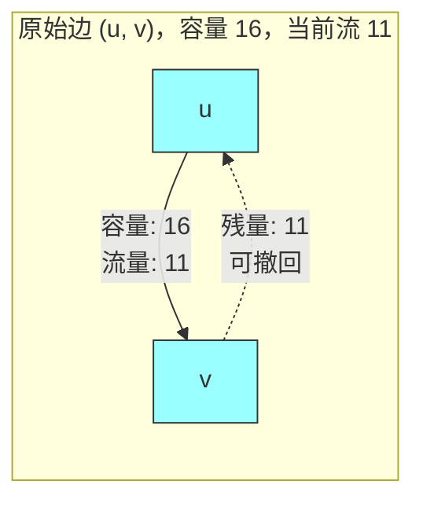

### 3.3 增广路径（Augmenting Path）

**增广路径**是残量网络中从 s 到 t 的简单路径。

**残量容量** cf(p) 是路径上所有边残量容量的最小值：
```
cf(p) = min { cf(u, v) : (u, v) 在路径 p 上 }
```

沿增广路径增加流量的操作称为**流增强**。

### 3.4 流增强的数学表示

设 f 是流网络 G 中的流，f' 是残量网络 Gf 中的流，定义**增强流** f ↑ f'：

```
(f ↑ f')(u, v) = f(u, v) + f'(u, v) − f'(v, u)
```

**引理 24.1**：增强后的流仍是合法的流，且值增加 |f'|。

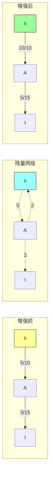

---

## 四、割（Cuts）

### 4.1 割的定义

**割** (S, T) 是将顶点集 V 划分为两部分，满足：
- s ∈ S，t ∈ T
- T = V − S

**割的净流量** f(S, T)：
```
f(S, T) = Σ(u∈S, v∈T) f(u, v) − Σ(u∈T, v∈S) f(u, v)
```

**割的容量** c(S, T)：
```
c(S, T) = Σ(u∈S, v∈T) c(u, v)  （只计算从 S 到 T 的边）
```

**最小割**：容量最小的割。

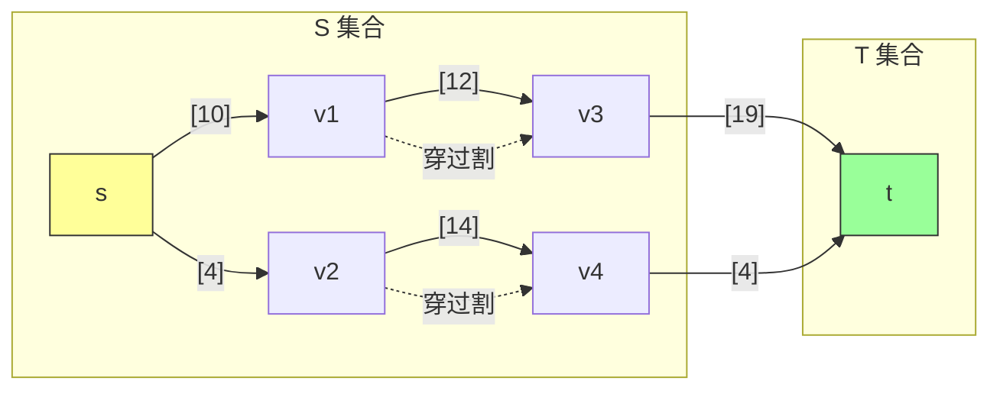

### 4.2 关键引理

**引理 24.4**：对于任意割 (S, T)，净流量 f(S, T) 等于流的值 |f|。

**推论 24.5**：任何流的值不超过任何割的容量。

```
|f| = f(S, T) ≤ c(S, T)  对所有割 (S, T) 成立
```

### 4.3 最大流最小割定理（核心定理）

**定理 24.6**：以下三个条件等价：

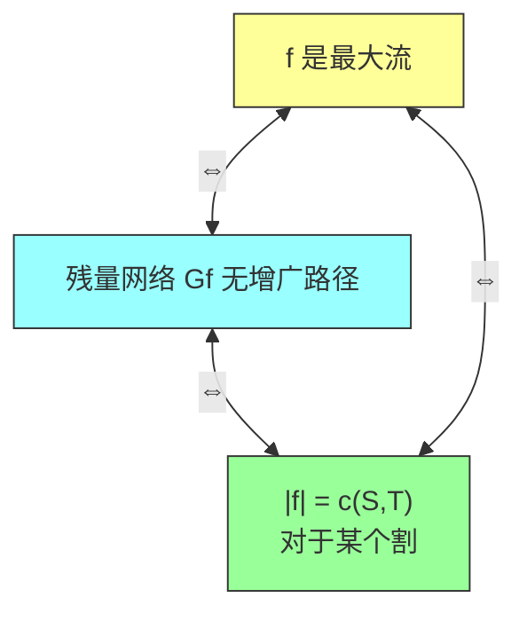

**证明思路**：
1. 如果有增广路径，可以增强流 ⇒ 不是最大流
2. 如果无增广路径，定义 S = 从 s 可达的所有顶点，则 (S, T) 是割且 |f| = c(S, T)
3. 如果 |f| = c(S, T)，根据推论 24.5，f 是最大流

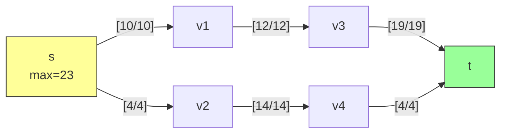

**最小割**: {s, v1, v2} → {v3, v4, t}，容量 = 12 + 14 = 26

---

## 五、算法实现

### 5.1 Ford-Fulkerson 算法

```java
public class FordFulkerson {

    /**
     * 在残量网络中找到增广路径
     */
    private List<Edge> findAugmentingPath(Graph graph, Vertex s, Vertex t) {
        // 使用深度优先搜索找到增广路径
        Map<Vertex, Edge> parent = new HashMap<>();
        Queue<Vertex> queue = new LinkedList<>();
        queue.offer(s);
        parent.put(s, null);

        while (!queue.isEmpty()) {
            Vertex u = queue.poll();
            for (Edge e : graph.getOutgoingEdges(u)) {
                Vertex v = e.getTarget();
                if (!parent.containsKey(v) && e.getResidualCapacity() > 0) {
                    parent.put(v, e);
                    if (v.equals(t)) {
                        return reconstructPath(parent, s, t);
                    }
                    queue.offer(v);
                }
            }
        }
        return null;
    }

    /**
     * 沿增广路径增强流
     */
    private void augmentFlow(Graph graph, List<Edge> path, int bottleneck) {
        for (Edge e : path) {
            if (graph.containsEdge(e.getSource(), e.getTarget())) {
                // 正向边：增加流
                e.setFlow(e.getFlow() + bottleneck);
            } else {
                // 反向边：减少流
                Edge reverseEdge = graph.getEdge(e.getTarget(), e.getSource());
                reverseEdge.setFlow(reverseEdge.getFlow() - bottleneck);
            }
        }
    }

    /**
     * Ford-Fulkerson 主算法
     */
    public MaxFlowResult maxFlow(Graph graph, Vertex s, Vertex t) {
        // 初始化所有流的流量为0
        for (Edge e : graph.getAllEdges()) {
            e.setFlow(0);
        }

        int maxFlow = 0;
        int iterations = 0;

        while (true) {
            List<Edge> path = findAugmentingPath(graph, s, t);
            if (path == null) {
                break; // 没有增广路径，算法结束
            }

            // 计算瓶颈容量
            int bottleneck = Integer.MAX_VALUE;
            for (Edge e : path) {
                bottleneck = Math.min(bottleneck, e.getResidualCapacity());
            }

            augmentFlow(graph, path, bottleneck);
            maxFlow += bottleneck;
            iterations++;
        }

        return new MaxFlowResult(maxFlow, iterations);
    }
}
```

### 5.2 Edmonds-Karp 算法（使用 BFS）

使用**广度优先搜索**找增广路径，保证多项式时间：

```java
public class EdmondsKarp extends FordFulkerson {

    @Override
    protected List<Edge> findAugmentingPath(Graph graph, Vertex s, Vertex t) {
        // 使用 BFS 保证找到最短路径
        Map<Vertex, Edge> parent = new HashMap<>();
        Queue<Vertex> queue = new LinkedList<>();
        queue.offer(s);
        parent.put(s, null);

        while (!queue.isEmpty()) {
            Vertex u = queue.poll();
            for (Edge e : graph.getOutgoingEdges(u)) {
                Vertex v = e.getTarget();
                // 只沿残量容量 > 0 的边走
                if (!parent.containsKey(v) && e.getResidualCapacity() > 0) {
                    parent.put(v, e);
                    queue.offer(v);

                    if (v.equals(t)) {
                        return reconstructPath(parent, s, t);
                    }
                }
            }
        }
        return null; // 没有增广路径
    }
}
```

### 5.3 时间复杂度分析

| 算法 | 时间复杂度 | 说明 |
|-----|-----------|------|
| Ford-Fulkerson（任意增广路径） | O(E × |f*\|) | |f*\| 是最大流值 |
| Edmonds-Karp（BFS 增广路径） | O(VE²) | 多项式时间 |

**Edmonds-Karp 分析的关键引理**：

**引理 24.7**：每次增广后，残量网络中顶点到 s 的最短距离**单调不减**。

**定理 24.8**：Edmonds-Karp 最多执行 O(VE) 次增广。

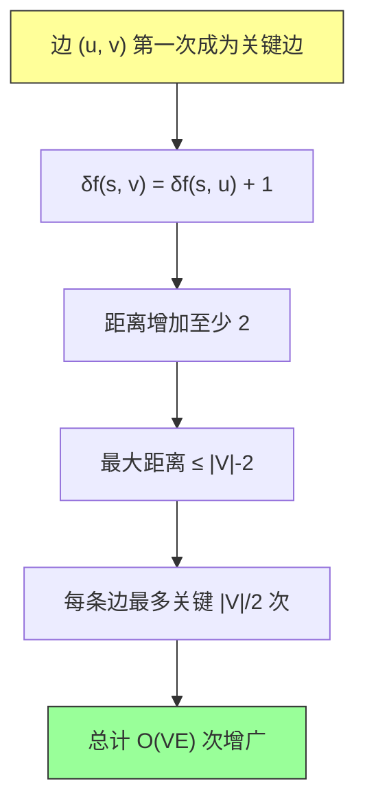

---

## 六、最大二分匹配

### 6.1 问题定义

**二分图**：顶点集 V = L ∪ R，L 和 R 不相交，所有边都在 L 和 R 之间。

**匹配**：没有两条边共享同一个顶点。

**最大匹配**：包含边数最多的匹配。

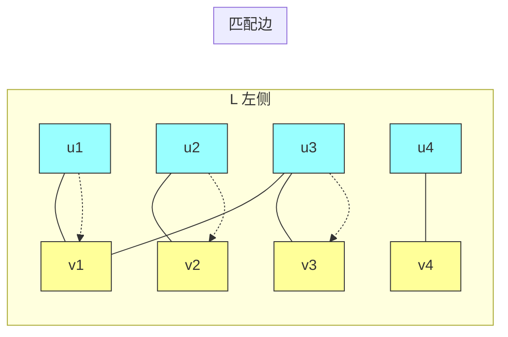

**最大匹配**：3 条边（u1-v1, u2-v2, u3-v3）

### 6.2 转化为最大流问题

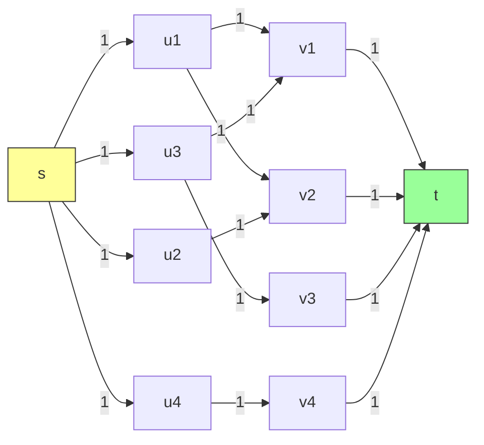

### 6.3 完整性定理

**定理 24.10（完整性定理）**：如果所有容量都是整数，则 Ford-Fulkerson 产生的流是**整数流**。


**推论 24.11**：二分图的最大匹配 = 对应流网络的最大流值。

```java
public class BipartiteMatching {

    /**
     * 将二分图转化为流网络
     */
    public Graph toFlowNetwork(BipartiteGraph bipartiteGraph) {
        Graph flowNetwork = new Graph();
        Vertex source = new Vertex("s");
        Vertex sink = new Vertex("t");

        // 添加源点和汇点
        flowNetwork.addVertex(source);
        flowNetwork.addVertex(sink);

        // 添加 L 到 source 的边
        for (Vertex u : bipartiteGraph.getLeftPart()) {
            flowNetwork.addVertex(u);
            Edge s_u = new Edge(source, u, 1);
            flowNetwork.addEdge(s_u);
        }

        // 添加 R 到 sink 的边
        for (Vertex v : bipartiteGraph.getRightPart()) {
            flowNetwork.addVertex(v);
            Edge v_t = new Edge(v, sink, 1);
            flowNetwork.addEdge(v_t);
        }

        // 添加 L 到 R 的边
        for (Edge e : bipartiteGraph.getEdges()) {
            Edge newEdge = new Edge(e.getSource(), e.getTarget(), 1);
            flowNetwork.addEdge(newEdge);
        }

        return flowNetwork;
    }

    /**
     * 从最大流中提取最大匹配
     */
    public Set<Edge> extractMatching(Graph flowNetwork) {
        Set<Edge> matching = new HashSet<>();

        for (Edge e : flowNetwork.getEdges()) {
            // 流量为 1 的 L→R 边对应匹配中的边
            if (e.getFlow() == 1 &&
                !e.getSource().getId().equals("s") &&
                !e.getTarget().getId().equals("t")) {
                matching.add(e);
            }
        }

        return matching;
    }

    /**
     * 找最大二分匹配
     */
    public int maxMatching(BipartiteGraph bipartiteGraph) {
        Graph flowNetwork = toFlowNetwork(bipartiteGraph);
        FordFulkerson ff = new FordFulkerson();
        MaxFlowResult result = ff.maxFlow(flowNetwork,
                                          new Vertex("s"),
                                          new Vertex("t"));
        return result.getMaxFlow();
    }
}
```

### 6.4 时间复杂度

使用 Edmonds-Karp 找最大二分匹配：**O(VE)**

由于匹配大小 ≤ min{|L|, |R|} = O(V)，所以总时间是 O(VE)。

---

## 七、具体例子演示

### 7.1 简单流网络示例

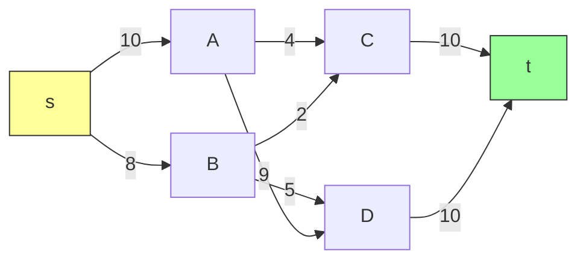

**最大流 = 19**

### 7.2 Edmonds-Karp 迭代过程

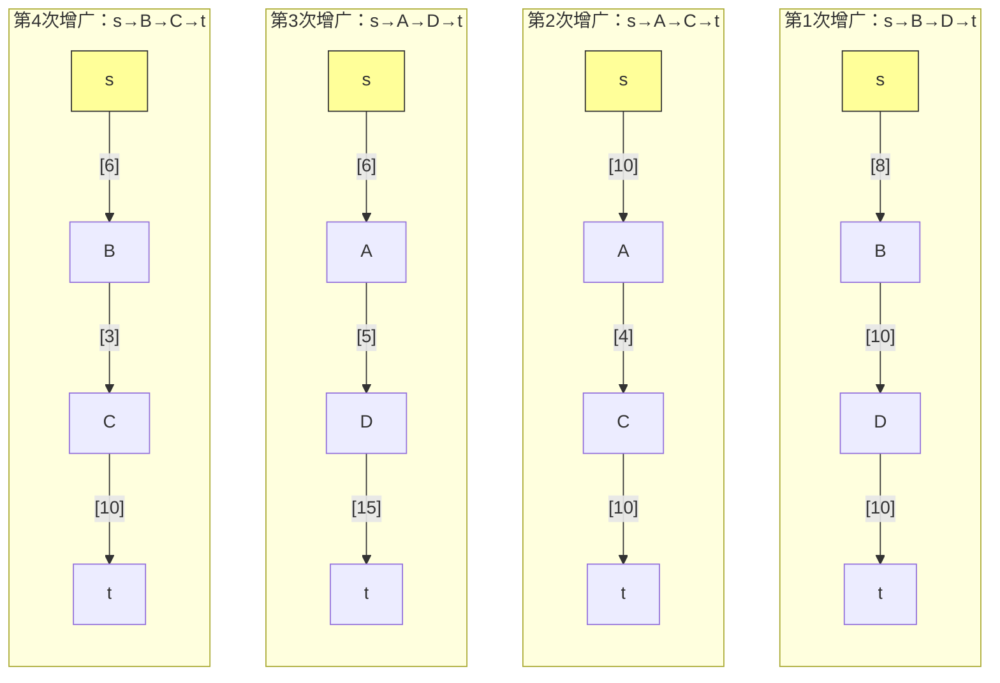

---

## 八、复杂度分析总结

| 方法/算法 | 时间复杂度 | 空间复杂度 | 特点 |
|----------|-----------|-----------|------|
| Ford-Fulkerson | O(E × |f*\|) | O(V + E) | 依赖增广路径选择 |
| Edmonds-Karp | O(VE²) | O(V + E) | BFS 保证多项式 |
| 最大二分匹配 | O(VE) | O(V + E) | 单位容量，匹配数 ≤ V |
| 缩放算法 | O(E² log C) | O(V + E) | C 是最大容量 |
| 最宽增广路径 | O(E log V × |f*\|) | O(V + E) | 类似 Dijkstra |

---

## 九、LeetCode 题目

### 基础题目

| 题号 | 题目 | 难度 | 核心思路 |
|-----|------|------|---------|
| [2007. Find Original Array From Doubled Array](https://leetcode.cn/problems/find-original-array-from-doubled-array/) | Medium | 贪心 + 哈希 |
| [295. Find Median from Data Stream](https://leetcode.cn/problems/find-median-from-data-stream/) | Hard | 最大堆 + 最小堆 |
| [253. Meeting Rooms II](https://leetcode.cn/problems/meeting-rooms-ii/) | Medium | 最小堆 / 差分数组 |

### 网络流相关题目

| 题号 | 题目 | 难度 | 核心思路 |
|-----|------|------|---------|
| [1579. Remove Max Number of Edges to Keep Graph Fully Traversable](https://leetcode.cn/problems/remove-max-number-of-edges-to-keep-graph-fully-traversable/) | Hard | 并查集 / 最大流 |
| [1584. Min Cost to Connect All Points](https://leetcode.cn/problems/min-cost-to-connect-all-points/) | Medium | 最小生成树 |
| [1631. Path With Minimum Effort](https://leetcode.cn/problems/path-with-minimum-effort/) | Medium | 二分 + BFS / 并查集 |

### 二分匹配题目

| 题号 | 题目 | 难度 | 核心思路 |
|-----|------|------|---------|
| [365. Can Place Flowers](https://leetcode.cn/problems/can-place-flowers/) | Easy | 贪心 |
| [406. Queue Reconstruction by Height](https://leetcode.cn/problems/queue-reconstruction-by-height/) | Medium | 贪心排序 |
| [621. Task Scheduler](https://leetcode.cn/problems/task-scheduler/) | Medium | 贪心 / 公式计算 |
| [207. Course Schedule](https://leetcode.cn/problems/course-schedule/) | Medium | 拓扑排序 / BFS |

### 推荐刷题顺序

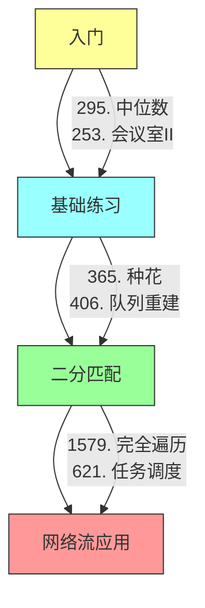

---

## 十、扩展与应用

### 10.1 顶点容量的处理

问题：如果顶点也有容量限制。

**解决方法**：将每个顶点拆分为入点和出点：

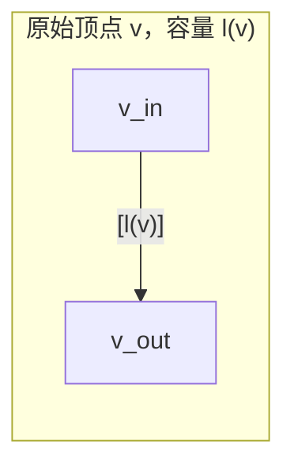

### 10.2 实际应用场景

| 应用领域 | 具体场景 |
|---------|---------|
| 网络带宽 | 路由器间的流量分配 |
| 交通流量 | 城市道路网络优化 |
| 任务调度 | 工作分配与资源分配 |
| 图像分割 | 计算机视觉中的前景/背景分离 |
| 匹配问题 | 婚姻匹配、工作配对 |

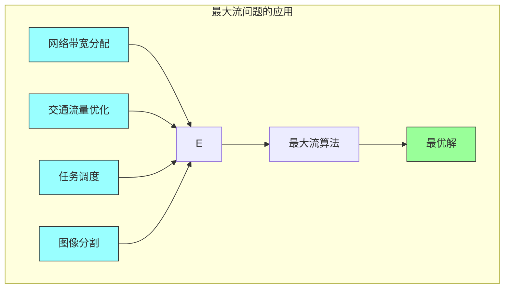

### 10.3 更多算法

**推送-重标记算法（Push-Relabel）**：
- 允许临时违反流守恒
- O(V³) 或更好的复杂度
- 在实践中比增广路径算法更快

**Dinic 算法**：
- 使用层次图和阻塞流
- O(V²E) 或 O(V³) 对于一般图

---

## 十一、章节习题

### 习题 24.1-1
证明边分裂后的网络等价于原网络。

### 习题 24.1-3
如果存在顶点 u 不在任何 s→t 路径上，证明最大流中 u 的流量为 0。

### 习题 24.2-3
在图 24.1(a) 上运行 Edmonds-Karp 算法。

### 习题 24.3-2
用数学归纳法证明完整性定理（定理 24.10）。

---

## 十二、章节笔记

### 核心思想总结

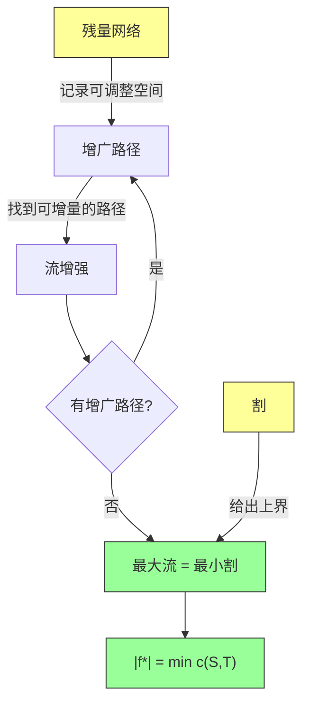

### 学习要点

1. **理解残量网络**：这是 Ford-Fulkerson 方法的核心概念
2. **理解割**：最小割给出了最大流的上界
3. **掌握 Edmonds-Karp**：第一个多项式时间的最大流算法
4. **理解对偶性**：最大流和最小割的等价关系

### 常见误区

- 残量网络中可能存在原图中不存在的边（反向边）
- 沿增广路径增加流后，部分边的流量可能减少
- 最大流的值等于最小割的容量，而不是最大割的容量

---

## 十三、LeetCode 精选题目详解

### 题目 1: 365. Can Place Flowers

**题目描述**：给定一个花坛表示的数组和一些需要种植的花，判断是否可以种植而不违反规则。

**核心思路**：贪心，从左到右遍历，遇到空地且左右都为空（或边界）就种植。

```java
class Solution {
    public boolean canPlaceFlowers(int[] flowerbed, int n) {
        int count = 0;
        for (int i = 0; i < flowerbed.length; i++) {
            if (flowerbed[i] == 0) {
                boolean leftEmpty = (i == 0) || (flowerbed[i - 1] == 0);
                boolean rightEmpty = (i == flowerbed.length - 1) || (flowerbed[i + 1] == 0);

                if (leftEmpty && rightEmpty) {
                    flowerbed[i] = 1;
                    count++;
                    if (count >= n) return true;
                }
            }
        }
        return count >= n;
    }
}
```

### 题目 2: 295. Find Median from Data Stream

**题目描述**：动态数据流的中位数。

**核心思路**：使用最大堆存左半部分，最小堆存右半部分。

```java
class MedianFinder {
    // 最大堆：存较小的半部分
    private PriorityQueue<Integer> maxHeap;
    // 最小堆：存较大的半部分
    private PriorityQueue<Integer> minHeap;

    public MedianFinder() {
        maxHeap = new PriorityQueue<>(Collections.reverseOrder());
        minHeap = new PriorityQueue<>();
    }

    public void addNum(int num) {
        if (maxHeap.isEmpty() || num <= maxHeap.peek()) {
            maxHeap.offer(num);
        } else {
            minHeap.offer(num);
        }

        // 平衡两个堆的大小
        if (maxHeap.size() > minHeap.size() + 1) {
            minHeap.offer(maxHeap.poll());
        } else if (minHeap.size() > maxHeap.size()) {
            maxHeap.offer(minHeap.poll());
        }
    }

    public double findMedian() {
        if (maxHeap.size() == minHeap.size()) {
            return (maxHeap.peek() + minHeap.peek()) / 2.0;
        } else {
            return maxHeap.peek();
        }
    }
}
```

### 题目 3: 1579. Remove Max Number of Edges to Keep Graph Fully Traversable

**题目描述**：Alice 和 Bob 需要能相互到达所有节点，去掉最多的边。

**核心思路**：使用并查集处理公共边，然后用独立的边分别处理。

```java
class UnionFind {
    private int[] parent;
    private int[] rank;
    private int count;

    public UnionFind(int n) {
        parent = new int[n];
        rank = new int[n];
        for (int i = 0; i < n; i++) {
            parent[i] = i;
        }
        count = n;
    }

    public int find(int x) {
        if (parent[x] != x) {
            parent[x] = find(parent[x]);
        }
        return parent[x];
    }

    public boolean union(int x, int y) {
        int px = find(x), py = find(y);
        if (px == py) return false;

        if (rank[px] < rank[py]) {
            parent[px] = py;
        } else if (rank[px] > rank[py]) {
            parent[py] = px;
        } else {
            parent[py] = px;
            rank[px]++;
        }
        count--;
        return true;
    }

    public int getCount() {
        return count;
    }
}

class Solution {
    public int maxNumEdgesToRemove(int[][] edges, int n) {
        // 类型3的边先处理
        UnionFind alice = new UnionFind(n + 1);
        UnionFind bob = new UnionFind(n + 1);
        int used = 0;

        // 处理公共边
        for (int[] edge : edges) {
            if (edge[0] == 3) {
                if (alice.union(edge[1], edge[2])) {
                    bob.union(edge[1], edge[2]);
                    used++;
                }
            }
        }

        // 处理 Alice 专属边
        for (int[] edge : edges) {
            if (edge[0] == 1) {
                if (alice.union(edge[1], edge[2])) {
                    used++;
                }
            }
        }

        // 处理 Bob 专属边
        for (int[] edge : edges) {
            if (edge[0] == 2) {
                if (bob.union(edge[1], edge[2])) {
                    used++;
                }
            }
        }

        // 检查是否完全连通
        if (alice.getCount() > 1 || bob.getCount() > 1) {
            return -1;
        }

        return edges.length - used;
    }
}
```

---

## 十四、本章小结

第24章系统介绍了**最大流问题**及其解决方法。主要贡献包括：


| 内容 | 说明 |
|-----|------|
| **形式化定义** | 给出了流网络和流的严格数学定义 |
| **Ford-Fulkerson 方法** | 通用的迭代框架 |
| **残量网络** | 优雅地表示流的可调整空间 |
| **最大流最小割定理** | 网络流理论的核心定理 |
| **Edmonds-Karp 算法** | 第一个多项式时间算法 |
| **应用** | 二分匹配可以转化为最大流问题 |

这些概念和算法在后续章节（第25章最小费用流等）以及实际应用中都有重要意义。

---

## 参考文献

- Ford, L. R., and Fulkerson, D. R. (1956). "Maximal flow through a network". *Canadian Journal of Mathematics*.
- Edmonds, J., and Karp, R. M. (1972). "Theoretical improvements in algorithmic efficiency for network flow problems". *J. ACM*.
- Dinic, E. A. (1970). "Algorithm for solution of a problem of maximum flow in a network with power estimation". *Soviet Math. Doklady*.
