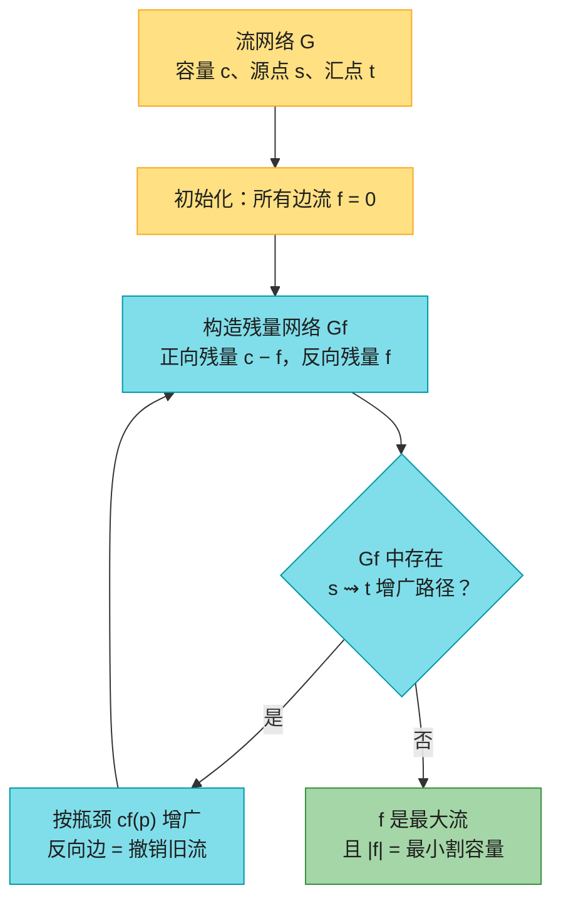
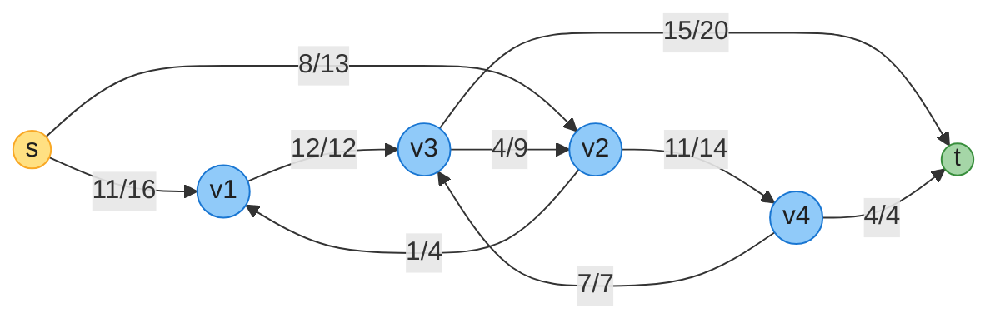
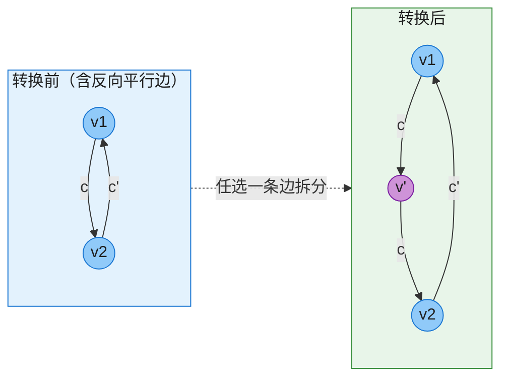
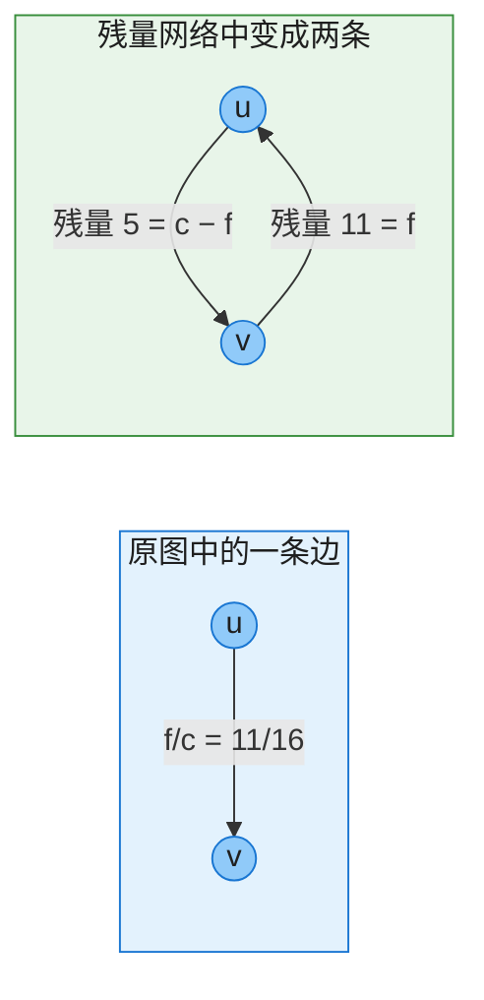
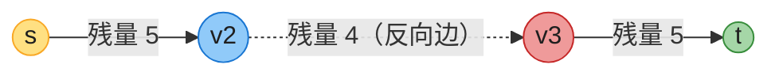
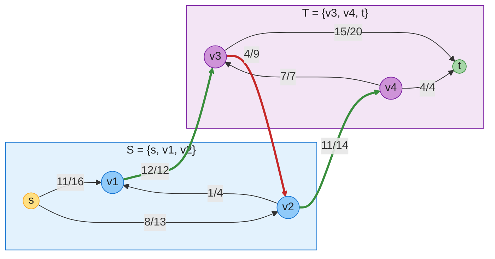
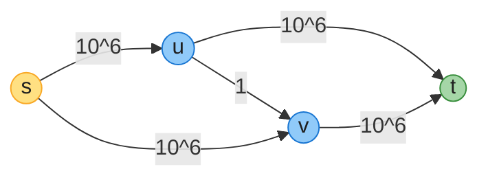
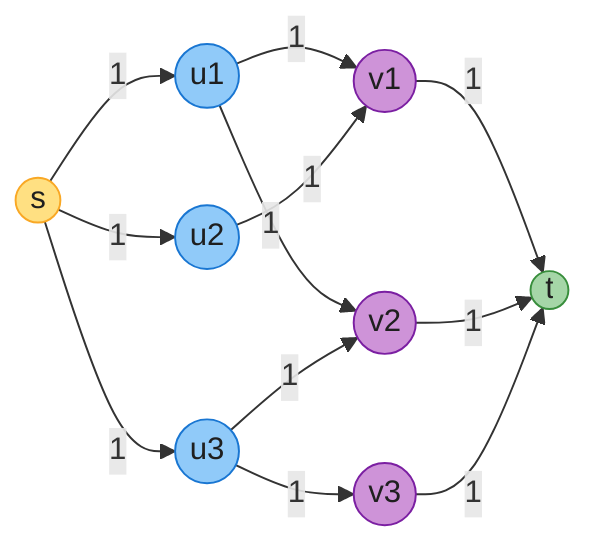

# 第 24 章：最大流（Maximum Flow）——深度版

## 一、开篇定位

本章回答一个问题：**给定一个带容量限制的有向网络，从源点 s 到汇点 t 最多能同时传输多少物资？**原书引子是 Lucky Puck 公司的运输问题：工厂（源点）每天生产冰球，仓库（汇点）收货，城市间的卡车线路每条每天最多运 c(u, v) 箱——问每天最多能运多少箱。同一个模型可以套在液体管道、电流、通信带宽、任务分配上。

与前后章节的关系：

- **第 20 章 BFS** 是 Edmonds-Karp 算法找增广路径的工具；
- **割**的概念在第 21 章最小生成树里见过，但本章的割是**有向图**上的、且固定要求 s ∈ S、t ∈ T——定义更严格，用途也不同（给出流值的上界）；
- 残量网络中的最短距离分析沿用**第 22 章** BFS 最短路结论；
- 本章 24.3 用最大流解**二分图最大匹配**，第 25 章会给出专门为匹配设计的更快算法（Hopcroft-Karp，$O(\sqrt{V}E)$）与稳定婚姻、分配问题。

做题定位：LeetCode 几乎不考手写最大流；真正可考的是**二分图判定**（785/886 二染色）与**二分图匹配**（1820/1349，匈牙利算法 = 手动版增广路径）。本章的价值更多在建模思想——「点不相交路径」「最小割 = 最小代价分离」这类转化在面试与竞赛中反复出现。

**本章主线**：流网络与流的形式定义（24.1）→ Ford-Fulkerson 方法三件套：残量网络、增广路径、割（24.2）→ 最大流最小割定理 → Edmonds-Karp（BFS 实现，$O(VE^2)$）→ 二分图最大匹配（24.3）→ Java + Python 双实现 → 速查/易混 → 题单与习题。

---

## 二、核心思想：在残量网络上反复「挤」流

大白话讲 Ford-Fulkerson 方法：先让所有边空着（f = 0）。每一轮，问「当前还能不能再挤一点过去？」——为此构造**残量网络**：每条边标注「还能加多少」（容量 − 当前流），并且给每条已载流的边配一条**反向边**（标注「能退多少」）——反向边是后悔药：把以前发错的流退回去，换一条更好的路。残量网络里只要还存在一条 s 到 t 的通路（**增广路径**），就沿它按最小剩余额度（**瓶颈**）增广。直到找不到这样的路——此时流值恰好等于某个割的容量，这就是**最大流最小割定理**。



注意 Ford-Fulkerson 是**方法**而非具体算法：增广路径怎么找，决定了效率——任意找是 $O(E \cdot |f^*|)$（可能很慢），用 BFS 找边数最少的就是多项式的 Edmonds-Karp。

---

## 三、流网络与流（24.1）

### 3.1 定义

**流网络** $G = (V, E)$：有向图，每条边 $(u, v) \in E$ 有非负**容量** $c(u, v) \ge 0$。两条限制：

- 无**反向平行边**：$(u,v) \in E$ 则 $(v,u) \notin E$（3.3 节讲怎么绕过）；
- 无自环；含**源点 s** 与**汇点 t**；方便起见假设每个顶点都在某条 s ⇝ t 路径上（于是每个非源点至少一条入边，$|E| \ge |V| - 1$）。

**流** $f: V \times V \to \mathbb{R}$，满足两条性质：

- **容量约束**：$0 \le f(u,v) \le c(u,v)$；
- **流守恒**：对 $u \in V - \{s, t\}$，流入 = 流出（中间节点不囤货；电流情形即基尔霍夫定律）。

**流的值** $|f| = \sum_v f(s,v) - \sum_v f(v,s)$，即源点净流出量（$|\cdot|$ 这里不是绝对值）。**最大流问题**：找流值最大的流。

原书 Figure 24.1 的标准例子（Lucky Puck 运输网），边标注「流/容量」，$|f| = 11 + 8 = 19$：



**图 A**（对应 Figure 24.1(b)）：可以顺手验证守恒——v3 流入 12 + 7 = 19，流出 4 + 15 = 19。这个流还不是最大的（本章终点是把它推到 23）。

### 3.2 反向平行边怎么办

原书不允许 $(v_1,v_2)$ 与 $(v_2,v_1)$ 同时存在。若实际问题里两条都有，**任选一条拆开**：加新顶点 $v'$，把 $(v_1,v_2)$ 换成 $(v_1,v') + (v',v_2)$，容量不变（习题 24.1-1 证明等价——直觉：$v'$ 的流入必等于流出，合回去毫无区别）。



**图 B**（对应 Figure 24.2）：拆的是 $(v_1,v_2)$，$(v_2,v_1)$ 原样保留。

### 3.3 两个实用建模技巧

**多源多汇**：加**超源点 s** 向每个源点连容量 ∞ 的边、**超汇点 t** 收每个汇点容量 ∞ 的边，化为单源单汇（Figure 24.3；∞ 可用「所有容量之和」之类的有限大数代替）。

**顶点也有容量**（习题 24.1-7）：把 v 拆成 $v_{in} \to v_{out}$、容量 $l(v)$；入边全接 $v_{in}$，出边全从 $v_{out}$ 发出。新网络 $2|V|$ 个顶点、$|E| + |V|$ 条边。这是「点不相交路径」类问题（如习题 24.1-6 两个孩子上学、思考题 24-1 网格逃生）的标准化归。

---

## 四、Ford-Fulkerson 方法（24.2）

### 4.1 残量网络：还能怎么调

给定流 f，边 $(u,v)$ 还能再压进去 $c(u,v) - f(u,v)$；同时最多能把已发的 $f(u,v)$「退回来」。**残量容量**：

$$c_f(u,v) = \begin{cases} c(u,v) - f(u,v) & (u,v) \in E \\ f(v,u) & (v,u) \in E \\ 0 & \text{其他} \end{cases}$$

**残量网络** $G_f = (V, E_f)$，$E_f = \{(u,v) : c_f(u,v) > 0\}$。$G_f$ 的边要么是 E 的边、要么是其反向 ⇒ $|E_f| \le 2|E|$。注意 $G_f$ 可以有反向平行边（它**不是**严格定义的流网络，但可以在其上定义流）。



**图 C**（对应原书 24.2 节的 16/11 例子）：正向残量 5 = 还能再加的；反向残量 11 = 还能退的。反向边也叫**撤销（cancellation）**边——u→v 发 5 箱、v→u 发 2 箱，净效果等价于 u→v 发 3 箱。

### 4.2 增广路径：找到就增值

**增广路径** p = 残量网络中 s ⇝ t 的**简单路径**。其残量容量（瓶颈）$c_f(p) = \min\{c_f(u,v) : (u,v) \in p\}$。沿 p 把每条边的流增广 $c_f(p)$（正向边加、反向边对应的原边减），由流增强的定义 $(f \uparrow f')(u,v) = f(u,v) + f'(u,v) - f'(v,u)$ 可得：新流仍合法，且流值严格增加 $|f_p| = c_f(p) > 0$。

用图 A 的流（$|f| = 19$）实际跑一遍——它的残量网络里有这样一条增广路径：



**图 D**（对应 Figure 24.4）：$c_f(p) = \min(5, 4, 5) = 4$。关键是中间那条 **v2→v3 在原图中根本不存在**——它是 v3→v2（当前流 4/9）的反向残量边，沿它推 4 单位等价于把 v3→v2 上已发的 4 单位「退回去」另作他用。增广后 $|f| = 19 + 4 = 23$，恰好已是最大流（第七节的代码完整复现了这一步）。

### 4.3 割：流值的上界

**割** $(S, T)$：把 V 分成 S 与 $T = V - S$，要求 $s \in S$、$t \in T$。两个量（注意不对称，这是重点）：

- **净流量** $f(S,T) = \sum_{u \in S}\sum_{v \in T} f(u,v) - \sum_{u \in S}\sum_{v \in T} f(v,u)$——**双向都算**，T→S 的要减；
- **容量** $c(S,T) = \sum_{u \in S}\sum_{v \in T} c(u,v)$——**只算 S→T 方向**。



**图 E**（对应 Figure 24.5）：绿粗边 = S→T 跨割边（计入容量），红粗边 = T→S 跨割边（净流量里要减、容量里不算）。验证：净流量 $= (12 + 11) - 4 = 19 = |f|$；容量 $= 12 + 14 = 26$。这个割不是最小割（26 > 23，最小割见第五节 trace）。

两条结论（证明是「把流守恒在 S 上求和」的例行展开，按数学克制原则略去）：

- **任何割的净流量都等于 |f|**（直觉：s 发出的每单位流终究要穿过割到达 t）；
- **推论**：$|f| = f(S,T) \le c(S,T)$——**任何流值 ≤ 任何割容量**，于是最大流 ≤ 最小割。

### 4.4 最大流最小割定理（本章核心）

**定理**：以下三个条件互相等价：


**证明思路**（三步都很短）：①⇒②：若还有增广路径就能再增广，矛盾；②⇒③：取 S =「$G_f$ 中从 s 可达的顶点」，则跨割的 S→T 边必然满载、T→S 边必然零流（否则对面那个点就可达了），于是 $|f| = f(S,T) = c(S,T)$；③⇒①：由上面的推论，流值到顶了。

②⇒③ 是**构造性**的：算法跑完后在残量网络里做一次 BFS/DFS，可达集 S 直接给出最小割——代码里的 `minCut` 就是这么做（也是「最小割 = 最小代价分离」类建模题的标准取割方法）。

### 4.5 伪代码（CLRS，第四版）

```
FORD-FULKERSON-METHOD(G, s, t)
1  initialize flow f to 0
2  while there exists an augmenting path p in the residual network Gf
3      augment flow f along p
4  return f

FORD-FULKERSON(G, s, t)
1  for each edge (u, v) ∈ G.E
2      (u, v).f = 0
3  while there exists a path p from s to t in the residual network Gf
4      cf(p) = min{cf(u, v) : (u, v) is in p}
5      for each edge (u, v) in p
6          if (u, v) ∈ G.E
7              (u, v).f = (u, v).f + cf(p)
8          else (v, u).f = (v, u).f - cf(p)
9  return f
```

第 6–8 行：增广路径上的残量边若是原图的边就加流，若是反向边就把对应原边的流减掉（撤销）。

### 4.6 基础分析：$O(E \cdot |f^*|)$，以及一个坏例子

整数容量下，每次增广流值至少 +1 ⇒ while 循环至多 $|f^*|$ 次；每次找路径（BFS 或 DFS）+ 增广是 $O(E)$ ⇒ 总计 $O(E \cdot |f^*|)$。有理数容量可以先通分转整数；**无理数容量下任意选路径甚至可能永不终止**（流值递增但不收敛到最大流）。

$|f^*|$ 大时这个界很糟：



**图 F**（对应 Figure 24.7）：最大流显然是 2×10⁶（s→u→t 与 s→v→t 各 10⁶）。但如果每次都「不巧」选中 s→u→v→t 或 s→v→u→t（后者走 (v,u) 反向残量边），每次只增广 1 ⇒ **2,000,000 次迭代**。教训：增广路径不能随便挑——下一节的 Edmonds-Karp 用 BFS 选边数最少的路径，这个网络只增广 2 次（代码已验证）。

---

## 五、Edmonds-Karp 算法：BFS 增广，$O(VE^2)$

### 5.1 分析与两条结论

**Edmonds-Karp** = Ford-Fulkerson 方法 + 用 BFS 在残量网络中找**边数最少**的增广路径。记 $\delta_f(s, v)$ 为 $G_f$ 中 s 到 v 的最短距离（每边单位长度），分析依赖两条结论（原书是反证法引理，这里只留速查形式）：

- **距离单调性**：每次增广后，所有顶点的 $\delta_f(s,v)$ **单调不减**（直觉：增广只会「消耗」最短路、或新增指向后方的反向边，没法让任何点离 s 更近）；
- **增广次数 O(VE)**：增广路径上的瓶颈边叫**关键边**，增广后它从残量网络消失；它要再现（等反向边被增广）时，$\delta(s,u)$ 已至少涨 2 ⇒ 每条边至多成为关键边 $|V|/2$ 次 ⇒ 总增广 $O(VE)$。

每次增广一次 BFS $O(E)$ ⇒ **总时间 $O(VE^2)$**，与容量大小无关（真多项式，不是伪多项式）。

### 5.2 在 Figure 24.1(a) 网络上的完整 trace

对图 A 的网络（s=0, v1=1, v2=2, v3=3, v4=4, t=5）跑 Edmonds-Karp（第七节代码的实际输出）：

| 轮次 | 增广路径（BFS 最短） | 瓶颈 | 累计流值 |
|------|--------------------|------|---------|
| 1 | s → v1 → v3 → t | 12 | 12 |
| 2 | s → v2 → v4 → t | 4 | 16 |
| 3 | s → v2 → v4 → v3 → t | 7 | **23** |

第 4 次 BFS 时 t 不可达，结束。此时残量网络中 s 可达集为 $\{s, v_1, v_2, v_4\}$ ⇒ 最小割 $(\{s,v_1,v_2,v_4\}, \{v_3,t\})$，容量 $= c(v_1,v_3) + c(v_4,v_3) + c(v_4,t) = 12 + 7 + 4 = 23$ ✓（最大流最小割定理）。这正是习题 24.2-3 要求手算的内容。

本例三次增广恰好全是正向边；需要**反向边撤销**的场景回看图 D。

---

## 六、最大二分匹配（24.3）

### 6.1 定义与化归

**匹配** M：边集的子集，任意两条边不共享顶点。**最大匹配** = 边数最多的匹配。**二分图**：顶点分 L、R 两侧，所有边横跨两侧。应用：机器 ↔ 任务、候选人 ↔ 时段。

化归成最大流：加源点 s 向每个 L 顶点连边、加汇点 t 收每个 R 顶点的边，原图的边定向为 L→R，**全部容量设为 1**：



**图 G**（对应 Figure 24.8(c) 的构造）：流量为 1 的 L→R 边即匹配边。本例最大匹配 = 3（如 u1-v2、u2-v1、u3-v3），代码验证一致。

### 6.2 为什么成立 + 复杂度

- **对应关系**：匹配 M ⇔ 值为 |M| 的整数值流（每条匹配边对应 1 单位的 s→u→v→t 路径流，这些路径除 s、t 外点不相交）；
- **完整性定理**：容量全为整数 ⇒ Ford-Fulkerson 产生的最大流是**整数流**（归纳：整数残量 ⇒ 整数瓶颈 ⇒ 增广后仍整数）⇒ 最大流值 = 最大匹配数；
- **复杂度**：匹配数 $\le \min(|L|, |R|) = O(V)$ ⇒ 至多 $O(V)$ 次增广，每次 $O(E)$ ⇒ **$O(VE)$**。

第 25 章的 Hopcroft-Karp 把「每轮找一条增广路径」改进为「每轮找一批最短增广路径」，做到 $O(\sqrt{V}E)$。LeetCode 标注：1820（匈牙利算法裸题）、1349（匹配建模 + König 定理）。

---

## 七、代码实现（Java + Python）

约定：伪代码是 CLRS 风格；实战代码统一 **0-indexed**。实现要点：邻接表存储，每条正向边记录**反向边在邻接表中的下标**（`rev`），`cap` 字段直接存**残量容量**——加边时同时挂正向边（cap）与反向边（0），增广 = 正向扣、反向加。取流量用「容量 − 残量」。

以下代码已实际编译运行：Figure 24.1(a) 的 EK trace 与最小割、Figure 24.4 的 cancellation 增广（从 |f|=19 的给定流继续，路径恰为 s→v2→v3→t）、Figure 24.7 坏网络（EK 仅 2 次增广）、LeetCode 1820 官方样例全部对上；另做随机对拍——EK vs DFS 版 Ford-Fulkerson 2000 轮（逐例校验容量约束、流守恒、最大流 = 最小割容量）、匈牙利 vs 最大流匹配 2000 轮，全部一致。

### 7.1 Java

```java
import java.util.*;

public class MaxFlow {
    // ================= Edmonds-Karp：邻接表 + 反向边索引，O(VE^2) =================
    static class Edge {
        int to, rev;   // 终点、反向边在 g[to] 中的下标
        long cap;      // 残量容量（不是固定容量！）
        Edge(int to, int rev, long cap) { this.to = to; this.rev = rev; this.cap = cap; }
    }

    int n;
    List<List<Edge>> g;
    List<long[]> orig = new ArrayList<>();  // {u, v, cap, indexInG[u]}：记录原始边，便于取流量/重置

    MaxFlow(int n) {
        this.n = n;
        g = new ArrayList<>();
        for (int i = 0; i < n; i++) g.add(new ArrayList<>());
    }

    // 加有向边 u->v（容量 cap），同时挂反向残量边（初始容量 0）
    void addEdge(int u, int v, long cap) {
        orig.add(new long[]{u, v, cap, g.get(u).size()});
        g.get(u).add(new Edge(v, g.get(v).size(), cap));
        g.get(v).add(new Edge(u, g.get(u).size() - 1, 0));
    }

    static class AugStep {
        List<Integer> path;
        long bottleneck;
    }

    // Edmonds-Karp 主过程：BFS 找边数最少的增广路径
    long maxFlow(int s, int t, List<AugStep> trace) {
        long flow = 0;
        while (true) {
            // BFS：在残量网络中找 s -> t 最短路径
            int[] prevV = new int[n];
            int[] prevE = new int[n];
            Arrays.fill(prevV, -1);
            prevV[s] = s;
            ArrayDeque<Integer> q = new ArrayDeque<>();
            q.offer(s);
            while (!q.isEmpty() && prevV[t] < 0) {
                int u = q.poll();
                List<Edge> adj = g.get(u);
                for (int i = 0; i < adj.size(); i++) {
                    Edge e = adj.get(i);
                    if (e.cap > 0 && prevV[e.to] < 0) {
                        prevV[e.to] = u;
                        prevE[e.to] = i;
                        q.offer(e.to);
                    }
                }
            }
            if (prevV[t] < 0) break;                       // 无增广路径 ⇒ 已达最大流
            // 瓶颈 = 路径上最小残量容量 cf(p)
            long bott = Long.MAX_VALUE;
            for (int v = t; v != s; v = prevV[v])
                bott = Math.min(bott, g.get(prevV[v]).get(prevE[v]).cap);
            // 沿路径增广：经过的边扣残量，其反向边加回（= 允许撤销）
            List<Integer> path = new ArrayList<>();
            for (int v = t; v != s; v = prevV[v]) {
                Edge e = g.get(prevV[v]).get(prevE[v]);
                e.cap -= bott;
                g.get(v).get(e.rev).cap += bott;
                path.add(v);
            }
            path.add(s);
            Collections.reverse(path);
            if (trace != null) {
                AugStep st = new AugStep();
                st.path = path;
                st.bottleneck = bott;
                trace.add(st);
            }
            flow += bott;
        }
        return flow;
    }

    long maxFlow(int s, int t) { return maxFlow(s, t, null); }

    // 最大流算完后，残量网络中从 s 可达的顶点集 = 最小割的 S 侧
    boolean[] minCut(int s) {
        boolean[] vis = new boolean[n];
        vis[s] = true;
        ArrayDeque<Integer> q = new ArrayDeque<>();
        q.offer(s);
        while (!q.isEmpty()) {
            int u = q.poll();
            for (Edge e : g.get(u))
                if (e.cap > 0 && !vis[e.to]) { vis[e.to] = true; q.offer(e.to); }
        }
        return vis;
    }

    // 第 i 条原始边上的流量 = 容量 - 当前残量
    long flowOn(int i) {
        long[] oe = orig.get(i);
        return oe[2] - g.get((int) oe[0]).get((int) oe[3]).cap;
    }

    // 预设第 i 条原始边的流量为 f（用于从某个给定流继续增广，见 Figure 24.4 测试）
    void presetFlow(int i, long f) {
        long[] oe = orig.get(i);
        Edge fwd = g.get((int) oe[0]).get((int) oe[3]);
        fwd.cap = oe[2] - f;
        g.get((int) oe[1]).get(fwd.rev).cap = f;
    }

    // 恢复所有边为初始状态（流量清零）
    void resetFlow() {
        for (long[] oe : orig) {
            Edge fwd = g.get((int) oe[0]).get((int) oe[3]);
            fwd.cap = oe[2];
            g.get((int) oe[1]).get(fwd.rev).cap = 0;
        }
    }

    // ================= 对照组：DFS 版 Ford-Fulkerson（任意增广路径） =================
    long maxFlowDFS(int s, int t) {
        long flow = 0;
        while (true) {
            long f = dfs(s, t, Long.MAX_VALUE, new boolean[n]);
            if (f == 0) break;
            flow += f;
        }
        return flow;
    }

    long dfs(int u, int t, long f, boolean[] vis) {
        if (u == t) return f;
        vis[u] = true;
        List<Edge> adj = g.get(u);
        for (int i = 0; i < adj.size(); i++) {
            Edge e = adj.get(i);
            if (e.cap > 0 && !vis[e.to]) {
                long d = dfs(e.to, t, Math.min(f, e.cap), vis);
                if (d > 0) {
                    e.cap -= d;
                    g.get(e.to).get(e.rev).cap += d;
                    return d;
                }
            }
        }
        return 0;
    }

    // ================= 应用：二分图最大匹配（化为单位容量最大流，O(VE)） =================
    // nL 个左点、nR 个右点，edges = {左点, 右点}（均 0-indexed）
    static int maxBipartiteMatching(int nL, int nR, List<int[]> edges) {
        // 顶点布局：0 = 超源点 s，1..nL = L，nL+1..nL+nR = R，nL+nR+1 = 超汇点 t
        MaxFlow mf = new MaxFlow(nL + nR + 2);
        int s = 0, t = nL + nR + 1;
        for (int i = 0; i < nL; i++) mf.addEdge(s, 1 + i, 1);
        for (int[] e : edges) mf.addEdge(1 + e[0], 1 + nL + e[1], 1);
        for (int j = 0; j < nR; j++) mf.addEdge(1 + nL + j, t, 1);
        return (int) mf.maxFlow(s, t);
    }

    // ================= LeetCode 1820：最多邀请数（匈牙利算法 = 手动增广路径） =================
    // grid[g][b] == 1 表示女孩 g 邀请了男孩 b；返回最大匹配数
    static int maxInvitations(int[][] grid) {
        int m = grid.length, n = grid[0].length;
        int[] matchB = new int[n];          // 男孩 b 当前匹配的女孩，-1 = 空
        Arrays.fill(matchB, -1);
        int ans = 0;
        for (int g = 0; g < m; g++)
            ans += tryMatch(grid, g, new boolean[n], matchB);
        return ans;
    }

    // 为女孩 g 找一条增广路径（交错路），找到就翻转匹配状态
    static int tryMatch(int[][] grid, int g, boolean[] seen, int[] matchB) {
        for (int b = 0; b < grid[0].length; b++) {
            if (grid[g][b] == 1 && !seen[b]) {
                seen[b] = true;
                // b 空着，或让 b 的现匹配女孩让位（递归 = 沿交错路继续找）
                if (matchB[b] < 0 || tryMatch(grid, matchB[b], seen, matchB) == 1) {
                    matchB[b] = g;
                    return 1;
                }
            }
        }
        return 0;
    }

    // ---------- 测试工具 ----------
    static String show(int v) {
        String[] names = {"s", "v1", "v2", "v3", "v4", "t"};
        return names[v];
    }

    public static void main(String[] args) {
        // ---- 1. CLRS Figure 24.1(a) 网络：Edmonds-Karp 完整 trace ----
        // 顶点：s=0, v1=1, v2=2, v3=3, v4=4, t=5
        MaxFlow mf = new MaxFlow(6);
        mf.addEdge(0, 1, 16);  // s -> v1
        mf.addEdge(0, 2, 13);  // s -> v2
        mf.addEdge(1, 3, 12);  // v1 -> v3
        mf.addEdge(2, 1, 4);   // v2 -> v1
        mf.addEdge(2, 4, 14);  // v2 -> v4
        mf.addEdge(3, 2, 9);   // v3 -> v2
        mf.addEdge(4, 3, 7);   // v4 -> v3
        mf.addEdge(3, 5, 20);  // v3 -> t
        mf.addEdge(4, 5, 4);   // v4 -> t
        List<AugStep> trace = new ArrayList<>();
        long f = mf.maxFlow(0, 5, trace);
        System.out.println("Figure 24.1(a) Edmonds-Karp trace:");
        long acc = 0;
        for (int i = 0; i < trace.size(); i++) {
            AugStep st = trace.get(i);
            acc += st.bottleneck;
            StringBuilder sb = new StringBuilder();
            for (int j = 0; j < st.path.size(); j++) {
                if (j > 0) sb.append(" -> ");
                sb.append(show(st.path.get(j)));
            }
            System.out.println("  第 " + (i + 1) + " 次增广: " + sb + "，瓶颈 " + st.bottleneck + "，累计流值 " + acc);
        }
        System.out.println("  最大流 = " + f + "（应为 23）");
        if (f != 23) throw new AssertionError();
        boolean[] cut = mf.minCut(0);
        StringBuilder sb = new StringBuilder("  最小割 S 侧 = {");
        for (int v = 0; v < 6; v++) if (cut[v]) sb.append(show(v)).append(' ');
        System.out.println(sb.toString().trim() + "}（应为 {s, v1, v2, v4}，容量 23）");
        if (cut[3] || cut[5] || !cut[4]) throw new AssertionError();

        // ---- 2. Figure 24.4：从 Figure 24.1(b) 的流（|f|=19）继续，验证 cancellation ----
        mf.resetFlow();
        long[] preset = {11, 8, 12, 1, 11, 4, 7, 15, 4};   // Figure 24.1(b) 各边流量
        for (int i = 0; i < preset.length; i++) mf.presetFlow(i, preset[i]);
        trace.clear();
        long more = mf.maxFlow(0, 5, trace);
        System.out.println("Figure 24.4：给定流 |f|=19，残量网络中的增广路径：");
        for (AugStep st : trace) {
            StringBuilder p = new StringBuilder();
            for (int j = 0; j < st.path.size(); j++) {
                if (j > 0) p.append(" -> ");
                p.append(show(st.path.get(j)));
            }
            System.out.println("  " + p + "，瓶颈 " + st.bottleneck);
        }
        System.out.println("  增广后流值 = " + (19 + more) + "（应为 23；路径经反向残量边 (v2,v3)，撤销 v3->v2 的 4 单位流）");
        if (19 + more != 23) throw new AssertionError();
        if (!trace.get(0).path.equals(Arrays.asList(0, 2, 3, 5))) throw new AssertionError("路径应为 s->v2->v3->t");

        // ---- 3. Figure 24.7 坏例子（缩小规模）：朴素 FF 可能极慢，EK 两次搞定 ----
        MaxFlow bad = new MaxFlow(4);
        bad.addEdge(0, 1, 1_000_000);  // s -> u
        bad.addEdge(1, 3, 1_000_000);  // u -> t
        bad.addEdge(0, 2, 1_000_000);  // s -> v
        bad.addEdge(2, 3, 1_000_000);  // v -> t
        bad.addEdge(1, 2, 1);          // u -> v
        List<AugStep> badTrace = new ArrayList<>();
        long bf = bad.maxFlow(0, 3, badTrace);
        System.out.println("Figure 24.7 网络：最大流 = " + bf + "，EK 增广次数 = " + badTrace.size() + "（朴素 FF 最坏 2,000,000 次）");
        if (bf != 2_000_000 || badTrace.size() != 2) throw new AssertionError();

        // ---- 4. 二分匹配：流网络法 vs 匈牙利法 ----
        // L = {u1,u2,u3}, R = {v1,v2,v3}；边：u1-v1, u1-v2, u2-v1, u3-v2, u3-v3
        List<int[]> bEdges = Arrays.asList(
            new int[]{0, 0}, new int[]{0, 1}, new int[]{1, 0}, new int[]{2, 1}, new int[]{2, 2});
        int m1 = maxBipartiteMatching(3, 3, bEdges);
        int[][] grid = {{1, 1, 0}, {1, 0, 0}, {0, 1, 1}};
        int m2 = maxInvitations(grid);
        System.out.println("二分匹配：最大流法 = " + m1 + "，匈牙利法 = " + m2 + "（应为 3）");
        if (m1 != 3 || m2 != 3) throw new AssertionError();

        // ---- 5. LeetCode 1820 官方样例 ----
        int[][] ex1 = {{1, 1, 1}, {1, 0, 1}, {0, 0, 1}};
        int[][] ex2 = {{1, 0, 1, 0}, {1, 0, 0, 0}, {0, 0, 1, 1}, {1, 0, 1, 0}};
        System.out.println("LeetCode 1820 样例: " + maxInvitations(ex1) + ", " + maxInvitations(ex2) + "（应为 3, 3）");
        if (maxInvitations(ex1) != 3 || maxInvitations(ex2) != 3) throw new AssertionError();

        // ---- 6. 随机对拍：EK vs DFS 版 FF + 流合法性 + 最大流最小割 ----
        Random rnd = new Random(42);
        for (int trial = 0; trial < 2000; trial++) {
            int nn = 2 + rnd.nextInt(8);
            MaxFlow a = new MaxFlow(nn);
            List<int[]> added = new ArrayList<>();
            for (int u = 0; u < nn; u++)
                for (int v = 0; v < nn; v++)
                    if (u != v && rnd.nextDouble() < 0.3)
                        added.add(new int[]{u, v, 1 + rnd.nextInt(20)});
            // 避免反向平行边（流网络定义要求）
            Set<Long> seen = new HashSet<>();
            List<int[]> clean = new ArrayList<>();
            for (int[] e : added) {
                long key = ((long) e[1] << 32) | e[0];
                if (!seen.contains(key)) { seen.add(((long) e[0] << 32) | e[1]); clean.add(e); }
            }
            for (int[] e : clean) a.addEdge(e[0], e[1], e[2]);
            int s = 0, t = nn - 1;
            long f1 = a.maxFlow(s, t);
            // 流合法性：容量约束 + 流守恒
            long[] bal = new long[nn];
            for (int i = 0; i < clean.size(); i++) {
                long fl = a.flowOn(i);
                if (fl < 0 || fl > clean.get(i)[2]) throw new AssertionError("容量约束被违反");
                bal[clean.get(i)[0]] -= fl;
                bal[clean.get(i)[1]] += fl;
            }
            for (int v = 0; v < nn; v++)
                if (v != s && v != t && bal[v] != 0) throw new AssertionError("流守恒被违反");
            if (-bal[s] != f1 || bal[t] != f1) throw new AssertionError("流值不自洽");
            // 最大流最小割：S 侧割容量应等于流值
            boolean[] reach = a.minCut(s);
            long cutCap = 0;
            for (int i = 0; i < clean.size(); i++)
                if (reach[clean.get(i)[0]] && !reach[clean.get(i)[1]]) cutCap += clean.get(i)[2];
            if (cutCap != f1) throw new AssertionError("最大流 != 最小割容量");
            // 对拍：DFS 版 FF 应得相同流值
            a.resetFlow();
            long f2 = a.maxFlowDFS(s, t);
            if (f1 != f2) throw new AssertionError("EK != DFS-FF");
        }
        System.out.println("随机对拍 2000 轮通过（EK == DFS-FF；容量约束/流守恒/最大流最小割全部成立）");

        // 匈牙利 vs 最大流匹配：随机二分图
        for (int trial = 0; trial < 2000; trial++) {
            int nL = 1 + rnd.nextInt(5), nR = 1 + rnd.nextInt(5);
            int[][] gr = new int[nL][nR];
            List<int[]> es = new ArrayList<>();
            for (int i = 0; i < nL; i++)
                for (int j = 0; j < nR; j++)
                    if (rnd.nextDouble() < 0.4) { gr[i][j] = 1; es.add(new int[]{i, j}); }
            if (maxInvitations(gr) != maxBipartiteMatching(nL, nR, es))
                throw new AssertionError("匈牙利 != 最大流匹配");
        }
        System.out.println("随机对拍 2000 轮通过（匈牙利 == 最大流匹配）");
    }
}
```

### 7.2 Python

```python
import random
from collections import deque


class MaxFlow:
    """Edmonds-Karp：邻接表 + 反向边索引，O(VE^2)。顶点 0-indexed。"""

    def __init__(self, n):
        self.n = n
        self.g = [[] for _ in range(n)]   # g[u] = [[to, rev, cap], ...]，cap 为残量容量
        self.orig = []                    # (u, v, cap, index_in_g[u])：记录原始边

    def add_edge(self, u, v, cap):
        """加有向边 u->v（容量 cap），同时挂反向残量边（初始容量 0）"""
        self.orig.append((u, v, cap, len(self.g[u])))
        self.g[u].append([v, len(self.g[v]), cap])
        self.g[v].append([u, len(self.g[u]) - 1, 0])

    def max_flow(self, s, t, trace=None):
        """BFS 找边数最少的增广路径，返回最大流值"""
        flow = 0
        while True:
            # BFS：在残量网络中找 s -> t 最短路径
            prev_v = [-1] * self.n
            prev_e = [-1] * self.n
            prev_v[s] = s
            q = deque([s])
            while q and prev_v[t] < 0:
                u = q.popleft()
                for i, (to, _, cap) in enumerate(self.g[u]):
                    if cap > 0 and prev_v[to] < 0:
                        prev_v[to] = u
                        prev_e[to] = i
                        q.append(to)
            if prev_v[t] < 0:
                break                                        # 无增广路径 ⇒ 已达最大流
            # 瓶颈 = 路径上最小残量容量 cf(p)
            bott = float("inf")
            v = t
            while v != s:
                bott = min(bott, self.g[prev_v[v]][prev_e[v]][2])
                v = prev_v[v]
            # 沿路径增广：经过的边扣残量，其反向边加回（= 允许撤销）
            path = []
            v = t
            while v != s:
                e = self.g[prev_v[v]][prev_e[v]]
                e[2] -= bott
                self.g[v][e[1]][2] += bott
                path.append(v)
                v = prev_v[v]
            path.append(s)
            path.reverse()
            if trace is not None:
                trace.append((path, bott))
            flow += bott
        return flow

    def min_cut(self, s):
        """最大流算完后，残量网络中从 s 可达的顶点集 = 最小割的 S 侧"""
        vis = [False] * self.n
        vis[s] = True
        q = deque([s])
        while q:
            u = q.popleft()
            for to, _, cap in self.g[u]:
                if cap > 0 and not vis[to]:
                    vis[to] = True
                    q.append(to)
        return vis

    def flow_on(self, i):
        """第 i 条原始边上的流量 = 容量 - 当前残量"""
        u, _, cap, idx = self.orig[i]
        return cap - self.g[u][idx][2]

    def preset_flow(self, i, f):
        """预设第 i 条原始边的流量为 f（用于从某个给定流继续增广）"""
        u, v, cap, idx = self.orig[i]
        fwd = self.g[u][idx]
        fwd[2] = cap - f
        self.g[v][fwd[1]][2] = f

    def reset_flow(self):
        """恢复所有边为初始状态（流量清零）"""
        for u, v, cap, idx in self.orig:
            fwd = self.g[u][idx]
            fwd[2] = cap
            self.g[v][fwd[1]][2] = 0

    # ---------- 对照组：DFS 版 Ford-Fulkerson（任意增广路径） ----------
    def max_flow_dfs(self, s, t):
        flow = 0
        while True:
            f = self._dfs(s, t, float("inf"), [False] * self.n)
            if f == 0:
                break
            flow += f
        return flow

    def _dfs(self, u, t, f, vis):
        if u == t:
            return f
        vis[u] = True
        for e in self.g[u]:
            to, rev, cap = e
            if cap > 0 and not vis[to]:
                d = self._dfs(to, t, min(f, cap), vis)
                if d > 0:
                    e[2] -= d
                    self.g[to][rev][2] += d
                    return d
        return 0


def max_bipartite_matching(n_l, n_r, edges):
    """二分图最大匹配（化为单位容量最大流，O(VE)）。
    顶点布局：0 = 超源点 s，1..nL = L，nL+1..nL+nR = R，nL+nR+1 = 超汇点 t"""
    s, t = 0, n_l + n_r + 1
    mf = MaxFlow(n_l + n_r + 2)
    for i in range(n_l):
        mf.add_edge(s, 1 + i, 1)
    for u, v in edges:
        mf.add_edge(1 + u, 1 + n_l + v, 1)
    for j in range(n_r):
        mf.add_edge(1 + n_l + j, t, 1)
    return mf.max_flow(s, t)


def max_invitations(grid):
    """LeetCode 1820：匈牙利算法 = 手动增广路径。
    grid[g][b] == 1 表示女孩 g 邀请了男孩 b；返回最大匹配数。"""
    m, n = len(grid), len(grid[0])
    match_b = [-1] * n          # 男孩 b 当前匹配的女孩，-1 = 空

    def try_match(g, seen):
        # 为女孩 g 找一条增广路径（交错路），找到就翻转匹配状态
        for b in range(n):
            if grid[g][b] == 1 and not seen[b]:
                seen[b] = True
                # b 空着，或让 b 的现匹配女孩让位（递归 = 沿交错路继续找）
                if match_b[b] < 0 or try_match(match_b[b], seen):
                    match_b[b] = g
                    return 1
        return 0

    return sum(try_match(g, [False] * n) for g in range(m))


if __name__ == "__main__":
    names = ["s", "v1", "v2", "v3", "v4", "t"]

    # ---- 1. CLRS Figure 24.1(a) 网络：Edmonds-Karp 完整 trace ----
    # 顶点：s=0, v1=1, v2=2, v3=3, v4=4, t=5
    mf = MaxFlow(6)
    for u, v, c in [(0, 1, 16), (0, 2, 13), (1, 3, 12), (2, 1, 4), (2, 4, 14),
                    (3, 2, 9), (4, 3, 7), (3, 5, 20), (4, 5, 4)]:
        mf.add_edge(u, v, c)
    trace = []
    f = mf.max_flow(0, 5, trace)
    print("Figure 24.1(a) Edmonds-Karp trace:")
    acc = 0
    for i, (path, bott) in enumerate(trace, 1):
        acc += bott
        print(f"  第 {i} 次增广: {' -> '.join(names[v] for v in path)}，瓶颈 {bott}，累计流值 {acc}")
    print(f"  最大流 = {f}（应为 23）")
    assert f == 23
    cut = mf.min_cut(0)
    s_side = [names[v] for v in range(6) if cut[v]]
    print(f"  最小割 S 侧 = {{{', '.join(s_side)}}}（应为 {{s, v1, v2, v4}}，容量 23）")
    assert s_side == ["s", "v1", "v2", "v4"]

    # ---- 2. Figure 24.4：从 Figure 24.1(b) 的流（|f|=19）继续，验证 cancellation ----
    mf.reset_flow()
    for i, fl in enumerate([11, 8, 12, 1, 11, 4, 7, 15, 4]):   # Figure 24.1(b) 各边流量
        mf.preset_flow(i, fl)
    trace = []
    more = mf.max_flow(0, 5, trace)
    print("Figure 24.4：给定流 |f|=19，残量网络中的增广路径：")
    for path, bott in trace:
        print(f"  {' -> '.join(names[v] for v in path)}，瓶颈 {bott}")
    print(f"  增广后流值 = {19 + more}（应为 23；路径经反向残量边 (v2,v3)，撤销 v3->v2 的 4 单位流）")
    assert 19 + more == 23
    assert trace[0][0] == [0, 2, 3, 5], "路径应为 s->v2->v3->t"

    # ---- 3. Figure 24.7 坏例子：朴素 FF 可能极慢，EK 两次搞定 ----
    bad = MaxFlow(4)
    for u, v, c in [(0, 1, 10**6), (1, 3, 10**6), (0, 2, 10**6), (2, 3, 10**6), (1, 2, 1)]:
        bad.add_edge(u, v, c)
    bad_trace = []
    bf = bad.max_flow(0, 3, bad_trace)
    print(f"Figure 24.7 网络：最大流 = {bf}，EK 增广次数 = {len(bad_trace)}（朴素 FF 最坏 2,000,000 次）")
    assert bf == 2 * 10**6 and len(bad_trace) == 2

    # ---- 4. 二分匹配：流网络法 vs 匈牙利法 ----
    # L = {u1,u2,u3}, R = {v1,v2,v3}；边：u1-v1, u1-v2, u2-v1, u3-v2, u3-v3
    b_edges = [(0, 0), (0, 1), (1, 0), (2, 1), (2, 2)]
    m1 = max_bipartite_matching(3, 3, b_edges)
    grid = [[1, 1, 0], [1, 0, 0], [0, 1, 1]]
    m2 = max_invitations(grid)
    print(f"二分匹配：最大流法 = {m1}，匈牙利法 = {m2}（应为 3）")
    assert m1 == 3 and m2 == 3

    # ---- 5. LeetCode 1820 官方样例 ----
    ex1 = [[1, 1, 1], [1, 0, 1], [0, 0, 1]]
    ex2 = [[1, 0, 1, 0], [1, 0, 0, 0], [0, 0, 1, 1], [1, 0, 1, 0]]
    print(f"LeetCode 1820 样例: {max_invitations(ex1)}, {max_invitations(ex2)}（应为 3, 3）")
    assert max_invitations(ex1) == 3 and max_invitations(ex2) == 3

    # ---- 6. 随机对拍：EK vs DFS 版 FF + 流合法性 + 最大流最小割 ----
    rnd = random.Random(42)
    for _ in range(2000):
        nn = rnd.randint(2, 9)
        cand = [(u, v, rnd.randint(1, 20))
                for u in range(nn) for v in range(nn)
                if u != v and rnd.random() < 0.3]
        # 避免反向平行边（流网络定义要求）
        seen, clean = set(), []
        for u, v, c in cand:
            if (v, u) not in seen:
                seen.add((u, v))
                clean.append((u, v, c))
        a = MaxFlow(nn)
        for u, v, c in clean:
            a.add_edge(u, v, c)
        s, t = 0, nn - 1
        f1 = a.max_flow(s, t)
        # 流合法性：容量约束 + 流守恒
        bal = [0] * nn
        for i, (u, v, c) in enumerate(clean):
            fl = a.flow_on(i)
            assert 0 <= fl <= c, "容量约束被违反"
            bal[u] -= fl
            bal[v] += fl
        for v in range(nn):
            if v != s and v != t:
                assert bal[v] == 0, "流守恒被违反"
        assert -bal[s] == f1 == bal[t], "流值不自洽"
        # 最大流最小割：S 侧割容量应等于流值
        reach = a.min_cut(s)
        cut_cap = sum(c for u, v, c in clean if reach[u] and not reach[v])
        assert cut_cap == f1, "最大流 != 最小割容量"
        # 对拍：DFS 版 FF 应得相同流值
        a.reset_flow()
        assert a.max_flow_dfs(s, t) == f1, "EK != DFS-FF"
    print("随机对拍 2000 轮通过（EK == DFS-FF；容量约束/流守恒/最大流最小割全部成立）")

    # 匈牙利 vs 最大流匹配：随机二分图
    for _ in range(2000):
        n_l, n_r = rnd.randint(1, 5), rnd.randint(1, 5)
        gr = [[1 if rnd.random() < 0.4 else 0 for _ in range(n_r)] for _ in range(n_l)]
        es = [(i, j) for i in range(n_l) for j in range(n_r) if gr[i][j] == 1]
        assert max_invitations(gr) == max_bipartite_matching(n_l, n_r, es), "匈牙利 != 最大流匹配"
    print("随机对拍 2000 轮通过（匈牙利 == 最大流匹配）")
```

两种语言跑出的结果一致：

```
Figure 24.1(a)：增广 3 次（12 + 4 + 7），最大流 = 23，最小割 S 侧 = {s, v1, v2, v4}
Figure 24.4：从 |f|=19 继续，增广路径 s->v2->v3->t（瓶颈 4，经反向边），流值 19 -> 23
Figure 24.7 网络：最大流 = 2,000,000，EK 仅 2 次增广
二分匹配：最大流法 = 匈牙利法 = 3；LeetCode 1820 样例 = 3, 3
随机对拍：EK vs DFS-FF 2000 轮、匈牙利 vs 最大流匹配 2000 轮，全部通过
```

---

## 八、复杂度速查 + 易混点对比

### 8.1 速查表

| 算法 | 时间复杂度 | 说明 |
|------|-----------|------|
| Ford-Fulkerson（任意增广路径） | $O(E \cdot \|f^*\|)$ | 整数容量下每次至少 +1；无理数容量可能不终止 |
| Edmonds-Karp（BFS 最短增广路径） | $O(VE^2)$ | 增广 $O(VE)$ 次 × 每次 BFS $O(E)$；与容量值无关 |
| 最大二分匹配（化归 + EK） | $O(VE)$ | 单位容量，匹配数 $O(V)$；第 25 章 Hopcroft-Karp 改进到 $O(\sqrt{V}E)$ |
| 容量缩放算法（思考题 24-5） | $O(E^2 \lg C)$ | C = 最大容量；按 $K = 2^{\lfloor \lg C \rfloor}$ 逐位缩放 |
| 最宽增广路径（思考题 24-6） | 至多 $\|E\| \ln \|f^*\|$ 次增广 | 每次选瓶颈最大的路径（改造 Dijkstra，找路 $O(E \lg V)$） |
| Dinic（章末注记） | $O(V^2E)$ | 层次图 + 阻塞流；单位容量网络 $O(\sqrt{V}E)$ |
| 推送-重标记（章末注记） | $O(V^3)$ | 允许违反守恒的预流；实践中最快 |

### 8.2 易混点对比

| 易混点 | 辨析 |
|-------|------|
| 割的净流量 vs 容量 | 净流量**双向**（S→T 减 T→S）；容量**只算 S→T**。刻意的不对称：推论 $\|f\| \le c(S,T)$ 靠它成立 |
| 残量网络的边 ≠ 原图的边 | $G_f$ 含反向边（撤销用），可能有反向平行边；$\|E_f\| \le 2\|E\|$ |
| 增广 ≠ 只加不减 | 经反向边增广会**减少**某些原边的流（cancellation），但总流值严格增加 |
| 最大流 = 最小割 | 等于**最小**割的容量，不是最大割；算完最大流后在残量网络 BFS 取可达集即得最小割 |
| Ford-Fulkerson 是方法不是算法 | 增广路径的找法不定死；BFS 找法才叫 Edmonds-Karp |
| 整数容量 ⇒ 整数最大流 | 完整性定理（归纳：整数残量 ⇒ 整数瓶颈）；二分匹配化归能成立全靠它 |
| 反向平行边 vs 反向残量边 | **输入网络**禁止前者（有就拆点，图 B）；**残量网络**天然含后者（图 C），两回事 |
| $\|f\|$ 不是绝对值 | 是流值记号：源点净流出量 |
| 本章的割 vs 第 21 章的割 | 同是把顶点分两侧；但本章在有向图上、固定 s ∈ S 与 t ∈ T，且关心容量而非最小跨割边 |

---

## 九、LeetCode 题单 + 习题快问快答

### 9.1 LeetCode 题单

定位语：**LeetCode 没有需要手写最大流的题**；可考的是二分图判定（二染色，785/886 起手）与二分图最大匹配（匈牙利 DFS 增广 = 手动版 Ford-Fulkerson，1820 是裸题，1349 是建模 + König 定理）。

| 题号 | 题目 | 难度 | 考点 |
|-----|------|-----|------|
| 785 | 判断二分图 | 中 | 二染色判定：DFS/BFS 给相邻点染异色，冲突即否 |
| 886 | 可能的二分法 | 中 | 同上，dislike 关系建图再染色 |
| 1820 | 最多邀请数 | 中 | **二分图最大匹配**：匈牙利算法（DFS 找增广路径），$O(VE)$ |
| 1349 | 参加考试的最大学生数 | 难 | 匹配建模：座位按奇偶列分两侧 + 作弊冲突连边；最大独立集 = 总数 − 最大匹配（König：二分图最小点覆盖 = 最大匹配） |

### 9.2 详解：1820 最多邀请数（匈牙利算法）

**题目**：m 个女孩、n 个男孩，`grid[g][b] = 1` 表示 g 邀请了 b；每对男女至多共舞一曲，每人至多舞一次。求最大舞曲数 = 二分图最大匹配。

**核心思路**：匈牙利算法就是**在单位容量流网络上手动跑 Ford-Fulkerson**——为每个女孩 DFS 找一条「交错路」（未匹配边、匹配边交替，即残量网络里的正向边、反向边），找到就沿路翻转匹配状态（= 增广）。每个左点一次 DFS，$O(VE)$。

```java
static int maxInvitations(int[][] grid) {
    int m = grid.length, n = grid[0].length;
    int[] matchB = new int[n];          // 男孩 b 当前匹配的女孩，-1 = 空
    Arrays.fill(matchB, -1);
    int ans = 0;
    for (int g = 0; g < m; g++)
        ans += tryMatch(grid, g, new boolean[n], matchB);
    return ans;
}

static int tryMatch(int[][] grid, int g, boolean[] seen, int[] matchB) {
    for (int b = 0; b < grid[0].length; b++) {
        if (grid[g][b] == 1 && !seen[b]) {
            seen[b] = true;
            // b 空着，或让 b 的现匹配女孩让位（递归 = 沿交错路继续找）
            if (matchB[b] < 0 || tryMatch(grid, matchB[b], seen, matchB) == 1) {
                matchB[b] = g;
                return 1;
            }
        }
    }
    return 0;
}
```

```python
def max_invitations(grid):
    m, n = len(grid), len(grid[0])
    match_b = [-1] * n

    def try_match(g, seen):
        for b in range(n):
            if grid[g][b] == 1 and not seen[b]:
                seen[b] = True
                if match_b[b] < 0 or try_match(match_b[b], seen):
                    match_b[b] = g
                    return 1
        return 0

    return sum(try_match(g, [False] * n) for g in range(m))
```

官方样例 `[[1,1,1],[1,0,1],[0,0,1]]` 与 `[[1,0,1,0],[1,0,0,0],[0,0,1,1],[1,0,1,0]]` 都得 3（第七节代码与最大流实现交叉验证过 2000 轮随机二分图）。

### 9.3 习题快问快答（第四版编号）

- **24.1-1** 边分裂等价：$G'$ 中由守恒 $f(u,x) = f(x,v)$，合并即还原 G 中的流，值不变；反向构造同理 ⇒ 最大流值相同。
- **24.1-3** u 不在任何 s ⇝ t 路径上 ⇒ 存在最大流使 u 关联的边全为 0：取任意最大流，u 上的流由守恒只能构成环流，沿环逐一消掉（流分解）即可，流值不变。
- **24.1-6** 两个孩子上学：每个街区 = 容量 1 的边（不能共用街区 ⇒ **边**不相交；路口可交叉 ⇒ 顶点不设容量），家 = s、学校 = t；能同校 ⇔ 最大流 ≥ 2。
- **24.1-7** 顶点容量：v 拆成 $v_{in} \to v_{out}$（容量 $l(v)$），入边接 $v_{in}$、出边接 $v_{out}$；$|V'| = 2|V|$，$|E'| = |E| + |V|$。
- **24.2-2** 图 A 中割 $(\{s,v_2,v_4\}, \{v_1,v_3,t\})$：净流量 $= 11 + 1 + 7 + 4 - 4 = 19$（$= |f|$ ✓）；容量 $= 16 + 4 + 7 + 4 = 31$。
- **24.2-4** 最小割 $(\{s,v_1,v_2,v_4\}, \{v_3,t\})$，容量 $12 + 7 + 4 = 23$；示例中取消流的是经过反向残量边 $(v_2,v_3)$ 的那次增广——它撤销了 v3→v2 上已发送的流（cancellation）。
- **24.2-8** 残量网络禁止进入 s 的边仍正确：增广路径是从 s 出发的**简单**路径，永远不会回到 s，那些边本来就用不上。
- **24.2-10** 至多 |E| 条增广路径就够：先任意求出最大流，再做流分解——每次取一条带正流的 s ⇝ t 路径、减去瓶颈，至少一条边归零 ⇒ ≤ |E| 条。
- **24.3-2** 完整性定理：对迭代次数归纳。基例 f = 0；归纳步：整数容量 + 整数流 ⇒ 残量容量全整数 ⇒ 瓶颈 $c_f(p)$ 是整数 ⇒ 增广后仍全整数。
- **24.3-3** 增广路径长度上界：路径在 L、R 间交替且简单 ⇒ 至多经过每个顶点一次 ⇒ $O(\min(|L|,|R|)) = O(V)$。

### 9.4 思考题选

- **24-1 网格逃生**：顶点拆点、容量 1（点不相交），起点全接超源、边界点全接超汇，最大流 ≥ m 即可逃生；配合 24.1-7 的拆点法，$O(VE)$。
- **24-2 DAG 最小路径覆盖**：每个 v 拆成左点 $x_v$、右点 $y_v$，边 $(i,j)$ 变 $x_i \to y_j$，跑二分匹配；答案 = $|V|$ − 最大匹配数。有环时不成立：匹配可能拼出环，不再是路径覆盖。
- **24-4 更新最大流**：容量 +1 ⇒ 残量网络里再找一条增广路径即可，$O(V + E)$；容量 −1 且该边满载 ⇒ 先在残量网络里给这 1 单位流找「绕行」路径（u ⇝ v 绕开该边）或直接 s⇝u、t⇝v 调整，再补一次增广，$O(V + E)$。
- **24-5 容量缩放**：$K$ 从 $2^{\lfloor \lg C \rfloor}$ 开始逐轮减半，每轮只增广瓶颈 ≥ K 的路径；每轮内层至多 $O(E)$ 次增广 ⇒ $O(E^2 \lg C)$。
- **24-6 最宽增广路径**：每次选瓶颈最大的路径（把 Dijkstra 的「距离最小」换成「瓶颈最大」）；由流分解，残量网络中必有路径瓶颈 ≥ $(|f^*| - |f|)/|E|$ ⇒ 每轮把差距缩小 $(1 - 1/|E|)$ 倍 ⇒ 至多 $|E| \ln |f^*|$ 次增广。
- **24-7 全局最小割（Karger 收缩算法）**：随机选边收缩直到剩 2 个超点，跨边数即一个割；单次命中最小割概率 ≥ $1/\binom{|V|}{2}$ ⇒ 重复 $\binom{|V|}{2} \ln |V|$ 次把失败率压到 $1/|V|$，总时间 $O(V^4 \lg V)$——不用任何最大流计算。

### 9.5 章末注记

Ford-Fulkerson 方法源于 Ford 与 Fulkerson（1956），他们同时开创了二分匹配等网络流问题的研究。Edmonds 与 Karp（1972）证明 BFS 增广给出多项式算法，Dinic（1970）独立得到同结论并提出「阻塞流」。**推送-重标记**（Goldberg、Goldberg-Tarjan）走另一条路：允许「预流」在顶点处暂时违反守恒，顶点带高度，超额顶点向更低的邻居推送、被堵住就抬升高度——队列实现 $O(V^3)$，动态树实现 $O(VE \lg(V^2/E + 2))$；第四版已把它从正文移到注记（第三版曾有 26.4/26.5 两节）。理论最快：King-Rao-Tarjan 与 Goldberg-Rao 的路线，Orlin（2013）给出 $O(VE)$。基于连续优化/电流的路线（Madry、Lee-Sidford、Liu-Sidford 等）近年刷新了近线性界。实践中推送-重标记占主导。

---

## 参考资料

- Cormen, T. H., Leiserson, C. E., Rivest, R. L., & Stein, C. (2022). *Introduction to Algorithms* (4th ed.). MIT Press. Chapter 24: Maximum Flow, pp. 670–703.
- Ford, L. R., & Fulkerson, D. R. (1956). "Maximal flow through a network". *Canadian Journal of Mathematics*.
- Edmonds, J., & Karp, R. M. (1972). "Theoretical improvements in algorithmic efficiency for network flow problems". *J. ACM*.
