# 《算法导论》- 第25章：二分图匹配

## 一、本章概述

本章讨论二分图中的匹配问题，包含三个核心主题：

1. **最大二分匹配**：找到边数最多的匹配
2. **稳定婚姻问题**：在考虑偏好的情况下找到稳定匹配
3. **分配问题**：找到总权重最大的完美匹配

**实际应用**：
- 面试调度（TA招聘）
- 住院医师匹配（美国NRMP项目）
- 任务分配（工人-任务匹配）

---

## 二、基础概念

### 2.1 匹配的定义

**二分图**：顶点集 V = L ∪ R，L 和 R 不相交，所有边都在 L 和 R 之间。

**匹配**：边集 M ⊆ E，满足每个顶点最多关联一条边。

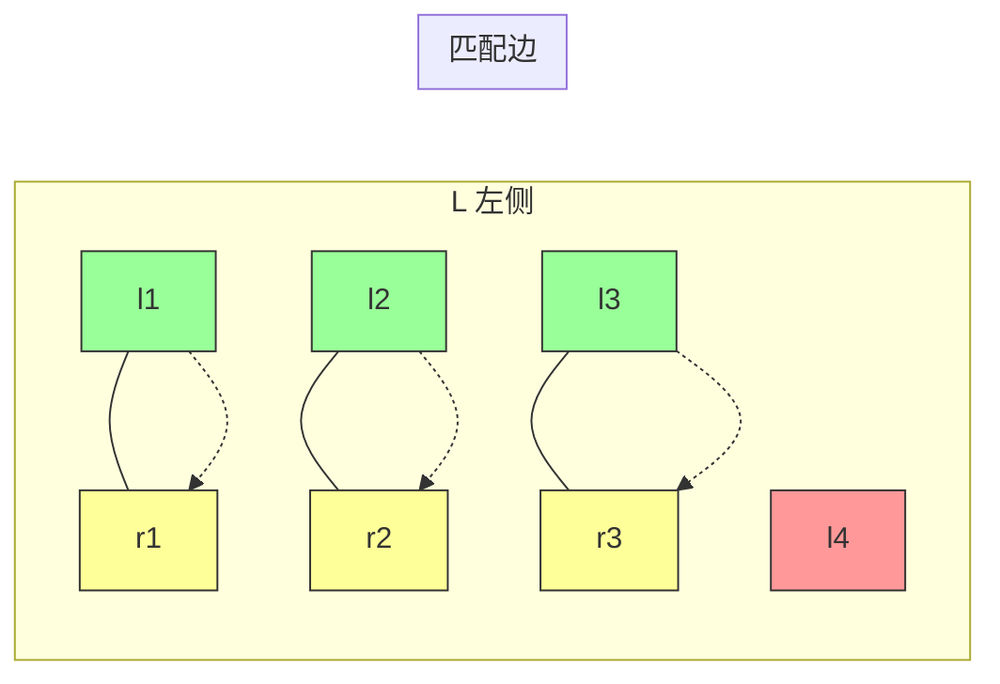

### 2.2 增广路径

**M-交错路径**：边交替属于 M 和 E−M 的简单路径。

**M-增广路径**：首尾边都属于 E−M 的 M-交错路径，长度为奇数。

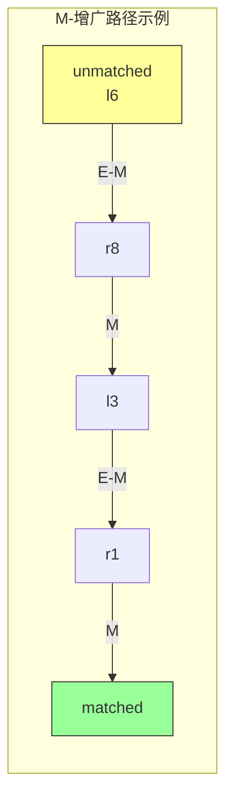

**引理 25.1**：若 P 是 M-增广路径，则 M ⊕ P 是更大的匹配，|M'| = |M| + 1。

---

## 三、最大二分匹配（Hopcroft-Karp）

### 3.1 核心思想

Hopcroft-Karp 算法通过**批量处理**一组顶点不相交的最短增广路径来提高效率。

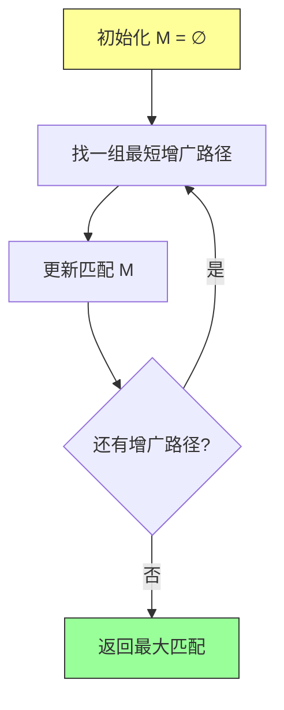

### 3.2 三个阶段

**第一阶段**：将有向图 G 转换为有向版本 G_M

```
边方向规则：
- L → R：非匹配边 (E - M)
- R → L：匹配边 (M)
```

**第二阶段**：BFS 创建层次图 H

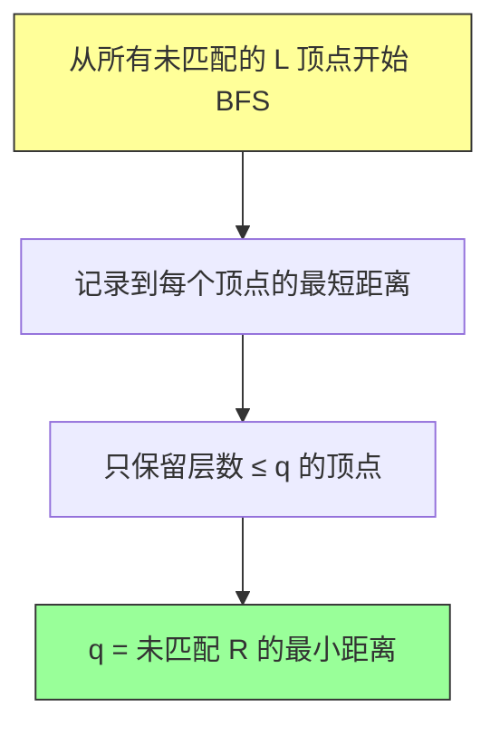

**第三阶段**：在 H 的转置上 DFS 找增广路径

### 3.3 时间复杂度分析

| 阶段 | 时间 |
|-----|------|
| 创建 G_M | O(E) |
| BFS 构建 H | O(E) |
| DFS 找路径 | O(E) |
| 每轮迭代 | O(E) |
| 迭代轮数 | O(√V) |

**定理 25.8**：Hopcroft-Karp 算法时间复杂度为 **O(√V E)**

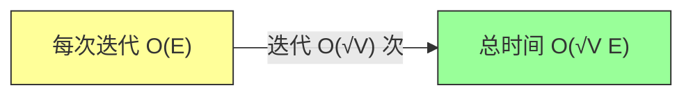

### 3.4 Java 实现

```java
import java.util.*;

public class HopcroftKarp {

    private List<List<Integer>> adj;  // 邻接表
    private int n, m;  // |L| = n, |R| = m
    private int[] pairU;  // L 中的匹配
    private int[] pairV;  // R 中的匹配
    private int[] dist;   // BFS 距离

    public HopcroftKarp(List<List<Integer>> adj, int n, int m) {
        this.adj = adj;
        this.n = n;
        this.m = m;
        this.pairU = new int[n];
        this.pairV = new int[m];
        this.dist = new int[n];
        Arrays.fill(pairU, -1);
        Arrays.fill(pairV, -1);
    }

    /**
     * BFS 构建层次图
     */
    private boolean bfs() {
        Queue<Integer> queue = new LinkedList<>();

        for (int u = 0; u < n; u++) {
            if (pairU[u] == -1) {
                dist[u] = 0;
                queue.offer(u);
            } else {
                dist[u] = -1;
            }
        }

        boolean found = false;

        while (!queue.isEmpty()) {
            int u = queue.poll();

            for (int v : adj.get(u)) {
                int uMatched = pairV[v];
                if (uMatched != -1 && dist[uMatched] == -1) {
                    dist[uMatched] = dist[u] + 1;
                    queue.offer(uMatched);
                } else if (uMatched == -1) {
                    found = true;  // 找到未匹配的 R 顶点
                }
            }
        }

        return found;
    }

    /**
     * DFS 在层次图中找增广路径
     */
    private boolean dfs(int u) {
        for (int v : adj.get(u)) {
            int uMatched = pairV[v];
            if (uMatched == -1 || (dist[uMatched] == dist[u] + 1 && dfs(uMatched))) {
                pairU[u] = v;
                pairV[v] = u;
                return true;
            }
        }
        dist[u] = -1;  // 标记为死路
        return false;
    }

    /**
     * Hopcroft-Karp 主算法
     */
    public int maxMatching() {
        int matching = 0;

        while (bfs()) {
            for (int u = 0; u < n; u++) {
                if (pairU[u] == -1 && dfs(u)) {
                    matching++;
                }
            }
        }

        return matching;
    }

    /**
     * 获取匹配结果
     */
    public int[] getMatching() {
        return pairU;
    }
}
```

---

## 四、稳定婚姻问题（Gale-Shapley）

### 4.1 问题定义

**稳定匹配**：不存在"阻塞对"的匹配。

**阻塞对**：未匹配的一对 (w, m)，双方都更倾向于对方而非当前伴侣。

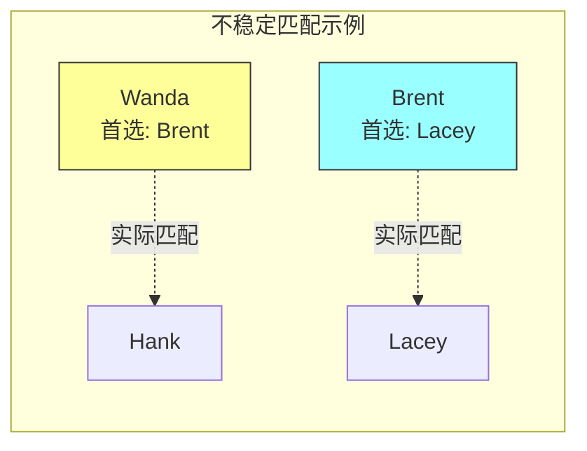

**问题**：Wanda 和 Brent 互相更倾向于对方，组成阻塞对。

### 4.2 Gale-Shapley 算法

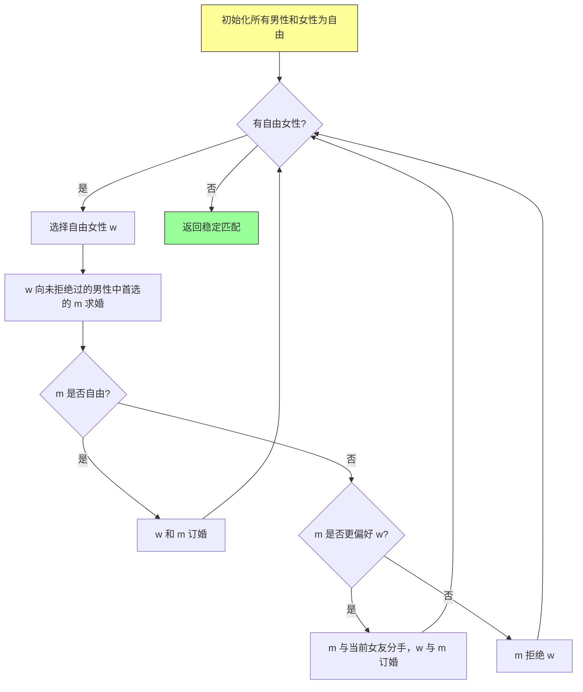

### 4.3 关键定理

**定理 25.9**：Gale-Shapley 算法**总是终止**并返回**稳定匹配**。

**定理 25.11**（女性最优）：无论选择顺序如何，返回的匹配都是**对所有女性最优**的稳定匹配。

**推论 25.13**（男性最差）：返回的匹配是**对所有男性最差**的稳定匹配。

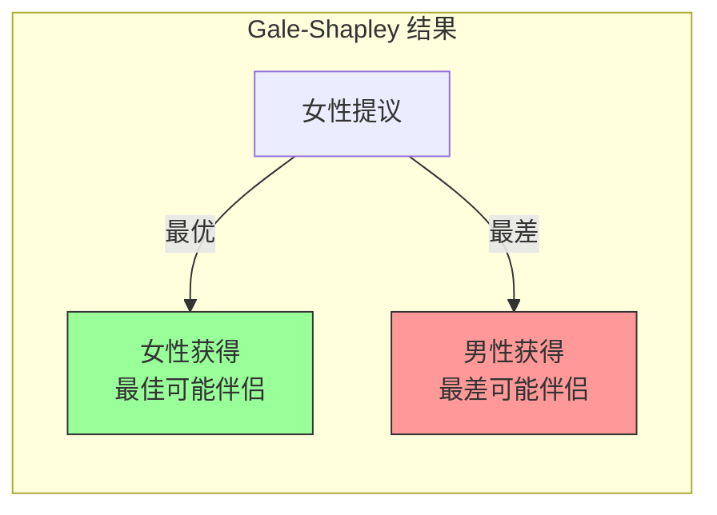

### 4.4 Java 实现

```java
import java.util.*;

public class GaleShapley {

    /**
     * 稳定婚姻问题求解
     * @param womenPref 女性偏好列表 Map<女性ID, List<男性ID按偏好排序>>
     * @param menPref 男性偏好列表 Map<男性ID, List<女性ID按偏好排序>>
     * @param womenList 女性列表
     * @param menList 男性列表
     * @return Map<女性ID, 匹配的男性ID>
     */
    public static Map<Integer, Integer> stableMatching(
            Map<Integer, List<Integer>> womenPref,
            Map<Integer, List<Integer>> menPref,
            List<Integer> womenList,
            List<Integer> menList) {

        // 初始化：所有女性都是自由的
        Queue<Integer> freeWomen = new LinkedList<>(womenList);
        Map<Integer, Integer> engaged = new HashMap<>();  // 女性 -> 男性
        Map<Integer, Integer> currentPartner = new HashMap<>();  // 男性 -> 女性

        // 为每个男性建立"下一个求婚对象"指针
        Map<Integer, Integer> nextProposal = new HashMap<>();
        for (int man : menList) {
            nextProposal.put(man, 0);
        }

        // 建立男性在女性偏好中的排名（快速比较）
        Map<Integer, Map<Integer, Integer>> menRanking = new HashMap<>();
        for (int man : menList) {
            Map<Integer, Integer> ranking = new HashMap<>();
            List<Integer> pref = menPref.get(man);
            for (int i = 0; i < pref.size(); i++) {
                ranking.put(pref.get(i), i);
            }
            menRanking.put(man, ranking);
        }

        while (!freeWomen.isEmpty()) {
            int woman = freeWomen.poll();
            int man = womenPref.get(woman).get(nextProposal.get(woman));
            nextProposal.put(man, nextProposal.get(man) + 1);

            if (!currentPartner.containsKey(man)) {
                // 男性自由，订婚
                engaged.put(woman, man);
                currentPartner.put(man, woman);
            } else {
                int currentWoman = currentPartner.get(man);
                int currentRank = menRanking.get(man).get(currentWoman);
                int newRank = menRanking.get(man).get(woman);

                if (newRank < currentRank) {
                    // 男性更喜欢这个女性
                    engaged.remove(currentWoman);
                    currentPartner.put(man, woman);
                    engaged.put(woman, man);
                    freeWomen.add(currentWoman);  // 前女友变自由
                } else {
                    // 男性拒绝女性
                    freeWomen.add(woman);
                }
            }
        }

        return engaged;
    }
}
```

### 4.5 时间复杂度

- 每个女性最多向每个男性求婚一次：**O(n²)**
- 空间复杂度：**O(n²)** 存储偏好列表

---

## 五、分配问题（匈牙利算法）

### 5.1 问题定义

**分配问题**：在完全二分图中找到权重最大的完美匹配。

**输入**：权重矩阵 w(lᵢ, rⱼ)

**目标**：最大化 ∑ w(lᵢ, rᵢ)

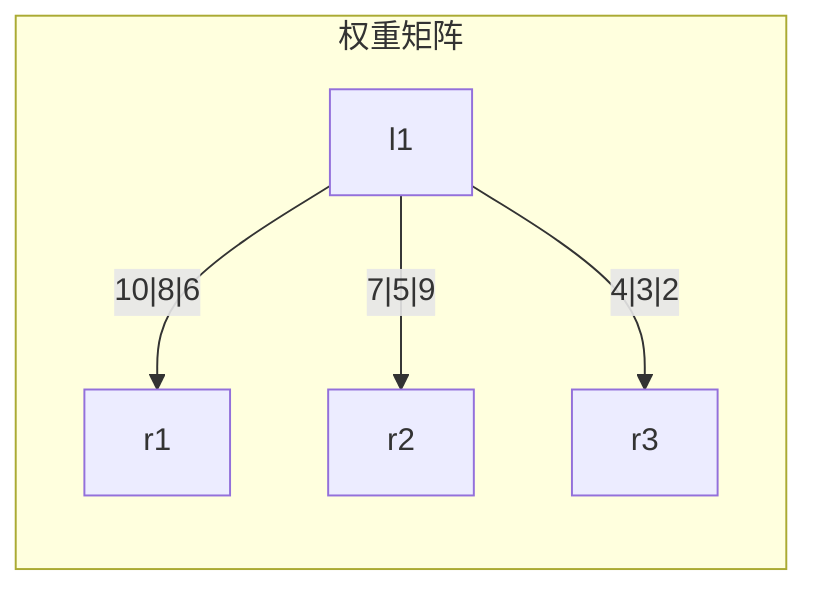

### 5.2 可行顶点标号

**可行标号 h**：对所有边满足 l.h + r.h ≥ w(l, r)

**等值子图**：Gₕ = {(l, r) : l.h + r.h = w(l, r)}

**定理 25.14**：若 Gₕ 有完美匹配，则它是最优解。

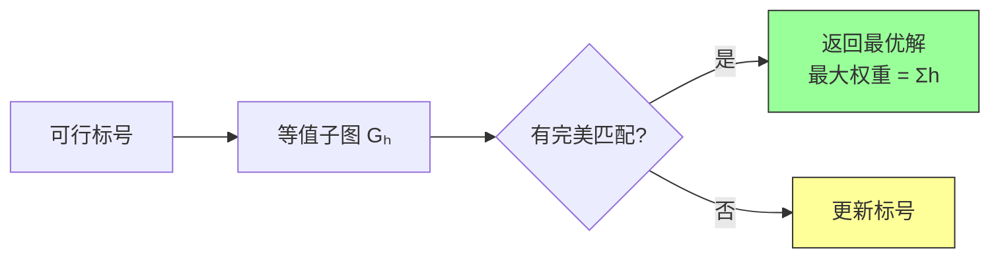

### 5.3 算法流程

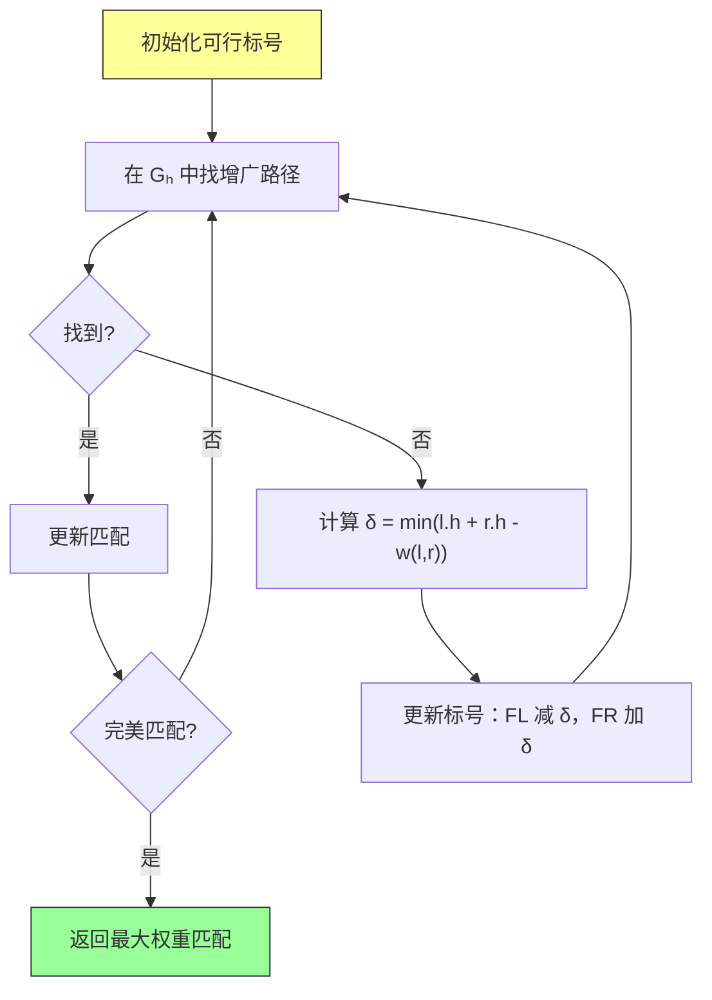

### 5.4 核心代码

```java
import java.util.*;

public class HungarianAlgorithm {

    /**
     * 匈牙利算法求解最大权重完美匹配
     * @param weight 权重矩阵，weight[i][j] 表示 l_i 到 r_j 的权重
     * @return 最大权重匹配的权重和
     */
    public static int hungarian(int[][] weight) {
        int n = weight.length;

        // 初始化可行标号
        int[] labelL = new int[n];
        int[] labelR = new int[n];

        // l.h = max row, r.h = 0
        for (int i = 0; i < n; i++) {
            labelL[i] = Integer.MIN_VALUE;
            for (int j = 0; j < n; j++) {
                labelL[i] = Math.max(labelL[i], weight[i][j]);
            }
        }
        Arrays.fill(labelR, 0);

        // 匹配数组，matchR[j] = i 表示 r_j 匹配到 l_i
        int[] matchR = new int[n];
        Arrays.fill(matchR, -1);

        for (int i = 0; i < n; i++) {
            if (!bfs(weight, labelL, labelR, matchR, i)) {
                augment(weight, labelL, labelR, matchR, i);
            }
        }

        // 计算总权重
        int totalWeight = 0;
        for (int j = 0; j < n; j++) {
            if (matchR[j] != -1) {
                totalWeight += weight[matchR[j]][j];
            }
        }

        return totalWeight;
    }

    private static boolean bfs(int[][] weight, int[] labelL, int[] labelR,
                               int[] matchR, int startL) {
        int n = labelL.length;
        int[] prev = new int[n];
        Arrays.fill(prev, -1);
        boolean[] visitedL = new boolean[n];
        boolean[] visitedR = new boolean[n];

        Queue<Integer> queue = new LinkedList<>();
        queue.offer(startL);
        visitedL[startL] = true;

        while (!queue.isEmpty()) {
            int l = queue.poll();

            for (int r = 0; r < n; r++) {
                if (labelL[l] + labelR[r] == weight[l][r] && !visitedR[r]) {
                    visitedR[r] = true;
                    prev[r] = l;

                    if (matchR[r] == -1) {
                        // 找到增广路径，回溯修改匹配
                        int currentL = l;
                        int currentR = r;
                        while (currentL != -1) {
                            int nextL = prev[currentR];
                            int nextR = matchR[currentL];
                            matchR[currentR] = currentL;
                            currentL = nextL;
                            currentR = nextR;
                        }
                        return true;
                    } else {
                        queue.offer(matchR[r]);
                        visitedL[matchR[r]] = true;
                    }
                }
            }
        }

        return false;
    }

    private static void augment(int[][] weight, int[] labelL, int[] labelR,
                                int[] matchR, int startL) {
        int n = labelL.length;
        int[] prev = new int[n];
        boolean[] inTreeL = new boolean[n];
        boolean[] inTreeR = new boolean[n];
        Arrays.fill(prev, -1);
        Arrays.fill(inTreeL, false);
        Arrays.fill(inTreeR, false);

        inTreeL[startL] = true;
        int l = startL;

        while (true) {
            // 找最小 δ
            int delta = Integer.MAX_VALUE;
            for (int i = 0; i < n; i++) {
                if (inTreeL[i]) {
                    for (int j = 0; j < n; j++) {
                        if (!inTreeR[j] && labelL[i] + labelR[j] - weight[i][j] > 0) {
                            delta = Math.min(delta, labelL[i] + labelR[j] - weight[i][j]);
                        }
                    }
                }
            }

            // 更新标号
            for (int i = 0; i < n; i++) {
                if (inTreeL[i]) labelL[i] -= delta;
                if (inTreeR[i]) labelR[i] += delta;
            }

            // 找新的可松弛边
            int nextR = -1;
            for (int j = 0; j < n; j++) {
                if (!inTreeR[j]) {
                    for (int i = 0; i < n; i++) {
                        if (inTreeL[i] && labelL[i] + labelR[j] == weight[i][j]) {
                            nextR = j;
                            break;
                        }
                    }
                }
                if (nextR != -1) break;
            }

            if (nextR == -1) {
                // 应该不会发生
                continue;
            }

            inTreeR[nextR] = true;
            if (matchR[nextR] == -1) {
                // 找到增广路径
                int currentL = matchR[nextR];
                int currentR = nextR;
                while (currentL != -1) {
                    int nextL = prev[currentR];
                    int nextR_match = matchR[currentL];
                    matchR[currentR] = currentL;
                    currentL = nextL;
                    currentR = nextR_match;
                }
                return;
            } else {
                // 添加匹配的 L 顶点到树
                int matchedL = matchR[nextR];
                inTreeL[matchedL] = true;
                prev[matchedL] = l;

                for (int r = 0; r < n; r++) {
                    if (!inTreeR[r] && labelL[matchedL] + labelR[r] == weight[matchedL][r]) {
                        inTreeR[r] = true;
                        prev[r] = matchedL;

                        if (matchR[r] == -1) {
                            // 找到增广路径
                            int currentL = matchedL;
                            int currentR = r;
                            while (currentL != -1) {
                                int nextL = prev[currentR];
                                int nextR_match = matchR[currentL];
                                matchR[currentR] = currentL;
                                currentL = nextL;
                                currentR = nextR_match;
                            }
                            return;
                        } else {
                            queue.offer(matchR[r]);
                            inTreeL[matchR[r]] = true;
                        }
                    }
                }
            }
        }
    }
}
```

### 5.5 时间复杂度

| 版本 | 时间复杂度 | 说明 |
|-----|-----------|------|
| 基本实现 | O(n⁴) | 每轮 O(n³)，最多 n 轮 |
| 优化实现 | O(n³) | 使用 σ 属性优化 δ 计算 |

---

## 六、复杂度分析总结

| 问题 | 算法 | 时间复杂度 | 空间复杂度 |
|-----|------|-----------|-----------|
| 最大二分匹配 | Hopcroft-Karp | O(√V E) | O(V + E) |
| 稳定婚姻 | Gale-Shapley | O(n²) | O(n²) |
| 最大权重匹配 | 匈牙利算法 | O(n³) | O(n²) |

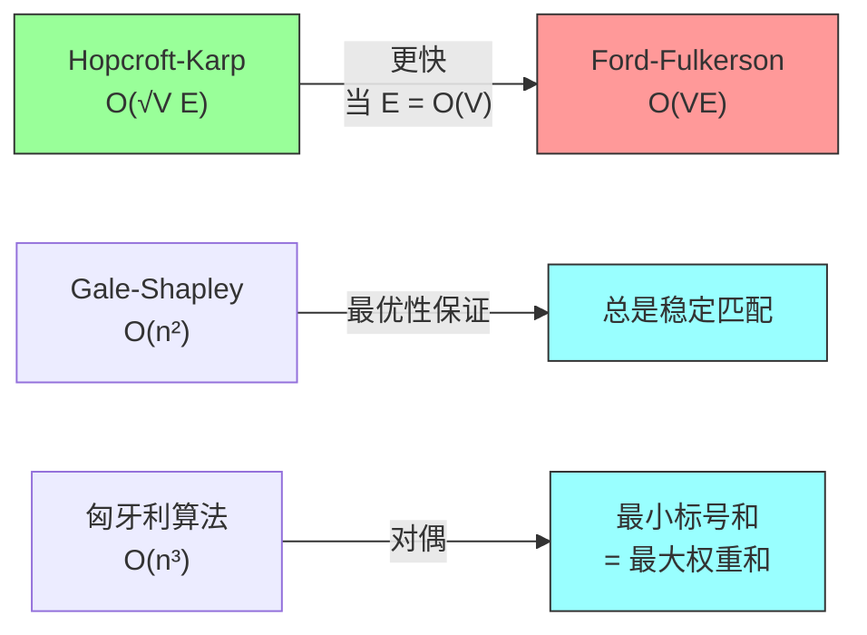

---

## 七、LeetCode 题目

### 最大匹配相关

| 题号 | 题目 | 难度 | 核心思路 |
|-----|------|------|---------|
| [1046. Last Stone Weight](https://leetcode.cn/problems/last-stone-weight/) | Medium | 贪心 / 堆 |
| [406. Queue Reconstruction by Height](https://leetcode.cn/problems/queue-reconstruction-by-height/) | Medium | 贪心排序 |
| [621. Task Scheduler](https://leetcode.cn/problems/task-scheduler/) | Medium | 贪心 / 公式 |
| [1691. Maximum Height Stacking Cuboids](https://leetcode.cn/problems/maximum-height-stacking-cuboids/) | Hard | DP / 贪心 |

### 稳定匹配/分配问题

| 题号 | 题目 | 难度 | 核心思路 |
|-----|------|------|---------|
| [886. Possible Bipartition](https://leetcode.cn/problems/possible-bipartition/) | Medium | 二分图染色 |
| [1286. Iterator for Combination](https://leetcode.cn/problems/iterator-for-combination/) | Medium | 回溯 / 组合 |
| [1654. Minimum Deletions to Make String Balanced](https://leetcode.cn/problems/minimum-deletions-to-make-string-balanced/) | Medium | 贪心 / DP |

### 权重分配问题

| 题号 | 题目 | 难度 | 核心思路 |
|-----|------|------|---------|
| [1475. Final Prices With a Special Discount](https://leetcode.cn/problems/final-prices-with-a-special-discount-in-a-shop/) | Easy | 栈 |
| [1840. Max Calories Burned](https://leetcode.cn/problems/maximum-calories-burned/) | Hard | DP / 树状数组 |
| [2056. Number of Valid Move Combinations](https://leetcode.cn/problems/number-of-valid-move-combinations-on-chessboard/) | Hard | 位运算 |

---

## 八、精选 LeetCode 题目详解

### 题目 1: 406. Queue Reconstruction by Height

**题目描述**：根据身高和前面人数重建队列。

**核心思路**：贪心排序 + 插入，与稳定匹配思想相似。

```java
class Solution {
    public int[][] reconstructQueue(int[][] people) {
        // 按身高降序，身高相同按 k 升序
        Arrays.sort(people, (a, b) -> {
            if (a[0] != b[0]) return b[0] - a[0];
            return a[1] - b[1];
        });

        List<int[]> queue = new ArrayList<>();
        for (int[] p : people) {
            queue.add(p[1], p);  // 在索引位置插入
        }

        return queue.toArray(new int[queue.size()][]);
    }
}
```

### 题目 2: 621. Task Scheduler

**题目描述**：给定任务冷却时间，求最小执行时间。

**核心思路**：贪心 + 公式，类似于分配问题。

```java
class Solution {
    public int leastInterval(char[] tasks, int n) {
        int[] count = new int[26];
        for (char t : tasks) count[t - 'A']++;

        int maxCount = 0;
        for (int c : count) maxCount = Math.max(maxCount, c);

        int maxTasks = 0;
        for (int c : count) if (c == maxCount) maxTasks++;

        // 公式：max(总任务数, (maxCount-1)*(n+1) + maxTasks)
        return Math.max(tasks.length, (maxCount - 1) * (n + 1) + maxTasks);
    }
}
```

### 题目 3: 886. Possible Bipartition

**题目描述**：判断是否可以将人分成两组，使得没有敌人对在同一组。

**核心思路**：二分图着色，与匹配问题相关。

```java
class Solution {
    public boolean possibleBipartition(int n, int[][] dislikes) {
        List<List<Integer>> graph = new ArrayList<>();
        for (int i = 0; i <= n; i++) {
            graph.add(new ArrayList<>());
        }
        for (int[] d : dislikes) {
            graph.get(d[0]).add(d[1]);
            graph.get(d[1]).add(d[0]);
        }

        int[] color = new int[n + 1];  // 0=未访问, 1=红色, -1=蓝色

        for (int i = 1; i <= n; i++) {
            if (color[i] == 0 && !bfs(graph, color, i)) {
                return false;
            }
        }
        return true;
    }

    private boolean bfs(List<List<Integer>> graph, int[] color, int start) {
        Queue<Integer> queue = new LinkedList<>();
        queue.offer(start);
        color[start] = 1;

        while (!queue.isEmpty()) {
            int u = queue.poll();
            for (int v : graph.get(u)) {
                if (color[v] == 0) {
                    color[v] = -color[u];
                    queue.offer(v);
                } else if (color[v] == color[u]) {
                    return false;
                }
            }
        }
        return true;
    }
}
```

---

## 九、章节习题

### 习题 25.1-5（Hall 定理）
证明存在完美匹配当且仅当对所有 A ⊆ L，|A| ≤ |N(A)|。

### 习题 25.2-4（弱帕累托最优性）
证明 Gale-Shapley 返回的匹配中，没有匹配能使所有女性都获得更优伴侣。

### 习题 25.3-6
如何修改匈牙利算法求最小权重匹配？

**答案**：将权重取负或修改标号初始化。

---

## 十、章节笔记

### 核心思想总结

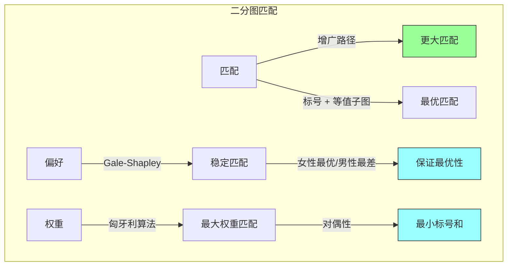

### 学习要点

1. **增广路径**：匹配问题的核心工具
2. **Hopcroft-Karp**：批量处理增广路径提高效率
3. **Gale-Shapley**：稳定的提出-接受机制
4. **匈牙利算法**：原始-对偶方法的经典案例
5. **对偶性**：最大权重 = 最小标号和

### 常见误区

- 稳定匹配不一定唯一
- Gale-Shapley 对一方最优，对另一方最差
- 匈牙利算法需要完全二分图

---

## 十一、本章小结

第25章系统介绍了二分图匹配的三类问题：

| 问题类型 | 关键算法 | 核心贡献 |
|---------|---------|---------|
| **最大基数匹配** | Hopcroft-Karp | O(√V E) 时间，批量处理增广路径 |
| **稳定婚姻** | Gale-Shapley | 总是返回稳定匹配，女性最优 |
| **最大权重匹配** | 匈牙利算法 | 原始-对偶方法，等值子图 |

这三个问题在实际中都有广泛应用，从任务调度到资源配置，从婚恋匹配到项目分配。

---

## 参考文献

- Hopcroft, J., and Karp, R. (1973). "An n^{5/2} algorithm for maximum matchings in bipartite graphs". *SIAM J. Comput.*
- Gale, D., and Shapley, L. (1962). "College Admissions and the Stability of Marriage". *American Mathematical Monthly*.
- Kuhn, H. W. (1955). "The Hungarian method for the assignment problem". *Naval Research Logistics Quarterly*.
- Lovász, L., and Plummer, M. D. (1986). *Matching Theory*. North-Holland.
