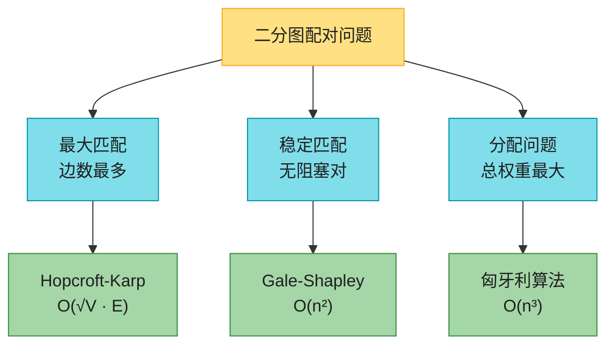
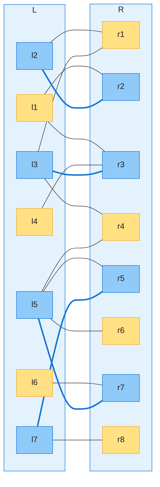
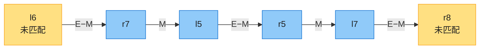
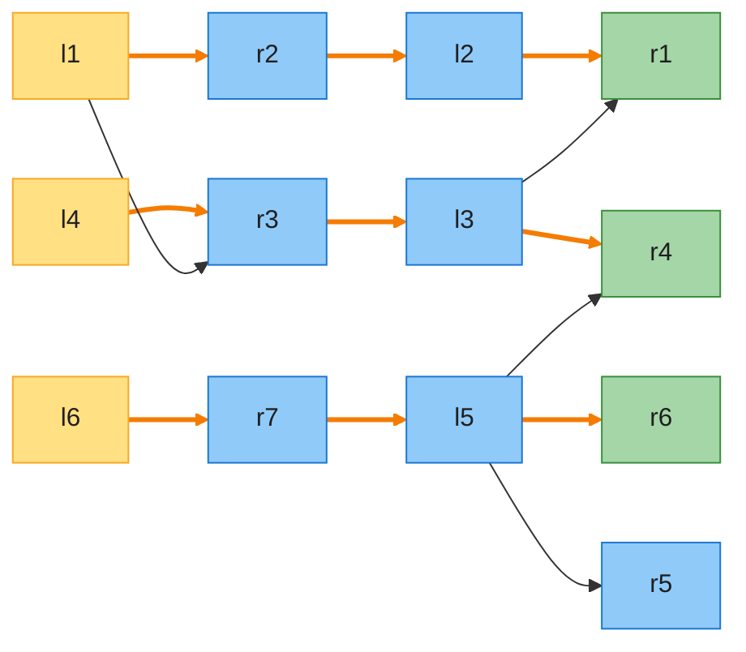
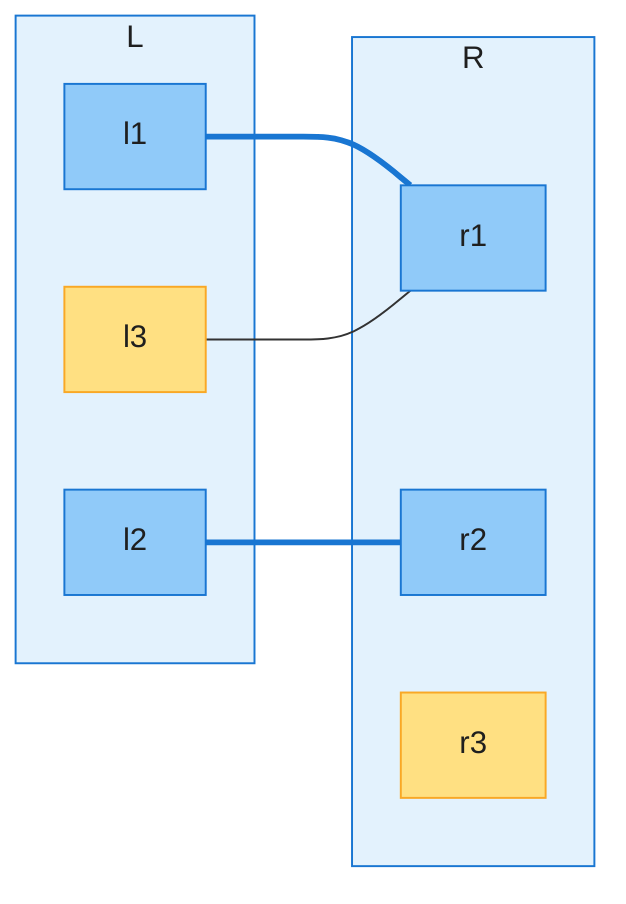

# 第 25 章：二分图匹配（Matchings in Bipartite Graphs）——深度版

## 一、开篇定位

本章回答一类「配对」问题：有一堆左边的东西和一堆右边的东西（候选人与面试时段、学生与医院、工人与任务），边表示「可以配」，怎么配最好？「好」有三种定义，对应本章三节：

| 问题 | 「好」的定义 | 算法 | 时间 |
|------|------------|------|------|
| 最大二分匹配（25.1） | 配对边数最多 | Hopcroft-Karp | $O(\sqrt{V}\,E)$ |
| 稳定婚姻（25.2） | 没有「互相更喜欢对方」的私奔对 | Gale-Shapley | $O(n^2)$ |
| 分配问题（25.3） | 完美匹配的总权重最大 | 匈牙利算法 | $O(n^3)$ |

三个问题都有教科书级的真实应用，原书开篇各给了一个：作者本人用 Hopcroft-Karp 给大课排 TA 面试（候选人 × 时段）；美国 NRMP 住院医师匹配项目是稳定婚姻问题最著名的实例；工人-任务的最大效益分配就是分配问题。

与前后章节的关系：

- **第 24.3 节**已经用最大流解过最大二分匹配（建容量 1 的流网络，Ford-Fulkerson $O(VE)$）；本章的 Hopcroft-Karp 是专门的更快算法。「增广路」概念正是从最大流一脉相承；
- **第 20 章**的 BFS/DFS 是本章的全部搜索工具：Hopcroft-Karp = 多源 BFS 分层 + 分层图上 DFS；
- Gale-Shapley 的「提议-接受」是**贪心**思想（第 15 章），正确性靠交换论证；
- 匈牙利算法是**原始-对偶**方法的经典案例，「最大权重和 = 最小标号和」与「最大流 = 最小割」同源，对偶性的系统讨论在第 29 章（线性规划）。

做题定位：判二分图 ⇒ 染色法（785、886，第 20 章内容）；求最大匹配 ⇒ 小规模用朴素 DFS 增广（1820、1349），大规模背 Hopcroft-Karp；带权分配 ⇒ 匈牙利（1947、1066、2172，点数 ≤ 10 时状压/回溯也行）。

**本章主线**：匹配与增广路的基本事实 → Hopcroft-Karp（批量增广）→ Gale-Shapley（稳定匹配）→ 匈牙利算法（原始-对偶）→ Java + Python 双实现 → 速查/易混 → 题单与习题。



---

## 二、基础概念：匹配、交错路径、增广路径

### 2.1 匹配

**二分图**：顶点集 $V = L \cup R$，$L$、$R$ 不相交，每条边一端在 $L$、一端在 $R$。

**匹配**：边集 $M \subseteq E$，每个顶点至多关联 $M$ 中的一条边。有边在 $M$ 中的顶点叫**已匹配**，否则**未匹配**。三个极易混淆的层次：

| 术语 | 定义 | 关系 |
|------|------|------|
| 极大匹配（maximal） | 加不进任何新边的匹配 | 最大 ⇒ 极大，反之不然 |
| 最大匹配（maximum） | 边数最多的匹配 | 本章 25.1 的目标 |
| 完美匹配（perfect） | 所有顶点都被匹配 | 需 $\lvert L\rvert=\lvert R\rvert$，25.3 的前提 |

下图是原书 Figure 25.1(a) 的例子（全章共用）：$L=\{l_1,\dots,l_7\}$，$R=\{r_1,\dots,r_8\}$，粗蓝边是当前匹配 $M$（大小 4），黄色顶点未匹配：



### 2.2 增广路径：让匹配 +1 的机关

**M-交错路径**：边在 $M$ 与 $E-M$ 之间交替的简单路径。

**M-增广路径**：首、尾边都属于 $E-M$ 的交错路径。它的首尾两个顶点必然都未匹配，且边数必为**奇数**（$E-M$ 中的边比 $M$ 中的恰好多一条）。

上图中的一条增广路径（原书 Figure 25.1(b)，$l_6$ 到 $r_8$，共 5 条边）：



**核心操作——对称差**：$M' = M \oplus P$，即「路径上原来在 $M$ 里的边拿出来，原来不在的边放进去」（沿路翻转匹配状态）。两个速查事实：

- $P$ 是 M-增广路 ⇒ $M \oplus P$ 仍是匹配，且 $|M \oplus P| = |M| + 1$；
- **Berge 定理**：$M$ 是最大匹配 ⟺ 图中**不存在** M-增广路。这条「停止条件」是所有增广路算法的正确性来源。

于是一个朴素算法呼之欲出：从空匹配开始，反复从未匹配顶点做 BFS/DFS 找增广路，找不到就停。每轮 $O(E)$、至多 $|M^*| \le V/2$ 轮 ⇒ $O(VE)$——这与第 24.3 节最大流做法同阶。下一节的 Hopcroft-Karp 把它压到 $O(\sqrt{V}\,E)$。

---

## 三、Hopcroft-Karp 算法（25.1）：一轮增广一批

### 3.1 直觉：别一条一条找，一批一批找

朴素版每找到**一条**增广路就翻转一次，找路的开销被浪费了。Hopcroft-Karp 每轮一次性找出**一组互不相交的最短增广路**（只要求「极大」，不要求「最多」），一起翻转。

为什么这就快了？两条速查结论（证明略，直觉都是「路会越找越长」）：

1. 每轮结束后，最短增广路的长度**严格变长**；
2. 若最短增广路长 $q$，则最大匹配至多比当前匹配多 $|V|/(q+1)$ 条边（每条增广路至少占 $q+1$ 个互不相交的顶点）。

结合：$q$ 从 1 单调递增，$\sqrt{V}$ 轮之后 $q > \sqrt{V}$，此时剩余可增广的边数 $< \sqrt{V}$，再逐条增广至多 $\sqrt{V}$ 轮。总轮数 $< 2\sqrt{V}$，每轮 $O(E)$，故 **$O(\sqrt{V}\,E)$**。

```text
HOPCROFT-KARP(G)
1  M = ∅
2  repeat
3      let P = {P1, P2, ..., Pk} be a maximal set of vertex-disjoint
           shortest M-augmenting paths
4      M = M ⊕ (P1 ∪ P2 ∪ ··· ∪ Pk)
5  until P == ∅
6  return M
```

### 3.2 一轮的三个阶段

**阶段一：定向。** 把无向图变成有向图 $G_M$：非匹配边定向 $L \to R$，匹配边定向 $R \to L$。这样，$G_M$ 中「从未匹配 $L$ 到未匹配 $R$」的有向路径 ⟺ 原图的增广路径。

**阶段二：BFS 分层。** 从**所有**未匹配 $L$ 顶点做多源 BFS，按距离分层（$L$ 顶点在偶数层，$R$ 顶点在奇数层）。设 $q$ = 未匹配 $R$ 顶点的最小距离，则只保留距离 $\le q$ 的顶点，得到分层有向无环图 $H$。$H$ 里从第 0 层到第 $q$ 层的路径 = 原图的最短增广路，一条不少、一条不多。

**阶段三：在转置 $H^T$ 上 DFS。** 从第 $q$ 层的每个**未匹配** $R$ 顶点反向 DFS，找到第 0 层顶点即得一条增广路；已发现的顶点不再重复进入，天然保证路径互不相交。为什么要反过来从 $R$ 侧搜（习题 25.1-3）：第 0 层**全是**未匹配 $L$，所以「到达第 0 层 = 成功」；而第 $q$ 层混着已匹配与未匹配的 $R$（下例中 $r_5$ 已匹配却在第 3 层），正向搜到第 $q$ 层还得额外判断终点资格。

### 3.3 完整例子（原书 Figure 25.2/25.3，已用实现核对）

对 2.1 节的图和匹配（$|M|=4$，未匹配 $L = \{l_1, l_4, l_6\}$）跑一轮：

**BFS 分层结果**（$q = 3$，$l_7$ 距离 4、$r_8$ 距离 5，都被排除出 $H$）：

| 层 | 顶点 | 说明 |
|----|------|------|
| 0 | $l_1, l_4, l_6$ | 未匹配 $L$，BFS 多源起点 |
| 1 | $r_2, r_3, r_7$ | 经非匹配边 $L \to R$ 到达 |
| 2 | $l_2, l_3, l_5$ | 经匹配边 $R \to L$ 到达 |
| 3 | $r_1, r_4, r_5, r_6$ | $r_5$ 已匹配（只是路过层）；未匹配的 $r_1, r_4, r_6$ 才是增广路终点 |

分层图 $H$（橙色边 = 阶段三找出的增广路，注意 $l_7, r_8$ 不在图中）：



**阶段三 DFS 结果**（本实现按编号顺序访问，找到 3 条）：

| 起点（第 3 层未匹配 $R$） | $H^T$ 中的路径 | 对应原图增广路 |
|---|---|---|
| $r_1$ | $r_1 \to l_2 \to r_2 \to l_1$ | $l_1 - r_2 - l_2 - r_1$ |
| $r_4$ | $r_4 \to l_3 \to r_3 \to l_4$ | $l_4 - r_3 - l_3 - r_4$ |
| $r_6$ | $r_6 \to l_5 \to r_7 \to l_6$ | $l_6 - r_7 - l_5 - r_6$ |

三条路径顶点互不相交，一起对称差 ⇒ $|M|: 4 \to 7$。此时 $L$ 全部匹配，已达最大（顺带回答了习题 25.1-1：该图最大匹配为 7）。注意原书按另一种 DFS 顺序只找到 2 条（从 $r_6$ 出发的搜索被已发现的 $l_3, l_5$ 堵住）——**算法只要求「极大」集合，2 条或 3 条都合法**，剩余的留给下一轮。

### 3.4 复杂度结论

每轮三阶段都是 $O(E)$（定向 + 多源 BFS + 只访问每个顶点一次的 DFS），轮数 $< 2\sqrt{V}$，总时间 **$O(\sqrt{V}\,E)$**。这是本章唯一需要记住的复杂度推导骨架；稠密图下远优于最大流做法的 $O(VE)$（$E \approx V^2$ 时 $O(V^{2.5})$ vs $O(V^3)$）。

实战版本选择：LeetCode 上点数通常很小（1820 题 $n \le 200$ 级别、1349 题 8×8 网格），朴素的「逐个 DFS 增广」（Kuhn 算法，$O(VE)$）几十行就够，见第七节题单；Hopcroft-Karp 的价值在大规模与面试原理题。

---

## 四、稳定婚姻问题（25.2）：Gale-Shapley 算法

### 4.1 问题：配上「偏好」之后

输入变成**完全二分图**（$|L|=|R|=n$，所有左右之间都有边），且每个顶点给出对侧全体顶点的**偏好排序**。按传统叙述，$L$ 是 $n$ 位女性、$R$ 是 $n$ 位男性。

**阻塞对**：未配成一对的 $(w, m)$，但 $w$ 比起现任更喜欢 $m$、$m$ 比起现任也更喜欢 $w$——这两人有动机私奔，使匹配「不稳定」。**稳定匹配** = 不存在阻塞对的匹配。

注意稳定匹配**可以不唯一**（原书 3 对 3 的例子：Monica/Phoebe/Rachel 与 Chandler/Joey/Ross 的循环偏好下，「女性全得首选」「男性全得首选」「全得次选」三个匹配都稳定）。好消息是：稳定匹配**一定存在**，Gale-Shapley 算法每次都能找到。

### 4.2 算法直觉：提议-接受，主动方越来越将就

女性提议版：自由女性按自己的偏好表**从高到低**依次求婚；男性接到求婚，自由就先订婚，已订婚且更喜欢新求婚者就**换掉**现任，否则拒绝。关键单调性（证明的骨架，值得记住）：

- 女性：求婚对象只会**越来越差**（按列表顺序往下走）；
- 男性：一旦订婚就永远订婚，且伴侣只会**越来越好**（只会为更喜欢的人换）。

求婚总数 $\le n^2$（每位女性至多向每位男性求婚一次）⇒ 必终止；终止时人人订婚；若存在阻塞对 $(w, m)$，则 $w$ 一定向 $m$ 求过婚且被拒/被甩 ⇒ $m$ 的现任比 $w$ 好，矛盾 ⇒ 稳定。

```text
GALE-SHAPLEY(men, women, rankings)
1  assign each woman and man as free
2  while some woman w is free
3      let m be the first man on w's ranked list to whom she has not proposed
4      if m is free
5          w and m become engaged to each other (and not free)
6      elseif m ranks w higher than the woman w' he is currently engaged to
7          m breaks the engagement to w', who becomes free
8          w and m become engaged to each other (and not free)
9      else m rejects w, with w remaining free
10 return the stable matching consisting of the engaged pairs
```

### 4.3 完整例子（原书 4 对 4，trace 已用实现核对）

偏好表（左→右 = 最喜欢→最不喜欢）：

| 女性 | 偏好 | 男性 | 偏好 |
|------|------|------|------|
| Wanda | Brent, Hank, Oscar, Davis | Oscar | Wanda, Karen, Lacey, Emma |
| Emma | Davis, Hank, Oscar, Brent | Davis | Wanda, Lacey, Karen, Emma |
| Lacey | Brent, Davis, Hank, Oscar | Brent | Lacey, Karen, Wanda, Emma |
| Karen | Brent, Hank, Davis, Oscar | Hank | Lacey, Wanda, Emma, Karen |

一次合法执行（第 2 行「任选自由女性」的一种选法）：

| 步 | 求婚 | 结果 |
|----|------|------|
| 1 | Wanda → Brent | Brent 自由，订婚 |
| 2 | Emma → Davis | Davis 自由，订婚 |
| 3 | Lacey → Brent | Brent 更喜欢 Lacey，抛弃 Wanda |
| 4 | Karen → Brent | 被拒（Brent 留 Lacey） |
| 5 | Karen → Hank | Hank 自由，订婚 |
| 6 | Wanda → Hank | Hank 更喜欢 Wanda，抛弃 Karen |
| 7 | Karen → Davis | Davis 更喜欢 Karen，抛弃 Emma |
| 8 | Emma → Hank | 被拒（Hank 留 Wanda） |
| 9 | Emma → Oscar | Oscar 自由，订婚，全员匹配，结束 |

结果：Lacey–Brent、Wanda–Hank、Karen–Davis、Emma–Oscar。可验证无阻塞对（例如 Karen 虽更想要 Brent/Hank，但那两位都更喜欢自己的伴侣）。

### 4.4 三条关键结论（速记）

1. **必终止、必稳定**：求婚至多 $n^2$ 次 ⇒ $O(n^2)$；从而稳定匹配恒存在。
2. **与选择顺序无关，且女性最优**：第 2 行无论怎么选自由女性，输出都是同一个匹配；其中每位女性拿到的是**所有稳定匹配中她能得到的最好**伴侣。
3. **男性最差**：同一结果里每位男性拿到的是所有稳定匹配中**最差**的。角色互换（男性提议）则男性最优、女性最差——「主动方占优」。

推论：Gale-Shapley 只能产出女性最优（或男性最优）那一个稳定匹配，其他稳定匹配（如 3 对 3 例子的「全得次选」）它够不着。

### 4.5 扩展：NRMP 住院医师匹配（习题 25.2-3）

真实项目与模型有两点不同：医院有 $r_h \ge 1$ 个名额；学生数与医院数可以不等。改法：医院维护当前录用集合，未满就收、满了只替换掉更喜欢的；等价于把每所医院拆成 $r_h$ 个「同偏好副本」再跑标准算法。这依然总能产生稳定分配。

---

## 五、匈牙利算法（25.3）：分配问题

### 5.1 问题：最大权完美匹配

完全二分图（$|L|=|R|=n$），边 $(l, r)$ 带权 $w(l, r)$（匹配 $l$ 与 $r$ 的收益）。目标：在**完美匹配**中找总权重最大的。枚举全部 $n!$ 个完美匹配不可行，匈牙利算法用「可行标号 + 等值子图」把问题变成反复找增广路。

### 5.2 可行标号与等值子图

给每个顶点一个**标号**：$l.h$、$r.h$。若对所有边满足

$$l.h + r.h \ge w(l, r)$$

则称标号**可行**（直觉：每个顶点对自己的「最低要价」，任意配对的两边要价之和不能低于实际收益）。可行标号白捡一个：$l.h = $ 行最大值、$r.h = 0$（式 25.1/25.2）。

**等值子图** $G_h$：只保留取等号的边（$l.h + r.h = w(l, r)$，即「要价刚好等于收益」的边）。核心定理：

> 若 $G_h$ 里存在完美匹配 $M^*$，则 $M^*$ 就是分配问题的最优解。

一句话证明直觉：$M^*$ 的权重和 $= \sum (l.h + r.h) = $ 全体标号之和；而**任何**完美匹配的每条边都满足 $w \le l.h + r.h$，故权重和 $\le$ 标号和。所以策略变成：**调整标号，直到等值子图里有完美匹配**。「最大权重和 = 最小标号和」就是这对原始-对偶问题的对偶等式（同最大流 = 最小割）。

### 5.3 算法骨架：找不到增广路就调价

```text
HUNGARIAN(G)
1  for each vertex l ∈ L
2      l.h = max{w(l, r) : r ∈ R}     // 式 (25.1)
3  for each vertex r ∈ R
4      r.h = 0                          // 式 (25.2)
5  let M be any matching in Gh (such as GREEDY-BIPARTITE-MATCHING)
6  from G, M, and h, form the equality subgraph Gh and GM,h
7  while M is not a perfect matching in Gh
8      P = FIND-AUGMENTING-PATH(GM,h)
9      M = M ⊕ P
10     update the equality subgraph Gh and GM,h
11 return M
```

初始匹配用**贪心**（GREEDY-BIPARTITE-MATCHING：扫一遍 $L$，能配就配；习题 25.3-2 证明它至少是最大匹配的一半）。找增广路用与 Hopcroft-Karp 阶段二同款的多源 BFS（从未匹配 $L$ 出发、在定向等值子图 $G_{M,h}$ 中找从未匹配 $L$ 到未匹配 $R$ 的路），但**一发现未匹配 $R$ 就停**（这里一次只增广一条）。

BFS 队列为空仍没找到 ⇒ 等值子图「缺边」，此时**调价**：设 $F_L$、$F_R$ 为 BFS 森林（已发现的顶点），令

$$\delta = \min\{\, l.h + r.h - w(l, r) : l \in F_L,\ r \in R - F_R \,\}$$

即「树内 $L$ 顶点伸向树外 $R$ 顶点的边里，离进入等值子图最近差多少」。然后

$$l.h \mathrel{-}= \delta \ (l \in F_L), \qquad r.h \mathrel{+}= \delta \ (r \in F_R)$$

这次调价的三个保证（直观都因「同侧同增减」）：① BFS 森林里的边不会掉出等值子图；② 匹配边不会掉出（匹配边的两端要么都在森林里、要么都不在）；③ 至少有一条新边 $(l, r)$（$l \in F_L$、$r \notin F_R$）进入等值子图，搜索得以继续。可能有别的边掉出去，但它们既不在森林也不在匹配里，无碍大局。

### 5.4 完整例子（3×3，trace 已用实现核对）

权重矩阵（行 = $l_1..l_3$，列 = $r_1..r_3$；行首为初始 $l.h$，列顶为初始 $r.h$）：

| $l.h$ \ $r.h$ | 0 ($r_1$) | 0 ($r_2$) | 0 ($r_3$) |
|:---:|:---:|:---:|:---:|
| **9** ($l_1$) | **9** | 2 | 3 |
| **8** ($l_2$) | 1 | **8** | 6 |
| **9** ($l_3$) | **9** | 7 | 3 |

初始等值子图只有 3 条边：$(l_1,r_1)$、$(l_2,r_2)$、$(l_3,r_1)$。贪心匹配 $M = \{(l_1,r_1), (l_2,r_2)\}$，$l_3$ 无等值边可配：



为 $l_3$ 找增广路的过程（加粗 = 本轮新进入等值子图的边）：

| 步 | $F_L$ | $F_R$ | 事件 |
|----|-------|-------|------|
| 1 | $\{l_3\}$ | $\varnothing$ | BFS：$(l_3,r_1)$ 是等值边，$r_1$ 已匹配 ⇒ $r_1$、$l_1$ 入树；$l_1$ 无新等值边，队列空 |
| 2 | $\{l_3, l_1\}$ | $\{r_1\}$ | $\delta = \min = 2$（边 $(l_3,r_2)$：$9+0-7$）；$l_1.h, l_3.h$ 各减 2，$r_1.h$ 加 2 ⇒ $l.h=(7,8,7)$，$r.h=(2,0,0)$ |
| 3 | $\{l_3, l_1\}$ | $\{r_1\}$ | **新边 $(l_3,r_2)$ 进入**；$r_2$ 已匹配 $l_2$ ⇒ $r_2$、$l_2$ 入树；$l_2$ 无新等值边，队列又空 |
| 4 | $\{l_3, l_1, l_2\}$ | $\{r_1, r_2\}$ | $\delta = 2$（边 $(l_2,r_3)$：$8+0-6$）；$l.h=(5,6,5)$，$r.h=(4,2,0)$ |
| 5 | — | — | **新边 $(l_2,r_3)$ 进入**；$r_3$ 未匹配 ⇒ 增广路 $l_3 \to r_2 \to l_2 \to r_3$ |
| 6 | — | — | $M \oplus P = \{(l_1,r_1), (l_3,r_2), (l_2,r_3)\}$，完美，结束 |

最优权重 $9 + 7 + 6 = 22$；验算对偶：标号和 $= (5+6+5) + (4+2+0) = 22$ ✓。注意第 6 步发生了**翻转**：$(l_2,r_2)$ 被移出匹配——匈牙利算法里的增广与 Hopcroft-Karp 用的是同一个对称差机关。

### 5.5 从 $O(n^4)$ 到 $O(n^3)$

按上面的伪代码直接实现：$n$ 轮增广 × 每轮 $O(n^3)$（一次 FIND-AUGMENTING-PATH 里至多 $n$ 次调价，每次调价重扫 $n^2$ 条边算 $\delta$）$= O(n^4)$。优化（思考题 25-2）：给每个树外 $r$ 维护

$$\sigma(r) = \min\{\, l.h + r.h - w(l, r) : l \in F_L \,\}$$

（代码里的 `slack` 数组）。于是算 $\delta$ 只需扫一遍 $\sigma$（$O(n)$）；调价后全体 $\sigma$ 减 $\delta$（$O(n)$）；$F_L$ 每加入一个新 $l$，用 $l$ 刷新一遍 $\sigma$（$O(n)$，每轮至多 $n$ 次）。每轮 $O(n^2)$ ⇒ 总 **$O(n^3)$**。另外判断是否等值边只需查 $l.h + r.h \stackrel{?}{=} w(l,r)$，根本不必显式建 $G_{M,h}$（习题 25.3-5）。

两个常用变形：求**最小权**完美匹配 ⇒ 权重取负跑最大版（习题 25.3-6）；$|L| \ne |R|$ ⇒ 给少的一侧补虚拟顶点、虚拟边权 0（习题 25.3-7）；非完全图求最大权匹配（不要求完美）⇒ 补 0 权边凑成完全图（思考题 25-3）。

---

## 六、代码实现（Java + Python）

约定：顶点全部 **0-indexed**，`pairU[u]`/`pairV[v]` 存匹配对象，`-1` 表示未匹配；匈牙利内部用 1-indexed（0 号作虚拟列，经典写法）。三个算法的 Java、Python 版本均已编译运行，并通过随机对拍（匹配 vs 暴力枚举 3000 组、Gale-Shapley 稳定性 + 女性最优性 2000 组、匈牙利含负权 vs 排列枚举 1500 组）。

### 6.1 Java

```java
import java.util.*;

/**
 * Hopcroft-Karp：二分图最大匹配，O(√V · E)
 * L 侧顶点编号 0..n-1，R 侧顶点编号 0..m-1，adj[u] = u 在 R 侧的邻居列表
 */
public class HopcroftKarp {
    private static final int NIL = -1;
    private static final int INF = Integer.MAX_VALUE;

    private final List<List<Integer>> adj;
    private final int n, m;
    private final int[] pairU;  // pairU[u] = 与 u 匹配的 R 顶点，-1 表示未匹配
    private final int[] pairV;  // pairV[v] = 与 v 匹配的 L 顶点，-1 表示未匹配
    private final int[] dist;   // L 顶点的 BFS 层次
    private int distNil;        // 本轮最短增广路长度（到达未匹配 R 的层次）

    public HopcroftKarp(List<List<Integer>> adj, int n, int m) {
        this.adj = adj;
        this.n = n;
        this.m = m;
        this.pairU = new int[n];
        this.pairV = new int[m];
        this.dist = new int[n];
        Arrays.fill(pairU, NIL);
        Arrays.fill(pairV, NIL);
    }

    /** BFS：从所有未匹配 L 顶点出发分层，返回是否存在增广路 */
    private boolean bfs() {
        ArrayDeque<Integer> q = new ArrayDeque<>();
        for (int u = 0; u < n; u++) {
            if (pairU[u] == NIL) {
                dist[u] = 0;
                q.add(u);
            } else {
                dist[u] = INF;
            }
        }
        distNil = INF;
        while (!q.isEmpty()) {
            int u = q.poll();
            if (dist[u] >= distNil) continue;  // 超过最短增广路长度的层不再扩展
            for (int v : adj.get(u)) {
                int w = pairV[v];
                if (w == NIL) {
                    distNil = dist[u] + 1;     // v 未匹配：记录增广路终点层
                } else if (dist[w] == INF) {
                    dist[w] = dist[u] + 1;
                    q.add(w);
                }
            }
        }
        return distNil != INF;
    }

    /** DFS：只沿层次图走，找一条最短增广路 */
    private boolean dfs(int u) {
        for (int v : adj.get(u)) {
            int w = pairV[v];
            boolean ok = (w == NIL && dist[u] + 1 == distNil)
                      || (w != NIL && dist[w] == dist[u] + 1 && dfs(w));
            if (ok) {
                pairU[u] = v;
                pairV[v] = u;
                return true;
            }
        }
        dist[u] = INF;  // u 在本轮层次图中是死路，剪掉
        return false;
    }

    public int maxMatching() {
        int matching = 0;
        while (bfs()) {
            for (int u = 0; u < n; u++) {
                if (pairU[u] == NIL && dfs(u)) {
                    matching++;
                }
            }
        }
        return matching;
    }

    public int[] getPairU() {
        return pairU;
    }
}
```

```java
import java.util.*;

/**
 * Gale-Shapley 稳定婚姻（女性提议版），O(n²)
 * womenPref[w] = 女性 w 的偏好列表（男性编号，从最喜欢到最不喜欢）
 * menPref[m]   = 男性 m 的偏好列表（女性编号）
 * 返回 husband[w] = 与女性 w 订婚的男性
 */
public class GaleShapley {

    public static int[] galeShapley(int[][] womenPref, int[][] menPref) {
        int n = womenPref.length;

        // rank[m][w] = 女性 w 在男性 m 心中的名次（0 = 最喜欢），O(1) 比较
        int[][] rank = new int[n][n];
        for (int m = 0; m < n; m++) {
            for (int i = 0; i < n; i++) {
                rank[m][menPref[m][i]] = i;
            }
        }

        int[] husband = new int[n];   // husband[w]：w 当前订婚对象，-1 = 自由
        int[] fiance = new int[n];    // fiance[m]：m 当前订婚对象
        Arrays.fill(husband, -1);
        Arrays.fill(fiance, -1);
        int[] next = new int[n];      // next[w]：w 下一位要求婚者的下标

        ArrayDeque<Integer> freeWomen = new ArrayDeque<>();
        for (int w = 0; w < n; w++) freeWomen.add(w);

        while (!freeWomen.isEmpty()) {
            int w = freeWomen.poll();
            int m = womenPref[w][next[w]++];   // 向尚未拒绝过她的首选男性求婚
            if (fiance[m] == -1) {             // m 自由：直接订婚
                husband[w] = m;
                fiance[m] = w;
            } else if (rank[m][w] < rank[m][fiance[m]]) {
                // m 更喜欢 w：抛弃现任，与 w 订婚
                int ex = fiance[m];
                fiance[m] = w;
                husband[w] = m;
                husband[ex] = -1;
                freeWomen.add(ex);             // 被抛弃者重回自由队列
            } else {
                freeWomen.add(w);              // m 拒绝 w：w 继续排队
            }
        }
        return husband;
    }
}
```

```java
import java.util.*;

/**
 * 匈牙利算法：n×n 完全二分图的最大权完美匹配，O(n³)
 * w[i][j] = 配对 (l_i, r_j) 的权重，允许任意整数（含负数）
 * 内部用 1-indexed（0 号是虚拟列），这是该算法的经典写法
 */
public class Hungarian {

    /** 返回 matchL：matchL[i] = 与 l_i 配对的 r 下标 */
    public static int[] hungarianMatch(long[][] w) {
        int n = w.length;
        long[] lu = new long[n + 1];   // L 侧标号（书里的 l.h）
        long[] lv = new long[n + 1];   // R 侧标号（书里的 r.h）
        int[] p = new int[n + 1];      // p[j] = 与 r_j 匹配的 l_i
        int[] way = new int[n + 1];    // 交错树的父指针，用于回溯增广路

        // 默认可行标号（式 25.1/25.2）：lu = 行最大值，lv = 0
        for (int i = 1; i <= n; i++)
            for (int j = 1; j <= n; j++)
                lu[i] = Math.max(lu[i], w[i - 1][j - 1]);

        for (int i = 1; i <= n; i++) {
            p[0] = i;
            int j0 = 0;                       // j0 = 当前交错树的"生长点"
            long[] slack = new long[n + 1];   // slack[j] = min(lu+lv-w)，思考题 25-2 的 σ
            Arrays.fill(slack, Long.MAX_VALUE);
            boolean[] used = new boolean[n + 1];
            do {
                used[j0] = true;
                int i0 = p[j0], j1 = -1;
                long delta = Long.MAX_VALUE;
                for (int j = 1; j <= n; j++) {
                    if (!used[j]) {
                        long cur = lu[i0] + lv[j] - w[i0 - 1][j - 1];
                        if (cur < slack[j]) { slack[j] = cur; way[j] = j0; }
                        if (slack[j] < delta) { delta = slack[j]; j1 = j; }
                    }
                }
                // δ 更新（式 25.5）：树内 L 减 δ，树内 R 加 δ，其余 slack 减 δ
                for (int j = 0; j <= n; j++) {
                    if (used[j]) { lu[p[j]] -= delta; lv[j] += delta; }
                    else slack[j] -= delta;
                }
                j0 = j1;
            } while (p[j0] != 0);             // j0 落到未匹配 R：找到增广路

            do {                              // 沿 way 回溯，翻转匹配状态
                p[j0] = p[way[j0]];
                j0 = way[j0];
            } while (j0 != 0);
        }

        int[] matchL = new int[n];
        for (int j = 1; j <= n; j++) matchL[p[j] - 1] = j - 1;
        return matchL;
    }

    public static long totalWeight(long[][] w, int[] matchL) {
        long sum = 0;
        for (int i = 0; i < matchL.length; i++) sum += w[i][matchL[i]];
        return sum;
    }
}
```

### 6.2 Python

```python
from collections import deque


def hopcroft_karp(adj, n, m):
    """二分图最大匹配 O(√V · E)。adj[u] = u 的 R 侧邻居；返回 (匹配数, pairU)"""
    pairU = [-1] * n
    pairV = [-1] * m
    dist = [0] * n
    INF = float('inf')
    dist_nil = INF                          # 本轮最短增广路的"终点层"

    def bfs():
        nonlocal dist_nil
        dist_nil = INF
        q = deque()
        for u in range(n):
            if pairU[u] == -1:
                dist[u] = 0
                q.append(u)
            else:
                dist[u] = INF
        while q:
            u = q.popleft()
            if dist[u] >= dist_nil:
                continue                    # 超过最短增广路长度的层不再扩展
            for v in adj[u]:
                w = pairV[v]
                if w == -1:
                    dist_nil = dist[u] + 1  # v 未匹配：记录终点层
                elif dist[w] == INF:
                    dist[w] = dist[u] + 1
                    q.append(w)
        return dist_nil != INF

    def dfs(u):
        for v in adj[u]:
            w = pairV[v]
            if (w == -1 and dist[u] + 1 == dist_nil) or \
               (w != -1 and dist[w] == dist[u] + 1 and dfs(w)):
                pairU[u] = v
                pairV[v] = u
                return True
        dist[u] = INF                       # u 在本轮层次图中是死路
        return False

    matching = 0
    while bfs():
        for u in range(n):
            if pairU[u] == -1 and dfs(u):
                matching += 1
    return matching, pairU


def gale_shapley(women_pref, men_pref):
    """稳定婚姻（女性提议版）O(n²)，返回 husband[w] = 与 w 订婚的男性"""
    n = len(women_pref)
    rank = [[0] * n for _ in range(n)]      # rank[m][w] = w 在 m 心中的名次
    for m in range(n):
        for i, w in enumerate(men_pref[m]):
            rank[m][w] = i

    husband = [-1] * n
    fiance = [-1] * n
    nxt = [0] * n                           # w 下一位求婚对象的下标
    free_women = deque(range(n))
    while free_women:
        w = free_women.popleft()
        m = women_pref[w][nxt[w]]
        nxt[w] += 1
        if fiance[m] == -1:                 # m 自由：直接订婚
            husband[w] = m
            fiance[m] = w
        elif rank[m][w] < rank[m][fiance[m]]:
            ex = fiance[m]                  # m 更喜欢 w：抛弃现任
            fiance[m] = w
            husband[w] = m
            husband[ex] = -1
            free_women.append(ex)
        else:
            free_women.append(w)            # m 拒绝 w
    return husband


def hungarian(w):
    """最大权完美匹配 O(n³)，w[i][j] 允许任意整数；返回 (最大权重和, matchL)"""
    n = len(w)
    lu = [0] + [max(row) for row in w]      # 默认可行标号（式 25.1/25.2）
    lv = [0] * (n + 1)
    p = [0] * (n + 1)                       # p[j] = 与 r_j 匹配的 l_i（1-indexed）
    way = [0] * (n + 1)

    for i in range(1, n + 1):
        p[0] = i
        j0 = 0
        slack = [float('inf')] * (n + 1)    # slack[j] = min(lu+lv-w)，即 σ
        used = [False] * (n + 1)
        while True:
            used[j0] = True
            i0 = p[j0]
            delta, j1 = float('inf'), -1
            for j in range(1, n + 1):
                if not used[j]:
                    cur = lu[i0] + lv[j] - w[i0 - 1][j - 1]
                    if cur < slack[j]:
                        slack[j] = cur
                        way[j] = j0
                    if slack[j] < delta:
                        delta, j1 = slack[j], j
            for j in range(n + 1):          # δ 更新（式 25.5）
                if used[j]:
                    lu[p[j]] -= delta
                    lv[j] += delta
                else:
                    slack[j] -= delta
            j0 = j1
            if p[j0] == 0:                  # 落到未匹配 R：增广
                break
        while j0:                           # 回溯翻转匹配状态
            p[j0] = p[way[j0]]
            j0 = way[j0]

    matchL = [0] * n
    for j in range(1, n + 1):
        matchL[p[j] - 1] = j - 1
    total = sum(w[i][matchL[i]] for i in range(n))
    return total, matchL
```

---

## 七、复杂度速查 + 易混点对比

### 7.1 速查表

| 问题 | 算法 | 时间 | 空间 | 备注 |
|------|------|------|------|------|
| 最大二分匹配 | 朴素逐条增广（Kuhn） | $O(VE)$ | $O(V+E)$ | 小规模实战够用（1820/1349） |
| 最大二分匹配 | 最大流建模（24.3 节） | $O(VE)$ | $O(V+E)$ | 与朴素增广同阶 |
| 最大二分匹配 | **Hopcroft-Karp** | $O(\sqrt{V}\,E)$ | $O(V+E)$ | 每轮 $O(E)$ × 至多 $2\sqrt{V}$ 轮 |
| 稳定婚姻 | **Gale-Shapley** | $O(n^2)$ | $O(n^2)$ | 必存在、主动方最优 |
| 最大权完美匹配 | **匈牙利算法** | $O(n^3)$（朴素实现 $O(n^4)$） | $O(n^2)$ | $\sigma$/slack 优化掉一个 $n$ |
| 最大权匹配（一般图） | Edmonds 花算法 | $O(V^4)$，可改进至 $O(\sqrt{V}\,E)$ | — | 超出本章范围，见章末注记 |

### 7.2 易混点对比

| 易混点 | 辨析 |
|-------|------|
| 极大 vs 最大 vs 完美 | 极大 = 加不进边（贪心即有，且 ≥ 最大的一半）；最大 = 全局边数最多；完美 = 每个点都被配（需两边等大） |
| 增广路长度 | 必为**奇数**：首末边 ∈ $E-M$ 且严格交替，$E-M$ 边恰好多一条 |
| 停止条件 | 无增广路 ⟺ 已是最大匹配（Berge 定理），Hopcroft-Karp 与匈牙利都靠它 |
| 「极大」集合 ≠ 「最大」集合 | 第 3 行只要极大：书上例子找到 2 条而实际存在 3 条，正确性与复杂度都不受影响 |
| HK 的 DFS 为何带 `dist` 限制 | 只走最短路（`dist[w]==dist[u]+1`、未匹配 $R$ 只在 `distNil` 层接受）；放走了长路，正确性还在，但 $O(\sqrt{V})$ 轮数分析失效 |
| 为何在 $H^T$ 上从 $R$ 侧搜 | 第 0 层全是未匹配 $L$，搜到即成功；第 $q$ 层混有已匹配 $R$，正向搜要额外判终点（习题 25.1-3） |
| Gale-Shapley 主动方占优 | 女性提议 ⇒ 女性最优 + 男性最差；与第 2 行选择顺序无关；换男性提议则结论反转 |
| 稳定 ≠ 唯一 | 稳定匹配可以有多个，GS 只能产出对主动方最优的那一个 |
| 匈牙利调价方向 | 最大化版（$l.h + r.h \ge w$）：$F_L$ **减** $\delta$、$F_R$ **加** $\delta$；最小化版全部反向，别记混 |
| 标号和 = 最大权重和 | 对偶关系（类比最大流 = 最小割），也是代码的免费验算器 |
| 匈牙利的适用前提 | 完全二分图 + 存在完美匹配；$|L| \ne |R|$ 补虚拟点，非完全图补 0 权边 |

---

## 八、LeetCode 题单 + 习题快问快答

### 8.1 LeetCode 题单

| 题号 | 题目 | 难度 | 考点 |
|-----|------|-----|------|
| 785 | 判断二分图 | 中 | 二分图**判定**：BFS/DFS 二染色（匹配算法的前提） |
| 886 | 可能的二分法 | 中 | 同上，讨厌关系建图后染色 |
| 1820 | 最多邀请的个数 | 中 | **最大二分匹配模板**：男孩 × 女孩，朴素 DFS 增广即过 |
| 1349 | 参加考试的最大学生数 | 难 | 座位按列奇偶分 $L/R$、冲突连边；答案 = 座位数 − 最大匹配（Kőnig：最小点覆盖 = 最大匹配） |
| LCP 04 | 覆盖（破碎棋盘多米诺） | 难 | 棋盘黑白染色 ⇒ 每张多米诺 = 一对黑白格，最大匹配 |
| 1947 | 最大兼容性评分和 | 中 | $n \le 8$ 分配问题：匈牙利，或直接枚举排列 |
| 1066 | 校园自行车分配 II | 中 | 10×10 最小权分配：匈牙利（权重取负）或回溯 |
| 2172 | 数组的最大与和 | 难 | 槽位 × 2 拆分后分配：匈牙利或状压 DP |

定位语：**判**是不是二分图 ⇒ 染色（785/886）；**最大**配对数 ⇒ 增广路（1820 裸模板；1349/LCP 04 要先想到把网格/座位图转成二分图，并用 Kőnig 定理把「点覆盖/独立集」翻译成匹配）；**带权**最优分配 ⇒ 匈牙利（1947/1066/2172，点数 ≤ 10 时回溯/状压 DP 更好写）。

1820 的实战简版（朴素 DFS 增广 / Kuhn，$O(VE)$，小规模足够）：

```python
from typing import List

class Solution:
    def maximumInvitations(self, grid: List[List[int]]) -> int:
        n, m = len(grid), len(grid[0])
        matchR = [-1] * m                     # matchR[v] = 占用女孩 v 的男孩

        def dfs(u, seen):
            for v in range(m):
                if grid[u][v] and v not in seen:
                    seen.add(v)
                    if matchR[v] == -1 or dfs(matchR[v], seen):
                        matchR[v] = u
                        return True
            return False

        return sum(dfs(u, set()) for u in range(n))
```

### 8.2 习题快问快答（第四版编号）

- **25.1-2** M-增广路与流网络增广路的异同：同——都靠「反向边撤销已有分配」实现增广，24.3 节的流网络里二者一一对应；异——M-增广路要求边严格交替且所在图无向无权，流增广路是残余网络中任意 $s \leadsto t$ 路径。
- **25.1-3** 在 $H^T$ 上从第 $q$ 层反向搜的好处：第 0 层全是未匹配 $L$，「到达第 0 层」就是合法终点；正向搜到第 $q$ 层时，落点可能是已匹配的 $R$（如本章例子的 $r_5$），还要再判一次。
- **25.1-5 Hall 定理**：存在完美匹配 ⟺ 每个 $A \subseteq L$ 都满足 $|A| \le |N(A)|$。⇒ 方向显然（$A$ 的配对对象全落在 $N(A)$）；⇐ 方向取最大匹配 $M$ 与一个未匹配 $l \in L$，令 $A$ = 从 $l$ 经交错路可达的 $L$ 顶点集，可证 $|N(A)| = |A| - 1$。
- **25.1-6** $d$-正则二分图：$A$ 发出 $d|A|$ 条边全进 $N(A)$，每点至多收 $d$ 条 ⇒ $|N(A)| \ge |A|$，Hall 成立 ⇒ 有完美匹配；剥掉一个完美匹配剩 $(d-1)$-正则，归纳得 $d$ 个互不相交的完美匹配。
- **25.2-1** $O(n^2)$ 实现要点：男性侧存排名表 `rank[m][w]` 使比较 $O(1)$；每位女性的 `next` 指针单调右移，总求婚数 $\le n^2$；自由女性用队列存。
- **25.2-2** 两女两男也能不稳定：$w_1{:}\,m_1>m_2$，$w_2{:}\,m_1>m_2$，$m_1{:}\,w_1>w_2$，$m_2{:}\,w_1>w_2$。匹配 $\{(w_1,m_2),(w_2,m_1)\}$ 中 $(w_1,m_1)$ 是阻塞对。
- **25.2-3** NRMP 改造：医院拆成 $r_h$ 个同偏好副本（或医院侧维护录用集合、满员才替换），学生与医院数不等时允许不匹配，结论不变。
- **25.2-4** 弱帕累托最优：不存在让**全体**女性都更满意的匹配（连不稳定的也不行）。思路：若 $w$ 在 $M'$ 中的伴侣 $m'$ 优于 GS 结果，则 $w$ 曾向 $m'$ 求婚失败 ⇒ $m'$ 在 GS 中的伴侣优于 $w$；沿「更喜欢」指针在有限集上走必出矛盾。
- **25.2-5** 稳定室友问题可能无解：4 人 $a{:}\,b>c>d$，$b{:}\,c>a>d$，$c{:}\,a>b>d$（$d$ 任意），三种配对方案逐一验证都有阻塞对——三人循环偏好，谁与 $d$ 配对，另外两人中就有一对私奔。
- **25.3-2** 贪心匹配 ≥ 最大匹配的一半：极大匹配 $M$ 覆盖 $2|M|$ 个顶点；最大匹配 $M^*$ 的每条边至少一端被 $M$ 覆盖（否则该边可加入 $M$），而 $M^*$ 的边互不相交 ⇒ $|M^*| \le 2|M|$。
- **25.3-5** 不必显式维护 $G_{M,h}$：$(l,r) \in E_{M,h}$ ⟺ $l.h + r.h = w(l,r)$ 且 $(l,r) \notin M$（方向 $L \to R$），$O(1)$ 在线判定。
- **25.3-6** 最小权版本：权重取负跑最大版；或改为 $l.h + r.h \le w$、$l.h$ 初始化为行最小值、$\delta$ 取反向最小值。
- **25.3-7** $|L| \ne |R|$：给少的一侧补虚拟顶点，虚拟边权 0（或任何不影响最优的常数），跑完丢弃虚拟边。

### 8.3 思考题选

- **25-1 正则二分图的完美匹配分拆**（$d = 2^k$）：$d$-正则 ⇒ 度数全偶 ⇒ 有欧拉回路；沿回路交替取边把图拆成两个 $d/2$-正则图，递归 ⇒ $\Theta(E \lg d)$ 拆出全部 $d$ 个完美匹配。
- **25-2 匈牙利降到 $O(n^3)$**：就是 5.5 节的 `slack`（$\sigma$）数组——$\delta$ 计算、调价、$F_L$ 扩张三处各降到 $O(n)$ / 每轮 $O(n^2)$。第六节代码即此版本。
- **25-3 用匈牙利解其他匹配**：(a) 非完全图正权最大权匹配 ⇒ 补 0 权边凑完全图；(b) 允许负权同理（负权边永不胜 0 权虚拟边）；(c) 有向图最大权**环覆盖** ⇒ 每点 $v$ 拆成 $v_L, v_R$，有向边 $(u,v)$ 变无向边 $(u_L, v_R)$，完美匹配 ⟺ 环覆盖。
- **25-4 分数匹配**：允许 $x(u,v) \in [0,1]$、每点关联权值和 ≤ 1 的「分数匹配」，在二分图上其最大值 = 普通最大匹配的大小（把整数值的分数匹配取整即得）；一般图不成立（三角形分数匹配值 1.5 > 最大匹配 1）。

### 8.4 章末注记

Hopcroft-Karp 算法出自 Hopcroft 与 Karp [224]；Madry 给出 $O(E^{10/7})$ 算法，稀疏图上渐近更快。「无增广路 ⟺ 最大匹配」归 Berge。一般图匹配的首个多项式算法是 Edmonds 的**花算法** $O(V^4)$（那篇论文同时提出了「多项式时间」这一概念），Gabow-Tarjan 与 Gabow 后来改进到 $O(\sqrt{V}\,E)$。匈牙利算法基于 Kuhn 与 Munkres 的工作，Kuhn 为纪念匈牙利数学家 Kőnig 与 Egerváry 命名；它是**原始-对偶**算法的早期范例。整数权（$0..W$）下 Gabow-Tarjan 给出 $O(\sqrt{V}\,E\lg(VW))$；一般图同权界由 Duan、Pettie、Su 取得。稳定婚姻问题由 Gale 与 Shapley 首次定义并分析；Gusfield-Irving、Knuth、Manlove 的专著系统收录了其大量变体。

---

## 参考资料

- Cormen, T. H., Leiserson, C. E., Rivest, R. L., & Stein, C. (2022). *Introduction to Algorithms* (4th ed.). MIT Press. Chapter 25: Matchings in Bipartite Graphs, pp. 704–743.
- Hopcroft, J. E., & Karp, R. M. (1973). An $n^{5/2}$ algorithm for maximum matchings in bipartite graphs. *SIAM Journal on Computing*.
- Gale, D., & Shapley, L. S. (1962). College admissions and the stability of marriage. *American Mathematical Monthly*.
- Kuhn, H. W. (1955). The Hungarian method for the assignment problem. *Naval Research Logistics Quarterly*.
