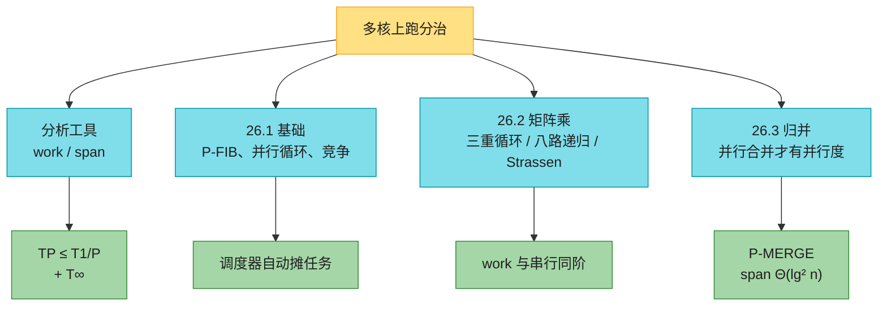
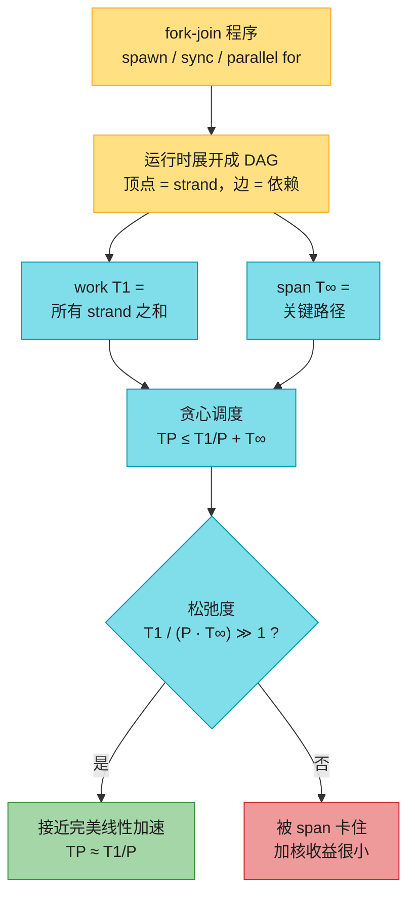
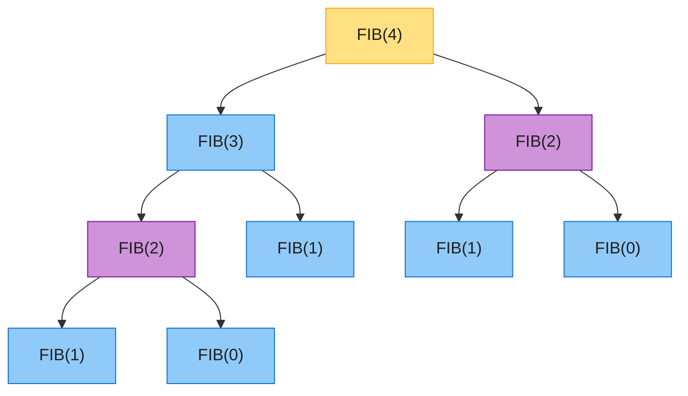
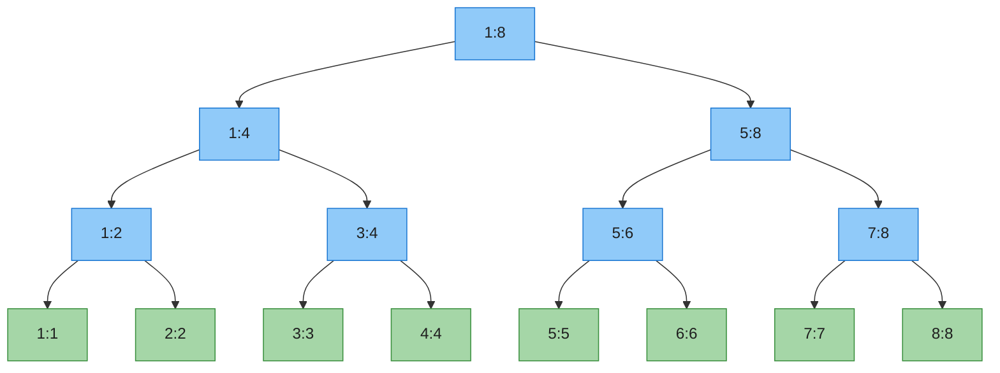
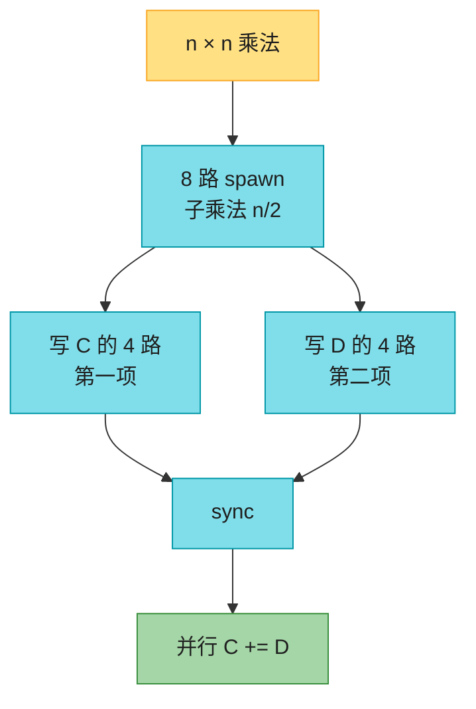
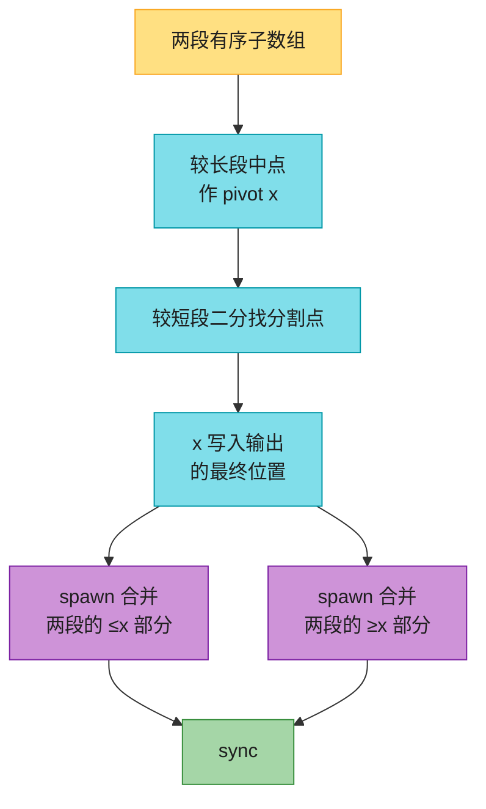

# 第 26 章：并行算法（Parallel Algorithms）——深度版

## 一、开篇定位

本章回答一个问题：**多核机器上，怎么把分治算法「拆开并行跑」，并且事先知道能快多少？**原书的模型不是「自己绑线程、自己做负载均衡」——那条路又难又容易写出偶发崩溃的程序。本章用的是 **fork-join**：程序员只声明「哪些子任务*可以*同时跑」，运行时调度器负责把任务摊到核上。

三个关键词就够写伪代码：`spawn`（派生一个子过程，父过程可以不等它、自己继续）、`sync`（等到自己派生的孩子全部结束——fork-join 的 join）、`parallel for`（循环各轮互不干扰，可同时执行）。把这三个词删掉，剩下的就是同一个问题的普通串行代码，叫做**串行投影**。

与前后章节的关系：

- **第 4 章分治**是本章的算法来源：矩阵乘法、Strassen、递归式 / 主定理全部直接复用；并行分析只是多算一条「跨度」递归式；
- **第 2 章归并排序**是 26.3 节的串行底本；朴素地只并行两个递归排序、合并仍串行，并行度只有 $\Theta(\lg n)$——瓶颈在 merge，必须把合并也并行化；
- **第 7 章快排**的教训在 26.3 再现：pivot 选差了递归会歪。P-MERGE 在**已排序**的数组上取较大段的中位数，保证每边 ≤ 3/4，不会退化；
- **第 16 章摊还**：`parallel for` 用二分递归展开时，内部节点的常数开销摊到叶子上，work 的渐近阶不变；
- **第 20.4 节拓扑排序**：理想并行机的「顺序一致性」= 按计算图（trace）的某个拓扑序交错执行指令；
- **第 22.2 节 DAG 最短路 / 关键路径**：span 就是把每条 strand 的耗时当边权后，trace 上的最长路。

做题定位：LeetCode **几乎不考手写 fork-join**。能直接练的是本章算法的串行投影——归并（912）、合并有序数组（88）、前缀和 / scan（1480、303）、矩阵乘法建模（311）。本章真正要带走的是 **work / span 分析**：加核不一定变快，「优化」在 32 核上更快、在 512 核上反而更慢——原书国际象棋程序的真实故事就是这个。

**本章主线**：spawn / sync 与计算图 → work、span、并行度、贪心调度 → 确定性竞争 → 并行矩阵乘 → 并行归并（P-MERGE）→ Java ForkJoin + Python 串行投影 → 速查 / 易混 → 题单与习题。



---

## 二、核心思想：只声明「可以并行」，用 work / span 算能快多少

大白话：普通递归是「先算左、再算右、再合并」。fork-join 改成「左派生出去、右自己算、汇合后再合并」。程序员**不**指定哪条任务跑在哪颗核上；调度器看见就绪的 strand 就往空闲核上塞。

分析只看两个量（下标是处理器个数；$T_\infty$ 表示「核要多少有多少」）：

| 量 | 符号 | 含义 | 怎么算 |
|----|------|------|--------|
| **work** | $T_1$ | 单核跑完全部计算的时间 | 等于串行投影的运行时间（把 strand 耗时加起来） |
| **span** | $T_\infty$ | 无限核时的最短时间 | 计算图上的**关键路径**（最长加权路） |
| **并行度** | $T_1 / T_\infty$ | 平均每步能同时干多少活 | 也是「完美线性加速」的处理器数上界 |
| **松弛度** | $T_1 / (P \cdot T_\infty)$ | 并行度比核数多几倍 | ≫ 1 时贪心调度接近完美线性加速 |

两条铁律（再快也破不了）：

- **work 定律**：$T_P \ge T_1 / P$（$P$ 核一步最多干 $P$ 份活）；
- **span 定律**：$T_P \ge T_\infty$（核再多也快不过关键路径）。

于是加速比 $T_1 / T_P \le P$，线性加速已经是天花板。并行度 $T_1 / T_\infty$ 是另一道天花板：核数一旦超过并行度，再加核也到不了完美线性加速。经验法则：松弛度 ≥ 10（并行度至少是核数的 10 倍）时，span 项不到 work/$P$ 的 10%，工程上够用。



**贪心调度**（每步能开工的 strand 绝不让核闲着）：完整步（就绪 strand ≥ $P$，用满所有核）至多 $T_1/P$ 步，不完整步（就绪 < $P$，但会把当前就绪的全做掉，关键路径缩短 1）至多 $T_\infty$ 步，于是

$$T_P \le T_1/P + T_\infty$$

这至多是最优调度的 **2 倍**。调度器在运行时在线工作，程序员不用写它。

串并联合成（分析 span 的全部手法，原书 Figure 26.3）：

两段计算**串行**相接——work 相加、span 也相加：


$T_1(A \cup B) = T_1(A)+T_1(B)$，$T_\infty(A \cup B) = T_\infty(A)+T_\infty(B)$。

两段计算**并行**——work 仍相加，span 取较大者：


$T_1(A \cup B) = T_1(A)+T_1(B)$，$T_\infty(A \cup B) = \max(T_\infty(A), T_\infty(B))$。

任意 fork-join 计算图都可以由单条 strand 经这两种合成搭起来，所以 span 递归式几乎总是「`max` 子问题 + 自己的串行零头」。

---

## 三、P-FIB 与计算图（26.1 前半）

### 3.1 直觉：一个很慢、但结构干净的例子

递归斐波那契（第 4 章已经说过它指数爆炸，这里只当教具）：

```text
FIB(n)
1  if n ≤ 1
2      return n
3  else x = FIB(n − 1)
4       y = FIB(n − 2)
5       return x + y
```

$T(n) = T(n-1)+T(n-2)+\Theta(1) \to \Theta(\varphi^n)$，$\varphi = (1+\sqrt{5})/2$。慢的原因一目了然——同一参数被算很多遍。P-FIB(4) 的调用树里，两个 `FIB(2)` 做的是完全相同的事（紫色 = 重复）：



两个递归调用操作的是**不同的局部变量**，互不干扰，可以并行：

```text
P-FIB(n)
1  if n ≤ 1
2      return n
3  else x = spawn P-FIB(n − 1)   // 派生后父过程继续
4       y = P-FIB(n − 2)         // 与孩子并行
5       sync                     // 等 spawn 的孩子结束
6       return x + y
```

`spawn` 的语义是「**可以**并行」不是「**必须**并行」。核不够时调度器完全可以串行执行——这正是串行投影正确的原因。`sync` 之前不能读孩子的返回值。每个过程返回前还有一次隐式 `sync`，保证孩子先结束、父亲再结束。

### 3.2 计算图（trace）：strand 与关键路径

把一次运行展开成 DAG：没有 `spawn` / `sync` / 调用 / 返回的连续指令收成一条 **strand**。P-FIB 每个内部过程三条 strand（派生前 / 调用 n−2 直到 sync / sync 之后求和返回），叶子一条。P-FIB(4) 共 4 个内部过程 + 5 个叶子 = **17 条 strand**（work = 17，设每条单位时间）。

关键路径走「较长的那个孩子」：span 递归式

$$T_\infty(n) = \max\{T_\infty(n-1),\, T_\infty(n-2)\} + \Theta(1) = T_\infty(n-1)+\Theta(1) \to \Theta(n)$$

P-FIB(4) 的 span = 8，并行度 $17/8 = 2.125$——输入太小，加核也快不了两倍。$n$ 变大后并行度 $\Theta(\varphi^n / n)$ 爆炸，松弛度很快 ≫ 1。

work 仍是 $\Theta(\varphi^n)$：并行**不会减少总运算量**，只是把它们摊到多个核上。要算得快，该用第 4 章的线性 / 矩阵快速幂，不是把这棵指数树并行化。

### 3.3 国际象棋课：32 核上的「优化」在 512 核上变慢

开发者在 32 核机器上把一个基准从 65 秒「优化」到 40 秒，用 work / span 外推到 512 核后，发现优化版反而更慢，于是放弃了它。把 $T_P \approx T_1/P + T_\infty$ 当近似：

| 版本 | work $T_1$ | span $T_\infty$ | 并行度 | $T_{32}$ | $T_{512}$ |
|------|------------|-----------------|--------|----------|-----------|
| 原版 | 2048 s | 1 s | 2048 | 65 s | **5 s** |
| 「优化」 | 1024 s | 8 s | 128 | **40 s** | 10 s |

32 核时 work/$P$ 占主导，减半 work 赢了；512 核时 span 变成主导，优化版的 span=8 把加速比卡住。两版一样快的核数（习题 26.1-10）：$2048/P+1 = 1024/P+8 \Rightarrow P = 1024/7 \approx 146$。

**教训**：只拿固定核数上的墙钟时间外推，会看走眼；work 和 span 才是可外推的量。

---

## 四、并行循环、矩阵-向量乘、确定性竞争（26.1 后半）

### 4.1 `parallel for`：二分派生一棵满二叉树

$n \times n$ 矩阵乘向量 $y = y + Ax$，外层按行并行、内层点积串行：

```text
P-MAT-VEC(A, x, y, n)
1  parallel for i = 1 to n
2      for j = 1 to n                 // 串行
3          y_i = y_i + a_ij · x_j
```

编译器把 `parallel for` 展开成二分递归派生（原书 Figure 26.4，$n=8$ 时）：



满二叉树内部节点数 = 叶子数 − 1，每个内部节点只做常数时间的切分，叶子至少常数时间（这里是 $\Theta(n)$ 的内层循环）。切分开销摊到叶子上，**work 仍是串行投影的 $\Theta(n^2)$**，不升阶。

span 要计入这棵对数深的控制树：

$$T_\infty(n) = \Theta(\lg n) + \max_i \{\text{第 } i \text{ 轮的 span}\}$$

P-MAT-VEC 内层串行 $n$ 次加法，所以 $T_\infty = \Theta(\lg n)+\Theta(n)=\Theta(n)$，并行度 $\Theta(n^2)/\Theta(n)=\Theta(n)$。把内层改成并行归约（习题 26.1-7）可把 span 压到 $\Theta(\lg n)$、并行度 $\Theta(n^2/\lg n)$——但累加同一个 $y_i$ 会引入下一小节的竞争，必须用私有部分和再合并。

实践中常把叶子**加粗**（一个叶子跑连续若干轮），用并行度换调度开销。松弛度足够时，线性加速还在。

### 4.2 确定性竞争：并行里最阴的 bug

两条逻辑上并行的指令访问同一内存，且至少一条写入 → **确定性竞争**（determinacy race）。程序本意是确定的，竞争会让它随调度变成不确定。Therac-25 放疗机、2003 北美大停电，都有竞争的影子。实验室跑几天都正常，线上偶发崩溃——因为绝大多数交错是对的，只有少数交错丢更新。

玩具反例：

```text
RACE-EXAMPLE()
1  x = 0
2  parallel for i = 1 to 2
3      x = x + 1          // 竞争
4  print x
```

`x = x + 1` 不是原子的，而是 load → 寄存器 +1 → store。下面这次交错把一次 +1 吃掉，打印 1 而不是 2：

| 步 | 指令 | 内存 x | r1 | r2 |
|----|------|--------|----|----|
| 1 | x = 0 | **0** | — | — |
| 2 | r1 = x | 0 | **0** | — |
| 3 | r2 = x | 0 | 0 | **0** |
| 4 | r1++ | 0 | **1** | 0 |
| 5 | r2++ | 0 | 1 | **1** |
| 6 | x = r2 | **1** | 1 | 1 |
| 7 | x = r1 | **1** | 1 | 1 |
| 8 | print x | 打印 **1** | | |

两条都先 load 到 0，各加到 1，后写的覆盖先写的。串行投影永远打印 2。

本章的纪律：**逻辑上并行的 strand 必须互不干扰**——共同访问的位置只能读、不能写。`parallel for` 的下标变量每轮是独立副本，不算竞争。P-MAT-VEC-WRONG 把内层也写成 `parallel for` 去更新同一个 $y_i$，就是典型的无意竞争。

并行哈希表这类结构**故意**带竞争，靠锁 / 原子操作收服；那是更高级的话题。能写成确定版本就写确定版本。

---

## 五、并行矩阵乘法（26.2）

三种算法都来自第 4 章，并行化之后 **work 与串行同阶**，差别在 span（能用多少核）。

### 5.1 三重循环：两个外层 `parallel for`

```text
P-MATRIX-MULTIPLY(A, B, C, n)
1  parallel for i = 1 to n
2      parallel for j = 1 to n
3          for k = 1 to n                    // 串行，避免竞争
4              c_ij = c_ij + a_ik · b_kj
```

| | 结果 | 直觉 |
|--|------|------|
| work | $\Theta(n^3)$ | 串行投影就是普通三重循环 |
| span | $\Theta(n)$ | 两层并行循环控制 $\Theta(\lg n)+\Theta(\lg n)$，内层 $n$ 次加法 |
| 并行度 | $\Theta(n^2)$ | $n=1000$ 时约 $10^6$，普通多核已经够用 |

把 $k$ 循环也并行化（每格一次归约）能把 span 降到 $\Theta(\lg n)$、并行度 $\Theta(n^3/\lg n)$（习题 26.2-3），但要额外空间存部分和，不能直接往 $c_{ij}$ 上并行加。

### 5.2 八路递归：临时矩阵避免竞争

第 4 章把 $C \mathrel{+}= A \cdot B$ 拆成 8 个 $n/2$ 子矩阵乘。若 8 路同时写 $C$ 的同一块，会竞争。解决办法：4 路累加到 $C$（每块的「第一项」），另外 4 路写到临时矩阵 $D$（「第二项」），sync 之后再 $C \mathrel{+}= D$：

```text
P-MATRIX-MULTIPLY-RECURSIVE(A, B, C, n)
1  if n == 1
2      c11 = c11 + a11 · b11; return
3  分配临时矩阵 D 并并行清零
4  把 A,B,C,D 划成 n/2 子块
5  spawn  四路：C11 += A11 B11, C12 += A11 B12, C21 += A21 B11, C22 += A21 B12
6  spawn  四路：D11  = A12 B21, D12  = A12 B22, D21  = A22 B21, D22  = A22 B22
7  sync
8  并行 C += D
```



work：$M_1(n)=8M_1(n/2)+\Theta(n^2)\to\Theta(n^3)$（与三重循环同阶，主定理叶子占大头）。

span：8 路同规模，取 1 路即可；$D$ 清零和 $C{+}{=}D$ 各 $\Theta(\lg n)$：

$$M_\infty(n)=M_\infty(n/2)+\Theta(\lg n)\to\Theta(\lg^2 n)$$

并行度 $\Theta(n^3/\lg^2 n)$。$n=1000$ 时约 $10^7$，远超任何单机核数——这就是「松弛度已经过大、再抠并行度没工程意义」的典型（思考题 26-2：插入一次 sync、去掉 $D$，并行度降到约 $n^2$，1000 阶矩阵仍有 $10^6$，通常更划算）。

### 5.3 并行 Strassen

7 路递归乘 + 若干加减，全部用 spawn / 并行循环。work 仍是串行的 $\Theta(n^{\lg 7})$；span 与 5.2 相同 $\Theta(\lg^2 n)$（7 路同规模，max 还是一路）；并行度 $\Theta(n^{\lg 7}/\lg^2 n)$。并行度略小于 5.2，只是因为 work 本身更小。

---

## 六、并行归并排序（26.3）：瓶颈在 merge

### 6.1 直觉：只并行两个递归，并行度只有 $\lg n$

```text
P-MERGE-SORT(A, p, r)
1  if p ≥ r: return
2  q = ⌊(p+r)/2⌋
3  spawn P-MERGE-SORT(A, p, q)
4  spawn P-MERGE-SORT(A, q+1, r)
5  sync
6  P-MERGE(A, p, q, r)
```

若第 6 行仍用第 2 章的串行 MERGE（work = span = $\Theta(n)$）：

| | 递归式 | 结论 |
|--|--------|------|
| work | $T_1(n)=2T_1(n/2)+\Theta(n)$ | $\Theta(n\lg n)$（串行投影就是归并排序） |
| span | $T_\infty(n)=T_\infty(n/2)+\Theta(n)$ | $\Theta(n)$（每层合并是串行的 $n$，几何级数看根） |
| 并行度 | $\Theta(n\lg n)/\Theta(n)$ | **$\Theta(\lg n)$** |

$n=10^6$ 时 $\lg n \approx 20$：几个核还能线性加速，几十核就顶死了。瓶颈明摆着是 merge。

### 6.2 P-MERGE：在已排序的两段上二分切，两路并行合并

关键观察：两段已经有序，可以**确定性地**选一个不会太歪的切点——取**较长段的中位数** $x$，在较短段上二分出 $x$ 该插入的位置。左半（都 $\le x$）和右半（都 $\ge x$）互不干扰，spawn 两路递归合并。

`FIND-SPLIT-POINT` 就是第 4 章的 lowerBound：返回 $q\in[p, r+1]$，使得 $A[p:q-1]$ 都 $\le x$、$A[q:r]$ 都 $\ge x$。work = span = $\Theta(\lg n)$。

以 $A_1=[1,3,5,7,9]$、$A_2=[2,4,6,8]$ 为例。较长段中位数 $x=5$；在 $A_2$ 里第一个 $\ge 5$ 的是 6。输出中 5 直接就位，两路并行合并：

| | ≤ x | pivot | ≥ x |
|--|-----|-------|-----|
| 较长段 | 1, 3 | **5** | 7, 9 |
| 较短段 | 2, 4 | | 6, 8 |
| 输出 B | 1, 2, 3, 4 | **5** | 6, 7, 8, 9 |



最坏时较短段全部落到同一侧，较长段仍被中位数对半切，子问题规模

$$\frac{n_1}{2}+n_2 = \frac{2n_1+4n_2}{4} \le \frac{3n_1+3n_2}{4} = \frac{3n}{4}$$

（用了 $n_2 \le n_1$）。于是每层至少甩掉 1/4，递归深度 $\Theta(\lg n)$。

```text
FIND-SPLIT-POINT(A, p, r, x)          // lowerBound，返回第一个 ≥ x 的下标
1  low = p; high = r + 1
2  while low < high
3      mid = ⌊(low + high) / 2⌋
4      if x ≤ A[mid]: high = mid
5      else:            low  = mid + 1
6  return low

P-MERGE(A, p, q, r)
1  分配临时数组 B[p:r]
2  P-MERGE-AUX(A, p, q, q+1, r, B, p)
3  parallel for i = p to r
4      A[i] = B[i]

P-MERGE-AUX(A, p1, r1, p2, r2, B, p3)
1  if p1 > r1 and p2 > r2: return      // 两段都空
2  if r1 − p1 < r2 − p2: 交换两段角色  // 保证第一段不更短
3  q1 = ⌊(p1 + r1) / 2⌋; x = A[q1]
4  q2 = FIND-SPLIT-POINT(A, p2, r2, x)
5  q3 = p3 + (q1 − p1) + (q2 − p2)
6  B[q3] = x
7  spawn P-MERGE-AUX(A, p1, q1−1, p2, q2−1, B, p3)
8  spawn P-MERGE-AUX(A, q1+1, r1, q2, r2, B, q3+1)
9  sync
```

### 6.3 复杂度

P-MERGE-AUX（$n$ 为两段元素总数）：

| | 递归式 | 结论 |
|--|--------|------|
| span | $T_\infty(n)=T_\infty(3n/4)+\Theta(\lg n)$ | $\Theta(\lg^2 n)$ |
| work | $T_1(n)=T_1(\alpha n)+T_1((1-\alpha)n)+\Theta(\lg n)$，$\alpha\in[1/4,3/4]$ | $\Theta(n)$（与串行 merge 同阶） |

P-MERGE 本身的并行拷贝不改变渐近：work $\Theta(n)$，span $\Theta(\lg^2 n)$。

代回 P-MERGE-SORT：

| | 递归式 | 结论 |
|--|--------|------|
| work | $T_1(n)=2T_1(n/2)+\Theta(n)$ | $\Theta(n\lg n)$ |
| span | $T_\infty(n)=T_\infty(n/2)+\Theta(\lg^2 n)$ | $\Theta(\lg^3 n)$ |
| 并行度 | $\Theta(n\lg n)/\Theta(\lg^3 n)$ | **$\Theta(n/\lg^2 n)$** |

$n=10^6$ 时并行度约 $10^6 / 400 \approx 2500$，比朴素版的 20 高两个数量级。实践中把叶子加粗（小段改走串行快排 / `Arrays.sort`），用一点并行度换掉渐近记号里的大常数。

---

## 七、代码实现（Java ForkJoin + Python 串行投影）

索引：正文伪代码是 CLRS 的 1-indexed；下面代码 **0-indexed**，闭区间 `[p, r]`。`FIND-SPLIT-POINT` 与第 4 章 `lowerBound` 相同。Java 用 `ForkJoinPool` 落实 spawn/sync（`invokeAll` = 两路 spawn + sync）；Python 给出同一套递归的**串行投影**（删掉 spawn/sync，正确性相同，也是对拍的参照实现）。叶子加粗阈值：斐波那契 10、归并 32。

### 7.1 Java

```java
import java.util.Arrays;
import java.util.Random;
import java.util.concurrent.RecursiveAction;
import java.util.concurrent.RecursiveTask;

public class ParallelAlgos {

    static final int FIB_CUTOFF = 10;
    static final int MERGE_CUTOFF = 32;

    /** 串行斐波那契，用作粗化叶子 / 对拍 */
    static long fibSerial(int n) {
        if (n <= 1) return n;
        long a = 0, b = 1;
        for (int i = 2; i <= n; i++) {
            long c = a + b;
            a = b;
            b = c;
        }
        return b;
    }

    /** P-FIB：spawn n-1，自己算 n-2，join 后相加 */
    static class FibTask extends RecursiveTask<Long> {
        final int n;
        FibTask(int n) { this.n = n; }

        @Override
        protected Long compute() {
            if (n <= FIB_CUTOFF) return fibSerial(n);
            FibTask left = new FibTask(n - 1);
            left.fork();                          // spawn
            long y = new FibTask(n - 2).compute(); // 与孩子并行
            long x = left.join();                 // sync
            return x + y;
        }
    }

    static long pFib(int n) {
        return new FibTask(n).invoke();
    }

    /** 单位 strand 模型下 P-FIB 的 work / span（对拍原书 P-FIB(4)：17 / 8） */
    static int[] pFibMetrics(int n) {
        if (n <= 1) return new int[]{1, 1};       // work, span
        int[] a = pFibMetrics(n - 1);
        int[] b = pFibMetrics(n - 2);
        int work = 3 + a[0] + b[0];               // 内部 3 条 strand
        int span = 1 + Math.max(a[1], 1 + b[1]) + 1;
        return new int[]{work, span};
    }

    /** y = A x，外层按行并行（P-MAT-VEC 的 ForkJoin 展开） */
    static class MatVecTask extends RecursiveAction {
        final double[][] A;
        final double[] x, y;
        final int lo, hi;                         // 行区间 [lo, hi)

        MatVecTask(double[][] A, double[] x, double[] y, int lo, int hi) {
            this.A = A; this.x = x; this.y = y; this.lo = lo; this.hi = hi;
        }

        @Override
        protected void compute() {
            if (hi - lo <= 1) {
                int i = lo;
                double s = 0;
                for (int j = 0; j < x.length; j++) s += A[i][j] * x[j];
                y[i] = s;
                return;
            }
            int mid = (lo + hi) >>> 1;
            invokeAll(new MatVecTask(A, x, y, lo, mid),
                      new MatVecTask(A, x, y, mid, hi));
        }
    }

    static double[] pMatVec(double[][] A, double[] x) {
        double[] y = new double[A.length];
        if (A.length > 0) new MatVecTask(A, x, y, 0, A.length).invoke();
        return y;
    }

    /** P-MATRIX-MULTIPLY：按行二分并行，内层 k 串行以免竞争 */
    static class MatMulTask extends RecursiveAction {
        final double[][] A, B, C;
        final int lo, hi;

        MatMulTask(double[][] A, double[][] B, double[][] C, int lo, int hi) {
            this.A = A; this.B = B; this.C = C; this.lo = lo; this.hi = hi;
        }

        @Override
        protected void compute() {
            int n = A.length;
            if (hi - lo <= 1) {
                int i = lo;
                for (int j = 0; j < n; j++) {
                    double s = 0;
                    for (int k = 0; k < n; k++) s += A[i][k] * B[k][j];
                    C[i][j] = s;
                }
                return;
            }
            int mid = (lo + hi) >>> 1;
            invokeAll(new MatMulTask(A, B, C, lo, mid),
                      new MatMulTask(A, B, C, mid, hi));
        }
    }

    static double[][] pMatrixMultiply(double[][] A, double[][] B) {
        int n = A.length;
        double[][] C = new double[n][n];
        if (n > 0) new MatMulTask(A, B, C, 0, n).invoke();
        return C;
    }

    /** FIND-SPLIT-POINT：第一个 ≥ x 的下标，空区间 [p, r] 且 p > r 时返回 p */
    static int findSplitPoint(int[] a, int p, int r, int x) {
        int low = p, high = r + 1;
        while (low < high) {
            int mid = (low + high) >>> 1;
            if (x <= a[mid]) high = mid;
            else low = mid + 1;
        }
        return low;
    }

    static void serialMerge(int[] a, int p1, int r1, int p2, int r2, int[] b, int p3) {
        while (p1 <= r1 && p2 <= r2)
            b[p3++] = a[p1] <= a[p2] ? a[p1++] : a[p2++];
        while (p1 <= r1) b[p3++] = a[p1++];
        while (p2 <= r2) b[p3++] = a[p2++];
    }

    /** P-MERGE-AUX */
    static class MergeAuxTask extends RecursiveAction {
        int[] a, b;
        int p1, r1, p2, r2, p3;

        MergeAuxTask(int[] a, int p1, int r1, int p2, int r2, int[] b, int p3) {
            this.a = a; this.b = b;
            this.p1 = p1; this.r1 = r1; this.p2 = p2; this.r2 = r2; this.p3 = p3;
        }

        @Override
        protected void compute() {
            int n = Math.max(0, r1 - p1 + 1) + Math.max(0, r2 - p2 + 1);
            if (n <= MERGE_CUTOFF) {
                serialMerge(a, p1, r1, p2, r2, b, p3);
                return;
            }
            if (p1 > r1 && p2 > r2) return;
            if (r1 - p1 < r2 - p2) {
                int t = p1; p1 = p2; p2 = t;
                t = r1; r1 = r2; r2 = t;
            }
            int q1 = (p1 + r1) >>> 1;
            int x = a[q1];
            int q2 = findSplitPoint(a, p2, r2, x);
            int q3 = p3 + (q1 - p1) + (q2 - p2);
            b[q3] = x;
            invokeAll(
                new MergeAuxTask(a, p1, q1 - 1, p2, q2 - 1, b, p3),
                new MergeAuxTask(a, q1 + 1, r1, q2, r2, b, q3 + 1)
            );
        }
    }

    static void pMerge(int[] a, int p, int q, int r) {
        int[] b = new int[a.length];
        new MergeAuxTask(a, p, q, q + 1, r, b, p).invoke();
        System.arraycopy(b, p, a, p, r - p + 1);
    }

    static class MergeSortTask extends RecursiveAction {
        final int[] a;
        final int p, r;

        MergeSortTask(int[] a, int p, int r) { this.a = a; this.p = p; this.r = r; }

        @Override
        protected void compute() {
            if (r - p + 1 <= MERGE_CUTOFF) {
                Arrays.sort(a, p, r + 1);
                return;
            }
            int q = (p + r) >>> 1;
            invokeAll(new MergeSortTask(a, p, q), new MergeSortTask(a, q + 1, r));
            pMerge(a, p, q, r);
        }
    }

    static void pMergeSort(int[] a) {
        if (a.length > 0) new MergeSortTask(a, 0, a.length - 1).invoke();
    }

    static boolean approxEq(double[] u, double[] v) {
        if (u.length != v.length) return false;
        for (int i = 0; i < u.length; i++)
            if (Math.abs(u[i] - v[i]) > 1e-9) return false;
        return true;
    }

    static boolean approxEq2(double[][] A, double[][] B) {
        for (int i = 0; i < A.length; i++)
            if (!approxEq(A[i], B[i])) return false;
        return true;
    }

    public static void main(String[] args) {
        int[] m4 = pFibMetrics(4);
        if (m4[0] != 17 || m4[1] != 8)
            throw new AssertionError("P-FIB(4) metrics " + m4[0] + "/" + m4[1]);
        for (int n = 0; n <= 30; n++)
            if (pFib(n) != fibSerial(n))
                throw new AssertionError("fib " + n);

        Random rng = new Random(26);
        for (int t = 0; t < 200; t++) {
            int n = rng.nextInt(80) + 1;
            double[][] A = new double[n][n];
            double[] x = new double[n];
            for (int i = 0; i < n; i++) {
                x[i] = rng.nextGaussian();
                for (int j = 0; j < n; j++) A[i][j] = rng.nextGaussian();
            }
            double[] y = pMatVec(A, x);
            double[] y2 = new double[n];
            for (int i = 0; i < n; i++)
                for (int j = 0; j < n; j++) y2[i] += A[i][j] * x[j];
            if (!approxEq(y, y2)) throw new AssertionError("matvec " + t);
        }
        for (int t = 0; t < 80; t++) {
            int n = rng.nextInt(24) + 1;
            double[][] A = new double[n][n], B = new double[n][n], C = new double[n][n];
            for (int i = 0; i < n; i++)
                for (int j = 0; j < n; j++) {
                    A[i][j] = rng.nextGaussian();
                    B[i][j] = rng.nextGaussian();
                }
            double[][] P = pMatrixMultiply(A, B);
            for (int i = 0; i < n; i++)
                for (int k = 0; k < n; k++)
                    for (int j = 0; j < n; j++)
                        C[i][j] += A[i][k] * B[k][j];
            if (!approxEq2(P, C)) throw new AssertionError("matmul " + t);
        }
        for (int t = 0; t < 400; t++) {
            int n = rng.nextInt(200) + 1;
            int[] a = new int[n], b = new int[n];
            for (int i = 0; i < n; i++) a[i] = b[i] = rng.nextInt(1000) - 200;
            pMergeSort(a);
            Arrays.sort(b);
            if (!Arrays.equals(a, b)) throw new AssertionError("sort " + t);
        }
        for (int t = 0; t < 200; t++) {
            int n1 = rng.nextInt(80), n2 = rng.nextInt(80);
            int[] left = new int[n1], right = new int[n2];
            for (int i = 0; i < n1; i++) left[i] = rng.nextInt(500);
            for (int i = 0; i < n2; i++) right[i] = rng.nextInt(500);
            Arrays.sort(left);
            Arrays.sort(right);
            int[] a = new int[n1 + n2];
            System.arraycopy(left, 0, a, 0, n1);
            System.arraycopy(right, 0, a, n1, n2);
            int[] expect = a.clone();
            Arrays.sort(expect);
            if (n1 + n2 > 0) pMerge(a, 0, n1 - 1, n1 + n2 - 1);
            if (!Arrays.equals(a, expect)) throw new AssertionError("merge " + t);
        }
        System.out.println("all tests passed");
    }
}
```

### 7.2 Python

```python
import random

FIB_CUTOFF = 10
MERGE_CUTOFF = 32


def fib_serial(n):
    if n <= 1:
        return n
    a, b = 0, 1
    for _ in range(2, n + 1):
        a, b = b, a + b
    return b


def p_fib(n):
    """P-FIB 的串行投影（n 大时请走 fib_serial）"""
    if n <= FIB_CUTOFF:
        return fib_serial(n)
    return p_fib(n - 1) + p_fib(n - 2)


def p_fib_metrics(n):
    """单位 strand 模型的 (work, span)；P-FIB(4) = (17, 8)"""
    if n <= 1:
        return 1, 1
    w1, s1 = p_fib_metrics(n - 1)
    w2, s2 = p_fib_metrics(n - 2)
    return 3 + w1 + w2, 1 + max(s1, 1 + s2) + 1


def p_mat_vec(A, x):
    """P-MAT-VEC 串行投影：按行点积"""
    n = len(A)
    y = [0.0] * n
    for i in range(n):
        s = 0.0
        for j, aij in enumerate(A[i]):
            s += aij * x[j]
        y[i] = s
    return y


def p_matrix_multiply(A, B):
    n = len(A)
    C = [[0.0] * n for _ in range(n)]
    for i in range(n):
        for j in range(n):
            s = 0.0
            for k in range(n):
                s += A[i][k] * B[k][j]
            C[i][j] = s
    return C


def find_split_point(a, p, r, x):
    """第一个 ≥ x 的下标；空区间 p > r 时返回 p"""
    low, high = p, r + 1
    while low < high:
        mid = (low + high) // 2
        if x <= a[mid]:
            high = mid
        else:
            low = mid + 1
    return low


def serial_merge(a, p1, r1, p2, r2, b, p3):
    while p1 <= r1 and p2 <= r2:
        if a[p1] <= a[p2]:
            b[p3] = a[p1]; p1 += 1
        else:
            b[p3] = a[p2]; p2 += 1
        p3 += 1
    while p1 <= r1:
        b[p3] = a[p1]; p1 += 1; p3 += 1
    while p2 <= r2:
        b[p3] = a[p2]; p2 += 1; p3 += 1


def p_merge_aux(a, p1, r1, p2, r2, b, p3):
    n = max(0, r1 - p1 + 1) + max(0, r2 - p2 + 1)
    if n <= MERGE_CUTOFF:
        serial_merge(a, p1, r1, p2, r2, b, p3)
        return
    if p1 > r1 and p2 > r2:
        return
    if r1 - p1 < r2 - p2:
        p1, p2 = p2, p1
        r1, r2 = r2, r1
    q1 = (p1 + r1) // 2
    x = a[q1]
    q2 = find_split_point(a, p2, r2, x)
    q3 = p3 + (q1 - p1) + (q2 - p2)
    b[q3] = x
    p_merge_aux(a, p1, q1 - 1, p2, q2 - 1, b, p3)
    p_merge_aux(a, q1 + 1, r1, q2, r2, b, q3 + 1)


def p_merge(a, p, q, r):
    b = [0] * len(a)
    p_merge_aux(a, p, q, q + 1, r, b, p)
    a[p:r + 1] = b[p:r + 1]


def p_merge_sort(a, p=None, r=None):
    if p is None:
        p, r = 0, len(a) - 1
        if not a:
            return
    if r - p + 1 <= MERGE_CUTOFF:
        a[p:r + 1] = sorted(a[p:r + 1])
        return
    q = (p + r) // 2
    p_merge_sort(a, p, q)
    p_merge_sort(a, q + 1, r)
    p_merge(a, p, q, r)


if __name__ == "__main__":
    assert p_fib_metrics(4) == (17, 8)
    for n in range(0, 25):
        assert p_fib(n) == fib_serial(n)

    rng = random.Random(26)
    for t in range(200):
        n = rng.randint(1, 40)
        A = [[rng.random() for _ in range(n)] for _ in range(n)]
        x = [rng.random() for _ in range(n)]
        y = p_mat_vec(A, x)
        y2 = [sum(A[i][j] * x[j] for j in range(n)) for i in range(n)]
        assert all(abs(u - v) < 1e-9 for u, v in zip(y, y2)), t

    for t in range(60):
        n = rng.randint(1, 16)
        A = [[rng.random() for _ in range(n)] for _ in range(n)]
        B = [[rng.random() for _ in range(n)] for _ in range(n)]
        C = p_matrix_multiply(A, B)
        D = [[sum(A[i][k] * B[k][j] for k in range(n)) for j in range(n)]
             for i in range(n)]
        assert all(abs(C[i][j] - D[i][j]) < 1e-9
                   for i in range(n) for j in range(n)), t

    for t in range(400):
        n = rng.randint(1, 200)
        a = [rng.randint(-200, 800) for _ in range(n)]
        b = sorted(a)
        p_merge_sort(a)
        assert a == b, t

    for t in range(200):
        n1, n2 = rng.randint(0, 80), rng.randint(0, 80)
        left = sorted(rng.randint(0, 500) for _ in range(n1))
        right = sorted(rng.randint(0, 500) for _ in range(n2))
        a = left + right
        expect = sorted(a)
        if n1 + n2 > 0:
            p_merge(a, 0, n1 - 1, n1 + n2 - 1)
        assert a == expect, t

    print("all tests passed")
```

---

## 八、复杂度速查 + 易混点对比

### 8.1 速查表

| 算法 | work $T_1$ | span $T_\infty$ | 并行度 | 备注 |
|------|------------|-----------------|--------|------|
| P-FIB | $\Theta(\varphi^n)$ | $\Theta(n)$ | $\Theta(\varphi^n/n)$ | 教具，不要真拿它算斐波那契 |
| P-MAT-VEC | $\Theta(n^2)$ | $\Theta(n)$ | $\Theta(n)$ | 内层串行；内层归约后 span $\Theta(\lg n)$ |
| P-MATRIX-MULTIPLY | $\Theta(n^3)$ | $\Theta(n)$ | $\Theta(n^2)$ | 两层 parallel for |
| P-MATRIX-MULTIPLY-RECURSIVE | $\Theta(n^3)$ | $\Theta(\lg^2 n)$ | $\Theta(n^3/\lg^2 n)$ | 八路 + 临时 $D$ |
| 并行 Strassen | $\Theta(n^{\lg 7})$ | $\Theta(\lg^2 n)$ | $\Theta(n^{\lg 7}/\lg^2 n)$ | work 更小，所以并行度略低 |
| P-NAIVE-MERGE-SORT | $\Theta(n\lg n)$ | $\Theta(n)$ | $\Theta(\lg n)$ | 合并仍串行，几十核就顶死 |
| **P-MERGE** | $\Theta(n)$ | $\Theta(\lg^2 n)$ | $\Theta(n/\lg^2 n)$ | 较长段中位数 + 二分切 |
| **P-MERGE-SORT** | $\Theta(n\lg n)$ | $\Theta(\lg^3 n)$ | $\Theta(n/\lg^2 n)$ | 把 P-MERGE 代回去 |
| 贪心调度 | — | — | — | $T_P \le T_1/P + T_\infty$，≤ 2× 最优 |

### 8.2 易混点对比

| 易混点 | 辨析 |
|-------|------|
| spawn = 必须并行 | **可以**并行。核不够就串行跑，这正是串行投影成立的原因 |
| 并行能减少 work | 不能。work = 单核总运算量，P-FIB 并行之后还是 $\Theta(\varphi^n)$ |
| $T_P$ 的下标 | $T_1$ = 1 核 = work；$T_\infty$ = 无限核 = span；$T_P$ = $P$ 核墙钟时间 |
| 并行度 vs 加速比 | 并行度 $T_1/T_\infty$ 是加速比的上界，也是「再加核也完美不了」的核数门槛 |
| 松弛度 < 1 | 核数已经超过并行度，完美线性加速不可能；再加核，加速比离 $P$ 越来越远 |
| `parallel for` 的下标 | 每轮一份独立副本，**不**构成竞争；竞争来自循环体写同一块内存 |
| 内层也 parallel for 累加 $y_i$ | P-MAT-VEC-WRONG：典型竞争。要并行内层必须私有部分和 / 归约树 |
| 八路同时写 $C$ 的同一块 | 竞争。一半写 $C$、一半写 $D$，sync 后再加 |
| 朴素并行归并的 span | 每层串行 $\Theta(n)$ 的 merge，span 是 $\Theta(n)$ 不是 $\Theta(\lg n)$ |
| P-MERGE 的 pivot | 不是随机、也不是全体中位数，是**较长段**的中位数，保证 ≤ 3/4 |
| FIND-SPLIT-POINT 空段 | $p>r$ 时 `high=r+1=p=low`，直接返回 $p$，空段二分是安全的 |
| 加粗叶子 | 降并行度、降常数；松弛度足够时线性加速还在（思考题 26-1 的 grain-size） |
| 32 核更快 ⇒ 512 核更快 | 象棋课：work 降、span 升时，核一多就被 span 卡住 |

---

## 九、LeetCode 题单 + 习题快问快答

### 9.1 LeetCode 题单

定位语：**不考手写 fork-join**。考的是本章算法的串行投影，以及「前缀和 = scan」这种可并行原语的思想。Java 里 `ForkJoinPool` / `parallelStream` 是本章模型的工业对应物，面试偶尔问工作窃取，不会让你默写 P-MERGE-AUX。

| 题号 | 题目 | 难度 | 考点 |
|-----|------|------|------|
| 912 | 排序数组 | 中 | 归并的串行投影；本章说明「只并行递归、合并串行」并行度不够 |
| 88 | 合并两个有序数组 | 简 | 串行 MERGE；P-MERGE 是它的并行版，面试默写仍用双指针 |
| 21 | 合并两个有序链表 | 简 | 同上，结构换成链表 |
| 23 | 合并 K 个升序链表 | 难 | 分治合并：两路 spawn 的串行投影 |
| 509 | 斐波那契数 | 简 | **不要**提交 P-FIB；线性递推 / 矩阵幂。P-FIB 只用来理解 spawn |
| 1480 | 一维数组的动态和 | 简 | scan / 前缀和的串行版（思考题 26-4） |
| 303 | 区域和检索 | 简 | 前缀和预处理 = 一次 scan |
| 304 | 二维区域和检索 | 中 | 二维前缀，stencil / 扫描的亲戚（思考题 26-5） |
| 311 | 稀疏矩阵乘法 | 中 | 矩阵乘的建模；稠密版对应 26.2，稀疏要换数据结构 |
| 53 | 最大子数组和 | 中 | 分治版 $T(n)=2T(n/2)+\Theta(1)$ 的 span 可到 $\Theta(\lg n)$，LC 用 Kadane 即可 |

912 的实战简版就是第 2 章归并；真要在 Java 里并行排序，用本章第七节的 `pMergeSort`（小数组切到 `Arrays.sort`）。

### 9.2 习题快问快答（第四版编号）

- **26.1-1** 串行算法的 trace 是一条链：每条 strand 一个后继，work = span，并行度 = 1。
- **26.1-2** 第 4 行也 spawn `P-FIB(n-2)`：trace 多一条「父过程蓝→橙」的继续边变成两条 spawn 边，橙 strand 不再包含一次调用。渐近 work / span / 并行度都不变（span 仍由较长孩子 $n-1$ 决定，$\Theta(n)$）。
- **26.1-3** P-FIB(5)：work = 3 + 17 + 9 = 29（P-FIB(3) 的 work 用同样方法算是 9），span = 1 + max(8, 1+6) + 1 = 10，并行度 2.9。3 核贪心：每步取当前就绪 strand，完整步用满 3 核。
- **26.1-4** 更紧的界 $T_P \le (T_1-T_\infty)/P + T_\infty$：完整步的总 work ≤ $T_1-T_\infty$（关键路径上至少留 $T_\infty$ 份 work 给不完整步），故完整步 ≤ $(T_1-T_\infty)/P$。
- **26.1-6** 教授在撒谎。work 定律：$T_1 \le 4\cdot 80 = 320$；span 定律：$T_\infty \le T_{64}=10$。代入 26.1-4：$T_{10} \le (320-10)/10 + 10 = 41$，与声称的 42 矛盾。
- **26.1-7** 每个 $y_i$ 用一棵归约树求 $n$ 项点积：work 仍 $\Theta(n^2)$，span $\Theta(\lg n)$（外层并行循环控制 $\Theta(\lg n)$ + 归约 $\Theta(\lg n)$），并行度 $\Theta(n^2/\lg n)$。部分和必须写在私有位置。
- **26.1-8** P-TRANSPOSE：交换次数 $\Theta(n^2)$ = work。外层 `parallel for j=2..n`、内层 `parallel for i=1..j-1`，span = $\Theta(\lg n)+\Theta(\lg n)=\Theta(\lg n)$，并行度 $\Theta(n^2/\lg n)$。对角不交换，无竞争（每对 $(i,j)$ 与 $(j,i)$ 只被一轮碰到）。
- **26.1-9** 内层改串行：最大一轮 $\Theta(n)$ 次交换，span $\Theta(n)$，并行度 $\Theta(n)$。
- **26.1-10** 象棋两版一样快：$2048/P+1=1024/P+8\Rightarrow P=1024/7\approx 146$。
- **26.2-3** 每个 $c_{ij}$ 对 $k$ 做并行归约：三层都并行，span $\Theta(\lg n)$，work $\Theta(n^3)$。不能直接并行写 $c_{ij}$。
- **26.2-5** Floyd-Warshall 的 $k$ 层必须串行（第 $k$ 层依赖第 $k-1$ 层的全部格）；每层 $n^2$ 格可并行更新。work $\Theta(n^3)$，span $\Theta(n\lg n)$（$n$ 层 × 两层并行循环 $\lg n$），并行度 $\Theta(n^2/\lg n)$。
- **26.3-1** 加粗 P-MERGE 叶子：两段总长 ≤ 阈值时改走双指针串行 merge（第七节 `MERGE_CUTOFF`）。
- **26.3-2** 用全体中位数（第 9 章）切，两段更均衡，span 仍 $\Theta(\lg^2 n)$ 量级，常数更好，但每次切点是线性时间的 SELECT，work 的常数变差。

### 9.3 思考题选

- **26-1 并行循环的 grain-size**：二分派生并行度 $\Theta(n)$；grain-size=1 的「循环里逐个 spawn」会让 span 变成 $\Theta(n)$（spawn 链），并行度 $\Theta(1)$。最优 grain-size 约等于「让叶子 work 盖过派生开销」，过大则并行度掉下去。
- **26-2 去掉临时矩阵 $D$**：8 路里先 spawn 写 $C$ 的 4 路（每块第一项），**sync**，再 spawn 写 $C$ 的 4 路（第二项）。无竞争，work 仍 $\Theta(n^3)$。span：$M_\infty(n)=2M_\infty(n/2)+\Theta(\lg n)\to\Theta(n)$，并行度 $\Theta(n^2)$。$n=1000$ 时约 $10^6$，对比带 $D$ 的 $10^7$——核数 ≪ $10^6$ 时去掉 $D$ 更划算。
- **26-4 并行归约与 scan**：P-REDUCE 二分，$T_1=\Theta(n)$，$T_\infty=\Theta(\lg n)$。朴素 P-SCAN-1 对每个前缀单独 reduce，work $\Theta(n^2)$ 太亏。标准两遍：upsweep 建区间和、downsweep 撒前缀（Blelloch scan），work $\Theta(n)$、span $\Theta(\lg n)$。括号匹配：`(` → +1、`)` → −1，做 +scan，合法 ⟺ 全程前缀 ≥ 0 且总和 = 0。
- **26-5 简单 stencil**（格子只依赖左上）：四块 $n/2$，先 $A_{11}$，再并行 $A_{12}\parallel A_{21}$，最后 $A_{22}$。work $\Theta(n^2)$，span $T_\infty(n)=3T_\infty(n/2)+\Theta(1)\to\Theta(n^{\lg 3})\approx\Theta(n^{1.58})$，并行度 $o(n)$。fork-join 的同步结构吃掉了一部分固有并行度（固有并行度 $\Theta(n)$，沿反对角线）。
- **26-6 随机并行**：期望形式的 work / span 定律照写；加速比应定义为 $E[T_1]/E[T_P]$ 而不是 $E[T_1/T_P]$（1% 的超高加速比会把后者抬飞）。P-RANDOMIZED-QUICKSORT 只并行两个递归、划分仍串行，期望 span 被划分的 $\Theta(n)$ 卡住，类似朴素并行归并。

### 9.4 章末注记

Graham 与 Brent 给出了「存在达到 $T_1/P+T_\infty$ 的调度」；Eager-Zahorjan-Lazowska 证明**任意贪心调度**都达到此界，并推广了用 work / span（他们不叫这个名字）分析并行算法的方法。Blelloch 在数据并行里把 span 叫做 depth。Blumofe-Leiserson 的**工作窃取**给出分布式调度 $E[T_P]\le T_1/P+O(T_\infty)$，Cilk / OpenCilk、Java ForkJoinPool、TBB、OpenMP task 都走这条路。顺序一致性由 Lamport 提出。本章伪代码直接对应 Cilk 的 `cilk_spawn` / `cilk_sync` / `cilk_for`。并行归并的思路来自 Akl。第三版里的排序网络与 PRAM 模型本版已删，换成更贴近多核实践的 fork-join。

---

## 参考资料

- Cormen, T. H., Leiserson, C. E., Rivest, R. L., & Stein, C. (2022). *Introduction to Algorithms* (4th ed.). MIT Press. Chapter 26: Parallel Algorithms, pp. 748–790.
- Blumofe, R. D., & Leiserson, C. E. (1999). Scheduling multithreaded computations by work stealing. *JACM*.
- Frigo, M., Leiserson, C. E., & Randall, K. H. (1998). The implementation of the Cilk-5 multithreaded language. *PLDI*.
- Blelloch, G. E. (1996). Programming parallel algorithms. *Communications of the ACM*.
- OpenCilk. https://www.opencilk.org/
