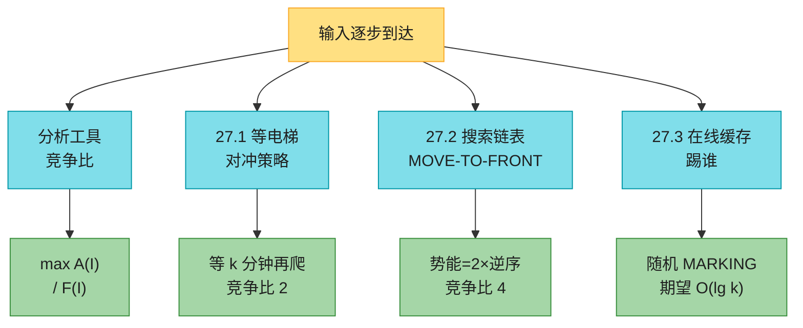
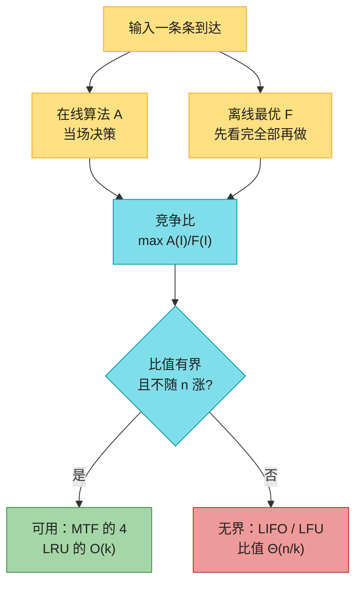
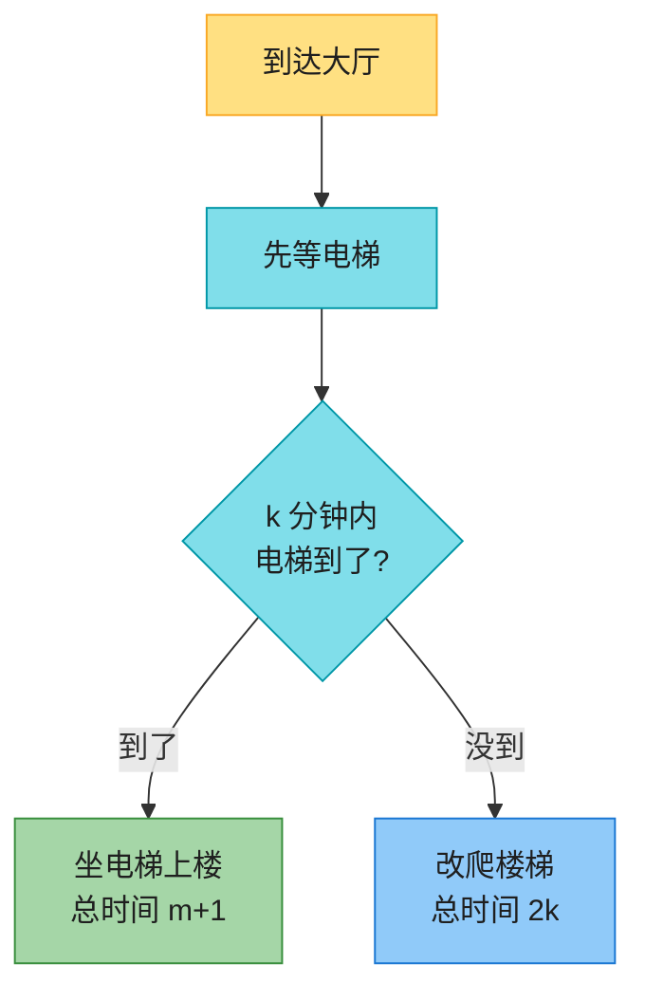
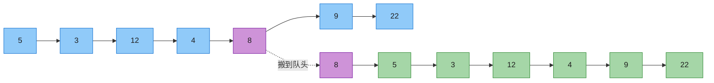
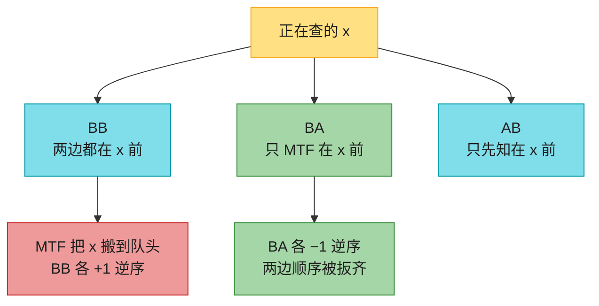
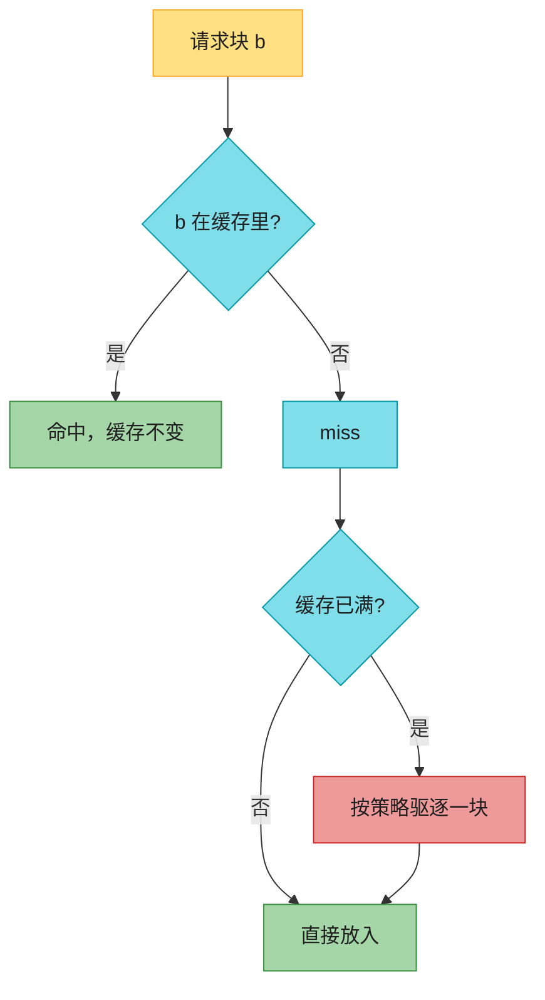
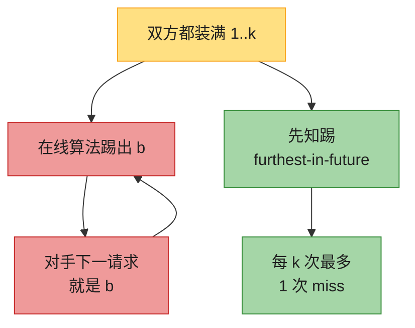
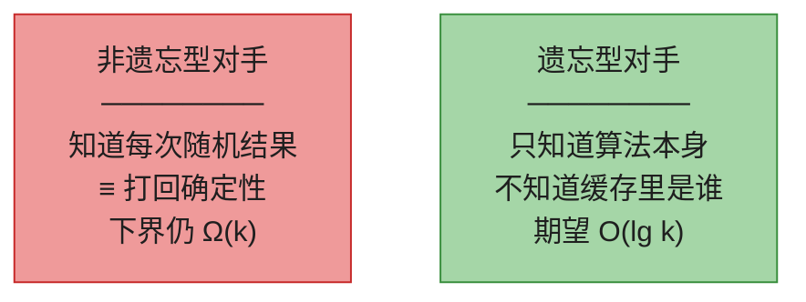

# 第 27 章：在线算法（Online Algorithms）——深度版

## 一、开篇定位

本章回答一个问题：**输入是一条一条来的，每一步都得当场拍板，事后拿「全知全能的离线最优」一比，最坏能差几倍？**股票今天就得买、缓存 miss 当下就得踢谁、电梯等多久再改爬楼梯——未来不知道，但要保证「再倒霉也不至于比先知差一个天文数字」。

这套比较方法叫**竞争分析**（competitive analysis）：在线算法 $A$ 在实例 $I$ 上的代价记 $A(I)$，知道全部未来的离线最优记 $F(I)$，最小化问题的**竞争比**是

$$\max_I \frac{A(I)}{F(I)}$$

竞争比为 $c$ 就称 $A$ 是 **$c$-competitive**。比值永远 ≥ 1，越接近 1 越好。它和第 35 章近似算法是同一类「最坏比值」，差别只在：近似算法是**算力不够**（NP-hard，用多项式时间换近似比），在线算法是**信息不够**（未来没来，用「不知道」换竞争比）。

与前后章节的关系：

- **第 15.4 节离线缓存**的 furthest-in-future 是本章在线缓存的对照物：知道未来时最优，不知道时任何确定性策略都有 $\Omega(k)$ 下界；
- **第 16 章势能法**是 27.2 节 MOVE-TO-FRONT 证明的全部工具：$\Phi=2\times$ 逆序数，摊还代价 ≤ $4\times$ 先知；
- **第 10.2 节链表**、**第 11.2 节链地址法**：哈希冲突链用 MTF 重排，实测能把高频 key 推到链头；
- **第 19.3 节路径压缩**是「move-to-next-to-front」的亲戚——一次压缩能把一串节点都挪到根旁边；
- **第 5 章指示随机变量 / 第 11 章对手**：随机 MARKING 的期望竞争比、遗忘型对手 vs 非遗忘型对手。

做题定位：LeetCode **不考手写竞争比**，考的是本章算法的数据结构落地——LRU（146）、LFU（460）。真正要带走的是三句话：**对冲比「一条路走到黑」更抗最坏情况**；**MTF 相对先知 4 倍就封顶**；**确定性缓存再怎么聪明也躲不过 $\Omega(k)$，随机化能降到 $O(\lg k)$**。

**本章主线**：竞争比 → 等电梯 / 滑雪租赁（对冲）→ MOVE-TO-FRONT → 在线缓存（LIFO 无界 / LRU 的 $O(k)$ / 确定性下界 / 随机 MARKING）→ Java + Python → 速查 / 易混 → 题单与习题。



---

## 二、核心思想：不赌分布，跟先知比最坏比值

大白话：排队论 / 机器学习会先假设「未来长什么样」。本章**什么都不假设**——对手可以专门针对你的策略构造最恶心的输入。你要的保证是：对**任意**输入，你的代价 / 先知的代价 ≤ $c$。

先知不是「运气好」，是**先看完全部输入再做决策**的离线最优。等电梯的先知知道电梯几分钟到；缓存的先知是第 15.4 节的 furthest-in-future。



两条经验：

- **对冲优于极端**。永远爬楼梯、永远等电梯，竞争比分别是 $k$ 和 $B/k$；先等 $k$ 分钟再改爬，竞争比掉到 2，而且**与 $k$、$B$ 无关**。
- **比值最好不要含 $n$**。缓存大小 $k$ 是机器常数，不随请求变长而涨；$n$ 会涨。$\Theta(k)$ 能接受，$\Theta(n/k)$ 叫**无界竞争比**——请求越长，相对先知越惨。

---

## 三、等电梯与滑雪租赁（27.1）：对冲得到常数比

### 3.1 问题

要上 $k$ 层。爬楼梯每层 1 分钟，共 $k$ 分钟。电梯 1 分钟就能到顶，但要等 $m$ 分钟才来，$m$ 是整数，$0\le m\le B-1$（$B$ 远大于 $k$，你知道 $B$ 和 $k$，不知道这一次的 $m$）。

先知的时间：

$$t(m)=\begin{cases}m+1 & m\le k-1\\ k & m\ge k\end{cases}$$

电梯 $k-1$ 分钟内能到就等，否则直接爬。

### 3.2 三种策略

| 策略 | 你的时间 | 竞争比 | 最坏发生在 |
|------|----------|--------|------------|
| 永远爬楼梯 | $k$ | $k$ | 电梯立刻到（先知 1 分钟） |
| 永远等电梯 | $m+1$ | $B/k$ | 电梯最晚到（先知去爬楼梯） |
| **对冲：先等 $k$ 分钟，不来再爬** | $m\le k$ 则 $m+1$，否则 $2k$ | **2** | 电梯就是不来 |

$k=10$、$B=300$ 时：永远爬比 10，永远等比 30，对冲比 2。对冲不是「平均更快」，是**最坏情况被钉死在 2 倍**。



直觉：前 $k$ 分钟等着，是在防「电梯马上到」；超时改爬，是在防「电梯根本不来」。两种最坏都被同一套动作盖住，比值就是 2。

等 $p$ 分钟再爬（习题 27.1-1）：最优是 $p=k-2$，竞争比 $2-2/k$，比等满 $k$ 分钟的 2 略好。原书取 $p=k$ 只是为了让比值干净地等于 2。

### 3.3 滑雪租赁（习题 27.1-2）——同一套对冲

租一天 $r$ 元，买断 $b$ 元（$b>r$）。先知知道总共滑 $d$ 天：若 $d\ge\lceil b/r\rceil$ 就买，否则一直租。

**2-competitive 算法**：先租 $\lceil b/r\rceil-1$ 天，第 $\lceil b/r\rceil$ 天买断。

- 滑得少：你只租了，和先知一样；
- 滑得多：你付了「差一点够买」的租金再加一次买断 ≤ $2b$，先知只付 $b$。

这就是等电梯的离散版：租金是「等待」，买断是「改爬楼梯」。面试里「租还是买 / 续费还是买断」都是这道题。

---

## 四、MOVE-TO-FRONT（27.2）：访问过的搬到链头

### 4.1 问题

链表 $L=\langle x_1,\dots,x_n\rangle$，查 $x$ 的代价 = 它的位置 $r_L(x)$（第 10.2 节 LIST-SEARCH）。只允许**相邻交换**，每次交换代价 1。目标：一串查找的「查找代价 + 交换代价」尽量小。

若访问分布已知，静态最优是按频率降序排（习题 27.2-1）。分布未知、甚至会随时间变时，就要边查边重排。

**MOVE-TO-FRONT**：找到 $x$ 后，用 $r-1$ 次相邻交换把它搬到队头。一次调用总代价 $2r-1$（找 $r$ + 搬 $r-1$）。

哈希表链地址法（第 11.2 节）里，把刚命中的 key 挪到链头，就是这个启发式。

### 4.2 一次搬动长什么样

$L=\langle 5,3,12,4,8,9,22\rangle$，查 8：位置 $r=5$，代价 $2\cdot5-1=9$，结果 $\langle 8,5,3,12,4,9,22\rangle$。



### 4.3 原书 Figure 27.1：MTF vs 先知 FORESEE

两边从 $\langle 1,2,3,4,5\rangle$ 出发，查找序列 $5,3,4,4$。FORESEE 知道未来，查完 3 之后提前把 4 搬到队头。

**FORESEE**

| 查 | 查找前的链表 | 查找 | 交换 | 本步 | 累计 |
|----|-------------|------|------|------|------|
| 5 | 1, 2, 3, 4, **5** | 5 | 0 | 5 | 5 |
| 3 | 1, 2, **3**, 4, 5 | 3 | 3 | 6 | 11 |
| 4 | **4**, 1, 2, 3, 5 | 1 | 0 | 1 | 12 |
| 4 | **4**, 1, 2, 3, 5 | 1 | 0 | 1 | 13 |

**MOVE-TO-FRONT**

| 查 | 查找前的链表 | 查找 | 交换 | 本步 | 累计 |
|----|-------------|------|------|------|------|
| 5 | 1, 2, 3, 4, **5** | 5 | 4 | 9 | 9 |
| 3 | 5, 1, 2, **3**, 4 | 4 | 3 | 7 | 16 |
| 4 | 3, 5, 1, 2, **4** | 5 | 4 | 9 | 25 |
| 4 | **4**, 3, 5, 1, 2 | 1 | 0 | 1 | 26 |

本例比值 $26/13=2<4$。单步 MTF 不一定更贵——先知可能「提前付搬家费」（习题 27.2-2 的反例：查 1 之后先知花 4 次交换把 5 搬到队头，这一步先知 5、MTF 只有 1）。

### 4.4 为什么是 4-competitive：势能 = 2 × 逆序数

两份链表 $L$、$L'$ 的**逆序**是一对元素在两边相对顺序相反。$I(L,L')$ = 这样的对数。例：$L=\langle 5,3,1,4,2\rangle$，$L'=\langle 3,1,2,4,5\rangle$，10 对里 5 对逆序。

相邻交换恰好改一对相对顺序，所以 $I$ 每次 ±1。

查 $x$ 之前，按 $x$ 在两边的前后关系把其余元素分成三堆：

| 集合 | 含义 | 与位置的关系 |
|------|------|----------------|
| BB | 两边都在 $x$ 前面 | $r^M=\lvert\mathrm{BB}\rvert+\lvert\mathrm{BA}\rvert+1$ |
| BA | 只在 MTF 这边、在 $x$ 前面 | $r^F=\lvert\mathrm{BB}\rvert+\lvert\mathrm{AB}\rvert+1$ |
| AB | 只在 FORESEE 那边、在 $x$ 前面 | |



MTF 把 $x$ 搬到队头：跟 BB 里每个元素新产生 1 个逆序，跟 BA 里每个元素消灭 1 个逆序。逆序变化 $=\lvert\mathrm{BB}\rvert-\lvert\mathrm{BA}\rvert$。

势函数 $\Phi_i=2\,I(L^M_i,L^F_i)$（每个逆序「欠」MTF 查找 1 + 交换 1）。两边从同一份链表出发，$\Phi_0=0$，且 $\Phi\ge 0$。第 $i$ 次的摊还代价

$$\hat c^M_i=c^M_i+\Phi_i-\Phi_{i-1}\le 4\,c^F_i$$

求和后实际总代价 $\sum c^M\le\sum\hat c^M\le 4\sum c^F$。这就是 Theorem 27.1：**MOVE-TO-FRONT 是 4-competitive**。

免费前移模型（习题 27.2-4：查完可以把 $x$ 免费挪到前面任意位置，只计查找代价）下，取 $\Phi=I$，MTF 是 **2-competitive**。

频率计数（按历史频次降序排，习题 27.2-3）**不是** $O(1)$-competitive：轮询 $1,2,\dots,n,1,2,\dots$ 时频次始终打平，链表不重排，每轮 $\Theta(n^2)$；先知每次查完把「下一个」搬到队头，每次 $O(1)$，比值随 $n$ 涨。

---

## 五、在线缓存（27.3）：确定性 $\Omega(k)$，随机 $O(\lg k)$

第 15.4 节已经解决**离线**版：furthest-in-future（Belady）最优。真实系统不知道未来。缓存容量 $k$，请求序列 $b_1,\dots,b_n$（$n>k$，至少 $k$ 个不同块）。命中不动；miss 且已满时必须驱逐一块。算法之间的差别**只在踢谁**。本章不考虑预取。

缓存从空开始，前若干次填满之前没有驱逐。

### 5.1 四种常见策略

| 策略 | 踢谁 | 竞争比 | 一句话 |
|------|------|--------|--------|
| **LIFO** | 刚进来的 | $\Theta(n/k)$ **无界** | 两个新块来回踢，永远学不会 |
| **LFU** | 访问次数最少（并列踢待得最久的） | $\Theta(n/k)$ **无界** | 老块频次堆很高，新工作集进不去 |
| **FIFO** | 进缓存最久的 | $O(k)$ | 不看热度，但有界 |
| **LRU** | 最久没被访问的 | $O(k)$ | furthest-in-past，工业默认 |



### 5.2 LIFO 为什么无界（Theorem 27.2）

请求：$1,2,\dots,k,\,k{+}1,\,k,\,k{+}1,\,k,\dots$（共 $n$ 次）。

LIFO 填满 $1..k$ 后，每次新来的是刚进去的那块的对头，于是 $k$ 与 $k{+}1$ 来回踢，**每次都 miss**，共 $n$ 次。先知第一次遇到 $k{+}1$ 时踢掉 $1..k-1$ 里任意一个，之后再也不踢，miss 只有 $k+1$ 次。比值 $n/(k+1)=\Theta(n/k)$。

上界也是 $O(n/k)$：任何算法最多 $n$ 次 miss，至少 $k$ 次（$k$ 个不同块）。所以 LIFO 是 $\Theta(n/k)$。

LFU 同样无界（习题 27.3-2）：先让 $1..k-1$ 刷出超高频次，再让 $k$ 与 $k{+}1$ 交替——LFU 永远踢这两个「新来的」，先知只踢一次。

### 5.3 LRU 的 $O(k)$：按 epoch 切（Theorem 27.3）

**Epoch 1** 从第一次请求开始；**Epoch $i$** 从「自 Epoch $i-1$ 起第 $k+1$ 个不同块」那一次开始。

原书例子 $k=3$，序列

$$1,2,1,5,\;4,4,1,2,4,2,\;3,4,5,\;2,2,1,2,2$$

四个 epoch：$1,2,1,5$ ｜ $4,4,1,2,4,2$ ｜ $3,4,5$ ｜ $2,2,1,2,2$。

一个 epoch 里最多 $k$ 个不同块。LRU 对同一块：第一次可能 miss，之后它已是 $k$ 个最近用过的之一，epoch 内不会再被踢。所以**每个 epoch 最多 $k$ 次 miss**。

先知：每个 epoch 的**第一次**请求一定 miss——自它上次出现以来已经有另外 $k$ 个不同块，容量 $k$ 里容不下它。于是先知每个 epoch 至少 1 次 miss。比值 ≤ $k/1=O(k)$。

FIFO、确定性 MARKING 用同一套 epoch 论证，也是 $O(k)$（习题 27.3-3、27.3-4）。

LRU 逐步缓存（左 = 最近使用，右 = 最久未用）：

| 请求 | 命中? | 缓存 [最近 → 最久] | epoch |
|------|-------|---------------------|-------|
| 1 | miss | 1 | 1 |
| 2 | miss | 2, 1 | 1 |
| 1 | hit | 1, 2 | 1 |
| 5 | miss | 5, 1, 2 | 1 |
| 4 | miss 踢 2 | 4, 5, 1 | 2 |
| 4 | hit | 4, 5, 1 | 2 |
| 1 | hit | 1, 4, 5 | 2 |
| 2 | miss 踢 5 | 2, 1, 4 | 2 |
| 4 | hit | 4, 2, 1 | 2 |
| 2 | hit | 2, 4, 1 | 2 |
| 3 | miss 踢 1 | 3, 2, 4 | 3 |
| 4 | hit | 4, 3, 2 | 3 |
| 5 | miss 踢 2 | 5, 4, 3 | 3 |
| 2 | miss 踢 3 | 2, 5, 4 | 4 |
| 2 | hit | 2, 5, 4 | 4 |
| 1 | miss 踢 4 | 1, 2, 5 | 4 |
| 2 | hit | 2, 1, 5 | 4 |
| 2 | hit | 2, 1, 5 | 4 |

miss 共 9 次，四个 epoch 分别 3、2、2、2 次，都 ≤ $k=3$。

### 5.4 任何确定性算法都是 $\Omega(k)$（Theorem 27.4）

对手只用 $k+1$ 个块。你踢谁，下一请求就是谁。于是你**每次都 miss**（$n$ 次）。先知用 furthest-in-future：只有 $k+1$ 个块，踢出去的那块至少 $k$ 步之内不会来，所以填满之后每 $k$ 次请求最多 1 次 miss，总共 ≤ $k+n/k$。$n\ge k^2$ 时比值 ≥ $k/2$。



看 $l$ 步未来也救不了（习题 27.3-5）：$l$ 是常数时，对手等你的窗口里不再包含被踢的块，再点名它，下界仍是 $\Omega(k)$。

确定性这条路到此封顶：LRU / FIFO 的 $O(k)$ 已经匹配 $\Omega(k)$ 下界，再抠常数意义不大。要突破，必须**随机化**。

### 5.5 随机 MARKING：期望 $O(\lg k)$（Theorem 27.5）

先把 LRU 放松成「最近用过就行」：**MARKING**。每个缓存块 1 bit `mark`。命中则标记；miss 时若全部已标记，先全部去掉标记（新 epoch 开始），再从**未标记**里任意踢一个，放入新块并标记。

随机版：未标记里**均匀随机**踢。

```
RANDOMIZED-MARKING(b)
1  if block b resides in the cache
2      b.mark = 1
3  else
4      if all blocks b' in the cache have b'.mark = 1
5          unmark all blocks, setting b'.mark = 0
6      select an unmarked block u uniformly at random
7      evict block u
8      place block b into the cache
9      b.mark = 1
```

第 5 行一执行就是新 epoch：与 LRU 的 epoch 切法相同，一个 epoch 里恰好 $k$ 个不同块（最后一段可能不足 $k$）。

**遗忘型对手 vs 非遗忘型对手**。非遗忘型知道你每一次随机结果，等于把你打回确定性，$\Omega(k)$ 下界复活。遗忘型只知道算法代码、不知道硬币哪面朝上——随机 MARKING 的 $O(\lg k)$ 是对遗忘型说的。



分析只看每个块在 epoch 内的**第一次**请求（再来一定命中，已标记踢不掉）。这些第一次分成：

- **new**：上一 epoch 没出现过 → 一定 miss；
- **old**：上一 epoch 出现过，本 epoch 开始时在缓存里 → 可能已被 new 请求随机踢走。

第 $j$ 个 old 请求 miss 的概率 ≤ $r_i/(k-j+1)$（$r_i$ 是本 epoch 的 new 个数；红/蓝/白球引理：白球是已经处理过的 old，不影响抽到「这个 old 块」的概率）。于是 epoch $i$ 的期望 miss ≤ $r_i H_k$（$H_k$ 第 $k$ 个调和数）。

先知没法对单个 epoch 保证 miss：它可能提前把本 epoch 的 $k$ 个块都装好。但**相邻两个 epoch** 一共 $k+r_i$ 个不同块，至少 $r_i$ 次 miss。对全体 epoch 求和，先知 miss ≥ $\tfrac12\sum r_i$。随机 MARKING 期望 miss ≤ $H_k\sum r_i$。期望竞争比

$$2H_k=2\ln k+O(1)=O(\lg k)$$

确定性 MARKING 仍是 $\Theta(k)$（下界 Theorem 27.4，上界习题 27.3-4）。随机化把「对手点名你刚踢的那块」变成「对手不知道你踢了谁」，这就是 $k$ 掉到 $\lg k$ 的全部原因。

---

## 六、代码实现（Java + Python）

约定：链表位置按 CLRS **1-indexed** 计费（队头 $r=1$）；Java / Python 的 `indexOf` 是 0-indexed，代价写成 `2*(idx+1)-1`。缓存块用整数 ID。`furthestInFuture` 是第 15.4 节离线最优，用来对拍竞争比。随机 MARKING 用固定种子，对拍时比的是「多次平均 / 单次与 OPT 的比值数量级」，不是逐 miss 相等。

### 6.1 Java

```java
import java.util.*;

public class OnlineAlgos {

    /** 先知：电梯 m 分钟到，k 层 */
    static int elevatorSeer(int m, int k) {
        return m <= k - 1 ? m + 1 : k;
    }

    /** 对冲：先等 k 分钟，不来再爬 */
    static int elevatorHedge(int m, int k) {
        return m <= k ? m + 1 : 2 * k;
    }

    /** 滑雪租赁：租 r / 天，买断 b。在线：先租 ceil(b/r)-1 天再买 */
    static int skiOnline(int days, int r, int b) {
        int thresh = (b + r - 1) / r;
        if (days < thresh) return days * r;
        return (thresh - 1) * r + b;
    }

    static int skiOpt(int days, int r, int b) {
        return Math.min(days * r, b);
    }

    /** MOVE-TO-FRONT：查找 + 搬到队头，返回本步代价 2r-1 */
    static class MoveToFront {
        final LinkedList<Integer> list = new LinkedList<>();
        int total;

        MoveToFront(int... init) {
            for (int x : init) list.add(x);
        }

        int search(int x) {
            int idx = list.indexOf(x);
            if (idx < 0) throw new IllegalArgumentException("missing " + x);
            int r = idx + 1;
            int cost = 2 * r - 1;
            total += cost;
            list.remove(idx);
            list.addFirst(x);
            return cost;
        }
    }

    /** 两份链表的逆序数，MTF 势能 Φ = 2I */
    static int inversionCount(List<Integer> a, List<Integer> b) {
        Map<Integer, Integer> pos = new HashMap<>();
        for (int i = 0; i < b.size(); i++) pos.put(b.get(i), i);
        int inv = 0;
        for (int i = 0; i < a.size(); i++) {
            for (int j = i + 1; j < a.size(); j++) {
                if (pos.get(a.get(i)) > pos.get(a.get(j))) inv++;
            }
        }
        return inv;
    }

    interface CachePolicy {
        boolean access(int b);   // true = miss
        int misses();
    }

    /** LRU：LinkedHashMap access-order，队头是最久未用 */
    static class LRU implements CachePolicy {
        final int k;
        int misses;
        final LinkedHashMap<Integer, Boolean> cache;

        LRU(int k) {
            this.k = k;
            this.cache = new LinkedHashMap<>(16, 0.75f, true);
        }

        public boolean access(int b) {
            if (cache.containsKey(b)) {
                cache.get(b);
                return false;
            }
            misses++;
            if (cache.size() == k) {
                int eldest = cache.keySet().iterator().next();
                cache.remove(eldest);
            }
            cache.put(b, Boolean.TRUE);
            return true;
        }

        public int misses() { return misses; }
    }

    /** FIFO：插入序，队头是进缓存最久的 */
    static class FIFO implements CachePolicy {
        final int k;
        int misses;
        final LinkedHashMap<Integer, Boolean> cache = new LinkedHashMap<>();

        FIFO(int k) { this.k = k; }

        public boolean access(int b) {
            if (cache.containsKey(b)) return false;
            misses++;
            if (cache.size() == k) {
                int eldest = cache.keySet().iterator().next();
                cache.remove(eldest);
            }
            cache.put(b, Boolean.TRUE);
            return true;
        }

        public int misses() { return misses; }
    }

    /** LIFO：踢最新进来的 */
    static class LIFO implements CachePolicy {
        final int k;
        int misses;
        final LinkedHashSet<Integer> cache = new LinkedHashSet<>();

        LIFO(int k) { this.k = k; }

        public boolean access(int b) {
            if (cache.contains(b)) return false;
            misses++;
            if (cache.size() == k) {
                int newest = -1;
                for (int x : cache) newest = x;
                cache.remove(newest);
            }
            cache.add(b);
            return true;
        }

        public int misses() { return misses; }
    }

    /** LFU：频次最低；并列踢待得最久的。驱逐后频次清零 */
    static class LFU implements CachePolicy {
        final int k;
        int misses, clock;
        final Map<Integer, Integer> freq = new HashMap<>();
        final Map<Integer, Integer> since = new HashMap<>();

        LFU(int k) { this.k = k; }

        public boolean access(int b) {
            if (freq.containsKey(b)) {
                freq.put(b, freq.get(b) + 1);
                return false;
            }
            misses++;
            if (freq.size() == k) {
                int victim = -1, bestF = Integer.MAX_VALUE, bestT = Integer.MAX_VALUE;
                for (int x : freq.keySet()) {
                    int f = freq.get(x), t = since.get(x);
                    if (f < bestF || (f == bestF && t < bestT)) {
                        victim = x; bestF = f; bestT = t;
                    }
                }
                freq.remove(victim);
                since.remove(victim);
            }
            freq.put(b, 1);
            since.put(b, clock++);
            return true;
        }

        public int misses() { return misses; }
    }

    /** 随机 MARKING。缓存未满时只插入不驱逐 */
    static class RandomizedMarking implements CachePolicy {
        final int k;
        final Random rng;
        int misses;
        final List<Integer> blocks = new ArrayList<>();
        final Map<Integer, Boolean> mark = new HashMap<>();

        RandomizedMarking(int k, long seed) {
            this.k = k;
            this.rng = new Random(seed);
        }

        public boolean access(int b) {
            if (mark.containsKey(b)) {
                mark.put(b, Boolean.TRUE);
                return false;
            }
            misses++;
            if (blocks.size() < k) {
                blocks.add(b);
                mark.put(b, Boolean.TRUE);
                return true;
            }
            boolean allMarked = true;
            for (int x : blocks) if (!mark.get(x)) { allMarked = false; break; }
            if (allMarked) {
                for (int x : blocks) mark.put(x, Boolean.FALSE);
            }
            List<Integer> unmarked = new ArrayList<>();
            for (int x : blocks) if (!mark.get(x)) unmarked.add(x);
            int u = unmarked.get(rng.nextInt(unmarked.size()));
            blocks.remove(Integer.valueOf(u));
            mark.remove(u);
            blocks.add(b);
            mark.put(b, Boolean.TRUE);
            return true;
        }

        public int misses() { return misses; }
    }

    /** 离线最优 furthest-in-future（第 15.4 节） */
    static int furthestInFuture(int[] req, int k) {
        LinkedHashSet<Integer> cache = new LinkedHashSet<>();
        int misses = 0;
        for (int i = 0; i < req.length; i++) {
            int b = req[i];
            if (cache.contains(b)) continue;
            misses++;
            if (cache.size() == k) {
                int evict = -1, furthest = -1;
                for (int c : cache) {
                    int next = Integer.MAX_VALUE;
                    for (int j = i + 1; j < req.length; j++) {
                        if (req[j] == c) { next = j; break; }
                    }
                    if (next >= furthest) { furthest = next; evict = c; }
                }
                cache.remove(evict);
            }
            cache.add(b);
        }
        return misses;
    }

    static int run(CachePolicy p, int[] req) {
        for (int b : req) p.access(b);
        return p.misses();
    }

    /** LIFO 无界构造：1..k, k+1, k, k+1, ... */
    static int[] lifoWorst(int n, int k) {
        int[] req = new int[n];
        for (int i = 0; i < k; i++) req[i] = i + 1;
        for (int i = k; i < n; i++) req[i] = ((i - k) % 2 == 0) ? k + 1 : k;
        return req;
    }

    /** LFU 无界构造：先抬高 1..k-1 的频次，再让 k 与 k+1 交替 */
    static int[] lfuWorst(int k, int heat, int tail) {
        int[] req = new int[k + (k - 1) * heat + tail];
        int p = 0;
        for (int i = 1; i <= k; i++) req[p++] = i;
        for (int t = 0; t < heat; t++)
            for (int i = 1; i <= k - 1; i++) req[p++] = i;
        for (int t = 0; t < tail; t++) req[p++] = (t % 2 == 0) ? k + 1 : k;
        return req;
    }

    static int[] randomReq(Random rng, int n, int universe) {
        int[] req = new int[n];
        for (int i = 0; i < n; i++) req[i] = rng.nextInt(universe) + 1;
        return req;
    }

    public static void main(String[] args) {
        // 等电梯：对冲竞争比 = 2
        int k = 10, B = 300;
        double hedgeMax = 0, stairsMax = 0, elevMax = 0;
        for (int m = 0; m <= B - 1; m++) {
            int t = elevatorSeer(m, k);
            hedgeMax = Math.max(hedgeMax, elevatorHedge(m, k) / (double) t);
            stairsMax = Math.max(stairsMax, k / (double) t);
            elevMax = Math.max(elevMax, (m + 1) / (double) t);
        }
        if (Math.abs(hedgeMax - 2) > 1e-9) throw new AssertionError("hedge " + hedgeMax);
        if (Math.abs(stairsMax - k) > 1e-9) throw new AssertionError("stairs");
        if (Math.abs(elevMax - B / (double) k) > 1e-9) throw new AssertionError("elev");

        // 滑雪租赁：任意 d 都不超过 2 倍
        for (int r = 1; r <= 7; r++)
            for (int b = r + 1; b <= 40; b++)
                for (int d = 0; d <= 80; d++) {
                    int on = skiOnline(d, r, b), opt = skiOpt(d, r, b);
                    if (opt == 0) { if (on != 0) throw new AssertionError("ski 0"); continue; }
                    if (on > 2 * opt) throw new AssertionError("ski " + on + " > 2*" + opt);
                }

        // Figure 27.1 MTF
        MoveToFront mtf = new MoveToFront(1, 2, 3, 4, 5);
        if (mtf.search(5) != 9) throw new AssertionError("mtf 5");
        if (mtf.search(3) != 7) throw new AssertionError("mtf 3");
        if (mtf.search(4) != 9) throw new AssertionError("mtf 4");
        if (mtf.search(4) != 1) throw new AssertionError("mtf 4b");
        if (mtf.total != 26) throw new AssertionError("mtf total");
        if (!mtf.list.equals(Arrays.asList(4, 3, 5, 1, 2))) throw new AssertionError("mtf list");

        List<Integer> L = Arrays.asList(5, 3, 1, 4, 2);
        List<Integer> Lp = Arrays.asList(3, 1, 2, 4, 5);
        if (inversionCount(L, Lp) != 5) throw new AssertionError("inv");

        // LRU 原书序列：9 miss，epoch 3,2,2,2
        int[] book = {1, 2, 1, 5, 4, 4, 1, 2, 4, 2, 3, 4, 5, 2, 2, 1, 2, 2};
        LRU lruBook = new LRU(3);
        if (run(lruBook, book) != 9) throw new AssertionError("lru book");
        int optBook = furthestInFuture(book, 3);
        if (lruBook.misses() > 3 * optBook) throw new AssertionError("lru vs opt book");

        // LIFO 无界构造：n 次全 miss，OPT = k+1
        int n = 40, ck = 5;
        int[] lifoSeq = lifoWorst(n, ck);
        if (run(new LIFO(ck), lifoSeq) != n) throw new AssertionError("lifo n");
        if (furthestInFuture(lifoSeq, ck) != ck + 1) throw new AssertionError("lifo opt");

        // LFU 无界：tail 段几乎每次 miss
        int[] lfuSeq = lfuWorst(5, 20, 30);
        int lfuMiss = run(new LFU(5), lfuSeq);
        int lfuOpt = furthestInFuture(lfuSeq, 5);
        if (lfuMiss != 5 + 30) throw new AssertionError("lfu tail misses " + lfuMiss);
        if (lfuOpt != 6) throw new AssertionError("lfu opt " + lfuOpt);

        // 随机对拍：LRU / FIFO ≤ k * OPT；随机 MARKING 不差过 4 k（松弛，避免偶发）
        Random rng = new Random(27);
        for (int trial = 0; trial < 200; trial++) {
            int kk = 2 + rng.nextInt(6);
            int[] req = randomReq(rng, 30 + rng.nextInt(50), kk + 1 + rng.nextInt(8));
            int opt = furthestInFuture(req, kk);
            int lruM = run(new LRU(kk), req);
            int fifoM = run(new FIFO(kk), req);
            int rm = run(new RandomizedMarking(kk, rng.nextLong()), req);
            if (lruM > kk * opt) throw new AssertionError("LRU ratio " + lruM + "/" + opt);
            if (fifoM > kk * opt) throw new AssertionError("FIFO ratio");
            if (rm > 4 * kk * opt) throw new AssertionError("MARKING loose bound");
        }

        System.out.println("all tests passed");
    }
}
```

### 6.2 Python

```python
from collections import OrderedDict
import random


def elevator_seer(m, k):
    return m + 1 if m <= k - 1 else k


def elevator_hedge(m, k):
    return m + 1 if m <= k else 2 * k


def ski_online(days, r, b):
    thresh = (b + r - 1) // r
    if days < thresh:
        return days * r
    return (thresh - 1) * r + b


def ski_opt(days, r, b):
    return min(days * r, b)


class MoveToFront:
    def __init__(self, init):
        self.list = list(init)
        self.total = 0

    def search(self, x):
        idx = self.list.index(x)
        r = idx + 1
        cost = 2 * r - 1
        self.total += cost
        self.list.pop(idx)
        self.list.insert(0, x)
        return cost


def inversion_count(a, b):
    pos = {x: i for i, x in enumerate(b)}
    inv = 0
    for i in range(len(a)):
        for j in range(i + 1, len(a)):
            if pos[a[i]] > pos[a[j]]:
                inv += 1
    return inv


class LRU:
    def __init__(self, k):
        self.k = k
        self.misses = 0
        self.cache = OrderedDict()

    def access(self, b):
        if b in self.cache:
            self.cache.move_to_end(b)
            return False
        self.misses += 1
        if len(self.cache) == self.k:
            self.cache.popitem(last=False)
        self.cache[b] = True
        return True


class FIFO:
    def __init__(self, k):
        self.k = k
        self.misses = 0
        self.cache = OrderedDict()

    def access(self, b):
        if b in self.cache:
            return False
        self.misses += 1
        if len(self.cache) == self.k:
            self.cache.popitem(last=False)
        self.cache[b] = True
        return True


class LIFO:
    def __init__(self, k):
        self.k = k
        self.misses = 0
        self.cache = OrderedDict()

    def access(self, b):
        if b in self.cache:
            return False
        self.misses += 1
        if len(self.cache) == self.k:
            self.cache.popitem(last=True)
        self.cache[b] = True
        return True


class LFU:
    def __init__(self, k):
        self.k = k
        self.misses = 0
        self.clock = 0
        self.freq = {}
        self.since = {}

    def access(self, b):
        if b in self.freq:
            self.freq[b] += 1
            return False
        self.misses += 1
        if len(self.freq) == self.k:
            victim = min(self.freq, key=lambda x: (self.freq[x], self.since[x]))
            del self.freq[victim]
            del self.since[victim]
        self.freq[b] = 1
        self.since[b] = self.clock
        self.clock += 1
        return True


class RandomizedMarking:
    def __init__(self, k, seed=0):
        self.k = k
        self.rng = random.Random(seed)
        self.misses = 0
        self.blocks = []
        self.mark = {}

    def access(self, b):
        if b in self.mark:
            self.mark[b] = True
            return False
        self.misses += 1
        if len(self.blocks) < self.k:
            self.blocks.append(b)
            self.mark[b] = True
            return True
        if all(self.mark[x] for x in self.blocks):
            for x in self.blocks:
                self.mark[x] = False
        unmarked = [x for x in self.blocks if not self.mark[x]]
        u = unmarked[self.rng.randrange(len(unmarked))]
        self.blocks.remove(u)
        del self.mark[u]
        self.blocks.append(b)
        self.mark[b] = True
        return True


def furthest_in_future(req, k):
    cache = []
    misses = 0
    for i, b in enumerate(req):
        if b in cache:
            continue
        misses += 1
        if len(cache) == k:
            def next_use(c):
                for j in range(i + 1, len(req)):
                    if req[j] == c:
                        return j
                return len(req)
            evict = max(cache, key=next_use)
            cache.remove(evict)
        cache.append(b)
    return misses


def run(policy, req):
    for b in req:
        policy.access(b)
    return policy.misses


def lifo_worst(n, k):
    req = list(range(1, k + 1))
    for i in range(k, n):
        req.append(k + 1 if (i - k) % 2 == 0 else k)
    return req


def lfu_worst(k, heat, tail):
    req = list(range(1, k + 1))
    for _ in range(heat):
        req.extend(range(1, k))
    for t in range(tail):
        req.append(k + 1 if t % 2 == 0 else k)
    return req


def main():
    k, B = 10, 300
    hedge = stairs = elev = 0.0
    for m in range(B):
        t = elevator_seer(m, k)
        hedge = max(hedge, elevator_hedge(m, k) / t)
        stairs = max(stairs, k / t)
        elev = max(elev, (m + 1) / t)
    assert abs(hedge - 2) < 1e-9
    assert abs(stairs - k) < 1e-9
    assert abs(elev - B / k) < 1e-9

    for r in range(1, 8):
        for b in range(r + 1, 41):
            for d in range(0, 81):
                on, opt = ski_online(d, r, b), ski_opt(d, r, b)
                if opt == 0:
                    assert on == 0
                else:
                    assert on <= 2 * opt

    mtf = MoveToFront([1, 2, 3, 4, 5])
    assert mtf.search(5) == 9
    assert mtf.search(3) == 7
    assert mtf.search(4) == 9
    assert mtf.search(4) == 1
    assert mtf.total == 26
    assert mtf.list == [4, 3, 5, 1, 2]
    assert inversion_count([5, 3, 1, 4, 2], [3, 1, 2, 4, 5]) == 5

    book = [1, 2, 1, 5, 4, 4, 1, 2, 4, 2, 3, 4, 5, 2, 2, 1, 2, 2]
    lru = LRU(3)
    assert run(lru, book) == 9
    assert lru.misses <= 3 * furthest_in_future(book, 3)

    n, ck = 40, 5
    lifo_seq = lifo_worst(n, ck)
    assert run(LIFO(ck), lifo_seq) == n
    assert furthest_in_future(lifo_seq, ck) == ck + 1

    lfu_seq = lfu_worst(5, 20, 30)
    lfu_miss = run(LFU(5), lfu_seq)
    lfu_opt = furthest_in_future(lfu_seq, 5)
    assert lfu_miss == 5 + 30
    assert lfu_opt == 6

    rng = random.Random(27)
    for _ in range(200):
        kk = rng.randint(2, 7)
        universe = kk + 1 + rng.randint(0, 7)
        req = [rng.randint(1, universe) for _ in range(rng.randint(30, 79))]
        opt = furthest_in_future(req, kk)
        assert run(LRU(kk), req) <= kk * opt
        assert run(FIFO(kk), req) <= kk * opt
        rm = run(RandomizedMarking(kk, rng.randrange(1 << 30)), req)
        assert rm <= 4 * kk * opt

    print("all tests passed")


if __name__ == "__main__":
    main()
```

Java 用 `LinkedHashMap(accessOrder=true)` 落实 LRU（`get` 刷新顺序，`containsKey` 不刷新），FIFO 用插入序的同一结构。Python 的 `OrderedDict.move_to_end` / `popitem(last=False)` 一一对应。两种语言对拍：同一序列上 LRU / FIFO / LIFO / furthest-in-future 的 miss 数必须相等；随机 MARKING 因种子而异，只检查松弛上界。

---

## 七、复杂度速查 + 易混点对比

### 7.1 速查表

| 问题 / 算法 | 竞争比 | 备注 |
|-------------|--------|------|
| 永远爬楼梯 | $k$ | 电梯立刻到时最惨 |
| 永远等电梯 | $B/k$ | 电梯最晚到时最惨 |
| **等 $k$ 分钟再爬** | **2** | 与 $k$、$B$ 无关 |
| 等 $k-2$ 分钟再爬 | $2-2/k$ | 这一族策略的最优 |
| 滑雪租赁（先租再买） | 2 | 同一套对冲 |
| **MOVE-TO-FRONT** | **4** | 相邻交换收费；势能 $2I$ |
| MTF（免费前移模型） | 2 | 只计查找 |
| 频率计数链表 | 无界 | 轮询打平频次 |
| LIFO / LFU 缓存 | $\Theta(n/k)$ | 无界，请求越长越差 |
| LRU / FIFO / 确定性 MARKING | $\Theta(k)$ | 上界 $O(k)$ 匹配确定性下界 |
| **任何确定性缓存** | $\Omega(k)$ | 对手点名你刚踢的块 |
| $l$-lookahead 确定性 | $\Omega(k)$ | $l$ 为常数也救不了 |
| **随机 MARKING**（遗忘型对手） | $O(\lg k)$ | $2H_k$ |
| furthest-in-future（离线） | 1（最优） | 第 15.4 节，本章当 $F(I)$ |

单次操作时间（实现层面，与竞争比无关）：

| 结构 | 查找 / 命中 | 驱逐 | 常用写法 |
|------|-------------|------|----------|
| MTF 链表 | $O(n)$ | $O(1)$ 搬到头（已找到） | `LinkedList` |
| LRU | $O(1)$ | $O(1)$ | HashMap + 双向链表 / `LinkedHashMap` |
| LFU | $O(1)$ | $O(1)$ | 频次桶 + 双向链表（LC 460） |

### 7.2 易混点对比

| 易混点 | 辨析 |
|-------|------|
| 在线 = 随机 / 平均情况 | 竞争分析是**最坏比值**，不假设输入分布。随机 MARKING 的「期望」只对算法自己的硬币，对手仍然最坏 |
| 竞争比 vs 近似比 | 都是 $A/F$ 最坏值。近似：算力不够（第 35 章）；在线：信息不够（本章） |
| 摊还 vs 竞争 | 摊还（第 16 章）把贵操作摊到序列上，仍是**自己跟自己比**；竞争是**跟先知比**。MTF 证明把两者接在一起：摊还代价 ≤ $4\times$ 先知实际代价 |
| FORESEE 每一步都更便宜 | 错。先知会提前搬家，单步可能更贵（27.2-2），只保证**全程**更优 |
| LRU = furthest-in-future | LRU 是 furthest-in-**past**，离线最优才是 furthest-in-**future**。习题 15.4-2 有 LRU 多 miss 的反例 |
| LFU 很「合理」所以竞争比该好 | 频次是历史，工作集一换，高龄高热块把新块挤到来回踢。合理 ≠ 有界 |
| 竞争比 $O(k)$ 随 $n$ 变差 | $k$ 是缓存容量，机器常数；$n$ 才是序列长度。$O(k)$ 有界，$O(n/k)$ 无界 |
| 随机化能骗过知道硬币的对手 | 不能。非遗忘型对手看到随机结果就回到 $\Omega(k)$。$O(\lg k)$ 只对**遗忘型** |
| MARKING 的 epoch = 墙钟时间片 | 不是。epoch 按「第 $k+1$ 个不同块」切，长度随序列变 |
| 哈希链上的 MTF 竞争比 4 | 4 是「相邻交换也收费」模型。实现里搬到链头通常当 $O(1)$，对应免费前移的 2-competitive |
| 对冲是平均意义下最优 | 不是。对冲保的是最坏比值；电梯总是马上来时，对冲比直接爬更慢 |

---

## 八、LeetCode 题单 + 习题快问快答

### 8.1 LeetCode 题单

定位语：**不考手写竞争比**。考的是 LRU / LFU 的 $O(1)$ 数据结构。本章告诉你「为什么 LRU 比 LIFO/LFU 更有理论地位」——面试默写仍是 HashMap + 双向链表。

| 题号 | 题目 | 难度 | 考点 |
|-----|------|------|------|
| 146 | LRU 缓存 | 中 | 本章主落地。`get`/`put` 都算一次「使用」 |
| 460 | LFU 缓存 | 难 | 频次桶；并列踢最久未用。理论竞争比无界，但题面要的是实现 |
| 432 | 全 O(1) 的数据结构 | 难 | 频次结构与 LFU 同源 |
| 895 | 最大频率栈 | 难 | 按频次取，不是缓存驱逐 |
| 707 | 设计链表 | 中 | MTF 的底层；搬到头 = 删 + 头插 |
| 138 | 随机链表的复制 | 中 | 链表题，与 MTF 无关，别往上靠 |
| 380 | O(1) 插入删除与随机获取 | 中 | 随机化数据结构；和遗忘型对手不是一回事 |
| 295 | 数据流的中位数 | 难 | 在线维护，但评价标准不是竞争比 |

146 的实战就是第七节 `LRU`：哈希定位 + 有序字典维护「最近使用」。容量满时 `popitem(last=False)` 即踢 LRU。不要在 146 里写 MARKING——题面指定 LRU。

### 8.2 习题快问快答（第四版编号）

- **27.1-1** 等 $p$ 分钟再爬。$p<k-1$ 时竞争比 $\max\bigl((p+k)/(p+2),\,1+p/k\bigr)$；$p\ge k-1$ 时是 $1+p/k$。最小在 $p=k-2$，比值 $2-2/k$。
- **27.1-2** 先租 $\lceil b/r\rceil-1$ 天再买，竞争比 2（见 §3.3）。
- **27.1-3** 记忆所有翻过的牌。已知一对就先配掉；否则翻一张未知，若它的配对已见过就翻那张，否则再翻一张未知。至多 $2n$ 轮（$n$ 对），先知至少 $n$ 轮，竞争比 2。
- **27.2-1** 期望代价 $m\sum p(x_i)r_L(x_i)$。交换相邻反序对（低频在前）会降期望，故最优静态序 = 频率降序。
- **27.2-2** Carnac 错。序列 $1,5$，初始 $\langle 1,2,3,4,5\rangle$：MTF 第一步代价 1；FORESEE 查完 1 立刻把 5 搬到队头，第一步代价 5。
- **27.2-3** 频率计数不是 $O(1)$-competitive。轮询 $1..n$ 重复时频次打平、链表不重排，每轮 $\Theta(n^2)$；先知每次把下一个搬到头，每轮 $\Theta(n)$，比值 $\Theta(n)$。
- **27.2-4** 免费前移模型，$\Phi=I$。MTF 搬到头消灭全部 BA、新增全部 BB，结合 $r^M=\lvert\mathrm{BB}\rvert+\lvert\mathrm{BA}\rvert+1$，摊还 ≤ $2\,c^F$（请求足够多时初始势可忽略）。
- **27.3-1** 见 §5.3 表。9 次 miss；四个 epoch 分别 3、2、2、2 次。
- **27.3-2** 先请求 $1..k$，再把 $1..k-1$ 各刷很多遍，然后 $k$ 与 $k{+}1$ 交替。LFU 始终踢这两个低频块，miss ≈ $n$，OPT = $k+1$，比值 $\Theta(n/k)$。
- **27.3-3** FIFO 同一套 epoch：一个 epoch 只有 $k$ 个不同块，一块进缓存后要等 $k$ 个新块才会被 FIFO 踢掉，epoch 内第二次及以后必命中。每 epoch ≤ $k$ 次 miss，OPT ≥ 1，故 $O(k)$。
- **27.3-4** 确定性 MARKING：epoch 内已标记的不踢，每块第一次可能 miss、之后必命中，每 epoch ≤ $k$ 次 miss，故 $O(k)$。
- **27.3-5** $l$ 为常数。对手在 $k+1$ 个块上玩，等你的 $l$ 步窗口里不再包含刚踢的那块（中间塞其它块的请求），再点名它。确定性下界仍 $\Omega(k)$。

### 8.3 思考题选

- **27-1 牛径 / 丢书问题**：人在一条直线上，书在未知方向、未知距离 $x\ge 1$ 处。算法：从原点交替向两侧走 $1,2,4,8,\dots$，每次走完回到原点再换方向。第一次走到书所在侧且步长 $\ge x$ 时找到。总路程 ≤ $9x$，竞争比 9。本质是「不知道该等电梯还是爬楼梯」的几何版——用指数扩张同时对冲距离与方向。
- **27-2 在线调度（非抢占，带到达时间，最小化平均完成时间）**：纯 SPT（机器空了就跑已到达里最短的）**没有常数竞争比**——对手可以在你开跑一个长作业的瞬间放出一堆短作业。SRPT（最短剩余时间）本身可在线跑（b）。用 SRPT 的完成时间当序，再非抢占地按这个序贪心排，得到 2-competitive 的在线算法（把离线 COMPLETION-TIME-SCHEDULE 改成「只在作业到达或当前作业结束时做决策」）。

### 8.4 章末注记

在线算法综述见 Borodin–El-Yaniv 教材、Fiat–Woeginger 文集、Albers 的调查。MOVE-TO-FRONT 的竞争分析是 Sleator–Tarjan 摊还分析的早期成果，实践中也很好用。在线缓存的竞争分析同样源自 Sleator–Tarjan；随机 MARKING 由 Fiat 等人提出。Young 综述 paging，Buchbinder–Naor 综述原-对偶在线算法。

章末还指了两条「也是在线、但不走竞争比」的路：**动态图算法**（边/点插入删除后维护 MST、最短路、连通性，第 21.2-8 有一道 MST 更新）、**流算法**（内存远小于输入，看扫描遍数）。最短路树的边删除维护最早是 Even–Shiloach。

---

## 参考资料

- Cormen, T. H., Leiserson, C. E., Rivest, R. L., & Stein, C. (2022). *Introduction to Algorithms* (4th ed.). MIT Press. Chapter 27: Online Algorithms, pp. 791–818.
- Sleator, D. D., & Tarjan, R. E. (1985). Amortized efficiency of list update and paging rules. *Communications of the ACM*.
- Fiat, A., Karp, R. M., Luby, M., McGeoch, L. A., Sleator, D. D., & Young, N. E. (1991). Competitive paging algorithms. *Journal of Algorithms*.
- Borodin, A., & El-Yaniv, R. (1998). *Online Computation and Competitive Analysis*. Cambridge University Press.
- Albers, S. (2003). Online algorithms: a survey. *Mathematical Programming*.
