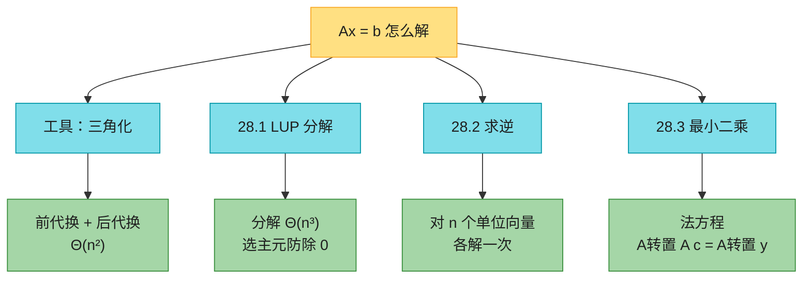
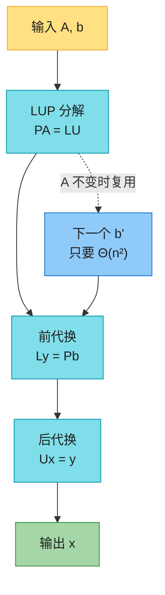
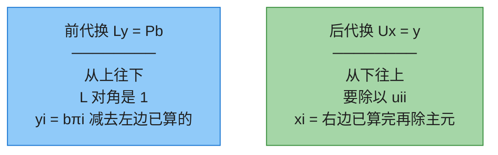
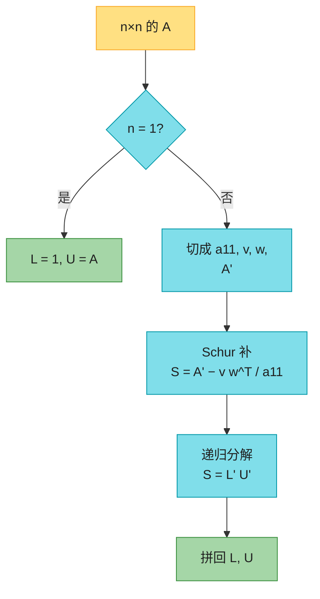
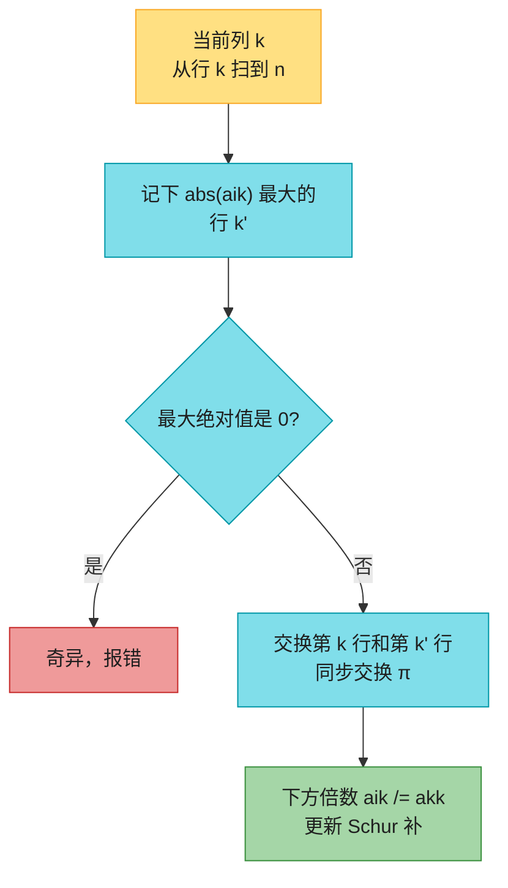
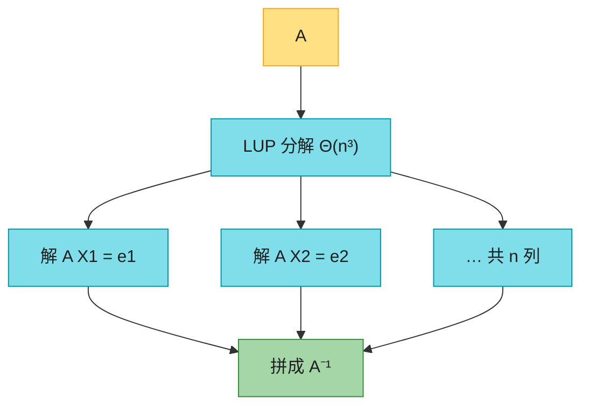
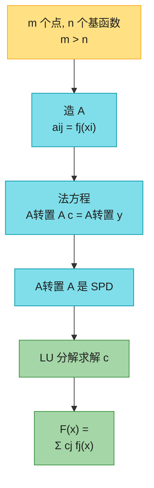
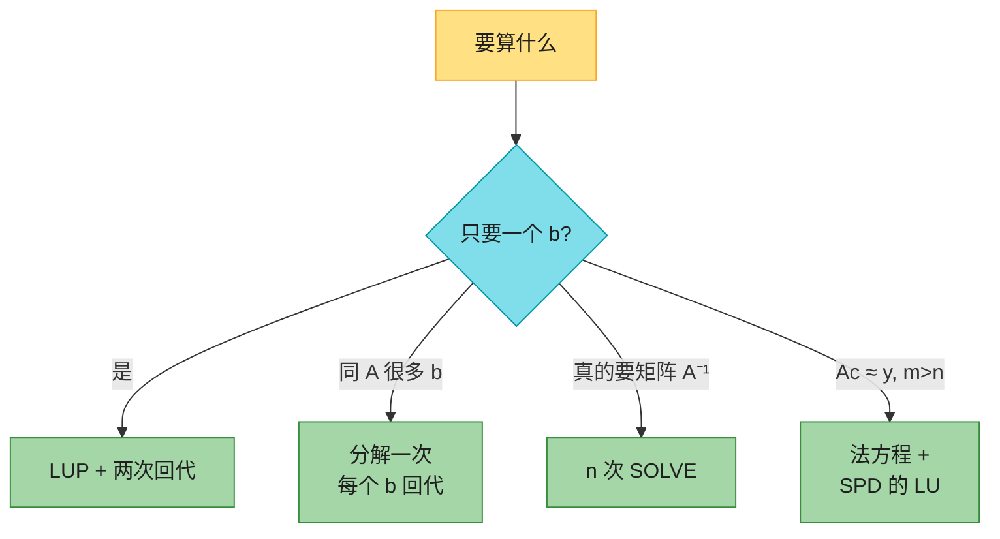

# 第 28 章：矩阵运算（Matrix Operations）——深度版

## 一、开篇定位

本章回答一个问题：**$n$ 个方程 $n$ 个未知数，怎么稳定、快速地解 $Ax=b$，以及方程个数多于未知数时怎么「凑合着拟合」？**科学计算的心脏几乎都是矩阵：电路的基尔霍夫定律、最小二乘曲线拟合、把一批右端项反复丢给同一个 $A$。原书不讲「怎么把浮点误差抠到最后一位」，那是数值分析的活（Higham）；本章给的是**算法骨架**：三角化、选主元、分解一次解多次、以及「求逆和乘法一样难」。

与前后章节的关系：

- **附录 D** 是本章的线性代数备忘：转置、逆、秩、对称、正定。拿不准 $A^{-1}$ 何时存在，先翻它；
- **第 4.2 节 Strassen** 把乘法从 $\Theta(n^3)$ 降到 $O(n^{\lg 7})$。本章证明：会乘就会求逆，渐近时间相同——所以 Strassen 的论文动机其实是「线性方程组能不能比高斯消元更快」；
- **第 23.1 节** 的 $(\min,+)$ 矩阵乘是另一套半环，别和本章的普通 $+,\times$ 搞混；
- **第 26.2 节** 把普通矩阵乘并行化，work 仍是 $\Theta(n^3)$，只是摊到多核上；
- **第 29 章线性规划** 的约束是不等式 $Ax\le b$，本章是等式 $Ax=b$；
- **第 33 章机器学习** 的回归，原型就是 28.3 的最小二乘。

做题定位：LeetCode **几乎不考手写 LUP**。能直接练的是转置 / 乘法这些前置操作（867、311）。竞赛里真正用到的是同一套消元思想换到 $\mathrm{GF}(2)$ 上——异或方程组、线性基。本章要带走的三句话：**解 $Ax=b$ 不要先求 $A^{-1}$**；**分解 $\Theta(n^3)$，之后每个右端项只要 $\Theta(n^2)$**；**超定方程组走法方程 $A^TAc=A^Ty$，不要硬凑精确解。**

**本章主线**：三角方程组的前代换 / 后代换 → LU（高斯消元）→ LUP（选主元）→ 求逆与「乘法 ≡ 求逆」→ 对称正定 + 最小二乘 → Java + Python → 速查 / 易混 → 题单与习题。



---

## 二、核心思想：分解一次，三角两次

大白话：直接算 $x=A^{-1}b$ 有两个问题——求逆本身就 $\Theta(n^3)$，而且数值上比消元更不稳。正确姿势是把 $A$ 拆成「好解」的三角阵：

$$PA=LU$$

- $L$：**单位下三角**（对角全是 1，上面全是 0）；
- $U$：**上三角**（下面全是 0）；
- $P$：**置换矩阵**（每行每列恰好一个 1，负责换行）。

$P$ 乘在左边 = 把方程重新排个序，解不变。于是 $Ax=b$ 变成 $LUx=Pb$，设 $y=Ux$，分两步：

1. 前代换解 $Ly=Pb$（从上往下，每个 $y_i$ 立刻能算）；
2. 后代换解 $Ux=y$（从下往上，每个 $x_i$ 立刻能算）。

分解 $\Theta(n^3)$ 只跟 $A$ 有关。同一个 $A$、换 100 个 $b$，分解只做一次，之后每个 $b$ 只需 $\Theta(n^2)$。



三种结局（本章只认真处理第一种）：

| 情形 | 含义 | 本章怎么做 |
|------|------|------------|
| 方阵、满秩 | 唯一解 | LUP，§3–§5 |
| 欠定（方程比未知数少，或秩 $<n$） | 无穷多解或无解 | 点到为止 |
| 超定（方程比未知数多） | 通常无精确解 | 最小二乘，§7 |

$P$ 不必真存成 $n\times n$ 矩阵。用数组 $\pi[1..n]$：$\pi[i]=j$ 表示 $P$ 的第 $i$ 行第 $j$ 列为 1，于是 $Pb$ 的第 $i$ 个分量就是 $b_{\pi[i]}$。

---

## 三、前代换与后代换（LUP-SOLVE）

### 3.1 直觉

下三角 $Ly=Pb$ 的第一行只有 $y_1$，直接等于 $b_{\pi[1]}$。把 $y_1$ 代入第二行得 $y_2$，再代入第三行……这叫**前代换**（forward substitution）。上三角反过来：最后一行只有 $x_n=y_n/u_{nn}$，再往上代，叫**后代换**（back substitution）。



每算一个未知数要扫已经算过的那些，总共 $1+2+\cdots+n=\Theta(n^2)$。没有三重循环，所以比分解便宜一个 $n$。

### 3.2 伪代码（1-indexed）

```text
LUP-SOLVE(L, U, π, b, n)
1  令 x, y 为长度为 n 的新向量
2  for i = 1 to n
3      y_i = b[π[i]] − Σ_{j=1}^{i−1} l_{ij} y_j
4  for i = n downto 1
5      x_i = (y_i − Σ_{j=i+1}^{n} u_{ij} x_j) / u_{ii}
6  return x
```

### 3.3 原书例子

$$
A=\begin{pmatrix}1&2&0\\3&4&4\\5&6&3\end{pmatrix},\quad
b=\begin{pmatrix}3\\7\\8\end{pmatrix}
$$

一组 LUP 分解（验证 $PA=LU$）：

$$
L=\begin{pmatrix}1&0&0\\0.2&1&0\\0.6&0.5&1\end{pmatrix},\quad
U=\begin{pmatrix}5&6&3\\0&0.8&-0.6\\0&0&2.5\end{pmatrix},\quad
P=\begin{pmatrix}0&0&1\\1&0&0\\0&1&0\end{pmatrix}
$$

$\pi=\langle 3,1,2\rangle$，所以 $Pb=\langle 8,3,7\rangle$。

前代换 $Ly=Pb$：

| 步 | 公式 | 结果 |
|----|------|------|
| $y_1$ | $8$ | $8$ |
| $y_2$ | $3-0.2\times 8$ | $1.4$ |
| $y_3$ | $7-0.6\times 8-0.5\times 1.4$ | $1.5$ |

后代换 $Ux=y$：

| 步 | 公式 | 结果 |
|----|------|------|
| $x_3$ | $1.5/2.5$ | $0.6$ |
| $x_2$ | $(1.4-(-0.6)\times 0.6)/0.8$ | $2.2$ |
| $x_1$ | $(8-6\times 2.2-3\times 0.6)/5$ | $-1.4$ |

所以 $x=\langle -1.4,\,2.2,\,0.6\rangle$。用 $Ax$ 回代能对上 $b$。

复杂度：$\Theta(n^2)$。前提是 $L,U,\pi$ 已经算好。

---

## 四、LU 分解：高斯消元（无选主元）

### 4.1 直觉

高中消元：用第 1 个方程消去下面所有 $x_1$，再用第 2 个消去下面所有 $x_2$，直到剩下上三角——那就是 $U$。每次「用第 $k$ 行去消第 $i$ 行」的倍数 $a_{ik}/a_{kk}$ 记下来，正好构成 $L$ 的第 $k$ 列（对角补 1）。

递归看更干净。把 $A$ 切成「左上角一个数 + 一条边 + 右下一块」：

$$
A=\begin{pmatrix}a_{11}&w^T\\ v&A'\end{pmatrix}
=\begin{pmatrix}1&0\\ v/a_{11}&I\end{pmatrix}
\begin{pmatrix}a_{11}&w^T\\ 0&S\end{pmatrix}
$$

其中 $S=A'-vw^T/a_{11}$ 叫关于 $a_{11}$ 的 **Schur 补**。对 $S$ 再做同样的事，拼回去就是 $A=LU$。$A$ 非奇异 ⇒ Schur 补也非奇异，所以能递归到底。

$a_{11}$（以及之后每个 Schur 补的左上角）叫**主元**（pivot），它们就是 $U$ 的对角线。主元是 0 就除零，算法崩了——这正是下一节要选主元的原因。有一类矩阵保证主元永远 $>0$：对称正定，见 §7。



### 4.2 伪代码（把递归改成循环）

```text
LU-DECOMPOSITION(A, n)
1  令 L, U 为新的 n×n 矩阵
2  把 U 的对角线以下填 0
3  把 L 的对角线填 1、以上填 0
4  for k = 1 to n
5      u_{kk} = a_{kk}
6      for i = k+1 to n
7          l_{ik} = a_{ik} / a_{kk}          // v 的分量
8          u_{ki} = a_{ki}                   // w 的分量
9      for i = k+1 to n                      // 算 Schur 补
10         for j = k+1 to n
11             a_{ij} = a_{ij} − l_{ik} u_{kj}
12 return L, U
```

三重循环 ⇒ $\Theta(n^3)$。第 11 行不必再除 $a_{kk}$，因为第 7 行已经除掉了。

工程优化：不必另开 $L$ 和 $U$。$i>j$ 的位置存 $l_{ij}$，$i\le j$ 的位置存 $u_{ij}$（$L$ 的对角 1 不用存）。原书 Figure 28.1 画的就是这个原地版本。

### 4.3 Figure 28.1 逐步表格

$A$ 的演变：横线以上是已经定下来的 $U$，竖线以左是已经定下来的 $L$（不含对角 1），右下是当前 Schur 补。**加粗**是本轮刚写入的格子。

**(a) 原始 $A$**

| | 1 | 2 | 3 | 4 |
|--|--|--|--|--|
| 1 | 2 | 3 | 1 | 5 |
| 2 | 6 | 13 | 5 | 19 |
| 3 | 2 | 19 | 10 | 23 |
| 4 | 4 | 10 | 11 | 31 |

**(b) $k=1$，主元 2。** $L$ 第一列倍数 $6/2,2/2,4/2=\langle 3,1,2\rangle$，第一行 $w^T$ 原样进 $U$。

| | 1 | 2 | 3 | 4 |
|--|--|--|--|--|
| 1 | **2** | **3** | **1** | **5** |
| 2 | **3** | **4** | **2** | **4** |
| 3 | **1** | **16** | **9** | **18** |
| 4 | **2** | **4** | **9** | **21** |

**(c) $k=2$，主元 4。** 倍数 $16/4,4/4=\langle 4,1\rangle$。

| | 1 | 2 | 3 | 4 |
|--|--|--|--|--|
| 1 | 2 | 3 | 1 | 5 |
| 2 | 3 | **4** | **2** | **4** |
| 3 | 1 | **4** | **1** | **2** |
| 4 | 2 | **1** | **7** | **17** |

**(d) $k=3$，主元 1。** 倍数 $7/1=7$，右下角 $17-7\times 2=3$ 成为最后一个 $u_{44}$。

| | 1 | 2 | 3 | 4 |
|--|--|--|--|--|
| 1 | 2 | 3 | 1 | 5 |
| 2 | 3 | 4 | 2 | 4 |
| 3 | 1 | 4 | **1** | **2** |
| 4 | 2 | 1 | **7** | **3** |

拆开：

$$
L=\begin{pmatrix}1&0&0&0\\3&1&0&0\\1&4&1&0\\2&1&7&1\end{pmatrix},\quad
U=\begin{pmatrix}2&3&1&5\\0&4&2&4\\0&0&1&2\\0&0&0&3\end{pmatrix}
$$

$LU$ 逐格等于原来的 $A$。

$k=n$ 那一轮（习题 28.1-7）：内层循环是空的，只是把 $u_{nn}=a_{nn}$ 抄进 $U$。可以省，但伪代码这样写更整齐。

---

## 五、LUP 分解：选主元（28.1 后半）

### 5.1 直觉

LU 在主元为 0 时除零；主元绝对值很小时，用一个很小的数去除，浮点误差会被放大。对策：**部分选主元**（partial pivoting）——在当前列、当前行及以下，挑绝对值最大的那个，整行对调到主元位置。换行 = 左乘一个置换，所以最终是 $PA=LU$ 而不是 $A=LU$。

第一列不可能全 0（否则 $A$ 奇异）。换完行之后 $a_{k1}\ne 0$，Schur 补仍然非奇异，递归能做下去。原书证明：每个非奇异方阵都有 LUP 分解。



为什么整行都要换、不只换主元那一个数？因为后面递归得到的置换 $P'$ 既乘在 Schur 补上，也乘在已经写下的倍数 $v/a_{k1}$ 上——对应代码里 $L$ 已经写进 $A$ 左部的那些数，必须跟着行一起走。

### 5.2 伪代码（原地，$L$ 和 $U$ 挤在 $A$ 里）

```text
LUP-DECOMPOSITION(A, n)
1  令 π[1..n] 为新数组
2  for i = 1 to n
3      π[i] = i                              // 恒等置换
4  for k = 1 to n
5      p = 0
6      for i = k to n                        // 当前列找最大绝对值
7          if |a_{ik}| > p
8              p = |a_{ik}|
9              k' = i
10     if p == 0
11         error "singular matrix"
12     交换 π[k] 与 π[k']
13     for i = 1 to n
14         交换 a_{ki} 与 a_{k'i}            // 整行对调
15     for i = k+1 to n
16         a_{ik} = a_{ik} / a_{kk}
17         for j = k+1 to n
18             a_{ij} = a_{ij} − a_{ik} a_{kj}
```

结束后：

$$
a_{ij}=\begin{cases}l_{ij}&i>j\\ u_{ij}&i\le j\end{cases}
$$

同样 $\Theta(n^3)$。选主元只是外层循环里多扫一列，常数因子，不改变阶。

$k=n$ 那一轮（习题 28.1-7）**不能省**：还要检查最后一个主元是不是 0，否则会把奇异矩阵漏过去。换行此时是自己和自己换，消元循环为空。

### 5.3 Figure 28.2 要点

$$
A=\begin{pmatrix}2&0&2&0.6\\3&3&4&-2\\5&5&4&2\\-1&-2&3.4&-1\end{pmatrix}
$$

第一列绝对值最大的是第 3 行的 5，把第 1、3 行对调，再除、再更新 Schur 补；对剩下的 $3\times 3$ 重复。最终：

$$
\pi=\langle 3,1,4,2\rangle,\quad
L=\begin{pmatrix}1&0&0&0\\0.4&1&0&0\\-0.2&0.5&1&0\\0.6&0&0.4&1\end{pmatrix},\quad
U=\begin{pmatrix}5&5&4&2\\0&-2&0.4&-0.2\\0&0&4&-0.5\\0&0&0&-3\end{pmatrix}
$$

$PA=LU$ 逐格成立。$\pi=\langle 3,1,4,2\rangle$ 的意思是：$PA$ 的第 1 行是原来的第 3 行，第 2 行是原来的第 1 行，以此类推。

顺带一个免费礼物：$\det(L)=1$，$\det(U)=\prod u_{ii}$，$\det(P)=\mathrm{sgn}(\pi)$（置换奇偶），所以

$$\det(A)=\mathrm{sgn}(\pi)\prod_{i=1}^n u_{ii}$$

不要用 $|\det(A)|$ 判断「好不好算」——那不是条件数。章末注记里 Golub–Van Loan 建议看 $\|A\|_1\|A^{-1}\|_1$。

---

## 六、求逆与「乘法 ≡ 求逆」（28.2）

### 6.1 用 LUP 求 $A^{-1}$

$AX=I$ 的第 $i$ 列是 $AX_i=e_i$。LUP 分解只做一次，然后对 $n$ 个单位向量各跑一遍 LUP-SOLVE：



每个右端项 $\Theta(n^2)$，$n$ 个一共 $\Theta(n^3)$，加上分解仍是 $\Theta(n^3)$。

**实战：只是要解 $Ax=b$，就算了逆再乘 $b$ 也是 $\Theta(n^3)+\Theta(n^2)$，常数更大、更不稳。求逆留给「真的需要矩阵」的场合。**

同一个分解解 $k$ 个不同的 $b$，总时间 $\Theta(n^3+kn^2)$。$k\ll n$ 时比「求一次逆再乘 $k$ 次」更划算。

### 6.2 理论桥梁：会乘就会求逆

记 $M(n)$ 为两个 $n\times n$ 矩阵相乘的时间，$I(n)$ 为求一个非奇异 $n\times n$ 矩阵的逆的时间。在很宽的正则条件下（多项式、带对数因子都满足）：

$$M(n)=\Theta(I(n))$$

**求逆 ⇒ 乘法**（Winograd）：构造 $3n\times 3n$ 块矩阵，乘积 $AB$ 藏在它的逆的右上角。

$$
D=\begin{pmatrix}I&A&0\\0&I&B\\0&0&I\end{pmatrix},\qquad
D^{-1}=\begin{pmatrix}I&-A&AB\\0&I&-B\\0&0&I\end{pmatrix}
$$

造 $D$ 只要 $\Theta(n^2)$，求一次 $3n$ 阶逆就把 $AB$ 取出来。所以 $M(n)=O(I(n))$。

**乘法 ⇒ 求逆**（Aho–Hopcroft–Ullman）：对称正定矩阵可以四分，Schur 补 $S=D-CB^{-1}C^T$，逆由 $B^{-1}$ 和 $S^{-1}$ 拼出来——2 次 $n/2$ 求逆 + 4 次 $n/2$ 乘法。递归式

$$I(n)=2I(n/2)+\Theta(M(n))\ \to\ O(M(n))$$

一般可逆矩阵 $A$ 先变成 $A^TA$（对称正定），用

$$A^{-1}=(A^TA)^{-1}A^T$$

三次 $O(M(n))$ 的步骤做完。$n$ 不是 2 的幂就嵌进更大的 $\mathrm{diag}(A,I_k)$ 再求逆，阶不变。

直觉：Strassen 把 $M(n)$ 做成 $O(n^{\lg 7})$，求逆也自动变成 $O(n^{\lg 7})$。原书强调这套归约**理论上正确**；数值上 $A^TA$ 的条件数是 $A$ 的平方，LUP 仍然更常用。

---

## 七、对称正定与最小二乘（28.3）

### 7.1 对称正定（SPD）

$A$ 对称（$A=A^T$）且对所有 $x\ne 0$ 有 $x^TAx>0$，就叫对称正定。三条做题够用的结论：

| 结论 | 直觉 |
|------|------|
| SPD ⇒ 非奇异 | 若 $Ax=0$ 且 $x\ne 0$，则 $x^TAx=0$，矛盾 |
| 每个顺序主子阵也 SPD | 把 $x$ 后面补 0，二次型退化为子阵的二次型 |
| Schur 补也 SPD | 「配平方」之后剩下的那一块就是 Schur 补 |
| **LU 永不除零，主元全 $>0$** | 第一个主元 $a_{11}=e_1^TAe_1>0$，之后每步的 Schur 补仍 SPD |

对角元全为正（取 $e_i$）；最大元一定在对角上（否则构造一个 $x$ 让二次型 $\le 0$）。工程上 SPD 常用 **Cholesky** $A=LL^T$（$L$ 下三角，对角不必是 1），flops 大约是 LU 的一半；原书不写 Cholesky 伪代码，只用「LU 对 SPD 安全」这一事实。

### 7.2 最小二乘：方程太多，求「误差平方和最小」的 $c$

$m$ 个数据点 $(x_i,y_i)$，想用 $n$ 个基函数的线性组合去拟合（$n<m$）：

$$F(x)=\sum_{j=1}^n c_j f_j(x)$$

多项式就是 $f_j(x)=x^{j-1}$。写成矩阵 $Ac\approx y$，$A$ 是 $m\times n$，$a_{ij}=f_j(x_i)$。精确解一般不存在——$m$ 个方程 $n$ 个未知数，超定。改最小化误差向量 $\eta=Ac-y$ 的欧氏范数 $\|\eta\|_2$，等价于最小化 $\sum\eta_i^2$。

对每个 $c_k$ 求导并令其为 0，得到**法方程**（normal equation）：

$$A^TAc=A^Ty$$

$A$ 列满秩 ⇒ $A^TA$ 对称正定 ⇒ 可用 LU（不必选主元）求解。形式解

$$c=(A^TA)^{-1}A^Ty=A^+y$$

$A^+=(A^TA)^{-1}A^T$ 叫 **Moore–Penrose 伪逆**：方阵可逆时它就是 $A^{-1}$；瘦高矩阵时它给出最小二乘解。



$n=m$ 能插值过每一个点，但会把噪声也拟合进去，拿去预测新 $x$ 通常更差。$n$ 明显小于 $m$，才是在抓趋势。

### 7.3 原书二次拟合

五点 $(-1,2),\ (1,1),\ (2,1),\ (3,0),\ (5,3)$，基函数 $\{1,x,x^2\}$：

$$
A=\begin{pmatrix}
1&-1&1\\
1&1&1\\
1&2&4\\
1&3&9\\
1&5&25
\end{pmatrix},\quad
y=\begin{pmatrix}2\\1\\1\\0\\3\end{pmatrix}
$$

$c=A^+y\approx\langle 1.200,\ -0.757,\ 0.214\rangle$，即

$$F(x)=1.200-0.757x+0.214x^2$$

原书 Figure 28.3 里橙点是数据、蓝点是 $F(x_i)$，竖线是误差。实战中不必显式形成 $A^+$：算 $A^Ty$，再对 $A^TA$ 做一次 LU。

Figure 28.4 的 Keeling 曲线说明基函数不必是多项式：对夏威夷 CO₂ 用 $\{1,x,x^2,\sin(2\pi x),\cos(2\pi x)\}$，二次项抓逐年加速上升，正余弦抓季节波动。

---

## 八、代码实现（Java + Python）

索引约定：伪代码 1-indexed（$\pi[i]$、$a_{ik}$），代码 0-indexed（`pi[i]`、`a[i][k]`）。原地 LUP 约定不变：$i>j$ 存 $L$，$i\le j$ 存 $U$，$L$ 对角隐式为 1。

下面两份从本文原样抽出即可编译运行；`main` 核对 Figure 28.1 / 28.2、LUP-SOLVE 例子、最小二乘系数，并用随机对角占优矩阵对拍 $Ax$ 与 $b$、$AA^{-1}$ 与 $I$。

### 8.1 Java

```java
import java.util.Arrays;
import java.util.Random;

public class MatrixOps {
    static final double EPS = 1e-8;

    static double[][] copy(double[][] a) {
        double[][] b = new double[a.length][];
        for (int i = 0; i < a.length; i++) b[i] = Arrays.copyOf(a[i], a[i].length);
        return b;
    }

    static double[][] zeros(int n, int m) {
        return new double[n][m];
    }

    static double[][] identity(int n) {
        double[][] I = zeros(n, n);
        for (int i = 0; i < n; i++) I[i][i] = 1;
        return I;
    }

    static double[][] transpose(double[][] a) {
        int n = a.length, m = a[0].length;
        double[][] t = zeros(m, n);
        for (int i = 0; i < n; i++)
            for (int j = 0; j < m; j++) t[j][i] = a[i][j];
        return t;
    }

    static double[][] mul(double[][] a, double[][] b) {
        int n = a.length, p = a[0].length, m = b[0].length;
        double[][] c = zeros(n, m);
        for (int i = 0; i < n; i++)
            for (int k = 0; k < p; k++)
                for (int j = 0; j < m; j++)
                    c[i][j] += a[i][k] * b[k][j];
        return c;
    }

    static double[] matVec(double[][] a, double[] x) {
        int n = a.length, m = a[0].length;
        double[] y = new double[n];
        for (int i = 0; i < n; i++)
            for (int j = 0; j < m; j++) y[i] += a[i][j] * x[j];
        return y;
    }

    static void swapRows(double[][] a, int i, int j) {
        double[] t = a[i];
        a[i] = a[j];
        a[j] = t;
    }

    /** LU 无选主元。返回 {L, U}；主元为 0 则抛异常。不修改入参。 */
    static double[][][] luDecompose(double[][] A) {
        int n = A.length;
        double[][] a = copy(A);
        double[][] L = identity(n);
        double[][] U = zeros(n, n);
        for (int k = 0; k < n; k++) {
            if (Math.abs(a[k][k]) == 0) throw new IllegalArgumentException("zero pivot");
            U[k][k] = a[k][k];
            for (int i = k + 1; i < n; i++) {
                L[i][k] = a[i][k] / a[k][k];
                U[k][i] = a[k][i];
            }
            for (int i = k + 1; i < n; i++)
                for (int j = k + 1; j < n; j++)
                    a[i][j] -= L[i][k] * U[k][j];
        }
        return new double[][][] { L, U };
    }

    /**
     * 原地 LUP。返回 π（0-indexed：pi[i] 是现在第 i 行对应的原始行号）。
     * 结束后 a[i][j] 在 i>j 存 L、i<=j 存 U。
     */
    static int[] lupDecompose(double[][] a) {
        int n = a.length;
        int[] pi = new int[n];
        for (int i = 0; i < n; i++) pi[i] = i;
        for (int k = 0; k < n; k++) {
            double p = 0;
            int kp = k;
            for (int i = k; i < n; i++) {
                double v = Math.abs(a[i][k]);
                if (v > p) { p = v; kp = i; }
            }
            if (p == 0) throw new IllegalArgumentException("singular matrix");
            int tmp = pi[k]; pi[k] = pi[kp]; pi[kp] = tmp;
            swapRows(a, k, kp);
            for (int i = k + 1; i < n; i++) {
                a[i][k] /= a[k][k];
                for (int j = k + 1; j < n; j++)
                    a[i][j] -= a[i][k] * a[k][j];
            }
        }
        return pi;
    }

    static double[] lupSolve(double[][] lu, int[] pi, double[] b) {
        int n = lu.length;
        double[] y = new double[n];
        double[] x = new double[n];
        for (int i = 0; i < n; i++) {
            double s = b[pi[i]];
            for (int j = 0; j < i; j++) s -= lu[i][j] * y[j];
            y[i] = s;
        }
        for (int i = n - 1; i >= 0; i--) {
            double s = y[i];
            for (int j = i + 1; j < n; j++) s -= lu[i][j] * x[j];
            x[i] = s / lu[i][i];
        }
        return x;
    }

    static double[] solve(double[][] A, double[] b) {
        double[][] lu = copy(A);
        int[] pi = lupDecompose(lu);
        return lupSolve(lu, pi, b);
    }

    static double[][] invert(double[][] A) {
        int n = A.length;
        double[][] lu = copy(A);
        int[] pi = lupDecompose(lu);
        double[][] inv = zeros(n, n);
        for (int col = 0; col < n; col++) {
            double[] e = new double[n];
            e[col] = 1;
            double[] x = lupSolve(lu, pi, e);
            for (int i = 0; i < n; i++) inv[i][col] = x[i];
        }
        return inv;
    }

    /** 超定最小二乘：解 A^T A c = A^T y。A 为 m×n，m>=n。 */
    static double[] leastSquares(double[][] A, double[] y) {
        double[][] At = transpose(A);
        return solve(mul(At, A), matVec(At, y));
    }

    static double det(double[][] A) {
        double[][] lu = copy(A);
        int[] pi = lupDecompose(lu);
        double d = 1;
        for (int i = 0; i < lu.length; i++) d *= lu[i][i];
        int swaps = 0;
        // sgn(π)：写成循环分解，每个长度 l 的循环贡献 (l-1) 个对换
        boolean[] vis = new boolean[pi.length];
        for (int i = 0; i < pi.length; i++) {
            if (vis[i]) continue;
            int len = 0, j = i;
            while (!vis[j]) { vis[j] = true; j = pi[j]; len++; }
            if (len > 0) swaps += len - 1;
        }
        return (swaps % 2 == 0 ? 1 : -1) * d;
    }

    static boolean close(double[] a, double[] b) {
        if (a.length != b.length) return false;
        for (int i = 0; i < a.length; i++)
            if (Math.abs(a[i] - b[i]) > 1e-6) return false;
        return true;
    }

    static boolean closeMat(double[][] a, double[][] b) {
        if (a.length != b.length) return false;
        for (int i = 0; i < a.length; i++) {
            if (a[i].length != b[i].length) return false;
            for (int j = 0; j < a[i].length; j++)
                if (Math.abs(a[i][j] - b[i][j]) > 1e-6) return false;
        }
        return true;
    }

    static double maxAbs(double[][] a) {
        double m = 0;
        for (double[] row : a)
            for (double v : row) m = Math.max(m, Math.abs(v));
        return m;
    }

    public static void main(String[] args) {
        // Figure 28.1 LU
        double[][] Afig = {
            {2, 3, 1, 5},
            {6, 13, 5, 19},
            {2, 19, 10, 23},
            {4, 10, 11, 31}
        };
        double[][][] lu = luDecompose(Afig);
        double[][] L1 = {
            {1, 0, 0, 0},
            {3, 1, 0, 0},
            {1, 4, 1, 0},
            {2, 1, 7, 1}
        };
        double[][] U1 = {
            {2, 3, 1, 5},
            {0, 4, 2, 4},
            {0, 0, 1, 2},
            {0, 0, 0, 3}
        };
        if (!closeMat(lu[0], L1) || !closeMat(lu[1], U1))
            throw new AssertionError("fig 28.1 LU");
        if (!closeMat(mul(L1, U1), Afig)) throw new AssertionError("fig 28.1 LU product");

        // LUP-SOLVE 例子
        double[][] Aex = {{1, 2, 0}, {3, 4, 4}, {5, 6, 3}};
        double[] bex = {3, 7, 8};
        double[] xex = solve(Aex, bex);
        if (!close(xex, new double[] {-1.4, 2.2, 0.6}))
            throw new AssertionError("lup-solve example " + Arrays.toString(xex));

        // Figure 28.2 LUP
        double[][] A2 = {
            {2, 0, 2, 0.6},
            {3, 3, 4, -2},
            {5, 5, 4, 2},
            {-1, -2, 3.4, -1}
        };
        double[][] work = copy(A2);
        int[] pi = lupDecompose(work);
        if (!Arrays.equals(pi, new int[] {2, 0, 3, 1}))
            throw new AssertionError("fig 28.2 pi " + Arrays.toString(pi));
        double[][] L2 = {
            {1, 0, 0, 0},
            {0.4, 1, 0, 0},
            {-0.2, 0.5, 1, 0},
            {0.6, 0, 0.4, 1}
        };
        double[][] U2 = {
            {5, 5, 4, 2},
            {0, -2, 0.4, -0.2},
            {0, 0, 4, -0.5},
            {0, 0, 0, -3}
        };
        double[][] Lgot = identity(4), Ugot = zeros(4, 4);
        for (int i = 0; i < 4; i++)
            for (int j = 0; j < 4; j++) {
                if (i > j) Lgot[i][j] = work[i][j];
                else Ugot[i][j] = work[i][j];
            }
        if (!closeMat(Lgot, L2) || !closeMat(Ugot, U2))
            throw new AssertionError("fig 28.2 LU factors");
        double[][] P = zeros(4, 4);
        for (int i = 0; i < 4; i++) P[i][pi[i]] = 1;
        if (maxAbs(add(mul(P, A2), scale(mul(L2, U2), -1))) > 1e-9)
            throw new AssertionError("fig 28.2 PA != LU");

        // 需要选主元：[[0,1],[1,0]]
        double[] xsw = solve(new double[][] {{0, 1}, {1, 0}}, new double[] {4, 3});
        if (!close(xsw, new double[] {3, 4})) throw new AssertionError("pivot swap");

        // 28.1-1 前代换
        double[] yfwd = solve(new double[][] {{1, 0, 0}, {4, 1, 0}, {-6, 5, 1}}, new double[] {3, 14, -7});
        if (!close(yfwd, new double[] {3, 2, 1})) throw new AssertionError("28.1-1");

        // 28.1-2 LU
        double[][][] lu12 = luDecompose(new double[][] {{4, -5, 6}, {8, -6, 7}, {12, -7, 12}});
        double[][] L12 = {{1, 0, 0}, {2, 1, 0}, {3, 2, 1}};
        double[][] U12 = {{4, -5, 6}, {0, 4, -5}, {0, 0, 4}};
        if (!closeMat(lu12[0], L12) || !closeMat(lu12[1], U12)) throw new AssertionError("28.1-2");

        // 28.1-3
        double[] x13 = solve(new double[][] {{1, 5, 4}, {2, 0, 3}, {5, 8, 2}}, new double[] {12, 9, 5});
        if (!close(x13, new double[] {-3.0 / 19, -1.0 / 19, 59.0 / 19})) throw new AssertionError("28.1-3");

        // 最小二乘 Figure 28.3
        double[][] Als = {
            {1, -1, 1},
            {1, 1, 1},
            {1, 2, 4},
            {1, 3, 9},
            {1, 5, 25}
        };
        double[] yls = {2, 1, 1, 0, 3};
        double[] cls = leastSquares(Als, yls);
        if (!close(cls, new double[] {1.2, -0.757142857, 0.214285714}))
            throw new AssertionError("least squares " + Arrays.toString(cls));

        // 28-1 三对角
        double[][] Atri = {
            {1, -1, 0, 0, 0},
            {-1, 2, -1, 0, 0},
            {0, -1, 2, -1, 0},
            {0, 0, -1, 2, -1},
            {0, 0, 0, -1, 2}
        };
        if (!close(solve(Atri, new double[] {1, 1, 1, 1, 1}), new double[] {15, 14, 12, 9, 5}))
            throw new AssertionError("28-1 b");
        double[][] invT = invert(Atri);
        double[][] expectInv = {
            {5, 4, 3, 2, 1},
            {4, 4, 3, 2, 1},
            {3, 3, 3, 2, 1},
            {2, 2, 2, 2, 1},
            {1, 1, 1, 1, 1}
        };
        if (!closeMat(invT, expectInv)) throw new AssertionError("28-1 inv");

        // 随机对拍：对角占优 ⇒ 可逆；SPD 走无主元 LU
        Random rng = new Random(28);
        for (int trial = 0; trial < 200; trial++) {
            int n = 2 + rng.nextInt(8);
            double[][] A = zeros(n, n);
            double[] b = new double[n];
            for (int i = 0; i < n; i++) {
                b[i] = rng.nextGaussian();
                double s = 0;
                for (int j = 0; j < n; j++) {
                    A[i][j] = rng.nextGaussian();
                    s += Math.abs(A[i][j]);
                }
                A[i][i] += s + 1; // 严格对角占优
            }
            double[] x = solve(A, b);
            double[] ax = matVec(A, x);
            for (int i = 0; i < n; i++)
                if (Math.abs(ax[i] - b[i]) > 1e-6)
                    throw new AssertionError("residual " + trial);
            double[][] inv = invert(A);
            double[][] Ierr = add(mul(A, inv), scale(identity(n), -1));
            if (maxAbs(Ierr) > 1e-6) throw new AssertionError("inverse " + trial);
            if (n <= 6 && Math.abs(det(A) - detViaPerm(A)) > 1e-4 * (1 + Math.abs(det(A))))
                throw new AssertionError("det " + trial);

            // SPD：G^T G + I，无主元 LU 必须成功
            double[][] G = zeros(n, n);
            for (int i = 0; i < n; i++)
                for (int j = 0; j < n; j++) G[i][j] = rng.nextGaussian();
            double[][] spd = add(mul(transpose(G), G), identity(n));
            double[][][] luSpd = luDecompose(spd);
            double[] yspd = new double[n];
            for (int i = 0; i < n; i++) yspd[i] = rng.nextGaussian();
            // 用 L、U 做前/后代换（P = I）
            int[] id = new int[n];
            for (int i = 0; i < n; i++) id[i] = i;
            double[][] packed = zeros(n, n);
            for (int i = 0; i < n; i++)
                for (int j = 0; j < n; j++)
                    packed[i][j] = (i > j) ? luSpd[0][i][j] : luSpd[1][i][j];
            double[] xspd = lupSolve(packed, id, yspd);
            double[] chk = matVec(spd, xspd);
            for (int i = 0; i < n; i++)
                if (Math.abs(chk[i] - yspd[i]) > 1e-6)
                    throw new AssertionError("spd lu " + trial);
        }

        // 最小二乘：无噪声应精确恢复；有噪声应满足法方程
        for (int trial = 0; trial < 50; trial++) {
            int m = 8 + rng.nextInt(8), n = 2 + rng.nextInt(4);
            double[][] A = zeros(m, n);
            double[] cTrue = new double[n];
            for (int j = 0; j < n; j++) {
                cTrue[j] = rng.nextGaussian();
                for (int i = 0; i < m; i++) A[i][j] = rng.nextGaussian();
            }
            // 让列线性无关：给对角加一点
            for (int j = 0; j < n; j++) A[j][j] += 3;
            double[] y = matVec(A, cTrue);
            double[] cHat = leastSquares(A, y);
            if (!close(cHat, cTrue)) throw new AssertionError("ls exact " + trial);
            double[] yN = Arrays.copyOf(y, m);
            for (int i = 0; i < m; i++) yN[i] += 0.01 * rng.nextGaussian();
            double[] cN = leastSquares(A, yN);
            double[][] At = transpose(A);
            double[] resid = matVec(At, minus(matVec(A, cN), yN));
            for (double r : resid)
                if (Math.abs(r) > 1e-6) throw new AssertionError("normal eq");
        }

        System.out.println("all tests passed");
    }

    static double[][] add(double[][] a, double[][] b) {
        double[][] c = zeros(a.length, a[0].length);
        for (int i = 0; i < a.length; i++)
            for (int j = 0; j < a[0].length; j++) c[i][j] = a[i][j] + b[i][j];
        return c;
    }

    static double[][] scale(double[][] a, double s) {
        double[][] c = zeros(a.length, a[0].length);
        for (int i = 0; i < a.length; i++)
            for (int j = 0; j < a[0].length; j++) c[i][j] = a[i][j] * s;
        return c;
    }

    static double[] minus(double[] a, double[] b) {
        double[] c = new double[a.length];
        for (int i = 0; i < a.length; i++) c[i] = a[i] - b[i];
        return c;
    }

    /** 仅用于对拍：排列展开 det，n≤9 */
    static double detViaPerm(double[][] A) {
        int n = A.length;
        int[] p = new int[n];
        for (int i = 0; i < n; i++) p[i] = i;
        return detPermRec(A, p, 0);
    }

    static double detPermRec(double[][] A, int[] p, int i) {
        int n = A.length;
        if (i == n) {
            double prod = 1;
            for (int r = 0; r < n; r++) prod *= A[r][p[r]];
            int inv = 0;
            for (int a = 0; a < n; a++)
                for (int b = a + 1; b < n; b++)
                    if (p[a] > p[b]) inv++;
            return (inv % 2 == 0 ? 1 : -1) * prod;
        }
        double s = 0;
        for (int j = i; j < n; j++) {
            int t = p[i]; p[i] = p[j]; p[j] = t;
            s += detPermRec(A, p, i + 1);
            t = p[i]; p[i] = p[j]; p[j] = t;
        }
        return s;
    }
}
```

`det` 的符号来自置换 $\pi$ 的奇偶：把 $\pi$ 拆成循环，长度为 $\ell$ 的循环是 $\ell-1$ 个对换。随机对拍里用排列展开（$n\le 9$）核对。

### 8.2 Python

```python
import random
import math


EPS = 1e-8


def copy(a):
    return [row[:] for row in a]


def zeros(n, m=None):
    if m is None:
        m = n
    return [[0.0] * m for _ in range(n)]


def identity(n):
    I = zeros(n)
    for i in range(n):
        I[i][i] = 1.0
    return I


def transpose(a):
    n, m = len(a), len(a[0])
    t = zeros(m, n)
    for i in range(n):
        for j in range(m):
            t[j][i] = a[i][j]
    return t


def mul(a, b):
    n, p, m = len(a), len(a[0]), len(b[0])
    c = zeros(n, m)
    for i in range(n):
        for k in range(p):
            aik = a[i][k]
            for j in range(m):
                c[i][j] += aik * b[k][j]
    return c


def mat_vec(a, x):
    return [sum(a[i][j] * x[j] for j in range(len(x))) for i in range(len(a))]


def close(a, b, tol=1e-6):
    return len(a) == len(b) and all(abs(x - y) <= tol for x, y in zip(a, b))


def close_mat(a, b, tol=1e-6):
    return all(close(r1, r2, tol) for r1, r2 in zip(a, b))


def max_abs(a):
    return max(abs(v) for row in a for v in row)


def add(a, b):
    return [[a[i][j] + b[i][j] for j in range(len(a[0]))] for i in range(len(a))]


def scale(a, s):
    return [[v * s for v in row] for row in a]


def minus(a, b):
    return [x - y for x, y in zip(a, b)]


def lu_decompose(A):
    n = len(A)
    a = copy(A)
    L, U = identity(n), zeros(n)
    for k in range(n):
        if a[k][k] == 0:
            raise ValueError("zero pivot")
        U[k][k] = a[k][k]
        for i in range(k + 1, n):
            L[i][k] = a[i][k] / a[k][k]
            U[k][i] = a[k][i]
        for i in range(k + 1, n):
            for j in range(k + 1, n):
                a[i][j] -= L[i][k] * U[k][j]
    return L, U


def lup_decompose(a):
    n = len(a)
    pi = list(range(n))
    for k in range(n):
        p, kp = 0.0, k
        for i in range(k, n):
            v = abs(a[i][k])
            if v > p:
                p, kp = v, i
        if p == 0:
            raise ValueError("singular matrix")
        pi[k], pi[kp] = pi[kp], pi[k]
        a[k], a[kp] = a[kp], a[k]
        for i in range(k + 1, n):
            a[i][k] /= a[k][k]
            for j in range(k + 1, n):
                a[i][j] -= a[i][k] * a[k][j]
    return pi


def lup_solve(lu, pi, b):
    n = len(lu)
    y = [0.0] * n
    x = [0.0] * n
    for i in range(n):
        s = b[pi[i]]
        for j in range(i):
            s -= lu[i][j] * y[j]
        y[i] = s
    for i in range(n - 1, -1, -1):
        s = y[i]
        for j in range(i + 1, n):
            s -= lu[i][j] * x[j]
        x[i] = s / lu[i][i]
    return x


def solve(A, b):
    lu = copy(A)
    pi = lup_decompose(lu)
    return lup_solve(lu, pi, b)


def invert(A):
    n = len(A)
    lu = copy(A)
    pi = lup_decompose(lu)
    inv = zeros(n)
    for col in range(n):
        e = [0.0] * n
        e[col] = 1.0
        x = lup_solve(lu, pi, e)
        for i in range(n):
            inv[i][col] = x[i]
    return inv


def least_squares(A, y):
    At = transpose(A)
    return solve(mul(At, A), mat_vec(At, y))


def det(A):
    lu = copy(A)
    pi = lup_decompose(lu)
    d = 1.0
    for i in range(len(lu)):
        d *= lu[i][i]
    vis = [False] * len(pi)
    swaps = 0
    for i in range(len(pi)):
        if vis[i]:
            continue
        length, j = 0, i
        while not vis[j]:
            vis[j] = True
            j = pi[j]
            length += 1
        swaps += length - 1
    return (1 if swaps % 2 == 0 else -1) * d


def det_via_perm(A):
    n = len(A)
    p = list(range(n))

    def rec(i):
        if i == n:
            prod = 1.0
            for r in range(n):
                prod *= A[r][p[r]]
            inv = sum(1 for a in range(n) for b in range(a + 1, n) if p[a] > p[b])
            return (1 if inv % 2 == 0 else -1) * prod
        s = 0.0
        for j in range(i, n):
            p[i], p[j] = p[j], p[i]
            s += rec(i + 1)
            p[i], p[j] = p[j], p[i]
        return s

    return rec(0)


def main():
    Afig = [
        [2, 3, 1, 5],
        [6, 13, 5, 19],
        [2, 19, 10, 23],
        [4, 10, 11, 31],
    ]
    L, U = lu_decompose(Afig)
    L1 = [[1, 0, 0, 0], [3, 1, 0, 0], [1, 4, 1, 0], [2, 1, 7, 1]]
    U1 = [[2, 3, 1, 5], [0, 4, 2, 4], [0, 0, 1, 2], [0, 0, 0, 3]]
    assert close_mat(L, L1) and close_mat(U, U1)
    assert close_mat(mul(L1, U1), Afig)

    xex = solve([[1, 2, 0], [3, 4, 4], [5, 6, 3]], [3, 7, 8])
    assert close(xex, [-1.4, 2.2, 0.6])

    A2 = [
        [2, 0, 2, 0.6],
        [3, 3, 4, -2],
        [5, 5, 4, 2],
        [-1, -2, 3.4, -1],
    ]
    work = copy(A2)
    pi = lup_decompose(work)
    assert pi == [2, 0, 3, 1]
    L2 = [[1, 0, 0, 0], [0.4, 1, 0, 0], [-0.2, 0.5, 1, 0], [0.6, 0, 0.4, 1]]
    U2 = [[5, 5, 4, 2], [0, -2, 0.4, -0.2], [0, 0, 4, -0.5], [0, 0, 0, -3]]
    Lgot, Ugot = identity(4), zeros(4)
    for i in range(4):
        for j in range(4):
            if i > j:
                Lgot[i][j] = work[i][j]
            else:
                Ugot[i][j] = work[i][j]
    assert close_mat(Lgot, L2) and close_mat(Ugot, U2)
    P = zeros(4)
    for i, j in enumerate(pi):
        P[i][j] = 1
    assert max_abs(add(mul(P, A2), scale(mul(L2, U2), -1))) < 1e-9

    assert close(solve([[0, 1], [1, 0]], [4, 3]), [3, 4])
    assert close(solve([[1, 0, 0], [4, 1, 0], [-6, 5, 1]], [3, 14, -7]), [3, 2, 1])
    L12, U12 = lu_decompose([[4, -5, 6], [8, -6, 7], [12, -7, 12]])
    assert close_mat(L12, [[1, 0, 0], [2, 1, 0], [3, 2, 1]])
    assert close_mat(U12, [[4, -5, 6], [0, 4, -5], [0, 0, 4]])
    assert close(
        solve([[1, 5, 4], [2, 0, 3], [5, 8, 2]], [12, 9, 5]),
        [-3 / 19, -1 / 19, 59 / 19],
    )

    Als = [[1, -1, 1], [1, 1, 1], [1, 2, 4], [1, 3, 9], [1, 5, 25]]
    cls = least_squares(Als, [2, 1, 1, 0, 3])
    assert close(cls, [1.2, -0.757142857, 0.214285714])

    At = [
        [1, -1, 0, 0, 0],
        [-1, 2, -1, 0, 0],
        [0, -1, 2, -1, 0],
        [0, 0, -1, 2, -1],
        [0, 0, 0, -1, 2],
    ]
    assert close(solve(At, [1, 1, 1, 1, 1]), [15, 14, 12, 9, 5])
    expect_inv = [
        [5, 4, 3, 2, 1],
        [4, 4, 3, 2, 1],
        [3, 3, 3, 2, 1],
        [2, 2, 2, 2, 1],
        [1, 1, 1, 1, 1],
    ]
    assert close_mat(invert(At), expect_inv)

    rng = random.Random(28)
    for trial in range(200):
        n = rng.randint(2, 9)
        A = zeros(n)
        b = [rng.gauss(0, 1) for _ in range(n)]
        for i in range(n):
            s = 0.0
            for j in range(n):
                A[i][j] = rng.gauss(0, 1)
                s += abs(A[i][j])
            A[i][i] += s + 1
        x = solve(A, b)
        ax = mat_vec(A, x)
        assert all(abs(ax[i] - b[i]) < 1e-6 for i in range(n)), trial
        Ierr = add(mul(A, invert(A)), scale(identity(n), -1))
        assert max_abs(Ierr) < 1e-6, trial
        if n <= 6:
            d1, d2 = det(A), det_via_perm(A)
            assert abs(d1 - d2) < 1e-4 * (1 + abs(d1)), trial

        G = [[rng.gauss(0, 1) for _ in range(n)] for _ in range(n)]
        spd = add(mul(transpose(G), G), identity(n))
        Ls, Us = lu_decompose(spd)
        packed = zeros(n)
        for i in range(n):
            for j in range(n):
                packed[i][j] = Ls[i][j] if i > j else Us[i][j]
        yspd = [rng.gauss(0, 1) for _ in range(n)]
        xspd = lup_solve(packed, list(range(n)), yspd)
        chk = mat_vec(spd, xspd)
        assert all(abs(chk[i] - yspd[i]) < 1e-6 for i in range(n)), trial

    for trial in range(50):
        m, n = rng.randint(8, 15), rng.randint(2, 5)
        A = [[rng.gauss(0, 1) for _ in range(n)] for _ in range(m)]
        for j in range(n):
            A[j][j] += 3
        c_true = [rng.gauss(0, 1) for _ in range(n)]
        y = mat_vec(A, c_true)
        assert close(least_squares(A, y), c_true), trial
        yN = [y[i] + 0.01 * rng.gauss(0, 1) for i in range(m)]
        cN = least_squares(A, yN)
        resid = mat_vec(transpose(A), minus(mat_vec(A, cN), yN))
        assert all(abs(r) < 1e-6 for r in resid)

    # 28.3-6：F(x)=c1 + c2 x lg x + c3 e^x，lg = log2
    xs = [1, 2, 3, 4]
    ys = [1, 1, 3, 8]
    A36 = [[1.0, x * math.log2(x), math.exp(x)] for x in xs]
    c36 = least_squares(A36, ys)
    assert close(c36, [0.41173294, -0.20486764, 0.16954468], tol=1e-6)

    print("all tests passed")


if __name__ == "__main__":
    main()
```

Java / Python 对拍约定：同一组 Figure 数据上 $L,U,\pi,x$ 必须一致；随机对角占优系统的残差 $\|Ax-b\|_\infty$、$\|AA^{-1}-I\|_\infty$ 均 $<10^{-6}$；SPD 样本必须能走通无主元 LU。

---

## 九、复杂度速查 + 易混点对比

### 9.1 速查表

| 问题 / 算法 | 时间 | 备注 |
|-------------|------|------|
| 前代换 / 后代换 | $\Theta(n^2)$ | 三角系统；$L$ 对角为 1，前代换不用除法 |
| LU 分解 | $\Theta(n^3)$ | 无选主元；主元 0 即失败 |
| LUP 分解 | $\Theta(n^3)$ | 部分选主元；非奇异方阵一定成功 |
| 解一个 $Ax=b$ | $\Theta(n^3)$ | 分解主导 |
| 同 $A$、再解一个 $b'$ | $\Theta(n^2)$ | 复用 $L,U,\pi$ |
| 求 $A^{-1}$（LUP） | $\Theta(n^3)$ | $n$ 次 SOLVE |
| 求 $A^{-1}$（Strassen 归约） | $O(M(n))$ | 与乘法同阶 |
| $\det(A)$ | $\Theta(n^3)$ | $\mathrm{sgn}(\pi)\prod u_{ii}$ |
| 法方程最小二乘 | $\Theta(n^2m+n^3)$ | 造 $A^TA$ 要 $\Theta(n^2m)$，再分解 $n\times n$ |
| 三对角 SPD（思考题 28-1） | $O(n)$ | 带宽 1，消元不填入 |

乘法与求逆：$M(n)=\Theta(I(n))$。平方矩阵与乘法同阶（习题 28.2-1）；布尔矩阵乘与传递闭包差一个 $\lg n$（28.2-3，对照第 23.2 节）。

### 9.2 易混点对比

| 易混点 | 辨析 |
|-------|------|
| 解 $Ax=b$ 先求 $A^{-1}$ | 渐近同是 $\Theta(n^3)$，常数更大、更不稳。分解一次 + 两次三角回代 |
| LU vs LUP | LU 假定 $P=I$，主元为 0 就崩。LUP 换行，$PA=LU$。能 LU 的一定能 LUP，反过来不必 |
| $L$ 的对角 | 单位下三角：对角**固定为 1**，不用存。$U$ 的对角才是主元 |
| 原地存储 $i>j$ vs $i\ge j$ | $i>j$ 是 $L$（不含 1），$i\le j$ 是 $U$（含对角）。写错一个等号整列全错 |
| 选主元只换一个数 | 必须换整行，连已经写下的 $L$ 倍数一起走 |
| Schur 补 = 余子式 | 不是。$S=A'-vw^T/a_{11}$ 是消元后右下角那一块 |
| SPD ⇒ 正的特征值 / 正的对角 | 对角正是必要但不充分（`[[1,2],[2,1]]` 对角正但不定）。充分常用「顺序主子式全 $>0$」 |
| Cholesky vs LU | 原书对 SPD 用 LU（对角 1 + $U$）。工程用 $A=LL^T$，大约一半 flops，仍 $O(n^3)$ |
| 伪逆 = 逆 | 方阵可逆时 $A^+=A^{-1}$。瘦高满列秩时 $A^+=(A^TA)^{-1}A^T$，给出最小二乘解，不是精确解 |
| 过拟合 | $n=m$ 能过所有点，也会过噪声。最小二乘的意义是 $n\ll m$ |
| $\det(A)$ 很小 ⇒ 病态 | 不一定。$\mathrm{diag}(10^{-3},\ldots,10^{-3})$ 的 det 极小但条件数是 1。看 $\kappa=\|A\|\|A^{-1}\|$ |
| 第 23 章矩阵乘 | 那里是 $(\min,+)$，本章是普通 $+,\times$。构造可以类比（$3n$ 块矩阵），运算不是一回事 |
| GF(2) 上定理 28.2 | 不行（习题 28.2-4）。正定、$A^TA$ 在特征 2 里失效。异或消元要直接在 $\mathrm{GF}(2)$ 上做 LUP |
| 并行矩阵乘（第 26 章） | 加速的是乘法本身；解方程仍要消元或迭代，不能靠「多核把 $n^3$ 变小」 |



---

## 十、LeetCode 题单 + 习题快问快答

### 10.1 LeetCode 题单

定位语：**不考手写高斯消元**。力扣矩阵题多数是遍历 / 模拟；本章的价值是面试里能讲清「为什么不求逆」、以及竞赛里把消元搬到 $\mathrm{GF}(2)$。

| 题号 | 题目 | 难度 | 考点 |
|-----|------|------|------|
| 867 | 转置矩阵 | 简 | $A^T$；法方程、$(A^TA)^{-1}A^T$ 都要用 |
| 311 | 稀疏矩阵乘法 | 中 | $M(n)$ 的建模；稠密三重循环是本章默认乘法 |
| 1570 | 两个稀疏向量的点积 | 中 | 行·列，矩阵乘的原子操作 |
| 48 | 旋转图像 | 中 | 转置 + 行翻转，不是分解 |
| 73 | 矩阵置零 | 中 | 原地标记，别写成消元 |
| 240 | 搜索二维矩阵 II | 中 | 杨氏矩阵（思考题 6-3），和 LU 无关 |
| 70 | 爬楼梯 | 简 | 对照第 4 章矩阵快速幂：递推用乘幂，方程组用分解 |

竞赛向（力扣几乎没有）：高斯消元解线性方程组（模意义 / 实数）、异或方程组、线性基。把本章 LUP 的「选主元 + 消元」改成异或（加法和减法都是 XOR，乘法是 AND）即可。

### 10.2 习题快问快答（第四版编号）

- **28.1-1** 前代换：$y_1=3$，$y_2=14-4\cdot 3=2$，$y_3=-7-(-6)\cdot 3-5\cdot 2=1$。答案 $\langle 3,2,1\rangle$。
- **28.1-2** $L=\begin{pmatrix}1&0&0\\2&1&0\\3&2&1\end{pmatrix}$，$U=\begin{pmatrix}4&-5&6\\0&4&-5\\0&0&4\end{pmatrix}$。
- **28.1-3** $x=\langle -3/19,\ -1/19,\ 59/19\rangle$。
- **28.1-4** 非奇异对角阵：$\pi=\mathrm{id}$，$L=I$，$U=A$。奇异时 LUP 会在某个零对角元上报错；但零对角阵本身仍有 LU（$L=I,U=A$），见 28.1-6。
- **28.1-5** 置换矩阵 $A$：$PA=LU$ 且 $L$ 单位下三角、$U$ 上三角。置换阵要同时是下三角和上三角，只能是 $I$，故 $L=U=I$、$P=A^{-1}=A^T$。唯一。
- **28.1-6** 例如全零阵，或 $\begin{pmatrix}1&1\\1&1\end{pmatrix}=\begin{pmatrix}1&0\\1&1\end{pmatrix}\begin{pmatrix}1&1\\0&0\end{pmatrix}$。奇异 ≠ 没有 LU，只是 LUP 伪代码会因「整列全 0」报错。
- **28.1-7** LU：最后一轮只抄 $u_{nn}$，可并进初始化。LUP：**不能省**，要检查最后一个主元非 0。
- **28.2-1** 平方是乘法的特例，$S(n)=O(M(n))$。反过来，把 $\begin{pmatrix}0&A\\B&0\end{pmatrix}$ 平方，左上角是 $AB$，所以 $M(n)=O(S(2n))$；正则条件下与 $S(n)$ 同阶。
- **28.2-2** 递归 Schur 补本身是一次外积（矩阵乘）+ 一块 $n/2$ 的 LUP，所以 LUP 也能做到 $O(M(n))$（不必等于伪代码产出的那组 $L,U,P$）。
- **28.2-3** $(I\lor A)^{2^k}$ 重复平方 ⇒ 传递闭包 $O(M(n)\lg n)$。反过来用 $3n$ 块矩阵 $\begin{pmatrix}I&A&0\\0&I&B\\0&0&I\end{pmatrix}$ 的闭包右上角是 $AB$。
- **28.2-4** 不行。模 2 没有「正定」；$A^TA$ 在 $\mathrm{GF}(2)$ 上即使 $A$ 可逆也可能奇异。
- **28.2-5** 把转置改成共轭转置 $A^*$，对称改成 Hermitian（$A=A^*$），$A^*A$ 仍正定（对 $x\ne 0$，$x^*A^*Ax=\|Ax\|^2>0$）。
- **28.3-1** $a_{ii}=e_i^TAe_i>0$。
- **28.3-2** $x^TAx=a(x_1+(b/a)x_2)^2+(c-b^2/a)x_2^2$。取 $x=(1,0)$ 得 $a>0$，再取让第一项消失的 $x$ 得 $ac-b^2>0$。
- **28.3-3** 若 $|a_{ij}|>a_{ii}$（$i\ne j$），取 $x$ 在 $i$ 处为 1、$j$ 处为 $-\mathrm{sgn}(a_{ij})$，二次型 $\le 0$。
- **28.3-4** 顺序主子阵 SPD ⇒ 非奇异且特征值全正 ⇒ 行列式 $>0$（Sylvester 判据的一半）。
- **28.3-5** 消元不改变「当前主元 = 当前 Schur 补的左上角」，而 $\det(A_k)=\det(A_{k-1})\cdot u_{kk}$，故第 $k$ 个主元 $=\det(A_k)/\det(A_{k-1})$（约定 $\det(A_0)=1$）。
- **28.3-6** $F(x)=c_1+c_2 x\lg x+c_3 e^x$（$\lg=\log_2$）。$c\approx\langle 0.412,\ -0.205,\ 0.170\rangle$，预测值约 $\langle 0.873,1.255,2.843,8.030\rangle$。
- **28.3-7** 这四条就是 Moore–Penrose 伪逆的定义方程。满列秩时 $A^+=(A^TA)^{-1}A^T$ 逐条代入即可验证。

### 10.3 思考题选

- **28-1 三对角方程组**：$A$ 只在对角和两条次对角有非零。LU 不填入，每步常数时间，总 $O(n)$。原书 5×5 例子：$L$ 对角 1、次对角全 $-1$；$U$ 对角全 1、上对角全 $-1$。$Ax=\mathbf{1}$ 的解是 $\langle 15,14,12,9,5\rangle$；$A^{-1}$ 的第 $(i,j)$ 项（1-indexed）等于 $n+1-\max(i,j)$，逆是稠密的。任何基于显式 $A^{-1}$ 的方法最坏至少要写 $n^2$ 个数（逆是稠密的），比 $O(n)$ 回代慢一个量级。一般非奇异三对角用 LUP，选主元可能破坏带宽，但仍 $O(n)$（每列最多看常数个候选）。
- **28-2 三次样条**：相邻两节点之间一段三次多项式，拼接点要求值连续、一阶导连续；自然样条再要求两端二阶导为 0。未知量改成各节点一阶导 $D_i$ 之后，连续性变成三对角系统（对角 4、次对角 1，两端对角 2）。由 28-1，$O(n)$ 可解。节点间距不等时矩阵仍三对角，系数改成依赖 $h_i=x_{i+1}-x_i$，还是 $O(n)$。

### 10.4 章末注记

数值与科学计算的可读教材：Golub–Van Loan、Press 等的 *Numerical Recipes*、Strang 的线性代数、George–Liu（稀疏直接法）。Golub–Van Loan 说明 $\det(A)$ 不是稳定性指标，建议用 $\|A\|_1\|A^{-1}\|_1$，并且不必真去求逆就能估计它。

高斯消元是最早的系统解线性方程组的方法之一，通常归功于 Gauss（其实更早的文献已有）。Strassen 证明 $n\times n$ 矩阵可在 $O(n^{\lg 7})$ 时间求逆；「乘法不比求逆变难」是 Winograd，「求逆不比乘法变难」是 Aho–Hopcroft–Ullman。

另一类重要分解是 **SVD**：$A=Q_1\Sigma Q_2^T$，$\Sigma$ 只在对角非零，$Q_1,Q_2$ 列标准正交。最小二乘在 $A$ 列不满秩时要用 SVD（伪逆改用奇异值的倒数），本章的法方程对付不了这种退化。细节见 Strang、Golub–Van Loan。

---

## 参考资料

- Cormen, T. H., Leiserson, C. E., Rivest, R. L., & Stein, C. (2022). *Introduction to Algorithms* (4th ed.). MIT Press. Chapter 28: Matrix Operations, pp. 819–849.
- Golub, G. H., & Van Loan, C. F. *Matrix Computations*.
- Higham, N. J. *Accuracy and Stability of Numerical Algorithms*.
- Strassen, V. (1969). Gaussian elimination is not optimal. *Numerische Mathematik*.
- Aho, A. V., Hopcroft, J. E., & Ullman, J. D. *The Design and Analysis of Computer Algorithms*.
- Strang, G. *Introduction to Linear Algebra* / *Linear Algebra and Its Applications*.
