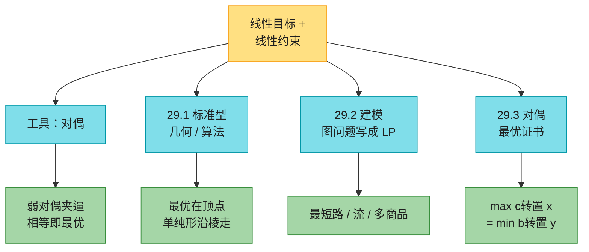
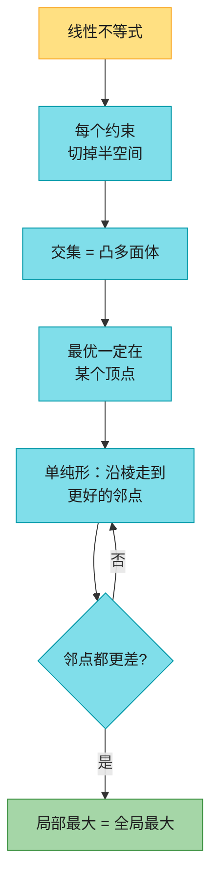
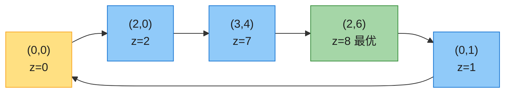
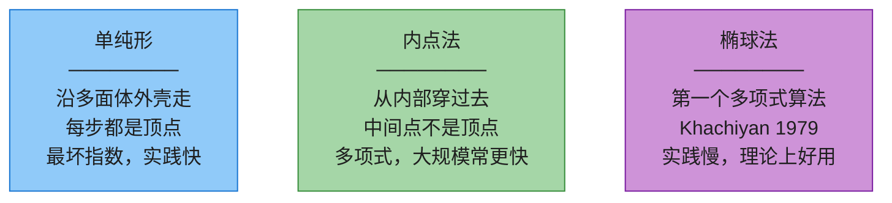
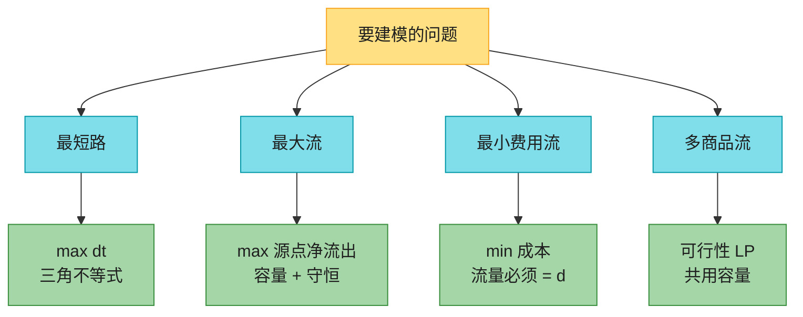
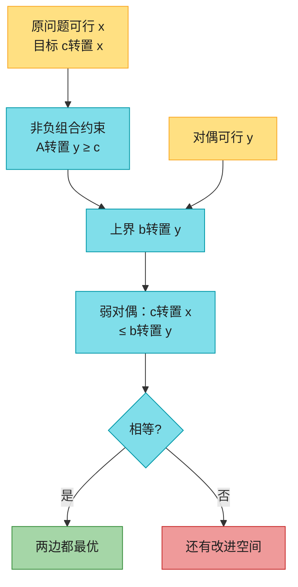
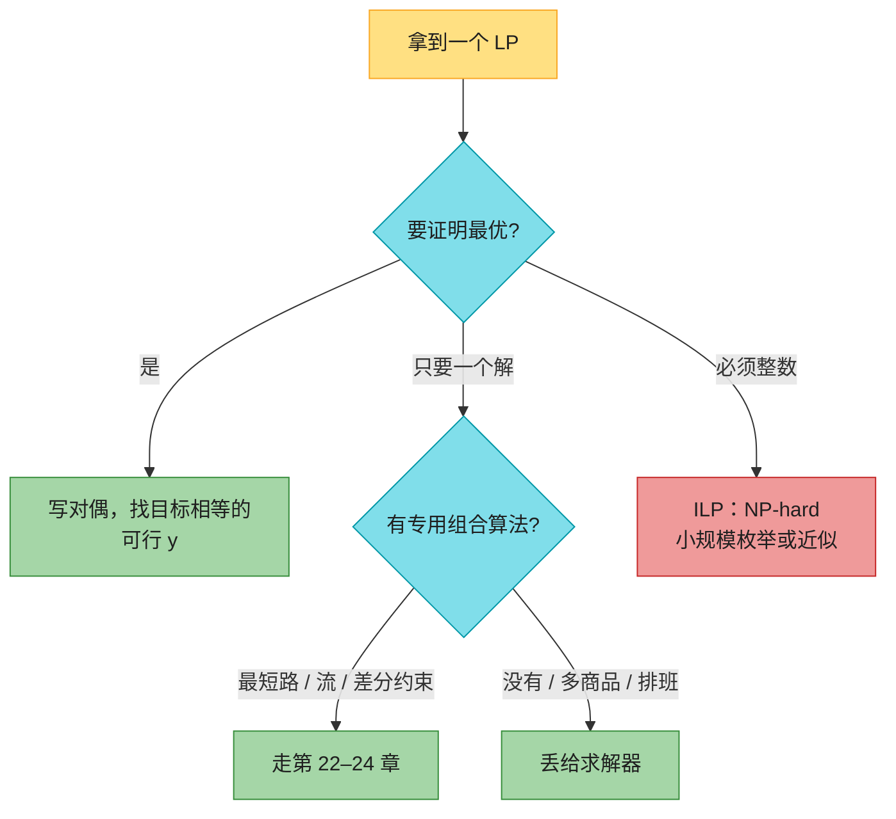

# 第 29 章：线性规划（Linear Programming）——深度版

## 一、开篇定位

本章回答一个问题：**目标是线性函数、限制也是线性不等式时，怎么建模，以及怎么证明「这组解已经不能更好」？**排班、选址、广告预算、网络里同时运多种货——决策变量一多，试错立刻失效。写成线性规划（LP）之后，有多项式时间算法（椭球法、内点法），实践里用得最多的是单纯形法：最坏指数，通常很快。

第四版相对第三版的关键改动：**删掉了单纯形法的完整表格推演**（前言原话：math heavy without really conveying many algorithmic ideas）。本章要带走的不是「手推 tableau」，而是两件事：

1. **建模**：决策变量、线性约束、线性目标——认出来就能丢给求解器；
2. **对偶**：每个最大化问题自带一个最小化问题，可行值互相夹逼，相等就是最优证书。最大流 = 最小割是它最著名的特例。

与前后章节的关系：

- **第 28 章**解的是等式 $Ax=b$；本章是不等式 $Ax\le b$。超定最小二乘是「等式凑不齐时改平方」，LP 是「资源不够时改不等式」；
- **第 22.4 节差分约束**是本章的特例：每条约束只有一个 $+1$ 和一个 $-1$，Bellman-Ford 就能判可行；
- **第 24 章最大流最小割**是对偶性的图论版：流值 ≤ 任何割，相等 ⇒ 两边都最优；
- **第 25.3 节匈牙利算法**是原始-对偶方法：一边长匹配，一边降标号，直到两边目标碰上；
- **第 34 章**：变量必须取整数 → 整数线性规划（ILP），连可行性都是 NP-hard；
- **第 35.4 节**用 LP 做近似：先解松弛，再随机舍入。

做题定位：LeetCode **不考手写单纯形**。能直接练的是「建成图再跑专用算法」——最短路（743、787）、二分图匹配（1820、1349）。本章真正要带走的三句话：**能写成多项式规模的 LP，就有多项式算法**；**对偶给出上界/下界证书，不必先证明最优**；**加一行「x 必须是整数」，问题从 P 掉进 NP-hard。**

**本章主线**：标准型与改写 → 可行域是凸多面体、最优在顶点 → 单纯形 / 内点法直觉 → 最短路、最大流、最小费用流、多商品流的 LP 写法 → 弱对偶 / 强对偶 / 互补松弛 → Java + Python（两阶段单纯形）→ 速查 / 易混 → 题单与习题。



---

## 二、核心思想：可行域是凸的，最优在顶点

大白话：每个线性不等式切掉半个空间，剩下的交集叫**可行域**。线性不等式的交集一定是**凸**的——两点可行，线段上每个点都可行。线性函数在凸集上的最大值，不可能藏在肚子里：沿梯度方向一直推，最后一定顶在边界的某个**顶点**（或整条棱，两端仍是顶点）。

所以求解 LP 不必检查无穷多个点，只要在有限个顶点里找。单纯形法就是：**从一个顶点走到目标不减的邻点，直到所有邻点都更差**。凸 + 线性 ⇒ 局部最大就是全局最大。



三种结局（基本定理，29.5）：

| 结局 | 含义 | 怎么认 |
|------|------|--------|
| 有限最优 | 可行域非空且目标有界 | 对偶也可行，两边目标相等 |
| 不可行 | 约束自相矛盾 | 对偶无界（或两边都不可行） |
| 无界 | 可行域朝目标方向伸到无穷 | 对偶不可行 |

LP **不允许严格不等式**（$<$ / $>$）。开半空间可能没有顶点，最大值可能逼近边界却取不到。

---

## 三、标准型与改写

### 3.1 标准型（第四版）

约定：最大化、小于等于、变量非负。

$$
\begin{align*}
\text{maximize}\quad & c^T x \\
\text{subject to}\quad & Ax \le b \\
& x \ge 0
\end{align*}
$$

$A$ 是 $m\times n$，$x,c$ 是 $n$ 维，$b$ 是 $m$ 维。$c^T x$ 叫**目标函数**，$x\ge 0$ 叫**非负约束**。

术语：满足全部约束的 $\bar x$ 是**可行解**，目标最大的可行解是**最优解**。没有可行解 → **不可行**；可行但目标能随便大 → **无界**。可行域无界 ≠ 问题无界（习题 29.1-5：$\max -x_1$，约束 $x\ge 0$，可行域无界，最优值 0）。

### 3.2 任意 LP 都能改成标准型

| 原来 | 改法 |
|------|------|
| 最小化 $c^T x$ | 最大化 $-c^T x$，最优解相同，目标差一个负号 |
| 等式 $a_i^T x = b_i$ | 拆成 $a_i^T x \le b_i$ 且 $-a_i^T x \le -b_i$ |
| $\ge$ 约束 | 两边乘 $-1$，方向翻成 $\le$ |
| 要把 $\le$ 变成等式 | 加**松弛变量** $s\ge 0$：$a_i^T x + s = b_i$ |
| 自由变量 $x_j$ | 拆成 $x_j = x_j^+ - x_j^-$，$x_j^+,x_j^-\ge 0$ |
| $x_j \le 0$ | 令 $x_j' = -x_j$，变成非负 |

规模只增加多项式：每个等式变 2 条不等式，每个自由变量变 2 个非负变量。

### 3.3 开篇政治问题（Figure 29.1）

四种广告（单位：千美元），三种选民（单位：千票）。花 $1{,}000 买一种政策，赢得（或失去）的千票数：

| 政策 | 城市 | 郊区 | 农村 |
|------|------|------|------|
| 僵尸末日预案 $x_1$ | $-2$ | $5$ | $3$ |
| 给鲨鱼装激光 $x_2$ | $8$ | $2$ | $-5$ |
| 飞行汽车公路 $x_3$ | $0$ | $0$ | $10$ |
| 海豚投票权 $x_4$ | $10$ | $0$ | $-2$ |

目标：城市 / 郊区 / 农村至少赢得 $50/100/25$ 千票，广告费最少。$x_i\ge 0$（没有负成本广告）。

$$
\begin{align*}
\text{minimize}\quad & x_1+x_2+x_3+x_4 \\
\text{subject to}\quad & -2x_1+8x_2+10x_4 \ge 50 \\
& 5x_1+2x_2 \ge 100 \\
& 3x_1-5x_2+10x_3-2x_4 \ge 25 \\
& x \ge 0
\end{align*}
$$

原书试了一组 $(20,0,4,9)$，花费 $33$，得票 $(50,100,82)$。第七节的单纯形给出最优

$$
x^\star = \Bigl\langle \tfrac{2050}{111},\ \tfrac{425}{111},\ 0,\ \tfrac{625}{111}\Bigr\rangle \approx \langle 18.47,\ 3.83,\ 0,\ 5.63\rangle,
$$

花费 $3100/111\approx 27.93$，三条得票约束**全部取等**（飞行汽车广告 $x_3=0$，农村票刚好 25，不必多买）。可行解可以「赢得比登记选民还多的票」（模型不管登记人数），但最优解不会：多赢的票对目标没有好处，还可能更贵（习题 29.1-8）。

---

## 四、二维几何与单纯形直觉（29.1）

### 4.1 两个变量：把约束画出来

原书例子：

$$
\begin{align*}
\text{maximize}\quad & x_1 + x_2 \\
\text{subject to}\quad & 4x_1 - x_2 \le 8 \\
& 2x_1 + x_2 \le 10 \\
& 5x_1 - 2x_2 \ge -2 \\
& x_1,x_2 \ge 0
\end{align*}
$$

可行域是五边形，顶点与目标 $z=x_1+x_2$：

| 顶点 | 紧约束 | $z$ |
|------|--------|-----|
| $(0,0)$ | $x_1=0,\ x_2=0$ | $0$ |
| $(2,0)$ | $4x_1-x_2=8,\ x_2=0$ | $2$ |
| $(3,4)$ | $4x_1-x_2=8,\ 2x_1+x_2=10$ | $7$ |
| **$(2,6)$** | $2x_1+x_2=10,\ 5x_1-2x_2=-2$ | **$8$** |
| $(0,1)$ | $x_1=0,\ 5x_1-2x_2=-2$ | $1$ |

把 $x_1+x_2=z$ 看成斜率为 $-1$ 的平行线族，从原点往外推，最后贴住的顶点就是 $(2,6)$。若某条边与目标线平行，整条边都最优，两端仍是顶点——**总存在一个最优顶点**。



高维同样：每个约束是半空间，交集叫单纯形（simplex，这里是「凸多面体」的习惯叫法，不必是正单纯形）。目标变成超平面，最优仍在顶点。

### 4.2 单纯形法在做什么

从一个顶点出发，每次沿一条棱走到目标不减的邻点。邻点全部更差就停。凸性保证这就是全局最优。对偶（第六节）给出「停下来确实最优」的证书，不必再扫其余顶点。

**Bland 规则**（教学实现用）：有多个可进基变量时选下标最小的，有多个可出基时也选下标最小的——避免循环（cycling）。

最坏情况可以走指数个顶点（Klee–Minty 立方体，$2^n-1$ 步）。实践中通常很快；Spielman–Teng 的**平滑分析**给了「微扰之后期望多项式」的理论解释。网络单纯形是它在流问题上的特化，最短路 / 最大流 / 最小费用流都有多项式变种。

### 4.3 三类算法对照



原书不给这三类的伪代码。能用求解器就用求解器；下面第七节给的两阶段单纯形是为了把「顶点行走 + 不可行 / 无界检测」跑通，不是工业实现（数值稳定性、稀疏、预处理都没做）。

### 4.4 整数线性规划：加一行就变难

要求 $x$ 取整数 → **ILP**。习题 34.5-3：连「有没有可行整数解」都是 NP-hard。一般 LP 在 P 里，ILP 不在（除非 P = NP）。弱对偶对 ILP 仍成立（整数解也是实数解）；强对偶**不**成立——原、对偶的整数最优之间可以夹着一段间隙（思考题 29-3：$IP \le P = D \le ID$）。

LeetCode 标注：背包 / 划分（416、698、473）本质是 0-1 ILP，规模小才可枚举；不要幻想「写成 LP 再要求整数」会变容易。

---

## 五、把图问题建成 LP（29.2）

专用算法（Dijkstra、Edmonds-Karp）几乎总比通用 LP 快。LP 的价值是：**变种没有现成算法时，写成多项式规模的 LP 就等于给出了多项式算法**。多商品流至今没有比「建成 LP 再内点法」更好的多项式算法。

变量改下标：最短路距离写成 $d_v$ 而不是 $v.d$，边上的流写成 $f_{uv}$ 而不是 $(u,v).f$。输入仍用 $w(u,v)$、$c(u,v)$。



### 5.1 最短路

单对 $s\rightsquigarrow t$：变量 $d_v$（每个顶点一个），最大化 $d_t$，约束是三角不等式加上源点钉死：

$$
\begin{align*}
\text{maximize}\quad & d_t \\
\text{subject to}\quad & d_v \le d_u + w(u,v) && \forall (u,v)\in E \\
& d_s = 0
\end{align*}
$$

**必须最大化**。非负权下把所有 $d_v$ 设成 0 永远可行；最小化会得到这组废话。最大化把每条 $d_v$ 往上推，直到被所有入边不等式卡住——卡住的值就是最短路。

陷阱：只最大化 $d_t$ 时，**只有 $d_t$ 保证等于 $\delta(s,t)$**。其他 $d_v$ 可以偏小（只要不挡住 $d_t$）。Figure 22.2 上 $s\rightsquigarrow x$ 的单对 LP 会给出 $d_x=9$，但 $d_z$ 可能是 $2$ 而不是真正的 $11$。单源版本把目标改成 $\max\sum_v d_v$，跑出来就是 $(d_s,d_t,d_x,d_y,d_z)=(0,3,9,5,11)$（习题 29.2-2）。

$|V|$ 个变量，$|E|+1$ 条约束。有负权环时可行域无界（$d$ 可以 $-\infty$），和 Bellman-Ford 的「无定义」一致。

LeetCode 标注：743 / 787 用 Dijkstra 或 Bellman-Ford，不要真的丢给单纯形。

### 5.2 最大流

$$
\begin{align*}
\text{maximize}\quad & \sum_v f_{sv} - \sum_v f_{vs} \\
\text{subject to}\quad & f_{uv} \le c(u,v) && \forall u,v \\
& \sum_v f_{uv} = \sum_v f_{vu} && \forall u\notin\{s,t\} \\
& f_{uv} \ge 0
\end{align*}
$$

原书为了记号对每个顶点对都设了变量（不在 $E$ 里的容量当 0），约束 $2|V|^2+|V|-2$ 条。习题 29.2-4：只给真正的边设变量，约束变成 $O(V+E)$——求解器友好得多。Figure 24.1(a) 的最优值是 $23$，与 Edmonds-Karp 一致。

路径形式（习题 29.2-6）：每条 $s\rightsquigarrow t$ 简单路径一个变量 $x_P$，目标 $\max\sum x_P$，每条边的路径之和 ≤ 容量。$p$ 可以是指数条（$\le |V|!$），所以这是合法 LP，但不是多项式规模——不能拿它当「多项式算法」。

### 5.3 最小费用流

每条边额外有成本 $a(u,v)$，要求恰好运送需求 $d$，最小化 $\sum a(u,v)\,f_{uv}$。约束 = 最大流的容量 + 守恒，再加「源点净流出 $= d$」。

Figure 29.3：要送 $4$ 个单位。边（容量，成本）为

| 边 | $c$ | $a$ | 最优流 |
|----|-----|-----|--------|
| $s\to x$ | $5$ | $2$ | $2$ |
| $s\to y$ | $2$ | $5$ | $2$ |
| $x\to y$ | $1$ | $3$ | $1$ |
| $x\to t$ | $2$ | $7$ | $1$ |
| $y\to t$ | $4$ | $1$ | $3$ |

成本 $2\cdot 2 + 5\cdot 2 + 3\cdot 1 + 7\cdot 1 + 1\cdot 3 = 27$。存在专用多项式算法（原书不讲）；写成 LP 立刻能解。

### 5.4 多商品流

$k$ 种货物，第 $i$ 种从 $s_i$ 运 $d_i$ 到 $t_i$，共用边容量：$\sum_i f_{i,uv}\le c(u,v)$。没有目标（可行性问题），目标函数写 $0$。**已知的多项式算法就是「建成 LP + 多项式 LP 求解器」**。再加成本就变成最小费用多商品流（习题 29.2-7）。

### 5.5 差分约束（回指 22.4）

$x_j - x_i \le b_k$ 是 LP 的特例。可行 ⇔ 约束图没有负环，Bellman-Ford 比通用单纯形合适得多。

---

## 六、对偶：最优值的证书（29.3）

### 6.1 机械规则

标准型原问题（primal）和对偶（dual）：

| | 原问题 | 对偶 |
|--|--------|------|
| 目标 | $\max\ c^T x$ | $\min\ b^T y$ |
| 约束 | $Ax \le b$ | $A^T y \ge c$ |
| 符号 | $x\ge 0$ | $y\ge 0$ |

操作口诀：最大化改最小化；右边 $b$ 与目标 $c$ 互换；$A$ 转置；$\le$ 翻成 $\ge$。原问题第 $i$ 条约束 ↔ 对偶变量 $y_i$；对偶第 $j$ 条约束 ↔ 原变量 $x_j$。

原书例子（29.37）–（29.41）：

$$
\begin{align*}
\max\quad & 3x_1 + x_2 + 4x_3 \\
\text{s.t.}\quad & x_1+x_2+3x_3 \le 30 \\
& 2x_1+2x_2+5x_3 \le 24 \\
& 4x_1+x_2+2x_3 \le 36 \\
& x\ge 0
\end{align*}
\qquad\longrightarrow\qquad
\begin{align*}
\min\quad & 30y_1+24y_2+36y_3 \\
\text{s.t.}\quad & y_1+2y_2+4y_3 \ge 3 \\
& y_1+2y_2+y_3 \ge 1 \\
& 3y_1+5y_2+2y_3 \ge 4 \\
& y\ge 0
\end{align*}
$$

两边最优值都是 $30.75$，$x^\star=\langle 8.25,0,1.5\rangle$，$y^\star=\langle 0,0.625,0.4375\rangle$。

非标准型可以先改标准型再取对偶，也可以直接查表（习题 29.3-2）：

| 原问题（max） | 对偶（min） |
|---------------|-------------|
| $x_j\ge 0$ | 约束 $j$ 为 $\ge$ |
| $x_j\le 0$ | 约束 $j$ 为 $\le$ |
| $x_j$ 自由 | 约束 $j$ 为 $=$ |
| 约束 $i$ 为 $\le$ | $y_i\ge 0$ |
| 约束 $i$ 为 $\ge$ | $y_i\le 0$ |
| 约束 $i$ 为 $=$ | $y_i$ 自由 |

对偶的对偶是原问题（29.3-5）。

### 6.2 直觉：用约束的非负组合做上界

把原问题三条不等式分别乘 $y_1,y_2,y_3\ge 0$ 再加起来。只要每个 $x_j$ 的组合系数 $\ge c_j$，左边就 ≥ 目标，右边 $30y_1+24y_2+36y_3$ 就是目标的上界。找**最紧的上界** = 对偶。$y_i$ 是「第 $i$ 条资源的影子价格」：城市选票再松 $1$ 千票，最优广告费大概变 $y_{\text{城市}}$。



### 6.3 弱对偶与强对偶

**弱对偶**：原可行 $\bar x$、对偶可行 $\bar y$ ⇒ $c^T\bar x \le b^T\bar y$。证明就是「先用 $A^T y\ge c$ 再用 $Ax\le b$」两行（引理 29.1）。推论：两边目标一旦碰上，两边都最优——**这就是证书，不必再证明找不到更好的**。

最大流的弱对偶就是「任意流 ≤ 任意割」（习题 29.3-6，第 24 章）。找到流值 = 割容量的一对，两边同时最优。

**强对偶**：原、对偶都可行且有界 ⇒ 最优值相等（定理 29.4）。原书用 Farkas 引理证明（思考题 29-4）；按数学克制只留结论。直观：最紧上界能贴到目标上，中间没有缝。

**基本定理**（29.5）：标准型 LP 三者必居其一——有限最优 / 不可行 / 无界。原无界 ⇒ 对偶不可行；对偶无界 ⇒ 原不可行；两边都不可行也有可能（习题 29.3-7）。

### 6.4 互补松弛（思考题 29-2）

原可行 $\bar x$、对偶可行 $\bar y$ 同时最优，当且仅当：

- 原变量 $\bar x_j>0$ ⇒ 对偶第 $j$ 条约束取等；
- 对偶变量 $\bar y_i>0$ ⇒ 原第 $i$ 条约束取等。

「松的约束对偶变量为 0，正的变量对应紧约束」。上面 $30.75$ 的例子：第一条原约束松（$12.75<30$）所以 $y_1=0$；$x_2=0$ 所以对偶第二条可以松（$1.6875>1$）。匈牙利算法每一步保持互补松弛，最后原对偶目标碰上。

### 6.5 最大流对偶 = 最小割

对最大流 LP 取对偶，变量可以读成「顶点是否在 $s$ 侧 / 边是否跨过割」。最优对偶解对应一个最小割（习题 29.3-3）。这就是为什么「最大流最小割」看起来像图论定理，其实是 LP 对偶在网络上的投影。

---

## 七、代码实现（Java + Python）

约定：伪代码按 CLRS 1-indexed 的书写习惯；实战代码统一 **0-indexed**。第四版没有单纯形伪代码，下面的两阶段单纯形是教学实现：阶段 I 用人工变量找可行顶点，阶段 II 按 Bland 规则优化；返回最优 / 不可行 / 无界。标准型对偶由 `dualStandard` 机械生成。

以下代码已实际编译运行：Figure 29.2 最优 $(2,6)$、目标 $8$；政治问题最优值 $3100/111$；习题 29.1-3 / 29.1-4 分别判不可行 / 无界；（29.37）原对偶目标都是 $30.75$ 且满足互补松弛；Figure 24.1 最大流 LP = Edmonds-Karp = $23$；Figure 29.3 最小费用 $27$；Figure 22.2 单源最短路 LP 给出 $(0,3,9,5,11)$。另做随机对拍：80 组正系数 LP 的原对偶目标差 $<10^{-4}$；40 张随机网络的最大流 LP 与 EK 一致。

### 7.1 两阶段单纯形（教学伪代码）

```
TWO-PHASE-SIMPLEX(c, A, senses, b, maximize)
1  改成等式形式：≤ 加松弛，≥ 加剩余+人工，= 加人工；负右边先整行乘 −1
2  阶段 I：最大化 −(人工变量之和)，Bland 规则选进出基
3  若最优值 < 0：return INFEASIBLE
4  把人工列禁止进基，把目标行换成原来的 c
5  阶段 II：继续 Bland 枢轴
6  若某步没有离开变量：return UNBOUNDED
7  读出基变量的值，return OPTIMAL
```

枢轴：进基 = 目标行系数为负的最小下标；出基 = 最小比值，并列取基变量下标最小。

### 7.2 Java

```java
import java.util.*;

/**
 * 两阶段单纯形 + 标准型对偶。0-indexed。
 * 约定：约束 sense[i] 为 -1(<=)、0(=)、+1(>=)。
 */
public class LinearProgramming {
    static final double EPS = 1e-9;
    static final int LE = -1, EQ = 0, GE = 1;
    static final int OPT = 0, INFEAS = 1, UNBDD = 2;

    static final class Result {
        final int status;
        final double[] x;
        final double obj;
        Result(int s, double[] x, double o) { status = s; this.x = x; obj = o; }
    }

    static Result simplex(double[] c, double[][] A, int[] sense, double[] b, boolean maximize) {
        int m = A.length, n = c.length;
        double[] cc = Arrays.copyOf(c, n);
        if (!maximize) for (int j = 0; j < n; j++) cc[j] = -cc[j];

        double[][] rows = new double[m][n];
        double[] rhs = new double[m];
        int[] sn = new int[m];
        int nSlack = 0, nArt = 0;
        for (int i = 0; i < m; i++) {
            System.arraycopy(A[i], 0, rows[i], 0, n);
            rhs[i] = b[i];
            sn[i] = sense[i];
            if (Math.abs(rhs[i]) < EPS) rhs[i] = 0;
            if (rhs[i] < 0) {
                for (int j = 0; j < n; j++) rows[i][j] = -rows[i][j];
                rhs[i] = -rhs[i];
                if (sn[i] == LE) sn[i] = GE;
                else if (sn[i] == GE) sn[i] = LE;
            }
            if (sn[i] != EQ) nSlack++;
            if (sn[i] != LE) nArt++;
        }

        int nTot = n + nSlack + nArt;
        double[][] M = new double[m][nTot];
        int[] basis = new int[m];
        int slackIdx = n, artIdx = n + nSlack;
        List<Integer> artCols = new ArrayList<>();
        for (int i = 0; i < m; i++) {
            System.arraycopy(rows[i], 0, M[i], 0, n);
            if (sn[i] == LE) {
                M[i][slackIdx] = 1;
                basis[i] = slackIdx++;
            } else if (sn[i] == GE) {
                M[i][slackIdx++] = -1;
                M[i][artIdx] = 1;
                basis[i] = artIdx;
                artCols.add(artIdx++);
            } else {
                M[i][artIdx] = 1;
                basis[i] = artIdx;
                artCols.add(artIdx++);
            }
        }
        Set<Integer> artSet = new HashSet<>(artCols);
        int width = nTot + 1;
        double[][] tab = new double[m + 1][width];
        for (int i = 0; i < m; i++) {
            System.arraycopy(M[i], 0, tab[i], 0, nTot);
            tab[i][nTot] = rhs[i];
        }
        for (int ac : artCols) tab[m][ac] = 1;
        for (int i = 0; i < m; i++)
            if (artSet.contains(basis[i]))
                for (int j = 0; j < width; j++) tab[m][j] -= tab[i][j];

        int st = solveTableau(tab, basis, null);
        if (st != OPT) return new Result(st, null, Double.NaN);
        if (tab[m][nTot] < -1e-7) return new Result(INFEAS, null, Double.NaN);

        for (int i = 0; i < m; i++) {
            if (!artSet.contains(basis[i])) continue;
            for (int j = 0; j < n + nSlack; j++) {
                if (Math.abs(tab[i][j]) > EPS) { pivot(tab, basis, i, j); break; }
            }
        }

        Arrays.fill(tab[m], 0);
        for (int j = 0; j < n; j++) tab[m][j] = -cc[j];
        for (int i = 0; i < m; i++) {
            int bj = basis[i];
            if (bj < n && Math.abs(tab[m][bj]) > EPS) {
                double coef = tab[m][bj];
                for (int j = 0; j < width; j++) tab[m][j] -= coef * tab[i][j];
            }
        }
        Set<Integer> banned = new HashSet<>(artCols);
        st = solveTableau(tab, basis, banned);
        if (st == UNBDD) return new Result(UNBDD, null, Double.NaN);

        double[] x = new double[n];
        for (int i = 0; i < m; i++) if (basis[i] < n) x[basis[i]] = tab[i][nTot];
        double obj = tab[m][nTot];
        if (!maximize) obj = -obj;
        return new Result(OPT, x, obj);
    }

    static int solveTableau(double[][] tab, int[] basis, Set<Integer> banned) {
        int m = tab.length - 1, width = tab[0].length;
        for (int guard = 0; guard < 10000; guard++) {
            int ent = -1;
            for (int j = 0; j < width - 1; j++) {
                if (banned != null && banned.contains(j)) continue;
                if (tab[m][j] < -EPS) { ent = j; break; }
            }
            if (ent < 0) return OPT;
            int leave = -1;
            double bestRatio = Double.POSITIVE_INFINITY;
            int bestVar = Integer.MAX_VALUE;
            for (int i = 0; i < m; i++) {
                if (tab[i][ent] <= EPS) continue;
                double ratio = tab[i][width - 1] / tab[i][ent];
                if (ratio < bestRatio - EPS || (Math.abs(ratio - bestRatio) <= EPS && basis[i] < bestVar)) {
                    bestRatio = ratio;
                    leave = i;
                    bestVar = basis[i];
                }
            }
            if (leave < 0) return UNBDD;
            pivot(tab, basis, leave, ent);
        }
        throw new RuntimeException("iteration limit");
    }

    static void pivot(double[][] tab, int[] basis, int pr, int pc) {
        int width = tab[0].length;
        double piv = tab[pr][pc];
        for (int j = 0; j < width; j++) tab[pr][j] /= piv;
        for (int i = 0; i < tab.length; i++) {
            if (i == pr) continue;
            double fac = tab[i][pc];
            if (Math.abs(fac) < EPS) continue;
            for (int j = 0; j < width; j++) tab[i][j] -= fac * tab[pr][j];
        }
        basis[pr] = pc;
    }

    /** 标准型 primal max c x, A x <= b, x>=0 的对偶：min b y, A^T y >= c, y>=0 */
    static Object[] dualStandard(double[] c, double[][] A, double[] b) {
        int m = A.length, n = c.length;
        double[][] AT = new double[n][m];
        for (int i = 0; i < m; i++)
            for (int j = 0; j < n; j++) AT[j][i] = A[i][j];
        int[] sense = new int[n];
        Arrays.fill(sense, GE);
        return new Object[] { b, AT, sense, c };
    }

    static boolean close(double a, double b) { return Math.abs(a - b) <= 1e-5; }
    static boolean closeArr(double[] a, double[] b) {
        if (a.length != b.length) return false;
        for (int i = 0; i < a.length; i++) if (!close(a[i], b[i])) return false;
        return true;
    }

    static int ek(int n, int s, int t, int[][] cap) {
        int[][] r = new int[n][n];
        for (int i = 0; i < n; i++) r[i] = Arrays.copyOf(cap[i], n);
        int flow = 0;
        while (true) {
            int[] par = new int[n];
            Arrays.fill(par, -1);
            par[s] = s;
            ArrayDeque<Integer> q = new ArrayDeque<>();
            q.add(s);
            while (!q.isEmpty() && par[t] < 0) {
                int u = q.poll();
                for (int v = 0; v < n; v++) if (par[v] < 0 && r[u][v] > 0) {
                    par[v] = u; q.add(v);
                }
            }
            if (par[t] < 0) break;
            int btl = Integer.MAX_VALUE;
            for (int v = t; v != s; v = par[v]) btl = Math.min(btl, r[par[v]][v]);
            for (int v = t; v != s; v = par[v]) { r[par[v]][v] -= btl; r[v][par[v]] += btl; }
            flow += btl;
        }
        return flow;
    }

    static Result maxFlowLP(int n, int s, int t, List<int[]> edges) {
        int E = edges.size();
        double[] c = new double[E];
        for (int k = 0; k < E; k++) {
            int[] e = edges.get(k);
            if (e[0] == s) c[k] += 1;
            if (e[1] == s) c[k] -= 1;
        }
        List<double[]> As = new ArrayList<>();
        List<Integer> ss = new ArrayList<>();
        List<Double> bs = new ArrayList<>();
        for (int k = 0; k < E; k++) {
            double[] row = new double[E];
            row[k] = 1;
            As.add(row); ss.add(LE); bs.add((double) edges.get(k)[2]);
        }
        for (int u = 0; u < n; u++) {
            if (u == s || u == t) continue;
            double[] row = new double[E];
            for (int k = 0; k < E; k++) {
                if (edges.get(k)[0] == u) row[k] += 1;
                if (edges.get(k)[1] == u) row[k] -= 1;
            }
            As.add(row); ss.add(EQ); bs.add(0.0);
        }
        return simplex(c, As.toArray(new double[0][]),
                ss.stream().mapToInt(i -> i).toArray(),
                bs.stream().mapToDouble(d -> d).toArray(), true);
    }

    public static void main(String[] args) {
        Result r = simplex(new double[] {1, 1},
                new double[][] {{4, -1}, {2, 1}, {5, -2}},
                new int[] {LE, LE, GE}, new double[] {8, 10, -2}, true);
        if (r.status != OPT || !closeArr(r.x, new double[] {2, 6}) || !close(r.obj, 8))
            throw new AssertionError("2var " + Arrays.toString(r.x) + " " + r.obj);

        r = simplex(new double[] {1, 1, 1, 1},
                new double[][] {{-2, 8, 0, 10}, {5, 2, 0, 0}, {3, -5, 10, -2}},
                new int[] {GE, GE, GE}, new double[] {50, 100, 25}, false);
        if (r.status != OPT || !close(r.obj, 3100.0 / 111))
            throw new AssertionError("political " + r.obj + " " + Arrays.toString(r.x));
        double urb = -2 * r.x[0] + 8 * r.x[1] + 10 * r.x[3];
        double sub = 5 * r.x[0] + 2 * r.x[1];
        double rur = 3 * r.x[0] - 5 * r.x[1] + 10 * r.x[2] - 2 * r.x[3];
        if (urb < 50 - 1e-6 || sub < 100 - 1e-6 || rur < 25 - 1e-6)
            throw new AssertionError("votes");

        r = simplex(new double[] {3, -2}, new double[][] {{1, 1}, {-2, -2}},
                new int[] {LE, LE}, new double[] {2, -10}, true);
        if (r.status != INFEAS) throw new AssertionError("infeas");

        r = simplex(new double[] {1, -1}, new double[][] {{-2, 1}, {-1, -2}},
                new int[] {LE, LE}, new double[] {-1, -2}, true);
        if (r.status != UNBDD) throw new AssertionError("unbdd");

        double[] c37 = {3, 1, 4};
        double[][] A37 = {{1, 1, 3}, {2, 2, 5}, {4, 1, 2}};
        double[] b37 = {30, 24, 36};
        r = simplex(c37, A37, new int[] {LE, LE, LE}, b37, true);
        if (r.status != OPT || !close(r.obj, 30.75)) throw new AssertionError("29.37 " + r.obj);
        Object[] d = dualStandard(c37, A37, b37);
        Result rd = simplex((double[]) d[0], (double[][]) d[1], (int[]) d[2], (double[]) d[3], false);
        if (rd.status != OPT || !close(r.obj, rd.obj)) throw new AssertionError("dual");
        // 互补松弛
        double[] x = r.x, y = rd.x;
        if (Math.abs(x[0] + x[1] + 3 * x[2] - 30) > 1e-5 && y[0] > 1e-6)
            throw new AssertionError("cs1");
        if (Math.abs(2 * x[0] + 2 * x[1] + 5 * x[2] - 24) > 1e-5 && y[1] > 1e-6)
            throw new AssertionError("cs2");
        if (Math.abs(4 * x[0] + x[1] + 2 * x[2] - 36) > 1e-5 && y[2] > 1e-6)
            throw new AssertionError("cs3");

        List<int[]> mf = Arrays.asList(
                new int[] {0, 1, 16}, new int[] {0, 2, 13}, new int[] {1, 3, 12},
                new int[] {2, 1, 4}, new int[] {2, 4, 14}, new int[] {3, 2, 9},
                new int[] {4, 3, 7}, new int[] {3, 5, 20}, new int[] {4, 5, 4});
        int[][] cap = new int[6][6];
        for (int[] e : mf) cap[e[0]][e[1]] = e[2];
        r = maxFlowLP(6, 0, 5, mf);
        if (r.status != OPT || !close(r.obj, 23) || ek(6, 0, 5, cap) != 23)
            throw new AssertionError("maxflow " + r.obj);

        // 最小费用流 Figure 29.3：边序 s-x, s-y, x-y, x-t, y-t
        double[] cm = {2, 5, 3, 7, 1};
        double[][] Am = {
                {1, 0, 0, 0, 0}, {0, 1, 0, 0, 0}, {0, 0, 1, 0, 0}, {0, 0, 0, 1, 0}, {0, 0, 0, 0, 1},
                {1, 0, -1, -1, 0},
                {0, 1, 1, 0, -1},
                {1, 1, 0, 0, 0}
        };
        r = simplex(cm, Am, new int[] {LE, LE, LE, LE, LE, EQ, EQ, EQ},
                new double[] {5, 2, 1, 2, 4, 0, 0, 4}, false);
        if (r.status != OPT || !close(r.obj, 27) || !closeArr(r.x, new double[] {2, 2, 1, 1, 3}))
            throw new AssertionError("mincost " + r.obj + " " + Arrays.toString(r.x));

        // 单源最短路 LP：max Σ d，Figure 22.2
        int[][] sp = {{0, 1, 3}, {0, 3, 5}, {1, 2, 6}, {1, 3, 2}, {3, 1, 1},
                {3, 2, 4}, {3, 4, 6}, {2, 4, 2}, {4, 2, 7}, {4, 0, 3}};
        double[][] Asp = new double[11][5];
        int[] ssp = new int[11];
        double[] bsp = new double[11];
        for (int k = 0; k < 10; k++) {
            Asp[k][sp[k][1]] = 1;
            Asp[k][sp[k][0]] = -1;
            ssp[k] = LE;
            bsp[k] = sp[k][2];
        }
        Asp[10][0] = 1; ssp[10] = EQ; bsp[10] = 0;
        r = simplex(new double[] {1, 1, 1, 1, 1}, Asp, ssp, bsp, true);
        if (r.status != OPT || !closeArr(r.x, new double[] {0, 3, 9, 5, 11}))
            throw new AssertionError("sp " + Arrays.toString(r.x));

        Random rng = new Random(29);
        for (int trial = 0; trial < 80; trial++) {
            int nn = 2 + rng.nextInt(4), mm = nn + rng.nextInt(4);
            double[][] AA = new double[mm][nn];
            double[] bb = new double[mm];
            double[] cc = new double[nn];
            int[] se = new int[mm];
            for (int i = 0; i < mm; i++) {
                se[i] = LE;
                bb[i] = 1 + rng.nextDouble() * 5;
                for (int j = 0; j < nn; j++) AA[i][j] = rng.nextDouble() + 0.1;
            }
            for (int j = 0; j < nn; j++) cc[j] = rng.nextDouble() * 4 - 1;
            Result rp = simplex(cc, AA, se, bb, true);
            if (rp.status != OPT) throw new AssertionError("rand primal " + trial);
            Object[] dd = dualStandard(cc, AA, bb);
            Result rdu = simplex((double[]) dd[0], (double[][]) dd[1], (int[]) dd[2], (double[]) dd[3], false);
            if (rdu.status != OPT) throw new AssertionError("rand dual " + trial);
            if (Math.abs(rp.obj - rdu.obj) > 1e-4)
                throw new AssertionError("gap " + trial + " " + rp.obj + " " + rdu.obj);
            if (rp.obj < -1e-6) throw new AssertionError("weak at 0");
        }
        for (int trial = 0; trial < 40; trial++) {
            int n = 4 + rng.nextInt(3), s = 0, t = n - 1;
            int[][] cp = new int[n][n];
            List<int[]> es = new ArrayList<>();
            for (int u = 0; u < n; u++)
                for (int v = 0; v < n; v++) if (u != v && rng.nextDouble() < 0.35) {
                    int ccap = 1 + rng.nextInt(8);
                    cp[u][v] = ccap;
                    es.add(new int[] {u, v, ccap});
                }
            if (es.isEmpty()) continue;
            int ff = ek(n, s, t, cp);
            Result lp = maxFlowLP(n, s, t, es);
            if (lp.status != OPT || Math.abs(lp.obj - ff) > 1e-4)
                throw new AssertionError("flow " + trial + " " + lp.obj + " " + ff);
        }
        System.out.println("all tests passed");
    }
}
```

### 7.3 Python

```python
#!/usr/bin/env python3
"""两阶段单纯形 + 标准型对偶。0-indexed。sense: '<=' / '=' / '>='。"""
import random
from collections import deque

EPS = 1e-9
OPT, INFEAS, UNBDD = "optimal", "infeasible", "unbounded"


def simplex(c, A, senses, b, maximize=True):
    m, n = len(A), len(c)
    cc = list(c) if maximize else [-v for v in c]
    rows, rhs, sn = [], [], []
    n_slack = n_art = 0
    for i in range(m):
        row, bi, s = list(A[i]), b[i], senses[i]
        if abs(bi) < EPS:
            bi = 0.0
        if bi < 0:
            row = [-v for v in row]
            bi = -bi
            s = ">=" if s == "<=" else ("<=" if s == ">=" else s)
        rows.append(row)
        rhs.append(bi)
        sn.append(s)
        if s != "=":
            n_slack += 1
        if s != "<=":
            n_art += 1

    n_tot = n + n_slack + n_art
    M = [[0.0] * n_tot for _ in range(m)]
    basis = [0] * m
    slack_idx, art_idx = n, n + n_slack
    art_cols = []
    for i in range(m):
        for j in range(n):
            M[i][j] = rows[i][j]
        if sn[i] == "<=":
            M[i][slack_idx] = 1.0
            basis[i] = slack_idx
            slack_idx += 1
        elif sn[i] == ">=":
            M[i][slack_idx] = -1.0
            slack_idx += 1
            M[i][art_idx] = 1.0
            basis[i] = art_idx
            art_cols.append(art_idx)
            art_idx += 1
        else:
            M[i][art_idx] = 1.0
            basis[i] = art_idx
            art_cols.append(art_idx)
            art_idx += 1
    art_set = set(art_cols)
    width = n_tot + 1
    tab = [M[i][:] + [rhs[i]] for i in range(m)]
    obj = [0.0] * width
    for ac in art_cols:
        obj[ac] = 1.0
    tab.append(obj)
    for i in range(m):
        if basis[i] in art_set:
            for j in range(width):
                tab[-1][j] -= tab[i][j]

    def pivot(pr, pc):
        piv = tab[pr][pc]
        for j in range(width):
            tab[pr][j] /= piv
        for i in range(len(tab)):
            if i == pr:
                continue
            fac = tab[i][pc]
            if abs(fac) < EPS:
                continue
            for j in range(width):
                tab[i][j] -= fac * tab[pr][j]
        basis[pr] = pc

    def solve_tab(banned=None):
        banned = banned or set()
        for _ in range(10000):
            ent = next((j for j in range(width - 1) if j not in banned and tab[-1][j] < -EPS), -1)
            if ent < 0:
                return OPT
            leave, best, best_var = -1, float("inf"), 10**9
            for i in range(m):
                if tab[i][ent] <= EPS:
                    continue
                ratio = tab[i][-1] / tab[i][ent]
                if ratio < best - EPS or (abs(ratio - best) <= EPS and basis[i] < best_var):
                    best, leave, best_var = ratio, i, basis[i]
            if leave < 0:
                return UNBDD
            pivot(leave, ent)
        raise RuntimeError("iteration limit")

    if solve_tab() != OPT:
        return UNBDD, None, None
    if tab[-1][-1] < -1e-7:
        return INFEAS, None, None
    for i in range(m):
        if basis[i] not in art_set:
            continue
        for j in range(n + n_slack):
            if abs(tab[i][j]) > EPS:
                pivot(i, j)
                break

    tab[-1] = [0.0] * width
    for j in range(n):
        tab[-1][j] = -cc[j]
    for i in range(m):
        bj = basis[i]
        if bj < n and abs(tab[-1][bj]) > EPS:
            coef = tab[-1][bj]
            for j in range(width):
                tab[-1][j] -= coef * tab[i][j]
    if solve_tab(set(art_cols)) == UNBDD:
        return UNBDD, None, None
    x = [0.0] * n
    for i in range(m):
        if basis[i] < n:
            x[basis[i]] = tab[i][-1]
    objv = tab[-1][-1]
    if not maximize:
        objv = -objv
    return OPT, x, objv


def dual_standard(c, A, b):
    m, n = len(A), len(c)
    AT = [[A[i][j] for i in range(m)] for j in range(n)]
    return list(b), AT, [">="] * n, list(c)


def ek(n, s, t, cap):
    r = [row[:] for row in cap]
    flow = 0
    while True:
        par = [-1] * n
        par[s] = s
        q = deque([s])
        while q and par[t] < 0:
            u = q.popleft()
            for v in range(n):
                if par[v] < 0 and r[u][v] > 0:
                    par[v] = u
                    q.append(v)
        if par[t] < 0:
            break
        btl, v = 10**9, t
        while v != s:
            btl = min(btl, r[par[v]][v])
            v = par[v]
        v = t
        while v != s:
            r[par[v]][v] -= btl
            r[v][par[v]] += btl
            v = par[v]
        flow += btl
    return flow


def max_flow_lp(n, s, t, edges):
    E = len(edges)
    c = [0.0] * E
    for k, (u, v, cap) in enumerate(edges):
        if u == s:
            c[k] += 1
        if v == s:
            c[k] -= 1
    A, senses, bb = [], [], []
    for k, (u, v, cap) in enumerate(edges):
        row = [0.0] * E
        row[k] = 1
        A.append(row)
        senses.append("<=")
        bb.append(float(cap))
    for u in range(n):
        if u in (s, t):
            continue
        row = [0.0] * E
        for k, (uu, vv, cap) in enumerate(edges):
            if uu == u:
                row[k] += 1
            if vv == u:
                row[k] -= 1
        A.append(row)
        senses.append("=")
        bb.append(0.0)
    return simplex(c, A, senses, bb, True)


def close(a, b, tol=1e-5):
    return abs(a - b) <= tol


def close_arr(a, b, tol=1e-5):
    return all(close(x, y, tol) for x, y in zip(a, b))


def main():
    st, x, z = simplex([1, 1], [[4, -1], [2, 1], [5, -2]], ["<=", "<=", ">="], [8, 10, -2], True)
    assert st == OPT and close_arr(x, [2, 6]) and close(z, 8)

    st, x, z = simplex(
        [1, 1, 1, 1],
        [[-2, 8, 0, 10], [5, 2, 0, 0], [3, -5, 10, -2]],
        [">=", ">=", ">="],
        [50, 100, 25],
        False,
    )
    assert st == OPT and close(z, 3100 / 111)
    urb = -2 * x[0] + 8 * x[1] + 10 * x[3]
    sub = 5 * x[0] + 2 * x[1]
    rur = 3 * x[0] - 5 * x[1] + 10 * x[2] - 2 * x[3]
    assert urb >= 50 - 1e-6 and sub >= 100 - 1e-6 and rur >= 25 - 1e-6

    st, _, _ = simplex([3, -2], [[1, 1], [-2, -2]], ["<=", "<="], [2, -10], True)
    assert st == INFEAS
    st, _, _ = simplex([1, -1], [[-2, 1], [-1, -2]], ["<=", "<="], [-1, -2], True)
    assert st == UNBDD

    c37, A37, b37 = [3, 1, 4], [[1, 1, 3], [2, 2, 5], [4, 1, 2]], [30, 24, 36]
    st, x, z = simplex(c37, A37, ["<=", "<=", "<="], b37, True)
    assert st == OPT and close(z, 30.75)
    dc, dA, ds, db = dual_standard(c37, A37, b37)
    st2, y, zd = simplex(dc, dA, ds, db, False)
    assert st2 == OPT and close(z, zd)
    if abs(x[0] + x[1] + 3 * x[2] - 30) > 1e-5:
        assert y[0] <= 1e-6
    if abs(2 * x[0] + 2 * x[1] + 5 * x[2] - 24) > 1e-5:
        assert y[1] <= 1e-6
    if abs(4 * x[0] + x[1] + 2 * x[2] - 36) > 1e-5:
        assert y[2] <= 1e-6

    mf = [(0, 1, 16), (0, 2, 13), (1, 3, 12), (2, 1, 4), (2, 4, 14), (3, 2, 9), (4, 3, 7), (3, 5, 20), (4, 5, 4)]
    cap = [[0] * 6 for _ in range(6)]
    for u, v, w in mf:
        cap[u][v] = w
    st, _, val = max_flow_lp(6, 0, 5, mf)
    assert st == OPT and close(val, 23) and ek(6, 0, 5, cap) == 23

    cm = [2, 5, 3, 7, 1]
    Am = [
        [1, 0, 0, 0, 0], [0, 1, 0, 0, 0], [0, 0, 1, 0, 0], [0, 0, 0, 1, 0], [0, 0, 0, 0, 1],
        [1, 0, -1, -1, 0], [0, 1, 1, 0, -1], [1, 1, 0, 0, 0],
    ]
    st, x, cost = simplex(cm, Am, ["<=", "<=", "<=", "<=", "<=", "=", "=", "="], [5, 2, 1, 2, 4, 0, 0, 4], False)
    assert st == OPT and close(cost, 27) and close_arr(x, [2, 2, 1, 1, 3])

    sp = [(0, 1, 3), (0, 3, 5), (1, 2, 6), (1, 3, 2), (3, 1, 1), (3, 2, 4), (3, 4, 6), (2, 4, 2), (4, 2, 7), (4, 0, 3)]
    Asp, senses, bsp = [], [], []
    for u, v, w in sp:
        row = [0.0] * 5
        row[v], row[u] = 1, -1
        Asp.append(row)
        senses.append("<=")
        bsp.append(float(w))
    row = [0.0] * 5
    row[0] = 1
    Asp.append(row)
    senses.append("=")
    bsp.append(0.0)
    st, d, _ = simplex([1, 1, 1, 1, 1], Asp, senses, bsp, True)
    assert st == OPT and close_arr(d, [0, 3, 9, 5, 11])

    rng = random.Random(29)
    for trial in range(80):
        nn, mm = rng.randint(2, 5), rng.randint(3, 8)
        AA = [[rng.random() + 0.1 for _ in range(nn)] for _ in range(mm)]
        bb = [1 + rng.random() * 5 for _ in range(mm)]
        cc = [rng.random() * 4 - 1 for _ in range(nn)]
        st, _, zp = simplex(cc, AA, ["<="] * mm, bb, True)
        assert st == OPT, trial
        dc, dA, ds, db = dual_standard(cc, AA, bb)
        st, _, zd = simplex(dc, dA, ds, db, False)
        assert st == OPT and abs(zp - zd) < 1e-4, (trial, zp, zd)
        assert zp >= -1e-6
    for trial in range(40):
        n = rng.randint(4, 6)
        s, t = 0, n - 1
        cap = [[0] * n for _ in range(n)]
        edges = []
        for u in range(n):
            for v in range(n):
                if u != v and rng.random() < 0.35:
                    w = rng.randint(1, 8)
                    cap[u][v] = w
                    edges.append((u, v, w))
        if not edges:
            continue
        ff = ek(n, s, t, cap)
        st, _, val = max_flow_lp(n, s, t, edges)
        assert st == OPT and abs(val - ff) < 1e-4, (trial, val, ff)
    print("all tests passed")


if __name__ == "__main__":
    main()
```

Java / Python 对拍约定：同一组 Figure 数据上最优值必须一致（二维例 $8$、政治问题 $3100/111$、最大流 $23$、最小费用 $27$、单源最短路向量 $(0,3,9,5,11)$）；随机正系数 LP 的原对偶间隙 $<10^{-4}$；随机网络最大流 LP 与 Edmonds-Karp 一致。

---

## 八、复杂度速查 + 易混点对比

### 8.1 速查表

| 问题 / 算法 | 时间 | 备注 |
|-------------|------|------|
| 一般 LP | 多项式 | 椭球法 / 内点法 |
| 单纯形 | 最坏指数，实践快 | Klee–Minty 立方体；平滑分析下期望多项式 |
| 改成标准型 | 多项式规模 | 等式→两条不等式；自由变量→一正一负 |
| 最短路建成 LP | $\|V\|$ 变量，$\|E\|+1$ 约束 | 仍应走 Dijkstra / Bellman-Ford |
| 最大流建成 LP | $O(E)$ 变量，$O(V+E)$ 约束 | 习题 29.2-4；对照 Edmonds-Karp $O(VE^2)$ |
| 多商品流 | 多项式（经 LP） | 没有更好的组合算法 |
| ILP 可行性 | NP-hard | 习题 34.5-3 |
| 差分约束 | $O(VE)$ | 第 22.4 节，不要走通用单纯形 |
| 对偶构造 | $O(mn)$ | 转置 + 换方向，机械 |

### 8.2 易混点对比

| 易混点 | 辨析 |
|-------|------|
| 最短路 LP 用 minimize | 全 0 永远最优。必须 **maximize** $d_t$（或 $\sum d_v$） |
| 只 max $d_t$ ⇒ 所有 $d_v$ 都是最短路 | 只有 $d_t$ 保证对。单源请 max $\sum d_v$ |
| 可行域无界 ⇒ 问题无界 | 否。$\max -x_1$、$x\ge 0$ 可行域无界，最优值 $0$ |
| 弱对偶 = 强对偶 | 弱：任何一对可行解 $c^Tx \le b^Ty$。强：两边都有界时最优值相等 |
| LP 对偶对 ILP 也相等 | 弱对偶仍成立，强对偶可以有整数间隙 $IP \le P = D \le ID$ |
| 写成 LP 就比专用算法快 | 几乎从不。Dijkstra / EK 的常数和结构信息更强。LP 的意义是「没有专用算法时仍有多项式」 |
| 路径形式最大流是多项式 LP | 变量数可以指数。多项式算法要求 **规模** 也是多项式 |
| 单纯形每步都可行 | 阶段 I 的点对原问题可能不可行（人工变量 $>0$）。阶段 II 才一直保持可行顶点 |
| 严格不等式 | LP 不允许 $<$。开集可能取不到最优 |
| 最大流对偶 | 就是最小割，不是「再解一次最大流」 |
| 松弛变量 vs 剩余变量 vs 人工变量 | $\le$ 加松弛；$\ge$ 加剩余（系数为 $-1$）+ 人工；$=$ 只加人工。阶段 I 赶人工到 $0$ |



---

## 九、LeetCode 题单 + 习题快问快答

### 9.1 LeetCode 题单

定位语：**不考手写单纯形**。力扣能练的是「同一问题的图算法落地」，以及认出来「这是 ILP、规模一超就爆」。

| 题号 | 题目 | 难度 | 考点 |
|-----|------|------|------|
| 743 | 网络延迟时间 | 中 | 单源最短路；对照 5.1 的 LP，实战走 Dijkstra |
| 787 | K 站中转内最便宜的航班 | 中 | Bellman-Ford 限轮；最短路 LP 没有「边数上限」这一条 |
| 1631 | 最小体力消耗路径 | 中 | 瓶颈最短路，仍是图不是单纯形 |
| 1820 | 最大邀请数 | 中 | 二分图匹配 = 0-1 LP，实战匈牙利 / 最大流 |
| 1349 | 参加考试的最大学生数 | 难 | 二分图匹配；冲突当约束 |
| 1601 | 最多可达成的换楼请求 | 难 | 小规模 ILP / 枚举子集 |
| 473 | 火柴拼正方形 | 中 | 划分 = 0-1 ILP |
| 698 | 划分为 k 个相等子集 | 中 | 同上 |
| 416 | 分割等和子集 | 中 | 背包 DP，ILP 松弛没有整数保证 |
| 1235 | 规划兼职工作 | 难 | 加权区间；可用 DP，对应列生成 / LP 松弛的影子 |

竞赛向：差分约束判可行性、最小费用最大流、分数规划（0-1 分数规划转 LP / 二分 + 最短路）。把问题建成多项式 LP 只是「存在多项式算法」的证明，评测里仍然要写专用实现。

### 9.2 习题快问快答（第四版编号）

- **29.1-1** $x_2=7-x_1$，$x_1-2x_2\le 4$ ⇒ $x_1\le 6$，再加 $x_1\ge 0$。三组可行解：$(0,7)$ 目标 $21$；$(3,4)$ 目标 $6$；$(6,1)$ 目标 $-9$。
- **29.1-2** $x_3=x_1-7\le 0$ ⇒ $x_1\le 7$；$3x_1+x_2\ge 24$，$x_2\ge 0$。三组：$(7,3,0)$ 目标 $35$；$(7,10,0)$ 目标 $84$；$(6,6,-1)$ 目标 $53$。
- **29.1-3** 第二条是 $x_1+x_2\ge 5$，与第一条 $x_1+x_2\le 2$ 矛盾。
- **29.1-4** $x_2=0$、$x_1\to\infty$ 可行（第一条 $x_1\ge 1/2$，第二条 $x_1\ge 2$），目标 $x_1\to\infty$。
- **29.1-5** $\max -x_1$ s.t. $x_1,x_2\ge 0$。可行域无界，最优值 $0$（在 $x_1=0$ 的整条射线上）。
- **29.1-6** (a) $a^Tx=b$ ⇔ $a^Tx\le b$ 且 $-a^Tx\le -b$。(b) $a^Tx\le b$ ⇔ $a^Tx+s=b$、$s\ge 0$（$s$ 松弛变量）。
- **29.1-7** $\min c^Tx$ 改 $\max -c^Tx$，约束不动。可行域相同，最优解相同，目标互为相反数。
- **29.1-8** 加上限：城市 $\le 100$、郊区 $\le 200$、农村 $\le 50$（千票）。不加也可以：目标只最小化花费，多赢的票不会让最优解变好——多买广告要么更贵，要么被更便宜的紧约束方案替代。本节最优解三条得票约束全部取等，城市 50、郊区 100、农村 25，都没超登记人数。
- **29.2-1** 最大化 $d_x$；$d_s=0$；Figure 22.2 的十条边各写一条 $d_v\le d_u+w(u,v)$。最优 $d_x=9$。
- **29.2-2** 目标改成 $\max\sum_v d_v$，约束同上。Figure 22.2 的解是 $(d_s,d_t,d_x,d_y,d_z)=(0,3,9,5,11)$。
- **29.2-3** Figure 24.1(a)：九条边九个 $f_{uv}$，容量约束 + $\{v_1,v_2,v_3,v_4\}$ 守恒，最大化 $f_{s,v_1}+f_{s,v_2}$。最优值 $23$。
- **29.2-4** 变量只为 $E$ 中的边而设：容量 $|E|$ 条、守恒 $|V|-2$ 条、非负 $|E|$ 条，共 $O(V+E)$。
- **29.2-5** 二分图 $G=(L\cup R,E)$：变量 $x_{uv}\in[0,1]$（或只写 $\le 1$、$\ge 0$），$\max\sum x_{uv}$，$\sum_{v}x_{uv}\le 1$（$u\in L$），$\sum_{u}x_{uv}\le 1$（$v\in R$）。二分图的关联矩阵全幺模，LP 最优顶点自动是整数。
- **29.2-6** $\max\sum_i x_i$，对每条边 $e$：$\sum_{P_i\ni e}x_i\le c(e)$，$x_i\ge 0$。$p\le \sum_{k=0}^{\|V\|-2}P(\|V\|-2,k)\le (\|V\|-2)!\cdot e$，指数。
- **29.2-7** 在多商品流约束上加目标 $\min\sum_{u,v}a(u,v)\sum_i f_{i,uv}$。
- **29.3-1** 政治问题是 $\min 1^Tx$、$Ax\ge b$、$x\ge 0$，对偶为 $\max b^Ty$、$A^Ty\le 1$、$y\ge 0$，即 $\max 50y_1+100y_2+25y_3$，约束 $-2y_1+5y_2+3y_3\le 1$、$8y_1+2y_2-5y_3\le 1$、$10y_3\le 1$、$10y_1-2y_3\le 1$，$y\ge 0$。最优值同样是 $3100/111$。
- **29.3-2** 见第六节对照表：变量符号 ↔ 对偶约束类型，约束类型 ↔ 对偶变量符号。
- **29.3-3** 最大流对偶的最优解对应 $s$-$t$ 最小割：对偶变量给出每个顶点「是否在源侧」以及跨割边的 0-1 指示。
- **29.3-4** 最小费用流的对偶是顶点势 + 边的缩减成本非负；最优时沿正流边缩减成本为 0（互补松弛），即「势差解释成本」。
- **29.3-5** 对偶再对偶：min 变 max，$b$ 与 $c$ 换回去，$A^{TT}=A$，标准型还原。
- **29.3-6** 第 24 章：任意流的值 ≤ 任意割的容量。
- **29.3-7** 一变量 $\max tx$ s.t. $rx\le s$、$x\ge 0$。对偶 $\min sy$ s.t. $ry\ge t$、$y\ge 0$。① 两边有限最优：$s\ge 0$ 且（$t\le 0$ 或 $r>0$）。② 原可行而对偶不可行：$t>0$ 且 $r\le 0$，并且原可行（$r<0$，或 $r=0$ 且 $s\ge 0$）——此时原无界。③ 对偶可行而原不可行：$s<0$ 且 $r>0$（或 $r=0$ 且 $t\le 0$）。④ 两边都不可行：$r=0$、$s<0$、$t>0$。
- **29.3-8** 可行且有界 ⇒ 强对偶给出有限最优。不可行、无界是另外两格。弱对偶禁止「原无界且对偶可行」同时成立，故三格互斥（「两边都不可行」仍算原问题不可行）。

### 9.3 思考题选

- **29-1 线性不等式可行性**：可行性是「随便写个目标的 LP」。反过来，最优 LP 可以二分目标值 $z$，每次问 $c^Tx\ge z$、$Ax\le b$、$x\ge 0$ 是否可行（目标有界时二分范围来自弱对偶的任意对偶可行解）。规模对 $n,m$ 都是多项式。
- **29-2 互补松弛**：(a) 本节 $(8.25,0,1.5)$ 与 $(0,0.625,0.4375)$ 逐条验证见 6.4。(b) 弱对偶的证明链在最优时全部取等，拆开就是互补松弛。(c) 有对偶可行 $y$ 满足紧约束条件 ⇔ 目标碰上 ⇔ $x$ 最优。
- **29-3 整数 LP**：弱对偶对整数解仍成立。强对偶不必：例如 $\max x_1$ s.t. $2x_1\le 1$、$x_1\ge 0$ 的实数最优 $1/2$，整数最优 $0$，于是 $IP < P = D$。一般链 $IP\le P=D\le ID$。
- **29-4 Farkas 引理**：二选一——要么 $Mv\le g$ 有解，要么存在 $w\ge 0$、$w^TM=0$、$w^Tg<0$。几何：$g$ 要么在 $M$ 的列锥里，要么有分离超平面。原书用它撬强对偶。
- **29-5 最小费用环流**：没有源汇、没有需求，守恒必须在**每个**顶点成立，最小化 $\sum a f$。(a) 直接写成 LP。(b) 所有 $a>0$ 时最优是零流。(c) 加一条 $t\to s$ 容量 $\infty$、成本 $-1$ 的返回边，最小费用环流会尽量把 $-1$ 走满 = 最大流。(d) 最短路：单位需求、边成本 = 边权的最小费用流（或环流变种）。

### 9.4 章末注记

线性规划是一整门课。教材：Chvátal、Gass、Karloff、Schrijver、Vanderbei；兼及 Papadimitriou–Steiglitz、Ahuja–Magnanti–Orlin。本章叙述靠近 Chvátal。

单纯形由 Dantzig 1947 年发明，随后大量实际问题被建成 LP。Klee–Minty 给出指数最坏例子。Borgwardt 等在随机输入下得到期望多项式；Spielman–Teng 提出平滑分析并应用到单纯形。网络单纯形是流问题的特化，最短路 / 最大流 / 最小费用流都有多项式变种（Orlin 等）。

第一个多项式算法是 Khachiyan 1979 的椭球法，基于 Shor / Judin / Nemirovskii。实践不敌单纯形，但 Grötschel–Lovász–Schrijver 用它证明大批组合优化问题在 P 中。Karmarkar 1984 给出第一个内点法，之后内点法在大规模问题上经常更快。

---

## 参考资料

- Cormen, T. H., Leiserson, C. E., Rivest, R. L., & Stein, C. (2022). *Introduction to Algorithms* (4th ed.). MIT Press. Chapter 29: Linear Programming, pp. 850–876.
- Dantzig, G. B. (1947/1963). *Linear Programming and Extensions*.
- Khachiyan, L. G. (1979). A polynomial algorithm in linear programming.
- Karmarkar, N. (1984). A new polynomial-time algorithm for linear programming.
- Spielman, D. A., & Teng, S.-H. Smoothed analysis of algorithms.
- Chvátal, V. *Linear Programming*.
- Schrijver, A. *Theory of Linear and Integer Programming*.
- Ahuja, R. K., Magnanti, T. L., & Orlin, J. B. *Network Flows*.
