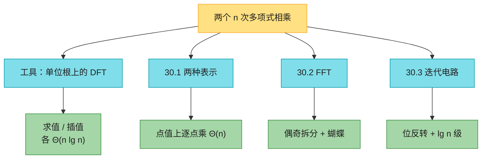
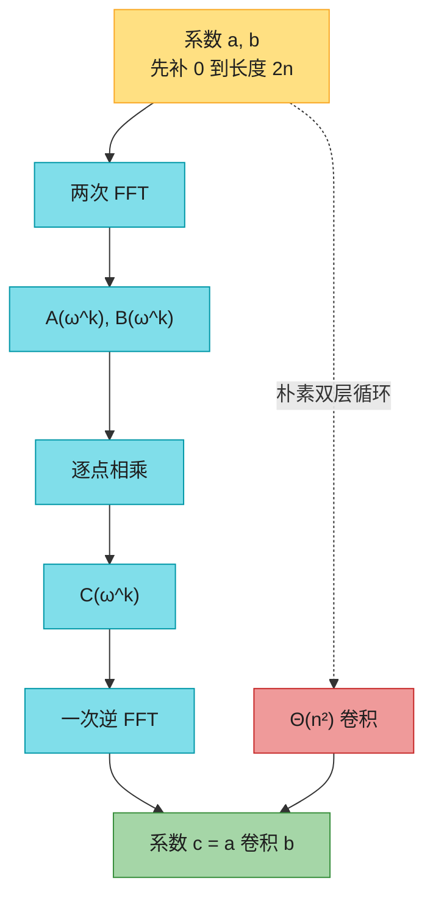
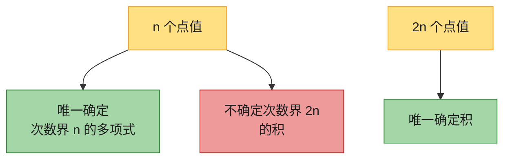
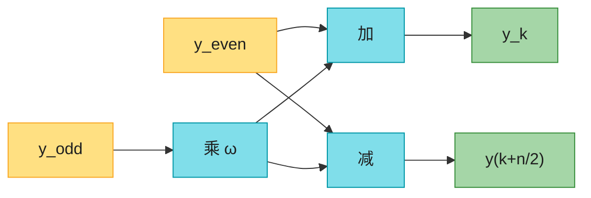
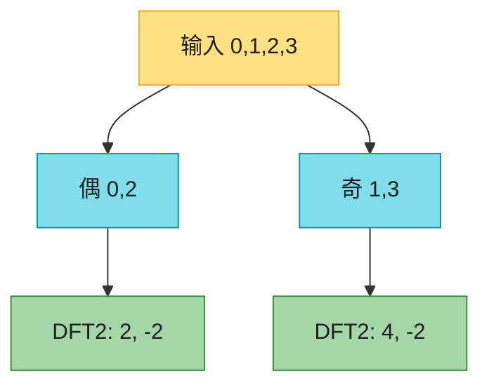
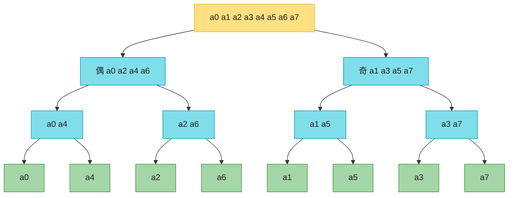
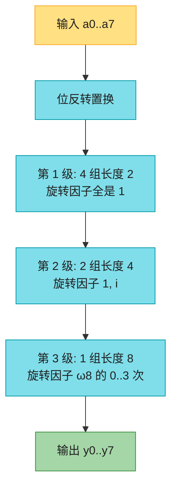
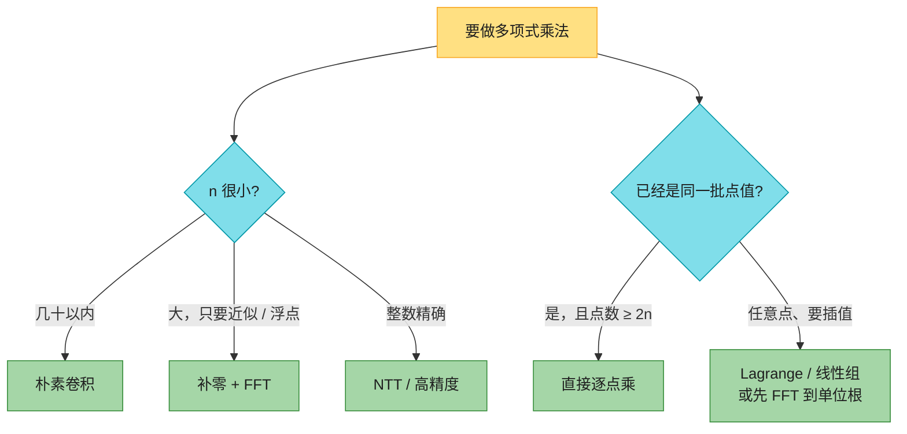

# 第 30 章：多项式与 FFT（Polynomials and the FFT）——深度版

## 一、开篇定位

本章回答一个问题：**两个 $n$ 次多项式相乘，能不能比「每一项乘每一项」的 $\Theta(n^2)$ 更快？**答案是能：用快速傅里叶变换（FFT）把时间降到 $\Theta(n\lg n)$。加法本来就是 $\Theta(n)$，乘法才是瓶颈；而乘法在系数形式下叫**卷积**，在点值形式下只是**逐点相乘**。FFT 做的事，就是在「系数 ↔ 点值」之间 $\Theta(n\lg n)$ 地来回切。

信号处理里同一套变换更常见：把时间域的波形写成不同频率正弦的加权和（频域）。MP3、JPEG 压缩、滤波、卷积加速，底层都是 DFT / FFT。本章按多项式乘法来讲，因为这条线不需要额外的信号知识，算法结构也最清楚。

与前后章节的关系：

- **第 2 章思考题 2-3 Horner 法则**：系数形式在**一个**点求值 $\Theta(n)$。本章要在 $n$ 个点求值，朴素就是 $\Theta(n^2)$，FFT 把它做成 $\Theta(n\lg n)$；
- **第 4 章分治**：FFT 的递归式就是 $T(n)=2T(n/2)+\Theta(n)\to\Theta(n\lg n)$。第 4.2 节 Strassen 是另一条「代数运算比朴素更快」的线；
- **第 28 章**：任意 $n$ 个点的插值 = 解 Vandermonde 线性组，一般 $O(n^3)$。单位根这个特殊点集，让矩阵变成「用蝴蝶运算就能乘」的 DFT 矩阵；
- **第 31 章**：不想碰复数、还要整数精确答案时，把单位根搬到模素数的整数环上，就是 NTT（思考题 30-5）。

做题定位：LeetCode **几乎不考手写 FFT**。能直接练的是迭代 FFT 的第一步——位反转（190），以及「和为某值的方案数」这种卷积计数（1711、454）。竞赛里多项式乘法 / 生成函数 / 带通配符的串匹配才是 FFT 的主场。本章要带走的三句话：**点值上乘法是 $\Theta(n)$，贵的是换表示**；**换表示请用单位根，不要用任意点**；**乘完必须先补零再变换，否则次数不够，插不回唯一的积**。

**本章主线**：系数 vs 点值 → 单位根与 DFT → 偶奇拆分的递归 FFT → 逆变换与卷积定理 → 位反转 + 迭代电路 → Java + Python → 速查 / 易混 → 题单与习题。



---

## 二、核心思想：点值上逐点乘，再变回去

大白话：多项式有两种身份证。

- **系数** $(a_0,a_1,\ldots,a_{n-1})$：加减容易，相乘要做卷积 $c_j=\sum_k a_k b_{j-k}$，双层循环 $\Theta(n^2)$；
- **点值** $\{(x_k,A(x_k))\}$：同一批 $x_k$ 上，$C(x_k)=A(x_k)B(x_k)$，乘法变成 $n$ 次复数乘。

任意点集上，求值 / 插值各要 $\Theta(n^2)$（Horner $n$ 次，或 Lagrange），来回一趟就把「点值乘法快」吃掉了。关键发现：**把 $x_k$ 取成复数 $n$ 次单位根**，求值和插值都变成 DFT / 逆 DFT，而 FFT 能在 $\Theta(n\lg n)$ 做完。于是整条流水线是：

系数 →（FFT）→ 点值 →（逐点乘）→ 点值 →（逆 FFT）→ 系数。

积的次数是两边次数之和，所以变换长度至少是 $2n$，不是 $n$。先把高次系数补 $0$，再对长度 $2n$ 做 FFT。



这就是卷积定理：把 $a,b$ 补零到长度 $2n$ 之后，

$$a\otimes b=\mathrm{DFT}_{2n}^{-1}\bigl(\mathrm{DFT}_{2n}(a)\cdot\mathrm{DFT}_{2n}(b)\bigr).$$

---

## 三、两种表示（30.1）

先分清两个词：**次数** $\mathrm{degree}(A)$ 是最高非零系数的下标；**次数界** degree-bound 是「系数向量的长度 $n$」，真正的次数可以是 $0$ 到 $n-1$ 的任何一个。次数界 $n$ 的多项式也是次数界 $n+1$ 的（高位补 $0$）。积的次数界取 $n_A+n_B$ 即可。

### 3.1 系数表示

$A(x)=\sum_{j=0}^{n-1}a_j x^j$，身份证就是向量 $a=(a_0,\ldots,a_{n-1})$。

| 操作 | 做法 | 时间 |
|------|------|------|
| 求值 $A(x_0)$ | Horner：$a_0+x_0(a_1+x_0(a_2+\cdots))$ | $\Theta(n)$ |
| 加法 | 对应系数相加 | $\Theta(n)$ |
| 乘法 | 卷积 (30.1)(30.2) | $\Theta(n^2)$ |

原书例子：$A=6x^3+7x^2-10x+9$，$B=-2x^3+4x-5$，和为 $4x^3+7x^2-6x+4$。积用手算交叉项，最高次 $x^6$，次数界 $7$。

### 3.2 点值表示

$n$ 个互不相同的 $x_k$，配上 $y_k=A(x_k)$。点可以随便挑，所以点值表示不唯一；但**次数界 $n$ + $n$ 个互异点 → 系数唯一**（插值多项式唯一，定理 30.1）。线性代数说法：Vandermonde 矩阵在 $x_k$ 互异时可逆。

任意点上：

- 求值 $n$ 个点：Horner 各跑一遍 $\Theta(n^2)$；
- 插值：解 $n\times n$ 线性组 $O(n^3)$，或 Lagrange 公式 $\Theta(n^2)$。

点值上的加减乘都是逐点：同一批 $x_k$ 上，$C(x_k)=A(x_k)\pm B(x_k)$ 或 $A(x_k)B(x_k)$。乘法有一个坑，见下一小节。

在**新点**上求值：没有捷径，先插回系数再 Horner。

数值提醒（原书脚注）：任意点插值数值上很不稳定。单位根是「条件数好」的那批点，这是实践里几乎只用 FFT、不用随便 10 个点做 Lagrange 的原因。

### 3.3 为什么必须补零到 2n

$A,B$ 次数界都是 $n$ 时，$\mathrm{degree}(AB)=\mathrm{degree}(A)+\mathrm{degree}(B)$，积的次数界是 $2n$。只在 $n$ 个点上逐点相乘，得到 $n$ 对点值，**不够**唯一确定一个次数界 $2n$ 的多项式（习题 30.1-4）。

正确姿势：两边都补 $n$ 个高位 $0$，变成次数界 $2n$，在 $2n$ 个点上求值、逐点乘、插值。



$n$ 不是 2 的幂时，继续往上补 $0$ 到下一个 2 的幂——正文 FFT 假定 $n=2^k$。

---

## 四、单位根与 DFT（30.2 前半）

本章 $i$ 只表示 $\sqrt{-1}$，不表示下标。

### 4.1 复数 n 次单位根

$\omega^n=1$ 的复数恰好 $n$ 个：$e^{2\pi i k/n}$，$k=0,\ldots,n-1$，均匀排在复平面单位圆上。**主 n 次单位根**

$$\omega_n=e^{2\pi i/n},$$

其余都是它的幂。信号处理文献常取 $e^{-2\pi i/n}$（差一个共轭，数学等价）；原书用正号，笔记和代码跟原书。

$n=8$ 时 $\omega_8=e^{i\pi/4}=(1+i)/\sqrt{2}$：

| $k$ | $\omega_8^k$ | 值 |
|-----|----------------|-----|
| 0 | $1$ | $1$ |
| 1 | $e^{i\pi/4}$ | $(1+i)/\sqrt{2}$ |
| 2 | $i$ | $i$ |
| 3 | $e^{i 3\pi/4}$ | $(-1+i)/\sqrt{2}$ |
| 4 | $-1$ | $-1$ |
| 5 | $e^{i 5\pi/4}$ | $(-1-i)/\sqrt{2}$ |
| 6 | $-i$ | $-i$ |
| 7 | $e^{i 7\pi/4}$ | $(1-i)/\sqrt{2}$ |

乘法下它们构成循环群，和 $(\mathbb{Z}_n,+)$ 同构：$\omega_n^j\omega_n^k=\omega_n^{(j+k)\bmod n}$，$\omega_n^{-1}=\omega_n^{n-1}$。

### 4.2 三条引理（只记结论）

| 引理 | 结论 | 直觉 |
|------|------|------|
| 消去 | $\omega_{dn}^{dk}=\omega_n^k$ | 转过的角度一样 |
| 推论 | $n$ 偶数 ⇒ $\omega_n^{n/2}=-1$ | 走到圆的对面 |
| 折半 | $n$ 个 $n$ 次根平方，恰好是 $n/2$ 个 $n/2$ 次根，每个出现两次 | $\omega^k$ 与 $\omega^{k+n/2}=-\omega^k$ 平方相同 |
| 求和 | $n\nmid k$ 时 $\sum_{j=0}^{n-1}(\omega_n^k)^j=0$ | 单位圆上均匀的向量加起来抵消；几何级数，分母 $\omega_n^k\neq 1$ |

折半引理是分治能成立的原因：在 $n$ 个 $n$ 次根上求值 $A(x)$，会退化成在 **$n/2$ 个** $n/2$ 次根上求值两个半长多项式。

### 4.3 DFT 定义

次数界 $n$ 的 $A$，在全部 $n$ 次单位根上求值：

$$y_k=A(\omega_n^k)=\sum_{j=0}^{n-1}a_j\omega_n^{kj},\qquad k=0,\ldots,n-1.$$

向量 $y=\mathrm{DFT}_n(a)$。矩阵写法 $y=V_n a$，其中 $V_n[k,j]=\omega_n^{kj}$（指数恰好是 $0..n-1$ 的乘法表）。朴素求和 $\Theta(n^2)$。

多项式乘法的语境里，这里的 $n$ 其实是 30.1 节补零之后的 $2n$。

---

## 五、FFT：偶奇拆分 + 蝴蝶合并

### 5.1 直觉

把系数按**下标奇偶**切开（不是按高半 / 低半）：

$$
\begin{aligned}
A_{\mathrm{even}}(x)&=a_0+a_2x+a_4x^2+\cdots+a_{n-2}x^{n/2-1},\\
A_{\mathrm{odd}}(x)&=a_1+a_3x+a_5x^2+\cdots+a_{n-1}x^{n/2-1}.
\end{aligned}
$$

拼回去就一行：

$$A(x)=A_{\mathrm{even}}(x^2)+x\,A_{\mathrm{odd}}(x^2).$$

要算 $A(\omega_n^k)$，只要知道两个半长多项式在 $(\omega_n^k)^2$ 上的值。折半引理：这 $n$ 个平方只有 $n/2$ 个不同值，正好是全部 $n/2$ 次单位根。于是：

1. 递归算 $\mathrm{DFT}_{n/2}(A_{\mathrm{even}})$ 和 $\mathrm{DFT}_{n/2}(A_{\mathrm{odd}})$；
2. 用 $n/2$ 次「蝴蝶」合并成长度为 $n$ 的 DFT。

$n=1$ 时 DFT 就是自己。每层做 $\Theta(n)$ 的合并，两半规模各减半：

$$T(n)=2T(n/2)+\Theta(n)=\Theta(n\lg n).$$

### 5.2 蝴蝶

合并时 $\omega=\omega_n^k$ 会用两次，一加一减（因为 $\omega_n^{k+n/2}=-\omega_n^k$）：

$$
\begin{aligned}
y_k&=y_k^{\mathrm{even}}+\omega\,y_k^{\mathrm{odd}},\\
y_{k+n/2}&=y_k^{\mathrm{even}}-\omega\,y_k^{\mathrm{odd}}.
\end{aligned}
$$

先算 $t=\omega\cdot y_k^{\mathrm{odd}}$，再做 $u\pm t$。这个形状叫**蝴蝶**，$\omega_n^k$ 叫**旋转因子**（twiddle factor）。



### 5.3 走一遍 n=4：DFT(0,1,2,3)

这是习题 30.2-2。$A(x)=x+2x^2+3x^3$，$\omega_4=i$。

偶系数 $(a_0,a_2)=(0,2)$，奇系数 $(a_1,a_3)=(1,3)$。



两个长度 2 的 DFT（旋转因子 $\omega_2=1$，蝴蝶就是加和减）：

| 输入 | $y_0$ | $y_1$ |
|------|-------|-------|
| $(0,2)$ | $0+2=2$ | $0-2=-2$ |
| $(1,3)$ | $1+3=4$ | $1-3=-2$ |

再用 $\omega_4=i$ 合并：

| $k$ | $\omega$ | $y_k=y_e+\omega y_o$ | $y_{k+2}=y_e-\omega y_o$ |
|-----|----------|----------------------|---------------------------|
| 0 | $1$ | $2+4=6$ | $2-4=-2$ |
| 1 | $i$ | $-2+i(-2)=-2-2i$ | $-2-i(-2)=-2+2i$ |

所以 $\mathrm{DFT}(0,1,2,3)=(6,\ -2-2i,\ -2,\ -2+2i)$。用 Horner 直接算 $A(1),A(i),A(-1),A(-i)$ 也对得上。

### 5.4 伪代码（原书，下标已从 0 起）

本章 FFT 伪代码本身就是 $0..n-1$，和实战数组一致。

```
FFT(a, n)
1  if n == 1
2      return a                          // 1 个元素的 DFT 就是自己
3  ω_n = e^{2πi/n}
4  ω = 1
5  aeven = (a0, a2, ..., a_{n-2})
6  aodd  = (a1, a3, ..., a_{n-1})
7  yeven = FFT(aeven, n/2)
8  yodd  = FFT(aodd,  n/2)
9  for k = 0 to n/2 - 1                  // 此时 ω = ω_n^k
10     y_k       = yeven_k + ω * yodd_k
11     y_{k+n/2} = yeven_k - ω * yodd_k
12     ω = ω * ω_n
13 return y
```

循环里累乘 $\omega$ 比每次重算 $\omega_n^k$ 便宜，但浮点误差会攒起来。同一长度要跑很多次 FFT 时，预计算 $n/2$ 个旋转因子更稳（原书脚注）。

### 5.5 逆 DFT

$V_n^{-1}$ 的 $(j,k)$ 项是 $\omega_n^{-jk}/n$（定理 30.7）。所以

$$a_j=\frac{1}{n}\sum_{k=0}^{n-1}y_k\omega_n^{-kj}.$$

和正向公式比：把 $a$ 与 $y$ 角色对调，$\omega_n$ 换成 $\omega_n^{-1}$，最后每个分量除以 $n$。同一套 FFT 代码加一个 `invert` 标志即可，时间仍是 $\Theta(n\lg n)$。

于是定理 30.2：系数形式的两个次数界 $n$ 多项式，可以 $\Theta(n\lg n)$ 相乘。

---

## 六、迭代 FFT 与电路（30.3）

硬件 / 高性能实现不走递归：先把输入排成递归树叶子的顺序，再从底向上做 $\lg n$ 级蝴蝶，每级 $n/2$ 只蝴蝶可并行。电路深度 $\Theta(\lg n)$，蝴蝶总数 $\Theta(n\lg n)$。

### 6.1 递归树的叶子 = 位反转

$n=8$ 时，每次把偶下标丢左、奇下标丢右，叶子从左到右是：



叶子顺序 $0,4,2,6,1,5,3,7$。写成 3 位二进制再逐位反转，正好是 $000,001,\ldots,111$ 的位反转：

| $k$ | 二进制 | 位反转 | $\mathrm{rev}(k)$ |
|-----|--------|--------|---------------------|
| 0 | 000 | 000 | 0 |
| 1 | 001 | 100 | 4 |
| 2 | 010 | 010 | 2 |
| 3 | 011 | 110 | 6 |
| 4 | 100 | 001 | 1 |
| 5 | 101 | 101 | 5 |
| 6 | 110 | 011 | 3 |
| 7 | 111 | 111 | 7 |

原因：每一层看的是下标的**最低位**（偶=0 走左，奇=1 走右），剥掉之后下一层再看新的最低位。走到叶子时，原来的比特顺序完全颠倒。

原地置换：对每个 $i$，若 $i<\mathrm{rev}(i)$ 就交换 $a[i]$ 与 $a[\mathrm{rev}(i)]$，避免换两次（习题 30.3-4）。

### 6.2 lg n 级，每级 n/2 只蝴蝶

位反转之后，第 $s=1,2,\ldots,\lg n$ 级：组大小 $m=2^s$，共 $n/m$ 组，每组 $m/2$ 只蝴蝶，旋转因子是 $\omega_m^0,\ldots,\omega_m^{m/2-1}$。

$n=8$ 三层在做什么：



习题 30.3-2（0-indexed）：第 $s$ 级、第 $g$ 组、第 $j$ 只蝴蝶，两条线是

$$g\cdot m+j\quad\text{和}\quad g\cdot m+j+m/2,\qquad m=2^s.$$

原书 Figure 30.6 第 2 级最上面那只蝴蝶走的是线 0 和 2，对得上。

习题 30.3-1 的输入 $(0,2,3,-1,4,5,7,9)$，最终 DFT（代码实跑，四位小数）为

| $k$ | $y_k$ |
|-----|--------|
| 0 | $29$ |
| 1 | $0.9497-13.1924i$ |
| 2 | $-6-i$ |
| 3 | $-8.9497-5.1924i$ |
| 4 | $-1$ |
| 5 | $-8.9497+5.1924i$ |
| 6 | $-6+i$ |
| 7 | $0.9497+13.1924i$ |

核对两个好算的：$y_0=\sum a_j=29$；$y_4=A(-1)=-1$。

---

## 七、代码实现（Java + Python）

约定：本章伪代码已经是 $0..n-1$；实战同样 **0-indexed**。长度 $n$ 必须是 2 的幂，乘法前用 `nextPow2` 补零。正向单位根 $\omega_n=\exp(2\pi i/n)$，逆向用共轭并除以 $n$。Java 没有原生复数，用一个不可变的 `C`；Python 用内置 `complex`。

下面两份从本文原样抽出即可编译运行；`main` 核对 30.2-2、30.1-1、30.3-1 往返、位反转表，并用 200 组随机多项式对拍朴素卷积，递归 FFT 与迭代 FFT 逐项对照。

### 7.1 Java

```java
import java.util.Arrays;
import java.util.Random;

/**
 * CLRS 第 30 章：递归 FFT + 迭代 FFT + 多项式乘法。0-indexed。
 * 单位根取 ω_n = exp(2πi/n)（与原书一致；信号处理常用共轭）。
 */
public class FftPoly {
    static final class C {
        final double re, im;
        C(double re, double im) { this.re = re; this.im = im; }
        static C of(double re) { return new C(re, 0); }
        static C polar(double theta) { return new C(Math.cos(theta), Math.sin(theta)); }
        C add(C o) { return new C(re + o.re, im + o.im); }
        C sub(C o) { return new C(re - o.re, im - o.im); }
        C mul(C o) { return new C(re * o.re - im * o.im, re * o.im + im * o.re); }
        C scale(double s) { return new C(re * s, im * s); }
        double abs() { return Math.hypot(re, im); }
    }

    static int nextPow2(int n) {
        int p = 1;
        while (p < n) p <<= 1;
        return p;
    }

    /** 递归 FFT。invert=false 算 DFT，true 算未除 n 的逆变换。 */
    static C[] fftRec(C[] a, boolean invert) {
        int n = a.length;
        if (n == 1) return new C[] { a[0] };
        C[] even = new C[n / 2], odd = new C[n / 2];
        for (int i = 0; i < n / 2; i++) {
            even[i] = a[2 * i];
            odd[i] = a[2 * i + 1];
        }
        C[] ye = fftRec(even, invert);
        C[] yo = fftRec(odd, invert);
        C[] y = new C[n];
        double ang = 2 * Math.PI / n * (invert ? -1 : 1);
        C wn = C.polar(ang), w = C.of(1);
        for (int k = 0; k < n / 2; k++) {
            C t = w.mul(yo[k]);
            y[k] = ye[k].add(t);
            y[k + n / 2] = ye[k].sub(t);
            w = w.mul(wn);
        }
        return y;
    }

    static int bitReverse(int k, int bits) {
        int r = 0;
        for (int i = 0; i < bits; i++) {
            r = (r << 1) | (k & 1);
            k >>= 1;
        }
        return r;
    }

    static void bitReversePermute(C[] a) {
        int n = a.length, bits = Integer.numberOfTrailingZeros(n);
        for (int i = 0; i < n; i++) {
            int j = bitReverse(i, bits);
            if (i < j) {
                C t = a[i]; a[i] = a[j]; a[j] = t;
            }
        }
    }

    /** 原地迭代 FFT：位反转 + lg n 级蝴蝶。 */
    static void fftIter(C[] a, boolean invert) {
        int n = a.length;
        bitReversePermute(a);
        for (int len = 2; len <= n; len <<= 1) {
            double ang = 2 * Math.PI / len * (invert ? -1 : 1);
            C wn = C.polar(ang);
            for (int i = 0; i < n; i += len) {
                C w = C.of(1);
                for (int j = 0; j < len / 2; j++) {
                    C u = a[i + j];
                    C t = w.mul(a[i + j + len / 2]);
                    a[i + j] = u.add(t);
                    a[i + j + len / 2] = u.sub(t);
                    w = w.mul(wn);
                }
            }
        }
    }

    static C[] dft(double[] a, boolean iterative) {
        int n = nextPow2(a.length);
        C[] c = new C[n];
        for (int i = 0; i < n; i++) c[i] = C.of(i < a.length ? a[i] : 0);
        if (iterative) {
            fftIter(c, false);
            return c;
        }
        return fftRec(c, false);
    }

    static C[] idft(C[] y, boolean iterative) {
        int n = y.length;
        C[] a = Arrays.copyOf(y, n);
        if (iterative) fftIter(a, true);
        else a = fftRec(a, true);
        for (int i = 0; i < n; i++) a[i] = a[i].scale(1.0 / n);
        return a;
    }

    static C evalHorner(double[] a, C x) {
        C acc = C.of(0);
        for (int i = a.length - 1; i >= 0; i--)
            acc = acc.mul(x).add(C.of(a[i]));
        return acc;
    }

    /** 系数卷积，结果长度 na+nb-1。 */
    static double[] multiply(double[] a, double[] b) {
        int need = Math.max(1, a.length + b.length - 1);
        int n = nextPow2(need);
        C[] A = new C[n], B = new C[n];
        for (int i = 0; i < n; i++) {
            A[i] = C.of(i < a.length ? a[i] : 0);
            B[i] = C.of(i < b.length ? b[i] : 0);
        }
        A = fftRec(A, false);
        B = fftRec(B, false);
        for (int i = 0; i < n; i++) A[i] = A[i].mul(B[i]);
        A = idft(A, false);
        double[] c = new double[need];
        for (int i = 0; i < need; i++) c[i] = A[i].re;
        return c;
    }

    static double[] naiveMultiply(double[] a, double[] b) {
        double[] c = new double[a.length + b.length - 1];
        for (int i = 0; i < a.length; i++)
            for (int j = 0; j < b.length; j++)
                c[i + j] += a[i] * b[j];
        return c;
    }

    /** 笛卡尔和计数：c[s] = 写成 x+y=s 的方案数。 */
    static int[] cartesianSum(int[] A, int[] B) {
        int maxA = 0, maxB = 0;
        for (int x : A) maxA = Math.max(maxA, x);
        for (int y : B) maxB = Math.max(maxB, y);
        double[] pa = new double[maxA + 1], pb = new double[maxB + 1];
        for (int x : A) pa[x] += 1;
        for (int y : B) pb[y] += 1;
        double[] pc = multiply(pa, pb);
        int[] c = new int[pc.length];
        for (int i = 0; i < pc.length; i++) c[i] = (int) Math.round(pc[i]);
        return c;
    }

    static boolean close(C a, C b) { return a.sub(b).abs() < 1e-6; }
    static boolean closeArr(double[] a, double[] b) {
        if (a.length != b.length) return false;
        for (int i = 0; i < a.length; i++)
            if (Math.abs(a[i] - b[i]) > 1e-6) return false;
        return true;
    }

    static int[] dftMod(int[] a, int p, int w) {
        int n = a.length;
        int[] y = new int[n];
        for (int k = 0; k < n; k++) {
            long acc = 0, wk = 1, step = 1;
            for (int t = 0; t < k; t++) step = step * w % p;
            for (int j = 0; j < n; j++) {
                acc = (acc + (long) a[j] * wk) % p;
                wk = wk * step % p;
            }
            y[k] = (int) acc;
        }
        return y;
    }

    public static void main(String[] args) {
        C[] y4 = dft(new double[] {0, 1, 2, 3}, false);
        C[] expect4 = { C.of(6), new C(-2, -2), C.of(-2), new C(-2, 2) };
        for (int i = 0; i < 4; i++)
            if (!close(y4[i], expect4[i]))
                throw new AssertionError("30.2-2 rec " + i);
        C[] y4i = dft(new double[] {0, 1, 2, 3}, true);
        for (int i = 0; i < 4; i++)
            if (!close(y4i[i], expect4[i]))
                throw new AssertionError("30.2-2 iter " + i);

        C[] back = idft(y4, false);
        for (int i = 0; i < 4; i++)
            if (Math.abs(back[i].re - i) > 1e-6 || Math.abs(back[i].im) > 1e-6)
                throw new AssertionError("ifft");

        double[] a4 = {0, 1, 2, 3};
        C w4 = C.polar(2 * Math.PI / 4), wk = C.of(1);
        for (int k = 0; k < 4; k++) {
            if (!close(evalHorner(a4, wk), y4[k]))
                throw new AssertionError("horner vs dft " + k);
            wk = wk.mul(w4);
        }

        double[] A = {-10, 1, -1, 7};
        double[] B = {3, -6, 0, 8};
        double[] expectC = {-30, 63, -9, -53, -34, -8, 56};
        if (!closeArr(multiply(A, B), expectC)) throw new AssertionError("30.1-1");
        if (!closeArr(naiveMultiply(A, B), expectC)) throw new AssertionError("naive 30.1-1");

        double[] a8 = {0, 2, 3, -1, 4, 5, 7, 9};
        C[] r8 = dft(a8, false);
        C[] i8 = dft(a8, true);
        for (int i = 0; i < 8; i++)
            if (!close(r8[i], i8[i])) throw new AssertionError("rec vs iter n=8");
        C[] b8 = idft(r8, true);
        for (int i = 0; i < 8; i++)
            if (Math.abs(b8[i].re - a8[i]) > 1e-6 || Math.abs(b8[i].im) > 1e-6)
                throw new AssertionError("ifft 30.3-1");

        int[] rev8 = new int[8];
        for (int i = 0; i < 8; i++) rev8[i] = bitReverse(i, 3);
        if (!Arrays.equals(rev8, new int[] {0, 4, 2, 6, 1, 5, 3, 7}))
            throw new AssertionError("bitrev");

        int[] setA = {1, 4, 5}, setB = {2, 3, 8};
        int[] cs = cartesianSum(setA, setB);
        int[] naiveCs = new int[5 + 8 + 1];
        for (int x : setA) for (int y : setB) naiveCs[x + y]++;
        for (int s = 0; s < naiveCs.length; s++)
            if (cs[s] != naiveCs[s]) throw new AssertionError("cartesian " + s);

        int[] ntt = dftMod(new int[] {0, 5, 3, 7, 7, 2, 1, 6}, 17, 9);
        if (!Arrays.equals(ntt, new int[] {14, 10, 10, 4, 8, 11, 13, 15}))
            throw new AssertionError("30-5(d) " + Arrays.toString(ntt));

        Random rng = new Random(30);
        for (int trial = 0; trial < 200; trial++) {
            int na = 1 + rng.nextInt(32), nb = 1 + rng.nextInt(32);
            double[] aa = new double[na], bb = new double[nb];
            for (int i = 0; i < na; i++) aa[i] = rng.nextInt(21) - 10;
            for (int i = 0; i < nb; i++) bb[i] = rng.nextInt(21) - 10;
            if (!closeArr(multiply(aa, bb), naiveMultiply(aa, bb)))
                throw new AssertionError("mul trial " + trial);

            int n = nextPow2(2 + rng.nextInt(16));
            double[] v = new double[n];
            for (int i = 0; i < n; i++) v[i] = rng.nextGaussian();
            C[] rec = dft(v, false);
            C[] it = dft(v, true);
            for (int i = 0; i < n; i++)
                if (!close(rec[i], it[i])) throw new AssertionError("rec/iter " + trial);
            C[] inv = idft(rec, rng.nextBoolean());
            for (int i = 0; i < n; i++)
                if (Math.abs(inv[i].re - v[i]) > 1e-6 || Math.abs(inv[i].im) > 1e-6)
                    throw new AssertionError("roundtrip " + trial);
        }
        System.out.println("all tests passed");
    }
}
```

### 7.2 Python

```python
import cmath
import math
import random


def next_pow2(n):
    p = 1
    while p < n:
        p <<= 1
    return p


def fft_rec(a, invert=False):
    n = len(a)
    if n == 1:
        return [a[0]]
    even = fft_rec(a[0::2], invert)
    odd = fft_rec(a[1::2], invert)
    ang = 2 * math.pi / n * (-1 if invert else 1)
    w, wn = 1 + 0j, cmath.exp(1j * ang)
    y = [0j] * n
    for k in range(n // 2):
        t = w * odd[k]
        y[k] = even[k] + t
        y[k + n // 2] = even[k] - t
        w *= wn
    return y


def bit_reverse(k, bits):
    r = 0
    for _ in range(bits):
        r = (r << 1) | (k & 1)
        k >>= 1
    return r


def bit_reverse_permute(a):
    n = len(a)
    bits = n.bit_length() - 1
    for i in range(n):
        j = bit_reverse(i, bits)
        if i < j:
            a[i], a[j] = a[j], a[i]


def fft_iter(a, invert=False):
    n = len(a)
    bit_reverse_permute(a)
    length = 2
    while length <= n:
        ang = 2 * math.pi / length * (-1 if invert else 1)
        wn = cmath.exp(1j * ang)
        for i in range(0, n, length):
            w = 1 + 0j
            half = length // 2
            for j in range(half):
                u = a[i + j]
                t = w * a[i + j + half]
                a[i + j] = u + t
                a[i + j + half] = u - t
                w *= wn
        length <<= 1


def dft(a, iterative=False):
    n = next_pow2(len(a))
    c = [complex(a[i] if i < len(a) else 0) for i in range(n)]
    if iterative:
        fft_iter(c, False)
        return c
    return fft_rec(c, False)


def idft(y, iterative=False):
    n = len(y)
    a = list(y)
    if iterative:
        fft_iter(a, True)
    else:
        a = fft_rec(a, True)
    return [z / n for z in a]


def eval_horner(a, x):
    acc = 0j
    for coef in reversed(a):
        acc = acc * x + coef
    return acc


def multiply(a, b):
    need = max(1, len(a) + len(b) - 1)
    n = next_pow2(need)
    A = [complex(a[i] if i < len(a) else 0) for i in range(n)]
    B = [complex(b[i] if i < len(b) else 0) for i in range(n)]
    A = fft_rec(A, False)
    B = fft_rec(B, False)
    C = [A[i] * B[i] for i in range(n)]
    C = idft(C, False)
    return [C[i].real for i in range(need)]


def naive_multiply(a, b):
    c = [0.0] * (len(a) + len(b) - 1)
    for i, x in enumerate(a):
        for j, y in enumerate(b):
            c[i + j] += x * y
    return c


def cartesian_sum(A, B):
    max_a, max_b = max(A), max(B)
    pa = [0.0] * (max_a + 1)
    pb = [0.0] * (max_b + 1)
    for x in A:
        pa[x] += 1
    for y in B:
        pb[y] += 1
    pc = multiply(pa, pb)
    return [int(round(v)) for v in pc]


def dft_mod(a, p, w):
    n = len(a)
    y = []
    for k in range(n):
        acc, wk, step = 0, 1, pow(w, k, p)
        for j in range(n):
            acc = (acc + a[j] * wk) % p
            wk = wk * step % p
        y.append(acc)
    return y


def close(a, b, eps=1e-6):
    return abs(a - b) < eps


def close_arr(a, b, eps=1e-6):
    return len(a) == len(b) and all(abs(x - y) < eps for x, y in zip(a, b))


def main():
    y4 = dft([0, 1, 2, 3], False)
    expect4 = [6 + 0j, -2 - 2j, -2 + 0j, -2 + 2j]
    for i in range(4):
        assert close(y4[i], expect4[i]), f"30.2-2 rec {i}"
    y4i = dft([0, 1, 2, 3], True)
    for i in range(4):
        assert close(y4i[i], expect4[i]), f"30.2-2 iter {i}"

    back = idft(y4, False)
    for i in range(4):
        assert close(back[i], i)

    a4 = [0, 1, 2, 3]
    w4, wk = cmath.exp(2j * math.pi / 4), 1 + 0j
    for k in range(4):
        assert close(eval_horner(a4, wk), y4[k])
        wk *= w4

    A, B = [-10, 1, -1, 7], [3, -6, 0, 8]
    expect_c = [-30, 63, -9, -53, -34, -8, 56]
    assert close_arr(multiply(A, B), expect_c)
    assert close_arr(naive_multiply(A, B), expect_c)

    a8 = [0, 2, 3, -1, 4, 5, 7, 9]
    r8, i8 = dft(a8, False), dft(a8, True)
    for i in range(8):
        assert close(r8[i], i8[i])
    b8 = idft(r8, True)
    for i in range(8):
        assert close(b8[i], a8[i])

    assert [bit_reverse(i, 3) for i in range(8)] == [0, 4, 2, 6, 1, 5, 3, 7]

    set_a, set_b = [1, 4, 5], [2, 3, 8]
    cs = cartesian_sum(set_a, set_b)
    naive_cs = [0] * (5 + 8 + 1)
    for x in set_a:
        for y in set_b:
            naive_cs[x + y] += 1
    assert cs[: len(naive_cs)] == naive_cs

    assert dft_mod([0, 5, 3, 7, 7, 2, 1, 6], 17, 9) == [14, 10, 10, 4, 8, 11, 13, 15]

    rng = random.Random(30)
    for trial in range(200):
        na, nb = 1 + rng.randrange(32), 1 + rng.randrange(32)
        aa = [rng.randrange(-10, 11) for _ in range(na)]
        bb = [rng.randrange(-10, 11) for _ in range(nb)]
        assert close_arr(multiply(aa, bb), naive_multiply(aa, bb)), trial

        n = next_pow2(2 + rng.randrange(16))
        v = [rng.gauss(0, 1) for _ in range(n)]
        rec, it = dft(v, False), dft(v, True)
        for i in range(n):
            assert close(rec[i], it[i])
        inv = idft(rec, rng.choice([True, False]))
        for i in range(n):
            assert close(inv[i], v[i])
    print("all tests passed")


if __name__ == "__main__":
    main()
```

---

## 八、复杂度速查 + 易混点对比

### 8.1 速查表

| 问题 | 时间 | 备注 |
|------|------|------|
| 系数加法 / Horner 单点求值 | $\Theta(n)$ | 第 2 章 |
| 系数卷积（朴素） | $\Theta(n^2)$ | $c_j=\sum_k a_k b_{j-k}$ |
| 点值加减、逐点乘 | $\Theta(n)$ | 积必须先有 $2n$ 个点 |
| 任意点求值 / Lagrange 插值 | $\Theta(n^2)$ | Vandermonde 直接解 $O(n^3)$ |
| FFT / 逆 FFT | $\Theta(n\lg n)$ | $T(n)=2T(n/2)+\Theta(n)$ |
| 系数多项式乘法（经 FFT） | $\Theta(n\lg n)$ | 补零到 $\ge 2n$ 的 2 的幂 |
| 迭代 FFT 电路深度 | $\Theta(\lg n)$ | 每级 $n/2$ 只蝴蝶并行 |
| 3 路 FFT（$n=3^k$） | 仍 $\Theta(n\lg n)$ | $T(n)=3T(n/3)+\Theta(n)$ |
| Karatsuba 多项式乘（30-1） | $\Theta(n^{\lg 3})$ | $\lg 3\approx 1.585$，不用单位根 |
| 任意 $n$ 个点求值（30-4） | $O(n\lg^2 n)$ | 余式树，不是单位根 |
| 笛卡尔和计数（30.1-7） | $O(M\lg M)$ | $M$ 是值域，不是 $|A|$ |

### 8.2 易混点对比

| 易混点 | 辨析 |
|-------|------|
| 次数 vs 次数界 | 次数是最高非零项下标；次数界是向量长度。积的次数界取两边之和 |
| 补 $n$ 个零就够了？ | 两次界 $n$ 的积界是 $2n$。FFT 长度还要再垫到 2 的幂 |
| 点值乘法用 $n$ 个点 | 不够唯一确定积。必须 $2n$ 个点 |
| 拆高半 / 低半 | FFT 拆的是**下标奇偶**。高半/低半是 Karatsuba（30-1） |
| $\omega_n=e^{2\pi i/n}$ vs $e^{-2\pi i/n}$ | 差共轭。原书用正号；信号处理库常用负号。正逆不要混用 |
| 逆变换忘了除 $n$ | 往返会放大 $n$ 倍。`invert` 只改单位根符号，除法在最外层 |
| DFT 就是 FFT | DFT 是那组求和；FFT 是算它的 $\Theta(n\lg n)$ 算法 |
| 任意点也能 FFT？ | 不能。折半引理依赖单位根。任意点走 30-4，更慢一截 $\lg n$ |
| 点值做除法 | 整除且分母点非零时，逐点除给出积的点值，但点数要够次数界；除不尽则根本不是多项式（30.1-6） |
| 递归 FFT 输入顺序 | 自然序进、自然序出。迭代版必须先位反转 |
| 位反转把 $k$ 当整数反转 | 反转的是 **$\lg n$ 位**，不是任意宽度。$n=8$ 时 $1\to 4$ 不是 $1\to 1$ |
| 实系数积出现虚部 | 浮点噪声，量级应 $10^{-12}$ 上下。取实部；整数系数再 `round` |
| NTT 可以替代复数 FFT | 系数是整数、要精确答案时用。模数 $p=kn+1$ 必须存在 $n$ 次单位根（第 31 章） |



---

## 九、LeetCode 题单 + 习题快问快答

### 9.1 LeetCode 题单

定位语：**不考手写 FFT**。力扣能练的是位反转，以及「方案数 = 卷积」的计数题——值域小才值得真上 FFT，多数哈希就够。

| 题号 | 题目 | 难度 | 考点 |
|-----|------|------|------|
| 190 | 颠倒二进制位 | 易 | 位反转置换；迭代 FFT 第一步 |
| 191 | 位 1 的个数 | 易 | 比特运算热身 |
| 50 | Pow(x, n) | 中 | 快速幂；和「$\omega$ 累乘」不是一回事 |
| 1711 | 大餐计数 | 中 | 和为 $2^k$ 的无序对数；值域小时卷积，实战哈希 |
| 454 | 四数相加 II | 中 | 两两求和再配对，计数卷积 |
| 923 | 三数之和的多种可能 | 中 | 生成函数 / 卷积计数的手工版 |
| 1 | 两数之和 | 易 | 笛卡尔和的「是否出现」，哈希 $O(n)$ |
| 1074 | 元素和为目标值的子矩阵 | 难 | 前缀 + 哈希；不是 FFT |

竞赛向：多项式乘法模板、生成函数求方案数、带通配符的串匹配（模式里的 `*` 当 $0$ 系数，卷积找匹配位）、NTT 取模 $998244353$。值域 $M\le 10^6$ 的计数卷积，$O(M\lg M)$ 才比 $O(n^2)$ 有意义。

### 9.2 习题快问快答（第四版编号）

- **30.1-1** $A=-10+x-x^2+7x^3$，$B=3-6x+8x^3$。积 $-30+63x-9x^2-53x^3-34x^4-8x^5+56x^6$。
- **30.1-2** 综合除法 / Horner 的另一面：从高次往下，$q_{n-2}=a_{n-1}$，$q_j=a_{j+1}+x_0 q_{j+1}$，余数 $r=a_0+x_0 q_0$。$\Theta(n)$。其实 $r=A(x_0)$。
- **30.1-3** $A^{\mathrm{rev}}(x)=x^{n-1}A(1/x)$。点 $x_k\neq 0$ 时，$A^{\mathrm{rev}}(x_k)=x_k^{n-1}A(1/x_k)$。若点集在取倒数下封闭（单位根就是），重排已有点值即可。
- **30.1-4** $n-1$ 个点值可以任意补一个新点 $(x^*,y^*)$。不同 $y^*$ 给出不同的次数界 $n$ 插值多项式（定理 30.1），它们在原来 $n-1$ 个点上相同。所以 $n-1$ 对不够。
- **30.1-5** 先 $O(n^2)$ 展开 $P(x)=\prod(x-x_j)$；对每个 $k$ 用 30.1-2 除掉 $(x-x_k)$ 得分子，分母 $P'(x_k)$（或直接 $O(n)$ 乘），再线性组合。总共 $\Theta(n^2)$。
- **30.1-6** 整除且 $B(x_k)\neq 0$：逐点除给出商在这些点上的值，但点数必须 ≥ 商的次数界。除不尽时 $A/B$ 不是多项式，插值那些比值会得到「过这些点的某条多项式」，不是有理函数本身。还要小心 $B(x_k)=0$。
- **30.1-7** 把 $A$ 写成系数 $a_i=1_{[i\in A]}$ 的多项式（值域 $0..10n$），$B$ 同理。积的系数 $c_s$ 就是写成 $x+y=s$ 的方案数。FFT 乘法 $O(n\lg n)$（这里 $n$ 是值域）。
- **30.2-1** $\omega_n^{n/2}=e^{\pi i}=-1=\omega_2$。
- **30.2-2** $(6,\ -2-2i,\ -2,\ -2+2i)$。见 §5.3。
- **30.2-3** 对 30.1-1 的系数补零到长度 8，FFT → 逐点乘 → 逆 FFT，得到同一组系数（浮点误差内）。
- **30.2-4** 与 `FFT` 相同，把 $\omega_n$ 换成 $e^{-2\pi i/n}$，返回前每个 $y_j$ 除以 $n$。
- **30.2-5** 三路：按下标 $\bmod 3$ 拆成三个长度 $n/3$ 的多项式。$T(n)=3T(n/3)+\Theta(n)=\Theta(n\lg n)$。
- **30.2-6** 模 $m=2^{tn/2}+1$，$\omega=2^t$。验证 $\omega^n\equiv 1$ 且更小的正幂不是 $1$，求和引理在模 $m$ 下仍成立，于是 DFT 矩阵可逆。这是 Fermat 数上的 NTT。
- **30.2-7** $P(x)=\prod(x-z_j)$。分治：左右各一半根乘起来。多项式乘法用 FFT，$T(n)=2T(n/2)+O(n\lg n)=O(n\lg^2 n)$。
- **30.2-8** Chirp：$y_k=\sum_j a_j z^{kj}$。用提示配成卷积核 $z^{-(k-j)^2/2}$，一次 FFT 卷积 $O(n\lg n)$。DFT 是 $z=\omega_n$ 的特例。
- **30.3-1** 最终 DFT 见 §6.2 表。$y_0=29$，$y_4=-1$ 可手算。
- **30.3-2** 线 $gm+j$ 与 $gm+j+m/2$，$m=2^s$（组、蝴蝶均从 0 计）。
- **30.3-3** 把 $k$ 看成 $b$ 维比特向量，位反转 = 坐标反序，矩阵 $M$ 是反对角置换：$M_{i,j}=1$ 当且仅当 $i+j=b-1$。
- **30.3-4** 即代码里的 `bitReversePermute`：`j=rev(i)`，仅当 `i<j` 时交换。
- **30.3-5** 电路线性。某个加法器钉死为 0，等价于从那条内部线注入一个与正确值相反的误差，误差沿后续蝴蝶传到一组确定的输出。比较「正确 DFT」与电路输出，误差模式可定位那只加法器；级数是 $\lg n$，可以按级二分再在该级 $n/2$ 只里查。

### 9.3 思考题选

- **30-1 分治乘法（Karatsuba）**：(a) $(ax+b)(cx+d)$ 用三次乘：$(a+b)(c+d)$、$ac$、$bd$，交叉项用差还原。(b) 高半/低半切，或偶奇切，都是 $T(n)=3T(n/2)+\Theta(n)=\Theta(n^{\lg 3})$。(c) $n$ 位整数同样切半，进位另算，还是 $O(n^{\lg 3})$。比 FFT 简单、常数更好，渐近更慢；实践中中等 $n$ 常用它。
- **30-2 多维 FFT**：沿每个维度做一维 FFT。顺序无关（指数可交换）。总时间 $\sum_i (n/n_i)\cdot O(n_i\lg n_i)=O(n\lg n)$，与维数 $d$ 无关。图像处理的 2D FFT 就是这个。
- **30-3 一点处全体导数**：先把 $A$ 换成在 $x_0$ 处的 Taylor 基 $A(x)=\sum b_j(x-x_0)^j$，则 $A^{(t)}(x_0)=t!\,b_t$，全体 $O(n)$。求 $b$ 是一次平移，可化成卷积，FFT $O(n\lg n)$。
- **30-4 任意多点求值**：余式树。$A(z)=A(x)\bmod(x-z)$；$Q_{ik}=Q_{ij}\bmod P_{ik}$ 把规模减半。预处理各段 $P_{ij}=\prod(x-x_k)$ 再用 FFT 做多项式取模，$T(n)=2T(n/2)+O(n\lg n)=O(n\lg^2 n)$。
- **30-5 模算术 FFT**：(a) 素数定理粗估，$kn+1$ 为素数的 $k$ 大约 $\ln n$ 量级，$p$ 的比特长度 $\lg n+\lg k=O(\lg n)$。(b) $g$ 是 $\mathbb{Z}_p^*$ 的生成元，$w=g^k\bmod p$ 就是模 $p$ 的主 $n$ 次单位根。(c) 蝴蝶里的乘加改成模 $p$，字长 $O(\lg n)$ 时仍 $O(n\lg n)$。(d) $p=17$，$n=8$，$k=2$，$g=3$，$w=9$。$\mathrm{DFT}(0,5,3,7,7,2,1,6)\equiv(14,10,10,4,8,11,13,15)\pmod{17}$。

### 9.4 章末注记

Van Loan 的 FFT 专著、Press 等人的 *Numerical Recipes*、Oppenheim–Schafer 的信号处理教材是三条常见入口。$n$ 不是 2 的幂时，混合基 / Bluestein（chirp，即 30.2-8）仍然 $O(n\lg n)$。多维变换是图像处理的日常工具（Gonzalez–Woods、Pratt）。

算法常归功于 Cooley–Tukey（1960s），但 Gauss 1805 年就已经写过同样的拆分；数字计算机出现之后它才变得不可或缺。Frigo–Johnson 的 FFTW（“Fastest Fourier Transform in the West”）会先跑一个 planner，针对当前 $n$ 和这台机器选分解方式，并在子问题够小时切到直线代码；任意 $n$（含大素数）都保持 $\Theta(n\lg n)$。非等间距采样另有近似 FFT（Ware 的综述）。

---

## 参考资料

- Cormen, T. H., Leiserson, C. E., Rivest, R. L., & Stein, C. (2022). *Introduction to Algorithms* (4th ed.). MIT Press. Chapter 30: Polynomials and the FFT, pp. 877–902.
- Cooley, J. W., & Tukey, J. W. (1965). An algorithm for the machine calculation of complex Fourier series.
- Van Loan, C. *Computational Frameworks for the Fast Fourier Transform*.
- Press, W. H., Teukolsky, S. A., Vetterling, W. T., & Flannery, B. P. *Numerical Recipes*.
- Oppenheim, A. V., & Schafer, R. W. *Discrete-Time Signal Processing*.
- Frigo, M., & Johnson, S. G. FFTW.
- Heideman, M. T., Johnson, D. H., & Burrus, C. S. Gauss and the history of the FFT.
