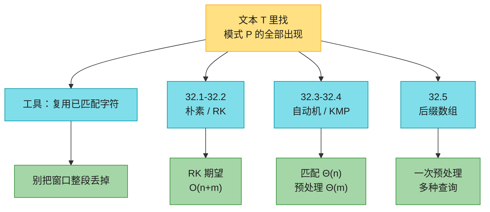
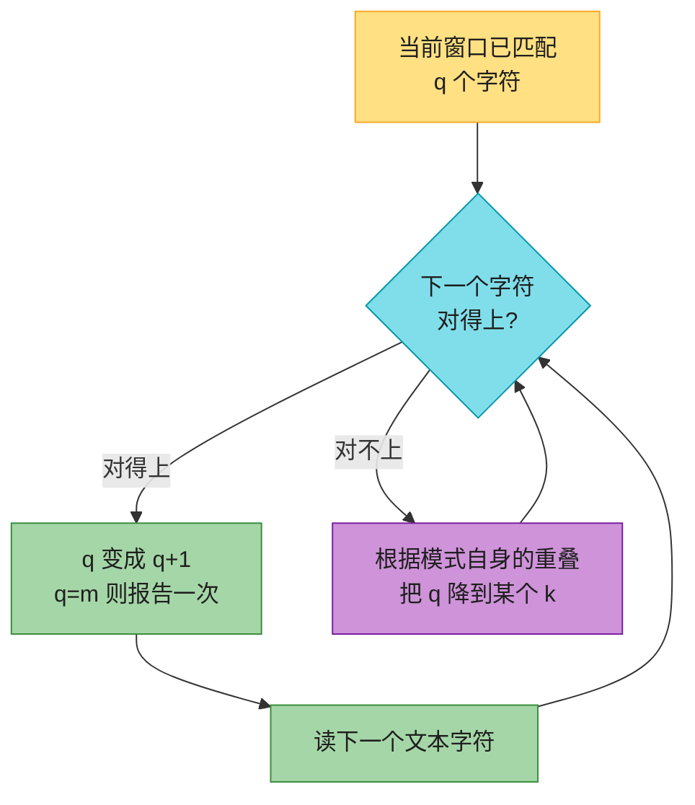
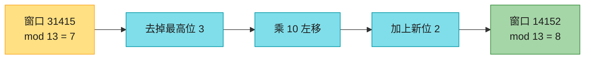
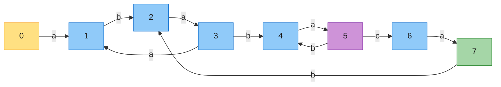
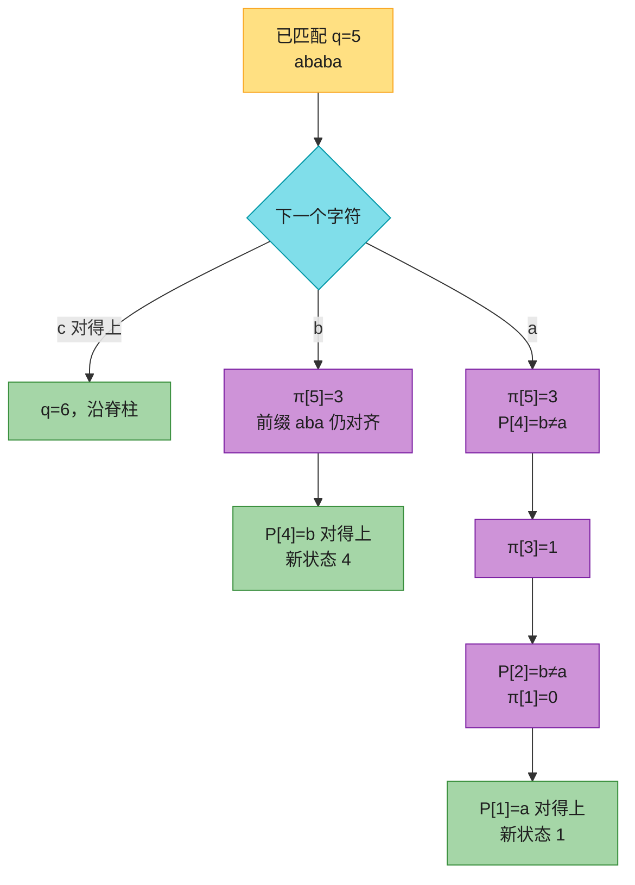
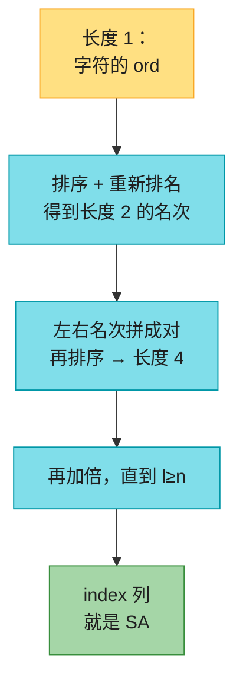
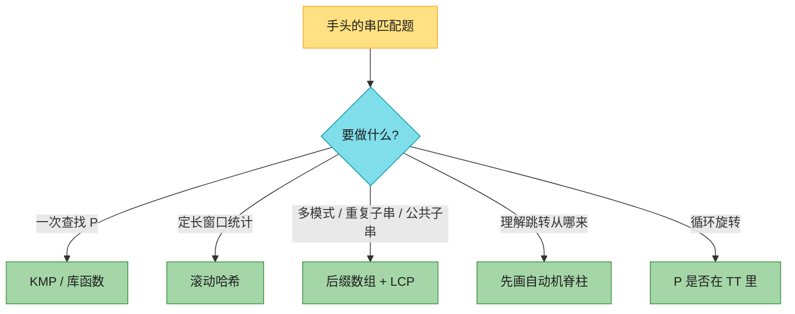

# 第 32 章：字符串匹配（String Matching）——深度版

## 一、开篇定位

本章回答一个问题：**在长文本 $T[1..n]$ 里找出模式 $P[1..m]$ 的全部出现位置，能不能比「每个对齐都比一遍」的 $\Theta(nm)$ 更快？**文本编辑器的查找、DNA 里扫基因片段、搜索引擎抽关键词，都是这件事。形式化：字符来自有限字母表 $\Sigma$，位移 $s$（$0\le s\le n-m$）合法当且仅当 $T[s+1..s+m]=P$。求全部合法位移。

朴素算法每个位移最多比 $m$ 个字符，最坏 $\Theta((n-m+1)m)$，两个串都是 `aaa…` 时紧。后面四个算法的共同策略是：**先在模式上做预处理，匹配时复用已经看见的字符**。第四版相对第三版的关键扩写是 **32.5 后缀数组**：同一套预处理不仅能查模式，还能回答「最长重复子串」「两个文本的最长公共子串」。

与前后章节的关系：

- **第 31 章**：Rabin-Karp 的滚动哈希就是模运算；选素数 $q$ 让 $dq$ 装进一个机器字；
- **第 16 章摊还**：KMP 的 `while` 用聚合分析证明总共 $O(n)$，不是「每步 $O(m)$」；
- **第 8 章计数排序**：后缀数组每轮排序的键是 $0..n$ 的整数，基数排序把 $O(n\lg^2 n)$ 降到 $\Theta(n\lg n)$；
- **第 12 章**：后缀数组排好之后，查模式就是在有序后缀上二分；
- **第 15.3 节 Huffman**：思考题 32-3 的 BWT 把相同字符挤到一起，后面才能跑 MTF / 游程 / Huffman。

做题定位：LeetCode **不考手写有限自动机转移表**。能直接练的是 KMP 的前缀函数（28、459、1392、214）、滚动哈希（187、1044）、以及「先建 SA/LCP 再查询」的思路（1044、718、1698）。本章要带走的三句话：**失配时模式自己跟自己对齐，信息在 $\pi$ 数组里**；**哈希相等只是候选，必须再比一遍真字符**；**后缀数组把「所有子串」变成「有序的后缀」，LCP 把相邻公共前缀变成一次 $O(1)$ 查询。**

**本章主线**：朴素滑动 → 滚动哈希 RK → 自动机一次扫过 → KMP 用 $\pi$ 代替 $\delta$ → 后缀数组 / LCP → Java + Python → 速查 / 易混 → 题单与习题。



原书各算法的预处理 / 匹配时间（总和才是运行时间）：

| 算法 | 预处理 | 匹配 |
|------|--------|------|
| 朴素 | $0$ | $O((n-m+1)m)$ |
| Rabin-Karp | $\Theta(m)$ | 最坏 $O((n-m+1)m)$，期望 $O(n+m)$（$q\ge m$ 且合法位移 $O(1)$） |
| 有限自动机 | $O(m\|\Sigma\|)$ | $\Theta(n)$ |
| KMP | $\Theta(m)$ | $\Theta(n)$ |
| 后缀数组 | $O(n\lg n)$（思考题 32-2 可到 $\Theta(n)$） | $O(m\lg n+km)$，$k$ 是出现次数 |

---

## 二、核心思想：窗口对过的字符不要作废

大白话：把模式当成一张纸，从左往右贴到文本上。朴素算法对不齐就整张纸右移 1 格，刚才比过的字符全忘。其实已经知道文本里刚看过的那一段——它等于模式的某个前缀。下一步该移多少、已经对齐了几个字符，都可以只看模式自己。

三个层次：

- **Rabin-Karp**：不记住字符结构，只记住窗口的整数指纹。滑一格 = 去掉最高位、乘进制、加新字符，全部模 $q$。指纹不同一定对不上；指纹相同再逐字符确认（假阳性叫 **spurious hit**）；
- **自动机 / KMP**：状态 $=$「当前已匹配的模式前缀长度」。读入下一个字符，要么长度 $+1$，要么跳到某个更短的前缀。自动机把跳转做成表 $\delta$；KMP 用更短的数组 $\pi$ 现场算 $\delta$；
- **后缀数组**：换问题形态。$T$ 的每个出现位置对应一个后缀。把 $n$ 个后缀按字典序排好，同一模式的出现一定挤在一段连续区间里，二分即可。

重叠后缀引理（后面跳转靠它）：若 $x,y$ 都是 $z$ 的后缀，则较短的那个一定是较长那个的后缀；一样长则相等。



记号：$P[\,..k]$ 表示 $P$ 的 $k$ 字符前缀（$P[\,..0]=\varepsilon$ 空串）。$w\sqsubset x$ 表示 $w$ 是 $x$ 的前缀，$w\sqsupset x$ 表示后缀。空串是任何串的前缀也是后缀。

---

## 三、朴素匹配（32.1）

### 3.1 直觉

枚举每一个位移 $s=0,1,\ldots,n-m$，检查 $P[1..m]$ 是否等于 $T[s+1..s+m]$。比较从左到右，碰到第一处不同就停。

### 3.2 示意图

原书 Figure 32.3：$T=\texttt{acaabc}$，$P=\texttt{aab}$。四个位移，只有 $s=2$ 合法。

**$s=0$**：第 1 格就对不上（$c\neq a$）。

| 下标 | 0 | 1 | 2 | 3 | 4 | 5 |
|------|---|---|---|---|---|---|
| $T$ | a | **c** | a | a | b | c |
| $P$ | a | **a** | b | | | |

**$s=1$**：第 0 格 $c\neq a$，立刻停。

| 下标 | 0 | 1 | 2 | 3 | 4 | 5 |
|------|---|---|---|---|---|---|
| $T$ | a | **c** | a | a | b | c |
| $P$ | | **a** | a | b | | |

**$s=2$**：三格全中。

| 下标 | 0 | 1 | 2 | 3 | 4 | 5 |
|------|---|---|---|---|---|---|
| $T$ | a | c | **a** | **a** | **b** | c |
| $P$ | | | **a** | **a** | **b** | |

**$s=3$**：第 1 格 $b\neq a$。

| 下标 | 0 | 1 | 2 | 3 | 4 | 5 |
|------|---|---|---|---|---|---|
| $T$ | a | c | a | **a** | **b** | c |
| $P$ | | | | **a** | **a** | b |

### 3.3 伪代码（1-indexed）

```
NAIVE-STRING-MATCHER(T, P, n, m)
1  for s = 0 to n - m
2      if P[1..m] == T[s+1..s+m]
3          print "Pattern occurs with shift" s
```

### 3.4 复杂度

最坏 $\Theta((n-m+1)m)$，紧：文本 $a^n$、模式 $a^m$。$m=\lfloor n/2\rfloor$ 时就是 $\Theta(n^2)$。无预处理。

随机串上其实不差（32.1-3）：每个位移的期望比较次数 $<2$，总期望 $O(n)$。坏在最坏情况，以及它完全不复用信息——若 $P=\texttt{aaab}$ 且 $s=0$ 合法，则 $s=1,2,3$ 都不必试（$T[4]=b$ 对不上 $P$ 的前缀）。

模式字符两两不同时，失配发生在模式第 $j$ 位（1-indexed）可以把位移推进 $j-1$（文本指针留在失配字符上、模式复位），总时间 $O(n)$（32.1-2）。不能推进 $j$——会把失配字符本身跳过，漏掉从它开头的匹配。

LeetCode：**28** 可以用朴素过小数据，面试默认写 KMP。

---

## 四、Rabin-Karp（32.2）

### 4.1 直觉

把长度为 $m$ 的窗口看成 $d$ 进制整数（$d=|\Sigma|$，十进制例子里 $d=10$）。模式的值是 $p$，窗口 $T[s+1..s+m]$ 的值是 $t_s$。$t_s=p$ 当且仅当这一段真的相等。

Horner 法则 $O(m)$ 算出 $p$ 和 $t_0$。之后滑一格只做常数次算术：

$$
t_{s+1}=d\cdot(t_s-T[s+1]\cdot d^{m-1})+T[s+m+1].
$$

先减掉最高位，再乘进制左移，再加上新的最低位。例如 $m=5$，$t_s=31415$，新字符 $2$，最高位 $3$：

$$
t_{s+1}=10\cdot(31415-3\cdot 10000)+2=14152.
$$

数太大装不进机器字时，全部模素数 $q$（让 $dq$ 刚好装进一个字）。模相等 **不蕴涵** 真相等，只是快速过滤器：模不同一定非法；模相同叫一次 **hit**，再逐字符确认。确认失败就是 **spurious hit**。

### 4.2 滚动一步



原书 Figure 32.4：模式 $31415\equiv 7\pmod{13}$。文本窗口指纹等于 $7$ 的有两处：一处真匹配，一处 spurious hit。

### 4.3 伪代码（1-indexed）

```
RABIN-KARP-MATCHER(T, P, n, m, d, q)
1  h = d^{m-1} mod q
2  p = 0
3  t0 = 0
4  for i = 1 to m                          // preprocessing
5      p  = (d p + P[i]) mod q
6      t0 = (d t0 + T[i]) mod q
7  for s = 0 to n - m                      // matching
8      if p == ts
9          if P[1..m] == T[s+1..s+m]
10             print "Pattern occurs with shift" s
11     if s < n - m
12         ts+1 = (d (ts - T[s+1] h) + T[s+m+1]) mod q
```

循环不变式：第 8 行执行时，$t_s=T[s+1..s+m]\bmod q$。

### 4.4 复杂度

预处理 $\Theta(m)$。匹配最坏仍 $\Theta((n-m+1)m)$：每个位移都是真匹配（$P=a^m$，$T=a^n$），每次确认都要 $m$。

期望：把模 $q$ 当成随机映射，spurious hit 约 $O(n/q)$。合法位移 $v$ 个时，期望匹配时间

$$
O(n)+O(m(v+n/q)).
$$

$v=O(1)$ 且 $q\ge m$ 时就是 $O(n+m)$。实践里 $q$ 取 $10^9+7$ 这类大素数，假阳性极稀。

多模式（32.2-2）：同长 $k$ 个模式，预处理 $k$ 个指纹放进哈希表，每个窗口 $O(1)$ 查。不同长则按长度分组，或对每个长度维护一个滚动哈希。二维子串（32.2-3）：每行先滚成哈希，再对「哈希组成的列」做一维 RK。

LeetCode：**187** 重复的 DNA 序列（长度固定 10，滚动哈希最合适）、**1044** 最长重复子串（二分长度 + RK）。

---

## 五、有限自动机（32.3）

### 5.1 直觉

造一台只认「以 $P$ 结尾」的机器。状态 $0,1,\ldots,m$：状态 $q$ 的意思是「最近读到的字符里，与 $P$ 对齐的最长前缀长度是 $q$」。状态 $m$ 是唯一接受态，每进一次 $m$ 就找到一次出现。

转移 $\delta(q,a)$ 必须等于：把 $P$ 的前 $q$ 个字符再拼上 $a$ 之后，这个新串的最长「$P$-前缀后缀」的长度。定义后缀函数

$$
\sigma(x)=\max\{k:P[\,..k]\sqsupset x\}.
$$

则 $\delta(q,a)=\sigma(P[\,..q]\,a)$。沿「脊柱」走的边是继续匹配（$a=P[q+1]$，$\delta=q+1$）；其余边是失配回退。

### 5.2 示意图

原书 Figure 32.6，$P=\texttt{ababaca}$，$\Sigma=\{a,b,c\}$。蓝边是脊柱，到达 7 就是一次命中。没画出来的边默认回 $0$。



状态 5 最能说明回退：刚读完 `ababa`。下一个若是 $c$，沿脊柱到 6；若是 $b$，最近字符变成 `ababab`，最长能对齐的 $P$-前缀是 `abab`，所以 $\delta(5,b)=4$。

完整转移表（行 $=$ 状态，列 $=$ $a,b,c$；脊柱上的格子即继续匹配）：

| 状态 | a | b | c |
|------|---|---|---|
| 0 | 1 | 0 | 0 |
| 1 | 1 | 2 | 0 |
| 2 | 3 | 0 | 0 |
| 3 | 1 | 4 | 0 |
| 4 | 5 | 0 | 0 |
| 5 | 1 | 4 | 6 |
| 6 | 7 | 0 | 0 |
| 7 | 1 | 2 | 0 |

在 $T=\texttt{abababacaba}$ 上跑，状态序列：

| $T[i]$ | a | b | a | b | a | b | a | c | a | b | a |
|--------|---|---|---|---|---|---|---|---|---|---|---|
| 状态 | 1 | 2 | 3 | 4 | 5 | 4 | 5 | 6 | **7** | 2 | 3 |

第 9 个字符后进入状态 7，位移 $s=9-7=2$（0-indexed 起点 2）。

### 5.3 伪代码（1-indexed）

匹配本身是一行转移，时间 $\Theta(n)$：

```
FINITE-AUTOMATON-MATCHER(T, δ, n, m)
1  q = 0
2  for i = 1 to n
3      q = δ(q, T[i])
4      if q == m
5          print "Pattern occurs with shift" i - m
```

原书 COMPUTE-TRANSITION-FUNCTION 按定义枚举 $k$，时间 $O(m^3|\Sigma|)$。用下一节的 $\pi$ 可以压到 $O(m|\Sigma|)$（习题 32.4-8）：

- 若 $q<m$ 且 $a=P[q+1]$，则 $\delta(q,a)=q+1$；
- 否则 $\delta(q,a)=\delta(\pi[q],a)$（$q=0$ 时为 $0$，除非 $a=P[1]$）。

正确性的一句话：读完 $T[\,..i]$ 之后，状态恰好是 $\sigma(T[\,..i])$——当前能对齐的最长 $P$-前缀。进状态 $m$ 当且仅当 $P$ 刚结束。

### 5.4 复杂度

预处理 $O(m|\Sigma|)$（用 $\pi$ 构造），匹配 $\Theta(n)$，每个文本字符恰好看一次。字母表巨大时表太大，这正是 KMP 要省掉的那一维 $|\Sigma|$。

LeetCode：不考手写 $\delta$ 表。自动机是理解 KMP 的跳板。

---

## 六、Knuth-Morris-Pratt（32.4）

### 6.1 直觉

自动机的 $\delta$ 有 $\Theta(m|\Sigma|)$ 项。KMP 只预计算长度为 $m$ 的 **前缀函数** $\pi$：

$$
\pi[q]=\max\{k:k<q\text{ 且 }P[\,..k]\sqsupset P[\,..q]\}.
$$

$\pi[q]$ 是「$P$ 的前 $q$ 个字符」的最长真前缀，且它还是这段的后缀。已经匹配了 $q$ 个字符再失配，下一步不必从 $0$ 开始：新位移让长度为 $\pi[q]$ 的前缀继续对齐，已经比过的 $\pi[q]$ 个字符不用再比。

原书 Figure 32.9：$P=\texttt{ababaca}$，当前 $q=5$ 个字符已中，第 6 个失配。$s+1$ 一定非法（模式的 $a$ 会对上一个 $b$）。$s'=s+2$ 能对齐 $k=3$ 个字符；$s+4$ 也能对齐但只剩 $k=1$。选最长的 $k$，也就是最小的新位移。这个 $k$ 正是 $\pi[5]=3$。

$P=\texttt{ababaca}$ 的完整 $\pi$（1-indexed）：

| $i$ | 1 | 2 | 3 | 4 | 5 | 6 | 7 |
|-----|---|---|---|---|---|---|---|
| $P[i]$ | a | b | a | b | a | c | a |
| $\pi[i]$ | 0 | 0 | 1 | 2 | 3 | 0 | 1 |

0-indexed 实现里同一张表写成 `[0, 0, 1, 2, 3, 0, 1]`，$\pi[i]$ 对应原书 $\pi[i+1]$。失配时原书写 $q=\pi[q]$，代码写 `q = pi[q-1]`。

迭代 $\pi$ 能列出 **全部** 合法回退长度：$\pi^*[5]=\{3,1,0\}$。KMP 失配时就按这个序列从长到短试，直到下一个字符对得上，或退到 $0$。

### 6.2 失配回退



这与 $\delta(5,c)=6$、$\delta(5,b)=4$、$\delta(5,a)=1$ 完全一致。KMP 没有存整张表，现场沿着 $\pi^*$ 走。

### 6.3 伪代码（1-indexed）

```
KMP-MATCHER(T, P, n, m)
1  π = COMPUTE-PREFIX-FUNCTION(P, m)
2  q = 0
3  for i = 1 to n
4      while q > 0 and P[q+1] ≠ T[i]
5          q = π[q]
6      if P[q+1] == T[i]
7          q = q + 1
8      if q == m
9          print "Pattern occurs with shift" i - m
10         q = π[q]                 // 准备找下一次重叠出现

COMPUTE-PREFIX-FUNCTION(P, m)
1  let π[1..m] be a new array
2  π[1] = 0
3  k = 0
4  for q = 2 to m
5      while k > 0 and P[k+1] ≠ P[q]
6          k = π[k]
7      if P[k+1] == P[q]
8          k = k + 1
9      π[q] = k
10 return π
```

第 10 行必须有：否则下一次循环会读 $P[m+1]$。找到一次匹配后，把它当成「在状态 $m$ 失配」，用 $\pi[m]$ 继续。

两段代码结构相同：KMP 拿 $T$ 去对 $P$，算 $\pi$ 拿 $P$ 去对 $P$ 自己。

### 6.4 复杂度

算 $\pi$ 是 $\Theta(m)$：`k` 从 $0$ 起，每次 `k++` 最多 $m-1$ 次，`while` 里每次 `k=π[k]` 严格变小且非负，总减少量不超过总增加量。匹配同样摊还 $\Theta(n)$（32.4-4 聚合 / 32.4-5 势能）。预处理不再乘 $|\Sigma|$。

习题 32.4-6 的 $\pi'$：若 $\pi[q]\neq 0$ 且 $P[\pi[q]+1]=P[q+1]$，则 $\pi'[q]=\pi'[\pi[q]]$——下一字符反正还会失配，提前跳过。这就是竞赛里的「优化 next」。

LeetCode：**28** 找出第一次出现（KMP 模板）、**459** 重复的子字符串（$\pi[n-1]$ 整除 $n$）、**1392** 最长快乐前缀（就是 $\pi[n-1]$）、**214** 最短回文串（$S\#S^R$ 的 $\pi$）、**796** 旋转字符串（32.4-7）。

---

## 七、后缀数组与 LCP（32.5）

### 7.1 直觉

前面四个算法都是「给定 $P$，扫 $T$」。后缀数组把 $T$ 预处理成一本有序词典：每一页是 $T$ 的一个后缀。模式的每次出现都是某个后缀的前缀，词典序下它们排在一起，二分就能取出整段。

$T[i..]$ 表示从位置 $i$ 起到末尾的后缀。**后缀数组** $SA[1..n]$：$SA[i]=j$ 表示字典序第 $i$ 小的后缀是 $T[j..]$。**名次数组** $\mathrm{rank}$ 是逆映射：$\mathrm{rank}[SA[i]]=i$。**LCP 数组**：$LCP[i]$ 是排在第 $i-1$ 与第 $i$ 的两个后缀的最长公共前缀长度；$LCP[1]=0$。

原书 Figure 32.11，$T=\texttt{ratatat}$，$n=7$（表里 $SA/\mathrm{rank}$ 是 1-indexed）：

| $i$ | $SA[i]$ | $\mathrm{rank}[i]$ | $LCP[i]$ | 后缀 $T[SA[i]..]$ |
|-----|---------|-------------------|---------|------------------|
| 1 | 6 | 4 | 0 | `at` |
| 2 | 4 | 3 | 2 | `atat` |
| 3 | 2 | 7 | 4 | `atatat` |
| 4 | 1 | 2 | 0 | `ratatat` |
| 5 | 7 | 6 | 0 | `t` |
| 6 | 5 | 1 | 1 | `tat` |
| 7 | 3 | 5 | 3 | `tatat` |

0-indexed：$SA=[5,3,1,0,6,4,2]$，$LCP=[0,2,4,0,0,1,3]$。

`at` 出现三次，正好占 $SA$ 的第 1–3 格。二分找到任意一次之后，向两边扩到不再以 $P$ 开头为止。一次比较 $O(m)$，二分 $O(\lg n)$ 次，再输出 $k$ 个出现，总 $O(m\lg n+km)$。

最长重复子串：$\max LCP[i]$ 那一行，$T[SA[i]\,..\,SA[i]+LCP[i]-1]$。这里最大值 $LCP[3]=4$，$SA[3]=2$，子串 $T[2..5]=\texttt{atat}$（1-indexed）。

### 7.2 倍增构造 $O(n\lg n)$

先按长度 $1$ 的字符排序，再反复把「已排序的长度 $l$ 块」拼成长度 $2l$。键不是子串本身，而是左右两半的 **整数名次**：$s_1$ 的左半名次小于 $s_2$ 的左半，则无论右半如何，$s_1$ 整体更小。



$T=\texttt{ratatat}$ 第一轮（长度 2）排序后，三个 `at` 排在最前，`ra`、`t`、两个 `ta` 随后。名次压缩成 $1..\#\{\text{不同块}\}$。下一轮 $l=2$ 拼出长度 $\le 4$，再一轮 $l=4$ 已经覆盖 $n=7$，结束。

每轮若用归并/堆排序是 $O(n\lg n)$，共 $\lg n$ 轮 → $O(n\lg^2 n)$。左右名次都是 $0..n$ 的整数，**先按 right-rank 计数排序、再按 left-rank 计数排序**，每轮 $\Theta(n)$，总共 $\Theta(n\lg n)$。这就是原书 COMPUTE-SUFFIX-ARRAY。所有名次已经互不相同可以提前停（32.5-2）。

思考题 32-2 的 DC3 / skew：递归排 $2/3$ 的「采样后缀」，再用它们线性排剩下 $1/3$，最后线性归并。$T(n)\le T(2n/3)+\Theta(n)=\Theta(n)$。

### 7.3 Kasai 算法：$\Theta(n)$ 求 LCP

按 **文本位置** $i=1,2,\ldots,n$ 的顺序填 $LCP[\mathrm{rank}[i]]$，而不是按 $SA$ 的顺序。关键观察：若后缀 $T[i-1..]$ 与它的词典前驱 LCP 为 $l>1$，则丢掉首字符之后，$T[i..]$ 与它的前驱 LCP **至少** $l-1$。所以下一轮比较可以从 $l-1$ 接着往下数，不必从 $0$ 开始。

`h` 每次 `while` 加一，每次循环末尾最多减一，且 `h<n`，所以 `while` 总次数 $O(n)$。

### 7.4 伪代码要点（1-indexed）

COMPUTE-LCP 的核心循环：

```
COMPUTE-LCP(T, SA, n)
1  for i = 1 to n
2      rank[SA[i]] = i
3  LCP[1] = 0
4  l = 0
5  for i = 1 to n
6      if rank[i] > 1
7          j = SA[rank[i] - 1]
8          while i+l ≤ n and j+l ≤ n and T[i+l] == T[j+l]
9              l = l + 1
10         LCP[rank[i]] = l
11         if l > 0
12             l = l - 1
13 return LCP
```

两个文本的最长公共子串（32.5-3）：拼 $T_1+\#+T_2$（$\#$ 不出现在两边），建 SA+LCP，在「一个后缀来自 $T_1$、相邻一个来自 $T_2$」的位置上取最大 $LCP$。

### 7.5 复杂度

| 操作 | 时间 |
|------|------|
| 倍增 + 基数排序建 SA | $\Theta(n\lg n)$ |
| DC3 建 SA（32-2） | $\Theta(n)$ |
| Kasai 建 LCP | $\Theta(n)$ |
| 二分找 $P$ 的全部 $k$ 次出现 | $O(m\lg n+km)$ |
| 最长重复子串 | $\Theta(n)$（SA+LCP 已有） |

KMP 单次查找更快（$\Theta(n+m)$），但换一个 $P$ 就要重新扫 $T$。后缀数组付一次 $O(n\lg n)$，之后每个模式 $O(m\lg n+km)$，还附赠重复子串、公共子串、不同子串个数（$n(n+1)/2-\sum LCP[i]$）。

LeetCode：**1044** 最长重复子串、**718** 最长重复子数组（可 SA，也可 DP）、**1698** 不同子字符串的数量。

---

## 八、代码实现（Java + Python）

约定：伪代码保持原书 **1-indexed**；下面两份可运行代码统一 **0-indexed**。换算：

- 原书位移 $s$ $=$ 代码里的起始下标；
- 原书 $\pi[q]$ $=$ 代码 `pi[q-1]`；KMP 失配时原书 $q=\pi[q]$，代码 `q = pi[q-1]`；
- 原书 $SA[i]=j$（$j$ 从 1 起）$=$ 代码 `sa[i] = j-1`。

空模式约定为在 $0..n$ 每个位置都匹配（与「$n-m+1$ 个位移」一致）。Rabin-Karp 对空模式必须特判，否则 $m=0$ 时滚动公式会把指纹滚飞。自动机构造用 $\pi$ 在 $O(m|\Sigma|)$ 完成（32.4-8），不是原书 $O(m^3|\Sigma|)$ 的三重循环。后缀数组倍增用比较排序，每轮 $O(n\lg n)$、总共 $O(n\lg^2 n)$；把那一轮换成基数排序即原书 $\Theta(n\lg n)$。

下面两份从本文原样抽出即可编译运行；`main` 核对 Figure 32.1 / 32.3 / 32.6 / 32.11、习题 32.2-1 与 32.4-1，并用 400 组随机串对拍朴素 / KMP / RK / 自动机 / SA。

### 8.1 Java

```java
import java.util.ArrayList;
import java.util.Arrays;
import java.util.List;
import java.util.Random;

/**
 * CLRS 第 32 章：朴素匹配、Rabin-Karp、有限自动机、KMP、后缀数组 / LCP。
 * 一律 0-indexed。返回值是模式在文本中出现的起始下标（原书的 shift s）。
 */
public class StringMatching {

    static List<Integer> naive(String t, String p) {
        int n = t.length(), m = p.length();
        List<Integer> out = new ArrayList<>();
        for (int s = 0; s <= n - m; s++) {
            int j = 0;
            while (j < m && t.charAt(s + j) == p.charAt(j)) j++;
            if (j == m) out.add(s);
        }
        return out;
    }

    static List<Integer> rabinKarp(String t, String p, int d, int q) {
        int n = t.length(), m = p.length();
        List<Integer> out = new ArrayList<>();
        if (m == 0) {
            for (int i = 0; i <= n; i++) out.add(i);
            return out;
        }
        if (m > n) return out;
        long h = 1;
        for (int i = 0; i < m - 1; i++) h = h * d % q;
        long pat = 0, win = 0;
        for (int i = 0; i < m; i++) {
            pat = (d * pat + tCode(p, i)) % q;
            win = (d * win + tCode(t, i)) % q;
        }
        for (int s = 0; s <= n - m; s++) {
            if (pat == win && t.regionMatches(s, p, 0, m)) out.add(s);
            if (s < n - m) {
                win = (d * (win - tCode(t, s) * h) + tCode(t, s + m)) % q;
                if (win < 0) win += q;
            }
        }
        return out;
    }

    static int tCode(String s, int i) {
        return s.charAt(i) & 0xffff;
    }

    /** π[i] = P[0..i] 的最长真前缀且是后缀的长度。 */
    static int[] prefixFunction(String p) {
        int m = p.length();
        int[] pi = new int[m];
        int k = 0;
        for (int q = 1; q < m; q++) {
            while (k > 0 && p.charAt(k) != p.charAt(q)) k = pi[k - 1];
            if (p.charAt(k) == p.charAt(q)) k++;
            pi[q] = k;
        }
        return pi;
    }

    static List<Integer> kmp(String t, String p) {
        int n = t.length(), m = p.length();
        List<Integer> out = new ArrayList<>();
        if (m == 0) {
            for (int i = 0; i <= n; i++) out.add(i);
            return out;
        }
        int[] pi = prefixFunction(p);
        int q = 0;
        for (int i = 0; i < n; i++) {
            while (q > 0 && p.charAt(q) != t.charAt(i)) q = pi[q - 1];
            if (p.charAt(q) == t.charAt(i)) q++;
            if (q == m) {
                out.add(i - m + 1);
                q = pi[q - 1];
            }
        }
        return out;
    }

    /**
     * δ[q][c]：已匹配 q 个字符后再读 c 转到的状态。
     * 用前缀函数 O(m|Σ|) 构造，对应习题 32.4-8，不是原书 O(m³|Σ|) 的朴素三重循环。
     */
    static int[][] computeTransition(String p, int sigma, int base) {
        int m = p.length();
        int[] pi = prefixFunction(p);
        int[][] delta = new int[m + 1][sigma];
        for (int q = 0; q <= m; q++) {
            for (int c = 0; c < sigma; c++) {
                char a = (char) (base + c);
                if (q < m && p.charAt(q) == a) delta[q][c] = q + 1;
                else if (q == 0) delta[q][c] = 0;
                else delta[q][c] = delta[pi[q - 1]][c];
            }
        }
        return delta;
    }

    static List<Integer> automatonMatch(String t, String p, int sigma, int base) {
        int n = t.length(), m = p.length();
        List<Integer> out = new ArrayList<>();
        if (m == 0) {
            for (int i = 0; i <= n; i++) out.add(i);
            return out;
        }
        int[][] delta = computeTransition(p, sigma, base);
        int q = 0;
        for (int i = 0; i < n; i++) {
            int c = t.charAt(i) - base;
            q = (c >= 0 && c < sigma) ? delta[q][c] : 0;
            if (q == m) out.add(i - m + 1);
        }
        return out;
    }

    /** Manber-Myers 倍增。每轮用比较排序 → O(n lg² n)；改成基数排序即原书 Θ(n lg n)。 */
    static int[] suffixArray(String t) {
        int n = t.length();
        Integer[] sa = new Integer[n];
        int[] ra = new int[n];
        for (int i = 0; i < n; i++) {
            sa[i] = i;
            ra[i] = t.charAt(i);
        }
        for (int k = 1; k < n; k *= 2) {
            final int kk = k;
            final int[] rank = ra;
            Arrays.sort(sa, (a, b) -> {
                if (rank[a] != rank[b]) return Integer.compare(rank[a], rank[b]);
                int xa = a + kk < n ? rank[a + kk] : -1;
                int xb = b + kk < n ? rank[b + kk] : -1;
                return Integer.compare(xa, xb);
            });
            int[] nra = new int[n];
            nra[sa[0]] = 0;
            for (int i = 1; i < n; i++) {
                int a = sa[i - 1], b = sa[i];
                boolean diff = rank[a] != rank[b]
                        || (a + kk < n ? rank[a + kk] : -1) != (b + kk < n ? rank[b + kk] : -1);
                nra[b] = nra[a] + (diff ? 1 : 0);
            }
            ra = nra;
            if (ra[sa[n - 1]] == n - 1) break;
        }
        int[] out = new int[n];
        for (int i = 0; i < n; i++) out[i] = sa[i];
        return out;
    }

    /** Kasai：给定 SA，Θ(n) 求 LCP。lcp[i] = SA[i-1] 与 SA[i] 的 LCP，lcp[0]=0。 */
    static int[] computeLcp(String t, int[] sa) {
        int n = t.length();
        int[] rank = new int[n];
        for (int i = 0; i < n; i++) rank[sa[i]] = i;
        int[] lcp = new int[n];
        int h = 0;
        for (int i = 0; i < n; i++) {
            if (rank[i] == 0) continue;
            int j = sa[rank[i] - 1];
            while (i + h < n && j + h < n && t.charAt(i + h) == t.charAt(j + h)) h++;
            lcp[rank[i]] = h;
            if (h > 0) h--;
        }
        return lcp;
    }

    static int compareSuffixToPattern(String t, int start, String p) {
        int n = t.length(), m = p.length();
        int k = 0;
        while (k < m && start + k < n) {
            char a = t.charAt(start + k), b = p.charAt(k);
            if (a != b) return a < b ? -1 : 1;
            k++;
        }
        if (k == m) return 0;
        return -1;
    }

    static List<Integer> saFind(String t, int[] sa, String p) {
        int n = t.length();
        int lo = 0, hi = n;
        while (lo < hi) {
            int mid = (lo + hi) >>> 1;
            if (compareSuffixToPattern(t, sa[mid], p) < 0) lo = mid + 1;
            else hi = mid;
        }
        int left = lo;
        lo = 0;
        hi = n;
        while (lo < hi) {
            int mid = (lo + hi) >>> 1;
            if (compareSuffixToPattern(t, sa[mid], p) <= 0) lo = mid + 1;
            else hi = mid;
        }
        List<Integer> out = new ArrayList<>();
        for (int i = left; i < lo; i++) out.add(sa[i]);
        out.sort(Integer::compareTo);
        return out;
    }

    static String longestRepeated(String t) {
        if (t.isEmpty()) return "";
        int[] sa = suffixArray(t);
        int[] lcp = computeLcp(t, sa);
        int best = 0, at = 0;
        for (int i = 1; i < lcp.length; i++) {
            if (lcp[i] > best) {
                best = lcp[i];
                at = sa[i];
            }
        }
        return t.substring(at, at + best);
    }

    static boolean cyclicRotation(String a, String b) {
        return a.length() == b.length() && kmp(a + a, b).size() > 0;
    }

    static void eqList(List<Integer> a, List<Integer> b, String msg) {
        if (!a.equals(b)) throw new AssertionError(msg + " " + a + " vs " + b);
    }

    static void eq(Object a, Object b, String msg) {
        if (!a.equals(b)) throw new AssertionError(msg + " " + a + " vs " + b);
    }

    static List<Integer> sortedCopy(List<Integer> xs) {
        List<Integer> y = new ArrayList<>(xs);
        y.sort(Integer::compareTo);
        return y;
    }

    public static void main(String[] args) {
        eqList(naive("abcabaabcabac", "abaa"), Arrays.asList(3), "fig32.1");
        eqList(kmp("abcabaabcabac", "abaa"), Arrays.asList(3), "kmp fig32.1");
        eqList(naive("acaabc", "aab"), Arrays.asList(2), "fig32.3");
        eq(Arrays.toString(prefixFunction("ababaca")), "[0, 0, 1, 2, 3, 0, 1]", "pi ababaca");
        eq(Arrays.toString(prefixFunction("ababbabbabbababbabb")),
                "[0, 0, 1, 2, 0, 1, 2, 0, 1, 2, 0, 1, 2, 3, 4, 5, 6, 7, 8]", "32.4-1");

        String rkT = "3141592653589793", rkP = "26";
        int q = 11, d = 10, m = 2, n = rkT.length();
        long h = 1;
        for (int i = 0; i < m - 1; i++) h = h * d % q;
        long pat = 0, win = 0;
        for (int i = 0; i < m; i++) {
            pat = (d * pat + (rkP.charAt(i) - '0')) % q;
            win = (d * win + (rkT.charAt(i) - '0')) % q;
        }
        int spur = 0, valid = 0;
        for (int s = 0; s <= n - m; s++) {
            if (pat == win) {
                if (rkT.regionMatches(s, rkP, 0, m)) valid++;
                else spur++;
            }
            if (s < n - m) {
                win = (d * (win - (rkT.charAt(s) - '0') * h) + (rkT.charAt(s + m) - '0')) % q;
                if (win < 0) win += q;
            }
        }
        eq(spur, 3, "32.2-1 spurious");
        eq(valid, 1, "32.2-1 valid");

        String rat = "ratatat";
        int[] sa = suffixArray(rat);
        eq(Arrays.toString(sa), "[5, 3, 1, 0, 6, 4, 2]", "SA ratatat");
        int[] lcp = computeLcp(rat, sa);
        eq(Arrays.toString(lcp), "[0, 2, 4, 0, 0, 1, 3]", "LCP ratatat");
        eq(longestRepeated(rat), "atat", "LRS ratatat");

        int[][] delta = computeTransition("ababaca", 3, 'a');
        eq(Arrays.toString(delta[5]), "[1, 4, 6]", "delta(5)");
        eq(Arrays.toString(delta[7]), "[1, 2, 0]", "delta(7)");
        eqList(automatonMatch("abababacaba", "ababaca", 3, 'a'), Arrays.asList(2), "fa fig32.6");

        eq(cyclicRotation("braze", "zebra"), true, "32.4-7");
        eq(cyclicRotation("braze", "zebar"), false, "not rotation");

        Random rng = new Random(32);
        for (int trial = 0; trial < 400; trial++) {
            int tn = 1 + rng.nextInt(40);
            int pm = rng.nextInt(8);
            StringBuilder tb = new StringBuilder();
            StringBuilder pb = new StringBuilder();
            for (int i = 0; i < tn; i++) tb.append((char) ('a' + rng.nextInt(4)));
            for (int i = 0; i < pm; i++) pb.append((char) ('a' + rng.nextInt(4)));
            String tt = tb.toString(), pp = pb.toString();
            List<Integer> gold = naive(tt, pp);
            eqList(kmp(tt, pp), gold, "kmp " + trial);
            eqList(rabinKarp(tt, pp, 256, 1_000_000_007), gold, "rk " + trial);
            eqList(automatonMatch(tt, pp, 4, 'a'), gold, "fa " + trial);
            if (pp.length() > 0) {
                eqList(sortedCopy(saFind(tt, suffixArray(tt), pp)), gold, "sa " + trial);
            }
        }
        for (int trial = 0; trial < 80; trial++) {
            int tn = 1 + rng.nextInt(20);
            StringBuilder tb = new StringBuilder();
            for (int i = 0; i < tn; i++) tb.append((char) ('a' + rng.nextInt(3)));
            String tt = tb.toString();
            String lrs = longestRepeated(tt);
            if (lrs.length() >= 2) {
                eq(naive(tt, lrs).size() >= 2, true, "lrs occurs twice");
            }
        }
        System.out.println("StringMatching: all checks passed");
    }
}
```

### 8.2 Python

```python
import random


def naive(t, p):
    n, m = len(t), len(p)
    return [s for s in range(n - m + 1) if t[s : s + m] == p]


def rabin_karp(t, p, d=256, q=10**9 + 7):
    n, m = len(t), len(p)
    if m == 0:
        return list(range(n + 1))
    if m > n:
        return []
    h = pow(d, max(m - 1, 0), q)
    pat = win = 0
    for i in range(m):
        pat = (d * pat + ord(p[i])) % q
        win = (d * win + ord(t[i])) % q
    out = []
    for s in range(n - m + 1):
        if pat == win and t[s : s + m] == p:
            out.append(s)
        if s < n - m:
            win = (d * (win - ord(t[s]) * h) + ord(t[s + m])) % q
    return out


def prefix_function(p):
    m = len(p)
    pi = [0] * m
    k = 0
    for q in range(1, m):
        while k > 0 and p[k] != p[q]:
            k = pi[k - 1]
        if p[k] == p[q]:
            k += 1
        pi[q] = k
    return pi


def kmp(t, p):
    n, m = len(t), len(p)
    if m == 0:
        return list(range(n + 1))
    pi = prefix_function(p)
    q = 0
    out = []
    for i in range(n):
        while q > 0 and p[q] != t[i]:
            q = pi[q - 1]
        if p[q] == t[i]:
            q += 1
        if q == m:
            out.append(i - m + 1)
            q = pi[q - 1]
    return out


def compute_transition(p, sigma, base):
    m = len(p)
    pi = prefix_function(p)
    delta = [[0] * sigma for _ in range(m + 1)]
    for q in range(m + 1):
        for c in range(sigma):
            a = chr(base + c)
            if q < m and p[q] == a:
                delta[q][c] = q + 1
            elif q == 0:
                delta[q][c] = 0
            else:
                delta[q][c] = delta[pi[q - 1]][c]
    return delta


def automaton_match(t, p, sigma, base):
    n, m = len(t), len(p)
    if m == 0:
        return list(range(n + 1))
    delta = compute_transition(p, sigma, base)
    q = 0
    out = []
    for i, ch in enumerate(t):
        c = ord(ch) - base
        q = delta[q][c] if 0 <= c < sigma else 0
        if q == m:
            out.append(i - m + 1)
    return out


def suffix_array(t):
    n = len(t)
    sa = list(range(n))
    ra = [ord(c) for c in t]
    k = 1
    while k < n:
        sa.sort(key=lambda i: (ra[i], ra[i + k] if i + k < n else -1))
        nra = [0] * n
        for i in range(1, n):
            a, b = sa[i - 1], sa[i]
            diff = (ra[a], ra[a + k] if a + k < n else -1) != (
                ra[b],
                ra[b + k] if b + k < n else -1,
            )
            nra[b] = nra[a] + diff
        ra = nra
        if ra[sa[-1]] == n - 1:
            break
        k *= 2
    return sa


def compute_lcp(t, sa):
    n = len(t)
    rank = [0] * n
    for i, p in enumerate(sa):
        rank[p] = i
    lcp = [0] * n
    h = 0
    for i in range(n):
        if rank[i] == 0:
            continue
        j = sa[rank[i] - 1]
        while i + h < n and j + h < n and t[i + h] == t[j + h]:
            h += 1
        lcp[rank[i]] = h
        if h:
            h -= 1
    return lcp


def compare_suffix_to_pattern(t, start, p):
    n, m = len(t), len(p)
    k = 0
    while k < m and start + k < n:
        a, b = t[start + k], p[k]
        if a != b:
            return -1 if a < b else 1
        k += 1
    return 0 if k == m else -1


def sa_find(t, sa, p):
    n = len(t)
    lo, hi = 0, n
    while lo < hi:
        mid = (lo + hi) // 2
        if compare_suffix_to_pattern(t, sa[mid], p) < 0:
            lo = mid + 1
        else:
            hi = mid
    left = lo
    lo, hi = 0, n
    while lo < hi:
        mid = (lo + hi) // 2
        if compare_suffix_to_pattern(t, sa[mid], p) <= 0:
            lo = mid + 1
        else:
            hi = mid
    return sorted(sa[i] for i in range(left, lo))


def longest_repeated(t):
    if not t:
        return ""
    sa = suffix_array(t)
    lcp = compute_lcp(t, sa)
    best = at = 0
    for i, v in enumerate(lcp):
        if v > best:
            best, at = v, sa[i]
    return t[at : at + best]


def cyclic_rotation(a, b):
    return len(a) == len(b) and len(kmp(a + a, b)) > 0


def main():
    assert naive("abcabaabcabac", "abaa") == [3]
    assert kmp("abcabaabcabac", "abaa") == [3]
    assert naive("acaabc", "aab") == [2]
    assert prefix_function("ababaca") == [0, 0, 1, 2, 3, 0, 1]
    assert prefix_function("ababbabbabbababbabb") == [
        0, 0, 1, 2, 0, 1, 2, 0, 1, 2, 0, 1, 2, 3, 4, 5, 6, 7, 8,
    ]

    t, p, q, d = "3141592653589793", "26", 11, 10
    n, m = len(t), len(p)
    h = pow(d, m - 1, q)
    pat = win = 0
    for i in range(m):
        pat = (d * pat + int(p[i])) % q
        win = (d * win + int(t[i])) % q
    spur = valid = 0
    for s in range(n - m + 1):
        if pat == win:
            if t[s : s + m] == p:
                valid += 1
            else:
                spur += 1
        if s < n - m:
            win = (d * (win - int(t[s]) * h) + int(t[s + m])) % q
    assert (spur, valid) == (3, 1)

    rat = "ratatat"
    sa = suffix_array(rat)
    assert sa == [5, 3, 1, 0, 6, 4, 2]
    assert compute_lcp(rat, sa) == [0, 2, 4, 0, 0, 1, 3]
    assert longest_repeated(rat) == "atat"

    delta = compute_transition("ababaca", 3, ord("a"))
    assert delta[5] == [1, 4, 6]
    assert delta[7] == [1, 2, 0]
    assert automaton_match("abababacaba", "ababaca", 3, ord("a")) == [2]
    assert cyclic_rotation("braze", "zebra")
    assert not cyclic_rotation("braze", "zebar")

    rng = random.Random(32)
    for trial in range(400):
        tt = "".join(chr(ord("a") + rng.randrange(4)) for _ in range(1 + rng.randrange(40)))
        pp = "".join(chr(ord("a") + rng.randrange(4)) for _ in range(rng.randrange(8)))
        gold = naive(tt, pp)
        assert kmp(tt, pp) == gold, trial
        assert rabin_karp(tt, pp) == gold, trial
        assert automaton_match(tt, pp, 4, ord("a")) == gold, trial
        if pp:
            assert sa_find(tt, suffix_array(tt), pp) == gold, trial
    for _ in range(80):
        tt = "".join(chr(ord("a") + rng.randrange(3)) for _ in range(1 + rng.randrange(20)))
        lrs = longest_repeated(tt)
        if len(lrs) >= 2:
            assert len(naive(tt, lrs)) >= 2
    print("all tests passed")


if __name__ == "__main__":
    main()
```

---

## 九、复杂度速查 + 易混点对比

### 9.1 速查表

| 问题 | 时间 | 备注 |
|------|------|------|
| 朴素匹配 | $\Theta((n-m+1)m)$ 最坏 | 随机串期望 $O(n)$ |
| RK 预处理 / 匹配 | $\Theta(m)$ / 最坏同朴素 | $q\ge m$、$v=O(1)$ 时期望 $O(n)$ |
| 自动机预处理 / 匹配 | $O(m\|\Sigma\|)$ / $\Theta(n)$ | 每个文本字符恰好一次 |
| KMP 预处理 / 匹配 | $\Theta(m)$ / $\Theta(n)$ | 摊还：`k` 的增减 |
| 倍增 SA（比较排序） | $O(n\lg^2 n)$ | 实现省事 |
| 倍增 SA（基数排序） | $\Theta(n\lg n)$ | 原书主算法 |
| DC3 建 SA | $\Theta(n)$ | 思考题 32-2 |
| Kasai LCP | $\Theta(n)$ | 依赖已有 SA |
| SA 上二分查找 | $O(m\lg n+km)$ | $k$ 次出现 |
| 最长重复子串 | 建 SA+LCP 的时间 | $\max LCP[i]$ |
| 循环旋转判定 | $\Theta(n)$ | $T$ 是否出现在 $T'T'$ 里 |

### 9.2 易混点对比

| 易混点 | 辨析 |
|-------|------|
| 位移 $s$ vs 起始下标 | 原书 $s$ 就是 0-indexed 起点。出现在 $T[s+1..s+m]$（1-indexed） |
| 前缀函数 $\pi$ vs 转移 $\delta$ | $\pi[q]$ 不依赖下一个字符；$\delta(q,a)$ 依赖 $a$。KMP 用 $\pi^*$ 现场还原 $\delta$ |
| 1-indexed $\pi[q]$ vs 代码 `pi[i]` | `pi[i] =` 原书 $\pi[i+1]$。失配 `q = pi[q-1]`，不是 `pi[q]` |
| 找到匹配后必须 `q=π[q]` | 否则下一步读 $P[m+1]$。重叠出现（`aaa` 在 `aaaa` 里）靠这一步 |
| hit vs 真匹配 | RK 指纹相等只是 hit。必须再比字符串。模不同才能直接否决 |
| spurious hit 不是 bug | 哈希碰撞。$q$ 越大越少。漏报不会发生：模不同 ⇒ 一定不等 |
| 自动机状态 $q$ vs 已匹配长度 | 就是同一件事。接受态 $m$ 表示刚读完整个 $P$，位移 $i-m$ |
| $\sigma$ vs $\pi$ | $\sigma(x)$ 对任意串；$x$ 取 $P$ 的前缀时，$\pi[q]=\sigma(P[\,..q])$ 但要求真后缀（$k<q$） |
| SA vs rank | $SA[i]$ 是「第 $i$ 小后缀从哪开始」；$\mathrm{rank}[j]$ 是「从 $j$ 开始的后缀排第几」 |
| LCP[i] 比较的是谁 | **相邻排名** $SA[i-1]$ 与 $SA[i]$，不是文本里相邻的 $T[i-1]$ 与 $T[i]$ |
| Kasai 按 $i=1..n$ 扫 | 扫的是文本下标，填的是 $LCP[\mathrm{rank}[i]]$。高度 $h$ 继承 $h-1$ |
| 单次查找 KMP 更快 | $\Theta(n+m)$ vs SA 的 $O(m\lg n)$。多模式、重复子串、公共子串才轮到 SA |
| 空模式 | $n+1$ 个位移。RK 滚动公式在 $m=0$ 下无定义，必须特判 |



---

## 十、LeetCode 题单 + 习题快问快答

### 10.1 LeetCode 题单

定位语：**不考手写 $\delta$ 表，考 KMP 的 $\pi$、滚动哈希、以及 SA/LCP 能回答的查询。** Java 的 `indexOf` / Python 的 `str.find` 底层一般是两路 BMH 或类似启发式，面试仍要求会写 KMP。

| 题号 | 题目 | 难度 | 考点 |
|-----|------|------|------|
| 28 | 找出字符串中第一个匹配项的下标 | 易 | KMP 模板；空 needle 返回 0 |
| 459 | 重复的子字符串 | 易 | $\pi[n-1]>0$ 且 $n\bmod(n-\pi[n-1])=0$ |
| 1392 | 最长快乐前缀 | 难 | 直接输出长度为 $\pi[n-1]$ 的前缀 |
| 214 | 最短回文串 | 难 | $S\#S^R$ 的 $\pi$：已经是回文的最长前缀 |
| 796 | 旋转字符串 | 易 | 32.4-7：等长且 $B$ 是 $AA$ 的子串 |
| 686 | 重复叠加字符串匹配 | 中 | $A$ 重复到覆盖 $B$，KMP 判定 |
| 187 | 重复的 DNA 序列 | 中 | 定长 10 滚动哈希；或位压缩 |
| 1044 | 最长重复子串 | 难 | 二分长度 + RK，或 SA+LCP 取 max |
| 718 | 最长重复子数组 | 中 | DP $O(nm)$；或 SA 把两数组拼起来 |
| 1062 | 最长重复子字符串 | 中 | 1044 的简化版 |
| 1698 | 字符串的不同子字符串个数 | 中 | $n(n+1)/2-\sum LCP$ |
| 1316 | 不同的循环子字符串 | 难 | 滚动哈希 / 后缀结构 |
| 1923 | 最长公共子路径 | 难 | 二分 + 多串 RK |
| 3008 | 找出数组中的美丽下标 II | 难 | 两次 KMP 找两个模式的出现 |
| 3036 | 匹配模式的子数组数目 II | 难 | 差分数组看成串，KMP |
| 1408 | 数组中的字符串匹配 | 易 | 多模式，暴力或 KMP |

竞赛向：AC 自动机（多模式自动机，32.3-5 的推广）、后缀自动机、带通配符匹配（FFT，第 30 章）。Boyer-Moore / Sunday 是实践里文本编辑器常用的启发式，第四版正文未收。

### 10.2 习题快问快答（第四版编号）

- **32.1-1** $P=0001$，$T=000010001010001$。合法位移 **1, 5, 11**（0-indexed）。各位移比较次数：4, **4**, 3, 2, 1, **4**, 3, 2, 1, 2, 1, **4**。
- **32.1-2** $P$ 字符互异：失配发生在模式第 $j$ 位（1-indexed）则位移加 $j-1$（文本指针停在失配字符、模式复位到 1；$j=1$ 时文本进 1）。反例：推进 $j$ 会漏掉 $P=\texttt{abc}$、$T=\texttt{ababc}$ 在位移 2 的匹配。每个文本字符最多被比较常数次，总 $O(n)$。
- **32.1-3** 每个位移的比较次数服从几何分布，期望 $(1-d^{-m})/(1-d^{-1})<2$。总期望 $<2(n-m+1)$。
- **32.1-4** 通配段 $\Diamond$ 把 $P$ 切成 $k$ 个字面片段。在 $T$ 上按顺序找片段（每个 KMP），或 DP：$dp[i][j]$ 表示 $T$ 前 $i$ 个能否匹配切出来的前 $j$ 段。多项式。
- **32.2-1** $q=11$，$P=26$，$T=3141592653589793$。指纹 $26\equiv 4\pmod{11}$。窗口 `15`,`59`,`92` 也 $\equiv 4$ 但不是 `26`，**3 次 spurious hit**；真匹配 1 次。
- **32.2-2** 同长：模式指纹放集合，窗口 $O(1)$ 查再验证。不同长：按长度分组，每组一个滚动哈希。
- **32.2-3** $n\times n$ 文本找 $m\times m$ 模式：每行滚动哈希成一行整数，再对列做一维 RK（窗口高 $m$）。
- **32.2-4** $A-B$ 是次数 $<n$ 的多项式，模素数 $q>1000n$ 最多 $n-1$ 个根。随机 $x$ 撞根的概率 $<n/q<1/1000$。
- **32.3-1** $P=\texttt{aabab}$ 的 $\pi=[0,1,0,1,0]$。$\delta$（列 $a,b$）：$0\mapsto(1,0)$，$1\mapsto(2,0)$，$2\mapsto(2,3)$，$3\mapsto(4,0)$，$4\mapsto(2,5)$，$5\mapsto(1,0)$。$T=\texttt{aaababaabaababaab}$ 的状态：`1,2,2,3,4,5,1,2,3,4,2,3,4,5,1,2,3`。命中终点 6 与 14（1-indexed），位移 **1 和 9**。
- **32.3-3** 不可重叠：除 $0$ 与自身外没有任何前缀是后缀。失配边几乎全回 $0$，只有 $a=P[1]$ 时回 1。脊柱仍是 $0\to 1\to\cdots\to m$。
- **32.3-4** $x\sqsupset y$ 且二者都是 $P$ 的前缀 $\Rightarrow$ $x$ 的最长 $P$-前缀后缀不会长过 $y$ 的，故 $\sigma(x)\le\sigma(y)$。
- **32.4-1** $P=\texttt{ababbabbabbababbabb}$ 的 $\pi$（0-indexed）：`[0,0,1,2,0,1,2,0,1,2,0,1,2,3,4,5,6,7,8]`。
- **32.4-2** $|\pi^*[q]|\le q$（元素都是小于 $q$ 的非负整数，且严格递减到 $0$）。$P=a^q$ 时 $\pi^*[q]=\{q-1,\ldots,0\}$，共 $q$ 个，界是紧的。
- **32.4-3** 对 $PT$ 算 $\pi$。若 $\pi[m+j]\ge m$（$j=1..n$），则 $P$ 在 $T$ 中结束于位置 $j$。更稳的写法是中间插一个不出现的分隔符。
- **32.4-4 / 32.4-5** 匹配循环里 $q$ 的增加 $\le n$，`while` 每次减少 $q$，总 $O(n)$。势能取当前 $q$。
- **32.4-6** $\pi'$ 跳过「下一字符必然再次失配」的状态，`while` 次数更少，最坏渐近不变。
- **32.4-7** $T$ 是 $T'$ 的循环旋转 $\iff$ $|T|=|T'|$ 且 $T$ 是 $T'T'$ 的子串。KMP 线性判定。`braze` 与 `zebra` 是，`zebar` 不是。
- **32.4-8** $\delta(q,a)=q+1$ 若还能沿脊柱；否则 $\delta(q,a)=\delta(\pi[q],a)$。按 $q$ 从小到大填表，$O(m|\Sigma|)$。
- **32.5-3** $T_1+\#+T_2$ 建 SA+LCP，只看跨过 $\#$ 的相邻后缀对，取最大 LCP。$k$ 个并列最长再扫一遍输出。
- **32.5-4** Markram 只检查 **SA 相邻** 且满足位置对称的 LCP。真回文的正 / 反后缀不一定相邻（中间插着同样前缀的其它后缀），会漏掉最长回文。反例 $T=\texttt{aabcaa}$：最长回文是 `aa`（长度 2），该方法只报告长度 1。

### 10.3 思考题选

- **32-1 重复因子匹配**（Galil–Seiferas）：$\rho(x)$ 是 $x=y^r$ 的最大 $r$。对每个前缀算 $\rho$，随机二进制模式的 $\rho^*(P)$ 期望 $O(1)$。匹配时每次至少推进 $\lfloor q/k\rfloor$ 格，$k=1+\rho^*(P)$，时间 $O(\rho^*(P)\,n+m)$。再加强可做到线性时间、除 $P$ 与 $T$ 外只 $O(1)$ 额外空间。
- **32-2 线性时间 SA（DC3 / skew）**：采样位置 $i\not\equiv 0\pmod 3$ 约占 $2/3$。三个字符打成元字符，递归求采样后缀的序；非采样后缀用二元组 $(T[i],r_{i+1})$ 线性排；两类用常数时间比较归并。$T(n)\le T(2n/3+2)+\Theta(n)=\Theta(n)$。
- **32-3 Burrows-Wheeler 变换**：$T$ 末尾加 `$`（比所有字符小），对全部循环移位排序，取每行最后一个字符。`rutabaga` 的 BWT 是 `agtbaa$ur`。由 SA 可 $\Theta(n)$ 得到：末列就是 `$` 左边那个字符。逆变换：对 BWT 做稳定名次 `rank`（相同字符按出现顺序加），从 `$` 起反复 `c = BWT[r]; r = rank[r]`，从后往前还原。BWT 把相同字符聚拢，后面接 MTF / 游程 / Huffman 做压缩。

### 10.4 章末注记

串匹配与自动机的关系见 Aho–Hopcroft–Ullman。KMP 由 Knuth、Pratt 与 Morris 独立发现后合写（1977）；更早 Matiyasevich 在二元字母表、二维图灵机上有类似算法。Rabin–Karp 是 Karp 与 Rabin。Galil–Seiferas 给出线性时间、常数额外空间的确定性算法。后缀数组由 Manber–Myers（1993）提出，正文的 $O(n\lg n)$ 就是他们的倍增。Kasai 等人给出线性时间 LCP。思考题 32-2 基于 Kärkkäinen–Sanders–Burkhardt 的 DC3。BWT 见 Burrows–Wheeler（1994）与 Manzini 的分析。

---

## 参考资料

- Cormen, T. H., Leiserson, C. E., Rivest, R. L., & Stein, C. (2022). *Introduction to Algorithms* (4th ed.). MIT Press. Chapter 32: String Matching, pp. 957–1002.
- Knuth, D. E., Morris, J. H., & Pratt, V. R. (1977). Fast pattern matching in strings.
- Karp, R. M., & Rabin, M. O. (1987). Efficient randomized pattern-matching algorithms.
- Manber, U., & Myers, G. (1993). Suffix arrays: A new method for on-line string searches.
- Kasai, T., et al. (2001). Linear-time longest-common-prefix computation in suffix arrays and its applications.
- Kärkkäinen, J., Sanders, P., & Burkhardt, S. (2006). Linear work suffix array construction.
- Burrows, M., & Wheeler, D. J. (1994). A block-sorting lossless data compression algorithm.
