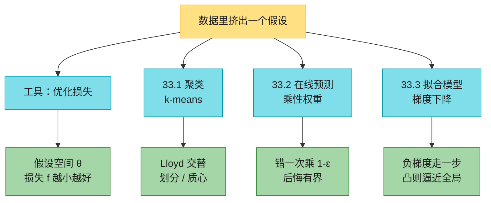
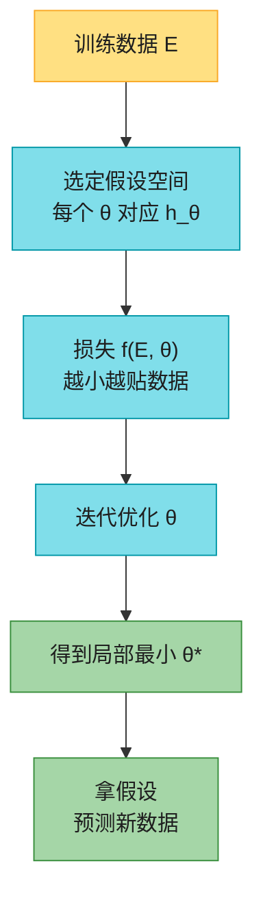
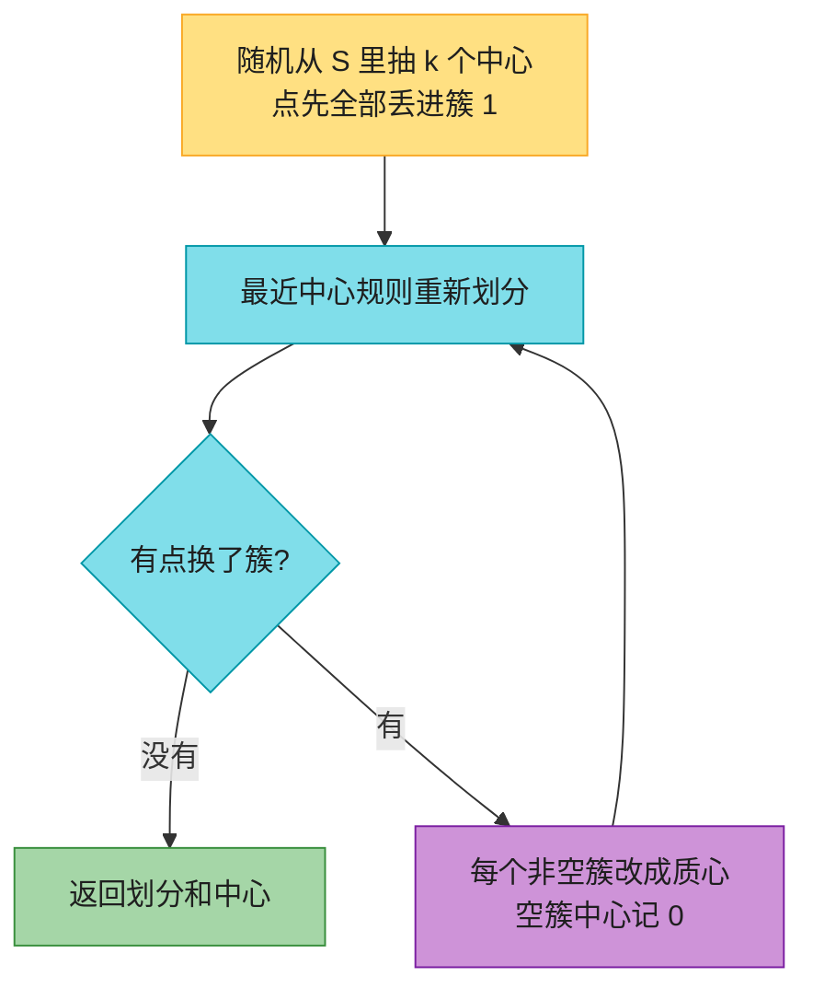
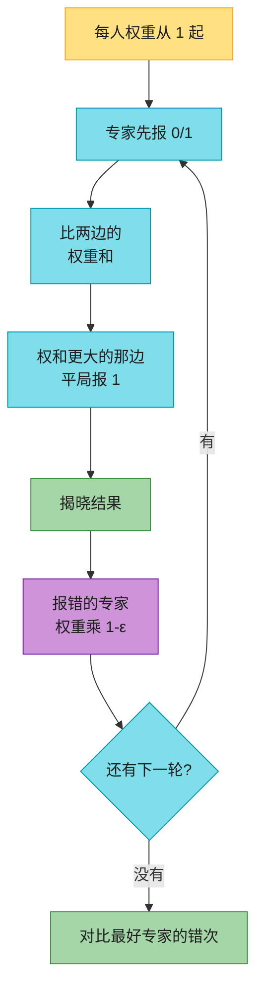
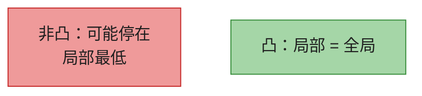
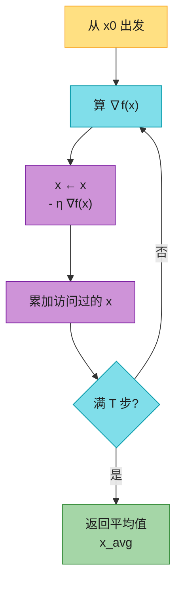
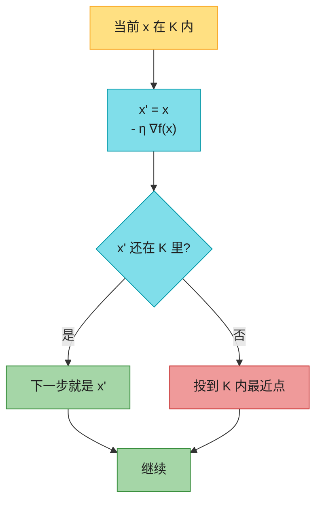
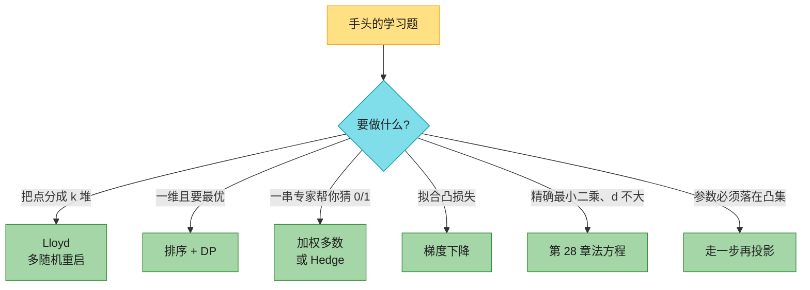

# 第 33 章：机器学习算法（Machine-Learning Algorithms）——深度版

## 一、开篇定位

本章回答一个问题：**手上有一批数据，怎样从里面挤出一个「假设」，用来分组、做预测、拟合模型？**第四版新开这一章，只挑三条骨架，不讲神经网络、不讲反向传播：

- **无监督**：把 $n$ 个点分成 $k$ 堆——$k$-means / Lloyd；
- **在线监督**：一串 0/1 事件，旁边坐着 $n$ 个专家，你要比最好的那个专家错得不太离谱——乘性权重 / 加权多数；
- **优化**：连续函数找极小——梯度下降，顺手拟合一条直线（线性回归）。

机器学习通常先训练、再预测；在线学习里这两步是缠在一起的。监督学要用带标签的例子（垃圾邮件 / 非垃圾邮件）；无监督没有标签，聚类就是在猜「中心在哪」；强化学习（下棋、自动驾驶）本章不讲。

与前后章节的关系：

- **第 27 章在线算法**：竞争比是跟**离线最优**比；本章后悔是跟**最好的那个专家**比。专家再差，你也只跟他比，不跟「上帝视角的最优预测」比；
- **第 16 章势能**：加权多数的总权重 $W$、梯度下降的 $\|x^{(t)}-x^\star\|^2$，都是势能。分析手法和 MOVE-TO-FRONT 同一套；
- **第 28.3 节最小二乘**：线性回归的精确解走法方程 $A^\top A\,c=A^\top y$。数据一大，求逆 $\Theta(d^3)$ 吃不消，才换成梯度下降，每次只要 $O(md)$；
- **第 29 章线性规划**：目标、约束都线性时走 LP。本章允许二次损失、球约束，用投影梯度；
- **第 34 章**：$k$-means 精确最优是 NP-hard，Lloyd 只保证局部最优。

做题定位：LeetCode **不考手写反向传播**。能直接练的是一维最优划分（1478、813、410——和 33.1-4 同一套 DP）、牛顿迭代开方（69）、按权重抽样（528，加权多数的随机版）。面试更常手写 **k-means**。本章要带走的三句话：**簇中心必须是质心，点必须跟最近中心**；**专家错了就把权重乘上 $1-\varepsilon$，别一票否决**；**凸函数上梯度下降走 $\Theta(1/\varepsilon^2)$ 步，误差减半就要步数乘 4**。

**本章主线**：假设空间 + 损失 + 优化 → Lloyd → 加权多数 → 梯度下降 / 投影 → 线性回归 → Java + Python → 速查 / 易混 → 题单与习题。



记号：本章向量用粗体 $\mathbf{x}=(x_1,\ldots,x_d)$，分量不粗。乘性权重的折扣写 $\varepsilon$，梯度下降的步长写 $\eta$，精度写 $\delta$——三个希腊字母别混（原书排版里有的地方看起来像同一个符号）。

---

## 二、核心思想：先定义「差」，再迭代往下压

大白话：机器学习不是「从数据里变出魔法」，是三步：

1. 选定一套参数 $\theta$，每个 $\theta$ 对应一个假设 $h_\theta$（$k$ 个中心、一条直线、一串专家权重）；
2. 写一个数 $f(E,\theta)$ 衡量「假设跟训练数据 $E$ 有多不合」，越小越好；
3. 用某种迭代把 $f$ 往下推，停在一个**局部**最小。

$k$-means 的 $\theta$ 是 $dk$ 维的中心序列，$h_\theta$ 是「跟最近中心一伙」；$f$ 是到最近中心的平方距离之和。加权多数的 $\theta$ 是专家权重。梯度下降直接在参数空间里沿着 $-\nabla f$ 走。

正则化（惩罚太复杂的假设、防止过拟合）可以加进 $f$，也可以加成约束 $\|\mathbf{w}\|\le B$。本章点到为止。



三条算法对应三种「差」：

| 问题 | 假设 | 差（损失） | 迭代 |
|------|------|-----------|------|
| 聚类 | $k$ 个中心 | 点到最近中心的平方距离之和 | 划分 ↔ 质心 |
| 专家预测 | 权重向量 | 你错的次数 vs 最好专家 | 错的专家权重 $\times(1-\varepsilon)$ |
| 拟合 | 模型参数 $\mathbf{w}$ | 预测与标签的平方误差 | $\mathbf{w}\leftarrow\mathbf{w}-\eta\nabla f$ |

---

## 三、$k$-means 与 Lloyd 过程（33.1）

### 3.1 直觉

$n$ 个例子，每个是 $d$ 维特征。目标：拆成至多 $k$ 个**不相交**的簇，让同一簇里的点彼此像。$k$ 本章当作输入（实践里有时要自己估）。

「像」用反过来的**不像**定义：平方欧氏距离

$$\delta(\mathbf{x},\mathbf{y})=\|\mathbf{x}-\mathbf{y}\|^2=\sum_{a=1}^{d}(x_a-y_a)^2.$$

选平方而不是直线距离，是因为它好求导：簇的最佳中心恰好是**质心**（各维的均值）。

特征要先洗。纬度 $[-90,90]$、经度 $[-180,180]$，尺度差一倍；GPA 和家庭收入更是差几个数量级。常用线性缩放到 $[0,1]$，或每维减均值除标准差。缺值：丢掉该点，或拿该维中位数填上。点可以重复，$S$ 是多重集。

一个 **$k$-聚类**是把 $S$ 拆成 $k$ 个不相交子集（允许空簇）。本章只讨论由 $k$ 个中心 $\mathbf{c}^{(1)},\ldots,\mathbf{c}^{(k)}\in\mathbb{R}^d$ 诱导的聚类：**最近中心规则**——点 $\mathbf{x}$ 进簇 $\ell$，当且仅当 $\mathbf{c}^{(\ell)}$ 是离它最近的中心之一。中心不必是 $S$ 里的点。平局任意破，但有一条硬纪律：**除非新中心严格更近，否则不要改一个点的簇**——否则算法可能在并列方案之间来回抖，不终止。

**$k$-means 问题**：找中心序列 $C$，最小化

$$f(S,C)=\sum_{\mathbf{x}\in S}\min_{1\le j\le k}\delta(\mathbf{x},\mathbf{c}^{(j)}).$$

精确最优是 NP-hard（连平面上的点都是）。Lloyd 找的是**局部**最小：中心已经是质心，点已经跟最近中心。这两个条件必要，不够充分（习题 33.1-2）。

### 3.2 两个局部最优条件

**质心公式**（簇 $S^{(\ell)}$ 非空）：

$$\mathbf{c}^{(\ell)}=\frac{1}{|S^{(\ell)}|}\sum_{\mathbf{x}\in S^{(\ell)}}\mathbf{x}.$$

定理：非空簇里，让 $\sum\delta(\mathbf{x},\mathbf{c})$ 最小的 $\mathbf{c}$ **唯一**就是质心。直觉：每个坐标是独立的凸二次，求导令为 0 就是该维的均值。空簇约定中心为零向量。

定理：中心固定时，最近中心规则（平局任意）让 $f$ 最小——每个点对总和只贡献一次，当然挑最近的。

于是一个「两边都最优」的迭代：按中心划分，再把中心改成质心，直到划分不再变。

### 3.3 示意图：Lloyd 在转什么

原书 Figure 33.1 把美国本土 48 州首府 + 华盛顿共 49 个点分成 $k=4$ 簇。初始中心随便抓了阿肯色、堪萨斯、路易斯安那、田纳西，$f=3659$。每一轮 $f$ 严格下降，第 10、11 轮都是 $1395.73$，停。

下面用 6 个点、$k=2$ 把同一过程摊开。点 $A..C$ 在原点附近，$D..F$ 在 $(10,10)$ 附近。初始中心取 $A$ 和 $D$。

| 点 | 坐标 |
|----|------|
| $A$ | $(0,0)$ |
| $B$ | $(1,0)$ |
| $C$ | $(0,1)$ |
| $D$ | $(10,10)$ |
| $E$ | $(10,11)$ |
| $F$ | $(11,10)$ |

**第 0 轮（初始）**：中心 $\mathbf{c}_1=(0,0)$，$\mathbf{c}_2=(10,10)$。

**第 1 轮划分**：

| 点 | 到 $\mathbf{c}_1$ 的 $\delta$ | 到 $\mathbf{c}_2$ 的 $\delta$ | 簇 |
|----|-------------------------------|-------------------------------|----|
| $A$ | $0$ | $200$ | 1 |
| $B$ | $1$ | $181$ | 1 |
| $C$ | $1$ | $181$ | 1 |
| $D$ | $200$ | $0$ | 2 |
| $E$ | $221$ | $1$ | 2 |
| $F$ | $221$ | $1$ | 2 |

质心：$\mathbf{c}_1=\bigl(\tfrac13,\tfrac13\bigr)$，$\mathbf{c}_2=\bigl(\tfrac{31}3,\tfrac{31}3\bigr)$。

$$f_{\text{old}}=2+2=4,\qquad f_{\text{new}}=\tfrac{4}{3}+\tfrac{4}{3}=\tfrac{8}{3}.$$

（对当前划分，每个簇用旧中心算平方和是 $0+1+1=2$，换成质心压到 $4/3$；两边各一簇，总代价 $4\to 8/3$。）

**第 2 轮划分**：六个点仍跟同一侧，划分不变，停。两组已经分开。



### 3.4 伪代码（1-indexed 风格）

```
LLOYD(S, k)
1  从 S 独立随机抽 k 个点当中心 c[1..k]
2  把所有点先放进簇 1
3  loop
4      用最近中心规则重划分（新中心必须严格更近才改簇）
5      if 没有任何点改簇
6          return 划分和中心
7      for ℓ = 1 to k
8          if 簇 ℓ 非空
9              c[ℓ] = 该簇的质心
10         else
11             c[ℓ] = 零向量
```

### 3.5 复杂度与实践

- 终止：每一轮（除最后一轮）$f$ 严格下降；划分只有 $\le k^n$ 种，所以有限步停。实践里 $k^n$ 吓死人，常用「$f$ 的相对下降低于阈值」提前停；
- 每轮：划分 $O(dkn)$，重算质心 $O(dn)$。总时间 $O(T d k n)$，$T$ 是轮数；
- 只保证局部最优 → **多随机几个初始中心，留 $f$ 最小的那次**；
- 大量重复点时，独立抽样容易抽到同一个点当两个中心。习题 33.1-3：改成尽量抽不同的点（无放回，或先对去重点均匀抽）。

$d=1$ 时精确最优是多项式的（33.1-4）：先排序，最优簇一定是一段连续区间，DP 即可。$d\ge 2$ 就 NP-hard。

另一个应用是**向量量化**（Figure 33.2）：照片每个像素是 24-bit RGB，当 $d=3$ 的点。Lloyd 压成 $k=4,16,64,256$ 种颜色，像素只存 $\lceil\lg k\rceil$ 位加一张调色板。有损压缩，颜色越少块状感越重。

LeetCode：没有原版 $k$-means。一维最优划分练 **1478**（L1 用中位数，L2 用均值，DP 骨架一样）、**813**、**410**。最近中心这一步的味道接近 **973**。

---

## 四、乘性权重与加权多数（33.2）

### 4.1 直觉

$T$ 件事要预测，每件结果 $o^{(t)}\in\{0,1\}$。旁边 $n$ 个专家，第 $t$ 轮专家 $i$ 先报 $q_i^{(t)}\in\{0,1\}$，你再报 $p^{(t)}$。报完才揭晓 $o^{(t)}$。你的总错次 $m=\sum_t|p^{(t)}-o^{(t)}|$，专家 $i$ 的错次 $m_i$，最好专家 $m^\star=\min_i m_i$。

**后悔** $m-m^\star$。目标：后悔不要太大。专家可以合谋骗你（博弈里真会发生），你对股票涨跌、天气也**不做任何分布假设**——这是第 27 章那套在线模型，比较对象换成「最好专家」而不是离线最优。

先看一个暖场：假如**真有一个专家从不错**。维护「目前还没错过」的集合 $S$，跟 $S$ 里的多数票。你每错一次，$S$ 至少被砍半（错的那一半出局）。$S$ 最多砍 $\lceil\lg n\rceil$ 次就只剩完美元老，之后你再不错。于是 $m\le\lceil\lg n\rceil$（引理 33.3）。

没有完美元老就把 $S$ 砍空：空了就重置为全体，再砍。每个阶段最好专家至少错 1 次才会让阶段结束（否则他一直留在 $S$ 里），阶段数 $O(m^\star)$，每阶段错次 $O(\lg n)$。原书写成 $m\le m^\star\lceil\lg n\rceil$。

加权多数更细：不要「错过一次就除名」，改成**信任打折**。每人一个权重，初始全是 1。按权重投票；谁错了，权重乘 $1-\varepsilon$（$0<\varepsilon\le 1/2$）。错得多的人声音自动变小。

### 4.2 示意图

3 个专家，$\varepsilon=1/2$，结果序列 $1,0,1$。专家预测：

| 轮 | $E_1$ | $E_2$ | $E_3$ | 结果 |
|----|-------|-------|-------|------|
| 1 | 1 | 0 | 1 | 1 |
| 2 | 1 | 0 | 0 | 0 |
| 3 | 1 | 0 | 1 | 1 |

权重演变（加粗是本轮被打折的）：

| 轮前权重 | up（报 1） | down（报 0） | 你的预测 | 对错 |
|----------|------------|--------------|----------|------|
| $1,1,1$ | $2$ | $1$ | 1 | 对，$E_2$ 乘 $1/2$ |
| $1,0.5,1$ | $1$ | $1.5$ | 0 | 对，$E_1$ 乘 $1/2$ |
| $0.5,0.5,1$ | $1.5$ | $0.5$ | 1 | 对，$E_2$ 再乘 $1/2$ |

结束权重 $0.5,0.25,1$。你错 $0$ 次，最好专家 $E_3$ 也是 $0$。$E_2$ 错了两回，权重大约只剩 $1/4$。



### 4.3 伪代码（1-indexed）

```
WEIGHTED-MAJORITY(E, T, n, ε)
1  for i = 1 to n
2      w[i] = 1
3  for t = 1 to T
4      每个专家 i 给出 q[i]
5      upweight   = 所有 q[i]==1 的 w[i] 之和
6      downweight = 所有 q[i]==0 的 w[i] 之和
7      if upweight >= downweight
8          p = 1
9      else
10         p = 0
11     揭晓 o
12     for i = 1 to n
13         if q[i] != o
14             w[i] = (1-ε) * w[i]
15     输出 p
```

### 4.4 界：比最好专家差多少

势能取总权重 $W=\sum_i w_i$，初始 $W=n$。专家 $i$ 错了 $m_i$ 次则 $w_i=(1-\varepsilon)^{m_i}$。

你每错一次，多数派（权和 $\ge W/2$）被打 $\varepsilon$ 折，于是 $W\leftarrow W(1-\varepsilon/2)$。不错的轮次 $W$ 只减不增。$T'$ 轮之后 $W\le n(1-\varepsilon/2)^{m}$，又 $W\ge w_i=(1-\varepsilon)^{m_i}$。两边取对数、用 $\ln(1-x)\le -x$ 和 $\ln(1-x)\ge -x-x^2$（$0<x\le 1/2$），得到对**任意**专家、任意前缀：

$$m\le 2(1+\varepsilon)\,m_i+\frac{2\ln n}{\varepsilon}.$$

对最好专家就是 $m\le 2(1+\varepsilon)m^\star+(2\ln n)/\varepsilon$。直觉：**前面那个 2 来自「多数派至少一半」**，所以确定性投票比随机版多付一倍。

选 $\varepsilon=\sqrt{(\ln n)/m^\star}$（假设这项 $\le 1/2$）可整理成 $m\le 2m^\star+4\sqrt{m^\star\ln n}$——主项是最好专家的两倍，附加项通常比 $m^\star$ 涨得慢。

$\varepsilon=1/2$ 时至多 $3m^\star+4\ln n$ 次错。数字例子：20 个专家、1000 轮、最好专家 95% 正确（错 50 次），取 $\varepsilon=1/4$，你至多错 149 次，正确率至少 85%。

随机化（33.2-4）：把权重当成分布，抽一个专家、照抄他。期望错次 $\le(1+\varepsilon)m^\star+(\ln n)/\varepsilon$，前面的 2 没了。思考题 33-2 的 Hedge 把折扣改成 $e^{-\varepsilon}$，期望 $\le m^\star+(\ln n)/\varepsilon+\varepsilon T$。

推广：预测和结果可以是实数，用损失而不是 0/1 对错，权重按损失连乘。同类界仍然成立。这一族算法还能拿来近似解 LP、多商品流，以及 boosting。

LeetCode：**528** 按权重抽样就是随机加权多数的「抽专家」那一步；确定性投票本身几乎不出现在题库里。后悔分析和第 27 章一起记。

---

## 五、梯度下降（33.3）

### 5.1 直觉

连续函数 $f:\mathbb{R}^n\to\mathbb{R}$，想找一个局部最小。站在山坡上，看哪边最陡往下，走一小步；地形变了再看。梯度 $\nabla f$ 是「函数值局部涨得最快」的方向，所以走 $-\nabla f$。

一维时梯度就是 $f'$。步子太小，爬得慢；步子太大，会跨过谷底甚至走到更高处。非凸时只能保证局部最小——从 $x^{(0)}$ 顺着下坡走，到不了隔壁更深的谷。

凸函数（线段在图像上方）：$f(\lambda\mathbf{x}+(1-\lambda)\mathbf{y})\le\lambda f(\mathbf{x})+(1-\lambda)f(\mathbf{y})$。凸 ⇒ 局部最小就是全局最小。可微凸函数躺在自己的切平面上方：

$$f(\mathbf{y})\ge f(\mathbf{x})+\langle\nabla f(\mathbf{x}),\mathbf{y}-\mathbf{x}\rangle,$$

笔记里后面分析用的是它的改写 $f(\mathbf{x})\le f(\mathbf{y})+\langle\nabla f(\mathbf{x}),\mathbf{x}-\mathbf{y}\rangle$。



### 5.2 无约束梯度下降

固定步长乘数 $\eta>0$，走 $T$ 步。原书返回的不是最后一点 $x^{(T)}$，而是前 $T$ 个点的平均 $x_{\mathrm{avg}}$——分析凸函数时，平均能把「有的步走过头、有的步太短」抹平。实践里更常返回 $x^{(T)}$，或再用线搜索挑步长。

```
GRADIENT-DESCENT(f, x0, η, T)
1  sum = 0
2  for t = 0 to T-1
3      sum = sum + x^{(t)}
4      x^{(t+1)} = x^{(t)} - η * (∇f)(x^{(t)})
5  return sum / T
```

理想情况（凸、步长合适）：每步沿着负梯度走，越靠近最低点梯度越小、步长越短，到 $x^\star$ 的距离单调下降。反例：非凸停在局部；$\eta$ 太大越过最低点，函数值反而升。

一维示意 $f(x)=\tfrac12(x-3)^2$，$f'(x)=x-3$，从 $x=0$、$\eta=0.4$ 走 4 步（这里返回序列本身，方便看轨迹）：

| $t$ | $x^{(t)}$ | $f'(x)$ | $x-\eta f'$ | $f(x)$ |
|-----|-----------|---------|-------------|--------|
| 0 | $0.00$ | $-3.00$ | $1.20$ | $4.50$ |
| 1 | $1.20$ | $-1.80$ | $1.92$ | $1.62$ |
| 2 | $1.92$ | $-1.08$ | $2.35$ | $0.58$ |
| 3 | $2.35$ | $-0.65$ | $2.61$ | $0.21$ |
| 4 | $2.61$ | | | $0.08$ |

在往 3 靠近，$f$ 单调降。若 $\eta=2$，一步从 0 跳到 $0-2\cdot(-3)=6$，已经越过 3 且 $f$ 一样大，再走会发散——步长不能随便取。



### 5.3 凸函数上的速度（结论即可）

记 $R=\|x^{(0)}-x^\star\|$（起步离最优多远），$L$ 是沿途梯度范数的上界 $\|\nabla f(x^{(t)})\|\le L$。取 $\eta=R/(L\sqrt{T})$，则

$$f(x_{\mathrm{avg}})-f(x^\star)\le\frac{RL}{\sqrt{T}}.$$

想要误差 $\le\delta$，需要 $T\ge R^2 L^2/\delta^2$ 步。**误差减半，步数乘 4**。势能取 $\|x^{(t)}-x^\star\|^2/(2\eta)$，摊还进度每步至多 $\eta L^2/2$，再 Jensen（平均值的 $f$ ≤ $f$ 的平均）把点列平均送回函数值——和第 16 章同一套「势能 + 摊还」。

$R$ 和 $L$ 事先不知道（知道 $x^\star$ 就不需要下降了）。实践：

- 线搜索：先试一个小 $s$ 让 $f$ 下降，再倍增直到不再降，然后在 $[s,2s]$ 里二分。不固定 $\eta$ 往往更稳；
- 问题结构会送上 $R,L$ 的上界（下一节球约束就是）。

每步的瓶颈是算梯度，复杂度完全取决于 $f$。

### 5.4 约束：先走一步，再投影回来

$x$ 必须落在闭凸体 $K$ 里（线段整个在 $K$ 内，且含极限点）。算法几乎原样，只多一步：无约束更新得到 $x'$ 后，把它拉回 $K$ 里离 $x'$ 最近的点 $\Pi_K(x')$。

```
GRADIENT-DESCENT-CONSTRAINED(f, x0, η, T, K)
1  要求 x0 ∈ K
2  for t = 0 to T-1
3      累加 x^{(t)}
4      x' = x^{(t)} - η ∇f(x^{(t)})
5      x^{(t+1)} = Π_K(x')
6  return 平均
```

关键几何：最优 $x^\star\in K$。把 $K$ 外的 $x'$ 投到边界点 $b$，不会离 $x^\star$ 更远（$\|b-x^\star\|\le\|x'-x^\star\|$）。钝角 + 勾股：投影之后势能不会比无约束更新更差，所以**迭代次数的渐近界原样成立**。



球约束 $K=\{\mathbf{w}:\|\mathbf{w}\|\le B\}$ 的投影特别干净：$\|\mathbf{w}'\|\le B$ 则不动，否则缩放到边界 $\mathbf{w}\leftarrow\mathbf{w}'\cdot B/\|\mathbf{w}'\|$。此时 $R=O(B)$、$L=O(B)$（线性回归那套损失），$T$ 步之后误差 $O(B^2/\sqrt{T})$。

### 5.5 两个应用

**解 $A\mathbf{x}=\mathbf{b}$（近似）。** $f(\mathbf{x})=\tfrac12\mathbf{x}^\top A\mathbf{x}-\mathbf{b}^\top\mathbf{x}$ 的梯度是 $A\mathbf{x}-\mathbf{b}$。若 $A$ 对称正定（Hessian 是 $A$），$f$ 凸，最小值点就是 $A\mathbf{x}=\mathbf{b}$。高斯消元 $\Theta(n^3)$；只想要近似、且 $R,L$ 不太大时，梯度下降每步一次矩阵-向量乘 $O(n^2)$，步数跟 $1/\delta^2$ 走，矩阵很大时有时更划算。一维原型：解 $ax=b$（$a\ge 0$）= 最小化 $\tfrac12 ax^2-bx$。

**线性回归。** $m$ 个病人，每人 $d$ 个属性 $\mathbf{x}^{(i)}$，标签 $y^{(i)}$（心脏病严重程度）。假设线性

$$f(\mathbf{x})=w_0+\sum_{j=1}^{d}w_j x_j,$$

损失取平方和 $\sum_i\bigl(f(\mathbf{x}^{(i)})-y^{(i)}\bigr)^2$。这是 $w_0,\ldots,w_d$ 的凸函数（线性的平方和）。梯度第 $j$ 个分量对每个样本是线性的，整个梯度 $O(md)$，与输入规模线性。第 28 章精确解要弄 $(d+1)\times(d+1)$ 的法方程；维度高时下降通常更快。权重归一化之后，绝对值大的维就是更强的预测因子。

过拟合：给权重加 $\|\mathbf{w}\le B\|$，就是上一节的球约束投影。

用梯度下降直接做 $k$-means（33.3-7）也行：把 $k$ 个中心当成 $dk$ 维参数，损失就是 $f(S,C)$。Lloyd 可以看成「划分固定时对中心做一步精确最小化，中心固定时对划分做一步精确最小化」的坐标下降；普通 GD 则是中心连续挪。

LeetCode：牛顿开方 **69**（思考题 33-1 的根查找）；线搜索的味道接近二分 **875**。回归本身几乎不出现。

---

## 六、代码实现（Java + Python）

约定：伪代码保持原书 **1-indexed** 风格；下面两份可运行代码统一 **0-indexed**。点用 `double[]`，簇编号 $0..k-1$。平方距离 $\delta$ 不先开方。加权多数平局报 1，与原书 `upweight >= downweight` 一致。梯度下降返回前 $T$ 个点的平均。

下面两份从本文原样抽出即可编译运行；`main` 核对 3.3 节 6 点例子、加权多数 3 专家轨迹、一维二次下降，并用随机实例对拍：Lloyd 的 $f$ 不低于一维 DP 最优、加权多数不超过定理界、线性回归逼近法方程。

### 6.1 Java

```java
import java.util.Arrays;
import java.util.Random;

/**
 * CLRS 第 33 章：Lloyd k-means、加权多数、梯度下降、一维最优聚类 DP。
 * 一律 0-indexed。
 */
public class MachineLearning {

    static double dist2(double[] a, double[] b) {
        double s = 0;
        for (int i = 0; i < a.length; i++) {
            double d = a[i] - b[i];
            s += d * d;
        }
        return s;
    }

    static double[][] copyPoints(double[][] pts) {
        double[][] out = new double[pts.length][];
        for (int i = 0; i < pts.length; i++) out[i] = pts[i].clone();
        return out;
    }

    static class KMeansResult {
        int[] assign;
        double[][] centers;
        double f;
        int iters;
    }

    /**
     * Lloyd。初始中心：无放回尽量抽不同点（33.1-3）；点不够再补零向量。
     * 平局保留旧簇，除非新中心严格更近。
     */
    static KMeansResult lloyd(double[][] points, int k, Random rng, int maxIter) {
        int n = points.length, d = points[0].length;
        int[] idx = new int[n];
        for (int i = 0; i < n; i++) idx[i] = i;
        for (int i = n - 1; i > 0; i--) {
            int j = rng.nextInt(i + 1);
            int tmp = idx[i];
            idx[i] = idx[j];
            idx[j] = tmp;
        }
        double[][] centers = new double[k][d];
        int take = Math.min(k, n);
        for (int i = 0; i < take; i++) centers[i] = points[idx[i]].clone();
        int[] assign = new int[n];
        KMeansResult res = new KMeansResult();
        int it = 0;
        for (; it < maxIter; it++) {
            boolean changed = false;
            for (int i = 0; i < n; i++) {
                int best = assign[i];
                double bestD = dist2(points[i], centers[best]);
                for (int c = 0; c < k; c++) {
                    double di = dist2(points[i], centers[c]);
                    if (di < bestD) {
                        bestD = di;
                        best = c;
                    }
                }
                if (best != assign[i]) {
                    assign[i] = best;
                    changed = true;
                }
            }
            if (it > 0 && !changed) break;
            int[] cnt = new int[k];
            double[][] sum = new double[k][d];
            for (int i = 0; i < n; i++) {
                int c = assign[i];
                cnt[c]++;
                for (int a = 0; a < d; a++) sum[c][a] += points[i][a];
            }
            for (int c = 0; c < k; c++) {
                if (cnt[c] == 0) {
                    Arrays.fill(centers[c], 0.0);
                } else {
                    for (int a = 0; a < d; a++) centers[c][a] = sum[c][a] / cnt[c];
                }
            }
        }
        res.assign = assign;
        res.centers = centers;
        res.iters = it;
        res.f = kmeansF(points, centers);
        return res;
    }

    static double kmeansF(double[][] points, double[][] centers) {
        double f = 0;
        for (double[] x : points) {
            double best = Double.POSITIVE_INFINITY;
            for (double[] c : centers) best = Math.min(best, dist2(x, c));
            f += best;
        }
        return f;
    }

    /** 一维最优 k-means：点先排序，簇必须是连续段。O(k n^2)。 */
    static double optimal1D(double[] xs, int k) {
        int n = xs.length;
        double[] a = xs.clone();
        Arrays.sort(a);
        double[] pref = new double[n + 1];
        double[] pref2 = new double[n + 1];
        for (int i = 0; i < n; i++) {
            pref[i + 1] = pref[i] + a[i];
            pref2[i + 1] = pref2[i] + a[i] * a[i];
        }
        double[][] cost = new double[n][n];
        for (int l = 0; l < n; l++) {
            for (int r = l; r < n; r++) {
                int cnt = r - l + 1;
                double sum = pref[r + 1] - pref[l];
                double sum2 = pref2[r + 1] - pref2[l];
                double mean = sum / cnt;
                cost[l][r] = sum2 - mean * mean * cnt;
            }
        }
        double[][] dp = new double[k + 1][n];
        for (int i = 0; i < n; i++) dp[1][i] = cost[0][i];
        for (int c = 2; c <= k; c++) {
            Arrays.fill(dp[c], Double.POSITIVE_INFINITY);
            for (int i = c - 1; i < n; i++) {
                for (int t = c - 2; t < i; t++) {
                    dp[c][i] = Math.min(dp[c][i], dp[c - 1][t] + cost[t + 1][i]);
                }
            }
        }
        return dp[k][n - 1];
    }

    static class WMResult {
        int[] preds;
        double[] weights;
        int mistakes;
    }

    static WMResult weightedMajority(int[][] expertPred, int[] outcome, double eps) {
        int n = expertPred.length, T = outcome.length;
        double[] w = new double[n];
        Arrays.fill(w, 1.0);
        int[] preds = new int[T];
        int m = 0;
        for (int t = 0; t < T; t++) {
            double up = 0, down = 0;
            for (int i = 0; i < n; i++) {
                if (expertPred[i][t] == 1) up += w[i];
                else down += w[i];
            }
            preds[t] = up >= down ? 1 : 0;
            if (preds[t] != outcome[t]) m++;
            for (int i = 0; i < n; i++) {
                if (expertPred[i][t] != outcome[t]) w[i] *= (1 - eps);
            }
        }
        WMResult r = new WMResult();
        r.preds = preds;
        r.weights = w;
        r.mistakes = m;
        return r;
    }

    /** 随机加权多数（33.2-4）：按权重抽一个专家，照抄。 */
    static int randomizedWM(int[][] expertPred, int[] outcome, double eps, Random rng) {
        int n = expertPred.length, T = outcome.length;
        double[] w = new double[n];
        Arrays.fill(w, 1.0);
        int m = 0;
        for (int t = 0; t < T; t++) {
            double z = 0;
            for (double wi : w) z += wi;
            double u = rng.nextDouble() * z, acc = 0;
            int pick = n - 1;
            for (int i = 0; i < n; i++) {
                acc += w[i];
                if (u < acc) {
                    pick = i;
                    break;
                }
            }
            if (expertPred[pick][t] != outcome[t]) m++;
            for (int i = 0; i < n; i++) {
                if (expertPred[i][t] != outcome[t]) w[i] *= (1 - eps);
            }
        }
        return m;
    }

    /** 有完美元老时的多数淘汰；S 空则重置（33.2-1）。 */
    static int majorityReset(int[][] expertPred, int[] outcome) {
        int n = expertPred.length, T = outcome.length;
        boolean[] alive = new boolean[n];
        Arrays.fill(alive, true);
        int m = 0;
        for (int t = 0; t < T; t++) {
            int c0 = 0, c1 = 0;
            for (int i = 0; i < n; i++) {
                if (!alive[i]) continue;
                if (expertPred[i][t] == 1) c1++;
                else c0++;
            }
            int p = c1 >= c0 ? 1 : 0;
            if (p != outcome[t]) m++;
            boolean any = false;
            for (int i = 0; i < n; i++) {
                if (alive[i] && expertPred[i][t] == outcome[t]) any = true;
            }
            if (!any) {
                Arrays.fill(alive, true);
            } else {
                for (int i = 0; i < n; i++) {
                    if (alive[i] && expertPred[i][t] != outcome[t]) alive[i] = false;
                }
            }
        }
        return m;
    }

    interface GradFn {
        double[] grad(double[] x);
    }

    interface ObjFn {
        double f(double[] x);
    }

    static double[] gdAvg(double[] x0, double eta, int T, GradFn g) {
        int d = x0.length;
        double[] x = x0.clone();
        double[] sum = new double[d];
        for (int t = 0; t < T; t++) {
            for (int i = 0; i < d; i++) sum[i] += x[i];
            double[] gr = g.grad(x);
            for (int i = 0; i < d; i++) x[i] -= eta * gr[i];
        }
        for (int i = 0; i < d; i++) sum[i] /= T;
        return sum;
    }

    static double[] gdLast(double[] x0, double eta, int T, GradFn g) {
        double[] x = x0.clone();
        for (int t = 0; t < T; t++) {
            double[] gr = g.grad(x);
            for (int i = 0; i < x.length; i++) x[i] -= eta * gr[i];
        }
        return x;
    }

    static double[] projectBall(double[] w, double B) {
        double nrm = 0;
        for (double v : w) nrm += v * v;
        nrm = Math.sqrt(nrm);
        if (nrm <= B) return w.clone();
        double[] out = new double[w.length];
        double s = B / nrm;
        for (int i = 0; i < w.length; i++) out[i] = w[i] * s;
        return out;
    }

    static double[] gdConstrainedBall(double[] x0, double eta, int T, double B, GradFn g) {
        int d = x0.length;
        double[] x = projectBall(x0, B);
        double[] sum = new double[d];
        for (int t = 0; t < T; t++) {
            for (int i = 0; i < d; i++) sum[i] += x[i];
            double[] gr = g.grad(x);
            double[] xp = new double[d];
            for (int i = 0; i < d; i++) xp[i] = x[i] - eta * gr[i];
            x = projectBall(xp, B);
        }
        for (int i = 0; i < d; i++) sum[i] /= T;
        return sum;
    }

    /** 线性回归损失 Σ(w0 + w·x - y)^2 的梯度，长度 d+1。 */
    static double[] linregGrad(double[][] X, double[] y, double[] w) {
        int m = X.length, d = X[0].length;
        double[] g = new double[d + 1];
        for (int i = 0; i < m; i++) {
            double pred = w[0];
            for (int j = 0; j < d; j++) pred += w[j + 1] * X[i][j];
            double e = pred - y[i];
            g[0] += 2 * e;
            for (int j = 0; j < d; j++) g[j + 1] += 2 * e * X[i][j];
        }
        return g;
    }

    static double[] linregFit(double[][] X, double[] y, double eta, int T) {
        double[] w0 = new double[X[0].length + 1];
        return gdLast(w0, eta, T, w -> linregGrad(X, y, w));
    }

    /** 一维 y ≈ w0 + w1 x 的精确最小二乘。 */
    static double[] linregExact(double[] xs, double[] ys) {
        int m = xs.length;
        double sx = 0, sy = 0, sxx = 0, sxy = 0;
        for (int i = 0; i < m; i++) {
            sx += xs[i];
            sy += ys[i];
            sxx += xs[i] * xs[i];
            sxy += xs[i] * ys[i];
        }
        double den = m * sxx - sx * sx;
        double w1 = (m * sxy - sx * sy) / den;
        double w0 = (sy - w1 * sx) / m;
        return new double[] {w0, w1};
    }

    static double newtonRoot(double x, ObjFn f, GradFn fp, int T) {
        for (int t = 0; t < T; t++) {
            double[] g = fp.grad(new double[] {x});
            x = x - f.f(new double[] {x}) / g[0];
        }
        return x;
    }

    static void check(boolean cond, String msg) {
        if (!cond) throw new AssertionError(msg);
    }

    static boolean close(double a, double b, double eps) {
        return Math.abs(a - b) <= eps;
    }

    public static void main(String[] args) {
        // 3.3 节 6 点例子
        double[][] pts = {
            {0, 0}, {1, 0}, {0, 1}, {10, 10}, {10, 11}, {11, 10}
        };
        double best6 = Double.POSITIVE_INFINITY;
        int it6 = 0;
        for (int seed = 0; seed < 15; seed++) {
            KMeansResult km = lloyd(pts, 2, new Random(seed), 50);
            if (km.f < best6) {
                best6 = km.f;
                it6 = km.iters;
            }
        }
        check(close(best6, 8.0 / 3.0, 1e-9), "6-point f=" + best6);
        check(it6 <= 8, "should stop quickly");

        // 33.1-2 / 33-3：1,2,3,6 的局部非最优
        double[] trap = {1, 2, 3, 6};
        double[][] trapPts = new double[4][1];
        for (int i = 0; i < 4; i++) trapPts[i][0] = trap[i];
        double opt = optimal1D(trap, 2);
        check(close(opt, 2.0, 1e-9), "1d opt of 1,2,3,6 should be 2, got " + opt);
        // 手工固定中心 1.5 与 4.5，划分 {1,2}/{3,6}
        double[][] badC = {{1.5}, {4.5}};
        double badF = kmeansF(trapPts, badC);
        check(badF > opt + 1e-9, "local not global");

        // 加权多数 4.2 节轨迹
        int[][] ex = {{1, 1, 1}, {0, 0, 0}, {1, 0, 1}};
        int[] o = {1, 0, 1};
        WMResult wm = weightedMajority(ex, o, 0.5);
        check(wm.mistakes == 0, "wm mistakes");
        check(close(wm.weights[0], 0.5, 1e-12), "w0");
        check(close(wm.weights[1], 0.25, 1e-12), "w1");
        check(close(wm.weights[2], 1.0, 1e-12), "w2");
        int mrEx = majorityReset(ex, o);
        check(mrEx <= 2, "majority reset " + mrEx);

        // 一维二次 GD：f(x)=0.5 (x-3)^2，f'=x-3
        double[] avg = gdAvg(new double[] {0}, 0.4, 20, x -> new double[] {x[0] - 3});
        double[] last = gdLast(new double[] {0}, 0.4, 40, x -> new double[] {x[0] - 3});
        check(Math.abs(last[0] - 3) < 0.01, "gd last " + last[0]);
        check(Math.abs(avg[0] - 3) < 0.5, "gd avg " + avg[0]);

        // 球约束：f(x)=0.5 x^2，K=[-0.5,0.5] 在 1 维就是 |x|<=0.5
        double[] ball = gdConstrainedBall(new double[] {2}, 0.3, 30, 0.5, x -> x.clone());
        check(Math.abs(ball[0]) <= 0.5 + 1e-9, "projection");
        check(Math.abs(ball[0]) < 0.2, "should approach 0 inside ball, got " + ball[0]);

        // 线性回归：y = 2 + 3x
        double[] xs = {0, 1, 2, 3, 4, 5};
        double[] ys = new double[xs.length];
        double[][] X = new double[xs.length][1];
        for (int i = 0; i < xs.length; i++) {
            X[i][0] = xs[i];
            ys[i] = 2 + 3 * xs[i];
        }
        double[] exact = linregExact(xs, ys);
        check(close(exact[0], 2, 1e-9) && close(exact[1], 3, 1e-9), "exact");
        double[] wgd = linregFit(X, ys, 0.01, 5000);
        check(Math.abs(wgd[0] - 2) < 0.05 && Math.abs(wgd[1] - 3) < 0.05,
                "gd linreg " + Arrays.toString(wgd));

        // 牛顿求 (x-3)^2 的根：线性收敛，40 步应从 3.5 走到很近
        double nr = newtonRoot(3.5, x -> (x[0] - 3) * (x[0] - 3),
                x -> new double[] {2 * (x[0] - 3)}, 40);
        check(Math.abs(nr - 3) < 1e-9, "newton " + nr);

        // 随机对拍
        Random r = new Random(33);
        for (int trial = 0; trial < 80; trial++) {
            int n = 8 + r.nextInt(12);
            int k = 1 + r.nextInt(4);
            double[] xs1 = new double[n];
            double[][] p1 = new double[n][1];
            for (int i = 0; i < n; i++) {
                xs1[i] = r.nextGaussian() * 10;
                p1[i][0] = xs1[i];
            }
            double best = Double.POSITIVE_INFINITY;
            for (int restart = 0; restart < 12; restart++) {
                KMeansResult got = lloyd(copyPoints(p1), k, new Random(r.nextLong()), 80);
                best = Math.min(best, got.f);
            }
            double dp = optimal1D(xs1, k);
            check(best + 1e-6 >= dp, "lloyd beat dp? " + best + " vs " + dp);
            check(best <= dp * 8 + 50, "lloyd wildly worse " + best + " vs " + dp);
        }

        for (int trial = 0; trial < 60; trial++) {
            int n = 2 + r.nextInt(8);
            int T = 40 + r.nextInt(80);
            double eps = 0.1 + r.nextDouble() * 0.3;
            int[][] pred = new int[n][T];
            int[] outc = new int[T];
            for (int t = 0; t < T; t++) {
                outc[t] = r.nextInt(2);
                for (int i = 0; i < n; i++) pred[i][t] = r.nextInt(2);
            }
            WMResult got = weightedMajority(pred, outc, eps);
            int mStar = T;
            for (int i = 0; i < n; i++) {
                int mi = 0;
                for (int t = 0; t < T; t++) if (pred[i][t] != outc[t]) mi++;
                mStar = Math.min(mStar, mi);
            }
            double bound = 2 * (1 + eps) * mStar + 2 * Math.log(n) / eps;
            check(got.mistakes <= bound + 1e-6, "wm bound " + got.mistakes + " > " + bound);
            int mr = majorityReset(pred, outc);
            int lg = (int) Math.ceil(Math.log(n) / Math.log(2.0));
            check(mr <= (mStar + 1) * (lg + 1) + 1e-9, "reset " + mr + " vs " + mStar + "*" + lg);
        }

        // 有完美元老时多数淘汰 ≤ ceil(lg n)
        for (int trial = 0; trial < 40; trial++) {
            int n = 2 + r.nextInt(16);
            int T = 30 + r.nextInt(40);
            int[][] pred = new int[n][T];
            int[] outc = new int[T];
            int perfect = r.nextInt(n);
            for (int t = 0; t < T; t++) {
                outc[t] = r.nextInt(2);
                for (int i = 0; i < n; i++) pred[i][t] = r.nextInt(2);
                pred[perfect][t] = outc[t];
            }
            int mr = majorityReset(pred, outc);
            int lg = (int) Math.ceil(Math.log(n) / Math.log(2));
            check(mr <= lg, "lemma 33.3 " + mr + " > " + lg);
        }

        System.out.println("MachineLearning: all checks passed");
    }
}
```

### 6.2 Python

```python
import math
import random

# CLRS 第 33 章：Lloyd k-means、加权多数、梯度下降、一维最优聚类 DP。
# 一律 0-indexed。


def dist2(a, b):
    return sum((x - y) ** 2 for x, y in zip(a, b))


def lloyd(points, k, rng, max_iter=80):
    n, d = len(points), len(points[0])
    idx = list(range(n))
    rng.shuffle(idx)
    centers = [points[idx[i]][:] for i in range(min(k, n))]
    while len(centers) < k:
        centers.append([0.0] * d)
    assign = [0] * n
    it = 0
    for it in range(max_iter):
        changed = False
        for i, x in enumerate(points):
            best = assign[i]
            best_d = dist2(x, centers[best])
            for c in range(k):
                di = dist2(x, centers[c])
                if di < best_d:
                    best_d = di
                    best = c
            if best != assign[i]:
                assign[i] = best
                changed = True
        if it > 0 and not changed:
            break
        cnt = [0] * k
        sm = [[0.0] * d for _ in range(k)]
        for i, x in enumerate(points):
            c = assign[i]
            cnt[c] += 1
            for a in range(d):
                sm[c][a] += x[a]
        for c in range(k):
            if cnt[c] == 0:
                centers[c] = [0.0] * d
            else:
                centers[c] = [sm[c][a] / cnt[c] for a in range(d)]
    f = kmeans_f(points, centers)
    return assign, centers, f, it


def kmeans_f(points, centers):
    s = 0.0
    for x in points:
        s += min(dist2(x, c) for c in centers)
    return s


def optimal_1d(xs, k):
    a = sorted(xs)
    n = len(a)
    pref = [0.0] * (n + 1)
    pref2 = [0.0] * (n + 1)
    for i, v in enumerate(a):
        pref[i + 1] = pref[i] + v
        pref2[i + 1] = pref2[i] + v * v
    cost = [[0.0] * n for _ in range(n)]
    for l in range(n):
        for r in range(l, n):
            cnt = r - l + 1
            sm = pref[r + 1] - pref[l]
            sm2 = pref2[r + 1] - pref2[l]
            mean = sm / cnt
            cost[l][r] = sm2 - mean * mean * cnt
    dp = [[math.inf] * n for _ in range(k + 1)]
    for i in range(n):
        dp[1][i] = cost[0][i]
    for c in range(2, k + 1):
        for i in range(c - 1, n):
            for t in range(c - 2, i):
                dp[c][i] = min(dp[c][i], dp[c - 1][t] + cost[t + 1][i])
    return dp[k][n - 1]


def weighted_majority(expert_pred, outcome, eps):
    n, T = len(expert_pred), len(outcome)
    w = [1.0] * n
    preds = [0] * T
    m = 0
    for t in range(T):
        up = sum(w[i] for i in range(n) if expert_pred[i][t] == 1)
        down = sum(w[i] for i in range(n) if expert_pred[i][t] == 0)
        preds[t] = 1 if up >= down else 0
        if preds[t] != outcome[t]:
            m += 1
        for i in range(n):
            if expert_pred[i][t] != outcome[t]:
                w[i] *= 1 - eps
    return preds, w, m


def randomized_wm(expert_pred, outcome, eps, rng):
    n, T = len(expert_pred), len(outcome)
    w = [1.0] * n
    m = 0
    for t in range(T):
        z = sum(w)
        u = rng.random() * z
        acc = 0.0
        pick = n - 1
        for i in range(n):
            acc += w[i]
            if u < acc:
                pick = i
                break
        if expert_pred[pick][t] != outcome[t]:
            m += 1
        for i in range(n):
            if expert_pred[i][t] != outcome[t]:
                w[i] *= 1 - eps
    return m


def majority_reset(expert_pred, outcome):
    n, T = len(expert_pred), len(outcome)
    alive = [True] * n
    m = 0
    for t in range(T):
        c0 = sum(1 for i in range(n) if alive[i] and expert_pred[i][t] == 0)
        c1 = sum(1 for i in range(n) if alive[i] and expert_pred[i][t] == 1)
        p = 1 if c1 >= c0 else 0
        if p != outcome[t]:
            m += 1
        if not any(alive[i] and expert_pred[i][t] == outcome[t] for i in range(n)):
            alive = [True] * n
        else:
            for i in range(n):
                if alive[i] and expert_pred[i][t] != outcome[t]:
                    alive[i] = False
    return m


def gd_avg(x0, eta, T, grad):
    x = x0[:]
    sm = [0.0] * len(x)
    for _ in range(T):
        for i in range(len(x)):
            sm[i] += x[i]
        g = grad(x)
        x = [x[i] - eta * g[i] for i in range(len(x))]
    return [v / T for v in sm]


def gd_last(x0, eta, T, grad):
    x = x0[:]
    for _ in range(T):
        g = grad(x)
        x = [x[i] - eta * g[i] for i in range(len(x))]
    return x


def project_ball(w, B):
    nrm = math.sqrt(sum(v * v for v in w))
    if nrm <= B:
        return w[:]
    s = B / nrm
    return [v * s for v in w]


def gd_constrained_ball(x0, eta, T, B, grad):
    x = project_ball(x0, B)
    sm = [0.0] * len(x)
    for _ in range(T):
        for i in range(len(x)):
            sm[i] += x[i]
        g = grad(x)
        xp = [x[i] - eta * g[i] for i in range(len(x))]
        x = project_ball(xp, B)
    return [v / T for v in sm]


def linreg_grad(X, y, w):
    m, d = len(X), len(X[0])
    g = [0.0] * (d + 1)
    for i in range(m):
        pred = w[0] + sum(w[j + 1] * X[i][j] for j in range(d))
        e = pred - y[i]
        g[0] += 2 * e
        for j in range(d):
            g[j + 1] += 2 * e * X[i][j]
    return g


def linreg_fit(X, y, eta, T):
    w0 = [0.0] * (len(X[0]) + 1)
    return gd_last(w0, eta, T, lambda w: linreg_grad(X, y, w))


def linreg_exact(xs, ys):
    m = len(xs)
    sx = sum(xs)
    sy = sum(ys)
    sxx = sum(x * x for x in xs)
    sxy = sum(x * y for x, y in zip(xs, ys))
    den = m * sxx - sx * sx
    w1 = (m * sxy - sx * sy) / den
    w0 = (sy - w1 * sx) / m
    return [w0, w1]


def newton_root(x, f, fp, T):
    for _ in range(T):
        x = x - f(x) / fp(x)
    return x


def main():
    pts = [[0, 0], [1, 0], [0, 1], [10, 10], [10, 11], [11, 10]]
    best6 = min(lloyd(pts, 2, random.Random(seed))[2] for seed in range(15))
    assert abs(best6 - 8 / 3) < 1e-9, best6

    trap = [1, 2, 3, 6]
    trap_pts = [[v] for v in trap]
    opt = optimal_1d(trap, 2)
    assert abs(opt - 2.0) < 1e-9, opt
    assert kmeans_f(trap_pts, [[1.5], [4.5]]) > opt + 1e-9

    ex = [[1, 1, 1], [0, 0, 0], [1, 0, 1]]
    o = [1, 0, 1]
    preds, w, m = weighted_majority(ex, o, 0.5)
    assert m == 0 and abs(w[0] - 0.5) < 1e-12 and abs(w[1] - 0.25) < 1e-12 and abs(w[2] - 1) < 1e-12
    assert majority_reset(ex, o) <= 2

    last = gd_last([0.0], 0.4, 40, lambda x: [x[0] - 3])
    avg = gd_avg([0.0], 0.4, 20, lambda x: [x[0] - 3])
    assert abs(last[0] - 3) < 0.01, last
    assert abs(avg[0] - 3) < 0.5, avg

    ball = gd_constrained_ball([2.0], 0.3, 30, 0.5, lambda x: x[:])
    assert abs(ball[0]) <= 0.5 + 1e-9
    assert abs(ball[0]) < 0.2, ball

    xs = [0, 1, 2, 3, 4, 5]
    ys = [2 + 3 * x for x in xs]
    X = [[x] for x in xs]
    exact = linreg_exact(xs, ys)
    assert abs(exact[0] - 2) < 1e-9 and abs(exact[1] - 3) < 1e-9
    wgd = linreg_fit(X, ys, 0.01, 5000)
    assert abs(wgd[0] - 2) < 0.05 and abs(wgd[1] - 3) < 0.05, wgd

    nr = newton_root(3.5, lambda x: (x - 3) ** 2, lambda x: 2 * (x - 3), 40)
    assert abs(nr - 3) < 1e-9, nr

    r = random.Random(33)
    for trial in range(80):
        n = 8 + r.randrange(12)
        k = 1 + r.randrange(4)
        xs1 = [r.gauss(0, 10) for _ in range(n)]
        p1 = [[v] for v in xs1]
        best = min(lloyd([row[:] for row in p1], k, random.Random(r.random()), 80)[2] for _ in range(12))
        dp = optimal_1d(xs1, k)
        assert best + 1e-6 >= dp, (best, dp)
        assert best <= dp * 8 + 50, (best, dp)

    for trial in range(60):
        n = 2 + r.randrange(8)
        T = 40 + r.randrange(80)
        eps = 0.1 + r.random() * 0.3
        pred = [[r.randrange(2) for _ in range(T)] for _ in range(n)]
        outc = [r.randrange(2) for _ in range(T)]
        _, _, got = weighted_majority(pred, outc, eps)
        m_star = min(sum(pred[i][t] != outc[t] for t in range(T)) for i in range(n))
        bound = 2 * (1 + eps) * m_star + 2 * math.log(n) / eps
        assert got <= bound + 1e-6, (got, bound)
        mr = majority_reset(pred, outc)
        lg = math.ceil(math.log(n, 2))
        assert mr <= (m_star + 1) * (lg + 1) + 1e-9, (mr, m_star, lg)

    for trial in range(40):
        n = 2 + r.randrange(16)
        T = 30 + r.randrange(40)
        perfect = r.randrange(n)
        outc = [r.randrange(2) for _ in range(T)]
        pred = [[r.randrange(2) for _ in range(T)] for _ in range(n)]
        for t in range(T):
            pred[perfect][t] = outc[t]
        mr = majority_reset(pred, outc)
        lg = math.ceil(math.log(n, 2))
        assert mr <= lg, (mr, lg)

    print("MachineLearning: all checks passed")


if __name__ == "__main__":
    main()
```

---

## 七、复杂度速查 + 易混点

| 算法 | 时间 | 保证 |
|------|------|------|
| Lloyd | $O(T d k n)$ | 局部最小；$T$ 最坏可到 $k^n$，实践远小 |
| 一维最优 $k$-means | $O(k n^2)$ 排序后 DP | 全局最优；簇必为连续段 |
| 精确 $k$-means（$d\ge 2$） | NP-hard | 平面上已经 hard |
| 多数淘汰（有完美元老） | $O(nT)$ | $m\le\lceil\lg n\rceil$ |
| 多数淘汰 + 重置 | $O(nT)$ | 每阶段 $O(\lg n)$ 次错，共 $O(m^\star)$ 段 |
| 加权多数 | $O(nT)$ | $m\le 2(1+\varepsilon)m^\star+(2\ln n)/\varepsilon$ |
| 随机加权多数 | $O(nT)$ | $\mathbb{E}[m]\le(1+\varepsilon)m^\star+(\ln n)/\varepsilon$ |
| Hedge | $O(nT)$ | $\mathbb{E}[m]\le m^\star+(\ln n)/\varepsilon+\varepsilon T$ |
| 凸无约束 GD | $T$ 次梯度 | $f(x_{\mathrm{avg}})-f^\star\le RL/\sqrt{T}$，$T=\Theta(R^2L^2/\delta^2)$ |
| 凸约束 GD | 同上 + 投影 | 同样的 $RL/\sqrt{T}$ |
| 线性回归梯度 | 每步 $O(md)$ | 损失凸 |
| 法方程精确回归 | $\Theta(d^3+md^2)$ | 第 28 章 |

| 易混 | 记法 |
|------|------|
| 后悔 vs 竞争比 | 后悔跟**最好专家**比；竞争比跟**离线最优**比（第 27 章）。专家全错，你跟他们对齐也「后悔小」 |
| 局部最小 vs 全局 | Lloyd / 非凸 GD 只保证局部。凸函数上局部=全局 |
| 质心 vs 中位数 | 平方欧氏 → 均值；绝对值距离 → 中位数（1478 是后者） |
| $\delta$ 用平方 | 不为了「距离」，为了质心公式干净。比大小时平方与不平方同序 |
| 平局不改簇 | 为了终止。改成「任意平局」可能在两个等距划分之间振荡 |
| 空簇中心 = 0 | 原书约定。实践常重采样一个点把空簇救活 |
| 返回 $x_{\mathrm{avg}}$ vs $x^{(T)}$ | 原书为了证明用平均；工程上常用最后一点或线搜索 |
| $\varepsilon$ vs $\eta$ vs $\delta$ | 折扣 / 步长 / 精度。$\eta=R/(L\sqrt{T})$，$\delta=RL/\sqrt{T}$ |
| 步数 $1/\delta^2$ | 普通凸。强凸是 $1/(\alpha\delta)$（章末注记），光滑还有更好的 |
| 监督 / 无监督 / 在线 | 聚类无标签；回归有标签；加权多数边预测边更新 |



---

## 八、LeetCode 题单 + 习题快问快答

### 8.1 LeetCode 题单

定位语：**不考手写反向传播，考一维划分 DP、牛顿迭代、按权重抽样。k-means 出现在面试手写，不出现在题号里。**

| 题号 | 题目 | 难度 | 考点 |
|------|------|------|------|
| 1478 | 安排邮筒 | 难 | 一维 $k$ 聚类 DP；L1 用中位数，L2 换均值即 33.1-4 |
| 813 | 最大平均值和的分组 | 中 | 一维连续划分 DP |
| 410 | 分割数组的最大值 | 难 | 一维划分；二分 + 贪心或 DP |
| 1278 | 分割回文串 III | 难 | 连续段代价 + $k$ 段 DP |
| 973 | 最接近原点的 K 个点 | 中 | 最近中心 / 距离选择 |
| 215 | 数组中的第K个最大元素 | 中 | 选代表点；面试里和 k-means 初始化一起出现 |
| 69 | x 的平方根 | 易 | 牛顿求 $x^2-a=0$ 的根（思考题 33-1） |
| 367 | 有效的完全平方数 | 易 | 同上，只要判定 |
| 50 | Pow(x, n) | 中 | 反复平方，和牛顿同属「迭代逼近」 |
| 875 | 爱吃香蕉的珂珂 | 中 | 线搜索 / 二分步长的离散版 |
| 528 | 按权重随机选择 | 中 | 随机加权多数：权重 → 分布 → 抽样 |
| 1232 | 缀点成线 | 易 | 线性模型的退化：共线判定 |
| 149 | 直线上最多的点数 | 难 | 几何拟合，不是最小二乘 |
| 462 | 最少移动次数使数组元素相等 II | 中 | L1 最优中心是中位数，对照 $k$-means 的均值 |
| 296 | 最佳的碰头地点 | 难 | 网格 L1 中位数；二维可分离 |

竞赛向：$k$-means++ 初始化（Arthur–Vassilvitskii）、Mini-batch / 随机梯度下降（思考题 33-4）、感知机与 Winnow、Hedge 解零和博弈。第四版正文未收神经网络。

### 8.2 习题快问快答（第四版编号）

- **33.1-1** 质心满足 $\sum_{\mathbf{x}\in S^{(\ell)}}\delta(\mathbf{x},\mathbf{c})= \frac{1}{2|S^{(\ell)}|}\sum_{\mathbf{x}\neq\mathbf{y}}\delta(\mathbf{x},\mathbf{y})$。把 $f$ 按簇展开即得。平方距离对质心的那条恒等式。
- **33.1-2 / 33-3** 直线上 $1,2,3,6$，$k=2$。全局：$\{1,2,3\}$ 与 $\{6\}$，$f=2$。中心 $1.5$ 与 $4.5$ 诱导 $\{1,2\}$ 与 $\{3,6\}$，$f=5$，点 $3$ 两边等距，按「不严格更近不改簇」Lloyd 停在这里。一维也会停在非最优。
- **33.1-3** 先列出不同的点（或不同的特征向量），再无放回均匀抽 $k$ 个；不足 $k$ 个不同点时，多出来的中心只能重复或置零。对应 5.3-5 的无放回均匀抽样。
- **33.1-4** 排序后最优簇是连续段。前缀和 / 前缀平方和 $O(1)$ 算一段的 $\sum(x-\mu)^2$。$dp[j][i]=$ 前 $i$ 个点分成 $j$ 簇的最小代价，$O(kn^2)$。
- **33.2-1** $S$ 空则重置。每一阶段 $S$ 从 $n$ 一路砍半；错一次至少去掉一半。阶段数 $\le m^\star+1$（最后一段可能没把最好专家再错一次就结束），每阶段至多 $\lfloor\lg n\rfloor+1$ 次错。原书写成 $m\le m^\star\lceil\lg n\rceil$，是同一数量级的紧凑写法。
- **33.2-2** $\ln(1-x)=-x-x^2/2-x^3/3-\cdots$。$0<x\le 1/2$ 时后面从 $x^3/3$ 起的绝对值 $\le (x^3/3)/(1-x)\le x^2/2$，于是 $\ln(1-x)\ge -x-x^2$。
- **33.2-3** 每轮从 $S$ 均匀抽一个专家照抄。错的条件是抽到了本轮会错的人；完美元老一直在 $S$ 里，错一次 $S$ 至少砍半，期望错次仍 $\lceil\lg n\rceil$。
- **33.2-4** 按 $w_i/W$ 抽专家。期望损失相对最好专家的势能分析把「多数派 $\ge 1/2$」换成「按分布的期望」，系数 2 消失：$\mathbb{E}[m]\le(1+\varepsilon)m^\star+(\ln n)/\varepsilon$。
- **33.3-1** 凸 ⇒ 图像在割线下方；让割线的 $\lambda\to 1$ 再除以步长，得到切线下方，即引理 33.6。一维先写，高维沿 $\mathbf{y}-\mathbf{x}$ 做同样的差商。
- **33.3-2** 对 $T$ 个点反复用两点凸组合（权重都是 $1/T$），即 Jensen：$f(\text{平均})\le$ 平均 $f$。
- **33.3-3** $\|\mathbf{a}+\mathbf{b}\|^2-\|\mathbf{a}\|^2=2\langle\mathbf{b},\mathbf{a}\rangle+\|\mathbf{b}\|^2$。展开内积即可，与维数无关。
- **33.3-4** $f(\mathbf{x})=w_0+\sum w_j x_j$ 对 $\mathbf{w}$ 是仿射的，仿射既凸也凹。
- **33.3-5** $\partial L/\partial w_0=2\sum_i e^{(i)}$，$\partial L/\partial w_j=2\sum_i e^{(i)}x_j^{(i)}$，$e^{(i)}=f(\mathbf{x}^{(i)})-y^{(i)}$。扫一遍 $m$ 个样本、$d$ 维，$O(md)$。
- **33.3-6** $\|\mathbf{w}\|\le B$ 且特征有界时，梯度是 $O(B)$ 的线性函数，故 $L=O(B)$。
- **33.3-7** 把 $k$ 个中心排成 $dk$ 维向量，损失即 $f(S,C)$。对每个中心坐标，$f$ 是「归属该簇的点」的平方和，梯度 $=2\sum_{\mathbf{x}\in\text{簇}}(\mathbf{c}-\mathbf{x})$，再投影或不管约束地做无约束 GD。Lloyd 是它的「分块精确最小化」版。

### 8.3 思考题选

- **33-1 牛顿法**：切线 $y=f'(x^{(t)})(x-x^{(t)})+f(x^{(t)})$ 的横截距给出 $x^{(t+1)}=x^{(t)}-f(x^{(t)})/f'(x^{(t)})$。单根且起步够近时误差二次收敛：$\epsilon_{t+1}\approx c\,\epsilon_t^2$，精度 $\delta$ 大约 $\Theta(\log\log(1/\delta))$ 步。$f(x)=(x-3)^2$ 是重根，$f'(3)=0$，牛顿退化成 $x\leftarrow(x+3)/2$，从 $3.5$ 出发误差每步减半（线性）。同一 $f$ 当目标函数做 GD：$f'=2(x-3)$，$\eta=1/2$ 时一步到 $3$。最小化牛顿（用 $f'/f''$）对这个二次也是一步。
- **33-2 Hedge**：按 $w_i/Z$ 抽专家；错则 $w\leftarrow w e^{-\varepsilon}$。期望错次 $\le m^\star+(\ln n)/\varepsilon+\varepsilon T$。取 $\varepsilon=\sqrt{(\ln n)/T}$ 得到 $m^\star+2\sqrt{T\ln n}$。
- **33-3** 即 33.1-2 的一维反例：Lloyd 停在非最优。
- **33-4 随机梯度下降**：拟合 $ax+b$ 时每步只抽一个样本 $(x_i,y_i)$，用该项的梯度 $2(ax_i+b-y_i)\cdot(x_i,1)$ 更新。期望梯度等于全梯度，把原书势能证明里的确定进度换成期望，得到同类 $\mathbb{E}[f(x_{\mathrm{avg}})-f^\star]\le RL/\sqrt{T}$ 形式（$L$ 改成随机梯度范数的界）。大数据集上这是默认做法。

### 8.4 章末注记

AI 通论见 Russell–Norvig；ML 通论见 Murphy。$k$-means 的交替过程 Lloyd（1957）与 Forgy 独立提出，所以也叫 Lloyd–Forgy。平面上精确 $k$-means 是 NP-hard（Mahajan 等）；Kanungo 等给出 $9+\varepsilon$ 近似。乘性权重的综述是 Arora–Hazan–Kale。思想在博弈论里以 Brown 的虚构对局出现，Robinson 证明收敛到零和博弈的值。机器学习里 Littlestone 的 Winnow、Littlestone–Warmuth 的加权多数是直接源头，和 Freund–Schapire 的 boosting、感知机、装箱 LP 都是近亲。

本章梯度下降的势能写法跟 Bansal–Gupta 的讲义。更强假设有更好速率：$\alpha$-强凸时变步长 $\eta_t=1/(\alpha(t+1))$，误差 $O(L^2/(\alpha T))$，**跟起步点无关、对 $1/\delta$ 是线性**；$\beta$-光滑（切线上方的二次上界，方向与强凸相反）也有更快的界。工程上还有动量、Nesterov 加速、AdaGrad / Adam 这类自适应步长，第四版正文未收。

---

## 参考资料

- Cormen, T. H., Leiserson, C. E., Rivest, R. L., & Stein, C. (2022). *Introduction to Algorithms* (4th ed.). MIT Press. Chapter 33: Machine-Learning Algorithms, pp. 1003–1041.
- Lloyd, S. (1982). Least squares quantization in PCM.
- Littlestone, N., & Warmuth, M. (1994). The weighted majority algorithm.
- Arora, S., Hazan, E., & Kale, S. (2012). The multiplicative weights update method: a meta-algorithm and applications.
- Bansal, N., & Gupta, A. Potential-function proofs for gradient methods.
- Arthur, D., & Vassilvitskii, S. (2007). k-means++: The advantages of careful seeding.
