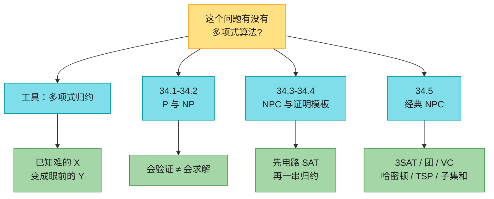
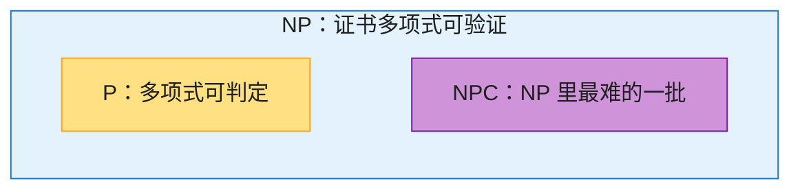
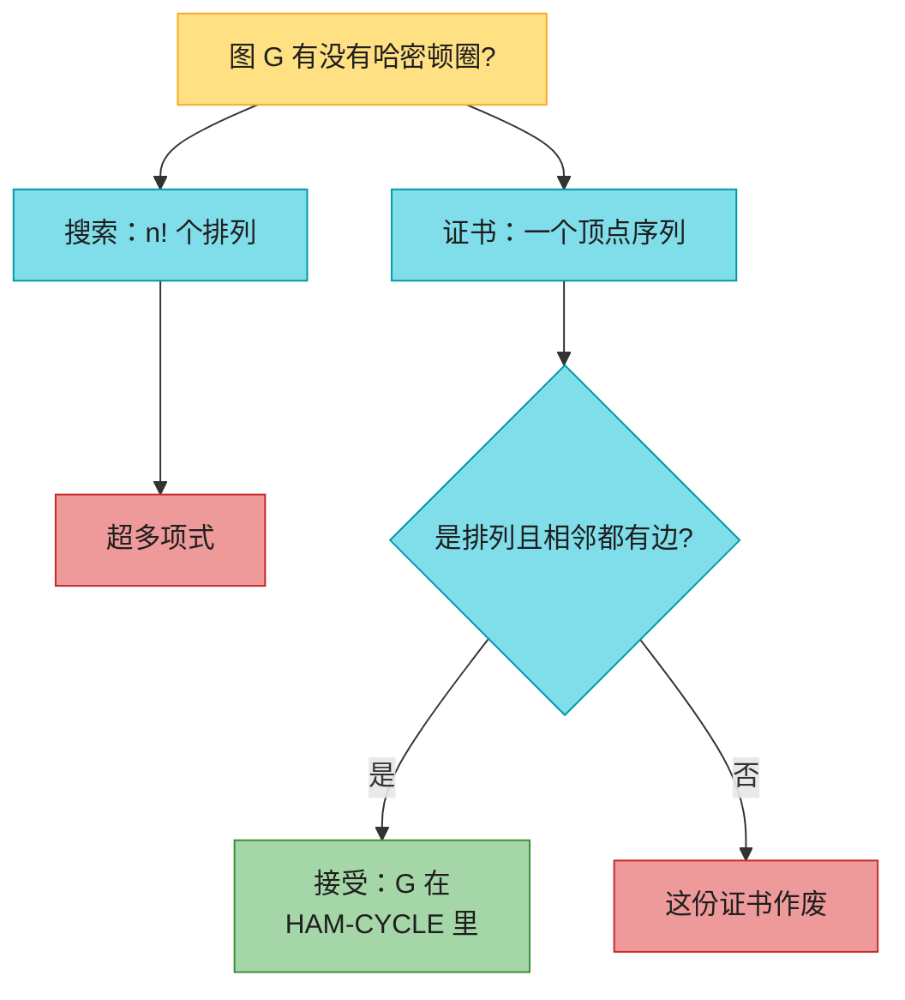
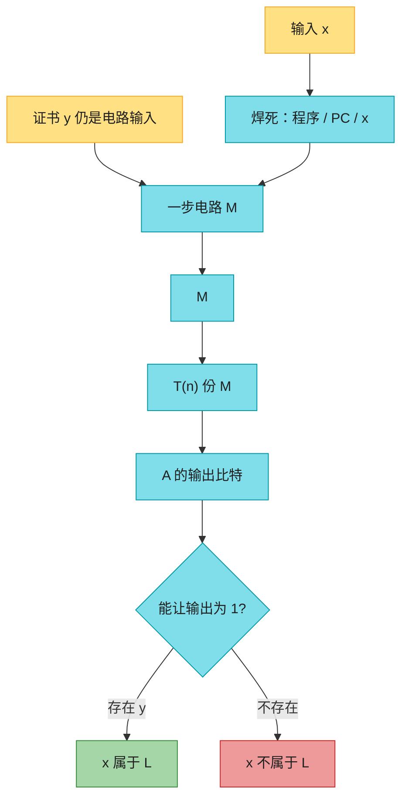
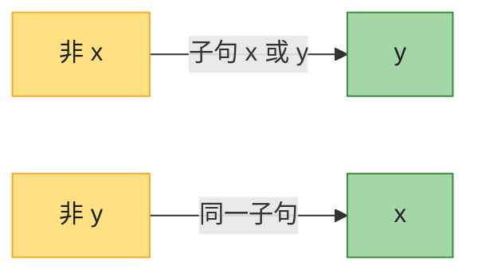
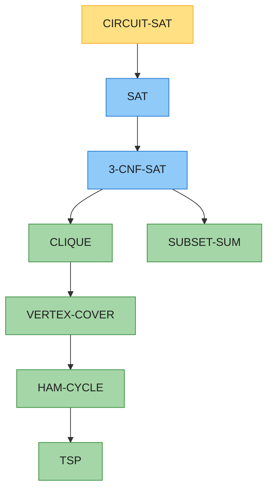
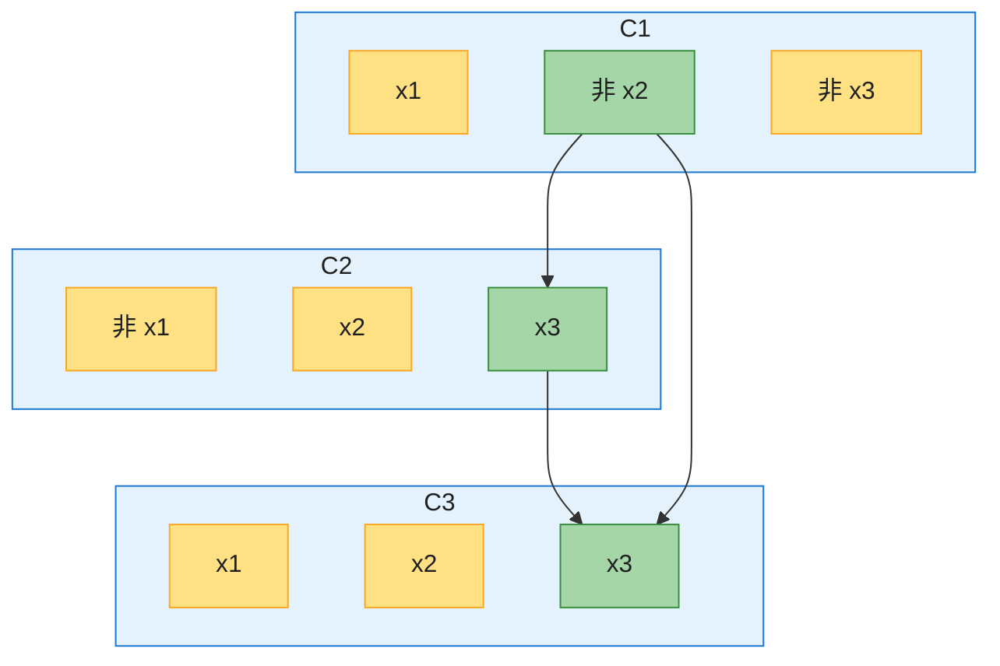
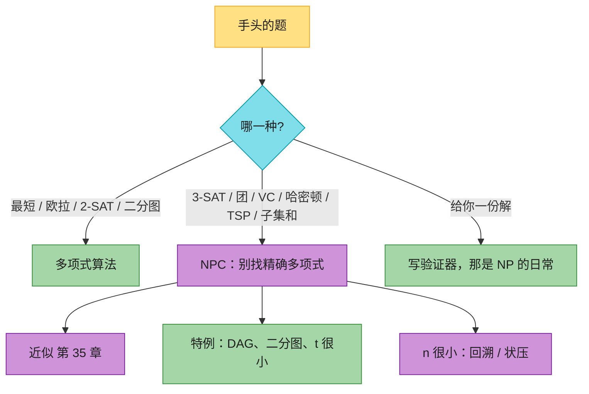

# 第 34 章：NP 完全性（NP-Completeness）——深度版

## 一、开篇定位

本章回答一个问题：**面前这个问题，该不该继续找多项式算法？**前面各章几乎都是 $O(n^k)$ 能解决的。不是所有问题都这样：停机问题根本不可判定；还有一些问题可判定，但任何算法都不是 $n$ 的多项式。夹在中间的是 **NP 完全**问题：至今没有多项式算法，也没人证明它不存在。这就是 1971 年提出的 **P vs NP**。

算法设计者真正用到的不是证明 $P\neq NP$，而是一句工程判断：**一旦证明问题是 NP 完全的，就不要再死磕精确多项式算法**——去找近似（第 35 章）、多项式可解的特例、或小规模上的指数枚举。表面上跟最短路、欧拉回路、2-SAT 只差几个字的问题，复杂度可以天差地别。

与前后章节的关系：

- **第 8 章**：比较排序有 $\Omega(n\lg n)$ 下界。NP 完全是另一种「难」的证据：不是决策树，是归约；
- **第 20 / 22 章**：欧拉回路 $O(E)$、最短路多项式；本章的哈密顿回路、最长简单路是 NP 完全；
- **第 15.2 节 0-1 背包 DP**：时间 $O(nW)$。$W$ 用二进制写进输入时，这是**伪多项式**，不是多项式（34.1-4）；
- **第 25 章二分图匹配**：二分图最大独立集 $=|V|-$ 最大匹配，多项式；一般图独立集是 NP 完全；
- **第 29 章**：LP 多项式可解；变量必须取整数 → 0-1 整数规划，连可行性都是 NP 完全；
- **第 31 章**：大整数分解没有已知多项式算法，这是经验，**不是** NP 完全证明；
- **第 35 章**：顶点覆盖 2-近似、带三角不等式的 TSP 2-近似——NP 完全之后的出路。

做题定位：LeetCode **不考手写 Cook–Levin，也不考 12 顶点 gadget**。能直接练的是：验证 vs 搜索（36 验证数独）、伪多项式背包（416、494）、2 着色 / 2-SAT 味道（785、886）、欧拉 vs 哈密顿（332 vs 847 / 980）、状态压缩 TSP（943、847）。本章要带走的三句话：**NP 是「证书多项式可验证」，不是「非多项式」**；**证明 Y 难，必须从已知难的 X 归约到 Y（方向不能反）**；**2-SAT / 欧拉 / 最短路在 P，3-SAT / 哈密顿 / 最长简单路是 NPC——差的就是那一个数字或「所有点」**。

**本章主线**：P 与编码 → 验证与 NP → 归约与第一个 NPC（电路 SAT）→ 证明模板（SAT / 3-SAT）→ 团、顶点覆盖、哈密顿、TSP、子集和 → 2-SAT 在 P → Java + Python → 速查 / 易混 → 题单与习题。



原书三条「只差一点点」的对照（开篇就该刻进脑子）：

| 在 P 里 | NP 完全 | 差在哪 |
|---------|---------|--------|
| 最短路（第 22 章） | 最长**简单**路 | 「最短」换成「最长」，还不许重复顶点 |
| 欧拉回路（每条**边**恰好一次，$O(E)$） | 哈密顿回路（每个**顶点**恰好一次） | 边 vs 点 |
| 2-SAT | 3-SAT | 每个子句 2 个文字 vs 3 个 |

---

## 二、核心思想：会验证不等于会求解

大白话：哈密顿回路难在**找**。若有人把 $n$ 个顶点的顺序递过来，你只要检查：是不是每个点恰好一次、相邻（含首尾）都有边——$O(n^2)$ 就能验完。**证书短、验证快**的判定问题组成 **NP**。**自己就能在多项式时间里给出是/否**的组成 **P**。显然 $P\subseteq NP$：能求解就能忽略证书直接判定。

NP 完全（NPC）是 NP 里「最难」的一批：NP 里每一个问题都能多项式归约到它。所以：

- 任意一个 NPC 问题进了 P $\Rightarrow$ $P=NP$；
- 任意一个 NP 问题被证明需要超多项式时间 $\Rightarrow$ 所有 NPC 都需要超多项式时间。

多数研究者相信最下面这张图：P 和 NPC 不相交，都装在 NP 里。没人证明。



归约是把「难」传来传去的绳子。$L_1\le_P L_2$ 表示：存在多项式可计算的 $f$，使得 $x\in L_1$ 当且仅当 $f(x)\in L_2$。直觉：**$L_2$ 至少和 $L_1$ 一样难**（忽略多项式因子）。证明 $L_2$ 难，必须从已知难的 $L_1$ **出发**造 $L_2$ 的实例——方向反了就什么都没证。


NP 完全理论只直接作用于**判定问题**（yes/no）。优化问题先加一个界限改写成判定：最短路 $\leftrightarrow$「有没有 $\le k$ 条边的路」。判定更「容易」：优化容易 $\Rightarrow$ 判定容易；判定难 $\Rightarrow$ 优化难。

---

## 三、多项式时间与编码（34.1）

### 3.1 直觉

输入规模 $n$ 是**编码的比特数**，不是「那个整数有多大」。算法时间 $O(n^k)$（$k$ 为常数）叫多项式。三个理由把它当成「tractable」：实践里次数通常很小；RAM / 图灵机 / 多项式个处理器之间多项式可互译；多项式对加法、乘法、复合封闭。

**编码会改复杂度。** 整数 $k$ 的一元编码是 $k$ 个 1，长度 $\Theta(k)$；二进制长度 $\Theta(\lg k)$。时间 $\Theta(k)$ 在一元下是线性，在二进制下是输入长度的指数。约定：整数用与二进制多项式相关的编码，集合用元素列表。两个编码多项式相关 $\Rightarrow$ 是否属于 P 与选哪个无关。

0-1 背包 DP 跑 $O(nW)$：$W$ 写成二进制只有 $\lg W$ 位，所以这是 **伪多项式**，不是多项式（34.1-4）。子集和同一道理：目标 $t$ 用一元写下时 DP 是多项式（34.5-4）。

### 3.2 语言观点（够用即可）

判定问题 $=$ 语言 $L\subseteq\{0,1\}^*$（yes 实例的集合）。算法**接受** $L$：对 $x\in L$ 输出 1（对 $x\notin L$ 可以死循环）。算法**判定** $L$：每个串都在多项式时间内正确输出 0 或 1。

P 既是「多项式可判定的语言」，也是「多项式可接受的语言」：接受算法若有 $O(n^k)$ 上界，就模拟这么多步，到点还没接受就拒绝。

常数次调用多项式子程序 $+$ 多项式额外工作 $=$ 多项式。**多项式次**调用不一定：每次把输入翻倍，总时间爆炸（34.1-5）。

LeetCode：416 的 DP 能过，是因为 $sum\le 200\cdot 100$ 很小——这是伪多项式在刷题约束下「看起来像 P」。

---

## 四、多项式时间验证与 NP（34.2）

### 4.1 直觉

哈密顿回路：图 $G$ 有没有经过每个顶点恰好一次的圈？枚举 $n!$ 个排列不是多项式。但**证书**就是那个圈：检查排列、检查边，多项式。

语言 $L$ 属于 **NP**：存在二元算法 $A$ 和常数 $c$，使得

$$
x\in L \iff \text{存在证书 } y,\ |y|=O(|x|^c),\ A(x,y)=1,
$$

且 $A$ 是多项式时间。$y$ 不能太长，否则「猜一个指数长的东西」不算。

NP 原名 **Nondeterministic Polynomial time**（非确定性多项式）。本书用等价的验证定义。$P\subseteq NP$。是否 $P=NP$ 未知。co-NP $=\{L:\overline L\in NP\}$。P 对补封闭，所以 $P\subseteq NP\cap co-NP$。多数人相信 $NP\neq co-NP$ 且 $P\neq NP\cap co-NP$——永真式 TAUTOLOGY 是 co-NP 完全的典型成员（补语言是 SAT）。

### 4.2 示意图

十二面体有哈密顿圈（Hamilton 的「Icosian game」）。奇数个顶点的二分图没有：圈必须在两部之间交替，奇数 $n$ 没法均分（34.2-2）。



NP 里每个语言都可以 $2^{O(n^k)}$ 判定：枚举所有多项式长证书（34.2-5）。这不是多项式，但说明 NP 不是「不可判定」。

### 4.3 复杂度

| 对象 | 时间 |
|------|------|
| 验证哈密顿证书 | $O(n^2)$（邻接矩阵） |
| 枚举排列找圈 | $\Theta(n!)$，不是多项式 |
| DAG 上的哈密顿**路** | 拓扑序 + DP，多项式（34.2-7） |
| 图同构 | 在 NP（证书 $=$ 置换）；是否 NPC 仍开放 |

LeetCode：**36** 验证数独是「验证」；**37** 求解是搜索。**207** 有向图判环（拓扑）在 P；「是否存在经过每门恰好一次的修课顺序」是哈密顿路，NPC。

---

## 五、归约、NP 完全与电路 SAT（34.3）

### 5.1 定义（两句话）

$L$ 是 **NP 完全**：$L\in NP$，并且每个 $L'\in NP$ 都有 $L'\le_P L$。只满足第二条叫 **NP 难**——优化问题、甚至不可判定问题都可以是 NP 难，不必在 NP 里。

若某个 NPC 问题属于 P，则 $P=NP$。因此「证明 Y 是 NPC」是「别再找多项式算法」的最强工程证据。

### 5.2 第一个 NPC：CIRCUIT-SAT

**电路可满足**：与/或/非门组成的无环电路，有没有一组输入使输出为 1？$k$ 个输入最多 $2^k$ 种赋值，电路规模关于 $k$ 多项式时这是超多项式。

**在 NP 里**：证书可以是每个导线的 0/1。逐门检查输出是否等于门函数，再看总输出是不是 1。更短的证书是一组输入赋值，自己把电路算一遍（34.3-4，更省事）。

**NP 难（直觉，不写图灵机）**：任意 $L\in NP$ 都有多项式验证器 $A(x,y)$。把 $A$ 跑 $T(n)=O(n^k)$ 步的过程摊成 $T(n)$ 层「一步组合电路」$M$，串起来。输入 $x$ 焊死，只留下证书 $y$ 当电路输入，输出接到 $A$ 的那一比特。于是 $x\in L\iff$ 这块电路可满足。构造规模多项式。这就是本书的「第一块石头」；后面所有 NPC 证明都从它往下传，不必再对每个语言直接归约。



原书图 34.8(a) 有满足赋值 $\langle x_1=1,x_2=1,x_3=0\rangle$；(b) 改了一扇门，8 种输入全是 0（34.3-1）。

$\le_P$ 有传递性（34.3-2）：归约可以串成一条链。这是整章证明工厂的齿轮。

---

## 六、证明模板：SAT 与 3-CNF-SAT（34.4）

### 6.1 证明一个语言 $L$ 是 NPC 的四步

1. 证明 $L\in NP$（给出证书 + 多项式验证）。
2. 选一个已知 NPC 的 $L'$。
3. 给出多项式算法，把 $L'$ 的任意实例 $x$ 变成 $L$ 的实例 $f(x)$。
4. 证明 $x\in L'\iff f(x)\in L$。

不要从 $L$ 往已知 NPC 上归——那是在证明 $L$ 更易，不是更难。

### 6.2 SAT（公式可满足）

任意由变量、与或非、蕴含、等价、括号组成的布尔公式，有没有一组赋值使它为 1？证书 $=$ 赋值，代入求值即验证。

**CIRCUIT-SAT $\le_P$ SAT**：每个导线一个变量，每个门一条「输出 $\leftrightarrow$ 门函数」子句，再与上电路输出变量。共享扇出**不要**展开成公式树——那会指数膨胀（34.4-1）。按门局部写子句，公式大小与电路线性相关。

原书图 34.10 的电路变成：

$$
\phi = x_{10}\land(x_4\leftrightarrow\lnot x_3)\land(x_5\leftrightarrow(x_1\lor x_2))\land\cdots\land(x_{10}\leftrightarrow(x_7\land x_8\land x_9)).
$$

### 6.3 3-CNF-SAT

CNF $=$ 子句的与；每个子句是文字的或。3-CNF $=$ 每个子句恰好 3 个不同文字。3-CNF-SAT 仍是 NPC。

**SAT $\le_P$ 3-CNF-SAT**，三步，每步保持可满足性，大小多项式：

1. 公式的二叉解析树：内部结点引进 $y_i$，写成根变量与上各结点的 $\leftrightarrow$ 子句（每个最多 3 个文字，但还不是「三个文字的或」）；
2. 每个小 $\leftrightarrow$ 子句列真值表，对取 0 的行写 DNF 的否定，德摩根得到 CNF（每个子句 $\le 3$ 个文字）；
3. 凑满 3 个文字：两个文字 $(l_1\lor l_2)$ 变成 $(l_1\lor l_2\lor p)\land(l_1\lor l_2\lor\lnot p)$；一个文字 $l$ 变成四个子句，穷举 $p,q$。多出来的子句恒真，不改变可满足性。

对整份公式直接列 $2^n$ 行真值表**不是**多项式归约（34.4-3）。

**DNF-SAT 在 P 里**（34.4-5）：某个合取项里不同时出现 $x$ 和 $\lnot x$，就满足。扫一遍即可。

**自归约**（34.4-6）：若 SAT 判定是多项式的，找一组赋值也是——依次把 $x_i$ 钉成 0，问剩下还满不满足；不行就钉成 1。判定 oracle 调用 $n$ 次。代码里的 `satSelfReduce` 就是这件事（oracle 用穷举代替）。

### 6.4 2-SAT 在 P 里（34.4-7）

$x\lor y$ 等价于 $\lnot x\to y$ 且 $\lnot y\to x$。建蕴含图：每个文字一个顶点。不可满足 $\iff$ 某个 $x$ 与 $\lnot x$ 在同一个强连通分量。Tarjan / Kosaraju，$O(n+m)$。



例：$(x_1\lor x_2)\land(\lnot x_1\lor x_2)\land(\lnot x_1\lor\lnot x_2)$ 可满足（$x_1=0,x_2=1$）。四个子句把 $x$ 的正负都锁死则不可满足。

LeetCode：没有原味 2-SAT 题号；**785 / 886** 的二分图染色是「每个冲突边两端不同色」，跟 2-SAT 同一套 SCC / BFS 思想。

---

## 七、经典 NPC：团、顶点覆盖、哈密顿、TSP、子集和（34.5）

原书的归约树（图 34.13）。全部最终挂在 CIRCUIT-SAT 上。



### 7.1 团 CLIQUE

无向图的**团**：两两有边的顶点子集。判定：有没有大小为 $k$ 的团？证书 $=$ 那 $k$ 个点，检查 $\binom{k}{2}$ 条边。枚举 $k$-子集是 $\Theta(k^2\binom{n}{k})$，$k$ 接近 $n/2$ 时超多项式。

**3-CNF-SAT $\le_P$ CLIQUE**（跨领域归约的样板）：

$k$ 个子句，每个子句 3 个文字 → 3 个顶点，共 $3k$ 个点。不同子句的两个顶点连边，当且仅当对应文字**不互补**（不能一个是 $x$、一个是 $\lnot x$）。同一子句内部不连边。

可满足 $\Rightarrow$ 每子句挑一个真文字，得到 $k$ 个点，两两文字都真故不互补，成团。有 $k$-团 $\Rightarrow$ 每子句恰好一个顶点（内部无边），按文字赋值，不会同时给 $x$ 和 $\lnot x$ 赋 1。

原书例子 $\phi=C_1\land C_2\land C_3$：

| 子句 | 三个顶点 |
|------|----------|
| $C_1=x_1\lor\lnot x_2\lor\lnot x_3$ | $x_1$，**$\lnot x_2$**，$\lnot x_3$ |
| $C_2=\lnot x_1\lor x_2\lor x_3$ | $\lnot x_1$，$x_2$，**$x_3$** |
| $C_3=x_1\lor x_2\lor x_3$ | $x_1$，$x_2$，**$x_3$** |

满足赋值 $x_2=0,x_3=1$（$x_1$ 随意）对应蓝色团 $\{\lnot x_2,\,x_3,\,x_3\}$，代码里下标 `1,5,8`。



只证明了「这种三元组结构的图」上 CLIQUE 难。这已经够了：一般图的算法也会解这种特例。反过来，只从「特殊的 3-SAT」推一般 CLIQUE 不够——那些 3-SAT 可能碰巧容易。

### 7.2 顶点覆盖 VERTEX-COVER

$V'\subseteq V$ 覆盖每条边：每条边至少一个端点在 $V'$。判定：有没有大小为 $k$ 的顶点覆盖？证书 $=$ 那 $k$ 个点。

**补图** $\overline G$：同样的顶点，边集取补（无自环）。

**CLIQUE $\le_P$ VERTEX-COVER**：$G$ 有 $k$-团 $\iff$ $\overline G$ 有大小 $|V|-k$ 的顶点覆盖。团里的点在补图里彼此不连边，所以补图的边只能被团外的点盖住。

独立集、团、顶点覆盖三位一体（思考题 34-1）：

$$
\alpha(G)+\beta(G)=|V|,\qquad \omega(G)=\alpha(\overline G).
$$

$\alpha$ 最大独立集，$\beta$ 最小顶点覆盖，$\omega$ 最大团。代码里随机图对拍的就是这两条。

第 35.1 节：随便取极大匹配，两端点都丢进覆盖，得到 **2-近似**。NPC 不是死刑。

LeetCode：没有裸顶点覆盖；**1125** 是集合覆盖味道（NPC）。二分图上顶点覆盖 $=$ 最大匹配（König），在 P。

### 7.3 哈密顿回路 HAM-CYCLE

证书 $=$ $n$ 个顶点的圈。**VERTEX-COVER $\le_P$ HAM-CYCLE** 用 gadget：每条原边变成 12 个顶点的小工具，只有 3 种走法能盖完这 12 个点——对应这条边被 1 个或 2 个覆盖点「负责」。再加 $k$ 个选择器顶点，串起被选中的 $k$ 条「覆盖路径」。构造规模 $O(V+E)$。

要记住的不是 12 个顶点怎么连，而是策略：**gadget 限制局部走法，选择器对应「选哪些顶点进覆盖」**。孤立点会把「度为 0 的路径」弄崩，证明里先去掉孤立点（34.5-9）。

奇数部二分图非哈密顿（34.2-2）。$G^3$（距离 $\le 3$ 的点连边）一定哈密顿（34.2-11，Sekanina）。

DAG 上哈密顿**路**在 P：最长路 DP，看是否 $=n-1$（34.2-7）。一般图的 HAM-PATH 是 NPC（34.5-6）：从 HAM-CYCLE 拆一个点、加 $s,t$。

LeetCode：**847** $n\le 12$ 状态压缩 vis 全集；**980** 网格哈密顿路；**332** 是欧拉路（Hierholzer），别当成哈密顿。

### 7.4 旅行商 TSP

完全图，边权非负整数，有没有代价 $\le k$ 的回路？证书 $=$ 回路。

**HAM-CYCLE $\le_P$ TSP**：原边代价 0，补上的边代价 1，问代价 $\le 0$ 的回路。原图有哈密顿圈 $\iff$ TSP 有代价 0 的巡回。这是「大奖赏 / 大惩罚」模板：想用的边给 0，不想用的给 1（或无穷）。

原书图 34.18：四城代价，最优 $u{-}w{-}v{-}x{-}u$ 代价 7。Held–Karp $O(n^2 2^n)$ 对拍得 7。

无三角不等式时，任何常数比近似都不可能（除非 $P=NP$，第 35.2.2 节）。有三角不等式则 MST 前序遍历给 2-近似。

LeetCode：**943** 最短超级串是 TSP 味道。

### 7.5 子集和 SUBSET-SUM

正整数集合 $S$ 与目标 $t$，有没有子集和恰好为 $t$？证书 $=$ 子集。整数按**二进制**编码，所以 NPC。

**3-CNF-SAT $\le_P$ SUBSET-SUM**：每个变量两个数 $v_i,v_i'$（选真 / 选假），每个子句两个松弛 $s_j,s_j'$。十进制写，高 $n$ 位对应变量（目标和为 1，强制二选一），低 $k$ 位对应子句（目标和为 4）。文字出现的位置写 1。同一数位上最大和是 6，进制 $\ge 7$ 就不会进位。松弛 $1$ 和 $2$ 负责把子句位从 $\{1,2,3\}$ 补到 4。

原书图 34.19：$\phi=C_1\land C_2\land C_3\land C_4$，目标 $t=1114444$。满足赋值 $x_1=0,x_2=0,x_3=1$ 对应选 $v_1',v_2',v_3$ 再配松弛。开头那个十进制集合换成 7 进制就是同一实例。

|  | $x_1$ | $x_2$ | $x_3$ | $C_1$ | $C_2$ | $C_3$ | $C_4$ |
|--|-------|-------|-------|-------|-------|-------|-------|
| $v_1$ | 1 | 0 | 0 | 1 | 0 | 0 | 1 |
| $v_1'$ | 1 | 0 | 0 | 0 | 1 | 1 | 0 |
| $v_2$ | 0 | 1 | 0 | 0 | 0 | 0 | 1 |
| $v_2'$ | 0 | 1 | 0 | 1 | 1 | 1 | 0 |
| $v_3$ | 0 | 0 | 1 | 0 | 0 | 1 | 1 |
| $v_3'$ | 0 | 0 | 1 | 1 | 1 | 0 | 0 |
| $s_j,s_j'$ | 0 | 0 | 0 | 1 或 2 | … | … | … |
| $t$ | 1 | 1 | 1 | 4 | 4 | 4 | 4 |

DP 时间 $O(n t)$：$t$ 一元编码时是多项式（34.5-4）；二进制时只是伪多项式。划分 PARTITION 是子集和的特例 $t=\mathrm{sum}/2$，也是 NPC（34.5-5）。

LeetCode：**416** 等和划分（伪多项式 DP）；**698 / 473** 划分到 $k$ 份，NPC 味道，数据范围靠回溯。

---

## 八、归约策略（34.5.6）

做题时比 gadget 细节更有用的是这些口令：

| 策略 | 含义 |
|------|------|
| 方向 | 证 Y 难：从已知 NPC 的 X **到** Y。写反了是在证 Y 容易 |
| 还要进 NP | 只归约只得到 NP 难；必须再给证书 |
| 一般 → 特殊 | 源问题必须吃任意实例；目标实例可以长得很特化 |
| 用有结构的源 | 从 3-SAT 而不是任意 SAT；从 HAM-CYCLE 而不是 TSP |
| 特例即更难 | X 是 Y 的特例且 X 难 $\Rightarrow$ Y 难。0-1 背包的特例是划分 |
| 同领域 | 图问题优先从团 / 顶点覆盖 / 哈密顿出发；跨领域常从 3-SAT |
| 选点无序 / 有序 | 无序从顶点覆盖；顺序重要则从哈密顿 |
| 奖赏 / 惩罚 | HAM→TSP：原边 0，非法边 1 |
| gadget | 局部组件强制性质。松弛变量也是 gadget |

---

## 九、代码实现（Java + Python）

图、SAT 变量一律 **0-indexed**。CNF 文字用 DIMACS：`+k` 表示 $x_{k-1}$ 为真，`-k` 表示 $x_{k-1}$ 为假。实现里有：证书验证器、小规模精确求解、2-SAT（蕴含图 + SCC）、可跑的归约（3SAT→团、团↔顶点覆盖（补图）、HAM→TSP、3SAT→子集和）、SAT 自归约。随机对拍：归约保持 yes/no、$\alpha+\beta=n$、2-SAT 对穷举、子集和 DP 对子集枚举。

### 9.1 Java

```java
import java.util.*;

/**
 * CLRS 4th ed. Chapter 34 toolkit. Graphs and SAT variables are 0-indexed.
 * DIMACS literals: +k means x_{k-1}=true, -k means x_{k-1}=false.
 */
public class NPCompleteness {

    static void check(boolean cond, String msg) {
        if (!cond) throw new AssertionError(msg);
    }

    static void eq(Object a, Object b, String msg) {
        if (!Objects.equals(a, b)) throw new AssertionError(msg + " expected " + b + " got " + a);
    }

    // ---------- verifiers ----------

    static boolean verifyHamCycle(boolean[][] adj, int[] cycle) {
        int n = adj.length;
        if (cycle == null || cycle.length != n) return false;
        boolean[] seen = new boolean[n];
        for (int i = 0; i < n; i++) {
            int v = cycle[i];
            if (v < 0 || v >= n || seen[v]) return false;
            seen[v] = true;
            int w = cycle[(i + 1) % n];
            if (!adj[v][w]) return false;
        }
        return true;
    }

    static boolean verifyClique(boolean[][] adj, int[] verts) {
        int n = adj.length;
        boolean[] seen = new boolean[n];
        for (int v : verts) {
            if (v < 0 || v >= n || seen[v]) return false;
            seen[v] = true;
        }
        for (int i = 0; i < verts.length; i++) {
            for (int j = i + 1; j < verts.length; j++) {
                if (!adj[verts[i]][verts[j]]) return false;
            }
        }
        return true;
    }

    static boolean verifyVertexCover(int n, int[][] edges, int[] cover) {
        boolean[] in = new boolean[n];
        boolean[] seen = new boolean[n];
        for (int v : cover) {
            if (v < 0 || v >= n || seen[v]) return false;
            seen[v] = true;
            in[v] = true;
        }
        for (int[] e : edges) {
            if (!in[e[0]] && !in[e[1]]) return false;
        }
        return true;
    }

    static boolean verifyIndependentSet(boolean[][] adj, int[] verts) {
        int n = adj.length;
        boolean[] seen = new boolean[n];
        for (int v : verts) {
            if (v < 0 || v >= n || seen[v]) return false;
            seen[v] = true;
        }
        for (int i = 0; i < verts.length; i++) {
            for (int j = i + 1; j < verts.length; j++) {
                if (adj[verts[i]][verts[j]]) return false;
            }
        }
        return true;
    }

    static boolean evalCnf(int[][] cnf, boolean[] assign) {
        for (int[] clause : cnf) {
            boolean ok = false;
            for (int lit : clause) {
                int v = Math.abs(lit) - 1;
                if (v < 0 || v >= assign.length) return false;
                boolean val = assign[v];
                if (lit < 0) val = !val;
                if (val) {
                    ok = true;
                    break;
                }
            }
            if (!ok) return false;
        }
        return true;
    }

    static boolean verifySubsetSum(long[] s, long t, int mask) {
        long sum = 0;
        for (int i = 0; i < s.length; i++) {
            if (((mask >> i) & 1) != 0) sum += s[i];
        }
        return sum == t;
    }

    static boolean verifyTsp(int[][] cost, int[] tour, int k) {
        int n = cost.length;
        if (tour == null || tour.length != n) return false;
        boolean[] seen = new boolean[n];
        int sum = 0;
        for (int i = 0; i < n; i++) {
            int v = tour[i];
            if (v < 0 || v >= n || seen[v]) return false;
            seen[v] = true;
            sum += cost[v][tour[(i + 1) % n]];
        }
        return sum <= k;
    }

    // ---------- SAT ----------

    static boolean satBrute(int nVars, int[][] cnf) {
        int lim = 1 << nVars;
        boolean[] assign = new boolean[nVars];
        for (int mask = 0; mask < lim; mask++) {
            for (int i = 0; i < nVars; i++) assign[i] = ((mask >> i) & 1) != 0;
            if (evalCnf(cnf, assign)) return true;
        }
        return false;
    }

    /** Self-reducibility: fill bits one by one using a decision oracle. */
    static boolean[] satSelfReduce(int nVars, int[][] cnf) {
        if (!satBrute(nVars, cnf)) return null;
        boolean[] assign = new boolean[nVars];
        List<int[]> extra = new ArrayList<>();
        for (int i = 0; i < nVars; i++) {
            extra.add(new int[] {-(i + 1)});
            int[][] probe = concatCnf(cnf, extra);
            if (satBrute(nVars, probe)) {
                assign[i] = false;
            } else {
                extra.set(extra.size() - 1, new int[] {i + 1});
                assign[i] = true;
            }
        }
        return assign;
    }

    static int[][] concatCnf(int[][] cnf, List<int[]> extra) {
        int[][] out = Arrays.copyOf(cnf, cnf.length + extra.size());
        for (int i = 0; i < extra.size(); i++) out[cnf.length + i] = extra.get(i);
        return out;
    }

    static boolean dnfSat(int[][] dnf) {
        for (int[] term : dnf) {
            Set<Integer> pos = new HashSet<>();
            Set<Integer> neg = new HashSet<>();
            boolean bad = false;
            for (int lit : term) {
                int v = Math.abs(lit);
                if (lit > 0) {
                    if (neg.contains(v)) {
                        bad = true;
                        break;
                    }
                    pos.add(v);
                } else {
                    if (pos.contains(v)) {
                        bad = true;
                        break;
                    }
                    neg.add(v);
                }
            }
            if (!bad) return true;
        }
        return false;
    }

    // 2-SAT via implication graph + SCC (Kosaraju)
    static boolean twoSat(int nVars, int[][] cnf) {
        int m = 2 * nVars;
        List<Integer>[] g = newList(m);
        List<Integer>[] rg = newList(m);
        for (int[] clause : cnf) {
            if (clause.length == 0) return false;
            if (clause.length == 1) {
                addImpl(g, rg, notLit(clause[0], nVars), litId(clause[0], nVars), nVars);
            } else if (clause.length == 2) {
                addImpl(g, rg, notLit(clause[0], nVars), litId(clause[1], nVars), nVars);
                addImpl(g, rg, notLit(clause[1], nVars), litId(clause[0], nVars), nVars);
            } else {
                throw new IllegalArgumentException("2-SAT clause too long");
            }
        }
        int[] scc = kosaraju(g, rg);
        for (int i = 0; i < nVars; i++) {
            if (scc[2 * i] == scc[2 * i + 1]) return false;
        }
        return true;
    }

    @SuppressWarnings("unchecked")
    static List<Integer>[] newList(int m) {
        List<Integer>[] g = new ArrayList[m];
        for (int i = 0; i < m; i++) g[i] = new ArrayList<>();
        return g;
    }

    static int litId(int lit, int nVars) {
        int v = Math.abs(lit) - 1;
        return lit > 0 ? 2 * v : 2 * v + 1;
    }

    static int notLit(int lit, int nVars) {
        return -lit;
    }

    static void addImpl(List<Integer>[] g, List<Integer>[] rg, int fromLit, int toId, int nVars) {
        int a = litId(fromLit, nVars);
        g[a].add(toId);
        rg[toId].add(a);
    }

    static int[] kosaraju(List<Integer>[] g, List<Integer>[] rg) {
        int n = g.length;
        boolean[] vis = new boolean[n];
        List<Integer> order = new ArrayList<>();
        for (int i = 0; i < n; i++) if (!vis[i]) dfs1(g, vis, order, i);
        int[] scc = new int[n];
        Arrays.fill(scc, -1);
        int cid = 0;
        for (int i = n - 1; i >= 0; i--) {
            int v = order.get(i);
            if (scc[v] == -1) dfs2(rg, scc, v, cid++);
        }
        return scc;
    }

    static void dfs1(List<Integer>[] g, boolean[] vis, List<Integer> order, int v) {
        vis[v] = true;
        for (int w : g[v]) if (!vis[w]) dfs1(g, vis, order, w);
        order.add(v);
    }

    static void dfs2(List<Integer>[] rg, int[] scc, int v, int cid) {
        scc[v] = cid;
        for (int w : rg[v]) if (scc[w] == -1) dfs2(rg, scc, w, cid);
    }

    // ---------- graphs: clique / vertex cover / independent set / ham ----------

    static boolean hasClique(boolean[][] adj, int k) {
        if (k <= 0) return true;
        int n = adj.length;
        if (k > n) return false;
        return cliqueRec(adj, k, 0, new int[k], 0);
    }

    static boolean cliqueRec(boolean[][] adj, int k, int start, int[] pick, int filled) {
        if (filled == k) return true;
        int n = adj.length;
        int need = k - filled;
        for (int v = start; v <= n - need; v++) {
            boolean ok = true;
            for (int i = 0; i < filled; i++) {
                if (!adj[pick[i]][v]) {
                    ok = false;
                    break;
                }
            }
            if (!ok) continue;
            pick[filled] = v;
            if (cliqueRec(adj, k, v + 1, pick, filled + 1)) return true;
        }
        return false;
    }

    static int maxClique(boolean[][] adj) {
        int n = adj.length;
        for (int k = n; k >= 0; k--) if (hasClique(adj, k)) return k;
        return 0;
    }

    static boolean hasIndependentSet(boolean[][] adj, int k) {
        if (k <= 0) return true;
        int n = adj.length;
        if (k > n) return false;
        return indRec(adj, k, 0, new int[k], 0);
    }

    static boolean indRec(boolean[][] adj, int k, int start, int[] pick, int filled) {
        if (filled == k) return true;
        int n = adj.length;
        int need = k - filled;
        for (int v = start; v <= n - need; v++) {
            boolean ok = true;
            for (int i = 0; i < filled; i++) {
                if (adj[pick[i]][v]) {
                    ok = false;
                    break;
                }
            }
            if (!ok) continue;
            pick[filled] = v;
            if (indRec(adj, k, v + 1, pick, filled + 1)) return true;
        }
        return false;
    }

    static boolean hasVertexCover(boolean[][] adj, int k) {
        int n = adj.length;
        if (k >= n) return true;
        if (k < 0) return false;
        return hasIndependentSet(adj, n - k);
    }

    static int minVertexCover(boolean[][] adj) {
        int n = adj.length;
        for (int k = 0; k <= n; k++) if (hasVertexCover(adj, k)) return k;
        return n;
    }

    static int maxIndependentSet(boolean[][] adj) {
        return adj.length - minVertexCover(adj);
    }

    static boolean[][] complement(boolean[][] adj) {
        int n = adj.length;
        boolean[][] c = new boolean[n][n];
        for (int i = 0; i < n; i++) {
            for (int j = 0; j < n; j++) {
                if (i != j) c[i][j] = !adj[i][j];
            }
        }
        return c;
    }

    static boolean hasHamCycle(boolean[][] adj) {
        int n = adj.length;
        if (n == 0) return false;
        if (n == 1) return true;
        boolean[] vis = new boolean[n];
        vis[0] = true;
        return hamDfs(adj, vis, 0, 1, 0);
    }

    static boolean hamDfs(boolean[][] adj, boolean[] vis, int cur, int used, int start) {
        int n = adj.length;
        if (used == n) return adj[cur][start];
        for (int nxt = 0; nxt < n; nxt++) {
            if (vis[nxt] || !adj[cur][nxt]) continue;
            vis[nxt] = true;
            if (hamDfs(adj, vis, nxt, used + 1, start)) return true;
            vis[nxt] = false;
        }
        return false;
    }

    static boolean hasHamPath(boolean[][] adj, int u, int v) {
        int n = adj.length;
        boolean[] vis = new boolean[n];
        vis[u] = true;
        return hamPathDfs(adj, vis, u, 1, v);
    }

    static boolean hamPathDfs(boolean[][] adj, boolean[] vis, int cur, int used, int target) {
        int n = adj.length;
        if (used == n) return cur == target;
        for (int nxt = 0; nxt < n; nxt++) {
            if (vis[nxt] || !adj[cur][nxt]) continue;
            vis[nxt] = true;
            if (hamPathDfs(adj, vis, nxt, used + 1, target)) return true;
            vis[nxt] = false;
        }
        return false;
    }

    /** DAG Hamiltonian path: unique topo chain with all consecutive edges. */
    static boolean dagHamPath(List<Integer>[] dag) {
        int n = dag.length;
        int[] indeg = new int[n];
        for (int u = 0; u < n; u++) for (int v : dag[u]) indeg[v]++;
        int[] dp = new int[n];
        int[] q = new int[n];
        int qh = 0, qt = 0;
        for (int i = 0; i < n; i++) if (indeg[i] == 0) q[qt++] = i;
        int seen = 0;
        int[] order = new int[n];
        while (qh < qt) {
            int u = q[qh++];
            order[seen++] = u;
            for (int v : dag[u]) {
                dp[v] = Math.max(dp[v], dp[u] + 1);
                if (--indeg[v] == 0) q[qt++] = v;
            }
        }
        if (seen != n) return false;
        int best = 0;
        for (int x : dp) best = Math.max(best, x);
        return best == n - 1;
    }

    static int tspHeldKarp(int[][] cost) {
        int n = cost.length;
        int N = 1 << n;
        int INF = 1_000_000_000;
        int[][] dp = new int[N][n];
        for (int[] row : dp) Arrays.fill(row, INF);
        dp[1][0] = 0;
        for (int mask = 1; mask < N; mask++) {
            if ((mask & 1) == 0) continue;
            for (int u = 0; u < n; u++) {
                if (((mask >> u) & 1) == 0 || dp[mask][u] >= INF) continue;
                for (int v = 0; v < n; v++) {
                    if (((mask >> v) & 1) != 0) continue;
                    int nmask = mask | (1 << v);
                    dp[nmask][v] = Math.min(dp[nmask][v], dp[mask][u] + cost[u][v]);
                }
            }
        }
        int best = INF;
        for (int u = 1; u < n; u++) best = Math.min(best, dp[N - 1][u] + cost[u][0]);
        return best;
    }

    static boolean subsetSumDP(int[] s, int t) {
        if (t < 0) return false;
        boolean[] dp = new boolean[t + 1];
        dp[0] = true;
        for (int x : s) {
            for (int v = t; v >= x; v--) dp[v] = dp[v] || dp[v - x];
        }
        return dp[t];
    }

    static boolean partition(int[] s) {
        int sum = 0;
        for (int x : s) sum += x;
        if ((sum & 1) != 0) return false;
        return subsetSumDP(s, sum / 2);
    }

    // ---------- reductions ----------

    /** 3-CNF-SAT → CLIQUE. Vertices grouped by clause, 3 per clause. */
    static boolean[][] threeSatToClique(int[][] cnf) {
        int k = cnf.length;
        int n = 3 * k;
        boolean[][] adj = new boolean[n][n];
        for (int r = 0; r < k; r++) {
            for (int s = r + 1; s < k; s++) {
                for (int i = 0; i < 3; i++) {
                    for (int j = 0; j < 3; j++) {
                        int a = cnf[r][i], b = cnf[s][j];
                        if (a != -b) {
                            int u = 3 * r + i, v = 3 * s + j;
                            adj[u][v] = adj[v][u] = true;
                        }
                    }
                }
            }
        }
        return adj;
    }

    /** HAM-CYCLE → TSP: missing edges cost 1, present cost 0, ask cost ≤ 0. */
    static int[][] hamToTsp(boolean[][] adj) {
        int n = adj.length;
        int[][] cost = new int[n][n];
        for (int i = 0; i < n; i++) {
            for (int j = 0; j < n; j++) {
                if (i == j) cost[i][j] = 1;
                else cost[i][j] = adj[i][j] ? 0 : 1;
            }
        }
        return cost;
    }

    static class SubsetSumInst {
        long[] s;
        long t;
    }

    /** 3-CNF-SAT → SUBSET-SUM, numbers in base 10, no carry (digits ≤ 6). */
    static SubsetSumInst threeSatToSubsetSum(int nVars, int[][] cnf) {
        int k = cnf.length;
        int digits = nVars + k;
        long[] nums = new long[2 * nVars + 2 * k];
        int p = 0;
        for (int i = 0; i < nVars; i++) {
            long vi = pow10(digits - 1 - i);
            long vi0 = pow10(digits - 1 - i);
            for (int j = 0; j < k; j++) {
                for (int lit : cnf[j]) {
                    if (lit == i + 1) vi += pow10(k - 1 - j);
                    if (lit == -(i + 1)) vi0 += pow10(k - 1 - j);
                }
            }
            nums[p++] = vi;
            nums[p++] = vi0;
        }
        for (int j = 0; j < k; j++) {
            nums[p++] = pow10(k - 1 - j);
            nums[p++] = 2 * pow10(k - 1 - j);
        }
        long t = 0;
        for (int i = 0; i < nVars; i++) t += pow10(digits - 1 - i);
        for (int j = 0; j < k; j++) t += 4 * pow10(k - 1 - j);
        SubsetSumInst inst = new SubsetSumInst();
        inst.s = nums;
        inst.t = t;
        return inst;
    }

    static long pow10(int e) {
        long r = 1;
        for (int i = 0; i < e; i++) r *= 10;
        return r;
    }

    static boolean subsetSumLong(long[] s, long t) {
        int n = s.length;
        int lim = 1 << n;
        for (int mask = 0; mask < lim; mask++) {
            long sum = 0;
            for (int i = 0; i < n; i++) if (((mask >> i) & 1) != 0) sum += s[i];
            if (sum == t) return true;
        }
        return false;
    }

    static int[][] edgesOf(boolean[][] adj) {
        List<int[]> es = new ArrayList<>();
        int n = adj.length;
        for (int i = 0; i < n; i++) {
            for (int j = i + 1; j < n; j++) {
                if (adj[i][j]) es.add(new int[] {i, j});
            }
        }
        return es.toArray(new int[0][]);
    }

    static boolean[][] randomUndirected(int n, double p, Random rng) {
        boolean[][] adj = new boolean[n][n];
        for (int i = 0; i < n; i++) {
            for (int j = i + 1; j < n; j++) {
                if (rng.nextDouble() < p) adj[i][j] = adj[j][i] = true;
            }
        }
        return adj;
    }

    static int[][] random3Sat(int nVars, int m, Random rng) {
        int[][] cnf = new int[m][3];
        for (int i = 0; i < m; i++) {
            Set<Integer> vars = new HashSet<>();
            int t = 0;
            if (nVars < 3) throw new IllegalArgumentException("need 3 vars");
            while (t < 3) {
                int v = 1 + rng.nextInt(nVars);
                if (vars.add(v)) {
                    cnf[i][t++] = rng.nextBoolean() ? v : -v;
                }
            }
        }
        return cnf;
    }

    static int[][] random2Sat(int nVars, int m, Random rng) {
        int[][] cnf = new int[m][2];
        for (int i = 0; i < m; i++) {
            int a = 1 + rng.nextInt(nVars);
            int b = 1 + rng.nextInt(nVars);
            cnf[i][0] = rng.nextBoolean() ? a : -a;
            cnf[i][1] = rng.nextBoolean() ? b : -b;
        }
        return cnf;
    }

    public static void main(String[] args) {
        // Book 34.5.1 clique example
        int[][] phi = {
                {1, -2, -3},
                {-1, 2, 3},
                {1, 2, 3}
        };
        check(satBrute(3, phi), "book 3sat yes");
        boolean[][] gClique = threeSatToClique(phi);
        check(hasClique(gClique, 3), "3sat->clique k=3");
        check(!hasClique(gClique, 4), "no clique 4");
        // highlighted clique: ~x2 from C1 (idx 1), x3 from C2 (idx 5), x3 from C3 (idx 8)
        check(verifyClique(gClique, new int[] {1, 5, 8}), "book clique verts");

        boolean[][] comp = complement(gClique);
        int nV = gClique.length;
        check(hasVertexCover(comp, nV - 3), "clique k iff VC n-k in complement");
        check(!hasVertexCover(comp, nV - 4), "VC too small");
        eq(maxClique(gClique), nV - minVertexCover(comp), "alpha relation via complement");
        eq(maxIndependentSet(gClique), nV - minVertexCover(gClique), "ind = n - beta");

        // SAT example (34.2): (x1 → x2) ∨ ¬((¬x1 ↔ x3) ∨ x4) ∧ ¬x2  is messy;
        // simple: (x1 ∨ x2) ∧ (¬x1 ∨ x2)
        int[][] easy = {{1, 2}, {-1, 2}};
        check(satBrute(2, easy), "easy sat");
        boolean[] asg = satSelfReduce(2, easy);
        check(asg != null && evalCnf(easy, asg), "self-reduce");
        check(asg[1], "x2 must be true");

        int[][] unsat3 = {{1}, {-1}};
        check(!satBrute(1, unsat3), "unsat");
        check(satSelfReduce(1, unsat3) == null, "self-reduce unsat");

        // DNF-SAT in P
        check(dnfSat(new int[][] {{1, -1}, {2}}), "dnf has good term");
        check(!dnfSat(new int[][] {{1, -1}, {2, -2}}), "dnf all contradictory");

        // 2-SAT
        int[][] twoYes = {{1, 2}, {-1, 2}, {-1, -2}};
        check(twoSat(2, twoYes) && satBrute(2, twoYes), "2sat yes");
        int[][] twoNo = {{1, 2}, {1, -2}, {-1, 2}, {-1, -2}};
        check(!twoSat(2, twoNo) && !satBrute(2, twoNo), "2sat no");

        // HAM / TSP book-style
        boolean[][] cycle4 = new boolean[4][4];
        int[][] c4e = {{0, 1}, {1, 2}, {2, 3}, {3, 0}, {0, 2}};
        for (int[] e : c4e) cycle4[e[0]][e[1]] = cycle4[e[1]][e[0]] = true;
        check(hasHamCycle(cycle4), "C4+chord ham");
        check(verifyHamCycle(cycle4, new int[] {0, 1, 2, 3}), "verify cycle");
        check(!verifyHamCycle(cycle4, new int[] {0, 1, 3, 2}), "1-3 missing");
        int[][] tsp = hamToTsp(cycle4);
        eq(tspHeldKarp(tsp), 0, "ham => tsp cost 0");
        boolean[][] path3 = new boolean[3][3];
        path3[0][1] = path3[1][0] = path3[1][2] = path3[2][1] = true;
        check(!hasHamCycle(path3), "path not cycle");
        eq(tspHeldKarp(hamToTsp(path3)), 1, "non-ham tsp cost >= 1");
        check(hasHamPath(path3, 0, 2), "ham path 0-2");
        check(!hasHamPath(path3, 0, 1), "no ham path ending at middle");

        // odd bipartite nonhamiltonian
        boolean[][] bip = new boolean[5][5];
        int[] L = {0, 1}, R = {2, 3, 4};
        for (int a : L) for (int b : R) bip[a][b] = bip[b][a] = true;
        check(!hasHamCycle(bip), "odd bipartite");

        // DAG ham path
        List<Integer>[] dag = newList(4);
        dag[0].add(1);
        dag[1].add(2);
        dag[2].add(3);
        check(dagHamPath(dag), "chain dag");
        dag[0].add(2);
        check(dagHamPath(dag), "still has chain");
        List<Integer>[] dag2 = newList(3);
        dag2[0].add(1);
        dag2[0].add(2);
        check(!dagHamPath(dag2), "branch no ham path");

        // TSP figure 34.18: u=0,v=1,w=2,x=3 costs
        // uv=4, uw=3, ux=1, vw=2, vx=1, wx=5; tour u-w-v-x-u cost 3+2+1+1=7
        int[][] fig = {
                {0, 4, 3, 1},
                {4, 0, 2, 1},
                {3, 2, 0, 5},
                {1, 1, 5, 0}
        };
        eq(tspHeldKarp(fig), 7, "fig 34.18");
        check(verifyTsp(fig, new int[] {0, 2, 1, 3}, 7), "tour uwvx");

        // Subset-sum book construction
        SubsetSumInst ss = threeSatToSubsetSum(3, new int[][] {
                {1, -2, -3}, {-1, -2, -3}, {-1, -2, 3}, {1, 2, 3}
        });
        // Figure 34.19: t = 1114444, S includes those 14 numbers
        eq(ss.t, 1114444L, "target 1114444");
        Set<Long> got = new HashSet<>();
        for (long x : ss.s) got.add(x);
        for (long x : new long[] {1001001, 1000110, 100001, 101110, 10011, 11100, 1000, 2000, 100, 200, 10, 20, 1, 2}) {
            check(got.contains(x), "missing " + x);
        }
        check(subsetSumLong(ss.s, ss.t), "fig 34.19 yes");
        check(satBrute(3, new int[][] {{1, -2, -3}, {-1, -2, -3}, {-1, -2, 3}, {1, 2, 3}}), "that 3sat yes");

        int[] Sbook = {1, 2, 7, 14, 49, 98, 343, 686, 2409, 2793, 16808, 17206, 117705, 117993};
        check(subsetSumDP(Sbook, 138457), "book subset 138457");
        int[] sub = {1, 2, 7, 98, 343, 686, 2409, 17206, 117705};
        int sum = 0;
        for (int x : sub) sum += x;
        eq(sum, 138457, "listed subset");

        check(partition(new int[] {1, 5, 11, 5}), "LC 416 example");
        check(!partition(new int[] {1, 2, 3, 5}), "no partition");

        // 0-1 knapsack-style: unary t is poly
        check(subsetSumDP(new int[] {3, 9, 8}, 11), "3+8");
        check(!subsetSumDP(new int[] {3, 9, 8}, 7), "no 7");

        // GRAPH-ISOMORPHISM certificate: identity
        boolean[][] iso1 = cycle4, iso2 = cycle4;
        check(verifyIso(iso1, iso2, new int[] {0, 1, 2, 3}), "iso id");

        // vertex cover verifier
        check(verifyVertexCover(4, c4e, new int[] {0, 2}), "cover 0,2");
        check(!verifyVertexCover(4, c4e, new int[] {0}), "not cover");

        Random rng = new Random(34);
        for (int t = 0; t < 80; t++) {
            int nv = 3 + rng.nextInt(3);
            int m = 2 + rng.nextInt(3);
            int[][] f = random3Sat(nv, m, rng);
            boolean sat = satBrute(nv, f);
            boolean[][] gc = threeSatToClique(f);
            check(hasClique(gc, m) == sat, "3sat iff clique m");
            boolean[][] gcomp = complement(gc);
            check(hasVertexCover(gcomp, gc.length - m) == sat, "iff VC n-m in complement");
            if (nv + m <= 8) {
                SubsetSumInst inst = threeSatToSubsetSum(nv, f);
                check(subsetSumLong(inst.s, inst.t) == sat, "3sat iff subset-sum");
            }
            boolean[] found = satSelfReduce(nv, f);
            if (sat) check(found != null && evalCnf(f, found), "self-reduce yes");
            else check(found == null, "self-reduce no");
        }

        for (int t = 0; t < 120; t++) {
            int nv = 2 + rng.nextInt(5);
            int m = rng.nextInt(8);
            int[][] f = random2Sat(nv, m, rng);
            check(twoSat(nv, f) == satBrute(nv, f), "2sat vs brute");
        }

        for (int t = 0; t < 80; t++) {
            int n = 3 + rng.nextInt(4);
            boolean[][] g = randomUndirected(n, 0.45, rng);
            int k = rng.nextInt(n + 1);
            int mc = maxClique(g);
            int vc = minVertexCover(g);
            int ind = maxIndependentSet(g);
            check(ind + vc == n, "ind + vc = n");
            check(mc == maxIndependentSet(complement(g)), "clique = ind of complement");
            check(hasClique(g, k) == (mc >= k), "clique decision");
            check(hasVertexCover(g, k) == (vc <= k), "vc decision");
            boolean ham = hasHamCycle(g);
            int[][] c = hamToTsp(g);
            int tour = tspHeldKarp(c);
            check((tour == 0) == ham, "ham iff tsp 0");
            if (ham) {
                // find a cycle by brute permutations starting at 0
                int[] cyc = findHam(g);
                check(cyc != null && verifyHamCycle(g, cyc), "found cycle verifies");
            }
        }

        for (int t = 0; t < 150; t++) {
            int n = 1 + rng.nextInt(8);
            int[] a = new int[n];
            for (int i = 0; i < n; i++) a[i] = rng.nextInt(20);
            int sumv = 0;
            for (int x : a) sumv += x;
            int target = rng.nextInt(sumv + 3);
            boolean dp = subsetSumDP(a, target);
            boolean brute = false;
            int lim = 1 << n;
            for (int mask = 0; mask < lim; mask++) {
                int s = 0;
                for (int i = 0; i < n; i++) if (((mask >> i) & 1) != 0) s += a[i];
                if (s == target) {
                    brute = true;
                    break;
                }
            }
            check(dp == brute, "subset dp vs brute");
        }

        System.out.println("NPCompleteness: all checks passed");
    }

    static boolean verifyIso(boolean[][] a, boolean[][] b, int[] pi) {
        int n = a.length;
        if (b.length != n || pi.length != n) return false;
        boolean[] seen = new boolean[n];
        for (int v : pi) {
            if (v < 0 || v >= n || seen[v]) return false;
            seen[v] = true;
        }
        for (int i = 0; i < n; i++) {
            for (int j = 0; j < n; j++) {
                if (a[i][j] != b[pi[i]][pi[j]]) return false;
            }
        }
        return true;
    }

    static int[] findHam(boolean[][] adj) {
        int n = adj.length;
        int[] perm = new int[n];
        for (int i = 0; i < n; i++) perm[i] = i;
        return hamPerm(adj, perm, 1);
    }

    static int[] hamPerm(boolean[][] adj, int[] perm, int i) {
        int n = perm.length;
        if (i == n) return verifyHamCycle(adj, perm) ? perm.clone() : null;
        for (int j = i; j < n; j++) {
            swap(perm, i, j);
            int[] ans = hamPerm(adj, perm, i + 1);
            if (ans != null) return ans;
            swap(perm, i, j);
        }
        return null;
    }

    static void swap(int[] a, int i, int j) {
        int t = a[i];
        a[i] = a[j];
        a[j] = t;
    }
}
```

### 9.2 Python

```python
"""CLRS 4th ed. Chapter 34 toolkit. 0-indexed graphs/vars. DIMACS literals."""
import random


def check(cond, msg):
    if not cond:
        raise AssertionError(msg)


def verify_ham_cycle(adj, cycle):
    n = len(adj)
    if cycle is None or len(cycle) != n:
        return False
    seen = [False] * n
    for i, v in enumerate(cycle):
        if v < 0 or v >= n or seen[v]:
            return False
        seen[v] = True
        w = cycle[(i + 1) % n]
        if not adj[v][w]:
            return False
    return True


def verify_clique(adj, verts):
    n = len(adj)
    seen = [False] * n
    for v in verts:
        if v < 0 or v >= n or seen[v]:
            return False
        seen[v] = True
    for i, u in enumerate(verts):
        for v in verts[i + 1 :]:
            if not adj[u][v]:
                return False
    return True


def verify_vertex_cover(n, edges, cover):
    inside = [False] * n
    seen = [False] * n
    for v in cover:
        if v < 0 or v >= n or seen[v]:
            return False
        seen[v] = True
        inside[v] = True
    return all(inside[u] or inside[v] for u, v in edges)


def eval_cnf(cnf, assign):
    for clause in cnf:
        ok = False
        for lit in clause:
            v = abs(lit) - 1
            if v < 0 or v >= len(assign):
                return False
            val = assign[v]
            if lit < 0:
                val = not val
            if val:
                ok = True
                break
        if not ok:
            return False
    return True


def verify_tsp(cost, tour, k):
    n = len(cost)
    if tour is None or len(tour) != n:
        return False
    seen = [False] * n
    s = 0
    for i, v in enumerate(tour):
        if v < 0 or v >= n or seen[v]:
            return False
        seen[v] = True
        s += cost[v][tour[(i + 1) % n]]
    return s <= k


def sat_brute(n_vars, cnf):
    assign = [False] * n_vars
    for mask in range(1 << n_vars):
        for i in range(n_vars):
            assign[i] = ((mask >> i) & 1) != 0
        if eval_cnf(cnf, assign):
            return True
    return False


def sat_self_reduce(n_vars, cnf):
    if not sat_brute(n_vars, cnf):
        return None
    extra = []
    assign = [False] * n_vars
    for i in range(n_vars):
        extra.append([-(i + 1)])
        if sat_brute(n_vars, cnf + extra):
            assign[i] = False
        else:
            extra[-1] = [i + 1]
            assign[i] = True
    return assign


def dnf_sat(dnf):
    for term in dnf:
        pos, neg = set(), set()
        bad = False
        for lit in term:
            v = abs(lit)
            if lit > 0:
                if v in neg:
                    bad = True
                    break
                pos.add(v)
            else:
                if v in pos:
                    bad = True
                    break
                neg.add(v)
        if not bad:
            return True
    return False


def _lit_id(lit):
    v = abs(lit) - 1
    return 2 * v if lit > 0 else 2 * v + 1


def two_sat(n_vars, cnf):
    m = 2 * n_vars
    g = [[] for _ in range(m)]
    rg = [[] for _ in range(m)]

    def add_impl(frm_lit, to_id):
        a = _lit_id(frm_lit)
        g[a].append(to_id)
        rg[to_id].append(a)

    for clause in cnf:
        if len(clause) == 0:
            return False
        if len(clause) == 1:
            add_impl(-clause[0], _lit_id(clause[0]))
        elif len(clause) == 2:
            add_impl(-clause[0], _lit_id(clause[1]))
            add_impl(-clause[1], _lit_id(clause[0]))
        else:
            raise ValueError("2-SAT clause too long")
    scc = _kosaraju(g, rg)
    return all(scc[2 * i] != scc[2 * i + 1] for i in range(n_vars))


def _kosaraju(g, rg):
    n = len(g)
    vis = [False] * n
    order = []

    def dfs1(v):
        vis[v] = True
        for w in g[v]:
            if not vis[w]:
                dfs1(w)
        order.append(v)

    for i in range(n):
        if not vis[i]:
            dfs1(i)
    scc = [-1] * n
    cid = 0

    def dfs2(v, c):
        scc[v] = c
        for w in rg[v]:
            if scc[w] == -1:
                dfs2(w, c)

    for v in reversed(order):
        if scc[v] == -1:
            dfs2(v, cid)
            cid += 1
    return scc


def has_clique(adj, k):
    if k <= 0:
        return True
    n = len(adj)
    if k > n:
        return False
    pick = [0] * k

    def rec(start, filled):
        if filled == k:
            return True
        need = k - filled
        for v in range(start, n - need + 1):
            if all(adj[pick[i]][v] for i in range(filled)):
                pick[filled] = v
                if rec(v + 1, filled + 1):
                    return True
        return False

    return rec(0, 0)


def max_clique(adj):
    n = len(adj)
    for k in range(n, -1, -1):
        if has_clique(adj, k):
            return k
    return 0


def has_independent_set(adj, k):
    if k <= 0:
        return True
    n = len(adj)
    if k > n:
        return False
    pick = [0] * k

    def rec(start, filled):
        if filled == k:
            return True
        need = k - filled
        for v in range(start, n - need + 1):
            if all(not adj[pick[i]][v] for i in range(filled)):
                pick[filled] = v
                if rec(v + 1, filled + 1):
                    return True
        return False

    return rec(0, 0)


def has_vertex_cover(adj, k):
    n = len(adj)
    if k >= n:
        return True
    if k < 0:
        return False
    return has_independent_set(adj, n - k)


def min_vertex_cover(adj):
    n = len(adj)
    for k in range(n + 1):
        if has_vertex_cover(adj, k):
            return k
    return n


def max_independent_set(adj):
    return len(adj) - min_vertex_cover(adj)


def complement(adj):
    n = len(adj)
    c = [[False] * n for _ in range(n)]
    for i in range(n):
        for j in range(n):
            if i != j:
                c[i][j] = not adj[i][j]
    return c


def has_ham_cycle(adj):
    n = len(adj)
    if n == 0:
        return False
    if n == 1:
        return True
    vis = [False] * n
    vis[0] = True

    def dfs(cur, used):
        if used == n:
            return adj[cur][0]
        for nxt in range(n):
            if vis[nxt] or not adj[cur][nxt]:
                continue
            vis[nxt] = True
            if dfs(nxt, used + 1):
                return True
            vis[nxt] = False
        return False

    return dfs(0, 1)


def has_ham_path(adj, u, v):
    n = len(adj)
    vis = [False] * n
    vis[u] = True

    def dfs(cur, used):
        if used == n:
            return cur == v
        for nxt in range(n):
            if vis[nxt] or not adj[cur][nxt]:
                continue
            vis[nxt] = True
            if dfs(nxt, used + 1):
                return True
            vis[nxt] = False
        return False

    return dfs(u, 1)


def dag_ham_path(dag):
    n = len(dag)
    indeg = [0] * n
    for u in range(n):
        for v in dag[u]:
            indeg[v] += 1
    dp = [0] * n
    q = [i for i in range(n) if indeg[i] == 0]
    seen = 0
    while q:
        u = q.pop()
        seen += 1
        for v in dag[u]:
            dp[v] = max(dp[v], dp[u] + 1)
            indeg[v] -= 1
            if indeg[v] == 0:
                q.append(v)
    return seen == n and (max(dp) if dp else 0) == n - 1


def tsp_held_karp(cost):
    n = len(cost)
    N = 1 << n
    inf = 10**9
    dp = [[inf] * n for _ in range(N)]
    dp[1][0] = 0
    for mask in range(1, N):
        if (mask & 1) == 0:
            continue
        for u in range(n):
            if ((mask >> u) & 1) == 0 or dp[mask][u] >= inf:
                continue
            for v in range(n):
                if (mask >> v) & 1:
                    continue
                nmask = mask | (1 << v)
                dp[nmask][v] = min(dp[nmask][v], dp[mask][u] + cost[u][v])
    return min(dp[N - 1][u] + cost[u][0] for u in range(1, n))


def subset_sum_dp(s, t):
    if t < 0:
        return False
    dp = [False] * (t + 1)
    dp[0] = True
    for x in s:
        for v in range(t, x - 1, -1):
            dp[v] = dp[v] or dp[v - x]
    return dp[t]


def partition(s):
    total = sum(s)
    if total & 1:
        return False
    return subset_sum_dp(s, total // 2)


def three_sat_to_clique(cnf):
    k = len(cnf)
    n = 3 * k
    adj = [[False] * n for _ in range(n)]
    for r in range(k):
        for s in range(r + 1, k):
            for i in range(3):
                for j in range(3):
                    a, b = cnf[r][i], cnf[s][j]
                    if a != -b:
                        u, v = 3 * r + i, 3 * s + j
                        adj[u][v] = adj[v][u] = True
    return adj


def ham_to_tsp(adj):
    n = len(adj)
    cost = [[0] * n for _ in range(n)]
    for i in range(n):
        for j in range(n):
            if i == j:
                cost[i][j] = 1
            else:
                cost[i][j] = 0 if adj[i][j] else 1
    return cost


def three_sat_to_subset_sum(n_vars, cnf):
    k = len(cnf)
    digits = n_vars + k

    def p10(e):
        return 10**e

    nums = []
    for i in range(n_vars):
        vi = p10(digits - 1 - i)
        vi0 = p10(digits - 1 - i)
        for j, clause in enumerate(cnf):
            for lit in clause:
                if lit == i + 1:
                    vi += p10(k - 1 - j)
                if lit == -(i + 1):
                    vi0 += p10(k - 1 - j)
        nums.append(vi)
        nums.append(vi0)
    for j in range(k):
        nums.append(p10(k - 1 - j))
        nums.append(2 * p10(k - 1 - j))
    t = sum(p10(digits - 1 - i) for i in range(n_vars))
    t += sum(4 * p10(k - 1 - j) for j in range(k))
    return nums, t


def subset_sum_long(s, t):
    n = len(s)
    for mask in range(1 << n):
        if sum(s[i] for i in range(n) if (mask >> i) & 1) == t:
            return True
    return False


def verify_iso(a, b, pi):
    n = len(a)
    if len(b) != n or len(pi) != n:
        return False
    seen = [False] * n
    for v in pi:
        if v < 0 or v >= n or seen[v]:
            return False
        seen[v] = True
    for i in range(n):
        for j in range(n):
            if a[i][j] != b[pi[i]][pi[j]]:
                return False
    return True


def find_ham(adj):
    n = len(adj)
    perm = list(range(n))

    def rec(i):
        if i == n:
            return perm[:] if verify_ham_cycle(adj, perm) else None
        for j in range(i, n):
            perm[i], perm[j] = perm[j], perm[i]
            ans = rec(i + 1)
            if ans is not None:
                return ans
            perm[i], perm[j] = perm[j], perm[i]
        return None

    return rec(1)


def random_undirected(n, p, rng):
    adj = [[False] * n for _ in range(n)]
    for i in range(n):
        for j in range(i + 1, n):
            if rng.random() < p:
                adj[i][j] = adj[j][i] = True
    return adj


def random_3sat(n_vars, m, rng):
    if n_vars < 3:
        raise ValueError("need 3 vars")
    cnf = []
    for _ in range(m):
        vars_ = set()
        clause = []
        while len(clause) < 3:
            v = 1 + rng.randrange(n_vars)
            if v not in vars_:
                vars_.add(v)
                clause.append(v if rng.random() < 0.5 else -v)
        cnf.append(clause)
    return cnf


def random_2sat(n_vars, m, rng):
    cnf = []
    for _ in range(m):
        a = 1 + rng.randrange(n_vars)
        b = 1 + rng.randrange(n_vars)
        cnf.append(
            [a if rng.random() < 0.5 else -a, b if rng.random() < 0.5 else -b]
        )
    return cnf


def main():
    phi = [[1, -2, -3], [-1, 2, 3], [1, 2, 3]]
    check(sat_brute(3, phi), "book 3sat yes")
    g_clique = three_sat_to_clique(phi)
    check(has_clique(g_clique, 3), "3sat->clique k=3")
    check(not has_clique(g_clique, 4), "no clique 4")
    check(verify_clique(g_clique, [1, 5, 8]), "book clique verts")

    comp = complement(g_clique)
    n_v = len(g_clique)
    check(has_vertex_cover(comp, n_v - 3), "clique k iff VC n-k")
    check(not has_vertex_cover(comp, n_v - 4), "VC too small")
    check(max_clique(g_clique) == n_v - min_vertex_cover(comp), "alpha via complement")
    check(max_independent_set(g_clique) == n_v - min_vertex_cover(g_clique), "ind=n-beta")

    easy = [[1, 2], [-1, 2]]
    check(sat_brute(2, easy), "easy sat")
    asg = sat_self_reduce(2, easy)
    check(asg is not None and eval_cnf(easy, asg), "self-reduce")
    check(asg[1], "x2 must be true")
    check(not sat_brute(1, [[1], [-1]]), "unsat")
    check(sat_self_reduce(1, [[1], [-1]]) is None, "self-reduce unsat")

    check(dnf_sat([[1, -1], [2]]), "dnf has good term")
    check(not dnf_sat([[1, -1], [2, -2]]), "dnf all contradictory")

    two_yes = [[1, 2], [-1, 2], [-1, -2]]
    check(two_sat(2, two_yes) and sat_brute(2, two_yes), "2sat yes")
    two_no = [[1, 2], [1, -2], [-1, 2], [-1, -2]]
    check((not two_sat(2, two_no)) and (not sat_brute(2, two_no)), "2sat no")

    cycle4 = [[False] * 4 for _ in range(4)]
    c4e = [[0, 1], [1, 2], [2, 3], [3, 0], [0, 2]]
    for u, v in c4e:
        cycle4[u][v] = cycle4[v][u] = True
    check(has_ham_cycle(cycle4), "C4+chord ham")
    check(verify_ham_cycle(cycle4, [0, 1, 2, 3]), "verify cycle")
    check(not verify_ham_cycle(cycle4, [0, 1, 3, 2]), "1-3 missing")
    check(tsp_held_karp(ham_to_tsp(cycle4)) == 0, "ham => tsp 0")
    path3 = [[False] * 3 for _ in range(3)]
    path3[0][1] = path3[1][0] = path3[1][2] = path3[2][1] = True
    check(not has_ham_cycle(path3), "path not cycle")
    check(tsp_held_karp(ham_to_tsp(path3)) == 1, "non-ham tsp >=1")
    check(has_ham_path(path3, 0, 2), "ham path 0-2")
    check(not has_ham_path(path3, 0, 1), "no ham path to middle")

    bip = [[False] * 5 for _ in range(5)]
    for a in (0, 1):
        for b in (2, 3, 4):
            bip[a][b] = bip[b][a] = True
    check(not has_ham_cycle(bip), "odd bipartite")

    dag = [[] for _ in range(4)]
    dag[0].append(1)
    dag[1].append(2)
    dag[2].append(3)
    check(dag_ham_path(dag), "chain dag")
    dag[0].append(2)
    check(dag_ham_path(dag), "still has chain")
    dag2 = [[] for _ in range(3)]
    dag2[0].extend([1, 2])
    check(not dag_ham_path(dag2), "branch no ham path")

    fig = [
        [0, 4, 3, 1],
        [4, 0, 2, 1],
        [3, 2, 0, 5],
        [1, 1, 5, 0],
    ]
    check(tsp_held_karp(fig) == 7, "fig 34.18")
    check(verify_tsp(fig, [0, 2, 1, 3], 7), "tour uwvx")

    nums, tgt = three_sat_to_subset_sum(
        3, [[1, -2, -3], [-1, -2, -3], [-1, -2, 3], [1, 2, 3]]
    )
    check(tgt == 1114444, "target 1114444")
    got = set(nums)
    for x in (1001001, 1000110, 100001, 101110, 10011, 11100, 1000, 2000, 100, 200, 10, 20, 1, 2):
        check(x in got, f"missing {x}")
    check(subset_sum_long(nums, tgt), "fig 34.19 yes")

    sbook = [1, 2, 7, 14, 49, 98, 343, 686, 2409, 2793, 16808, 17206, 117705, 117993]
    check(subset_sum_dp(sbook, 138457), "book subset 138457")
    check(sum([1, 2, 7, 98, 343, 686, 2409, 17206, 117705]) == 138457, "listed subset")
    check(partition([1, 5, 11, 5]), "LC 416")
    check(not partition([1, 2, 3, 5]), "no partition")
    check(subset_sum_dp([3, 9, 8], 11), "3+8")
    check(not subset_sum_dp([3, 9, 8], 7), "no 7")
    check(verify_iso(cycle4, cycle4, [0, 1, 2, 3]), "iso id")
    check(verify_vertex_cover(4, c4e, [0, 2]), "cover 0,2")
    check(not verify_vertex_cover(4, c4e, [0]), "not cover")

    rng = random.Random(34)
    for _ in range(80):
        nv = 3 + rng.randrange(3)
        m = 2 + rng.randrange(3)
        f = random_3sat(nv, m, rng)
        sat = sat_brute(nv, f)
        gc = three_sat_to_clique(f)
        check(has_clique(gc, m) == sat, "3sat iff clique m")
        gcomp = complement(gc)
        check(has_vertex_cover(gcomp, len(gc) - m) == sat, "iff VC n-m")
        if nv + m <= 8:
            inst_s, inst_t = three_sat_to_subset_sum(nv, f)
            check(subset_sum_long(inst_s, inst_t) == sat, "3sat iff subset-sum")
        found = sat_self_reduce(nv, f)
        if sat:
            check(found is not None and eval_cnf(f, found), "self-reduce yes")
        else:
            check(found is None, "self-reduce no")

    for _ in range(120):
        nv = 2 + rng.randrange(5)
        m = rng.randrange(8)
        f = random_2sat(nv, m, rng)
        check(two_sat(nv, f) == sat_brute(nv, f), "2sat vs brute")

    for _ in range(80):
        n = 3 + rng.randrange(4)
        g = random_undirected(n, 0.45, rng)
        k = rng.randrange(n + 1)
        mc = max_clique(g)
        vc = min_vertex_cover(g)
        ind = max_independent_set(g)
        check(ind + vc == n, "ind + vc = n")
        check(mc == max_independent_set(complement(g)), "clique = ind of complement")
        check(has_clique(g, k) == (mc >= k), "clique decision")
        check(has_vertex_cover(g, k) == (vc <= k), "vc decision")
        ham = has_ham_cycle(g)
        tour = tsp_held_karp(ham_to_tsp(g))
        check((tour == 0) == ham, "ham iff tsp 0")
        if ham:
            cyc = find_ham(g)
            check(cyc is not None and verify_ham_cycle(g, cyc), "found cycle verifies")

    for _ in range(150):
        n = 1 + rng.randrange(8)
        a = [rng.randrange(20) for _ in range(n)]
        target = rng.randrange(sum(a) + 3)
        brute = any(
            sum(a[i] for i in range(n) if (mask >> i) & 1) == target
            for mask in range(1 << n)
        )
        check(subset_sum_dp(a, target) == brute, "subset dp vs brute")

    print("NPCompleteness: all checks passed")


if __name__ == "__main__":
    main()
```

---

## 十、复杂度速查 + 易混点对比

| 问题 | 类 | 证书 / 算法要点 |
|------|----|-----------------|
| PATH / 最短路 | P | BFS / Dijkstra / Bellman-Ford |
| 2-SAT / 2 着色 | P | 蕴含图 SCC / 二分图 BFS |
| 欧拉回路 | P | 度条件 + Hierholzer $O(E)$ |
| DAG 哈密顿路 | P | 最长路 DP $=n-1$ |
| DNF-SAT | P | 某项无矛盾文字 |
| 子集和 DP | 伪多项式 | $O(nt)$，$t$ 二进制则非多项式 |
| SAT / 3-SAT | NPC | 赋值 |
| 团 / 独立集 / 顶点覆盖 | NPC | 点集；三者差一个补图 |
| HAM-CYCLE / HAM-PATH / TSP | NPC | 顶点序列 |
| 子集和 / 划分 / 0-1 整数规划 | NPC | 子集或 0-1 向量 |
| 3 着色 | NPC | 颜色分配（思考题 34-3） |
| 图同构 | NP，未知是否 NPC | 置换 |
| TAUTOLOGY | co-NP 完全 | 「不满足」的证书在补语言里 |
| 停机问题 | 不可判定 | 比 NPC 更离谱 |



| 易混 | 澄清 |
|------|------|
| NP $=$ 非多项式 | **错。** NP $=$ Nondeterministic / 证书可验证。P $\subseteq$ NP |
| NPC $=$ NP 里所有题 | NPC 是最难的那一层。图同构在 NP，未必 NPC |
| NP 难 $=$ NPC | NP 难可以不在 NP（优化、不可判定） |
| 归约方向 | 证 Y 难：X $\le_P$ Y。把 Y 的实例变成 X 是反的 |
| 判定 vs 优化 | NPC 只对判定。优化加界限改写；判定难则优化难 |
| 伪多项式 | $O(nW)$ 对值 $W$ 多项式，对**位数** $\lg W$ 指数 |
| 2-SAT vs 3-SAT | 差一个文字，一个 P 一个 NPC |
| 欧拉 vs 哈密顿 | 边恰好一次 vs 点恰好一次 |
| 最短 vs 最长简单路 | 最长不许走负圈那种「可重复」；简单路 NPC |
| 团 vs 独立集 | 独立集 $=$ 补图的团 |
| 独立集 vs 顶点覆盖 | 互补：$V'$ 独立 $\iff$ $V\setminus V'$ 覆盖 |
| HAM vs TSP | TSP 是带权完全图上的 HAM；0/1 权还原 HAM |
| 子集和进位 | 归约用进制 $\ge 7$，数位独立 |
| 证书必须多项式长 | 无限大整数当证书不进 NP；ILP 要论证位数 |

---

## 十一、LeetCode 题单 + 习题快问快答

### 11.1 LeetCode 题单

定位语：**不考 gadget，考认类型、验证、伪多项式、状压、以及 P 侧的对照题。**

| 题号 | 题目 | 难度 | 考点 |
|------|------|------|------|
| 36 | 有效的数独 | 中 | 验证证书；对比 37 求解 |
| 37 | 解数独 | 难 | 回溯搜索，NPC 手感 |
| 51 | N 皇后 | 难 | 指数枚举 |
| 207 | 课程表 | 中 | 有向环 / 拓扑，P；对比哈密顿 |
| 210 | 课程表 II | 中 | 输出拓扑序 |
| 785 | 判断二分图 | 中 | 2 着色 $=$ P |
| 886 | 可能的二分法 | 中 | 冲突边 2-SAT 味道 |
| 332 | 重新安排行程 | 难 | **欧拉路** Hierholzer，不是哈密顿 |
| 753 | 破解保险箱 | 难 | de Bruijn / 欧拉 |
| 847 | 访问所有节点的最短路径 | 难 | 状压 TSP，$n\le 12$ |
| 980 | 不同路径 III | 难 | 网格哈密顿路 |
| 943 | 最短超级串 | 难 | TSP 状压 |
| 416 | 分割等和子集 | 中 | 子集和伪多项式 DP |
| 494 | 目标和 | 中 | 子集和变形 |
| 1049 | 最后一块石头的重量 II | 中 | 划分 / 子集和 |
| 698 | 划分为 k 个相等的子集 | 中 | 划分 NPC，小数据回溯 |
| 473 | 火柴拼正方形 | 中 | $k=4$ 划分 |
| 322 | 零钱兑换 | 中 | 完全背包，伪多项式 |
| 1125 | 最小必要团队 | 难 | 集合覆盖状压 |
| 1723 | 完成所有工作的最短时间 | 难 | 调度 NPC，二分 + 回溯 |
| 465 | 最优账单平衡 | 难 | 子集 DP |
| 329 | 矩阵中的最长递增路径 | 难 | DAG 最长路，P；对比一般图最长简单路 |
| 51 / 37 / 79 | N 皇后 / 数独 / 单词搜索 | — | 回溯：NPC 问题在小 $n$ 上的日常 |

竞赛向：精确覆盖 / DLX、树宽 DP、SAT 求解器（CDCL）、PCP 定理（近似也 NP 难，第 35 章注记）。

### 11.2 习题快问快答（第四版编号）

- **34.1-1** 最长简单路长度可多项式求 $\iff$ 判定版在 P：判定则二分 $k\in[0,n-1]$ 得长度；优化则跑一次再跟 $k$ 比。
- **34.1-2** 优化：实例 $G$ 对应最长简单圈边数。判定 $\langle G,k\rangle$：存在 $\ge k$ 边的简单圈。语言即这些 yes 编码。
- **34.1-3** 邻接矩阵 $\Theta(n^2)$ 比特，邻接表 $O((n+m)\log n)$。互相多项式时间转换，故多项式相关。
- **34.1-4** 0-1 背包 DP 是 $O(nW)$。$W$ 二进制长度为 $\Theta(\lg W)$，故**不是**多项式算法（伪多项式）。
- **34.1-5** 常数次多项式调用 $+$ 多项式工作 $=$ 多项式。多项式次调用：每次输出当下次输入且长度翻倍 → 指数。
- **34.1-6** P 对并、交、连接、补、Kleene 星封闭。补：判定算法翻转 0/1。星：DP / 图可达，拆前缀。
- **34.2-1** 图同构在 NP：证书是置换 $\pi$，检查 $(u,v)$ 是边 $\iff$ $(\pi(u),\pi(v))$ 是边。
- **34.2-2** 二分图哈密顿圈必须两部等大。$|V|$ 奇则不可能。
- **34.2-3** HAM-CYCLE 判定在 P $\Rightarrow$ 找圈在 P：自归约 / 逐边测试「删边后是否仍哈密顿」，留下的边构成圈。
- **34.2-4** NP 对并、交、连接、星封闭（证书拼接 / 拆分）。对补：未知，这就是 $NP\stackrel{?}{=}co$-$NP$。
- **34.2-5** 枚举长度 $O(n^c)$ 的证书，每个多项式验证，总时间 $2^{O(n^c)}$。
- **34.2-6** HAM-PATH 在 NP：证书是 $u$ 到 $v$ 的 $n$ 顶点序列。
- **34.2-7** DAG：拓扑 DP，`dp[v] = 1 + max dp[u]`（边 $u\to v$）。存在 $u{..}v$ 哈密顿路 $\iff$ 从 $u$ 能走到 $v$ 且最长链长 $n-1$ 并覆盖全部（等价于唯一拓扑链）。
- **34.2-8** TAUTOLOGY 在 co-NP：$\phi$ 不是永真 $\iff\lnot\phi$ 可满足，证书是一组使 $\phi=0$ 的赋值。
- **34.2-9** $P\subseteq co$-$NP$：P 对补封闭且 $P\subseteq NP$。
- **34.2-10** 若 $P=NP$，则 $NP=P=co$-$NP$。故 $NP\neq co$-$NP\Rightarrow P\neq NP$。
- **34.2-11** $G^3$ 哈密顿：对生成树归纳（Sekanina）。不必默写全文。
- **34.3-1** 图 34.8(b) 穷举 8 组输入，输出全 0。
- **34.3-2** $\le_P$ 传递：复合两个多项式归约仍是多项式归约。
- **34.3-3** $L\le_P \overline L\iff \overline L\le_P L$（同一个 $f$）。
- **34.3-4** 满足赋值当证书更短，验证时自己算一遍电路；导线赋值还要逐门核对。
- **34.3-6** P 中对 P 完全的语言：除 $\emptyset$ 与 $\{0,1\}^*$ 外都是（固定一个 yes 和一个 no，多项式映射过去）。
- **34.3-7** $L$ 对 NP 完全 $\iff\overline L$ 对 co-NP 完全。
- **34.3-8** Sartre 的错：归约算法 $F$ 可以对**固定的** $A,k$ 硬编码电路 $M$；存在性足够，$F$ 不必「发现」$A$。
- **34.4-1** 一条扇出为 2 的链：$x_{i+1}=x_i\land x_i$。按公式树展开，共享子公式被复制，大小 $2^{\Theta(n)}$。
- **34.4-2** 对公式 (34.3) 走三步：解析树引进 $y_i$、每个 $\leftrightarrow$ 变 CNF、再用 $p,q$ 补成恰好 3 个文字。大小多项式，不必手抄完整式子。
- **34.4-3** 整公式真值表 $2^n$ 行，不是多项式。
- **34.4-4** TAUTOLOGY 对 co-NP 完全：SAT 的补经德摩根 / 否定即永真判定。
- **34.4-5** DNF-SAT：存在无矛盾文字的合取项 $\iff$ 可满足。$O(\|\phi\|)$。
- **34.4-6** 自归约：依次固定 $x_i=0$ 再问 SAT。
- **34.4-7** 2-SAT：蕴含图 SCC，$x$ 与 $\lnot x$ 同分量则不可满足。$O(n+m)$。
- **34.5-1** 子图同构 NPC：团是特例（$G_1=K_k$）。在 NP：证书是单射。
- **34.5-2** 0-1 整数规划 NPC：每个 3 子句写成 $y_1+y_2+y_3\ge 1$（负文字用 $1-x$）。
- **34.5-3** ILP 以 0-1 IP 为特例故 NP 难；证书是多项式比特的整向量（可行解位数可界）。
- **34.5-4** $t$ 一元：$O(nt)$ DP 对输入规模多项式。
- **34.5-5** PARTITION NPC：子集和令 $t=\mathrm{sum}/2$；或给 $S$ 加一个元素把目标和改成一半。
- **34.5-6** HAM-PATH NPC：从 HAM-CYCLE 加 $s,t$ 或拆顶点。
- **34.5-7** 最长简单圈判定 $\langle G,k\rangle$ NPC：HAM-CYCLE 是 $k=n$ 的特例。
- **34.5-8** Half 3-SAT NPC：用填充子句把「恰好一半」对齐到普通 3-SAT。
- **34.5-9** 孤立点没有 $u^{(1)}$，选择器边无处可接；选择器还能「选中」孤立点却不盖任何 gadget，归约两边不再等价。

### 11.3 思考题选

- **34-1 独立集**：(a) 判定 $\langle G,k\rangle$ 有独立集 $\ge k$。从团归约：$\overline G$ 的独立集 $=$ $G$ 的团。(b) 判定黑盒 + 自归约找最大集：对 $k$ 二分，再逐点试删。(c) 最大度 2：路径 + 圈，每圈取 $\lfloor n/2\rfloor$，线性。(d) 二分图：$\alpha=|V|-$ 最大匹配（König），跑第 25 章匹配。
- **34-2 Bonnie and Clyde**：(a) 两种面额，方程 $ax+by=\mathrm{total}/2$，枚举 $x$，多项式。(b) 2 的幂：从大到小放到当前较轻的一边（二进制），总和偶数则可均分，多项式。(c) 任意支票 $=$ PARTITION，NPC。(d) 差额 $\le 100$：所有金额乘 101，非零差额至少 101，仍 NPC。
- **34-3 着色**：(a) 2 着色 $=$ 二分图 BFS。(b) 判定「能否 $k$ 着色」与求色数多项式等价（二分 $k$）。(c) 3-COLOR NPC $\Rightarrow$ 一般 $k$-着色判定 NPC（$k$ 是输入）。(d)–(f) 从 3-SAT 造图：TRUE/FALSE/RED 三角形；每个 $x_i,\lnot x_i,$ RED 三角形保证一对文字真假相对；子句 gadget 当且仅当至少一个文字着 TRUE 色时可 3 着色。
- **34-4 带利润与截止期的调度**：一般 NPC（从划分 / 子集和）。每个 $t_j\in\{1,\ldots,n\}$ 时总时长 $\le n^2$，按时间做 DP 是 $n$ 的多项式。

### 11.4 章末注记

Garey–Johnson（1979）是 NPC 目录的经典。P 由 Cobham（1964）与 Edmonds（1965）引入；Edmonds 同时提出 NP 并猜想 $P\neq NP$。Cook（1971）证明 SAT / 3-SAT NPC；Levin 独立提出并证明一个铺砖问题。Karp（1972）给出归约方法论，团、顶点覆盖、哈密顿都在他的 21 个问题里。此后成千上万的问题被证明 NPC。近似的 PCP 理论说明：团、顶点覆盖、带三角不等式的 TSP 等，连「足够好的近似」也是 NP 难的（第 35 章）。

---

## 参考资料

- Cormen, T. H., Leiserson, C. E., Rivest, R. L., & Stein, C. (2022). *Introduction to Algorithms* (4th ed.). MIT Press. Chapter 34: NP-Completeness, pp. 1042–1103.
- Cook, S. A. (1971). The complexity of theorem-proving procedures.
- Karp, R. M. (1972). Reducibility among combinatorial problems.
- Garey, M. R., & Johnson, D. S. (1979). *Computers and Intractability: A Guide to the Theory of NP-Completeness*.
- Levin, L. A. (1973). Universal sequential search problems.
- Sipser, M. (2012). *Introduction to the Theory of Computation* (3rd ed.).
- Arora, S., & Barak, B. (2009). *Computational Complexity: A Modern Approach*.
