# 第 35 章：近似算法（Approximation Algorithms）——深度版

## 一、开篇定位

本章回答一个问题：**已经证明是 NP-hard 了，还怎么交差？**第 34 章的结论是：别再死磕精确多项式算法。剩下三条路——输入很小就指数枚举、抓住多项式可解的特例、或者接受「够好就行」的解。第三条叫**近似算法**：多项式时间，解不必最优，但必须能说出「最坏比最优差多少倍」。

与前后章节的关系：

- **第 34 章**证明顶点覆盖、TSP、集合覆盖、子集和是 NPC；本章给它们多项式近似；
- **第 21 章 MST / Prim**：带三角不等式的 TSP 2-近似，子程序就是一棵最小生成树；
- **第 15 章贪心**：集合覆盖的「每次盖最多」是贪心，但没有贪心选择性质，所以不是最优，只保证 $O(\lg |X|)$ 倍；
- **第 24 章最大流最小割**：加权顶点覆盖的 LP 松弛半整，实现上可在二分双盖图上跑最小割；
- **第 29 章 LP**：先解松弛再舍入，是近似算法的标准武器；
- **第 27 章在线算法**：竞争比和近似比都是最坏比值。差别只在：本章是**算力不够**，在线是**信息不够**。

做题定位：LeetCode **不考手写 PCP，也不考证明「除非 $P=NP$ 否则没有常数近似」**。能直接练的是：MST 当 TSP 下界（1584）、状压 TSP（847、943）、集合覆盖状压（1125）、子集和 / 背包伪多项式与 FPTAS 味道（416、1049）、调度 2-近似的下界（1723）。本章要带走的三句话：**先找最优的下界，再构造不超过 $\rho$ 倍下界的可行解**；**有三角不等式，TSP 才有 2-近似；没有则连 $n^{100}$ 近似都不存在（除非 $P=NP$）**；**PTAS 只对固定 $\varepsilon$ 多项式，FPTAS 还要对 $1/\varepsilon$ 多项式——子集和有，一般 TSP 没有。**

**本章主线**：近似比 / PTAS / FPTAS → 顶点覆盖 2-近似 → 度量 TSP 2-近似与一般 TSP 不可近似 → 集合覆盖 $O(\lg |X|)$ → MAX-3-CNF 随机 $8/7$ 与加权 VC 的 LP 舍入 → 子集和 FPTAS → Java + Python → 速查 / 易混 → 题单与习题。

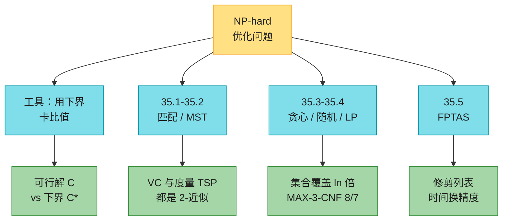

---

## 二、核心思想：用下界证明「不会差过 $\rho$ 倍」

大白话：你不知道最优值 $C^*$ 是多少，照样能证明近似比。办法是找一个**多项式可算的下界** $L\le C^*$，再造一个可行解 $C\le \rho L$。串起来就是 $C\le \rho C^*$。顶点覆盖的 $L$ 是极大匹配的边数；TSP 的 $L$ 是 MST 的权重；加权顶点覆盖的 $L$ 是 LP 松弛最优值。

代价都为正时，近似比定义为

$$
\max\bigl(C/C^*,\ C^*/C\bigr)\le\rho(n).
$$

最小化看 $C/C^*$，最大化看 $C^*/C$，两个方向都 $\ge 1$。$\rho=1$ 就是精确算法。$\rho$ 可以是常数（2、$8/7$），也可以随 $n$ 长大（集合覆盖的 $\lceil\ln |X|\rceil$）。

三个名字，别混：

| 名字 | 含义 | 时间 |
|------|------|------|
| $\rho$-近似 | 最坏比值 $\le\rho$ | 多项式 |
| PTAS | 对任意固定 $\varepsilon>0$ 都是 $(1+\varepsilon)$-近似 | 对固定 $\varepsilon$ 是 $n$ 的多项式，例如 $O(n^{2/\varepsilon})$ |
| FPTAS | 同上，且时间对 $n$ **和** $1/\varepsilon$ 都多项式 | 例如 $O((1/\varepsilon)^2 n^3)$ |

PTAS 把 $\varepsilon$ 减半，次数可能爆炸；FPTAS 减半只让时间乘常数。子集和有 FPTAS；一般图的 TSP 连常数近似都没有。

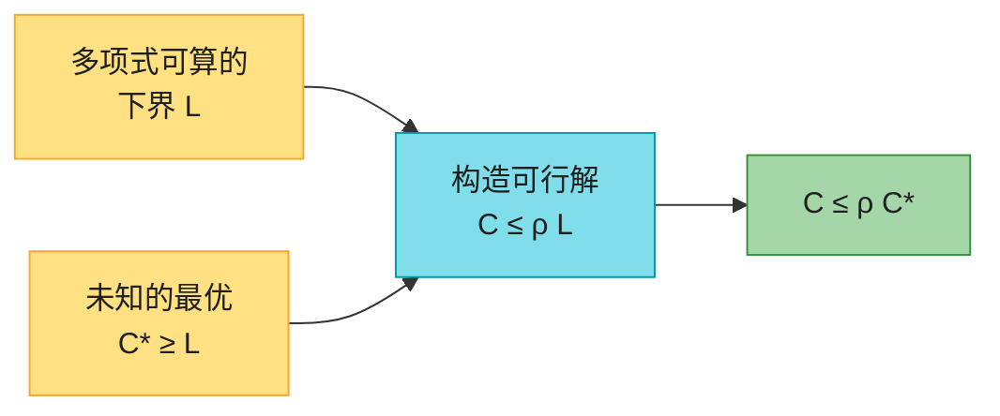

随机近似把 $C$ 换成**期望** $\mathrm{E}[C]$，定义照旧。MAX-3-CNF 的「每个变量抛硬币」就是这种。

---

## 三、顶点覆盖 2-近似（35.1）

### 3.1 直觉

无向图里选尽量少的点，盖住每条边。判定版是 NPC（第 34.5.2 节）。近似算法不管最优，只做一件事：**随便抓一条还没被盖的边，两个端点都丢进覆盖，删掉这两个点碰过的边，重复。**抓过的那些边互不相邻，是一个**极大匹配** $A$。最优覆盖至少要为 $A$ 的每条边出一个人，所以 $|C^*|\ge|A|$；算法输出 $|C|=2|A|$。比值恰好 2。

这就是「用匹配当下界」。不是最大匹配也行——极大就够。时间 $O(V+E)$。

LeetCode：没有「手写 2-近似顶点覆盖」题。对照题是二分图——König 定理说最小顶点覆盖 $=$ 最大匹配，第 25 章直接精确多项式（785 判断二分图是前置）。树上可以线性求最优（35.1-4）：从叶子往上，叶子的边没盖就选父亲。

### 3.2 伪代码

```
APPROX-VERTEX-COVER(G)
1  C = ∅
2  E' = G.E
3  while E' ≠ ∅
4      let (u, v) be an arbitrary edge of E'
5      C = C ∪ {u, v}
6      remove from E' edge (u, v) and every edge incident on either u or v
7  return C
```

### 3.3 示意图（原书 Figure 35.1）

7 个点 8 条边。算法按 $(b,c)$、$(e,f)$、$(d,g)$ 依次抓边，覆盖 6 个点；最优只需 $\{b,d,e\}$ 三个。比值 $6/3=2$，卡在上界上。

(a) 输入图。

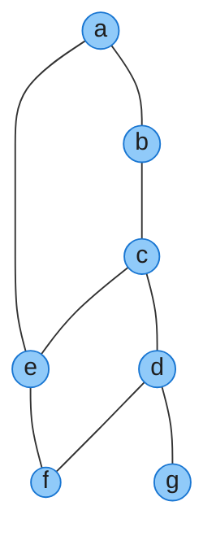

(b) 抓 $(b,c)$，两点进覆盖；虚线是已经被这两点盖掉的边。

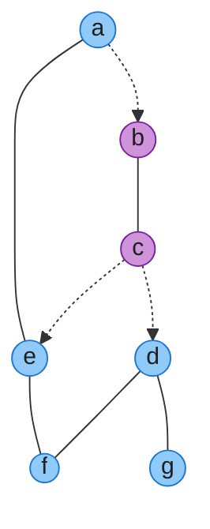

(c) 再抓 $(e,f)$。

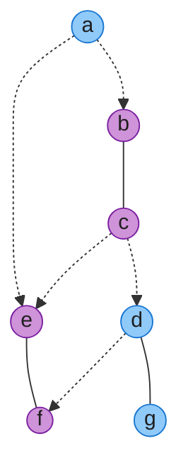

(d) 最后抓 $(d,g)$，边被抓完。

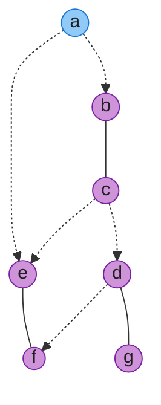

(e) 算法输出 $\{b,c,d,e,f,g\}$，大小 6。(f) 最优 $\{b,d,e\}$，大小 3。

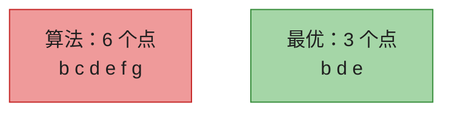

### 3.4 复杂度

$O(V+E)$，2-近似。比值 2 是紧的：本例就是。已知的多项式近似都至少 $2-o(1)$（章末注记）；不要指望把「两端都拿」改成「拿度最大的点」就能突破 2——那条启发式连常数比都没有（35.1-3）。

---

## 四、旅行商问题（35.2）

### 4.1 带三角不等式：MST + 前序 = 2-近似

完全图，边权非负。三角不等式：$c(u,w)\le c(u,v)+c(v,w)$。欧氏距离自动满足。即使加上这条，TSP 仍是 NPC（35.2-2），所以继续近似。

下界：最优环删一条边是生成树，所以 $\mathrm{MST}\le C^*$。把 MST 的每条边走两遍（先下去再回来），得到一条**全走访** $W$，$c(W)=2\cdot\mathrm{MST}\le 2C^*$。$W$ 会重复访问。三角不等式允许「抄近路」：第二次碰到某点就跳过，直接连到下一个新点。剩下的顺序恰好是 MST 的**前序遍历**，是一条哈密顿环 $H$，且 $c(H)\le c(W)$。合起来 $c(H)\le 2C^*$。

Prim 用邻接矩阵是 $\Theta(V^2)$，整段算法也是 $\Theta(V^2)$。

```
APPROX-TSP-TOUR(G, c)
1  select a vertex r in G.V to be a "root" vertex
2  compute a minimum spanning tree T for G from root r
       using MST-PRIM(G, c, r)
3  let H be a list of vertices, ordered according to when they are first visited
       in a preorder tree walk of T
4  return the hamiltonian cycle H
```

原书 Figure 35.2：从 $a$ 长 MST。全走访

$a,b,c,b,h,b,a,d,e,f,e,g,e,d,a$，

前序（每个点只留第一次）$a,b,c,h,d,e,f,g$。这条环大约 $19.074$，最优大约 $14.715$，短了约 $23\%$，仍在 2 倍以内。

MST 的形状（根 $a$，Prim 按字母序加顶点）：

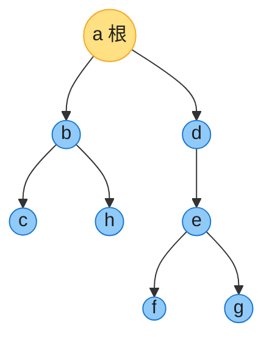

全走访走两遍每条树边；短路之后变成哈密顿环：

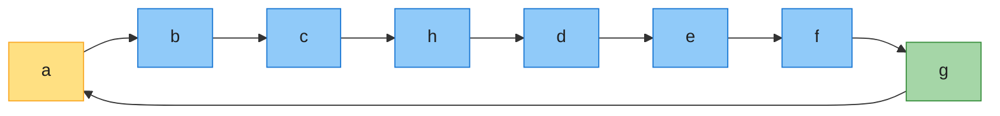

实践里还有更好的：Christofides 把「走两遍」改成「匹配补成欧拉回路」，度量 TSP 到 $3/2$。欧氏平面上甚至有 PTAS（Arora / Mitchell）。书上的 2-近似是为了把「MST 下界 + 三角不等式短路」一次讲清。

LeetCode：1584 是平面点 MST，恰好是本算法的第 2 行；847 / 943 是 $n\le 12$ 的状压精确 TSP，走的是「输入小就指数」那条路，不是近似。

### 4.2 没有三角不等式：任何常数近似都不存在

除非 $P=NP$。证明是**空隙归约**：把哈密顿环实例 $G$ 变成完全图 $G'$，原边权 $1$，非边权 $\rho|V|+1$。

- $G$ 有哈密顿环 $\Rightarrow$ TSP 最优 $=|V|$；
- 否则每条环至少用一条假边，代价 $>\rho|V|$。

$\rho$-近似算法若存在，看到代价 $\le\rho|V|$ 就知道 $G$ 有哈密顿环——于是 $P=NP$。同一手法把 $\rho$ 换成 $|V|^c$，连多项式比都不存在（35.2-6）。

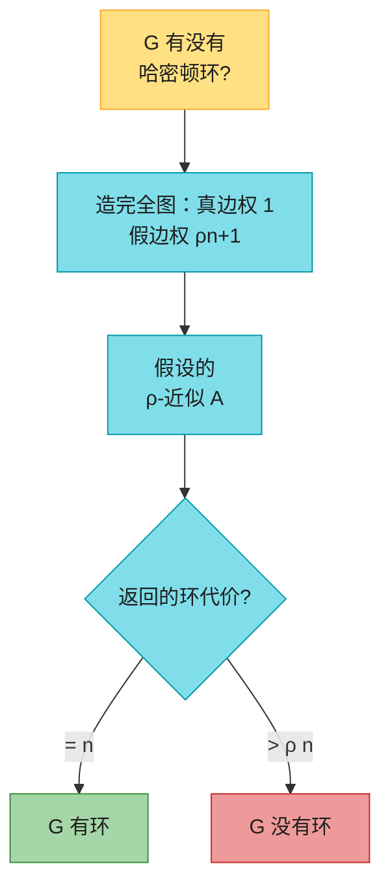

35.2-2 可以把任意 TSP 改成度量 TSP（每条边加一个大 $M$），最优环的**集合**不变。这不推翻 35.3：加了 $nM$ 之后比值被常数项淹没，度量实例上的好近似回到原实例可以很差。

---

## 五、集合覆盖 $O(\lg |X|)$（35.3）

### 5.1 直觉

宇宙 $X$，若干子集组成的族 $\mathcal F$，选尽量少的子集把 $X$ 盖住。顶点覆盖是它的特例（每个顶点对应「它碰过的边」那个子集），所以 NPC。

贪心：每一轮选**还能盖住最多未覆盖元素**的集合。没有贪心选择性质，所以不是最优；但每一轮至少盖掉剩余的 $1/k$（$k$ 是最优集合数），剩余量按 $(1-1/k)$ 几何下降，大约 $\lceil\ln |X|\rceil$ 轮就盖完。

技能组委员会、服务器选址、测试用例覆盖，都是这个问题。

LeetCode：1125 最小必要团队——集合覆盖的状压精确解（技能数 $\le 16$）。

### 5.2 伪代码与例子

```
GREEDY-SET-COVER(X, F)
1  U0 = X
2  C = ∅
3  i = 0
4  while Ui ≠ ∅
5      select S in F that maximizes |S ∩ Ui|
6      Ui+1 = Ui − S
7      C = C ∪ {S}
8      i = i + 1
9  return C
```

原书 Figure 35.3：12 个点、6 个集合。最优 $\{S_3,S_4,S_5\}$ 大小 3；贪心先拿最大的 $S_1$，再 $S_4$、$S_5$，最后 $S_3$ 或 $S_6$，大小 4。

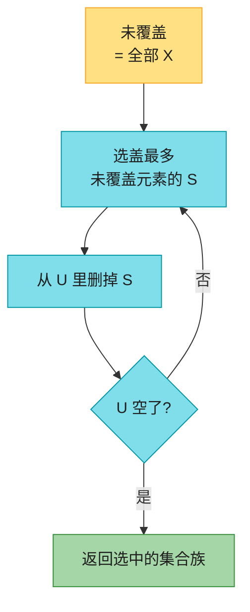

时间：朴素实现 $O(|X|\,|\mathcal F|\,(|X|+|\mathcal F|))$，多项式。习题 35.3-3 可做到 $O(\sum_{S\in\mathcal F}|S|)$：每个元素维护「还含它的集合」，用桶按「还能盖几个」移动。

### 5.3 比值直觉（不要积分）

最优用 $k$ 个集合盖住当前剩余 $U_i$，所以必有一个集合新盖 $\ge|U_i|/k$ 个。贪心至少同样好，于是 $|U_{i+1}|\le|U_i|(1-1/k)$。$1-1/k\le e^{-1/k}$，大约 $k\ln |X|$ 步后剩余 $<1$。因此 $|\mathcal C|\le k\lceil\ln |X|\rceil$。第四版把第三版的调和数 $H(d)$ 收成这一条 $O(\lg |X|)$（前言写过证明改过）。带权版本仍是 $H(d)$（思考题 35-3）。

---

## 六、随机化与线性规划（35.4）

### 6.1 MAX-3-CNF：抛硬币就是 $8/7$-近似

3-CNF 不一定可满足。改成优化：满足尽量多的子句。每个变量独立以 $1/2$ 赋 0/1。假设每个子句恰好三个**不同**文字、且不含互补对（35.4-1 去掉后仍然成立）。

一个子句全假的概率 $(1/2)^3=1/8$，所以满足概率 $7/8$。指示变量 $Y_i$，线性期望 $\mathrm{E}[Y]=7m/8$。最优 $\le m$，期望近似比 $\le m/(7m/8)=8/7$。

不必变量独立到「联合分布很漂亮」——线性期望只要求单子句。这是第 5 章指示变量的直接应用。

LeetCode 不考 MAX-SAT 随机算法；记住「3 个文字 $\Rightarrow$ $7/8$ 期望」即可。MAX-CNF 每个子句至少 1 个文字，满足概率 $\ge 1/2$，随机算法是 2-近似（35.4-2）。MAX-CUT 每个点抛硬币进 $S$，每条边跨割概率 $1/2$，同样 2-近似（35.4-3）。

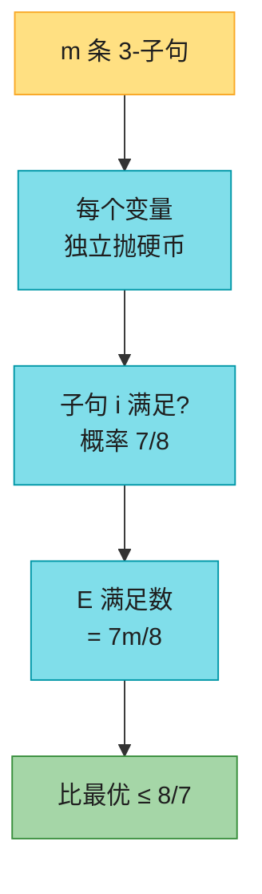

### 6.2 加权顶点覆盖：LP 松弛 + $1/2$ 舍入

每个点有正权重 $w(v)$，求总权最小的顶点覆盖。两端都拿的无权限算法会把轻的点和重的点一视同仁，比值可以任意坏。改成整数规划：

$$
\min\sum_v w(v)\,x(v)
\quad\text{s.t.}\quad
x(u)+x(v)\ge 1\ \forall(u,v)\in E,\quad
x(v)\in\{0,1\}.
$$

把 $x\in\{0,1\}$ 放松成 $0\le x(v)\le 1$，得到**LP 松弛**。最优值 $z^*$ 是原问题的下界（整数可行解也是分数可行解）。解出 $\bar x$ 之后：$\bar x(v)\ge 1/2$ 的点放进覆盖。

为什么一定是覆盖？边上 $x(u)+x(v)\ge 1$，至少一端 $\ge 1/2$。为什么 2-近似？舍入后的权重

$$
w(C)=\sum_{v:\bar x(v)\ge 1/2}w(v)
\le 2\sum_v w(v)\bar x(v)=2z^*\le 2w(C^*).
$$

$x(v)\le 1$ 其实多余：最优解不会超过 1，否则可以往下降目标（35.4-4）。

```
APPROX-MIN-WEIGHT-VC(G, w)
1  C = ∅
2  compute x̄, an optimal solution to the LP relaxation
3  for each vertex v in V
4      if x̄(v) ≥ 1/2
5          C = C ∪ {v}
6  return C
```

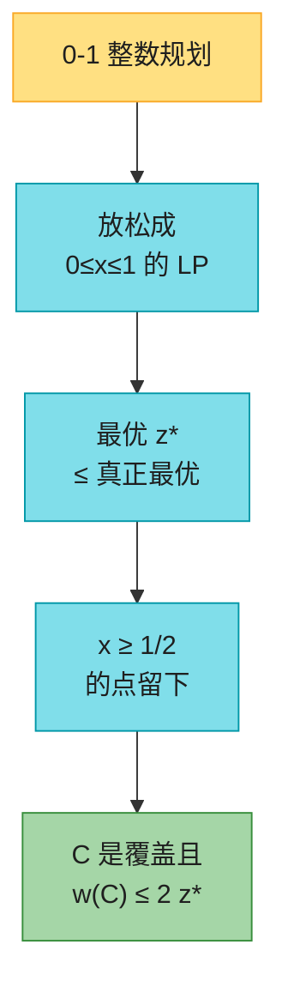

实现不必上单纯形：这个 LP 的最优解半整（$0,1/2,1$）。把每个点拆成左右各一份，原边 $\{u,v\}$ 变成 $u_L$—$v_R$ 和 $v_L$—$u_R$，在二分图上求最小权顶点覆盖（第 24 章：源到左容量 $w(v)$、右到汇容量 $w(v)$、中间边容量 $\infty$，最小割）。读回 $x(v)=(I_L+I_R)/2$，再按书上 $1/2$ 舍入。代码里就是这样做的。

---

## 七、子集和 FPTAS（35.5）

### 7.1 优化版

判定版 NPC。优化版：从正整数 $\{x_1,\ldots,x_n\}$ 里选一个子集，和 $\le t$ 且尽量接近 $t$。卡车载重、背包容量，都是它。

精确算法：令 $P_i$ 为前 $i$ 个数所有子集和，$P_i=P_{i-1}\cup(P_{i-1}+x_i)$，丢掉 $>t$ 的。列表最长 $2^i$，指数。若 $t$ 或所有 $x_i$ 关于 $n$ 多项式，它就是多项式（伪多项式，和第 34.5.4 / 14 章背包同一件事）。

```
EXACT-SUBSET-SUM(S, n, t)
1  L0 = ⟨0⟩
2  for i = 1 to n
3      Li = MERGE-LISTS(Li-1, Li-1 + xi)
4      remove from Li every element that is greater than t
5  return the largest element in Ln
```

### 7.2 修剪：相近的和只留一个代表

参数 $0<\delta<1$。升序扫列表，若 $y_i\le\mathrm{last}\cdot(1+\delta)$ 就丢掉 $y_i$——留下的 `last` 不大于它，且在 $1+\delta$ 倍以内。

```
TRIM(L, δ)
1  let m be the length of L
2  L' = ⟨y1⟩
3  last = y1
4  for i = 2 to m
5      if yi > last · (1 + δ)
6          append yi onto the end of L'
7          last = yi
8  return L'
```

$\delta=0.1$ 时：

| 下标 | 0 | 1 | 2 | 3 | 4 | 5 | 6 | 7 | 8 | 9 |
|------|---|---|---|---|---|---|---|---|---|---|
| $L$ | 10 | 11 | 12 | 15 | 20 | 21 | 22 | 23 | 24 | 29 |
| 去留 | 留 | 删 | 留 | 留 | 留 | 删 | 删 | 留 | 删 | 留 |

11 由 10 代表，21/22 由 20 代表，24 由 23 代表。结果 $\langle 10,12,15,20,23,29\rangle$。

### 7.3 FPTAS：每步用 $\varepsilon/(2n)$ 修剪

误差会乘 $n$ 次。每次 $\delta=\varepsilon/(2n)$，总放大 $(1+\varepsilon/(2n))^n\le 1+\varepsilon$。列表相邻项至少差 $1+\varepsilon/(2n)$ 倍，长度 $O((n\ln t)/\varepsilon)$，所以时间对 $n$、$1/\varepsilon$、$\lg t$ 都多项式——这就是 FPTAS。

```
APPROX-SUBSET-SUM(S, n, t, ε)
1  L0 = ⟨0⟩
2  for i = 1 to n
3      Li = MERGE-LISTS(Li-1, Li-1 + xi)
4      Li = TRIM(Li, ε / 2n)
5      remove from Li every element that is greater than t
6  let z* be the largest value in Ln
7  return z*
```

原书例子：$S=\langle 104,102,201,101\rangle$，$t=308$，$\varepsilon=0.40$，于是 $\delta=0.05$。加粗是本步新留下的代表，删除线是被修剪或切掉的。

$L_0$：

| 0 |
|---|
| **0** |

并入 104：

| 0 | 1 |
|---|---|
| 0 | 104 |

并入 102 再修剪（104 由 102 代表，$102\cdot 1.05=107.1$）：

| 0 | 1 | 2 | 3 |
|---|---|---|---|
| 0 | **102** | ~~104~~ | 206 |

并入 201 再修剪、切掉 $>t$ 的 407（206 由 201 代表）：

| 0 | 1 | 2 | 3 | 4 | 5 |
|---|---|---|---|---|---|
| 0 | 102 | **201** | ~~206~~ | **303** | ~~407~~ |

并入 101 再修剪、切掉 404：

| 0 | 1 | 2 | 3 | 4 | 5 | 6 | 7 |
|---|---|---|---|---|---|---|---|
| 0 | **101** | ~~102~~ | 201 | ~~203~~ | **302** | ~~303~~ | ~~404~~ |

返回 **302**。精确最优 $104+102+101=307$。$307/302\approx 1.017$，远好于 $1.40$。

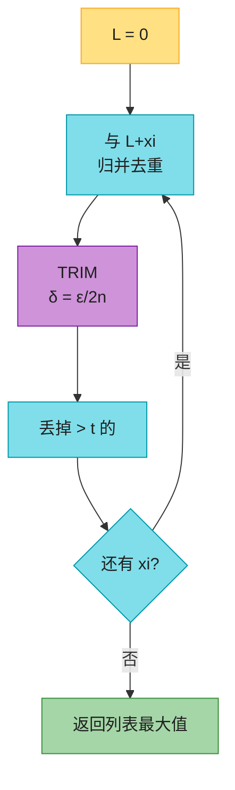

LeetCode：416 / 494 / 1049 是 $t$ 很小的精确 DP，走伪多项式，不是 FPTAS。FPTAS 的思维在「目标和很大、只要求相对误差」时才值得搬出来。

---

## 八、代码实现（Java + Python）

约定：伪代码按 CLRS **1-indexed** 书写；实战代码统一 **0-indexed**。图用邻接矩阵；TSP 距离矩阵；集合覆盖的宇宙是 $\{0,\ldots,n-1\}$；3-CNF 子句为 `(变量下标, 是否取反)`。

下面两份从本文原样抽出即可编译运行；`main` 核对 Figure 35.1（6 vs 3）、TRIM 例子、书上 FPTAS 返回 302、习题 35.3-1 单词覆盖，并用随机实例对拍：顶点覆盖 / 度量 TSP / 加权 VC 的 2-近似、集合覆盖对 $\lceil\ln |X|\rceil$ 界、精确子集和对暴力、FPTAS 相对误差、树上顶点覆盖最优、First-Fit 装箱 $\lceil S\rceil$ 下界。

### 8.1 Java

```java
import java.util.*;

/**
 * CLRS 4e Ch.35 近似算法。0-indexed。
 * 加权顶点覆盖的 LP 松弛半整：二分双盖图 + 最小割求解，再按 x>=1/2 舍入。
 */
public class ApproximationAlgorithms {
    static final double EPS = 1e-9;

    static List<Integer> approxVertexCover(boolean[][] adj) {
        int n = adj.length;
        boolean[][] covered = new boolean[n][n];
        List<Integer> C = new ArrayList<>();
        boolean[] inC = new boolean[n];
        for (int u = 0; u < n; u++) {
            for (int v = u + 1; v < n; v++) {
                if (!adj[u][v] || covered[u][v]) continue;
                if (!inC[u]) { inC[u] = true; C.add(u); }
                if (!inC[v]) { inC[v] = true; C.add(v); }
                for (int x = 0; x < n; x++) {
                    if (adj[u][x]) covered[Math.min(u, x)][Math.max(u, x)] = true;
                    if (adj[v][x]) covered[Math.min(v, x)][Math.max(v, x)] = true;
                }
            }
        }
        return C;
    }

    static boolean isVertexCover(boolean[][] adj, List<Integer> C) {
        int n = adj.length;
        boolean[] inC = new boolean[n];
        for (int v : C) inC[v] = true;
        for (int u = 0; u < n; u++)
            for (int v = u + 1; v < n; v++)
                if (adj[u][v] && !inC[u] && !inC[v]) return false;
        return true;
    }

    static List<Integer> bruteMinVertexCover(boolean[][] adj) {
        int n = adj.length;
        int best = n;
        int bestMask = (1 << n) - 1;
        for (int mask = 0; mask < (1 << n); mask++) {
            List<Integer> C = maskToList(mask, n);
            if (C.size() < best && isVertexCover(adj, C)) {
                best = C.size();
                bestMask = mask;
            }
        }
        return maskToList(bestMask, n);
    }

    static List<Integer> bruteMinWeightVC(boolean[][] adj, double[] w) {
        int n = adj.length;
        double bestW = 1e18;
        int bestMask = (1 << n) - 1;
        for (int mask = 0; mask < (1 << n); mask++) {
            List<Integer> C = maskToList(mask, n);
            double wt = 0;
            for (int v : C) wt += w[v];
            if (wt < bestW && isVertexCover(adj, C)) {
                bestW = wt;
                bestMask = mask;
            }
        }
        return maskToList(bestMask, n);
    }

    static List<Integer> maskToList(int mask, int n) {
        List<Integer> C = new ArrayList<>();
        for (int i = 0; i < n; i++) if ((mask & (1 << i)) != 0) C.add(i);
        return C;
    }

    static boolean[] ekReach(double[][] cap, int s, int t) {
        int n = cap.length;
        double[][] res = new double[n][n];
        for (int i = 0; i < n; i++) res[i] = cap[i].clone();
        int[] parent = new int[n];
        while (true) {
            Arrays.fill(parent, -1);
            parent[s] = -2;
            ArrayDeque<Integer> q = new ArrayDeque<>();
            q.add(s);
            boolean found = false;
            while (!q.isEmpty()) {
                int u = q.poll();
                for (int v = 0; v < n; v++) {
                    if (parent[v] == -1 && res[u][v] > 1e-12) {
                        parent[v] = u;
                        if (v == t) { found = true; break; }
                        q.add(v);
                    }
                }
                if (found) break;
            }
            if (!found) break;
            double add = 1e18;
            for (int v = t; v != s; v = parent[v]) add = Math.min(add, res[parent[v]][v]);
            for (int v = t; v != s; v = parent[v]) {
                int u = parent[v];
                res[u][v] -= add;
                res[v][u] += add;
            }
        }
        boolean[] vis = new boolean[n];
        ArrayDeque<Integer> q = new ArrayDeque<>();
        q.add(s);
        vis[s] = true;
        while (!q.isEmpty()) {
            int u = q.poll();
            for (int v = 0; v < n; v++) if (!vis[v] && res[u][v] > 1e-12) {
                vis[v] = true;
                q.add(v);
            }
        }
        return vis;
    }

    static double[] solveVcLp(boolean[][] adj, double[] w) {
        int n = adj.length;
        int N = 2 * n + 2, s = 2 * n, t = 2 * n + 1;
        double[][] cap = new double[N][N];
        double inf = 0;
        for (double x : w) inf += x;
        inf += 1;
        for (int v = 0; v < n; v++) {
            cap[s][v] = w[v];
            cap[n + v][t] = w[v];
        }
        for (int u = 0; u < n; u++)
            for (int v = 0; v < n; v++)
                if (u != v && adj[u][v]) cap[u][n + v] = inf;
        boolean[] reach = ekReach(cap, s, t);
        double[] x = new double[n];
        for (int v = 0; v < n; v++) {
            double left = reach[v] ? 0 : 1;
            double right = reach[n + v] ? 1 : 0;
            x[v] = 0.5 * (left + right);
        }
        return x;
    }

    static List<Integer> approxMinWeightVC(boolean[][] adj, double[] w) {
        double[] x = solveVcLp(adj, w);
        List<Integer> C = new ArrayList<>();
        for (int v = 0; v < w.length; v++) if (x[v] >= 0.5 - 1e-9) C.add(v);
        return C;
    }

    static int[] primMstParent(double[][] dist, int root) {
        int n = dist.length;
        boolean[] inT = new boolean[n];
        double[] key = new double[n];
        int[] parent = new int[n];
        Arrays.fill(key, 1e18);
        Arrays.fill(parent, -1);
        key[root] = 0;
        for (int it = 0; it < n; it++) {
            int u = -1;
            double best = 1e18;
            for (int v = 0; v < n; v++) if (!inT[v] && key[v] < best) {
                best = key[v];
                u = v;
            }
            inT[u] = true;
            for (int v = 0; v < n; v++) if (!inT[v] && dist[u][v] < key[v]) {
                key[v] = dist[u][v];
                parent[v] = u;
            }
        }
        return parent;
    }

    static List<Integer> approxTspTour(double[][] dist, int root) {
        int n = dist.length;
        if (n == 0) return new ArrayList<>();
        int[] parent = primMstParent(dist, root);
        List<List<Integer>> ch = new ArrayList<>();
        for (int i = 0; i < n; i++) ch.add(new ArrayList<>());
        for (int v = 0; v < n; v++) if (parent[v] >= 0) ch.get(parent[v]).add(v);
        for (List<Integer> c : ch) Collections.sort(c);
        List<Integer> tour = new ArrayList<>();
        preorder(root, ch, tour);
        return tour;
    }

    static void preorder(int u, List<List<Integer>> ch, List<Integer> tour) {
        tour.add(u);
        for (int v : ch.get(u)) preorder(v, ch, tour);
    }

    static double tourCost(double[][] dist, List<Integer> tour) {
        if (tour.isEmpty()) return 0;
        double s = 0;
        int n = tour.size();
        for (int i = 0; i < n; i++) s += dist[tour.get(i)][tour.get((i + 1) % n)];
        return s;
    }

    static double heldKarp(double[][] dist) {
        int n = dist.length;
        if (n == 0) return 0;
        int N = 1 << n;
        double inf = 1e18;
        double[][] dp = new double[N][n];
        for (int i = 0; i < N; i++) Arrays.fill(dp[i], inf);
        dp[1][0] = 0;
        for (int mask = 0; mask < N; mask++) {
            for (int u = 0; u < n; u++) {
                if (dp[mask][u] >= inf / 2 || (mask & (1 << u)) == 0) continue;
                for (int v = 0; v < n; v++) {
                    if ((mask & (1 << v)) != 0) continue;
                    int nxt = mask | (1 << v);
                    dp[nxt][v] = Math.min(dp[nxt][v], dp[mask][u] + dist[u][v]);
                }
            }
        }
        double ans = inf;
        int full = N - 1;
        for (int u = 0; u < n; u++) ans = Math.min(ans, dp[full][u] + dist[u][0]);
        return ans;
    }

    static List<Integer> greedySetCover(int n, List<Set<Integer>> sets) {
        Set<Integer> U = new HashSet<>();
        for (int i = 0; i < n; i++) U.add(i);
        List<Integer> chosen = new ArrayList<>();
        boolean[] used = new boolean[sets.size()];
        while (!U.isEmpty()) {
            int bestI = -1, best = -1;
            for (int i = 0; i < sets.size(); i++) {
                if (used[i]) continue;
                int gain = 0;
                for (int e : sets.get(i)) if (U.contains(e)) gain++;
                if (gain > best) { best = gain; bestI = i; }
            }
            if (best <= 0) break;
            used[bestI] = true;
            chosen.add(bestI);
            U.removeAll(sets.get(bestI));
        }
        return chosen;
    }

    static boolean isSetCover(int n, List<Set<Integer>> sets, List<Integer> chosen) {
        Set<Integer> got = new HashSet<>();
        for (int i : chosen) got.addAll(sets.get(i));
        return got.size() == n;
    }

    static List<Integer> bruteMinSetCover(int n, List<Set<Integer>> sets) {
        int m = sets.size();
        int best = m + 1, bestMask = (1 << m) - 1;
        for (int mask = 0; mask < (1 << m); mask++) {
            List<Integer> ch = maskToList(mask, m);
            if (ch.size() < best && isSetCover(n, sets, ch)) {
                best = ch.size();
                bestMask = mask;
            }
        }
        return maskToList(bestMask, m);
    }

    static int countSat(int[] assign, int[][] clauses) {
        int sat = 0;
        outer:
        for (int[] cl : clauses) {
            for (int k = 0; k < cl.length; k += 2) {
                int bit = assign[cl[k]];
                if (cl[k + 1] == 1) bit = 1 - bit;
                if (bit == 1) { sat++; continue outer; }
            }
        }
        return sat;
    }

    static int bruteMax3Cnf(int nVars, int[][] clauses) {
        int best = 0;
        int[] assign = new int[nVars];
        for (int mask = 0; mask < (1 << nVars); mask++) {
            for (int i = 0; i < nVars; i++) assign[i] = (mask >> i) & 1;
            best = Math.max(best, countSat(assign, clauses));
        }
        return best;
    }

    static List<Integer> mergeLists(List<Integer> a, List<Integer> b) {
        List<Integer> out = new ArrayList<>();
        int i = 0, j = 0;
        while (i < a.size() && j < b.size()) {
            int x = a.get(i), y = b.get(j);
            if (x < y) { out.add(x); i++; }
            else if (y < x) { out.add(y); j++; }
            else { out.add(x); i++; j++; }
        }
        while (i < a.size()) out.add(a.get(i++));
        while (j < b.size()) out.add(b.get(j++));
        return out;
    }

    static int exactSubsetSum(int[] S, int t) {
        List<Integer> L = new ArrayList<>();
        L.add(0);
        for (int x : S) {
            List<Integer> Lx = new ArrayList<>();
            for (int y : L) Lx.add(y + x);
            L = mergeLists(L, Lx);
            List<Integer> keep = new ArrayList<>();
            for (int y : L) if (y <= t) keep.add(y);
            L = keep;
        }
        return L.get(L.size() - 1);
    }

    static List<Integer> trim(List<Integer> L, double delta) {
        if (L.isEmpty()) return new ArrayList<>();
        List<Integer> out = new ArrayList<>();
        out.add(L.get(0));
        int last = L.get(0);
        for (int i = 1; i < L.size(); i++) {
            if (L.get(i) > last * (1 + delta)) {
                out.add(L.get(i));
                last = L.get(i);
            }
        }
        return out;
    }

    static int approxSubsetSum(int[] S, int t, double eps) {
        int n = S.length;
        List<Integer> L = new ArrayList<>();
        L.add(0);
        for (int x : S) {
            List<Integer> Lx = new ArrayList<>();
            for (int y : L) Lx.add(y + x);
            L = mergeLists(L, Lx);
            L = trim(L, n == 0 ? 0 : eps / (2.0 * n));
            List<Integer> keep = new ArrayList<>();
            for (int y : L) if (y <= t) keep.add(y);
            L = keep;
        }
        return L.get(L.size() - 1);
    }

    static int firstFit(double[] sizes) {
        List<Double> bins = new ArrayList<>();
        for (double s : sizes) {
            boolean placed = false;
            for (int i = 0; i < bins.size(); i++) {
                if (bins.get(i) + s <= 1 + 1e-12) {
                    bins.set(i, bins.get(i) + s);
                    placed = true;
                    break;
                }
            }
            if (!placed) bins.add(s);
        }
        return bins.size();
    }

    static List<Integer> treeVertexCover(int n, int[][] edges) {
        List<List<Integer>> g = new ArrayList<>();
        for (int i = 0; i < n; i++) g.add(new ArrayList<>());
        for (int[] e : edges) {
            g.get(e[0]).add(e[1]);
            g.get(e[1]).add(e[0]);
        }
        boolean[] taken = new boolean[n];
        List<Integer> cover = new ArrayList<>();
        treeDfs(0, -1, g, taken, cover);
        return cover;
    }

    static void treeDfs(int u, int p, List<List<Integer>> g, boolean[] taken, List<Integer> cover) {
        for (int v : g.get(u)) if (v != p) treeDfs(v, u, g, taken, cover);
        boolean need = false;
        for (int v : g.get(u)) if (v != p && !taken[v] && !taken[u]) need = true;
        if (need) { taken[u] = true; cover.add(u); }
    }

    static void check(boolean cond, String msg) {
        if (!cond) throw new AssertionError(msg);
    }

    static boolean[][] figure351() {
        int n = 7;
        boolean[][] adj = new boolean[n][n];
        int[][] e = {{0,1},{1,2},{2,3},{0,4},{2,4},{4,5},{3,5},{3,6}};
        for (int[] x : e) adj[x[0]][x[1]] = adj[x[1]][x[0]] = true;
        return adj;
    }

    static boolean[][] randomUndirected(int n, double p, Random rng) {
        boolean[][] adj = new boolean[n][n];
        for (int i = 0; i < n; i++)
            for (int j = i + 1; j < n; j++)
                if (rng.nextDouble() < p) adj[i][j] = adj[j][i] = true;
        return adj;
    }

    static double[][] metricDist(double[][] pts) {
        int n = pts.length;
        double[][] d = new double[n][n];
        for (int i = 0; i < n; i++)
            for (int j = 0; j < n; j++) {
                double dx = pts[i][0] - pts[j][0], dy = pts[i][1] - pts[j][1];
                d[i][j] = Math.sqrt(dx * dx + dy * dy);
            }
        return d;
    }

    public static void main(String[] args) {
        boolean[][] adj = figure351();
        List<Integer> C = approxVertexCover(adj);
        List<Integer> opt = bruteMinVertexCover(adj);
        check(isVertexCover(adj, C), "fig vc valid");
        check(C.size() == 6, "fig vc size 6");
        check(opt.size() == 3, "fig opt 3");
        check(C.size() <= 2 * opt.size(), "fig ratio 2");

        List<Integer> Ltrim = Arrays.asList(10,11,12,15,20,21,22,23,24,29);
        check(trim(Ltrim, 0.1).equals(Arrays.asList(10,12,15,20,23,29)), "trim example");

        int[] S = {104, 102, 201, 101};
        int z = approxSubsetSum(S, 308, 0.40);
        check(z == 302, "book FPTAS example 302");
        int exact = exactSubsetSum(S, 308);
        check(exact == 307, "exact 307");
        check(exact / (double) z <= 1.40 + 1e-9, "eps 0.40");

        String[] words = {"farid","dash","drain","heard","lost","nose","shun","slate","snare","thread"};
        TreeSet<Character> let = new TreeSet<>();
        for (String w : words) for (char c : w.toCharArray()) let.add(c);
        List<Character> letters = new ArrayList<>(let);
        Map<Character, Integer> idx = new HashMap<>();
        for (int i = 0; i < letters.size(); i++) idx.put(letters.get(i), i);
        Integer[] ordObj = new Integer[words.length];
        for (int i = 0; i < words.length; i++) ordObj[i] = i;
        Arrays.sort(ordObj, Comparator.comparing(i -> words[i]));
        Set<Integer> U = new HashSet<>();
        for (int i = 0; i < letters.size(); i++) U.add(i);
        boolean[] unused = new boolean[words.length];
        Arrays.fill(unused, true);
        List<String> picked = new ArrayList<>();
        while (!U.isEmpty()) {
            int bestI = -1, best = -1;
            for (int i : ordObj) {
                if (!unused[i]) continue;
                int gain = 0;
                for (char c : words[i].toCharArray()) if (U.contains(idx.get(c))) gain++;
                if (gain > best) { best = gain; bestI = i; }
            }
            unused[bestI] = false;
            picked.add(words[bestI]);
            for (char c : words[bestI].toCharArray()) U.remove(idx.get(c));
        }
        check(picked.equals(Arrays.asList("thread","lost","drain","farid","shun")), "35.3-1");

        Random rng = new Random(35);
        for (int t = 0; t < 80; t++) {
            int n = 1 + rng.nextInt(8);
            adj = randomUndirected(n, 0.4, rng);
            C = approxVertexCover(adj);
            check(isVertexCover(adj, C), "rand vc");
            opt = bruteMinVertexCover(adj);
            if (opt.isEmpty()) check(C.isEmpty(), "empty cover");
            else check(C.size() <= 2 * opt.size(), "vc 2-approx");
            double[] w = new double[n];
            for (int i = 0; i < n; i++) w[i] = 1 + rng.nextInt(9);
            double[] xlp = solveVcLp(adj, w);
            double zstar = 0;
            for (int i = 0; i < n; i++) zstar += w[i] * xlp[i];
            List<Integer> Cw = new ArrayList<>();
            for (int v = 0; v < n; v++) if (xlp[v] >= 0.5 - 1e-9) Cw.add(v);
            check(isVertexCover(adj, Cw), "wvc cover");
            List<Integer> optw = bruteMinWeightVC(adj, w);
            double ow = 0, cw = 0;
            for (int v : optw) ow += w[v];
            for (int v : Cw) cw += w[v];
            check(zstar <= ow + 1e-6, "lp lower bound");
            check(cw <= 2 * zstar + 1e-6, "round 2 z*");
            if (ow == 0) check(cw == 0, "zero weight");
            else check(cw <= 2 * ow + 1e-6, "wvc 2-approx");
        }

        for (int t = 0; t < 40; t++) {
            int n = 2 + rng.nextInt(7);
            double[][] pts = new double[n][2];
            for (int i = 0; i < n; i++) { pts[i][0] = rng.nextDouble(); pts[i][1] = rng.nextDouble(); }
            double[][] dist = metricDist(pts);
            List<Integer> tour = approxTspTour(dist, 0);
            int[] seen = new int[n];
            for (int v : tour) seen[v]++;
            for (int i = 0; i < n; i++) check(seen[i] == 1, "tsp perm");
            double c = tourCost(dist, tour);
            double optc = heldKarp(dist);
            check(c <= 2 * optc + 1e-6, "tsp 2-approx");
        }

        for (int t = 0; t < 40; t++) {
            int nx = 1 + rng.nextInt(8);
            int m = 1 + rng.nextInt(7);
            List<Set<Integer>> sets = new ArrayList<>();
            Set<Integer> covered = new HashSet<>();
            for (int j = 0; j < m; j++) {
                Set<Integer> st = new HashSet<>();
                for (int e = 0; e < nx; e++) if (rng.nextDouble() < 0.4) st.add(e);
                if (st.isEmpty()) st.add(rng.nextInt(nx));
                sets.add(st);
                covered.addAll(st);
            }
            if (covered.size() < nx) {
                Set<Integer> rest = new HashSet<>();
                for (int e = 0; e < nx; e++) if (!covered.contains(e)) rest.add(e);
                sets.add(rest);
            }
            List<Integer> ch = greedySetCover(nx, sets);
            check(isSetCover(nx, sets, ch), "set cover valid");
            List<Integer> optc = bruteMinSetCover(nx, sets);
            check(ch.size() >= optc.size(), "greedy >= opt");
            if (nx > 1 && !optc.isEmpty())
                check(ch.size() <= optc.size() * Math.ceil(Math.log(nx) + 1e-12), "set cover ln");
        }

        int totalSat = 0, totalM = 0;
        for (int t = 0; t < 60; t++) {
            int nv = 2 + rng.nextInt(5);
            int mcl = 1 + rng.nextInt(10);
            List<int[]> cls = new ArrayList<>();
            for (int c = 0; c < mcl; c++) {
                int[] vs = new int[3];
                boolean[] used = new boolean[nv];
                boolean ok = true;
                for (int k = 0; k < 3; k++) {
                    vs[k] = rng.nextInt(nv);
                    if (used[vs[k]]) ok = false;
                    used[vs[k]] = true;
                }
                if (!ok) continue;
                int[] cl = new int[6];
                for (int k = 0; k < 3; k++) {
                    cl[2 * k] = vs[k];
                    cl[2 * k + 1] = rng.nextInt(2);
                }
                cls.add(cl);
            }
            if (cls.isEmpty()) continue;
            int[][] clauses = cls.toArray(new int[0][]);
            int[] assign = new int[nv];
            for (int i = 0; i < nv; i++) assign[i] = rng.nextInt(2);
            int sat = countSat(assign, clauses);
            int optcnf = bruteMax3Cnf(nv, clauses);
            check(sat <= optcnf, "cnf sat <= opt");
            totalSat += sat;
            totalM += clauses.length;
        }
        check(totalM > 0 && totalSat / (double) totalM >= 0.70, "random 3cnf mean near 7/8");

        for (int t = 0; t < 80; t++) {
            int n = 1 + rng.nextInt(10);
            int[] SS = new int[n];
            int sum = 0;
            for (int i = 0; i < n; i++) { SS[i] = 1 + rng.nextInt(30); sum += SS[i]; }
            int target = rng.nextInt(sum + 6);
            int ex = exactSubsetSum(SS, target);
            int brute = 0;
            for (int mask = 0; mask < (1 << n); mask++) {
                int sm = 0;
                for (int i = 0; i < n; i++) if ((mask & (1 << i)) != 0) sm += SS[i];
                if (sm <= target) brute = Math.max(brute, sm);
            }
            check(ex == brute, "exact vs brute");
            if (ex > 0) {
                int zz = approxSubsetSum(SS, target, 0.4);
                check(zz <= target && zz <= ex, "approx feasible");
                check(ex / (double) Math.max(zz, 1) <= 1.4 + 1e-6, "fptas 0.4");
            }
        }

        for (int t = 0; t < 40; t++) {
            int n = 1 + rng.nextInt(12);
            double[] sizes = new double[n];
            double sm = 0;
            for (int i = 0; i < n; i++) {
                sizes[i] = rng.nextDouble() * 0.99 + 0.001;
                sm += sizes[i];
            }
            int b = firstFit(sizes);
            int optLb = (int) Math.ceil(sm - 1e-12);
            check(b >= optLb, "ff vs ceil S");
            check(b <= Math.max(1, 2 * optLb), "ff 2-approx");
        }

        for (int t = 0; t < 30; t++) {
            int n = 1 + rng.nextInt(8);
            int[][] edges = new int[Math.max(0, n - 1)][2];
            boolean[][] tadj = new boolean[n][n];
            for (int v = 1; v < n; v++) {
                int p = rng.nextInt(v);
                edges[v - 1][0] = p;
                edges[v - 1][1] = v;
                tadj[p][v] = tadj[v][p] = true;
            }
            List<Integer> tv = treeVertexCover(n, edges);
            check(isVertexCover(tadj, tv), "tree vc");
            check(tv.size() == bruteMinVertexCover(tadj).size(), "tree optimal");
        }

        System.out.println("ApproximationAlgorithms: all checks passed");
    }
}
```

### 8.2 Python

```python
"""CLRS 4e Ch.35 approximation algorithms. 0-indexed."""
import math
import random
from collections import deque


def approx_vertex_cover(adj):
    n = len(adj)
    covered_edge = [[False] * n for _ in range(n)]
    C = []
    in_c = [False] * n
    for u in range(n):
        for v in range(u + 1, n):
            if not adj[u][v] or covered_edge[u][v]:
                continue
            if not in_c[u]:
                in_c[u] = True
                C.append(u)
            if not in_c[v]:
                in_c[v] = True
                C.append(v)
            for x in range(n):
                if adj[u][x]:
                    covered_edge[min(u, x)][max(u, x)] = True
                if adj[v][x]:
                    covered_edge[min(v, x)][max(v, x)] = True
    return C


def is_vertex_cover(adj, C):
    in_c = [False] * len(adj)
    for v in C:
        in_c[v] = True
    n = len(adj)
    for u in range(n):
        for v in range(u + 1, n):
            if adj[u][v] and not in_c[u] and not in_c[v]:
                return False
    return True


def brute_min_vertex_cover(adj):
    n = len(adj)
    best = n
    best_set = list(range(n))
    for mask in range(1 << n):
        C = [i for i in range(n) if mask & (1 << i)]
        if len(C) < best and is_vertex_cover(adj, C):
            best = len(C)
            best_set = C
    return best_set


def brute_min_weight_vertex_cover(adj, w):
    n = len(adj)
    best_w = sum(w) + 1
    best_set = list(range(n))
    for mask in range(1 << n):
        C = [i for i in range(n) if mask & (1 << i)]
        wt = sum(w[i] for i in C)
        if wt < best_w and is_vertex_cover(adj, C):
            best_w = wt
            best_set = C
    return best_set


def _ek_mincut_cover(cap, s, t):
    n = len(cap)
    res = [row[:] for row in cap]
    parent = [-1] * n

    def bfs():
        vis = [False] * n
        q = deque([s])
        vis[s] = True
        parent[s] = -2
        while q:
            u = q.popleft()
            for v in range(n):
                if not vis[v] and res[u][v] > 1e-12:
                    vis[v] = True
                    parent[v] = u
                    if v == t:
                        return True
                    q.append(v)
        return False

    while bfs():
        add = float("inf")
        v = t
        while v != s:
            u = parent[v]
            add = min(add, res[u][v])
            v = u
        v = t
        while v != s:
            u = parent[v]
            res[u][v] -= add
            res[v][u] += add
            v = u

    vis = [False] * n
    q = deque([s])
    vis[s] = True
    while q:
        u = q.popleft()
        for v in range(n):
            if not vis[v] and res[u][v] > 1e-12:
                vis[v] = True
                q.append(v)
    return vis


def solve_vc_lp(adj, w):
    """Optimal half-integral VC LP via bipartite double cover + min-cut."""
    n = len(adj)
    N = 2 * n + 2
    s, t = 2 * n, 2 * n + 1
    cap = [[0.0] * N for _ in range(N)]
    INF = sum(w) + 1.0
    for v in range(n):
        cap[s][v] = w[v]
        cap[n + v][t] = w[v]
    for u in range(n):
        for v in range(n):
            if u != v and adj[u][v]:
                cap[u][n + v] = INF
    reach = _ek_mincut_cover(cap, s, t)
    x = [0.0] * n
    for v in range(n):
        left = 0.0 if reach[v] else 1.0
        right = 1.0 if reach[n + v] else 0.0
        x[v] = 0.5 * (left + right)
    return x


def approx_min_weight_vc(adj, w):
    x = solve_vc_lp(adj, w)
    return [v for v in range(len(w)) if x[v] >= 0.5 - 1e-9]


def prim_mst_parent(dist, root=0):
    n = len(dist)
    in_t = [False] * n
    key = [float("inf")] * n
    parent = [-1] * n
    key[root] = 0.0
    for _ in range(n):
        u = -1
        best = float("inf")
        for v in range(n):
            if not in_t[v] and key[v] < best:
                best = key[v]
                u = v
        in_t[u] = True
        for v in range(n):
            if not in_t[v] and dist[u][v] < key[v]:
                key[v] = dist[u][v]
                parent[v] = u
    return parent


def approx_tsp_tour(dist, root=0):
    n = len(dist)
    if n == 0:
        return []
    parent = prim_mst_parent(dist, root)
    children = [[] for _ in range(n)]
    for v in range(n):
        if parent[v] >= 0:
            children[parent[v]].append(v)
    for ch in children:
        ch.sort()
    tour = []

    def preorder(u):
        tour.append(u)
        for v in children[u]:
            preorder(v)

    preorder(root)
    return tour


def tour_cost(dist, tour):
    if not tour:
        return 0.0
    s = 0.0
    n = len(tour)
    for i in range(n):
        s += dist[tour[i]][tour[(i + 1) % n]]
    return s


def held_karp(dist):
    n = len(dist)
    if n == 0:
        return 0.0
    N = 1 << n
    inf = float("inf")
    dp = [[inf] * n for _ in range(N)]
    dp[1][0] = 0.0
    for mask in range(N):
        for u in range(n):
            if dp[mask][u] >= inf or (mask & (1 << u)) == 0:
                continue
            for v in range(n):
                if mask & (1 << v):
                    continue
                nxt = mask | (1 << v)
                cand = dp[mask][u] + dist[u][v]
                if cand < dp[nxt][v]:
                    dp[nxt][v] = cand
    full = N - 1
    return min(dp[full][u] + dist[u][0] for u in range(n))


def greedy_set_cover(n, sets):
    U = set(range(n))
    chosen = []
    used = [False] * len(sets)
    while U:
        best_i = -1
        best = -1
        for i, S in enumerate(sets):
            if used[i]:
                continue
            gain = len(U & S)
            if gain > best:
                best = gain
                best_i = i
        if best <= 0:
            break
        used[best_i] = True
        chosen.append(best_i)
        U -= sets[best_i]
    return chosen


def is_set_cover(n, sets, chosen):
    got = set()
    for i in chosen:
        got |= sets[i]
    return len(got) == n


def brute_min_set_cover(n, sets):
    m = len(sets)
    best = m + 1
    best_c = list(range(m))
    for mask in range(1 << m):
        ch = [i for i in range(m) if mask & (1 << i)]
        if len(ch) < best and is_set_cover(n, sets, ch):
            best = len(ch)
            best_c = ch
    return best_c


def max3cnf_random(n_vars, clauses, rng):
    assign = [rng.randrange(2) for _ in range(n_vars)]
    sat = 0
    for cl in clauses:
        ok = False
        for var, neg in cl:
            bit = assign[var]
            if neg:
                bit = 1 - bit
            if bit:
                ok = True
                break
        if ok:
            sat += 1
    return sat, assign


def count_sat(assign, clauses):
    sat = 0
    for cl in clauses:
        ok = False
        for var, neg in cl:
            bit = assign[var]
            if neg:
                bit = 1 - bit
            if bit:
                ok = True
                break
        if ok:
            sat += 1
    return sat


def brute_max3cnf(n_vars, clauses):
    best = 0
    for mask in range(1 << n_vars):
        assign = [(mask >> i) & 1 for i in range(n_vars)]
        best = max(best, count_sat(assign, clauses))
    return best


def merge_lists(a, b):
    i = j = 0
    out = []
    while i < len(a) and j < len(b):
        if a[i] < b[j]:
            out.append(a[i])
            i += 1
        elif b[j] < a[i]:
            out.append(b[j])
            j += 1
        else:
            out.append(a[i])
            i += 1
            j += 1
    while i < len(a):
        out.append(a[i])
        i += 1
    while j < len(b):
        out.append(b[j])
        j += 1
    return out


def exact_subset_sum(S, t):
    L = [0]
    for x in S:
        Lx = [y + x for y in L]
        L = merge_lists(L, Lx)
        L = [y for y in L if y <= t]
    return L[-1]


def trim(L, delta):
    if not L:
        return []
    out = [L[0]]
    last = L[0]
    for i in range(1, len(L)):
        if L[i] > last * (1 + delta):
            out.append(L[i])
            last = L[i]
    return out


def approx_subset_sum(S, t, eps):
    n = len(S)
    L = [0]
    for x in S:
        Lx = [y + x for y in L]
        L = merge_lists(L, Lx)
        L = trim(L, eps / (2 * n) if n else 0)
        L = [y for y in L if y <= t]
    return L[-1]


def first_fit(sizes):
    bins = []
    for s in sizes:
        placed = False
        for i in range(len(bins)):
            if bins[i] + s <= 1 + 1e-12:
                bins[i] += s
                placed = True
                break
        if not placed:
            bins.append(s)
    return len(bins)


def tree_vertex_cover(n, edges):
    g = [[] for _ in range(n)]
    for u, v in edges:
        g[u].append(v)
        g[v].append(u)
    cover = []
    taken = [False] * n

    def dfs(u, p):
        for v in g[u]:
            if v == p:
                continue
            dfs(v, u)
        need = False
        for v in g[u]:
            if v == p:
                continue
            if not taken[v] and not taken[u]:
                need = True
        if need:
            taken[u] = True
            cover.append(u)

    dfs(0, -1)
    return cover


def check(cond, msg):
    if not cond:
        raise AssertionError(msg)


def figure_35_1_adj():
    n = 7
    adj = [[False] * n for _ in range(n)]
    edges = [(0, 1), (1, 2), (2, 3), (0, 4), (2, 4), (4, 5), (3, 5), (3, 6)]
    for u, v in edges:
        adj[u][v] = adj[v][u] = True
    return adj


def random_undirected(n, p, rng):
    adj = [[False] * n for _ in range(n)]
    for i in range(n):
        for j in range(i + 1, n):
            if rng.random() < p:
                adj[i][j] = adj[j][i] = True
    return adj


def metric_dist(pts):
    n = len(pts)
    d = [[0.0] * n for _ in range(n)]
    for i in range(n):
        for j in range(n):
            dx = pts[i][0] - pts[j][0]
            dy = pts[i][1] - pts[j][1]
            d[i][j] = (dx * dx + dy * dy) ** 0.5
    return d


def main():
    adj = figure_35_1_adj()
    C = approx_vertex_cover(adj)
    opt = brute_min_vertex_cover(adj)
    check(is_vertex_cover(adj, C), "fig vc valid")
    check(len(C) == 6, "fig vc size 6")
    check(len(opt) == 3, "fig opt 3")
    check(len(C) <= 2 * len(opt), "fig ratio 2")

    L = [10, 11, 12, 15, 20, 21, 22, 23, 24, 29]
    check(trim(L, 0.1) == [10, 12, 15, 20, 23, 29], "trim example")

    S = [104, 102, 201, 101]
    z = approx_subset_sum(S, 308, 0.40)
    check(z == 302, "book FPTAS example 302")
    exact = exact_subset_sum(S, 308)
    check(exact == 307, "exact 307")
    check(exact / z <= 1.40 + 1e-9, "eps 0.40")

    words = ["farid", "dash", "drain", "heard", "lost", "nose", "shun", "slate", "snare", "thread"]
    letters = sorted(set("".join(words)))
    idx = {ch: i for i, ch in enumerate(letters)}
    wsets = [set(idx[ch] for ch in w) for w in words]
    order = sorted(range(len(words)), key=lambda i: words[i])
    U = set(range(len(letters)))
    picked = []
    unused = set(range(len(words)))
    while U:
        best_i, best = -1, -1
        for i in order:
            if i not in unused:
                continue
            gain = len(U & wsets[i])
            if gain > best:
                best, best_i = gain, i
        unused.remove(best_i)
        picked.append(words[best_i])
        U -= wsets[best_i]
    check(picked == ["thread", "lost", "drain", "farid", "shun"], "35.3-1")

    rng = random.Random(35)
    for _ in range(80):
        n = rng.randint(1, 8)
        adj = random_undirected(n, 0.4, rng)
        C = approx_vertex_cover(adj)
        check(is_vertex_cover(adj, C), "rand vc")
        opt = brute_min_vertex_cover(adj)
        if len(opt) == 0:
            check(len(C) == 0, "empty cover")
        else:
            check(len(C) <= 2 * len(opt), "vc 2-approx")
        w = [rng.randint(1, 9) for _ in range(n)]
        xlp = solve_vc_lp(adj, w)
        zstar = sum(w[i] * xlp[i] for i in range(n))
        Cw = [v for v in range(n) if xlp[v] >= 0.5 - 1e-9]
        check(is_vertex_cover(adj, Cw), "wvc cover")
        optw = brute_min_weight_vertex_cover(adj, w)
        ow = sum(w[i] for i in optw)
        cw = sum(w[i] for i in Cw)
        check(zstar <= ow + 1e-6, "lp lower bound")
        check(cw <= 2 * zstar + 1e-6, "round 2 z*")
        if ow == 0:
            check(cw == 0, "zero weight")
        else:
            check(cw <= 2 * ow + 1e-6, "wvc 2-approx")

    for _ in range(40):
        n = rng.randint(2, 8)
        pts = [(rng.random(), rng.random()) for _ in range(n)]
        dist = metric_dist(pts)
        tour = approx_tsp_tour(dist)
        check(sorted(tour) == list(range(n)), "tsp perm")
        c = tour_cost(dist, tour)
        optc = held_karp(dist)
        check(c <= 2 * optc + 1e-6, "tsp 2-approx")

    for _ in range(40):
        nx = rng.randint(1, 8)
        m = rng.randint(1, 7)
        sets = []
        covered = set()
        for _j in range(m):
            S = set()
            for e in range(nx):
                if rng.random() < 0.4:
                    S.add(e)
            if not S:
                S.add(rng.randrange(nx))
            sets.append(S)
            covered |= S
        if len(covered) < nx:
            sets.append(set(range(nx)) - covered)
        ch = greedy_set_cover(nx, sets)
        check(is_set_cover(nx, sets, ch), "set cover valid")
        optc = brute_min_set_cover(nx, sets)
        check(len(ch) >= len(optc), "greedy >= opt")
        if nx > 1 and len(optc) > 0:
            check(len(ch) <= len(optc) * math.ceil(math.log(nx) + 1e-12), "set cover ln")

    total_sat = 0
    total_m = 0
    for _ in range(60):
        nv = rng.randint(2, 6)
        mcl = rng.randint(1, 10)
        clauses = []
        for _c in range(mcl):
            vars_ = rng.sample(range(nv), min(3, nv))
            while len(vars_) < 3:
                vars_.append(rng.randrange(nv))
            if len(set(vars_)) < 3:
                continue
            cl = []
            used = set()
            ok = True
            for v in vars_[:3]:
                neg = rng.randrange(2)
                if v in used:
                    ok = False
                used.add(v)
                cl.append((v, neg))
            if ok:
                clauses.append(cl)
        if not clauses:
            continue
        sat, _ = max3cnf_random(nv, clauses, rng)
        opt = brute_max3cnf(nv, clauses)
        check(sat <= opt, "cnf sat <= opt")
        total_sat += sat
        total_m += len(clauses)
    check(total_m > 0 and total_sat / total_m >= 0.70, "random 3cnf mean near 7/8")

    for _ in range(80):
        n = rng.randint(1, 10)
        S = [rng.randint(1, 30) for _ in range(n)]
        t = rng.randint(0, sum(S) + 5)
        exact = exact_subset_sum(S, t)
        brute = 0
        for mask in range(1 << n):
            sm = sum(S[i] for i in range(n) if mask & (1 << i))
            if sm <= t:
                brute = max(brute, sm)
        check(exact == brute, "exact vs brute")
        if exact > 0:
            z = approx_subset_sum(S, t, 0.4)
            check(z <= t and z <= exact, "approx feasible")
            check(exact / max(z, 1) <= 1.4 + 1e-6, "fptas 0.4")

    for _ in range(40):
        n = rng.randint(1, 12)
        sizes = [rng.random() * 0.99 + 0.001 for _ in range(n)]
        b = first_fit(sizes)
        S = sum(sizes)
        opt_lb = math.ceil(S - 1e-12)
        check(b >= opt_lb, "ff vs ceil S")
        check(b <= max(1, 2 * opt_lb), "ff 2-approx")

    for _ in range(30):
        n = rng.randint(1, 8)
        edges = []
        for v in range(1, n):
            p = rng.randrange(v)
            edges.append((p, v))
        adj = [[False] * n for _ in range(n)]
        for u, v in edges:
            adj[u][v] = adj[v][u] = True
        C = tree_vertex_cover(n, edges)
        check(is_vertex_cover(adj, C), "tree vc")
        opt = brute_min_vertex_cover(adj)
        check(len(C) == len(opt), "tree optimal")

    print("ApproximationAlgorithms: all checks passed")


if __name__ == "__main__":
    main()
```

---

## 九、复杂度速查 + 易混点对比

| 问题 | 算法 | 近似比 | 时间 |
|------|------|--------|------|
| 最小顶点覆盖 | 极大匹配两端 | 2 | $O(V+E)$ |
| 树上顶点覆盖 | 叶子往上选父 | 1（精确） | $O(n)$ |
| 度量 TSP | MST + 前序 | 2 | $\Theta(V^2)$（Prim 矩阵） |
| 一般 TSP | — | 任何 $\rho$ 都不存在（除非 $P=NP$） | — |
| 集合覆盖 | 每次盖最多 | $\lceil\ln |X|\rceil$ | 多项式；可 $O(\sum|S|)$ |
| MAX-3-CNF | 独立抛硬币 | 期望 $8/7$ | $O(n+m)$ |
| MAX-CNF / MAX-CUT | 随机赋值 / 随机割 | 期望 2 | 线性 |
| 加权顶点覆盖 | LP + $x\ge 1/2$ 舍入 | 2 | 多项式（实现用最小割） |
| 子集和优化 | 修剪 DP | $1+\varepsilon$（FPTAS） | $\mathrm{poly}(n,1/\varepsilon,\lg t)$ |
| 装箱 First-Fit | 放进第一个放得下的箱 | 2 | $O(n^2)$ 朴素 |
| 平行机调度 | 机器空了就丢作业 | 2 | $O(n\log m)$ 堆 |

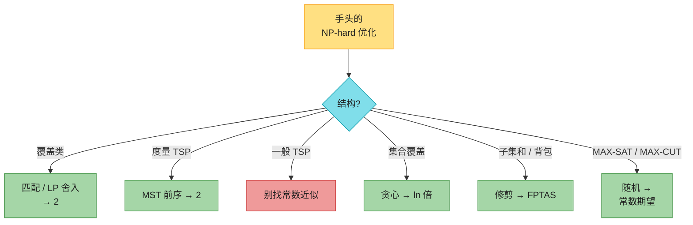

| 易混 | 澄清 |
|------|------|
| 近似比可以 $<1$ | 不会。定义取 $\max(C/C^*,C^*/C)$，恒 $\ge 1$ |
| PTAS $=$ FPTAS | PTAS 对固定 $\varepsilon$ 多项式即可，$O(n^{1/\varepsilon})$ 也算；FPTAS 还要 $\mathrm{poly}(1/\varepsilon)$ |
| 度量 TSP 和一般 TSP | 有三角不等式 → 2-近似；没有 → 空隙归约，常数比都不存在 |
| 把一般 TSP 加成度量 | 最优环集合可以不变，但比值被 $+nM$ 淹没，不矛盾 |
| 顶点覆盖 2-近似 vs 最高度贪心 | 两端都拿有证明；最高度启发式比值 $\Theta(\log n)$，不是 2 |
| 团的常数近似 | VC 的补是团 / 独立集，比值会从 $2k$ vs $k$ 变成 $(n-k)/(n-2k)$，可任意大（35.1-5） |
| 极大匹配 vs 最大匹配 | 近似只用极大；最大匹配更强，一般图也多项式但更慢（思考题 35-4：极大已经是最大匹配的 2-近似） |
| 集合覆盖 $\ln$ vs $H(d)$ | 第四版主定理用 $\lceil\ln |X|\rceil$；第三版 / 带权思考题用调和数 $H(\max|S|)$ |
| 伪多项式 vs FPTAS | $O(nt)$ 对值多项式、对位数指数；FPTAS 对位数和 $1/\varepsilon$ 都多项式 |
| LP 舍入的 $1/2$ | 来自 $x(u)+x(v)\ge 1$，不是随便取的阈值 |
| 随机近似的「比」 | 对**期望**成立；单次运行可能更差，可重复取最好 |

---

## 十、LeetCode 题单 + 习题快问快答

### 10.1 LeetCode 题单

定位语：**不考 PCP。考认「这是哪一种覆盖 / 旅行 / 子集和」，以及小 $n$ 状压、伪多项式 DP、MST 下界。**

| 题号 | 题目 | 难度 | 考点 |
|------|------|------|------|
| 1584 | 连接所有点的最小费用 | 中 | 平面 MST＝度量 TSP 2-近似的子程序 |
| 1135 | 最低成本连通所有城市 | 中 | Kruskal / Prim |
| 847 | 访问所有节点的最短路径 | 难 | 状压 TSP，$n\le 12$ |
| 943 | 最短超级串 | 难 | 状压 TSP |
| 980 | 不同路径 III | 难 | 网格哈密顿路，小图枚举 |
| 1125 | 最小必要团队 | 难 | 集合覆盖状压 |
| 416 | 分割等和子集 | 中 | 子集和伪多项式 |
| 494 | 目标和 | 中 | 子集和变形 |
| 1049 | 最后一块石头的重量 II | 中 | 划分 / 子集和 |
| 698 | 划分为 k 个相等的子集 | 中 | 划分 NPC，回溯 |
| 322 | 零钱兑换 | 中 | 完全背包，对照 FPTAS 思维 |
| 474 | 一和零 | 中 | 二维 0-1 背包 |
| 1723 | 完成所有工作的最短时间 | 难 | 平行机调度，下界 $\max(p_{\max},\mathrm{sum}/m)$ |
| 1986 | 完成所有任务的最少工作时段 | 中 | 装箱 / 调度状压 |
| 465 | 最优账单平衡 | 难 | 子集 DP |
| 435 | 无重叠区间 | 中 | 区间贪心（对照集合覆盖「没有贪心选择性质」） |
| 45 | 跳跃游戏 II | 中 | 另一种「下界 + 贪心」 |
| 621 | 任务调度器 | 中 | 调度下界 |
| 3180 | 执行操作可获得的最大总奖励 I | 中 | 子集和型 DP |

竞赛向：Christofides $3/2$、局部搜索 Lin–Kernighan、CP-SAT / 割平面做 TSP；集合覆盖的 $H(d)$ 原始对偶；PCP：团没有 $n^{1-\varepsilon}$ 近似、度量 TSP 没有 $123/122$ 之类过好的近似（除非 $P=NP$）。

### 10.2 习题快问快答（第四版编号）

- **35.1-1** Figure 35.1 自己就是：任意极大匹配大小都是 3，算法永远输出 6，最优 3。
- **35.1-2** 抓过的边互不相邻（端点边立刻删光）⇒ 匹配；剩下的边都被端点盖住 ⇒ 不能再加边 ⇒ 极大。
- **35.1-3** 最高度启发式不是 2-近似。标准族：二分图左侧度数均匀、右侧度数递减。一个具体数字：左 5 点（最优覆盖），右 11 点度数 $(5,4,4,3,2,2,1,1,1,1,1)$，贪心会把右侧拿光，$11/5>2$；放大后比值 $\Theta(\log n)$。
- **35.1-4** 树：DFS 后序，若孩子那边还有没盖的边就选当前点（选父不选叶）。$O(n)$，最优。
- **35.1-5** 不能。VC 的 2-近似给出大小 $\le 2k$ 的覆盖，$k=|C^*|$，独立集 $\ge n-2k$，最优独立集 $n-k$。比值 $(n-k)/(n-2k)$ 在 $k\approx n/2$ 时任意大。团 $=$ 补图独立集，同样没有常数近似（由此推出）。
- **35.2-1** 完全图 $n\ge 3$ 且三角不等式 $\Rightarrow$ 权非负。对第三点 $w$：$c(v,w)\le c(v,u)+c(u,w)\le 2c(u,v)+c(v,w)$，故 $c(u,v)\ge 0$。
- **35.2-2** 令 $c'(u,v)=c(u,v)+M$，$M>n\cdot\max c$。三角不等式成立，最优环集合不变。不推翻 35.3：近似比看的是数值，$nM$ 会把坏环也抬成「看起来只差 $1+o(1)$」。
- **35.2-3** 最近点插入：新点接到环上最近的点后面。可用「MST 两倍走访」同类短路证明 $\le 2$ 最优（插入代价不超过某棵生成树的两倍）。
- **35.2-4** 瓶颈 TSP（最小化环上最重边）：瓶颈 MST 的最重边 $\le$ 最优瓶颈环的最重边；在瓶颈树上全走访并最多跳过两个连续中间点，三角不等式给出 3-近似。
- **35.2-5** 欧氏最优环不相交：两弦相交则改成不交的两边，四边形严格更短，矛盾。
- **35.2-6** 假边权改成 $|V|^{c}\cdot|V|+1$，空隙超过 $|V|^{c}$。
- **35.3-1** 单词当字母集合，字典序破平：`thread → lost → drain → farid → shun`。
- **35.3-2** 顶点覆盖 $\le_P$ 集合覆盖：宇宙 $=$ 边集，每个点对应它的关联边集合。
- **35.3-3** 倒排表 + 按「还能盖几个」分桶，总时间 $O(\sum|S|)$。
- **35.3-4** 最优的每个集合最多 $|S|_{\max}$ 个元素，至少要 $\lceil|X|/\max|S|\rceil$ 个集合；贪心 $\le|X|$，弱界 $|\mathcal C|\le|\mathcal C^*|\max|S|$。
- **35.3-5** 构造 $n$ 个元素、$n$ 对「几乎一样大」的集合，每步 2 选 1，共 $2^{\Theta(n)}$ 种贪心输出。
- **35.4-1** 含子句 $x\lor\lnot x$ 则该子句恒真，概率 $1\ge 7/8$，期望只更好。
- **35.4-2** 长度 $\ge 1$ 的子句满足概率 $\ge 1/2$，随机 2-近似。
- **35.4-3** 每点独立进 $S$，边跨割概率 $1/2$，$\mathrm{E}=m/2$，最优 $\le m$。
- **35.4-4** 若某 $\bar x(v)>1$，降到 1：边约束仍成立（左边只变小但仍 $\ge 1$ 的那一端够），目标下降，与最优矛盾。
- **35.5-1** $P_i=P_{i-1}\cup(P_{i-1}+x_i)$。归并去重后切 $t$，得到 $\le t$ 的全部子集和，且有序。
- **35.5-2** 对 $i$ 归纳：修剪因子每步最多乘 $1+\varepsilon/(2n)$，故 $(1+\varepsilon/(2n))^i$ 内有代表。
- **35.5-3** $(1+\varepsilon/(2n))^n$ 对 $n$ 递增（或直接对 $\ln$ 求导 $>0$），极限 $e^{\varepsilon/2}$。
- **35.5-4** 改成「$\ge t$ 的最小子集和」：对称地切掉过小的值 / 对 $t'=\sum x_i-t$ 做 $\le$ 版本再补回去。
- **35.5-5** 每个和存一个前驱（从哪一个 $L_{i-1}$ 元素 $+\ x_i$ 来），回溯得子集。

### 10.3 思考题选

- **35-1 装箱**：判定最少箱数 NPC（子集和 / 划分）。$OPT\ge\lceil S\rceil$。First-Fit 至多一个箱子 $\le 1/2$ 满 $\Rightarrow$ 箱数 $\le\lceil 2S\rceil$，故 2-近似。实现：从左扫箱子，$O(n^2)$；或树状数组 / 平衡树找最左可行箱 $O(n\log n)$。
- **35-2 团的幂图**：$\omega(G^{(k)})=\omega(G)^k$。若团有常数比 $\rho$，对 $G^{(k)}$ 跑它再开 $k$ 次方，比变成 $\rho^{1/k}\to 1$，得到 PTAS。与 35.1-5 合起来：团没有常数近似（除非 $P=NP$），也就没有 PTAS。
- **35-3 带权集合覆盖**：每步选 $w(S)/$新盖元素数最小的，比值 $H(d)$，$d=\max|S|$。
- **35-4 一般图匹配**：极大不必最大（四条边的路径，中间那条是极大但不是最大）。贪心扫边 $O(E)$ 得极大匹配。最大匹配 $\ge$ 最小顶点覆盖的一半；极大匹配的端点是顶点覆盖 $\Rightarrow$ 极大是最大匹配的 2-近似。
- **35-5 平行机**：$C^*_{\max}\ge\max_k p_k$ 且 $\ge(\sum p_k)/m$。机器一空就派未完成作业：完成时间 $\le$ 平均负载 $+$ 最大件，故 2-近似。
- **35-6 最大生成树 2-近似**：每个点的最重关联边组成 $S_G\subseteq T_G$（最大生成树），且 $w(S_G)\ge w(T_G)/2$。扫一遍最重关联边即 $O(V+E)$。
- **35-7 0-1 背包 2-近似**：对「必须装 $j$、丢掉 $1..j-1$」的限制实例跑分数背包贪心，丢掉那一件分数物品，取 $n$ 个候选里价值最大者。分数最优至多一件分数，丢掉后仍 $\ge$ 一半。

### 10.4 章末注记

「近似值」古老（圆周率），**多项式时间近似算法**这个概念是 1970 年代的：Garey–Graham–Ullman、Johnson；常把第一个算法算在 Graham 头上。专著：Hochbaum、Vazirani、Williamson–Shmoys。

APPROX-VERTEX-COVER 归于 Gavril 与 Yannakakis。顶点覆盖的多项式近似比至今都至少 $2-o(1)$。APPROX-TSP-TOUR 是 Rosenkrantz–Stearns–Lewis。Christofides 把度量 TSP 推到 $3/2$。平面欧氏 TSP 有 PTAS（Arora，Mitchell）。一般 TSP 不可近似是 Sahni–Gonzalez。子集和 FPTAS 的原型是 Ibarra–Kim 的背包近似。MAX-3-CNF 随机算法已在 Johnson 1974 里。加权 VC 的 LP 舍入是 Hochbaum。把 LP 解读成概率再抽样，叫**随机舍入**（Raghavan–Thompson）。其它主线：原始-对偶、稀疏割、半定规划（Goemans–Williamson 的 MAX-CUT $0.878$）。PCP 定理给许多问题钉上了近似下界（第 34 章注记，Arora–Lund 综述）。

---

## 参考资料

- Cormen, T. H., Leiserson, C. E., Rivest, R. L., & Stein, C. (2022). *Introduction to Algorithms* (4th ed.). MIT Press. Chapter 35: Approximation Algorithms, pp. 1104–1136.
- Vazirani, V. V. *Approximation Algorithms*. Springer.
- Williamson, D. P., & Shmoys, D. B. *The Design of Approximation Algorithms*. Cambridge.
- Christofides, N. (1976). Worst-case analysis of a new heuristic for the travelling salesman problem.
- Arora, S. (1998). Polynomial time approximation schemes for Euclidean traveling salesman and other geometric problems.
