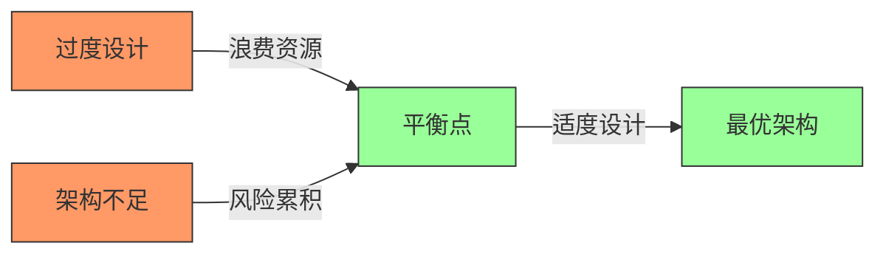
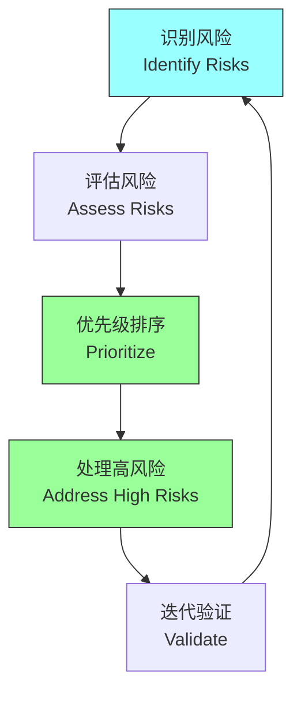
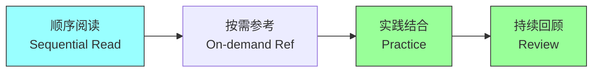

# 第一章：Introduction

## 一、架构的困境

### 1.1 过度设计的浪费

软件架构师常陷入过度设计的陷阱：

**复杂架构**：为不存在的问题设计复杂方案。**预测未来**：为可能永远不会发生的需求设计。**完美主义**：追求理论上完美而非实际需要的架构。**资源浪费**：浪费大量时间和金钱在不需要的功能上。

### 1.2 架构不足的风险

另一方面，架构不足同样危险：

**技术债务**：忽视架构导致技术债务累积。**维护困难**：代码难以理解和维护。**扩展受限**：系统无法适应业务增长。**故障频发**：系统不稳定，故障频发。

### 1.3 平衡的艺术

找到架构投入与产出之间的平衡点：

**适度设计**：设计刚好满足需求的架构。**风险管理**：将有限资源投入到高风险领域。**渐进演化**：随需求变化逐步演进架构。**价值导向**：每一项架构决策都要创造价值。

## 二、本书的核心理念

### 2.1 风险驱动方法

本书提倡风险驱动的架构方法：

**识别风险**：识别项目中最大的风险。**优先处理**：优先处理高风险领域。**适度设计**：风险越高，投入越多精力。**迭代验证**：通过迭代验证架构决策。

### 2.2 实用主义

架构应该是实用的：

**简单优先**：优先选择简单的解决方案。**实证验证**：用实验验证假设。**持续改进**：不断改进和优化架构。**团队协作**：架构是团队的工作。

### 2.3 敏捷整合

架构与敏捷开发方法整合：

**响应变化**：架构支持变化而非阻碍变化。**增量设计**：增量地发展架构。**反馈循环**：快速获取架构反馈。**持续集成**：架构决策与代码同步。

## 三、本书的结构

### 3.1 内容概览

本书涵盖的主题：

| 部分 | 章节 | 核心内容 |
|-----|------|---------|
| 基础篇 | 1-4章 | 架构定义、业务使命、功能需求 |
| 质量篇 | 5-6章 | 质量属性、系统暴露 |
| 设计篇 | 7-10章 | 概念架构、ADR、模块视图、COTS |
| 实践篇 | 11-16章 | 部署视图、风险驱动、敏捷架构 |

### 3.2 学习路径

使用本书的推荐方式：

**顺序阅读**：从头到尾完整阅读。**按需参考**：根据需要查阅相关章节。**实践结合**：将书中的方法应用到实际项目。**持续回顾**：在实践中不断回顾本书内容。

## 四、总结与启示

核心要点：架构设计需要平衡投入与产出。风险驱动方法帮助优化架构投入。实用主义是架构设计的核心原则。架构应该支持业务而非阻碍业务。

---

*本章精读笔记完成*
