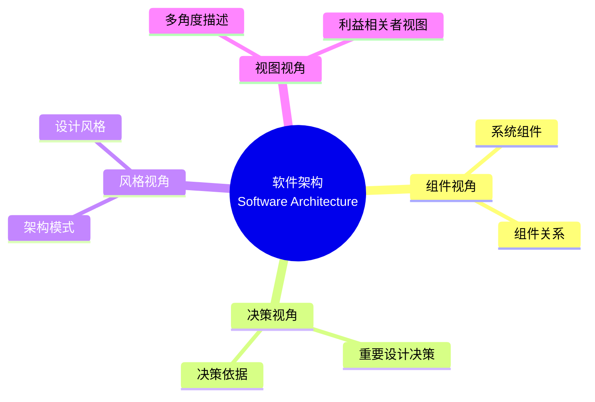
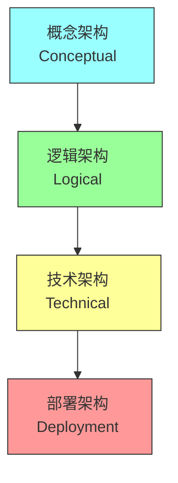
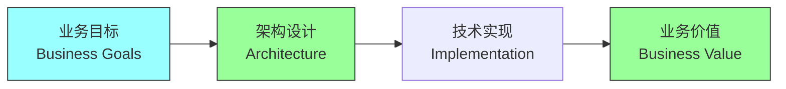
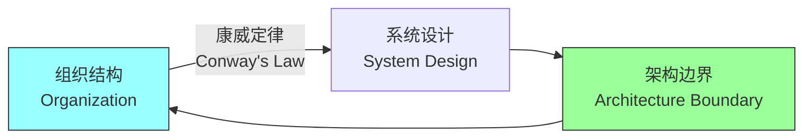
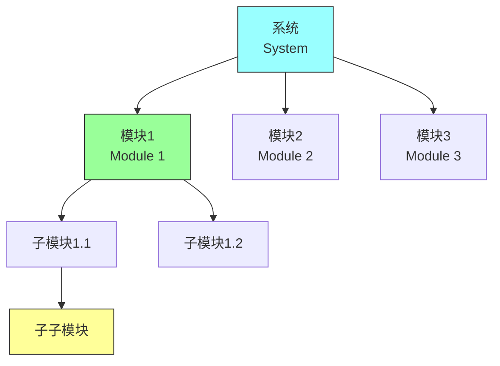
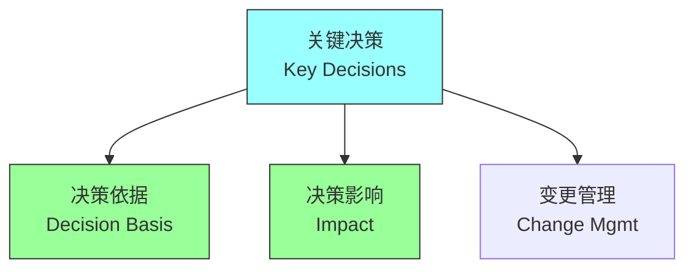
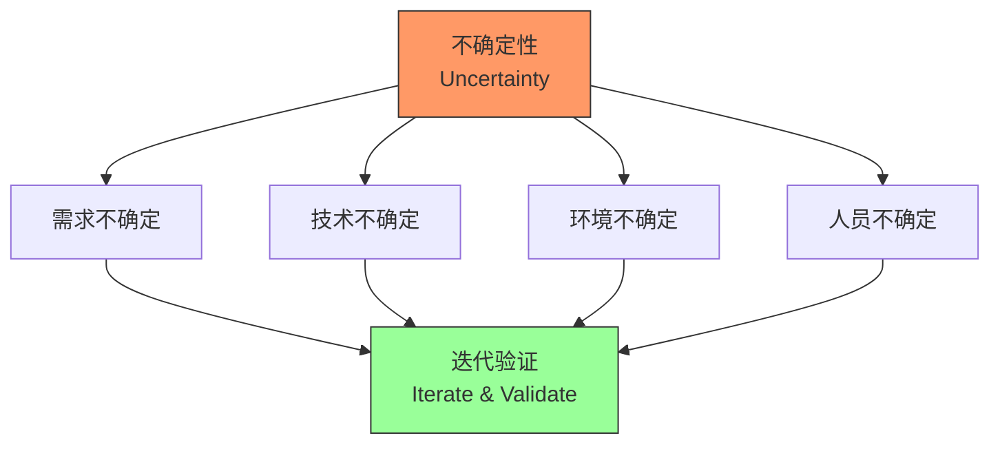

# 第二章：What Is Software Architecture?

## 一、软件架构的定义

### 1.1 多角度理解架构

软件架构有多种定义方式：

**组件视角**：系统组件及其关系的描述。**决策视角**：重要设计决策的集合。**风格视角**：架构模式的体现。**视图视角**：多角度的系统描述。

### 1.2 架构的层次

软件架构分为不同层次：

**概念架构**：系统的抽象描述，高层设计。**逻辑架构**：功能组织和模块划分。**技术架构**：技术选型和基础设施。**部署架构**：部署方式和运行环境。

### 1.3 架构的边界

明确架构的范围和边界：

**系统边界**：系统包含和不包含的内容。**技术边界**：技术栈的选择和限制。**组织边界**：团队和组织的影响。**时间边界**：架构适用的时间范围。

## 二、架构的重要性

### 2.1 架构与业务

架构如何支持业务目标：

**业务能力**：架构支持业务能力的实现。**时间价值**：架构影响产品上市时间。**成本控制**：架构影响开发和运维成本。**竞争优势**：架构可以成为竞争优势。

### 2.2 架构与技术

架构与技术的关系：

**技术选型**：架构决定技术选型。**技术债务**：不良架构导致技术债务。**技术演进**：架构需要适应技术演进。**创新空间**：架构为技术创新提供空间。

### 2.3 架构与组织

架构与组织结构的关联：

**康威定律**：系统设计反映组织结构。**团队边界**：架构边界与团队边界一致。**沟通效率**：架构影响团队沟通效率。**组织演化**：架构和组织共同演化。

## 三、架构的组成部分

### 3.1 模块结构

系统的模块化组织：

**模块划分**：将系统分解为模块。**模块关系**：模块之间的依赖关系。**模块接口**：模块间的接口定义。**模块责任**：每个模块的职责范围。

### 3.2 组件结构

运行时组件的组织：

**组件定义**：运行时组件的定义。**组件交互**：组件之间的通信方式。**组件部署**：组件的部署方式。**组件生命周期**：组件的生命周期管理。

### 3.3 决策结构

架构决策的组织：

**关键决策**：影响全局的重要决策。**决策依据**：每个决策的理由和约束。**决策影响**：决策对系统的影响。**决策变更**：决策变更的管理。

## 四、架构的挑战

### 4.1 复杂性挑战

处理系统复杂性：

| 复杂性类型 | 描述 | 应对策略 |
|-----------|------|---------|
| 规模复杂性 | 大型系统的复杂性 | 分层、模块化 |
| 技术复杂性 | 多种技术集成的复杂性 | 技术抽象、标准化 |
| 组织复杂性 | 多人协作的复杂性 | 清晰边界、沟通机制 |
| 时间复杂性 | 系统演化的复杂性 | 演进式设计 |

### 4.2 不确定性挑战

处理需求和技术的不确定性：

**需求不确定**：需求的变化和不确定性。**技术不确定**：技术的选择和演进。**环境不确定**：运行环境的变化。**人员不确定**：团队的变化。

### 4.3 权衡挑战

在多个目标之间权衡：

**功能与性能**：功能完整性和性能。**成本与质量**：开发成本和系统质量。**灵活与简单**：灵活性和简单性。**现在与未来**：当前需求和未来发展。

## 五、总结与启示

核心要点：软件架构是系统的高层设计决策集合。架构支持业务目标并影响技术选择。架构需要平衡多个目标并应对各种挑战。理解架构的本质有助于做出更好的设计决策。

---

*本章精读笔记完成*
