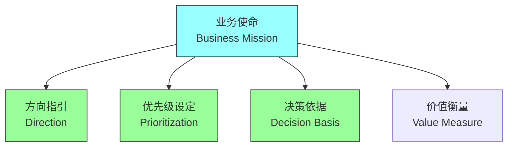
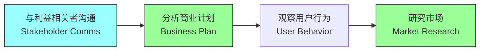
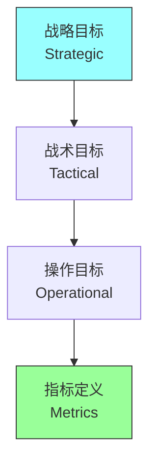
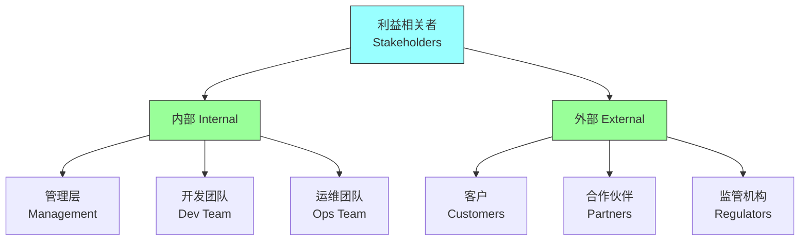
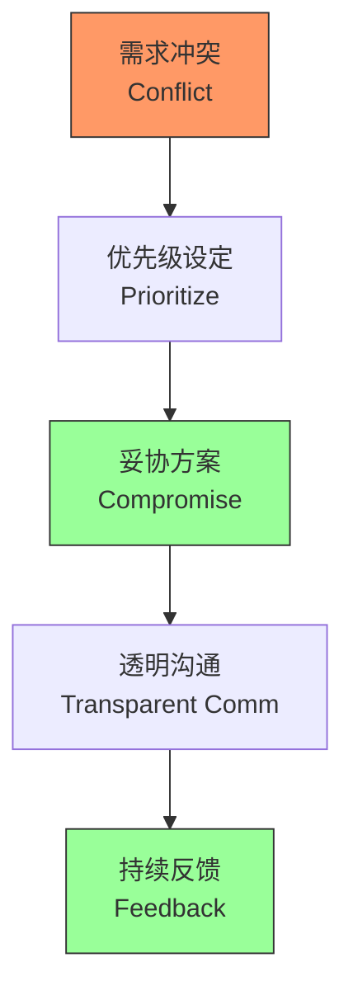

# 第三章：The Business Mission

## 一、理解业务使命

### 1.1 业务使命的重要性

架构师必须理解业务使命：

**方向指引**：业务使命指引架构方向。**优先级设定**：帮助设定功能优先级。**决策依据**：成为架构决策的依据。**价值衡量**：衡量架构价值的标准。

### 1.2 业务使命的要素

业务使命包含的关键要素：

**业务目标**：组织要达成的目标。**目标用户**：产品服务的目标用户。**核心价值**：产品提供的核心价值。**竞争优势**：区别于竞品的优势。

### 1.3 获取业务使命

如何获取和理解业务使命：

**与利益相关者沟通**：与业务负责人沟通。**分析商业计划**：研究组织的商业计划。**观察用户行为**：了解用户如何使用产品。**研究市场**：了解市场环境和趋势。

## 二、业务目标映射

### 2.1 目标分解

将业务目标分解为可操作的目标：

**战略目标**：长期战略方向。**战术目标**：短期执行目标。**操作目标**：日常运营目标。**指标定义**：为每个目标定义衡量指标。

### 2.2 目标优先级

确定业务目标的优先级：

| 评估维度 | 评估内容 | 权重 |
|---------|---------|------|
| 价值评估 | 目标对业务的贡献 | 高 |
| 风险评估 | 目标的风险程度 | 中 |
| 资源约束 | 可用资源的限制 | 中 |
| 时间约束 | 时间要求 | 低 |

### 2.3 目标追踪

追踪业务目标的实现：

**定期评估**：定期评估目标进展。**指标监控**：监控关键指标。**调整策略**：根据反馈调整策略。**报告进展**：向利益相关者报告。

## 三、利益相关者分析

### 3.1 识别利益相关者

识别所有利益相关者：

**内部利益相关者**：管理层、开发团队、运维团队。**外部利益相关者**：客户、合作伙伴、监管机构。**直接影响者**：直接受系统影响的人。**间接受影响者**：间接受系统影响的人。

### 3.2 理解需求

理解不同利益相关者的需求：

**用户需求**：最终用户的需求。**业务需求**：业务部门的需求。**技术需求**：技术团队的需求。**运维需求**：运维团队的需求。

### 3.3 平衡利益

在利益相关者之间平衡：

**优先级设定**：设定需求的优先级。**妥协方案**：寻找各方都能接受的方案。**透明沟通**：保持沟通透明。**持续反馈**：持续收集反馈。

## 四、业务约束

### 4.1 业务约束类型

业务带来的各种约束：

**时间约束**：项目的时间要求。**预算约束**：项目的预算限制。**资源约束**：可用资源的限制。**合规约束**：法规和合规要求。

### 4.2 约束影响分析

分析约束对架构的影响：

| 约束类型 | 对技术选型影响 | 对架构风格影响 |
|---------|--------------|--------------|
| 时间约束 | 选择成熟技术 | 简化架构 |
| 预算约束 | 选择低成本方案 | 减少冗余 |
| 资源约束 | 选择易维护技术 | 模块化设计 |
| 合规约束 | 选择合规技术 | 增加审计功能 |

### 4.3 约束管理

管理业务约束：

**约束记录**：记录所有约束。**约束沟通**：与团队沟通约束。**约束追踪**：追踪约束的变化。**约束缓解**：寻找缓解约束的方法。

## 五、总结与启示

核心要点：业务使命是架构的起点和归宿。理解业务目标并映射到技术实现。分析利益相关者的需求并寻求平衡。管理业务约束并寻找解决方案。

---

*本章精读笔记完成*
