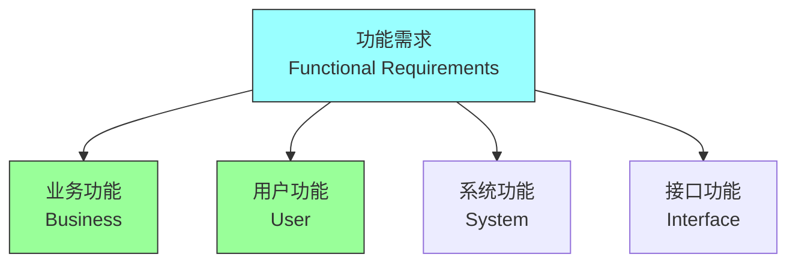
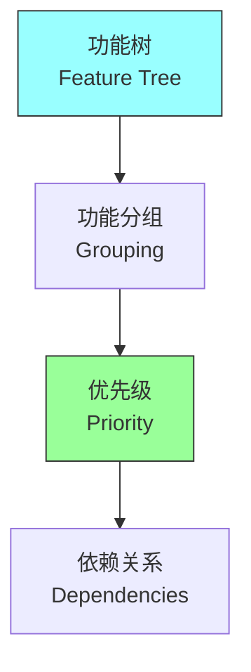
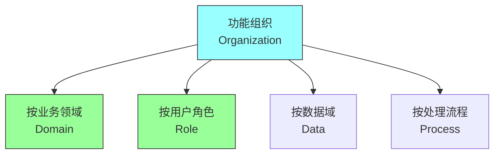
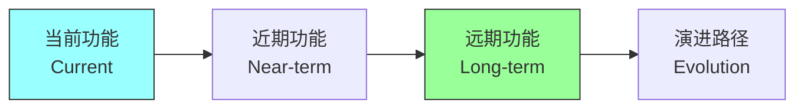
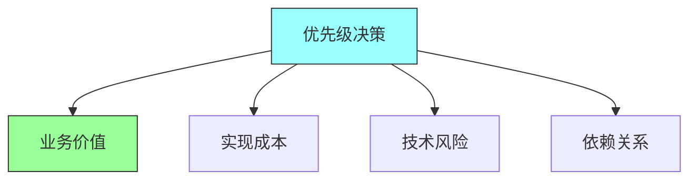

# 第四章：Functional Overview

## 一、功能需求分析

### 1.1 功能需求定义

功能需求描述系统应该做什么：



**业务功能**：支持业务活动的功能。**用户功能**：用户可以使用的功能。**系统功能**：系统内部的功能。**接口功能**：与其他系统交互的功能。

### 1.2 功能分解

将功能需求分解为可管理的部分：



**功能树**：建立功能层次结构。**功能分组**：将相关功能分组。**功能优先级**：为功能设定优先级。**功能依赖**：识别功能之间的依赖。

### 1.3 功能建模

使用模型描述功能：

**用例模型**：描述用户与系统的交互。**业务流程模型**：描述业务流程。**功能矩阵**：描述功能与模块的关系。**数据流图**：描述数据在系统中的流动。

## 二、功能架构

### 2.1 功能组织

组织系统功能的方式：



**按业务领域**：按业务领域组织功能。**按用户角色**：按用户角色组织功能。**按数据域**：按数据域组织功能。**按处理流程**：按处理流程组织功能。

### 2.2 功能边界

定义功能的边界：

**范围界定**：明确功能的范围。**接口定义**：定义功能间的接口。**职责划分**：划分功能的职责。**依赖管理**：管理功能间的依赖。

### 2.3 功能演进

规划功能的演进：



**当前功能**：当前需要实现的功能。**近期功能**：近期可能需要的功能。**远期功能**：未来可能需要的功能。**演进路径**：功能的演进路径。

## 三、用例建模

### 3.1 用例基础

用例是描述功能需求的重要方式：

**参与者**：与系统交互的角色。**用例**：参与者与系统的交互。**前置条件**：用例执行的前置条件。**后置条件**：用例执行的后置条件。

### 3.2 用例图

用图形化方式描述用例：

```mermaid
graph LR
    SUBGRAPH 系统边界
        U["用例1"] --> V["用例2"]
    END
    A["参与者"] --> U
    A --> V

    style SUBGRAPH fill:#f9f,stroke:#333
    style A fill:#9ff,stroke:#333
```

**系统边界**：系统的边界。**参与者**：参与者与系统的关系。**用例**：参与者触发的用例。**关系**：参与者和用例之间的关系。

### 3.3 用例详述

详细描述每个用例：

**基本流程**：用例的正常执行流程。**备选流程**：用例的可选执行路径。**异常流程**：用例的异常处理流程。**扩展点**：用例的扩展点。

## 四、功能优先级

### 4.1 优先级框架

为功能设定优先级的框架：

| 框架 | 描述 | 适用场景 |
|-----|------|---------|
| MoSCoW | Must、Should、Could、Won't | 需求优先级排序 |
| Kano | 基本、期望、兴奋需求 | 用户满意度 |
| 价值/成本 | 评估价值和成本 | 资源分配 |

**MoSCoW方法**：Must、Should、Could、Won't。**Kano模型**：基本需求、期望需求、兴奋需求。**价值与成本**：评估价值和成本。**风险与回报**：评估风险和回报。

### 4.2 优先级决策

做出优先级决策：



**业务价值**：功能对业务的贡献。**实现成本**：实现功能的成本。**技术风险**：功能的技术风险。**依赖关系**：功能之间的依赖。

### 4.3 优先级沟通

与团队沟通优先级：

**透明化**：保持优先级透明。**定期评审**：定期评审和调整。**变更管理**：管理优先级的变更。**共识建立**：建立团队共识。

## 五、总结与启示

核心要点：功能需求描述系统应该做什么。用例是描述功能需求的有效方式。功能优先级帮助聚焦重要功能。功能架构指导系统的模块划分。

---

*本章精读笔记完成*
