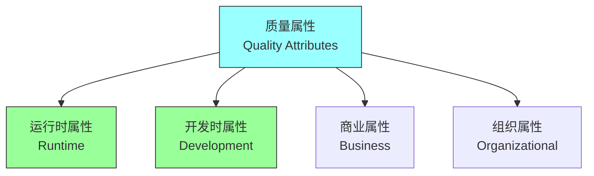
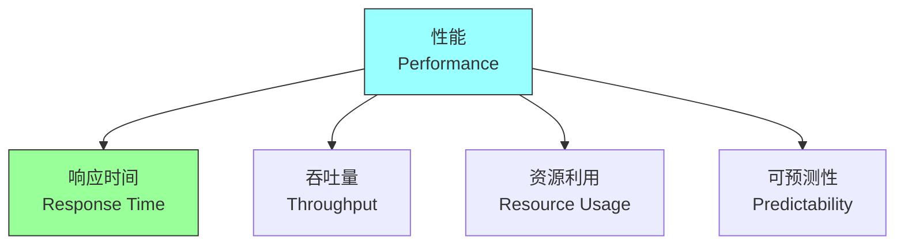
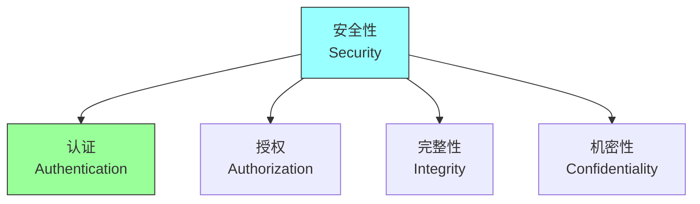
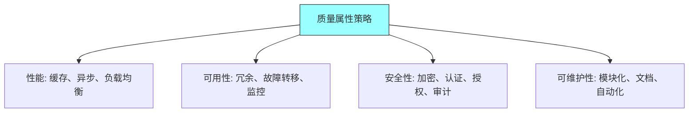
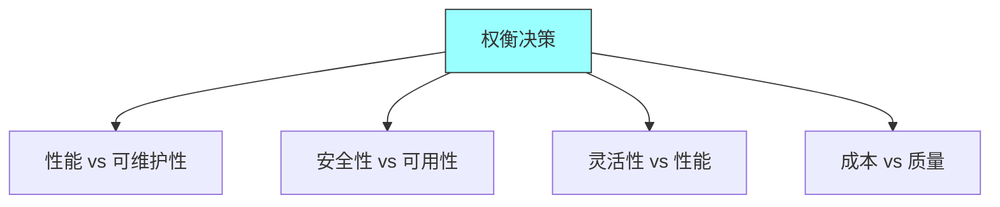

# 第五章：Quality Attributes

## 一、质量属性概述

### 1.1 质量属性定义

质量属性是系统非功能特性的描述：

**定义**：系统质量的量化或定性描述。**分类**：不同类别的质量属性。**度量**：质量属性的可度量性。**权衡**：质量属性之间的权衡。

### 1.2 质量属性重要性

为什么质量属性很重要：

**用户体验**：直接影响用户体验。**系统成功**：决定系统的成功与否。**维护成本**：影响长期维护成本。**竞争优势**：可以成为竞争优势。

### 1.3 质量属性分类

质量属性的分类：

**运行时属性**：性能、可用性、安全性等。**开发时属性**：可测试性、可维护性、可扩展性等。**商业属性**：成本、时间、风险等。**组织属性**：团队效率、组织适应性等。

## 二、关键质量属性

### 2.1 性能

系统性能的各个方面：

**响应时间**：系统响应请求的时间。**吞吐量**：系统处理请求的速率。**资源利用**：CPU、内存、带宽的利用。**可预测性**：性能的可预测程度。

### 2.2 可用性

系统可用的程度：

**正常运行时间**：系统正常运行的时间比例。**故障恢复**：从故障恢复的时间。**冗余设计**：冗余组件的数量。**降级能力**：部分故障时的降级能力。

### 2.3 安全性

系统安全的各个方面：

**认证**：验证用户身份。**授权**：控制用户访问权限。**完整性**：保护数据不被篡改。**机密性**：保护敏感数据。

### 2.4 可维护性

系统维护的容易程度：

**可理解性**：代码和设计的可理解性。**可修改性**：修改系统的容易程度。**可测试性**：测试系统的容易程度。**可重用性**：组件的可重用程度。

## 三、质量属性场景

### 3.1 场景定义

质量属性场景描述质量需求：

**刺激源**：触发场景的事件或动作。**刺激**：系统受到的刺激。**环境**：刺激发生的环境。**制品**：受影响的系统部分。**响应**：系统的响应。**响应度量**：评估响应的指标。

### 3.2 场景示例

各类质量属性的场景示例：

| 质量属性 | 场景示例 | 响应度量 |
|---------|---------|---------|
| 性能 | 高并发请求 | 响应时间 < 100ms |
| 可用性 | 节点故障 | 故障恢复 < 1min |
| 安全性 | 未授权访问 | 访问被阻止 |
| 可维护性 | 新功能添加 | 开发时间减少 |

**性能场景**：高并发请求的处理。**可用性场景**：节点故障的处理。**安全性场景**：未授权访问的阻止。**可维护性场景**：新功能的添加。

### 3.3 场景优先级

为质量属性场景设定优先级：

**业务影响**：场景对业务的影响。**发生概率**：场景发生的概率。**检测难度**：检测问题的难度。**修复成本**：修复问题的成本。

## 四、质量属性设计

### 4.1 设计策略

为质量属性设计策略：

**性能策略**：缓存、异步处理、负载均衡。**可用性策略**：冗余、故障转移、监控。**安全性策略**：加密、认证、授权、审计。**可维护性策略**：模块化、文档、自动化。

### 4.2 架构决策

架构决策如何影响质量属性：

**分层架构**：影响可维护性和灵活性。**微服务架构**：影响可扩展性和部署。**事件驱动架构**：影响响应性和解耦。**CQRS**：影响性能和可扩展性。

### 4.3 权衡决策

在质量属性之间权衡：

**性能与可维护性**：性能优化可能影响可维护性。**安全性与可用性**：安全措施可能影响可用性。**灵活性与性能**：灵活性可能影响性能。**成本与质量**：成本限制质量投入。

## 五、总结与启示

核心要点：质量属性是系统非功能特性的描述。关键质量属性包括性能、可用性、安全性等。质量属性场景帮助具体化质量需求。架构决策影响质量属性的实现。

---

*本章精读笔记完成*
