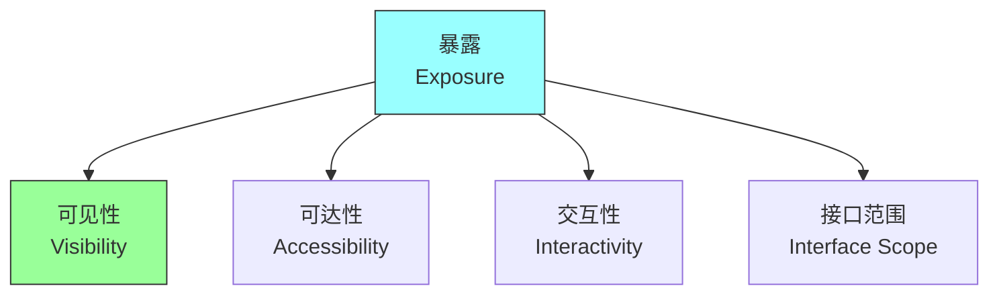
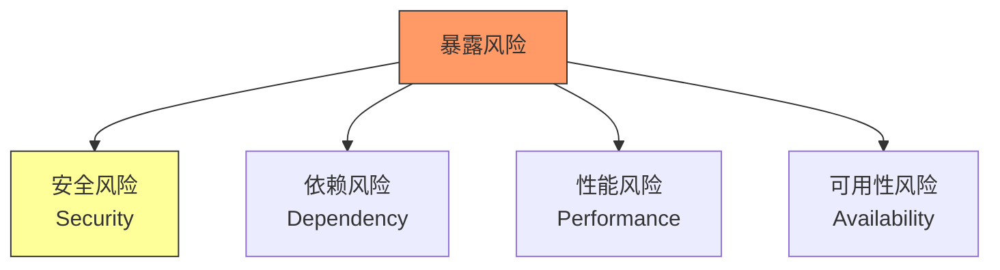
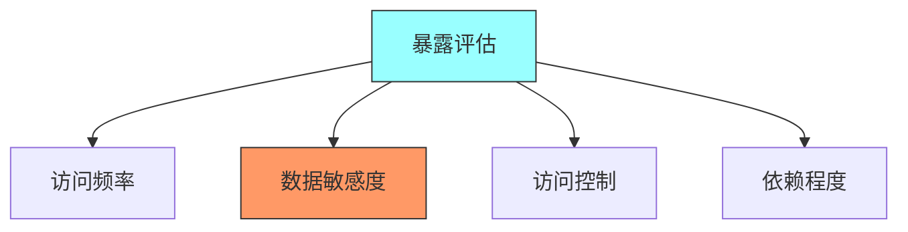
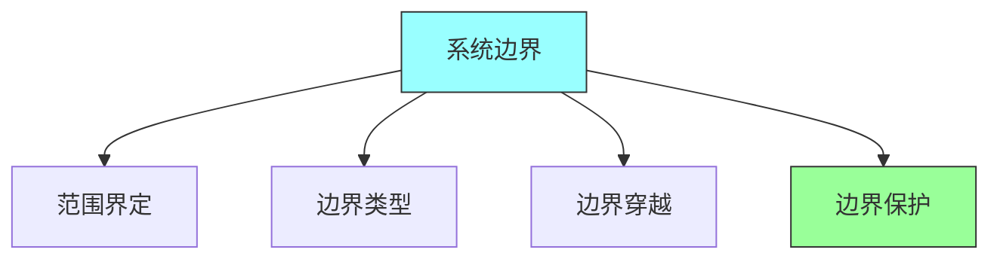
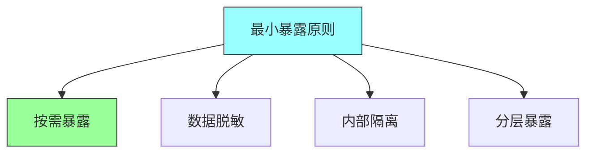

# 第六章：Exposure

## 一、系统暴露概念

### 1.1 暴露的定义

暴露描述系统对外可见和可访问的程度：

**定义**：系统对外提供接口的范围和方式。**可见性**：系统的可见程度。**可达性**：系统被访问的难易程度。**交互性**：系统与其他系统的交互程度。

### 1.2 暴露的类型

不同类型的系统暴露：

**用户暴露**：面向终端用户的暴露。**API暴露**：面向开发者的API暴露。**数据暴露**：数据对外提供的程度。**服务暴露**：微服务的暴露方式。

### 1.3 暴露的风险

系统暴露带来的风险：

**安全风险**：暴露增加攻击面。**依赖风险**：外部依赖的风险。**性能风险**：外部请求的性能影响。**可用性风险**：外部调用影响可用性。

## 二、暴露分析

### 2.1 暴露点识别

识别系统的暴露点：

**入口点**：系统接收外部请求的入口。**接口点**：系统对外提供的接口。**数据点**：系统对外提供的数据。**集成点**：系统与其他系统的集成点。

### 2.2 暴露评估

评估每个暴露点的风险：

**访问频率**：暴露点被访问的频率。**数据敏感度**：暴露数据的敏感程度。**访问控制**：暴露点的访问控制。**依赖程度**：暴露点的外部依赖。

### 2.3 暴露矩阵

使用矩阵管理暴露：

| 暴露点 | 风险等级 | 控制措施 | 监控策略 |
|-------|---------|---------|---------|
| API接口 | 高 | 认证、限流 | 请求日志 |
| 用户界面 | 中 | 会话管理 | 访问统计 |
| 数据导出 | 高 | 脱敏、审计 | 导出日志 |
| 内部服务 | 低 | 网络隔离 | 服务健康 |

**暴露点列表**：列出所有暴露点。**风险等级**：评估每个暴露点的风险。**控制措施**：为每个暴露点设计控制。**监控策略**：为每个暴露点设计监控。

## 三、边界设计

### 3.1 系统边界

定义系统的边界：

**范围界定**：明确系统的范围。**边界类型**：不同类型的系统边界。**边界穿越**：如何穿越系统边界。**边界保护**：如何保护系统边界。

### 3.2 接口设计

设计系统的对外接口：

**接口粒度**：接口的粗细程度。**接口风格**：REST、gRPC等风格。**接口版本**：接口版本管理。**接口文档**：接口文档规范。

### 3.3 访问控制

控制系统的访问：

**认证机制**：验证访问者身份。**授权机制**：控制访问权限。**流量控制**：限制访问频率。**审计日志**：记录访问日志。

## 四、暴露策略

### 4.1 最小暴露原则

遵循最小暴露原则：

**按需暴露**：只暴露必要的接口。**数据脱敏**：暴露数据时进行脱敏。**内部隔离**：内部服务不直接暴露。**分层暴露**：分层控制暴露程度。

### 4.2 分层暴露

设计分层暴露策略：

**外层暴露**：面向外部的暴露。**中层暴露**：面向合作伙伴的暴露。**内层暴露**：内部服务间暴露。**核心保护**：核心功能的保护。

### 4.3 暴露监控

监控系统的暴露：

**访问监控**：监控访问模式和频率。**异常检测**：检测异常访问。**性能监控**：监控暴露点的性能。**安全监控**：监控安全事件。

## 五、总结与启示

核心要点：暴露描述系统对外可见和可访问的程度。识别和管理系统的暴露点。设计合理的系统边界和接口。遵循最小暴露原则保护系统。

---

*本章精读笔记完成*
