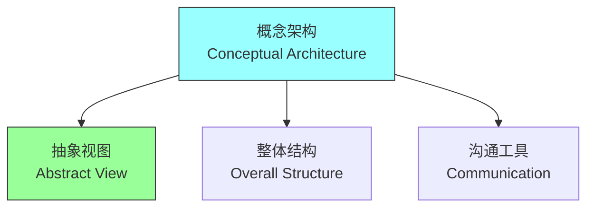
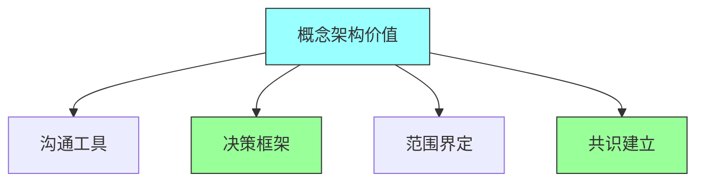
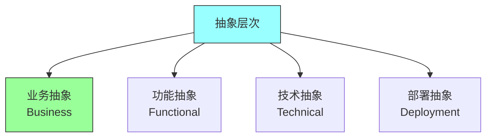
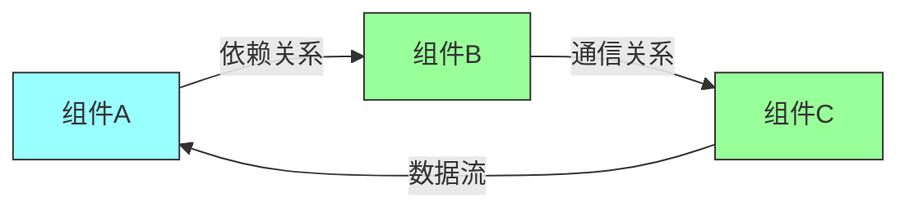
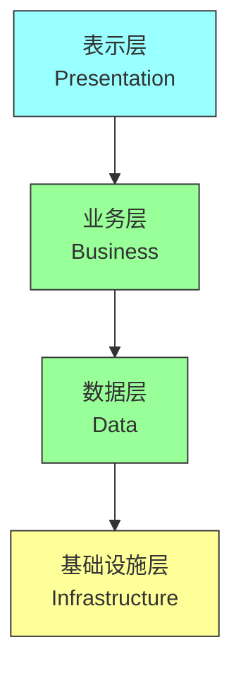
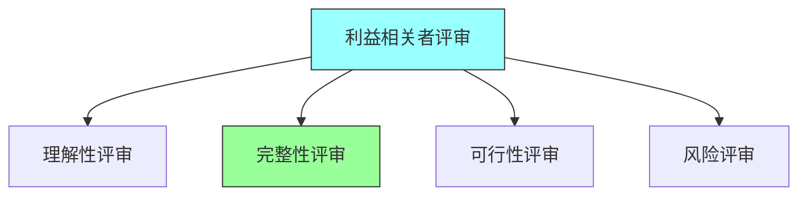
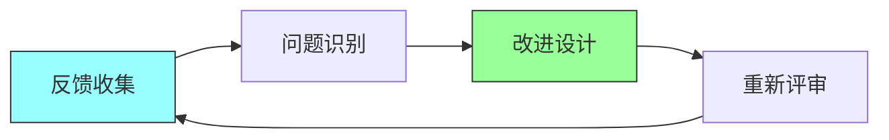

# 第七章：Conceptual Architecture

## 一、概念架构概述

### 1.1 概念架构定义

概念架构是系统的高层抽象描述：



**定义**：系统的抽象视图，忽略实现细节。**目的**：传达系统的整体结构。**受众**：面向技术和非技术人员。**层次**：最高层次的架构描述。

### 1.2 概念架构的价值

概念架构的重要价值：



**沟通工具**：帮助沟通架构意图。**决策框架**：为详细设计提供框架。**范围界定**：界定系统的范围。**共识建立**：建立团队共识。

### 1.3 概念架构内容

概念架构包含的内容：

**主要组件**：系统的主要组成部分。**组件关系**：组件之间的关系。**关键决策**：重要的架构决策。**设计原则**：指导架构的设计原则。

## 二、概念架构设计

### 2.1 抽象层次

在不同抽象层次上设计：



**业务抽象**：业务层面的抽象。**功能抽象**：功能层面的抽象。**技术抽象**：技术层面的抽象。**部署抽象**：部署层面的抽象。

### 2.2 组件识别

识别系统的关键组件：

**核心组件**：系统核心功能的组件。**支撑组件**：支持核心功能的组件。**外部组件**：系统依赖的外部组件。**组件边界**：组件的边界和职责。

### 2.3 关系建模

建模组件之间的关系：



**依赖关系**：组件之间的依赖。**通信关系**：组件之间的通信。**数据关系**：组件之间的数据流。**控制关系**：组件之间的控制流。

## 三、概念架构视图

### 3.1 盒子线图

使用盒子线图表示概念架构：

```mermaid
graph TD
    subgraph 系统
        A["组件1"] --> B["组件2"]
        A --> C["组件3"]
        B --> D["组件4"]
    end

    style subgraph fill:#f9f,stroke:#333
    style A fill:#9ff,stroke:#333
    style B fill:#9f9,stroke:#333
```

**盒子**：表示系统或组件。**线条**：表示组件之间的关系。**标签**：标注组件的名称和角色。**层次**：用嵌套盒子表示层次。

### 3.2 分层视图

使用分层视图表示架构：



**表示层**：用户界面层。**业务层**：业务逻辑层。**数据层**：数据访问层。**基础设施层**：技术基础设施层。

### 3.3 领域视图

使用领域视图表示架构：

**限界上下文**：领域的边界。**聚合**：领域聚合。**领域事件**：领域事件。**领域服务**：领域服务。

## 四、概念架构验证

### 4.1 利益相关者评审

与利益相关者评审概念架构：



**理解性评审**：确认利益相关者理解架构。**完整性评审**：确认架构覆盖所有需求。**可行性评审**：确认架构可行。**风险评审**：确认架构处理了风险。

### 4.2 场景验证

使用场景验证概念架构：

**关键场景**：验证关键业务场景。**异常场景**：验证异常处理。**性能场景**：验证性能需求。**安全场景**：验证安全需求。

### 4.3 迭代改进

根据反馈改进概念架构：



**反馈收集**：收集评审和验证的反馈。**问题识别**：识别架构的问题。**改进设计**：改进架构设计。**重新评审**：重新评审改进后的架构。

## 五、总结与启示

核心要点：概念架构是系统的高层抽象描述。概念架构帮助沟通和建立共识。盒子线图是常用的概念架构表示方式。概念架构需要通过评审和验证来完善。

---

*本章精读笔记完成*
