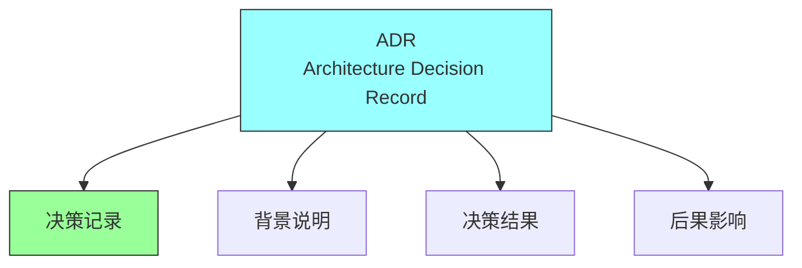
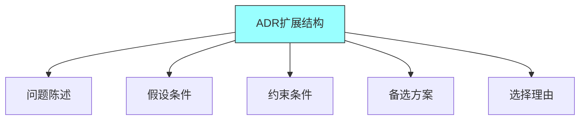
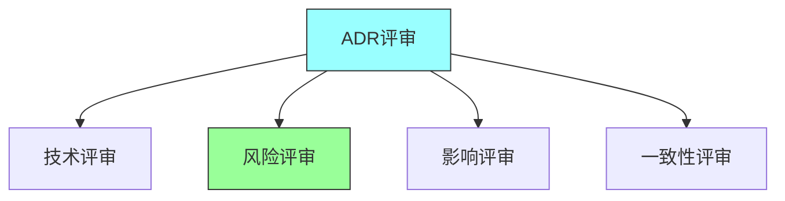

# 第八章：ADRs

## 一、架构决策记录

### 1.1 ADR定义

架构决策记录（ADR）是记录架构决策的文档：



**定义**：记录重要架构决策的文档。**目的**：记录决策的背景、原因和结果。**结构**：标准化的ADR结构。**生命周期**：ADR的创建、评审、更新过程。

### 1.2 ADR的价值

ADR在架构实践中的价值：

**知识管理**：保存架构知识。**沟通工具**：帮助团队理解决策。**变更追踪**：追踪架构决策的变更。**审计支持**：支持架构审计。

### 1.3 ADR与决策

ADR与架构决策的关系：


**决策记录**：记录每个重要决策。**决策上下文**：记录决策的背景。**决策原因**：记录决策的理由。**决策影响**：记录决策的影响。

## 二、ADR结构

### 2.1 标准结构

ADR的标准结构：

**标题**：简洁描述决策。**状态**：决策的状态（提议、接受、废弃等）。**上下文**：描述需要做决策的背景。**决策**：描述做出的决策。**后果**：描述决策的后果。

### 2.2 扩展结构

更详细的ADR结构：



**问题陈述**：要解决的问题。**假设**：做决策的假设条件。**约束**：做决策的约束条件。**备选方案**：考虑的备选方案。**选择理由**：选择该方案的理由。

### 2.3 ADR模板

标准化的ADR模板：

```markdown
# ADR-n: 决策标题

## 状态
[提议/接受/已废弃/被取代]

## 上下文
[描述需要做决策的背景]

## 决策
[描述做出的决策]

## 后果
[描述决策的后果]
```

## 三、ADR实践

### 3.1 ADR创建

创建ADR的最佳实践：

**及时记录**：做决策后及时记录。**完整记录**：记录完整的决策信息。**协作创建**：团队协作创建ADR。**编号管理**：使用一致的编号系统。

### 3.2 ADR评审

评审ADR的过程：



**技术评审**：评审决策的技术正确性。**风险评审**：评审决策的风险。**影响评审**：评审决策的影响。**一致性评审**：评审与其他决策的一致性。

### 3.3 ADR管理

管理ADR集合：

**版本控制**：将ADR纳入版本控制。**索引维护**：维护ADR的索引。**状态更新**：更新ADR的状态。**废弃处理**：正确处理废弃的ADR。

## 四、ADR应用场景

### 4.1 技术选型

使用ADR记录技术选型：

**问题定义**：定义要解决的技术问题。**选项评估**：评估不同的技术选项。**决策记录**：记录技术选型决策。**后续评估**：评估决策的效果。

### 4.2 架构模式

使用ADR记录架构模式选择：


**模式评估**：评估不同的架构模式。**上下文匹配**：匹配项目上下文。**决策记录**：记录模式选择决策。**实施指导**：提供实施指导。

### 4.3 变更管理

使用ADR管理架构变更：

**变更请求**：记录架构变更请求。**变更评估**：评估变更的影响。**变更决策**：记录变更决策。**变更实施**：指导变更的实施。

## 五、总结与启示

核心要点：ADR是记录重要架构决策的文档。ADR帮助管理架构知识和沟通。ADR应该有标准化的结构。ADR应该被纳入版本控制和管理。

---

*本章精读笔记完成*
