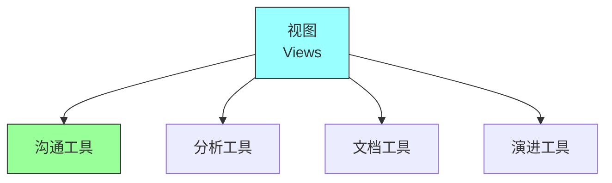
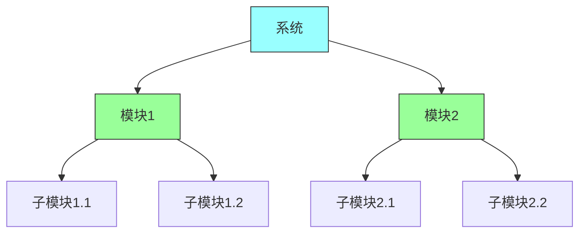
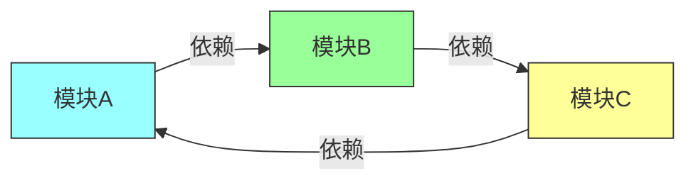
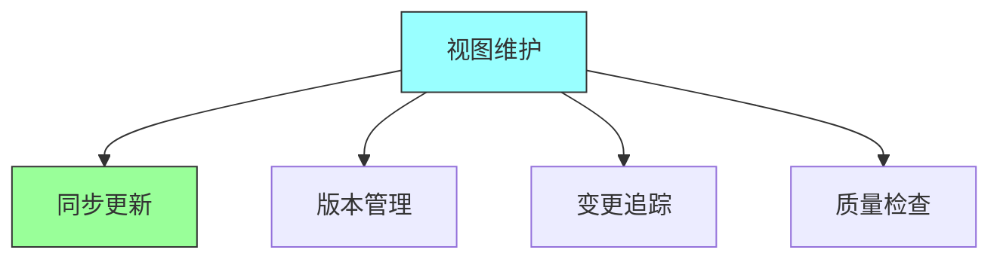

# 第九章：Module Views

## 一、模块视图概述

### 1.1 视图的概念

视图是从特定角度描述系统的文档：

**定义**：从特定角度描述系统的文档。**目的**：帮助不同受众理解系统。**类型**：不同类型的视图。**关系**：视图之间的关系。

### 1.2 模块视图

模块视图描述系统的静态结构：

**关注点**：关注系统的模块组成。**关系**：模块之间的静态关系。**依赖**：模块之间的依赖关系。**组织**：模块的组织方式。

### 1.3 视图的重要性

视图在架构文档中的重要性：

**沟通工具**：帮助团队沟通架构。**分析工具**：帮助分析系统结构。**文档工具**：记录系统架构。**演进工具**：支持架构演进。

## 二、模块视图类型

### 2.1 分解视图

展示系统的分解结构：

**顶层分解**：系统的顶层分解。**逐层分解**：逐层细分的分解。**叶子模块**：最底层的模块。**模块关系**：模块之间的包含关系。

### 2.2 依赖视图

展示模块之间的依赖关系：

**依赖方向**：依赖的方向。**依赖强度**：依赖的强度。**循环依赖**：循环依赖的检测。**依赖管理**：管理依赖关系。

### 2.3 泛化视图

展示模块之间的泛化关系：

**继承关系**：类或组件的继承。**接口实现**：接口的实现关系。**多态**：多态的使用。**抽象层级**：抽象层级的组织。

## 三、模块视图创建

### 3.1 模块识别

识别系统的模块：

**业务模块**：按业务划分的模块。**技术模块**：按技术划分的模块。**层次模块**：按层次划分的模块。**领域模块**：按领域划分的模块。

### 3.2 关系定义

定义模块之间的关系：

**依赖定义**：定义模块间的依赖。**接口定义**：定义模块间的接口。**通信定义**：定义模块间的通信。**数据流定义**：定义模块间的数据流。

### 3.3 视图绘制

绘制模块视图：

**工具选择**：选择合适的绘图工具。**符号规范**：使用一致的符号。**层次清晰**：保持视图层次清晰。**标注完整**：标注必要的信息。

## 四、模块视图实践

### 4.1 视图维护

维护模块视图：

**同步更新**：与代码同步更新视图。**版本管理**：管理视图的版本。**变更追踪**：追踪视图的变更。**质量检查**：检查视图的质量。

### 4.2 视图使用

使用模块视图：

**代码理解**：使用视图理解代码。**新人培训**：使用视图培训新人。**架构评审**：使用视图进行评审。**重构指导**：使用视图指导重构。

### 4.3 视图问题

处理模块视图的问题：

| 问题类型 | 描述 | 解决方案 |
|---------|------|---------|
| 视图过时 | 与代码不同步 | 定期更新 |
| 视图不一致 | 不同视图矛盾 | 统一标准 |
| 视图复杂 | 难以理解 | 简化分层 |
| 视图缺失 | 缺少关键视图 | 补充绘制 |

**视图过时**：处理过时的视图。**视图不一致**：处理不一致的视图。**视图复杂**：简化复杂的视图。**视图缺失**：补充缺失的视图。

## 五、总结与启示

核心要点：模块视图描述系统的静态结构。模块视图包括分解视图、依赖视图等。模块视图需要与代码同步维护。模块视图是架构沟通和分析的重要工具。

---

*本章精读笔记完成*
