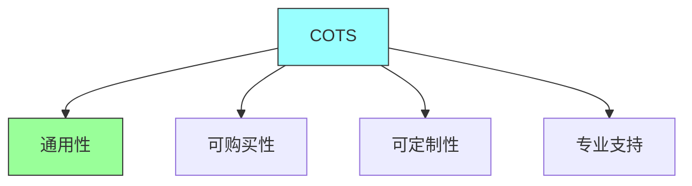
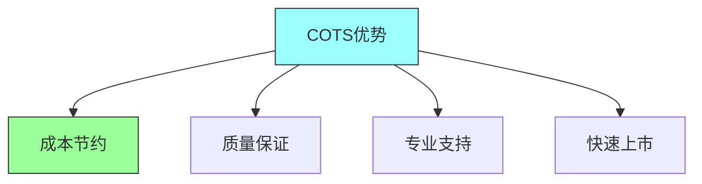
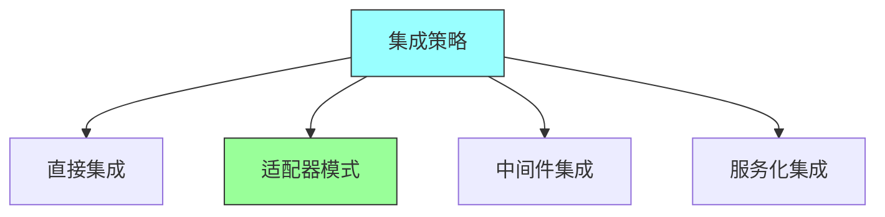
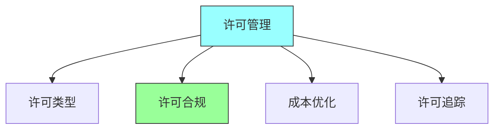

# 第十章：COTS

## 一、商业软件概述

### 1.1 COTS定义

商业现成软件（Commercial Off-The-Shelf）：

**定义**：可以购买而非自行开发的软件产品。**特点**：通用性、可购买性、可定制性。**类型**：数据库、中间件、工具等。**vs自研**：与自行开发软件的比较。

### 1.2 COTS的优势

使用COTS的好处：

**成本节约**：减少开发成本和时间。**质量保证**：产品经过测试和验证。**专业支持**：获得供应商支持。**快速上市**：加速产品上市时间。

### 1.3 COTS的风险

使用COTS的风险：

**供应商锁定**：被供应商绑定。**功能限制**：功能可能不符合需求。**定制困难**：定制可能困难或不可能。**持续成本**：许可和维护的持续成本。

## 二、COTS评估

### 2.1 评估标准

评估COTS产品的标准：

**功能匹配**：产品功能的匹配程度。**技术兼容性**：与现有技术的兼容性。**性能指标**：产品的性能指标。**可靠性**：产品的可靠性。

### 2.2 评估过程

COTS产品的评估过程：

**需求定义**：定义COTS需要满足的需求。**市场调研**：调研市场上的产品。**候选名单**：创建候选产品名单。**详细评估**：对候选产品进行详细评估。

### 2.3 评估方法

COTS产品的评估方法：

**POC验证**：通过POC验证产品。**参考调查**：调查现有用户。**专家评审**：邀请专家评审。**成本分析**：进行成本效益分析。

## 三、COTS集成

### 3.1 集成策略

COTS产品的集成策略：

**直接集成**：直接使用产品的接口。**适配器模式**：使用适配器集成。**中间件集成**：通过中间件集成。**服务化集成**：将产品封装为服务。

### 3.2 集成挑战

COTS集成的挑战：

| 挑战类型 | 描述 | 解决方案 |
|---------|------|---------|
| 接口不匹配 | 产品接口与需求不匹配 | 适配器模式 |
| 版本兼容 | 产品版本升级兼容问题 | 版本锁定 |
| 数据迁移 | 迁移到COTS产品的数据 | 数据迁移工具 |
| 定制维护 | 定制部分的维护 | 最小定制 |

**接口不匹配**：产品接口与需求不匹配。**版本兼容**：产品版本的兼容性。**数据迁移**：迁移到COTS产品的数据。**定制维护**：定制部分的维护。

### 3.3 集成最佳实践

COTS集成的最佳实践：

**最小定制**：尽量减少定制。**接口抽象**：对产品接口进行抽象。**版本管理**：管理产品的版本。**供应商关系**：维护良好的供应商关系。

## 四、COTS管理

### 4.1 许可管理

管理COTS软件的许可：

**许可类型**：理解不同的许可类型。**许可合规**：保持许可合规。**成本优化**：优化许可成本。**许可追踪**：追踪许可使用。

### 4.2 版本管理

管理COTS产品的版本：

**版本选择**：选择合适的版本。**升级策略**：制定升级策略。**兼容性测试**：测试版本兼容性。**回滚计划**：准备回滚计划。

### 4.3 供应商管理

管理COTS供应商关系：

**供应商评估**：评估供应商的能力。**合同管理**：管理采购合同。**技术支持**：管理技术支持。**风险监控**：监控供应商风险。

## 五、总结与启示

核心要点：COTS是可以购买而非自行开发的软件。评估COTS需要考虑功能、技术、成本等因素。集成COTS需要考虑接口兼容性和定制维护。管理COTS需要关注许可、版本和供应商关系。

---

*本章精读笔记完成*
