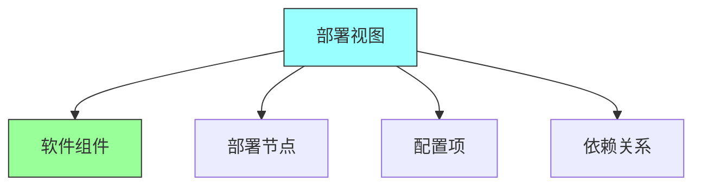
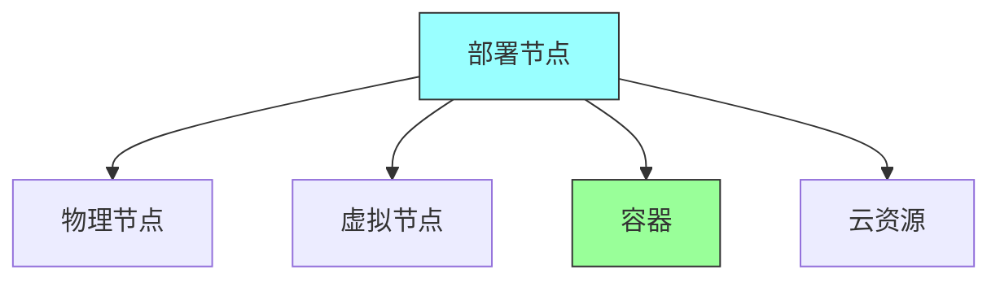
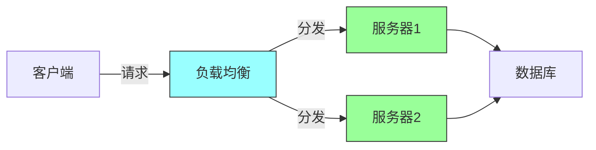
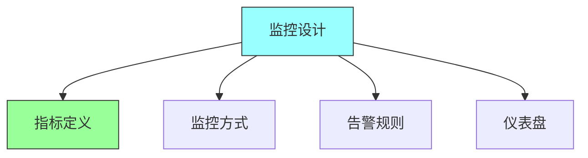
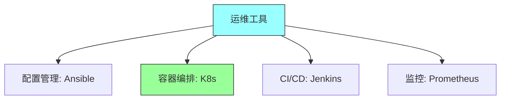

# 第十一章：Deployment and Operational Views

## 一、部署视图

### 1.1 部署视图定义

部署视图描述系统的部署结构：

**定义**：描述软件如何部署到硬件的视图。**目的**：帮助理解系统的部署方式。**内容**：包含部署组件、节点和关系。**受众**：运维团队、架构师。

### 1.2 部署组件

部署视图中的组件：

**软件组件**：需要部署的软件组件。**配置项**：部署相关的配置。**依赖项**：部署的依赖关系。**数据**：部署涉及的数据。

### 1.3 部署节点

部署视图中的节点：

**物理节点**：物理服务器。**虚拟节点**：虚拟机。**容器**：容器化部署。**云资源**：云服务资源。

## 二、部署模型

### 2.1 部署类型

不同的部署模型：

**单机部署**：所有组件部署到一台服务器。**集群部署**：组件部署到多个服务器。**分布式部署**：组件分布式部署。**云部署**：使用云服务部署。

### 2.2 部署拓扑

部署的拓扑结构：

**客户端-服务器**：经典的C/S结构。**多层架构**：多层部署结构。**微服务部署**：微服务的部署方式。**混合部署**：多种部署方式的组合。

### 2.3 部署策略

部署策略的选择：

| 策略 | 描述 | 适用场景 |
|-----|------|---------|
| 蓝绿部署 | 两套环境切换 | 无停机部署 |
| 金丝雀发布 | 逐步发布 | 降低发布风险 |
| 滚动部署 | 逐个更新 | 无停机更新 |
| 影子部署 | 流量测试 | 新功能验证 |

**蓝绿部署**：使用两套环境切换。**金丝雀发布**：逐步发布到部分用户。**滚动部署**：逐个更新实例。**影子部署**：使用生产流量测试。

## 三、运维视图

### 3.1 运维视图定义

运维视图描述系统的运维方式：

**定义**：描述系统如何被运维的视图。**关注点**：监控、日志、故障处理等。**自动化**：运维自动化的程度。**SLA**：服务级别协议。

### 3.2 监控设计

设计系统的监控：

**指标定义**：定义需要监控的指标。**监控方式**：选择监控工具和方法。**告警规则**：设置告警规则。**仪表盘**：设计监控仪表盘。

### 3.3 日志设计

设计系统的日志：

**日志级别**：定义日志级别。**日志格式**：标准化日志格式。**日志收集**：收集和聚合日志。**日志分析**：分析日志发现问题。

## 四、运维自动化

### 4.1 自动化范围

运维自动化的范围：

**部署自动化**：自动化部署过程。**配置管理**：自动化配置管理。**监控自动化**：自动化监控和告警。**故障恢复**：自动化故障恢复。

### 4.2 工具选择

选择运维自动化工具：

**配置管理**：Ansible、Puppet等。**容器编排**：Kubernetes、Docker Swarm。**CI/CD**：Jenkins、GitLab CI。**监控工具**：Prometheus、Grafana。

### 4.3 自动化实践

实施运维自动化的实践：

**基础设施即代码**：用代码管理基础设施。**声明式配置**：使用声明式配置。**幂等操作**：确保操作的幂等性。**持续改进**：持续改进自动化流程。

## 五、总结与启示

核心要点：部署视图描述系统的部署结构。运维视图描述系统的运维方式。部署和运维需要协调设计。自动化是现代运维的关键。

---

*本章精读笔记完成*
